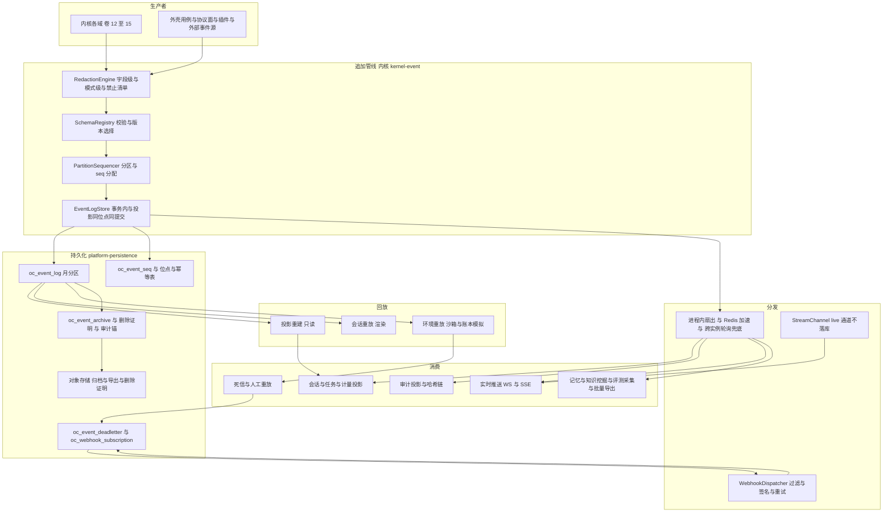
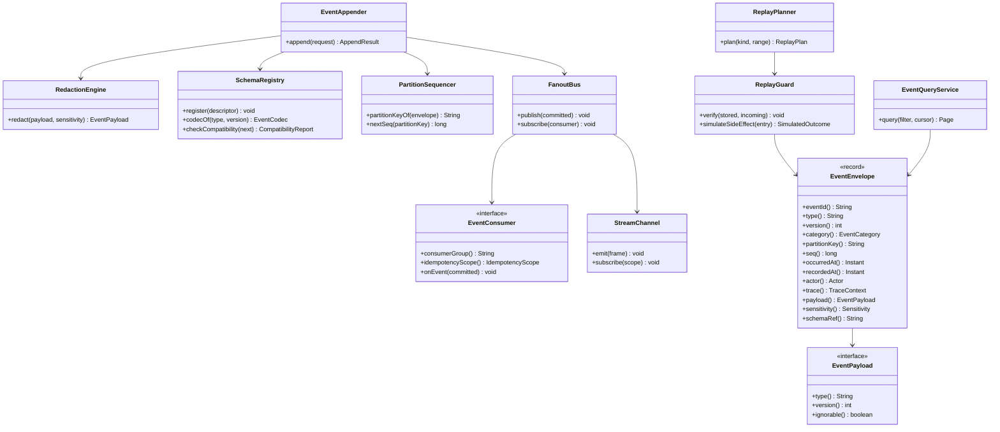
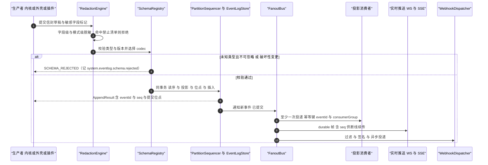
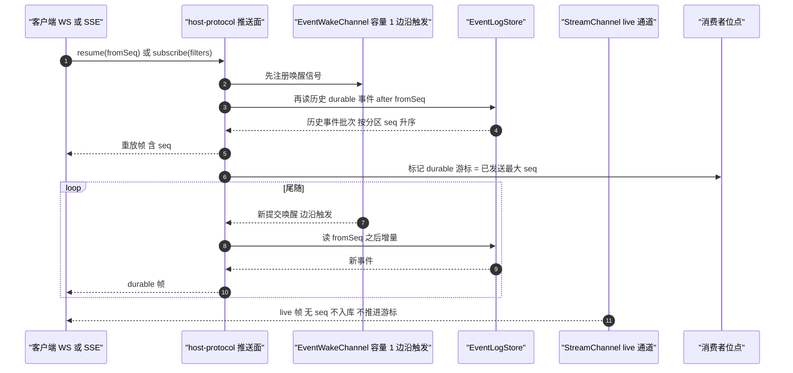
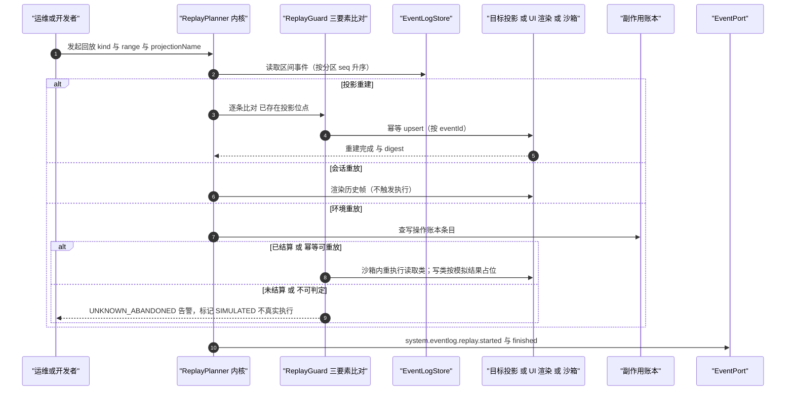
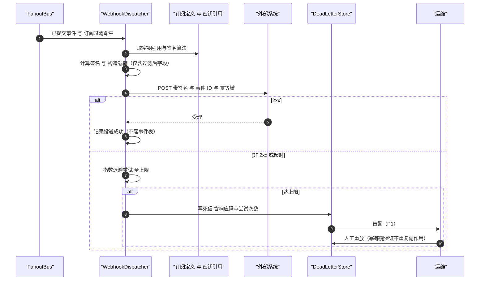
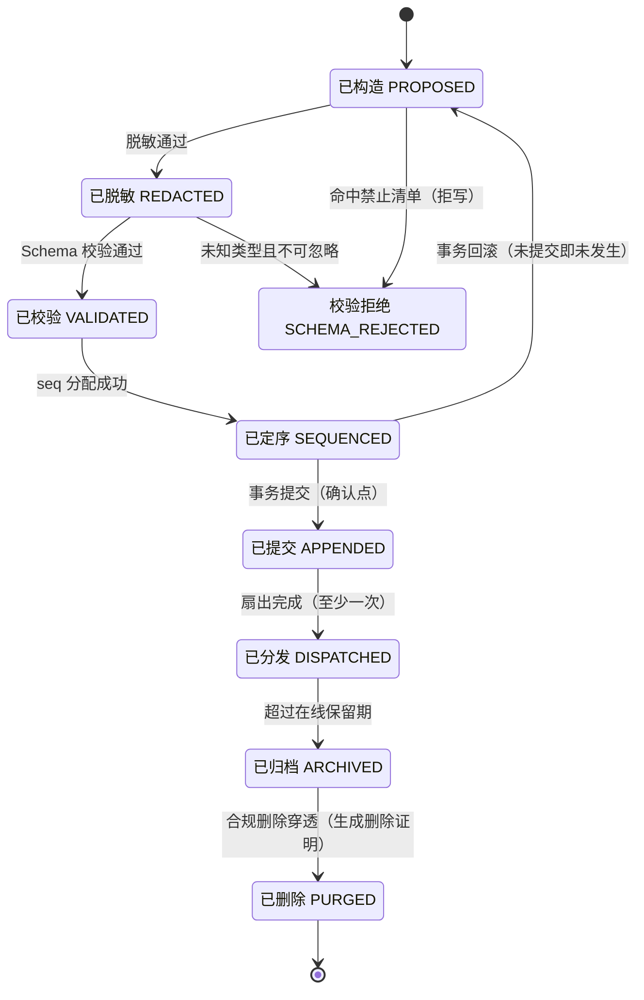
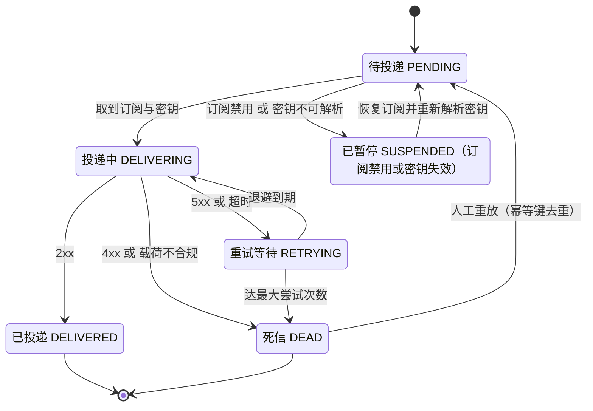

# 实现方案 16 · 全生命周期事件总线（Event Bus Implementation）

> 本文件是 Phase B 实现层方案，对应 Phase A 卷 16（`docs/harness/16-event-system.md`）的域内决策 D-EVT-1…11，
> 并落实研究台账 `research/LESSONS-AND-ADOPTIONS.md` 中落在本文件的六行采纳项 **L-024 / L-041 / L-051 / L-052 / L-074 / L-077**
> 与一条 Phase A 修订建议（D-EVT-4 / D-EVT-7 补两条不变量与一条门禁，见 §⑩.11）。
>
> 上游契约不可修改：凡与卷 16 表述冲突之处，本文件只记录「反驳证据 + 建议修订」，不改 Phase A 卷册。
> 证据标记沿用 `00-research-plan.md` §2：`[E1]` 源码｜`[E2]` 官方文档｜`[E3]` 第三方｜`[E4]` 推断。
> 实现落点：`harness-contract/.../contract/event`（信封与 Schema 目录，零依赖）＋ `harness-kernel/kernel-event`（模型、序列、脱敏规则、回放判定，零框架）
> ＋ `harness-platform/platform-persistence`（日志存储、位点、死信、归档）＋ `harness-platform/platform-runtime-store`（唤醒与广播）
> ＋ `harness-host/host-protocol`（WS/SSE 推送与查询 API）＋ `harness-host/host-app`（订阅者装配）。

---

## ① 实现目标与范围

### 1.1 本组件解决什么

把「一切皆事件」落成**可机械校验的基础设施**：所有状态变更、决策、计量与审计都从同一条事件流派生，
并且这条流满足四个硬性质：

1. **可重建**：任何进入模型请求的内容都必须能由事件流重建（「模型可见即可重建」，对齐 DeepSeek 的运行时不变式 [E1]）；
2. **不破坏旧读者**：Schema 演进只增不改、未知字段忽略、`ignorable` 显式声明影响面，已发布枚举 code 永不重编号（L-052 [E1]）；
3. **回放不重复副作用**：三类回放（投影重建 / 会话重放 / 环境重放）与审计重放严格分离，环境重放的写操作按账本模拟或重定向到临时工作区；
4. **事实源唯一**：追加确认是「进展」的唯一判定点，投影与读模型全部可丢弃重建，历史事件永不原地改写。

同时提供四条稳定的能力面：分区有序的追加、至少一次的分发（含 Webhook 与批量导出）、断线续传的实时推送、分类留存与合规删除。

### 1.2 与 Phase A 的对应关系

| Phase A 决策 | 本文件落实位置 |
| --- | --- |
| D-EVT-1 三类事件（领域/系统/遥测） | §③ D-EVI-9、§⑤ `EventCategory`、§⑧.1 `category` 列与差异化策略 |
| D-EVT-2 Schema Registry + 版本 + 兼容校验 | §③ D-EVI-4/5、§⑤ `SchemaRegistry`、§⑨.3 registry 配置、§⑪.1 门禁用例 |
| D-EVT-3 双阶段总线（追加日志 + 快速分发 + 跨实例/外部） | §③ D-EVI-1/2、§④ 架构、§⑥.1 时序 |
| D-EVT-4 至少一次 + 消费者幂等 + 位点 | §⑤ `EventConsumer`、§⑧.1 `oc_consumer_offset` / `oc_consumer_idempotency` |
| D-EVT-5 分区有序（会话/团队/计划为键） | §③ D-EVI-3、§⑤ `PartitionSequencer`、§⑥.1 |
| D-EVT-6 四类订阅（内部/插件/Webhook/导出） | §④ 架构、§⑨.1 `event.subscribe`、§⑨.4 SPI |
| D-EVT-7 三类回放 + 审计重放 | §③ D-EVI-6、§⑥.3 时序、§⑦.1 状态机、§⑩.4 隔离协议 |
| D-EVT-8 分类留存 + 冷归档 + 合规穿透删除 | §⑧.1 表与保留列、§⑨.2 归档与删除端点、§⑩.6 |
| D-EVT-9 写入前脱敏 + 信封加密 + 敏感度分级 | §③ D-EVI-7、§⑤ `RedactionEngine`、§⑥.1 |
| D-EVT-10 trace/span 贯穿与互查 | §⑤ `TraceContext`、§⑧.3 追踪联动、§⑩.8 |
| D-EVT-11 三种出口（Webhook/批量/查询 API） | §⑨.1/9.2、§⑥.4 死信与重试；H-006 追加日志 + 投影见 §⑩.1「追加确认即提交点」与 §⑩.4「投影可丢弃重建」 |
| 卷 19 数据分域（事件日志第一类）与卷 28 D-DIST-6 遥测默认关 + 三级同意 | §⑧.1 分区与归档、§⑩.9 与迁移协作；§③ D-EVI-8、§⑨.3 `TelemetryProperties`、§⑩.6 egress 清单 |

### 1.3 本组件不解决什么

- **不解决**各域语义：事件类型由各卷定义并在本系统登记，本系统只保证信封、顺序、投递与留存语义。
- **不解决**指标看板与告警路由（卷 24/28）：本系统只产出指标与元事件。
- **不解决**存储引擎自身的高可用（卷 19/32）：分区滚动、备份、PITR 属持久化域。
- **不解决**权限判定（卷 06）与审计判定（卷 24）：查询权限点由企业域提供、本系统只做「按敏感度与租户隔离」的强制过滤；审计侧只保证不可篡改属性（哈希链）与归档，不定义「什么算合规」。

### 1.4 上下游依赖

| 方向 | 依赖对象 | 接口 |
| --- | --- | --- |
| 上游（生产者） | 内核各域（卷 12/13/14/15）、外壳用例、插件、外部事件源 | `EventProducerSPI` / `EventAppender.append(request)` |
| 上游 | 脱敏与 Schema 目录（本系统自带）；时钟与租约 | `RedactionEngine` / `SchemaRegistry`；`ClockPort`（`recordedAt` 与 seq 分配依赖注入时钟）、`LeasePort`（归档/重建互斥） |
| 下游（消费者） | 投影（会话/任务/计量/审计）、实时推送、记忆与知识挖掘、评测采集 | `EventConsumerSPI` / `ProjectionSPI`，位点持久化在 `oc_consumer_offset` |
| 下游 | 外部系统与运维（卷 32） | Webhook（签名 + 重试 + 死信）、批量导出（Parquet/JSONL 到对象存储/数据湖）、查询 API；消费者滞后、死信明细、归档与删除证明、回放任务状态 |

### 1.5 模块落点

```text
harness-contract/.../contract/event/       record EventEnvelope/EventTypeDescriptor/StreamFrame；枚举 EventCategory/Sensitivity/ActorType/ReplayKind/ConsumerState；SPI EventProducerSPI/EventConsumerSPI/ProjectionSPI/RedactionRuleSPI/EventExportSinkSPI/ReplayPolicySPI
harness-kernel/kernel-event/.../event/     model/ EventEnvelopeFactory、PartitionKey；seq/ PartitionSequencer；schema/ EventCodecRegistry、CompatibilityChecker；redact/ RedactionEngine、SecretPatterns；replay/ ReplayPlanner、ReplayGuard、LedgerSimulator；stream/ StreamChannel（live-only 边界）
harness-platform/platform-persistence/...  eventlog/ EventLogJdbcStore、EventSeqAllocator、ConsumerOffsetStore、IdempotencyStore；deadletter/ DeadLetterStore；archive/ EventArchiver、PurgeProofStore、AuditAnchorStore；query/ EventQueryRepository
harness-platform/platform-runtime-store/...            EventWakeChannel（边沿触发）、EventFanoutRedis（pub/sub）、ConsumerLagCache
harness-host/host-protocol/...                          event.* JSON-RPC、WS durable/live 双通道、管理面 REST
harness-host/host-app/...                               SubscriptionRegistrar（消费者与投影装配）、WebhookDispatcher
```

**分层纪律**：`kernel-event` 不依赖 Spring / JDBC / Redis / Jackson 之外的序列化库（只依赖契约层 codec 接口，卷 27 R1）；
存储与广播全部经端口注入，内核可用内存实现单测（含「先订阅后重放」）。
**Spring 装配点**：`platform-persistence` 提供 `@Transactional(rollbackFor = Exception.class)` 的追加适配器（事务内同时完成 seq 分配、
投影写入、位点推进与事件插入）；`host-bootstrap` 以显式装配计划注入；配置类为纯数据类（不加 `@Component`），由 `@ConfigurationPropertiesScan` 激活。

### 落地核对（R07：模块 / 顺序 / 批次 / 门禁 / I-* 落点）

- **模块（卷 27 §4.1 权威名，全路径）**：`harness-contract`（`contract/event` 信封与 Schema 定义）+ `harness-kernel/kernel-event`（`model/seq/schema/redact/replay/stream`）+ `harness-platform/platform-persistence`（`eventlog/deadletter/archive/query`）+ `harness-platform/platform-runtime-store`（Redis 广播与唤醒）+ `harness-host/host-app`（订阅装配与 Webhook）+ `harness-host/host-protocol`（双通道推送）。目录树已按目标名书写。
- **实施顺序（卷 27 §4.5）**：**第 2 步**「事件信封 + 写入端口 + 内存实现」——全序列的最早集成点（除第 1 步契约骨架外）；第 9 步（持久化）补齐 durable 存储、位点、死信与归档。**与 impl/01 的互依赖以契约为界**：`EventEnvelope`/`EventAppenderPort` 定义在 `harness-contract`，`kernel-event` 提供纯实现，`kernel-agent`（01/12）只消费端口 → 无循环依赖；两者的 DoD 可并行（内存实现先行）。
- **数据批次（卷 27 §4.4）**：`oc_event_log`、`oc_projection_state`、`oc_consumer_offset`、`oc_consumer_idempotency`、`oc_event_producer_idempotency`、`oc_event_seq`、`oc_event_deadletter`、`oc_event_archive`、`oc_event_purge_proof`、`oc_webhook_subscription` → **B1**（事件日志分区表；本层是 B1 的定义性批次之一）；`oc_audit_anchor` → **B3**（审计锚点，随权限/审计批次）。
- **门禁映射（卷 27 §4.6）**：kernel-event 单测与 Schema golden → 「单元测试 + 覆盖率门」+「契约测试（事件 Schema）」；存储/位点/死信/归档 → 「集成测试」；`event-gate.sh`（双通道 + 先订阅后重放 + 三类回放 + 密钥扫描 + egress 断言）→ 「契约测试」+「安全红队」+「性能基准（抽样）」。
- **I-* 落点**：I-EVT-1 → `platform-persistence`（`EventLogJdbcStore` 月分区 + `EventArchiver`）；I-EVT-2 → `platform-runtime-store`（`EventFanoutRedis`/`EventWakeChannel`）+ `kernel-event`（进程内层 + 轮询兜底）；I-EVT-3 → `kernel-event`（`PartitionSequencer`）+ `platform-persistence`（`EventSeqAllocator` 同事务）；I-EVT-4 → `harness-contract`（Schema 目录）+ CI「事件 Schema」门（`scripts/ci`）；I-EVT-5 → `kernel-event`（`CompatibilityChecker`）+ `harness-contract`（`ignorable` 标记）；I-EVT-6 → `kernel-event`（`ReplayPlanner`/`ReplayGuard`/`LedgerSimulator`）；I-EVT-7 → `kernel-event`（`RedactionEngine` + `SecretPatterns`）+ 写入前同步落 `platform-persistence`；I-EVT-8 → `platform-enterprise`（同意记录与 egress 清单）+ `host-protocol`（遥测开关面）；I-EVT-9 → `platform-persistence`（位点与幂等键）+ `kernel-event`（保留期清理策略）。

---

## ② 功能需求清单（REQ-EVT-n）

| REQ | 需求描述 | 来源 | 优先级 | 验收要点 |
| --- | --- | --- | --- | --- |
| REQ-EVT-01 | 事件信封全字段落地（`eventId` UUIDv7、`type`、`version`、`category`、`tenantId`、`projectId`、`partitionKey`、`seq`、`occurredAt`、`recordedAt`、`actor`、`traceId/spanId/parentSpanId`、`correlationId`、`payload`、`sensitivity`、`schemaRef`） | 卷 16 §4.1 | P0 | 缺任一必填字段在写入前拒绝（fail-fast）；`eventId` 时间序单调可用于排序兜底 |
| REQ-EVT-02 | 三类事件差异化策略：领域（持久可回放可审计）/ 系统（持久可审计）/ 遥测（采样、可聚合、短保留） | 卷 16 §3 D-EVT-1 | P0 | 三类各自的保留期、加密、采样与订阅过滤独立可配并有用例 |
| REQ-EVT-03 | 命名规范 `<域>.<对象>.<动作>` + 事件目录（由 Schema 目录生成，CI 校验 freshness） | 卷 16 §4.2；研究台账 L-014 生成式目录 + 漂移门禁（`04-deepseek-harness.md` §8 L14 `[E1]`） | P0 | 目录与代码不一致即 CI 失败；非法命名在登记期拒绝 |
| REQ-EVT-04 | Schema Registry + 语义化版本 + CI 兼容性校验；破坏性变更被机械拒绝 | 卷 16 §3 D-EVT-2 | P0 | 破坏性变更（删字段/改类型/改语义）在 CI 被拒并给出替代方案提示 |
| REQ-EVT-05 | **兼容纪律**：已发布事件 code 与枚举 code 永不重编号、只增不改；新增字段必须可选且有默认；`ignorable` 布尔显式声明「旧读者可安全忽略」 | 研究台账 L-052 `[E1]`（`05 §8 M13` compat/v1 + `06 §6-8`）；DeepSeek 声明合并扩展 `SessionEventMap` 与 `SESSION_FORMAT_VERSION` 版本命名不可变文件 [E1]（`04-deepseek-harness.md` §4.12/§4.13） | P0 | wire 标签固定化测试（golden 文件）覆盖全部已发布类型；重编号在 Registry 门禁被拒 |
| REQ-EVT-06 | **compat 读取器**：按 `version` 选择编解码器，旧版本事件可被新读者解析，新版本事件对旧读者按 `ignorable` 决定忽略或死信 | 研究台账 L-052 `[E1]`；卷 16 §附录 B.8（事件 Schema 兼容期「永久（只追加）」） | P0 | 旧版本事件重放（跨两个历史版本）解析成功；未知类型按 `ignorable` 行为正确 |
| REQ-EVT-07 | 双通道模型：live-only 高频增量（token/推理/工具输出流/进度心跳）不落库、结束时只落「结果 + 摘要 + 用量」语义事件 | 卷 16 §4.3、REQ-INT-4 | P0 | 1 万条增量帧入库 0 行；结束后语义事件可由事件流重建最终呈现（不重建逐字动画） |
| REQ-EVT-08 | **live-only 不得推进 durable 游标**；两族事件在订阅面与位点面上物理分离 | 研究台账 L-051 `[E1]`（`02 §⑧ L7` specs/v2/session.md:175-183） | P0 | 注入 1000 条 live 帧后 durable 游标值不变（断言）；重连不因 live 帧产生空缺口 |
| REQ-EVT-09 | **durable tail 先订阅后重放**：先注册唤醒（边沿触发、容量 1）再读历史，交接窗口不丢事件；不依赖内存通知，靠 DB 行保证 | 研究台账 L-051 `[E1]`（`02 §⑧ L7` event.ts:565-604 注释「replay handoff cannot miss a commit」） | P0 | 压测：订阅注册与历史读取之间注入提交，事件不丢（缺口计数为 0） |
| REQ-EVT-10 | 分区有序与 seq 分配：分区键 = 会话 / 团队 / 计划；同一 PG 事务内完成「读序 → 投影 → 位点推进 → 插入事件」 | 卷 16 §3 D-EVT-5；竞品 OpenCode 事务内 `读序号 → projector → commit(seq) → upsert event_sequence → insert event` [E1]（`02-opencode.md` §4.12） | P0 | 同会话 100 并发追加下 `seq` 无空洞、无重复；重放顺序与写入顺序一致 |
| REQ-EVT-11 | 四类订阅者 + 至少一次投递 + 消费者幂等（幂等键 = eventId + 消费者组）+ 位点持久化 | 卷 16 §3 D-EVT-4/6、§4.5 | P0 | 重复投递不产生重复副作用（用例）；位点落后可观测并追平 |
| REQ-EVT-12 | Webhook 出口：按事件类型过滤 + 签名 + 指数退避重试 + 死信 + 人工重放 | 卷 16 §3 D-EVT-11、§4.4 | P0 | 签名校验失败被拒；连续失败进死信并告警；重放不重复投递（幂等键） |
| REQ-EVT-13 | 三类回放 + 审计重放分离：投影重建（只读）/ 会话重放（渲染不触发执行）/ 环境重放（隔离沙箱重执行） | 卷 16 §3 D-EVT-7、§4.6 | P0 | 三类回放各有用例；会话重放不产生任何写；环境重放不污染真实工作区 |
| REQ-EVT-14 | **回放幂等三要素比对**（`eventId` + `versionedType` + 规范化 payload 深比较）：一致则静默成功，不一致立即失败并中止整条回放 | 竞品 OpenCode `replay(event,{publish?,ownerID?,strictOwner?})` 三要素比对与 `Replay diverged at aggregate ... sequence ...` [E1]（`02-opencode.md` §4.12 走读要点 2） | P0 | 篡改一条历史事件 payload → 回放以明确错误中止，不产生部分重建 |
| REQ-EVT-15 | **环境重放防重复副作用**：写操作按副作用账本模拟（不真实执行）或重定向到临时工作区；重复/未结算副作用绝不静默重放 | 卷 16 §4.6；竞品 OpenCode `failInterruptedTools` + 「abandoned side effects are never silently replayed」[E1]（`02-opencode.md` §4.12）；卷 12 `oc_tool_side_effect`（= 卷 19 §⑧.1 `oc_side_effect_ledger`，同一物理表，`effect_key` ≡ `idempotency_key`） | P0 | 注入一条未结算写调用 → 环境重放标记为 `SIMULATED` 并告警，不触达真实资源 |
| REQ-EVT-16 | 分类留存与冷归档：领域默认 1 年（可永久）、系统 1 年、遥测 30 天、审计默认 3 年；超期转对象存储（Parquet + zstd，保留元数据索引） | 卷 16 §3 D-EVT-8、§4.7、§10 | P1 | 归档后按元数据仍可定位并回读；归档本身产生事件 |
| REQ-EVT-17 | 合规删除穿透：按主体/时间窗删除并生成**删除证明**（不可仅软删）；删除动作本身事件化 | 卷 16 §4.7；卷 19 合规删除 | P1 | 删除后可验证「查不到」，证明可导出；删除事件保留审计链 |
| REQ-EVT-18 | 写入前脱敏：字段级 + 模式级 + 明文禁止清单（密钥/令牌/密码/私钥/连接串），命中即按策略掩码或阻断；敏感字段信封加密（密钥经 KMS）；`sensitivity` 分级决定访问 | 卷 16 §3 D-EVT-9 | P0 | 密钥模式扫描事件表命中数为 0；SENSITIVE 事件对非授权主体查询返回空 |
| REQ-EVT-19 | trace/span 上下文贯穿（与 OpenTelemetry 语义对齐）+ 指标由事件派生 + 事件与 trace 可互查 | 卷 16 §3 D-EVT-10、§4.8 | P1 | 任一指标点可回溯到相关事件与 span；一次 Turn 的 span 树可由事件重建 |
| REQ-EVT-20 | **遥测字段白名单 + 独立 OTLP 开关（默认关闭）+ 三级同意 + 可验证 egress 清单** | 研究台账 L-074 `[E1]`（`03 §8#12` otel/src/config.rs；`06 §8-10`）；卷 28 D-DIST-6 | P0 | 默认配置下无任何外发流量（网络断言）；白名单外字段在序列化层被丢弃；egress 清单机器可校验 |
| REQ-EVT-21 | **状态机与子代理可观测事件化**：工具调用 7 态状态机（卷 05）作为 UI/遥测/恢复的唯一事实源；SubAgent 事件带 `subagentId` 与投递语义（steer / queue / interject） | 研究台账 L-024 `[E1]`（`08 §⑧ G3` scheduler/types.ts:26）、L-041 `[E1]`（`09 §⑤ S13` goose subagent_handler.rs:25-46,291-346） | P0 | UI 不自行拼状态（契约测试：UI 状态仅由事件驱动）；子代理事件可按 `subagentId` 过滤并独立排障 |
| REQ-EVT-22 | 质量信号事件化：不稳定/偷懒类信号（TodoGate、LazinessClassifier 类）进事件流，作为在线质量观测样本 | 研究台账 L-077 `[E1]`（`06 §8-12`）；卷 26 D-QA-4 | P2 | 信号事件可聚合为 `oc_quality_signal_total{kind}`；基线 + 阈值 + 人工复核闭环可用 |
| REQ-EVT-23 | **「模型可见即可重建」不变式**：组装边界断言「任何进入模型请求的片段都能由事件流重建」+ 离线回放门禁 | 研究台账 L-052 `[E1]`（`04 §8 L9` docs/architecture.md:121-127 `deriveMessages()`）；卷 03/12 | P0 | 抽取模型请求历史与事件投影逐字节一致（对拍用例）；门禁在 CI 常驻 |
| REQ-EVT-24 | 元事件与消费者健康：`append` / `consumer.lag` / `schema.rejected` / `deadletter` / `archive.completed` + 滞后告警阈值 | 卷 16 §6、§7 | P1 | 滞后超阈值告警；Schema 拒绝对开发者可见（含类型与版本） |

**竞品与台账增量需求说明**：REQ-EVT-05/06/08/09/14/15/20/21/22/23 来自竞品源码事实与台账落点矩阵（L-024 / L-041 / L-051 / L-052 / L-074 / L-077），
其中 REQ-EVT-08/09/14 对应 §⑩.11 的 Phase A 修订建议（D-EVT-4 / D-EVT-7 补不变量与门禁）。

---

## ③ 技术方案选型（M×N 比选）

评分沿用 `README.md` §4：**F 30% / U 20% / S 25% / M 25%**，加权总分 = `30F+20U+25S+25M` / 10。
九个实现级分叉（D-EVI-1…9）各含 3 个候选分支。

### 3.1 分叉矩阵

| 维度 | 分支 | 描述 | F | U | S | M | 加权 | 结论 |
| --- | --- | --- | --- | --- | --- | --- | --- | --- |
| D-EVI-1 日志存储 | B1 | 专用日志存储（Kafka 类，外置运维面） | 9 | 7 | 6 | 8 | 76.0 | 淘汰（企业私有化形态需额外依赖；接口留 SPI） |
| | B2 | **PG 分区表（按月范围分区 + 冷归档到对象存储）** | 9 | 8 | 9 | 9 | **88.0** | **选定** |
| | B3 | 文件 JSONL + 独立索引库（Codex rollout 式） | 7 | 7 | 8 | 6 | 70.0 | 吸收其导出格式用于归档包 |
| D-EVI-2 分发实现 | B1 | 纯进程内扇出 + 各自轮询 | 8 | 7 | 8 | 7 | 75.5 | 淘汰（跨实例延迟不可控） |
| | B2 | 仅 Redis pub/sub | 8 | 9 | 6 | 6 | 70.5 | 淘汰（Redis 不可用即失去分发） |
| | B3 | **分层：进程内扇出 + Redis pub/sub（可用时）+ 跨实例轮询兜底（默认 1s）+ 外部经 Webhook/导出** | 9 | 9 | 8 | 9 | **87.5** | **选定** |
| D-EVI-3 分区键 | B1 | 全局单分区（严格全局有序） | 6 | 7 | 9 | 6 | 69.5 | 淘汰（吞吐受限、写入串行） |
| | B2 | **以业务聚合为键：会话 / 团队 / 计划；审计类独立分区并按日锚定哈希链** | 9 | 8 | 9 | 8 | **85.5** | **选定** |
| | B3 | 租户级单分区 | 7 | 7 | 8 | 6 | 70.0 | 淘汰（租户内仍串行，规模不可线性扩展） |
| D-EVI-4 Schema 治理形态 | B1 | 反射自动生成（宽松，无门禁） | 7 | 8 | 7 | 5 | 66.5 | 淘汰（消费者脆弱） |
| | B2 | **声明式目录（版本化文件）+ CI 兼容校验 + wire 标签固定化测试** | 9 | 8 | 9 | 9 | **88.0** | **选定** |
| | B3 | 纯文档约定（人工评审） | 6 | 7 | 9 | 4 | 63.0 | 淘汰（不可机械校验） |
| D-EVI-5 兼容策略 | B1 | 严格版本全等（不兼容即拒收） | 7 | 6 | 9 | 6 | 69.5 | 淘汰（升级窗口不可用） |
| | B2 | **向前兼容默认：只增不改 + 未知字段忽略 + 新增字段必带默认 + `ignorable` 显式声明** | 9 | 9 | 8 | 9 | **88.0** | **选定** |
| | B3 | 多版本双写（同时写新旧两版） | 8 | 7 | 5 | 6 | 65.0 | 淘汰（双写放大与漂移） |
| D-EVI-6 回放隔离 | B1 | 无隔离直接重放（可触发副作用） | 6 | 6 | 5 | 4 | 52.5 | 淘汰（危险） |
| | B2 | **三类回放分离 + 环境重放沙箱 + 写操作账本模拟/临时工作区 + 三要素分歧即中止** | 9 | 8 | 8 | 9 | **85.5** | **选定** |
| | B3 | 全量影子环境（每次回放克隆完整环境） | 8 | 7 | 5 | 7 | 67.5 | 淘汰（成本与运维不可承受） |
| D-EVI-7 脱敏位置 | B1 | 写后异步脱敏（先入库再清理） | 6 | 7 | 8 | 5 | 63.5 | 淘汰（已泄漏，卷 16 §2 明令） |
| | B2 | **写入前同步脱敏（字段级 + 模式级 + 禁止清单 fail-closed）** | 9 | 8 | 9 | 9 | **88.0** | **选定** |
| | B3 | 双写（脱敏副本 + 加密原文封存） | 8 | 7 | 6 | 7 | 70.0 | 淘汰（原文留存扩大泄漏面） |
| D-EVI-8 遥测出口 | B1 | 默认开启聚合上报 | 7 | 8 | 7 | 6 | 69.5 | 淘汰（与卷 28 与信任立场冲突） |
| | B2 | **默认关闭 + 三级同意 + 独立 OTLP 开关 + 字段白名单 + 可验证 egress 清单** | 9 | 9 | 8 | 9 | **88.0** | **选定** |
| | B3 | 强制开启（企业强制采集） | 6 | 5 | 8 | 5 | 59.0 | 淘汰（合规与信任红线） |
| D-EVI-9 位点模型 | B1 | 无持久位点（内存游标，重启即丢） | 6 | 6 | 7 | 5 | 59.5 | 淘汰（重启后投影缺口不可察觉） |
| | B2 | **每消费者组独立位点 + 幂等键（eventId + 消费者组）+ 去重表按保留期清理** | 9 | 8 | 9 | 9 | **88.0** | **选定** |
| | B3 | 单一全局位点（全部消费者共享） | 7 | 6 | 8 | 5 | 64.0 | 淘汰（一个慢消费者拖垮全部） |

### 3.2 选定要点、被放弃代价与回退触发

| 维度 | 选定要点（对齐依据） | 被放弃分支代价 | 回退触发 |
| --- | --- | --- | --- |
| D-EVI-1 | PG 分区表与 H-005「PG 事实源」一致，事务内可与投影/位点同提交（卷 19 数据分域第一类）；归档以 Parquet + zstd 落对象存储 | B1 的高吞吐被放弃；通过 `EventLogStoreSPI` 保留切换能力 | 追加 P95 > 10ms 或单体量 > 50k EPS → 切 `EventLogStoreSPI` 到 B1（接口不变） |
| D-EVI-2 | 三层分发：进程内低延迟 + Redis 降跨实例延迟 + 轮询兜底保证「Redis 全挂也丢不了」 | Redis 弱一致被接受为「加速器而非事实源」 | 轮询兜底延迟不达标（> 3s）→ 引入专用通知通道（仍不改变事实源） |
| D-EVI-3 | 对齐 D-EVT-5；审计类独立分区避免业务流量影响审计哈希链锚定节奏 | 跨分区无序被接受（时间戳可用于排序兜底） | 跨聚合因果需求出现 → 增加 `correlationId` 逻辑序（不改分区键） |
| D-EVI-4 | 声明式目录 = 可 CI 校验的单一事实源；wire 标签固定化测试防「顺手改名」 | B1 的开发便利被放弃，代价是新增事件需提交 Schema 文件 | 目录维护成为瓶颈 → 生成脚手架（仍需人工确认语义） |
| D-EVI-5 | 只增不改 + 可选新增 + 默认值 + `ignorable`；旧读者永不因新字段崩溃 | 演进自由度受约束（改语义必须新 type/新版本） | 出现必须改语义的场景 → 新 type + 双读过渡期（Append-only 迁移，见 §⑩.9） |
| D-EVI-6 | 回放与副作用物理分离：投影重建只写投影、会话重放只渲染、环境重放走沙箱 + 账本模拟；分歧即中止 | 全量影子环境的「高保真」被放弃 | 环境重放保真度不足（复现失败率高）→ 提升账本模拟覆盖（仍禁真实写） |
| D-EVI-7 | 卷 16 §2 明令「脱敏必须发生在写入之前」；禁止清单 fail-closed（宁可拒写也不落明文） | B1 的性能优势被放弃，代价是每事件一次模式扫描（约 20–60μs） | 模式扫描成为瓶颈 → 规则集编译为自动机并缓存（语义不变） |
| D-EVI-8 | 对齐卷 28 D-DIST-6 与 L-074：白名单字段 + 独立开关 + 默认关闭 + egress 清单可机器校验 | 遥测丰富度下降（只上报枚举/布尔/计数/时长） | 企业明确开启诊断上报 → 白名单扩展需走变更评审（不引入自由文本字段） |
| D-EVI-9 | 位点按「消费者组 × 分区」粒度；幂等键 = `eventId + consumerGroup`，去重表按保留期清理 | 单一全局位点的简单性被放弃 | 去重表膨胀超预算 → 缩短去重窗口（最少覆盖最大重试周期）并压缩存储 |

### 3.3 实现级决策登记（I-EVT-n）

| ID | 主题 | 选定 | 理由与代价 | 回退触发 |
| --- | --- | --- | --- | --- |
| I-EVT-1 | 日志存储 | PG 月分区 + 冷归档（Parquet + zstd）；`EventLogStoreSPI` 保切换 | 单栈事务一致；代价是分区维护与归档任务 | P95 > 10ms 或 > 50k EPS → 切专用日志存储 |
| I-EVT-2 | 分发 | 三层（进程内 + Redis + 轮询兜底），Redis 只做加速 | 丢不了 + 低延迟；代价是三套路径需一致性测试 | 轮询延迟 > 3s → 增加专用通知通道 |
| I-EVT-3 | 分区与 seq | 分区键 = 会话/团队/计划；seq 由 `oc_event_seq` 行级分配（同事务） | 分区内严格有序；代价是热点分区串行 | 单分区吞吐触顶 → 会话内二级分片（保留因果序标记） |
| I-EVT-4 | Schema | 声明式目录 + CI 兼容校验 + wire 标签固定化测试 + 目录 freshness 门禁 | 机械防破坏；代价是新增事件流程变重 | 维护成本过高 → 代码生成脚手架（语义仍人工确认） |
| I-EVT-5 | 兼容 | 只增不改 + 可选字段 + 默认值 + `ignorable`；旧读者忽略未知字段 | 永不破坏历史会话；代价是语义演进需新 type | 必须改语义 → 新 type + 兼容读取器过渡（附录 B.8 流程） |
| I-EVT-6 | 回放 | 三类分离 + 三要素分歧即中止 + 环境重放沙箱与账本模拟 | 安全可复现；代价是保真度受模拟覆盖限制 | 复现率低 → 扩展账本模拟，不放开真实写 |
| I-EVT-7 | 脱敏 | 写入前同步（字段级 + 模式级 + 禁止清单 fail-closed）+ 敏感字段信封加密 | 不落明文；代价是写入路径多一跳 | 扫描成瓶颈 → 自动机编译 + 规则缓存 |
| I-EVT-8 | 遥测 | 默认关闭 + 三级同意 + 白名单 + 独立开关 + egress 清单 | 合规与信任优先；代价是诊断信息少 | 企业开启诊断 → 白名单经评审扩展（禁自由文本） |
| I-EVT-9 | 位点与幂等 | 消费者组 × 分区位点 + `eventId+group` 幂等键 + 保留期清理 | 不重不漏；代价是去重表存储 | 去重表膨胀 → 缩短窗口至最大重试周期 + 压缩 |

**与竞品对照的取舍**：事件/会话日志路线以 DeepSeek harness 的追加日志（含 waterfall 与可重放）与 goose 的会话存储为正面来源，以 OpenCode 的「写操作必须显式声明幂等不变量」为回放隔离依据 `[E1]`（`research/competitors/04-deepseek-harness.md`、`09-secondary-tier.md`；L-051 的 `subscribeDurable` 先订阅后重放教训亦源自前者）。**取舍**：① 存储选 **PG 月分区 + 冷归档 Parquet**（I-EVT-1）而非引入专用日志存储——单栈事务让「定序 + 投影 + 位点」同事务提交，代价是热点分区串行（触顶即切 `EventLogStoreSPI`）；② 保留竞品「双通道」形态（durable 入库 / live 不入库）但**加两条硬不变量**（live 不推进 durable 游标；先订阅后重放），这是竞品实现中的实际缺陷反证（L-051）；③ 遥测默认关闭 + egress 白名单（I-EVT-8）——竞品默认开启遥测的做法在本项目合规口径下不可接受，反向采纳。

---

## ④ 总体架构图



**内核/外壳边界**：内核持有「信封构造、脱敏规则求值、Schema 判定、seq 请求、回放计划与守卫」，全部纯逻辑；
存储、广播、Webhook 投递、归档属外壳（platform / host）。
**Spring 装配点**：追加适配器在 `platform-persistence` 内以单个事务完成「seq 分配 + 投影 + 位点 + 事件插入」；
`platform-runtime-store` 提供唤醒与 pub/sub；`host-bootstrap` 以显式装配计划注入端口实现。

---

## ⑤ 类图与关键契约



### 5.1 关键 Java 21 签名（内核契约，零框架依赖）

```java
/**
 * 事件信封（record，不可变）：写入后任何字段不可变，重放比对以本记录为准。
 * 构造期强制校验 `tenantId` / `partitionKey` / `schemaRef` 非空（fail-fast，避免残缺事实入流）；
 * 分区内因果比较以 `seq` 为准，跨分区禁止比较（`compareTo` 抛业务异常并给出双方分区键）。
 */
public record EventEnvelope<P extends EventPayload>(
        String eventId,
        String type,
        int version,
        EventCategory category,
        String tenantId,
        String projectId,
        String partitionKey,
        long seq,
        Instant occurredAt,
        Instant recordedAt,
        Actor actor,
        TraceContext trace,
        String correlationId,
        P payload,
        Sensitivity sensitivity,
        String schemaRef) {
}

/** 事件类别（DB 存 code；差异化保留、加密与订阅过滤）。 */
@Getter
@RequiredArgsConstructor
public enum EventCategory {
    DOMAIN("DOMAIN", "领域"),
    SYSTEM("SYSTEM", "系统"),
    TELEMETRY("TELEMETRY", "遥测");

    private final String code;
    private final String desc;
}

/** 敏感度分级（决定加密、访问与查询过滤；SENSITIVE 对非授权主体不可见）。 */
public enum Sensitivity { NORMAL, INTERNAL, SENSITIVE }

// 载荷实现（SessionCreated / ToolCallCompleted / GoalTickPayload / TelemetrySample）为同包（contract.event）
// **各自独立编译单元**，逐类型 record 与 Schema 登记见 §8.3 与 SchemaRegistry；
// 契约层裁决（`impl/00-contracts/KERNEL-PORTS.md` §4）：EventPayload 采用「非 sealed + SchemaRegistry 登记 + 信封 ignorable 标志」
// 的开放扩展模型——新增载荷只需登记 Schema 并在信封声明 ignorable，无需回改契约包（对齐 DeepSeek Harness 的声明合并 + ignorable 证据）。
/** 类型化载荷契约：每种事件一个 record；`ignorable` 声明旧读者能否安全忽略未知内容。 */
public interface EventPayload {

    /** @return 事件类型（`<域>.<对象>.<动作>`，全小写点分；登记于 SchemaRegistry，禁止运行时拼装） */
    String type();

    /** @return Schema 版本（只增；已发布版本永不改义） */
    int version();

    /** @return 旧读者是否可安全忽略本事件（false 表示语义关键，旧读者须拒收或降级并告警） */
    boolean ignorable();
}

/**
 * 事件追加端口：唯一写入口。实现必须在同一事务内完成
 * 「脱敏 → Schema 校验 → seq 分配 → 投影 → 位点推进 → 事件插入」，返回确认即视为已提交（唯一进展判定点）。
 */
public interface EventAppender {

    /**
     * 追加一批事件（同一分区、seq 连续）。
     * 幂等语义：请求携带生产者幂等键（`producerKey`，见 §⑧.1 `oc_event_producer_idempotency`），
     * 同一 `producerKey` 的重复提交**返回既有 `AppendResult`（同一 `eventId` 与 `seq`）**，不产生第二条事件；
     * 生产者重试必须复用同一 `producerKey` 与同一 `eventId`，禁止在重试时重新生成（否则破坏「事实源唯一」）。
     *
     * @param request 追加请求（信封草稿 + 敏感字段标记 + 生产者幂等键；`producerKey` 必填，建议形如 `<域>:<聚合>:<动作>:<序号>`）
     * @return 追加结果（最终 eventId、seq 与提交位点；幂等命中时返回既有结果）
     * @throws HarnessException Schema 不兼容或必填缺失（含类型与版本，不可重试）
     * @throws DependencyUnavailableException 存储不可用（可重试；生产者据此用**同一** producerKey 重试或降级）
     */
    AppendResult append(AppendRequest request);
}

/** 事件消费者契约：实现必须幂等（同一 `eventId + consumerGroup` 重复投递不产生重复副作用）。 */
public interface EventConsumer {

    /** @return 消费者组名（位点与幂等键的作用域，发布后不可改名） */
    String consumerGroup();

    /** @return 幂等作用域（进程内 / 跨实例；跨实例必须落 `oc_consumer_idempotency`） */
    IdempotencyScope idempotencyScope();

    /**
     * 消费一条已提交事件。
     *
     * @param committed 已提交事件（seq 已分配；投影与位点由实现自行推进）
     */
    void onEvent(EventEnvelope<? extends EventPayload> committed);
}

/** 回放守卫：三类回放共用计划，隔离策略与方法内不变量由本接口强制。 */
public interface ReplayGuard {

    /**
     * 回放幂等三要素比对（`eventId` / `versionedType` / 规范化 payload 深比较）。
     *
     * @param stored 目标位置已存在的历史事件（为空表示该位置无事件）
     * @param incoming 本次回放事件
     * @throws HarnessException 比对不一致（含 aggregate、seq 与首个分歧字段），回放必须整体中止
     */
    void verify(EventEnvelope<? extends EventPayload> stored, EventEnvelope<? extends EventPayload> incoming);

    /**
     * 环境重放中的副作用模拟：写操作不触达真实资源。
     *
     * @param entry 副作用账本条目（含工具、资源与幂等键）
     * @return 模拟结果（SETTLED 复用 / SIMULATED 占位 / UNKNOWN_ABANDONED 告警），永不返回「真实执行」
     */
    SimulatedOutcome simulateSideEffect(SideEffectLedgerEntry entry);
}
```

**异常与契约纪律**：异常按层分工——**内核与契约侧（`harness-contract/.../contract/event` 与 `harness-kernel/kernel-event`，零框架）统一抛 `HarnessException` 并携带 `ErrorCode`**；**外壳侧（`harness-platform` / `harness-host`，Spring）统一抛 `BusinessException`（同携带 `ErrorCode`）**，由外壳全局异常处理器按码映射（错误模型见附录 B §B.7）。内核不抛裸 `RuntimeException` / `IllegalArgumentException`；可重试语义由 `ErrorCode.retryable` 承载，存储不可用使用 `DependencyUnavailableException extends HarnessException`（携带 `retryable` 标记）；
保留期、采样率、批大小、重试次数全部来自 §⑨.3 配置，源码内不出现无注释数字。

---

## ⑥ 核心流程时序图

### 6.1 追加与分发（脱敏 → 校验 → 定序 → 提交 → 扇出）



**前置条件**：生产者已绑定 `tenantId`/`projectId`，事件类型已在 Schema Registry 登记。
**主路径**：脱敏先于校验、校验先于定序、定序与投影同位点同事务提交（对齐卷 16 §4.4「写入确认是进展的判定点」）。
**异常与补偿**：存储不可用 → 以 `DEPENDENCY_UNAVAILABLE`（可重试）返回，生产者按自身语义重试；**禁止**在事件表之外另写一份「临时事实」
（保证事实源唯一）。模式命中禁止清单 → 拒写并记 ERROR（含事件类型与命中规则 ID，不含命中内容）。
**幂等与并发点**：同分区 seq 由 `oc_event_seq` 行级更新分配，事务内严格递增；同一事件重复提交由**生产者幂等键**
（`oc_event_producer_idempotency(tenant_id, producer_key)`，命中即返回既有 `eventId`/`seq`）与 `oc_consumer_idempotency`
（`consumer_group + event_id`）双层兜底；扇出为至少一次，重复投递由消费者幂等吸收。**追加是单事务**（seq + 投影 + 位点 + 插入），
因此「事件写入中崩溃」不存在撕裂半条（`APPENDED` 前的行回滚即从未发生），撕裂只可能出现在**段文件与导出 JSONL**（卷 19 §⑩.3 R5 负责截断修复）。

### 6.2 断线续传与尾随（先订阅后重放）



**前置条件**：客户端声明 `fromSeq`（或首连传 0）；订阅过滤器已通过权限校验（按租户与敏感度）。
**主路径**：**先注册唤醒、后读历史**——顺序不可颠倒，否则交接窗口内提交的事件永久丢失（L-051 的 `subscribeDurable` 教训 [E1]）。
**异常与补偿**：窗口超出保留范围（`fromSeq` 已被归档）→ 返回「快照重建指令」（不报错、不静默跳过）；客户端断连仅丢 live 帧
（live 无重放语义），durable 帧按 `fromSeq` 补发。
**幂等与并发点**：live 帧**绝不推进 durable 游标**（REQ-EVT-08 的硬断言）；同一 `seq` 重复发送对客户端幂等（按 seq 去重）。

### 6.3 三类回放（投影重建 / 会话重放 / 环境重放）



**前置条件**：回放任务需运维权限点；同一投影/分区的回放由租约互斥（防止并行重建互相覆盖）。
**主路径**：三类回放共用计划与守卫，但**只读属性不同**：投影重建只写投影表；会话重放不写任何状态；环境重放只写沙箱与账本模拟结果。
**异常与补偿**：三要素比对出现分歧 → 立即中止并报 `REPLAY_DIVERGED`（含 aggregate、seq 与首个分歧字段），
已完成部分由投影自愈（重建幂等，可重跑）；回放期间禁止 append 到同一分区（守卫加「回放标记」）。
**幂等与并发点**：投影重建的每步以 `eventId` 幂等 upsert；环境重放的重执行以 `幂等键 + 账本` 判定；
重复发起同一回放任务被租约拒绝（`CONFLICT`）。

### 6.4 Webhook 投递与死信重放



**前置条件**：订阅已启用且密钥引用可解析（密钥本体经 KMS/环境变量，不落库、不进日志）。
**主路径**：过滤在投递前执行（最小必要字段）；签名使用订阅专属密钥；幂等键供接收方去重。
**异常与补偿**：重试仅针对可重试失败（5xx、超时）；4xx 视为配置错误，直接进死信并告警（不盲目重试）；
重放走人工通道并留审计。
**幂等与并发点**：同一事件对同一订阅最多产生一条有效投递语义（接收方按幂等键去重）；死信重放不重复计数成功率。

---

## ⑦ 状态机

### 7.1 事件从提交到归档的生命周期



**不变量**：只有 `APPENDED` 是事实；`SEQUENCED` 未提交时回滚即视为从未发生（不产生半条事件）；
`DISPATCHED` 不改变事实（分发失败只影响时效，不影响正确性）；`ARCHIVED` 后事件仍可回读，`PURGED` 后仅留删除证明。

### 7.2 Webhook 投递与死信



**不变量**：`DEAD` 是显式终态而非静默丢弃（必告警）；`SUSPENDED` 期间不累积无界投递队列（恢复后按位点补投，超出保留窗口则丢弃并记元事件）。

---

## ⑧ 数据模型

### 8.1 表（`oc_*`；除位点/幂等类表外均含 `tenant_id` 与审计字段）

**字段类型约定（全表适用）**：`event_id` 为 `uuid`（UUIDv7，时间序可排序兜底）；`seq`/`offset_seq`/`next_seq` 为 `bigint`；时间为 `timestamptz`；`category`/`type`/`version`/`sensitivity`/`actor_type`/`state` 一律 `text` 存 `code`；`payload` / `filters` / `backoff` / `schema_ref` 为 `jsonb`（`schema_ref` 含类型 + 版本 + 兼容标记）；`hash_prev` / `hash` 为 `char(64)`（域分隔前缀 `"oc-event-v1:"` 后接 sha256）。

| 表 | 关键字段 | 索引、约束与分区 |
| --- | --- | --- |
| `oc_event_log` | `event_id`、`category`、`type`、`version`、`tenant_id`、`project_id`、`partition_key`、`seq`、`occurred_at`、`recorded_at`、`actor_type`、`actor_id`、`subagent_id`、`trace_id`、`span_id`、`parent_span_id`、`correlation_id`、`sensitivity`、`payload jsonb`、`schema_ref`、`hash_prev`、`hash` | **按 `recorded_at` 月范围分区**；本地索引 `(partition_key, seq)`；`(tenant_id, type, recorded_at)`；`(correlation_id)`；`(trace_id)`；审计类行含哈希链（`hash_prev` → `hash`）。跨分区唯一性由 `oc_event_seq` 保证（PG 分区表不支持不含分区列的全局唯一约束） |
| `oc_event_seq` | `partition_key`（PK）、`next_seq`、`updated_at` | PK `partition_key`；行级更新（`UPDATE ... RETURNING`）在追加事务内完成 |
| `oc_consumer_offset` | `consumer_group`、`partition_key`、`offset_seq`、`state`（CATCHING_UP/CAUGHT_UP/LAGGING/PAUSED）、`updated_at` | PK `(consumer_group, partition_key)`；`(state, updated_at)` 供滞后告警 |
| `oc_consumer_idempotency` | `consumer_group`、`event_id`、`applied_at` | PK `(consumer_group, event_id)`；按去重窗口清理（默认 7 天，禁小于最大重试周期） |
| `oc_event_producer_idempotency` | `producer_key`、`event_id`、`partition_key`、`seq`、`appended_at` | **唯一 `(tenant_id, producer_key)`**（生产者重试去重的唯一载体：命中即返回既有 `AppendResult`）；与 `oc_consumer_idempotency` 同窗口清理（默认 7 天） |
| `oc_webhook_subscription` | `subscription_id`、`name`、`url_ref`、`secret_ref`、`filters jsonb`、`enabled`、`max_attempts`、`backoff jsonb`、`created_by` | `uk(subscription_id)`；`(tenant_id, enabled)`；`url_ref`/`secret_ref` 为引用（禁止明文凭证） |
| `oc_event_deadletter` | `deadletter_id`、`target_ref`（消费者组或订阅）、`event_id`、`attempts`、`last_status`、`last_error`、`next_retry_at`、`state`（PENDING/RETRYING/DEAD/REPLAYED） | `uk(target_ref, event_id, attempt_round)`；`(state, next_retry_at)` |
| `oc_projection_state` | `projection_name`、`partition_key`、`last_seq`、`digest`、`status`（LIVE/REBUILDING/BROKEN）、`rebuilt_at` | PK `(projection_name, partition_key)`；`(status, rebuilt_at)` |
| `oc_event_archive` | `archive_id`、`from_recorded_at`、`to_recorded_at`、`category`、`object_ref`、`row_count`、`checksum`、`created_at` | `(category, to_recorded_at desc)`；归档包（Parquet + zstd）在对象存储 |
| `oc_event_purge_proof` | `proof_id`、`scope jsonb`（主体/时间窗/类型）、`purged_count`、`proof_object_ref`、`requested_by`、`completed_at`、`chain_verified` | `(tenant_id, completed_at desc)`；证明文件含哈希与链锚 |
| `oc_audit_anchor` | `anchor_id`、`anchor_date`、`last_seq`、`chain_hash`、`signed_at`、`signature_ref` | `uk(tenant_id, anchor_date)`；**每日锚定**审计链顶点（外部签名引用） |

**保留与分区维护**：领域/系统 1 年在线（可配到永久）、遥测 30 天、审计 3 年；分区提前滚动创建 3 个月；
归档任务每月执行（`open-coding.event.archive.cron`）并把元数据索引留在 `oc_event_archive`（保证归档后可定位回读）。

### 8.2 Redis Key（统一 `RedisKeys` 工厂，禁止业务代码拼接）

| 语义 | Key 形态 | TTL |
| --- | --- | --- |
| 分区唤醒 | `RedisKeys.eventWake(partitionKey)` → `oc:event:wake:{partition}`（列表，容量 1 边沿触发） | 无（消费即删，靠 DB 行兜底） |
| 广播通道 | 频道名 `RedisKeys.eventChannel(tenantId)` → `oc:event:chan:{tenant}` | 无（频道非键；发布失败降级轮询） |
| 消费者滞后缓存 | `RedisKeys.eventConsumerLag(group)` → `oc:event:lag:{group}` | 30s（滞后以事件表为准，缓存仅加速看板） |
| Webhook 限速 | `RedisKeys.eventWebhookRate(subscriptionId)` → `oc:event:webhook:rate:{sub}` | 60s 滑窗 |
| 死信重放锁 | `RedisKeys.eventDeadletterLock(deadletterId)` → `oc:event:dl:lock:{id}` | 租约 120s |
| 归档/重建任务锁 | `RedisKeys.eventMaintenanceLock(task)` → `oc:event:job:lock:{task}` | 租约 600s，心跳续租 |

**降级**：Redis 全不可用时，唤醒退化为 1s 轮询、广播退化为轮询、限速退化为本地令牌桶（功能不丢、延迟变差）；
`oc_event_log` 与位点永不依赖 Redis。

### 8.3 事件清单（元事件；域事件见各卷「事件与可观测」节并登记 Schema 目录）

`system.eventlog.appended`（写入，含分区、seq、延迟）、`system.eventlog.consumer.lag`（滞后超阈）、
`system.eventlog.schema.rejected`（校验拒绝，含类型与版本）、`system.eventlog.deadletter`（死信产生）、
`system.eventlog.archive.completed`、`audit.export.completed`；
**本文件新增** `system.eventlog.replay.started` / `finished`（含回放类型与范围）、`system.eventlog.replay.diverged`（分歧即中止，含位置）、
`system.eventlog.projection.rebuilt`（重建完成与 digest）、`system.eventlog.webhook.delivered` / `webhook.dead`（投递终态聚合）、
`system.eventlog.purge.completed`（含证明引用）、`system.eventlog.stream.overflow`（live 通道背压丢弃计数）。

**载荷纪律**：元事件载荷只含编号、枚举 code、计数、耗时与对象引用；**禁止**出现事件正文、密钥、Token、凭据与个人联系方式
（脱敏在写入前完成，见 §⑩.6 与 `.qoder/rules/logging-rules.md` §6）。

### 8.4 指标（卷 16 §6 清单 + 补齐）

`oc_event_append_latency_ms`、`oc_event_append_total{category}`、`oc_event_consumer_lag_seconds{consumer}`、
`oc_event_deadletter_total`、`oc_event_archive_bytes`、`oc_event_replay_active`；
**新增** `oc_event_seq_conflict_total`（定序冲突重试）、`oc_event_schema_reject_total{type,version}`、
`oc_event_dedup_hit_total{consumer}`（幂等命中，衡量重复投递）、`oc_event_ws_push_latency_ms`、
`oc_event_stream_drop_total{scope}`（live 背压）、`oc_event_purge_total{category}`、
`oc_event_projection_rebuild_seconds{projection}`、`oc_event_telemetry_egress_bytes`（与 egress 清单对账）。

---

## ⑨ 接口与扩展点

### 9.1 会话协议与推送面（JSON-RPC / WS，沿用附录 B §B.2）

| 方法/帧 | 关键入参 | 出参 | 错误码 |
| --- | --- | --- | --- |
| `event.subscribe` | `filters`（类型前缀 / 项目 / 类别 / 敏感度上限）、`fromSeq?`、`channels`（`DURABLE` / `LIVE`） | `SubscriptionAck{subscriptionId, resumedFromSeq}` | `INVALID_ARGUMENT`、`PERMISSION_DENIED`（超出敏感度上限） |
| `event.resume` | `subscriptionId`、`fromSeq` | 重放帧 + 尾随（见 §⑥.2） | `CONFLICT`（窗口已归档 → 返回快照重建指令）、`RATE_LIMITED` |
| `event`（通知帧，durable） | 信封（含 `seq`、`partitionKey`） | — | — |
| `stream`（通知帧，live） | `frameType`（delta / progress / tool-output）、`payload`（不落库） | — | — |
| `session.resume(fromSeq)` | 见卷 01/12 | 快照 + 事件位点 | `NOT_FOUND` |

**帧规则**：durable 帧必带 `seq` 且单调；live 帧**不带** `seq`（客户端以此天然区分两族，防止误用作游标）；
live 通道背压丢弃时发送 `stream.gap` 提示帧（客户端可请求 durable 补齐语义内容）。

**错误矩阵（`event.*` / `webhook.*` 会话面与管理面共用；`retryable` 供端侧重试判定）**：

| 错误码 | 触发场景 | retryable | 面向用户的恢复动作 |
| --- | --- | --- | --- |
| `INVALID_ARGUMENT` | 分区键缺失、时间窗非法、过滤器不合法、未知枚举 code | 否 | 修正参数后重试 |
| `NOT_FOUND` | 事件 / 订阅 / 回放任务 / 导出作业不存在 | 否 | 刷新列表后重试 |
| `SCHEMA_REJECTED` | 类型未登记且不可忽略、破坏性变更、必填缺失 | 否 | 按兼容矩阵改「新 type / 新 version + 可选字段」后重发 |
| `CONFLICT` | 同分区回放与追加互斥、重复回放任务、死信重放幂等命中 | 否（重放返回既有任务） | 等待在途任务结束或读取既有结果 |
| `PERMISSION_DENIED` | 超出敏感度上限订阅、跨租户查询、非运维发起回放 | 否 | 申请权限点或降低敏感度范围 |
| `CROSS_TENANT_DENIED` | 跨租户读取任何事件 | 否 | 不得重试；记录安全审计并上报 |
| `RATE_LIMITED` | 查询 / 导出 / 订阅超限 | 是（带 `Retry-After`） | 等待窗口后重试 |
| `REPLAY_DIVERGED` | 三要素比对出现分歧（回放中） | 否 | 按返回的 aggregate + seq + 首个分歧字段定位；投影重建可重跑 |
| `DEPENDENCY_UNAVAILABLE` | 存储 / Redis / Webhook 接收端不可用 | 是 | 自动重试（退避）；持续失败进入 §10.1 降级阶梯 |

### 9.2 REST（管理面）

| 端点 | 方法 | 说明 | 权限点 |
| --- | --- | --- | --- |
| `/api/v1/events` | GET | 条件查询历史事件（类型/项目/时间/相关 ID；cursor 分页；按 `sensitivity` 与租户强制过滤） | `event.read` |
| `/api/v1/events/{eventId}` | GET | 单事件详情（含 trace 关联信息，不含被封存字段） | `event.read` |
| `/api/v1/events/deadletter` | GET / POST `{action: retry}` | 死信列表与人工重放（`Idempotency-Key`） | `event.admin` |
| `/api/v1/events/replay` | POST / GET `{taskId}` | 发起三类回放（`kind` / 范围 / 投影名）与查询进度、分歧位置、模拟副作用统计 | `event.admin` |
| `/api/v1/events/export` | POST | 批量导出作业（Parquet/JSONL 到对象存储或数据湖，`Idempotency-Key`） | `event.export` |
| `/api/v1/events/purge` | POST | 合规删除（主体/时间窗），返回删除证明引用 | `compliance.admin` |
| `/api/v1/event-schemas` 与 `/api/v1/webhooks` | GET / CRUD | Schema 目录浏览（类型、版本、兼容性报告、`ignorable`）；订阅管理（写操作要求 `Idempotency-Key`，密钥只传引用） | `event.read` / `webhook.manage` |
| `/api/v1/events/health` | GET | 追加延迟、分区水位、消费者滞后、死信数、回放任务状态 | `system.read` |

### 9.3 配置项（`open-coding.event.*`，纯数据类不加 `@Component`）

| 字段 | 说明（默认值、必填性、影响面） | 环境变量 |
| --- | --- | --- |
| `retention.domainDays` / `systemDays` / `telemetryDays` / `auditDays` | 分类在线保留（默认 365 / 365 / 30 / 1095；0 表示永久，仅允许 domain/audit） | `EVENT_RETENTION_DOMAIN_DAYS`、`EVENT_RETENTION_SYSTEM_DAYS`、`EVENT_RETENTION_TELEMETRY_DAYS`、`EVENT_RETENTION_AUDIT_DAYS` |
| `partition.monthsAhead` | 预建分区月数（默认 3） | `EVENT_PARTITION_MONTHS_AHEAD` |
| `archive.cron` / `archive.compression` | 归档任务（默认 `0 30 3 * * *`）与压缩（默认 `zstd`） | `EVENT_ARCHIVE_CRON`、`EVENT_ARCHIVE_COMPRESSION` |
| `dispatch.inProcessQueueSize` | 进程内扇出队列容量（默认 8192；满则转轮询并告警） | `EVENT_INPROCESS_QUEUE_SIZE` |
| `dispatch.crossInstancePollSeconds` | 跨实例轮询兜底间隔（默认 1s） | `EVENT_CROSS_POLL_SECONDS` |
| `dispatch.redisEnabled` | 是否启用 Redis pub/sub 加速（默认 true；false 即纯轮询） | `EVENT_REDIS_FANOUT_ENABLED` |
| `consumer.dedupRetentionDays` | 幂等去重窗口（默认 7 天；不得小于最大重试周期） | `EVENT_DEDUP_RETENTION_DAYS` |
| `consumer.lagWarnSeconds` / `lagErrorSeconds` | 滞后告警阈值（默认 60 / 300） | `EVENT_LAG_WARN_SECONDS`、`EVENT_LAG_ERROR_SECONDS` |
| `webhook.maxAttempts` / `backoff` / `timeoutSeconds` | Webhook 重试（默认 5 次、指数 1→60s、超时 10s） | `EVENT_WEBHOOK_MAX_ATTEMPTS`、`EVENT_WEBHOOK_BACKOFF`、`EVENT_WEBHOOK_TIMEOUT_SECONDS` |
| `redaction.ruleSet` / `forbidListEnabled` / `sensitiveFieldEncryptionEnabled` | 脱敏规则集（默认内置）、禁止清单开关（默认 true，关闭需企业审批）、敏感字段信封加密（默认 true，密钥经 KMS） | `EVENT_REDACTION_RULESET`、`EVENT_FORBID_LIST_ENABLED`、`EVENT_SENSITIVE_ENCRYPTION_ENABLED` |
| `telemetry.enabled` / `telemetry.otlpEnabled` | 遥测总开关与 OTLP 出口独立开关（**默认均 false**） | `EVENT_TELEMETRY_ENABLED`、`EVENT_OTLP_ENABLED` |
| `telemetry.fieldWhitelist` | 白名单字段（枚举/布尔/计数/时长；禁止自由文本与标识符） | `EVENT_TELEMETRY_WHITELIST` |
| `auditChain.enabled` / `anchorCron` | 审计哈希链与日锚（默认 true / 每日 04:00） | `EVENT_AUDIT_CHAIN_ENABLED`、`EVENT_AUDIT_ANCHOR_CRON` |
| `stream.bufferFrames` | live 通道缓冲帧数（默认 2048，满则丢弃并记 `stream.overflow`） | `EVENT_STREAM_BUFFER_FRAMES` |
| `stream.heartbeatSeconds` / `stream.maxConnectionsPerInstance` | live 通道保活间隔（默认 15s）与单实例连接上限（默认 500；超限拒绝新连接并返回限流语义）｜**推送面唯一来源**：CLI（22）/桌面（23）/A2A（24）引用本配置 | `EVENT_STREAM_HEARTBEAT_SECONDS`、`EVENT_STREAM_MAX_CONNECTIONS` |
| `maxPayloadBytes` | 单事件载荷上限（默认 262144，超限转对象存储引用） | `EVENT_MAX_PAYLOAD_BYTES` |

**模板同步与 Fail-Fast**：新增变量必须同步 `.env.example`；每字段带 JavaDoc（用途/默认值/影响范围）；
`@PostConstruct` 校验危险组合（`telemetry.enabled=true` 而 `fieldWhitelist` 为空 → 启动失败；`dedupRetention < maxRetryWindow` → 启动失败）。

### 9.4 扩展点（登记进卷 18 目录）

| SPI | 说明 |
| --- | --- |
| `EventProducerSPI` | 外部事件源接入（统一视为系统事件，含来源标记与准入校验） |
| `EventConsumerSPI` | 插件订阅事件（受权限门面与背压约束） |
| `ProjectionSPI` | 自定义投影（新读模型；须声明幂等键与重建语义） |
| `RedactionRuleSPI` | 脱敏规则扩展（企业字段清单；规则 ID 进审计） |
| `EventExportSinkSPI` | 导出目标（数据湖 / SIEM / 自建） |
| `ReplayPolicySPI` | 重放策略（哪些工具可在环境重放中真实执行——默认**仅读操作**） |
| `EventLogStoreSPI` | 日志存储实现（对齐 D-EVI-1 回退路径） |
| `FanoutChannelSPI` | 分发通道实现（专用消息总线等可选加速器） |

**能力拒绝契约**：不支持的过滤维度、不可重放的合规删除范围、未知 `ignorable=false` 类型等一律返回 `UNSUPPORTED_CAPABILITY`
（附 `capability` 与 `alternatives[]`），禁止静默忽略或降级为「尽力而为」。

---

## ⑩ 非功能与工程细节

### 10.1 并发模型与提交点

- **追加即提交点**：`EventAppender.append` 返回成功前，事务已包含「seq 分配 + 投影 + 位点 + 事件插入」；内核只有拿到确认才认为该步骤已提交（对齐卷 03 检查点与卷 19 恢复）。
- **分区内串行**：同一分区由 seq 行锁串行；不同分区完全并行（虚拟线程承载）。
- **扇出异步**：进程内扇出用有界队列（默认 8192）+ 虚拟线程消费；队列满时**降级为轮询**而非丢事件（事实已落库，分发只影响时效）。
- **回放与写入互斥**：同一投影/分区的重建与追加互斥（租约 + 回放标记）；跨分区并行重建。
- **背压**：查询 API 与导出走独立连接池与限流；live 通道丢帧不阻塞追加；live 通道**连接上限与保活参数由本面统一登记**（`stream.maxConnectionsPerInstance` 默认 500/实例、`stream.heartbeatSeconds` 默认 15s），端侧（CLI / 桌面 / A2A）一律引用本配置，**不得自定义**（避免同一推送面多套保活参数）。

**降级阶梯（由轻到重，任一级触发即写元事件并告警）**：① **分发降级**——进程内队列满（默认 8192）→ 退化为轮询分发（事实已落库，只影响时效）；Redis 不可用 → 唤醒退 1s 轮询、限速退本地令牌；② **推送降级**——live 通道背压丢帧 → 发 `stream.gap` 提示帧（语义内容仍可从 durable 补）；③ **Webhook 降级**——接收端持续 5xx → 指数退避至上限后进死信 + P1 告警（4xx 直接死信，不盲目重试）；④ **查询降级**——查询 API 超载 → 限流（`RATE_LIMITED` + `Retry-After`），管理面保持可用；⑤ **回放降级**——三要素分歧或账本不可判定 → 立即中止并标记 `SIMULATED`/`UNKNOWN_ABANDONED`（**禁止**降级为「跳过继续」）；⑥ **写入保护**——存储不可用 → `DEPENDENCY_UNAVAILABLE` 返回生产者（**禁止**旁路临时事实源），审计链锚定失败 → 保留待锚队列并告警（事件不丢）。

### 10.2 性能预算

| 指标 | 预算 | 测量点 |
| --- | --- | --- |
| 单事件追加（含脱敏与校验与 seq） | P95 ≤ 10ms | `oc_event_append_latency_ms` |
| 批量追加吞吐（单实例） | ≥ 50k EPS（批量事务） | 基准用例 |
| 前端推送端到端（提交 → 客户端可见） | P95 ≤ 200ms | `oc_event_ws_push_latency_ms` |
| 消费者追平 100 万事件；物理脱敏单事件额外开销 | 追平 ≤ 60s（单消费者组）；脱敏 ≤ 60μs | `oc_event_projection_rebuild_seconds`；基准用例 |
| 单会话事件导航（100 万条） | 查询 P95 ≤ 300ms | 查询 API 基准 |

### 10.3 容量估算

- 单活跃会话 ≈ 2000 事件/小时（含任务与工具事件；对齐卷 31 §4.1 口径：60 事件/轮 ÷ 平均轮次 90s ≈ 2.4k/小时，取保守 2000），长会话（≥ 100 万事件）需可按分区流畅导航（NFR-C-1）。
- **规模对齐卷 31 §4.1**：10k 用户 × 50 轮/日 × 60 事件/轮 ≈ **3.0×10⁷ 事件/天**（压缩前 ≈45 GB/天、压缩后 ≈10.5 GB/天）；月分区 ≈ **9×10⁸ 行** → 分区 + 归档支撑 ≥ 10 亿条（卷 16 §7）。遥测按 D-CAP-3 采样（延迟 10%）+ 聚合写、高频中间态折叠，**不改变量级、只降低单条体积**，因此容量规划按上述上限做。
- 遥测占比默认最高（采样与聚合后 ≤ 30% 事件量）；归档包按 5:1 zstd 压缩，单月领域事件包约数十 GB 级。
- 去重表规模 ≈ **订阅面实际应用的事件量** × 窗口天数 × 消费者组数（默认 7 天 × 5 组；遥测默认不订阅）。按全量口径（3.0×10⁷/天）作上限压力估算约 10⁹ 行量级，**不可落单表**：必须按 `(consumer_group, 月分区)` 分区 + 按月清理；超预算即按 D-EVI-9 回退「缩短去重窗口至最大重试周期（≤24h）」。

### 10.4 回放隔离协议（精确）

| 维度 | 投影重建 | 会话重放 | 环境重放 | 审计重放 |
| --- | --- | --- | --- | --- |
| 写目标 | 仅投影表（幂等 upsert by `eventId`） | 无（只向 UI 渲染） | 沙箱 + 账本模拟结果 | 无 |
| 工具执行 | 不执行 | 不执行 | 仅读操作真实执行；写操作按账本模拟或临时工作区 | 不执行（决策链重放） |
| 幂等保证 | `oc_projection_state.last_seq` + `eventId` 去重 | seq 去重 | `幂等键 + 账本条目` | 无副作用 |
| 三要素比对 | 是（命中已重建位置时） | 是（渲染前校验完整性） | 是（执行前校验历史一致性） | 是 |
| 分歧处置 | 中止 + `replay.diverged` + 可重跑 | 中止 + 报错位置 | 中止 + 沙箱丢弃 | 中止 + 审计告警 |
| 并发约束 | 与同分区追加互斥；不同分区并行 | 无约束（只读） | 沙箱配额独立 | 只读 |

**副作用模拟规则**：账本中状态为 `SETTLED` 的写操作按结果复用（不重执行）；状态为 `EXECUTING`/`UNCERTAIN` 的写操作
标记 `UNKNOWN_ABANDONED` 并告警（**禁止**静默重放，对齐 OpenCode 的显式不变量 [E1]）；账本缺失条目按 `SIMULATED` 占位。

**恢复期续跑 ≠ 环境重放（跨 12/19 边界，唯一口径）**：本文件的三类回放（尤其环境重放）**永不触达真实资源**；
唯一允许在真实资源上继续执行未完成工作的路径是**卷 12 §⑩.3 的崩溃恢复续跑**（其输入来自卷 19 §⑩.3 的三值判定）。
两者的 token 口径统一为：账本 `EXECUTING`/`UNCERTAIN` 或非幂等不可判定 → 19 判定 `NEEDS_CONFIRMATION` ≡ 12 处置 `UNCERTAIN`
≡ 本文件重放面 `UNKNOWN_ABANDONED`（三处同义、同一账本条目 `effect_key`，禁止各自另立第四个名字）；`SETTLED` → 12 `REPLAYED` ≡
本文件 `SETTLED` 复用。**禁止**用环境重放替代恢复续跑，也**禁止**用恢复续跑替代三要素比对保护的历史重放。

| 场景 | 是否真实写 | 幂等保护 | 三要素比对 |
| --- | --- | --- | --- |
| 投影重建（本文件） | 仅投影表（幂等 upsert by `eventId`） | `oc_projection_state.last_seq` | 是 |
| 会话重放（本文件） | 无 | seq 去重 | 是 |
| 环境重放（本文件） | **无**（沙箱 + 账本模拟；只读类可真实执行） | `effect_key + 账本` | 是 |
| 恢复续跑（12 §⑩.3，非回放） | **有**（受策略与幂等键约束） | `effect_key`（同幂等键重试上限 1 次） | 否（比对的是账本，不是历史事件） |

**回放隔离硬断言（可证伪，§⑪.2/§⑪.3 的断言依据）**：① 会话重放期间目标库写事务计数 **= 0**（含投影表与业务表；以事务计数器或代理层断言）；② 环境重放期间**真实工作区文件系统快照哈希不变**（重放前后 sha256 清单比对）；③ 投影重建期间 `oc_projection_state.last_seq` **单调不减**，且任一步失败后可整段重跑得到相同 digest（幂等 upsert by `eventId`）；④ `REPLAY_DIVERGED` 一旦产生，必须附「aggregate + seq + 首个分歧字段 + 两端取值」并可离线复现（测试构造分歧样本，断言中止而非跳过）。

**回放算法（输入 / 步骤 / 输出，可测试；四种 kind 共用骨架）**：

- **输入**：`ReplayRequest{kind ∈ {PROJECTION, SESSION, ENVIRONMENT, AUDIT}, aggregateRef, fromSeq, toSeq, ledgerSnapshot, policy}`。
- **输出**：`ReplayReport{applied, lastSeq, checksum, divergedAt?, divergence{field, expected, actual}?}`。
- **步骤**：① 前置校验（区间在保留范围内、调用方对该 aggregate 有读权限、租户匹配）；② 取 `(fromSeq, toSeq]` 事件按 `seq` 升序（跨分区禁止比较）；③ 逐事件 apply（投影 upsert / UI 渲染 / 沙箱模拟 / 决策链重算），每步累计 `checksum`；④ 与既有状态做三要素比对；⑤ 全通过 → 推进 `last_seq` 并写 `replay.completed`；任一失败 → **立即中止**并写 `replay.diverged`（**不推进位点、不丢弃既有结果、不自动修补**）。
- **可证伪用例**（逐条为单测/故障注入断言，反例可构造即说明断言有效）：a) 在会话重放路径注入一次 `UPDATE` → 断言「写事务计数 = 0」失败（即该断言能被反例打破，不是空断言）；b) 环境重放中把写操作改为真实执行 → 断言「工作区哈希不变」失败；c) 人为截断事件区间 → 必须中止并给出 `divergedAt` 与非空 `divergence`，若静默补全或跳过即缺陷；d) 账本条目置 `UNCERTAIN` → 必须产出 `UNKNOWN_ABANDONED` 并告警，若按 `SIMULATED` 继续即缺陷；e) 回放中位点被并发追加推进 → 必须报冲突（回放与追加互斥），若两者同写即缺陷。

### 10.5 缓存策略

- **位点缓存**：消费者位点以 DB 为准，Redis 仅缓存滞后数值（TTL 30s）用于看板；**Schema 编解码器缓存**：`(type, version) → EventCodec` 进程内缓存（不可变，无失效问题）。
- **脱敏自动机缓存与不缓存清单**：规则集编译为自动机并缓存（热更新时重建，版本号进事件元数据便于追溯）；不缓存事件正文（避免跨租户泄漏），不缓存权限过滤结果（查询 API 每次按当前权限过滤）。

### 10.6 安全与合规

- **写入前脱敏**：字段级（按 Schema 的 `sensitive` 标记）+ 模式级（密钥、Token、私钥、连接串、身份证号、银行卡号）+ 明文禁止清单
  fail-closed；命中禁止清单**拒写**并记 ERROR（不落明文、不打日志内容）。
- **加密与访问控制**：`SENSITIVE` 事件敏感字段信封加密（数据密钥经 KMS/环境变量，卷 27 §密钥生命周期），备份同样加密；查询 API 强制「租户 + 敏感度 + 项目」三重过滤，跨租户访问返回 `CROSS_TENANT_DENIED` 并记安全审计。
- **不可篡改**：审计类事件链式哈希（`hash_prev` → `hash`），每日 `oc_audit_anchor` 锚定顶点并外部签名；
  验证器可离线校验任意区间（`/api/v1/events/health` 暴露链状态）。
- **遥测 egress**：`telemetry.enabled` 默认 false；开启后仅白名单字段外发，`oc_event_telemetry_egress_bytes` 与清单对账，网络层断言「默认配置无外发」（CI 用例）。
- **删除**：合规删除穿透在线表与归档包，产出删除证明（含范围、计数、链锚），删除动作本身事件化并保留。

### 10.7 日志打点（`@Slf4j`，中文，占位符，异常传 `Throwable`）

- 追加：`log.debug`（类型、分区、seq、耗时；**不打载荷**）；拒绝：`log.error`（类型、版本、命中规则 ID，不打命中内容）。
- 分发：`log.info`（消费者组、批次大小、耗时）；滞后超阈：`log.warn`（组、分区、滞后秒数）。
- 回放：`log.info`（类型、范围、投影名）；分歧：`log.error`（aggregate、seq、首个分歧字段）。
- Webhook：`log.info`（订阅 ID、状态码、尝试次数）；死信：`log.warn`（订阅 ID、事件 ID、共尝试次数）。
- 归档/删除：`log.info`（范围、行数、包大小、耗时）；锚定：`log.info`（日期、链哈希前缀）。
- 禁止：打印事件正文、密钥、Token、凭据、个人联系方式；循环内逐条 `log.info`（明细走 DEBUG 或事件）。
### 10.8 可观测与追踪

- **Trace**：一次 Turn 一个 span 树（卷 12），模型调用与工具调用为子 span；事件携带 `traceId/spanId/parentSpanId`；
  事件与 trace 互查（事件详情 → trace；trace → 相关事件列表）。
- **Metrics**：§8.4 指标由事件流派生（流式聚合），指标点可回溯到相关事件（`correlationId` 或时间窗定位）。
- **Logs**：技术日志（异常堆栈）走结构化日志并携带同样 trace 上下文；**业务语义不重复记日志**（避免与事件双写不一致，卷 16 §4.8）。
- **健康面**：`/api/v1/events/health` 暴露追加延迟、分区水位、消费者滞后、死信与回放任务（卷 32 Runbook 消费）。

### 10.9 与持久化、迁移的协作（事件是唯一事实源）

| 协作点 | 规则 |
| --- | --- |
| 唯一事实源 | 事件表是唯一事实源；投影、缓存、搜索索引、导出包都是派生物，**任意派生物可丢弃重建**（重建走投影重建回放） |
| Schema 迁移 | 事件 Schema 变更走「只增不改」演进（§⑩.11）；**禁止**用 Flyway 迁移改写历史事件行（历史不可变） |
| 表迁移 | 事件表结构变更（加列/加索引/换分区策略）走 expand-contract：先加新列并双读、再回填、最后切换；旧分区保持原状可读 |
| 投影版本化 | 投影与事件版本解耦：投影声明「所需最小版本」，上线新投影时用重建回放从头消费（不追改历史） |
| 归档与回读 | 归档包（Parquet + zstd）与在线表同 Schema 版本；回读时按版本选择 codec；归档元数据（`oc_event_archive`）参与备份 |
| 恢复（PITR） | 恢复目标 = 事件表 + 位点表；投影表允许在恢复后重建（不纳入关键备份，降低备份成本，卷 19 §7） |
| 会话日志代（卷 19） | 封口段是**同一事件区间的不可变封存件**（不是第二事实源）：段的 `format_version` 与事件 `version` 同源单向递增、永不重编号（共用 wire 标签固定化门禁）；解码顺序 = 先段级相邻链、再事件 codec；段内出现 `ignorable=false` 的未知类型 → **整体中止解码**并把判定降级（等价于本表「位点停在该事件前置位点」在段场景的表达） |
| 导出包 | 会话/项目导出包的 `events.jsonl` 由事件表按分区 seq 导出（含 Schema 版本），导入端按版本解析（REQ-EVT-06） |
| 删除 | 在线与归档同时穿透删除；`DELETE` 本身写 `system.eventlog.purge.completed`（不可删除审计） |

### 10.10 Schema 兼容规则矩阵（演进如何不破坏旧读者）

| 变更类型 | 是否允许 | 旧读者行为（明确到分支） | 门禁与实现要点 |
| --- | --- | --- | --- |
| 新增可选字段（带默认） | 允许 | 忽略未知字段，按默认值继续解析 | Registry 校验 + golden 文件不含新字段版本仍可解析 |
| 新增必填字段（同 type 同版本） | **禁止** | — | 校验器拒绝；必须发布新 type 或新 version，且 `ignorable` 表示语义关键 |
| 删除字段 / 改字段类型 | **禁止** | — | 只能标 `deprecated=true`（字段保留但不再写入）；删除仅在「保留期超过全部在线消费者」后由合规流程执行 |
| 改字段/枚举语义 | **禁止** | — | 必须新增字段或新 type；已发布枚举 code 永不重编号、只增不改（wire 标签固定化测试） |
| 新增事件类型（`ignorable=true`） | 允许 | 旧读者丢弃并计数（`oc_event_schema_reject_total{reason=UNKNOWN_IGNORABLE}`），**不得**影响位点推进 | Registry 登记 + 目录 freshness 校验 |
| 新增事件类型（`ignorable=false`） | 允许（需评审） | 旧读者必须拒收并告警（进死信，不静默跳过），位点停在该事件前置位点 | 兼容性报告须列出受影响消费者组清单 |
| 事件类型退役 | 允许（分阶段） | 双读过渡期（新 type 与旧 type 并存投递）→ 弃用告警 ≥ 1 个小版本 → 停止投递；历史事件永久可读 | 退役过程遵守附录 B.8 破坏性变更流程 |

**读取器规则**：`SchemaRegistry.codecOf(type, version)` 按版本选择 codec；任一历史版本事件（跨两个版本）必须可解析（REQ-EVT-06）；
compat 读取器只做「向上解释」，永不回写历史事件（历史不可变，见 §⑩.9）。

**演进演练门禁（可证伪）**：每个 Schema 变更 PR 必须附三件套——① 新版本样本 golden（含新增可选字段与默认值）；② 上一版本读者的解析结果快照（断言：未知字段忽略率 = 100%、缺省值生效）；③ 受影响消费者组清单（`ignorable=false` 时必须逐组确认可拒收）。CI 断言：`ignorable=true` 的未知类型在旧读者侧「丢弃 + 计数 + 位点正常推进」；`ignorable=false` 的未知类型在旧读者侧「拒收 + 告警 + 位点停在前置位点」，两者**不得混淆**（混淆即门禁失败）。

### 10.11 与 Phase A 的差异与修订建议（只记录，不改 Phase A）

| 项 | Phase A 现状 | 本文件落地 | 建议 |
| --- | --- | --- | --- |
| D-EVT-4 / D-EVT-7 | 至少一次 + 位点；三类回放 + 审计重放 | §⑩.4 隔离协议表 + §⑥.3/§⑥.2 的两条不变量（live 不推进 durable 游标、先订阅后重放） | 采纳 `research/LESSONS-AND-ADOPTIONS.md` §5 既有修订建议：① live-only 不得推进 durable 游标；② durable tail 先订阅后重放；③ 已发布 code 永不重编号进 Registry 门禁 + wire 标签固定化测试 |
| D-EVT-2 | Registry + 版本 + 兼容校验 | §③ D-EVI-4/5、§⑪.1 门禁用例（含 golden 与目录 freshness） | 增量：把「兼容期永久（B.8）」落成可执行门禁；建议在卷 16 §4 补一句「门禁脚本路径」便于审计 |
| 卷 16 §4.6 回放 | 环境重放「读操作实际执行，写操作按账本模拟或重定向」 | §⑩.4「副作用模拟规则」（`SETTLED` 复用 / `EXECUTING` 告警 / 缺失占位） | 增量：把三种账本状态的对齐行为写成表格，避免实现各自解释 |
| 卷 16 §10 默认决策 | PG 分区表、轮询 1s、遥测采样率、归档压缩 | §⑨.3 全部配置化并给出默认值与环境变量 | 增量：默认值表显式指向 `open-coding.event.*` |

---

## ⑪ 测试与验收（DoD）

### 11.1 单元与契约测试（纯内核，假时钟，无 IO）

- `SchemaRegistryTest` / `CompatibilityCheckerTest`：破坏性变更（删字段、改类型、改语义、重编号）逐类被拒；
  新增可选字段通过；`ignorable=false` 的未知类型对旧读者产生明确拒绝路径。
- `WireLabelGoldenTest`：全部已发布类型的 wire 标签（字段名、枚举 code、类型名）与 golden 文件逐字节一致（REQ-EVT-05）。
- `RedactionEngineTest`：字段级/模式级命中掩码；禁止清单命中拒写；规则集热更新后自动机重建且版本号变化。
- `PartitionSequencerTest`：同分区并发分配无空洞无重复；跨分区比较抛业务异常；分区键缺失在信封构造期拒绝。
- `EventEnvelopeTest` 与 `ReplayGuardTest`：必填缺失 fail-fast、`compareTo` 仅同分区可用、UUIDv7 时间序可排序兜底；三要素分歧立即中止（含位置信息），`SETTLED`/`EXECUTING`/缺失三种账本状态模拟结果正确，跨两个历史版本的旧事件解析成功（REQ-EVT-06）。

### 11.2 集成测试（Testcontainers：PG + Redis；假模型）

- **追加与分发**：追加 → 四类订阅者收到（至少一次）→ 重复投递不产生重复副作用（幂等命中计数 > 0 且状态不变）；**生产者以同一 `producerKey`/`eventId` 重试 → 返回既有 `seq`、事件表行数不增、`oc_event_producer_idempotency` 命中计数 +1**。
- **顺序**：同会话 100 并发追加后 `seq` 连续；重放顺序与写入顺序一致；跨分区事件可比较时间戳；同会话 100 万事件导航 P95 ≤ 300ms。
- **双通道**：注入 1 万条 live 帧后事件表行数不变、durable 游标不变；结束时刻落「结果 + 摘要 + 用量」语义事件。
- **先订阅后重放与回放三类**：订阅注册与历史读取之间注入提交后缺口计数为 0（REQ-EVT-09）；投影重建后读模型与事件流一致，会话重放零写入（断言事务计数），环境重放不触达真实工作区（文件系统快照比对）。
- **Webhook 与留存**：签名校验、5xx 指数退避、4xx 直接死信、人工重放幂等、禁用进入 `SUSPENDED` 并可恢复；归档后按元数据回读成功，合规删除穿透在线与归档并产出可验证证明，删除动作事件化。
- **e2e 一致性**：模型可见历史 ↔ 事件投影对拍逐字节一致（REQ-EVT-23）；一次 Turn 的 span 树可由事件重建（REQ-EVT-19）。

### 11.3 故障注入（DoD 硬项）

| 注入点 | 期望 |
| --- | --- |
| Redis 宕机 30 分钟 | 分发退化为轮询、唤醒退化为 1s、限速退化本地；功能可用且日志有降级提示 |
| PG 主库切换（追加事务中断） | 追加返回 `DEPENDENCY_UNAVAILABLE`（可重试）；无半条事件；投影与位点不前进 |
| 写入或消费过程中 kill | 事务未提交则重启后该批事件不存在、seq 未占用（生产者重试产生同幂等键）；消费未完成则位点不推进 → 重启重放该事件，去重表保证副作用恰好一次 |
| 归档或回放中 kill | 归档锁到期后可续跑且不产生重复归档包（`uk(archive_id)` + 校验和）；回放任务置中止，投影重建可重跑（幂等 upsert），环境重放沙箱丢弃 |
| 审计链锚定失败 | 显式告警并保留待锚队列；审计事件不因锚定失败而丢失 |
| 事件正文含禁止清单模式 | 写入被拒 + ERROR 日志（不含命中内容）+ 指标 `oc_event_schema_reject_total` 同类计数 |
| 检查点 / 审批等待 / 合并队列 / 工作区待重放队列 / 在途租约 崩溃 | **不属于事件面**：由卷 19 §⑩.3 汇聚矩阵统一覆盖（19 行），本表只覆盖事件日志、分发、回放与归档面；事件面必须保证「这些崩溃点重启后能从事件流重建到同一判定」（对拍断言） |
| 生产者重试（同一 `producerKey`、同一 `eventId`） | 返回既有 `AppendResult`（同一 `seq`）；事件表行数不增、`oc_event_producer_idempotency` 命中计数增加；出现第二条事件即缺陷 |

### 11.4 性能与容量门禁

- 门禁：追加 P95 ≤ 10ms；批量 ≥ 50k EPS；推送端到端 P95 ≤ 200ms；脱敏额外开销 ≤ 60μs；单会话 100 万事件导航 P95 ≤ 300ms；跨实例分发延迟 P95 ≤ 1.2s（轮询兜底路径）。
- 容量用例：月分区滚动（含预建 3 个月）、归档 12 个月数据后查询与回读可用、去重表 7 天后清理不影响幂等正确性。
### 11.5 验收命令

```bash
# 门禁映射（卷 27 §4.6）：第 1 条 →「单元测试 + 覆盖率门」+「契约测试（事件 Schema）」；第 2 条 →「集成测试」；第 3 条 →「契约测试」+「安全红队」+「性能基准（抽样）」；第 4 条 →「集成测试（故障注入层）」；第 5 条 →「契约测试」
mvn -pl harness-kernel/kernel-event -am test                        # 内核与 Schema 门禁（含 golden 与兼容性）
mvn -pl harness-platform/platform-persistence -am test              # 存储/位点/死信/归档（PG + Redis 容器）
./scripts/ci/event-gate.sh                                          # 双通道 + 先订阅后重放 + 三类回放 + 密钥扫描 + egress 断言
./scripts/ci/event-fault-inject.sh --case redis-down-30m,pg-failover-mid-append,kill-mid-consume,divergence-injection
mvn -pl harness-host/host-protocol -am test                         # 推送面与查询 API 契约测试
```

### 11.6 DoD 清单（对应卷 16 §8）

- [ ] 信封与命名规范落地；三类事件差异化策略（保留、加密、采样、订阅过滤）生效。
- [ ] Schema Registry 与兼容性 CI 校验可用；破坏性变更被拒；wire 标签固定化与目录 freshness 门禁常驻。
- [ ] 双通道验证：live 增量不入库且前端实时渲染正常；live 不推进 durable 游标（断言）；语义事件完整可回放。
- [ ] 分区有序性测试通过（同会话 seq 单调、重放顺序一致）；跨分区比较被拒；消费者幂等（重复投递不产生重复副作用）、位点持久化且滞后可观测可追平。
- [ ] 四类订阅可用；Webhook 签名、重试、死信、人工重放全通。
- [ ] 三类回放 + 审计重放可用；环境重放不污染真实工作区（用例）；三要素分歧即中止。
- [ ] 留存/归档/合规删除可用（含删除证明与哈希链锚定）；脱敏：密钥类字段绝不出现在事件载荷与日志（扫描用例），`SENSITIVE` 事件访问受控。
- [ ] 遥测默认关闭；白名单外字段不外发；egress 清单机器可校验（网络断言用例）。
- [ ] 「模型可见即可重建」不变式有断言与离线回放门禁（L-052），且工具状态机与 SubAgent 事件化（L-024 / L-041）可支撑 UI 与排障。
