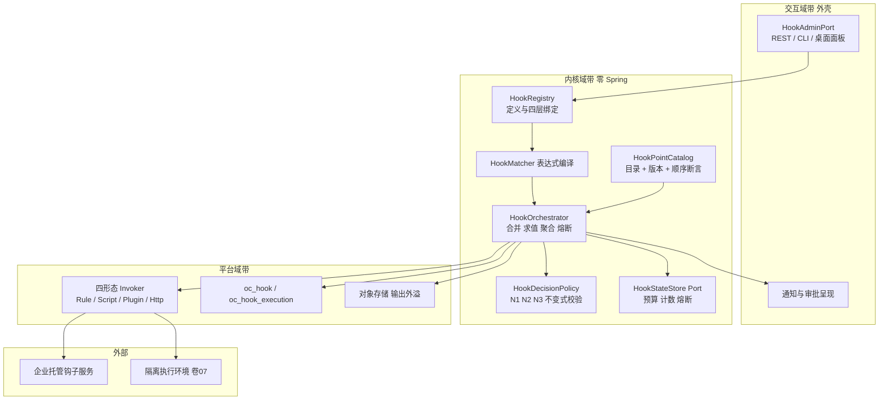
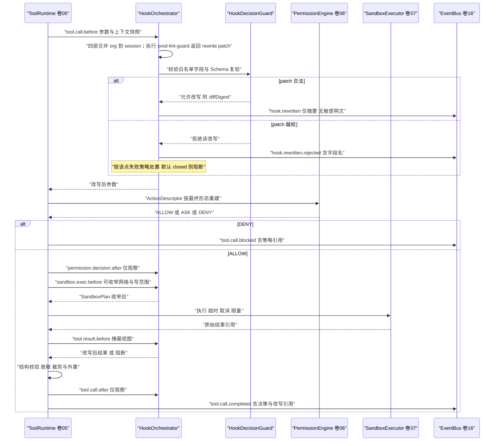
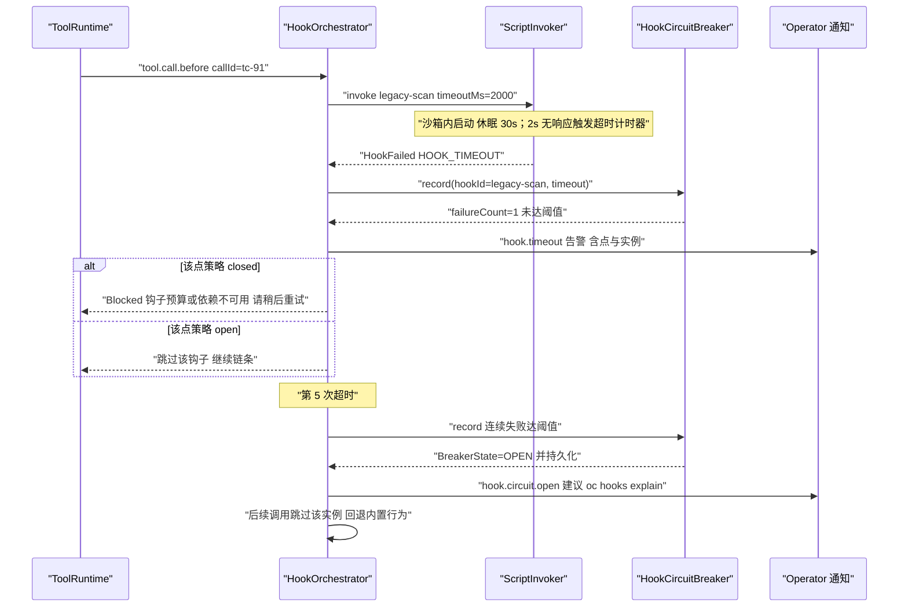
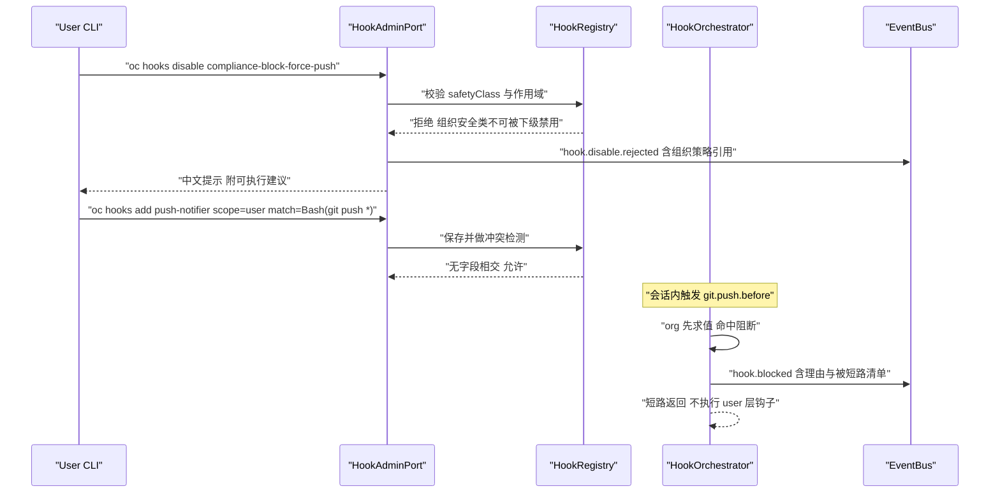
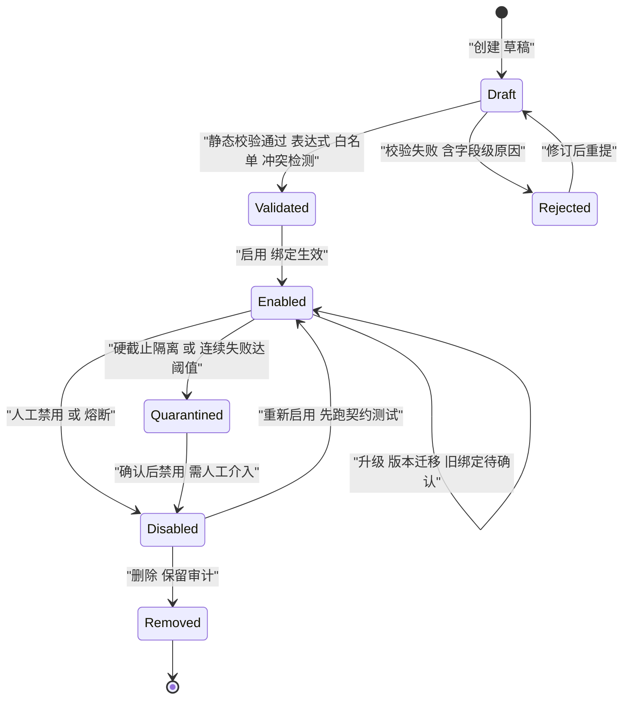
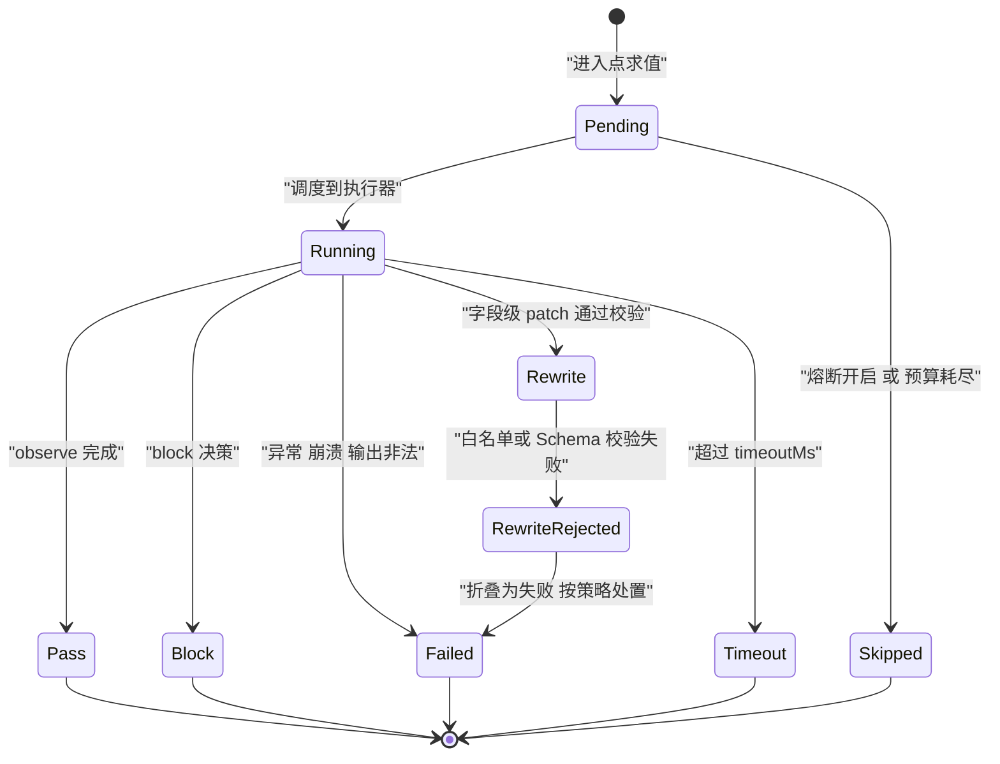
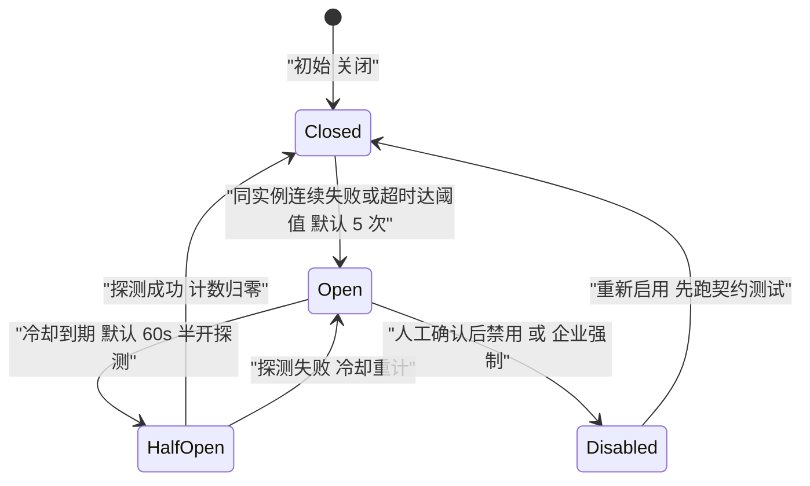

# Phase B 实现方案 17 · Hooks 系统（Hook Engine）

> **上游契约**：Phase A 卷 17《Hooks 系统》§2–§8（REQ-HOOK-1…8）、决策 D-HOOK-1…9；顺序铁律同卷 17 §4.3 与卷 05 §4.2；运行时落点同卷 01（内核/外壳分带）、卷 06（权限决策链）、卷 07（隔离五档）、卷 16（事件）、卷 18（插件装载）、卷 24（企业托管策略）、卷 30（供应链）。
> **定位**：Phase A 回答「钩子点有哪些、能做什么、多层怎么合并、失败怎么办」；本文件回答**「每个点的执行顺序精确到 hook / 权限 / 沙箱的三方相对位置、四形态各自怎么落地、匹配语法如何求值、挂死与预算耗尽如何确定性处置、如何试跑与回放」**。
> **竞品证据**：`research/competitors/01-claude-code-purpose-built.md`（E2：31 个钩子事件名、五种执行形态、退出码 `2` = 阻断、`Stop` 类钩子连续阻断 8 次被内核覆盖、`hooks` 键的 `matcher[] → hooks[]` 配置面、`${CLAUDE_PROJECT_DIR}` 占位、`allowManagedHooksOnly`；E1 衍生品：`hook_non_blocking_error` / `blockingError` 双通道附件、`emitHookStarted/Progress/Response` 三段式）、`07-qoder.md`（E2+E1：hook 入口四类 `command/http/prompt/agent`、`prompt`/`agent` 型在**隔离会话**运行且看不到主对话历史、`PermissionRequest` 不支持 `ask`、matcher 支持 `|` 或与 `ToolName(arg_pattern)` 级 `if` 条件——vendored 安全插件实证 `if: "Bash(git push *)"`、插件钩子额外注入 `QODER_PLUGIN_ROOT` 环境变量）、`04-deepseek-harness.md`（E1：waterfall 监听者**必须显式委派 `next()`**，不调即拦截；`tools/pre-execute → tools/execute → tools/post-execute` 三段钩子；`config-catalog` 生成式目录 + CI freshness 门禁；扩展定义「无模型工具可创建」的最小权限切分）、`08-gemini-cli.md`（E1：11 个钩子事件、四来源 `project/user/system/extension`、`HookPlanner → HookRunner → HookAggregator → HookTranslator` 链条、`trustedHooks` 保证未受信目录的 hook 不得执行、`BeforeModel` 钩子可改写 LLM 请求）、`03-codex.md`（E2：钩子输出外溢到文件以免上下文洪泛）、`02-opencode.md`（E1：插件 Hooks 四个强语义点 `permission.ask` / `tool.execute.before` / `tool.execute.after` / `command.execute.before`）。
> **不修改 Phase A**：选定分支均落在 D-HOOK-1…9 内；新增实现级决策登记为 `I-HOOK-n`（§12）；发现的两处措辞级冲突以**修订建议**形式记录在 §4.7，不改动 Phase A 卷册。

---

## 1. 实现目标与范围

### 1.1 本组件解决什么

1. **逐点顺序契约**：为 8 类 57 个钩子点逐个给出「hook / 权限决策 / 沙箱执行」三方相对位置的**唯一序**，使改写型钩子在权限前、观察型钩子在权限后成为可机械校验的不变式，而非文档承诺。
2. **四形态统一执行**：声明式规则、沙箱脚本、进程内插件回调、HTTP 端点（含企业托管远程子形态）经同一 `HookInvoker` 执行，统一超时、预算、脱敏、审计与结果聚合。
3. **匹配语法求值**：工具名模式（`*` / 精确 / `|` 或 / 正则）、路径 glob、`ToolName(arg_pattern)` 级条件表达式，在**保存期**做静态校验、在**运行期**做确定性求值（无回溯灾难、无隐式全匹配）。
4. **多层合并与不可禁用**：企业（org）→ 项目（project）→ 用户（user）→ 会话（session）四层绑定合并；组织安全类钩子不可被下级禁用；同点同 matcher 的多改写钩子安装期冲突检测。
5. **挂死、预算与可调试性**：单钩子超时、单次调用总预算、异步观察旁路、实例级熔断、不可强杀时的隔离与降级，以及 `oc hooks test` 试跑、dry-run 观察、影响面统计与历史事件回放，全部有明确分支与事件。

### 1.2 本组件不解决什么

| 不解决 | 归属 |
| --- | --- |
| 权限决策链本身（deny/ask/allow 的产生） | 卷 06（钩子只能**收窄**、不能放宽；`permission.decision.after` 仅观察） |
| 沙箱隔离实现与档位选择 | 卷 07（钩子执行复用 `SandboxPlanRequest`，不新建隔离器） |
| 事件总线与事件信封 | 卷 16（`hook.*` 事件以标准信封发布） |
| 插件装载、类加载隔离、依赖求解 | 卷 18（进程内钩子形态是插件的一种注册结果） |
| 审批通道与呈现 / 复杂自动化能力 | 卷 06 审批编排 + 卷 22/23 端呈现 / 卷 34（钩子是轻量干预，复杂能力应实现为插件或自动化模板） |

### 1.3 上下游依赖

| 方向 | 依赖方 | 契约 |
| --- | --- | --- |
| 上游 | 卷 01 内核 | `HookEngine` 是内核域组件（零 Spring），外壳只通过 `HookAdminPort` 管理 |
| 上游 | 卷 05/06 工具与权限 | 十一步管线固定插入 `tool.call.before` / `permission.decision.after` / `tool.result.before` / `tool.call.after` 四点；`permission.decision.before` 只允许**收窄**（`NARROW`）且 `ask` 不得由钩子产生（L-066） |
| 上游 | 卷 07 沙箱 | 脚本形态经 `SandboxPlanRequest`（最低 L0+，网络默认拒绝）；HTTP 形态经出网代理 |
| 上游 | 卷 16 事件 | `hook.executed/blocked/rewritten/failed/disabled/timeout/circuit.*` 全量入总线 |
| 上游 | 卷 18 插件 | 进程内钩子由插件注册；插件禁用 ⇒ 其钩子绑定同步失效（注册即副作用的回卷语义，I-PLG-5） |
| 下游 | 卷 22/23/33 | `oc hooks` 命令面与桌面端面板；试跑/回放夹具供评测运行器复用 |
| 下游 | 卷 24/30 | 企业托管钩子（`allowManagedHooksOnly`）、签名与信任链（共用卷 18 信任根） |

### 1.4 归属分带与模块落位（卷 27 §4.1 权威名；v1 列为迁移来源）

| 组件 | 带 | 目标模块 | v1 仓模块（迁移来源） | 装配方式 |
| --- | --- | --- | --- | --- |
| 钩子点目录、匹配求值、合并律、执行编排、熔断状态机 | 内核域带 | `harness-contract`（`com.hk.opencoding.contract.hook` 枚举/值对象）+ `harness-kernel/kernel-agent`（匹配/合并/熔断纯决策与编排） | `open-coding-core-api`（`com.hk.opencoding.core.hook`）+ `open-coding-core-agent` | 零 Spring，可单测；无 IO 依赖，脚本/HTTP 经端口注入 |
| 沙箱执行器、HTTP 客户端、容器脚本探测、回放仓储 | 平台域带 | `harness-platform/platform-hooks`（`HookInvokerPort` 实现；脚本执行经 `platform-sandbox`） | `open-coding-infrastructure`（`hook` 子包） | Spring 装配，`@ConditionalOnMissingBean` |
| 定义与绑定持久化、执行记录、熔断计数 | 平台域带 | `harness-platform/platform-persistence`（`oc_hook`、`oc_hook_execution` + Flyway） | `open-coding-domain` | MyBatis-Plus，`@TableName` 逐表显式声明 |
| REST / CLI / 桌面面板 / 会话内通知 | 交互域带 | `harness-host/host-protocol`（`/api/v1/hooks`）+ `22`/`23` 端渲染 | `open-coding-interfaces` | Spring MVC + 会话协议；权限点 `hook.manage` / `hook.read` |
| 装配（`HookAutoConfiguration`） | 外壳 | `harness-host/host-bootstrap` | `open-coding-bootstrap` | 显式装配计划 + 能力门控 |

> 模块名桥接（R07 收敛）：目标名以卷 27 §4.1/§4.3 为准（卷 17 → `platform-hooks`）；**构建、`-pl` 选择器与验收命令只允许目标名**，v1 名列仅供迁移期对账（对照见 impl/01 §1.4、卷 27 §4.8.1）。**依赖铁律 R1–R4 不因命名放宽**：契约与内核侧零 Spring/ORM/Redis/HTTP 客户端；**Lombok（`@Slf4j` / `@Getter` / `@RequiredArgsConstructor`）为编译期注解处理、非运行期依赖，契约与内核模块允许使用**。

### 落地核对（R07：模块 / 顺序 / 批次 / 门禁 / I-* 落点）

- **实施顺序（卷 27 §4.5）**：**未列入 20 步**（同族缺项）。按依赖推导：上游为第 4 步（工具十一步管线的四个钩子点）、第 7 步（权限：`permission.decision.*` 只允许收窄）、第 11 步（沙箱：脚本形态最低 L0+）、第 16 步（事件）；被 impl/18 依赖（第 18 步）。建议插入为 **第 11.5 步「Hooks（钩子点目录 + 进程内/脚本两形态）」**，位于沙箱之后、插件之前；**契约先行**：`HookPoint` 枚举与决策 record 在第 1/2 步入 `harness-contract`，`kernel-tool`/`kernel-permission` 只依赖端口（默认 no-op），因此**不构成与 impl/05 的循环**（登记 X 修订项，见 `reviews/R07-scope-build-kernel.md`）。
- **数据批次（卷 27 §4.4）**：`oc_hook`、`oc_hook_binding`、`oc_hook_execution`、`oc_hook_health` → **B6**（插件/Skill/Hook/MCP + 企业），依赖 B1–B5。
- **门禁映射（卷 27 §4.6）**：目录/顺序/匹配/合并律单测 → 「单元测试 + 覆盖率门」；四形态与沙箱边界、挂死与熔断 → 「集成测试」；`hook-gates`（目录 freshness/顺序契约/敏感扫描）→ 「契约测试」+「安全红队」；`hook-fault-inject.sh`（挂死/预算/熔断/隔离/目录回滚）→ 「集成测试（故障注入层）」。
- **I-* 落点**：I-HOOK-1 → `harness-contract`（`HookPoint` 枚举 + 版本化目录事实源）+ CI freshness 门；I-HOOK-2 → `kernel-agent`（`HookMatcher` 受限文法编译）；I-HOOK-3 → `kernel-agent`（决策协议）+ `platform-hooks`（四形态载体与退出码兼容层）；I-HOOK-4 → `kernel-agent`（单钩子超时/总预算/熔断状态机）+ `platform-hooks`（实例隔离）；I-HOOK-5 → `kernel-agent`（字段级 JSON Pointer patch + 白名单 + Schema 复验）；I-HOOK-6 → `kernel-agent`（`HookMergeRule` 层级固定序）；I-HOOK-7 → `platform-hooks`（试跑临时会话与副作用旁路）+ `platform-persistence`（回放仓储）。

### 1.5 六条不可协商的不变式

| # | 不变式 | 违背后果 |
| --- | --- | --- |
| N1 | 钩子**永远不能放宽权限**：`permission.decision.before` 的结果集合只含 `PASS / NARROW / BLOCK`，不含 `ALLOW`；出现放宽即视为权限系统缺陷 | 安全事件（卷 30 SEV2） |
| N2 | 改写型钩子必须在权限决策**之前**运行，且改写后按**最终形态**重新生成 `ActionDescriptor` 重新鉴权 | 绕过鉴权（提权） |
| N3 | 权限决策**之后**只允许观察类钩子；观察类钩子不得改变参数、结果或决策 | 决策不可解释（审计失败） |
| N4 | 改写仅限 `rewritableFields` 白名单且必须通过 Schema 校验；每次改写记录字段级 diff（含前后值摘要），失败即拒绝该次改写并告警 | 静默语义破坏 |
| N5 | 每个钩子点的失败策略**逐点声明**并可被企业托管策略覆盖；安全类默认 `fail-closed`，通知类默认 `fail-open`；挂死按同策略处置 | 安全钩子失效＝风险敞口 |
| N6 | 钩子执行**全量审计**（含超时与跳过）；审计不含敏感明文；`dry-run` 结果不得写入真实副作用 | 治理失效、回归无法归因 |

---

## 2. 功能需求清单（REQ-HOOK-n）

| 编号 | 需求描述 | 来源 | 优先级 | 验收要点 |
| --- | --- | --- | --- | --- |
| REQ-HOOK-1 | 钩子点目录：8 类 ≥30 点、命名稳定并**版本化**（点增删走目录版本号）；本文落地为 8 类 57 点（§4.2） | 卷 17 §4.1 D-HOOK-1 | P0 | 目录版本号随发行递增；未知点拒绝绑定并报错含候选名 |
| REQ-HOOK-2 | 四形态：声明式规则 / 沙箱脚本 / 进程内插件回调 / HTTP 端点；企业托管可经 HTTP 子形态指向集中服务 | 卷 17 §4.2 D-HOOK-2 | P0 | 四形态各有端到端用例；形态缺失时该绑定标记 `IMPL_UNAVAILABLE` 而非静默跳过 |
| REQ-HOOK-3 | 三级能力：`observe` / `block` / `rewrite`；`rewrite` 必须携带 `rewritableFields` 白名单，否则装载期拒绝 | 卷 17 §4.2 D-HOOK-3 | P0 | 越权改写被拒并产生 `hook.rewritten.rejected` 事件 |
| REQ-HOOK-4 | 多层作用域合并：org → project → user → session 顺序求值；组织安全类不可被下级禁用；阻断短路（先到先阻断） | 卷 17 §4.4 D-HOOK-4 | P0 | 四层合并用例全过；下级禁用组织钩子的请求被拒并留痕 |
| REQ-HOOK-5 | 执行环境：沙箱（卷 07）+ 权限校验 + 资源限制（超时/内存/输出上限）+ 环境清洗（仅注入声明变量与密钥引用） | 卷 17 §4.5 D-HOOK-5 | P0 | 未声明环境变量不可见；密钥只以句柄形式注入引用 |
| REQ-HOOK-6 | 失败策略逐点声明：安全类默认 `fail-closed`、通知类默认 `fail-open`；失败与超时全量告警 | 卷 17 §4.5 D-HOOK-6 | P0 | 逐点默认值表（§4.2）被单测逐条断言 |
| REQ-HOOK-7 | 超时预算：单钩子默认 2s、单次调用合计默认 5s、观察类可异步；预算耗尽后剩余同步钩子确定性跳过 | 卷 17 §7 D-HOOK-7 | P0 | 挂死钩子不阻塞主流程（用例）；预算事件可观测 |
| REQ-HOOK-8 | 熔断：同一钩子实例连续失败/超时 5 次 → 自动禁用并告警；冷却后半开探测 | 卷 17 §4.5 D-HOOK-6 | P0 | 熔断与半开恢复用例全过；熔断按**实例**计数而非按点 |
| REQ-HOOK-9 | 调试能力：本地试跑（样例输入）、dry-run、影响面统计、一键禁用、历史事件回放；试跑在临时会话执行，**零真实副作用、不污染熔断计数、不触发对外通知** | 卷 17 §4.6 D-HOOK-8 + Phase B 细化（试跑隔离） | P1 | `oc hooks test/replay` 输出判定、diff、耗时；dry-run 零副作用；试跑后真实环境零变更（用例） |
| REQ-HOOK-10 | 分发治理：模板库 + 组织内分发 + 签名校验（企业可强制「仅托管钩子」） | 卷 17 §4.5 D-HOOK-9 | P2 | 未签名模板在企业作用域被拒；`allowManagedHooksOnly` 生效 |
| REQ-HOOK-11 | **逐点顺序契约**：为每个点声明 hook / 权限 / 沙箱三方相对序，并由装配期断言校验（顺序表不可运行时改写） | Phase B 新增（I-HOOK-1，卷 17 §4.3 落地化） | P0 | 顺序快照测试：任一点顺序被改即测试失败 |
| REQ-HOOK-12 | **级联条件匹配**：支持 `*` / 精确 / `\|` 或 / 正则工具名、路径 glob、`ToolName(arg_pattern)` 条件表达式 | 竞品增量：07-qoder §4.14 [E2]+[E1]、01-claude-code §4.14 [E2] | P0 | 语义用例矩阵；非法表达式保存期拒绝 |
| REQ-HOOK-13 | **入口四类语义**：`prompt`（单次 LLM 判定）与 `agent`（派生子代理判定）型钩子在**隔离会话**运行，看不到主对话历史；两者输出必须结构化 | 竞品增量：07-qoder §4.14 [E2]（L-065） | P1 | 隔离会话中不可读取主历史（用例）；无结构化输出按失败策略处置 |
| REQ-HOOK-14 | **`ask` 归属**：`permission.decision.before` 不支持 `ask`；需要人工确认必须由 `tool.call.before` 的决策字段表达并由权限链裁决 | 竞品增量：07-qoder §4.14 [E2]、L-066 | P0 | 钩子返回 `ask` 被拒并审计；与卷 06 决策链一致性用例 |
| REQ-HOOK-15 | **改写降级默认关闭**：`rewrite` 能力默认关闭（企业或用户显式开启）；开启后全量审计 + 字段级 diff 留痕 | 竞品增量：L-066、01-claude-code §4.14 [E2] | P0 | 默认关闭用例；开启后 diff 事件可查 |
| REQ-HOOK-16 | **阻断次数上限防活锁**：同一钩子实例对同一回合连续阻断 8 次后由内核覆盖并结束回合（可配），避免钩子互锁 | 竞品增量：01-claude-code §1 条目 7 [E2]、L-065 | P1 | 上限按实例计数（非全局）；覆盖动作产生 `hook.block.overridden` 事件 |
| REQ-HOOK-17 | **钩子输出外溢**：单钩子返回体超限（默认 256KB / 32k token）时落对象存储并以引用回喂，避免上下文洪泛 | 竞品增量：03-codex §8 [E1]、L-065 | P1 | 大输出用例；引用可读回且带 TTL |
| REQ-HOOK-18 | **waterfall 显式委派**：多钩子串行链采用显式 `chain(proceed)` 语义——不调用 `proceed` 即视为阻断，且该行为必须记入审计（禁止「忘记继续」的静默吞失败） | 竞品增量：04-deepseek §4.14 [E1] | P0 | 未委派用例产生 `hook.blocked` 且理由为 `CHAIN_NOT_PROCEEDED` |
| REQ-HOOK-19 | **受信目录约束**：仅受信作用域（org 托管目录、签名项目目录、用户目录）内的钩子可执行；未受信目录（如临时解包目录）被拒绝装载 | 竞品增量：08-gemini-cli §4.14 [E1]（`trustedHooks`） | P0 | 未受信目录用例被拒；拒绝原因可读 |
| REQ-HOOK-20 | **策略型插件范式**：企业安全能力以「插件 + 钩子」分发（如编辑后 L1 扫描、`git push` 前 L3 扫描），不写进内核 | 竞品增量：07-qoder §5.4 [E1]、L-067 | P1 | 至少一个示例策略插件端到端；钩子绑定随插件禁用同步失效 |
| REQ-HOOK-21 | **企业托管收紧**：`allowManagedHooksOnly=true` 时仅托管钩子可执行；托管钩子不可被任何下级禁用或改写 | 竞品增量：01-claude-code §2.1 [E2]、L-058 | P1 | 托管收紧用例；禁用请求被拒并审计 |
| REQ-HOOK-22 | **钩子配置目录生成式维护**：钩子点目录与逐点默认失败策略由单一事实源生成，CI 校验 freshness（文档漂移即失败） | 竞品增量：04-deepseek §6-2 [E1]、L-081 | P2 | 生成物与事实源 diff 门禁；变更需走评审 |
| REQ-HOOK-23 | **键粒级并发安全与定义迁移**：同回合同钩子经键控互斥串行、多会话预算独立；定义可 diff 评审，升级后旧绑定自动迁移或标记待确认，删除绑定保留审计 | Phase B 新增（I-HOOK-4）+ 卷 17 §7 可维护 | P1 | 并发用例；预算计数按 `(hookId, sessionId)` 维度；迁移用例不丢审计 |
| REQ-HOOK-24 | **敏感访问显式化**：默认看不到敏感明文；声明 `sensitiveAccess` 并经授权后方可读取，且读取动作审计 | 卷 17 §4.5 D-HOOK-5 | P0 | 未授权读取被掩蔽（用例）；授权读取全量留痕 |

> 说明：REQ-HOOK-11…22 为竞品研究带来的增量需求（≥2 条要求已满足，实为 12 条），落地位置分别在 §3（I-HOOK-1/2/3/5/7）、§4.2（顺序与挂死列）、§4.5（托管收紧）、§9（试跑命令面）、§10（生成式目录门禁）。

---

## 3. 技术方案选型（M×N 比选）

评分口径沿用 `README §4`：F 功能完备 ×30、U 体验 ×20、S 稳定与安全 ×25、M 可维护 ×25（满分 100）。

### 3.1 I-HOOK-1：钩子点目录与顺序契约的载体

| 分支 | 描述 | F | U | S | M | 加权 | 结论 |
| --- | --- | --- | --- | --- | --- | --- | --- |
| B1 仅 Java 枚举 | 点即枚举常量，顺序散落在调用点注释 | 7 | 7 | 7 | 6 | 67.5 | 淘汰：顺序不可机械校验 |
| B2 枚举 + 版本化目录元数据（YAML 事实源 → 生成 Java 枚举与顺序断言） | 点与顺序同源，可 CI 校验；改动需评审 | 9 | 8 | 9 | 9 | 88 | **选定** |
| B3 完全动态（插件可在运行期声明新点） | 灵活 | 8 | 7 | 5 | 6 | 65 | 淘汰：顺序与兼容不可控；插件只能注册到既有点的绑定，不能造点 |

**选定 B2 的代价**：新增钩子点需要发版（目录版本号前移），不支持「用户自定义点」；用 `HookPointSPI` 的**预留扩展点槽位**（`extension.*` 前缀的预留命名空间）吸收非核心诉求。**回退触发**：若季度内≥3 次因「无合适点」而被拒绝的需求，评估开放 `extension.*` 预留槽位的自助注册（仍受顺序断言约束）。

### 3.2 I-HOOK-2：匹配表达式引擎

| 分支 | 描述 | F | U | S | M | 加权 | 结论 |
| --- | --- | --- | --- | --- | --- | --- | --- |
| B1 纯 glob 字符串匹配 | 实现最简 | 5 | 7 | 7 | 9 | 67.5 | 淘汰：无法表达参数级条件 |
| B2 自研表达式编译（受限文法：工具名模式 + 路径 glob + `ToolName(arg_pattern)` + 布尔与或非） | 无回溯风险、可静态校验、可解释（给出命中依据） | 9 | 8 | 9 | 8 | 86.5 | **选定** |
| B3 嵌入通用表达式引擎（如 SpEL/JS） | 表达力最强 | 9 | 7 | 5 | 5 | 66.5 | 淘汰：任意代码执行面、不可审计 |

**选定 B2 的代价**：不支持变量引用与函数调用，复杂条件需下沉到脚本/插件形态；表达式求值结果必须产出「命中/未命中 + 命中依据」（用于 `oc hooks explain`）。**回退触发**：若用户要求「跨字段聚合条件」超过阈值，评估增加受限函数（只用枚举化纯函数，禁 IO）。

### 3.3 I-HOOK-3：四形态执行载体与决策协议

| 分支 | 描述 | F | U | S | M | 加权 | 结论 |
| --- | --- | --- | --- | --- | --- | --- | --- |
| B1 只支持进程内回调 | 性能最好 | 6 | 6 | 6 | 6 | 60 | 淘汰：技术栈绑定，企业无法接入 |
| B2 四形态 + **结构化决策协议**（JSON `HookOutcome`） | 跨语言、可审计、可 dry-run | 9 | 8 | 9 | 8 | 86.5 | **选定** |
| B3 四形态 + UNIX 退出码语义（`2`=阻断） | 生态兼容（Claude 生态直接迁移） | 8 | 8 | 6 | 7 | 73 | 仅作**兼容适配层**叠加：脚本形态额外解析退出码，内部仍归一化为结构化协议 |

**选定 B2 的代价**：脚本作者需产出 JSON（提供 `oc-hook-json` 小工具与模板降低门槛）；退出码语义仅作为兼容层（Phase B 新增：`ExitCodeAdapter`），**不以退出码作为内部事实**（避免多端语义分叉）。**回退触发**：若迁移生态的脚本占比超过 50% 且 JSON 采纳率低，提升兼容层权重，但仍保留结构化协议为内部唯一事实。

### 3.4 I-HOOK-4：挂死、超时与预算处置

| 分支 | 描述 | F | U | S | M | 加权 | 结论 |
| --- | --- | --- | --- | --- | --- | --- | --- |
| B1 只设单钩子超时 | 简单 | 6 | 7 | 6 | 8 | 66 | 淘汰：多钩子叠加仍可挂死整轮 |
| B2 单钩子超时 + 单次调用总预算 + 异步观察旁路 + 实例级熔断 + 不可强杀隔离 | 确定性、可观测 | 9 | 8 | 9 | 8 | 86.5 | **选定** |
| B3 全异步钩子（有界队列 + 结果窗口） | 不阻塞主流程 | 7 | 6 | 7 | 6 | 65 | 淘汰：阻断/改写类存在时序依赖，异步会破坏「改写先于权限」不变式 |

**选定 B2 的代价**：同步钩子仍会占用时间（预算内）；进程内钩子不可强杀（虚拟线程只能 interrupt），故采用「硬截止 + 隔离 + 注册撤销」（§4.4）。**回退触发**：若进程内钩子挂死导致的隔离次数超阈值，将插件回调形态默认降级为进程外执行（改 `hostMode` 默认值）。

### 3.5 I-HOOK-5：改写语义的实现方式

| 分支 | 描述 | F | U | S | M | 加权 | 结论 |
| --- | --- | --- | --- | --- | --- | --- | --- |
| B1 返回整份替换对象 | 表达力强 | 8 | 7 | 5 | 6 | 65 | 淘汰：无法做字段级白名单与 diff，风险不可控 |
| B2 字段级 patch（JSON Pointer + 白名单校验 + Schema 复验） | 只改声明字段，diff 天然可算 | 9 | 8 | 9 | 9 | 88 | **选定** |
| B3 仅允许「拒绝或放行」，不允许改写 | 最安全 | 5 | 5 | 9 | 8 | 67.5 | 保留为企业可选收紧档（`hook.rewrite.enabled=false` 时等价） |

**选定 B2 的代价**：不支持「结构性重写」（如把一次 `edit` 拆成两次调用）；此类诉求由插件在 `tool.call.before` 上做多步副作用（受限）。**回退触发**：出现「patch 无法表达」的高频场景时，评估引入受限宏（`expand` 指令：一次改写最多展开为 2 个同工具调用，仍逐个重鉴权）。

### 3.6 I-HOOK-6：多层作用域合并与优先级

| 分支 | 描述 | F | U | S | M | 加权 | 结论 |
| --- | --- | --- | --- | --- | --- | --- | --- |
| B1 后声明覆盖先声明（同名钩子） | 直觉 | 6 | 7 | 6 | 7 | 64.5 | 淘汰：组织安全项会被用户覆盖 |
| B2 层级固定序 + 层内显式 `order` + 安全位段（`safetyClass` 不可覆盖） | 与卷 17 §4.4 一致，可解释 | 9 | 8 | 9 | 8 | 86.5 | **选定** |
| B3 信任带 + 带内小数优先级（对齐卷 06 的 `PolicyTier`） | 与企业策略模型统一 | 8 | 8 | 8 | 8 | 80 | 备选（若卷 06 全面切换到信任带则同步迁移） |

**选定 B2 的代价**：新增第二套排序词汇（层级 + `order`），需与卷 06 `PolicyTier` 建立映射表（org↔admin、project↔workspace、user↔user、session↔session），映射表落在 §4.6。**回退触发**：卷 06 的信任带成为唯一排序模型时，切换到 B3 并保留映射表作兼容读入。

### 3.7 I-HOOK-7：非生产执行环境（判定型钩子隔离 + 试跑旁路）

| 分支 | 描述 | F | U | S | M | 加权 | 结论 |
| --- | --- | --- | --- | --- | --- | --- | --- |
| B1 与主会话同上下文 + 试跑等价真跑 | 判定信息最全 | 7 | 7 | 5 | 6 | 62.5 | 淘汰：注入面大，试跑会写真实副作用 |
| B2 判定型钩子隔离会话（只喂该点上下文快照）+ 试跑用临时会话与副作用旁路 | 边界清晰、可零副作用验证 | 9 | 8 | 9 | 8 | 86.5 | **选定** |
| B3 判定注入脱敏历史摘要 + 影子执行（真实写后回滚） | 判定质量与保真更高 | 8 | 7 | 4 | 6 | 64.5 | 淘汰：回滚覆盖不了外部副作用（通知、推送），且历史摘要放大注入面 |

**选定 B2 的代价**：① 判定器缺历史可能漏判，故输出二分必须保守（`unknown ⇒ 按该点失败策略处置`，漏判优先于误判）；② 试跑无法暴露真实外部副作用类缺陷，用「`sideEffectClass` 静态清单 + 声明式提示」补偿。**回退触发**：误判率或漏检事故超阈值时，分别启用「脱敏摘要注入」与「隔离租户内真实执行」两个子档（均不开启历史原文）。

**与竞品对照的取舍**：钩子生态在竞品中已收敛为四形态（`command`/`http`/`prompt`/`agent`）与「退出码或结构化输出」二选一的决策协议（`research/competitors/01-claude-code-purpose-built.md` `[E2]`、`07-qoder.md` `[E2]+[E1]`）。**取舍**：① 四形态全量对齐，但把竞品「退出码即事实」降为**兼容适配层**——内部事实是结构化 JSON 决策（退出码语义在跨平台与「改写 + 理由」场景下表达力不足），生态脚本迁移有过渡权重但内部契约不变（I-HOOK-3）；② 采纳 DeepSeek 的 waterfall **显式委派**语义（不调 `proceed` 即阻断），但补审计（`CHAIN_NOT_PROCEEDED`）——竞品「忘记继续 = 静默吞失败」是治理黑洞（REQ-HOOK-18）；③ 反向采纳三例：Claude Code「同实例连续阻断 8 次被内核覆盖」→ 防活锁上限（REQ-HOOK-16）；Codex「钩子输出外溢到文件」→ 超限输出落对象存储（REQ-HOOK-17，防上下文洪泛）；Gemini `trustedHooks` → 受信目录约束（REQ-HOOK-19）。

---

## 4. 总体架构与逐点顺序契约

### 4.1 组件与数据流



### 4.2 钩子点目录：8 类 57 点（时机 / 上下文 / 能力 / 顺序 / 挂死）

**顺序记号**（REQ-HOOK-11）：`H→P` = 钩子在权限决策前（可 observe/block/rewrite，改写后重鉴权）；`P→H` = 权限决策后（仅 observe）；`H→S` = 钩子在沙箱执行前（可收窄策略/阻断）；`S→H` = 沙箱执行后（仅 observe）；`H→P→S` = 三阶段全在；`—` = 不在权限/沙箱路径。
**挂死处置记号**（REQ-HOOK-7/8）：`T2` = 单钩子 2s 超时按该点失败策略处置；`B5` = 计入单次调用 5s 总预算，预算耗尽后**该点剩余同步钩子全部跳过**（skip 亦按失败策略判定）；`CB` = 触发实例级熔断计数；`AO` = 异步观察，超时仅丢弃结果；`QZ` = 硬截止（2×timeout）后隔离该钩子实例并撤销注册。

**类目**（REQ-HOOK-1）：A 会话与轮次（10 点）/ B 阶段与计划任务（9 点）/ C 上下文（5 点）/ D 模型（5 点）/ E 工具（8 点）/ F 权限与审批（6 点）/ G 提交与 Git（6 点）/ H 沙箱·插件·系统·子代理（8 点），合计 57 点。

| 类 | 钩子点 | 时机 | 可用上下文 | 能力 | 顺序 | 挂死 | 默认失败策略 |
| --- | --- | --- | --- | --- | --- | --- | --- |
| A | `session.create.before` | 会话记录落库前 | actor、工作区、初始权限模式、项目元数据 | observe / block | `—` | `T2+B5+CB` | 安全类 `closed`（组织钩子）/ 其他 `open` |
| A | `session.create.after` | 会话创建成功、事件发布前 | sessionId、actor、模式 | observe | `—` | `AO` | `open` |
| A | `session.resume.before` | 恢复前（校验可恢复性） | sessionId、检查点引用、事件水位 | observe / block | `—` | `T2+B5+CB` | `closed` |
| A | `session.resume.after` | 恢复完成 | sessionId、恢复步骤报告 | observe | `—` | `AO` | `open` |
| A | `session.close.before` | 关闭前（清理前机会） | sessionId、待决审批、未提交副作用 | observe / block | `—` | `T2+B5` | `closed`（防止带未决副作用关闭） |
| A | `session.close.after` | 关闭完成 | sessionId、耗时、事件水位 | observe | `—` | `AO` | `open` |
| A | `turn.start.before` | 回合开始、读入上下文前 | turnId、输入项、模式、预算 | observe / block / rewrite（`input.items`） | `—` | `T2+B5+CB` | `closed` |
| A | `turn.complete.before` | 回合收尾前（回复定稿前） | turnId、回复草稿、工具摘要 | observe / block / rewrite（`reply.text` 片段） | `—` | `T2+B5+CB` | `closed` |
| A | `turn.complete.after` | 回合已提交 | turnId、用量、耗时、决策引用 | observe | `—` | `AO` | `open` |
| A | `turn.abort.after` | 回合中止后 | turnId、中止原因、已完成工具 | observe | `—` | `AO` | `open` |
| B | `phase.plan.before` | 进入计划阶段前 | phase、目标、计划草稿存储引用 | observe / block | `—` | `T2+B5+CB` | `closed` |
| B | `phase.plan.after` | 计划产出后 | phase、计划 DAG 摘要 | observe / rewrite（`acceptanceCriteria` 仅追加不可删） | `—` | `T2+B5` | `closed` |
| B | `phase.execute.before` | 执行阶段开始 | phase、WorkItem 集合、权限模式 | observe / block | `—` | `T2+B5+CB` | `closed` |
| B | `phase.verify.before` | 验收前 | phase、证据清单引用、verifier 配置 | observe / block | `—` | `T2+B5+CB` | `closed` |
| B | `phase.verify.after` | 验收结论产生后 | phase、结论、失败项 | observe | `—` | `AO` | `open` |
| B | `workitem.create.before` | 工作项落库前 | 类型、父项、模板、指派 | observe / block / rewrite（`title`/`priority`/`labels`） | `—` | `T2+B5` | `closed` |
| B | `workitem.state.changed.after` | 状态流转提交后 | from/to 状态、触发者、证据引用 | observe | `—` | `AO` | `open` |
| B | `plan.update.before` | 计划变更落库前 | 变更 diff、影响面（下游 WorkItem） | observe / block | `—` | `T2+B5` | `closed` |
| B | `plan.update.after` | 计划变更提交后 | 版本号、diff 摘要 | observe | `—` | `AO` | `open` |
| C | `context.inject.before` | 外部内容注入区段前 | 来源、内容摘要、注入目标区段 | observe / block / rewrite（`content` 按引用替换） | `—` | `T2+B5` | `closed`（防注入） |
| C | `context.assemble.before` | 九区段组装前 | 预算表、区段计划、会话水位 | observe / block / rewrite（`sections[*].budget` 收窄） | `—` | `T2+B5` | `closed` |
| C | `context.assemble.after` | 组装完成、发请求前 | 区段用量、缓存前缀摘要、token 估算 | observe / block | `H→P`（模型请求处于权限路径中） | `T2+B5` | `closed` |
| C | `context.compact.before` | 压缩触发、摘要生成前 | 触发原因、token 水位、可压缩范围 | observe / block / rewrite（`range`） | `—` | `T2+B5+CB` | `closed` |
| C | `context.compact.after` | 压缩提交后 | 压缩前后 token、被引用外置清单 | observe | `—` | `AO` | `open` |
| D | `model.request.before` | 请求发出前、权限已判 | provider、model、参数摘要、缓存前缀 | observe / block / rewrite（`temperature`/`maxTokens`/`systemSuffix`；**不得**改 system 前缀与工具 schema） | `H→P`（仅参数收窄，越权即拒） | `T2+B5+CB` | `closed` |
| D | `model.request.after` | 请求已发出 | 请求 ID、最终参数、路由决策 | observe | `P→H` | `AO` | `open` |
| D | `model.response.after` | 响应完整收到 | 用量、finishReason、工具调用摘要（**不含全文**） | observe | `—` | `AO` | `open` |
| D | `model.error.after` | 模型错误归类后 | 错误码、可重试标记、重试次数 | observe | `—` | `AO` | `open` |
| D | `model.switch.before` | 模型/供应商切换前 | 原/目标 model、切换原因、灰度标记 | observe / block | `—` | `T2+B5` | `closed` |
| E | `tool.select.before` | 工具面披露前 | 候选工具集、模式、检索命中 | observe / block / rewrite（`disclosedSubset` 只能删不能增） | `—` | `T2+B5` | `closed` |
| E | `tool.call.before` | 参数校验通过后 | 工具名、参数（敏感字段默认掩蔽）、工作区、会话 | observe / block / rewrite（`args` 白名单字段） | `H→P→S` | `T2+B5+CB` | `closed` |
| E | `tool.call.after` | 结果结算与事件发布后 | 结果摘要、耗时、决策引用、改写 diff | observe | `S→H` | `AO` | `open` |
| E | `tool.result.before` | 结果返回、**掩蔽视图**下 | 工具名、结果引用、字段级掩蔽状态 | observe / block / rewrite（`result` 白名单字段） | `H→P→S→H`（脱敏**前**、裁剪**前**） | `T2+B5+CB` | `closed` |
| E | `tool.result.after` | 脱敏与裁剪完成后 | 脱敏后结果引用、外置引用、裁剪统计 | observe | `S→H` | `AO` | `open` |
| E | `tool.error.after` | 工具失败归类后 | 错误码、失败四分法归类、可重试标记 | observe | `S→H` | `AO` | `open` |
| E | `tool.batch.after` | 一批工具调用全部结算后 | 批次 ID、成功/失败计数、串并行信息 | observe | `S→H` | `AO` | `open` |
| E | `tool.script.exec.before` | 程序化工具调用（PTC）子调用派发前 | 父脚本 ID、子调用序号、工具名、参数摘要 | observe / block / rewrite（同 `tool.call.before` 白名单） | `H→P→S`（**子调用重入完整受守卫管线**） | `T2+B5+CB` | `closed` |
| F | `permission.decision.before` | 决策链求值前 | `ActionDescriptor`、风险级、策略引用 | observe / block / **narrow**（只许收窄：`ALLOW→ASK`、`ASK→DENY`；**禁止** `DENY→ALLOW`） | `H→P`（先于决策链，结果只可收窄） | `T2+B5+CB` | `closed` |
| F | `permission.decision.after` | 决策产生后 | 决策值、原因枚举、策略引用 | observe | `P→H`（**仅观察**） | `AO` | `open` |
| F | `approval.request.before` | 审批请求发出前 | 审批 ID、工具调用 ID（**不含工具参数**，L-006） | observe / block（撤回请求 → 降级为拒绝） | `P→H` | `T2+B5` | `closed` |
| F | `approval.request.after` | 审批请求已投递 | 通道、超时策略、呈现摘要 | observe | `P→H` | `AO` | `open` |
| F | `approval.resolved.after` | 审批结论写入后 | 结论（四值含 `UNAVAILABLE`）、应答者、作用域 | observe | `P→H` | `AO` | `open` |
| F | `permission.rule.change.after` | 策略/规则变更生效后 | 变更 diff、生效作用域、记录人 | observe | `—` | `AO` | `open` |
| G | `git.commit.before` | 提交对象构造前 | 待提交文件、消息草稿、暂存区摘要 | observe / block / rewrite（`message`/`paths` 白名单） | `H→P→S`（提交是工具调用，走完整管线） | `T2+B5+CB` | `closed` |
| G | `git.commit.after` | 提交完成后 | commit SHA、文件统计、消息 | observe | `S→H` | `AO` | `open` |
| G | `git.push.before` | 推送前 | 远程、分支、待推送提交列表 | observe / block | `H→P→S`（工具调用或内建动作） | `T2+B5+CB` | `closed` |
| G | `pr.create.before` | 创建 PR 前 | 目标分支、标题/描述草稿、变更统计 | observe / block / rewrite（`title`/`body`） | `H→P→S` | `T2+B5` | `closed` |
| G | `pr.create.after` | PR 创建后 | PR 编号、链接、审查者 | observe | `S→H` | `AO` | `open` |
| G | `worktree.create.before` | worktree 创建前 | 仓库、分支、目标目录 | observe / block（非零即中止建树） | `—` | `T2+B5` | `closed` |
| H | `sandbox.exec.before` | 沙箱计划确定后、进程启动前 | `SandboxPlan`、档位、命令摘要、工作区 | observe / block / rewrite（策略只能**收窄**：`network`、`writeRoots`） | `H→S`（权限后、执行前） | `T2+B5+CB` | `closed` |
| H | `sandbox.violation.after` | 围栏违反记录后 | 违规类别、进程信息、信号面 | observe | `S→H` | `AO` | `open` |
| H | `plugin.load.after` | 插件装载并注册完成后 | 插件 ID/版本、注册的扩展点、签名状态 | observe | `—` | `AO` | `open` |
| H | `plugin.state.changed.after` | 插件状态变更后 | 状态迁移、原因、影响面 | observe | `—` | `AO` | `open` |
| H | `subagent.spawn.before` | 子代理创建前 | 角色、权限差集、预算、工作区 | observe / block / rewrite（`role`/`budget` 只能收窄） | `H→P`（权限差集经权限链二次裁决） | `T2+B5+CB` | `closed` |
| H | `subagent.stop.after` | 子代理结束后 | 结果摘要、用量、未完成项 | observe | `—` | `AO` | `open` |
| H | `system.ready.after` | 内核装配完成 | 组件健康、目录版本、钩子数量 | observe | `—` | `AO` | `open` |
| H | `system.shutdown.before` | 关机流程开始 | 活动会话、未决任务、待清理资源 | observe / block（延迟关机） | `—` | `T2+B5` | `closed` |

**逐点默认失败策略的总原则**：`safetyClass=S`（组织安全/合规钩子）默认 `fail-closed` 且不可被下级改为 `open`；`safetyClass=N`（通知/统计/格式化）默认 `fail-open`；每个点的默认值由目录事实源（REQ-HOOK-22）生成并被单测逐条断言。

### 4.3 工具调用全序（hook / 权限 / 沙箱的三方位置）

| # | 阶段 | 参与方 | 干预许可 |
| --- | --- | --- | --- |
| 1 | 定位解析 + 参数校验（卷 05 步骤 1–2） | ToolRuntime | 无钩子 |
| 2 | 前置钩子 `tool.call.before` | HookEngine | `observe` / `block` / `rewrite`（白名单字段） |
| 3 | 重建 `ActionDescriptor` 并按**最终形态**重鉴权 | HookEngine → PermissionEngine | 改写后必走，不可跳过（N2） |
| 4 | 权限决策链（deny > ask > allow） | PermissionEngine | 钩子不可放宽（N1）；`ask` 不由钩子产生（REQ-HOOK-14） |
| 5 | 权限后钩子 `permission.decision.after` | HookEngine | **仅 observe**（N3） |
| 6 | 沙箱前置钩子 `sandbox.exec.before` | HookEngine → SandboxExecutor | `observe` / `block` / `rewrite`（策略只能**收窄**） |
| 7 | 沙箱与工作区路由 + 执行（超时/取消/限量） | SandboxExecutor / WorkspaceProvider | 无钩子（钩子不在隔离器内执行） |
| 8 | 结果钩子 `tool.result.before`（**掩蔽视图**） | HookEngine | `observe` / `block` / `rewrite`（白名单字段） |
| 9 | 结构校验 → 脱敏 → 裁剪与外置（卷 05 步骤 8） | ToolOutputProcessor | 无钩子（脱敏不可被跳过） |
| 10 | 结果钩子 `tool.result.after`（已脱敏） | HookEngine | **仅 observe** |
| 11 | 副作用账本 + 事件与审计（步骤 9–10） | SideEffectLedger / EventBus | 无钩子 |
| 12 | 后置钩子 `tool.call.after` | HookEngine | **仅 observe** |

**要点**：① 权限后到结果脱敏之间只有第 6、8 两步允许干预，且都不得放宽任何边界；② 第 8 步运行在**字段级掩蔽视图**下——未声明 `sensitiveAccess` 时敏感字段以占位符呈现（与卷 05 步骤 8「Hooks 结果改写 → 脱敏」的一致化口径，见 §4.7 修订建议 R1）；③ 12 步顺序由装配期 `OrderContract` 断言守护，任一点顺序被改即测试失败（REQ-HOOK-11）；④ **与卷 05 §3.6.3 十一步的粒度映射（同一管线、两种粒度）**：本表是管线全序的**权威展开**——`tool.call.before` ＝ 卷 05 步骤 3；权限决策 ＝ 卷 05 步骤 4（本表第 3–4 行为其内部两步）；`permission.decision.after` ＝ 卷 05 步骤 5；`sandbox.exec.before` 嵌在卷 05 步骤 6（沙箱与工作区路由）内部、执行之前；`tool.result.before` 与 `tool.result.after` 嵌在卷 05 步骤 8（结果处理）内部（前者在脱敏前、仅掩蔽视图；后者在脱敏后、仅观察）；`tool.call.after` ＝ 卷 05 步骤 11。两表任一处调整必须同步修改另一处（对齐卷 05 §4.2「顺序铁律」的同步要求）；无任何一个钩子点可插在权限决策与其「最终形态鉴权」之间（N2）。

### 4.4 挂死、超时与预算的确定性处置

| 场景 | 检测 | 处置 | 事件 |
| --- | --- | --- | --- |
| 单钩子超时（`timeoutMs`，默认 2000ms，可配） | 执行器超时计时器 | 按该点失败策略：`closed` → 阻断该点并回喂原因；`open` → 跳过该钩子继续链条 | `hook.timeout` |
| 单次调用总预算耗尽（`total-budget-ms`，默认 5000ms） | 编排器累计计时 | **该点剩余同步钩子全部跳过**；若该点策略为 `closed` 则整体阻断，否则继续主流程；异步观察钩子不受影响 | `hook.budget.exhausted` |
| 异步观察钩子超时 / 钩子进程不退出（脚本、HTTP 子形态） | 后台执行器 / 心跳缺失 2×`timeoutMs` | 仅丢弃结果并记账（不阻塞）；或终止子进程与连接并按失败策略处置、计入熔断计数 | `hook.observation.dropped` / `hook.terminated` |
| 进程内钩子挂死（虚拟线程，不可强杀） | 硬截止 2×`timeoutMs` | `Thread.interrupt()` + 结果丢弃；该钩子实例进入**隔离**（注册撤销），后续同点调用跳过它并回退到下一钩子或内置行为；泄漏线程计入泄漏注册表（上限 `leak-budget`，默认 3，超限则整点降级并告警） | `hook.quarantined` |
| 连续失败/超时 5 次（窗口 10 分钟） | 实例级计数器 | 熔断禁用该实例 + 通知 + 建议（`oc hooks explain`）；冷却 60s 后半开探测 1 次 | `hook.circuit.open` / `hook.circuit.closed` |
| 阻断震荡（同钩子实例对同回合连续阻断 8 次） | 实例 × 回合计数 | 内核覆盖阻断并结束回合（可配 `max-block-per-turn`），记录覆盖理由 | `hook.block.overridden` |

**预算配置口径**：`open-coding.hooks.default-timeout-ms`（默认 2000，必填性：否）、`open-coding.hooks.total-budget-ms`（默认 5000）、`open-coding.hooks.max-per-scope`（默认 50）、`open-coding.hooks.circuit.failure-threshold`（默认 5）、`open-coding.hooks.circuit.cooldown-ms`（默认 60000）、`open-coding.hooks.max-block-per-turn`（默认 8）、`open-coding.hooks.leak-budget`（默认 3）、`open-coding.hooks.output-inline-limit-bytes`（默认 262144）。全部经环境变量覆盖（`OC_HOOKS_*`）。

### 4.5 四层合并、不可禁用与冲突检测

| 规则 | 实现 |
| --- | --- |
| 求值顺序 | org（先）→ project → user → session（后）；层内按 `order`（默认 100，区间 `[0,999]`）升序，同 `order` 按 `hookId` 字典序（确定性） |
| 阻断短路 | 任一阻断即终止该点后续钩子（含跨层）；记录「被短路钩子清单」供影响面统计 |
| 安全位段 | `safetyClass=S` 的绑定不可被下级 `disable`；下级 `disable` 请求产生 `hook.disable.rejected`（含组织策略引用） |
| 托管收紧 | `allowManagedHooksOnly=true` 时仅 `origin=managed` 的绑定参与求值；其余绑定保持存储但不激活 |
| 冲突检测 | 保存期静态检测：同点 + 同 matcher + 多个 `rewrite` 且白名单字段相交 → 警告并要求显式 `order`；同点同字段「改写 vs 阻断」互斥组合直接拒绝 |
| 省流与限流 | 每作用域绑定数上限（默认 50）；单点同步钩子默认上限 10（超出装载期拒绝并提示合并）；绑定变更走版本号乐观锁 |

### 4.6 与权限信任带的映射表（I-HOOK-6 代价项）

| 钩子作用域 | 对应卷 06 `PolicyTier` | 说明 |
| --- | --- | --- |
| `org` / `project` | `admin` / `workspace` | 企业基线与仓库版本化（`.oc/hooks/`，评审可见）；org 的安全位段不可覆盖 |
| `user` | `user` | 个人自动化与偏好 |
| `session` | `session` | 会话级临时钩子（调试/一次性） |

### 4.7 对 Phase A 的修订建议（不改动卷册，登记备改）

| # | 位置 | 冲突/含糊点 | 建议修订 |
| --- | --- | --- | --- |
| R1 | 卷 17 §4.3「结果类钩子必须在脱敏**之后**」 vs 卷 05 §4.2 步骤 8「Hooks 结果改写（`tool.result.before`）→ 结构校验 → 脱敏」 | 两处对结果钩子与脱敏的相对序表述不一致（按 05 在脱敏前、按 17 在脱敏后） | 细化为「**观察类**结果钩子在脱敏之后；**改写类**结果钩子（`tool.result.before`）在脱敏前运行，但只可见**字段级掩蔽视图**（未声明 `sensitiveAccess` 时敏感字段为占位符）」。本文按此口径实现（§4.3） |
| R2 | 卷 17 §4.1 标题「8 类 30+ 点」与表中实际 10 行 | 类目数与行数不自洽 | 统一为「8 类」（会话与轮次合并、阶段与计划任务合并，即本文 §4.2 的 A–H 划分），表中保留 10 行细分视图；本文以 8 类 57 点实现，逐点不丢 |
| R3 | 卷 17 §7「同步钩子总开销 ≤ 5s/次调用」 | 未定义「预算耗尽但该点策略为 closed」的行为 | 补充：预算耗尽时 `closed` 点整体阻断并回喂「钩子预算耗尽」原因（本文 §4.4），避免「静默放行」 |

---

## 5. 类图与 Java 21 签名

```mermaid
classDiagram
    class HookEnginePort {
        <<interface>>
        +invoke(point: HookPoint, ctx: HookContext) HookOutcome
        +explain(point: HookPoint, ctx: HookContext) HookExplanation
    }
    class HookPointCatalogPort {
        <<interface>>
        +spec(point: HookPoint) HookPointSpec
        +catalogVersion() String
    }
    class HookRegistryPort {
        <<interface>>
        +bindings(point: HookPoint, ctx: HookContext) List~HookBinding~
        +disable(hookId: String, scope: HookScope, actor: String) DisableResult
    }
    class HookAdminPort {
        <<interface>>
        +test(hookId: String, sample: HookSample) HookTestReport
        +replay(point: HookPoint, range: EventRange) ReplayReport
    }
    class HookPoint {
        <<enum>>
        SESSION_CREATE_BEFORE
        TOOL_CALL_BEFORE
        TOOL_RESULT_BEFORE
        SANDBOX_EXEC_BEFORE
    }
    class HookPointSpec {
        <<record>>
        +point: HookPoint
        +capabilities: Set~HookCapability~
        +ordering: OrderContract
        +defaultFailurePolicy: FailurePolicy
    }
    class OrderContract {
        <<record>>
        +relativeToPermission: RelativePosition
        +relativeToSandbox: RelativePosition
    }
    class HookDefinition {
        <<record>>
        +hookId: String
        +point: HookPoint
        +matcher: MatchExpression
        +capability: HookCapability
        +rewritableFields: Set~String~
        +impl: HookImpl
        +failurePolicy: FailurePolicy
        +safetyClass: SafetyClass
        +order: int
    }
    class MatchExpression {
        <<sealed>>
    }
    class AllMatch {
        <<record>>
    }
    class ToolNameMatch {
        <<record>>
        +alternatives: Set~String~
    }
    class ToolArgCondition {
        <<record>>
        +toolName: String
        +argPattern: String
    }
    class PathGlobMatch {
        <<record>>
        +glob: String
    }
    class CompoundMatch {
        <<record>>
        +connector: Connector
        +children: List~MatchExpression~
    }
    class HookImpl {
        <<sealed>>
    }
    class RuleImpl {
        <<record>>
        +ruleIds: List~String~
    }
    class ScriptImpl {
        <<record>>
        +interpreter: Interpreter
        +envAllowlist: Set~String~
        +secretRefs: Set~String~
    }
    class PluginImpl {
        <<record>>
        +pluginId: String
        +callbackRef: String
    }
    class HttpImpl {
        <<record>>
        +endpointRef: String
        +managed: boolean
    }
    class HookOutcome {
        <<sealed>>
        +disposition() Disposition
    }
    class Observed {
        <<record>>
    }
    class Blocked {
        <<record>>
    }
    class Rewritten {
        <<record>>
    }
    class HookFailed {
        <<record>>
    }
    class HookOrchestrator {
        +invoke(point: HookPoint, ctx: HookContext) HookOutcome
        -applyPolicy(outcome: HookOutcome, spec: HookPointSpec) Disposition
    }
    class HookCircuitBreaker {
        +record(hookId: String, outcome: HookOutcome) BreakerState
        +state(hookId: String) BreakerState
    }
    class HookDecisionGuard {
        +assertNoWidening(before: Decision, after: Decision) void
        +assertRewriteAllowed(def: HookDefinition, patch: FieldPatch) void
    }
    HookEnginePort --> HookRegistryPort
    HookEnginePort --> HookPointCatalogPort
    HookEnginePort --> HookOrchestrator
    HookOrchestrator --> HookCircuitBreaker
    HookOrchestrator --> HookDecisionGuard
    HookAdminPort --> HookRegistryPort
    HookPointSpec --> HookPoint
    HookPointSpec --> OrderContract
    HookDefinition --> MatchExpression
    HookDefinition --> HookImpl
    HookRegistryPort --> HookDefinition
    MatchExpression <|-- AllMatch
    MatchExpression <|-- ToolNameMatch
    MatchExpression <|-- ToolArgCondition
    MatchExpression <|-- PathGlobMatch
    MatchExpression <|-- CompoundMatch
    HookImpl <|-- RuleImpl
    HookImpl <|-- ScriptImpl
    HookImpl <|-- PluginImpl
    HookImpl <|-- HttpImpl
    HookOrchestrator --> HookOutcome
    HookOutcome <|-- Observed
    HookOutcome <|-- Blocked
    HookOutcome <|-- Rewritten
    HookOutcome <|-- HookFailed
```



> `Observed`（注解表）、`Blocked`（中文理由 + `HookErrorCode`）、`Rewritten`（`FieldPatch` + `diffDigest`）、`HookFailed`（错误码 + 策略 + 处置）四者字段略去，见 §4.4 与 JavaDoc；四者与 `HookOutcome` **同包（`hook`）且各自为独立编译单元**（Java 21 `sealed` 的 `permits` 要求被允许类型与本接口同模块/同包，示例为节省篇幅合并展示，**不得**理解为同一源文件多 `public` 类型）；`Disposition ∈ {PASS, STOP, APPLY, SKIP, FAIL_CLOSED}`；`HookMatcher` 由 `MatchExpression` 编译产物在目录版本内缓存（I-HOOK-2）。

**Java 21 关键签名**（节选；完整形态见 `com.hk.opencoding.core.hook`，迁移目标包名 `com.hk.opencoding.contract.hook`——见 §1.4 模块名对照）

```java
/**
 * 钩子能力语义（卷 17 D-HOOK-3）。
 * 命名顺序即能力强度；写操作级能力（BLOCK / REWRITE）在目录中逐点声明可用性。
 */
@Getter
@RequiredArgsConstructor
public enum HookCapability {
    /** 观察：记录、通知、追加注解，不得改变任何被测对象 */
    OBSERVE("observe", "观察"),

    /** 阻断：拒绝继续并附中文理由（含后续影响） */
    BLOCK("block", "阻断"),

    /** 改写：仅限 rewritableFields 白名单字段，改写后必须重鉴权 */
    REWRITE("rewrite", "改写");

    private final String code;
    private final String desc;
}
```

```java
/**
 * 钩子执行结果（封闭集）。
 * 采用 sealed 层次让调用方的 switch 模式匹配必须穷尽，避免「新结果类型静默漏处理」。
 */
public sealed interface HookOutcome
        permits Observed, Blocked, Rewritten, HookFailed {

    /**
     * 该结果对主流程的最终处置。
     *
     * @return 处置枚举（PASS / STOP / APPLY / SKIP / FAIL_CLOSED）
     */
    Disposition disposition();
}
```

```java
/**
 * 钩子编排器（内核域，零 Spring 依赖）。
 * 负责四层合并、预算累计、策略判定、改写守卫与熔断记账；所有 IO 经注入端口完成。
 */
@Slf4j
@RequiredArgsConstructor
public final class HookOrchestrator implements HookEnginePort {

    private final HookPointCatalogPort catalog;
    private final HookRegistryPort registry;
    private final List<HookInvokerPort> invokers;
    private final HookCircuitBreaker breaker;
    private final HookDecisionGuard guard;
    private final HookEventSinkPort events;

    /**
     * 在指定钩子点执行全部适用钩子，并返回聚合结果。
     *
     * @param point 钩子点（必填，须在目录中已注册）
     * @param ctx   执行上下文快照（必填；敏感字段按 sensitivity 掩蔽）
     * @return 聚合结果；无适用钩子时返回 {@code Observed.empty()}
     * @throws HookException 目录版本不匹配、绑定数据损坏或顺序断言失败时抛出
     */
    @Override
    public HookOutcome invoke(HookPoint point, HookContext ctx) {
        log.info("钩子点执行开始，point={}, sessionId={}", point.getCode(), ctx.sessionId());

        // 1. 取目录规格与顺序契约；顺序断言失败属装配期缺陷，必须 Fail-Fast
        HookPointSpec spec = catalog.spec(point);
        guard.assertOrderContract(spec);

        // 2. 四层合并取绑定，org 在前、session 在后；安全位段绑定不可被跳过
        List<HookBinding> bindings = registry.bindings(point, ctx);

        // 3. 顺序执行并累计预算：改写先于权限、观察在权限后由点顺序保证
        List<HookOutcome> outcomes = new ArrayList<>(bindings.size());
        for (HookBinding binding : bindings) {

            // 熔断中的实例直接跳过（跳过也要记账，避免「静默消失」）
            if (breaker.state(binding.hookId()) == BreakerState.OPEN) {
                events.emitHookSkipped(binding.hookId(), point, HookErrorCode.HOOK_CIRCUIT_OPEN);
                continue;
            }
            HookOutcome outcome = invokeOne(binding, spec, ctx);
            outcomes.add(outcome);

            // 阻断即短路：后续（含上级/下级）钩子不再执行，保证「先到先阻断」可解释
            if (outcome instanceof Blocked blocked) {
                events.emitBlocked(binding.hookId(), point, blocked);
                return blocked;
            }
        }

        // 4. 聚合：改写按序叠加（后者见前者结果），观察注解合并，失败按策略判定
        HookOutcome aggregated = HookAggregator.aggregate(outcomes, spec);
        log.info("钩子点执行完成，point={}, 触发数={}, 处置={}", point.getCode(), bindings.size(),
                aggregated.disposition());
        return aggregated;
    }
}
```

**异常纪律**：异常按层分工——**内核与契约侧（钩子点目录 / 匹配求值 / 合并律 / 执行编排 / 熔断状态机，零框架）统一抛 `HookException extends HarnessException` 并携带 `HookErrorCode { HOOK_NOT_FOUND, HOOK_ORDER_VIOLATION, HOOK_REWRITE_DENIED, HOOK_CONTRACT_VIOLATION, HOOK_QUARANTINED, HOOK_CIRCUIT_OPEN }`**；**外壳侧（沙箱执行器 / HTTP 客户端 / REST 与 CLI 交互面，Spring）统一抛 `BusinessException` 并携带 `ErrorCode`**，由外壳全局异常处理器按码映射（错误模型见附录 B §B.7）；钩子**运行期**失败不以异常穿透主流程，而是折叠为 `HookFailed` 结果并按逐点策略处置（这正是 D-HOOK-6 的实现形态）。禁止裸 `RuntimeException`、禁止 `catch (Exception e) { }`、禁止 `log.error(e.getMessage())`。

---

## 6. 核心流程时序图

### 6.1 工具调用：改写 → 重鉴权 → 沙箱 → 结果改写（全序）

**前置条件**：工具已注册且未被整条 deny 隐藏；会话处于 `default` 权限模式；钩子 `prod-lint-guard`（`rewrite`，字段 `args.command`）与 `audit-recorder`（`observe`）已绑定。
**主路径**：参数校验 → `tool.call.before` 改写 → 重建 `ActionDescriptor` → 权限决策 → `permission.decision.after` 观察 → `sandbox.exec.before` 收窄 → 沙箱执行 → `tool.result.before` 掩蔽改写 → 脱敏 → `tool.call.after` 观察。
**异常与补偿**：改写被白名单拒绝 → 丢弃该改写并继续（`open`）或阻断（`closed`）；权限 DENY → 回喂理由；沙箱不可用 → 显式错误 + 降级建议。
**幂等与并发点**：钩子执行以 `(point, sessionId, turnId, callId)` 为幂等键写入执行记录；同一回合内同钩子经键控互斥串行（REQ-HOOK-23）。



### 6.2 钩子挂死与预算耗尽的确定性处置

**前置条件**：`tool.call.before` 上绑定 6 个同步钩子（3 个 `closed`、3 个 `open`），其中 `legacy-scan`（脚本形态，`closed`）为休眠 30s 的病态实现。
**主路径**：`legacy-scan` 在 2s 超时 → `hook.timeout` → 按 `closed` 阻断该点 → 主流程回喂「前置校验不可用」；同一实例连续 5 次超时 → 熔断 → 后续调用直接跳过并回退。
**异常与补偿**：预算耗尽点若为 `closed` → 整体阻断（禁止静默放行，R3）；进程内挂死 → 硬截止隔离 + 注册撤销（`hook.quarantined`），泄漏线程计数超预算 → 整点降级为「仅内置校验」并告警。
**幂等与并发点**：熔断计数与预算按 `(hookId, sessionId)` 维度；隔离状态持久化在 `oc_hook` 的健康字段，进程重启后仍生效。



### 6.3 四层合并、组织不可禁用与阻断短路

**前置条件**：org 绑定 `compliance-block-force-push`（`block`，matcher `ToolArgCondition(Bash, "git push *")`，`safetyClass=S`）；user 试图禁用该钩子并绑定自己的 `push-notifier`。
**主路径**：user 禁用请求被拒（`hook.disable.rejected`）→ 会话内 `git.push.before` 求值顺序为 org → project → user → session → org 阻断即短路。
**异常与补偿**：冲突检测在保存期提示 `order` 缺失；托管收紧模式下非托管绑定不激活。
**幂等与并发点**：绑定变更走版本号乐观锁；同一会话并发变更由键控互斥串行。



### 6.4 试跑、dry-run 与历史回放

**前置条件**：新钩子 `secret-scan`（`rewrite`，`tool.result.before`）待上线；提供样例 `case.json` 与最近 24h 事件范围。
**主路径**：`oc hooks test`（临时会话 + 副作用旁路）→ 输出判定、改写 diff、耗时 → `dry-run` 全钩子 observe-only → `replay` 按分区序读历史事件逐条评估。
**异常与补偿**：试跑期间熔断计数与通知全部旁路（REQ-HOOK-9）；回放遇到缺失事件边界 → 报告覆盖缺口而非静默截断。
**幂等与并发点**：试跑使用独立 `dryRunId` 命名空间与对象存储前缀，产后 TTL 清理；回放只读、可与线上并行。

| 步骤 | 调用 | 输出 | 边界约束 |
| --- | --- | --- | --- |
| 单钩子试跑 | `oc hooks test <id> --input case.json` | 判定、字段级 diff、耗时、命中依据 | 临时会话；不写真实副作用；不触发通知与熔断 |
| 全量观察 | `oc hooks dry-run --scope project` | 命中矩阵（点 × 钩子 × 命中依据） | 只评估不生效；改写只展示不应用 |
| 历史回放与影响面 | `oc hooks replay --since 24h --point tool.result.before`；`oc hooks impact <id> --window 7d` | 阻断率、改写次数、平均耗时、覆盖缺口 | 只读事件流；与 `oc_hook_*` 指标同源，避免两套口径 |

---

## 7. 状态机

### 7.1 `HookDefinition` 生命周期



### 7.2 单次钩子执行状态机（含挂死分支）



**执行迁移补全（触发 / 守卫 / 副作用）**：`Pending → Skipped`——触发：熔断打开 / 预算耗尽 / 背压排队超限；守卫：逐点策略允许跳过（安全类 `closed` 时不产生跳过而是按失败处置）；副作用：写 `hook.skipped{reason}` 并计数（**安全类跳过必须告警**）。`Running → Timeout`——触发：超过 `default-timeout-ms`（默认 2s）或单次调用总预算（默认 5s）耗尽；守卫：无；副作用：终止执行（脚本形态杀进程组 + 回收泄漏线程预算）、按逐点策略处置（默认 `closed`）、写 `hook.timeout` 并累计熔断计数。**取消路径**：回合被取消（用户中断 / 超时）时，在途钩子统一折叠为 `Failed{reason=CANCELLED}` 而非 `Timeout`，保证熔断计数不被「用户取消」污染。

### 7.3 钩子熔断状态机（按实例计数）



**不变量**：熔断按**实例**（`hookId × sessionId`）计数而非按点；`OPEN` 期间该实例的调用直接跳过（`hook.circuit.open` 事件 + `oc_hook_circuit_open_total`），不阻塞主流程；隔离（`Quarantined`）与熔断（`Open`）是两条独立路径——前者由硬截止/连续失败达隔离阈值触发并冻结定义，后者只跳过执行。

---

## 8. 数据模型

### 8.1 表（`oc_*`，随卷 19 迁移流水线）

**字段类型约定（全表适用）**：`hook_id`/`binding_id`/`scope_ref` 为 `text`；`exec_id` 为 `uuid`（UUIDv7）；`occurred_at` 为 `timestamptz`；`point`/`capability`/`impl_type`/`failure_policy`/`safety_class`/`origin`/`state`/`result` 一律 `text` 存 `code`；`rewritable_fields`/`impl_spec` 为 `jsonb`（含 Schema 版本号）；`payload_digest`/`diff_digest` 为 `char(64)`。

| 表 | 关键字段 | 索引/约束 |
| --- | --- | --- |
| `oc_hook` | `hook_id`(PK)、`tenant_id`、`name`、`point`、`match_expr`、`capability`、`rewritable_fields`(JSONB)、`impl_type`、`impl_spec`(JSONB)、`failure_policy`、`safety_class`、`order_no`、`async_allowed`、`sensitive_access`、`signature_state`、`origin`(user/project/org/managed)、`state`、`catalog_version`、审计字段 | 唯一 `(tenant_id, hook_id, origin)`；`(tenant_id, point, state)`；`catalog_version != 当前版本` 进入待迁移 |
| `oc_hook_binding` | `binding_id`(PK)、`hook_id`、`scope`(org/project/user/session)、`scope_ref`、`enabled`、`order_no`、`disable_rejected_reason` | 唯一 `(hook_id, scope, scope_ref)`；`(scope, scope_ref, enabled)` |
| `oc_hook_execution` | `exec_id`(PK UUIDv7)、`tenant_id`、`hook_id`、`point`、`session_id`、`turn_id`、`call_id`、`result`(pass/block/rewrite/failed/timeout/skipped)、`duration_ms`、`payload_digest`、`diff_digest`、`error_code`、`occurred_at` | `(session_id, occurred_at)`；`(tenant_id, hook_id, occurred_at)`；月度分区；明细保留 90 天（审计投影长期） |
| `oc_hook_health` | `hook_id`(PK)、`state`(enabled/quarantined/disabled)、`failure_count`、`window_start`、`circuit_state`、`cooldown_until`、`leaked_threads` | 恢复扫描用 `(circuit_state, cooldown_until)` |

### 8.2 Redis Key（统一 `RedisKeys` 工厂）

| 用途 | Key | TTL |
| --- | --- | --- |
| 单次调用预算余量 | `RedisKeys.hookBudget(sessionId, turnId)` → `oc:hook:budget:{session}:{turn}` | 随回合（默认 15 分钟） |
| 实例熔断计数（窗口） | `RedisKeys.hookFailureWindow(hookId, sessionId)` → `oc:hook:fail:{hook}:{session}` | 10 分钟滑窗 |
| 熔断状态与冷却 | `RedisKeys.hookCircuit(hookId)` → `oc:hook:circuit:{hook}` | 冷却时长（默认 60s） |
| 回合阻断计数 / 同回合同钩子互斥 | `RedisKeys.hookBlockCount(hookId, turnId)`、`RedisKeys.hookExecLock(sessionId, turnId, pointCode)` | 随回合 / 租约 30s 心跳续租 |
| 绑定版本号（多实例一致性） | `RedisKeys.hookBindingVersion(tenantId)` → `oc:hook:binding:ver:{tenant}` | 无（随变更递增） |

### 8.3 对象存储与事件

- 输出外溢前缀：`hook-output/{tenantId}/{hookId}/{execId}.log`，TTL 7 天（可配），访问经签名 URL + 权限点 `hook.read`。
- 事件类型：`hook.executed`、`hook.blocked`、`hook.block.overridden`、`hook.rewritten`、`hook.rewritten.rejected`、`hook.failed`、`hook.timeout`、`hook.terminated`、`hook.quarantined`、`hook.budget.exhausted`、`hook.observation.dropped`、`hook.disabled`、`hook.disable.rejected`、`hook.circuit.open`、`hook.circuit.closed`、`hook.installed`、`hook.updated`、`hook.removed`、`hook.replay.completed`（信封字段见卷 16 §4.1；`sensitivity` 按载荷内容标注）。
- 指标：`oc_hook_exec_total{hook,point,result}`、`oc_hook_latency_ms{hook,point}`（P50/P95/P99）、`oc_hook_block_total{hook,point}`、`oc_hook_rewrite_total{hook,field}`、`oc_hook_failure_total{hook,code}`、`oc_hook_timeout_total{hook}`、`oc_hook_skipped_total{hook,reason}`、`oc_hook_circuit_open_total`、`oc_hook_quarantine_total`、`oc_hook_budget_exhausted_total`、`oc_hook_active_bindings{scope}`。

---

## 9. 接口与扩展点

### 9.1 管理面（REST，权限点 `hook.manage` / `hook.read`）

| 方法 | 路径 | 入参 | 出参 | 错误码 |
| --- | --- | --- | --- | --- |
| GET | `/api/v1/hooks` | `scope`、`point`、`state`、分页 | 定义 + 绑定 + 健康摘要 | `HOOK_NOT_FOUND` 不适用（空集返回空数组） |
| POST | `/api/v1/hooks` | `HookDefinitionDTO`（含 `rewritableFields`、`impl`、`failurePolicy`） | 校验后的定义 | `HOOK_CONTRACT_VIOLATION`、`HOOK_REWRITE_DENIED`（未声明白名单） |
| PUT | `/api/v1/hooks/{hookId}` | 同上 + `version`（乐观锁） | 新版本 | `HOOK_CONTRACT_VIOLATION`、并发冲突错误 |
| POST | `/api/v1/hooks/{hookId}/test` | `HookSampleDTO` | `HookTestReportDTO`（判定/diff/耗时） | `HOOK_NOT_FOUND` |
| POST | `/api/v1/hooks/{hookId}/replay` | `since`、`until`、`point`、`limit` | `ReplayReportDTO`（含覆盖缺口） | `HOOK_CONTRACT_VIOLATION` |
| GET | `/api/v1/hooks/{hookId}/impact` | `window` | 触发/阻断/改写/耗时统计 | `HOOK_NOT_FOUND` |
| POST | `/api/v1/hooks/{hookId}/disable` | `scope`、`reason` | `DisableResultDTO`（可能被拒） | `HOOK_REWRITE_DENIED`（语义：不可禁用，沿用同一守卫异常族） |
| POST | `/api/v1/hooks/{hookId}/dry-run` | `dryRunScope` | 命中矩阵 | `HOOK_ORDER_VIOLATION`（顺序契约损坏） |

**错误矩阵（`HookErrorCode` ⊆ `HarnessException`；`retryable` 供端侧重试判定）**：

| 错误码 | 触发场景 | retryable | 面向用户的恢复动作 |
| --- | --- | --- | --- |
| `HOOK_NOT_FOUND` | 定义 / 绑定 / 执行记录不存在 | 否 | 刷新列表后重试 |
| `HOOK_ORDER_VIOLATION` | 顺序契约被破坏（运行时改写顺序 / 装配期断言失败） | 否 | **发布门禁**：修复顺序表后重新装配（该错误计数应为 0） |
| `HOOK_REWRITE_DENIED` | 改写未声明字段 / 白名单缺失 / 下级禁用组织钩子 | 否 | 补齐 `rewritableFields` 声明或走组织审批；禁用请求被拒时展示理由 |
| `HOOK_CONTRACT_VIOLATION` | 决策越权（放宽权限）、输出非法 JSON、方向性断言失败 | 否 | 修正钩子实现；连续触发将进入隔离（`HOOK_QUARANTINED`） |
| `HOOK_QUARANTINED` | 定义被隔离（硬截止 / 连续失败达阈值） | 否 | 管理面确认后修复并重新启用（先跑契约测试） |
| `HOOK_CIRCUIT_OPEN` | 熔断打开期间调用（按实例） | 是（冷却后自动半开） | 等待冷却（默认 60s）或人工确认禁用 |
| `UNSUPPORTED_CAPABILITY` | 形态不可用（解释器缺失 / HTTP 托管不可达）或能力未声明 | 否 | 按 `alternatives` 显式改配；绑定标记 `IMPL_UNAVAILABLE` 而非静默跳过 |

### 9.2 会话面与 CLI（卷 22）

`oc hooks ls|show|add|enable|disable|test|dry-run|replay|impact|explain|quarantine` 全部落到 `HookAdminPort`；`explain` 输出「为什么这个钩子在这次调用中没有命中」（匹配求值轨迹 + 短路/预算/熔断原因），与 `permission.explain` 共享呈现组件。

### 9.3 SPI 扩展点（对齐卷 17 §5 与卷 18 目录）

| 扩展点 | 稳定性 | 说明 |
| --- | --- | --- |
| `HookPointSPI` | `evolving` | 新增钩子点（须提供 `OrderContract` 与逐点失败策略，走目录版本号） |
| `HookImplSPI` / `HookMatcherSPI` | `evolving` | 新执行形态（须实现 `HookInvokerPort` 并声明超时语义）/ 自定义匹配算子（须纯函数、可静态校验、可解释命中依据） |
| `HookPolicySPI` | `stable` | 企业策略（`allowManagedHooksOnly`、签名要求、强制 `closed` 清单） |
| `HookTemplateProviderSPI` | `evolving` | 模板来源（内置/私仓/公共市场），返回带签名的 `HookTemplate` |

### 9.4 配置项（`open-coding.hooks.*` + 环境变量）

| 配置 | 默认 | 必填 | 说明 |
| --- | --- | --- | --- |
| `open-coding.hooks.enabled` | `true` | 否 | 总开关（企业可强制 `false` 关闭全部用户钩子） |
| `open-coding.hooks.default-timeout-ms` | `2000` | 否 | 单钩子默认超时；`OC_HOOKS_DEFAULT_TIMEOUT_MS` |
| `open-coding.hooks.total-budget-ms` | `5000` | 否 | 单次调用总预算；`OC_HOOKS_TOTAL_BUDGET_MS` |
| `open-coding.hooks.max-per-scope` / `max-sync-per-point` | `50` / `10` | 否 | 每作用域绑定上限 / 单点同步钩子上限 |
| `open-coding.hooks.circuit.failure-threshold` / `cooldown-ms` | `5` / `60000` | 否 | 熔断阈值与冷却 |
| `open-coding.hooks.max-block-per-turn` | `8` | 否 | 防活锁覆盖阈值（REQ-HOOK-16） |
| `open-coding.hooks.rewrite.enabled` | `false` | 否 | 改写能力默认关闭（REQ-HOOK-15） |
| `open-coding.hooks.output-inline-limit-bytes` | `262144` | 否 | 输出内联上限，超出外溢 |
| `open-coding.hooks.allow-managed-only` | `false` | 否 | 仅托管钩子（企业，REQ-HOOK-21） |
| `open-coding.hooks.script.interpreters` / `http.egress-profile` | `sh,python3,node` / `hook-default` | 否 | 允许的解释器集合（探测环境后取交集）/ 出网档案（域名白名单在卷 07 网络策略维护） |

---

## 10. 非功能与工程细节

### 10.1 并发模型与性能预算

| 项 | 预算 | 说明 |
| --- | --- | --- |
| 进程内回调单次开销 | P95 ≤ 500µs | 纯内存求值 + 聚合；不引入序列化 |
| 脚本形态冷启动 | P95 ≤ 800ms（含沙箱围栏建立） | 解释器进程池化（每解释器热实例 ≤ 4），仍逐次施加围栏 |
| HTTP 形态 | P95 ≤ 1.2s（含 1 次重试，重试总数与间隔走配置） | 复用连接池 + 熔断 + 域名白名单 |
| 单点同步钩子总耗时 | P95 ≤ `total-budget-ms` | 超预算按 §4.4 处置 |
| 目录装载与并发度 | 500 绑定 ≤ 300ms；观察类可并行（`max-parallel-observe` 默认 4），阻断/改写类**必须串行** | 编译后的匹配表达式缓存（Caffeine，按目录版本失效）；串行保证「后者见前者结果」 |

虚拟线程用于脚本子进程等待与 HTTP 等待（IO 密集）；编排器为无状态纯函数 + 端口，可安全多实例横向扩展。背压：每租户并发钩子执行上限（默认 32）超限即排队并计入 `oc_hook_skipped_total{reason=backpressure}`。

**容量估算（单实例 / 单租户默认）**：单回合钩子执行 ≈ 10 次（≤ 10 同步钩子/点）；**口径基准**：卷 31 §4.1 为 10k 用户 × 50 轮 = **50 万回合/日**，本档取单实例保守子集 10 万回合/日 ≈ 100 万次执行/日（≈ 12 EPS 均值，峰值 5× ≈ 60 EPS）；按全量 50 万回合/日线性放大 ≈ 500 万次执行/日（≈ 58 EPS 均值 / 290 EPS 峰值），仍远低于单实例编排能力；脚本形态进程池上限 3 解释器 × 4 热实例 = 12 进程，按单进程 30–80MB 计峰值 ≤ 1GB（池满即按背压排队，不新建）；HTTP 形态连接池复用，出网并发 ≤ 32/租户；`oc_hook_execution` 按 100 万行/日、90 天明细 ≈ 9000 万行（月分区，审计投影长期保留）；Redis 键 ≈ 会话数 ×（预算 1 + 互斥 1）+ 实例数 ×（失败窗口 1 + 熔断 1）≈ 万级；输出外溢对象存储按 7 天 TTL，单条上限默认 256KB。

### 10.2 失败与降级

| 失败 | 降级 |
| --- | --- |
| 钩子目录版本与绑定不一致 | 拒绝装载相关绑定（Fail-Fast），内核继续可用；管理面显示待迁移清单 |
| 全部钩子熔断/隔离 | 回退内置行为（无钩子语义），并在会话内提示「本次会话未启用钩子干预」 |
| 沙箱/HTTP 托管不可用、事件总线不可用 | 脚本钩子按失败策略处置（默认 `closed`）并提示启用隔离器；托管钩子一律按 `closed` 处置；事件总线故障时钩子执行继续（不阻塞），事件进本地重试队列 |

**降级阶梯（由轻到重，任一级触发即写事件并告警）**：① **形态降级**——解释器缺失 / HTTP 托管不可达 → 该绑定标记 `IMPL_UNAVAILABLE` 并按逐点失败策略处置（不静默跳过）；② **背压降级**——租户并发超 32 → 排队，队列满转 `skipped{reason=backpressure}`；③ **熔断降级**——实例连续失败/超时达 5 次 → `OPEN` 跳过该实例（主流程零阻塞），冷却后半开；④ **隔离降级**——定义级连续失败 / 硬截止 → `Quarantined` 并冻结该定义；⑤ **全量降级**——全部钩子熔断/隔离 → 回退内置行为（无钩子语义）并在会话内显式提示「本次会话未启用钩子干预」；⑥ **fail-closed 收口**——安全类钩子（`safety_class=security`）在上述任一级不可用时一律按 `closed` 处置（**禁止**降级为放行）。

### 10.3 安全

- **权限边界**：钩子不能放宽权限（N1）；`narrow` 由 `HookDecisionGuard` 做**单向性断言**（只允许 `ALLOW→ASK→DENY` 方向），失败即抛 `HOOK_CONTRACT_VIOLATION` 并冻结该钩子。`sandbox.exec.before` 的沙箱策略改写同样经**单向性断言**：`network.mode` 只能由宽到窄（`allowlist → none`，反向一律拒绝）、`allowlist` 只可删除域名、`writeRoots` 只可缩窄、资源上限只可收紧；违反即 `HOOK_CONTRACT_VIOLATION` 并冻结（与权限单向断言同一守卫族，禁止在钩子实现内自行解释「收窄」）。
- **敏感数据与执行环境**：上下文快照按 `sensitivity` 生成掩蔽视图（密码、Token、完整身份证号、银行卡号一律占位符；手机号保留前 3 后 4）；日志只记摘要与 `payload_digest`（N6）；脚本形态最低 L0+、网络默认拒绝、环境变量白名单、密钥只注入 `SecretPort` 短期句柄、输出限量。
- **出站边界（掩蔽不因形态放宽）**：HTTP / 托管形态钩子接收的载荷与脚本形态的输出均经掩蔽视图；声明 `sensitiveAccess` 的**明文读取只发生在内核侧**（用于判定），**不得内联进出站载荷**——出站只允许摘要 + 引用 + `payload_digest`，并过域名白名单与 DLP 出站检查；需要原文判定的场景改为「传递对象存储引用 + 限定 TTL + 单独授权」，而非把明文交给远端钩子。未受信目录 / 未签名钩子 / 托管端点不可达一律按 `closed` 处置（不因「托管」而放宽掩蔽）。
- **供应链与越权审计**：组织/托管钩子必须签名（与卷 18 共用信任根，免签名来源在企业作用域被拒）；`hook.disable.rejected`、`hook.rewritten.rejected`、`hook.quarantined`、越权读取敏感字段尝试全部进 `oc_audit_event` 哈希链。

### 10.4 可观测

- 指标：§8.3 全量；新增 `oc_hook_order_violation_total`（顺序契约被破坏，应为 0，用于发布门禁）。
- 日志与追踪：`@Slf4j` 入口/出口中文打点（点、会话、触发数、处置）；超时与失败 `log.warn` 带 `Throwable`，熔断与隔离 `log.error` 带堆栈；禁止打印载荷原文；每次钩子执行一个 `hook.invoke` span，挂在 `tool.call` / `turn` 父 span 下，属性含 `hookId`、`point`、`result`、`durationMs`、`budgetRemainingMs`。

---

## 11. 测试与验收（DoD）

### 11.1 测试分层清单

| 层 | 用例 | 断言 |
| --- | --- | --- |
| 目录与顺序（单测） | 57 点逐个断言 `OrderContract`；目录版本 diff 快照 | 顺序契约不可被运行时改写（改一处即失败） |
| 匹配求值（单测） | `*`/精确/`\|`/正则/路径 glob/`ToolArgCondition`/与或非组合；非法表达式拒绝 | 命中依据可解释；无隐式全匹配；无回溯爆炸（表达式长度/嵌套上限） |
| 合并律与能力（单测） | 四层顺序、层内 `order`、阻断短路、安全位段不可禁用；`observe` 不改对象、`block` 带中文理由、`rewrite` 越权被拒且改写后重鉴权 | N1–N4 不变式逐条断言；禁用请求被拒并留痕 |
| 挂死与预算（集成） | 病态脚本 30s；预算耗尽；进程内挂死；熔断与半开 | 主流程不被挂死（时间断言）；预算耗尽行为与点策略一致 |
| 形态与沙箱边界（集成） | 四形态各端到端一次；HTTP 托管（域名白名单与失败降级）；脚本读未声明变量/访问网络/越权写路径 | 形态不可用时标记 `IMPL_UNAVAILABLE` 而非静默；违规全部被拒并留痕 |
| 试跑与回放（契约） | `test` 零副作用；`dry-run` 不改写；`replay` 覆盖缺口显式 | 试跑后真实环境零变更（前后状态比对） |
| 企业托管与敏感数据（集成） | `allowManagedHooksOnly`、签名缺失拒绝、不可禁用、未授权读取敏感字段、日志扫描 | 托管收紧用例全过；掩蔽生效且日志无明文 |

### 11.2 故障注入场景

1. 钩子脚本进入无限循环 / 睡眠 → 超时、隔离、熔断、回退内置行为（含泄漏线程预算）。
2. 钩子返回非法 JSON / 超长输出 → 解析失败按策略处置 + 输出外溢。
3. 钩子尝试改写未声明字段 / 把 DENY 改为 ALLOW / 下级禁用组织钩子 → 拒绝 + 冻结 + 审计。
4. 事件总线不可用时钩子执行 → 不阻塞主流程，事件补投；托管 HTTP 钩子 5xx/超时 → 重试 1 次后按 `closed` 处置。
5. 目录版本不匹配（回滚部署场景）→ 绑定进入待迁移，内核继续可用。

### 11.3 性能门禁

`oc_hook_latency_ms`（进程内 P95 ≤ 500µs、脚本 P95 ≤ 800ms、HTTP P95 ≤ 1.2s）；500 绑定装载 ≤ 300ms；单点 10 个同步钩子（全部 observe、命中 1 个）P95 ≤ 15ms；顺序契约零违规（`oc_hook_order_violation_total == 0`）。

### 11.4 完成定义（对齐卷 17 §8 并补充实现级判据）

- [ ] 8 类 57 点目录落地并带目录版本号；逐点 `OrderContract` 与默认失败策略由目录事实源生成，CI 校验 freshness（REQ-HOOK-22）。
- [ ] 四形态全部可用（HTTP 含企业托管子形态）；三级能力生效：改写仅限白名单字段、改写后重新鉴权、`rewrite` 默认关闭（REQ-HOOK-15）。
- [ ] 四层合并与优先级实现；组织安全类不可被下级禁用；托管收紧生效。
- [ ] 逐点失败策略生效；熔断、隔离、预算耗尽、防活锁全部有事件与告警；挂死不阻塞主流程（用例）。
- [ ] 调试能力：`test` / `dry-run` / `impact` / `replay` / `explain` / 一键禁用全部可用且试跑零副作用。
- [ ] 安全：钩子无法放宽权限、无法读取未声明敏感字段、日志与事件无明文（均为用例）。
- [ ] 反向提权用例：`sandbox.exec.before` 试图放宽 `network.mode` / 增补域名 / 扩大 `writeRoots` 全部被单向性断言拒绝并冻结；HTTP 托管钩子载荷扫描无 `sensitiveAccess` 明文（用例）。
- [ ] 至少一个企业安全能力的策略型插件范式示例（编辑后 L1 扫描 + `git push` 前 L3 扫描）端到端跑通（REQ-HOOK-20）。

### 11.5 验收命令

```bash
# 门禁映射（卷 27 §4.6）：第 1 条 →「单元测试 + 覆盖率门」；第 2 条 →「集成测试」；第 3 条 →「单元测试」+「集成测试」；第 4 条 →「契约测试」+「安全红队」；第 5 条 →「集成测试（故障注入层）」
# 注：`-Dtest` 过滤跨 `-am` 上游模块时带 -DfailIfNoTests=false；`-P` 与 profile 名之间不得有空格
# 内核：钩子点目录/顺序/匹配/合并律/能力守卫 单测；平台层：四形态、沙箱边界、挂死与熔断 集成测试
mvn -pl harness-kernel/kernel-agent -am test -Dtest='HookPointCatalogTest,HookMatcherTest,HookMergeRuleTest,HookDecisionGuardTest' -DfailIfNoTests=false
mvn -pl harness-platform/platform-hooks -am verify -Dtest='HookInvokerIT,HookTimeoutIT,HookCircuitIT,HookSandboxBoundaryIT' -DfailIfNoTests=false

# 主链路（装配 + 事件 + 持久化 + 试跑回放，含假模型与故障注入）+ 门禁（目录 freshness/顺序契约/敏感扫描）
mvn -pl harness-host/host-bootstrap -am test -Dtest='HookEndToEndIT' -DfailIfNoTests=false
mvn -pl harness-host/host-bootstrap -am verify -Phook-gates

# 故障注入（挂死 / 预算耗尽 / 熔断 / 隔离 / 目录回滚）
scripts/ci/hook-fault-inject.sh --case hang-script-30s,budget-exhaust,circuit-trip-5x,catalog-rollback,chain-not-proceeded
```

---

## 12. 实现级决策汇总（I-HOOK）

| ID | 主题 | 选定 | 被放弃分支的代价 | 回退触发 |
| --- | --- | --- | --- | --- |
| I-HOOK-1 | 目录与顺序契约载体 | 枚举 + 版本化目录事实源（YAML → 生成枚举与顺序断言） | 放弃动态点：新增点需发版 | 季度内 ≥3 次「无合适点」被拒 → 开放 `extension.*` 预留槽位 |
| I-HOOK-2 | 匹配引擎 | 自研受限文法编译（工具名模式 + 路径 glob + `ToolName(arg_pattern)` + 与或非） | 放弃通用表达式：复杂条件需下沉脚本/插件 | 跨字段聚合诉求持续出现 → 增加枚举化纯函数（禁 IO） |
| I-HOOK-3 | 形态载体与决策协议 | 四形态 + 结构化 JSON 决策；UNIX 退出码仅作兼容适配层 | 放弃「退出码即事实」：迁移生态脚本需产出 JSON | 迁移脚本占比 > 50% 且 JSON 采纳率低 → 提升兼容层权重（内部事实不变） |
| I-HOOK-4 | 挂死与预算处置 | 单钩子超时 + 总预算 + 异步旁路 + 实例熔断 + 不可强杀隔离 | 放弃全异步：阻断/改写有时序依赖 | 隔离次数超阈值 → 插件回调默认改为进程外执行 |
| I-HOOK-5 | 改写语义 | 字段级 JSON Pointer patch + 白名单 + Schema 复验 | 放弃整份替换与结构性重写（多步副作用受限） | 「patch 无法表达」高频 → 引入受限 `expand` 宏（最多 2 调用，逐个重鉴权） |
| I-HOOK-6 | 合并与优先级 | 层级固定序 + 层内 `order` + `safetyClass` 位段 | 放弃信任带：需维护与卷 06 `PolicyTier` 的映射表 | 卷 06 全面切换信任带 → 迁移到 B3 并保留映射读入 |
| I-HOOK-7 | 非生产执行环境 | 判定型钩子隔离会话（无主历史）+ 试跑临时会话与副作用旁路 | 放弃历史摘要与影子写：牺牲部分判定质量与保真度 | 误判率或漏检事故超阈值 → 分别启用脱敏摘要注入 / 隔离租户真实执行 |

**与 Phase A 的一致性声明**：I-HOOK-1…7 全部落在 D-HOOK-1…9 的选定分支内（§3 各节给出矩阵、代价与回退触发）；对 Phase A 的 3 处措辞级修订建议（§4.7 R1–R3）不改变任何已选分支语义，登记备改、不触碰 Phase A 卷册；`I-HOOK-6` 的信任带映射表（§4.6）为细分口径，不新增排序模型。
