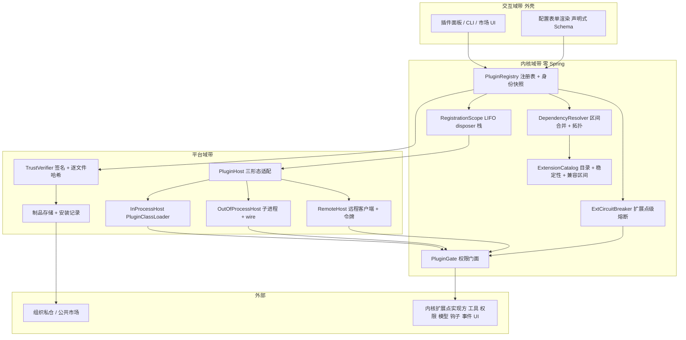
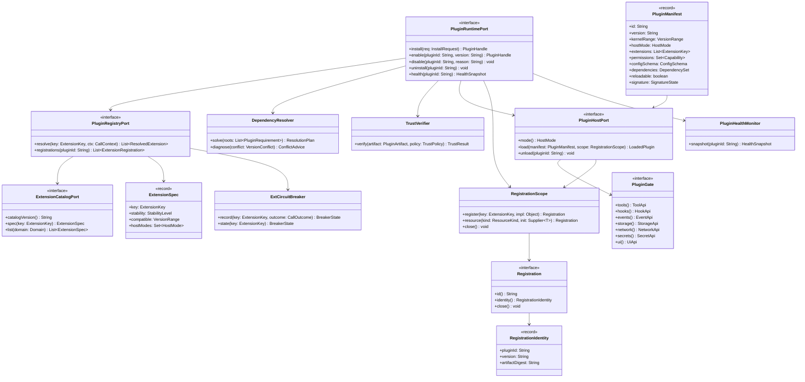
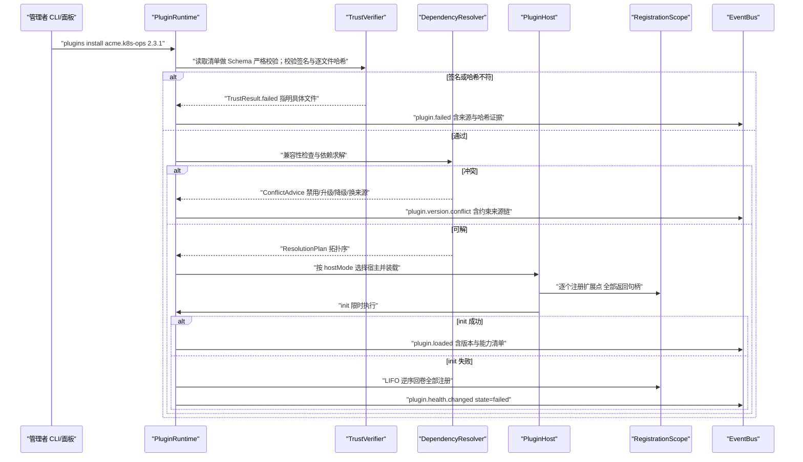
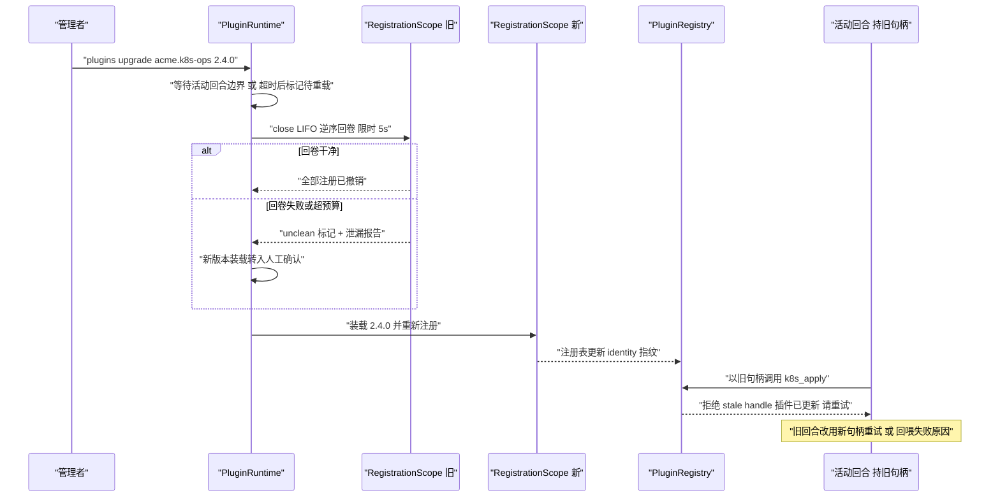
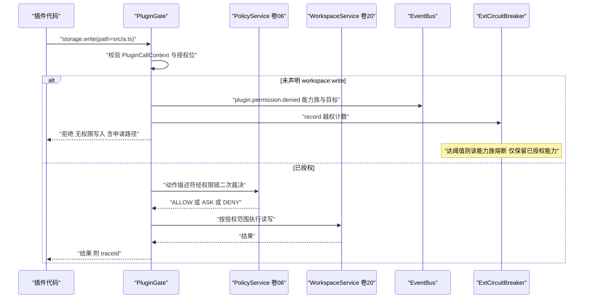
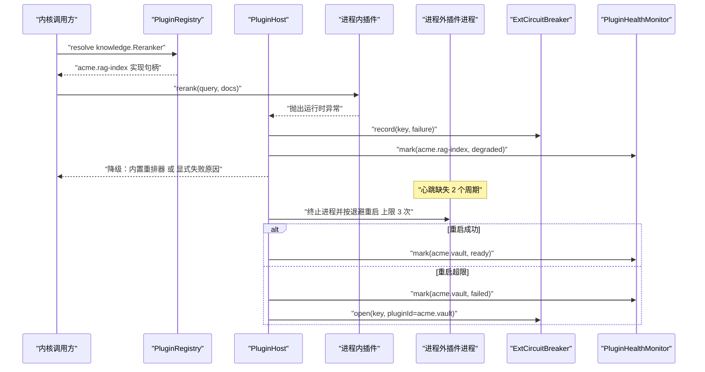
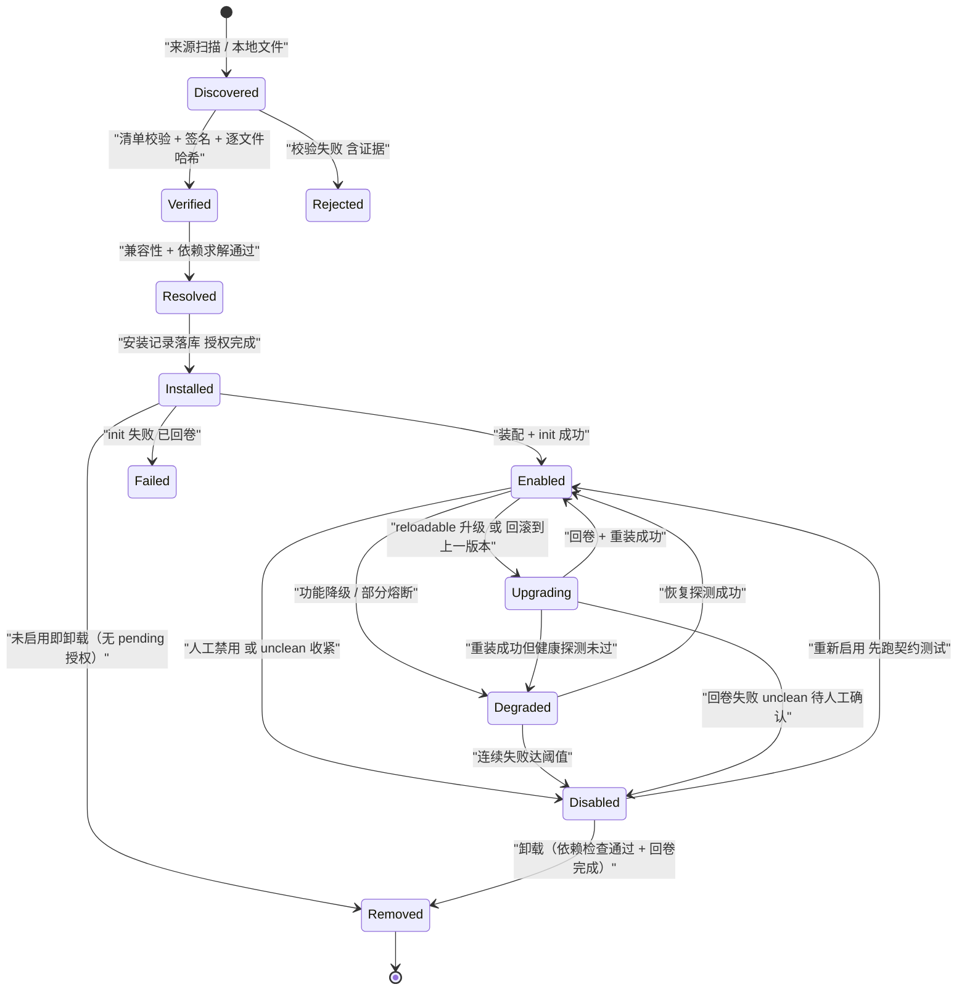
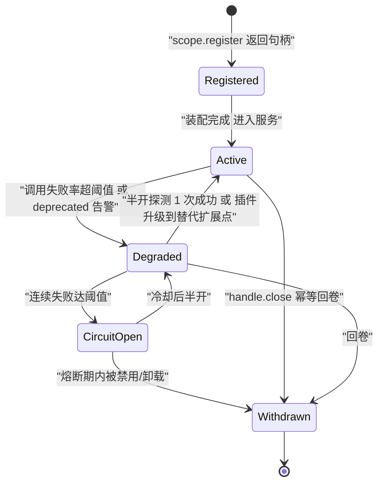

# Phase B 实现方案 18 · 插件与扩展体系（Plugin Runtime）

> **上游契约**：Phase A 卷 18《插件化与扩展体系》§2–§8（REQ-PLG-1…12）、决策 D-PLG-1…12；关联卷：01（内核/外壳与装配）、05（工具身份快照）、06（权限与审批）、07（沙箱）、08（技能与信号链）、16（事件）、17（钩子）、19（持久化）、24（企业托管）、29（市场服务端）、30（供应链）、33（评测）。
> **定位**：Phase A 回答「扩展点有哪些、插件怎么写、怎么装、怎么隔离、怎么授权」；本文件回答**「三形态插件各自由什么装载、类加载与进程边界如何实现、注册即副作用如何回卷、依赖冲突如何求解与报错、权限门面逐项能做什么与不能做什么、装载与调用的性能预算与崩溃隔离如何落地」**。
> **竞品证据**：`research/competitors/04-deepseek-harness.md`（E1：自 vendor 的 Cordis 框架——插件向共享 `Context` 贡献服务/类型化事件/**可逆副作用**，卸载时注册全部回卷；waterfall 监听者必须显式 `next()`；**agent 循环本身也是插件**；`plugin_manager` + `cordis-host-runner` 且「没有任何模型工具可创建动态定义」，动态定义重启即消失；生成式 `config-catalog` 与启动期配置校验；pnpm 默认拒绝安装脚本逐条 review）、`02-opencode.md`（E1：`PluginHost` 把插件面收敛为**命名空间 transform + reload + 少量命令式动作**；按插件 ID 加 `KeyedMutex` 串行、每次 `add` 先关旧 scope、`loading.has(id)` 直接拒绝「Plugin load cycle detected」、`Effect.addFinalizer` 关闭全部、加载失败进 `failures` map 不阻塞其它插件；插件可安装插件；**插件与应用同进程同权限**是反面教材）、`07-qoder.md`（E2+E1：`.qoder-plugin/plugin.json` 清单（仅 `name` 必填）、`commands/agents/skills/hooks/output-styles/bin/.mcp.json` 打包面、`plugins install --scope user|project|local`、`enabledPlugins` 写回 `settings.json`、marketplace 支持 `git-url`/`owner/repo`/本地路径与 `name@marketplace-name` 命名空间、插件钩子额外注入 `QODER_PLUGIN_ROOT`/`QODER_PLUGIN_DATA`、**内置安全能力以 vendored 插件分发**）、`01-claude-code-purpose-built.md`（E2：`plugin.json` 身份 + `marketplace.json` 目录 + `/plugin install` + `--plugin-dir`（仅建议指向可信归档）+ 托管插件；E1 衍生品：`dependencyResolver.ts`、内置插件注册表 ID 形如 `{name}@builtin` 与市场插件 `{name}@{marketplace}` 区分）、`08-gemini-cli.md`（E1：扩展＝清单化发行单元（MCP server + 上下文文件 + 自定义命令 + hooks + 子代理 + skills + 主题）+ `integrity.ts` 哈希校验 + 画廊 + `extensions install/update/link/enable/disable/configure` 与 `--auto-update/--pre-release/--consent/--skip-settings`）。
> **不修改 Phase A**：选定分支均落在 D-PLG-1…12 内；新增实现级决策登记为 `I-PLG-n`（§12）；三处跨卷口径冲突以**修订建议**形式记录在 §4.7，不改动 Phase A 卷册。

---

## 1. 实现目标与范围

### 1.1 本组件解决什么

1. **扩展点目录是一等公民**：23 域 122 类扩展点（按「一实现一注册点」估算 ≥300 个具体注册点）带稳定性级别、兼容区间与宿主形态，目录由单一事实源生成并被 CI 校验（REQ-PLG-1/24）。
2. **三形态装载**：进程内 JAR（性能敏感且可信）、独立进程（不可信或需硬隔离）、远程服务（企业集中部署）统一以「能力接口 + 注册描述」交互，插件代码不因宿主形态分支。
3. **注册即副作用**：任何注册（扩展点实现、工具、钩子、事件消费者、UI 项、MCP 连接、定时器）都必须返回 `Registration` 句柄；禁用/卸载时按 **LIFO 逆序回卷**，回卷失败必须隔离并告警，绝不允许「卸载后仍有残留副作用」。
4. **确定性依赖求解**：插件 × 插件、插件 × 技能、插件 × 内核版本三者统一求解；冲突给出**可操作建议**（禁用/升级/降级/替换来源），而不是「启动失败无解释」。
5. **权限门面**：插件只能经门面访问内核能力；无权限放大、不可直连存储、不可跨租户、不可绕过权限与沙箱；越权即拒绝 + 审计（安全事件）。
6. **性能与崩溃隔离**：装载 ≤1.5s（10 个插件）；进程内调用 ≤100µs、进程外 ≤5ms；单插件崩溃/挂死不拖垮内核（扩展点级降级 + 熔断 + 进程外重启）。
7. **生态与供应链**：清单 + 签名 + 逐文件哈希 + 来源四要素；三层分发（本地/组织私仓/公共市场）与企业白名单；开发套件（脚手架 → 夹具 → 热重载调试 → 契约测试 → 打包签名 → 发布）全链路可跑。

### 1.2 本组件不解决什么

| 不解决 | 归属 |
| --- | --- |
| 钩子点语义、匹配语法与失败策略 | 卷 17（插件只是钩子的一种实现形态） |
| 各扩展点的业务语义（工具/权限/模型/沙箱…） | 各卷（本卷只定义目录化装载与治理） |
| Skill 内容包与技能生态 | 卷 08（技能与插件共用打包/签名/市场机制，但技能是内容扩展） |
| 权限决策链与审批通道 | 卷 06（插件声明能力 → 卷 06 授权 → 运行期门面校验） |
| 市场服务端实现（索引、审核、下架） | 卷 29 RegistryService |
| 隔离技术细节（Landlock/Seatbelt/容器） | 卷 07（进程外插件的硬限制复用隔离档位表） |

### 1.3 上下游依赖

| 方向 | 依赖方 | 契约 |
| --- | --- | --- |
| 上游 | 卷 01 装配 | 内核域组件（零 Spring）；外壳经 `@AutoConfiguration` + `@ConditionalOnMissingBean` 装配，插件装载发生在内核装配之后、首会话之前 |
| 上游 | 卷 06 权限 | 安装期能力授权（人在场，R4/R5）+ 运行期门面逐调用校验；`permission.policy` 类扩展点只能**收窄** |
| 上游 | 卷 07 沙箱 | 进程外插件与插件脚本走 `SandboxPlanRequest`；远程插件出网走代理与域名白名单 |
| 上游 | 卷 16 事件 | `plugin.*` 与 `extension.registered/deprecated` 全量入总线（含签名与授权引用） |
| 上游 | 卷 17 钩子 | 插件是钩子的实现形态之一；插件**只能绑定既有点**，不得造点（见 §4.7 R3） |
| 下游 | 卷 19/29/30 | `oc_plugin*` 表与对象存储制品；市场服务端；供应链扫描与信任根 |
| 下游 | 卷 22/23/33 | `oc-plugin` CLI 与桌面端插件面板；契约测试夹具供卷 33 复用 |

### 1.4 归属分带与模块落位（卷 27 §4.1 权威名；v1 列为迁移来源）

| 组件 | 带 | 目标模块 | v1 仓模块（迁移来源） | 装配方式 |
| --- | --- | --- | --- | --- |
| 清单模型、目录、稳定性契约、门面接口、disposer 栈（契约面） | 内核域带 | `harness-contract`（`com.hk.opencoding.contract.plugin`） | `open-coding-core-api`（`com.hk.opencoding.core.plugin`） | 零 Spring，可单测 |
| 目录实现、依赖求解、稳定性契约校验、门面默认实现（纯逻辑） | 内核域带 | `harness-platform/platform-plugin`（`pure` 子包：**无 Spring 注解**，由 `config` 子包显式装配；卷 27 §4.3 卷 18 落点仅 `platform-plugin` + `harness-contract`） | `open-coding-core-implementation`（默认实现） | 零 Spring 包级纪律，可单测 |
| 类加载器、进程宿主、远程客户端、签名校验、制品存储、市场客户端 | 平台域带 | `harness-platform/platform-plugin` | `open-coding-infrastructure`（`plugin` 子包） | Spring 装配；`PluginHostPort` 三实现按 `hostMode` 选择 |
| 安装记录、授权记录、注册表、健康与熔断计数 | 平台域带 | `harness-platform/platform-persistence`（`oc_plugin`、`oc_extension_registry` + Flyway） | `open-coding-domain` | MyBatis-Plus，`@TableName` 逐表显式声明 |
| REST / CLI / 桌面面板 / 配置表单渲染 | 交互域带 | `harness-host/host-protocol`（`/api/v1/plugins`）+ `22`/`23` 端渲染 | `open-coding-interfaces` | Spring MVC + 会话协议；权限点 `plugin.manage` / `plugin.read` |
| 装配（`PluginAutoConfiguration`） | 外壳 | `harness-host/host-bootstrap` | `open-coding-bootstrap` | 显式装配计划 + `hostMode` 能力门控 |
| 开发套件（脚手架/契约测试/打包签名/发布） | 生态带 | `tools/plugin-sdk`（独立工程，**仅依赖 `harness-contract`**；命名待卷册确认，见下） | `open-coding-plugin`（SDK 与工具） | 独立 CLI；SDK 只依赖契约模块 |

> 模块名桥接（R07 收敛）：目标名以卷 27 §4.1/§4.3 为准（卷 18 → `platform-plugin` + `harness-contract`）；**构建、`-pl` 选择器与验收命令只允许目标名**，v1 名列仅供迁移期对账。
> **命名缺口（登记 X 修订）**：卷 27 §4.1 未为「插件开发套件/SDK」命名模块（§4.3 仅把 SDK 列为卷 18 产出物）。本文件取 `tools/plugin-sdk`（独立工程，仅依赖 `harness-contract`），并在 `reviews/R07-scope-build-kernel.md` 登记建议：§4.1 增列 `platform-plugin/plugin-sdk` 或 `tools/plugin-sdk`。**R1–R4 不因命名放宽**：SDK **不得**依赖内核实现或平台适配器；Lombok 为编译期注解处理、非运行期依赖，契约与内核模块允许使用。

### 落地核对（R07：模块 / 顺序 / 批次 / 门禁 / I-* 落点）

- **实施顺序（卷 27 §4.5）**：第 18 步「插件体系（扩展点目录 + 装载 + 门面 SDK）」，依赖第 17 步（Skill + MCP：首批扩展点消费方）——**契约先行**：扩展点目录与 `plugin.json` 清单 schema 在第 1/2 步入 `harness-contract`，`platform-plugin` 可与 17 并行开发、在第 18 步收口。
- **数据批次（卷 27 §4.4）**：`oc_plugin`、`oc_plugin_version`、`oc_plugin_grant`、`oc_plugin_health`、`oc_extension_registry` → **B6**（插件/Skill/Hook/MCP + 企业），依赖 B1–B5。
- **门禁映射（卷 27 §4.6）**：目录/稳定性/求解/disposer 单测 → 「单元测试 + 覆盖率门」；门面与越权、类加载隔离与泄漏 → 「集成测试」；三形态 `ContractSuite` → 「契约测试」；`plugin-gates`（目录 freshness/完整性/残留与 unclean）→ 「契约测试」+「安全红队」；`plugin-fault-inject.sh` → 「集成测试（故障注入层）」。
- **I-* 落点**：I-PLG-1 → `harness-contract`（扩展点目录常量与契约测试骨架）+ CI freshness 门；I-PLG-2 → `platform-plugin`（`PluginClassLoader`：委派反转 + API 白名单 + 禁内核实现包）；I-PLG-3 → `platform-plugin`（`PluginHostPort` 三实现：进程内/进程外/远程）；I-PLG-4 → `platform-plugin`（`pure` 包 `DependencyResolver` + 锁文件）；I-PLG-5 → `platform-plugin`（`RegistrationScope` + LIFO disposer 栈）+ `harness-host/host-bootstrap`（回卷装配钩子）；I-PLG-6 → `platform-plugin`（`PluginSignatureVerifier`：Ed25519 + 组织信任根 + 逐文件哈希）+ `harness-contract`（信任根引用，与 08/17 共用）；I-PLG-7 → `platform-plugin`（整插件 reload + 身份快照拒绝旧句柄）。

### 1.5 六条不可协商的不变式

| # | 不变式 | 违背后果 |
| --- | --- | --- |
| N1 | **注册即副作用**：任何注册必须返回 `Registration` 句柄；禁用/卸载按 LIFO 逆序回卷且回卷可重入（幂等）；无句柄注册在 `RegistrationScope` API 形状上不可能表达 | 卸载残留（内存/线程/连接/文件泄漏） |
| N2 | 插件**不得直连数据库/Redis/对象存储**，必须经内核端口；**不得跨租户**读取任何数据 | 隔离与审计被绕过（SEV2） |
| N3 | 插件权限**不得超过安装者**，且只能收窄；越权即拒绝 + 审计 + 熔断计数（无权限放大） | 提权 |
| N4 | 未通过签名与完整性校验的插件**不得装载**（企业作用域强制）；校验覆盖**清单 + 全部载荷文件**（含脚本、提示词、UI 资源、二进制） | 供应链事故 |
| N5 | 单插件故障**只影响自身注册的扩展点**：命中服务不可用时降级到内置实现（若有）或显式失败，不阻塞内核与其它插件 | 一个坏插件拖垮全部会话 |
| N6 | 插件**不得替换或修补内核循环**：Agent 循环、压缩、权限裁决链、事件总线骨架均为内核资产，只能经既有扩展点参与（REQ-PLG-18） | 内核行为不可预测、评测与回放失效 |

---

## 2. 功能需求清单（REQ-PLG-n）

| 编号 | 需求描述 | 来源 | 优先级 | 验收要点 |
| --- | --- | --- | --- | --- |
| REQ-PLG-1 | 扩展点目录：≥30 类、100+ 点，三级稳定性（`stable` / `evolving` / `experimental`）+ 每点兼容区间；本文落地为 23 域 122 类（§4.2） | 卷 18 §3 D-PLG-1 | P0 | 未知扩展点/越界版本拒绝注册；目录版本随发行递增 |
| REQ-PLG-2 | 三形态插件（进程内 JAR / 独立进程 / 远程服务）+ 统一能力接口与注册描述；插件代码不因宿主形态分支 | 卷 18 §3 D-PLG-2 | P0 | 三形态各一条端到端用例；同一插件二进制在进程内/外行为一致（除性能与隔离差异） |
| REQ-PLG-3 | 显式清单：id/版本/作者/签名/kernel 兼容区间/hostMode/扩展点/权限/资源/配置 Schema/依赖/UI 扩展/`reloadable` | 卷 18 §3 D-PLG-3、§4.2 | P0 | 缺字段或非法字段装载期 Fail-Fast；清单无「隐式默认」 |
| REQ-PLG-4 | 依赖求解：依赖图 + 拓扑排序 + 版本约束求解 + 冲突报告（含可操作建议） | 卷 18 §3 D-PLG-4 | P0 | 同锁文件同装载顺序；冲突建议含「禁用/升级/降级/换来源」四类动作 |
| REQ-PLG-5 | 隔离：进程内独立类加载器 + 受限 API 面 + 权限门面；进程外进程边界；两者统一「能力接口」 | 卷 18 §3 D-PLG-5、§4.4 | P0 | 插件看不到内核内部实现类（用例）；卸载后类加载器可被 GC（用例） |
| REQ-PLG-6 | 生命周期六操作（安装/启用/禁用/升级/卸载/回滚）+ `reloadable` 热重载（先禁用后启用，状态自管） | 卷 18 §3 D-PLG-6 | P0 | 六操作各有用例；热重载后注册表与新版本一致、旧句柄失效 |
| REQ-PLG-7 | 权限：清单声明 → 安装时授权（人在场）→ 运行期门面逐调用校验；无权限放大 | 卷 18 §3 D-PLG-7 | P0 | 越权用例被拒 + 审计；`plugin.permission.denied` 可聚合 |
| REQ-PLG-8 | 市场与分发：本地 / 组织私仓 / 公共市场三层 + 全部要求签名 + 企业可禁用公共市场 | 卷 18 §3 D-PLG-8 | P2 | 未签名在企业作用域被拒；私仓白名单生效 |
| REQ-PLG-9 | 开发套件：脚手架 + 测试夹具（内存内核/假模型/假工具）+ 本地热重载调试 + 契约测试 + 打包签名 + 发布 | 卷 18 §3 D-PLG-9、§4.5 | P1 | 从 `init` 到 `publish` 全链路在一台开发机上跑通（含夹具用例） |
| REQ-PLG-10 | 可观测与熔断：健康状态（初始化/就绪/降级/故障）+ 按插件隔离日志 + 调用量/延迟/错误率指标 + 扩展点级熔断 | 卷 18 §3 D-PLG-10 | P0 | 熔断后该扩展点降级到内置或显式失败；健康变更事件可订阅 |
| REQ-PLG-11 | 配置与密钥：插件声明配置 Schema → 自动生成表单 → 密钥经 `SecretPort` 引用注入；配置版本化与审计 | 卷 18 §3 D-PLG-11 | P1 | 配置非法值装载期拒绝；插件日志/内存无明文密钥（用例） |
| REQ-PLG-12 | UI 扩展：面板/命令/设置页/状态栏项/会话内联卡片/通知模板以声明式描述 + 沙箱化渲染 | 卷 18 §3 D-PLG-12、§10 | P2 | 面板与命令在桌面端可用；渲染沙箱不获得 DOM 全权 |
| REQ-PLG-13 | **注册即副作用**：注册 API 形状强制返回 `Registration`；回卷 LIFO、幂等、失败隔离并告警 | 竞品增量：04-deepseek §4.14 [E1]（`ctx.effect()` 可逆副作用）、02-opencode §4.8 [E1]（`Effect.addFinalizer`）、L-067 | P0 | 「无句柄注册」不可编译（API 断言）；卸载后残留检测用例（线程/连接/临时目录为零） |
| REQ-PLG-14 | **注册身份快照**：扩展点实现句柄冻结身份指纹（插件 ID + 版本 + 构件哈希）；热替换后旧回合的持有句柄调用被**明确拒绝** | 竞品增量：02-opencode §4.8 [E1]（`tool/registry.ts` 身份快照）、L-025 | P0 | 旧句柄调用返回「插件已更新，请重试」；静默执行新实现视为缺陷 |
| REQ-PLG-15 | **依赖环与重复装载拒绝**：加载中同 ID 再次 `add` 即拒绝（`PLUGIN_LOAD_CYCLE`）；依赖图环检测在求解期完成 | 竞品增量：02-opencode §4.8 [E1]（`loading.has(id)`、load cycle 报错） | P0 | 自引用环与互环用例被拒并给出环路径 |
| REQ-PLG-16 | **单插件失败隔离**：初始化/调用失败只影响该插件注册的扩展点；失败进入插件级 `failures` 记录并暴露健康状态 | 竞品增量：02-opencode §4.8 [E1]、04-deepseek §4.14 [E1] | P0 | 单插件 init 失败不影响其它插件装载（用例）；失败可见于面板与事件 |
| REQ-PLG-17 | **配置校验无硬编码可调项**：插件声明的可调参数必须来自配置 Schema；内核侧不出现插件专属魔法值；启动期校验缺失必填项 | 竞品增量：04-deepseek §6-2 [E1]（config-catalog + 启动校验）、L-081 | P1 | 插件配置项 100% 来自 Schema（扫描用例）；缺失必填项启动失败并指明字段 |
| REQ-PLG-18 | **循环变更走扩展点**：内核循环、压缩、权限裁决链、事件骨架不可被插件替换或 patch；循环行为差异只能经 `LoopStrategy` 等既有扩展点表达 | 竞品增量：04-deepseek §4.14 [E1]（agent-loop 即插件）**保守裁剪** + 卷 12 D-AG-1 | P0 | 插件清单声明替换内核循环即装载期拒绝；`LoopStrategy` 扩展点有契约测试 |
| REQ-PLG-19 | **最小权限切分**：只读检视类扩展点（`plugin.inspect.*`）可暴露给模型；`install/enable/upgrade/uninstall` 仅走人在场审批通道（R4/R5），不暴露为模型工具 | 竞品增量：04-deepseek §4.14 [E1]（`cordis_inspect_*` 只读、无模型工具可创建动态定义）、L-059 | P0 | 模型调不到安装类动作（工具面断言）；安装动作审批链可回放 |
| REQ-PLG-20 | **发行物完整性四要素**：清单 + 签名 + **逐文件哈希**（覆盖脚本/提示词/UI 资源/二进制）+ 来源记录；哈希清单与签名同链 | 竞品增量：08-gemini-cli §1 条目 8 [E1]（`integrity.ts`）、L-018 | P0 | 任一文件篡改即拒绝安装；来源四要素在 `oc_plugin` 可查 |
| REQ-PLG-21 | **来源分级与白名单**：官方（builtin）/ 平台 / 组织私仓 / 公共市场四级；企业可禁公共市场、强制私仓白名单、强制进程外 | 竞品增量：01-claude-code §2.1 [E2]（托管插件）、08-gemini-cli §4.8 [E1] | P1 | 四级来源命名空间 ID（`{name}@builtin` / `@marketplace`）不冲突；白名单生效 |
| REQ-PLG-22 | **插件面形状**：插件面收敛为「命名空间 `transform` + `reload` + 少量命令式动作」，禁止向插件开放任意内部服务句柄 | 竞品增量：02-opencode §4.8 [E1]（`PluginHost` 面）、L-067 | P0 | `PluginGate` 暴露的方法集合被契约测试冻结；新增门面方法需走 `core-api` 版本演进 |
| REQ-PLG-23 | **策略型插件可离线降级**：插件提供的策略/判定类扩展点（权限规则、风险判定、AI 审阅）失败时保守落人工 `ask`/`UNAVAILABLE`，不得静默放行 | 竞品增量：L-069（审阅必须可离线降级，失败降级为 ask 而非放行） | P0 | 插件策略扩展点失效 → 决策链保守分支（用例）；放行路径不存在 |
| REQ-PLG-24 | **依赖治理**：进程内插件依赖白名单 + 锁文件 + 传递依赖裁剪；禁止插件携带安装脚本式自举行为（构建期由沙箱约束） | 竞品增量：04-deepseek §2 [E1]（pnpm `strictDepBuilds` 逐条 review）、L-018 | P1 | 未列入白名单的传递依赖装载期拒绝；打包产物含锁文件 |

> 说明：REQ-PLG-13…24 为竞品研究带来的增量需求（≥2 条要求已满足，实为 12 条），落地位置分别在 §3（I-PLG-1/3/4/5/6/7）、§4.3（disposer 模型）、§4.4（门面矩阵）、§4.5（三形态）、§4.6（销毁与泄漏检测）、§5（类图）、§9（SDK 与门面 API）。

---

## 3. 技术方案选型（M×N 比选）

评分口径沿用 `README §4`：F 功能完备 ×30、U 体验 ×20、S 稳定与安全 ×25、M 可维护 ×25（满分 100）。

### 3.1 I-PLG-1：扩展点目录载体

| 分支 | 描述 | F | U | S | M | 加权 | 结论 |
| --- | --- | --- | --- | --- | --- | --- | --- |
| B1 手写清单（Markdown + 人工同步） | 起步最快 | 6 | 6 | 5 | 5 | 55 | 淘汰：必然腐化（缺 CI 门禁的复制文档比不复制更糟） |
| B2 YAML 目录事实源 → 注解处理器生成 Java 常量与契约测试骨架，CI 校验 freshness | 单一事实源、可机检 | 9 | 8 | 9 | 9 | 88 | **选定** |
| B3 运行期反射扫描 + 注解即注册 | 零同步成本 | 8 | 7 | 7 | 6 | 70.5 | 淘汰：装载顺序不确定，破坏「同锁文件同行为」 |

**选定 B2 的代价**：新增扩展点需改目录文件并发版（一次性成本）；目录文件进入评审门禁。**回退触发**：若季度内目录变更评审成为瓶颈，评估把 `experimental` 级别扩展点的声明下放给插件侧（灰度自治），`stable/evolving` 仍走内核台账。

### 3.2 I-PLG-2：进程内插件类加载隔离

| 分支 | 描述 | F | U | S | M | 加权 | 结论 |
| --- | --- | --- | --- | --- | --- | --- | --- |
| B1 同 ClassLoader（不隔离） | 性能最好 | 6 | 7 | 3 | 5 | 52.5 | 淘汰：依赖冲突与内部 API 泄漏不可控（opencode 反面教材） |
| B2 自研 `PluginClassLoader`（双亲委派反转 + `core-api` 白名单包 + 禁止委派到内核实现包） | 可控、可卸载、无重依赖 | 9 | 8 | 9 | 8 | 86.5 | **选定** |
| B3 JPMS 图层（`ModuleLayer` + 模块描述符） | 语言级强封装 | 8 | 7 | 8 | 6 | 74 | 备选（若上游 SDK 全面模块化且 Java 生态跟进） |

**选定 B2 的代价**：需要维护「可委派包白名单」（契约包前缀 `com.hk.opencoding.contract.*`，迁移期含 v1 前缀 `com.hk.opencoding.core.api.*`——见 §1.4 对照表 + JDK 子集）与被禁包清单（内核实现、`platform-*`/`domain`、`infrastructure`）；插件若反射内核类将得到 `ClassNotFoundException` 而非静默成功。**回退触发**：若白名单维护成本或逃逸（反射绕过）问题超阈值，切换到 B3 并在 `plugin.json` 增加模块声明。

### 3.3 I-PLG-3：进程外插件通信协议

| 分支 | 描述 | F | U | S | M | 加权 | 结论 |
| --- | --- | --- | --- | --- | --- | --- | --- |
| B1 自有 JSON-RPC over stdio | 零依赖、易调试 | 8 | 8 | 8 | 8 | 80 | 作为**默认**形态（对齐 L-075 的「子进程 + 双向 JSONL」经验） |
| B2 gRPC over Unix domain socket / 命名管道 | 强类型、双向流 | 9 | 7 | 8 | 7 | 78.5 | 作为**可选加速形态**（高吞吐扩展点，如模型适配与检索） |
| B3 HTTP/REST（远程服务） | 部署简单、跨网 | 9 | 8 | 8 | 6 | 78 | 用于**远程插件**（企业集中部署）与市场托管插件 |

**选定策略**：**B1 为进程外默认 + B3 为远程形态 + B2 为可插拔加速**（三者统一在 `PluginWireProtocol` 抽象下，协议实现可替换）。代价：三协议并存带来测试矩阵膨胀 → 用同一套契约测试（`ContractSuite`）分别跑三种 wire，协议差异只在编码层。**回退触发**：若 B2 引入的运维复杂度（证书、socket 权限）超过收益，降级为「仅 B1 + B3」。

### 3.4 I-PLG-4：依赖求解器

| 分支 | 描述 | F | U | S | M | 加权 | 结论 |
| --- | --- | --- | --- | --- | --- | --- | --- |
| B1 顺序装载（目录序） | 实现最简 | 5 | 6 | 6 | 8 | 61.5 | 淘汰：不可预测 |
| B2 自研「区间合并 + 拓扑排序 + 显式冲突诊断」 | 依赖面小、可解释、无重依赖 | 9 | 8 | 9 | 9 | 88 | **选定** |
| B3 嵌入 Maven Resolver / PubGrub 类回溯求解 | 处理复杂多主版本 | 9 | 7 | 8 | 6 | 77.5 | 备选（依赖图 > 300 节点或出现三主版本并存需求时启用） |

**选定 B2 的代价**：不支持复杂回溯（同一插件多主版本并存直接拒绝并给出建议）；求解输出必须含「约束来源链」（谁要求了哪个区间）。**回退触发**：单租户插件依赖图 > 300 节点或季度冲突诊断工单 > 20 时启用 B3，锁文件格式保持兼容。

### 3.5 I-PLG-5：disposer 回卷机制

| 分支 | 描述 | F | U | S | M | 加权 | 结论 |
| --- | --- | --- | --- | --- | --- | --- | --- |
| B1 `java.lang.ref.Cleaner` / PhantomReference 兜底 | 零显式成本 | 6 | 6 | 6 | 6 | 60 | 淘汰：回收时机不确定，无法保证「禁用即回卷」 |
| B2 显式 `RegistrationScope` + LIFO disposer 栈 + Cleaner 仅作泄漏兜底 | 确定、可观测、可测试 | 9 | 9 | 9 | 8 | 88 | **选定** |
| B3 依赖 Spring `DestroyAware` / Bean 生命周期 | 复用框架 | 7 | 7 | 7 | 7 | 70 | 淘汰：内核域零 Spring；且无法覆盖非 Bean 注册（MCP 连接、定时器） |

**选定 B2 的代价**：插件作者必须遵守「有注册必有句柄」（SDK 用类型系统强制）；回卷失败时无法「撤销副作用」，只能隔离并告警（且泄漏检测会持续报告）。**回退触发**：不触发（不变式 N1 无备选）。

### 3.6 I-PLG-6：签名与信任模型

| 分支 | 描述 | F | U | S | M | 加权 | 结论 |
| --- | --- | --- | --- | --- | --- | --- | --- |
| B1 仅整包哈希（无签名） | 最简 | 5 | 8 | 4 | 9 | 60 | 淘汰：无法验证发布者身份 |
| B2 Ed25519 + 组织信任根 + 摘要 pin + 逐文件哈希清单（与卷 08/17 共用信任根） | 离线可校验、密钥可控、跨扩展面统一 | 9 | 8 | 9 | 8 | 86.5 | **选定** |
| B3 Sigstore keyless（OIDC 身份） | 无密钥管理、公共市场友好 | 8 | 7 | 8 | 6 | 74 | 作为公共市场叠加通道（组织信任根仍为基线） |

**选定 B2 的代价**：组织需托管信任根与轮换流程（复用卷 08 的 `trust-root` 清单与轮换工具）；公共市场身份弱绑定 → 由 B3 叠加。**回退触发**：公共市场要求强身份或组织希望免自管密钥 → 全量切换 keyless 并保留组织根兼容读入。

### 3.7 I-PLG-7：热重载边界与身份快照

| 分支 | 描述 | F | U | S | M | 加权 | 结论 |
| --- | --- | --- | --- | --- | --- | --- | --- |
| B1 不热重载（升级即重启） | 最简、最安全 | 6 | 5 | 9 | 8 | 70 | 作为**默认**：`reloadable=false` 插件的升级需重启/重开会话 |
| B2 全量 reload（禁用 → 回卷 → 再启用）+ 身份快照拒绝旧句柄 | 体验好、语义清晰 | 9 | 9 | 8 | 8 | 85.5 | **选定**（仅 `reloadable=true`） |
| B3 扩展点级部分重载（细粒度热替换） | 影响面最小 | 8 | 9 | 6 | 5 | 68.5 | 淘汰：状态一致性难证明；与「注册即副作用」的整插件回卷语义冲突 |

**选定 B2 的代价**：重载期间该插件的扩展点短暂不可用（< 1s，观察类扩展点无感；同步类扩展点由熔断/内置实现兜底）；插件必须自管状态（`reloadable=true` 的清单契约要求明确写「状态声明」）。**回退触发**：若出现「重载引发旧会话状态错乱」的反复缺陷，收紧为「重载仅在无活动回合时执行」（默认排队到回合边界）。

**与竞品对照的取舍**：插件体系在竞品中有三个反面/正面样本——① **插件与应用同进程同权限**（OpenCode `[E1]`，`research/competitors/02-opencode.md`）：实现最简但是提权面，本文件以「三形态装载 + 权限门面 + 授权位只收窄」替代（I-PLG-2/3/6）；② **可逆副作用与 disposer 回卷**（DeepSeek 自 vendor 的 Cordis 框架 `[E1]`，`research/competitors/04-deepseek-harness.md`）：本文件直接采纳为 N1 不变式（注册即副作用 + LIFO 回卷 + 回卷可重入），并把「卸载后残留检测全零」写成发布门禁；③ **清单化发行 + 完整性校验**（Gemini CLI `integrity.ts` `[E1]`、Qoder `plugin.json` + marketplace `[E2]`）：采纳逐文件哈希与来源白名单，但**默认关闭公共市场**（`marketplace.enabled=false`）且企业强制签名——竞品「一键从公共市场安装」的可用性被放弃，换取供应链风险收口（N4）。第四条取舍：热重载选「整插件回卷 + 身份快照拒绝旧句柄」（I-PLG-7 B2）而非扩展点级热替换——后者状态一致性难证明，与「注册即副作用」的整插件回卷语义冲突。

---

## 4. 总体架构与扩展点目录

### 4.1 组件与数据流



### 4.2 扩展点目录（23 域 / 122 类 / ≥300 注册点）

**稳定性契约**：`stable` = 跨大版本兼容（弃用需 ≥2 小版本预告）；`evolving` = 小版本允许增删（注册方必须容忍签名变化，走 `ExtensionRegistration` 描述符）；`experimental` = 可破坏（默认不加载，企业可显式开启）。每类带 `compatible: ">=x.y <z.0"` 区间，装载期校验（REQ-PLG-1）。

| 域（卷） | 扩展点类（类数） | 稳定性 | 宿主形态 |
| --- | --- | --- | --- |
| 架构（01） | StoragePort、RuntimeStorePort、HostAdapterPort、ProtocolCodec、ClockPort、IdPort、CapabilityProbe、AssemblerContributor（8） | `stable` ×6 / `evolving` ×2 | 内 |
| 模型（02） | ProtocolAdapter、RouterRule、Decorator、UsageSink、SecretResolver、EmbeddingProvider、ContentSanitizer（7） | `stable` ×5 / `evolving` ×2 | 内 / 外 / 远 |
| 上下文（03） | TokenizerEstimator、SectionProvider、Compressor、RetrievalAugmentor、InjectionDetector、ContextView（6） | `evolving` | 内 / 外 |
| 提示词（04） | AssetSource、FragmentProvider、PolicyRule、AssemblyStage、EvalHook（5） | `evolving` | 内 |
| 工具（05） | ToolProvider、ToolDecorator、ToolResultRenderer、ConflictResolver、ToolAlias、SandboxPolicyContributor（6） | `stable` ×4 / `evolving` ×2 | 内 / 外 |
| 权限（06） | PolicyProvider、PolicyRule、RiskAssessor、ApprovalChannel、ApprovalPolicy、AuditSink、CapabilityToken（7） | `stable` ×3 / `evolving` ×4 | 内 / 外 / 远 |
| 沙箱（07） | IsolationProvider、DangerRule、NetworkPolicy、CredentialBroker、SnapshotProvider、ExecutionRecorder（6） | `evolving` | 外 |
| Skill（08） | SkillSource、SkillTrigger、SkillRouter、SkillAssembler、SkillEval、SkillPublisher（6） | `evolving` | 内 |
| MCP（09） | McpTransport、McpAuth、McpCapabilityMapper、McpPolicy、McpExposure（5） | `evolving` | 内 / 外 / 远 |
| 记忆（10） | MemoryStore、MemoryWriter、MemoryRanker、PiiDetector、MemorySync（5） | `evolving` | 内 / 外 |
| 知识（11） | Connector、Parser、Chunker、EmbeddingProvider、Reranker、IndexStore、KnowledgePolicy（7） | `evolving` | 内 / 外 / 远 |
| Agent（12） | LoopStrategy、PlanningStrategy、SubAgentPolicy、VerificationProvider、ProgressMetric、AgentDefinitionSource、TrajectoryExporter（7） | `evolving` | 内 |
| Teams（13） | RoleLibrary、Topology、AssignmentStrategy、ArbitrationPolicy、TeamBudgetPolicy、TeamView（6） | `experimental` | 内 |
| 任务（14） | WorkItemType、DecompositionStrategy、PriorityPolicy、AcceptanceValidator、TaskTemplateProvider、WorkItemView（6） | `evolving` | 内 |
| Goal/Schedule（15） | Trigger、AutonomyPolicy、ReportFormatter、NotificationChannel、GoalProgressMetric、CircuitBreakerPolicy（6） | `evolving` | 内 / 外 |
| 事件（16） | EventProducer、EventConsumer、Projection、RedactionRule、EventExportSink、ReplayPolicy（6） | `stable` ×2 / `evolving` ×4 | 内 / 外 |
| Hooks（17） | HookPoint（只读）、HookImpl、HookMatcher、HookPolicy、HookTemplateProvider（5） | `evolving` | 内 / 外 / 远 |
| 工作区（20） | WorkspaceProvider、FileSyncStrategy、EnvironmentProbe、ProcessSupervisor（4） | `stable` ×2 / `evolving` ×2 | 外 |
| Git（21） | GitHostProvider、MergeStrategy、ConflictResolver、CommitPolicy（4） | `evolving` | 内 / 外 / 远 |
| 端（22） | UI 面板、命令、设置页、状态栏项、内联卡片渲染（5） | `experimental` | 外（前端沙箱渲染） |
| 企业（24） | IdentityProvider、BillingSink、ComplianceReport、FeatureFlagProvider（4） | `stable` | 内 / 外 / 远 |
| 前沿（25） | ExperimentProvider、ComputerUseAdapter（2） | `experimental` | 外 |
| 插件元（18） | PluginSource、PluginTrustPolicy、PluginConfigRenderer、PluginLifecycleHook（4） | `evolving` | 内 |

> 计数口径：122 类扩展点；按「一实现一注册点」估算 ≥300 个运行时注册点（如 `ToolProvider` 每注册一个工具即一个注册点）。v1 里程碑要求 `stable` + `evolving` 全部落地、`experimental` 至少各有 1 个示例实现。

**安全关键扩展点标注（`securityCritical`）**：下列扩展点参与安全判定或边界执行，注册时额外受约束——`SecretResolver`、`NetworkPolicy`、`CredentialBroker`、`IsolationProvider`、`AuditSink`、`RiskAssessor`、`PolicyProvider`、`PolicyRule`、`ApprovalPolicy`、`ContentSanitizer`、`InjectionDetector`、`RedactionRule`。约束：插件实现默认**只可叠加收窄**（风险级只可提高、域名白名单只可减少、审计只可追加、脱敏只可增强、隔离档只可提高），**不得替换或停用既有内置实现**；企业如需替换须显式开启 `open-coding.plugin.security-critical-override`（默认 `false`）并按 admin 审批留痕（与卷 06 实现方案 §9.2「只能提高」、卷 07 实现方案 §9.3 SPI 约束同源）。

### 4.3 注册即副作用与 disposer 模型

| 资源类型 | 注册动作 | 回卷动作（disposer） | 失败处置 |
| --- | --- | --- | --- |
| 扩展点实现 | `scope.register(catalogKey, impl)` | 从注册表移除 + 失效身份快照 | 记录 `plugin.disposer.failed`，继续回卷其余项 |
| 工具 | `tools.register(ToolSpec)` | 撤销工具 + 清工具缓存与别名 | 同上；工具缓存按版本号自然失效 |
| 钩子绑定 | `hooks.bind(point, matcher, impl)` | 撤销绑定（组织托管绑定不可被插件撤销） | 同上 |
| 事件消费者 | `events.subscribe(type, consumer, filter)` | 退订 + 冲掉队列中未处理消息（有界丢弃） | 同上 |
| 定时器 / 调度 | `scheduler.schedule(spec, task)` | 取消任务 + 等待在途执行完成（有超时） | 超时则强制取消并告警 |
| MCP 连接 / 外部连接 | `mcp.connect(cfg)` | 关闭连接 + 释放句柄 | 同上 |
| 线程池 / 执行器、临时目录 | `runtime.executor(name, cfg)`、`workspace.tempDir(purpose)` | `shutdown()` + 超时 `shutdownNow()`；递归删除并校验干净 | 泄漏线程/残留文件检测兜底 |
| 密钥句柄、UI 扩展 | `secrets.acquire(ref, ttl)`、`ui.panel/command(...)` | 主动吊销 + 等 TTL 过期；通知前端卸载并清声明式缓存 | 吊销失败进审计（高优先级）；前端失联时下次连接对账 |

**回卷顺序**：严格 LIFO（后注册先回卷），保证依赖关系（先建的连接最后关）；回卷幂等（重复调用同一 `Registration.close()` 无副作用）；插件整体回卷预算默认 5s，超时后剩余项强制取消并标记该插件为 `unclean`（后续装载前要求人工确认）。

### 4.4 权限门面：插件能做什么 / 不能做什么

| 能力族 | 门面接口（能做什么） | 明确不能做什么 |
| --- | --- | --- |
| 工具 | 注册 / 装饰工具；读取工具目录元数据 | 绕过权限链与沙箱直接执行动作；伪造其余工具身份 |
| 钩子 | 绑定既有点、返回结构化决策 | 新增钩子点；放宽权限；在权限后改写 |
| 事件 | 订阅类型化事件（按租户/会话范围）；发布自定义事件（命名空间隔离） | 读取其它租户事件；伪造审计事件；修改事件信封 |
| 存储 | 经 `StoragePort`/仓储接口读写**本插件命名空间**数据 | 直连 DB/Redis/对象存储；跨命名空间读写；执行 DDL |
| 网络 | 经出网代理访问**声明的域名白名单** | 任意出网；访问元数据服务/内网地址（默认拒绝） |
| 密钥 | 取得**引用**与短期句柄（TTL、可吊销） | 读取密钥明文；把密钥写入日志/制品/事件 |
| 配置 | 声明 Schema；读写本插件配置（版本化 + 审计） | 修改内核配置；绕过必填校验 |
| 模型 | 注册适配器 / 装饰器（受 `stable` 契约约束） | 直接持有 provider 凭据；改写用量计量 |
| 工作区 | 按授权范围读 / 写（路径白名单） | 越出授权根；写入提权元数据路径（`.git/hooks`、`.env`、策略目录） |
| UI 与生命周期 | 声明式面板/命令/卡片；读取自身健康并请求重载 | 直接 DOM 全权；启用/禁用/卸载其它插件；修改自身清单与签名 |
| 权限与安全策略 | 注册 `PolicyRule` / `RiskAssessor` / `NetworkPolicy` 等 `securityCritical` 扩展点实现（只可叠加收窄）；提供审计出海（只追加） | 替换/停用内置安全实现；放宽风险级；扩大域名白名单；减少审计；降低隔离档；直改内核配置或他人策略（§4.2 `securityCritical` 约束） |

**门面实现要点**：每次经门面调用都携带 `PluginCallContext{tenantId, pluginId, version, grantRef, traceId}`；门面入口先校验授权位（安装期授权为授权位集合），再委托内核服务；拒绝即产生 `plugin.permission.denied` 事件（含能力族、目标、插件签名状态），并计入熔断计数。

### 4.5 三形态装载与隔离对照

| 维度 | 进程内（JAR） | 独立进程 | 远程服务 |
| --- | --- | --- | --- |
| 装载 | `PluginClassLoader`（双亲委派反转 + API 白名单） | 子进程 + wire（默认 JSON-RPC over stdio，可选 gRPC over socket） | HTTP/gRPC 客户端 + 服务令牌（短期、绑定租户与插件 ID） |
| 信任前提 | 签名 + 来源为 builtin/官方/组织私仓；企业可强制关闭进程内 | 任意来源（含公共市场） | 企业集中部署；需 mTLS 或服务令牌 |
| 资源限制 | 线程配额、内存软限制、CPU 时间片（软） | 进程级硬限制（cgroup/Job Object/`ulimit`，卷 07 档位表） | 服务端限制 + 客户端超时与并发上限 |
| 崩溃影响 | 捕获异常 → 扩展点降级；挂死 → 隔离实例（硬截止） | 进程重启（退避 + 状态自管要求）；内核不受影响 | 熔断降级到内置实现或显式失败 |
| 通信开销 | 方法调用（纳秒~微秒） | 序列化 + IPC（微秒~毫秒） | 网络往返（毫秒级） |
| 配置与密钥 | `ConfigurationProperties` + `SecretPort` 引用 | 经启动信封注入引用与环境白名单 | 服务端自管；内核只传租户身份与 trace |
| 适用扩展点 | 热路径（工具执行、权限规则、适配器装饰、事件消费者） | 隔离诉求（企业私有服务、第三方代码、脚本类扩展） | 集中治理（企业策略服务、集中审计、集中检索） |

**同一插件跨形态一致性的保证**：扩展点契约测试（`ContractSuite`）对三形态分别运行同一套用例；插件代码只依赖 `core-api` 的扩展点接口与门面接口，不感知宿主形态（`hostMode` 由清单声明、装载器选择宿主，插件侧无分支）。

### 4.6 卸载与泄漏检测

| 检查项 | 检测方式 | 判定 |
| --- | --- | --- |
| 类加载器可回收 | 卸载后对 `PluginClassLoader` 持弱引用 + 触发 GC + 断言 `Reference.enqueue()` | 未回收 → 定位强引用链（jacoco/堆直方图导出）并报 `plugin.classloader.leak` |
| 线程残留 | 插件线程池与命名前缀登记；卸载后扫描线程快照 | 残留线程 → 强杀 + `plugin.thread.leak` |
| 连接残留 | MCP/HTTP/DB 连接登记在 `RegistrationScope` | 残留 → `plugin.connection.leak`（含连接类型） |
| 定时器残留 | 调度器按插件命名空间统计活跃任务 | 残留 → `plugin.timer.leak` |
| 临时文件与密钥句柄残留 | 临时目录按插件隔离 + 卸载后遍历；吊销清单与 `SecretPort` 对账 | 残留 → 清理 + 报告；密钥残留 → 高优先级审计告警 |
| 注册表残留 | 注册表按 `pluginId + version` 归属统计 | 残留 → `plugin.registration.leak`（阻断该插件下次装载，要求人工确认） |

**泄漏预算**：单插件三类及以上泄漏即进入 `unclean` 状态；`unclean` 插件默认禁止热重载（只能冷启并人工确认）。

### 4.7 对 Phase A 的修订建议（不改动卷册，登记备改）

| # | 位置 | 冲突/含糊点 | 建议修订 |
| --- | --- | --- | --- |
| R1 | 卷 18 §4.4「进程内插件用独立类加载器 + 受限 API 面」与 §5 元扩展点清单 | 未定义「注册必须可回卷」与卸载残留判定，导致「禁用」语义可含糊为「停止调用」 | 补充条款：**注册即副作用，全部注册必须返回句柄，禁用/卸载按 LIFO 逆序回卷，回卷失败隔离并告警**（本文 §4.3/§4.6 落地，对齐 L-067 与 04/02 竞品实证） |
| R2 | 卷 18 §4.2 清单示例 `signature: <base64>` | 未区分「清单签名」与「载荷逐文件哈希」，也未写明哈希覆盖面 | 明确为四要素：清单签名（Ed25519，组织信任根）+ **逐文件哈希清单**（覆盖脚本/提示词/UI 资源/二进制）+ 摘要 pin + 来源记录（本文 §4.2 与 §5 的 `PluginManifest` 落地，对齐 L-018） |
| R3 | 卷 18 §4.1 目录含 `Hooks（卷 17）HookPoint` 扩展点，而卷 17 §5 `HookPointSPI` 允许「新增钩子点（需版本化）」 | 两卷对「插件能否造钩子点」口径不一致；若允许，则钩子点的顺序契约与失败策略无法被内核统一守护 | 统一为：**插件只能绑定既有点**；`HookPointSPI` 的新增点仅面向发行方（内核版本演进），不暴露给插件（本文 §1.5 N6 与 §4.4 落地） |

---

## 5. 类图与 Java 21 签名



> 说明：`RegistrationScope.register` 的返回类型是 `Registration`（**没有** void 重载），这是不变式 N1 在类型系统上的落地——「注册而不持有句柄」在 SDK 层面不可表达。

**Java 21 关键签名**（节选；完整形态见 `com.hk.opencoding.core.plugin`，迁移目标包名 `com.hk.opencoding.contract.plugin`——见 §1.4 模块名对照）

```java
/**
 * 扩展点稳定性级别（卷 18 D-PLG-1）。
 * 契约含义：stable 跨大版本兼容；evolving 小版本可增删；experimental 可破坏且默认不加载。
 */
@Getter
@RequiredArgsConstructor
public enum StabilityLevel {

    /** 跨大版本兼容：弃用需 ≥2 个小版本预告 */
    STABLE("stable", "稳定"),

    /** 小版本允许增删：注册方须容忍描述符变化 */
    EVOLVING("evolving", "演进"),

    /** 可破坏：默认不加载，企业可显式开启 */
    EXPERIMENTAL("experimental", "实验");

    private final String code;
    private final String desc;
}
```

```java
/**
 * 注册句柄（不变式 N1 的类型载体）。
 * 关闭必须幂等：重复 close 不得抛错，也不得重复执行资源释放动作。
 */
public interface Registration extends AutoCloseable {

    /**
     * 注册唯一标识（用于审计与泄漏对账）。
     *
     * @return 形如 {@code pluginId:version:seq} 的稳定标识
     */
    String id();

    /**
     * 注册时的身份指纹（插件 ID + 版本 + 构件摘要）。
     * 热替换后旧句柄的 identity 与注册表当前 identity 不一致，调用方必须拒绝该次调用（REQ-PLG-14）。
     *
     * @return 冻结的注册身份
     */
    RegistrationIdentity identity();

    /**
     * 回卷该注册（幂等）。
     * 实现禁止抛出检查异常；回卷失败由内部记录为 {@code plugin.disposer.failed} 事件后静默返回。
     */
    @Override
    void close();
}
```

```java
/**
 * 注册作用域（内核域，零 Spring 依赖）。
 * 同一插件实例的全部注册都落在同一作用域内；禁用/卸载时按 LIFO 逆序回卷。
 */
@Slf4j
@RequiredArgsConstructor
public final class RegistrationScope implements AutoCloseable {

    private final Deque<Registration> stack = new ArrayDeque<>();
    private final PluginId pluginId;
    private final PluginEventSinkPort events;
    private final Duration rollbackBudget;

    /**
     * 注册一个扩展点实现。
     *
     * @param key  扩展点键（必填，必须在目录中且稳定性契约允许该宿主形态）
     * @param impl 实现对象（必填；仅在进程内形态下为对象引用，进程外形态为描述符）
     * @return 注册句柄（非空；调用方必须持有直至回卷）
     * @throws PluginException 扩展点未知、版本区间不满足或权限未授权时抛出
     */
    public Registration register(ExtensionKey key, Object impl) {
        // 1. 契约校验：未知键、稳定性区间、宿主形态、授权位缺一即拒（Fail-Fast）
        ExtensionSpec spec = catalog.require(key);

        // 2. 冻结身份指纹：热替换后旧句柄必须可被识别为失效（REQ-PLG-14）
        RegistrationIdentity identity = RegistrationIdentity.of(pluginId, spec, artifactDigest());

        // 3. 落栈并登记审计；注册顺序即回卷的逆序（LIFO，保证依赖关系正确）
        Registration registration = new DefaultRegistration(key, identity, () -> detach(key, identity));
        stack.push(registration);
        events.emitRegistered(pluginId, key, identity);
        log.info("插件注册扩展点，pluginId={}, key={}, version={}", pluginId.value(), key.code(),
                identity.version());
        return registration;
    }

    /**
     * 回卷全部注册（LIFO、幂等、限时）。
     * 超时后剩余项强制取消，并把插件标记为 unclean（后续装载需人工确认）。
     */
    @Override
    public void close() {
        log.info("插件注册回卷开始，pluginId={}, 待回卷数={}", pluginId.value(), stack.size());
        long deadline = System.nanoTime() + rollbackBudget.toNanos();
        while (!stack.isEmpty()) {
            Registration next = stack.pop();
            try {
                next.close();
            } catch (RuntimeException e) {
                // 回卷失败不阻断其余项，但必须记录并让该插件进入 unclean 判定
                log.error("插件注册回卷失败，pluginId={}, registrationId={}", pluginId.value(), next.id(), e);
                events.emitDisposerFailed(pluginId, next.id(), e.getClass().getSimpleName());
            }
            // 回卷限时：超预算即停止并标记 unclean，避免坏插件阻塞卸载流程
            if (System.nanoTime() > deadline) {
                log.error("插件注册回卷超预算，pluginId={}, 剩余={}", pluginId.value(), stack.size());
                events.emitRollbackOverBudget(pluginId, stack.size());
                break;
            }
        }
    }
}
```

**异常纪律**：异常按层分工——**内核与契约侧（清单模型 / 目录 / 稳定性契约 / 依赖求解 / 门面接口 / disposer 栈，零框架）统一抛 `PluginException extends HarnessException` 并携带 `PluginErrorCode { PLUGIN_NOT_FOUND, PLUGIN_VERSION_CONFLICT, PLUGIN_SIGNATURE_INVALID, PLUGIN_PERMISSION_DENIED, PLUGIN_LOAD_CYCLE, PLUGIN_STALE_HANDLE, PLUGIN_QUARANTINED, PLUGIN_UNCLEAN }`**；**外壳侧（类加载器 / 进程宿主 / 远程客户端 / 市场与 REST 面，Spring）统一抛 `BusinessException` 并携带 `ErrorCode`**，由外壳全局异常处理器按码映射（错误模型见附录 B §B.7）；插件**运行期**的单次调用失败折叠为 `CallOutcome` 并按扩展点契约降级，不以异常穿透主流程。禁止裸 `RuntimeException`、禁止 `catch (Exception e) { }`、禁止 `log.error(e.getMessage())` 这类丢失堆栈的写法。

---

## 6. 核心流程时序图

### 6.1 装载流水线（扫描 → 校验 → 求解 → 装配 → 就绪/降级）

**前置条件**：插件制品已落制品存储；企业策略允许该来源；`hostMode` 声明与当前发行形态匹配。
**主路径**：读清单 → 签名与逐文件哈希 → 兼容性（内核/扩展点/宿主形态）→ 依赖求解 → 装配（注册 + 注入配置与密钥引用）→ `init`（限时）→ 就绪。
**异常与补偿**：任一步失败 → 逆序回卷已完成的装配 → 记录 `plugin.failed` 并隔离，不影响内核与其它插件（REQ-PLG-16）。
**幂等与并发点**：装载按插件 ID 加键控互斥（`KeyedMutex`）串行；同 ID 重复装载在加载中即拒绝（REQ-PLG-15）。



### 6.2 注册即副作用、热重载与身份快照

**前置条件**：`acme.k8s-ops` 标记 `reloadable=true`；存在一个活动回合持有旧版本工具句柄。
**主路径**：升级指令 → 关闭旧 scope（LIFO 回卷）→ 装载新版本（新 scope）→ 注册表身份指纹递增；旧句柄调用被拒绝并要求重试（REQ-PLG-14）。
**异常与补偿**：回卷失败 → 该插件 `unclean`，新版本装载进入待人工确认；旧句柄调用返回「插件已更新，请重试」而非静默执行新实现。
**幂等与并发点**：重载按插件 ID 互斥；默认排队到回合边界执行（避免活动回合中途替换）；`close()` 幂等。



### 6.3 权限门面拦截越权（含审计与熔断）

**前置条件**：插件清单仅声明 `workspace:read` 与 `network:egress:[api.acme.internal]`，未声明 `workspace:write`。
**主路径**：插件经门面写工作区 → 门面校验授权位缺失 → 拒绝 + `plugin.permission.denied` + 熔断计数；同一扩展点重复越权达阈值 → 熔断并降级。
**异常与补偿**：连续越权（阈值默认 3 次/10 分钟）视为恶意或缺陷 → 该插件进入 `degraded`，仅保留已授权能力。
**幂等与并发点**：门面拒绝无副作用；审计事件至少一次投递；计数按 `(pluginId, capability)` 维度。



### 6.4 崩溃隔离与熔断降级

**前置条件**：插件 `acme.rag-index`（进程内）在扩展点 `knowledge.Reranker` 上抛异常；另一插件 `acme.vault`（进程外）进程被杀。
**主路径**：进程内异常被宿主捕获 → 扩展点降级到内置实现（存在时）或显式失败 → 熔断计数；进程外心跳丢失 → 宿主终止并重启（退避 1s/2s/4s，上限 3 次）→ 恢复后健康状态回归。
**异常与补偿**：进程内多次挂死 → 硬截止隔离该实例并要求迁移进程外（见卷 17 §4.4 同源处置）；进程外重启超限 → 该插件保持 `failed`，扩展点长期降级。
**幂等与并发点**：重启使用同一注册计划（可复现）；降级期间的调用不重放（避免重复副作用），只做显式失败或内置兜底。



### 6.5 安装/卸载的审批与依赖检查（表格化说明）

| 步骤 | 动作 | 约束 |
| --- | --- | --- |
| 1 | `install`/`upgrade`/`uninstall` 请求进入审批通道（R4/R5 风险级） | **人在场**：CLI 交互确认 / 桌面端对话框 / 企业门户审批单；模型无此工具（REQ-PLG-19） |
| 2 | 展示影响面（扩展点、权限、资源、依赖、签名来源）并落授权与安装记录 | 影响面来自清单与求解计划，禁止只展示名称；授权位集合只增不减需重新审批 |
| 3 | 卸载前依赖检查（被依赖则拒绝，给出引用者清单）；托管依赖不可卸载只能禁用 | 卸载 = 禁用 + 回卷 + 清理（制品保留用于回滚，窗口默认 30 天） |

---

## 7. 状态机

### 7.1 `Plugin` 生命周期



**迁移补全（触发 / 守卫 / 副作用）**：`Installed → Removed`——触发：未启用即卸载；守卫：无 pending 授权与在途装载；副作用：清理制品引用（保留 30 天回滚窗口后回收）、写 `plugin.removed`；`Upgrading → Degraded`——触发：重装成功但健康探测未过；守卫：`reloadable=true`；副作用：扩展点走降级路径（内置兜底或显式失败）+ `plugin.health.changed`；**失败路径**：`Installed → Failed` 已含「init 失败并回卷」，回卷失败时追加 `unclean=true` 并禁止热重载（**不静默恢复**）。

### 7.2 扩展点注册与健康状态



---

## 8. 数据模型

### 8.1 表（`oc_*`，随卷 19 迁移流水线）

**字段类型约定（全表适用）**：`plugin_id`/`extension_key`/`capability`/`registration_id` 为 `text`；`state`/`origin`/`signature_state`/`stability`/`host_mode` 一律 `text` 存 `code`；时间为 `timestamptz`；`deps`/`file_hashes`/`config_schema`/`permissions`/`resources`/`leak_flags` 为 `jsonb`（`file_hashes` 含算法前缀与相对路径，载入时逐条校验）；`manifest_digest`/`artifact_digest`/`identity_digest` 为 `char(64)`。

| 表 | 关键字段 | 索引/约束 |
| --- | --- | --- |
| `oc_plugin` | `plugin_id`(PK)、`tenant_id`、`name`、`origin`(builtin/platform/private-repo/marketplace)、`signature_state`、`publisher_key_id`、`manifest_digest`、`artifact_digest`、`state`(verified/installed/enabled/disabled/failed/rolled_back/removed)、`host_mode`、`reloadable`、`installed_by`、`unclean`、审计字段 | 唯一 `(tenant_id, plugin_id)`；`(tenant_id, state)`；`(origin, signature_state)` |
| `oc_plugin_version` | `plugin_id`、`version`(PK 之二)、`kernel_range`、`deps`(JSONB)、`file_hashes`(JSONB 逐文件哈希清单)、`config_schema`(JSONB)、`permissions`(JSONB)、`resources`(JSONB)、`installed_at`、`revoked_at` | PK `(plugin_id, version)`；`file_hashes` 参与装载校验，禁止热改 |
| `oc_plugin_grant` | `grant_id`(PK)、`plugin_id`、`version`、`capability`、`granted_by`、`granted_at`、`expires_at`、`revoked_at` | 唯一 `(plugin_id, version, capability)`；越权审计关联该表 |
| `oc_extension_registry` | `registration_id`(PK)、`extension_key`、`stability`、`plugin_id`、`version`、`identity_digest`、`host_mode`、`state`(active/degraded/circuit_open/withdrawn)、`registered_at`、`withdrawn_at` | `(extension_key, state)`；恢复扫描用 `(state, plugin_id)` |
| `oc_plugin_health` | `plugin_id`(PK)、`state`、`failure_count`、`window_start`、`last_error_code`、`circuit_open_until`、`leak_flags`(JSONB)、`restart_count` | 重启退避与熔断恢复扫描；`unclean` 标记长期保留 |

### 8.2 Redis Key（统一 `RedisKeys` 工厂）

| 用途 | Key | TTL |
| --- | --- | --- |
| 装载/重载互斥（按插件） | `RedisKeys.pluginKeyedMutex(pluginId)` → `oc:plugin:lock:{plugin}` | 租约 60s，心跳续租 |
| 扩展点熔断状态 | `RedisKeys.pluginExtCircuit(pluginId, extensionKey)` → `oc:plugin:cb:{plugin}:{key}` | 冷却时长 |
| 失败率滑窗 | `RedisKeys.pluginFailureWindow(pluginId, extensionKey)` → `oc:plugin:fail:{plugin}:{key}` | 10 分钟 |
| 健康快照缓存 | `RedisKeys.pluginHealth(pluginId)` → `oc:plugin:health:{plugin}` | 30s（事件失效 + 主动刷新） |
| 远程插件服务令牌 | `RedisKeys.pluginRemoteLease(pluginId, tenantId)` → `oc:plugin:lease:{plugin}:{tenant}` | 与令牌 TTL 一致（默认 15 分钟） |
| 目录版本（多实例一致性） | `RedisKeys.extensionCatalogVersion(tenantId)` → `oc:plugin:catalog:ver:{tenant}` | 无（随发行递增） |

### 8.3 对象存储与事件

- 制品前缀：`plugins/{tenantId}/{pluginId}/{version}/artifact.zip`（含清单、载荷、`file_hashes.json`、签名 `.sig`）；回滚窗口 30 天内保留旧版本；`plugins/{tenantId}/market-cache/` 为市场元数据缓存（TTL 1 小时）。
- 夹具与调试产物：`plugins-dev/{developerId}/{pluginId}/`（`oc-plugin dev` 的临时产物，TTL 7 天）。
- 事件类型：`plugin.installed`、`plugin.removed`、`plugin.enabled`、`plugin.disabled`、`plugin.updated`、`plugin.rolled_back`、`plugin.loaded`、`plugin.failed`、`plugin.capability.registered`、`plugin.capability.withdrawn`、`plugin.permission.denied`、`plugin.circuit.open`、`plugin.circuit.closed`、`plugin.health.changed`、`plugin.disposer.failed`、`plugin.rollback.over_budget`、`plugin.classloader.leak`、`plugin.thread.leak`、`plugin.connection.leak`、`plugin.timer.leak`、`extension.deprecated.warn`、`extension.registry.reconciled`（信封字段见卷 16 §4.1）。
- 指标：`oc_plugin_loaded_total{origin,host_mode}`、`oc_plugin_init_latency_ms{plugin}`、`oc_plugin_call_total{plugin,extension}`、`oc_plugin_latency_ms{plugin,extension}`（P50/P95/P99）、`oc_plugin_error_total{plugin,code}`、`oc_plugin_circuit_open_total{plugin,extension}`、`oc_plugin_memory_bytes{plugin}`、`oc_plugin_classloader_leak_total`、`oc_plugin_residue_total{plugin,kind}`、`oc_extension_registered_total{extension,stability}`。

---

## 9. 接口与扩展点

### 9.1 管理面（REST，权限点 `plugin.manage` / `plugin.read`）

| 方法 | 路径 | 入参 | 出参 | 错误码 |
| --- | --- | --- | --- | --- |
| GET | `/api/v1/plugins` | `state`、`origin`、`domain`、分页 | 插件列表 + 健康摘要 | 空集返回空数组 |
| GET | `/api/v1/plugins/{pluginId}` | — | 详情 + 扩展点注册 + 授权位 + 影响面 | `PLUGIN_NOT_FOUND` |
| POST | `/api/v1/plugins/install` | `source`、`ref`、`expectedDigest`、`grantScope` | 装载结果（含建议与冲突） | `PLUGIN_SIGNATURE_INVALID`、`PLUGIN_VERSION_CONFLICT`（含冲突建议） |
| POST | `/api/v1/plugins/{pluginId}/enable` | `version`（可选） | 健康快照 | `PLUGIN_UNCLEAN`（须人工确认）、`PLUGIN_VERSION_CONFLICT` |
| POST | `/api/v1/plugins/{pluginId}/disable` | `reason` | 回卷报告（残留检查结果） | `PLUGIN_NOT_FOUND` |
| POST | `/api/v1/plugins/{pluginId}/upgrade` | `targetVersion` | 重载报告 | `PLUGIN_STALE_HANDLE` 语义同源：`PLUGIN_UNCLEAN` |
| POST | `/api/v1/plugins/{pluginId}/rollback` | `toVersion` | 回滚报告 | `PLUGIN_VERSION_CONFLICT` |
| POST | `/api/v1/plugins/{pluginId}/grants/revoke` | `capability`、`reason` | 撤销授权位（立即回卷对应注册；变更写入审计） | `PLUGIN_NOT_FOUND` |
| DELETE | `/api/v1/plugins/{pluginId}` | `force`（管理员） | 卸载报告 + 依赖检查 | `PLUGIN_VERSION_CONFLICT`（被依赖时含引用者清单） |
| GET | `/api/v1/extensions`、`/api/v1/plugins/{pluginId}/logs` | `domain`、`stability`、`hostMode`；`since`、`level`、`limit` | 目录 + 兼容区间 + 注册统计；隔离日志（按插件命名空间筛选） | — / `PLUGIN_NOT_FOUND` |

**错误矩阵（`PluginErrorCode` ⊆ `HarnessException`；`retryable` 供端侧重试判定）**：

| 错误码 | 触发场景 | retryable | 面向用户的恢复动作 |
| --- | --- | --- | --- |
| `PLUGIN_NOT_FOUND` | 插件 / 版本 / 扩展点注册不存在 | 否 | 刷新列表后重试 |
| `PLUGIN_VERSION_CONFLICT` | 依赖区间冲突、版本不满足 `kernel.compatible`、被依赖时卸载 | 否 | 按返回的冲突建议操作（禁用 / 升级 / 降级 / 换来源） |
| `PLUGIN_SIGNATURE_INVALID` | 签名不符、信任根不匹配、逐文件哈希差异 | 否 | 从受信来源重新获取制品（**禁止**跳过校验） |
| `PLUGIN_PERMISSION_DENIED` | 申请超出安装者权限的能力位、运行期越权调用 | 否 | 走安装审批通道重新授权（授权位只可收窄） |
| `PLUGIN_LOAD_CYCLE` | 依赖图自环 / 互环 | 否 | 按环路径调整依赖后重试 |
| `PLUGIN_STALE_HANDLE` | 热重载后旧句柄跨回合调用 | 否 | 重新解析注册（框架自动）；连续出现即判插件缺陷 |
| `PLUGIN_QUARANTINED` | 扩展点熔断 / 隔离期内调用 | 是（冷却后半开） | 等待冷却或人工确认；同步类扩展点按契约降级 |
| `PLUGIN_UNCLEAN` | 回卷失败 / 残留检测命中 | 否 | 人工确认清理后启用（禁止热重载直至确认） |
| `UNSUPPORTED_CAPABILITY` | 宿主形态不支持（如企业禁进程内）或扩展点未声明 | 否 | 按 `alternatives` 换形态（进程外 / 远程）或显式失败 |

### 9.2 CLI（交付给插件开发者与管理者）

| 命令 | 面向 | 说明 |
| --- | --- | --- |
| `oc plugins ls / show / enable / disable / upgrade / rollback / uninstall` | 管理者 | 管理面等价命令；`uninstall` 打印回卷与残留报告 |
| `oc plugins inspect <api>` | 模型（只读） | `plugin.inspect.*` 只读检视：列出扩展点、清单、健康、注册；**无安装/启用动作**（REQ-PLG-19） |
| `oc-plugin init <name>` | 开发者 | 脚手架：清单 + SDK 依赖 + 骨架扩展点 + 契约测试 + 示例夹具 |
| `oc-plugin dev` | 开发者 | 内存内核 + 假模型 + 假工具夹具；插件热重载（禁用 → 启用）；断点支持 |
| `oc-plugin test` | 开发者 | 跑 `ContractSuite`（三形态矩阵）+ 插件自带用例 |
| `oc-plugin package / sign / publish` | 开发者 | 生成逐文件哈希清单 + Ed25519 签名；发布到私仓/市场（`name@marketplace`） |
| `oc-plugin verify <artifact>` | 双方 | 校验签名、哈希清单与兼容区间（离线可用） |

### 9.3 SPI 扩展点（元扩展，卷 18 §5）

| 扩展点 | 稳定性 | 说明 |
| --- | --- | --- |
| `PluginSourceSPI` | `evolving` | 插件来源（内置/本地/私仓/市场）；返回制品与来源记录 |
| `PluginTrustPolicySPI` | `stable` | 企业信任策略（强制签名、白名单来源、强制进程外、离线信任根） |
| `PluginConfigRendererSPI` | `experimental` | 配置表单渲染扩展（声明式描述 → 端渲染） |
| `PluginLifecycleHookSPI` | `evolving` | 生命周期钩子（安装/启用/禁用/升级/卸载/回滚），**只允许观察与阻断，不允许改写装配** |

### 9.4 配置项（`open-coding.plugin.*` + 环境变量）

| 配置 | 默认 | 必填 | 说明 |
| --- | --- | --- | --- |
| `open-coding.plugin.enabled` | `true` | 否 | 插件总开关（企业可强制 `false` 仅启用 builtin） |
| `open-coding.plugin.allow-in-process` | `true` | 否 | 是否允许进程内插件（企业可强制 `false`，全部进程外/远程） |
| `open-coding.plugin.marketplace.enabled` | `false` | 否 | 公共市场开关（默认关闭，需显式开启） |
| `open-coding.plugin.private-repo.url` | 空 | 否 | 组织私仓地址；`OC_PLUGIN_PRIVATE_REPO_URL` |
| `open-coding.plugin.trust-root` | 空 | 是（启用插件时） | 组织信任根公钥路径；缺失则启动失败（Fail-Fast） |
| `open-coding.plugin.load-budget-ms` / `init-timeout-ms` / `rollback-budget-ms` | `1500` / `10000` / `5000` | 否 | 装载总预算（10 插件）/ 单插件 `init` 超时 / 单插件回卷预算 |
| `open-coding.plugin.circuit.failure-threshold` / `cooldown-ms` | `5` / `60000` | 否 | 扩展点级熔断阈值与冷却 |
| `open-coding.plugin.restart.backoff` | `1s,2s,4s` | 否 | 进程外插件重启退避序列（上限 3 次） |
| `open-coding.plugin.remote.lease-ttl` | `15m` | 否 | 远程插件服务令牌 TTL |
| `open-coding.plugin.leak-check` | `true` | 否 | 卸载后残留检测（类加载器/线程/连接/定时器/临时文件） |
| `open-coding.plugin.security-critical-override` | `false` | 否 | 允许企业显式启用安全关键扩展点的插件替换（默认禁止；开启需 admin 审批与审计，见 §4.2 `securityCritical`） |

---

## 10. 非功能与工程细节

### 10.1 并发模型与性能预算

| 项 | 预算 | 说明 |
| --- | --- | --- |
| 装载（10 插件） | ≤ 1.5s | 校验与求解并行（虚拟线程），装配串行以保证确定性 |
| 单插件 init | ≤ 10s（超时即失败并回卷） | 插件自管初始化；不允许在 `init` 内做长网络阻塞 |
| 进程内扩展点调用 | ≤ 100µs（P95） | 门面校验 + 委托调用；授权位缓存在插件上下文 |
| 进程外扩展点调用 | ≤ 5ms（P95） | 默认 JSON-RPC over stdio；高吞吐扩展点可用 gRPC/socket |
| 远程插件调用 | ≤ 50ms（P95，同区域） | 客户端超时 + 熔断；跨区域不保证 |
| 回卷（单插件）与类加载器卸载 | 回卷 ≤ 5s；卸载后 1 次 GC 内可回收 | LIFO + 限时（超预算标记 `unclean`）；泄漏检测（弱引用 + 强制 GC）与堆引用链定位 |
| 插件数量 | 单租户 ≤ 100 个启用 | 超出需企业白名单；注册点数上限 2000/租户 |

背压：扩展点调用按 `(pluginId, extensionKey)` 限流（默认并发 32）；超过即排队并计入 `oc_plugin_call_total{result=backpressure}`；同步扩展点（权限、工具）排队超时后按契约降级（保守处置）。

**容量估算（单实例 / 单租户默认）**：启用插件 ≤ 100/租户、注册点 ≤ 2000/租户（配置上限；**口径消歧**：§4.2 的「23 域 / 122 类 / ≥300 注册点」指扩展点**目录容量**（可用登记项总数），不是单租户实注册数——100 插件 × 平均 ≈20 个实注册点 = 2000，与目录容量不冲突）；进程内插件按每插件 ≤ 64MB 堆预算（软限 + 硬截止），100 插件理论峰值 ≈ 6.4GB ⇒ 进程内形态建议 ≤ 20 个（超出转进程外/远程，宿主形态由 I-PLG-2 与信任策略决定）；进程外插件每实例 1 进程（≥ 64MB 常驻）⇒ 单机 ≤ 32 个进程外实例；扩展点调用按 100 插件 × 平均 10 扩展点 × 1 调用/秒 ≈ 1000 QPS 均值、峰值按 5× ≈ 5000 QPS（进程内 P95 ≤ 100µs 下余量充足）；`oc_extension_registry` 与 `oc_plugin_health` 为租户级小表（≤ 2000 行），日志按命名空间采集、本地保留 7 天。

### 10.2 失败与降级

| 失败 | 降级 |
| --- | --- |
| 签名/哈希/兼容性失败 | 拒绝装载（Fail-Fast），事件含证据（文件级哈希差异） |
| 依赖冲突不可解 | 拒绝装载 + 可操作建议（禁用/升级/降级/换来源），不影响已装载插件 |
| `init` 失败 | 回卷该插件全部注册，其余插件与内核不受影响 |
| 扩展点实现失败/超时 | 该扩展点降级到内置实现（存在时）或显式失败；熔断后长期降级直至半开成功 |
| 进程外插件崩溃 / 远程插件不可用 | 退避重启（1s/2s/4s，上限 3 次），超限保持 `failed`；远程熔断后显式失败或内置兜底，且**不重放**已成功的副作用调用 |
| 回卷失败/残留 | 插件标记 `unclean`，禁止热重载，装载前需人工确认 |
| 目录版本与注册不一致 | 拒绝新注册（Fail-Fast），已注册项继续服务；管理面显示待迁移 |

**降级阶梯（由轻到重，任一级触发即写事件并告警）**：① **热路径降级**——扩展点实现失败/超时 → 内置实现兜底（存在时）或显式失败（`PLUGIN_QUARANTINED`）；② **熔断降级**——扩展点连续失败达阈值 → 该扩展点 `CircuitOpen`，冷却后半开探测；③ **插件级降级**——`Degraded`（部分扩展点不可用），插件其余能力继续服务；④ **进程外降级**——崩溃退避重启（1s/2s/4s，上限 3 次）→ 超限保持 `failed`；远程插件熔断 → 显式失败或内置兜底，**不重放**已成功的副作用调用；⑤ **回卷降级**——回卷超预算 → 标记 `unclean` + 残留报告，禁止热重载并转人工；⑥ **全局收口**——全部插件熔断/禁用 → 回退内置实现集（内核功能不受影响），管理面显式提示「当前运行于内置能力模式」。

### 10.3 安全

- **权限边界**：安装期授权（人在场）+ 运行期门面逐调用校验；授权位集合只能收窄（N3）；越权即拒绝 + 审计 + 熔断计数。
- **数据边界**：插件只能经端口访问本租户本命名空间数据（N2）；插件日志、事件、配置全部按命名空间隔离；敏感字段（密钥、Token、手机号、身份证号）禁止进入插件可见载荷。
- **执行边界**：进程外插件走卷 07 隔离档位表（网络默认拒绝、路径白名单、资源硬限）；进程内插件受线程/内存软限制与硬截止隔离约束。
- **供应链**：四要素校验（清单/签名/逐文件哈希/来源，N4/REQ-PLG-20）；公共市场需扫描 + 审核；企业可禁公共市场与强制进程外。
- **UI 安全**：声明式描述 + 沙箱渲染（CSP + 无 DOM 全权）；UI 载荷纳入逐文件哈希范围。
- **进程内隔离的定位（诚实边界）**：类加载白名单 + 权限门面 + 契约对象边界面向「**误用与依赖冲突**」，**不承诺拦住同 JVM 内的恶意代码**（反射不可完全封堵）。因此：恶意 / 不可信插件一律走进程外或远程形态（§4.5 信任前提），企业可 `allow-in-process=false` 强制；传入插件的对象限定为契约类型与不可变数据（不传内核内部实例、不传可变共享集合），反射越权尝试与门面拒绝同口径计入 `plugin.permission.denied` 与熔断计数（REQ-PLG-7）。
- **安全关键扩展点的替换禁令**：见 §4.2 `securityCritical` 标注——插件默认不得替换/停用内置安全实现（`SecretResolver` / `NetworkPolicy` / `IsolationProvider` / `AuditSink` / `RiskAssessor` 等），替换需企业显式开启 `security-critical-override` 并 admin 审批留痕。

### 10.4 可观测

- 指标：§8.3 全量；新增 `oc_plugin_unclean_total`（应保持 0，用于发布门禁）与 `oc_plugin_call_degraded_total{plugin,extension}`（降级次数）。
- 日志：`@Slf4j`；装载/回卷/熔断/越权四类动作中文打点（插件 ID、版本、扩展点、结果）；插件日志按 `loggerName=plugin.<pluginId>` 命名空间隔离，便于单独采集与导出。
- 追踪：每次扩展点调用一个 span（`plugin.invoke`），属性含 `pluginId`、`version`、`extensionKey`、`hostMode`、`result`、`latencyMs`；跨进程/远程调用透传 `traceId`（卷 16 §4.10）。

---

## 11. 测试与验收（DoD）

### 11.1 测试分层清单

| 层 | 用例 | 断言 |
| --- | --- | --- |
| 目录与稳定性（单测） | 122 类扩展点逐条断言稳定性、兼容区间与宿主形态；目录 freshness 门禁 | 未知扩展点/越界版本注册被拒（Fail-Fast） |
| 求解器（单测） | 区间合并、拓扑排序、环检测、冲突诊断与建议 | 同锁文件同顺序；冲突建议含四类动作与约束来源链 |
| disposer（单测） | 注册即副作用（无 void API）、LIFO 顺序、回卷幂等、失败隔离 | 卸载后残留为零（线程/连接/定时器/临时文件/注册表） |
| 类加载隔离（集成） | 插件访问内核实现类、`domain`、反射越界；卸载后 GC 回收 | 加载失败而非静默；类加载器可回收（弱引用断言） |
| 三形态契约（契约） | 同一 `ContractSuite` 跑进程内/进程外/远程三种 wire | 行为一致（除性能与隔离差异）；远程需令牌且绑定租户 |
| 权限门面（集成） | 未授权能力族逐项越权尝试；跨租户数据访问；密钥明文尝试 | 全部拒绝 + 审计 + 熔断计数；密钥只以引用出现 |
| 生命周期（集成） | 六操作 + 热重载 + 身份快照拒绝旧句柄 + 卸载依赖检查 | 热重载后注册表与新版本一致；被依赖时卸载被拒并列出引用者 |
| 崩溃隔离（集成） | 进程内异常/挂死；进程外杀进程与重启退避；远程 5xx 与超时 | 内核与其它插件不受影响；降级路径正确（内置兜底或显式失败） |
| 供应链与配置（安全/集成） | 篡改清单/载荷/UI 资源/脚本、伪造来源、未签名装载；配置缺失必填与密钥扫描 | 逐文件哈希比对失败即拒绝；来源可回溯；启动失败指明字段且无明文密钥 |

### 11.2 故障注入场景

1. 进程内插件 `init` 死循环 → `init` 超时、回卷、隔离；内核装载继续。
2. 进程外插件进程崩溃循环（每 5s 一次）→ 退避重启上限后保持 `failed`，扩展点长期降级。
3. 插件在回卷中再次注册（disposer 内注册）→ 拒绝并向审计报告 `plugin.disposer.failed`。
4. 依赖图注入互环（A→B→A）与自环 → 求解期拒绝并给出环路径。
5. 热重载期间旧句柄跨回合调用 → `PLUGIN_STALE_HANDLE` 拒绝（非静默执行新实现）；篡改 `file_hashes.json` 中任一 UI 资源 → 装载拒绝并给出文件级 diff。
6. 插件申请超出安装者权限的能力位 → 安装期拒绝；运行期越权 → 门面拒绝 + 熔断。

### 11.3 性能门禁

`oc_plugin_init_latency_ms`（10 插件装载 ≤1.5s）；`oc_plugin_latency_ms`（进程内 P95 ≤100µs、进程外 P95 ≤5ms、远程 P95 ≤50ms）；`oc_plugin_residue_total{kind}` 全零；`oc_plugin_unclean_total == 0`；类加载器卸载回收率 100%（泄漏用例）。

### 11.4 完成定义（对齐卷 18 §8 并补充实现级判据）

- [ ] 扩展点目录落地并版本化（23 域 122 类，`stable`/`evolving` 全落地）；CI 校验 freshness（REQ-PLG-24）。
- [ ] 三形态插件各有示例与端到端测试；同一 `ContractSuite` 三形态全绿（REQ-PLG-2）。
- [ ] 清单校验、签名与逐文件哈希、兼容性检查、依赖求解、冲突报告全部可用（REQ-PLG-3/4/20）。
- [ ] 生命周期六操作可用；`reloadable=true` 插件热重载生效且旧句柄被拒绝（REQ-PLG-6/14）。
- [ ] **注册即副作用**：类型系统强制句柄；卸载后残留检测全零；回卷失败隔离并告警（REQ-PLG-13）。
- [ ] 权限门面：越权被拒并审计；插件无法直连存储、无法跨租户；策略型扩展点失效保守落人工（REQ-PLG-7/23）。
- [ ] 熔断与降级：扩展点级熔断自动生效；进程外崩溃重启与上限行为可测（REQ-PLG-10/16）。
- [ ] 配置 Schema 自动生成表单；密钥经引用注入（无明文）；缺失必填项 Fail-Fast（REQ-PLG-11/17）。
- [ ] 开发套件全链路跑通（`init → dev → test → package → sign → publish`）；UI 面板与命令在桌面端可用且渲染沙箱化（REQ-PLG-9/12）。
- [ ] 最小权限切分：模型只能 `inspect`，安装/启用仅人工审批通道（REQ-PLG-19）。
- [ ] 安全关键扩展点约束生效：默认不可替换/停用内置安全实现，替换开关默认关闭且开启留痕（§4.2）；授权位撤销立即回卷对应注册（§9.1 新增端点，用例）。

### 11.5 验收命令

```bash
# 门禁映射（卷 27 §4.6）：第 1/2 条 →「单元测试 + 覆盖率门」；第 3 条 →「集成测试」；第 4 条 →「契约测试」；第 5 条 →「契约测试」+「安全红队」；第 6 条 →「集成测试（故障注入层）」
# 注：`-Dtest` 过滤跨 `-am` 上游模块时带 -DfailIfNoTests=false；`-P` 与 profile 名之间不得有空格
# 契约 + 纯逻辑（目录/稳定性/求解/disposer/身份快照）单测：落 platform-plugin 的 pure 子包（零 Spring 包级纪律）
mvn -pl harness-platform/platform-plugin -am test -Dtest='ExtensionCatalogTest,DependencyResolverTest,RegistrationScopeTest,StaleHandleTest' -DfailIfNoTests=false
# 门面与越权、类加载隔离与泄漏 集成测试
mvn -pl harness-platform/platform-plugin -am verify -Dtest='PluginGateIT,ClassLoaderIsolationIT,LeakDetectorIT' -DfailIfNoTests=false

# 三形态契约 + 生命周期 + 崩溃隔离（含故障注入）
mvn -pl harness-host/host-bootstrap -am test -Dtest='PluginContractSuiteIT,PluginLifecycleIT,PluginCrashIsolationIT' -DfailIfNoTests=false

# 开发套件端到端（独立工程，仅依赖 harness-contract）+ 门禁（目录 freshness/完整性/残留与 unclean 检查）
cd tools/plugin-sdk && ./mvnw verify -Pplugin-e2e
mvn -pl harness-host/host-bootstrap -am verify -Pplugin-gates

# 故障注入（init 死循环 / 崩溃循环 / disposer 再注册 / 依赖环 / 热重载旧句柄）
scripts/ci/plugin-fault-inject.sh --case init-hang,crash-loop,disposer-reregister,dependency-cycle,stale-handle
```

---

## 12. 实现级决策汇总（I-PLG）

| ID | 主题 | 选定 | 被放弃分支的代价 | 回退触发 |
| --- | --- | --- | --- | --- |
| I-PLG-1 | 扩展点目录载体 | YAML 事实源 → 生成常量与契约测试骨架 + CI freshness | 放弃运行期反射：新增点需发版与评审 | 目录变更成瓶颈 → `experimental` 级下放插件侧灰度自治 |
| I-PLG-2 | 进程内类加载隔离 | 自研 `PluginClassLoader`（委派反转 + API 白名单 + 禁内核实现包） | 放弃 JPMS 强封装：需人工维护白名单与禁包清单 | 白名单维护或反射逃逸超阈值 → 切换 JPMS 图层 + 模块声明 |
| I-PLG-3 | 进程外与远程通信 | 默认 JSON-RPC over stdio + 远程 HTTP/gRPC + 可选 gRPC/socket 加速 | 放弃单一协议：三协议测试矩阵膨胀（用同一契约套件收敛） | 运维复杂度超收益 → 降级为「仅 stdio + 远程 HTTP」 |
| I-PLG-4 | 依赖求解 | 自研区间合并 + 拓扑排序 + 显式冲突诊断与建议 | 放弃复杂回溯：多主版本并存直接拒绝 | 依赖图 > 300 节点或冲突工单 > 20/季度 → 引入 Maven Resolver 类求解器（锁文件兼容） |
| I-PLG-5 | 回卷机制 | 显式 `RegistrationScope` + LIFO disposer 栈；Cleaner 仅作泄漏兜底 | 放弃纯 GC 兜底：回收时机不可控、无法保证「禁用即回卷」 | 不触发（不变式 N1 无备选） |
| I-PLG-6 | 签名与信任 | Ed25519 + 组织信任根 + 逐文件哈希清单 + 摘要 pin（与卷 08/17 共用） | 放弃免密钥管理：组织需托管信任根与轮换 | 公共市场或企业免自管诉求 → 全量 keyless 并保留根兼容 |
| I-PLG-7 | 热重载边界 | 整插件 reload（禁用→回卷→启用）+ 身份快照拒绝旧句柄；默认 `reloadable=false` | 放弃扩展点级部分重载：状态一致性难证明 | 重载引发会话状态缺陷 → 收紧为「仅回合边界执行重载」 |

**与 Phase A 的一致性声明**：I-PLG-1…7 全部落在 D-PLG-1…12 的选定分支内（§3 各节给出矩阵、代价与回退触发）；对 Phase A 的 3 处口径修订建议（§4.7 R1–R3）不改变已选分支语义，登记备改、不触碰 Phase A 卷册；I-PLG-3 的「三协议统一抽象」与 I-PLG-5 的 disposer 语义分别是 D-PLG-2（三形态）与 D-PLG-6（生命周期）的实现级细化。
