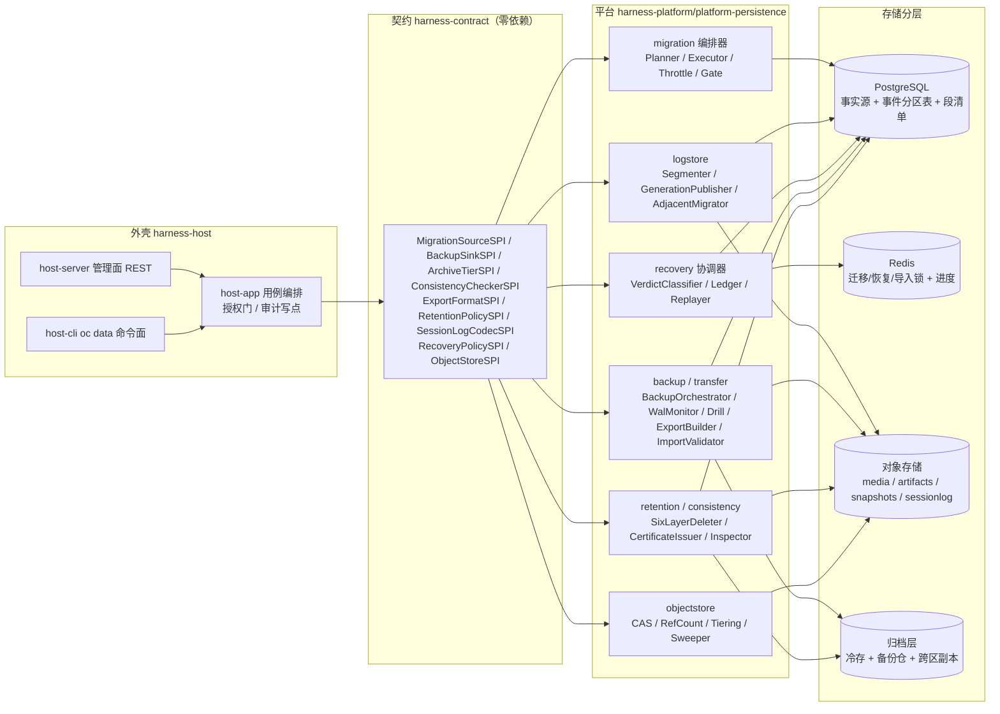
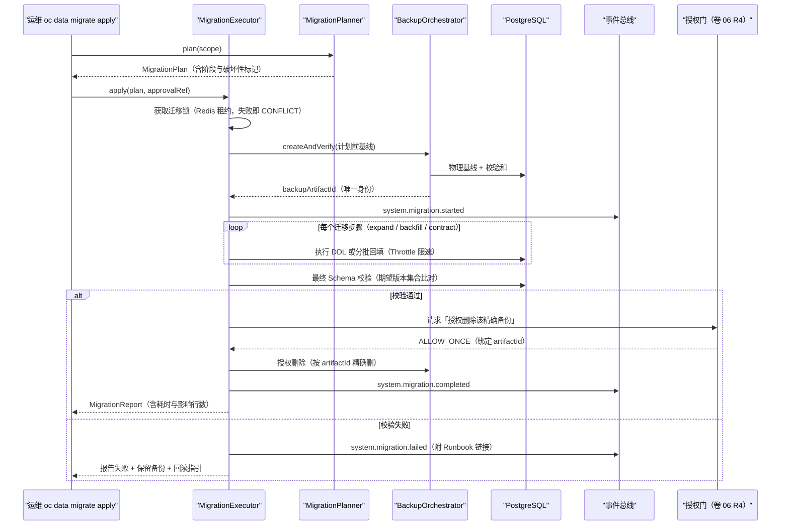
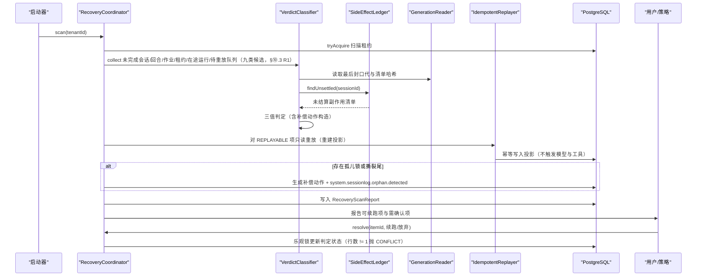
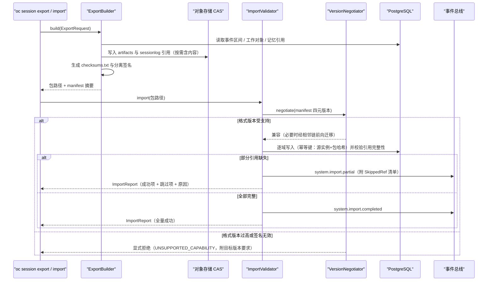
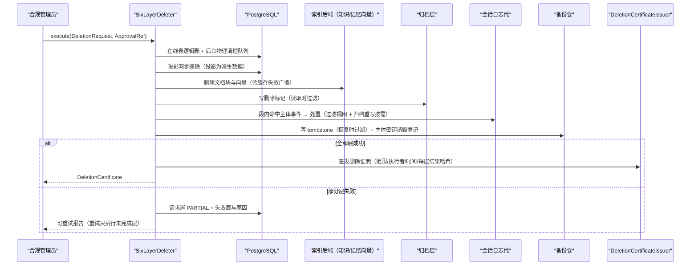
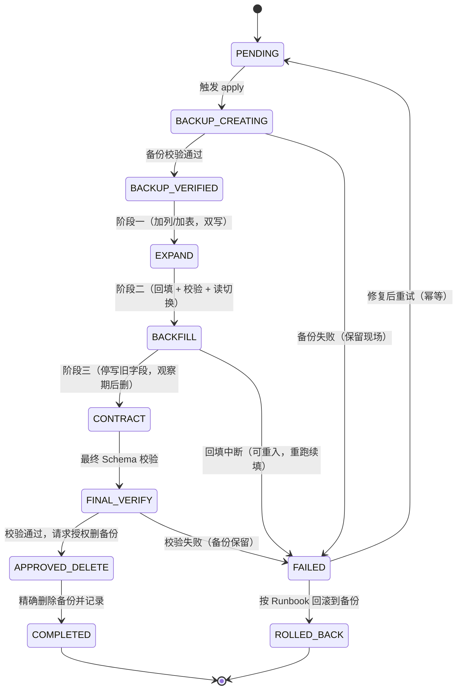
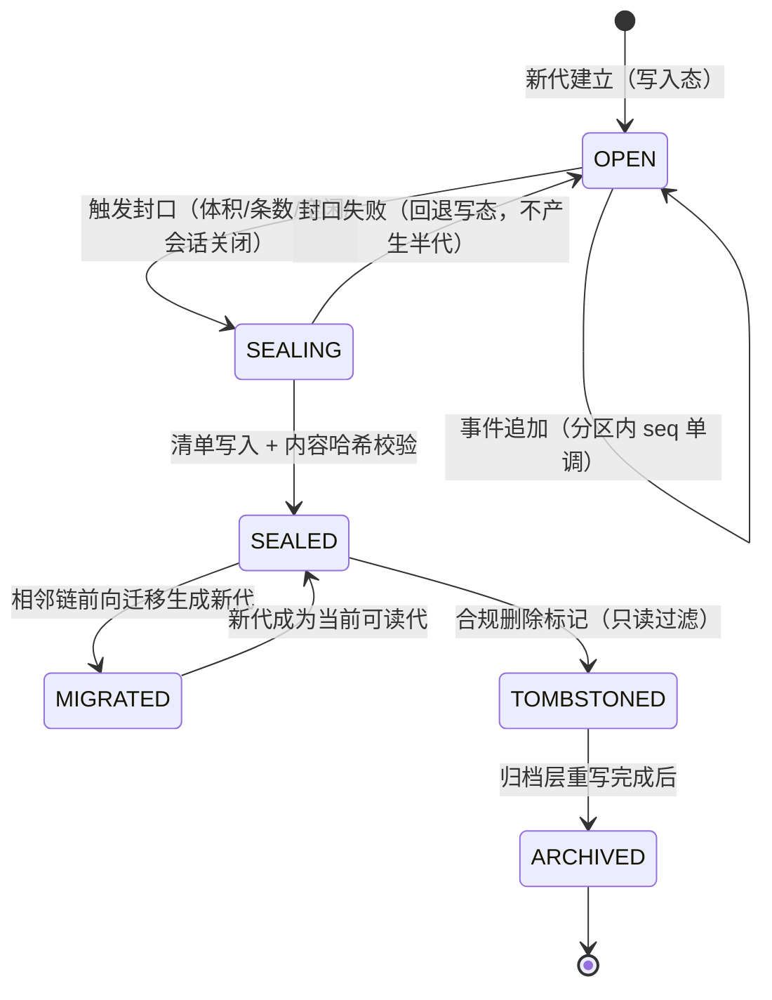
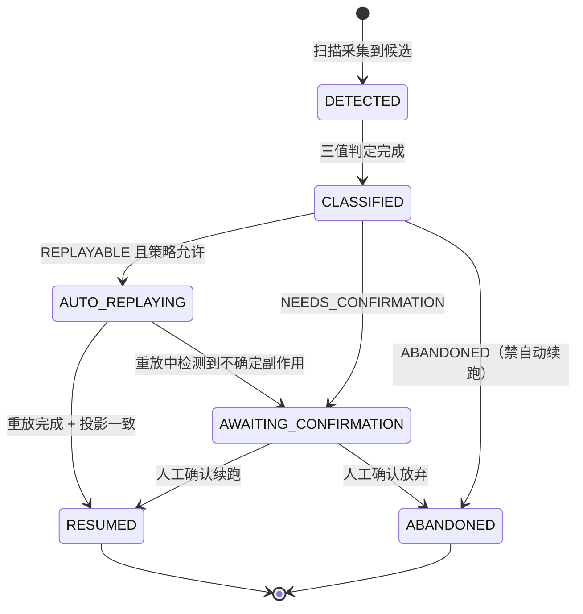
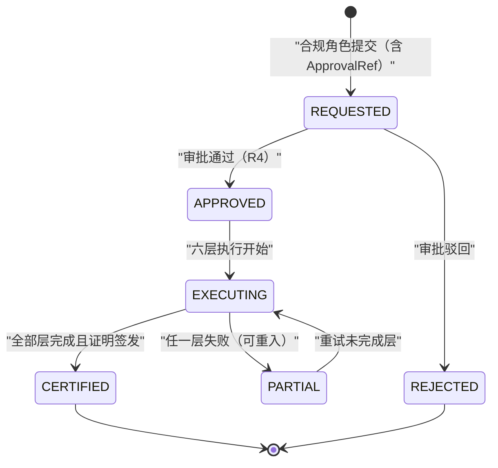

# Phase B 实现方案 19 · 持久化、迁移与恢复（Persistence / Migration / Recovery）

> 本文件是 Phase B 实现层方案，对应 Phase A 卷 19（`docs/harness/19-persistence-migration-recovery.md`）与全局约束 H-005、REQ-INT-3；
> 上游契约不可修改：与卷 19 冲突之处一律写入「§⑩.9 对 Phase A 的修订建议（只记录，不改动）」并登记 `I-PERS-n`。
>
> 证据标记沿用 `00-research-plan.md` §2：`[E1]` 源码｜`[E2]` 官方文档｜`[E3]` 第三方｜`[E4]` 推断。本文件必须消化的竞品台账行（`research/LESSONS-AND-ADOPTIONS.md` §6.4）：L-030、L-048、L-049、L-050、L-053、L-054、L-086。
>
> 实现落点：`harness-contract`（`com.hk.opencoding.contract.persistence`，零依赖端口与值对象）、`harness-platform/platform-persistence`（`com.hk.opencoding.platform.persistence`，Spring 允许）、
> `harness-platform/platform-runtime-store`（Redis 锁与队列）、`harness-host/host-app`（用例编排与授权门）、`harness-host/host-server`（管理面 REST）、`harness-host/host-cli`（`oc data` 命令面）。四段式模块与依赖规则见卷 27 §4.1–§4.2（R1/R2）。

---

## ① 实现目标与范围

### 1.1 本组件解决什么

把「数据放哪、怎么演进、怎么备份、崩溃后怎么恢复、怎么导出迁移、怎么合规删除」从设计承诺变成**可执行、可回滚、可证明**的工程闭环：

1. **数据分域落表**：会话/项目/租户/运维四域明确唯一写入者，越界写入由架构测试拒绝（D-PERS-1）。
2. **迁移流水线**：版本化脚本 + 校验和 + expand-contract 三阶段 + 破坏性审批 + 迁移安全序列（L-053）。
3. **代际式不可变会话日志**：会话日志按「代（generation）」封口，已提交代永不重命名/覆盖/删除；读宽容、写新代（L-054 + DeepSeek generation [E1]）。
4. **崩溃恢复协调器**：以**算法**（扫描 → 判定 → 分类 → 幂等重放 → 报告）而非「承诺」描述恢复，崩溃于任一阶段都有确定结论（§⑩.3）。
5. **PITR 与备份**：物理基线 + WAL 连续归档 + 逻辑导出，RPO ≤ 1min / RTO ≤ 15min 可验证。
6. **中立导出/导入包**：目录包 + 哈希清单 + 版本协商 + 部分导入报告（D-PERS-8）。
7. **合规删除贯通**：在线表 → 投影 → 索引 → 归档 → 会话日志代 → 备份 tombstone 六层贯通 + 删除证明（D-PERS-9）。
8. **一致性校验与巡检**：八类校验对 + 安全自动修复 + 不可修复项告警（D-PERS-11 扩展）。

### 1.2 与 Phase A 的对应关系

| Phase A 决策 | 本文件落实位置 |
| --- | --- |
| D-PERS-1 分域 + 单一写入者 | §④ 架构图、§⑧.1 表族与写入者列、§⑪.1 架构测试 |
| D-PERS-2 迁移即代码 + CI 校验 / D-PERS-3 expand-contract | §③ I-PERS-1、§⑥.1、§⑦.1、§⑨.5、§⑩.3、§⑪.1 迁移四项 |
| D-PERS-4 备份（物理 + WAL + 逻辑）/ D-PERS-5 RPO/RTO | §③ I-PERS-4、§⑥.1、§⑧ `oc_backup_job`、§⑩.2、§⑪.3 |
| D-PERS-6 内容寻址增量快照 / D-PERS-12 大对象治理 | §③ I-PERS-7、§⑤ `SnapshotManifest`、§⑥.2、§⑧.2 对象前缀 |
| D-PERS-7 恢复协调器 + 幂等重放 | §③ I-PERS-3、§⑥.2、§⑩.3（算法 + 崩溃点矩阵） |
| D-PERS-8 中立导出包 | §③ I-PERS-6、§⑥.3、§⑧ `oc_export_job` |
| D-PERS-9 分级保留 + 六层贯通 | §③ I-PERS-5、§⑥.4、§⑧ `oc_deletion_certificate` |
| D-PERS-10 灾备 / D-PERS-11 一致性校验 | §⑩.2、§⑪.3 演练；§③ I-PERS-8、§⑧ `oc_consistency_run` |
| D-PERS-13 迁移自动化测试 | §⑪.1（空库/样本/回归/回滚四项进 CI） |
| H-005 PG 事实源 + Redis 运行态 + 对象存储 | §④ 三存储分层、§⑧.2 Redis Key 工厂 |
| REQ-INT-3 逐调用持久化（fork/resume/export/import） | §② REQ-PERS-05/09/15、§⑥.3 |

### 1.3 本组件不解决什么

- **不解决**事件语义与订阅协议（卷 16）、检查点内容定义（卷 03 `I-CTX-5`）与轨迹格式（卷 12 `TrajectoryExporterSPI`）：本文件只提供事件表分区/归档/重放能力与检查点编排。
  检查点的**唯一口径**（跨 03/12/19 不再各表一套）：触发点与载荷**内容**由卷 03 `I-CTX-5` 定义，**物理表与写入协议**由卷 12 §⑧.1/§⑩.3 定义（`oc_checkpoint`，业务幂等键 `(session_id, seq)`），本文件只做「扫描读取 + 完整性校验 + 作为恢复加速锚点」，**不定义第二套检查点语义**（见 §⑩.3「检查点恢复语义（唯一口径）」）。
- **不解决**快照内容采集（卷 07/20/21）与权限判定链本身（卷 06）：工作区与沙箱提供内容与清单，本文件提供 CAS 存储、引用计数与回收；删除备份等高危动作只**声明**权限点与审批门。
- **不解决**租户策略的合规口径（卷 24）：本文件只提供保留类与删除执行器（`RetentionPolicySPI`）。

### 1.4 上下游依赖

| 方向 | 依赖对象 | 接口 / 契约 |
| --- | --- | --- |
| 上游 | 事件总线（卷 16） | `EventAppendPort.append(EventEnvelope)`（分区键 = 会话/团队/计划），`EventReplayPort.replay(range)` |
| 上游 | 上下文（卷 03） | 检查点元数据与摘要引用；压缩三事件锁信号（`I-CTX-3`/`I-CTX-5`） |
| 上游 | Agent 内核（卷 12） | `CheckpointStore`、副作用账本写入（工具结算项）、`RecoverySignalPort`；**账本物理表唯一** = `oc_tool_side_effect`（本文件 §⑧.1 的 `oc_side_effect_ledger` 是它在持久化域的视图名，禁止建第二张账本表） |
| 上游 | 工具/沙箱（卷 05/07） | 副作用账本条目来源；幂等声明；快照内容与排除清单 |
| 上游 | 工作区（卷 20） | `SnapshotManifest` 内容、工作区引用（导出包 `workspace-refs.json`） |
| 上游 | 权限（卷 06）/企业（卷 24） | 授权门 `ApprovalRef`、保留策略、审计写点、R4 级删除授权 |
| 下游 | 评测（卷 26/33）/ 运维（卷 32） | 导出包作为评测输入、批量产物目录即实验身份（引用 `I-QA-*`）；备份/恢复 Runbook、演练报告、容量水位 |

### 1.5 模块落点

**落地登记（R07：模块 / 顺序 / 批次；清单见 `reviews/R07-scope-build-platform.md`）**：
- **模块坐标（卷 27 §4.1 / §4.3）**：`harness-contract`（包 `contract/persistence`，**单模块**——不建 `harness-contract-*` 子模块）+ `harness-platform/platform-persistence` + `harness-platform/platform-runtime-store` + `harness-host/{host-app,host-server,host-cli}`；与卷 27 §4.3「19 持久化 → `platform-persistence`」一致，无 v1 模块名残留。
- **实施顺序（卷 27 §4.5）**：第 **9** 步「持久化（PG 仓储 + 迁移框架 + 事件表）」（依赖第 2 步事件信封）。第 9 步只交付「迁移框架 + 事件表 + 会话/租户基础表」；本文件同时是第 14/16/19/20 步表族（B4–B6）的落地承载者，其余表族随各自步骤进入（不做一次性全表族交付）。
- **数据迁移批次（卷 27 §4.4）**：B1 = `oc_schema_version` `oc_migration_record` `oc_event_log` `oc_event_producer_idempotency` `oc_consumer_idempotency` `oc_session_log_segment` `oc_session_log_generation` `oc_object_ref` `oc_export_job` `oc_import_job` `oc_import_report` `oc_recovery_scan` `oc_recovery_item` `oc_agent_input` `oc_snapshot` `oc_snapshot_entry`；B2 = `oc_side_effect_ledger`（≡ `oc_tool_side_effect`）；B3 = `oc_retention_policy` `oc_deletion_request` `oc_deletion_certificate` `oc_consistency_run` `oc_consistency_finding` `oc_backup_job` `oc_backup_artifact` `oc_drill_record`；B4 = `oc_work_item_execution` `oc_work_item_evidence` `oc_schedule_run` `oc_schedule_missed` `oc_subagent_link`。备份/恢复/校验表随 B1 落地（REQ-PERS-03 的迁移安全序列要求备份能力先于首个破坏性迁移）。
- **表所有权**：`oc_snapshot` / `oc_snapshot_entry` 唯一拥有者为本文件（20/21 只读引用）；`oc_workspace_pending_op` 拥有者为 `20`（本文件只在崩溃矩阵中引用）；`oc_import_job` 本文件拥有（`29` 的导入作业须引用，不得另建同名表）。
- **I- 决策落点**：`I-PERS-1…8`（8 条）的模块落点即上表（如 `I-PERS-3` → `platform-persistence/recovery/RecoveryCoordinator`）；决策表当前不含「落点（模块/类）」列，逐条绑定登记为 R07 建议 S4。

```text
harness-contract/src/main/java/com/hk/opencoding/contract/persistence/
    枚举：MigrationPhase / DestructiveLevel / RecoveryVerdict / RetentionClass / DriftKind / SideEffectState
    值对象：MigrationPlan / MigrationStep / MigrationReport / SessionLogGeneration / SealedSegment
            RecoveryScanRequest / RecoveryScanReport / RecoverableItem / CompensationAction
            ExportManifest / ExportEntry / ImportRequest / ImportReport / SkippedRef
            DeletionRequest / DeletionCertificate / LayerResult / SnapshotManifest / DriftFinding
    SPI：MigrationSourceSPI / BackupSinkSPI / ArchiveTierSPI / ConsistencyCheckerSPI
         ExportFormatSPI / RetentionPolicySPI / SessionLogCodecSPI / RecoveryPolicySPI / ObjectStoreSPI

harness-platform/platform-persistence/src/main/java/com/hk/opencoding/platform/persistence/
    migration/   MigrationSourceImpl、MigrationOrchestrator、BackfillThrottle、DestructiveGate
    logstore/    SessionLogSegmenter、GenerationPublisher、GenerationReader、AdjacentMigrator、TailRepair
    recovery/    RecoveryCoordinator、VerdictClassifier、SideEffectLedger、IdempotentReplayer、RewindTransaction
    backup/      BackupOrchestrator、WalArchiveMonitor、RestoreDrillService、BackupArtifactRegistry
    transfer/    ExportBuilder、ImportValidator、VersionNegotiator、PartialImportReporter
    retention/   RetentionScheduler、SixLayerDeleter、DeletionCertificateIssuer、TombstoneService
    consistency/ ConsistencyInspector、CheckPairRegistry、SafeRepairExecutor、DriftReporter
    objectstore/ ContentAddressedStore、ReferenceCounter、LifecycleTiering、OrphanSweeper
```

**分层纪律**：内核与契约层不出现 JDBC、S3、Spring 注解（卷 27 R1）；一切 IO 经上表 SPI 由 platform 实现，host 只做用例编排与授权门。

---

## ② 功能需求清单（REQ-PERS-n）

| REQ | 需求描述 | 来源 | 优先级 | 验收要点 |
| --- | --- | --- | --- | --- |
| REQ-PERS-01 | 数据分域落表：会话/项目/租户/运维四域，每域唯一写入者；跨域只读或经事件投影 | 卷 19 §4.1 D-PERS-1 | P0 | 架构测试（ArchUnit）拒绝越界写：非本域包引用他域写 Mapper 即刻失败 |
| REQ-PERS-02 | 迁移即代码：`V<版本>__<域>__<描述>.sql` 单调版本 + 校验和 + 前向脚本 + 可选逆向脚本；执行记录入库 | 卷 19 §3 D-PERS-2/§4.2 | P0 | CI 校验命名/校验和/破坏性标记；`oc_migration_record` 可查每次执行 |
| REQ-PERS-03 | **迁移安全序列**：有待应用迁移 → 创建并校验在线备份 → 应用迁移 → 最终 Schema 校验 → 成功后才授权删除该精确备份；失败保留备份并暴露「回滚到备份」Runbook | L-053（`05-minimax-cli.md` §8 M1 `[E1]`：`backup.ts` 创建→校验→迁移→最终校验→授权删） | P0 | 故障注入：第 4 步失败即备份保留 + 事件 `system.migration.failed` + Runbook 链接 |
| REQ-PERS-04 | 迁移**按域分目录 + 单调版本 + `repair-*` 类单列**；`repair-*` 必须携带原因与工单引用 | L-054（`05-minimax-cli.md` §8 M2/M3 `[E1]`） | P0 | `repair-*` 未带原因则 CI 失败；repair 执行触发独立审计事件 |
| REQ-PERS-05 | **代际式不可变会话日志**：会话日志按代封口（`gen-N` 清单 + 段引用）；已提交代永不重命名/覆盖/删除；写操作发布新代而非原地改；相邻迁移链每步只负责一个 `vN → vN+1` | 卷 19 修订建议（D-PERS-2/3）；DeepSeek Harness v0–v3 版本命名文件 + 相邻迁移包 + 「已提交的代永不重命名/替换/删除」`[E1]`（`04-deepseek-harness.md` §1 第 4 条、§5.3） | P0 | 代目录哈希不可变测试；跨两代读取由相邻链组合解码；拒绝向下降级写 |
| REQ-PERS-06 | **三事件锁 + 孤儿锁可检测**：`compact/start` 先写、`compact/end` 最后写；「有 start 无 end」= 崩溃证据 → 生成补偿动作而非谎称完成 | L-030（`04-deepseek-harness.md` §8 L3 `[E1]`：`compaction/start → summary → end`，先释放锁最后） | P0 | 杀进程用例留下孤儿锁；恢复扫描产出补偿动作 + `system.sessionlog.orphan.detected` |
| REQ-PERS-07 | **恢复协调器算法**：扫描未完成会话/任务/团队 → 校验最后检查点与事件位点 → 三值判定 → 幂等重放（只读）→ 报告「可自动续跑 / 需人工确认 / 放弃」 | 卷 19 §3 D-PERS-7/§4.3 | P0 | 崩溃点矩阵（§⑩.3）逐点验证；重放不产生模型调用与工具副作用 |
| REQ-PERS-08 | **回滚必须是事务**：回滚前保全现场（私有 ref `refs/oc/restore-transactions/<uuid>` 或 CAS 暂存目录），成功才提交、失败可回滚，回滚动作留审计 | L-048（`09-secondary-tier.md` §⑤ S7 `[E1]`：Cline `checkpoint-restore.ts:56-100`） | P0 | 注入回滚中途失败：现场可完整还原且审计含事务 ID |
| REQ-PERS-09 | **快照 = 内容寻址增量清单**：影子仓目录与 worktree 目录分离；清洗 Git 环境变量；排除构建产物与机密文件（`.env*` 等）；**保留窗口 / 去重 / 容量上限由我们补齐** | L-049（`02-opencode.md` §⑧ L5 `[E1]` + `09-secondary-tier.md` §⑤ S8 `[E1]`） | P0 | 机密文件不进入清单；去重率 ≥ 60%；超容量触发回收而非无限膨胀 |
| REQ-PERS-10 | PITR：物理基线 + WAL 连续归档（归档滞后 ≤ 60s）+ 逻辑导出（跨版本/跨厂商）；恢复演练季度化并出报告；副本/跨区复制与对象存储跨区（灾备 D-PERS-10） | 卷 19 §3 D-PERS-4/5/10 | P0 | 演练 RTO ≤ 15min 且报告入 `oc_drill_record`；`oc_wal_archive_lag_seconds` 有告警阈值 |
| REQ-PERS-11 | 中立导出/导入包：`manifest.json` + `events.jsonl` + `workitems.json` + `memory/` + `prompts/` + `artifacts/` + `workspace-refs.json` + `checksums.txt` + 分离签名 | 卷 19 §4.4 D-PERS-8 | P0 | 跨实例导入成功、哈希校验通过；不受信来源拒绝导入 |
| REQ-PERS-12 | 导入**版本协商**：格式版本高于读取器 → 显式拒绝并给升级指引；引用缺失 → 部分导入 + 逐条 `SkippedRef` 报告 + provenance 事件 | 卷 19 §4.4 导入规则；**竞品增量**：OpenCode V1/V2 双栈与 parity 表的「不静默降级」教训 `[E1]`（`02-opencode.md` §8 L5） | P0 | 高版本包导入报 `UNSUPPORTED_CAPABILITY` 并附目标版本；部分导入后数据可读且报告可下载 |
| REQ-PERS-13 | 合规删除贯通六层（在线表/投影/索引/归档/会话日志代/备份 tombstone）+ 删除证明（范围/执行者/时间/每层结果哈希） | 卷 19 §4.6 D-PERS-9 | P0 | 删除后按 ID 全库检索无命中；证明可校验；备份恢复时 tombstone 生效过滤 |
| REQ-PERS-14 | 一致性校验八类 + 安全自动修复（投影重建/快照以事件为准/索引重建）+ 审计链只告警不修复 | 卷 19 §4.5 D-PERS-11 | P1 | 制造漂移：投影类自动修复成功；审计链漂移产生 ERROR 告警且不自动改 |
| REQ-PERS-15 | **读侧纪律**：本地轻量存储（SQLite 类）只作**只读参考与导入源**，不得取代平台事实源；历史快照中已发布的数值枚举配 compat 读取器，永不重编号 | L-086（`06-grok-cli-and-build.md` §8-9 `[E1]`）+ L-052（`04-deepseek-harness.md` §8 L9、`05-minimax-cli.md` §8 M13 `[E1]`）+ R10（`LESSONS` §4） | P1 | 导入器只读打开 SQLite；compat 读取器有 wire 标签固定化测试 |
| REQ-PERS-16 | 批量/导出作业**可续跑**：已有产物默认跳过、显式 `--redo`、输出目录编码作业身份 | L-050（`09-secondary-tier.md` §⑤ S10 `[E1]`：SWE-agent `run_batch.py:75-127`） | P1 | 中断后重跑跳过已完成项；`--redo` 语义有单测；目录名含作业指纹 |
| REQ-PERS-17 | 迁移自动化测试四项（空库 / 脱敏样本 / 迁移后回归 / 回滚演练）在 CI 强制 | 卷 19 §3 D-PERS-13 | P0 | 任一项缺失则流水线失败；样本迁移有固定夹具版本 |
| REQ-PERS-18 | 大对象治理：内容寻址 + 引用计数 + 冷热分层 + 去重 + 加密；孤儿内容延迟回收（≥ 24h）避免与在途引用竞态 | 卷 19 §3 D-PERS-12 | P1 | 引用计数不一致用例：先标记、后回收，不误删 |
| REQ-PERS-19 | 保留分级：按域 × 租户策略计算保留类；清理前 dry-run 报告，执行后写 `system.retention.purged` | 卷 19 §3 D-PERS-9/§6 | P1 | dry-run 与实删条数一致（同窗口）；上限保护（单次 ≤ 配置上限） |

**竞品增量需求说明**：REQ-PERS-03/04/05/06/08/09/12/15/16 共 9 条来自竞品源码事实（MiniMax `backup.ts`、DeepSeek generation、Cline 恢复事务、Roo 影子仓、OpenCode V1/V2 双栈、Grok 读侧纪律、SWE-agent 批量续跑），
均在 §③ 作为候选分支参与评分；其中 L-050 为跨文件机制，`I-QA-*` 编号由 `33-quality-eval-impl.md` 首次登记，本文件只登记作业模型侧的 `I-PERS-7` 并引用。

---

## ③ 技术方案选型（M×N 比选）

评分沿用 `README.md` §4 权重：**F 30% / U 20% / S 25% / M 25%**（满分 10，加权百分制）。

### D-PERSI-1 迁移执行载体

| 分支 | 描述 | F | U | S | M | 加权 | 结论 |
| --- | --- | --- | --- | --- | --- | --- | --- |
| B1 | 纯 Flyway 原生脚本（含破坏性语句自由使用） | 7 | 6 | 6 | 6 | 63.5 | 淘汰（无法表达 expand-contract 三阶段与审批语义） |
| B2 | **Flyway 为执行引擎 + 自研编排器（阶段标记 / 破坏性门 / 回填限速 / 最终校验 / 备份授权删）** | 9 | 8 | 8 | 9 | 86.0 | **选定** |
| B3 | Liquibase 声明式 changelog（含自动 diff 生成） | 8 | 7 | 5 | 6 | 66.0 | 淘汰（自动 diff 可能生成破坏性语句，S/M 双低） |

**选定 B2**：Flyway 只做「版本与校验和的机械保障」，**语义全在编排器**（阶段、门禁、限速、校验、备份生命周期）。被放弃分支代价：B3 的「变更可读性稍好」以丧失可控性为代价，且其 `diff` 输出与「禁止自动破坏性 DDL」直接冲突。回退触发：若自研编排器在 3 个连续版本中引发迁移事故（生产失败 ≥ 1 次），回退到 B1 + 人工双人复核脚本（登记回退工单）。

### D-PERSI-2 会话日志存储形态

| 分支 | 描述 | F | U | S | M | 加权 | 结论 |
| --- | --- | --- | --- | --- | --- | --- | --- |
| B1 | 仅事件表（`oc_event_log`）+ 投影，无「代」概念 | 7 | 7 | 9 | 7 | 75.5 | 基线（演化时无法冻结历史、导出无不可变身份） |
| B2 | **事件表为权威（H-005）+ 会话日志分段封口为不可变「代」**：热窗读表、冷读段；写新代不改旧代 | 9 | 8 | 8 | 9 | 86.0 | **选定** |
| B3 | 纯对象存储 JSONL 分段（Codex/DeepSeek 式单文件为主） | 8 | 7 | 6 | 7 | 71.0 | 吸收其「文件名即元数据 + 尾扫描」用于段命名与恢复 |

**选定 B2**：PG 事实源不可让渡（H-005 / R10），但 DeepSeek 的 generation 语义解决「历史不可变 + 迁移链可测」——以**封口段**承载：封口后段内容哈希进入清单，任何格式演进走相邻迁移包并在导入/读取时组合解码；**拒绝向下降级写**（旧 codec 不覆盖新代）。被放弃分支代价：B3 的「单文件浏览性好」在服务端多租户与并发写场景下不可用（Claude Code JSONL 单文件 50MB 读取上限 `[E1]` 即为反例）。回退触发：若段封口导致的存储放大超过事件表体积 3 倍，改为「封口仅存清单 + 引用事件区间」。

### D-PERSI-3 崩溃恢复判定机制

| 分支 | 描述 | F | U | S | M | 加权 | 结论 |
| --- | --- | --- | --- | --- | --- | --- | --- |
| B1 | 依赖数据库自身恢复 + 会话标记为失败 | 6 | 5 | 9 | 5 | 62.0 | 淘汰（业务状态可能不一致，D-PERS-7 明确淘汰） |
| B2 | **恢复协调器 + 检查点 + 副作用账本 + 三值判定 + 幂等重放** | 9 | 8 | 8 | 9 | 86.0 | **选定** |
| B3 | 全量事件重放（不判定，直接从头重放） | 7 | 5 | 6 | 7 | 63.5 | 淘汰（成本随会话长度线性增长且无法处理外部副作用） |

**选定 B2**：判定三值 `REPLAYABLE / NEEDS_CONFIRMATION / ABANDONED` 使「自动恢复」与「人工确认」边界显式；副作用账本保证「已结算不重放、未结算按幂等声明分级」（与 `12-agent-runtime-impl.md` §6.4 账本先行一致）。被放弃分支代价：B3 在长会话上不可接受（10 万事件级重放分钟级），且对网络类副作用无解。回退触发：若恢复扫描在 1k 未完成会话上 P95 > 30s，改为**惰性扫描**（按会话被访问时触发 + 后台补齐）。

### D-PERSI-4 备份编排实现

| 分支 | 描述 | F | U | S | M | 加权 | 结论 |
| --- | --- | --- | --- | --- | --- | --- | --- |
| B1 | 仅 `pg_dump` 逻辑导出（cron 定时） | 6 | 6 | 8 | 6 | 65.0 | 淘汰（RPO 不可达） |
| B2 | **外部成熟工具做物理基线 + WAL 归档（pgBackRest/WAL-G 二选一，由 `BackupSinkSPI` 适配），自研只做编排、校验、授权删、演练** | 9 | 8 | 9 | 9 | 88.0 | **选定** |
| B3 | 存储层快照（云盘快照）为主 | 6 | 5 | 7 | 5 | 57.5 | 淘汰（跨环境弱，与部署形态解耦诉求冲突） |

**选定 B2**：备份的「重活」（全量泵、WAL 连贯性）交给久经验证的工具，我们只拥有**编排与治理**（安全序列、唯一身份、授权删、演练报告）——这也正是 L-053 的机制本质。「唯一身份」落 `oc_backup_artifact.artifact_id`（ULID），禁止复用文件名。回退触发：若企业环境禁止外部二进制，退回 B1 并显式声明 RPO 放宽到 24h（写入租户能力声明，不得静默）。

### D-PERSI-5 合规删除实现

| 分支 | 描述 | F | U | S | M | 加权 | 结论 |
| --- | --- | --- | --- | --- | --- | --- | --- |
| B1 | 直接物理硬删（各层自行处理） | 6 | 6 | 6 | 5 | 57.5 | 淘汰（无法证明、易漏层） |
| B2 | **统一删除请求 + 六层执行器 + tombstone + 证明** | 9 | 8 | 8 | 9 | 86.0 | **选定** |
| B3 | 加密擦除（crypto-shredding）为唯一手段 | 8 | 7 | 7 | 8 | 75.0 | 吸收为**备份/归档层**的补充手段（密钥销毁即不可读） |

**选定 B2，并把 B3 限定为备份与归档层的实现**：在线层必须真删（否则索引与投影仍可反查）；备份层因物理不可改，用 tombstone（恢复时过滤）+ 租户/主体级密钥销毁（备份加密密钥分层）双保险。回退触发：若合规要求「备份也须物理不可恢复」，则对受影响备份执行**重写归档**（代价：备份窗口内不可用，需 Runbook 支持）。

### D-PERSI-6 导出包格式与版本协商

| 分支 | 描述 | F | U | S | M | 加权 | 结论 |
| --- | --- | --- | --- | --- | --- | --- | --- |
| B1 | 单 tar.gz 含私有序列化（Java 序列化/Protobuf 二进制） | 7 | 6 | 6 | 6 | 63.5 | 淘汰（锁定厂商，违反 D-PERS-8） |
| B2 | **目录包（人类可读 JSON/JSONL）+ 哈希清单 + 分离签名 + 版本协商矩阵** | 9 | 8 | 8 | 9 | 86.0 | **选定** |
| B3 | 供应商中立超集（OTel GenAI / OpenInference 事件格式）+ 附私有余量字段 | 8 | 7 | 7 | 7 | 73.0 | 吸收其「语义字段用行业命名」用于 `events.jsonl` 字段命名 |

**选定 B2**：导出包同时服务三类消费者——迁移（跨实例）、审计（人类可读）、评测（可续跑输入）；`manifest.json` 携带 `exportFormatVersion / kernelVersion / eventSchemaVersion / minReaderVersion` 四元组，导入侧做**显式协商**。回退触发：若评测侧需要统一行业格式，通过 `ExportFormatSPI` 增加第二格式，**不改默认包结构**。

### D-PERSI-7 快照存储与回收

| 分支 | 描述 | F | U | S | M | 加权 | 结论 |
| --- | --- | --- | --- | --- | --- | --- | --- |
| B1 | 全量打包（每快照一份完整副本） | 7 | 7 | 7 | 5 | 65.0 | 淘汰（成本线性增长） |
| B2 | **内容寻址增量清单 + 引用计数 + 保留窗口 + 容量上限 + 孤儿延迟回收** | 9 | 8 | 8 | 9 | 86.0 | **选定** |
| B3 | 容器层提交 / 文件系统 reflink 快照 | 7 | 6 | 6 | 6 | 63.5 | 作为 Container/Cloud 后端可选加速（同 SPI 下） |

**选定 B2**：与 D-PERS-6（卷 19）一致，且补齐竞品缺失的**回收**（L-049 风险列明确「上游未见回收策略，由我们补齐」）。回收算法：引用计数快照扫描 → 未被引用内容进入 `pending-gc` 队列 → 延迟 24h → 二次确认后删除（防在途写入竞态）。回退触发：若去重率长期 < 40%（语料差异大），改为按项目分桶且缩短保留窗口至配置最小值。

### D-PERSI-8 一致性校验执行策略

| 分支 | 描述 | F | U | S | M | 加权 | 结论 |
| --- | --- | --- | --- | --- | --- | --- | --- |
| B1 | 仅离线全量校验（停机窗口执行） | 7 | 5 | 8 | 6 | 65.0 | 淘汰（企业不能停） |
| B2 | **在线抽样巡检（默认每日 + 事件驱动增量）+ 可选离线全量 + 安全自动修复** | 9 | 8 | 8 | 9 | 86.0 | **选定** |
| B3 | 仅在恢复时校验（不巡检） | 6 | 6 | 9 | 5 | 64.0 | 淘汰（漂移不可发现，D-PERS-11 明确淘汰） |

**选定 B2**：抽样比例按分区活跃度加权（活跃会话抽样率更高）；修复分三级：**安全修复**（重建投影/重建索引）、**需确认修复**（以事件为准刷新快照）、**仅告警**（审计链、跨租户引用）。回退触发：若巡检在高峰期造成 PG CPU > 70%（15 分钟窗口），自动降级为夜间窗口执行并写降级事件。

### 3.9 实现级决策登记（I-PERS-n）

| 编号 | 决策 | 选定 | 被放弃分支代价 | 回退触发 |
| --- | --- | --- | --- | --- |
| I-PERS-1 | 迁移引擎 | Flyway（机械保障）+ 自研编排器（阶段/门禁/限速/校验/备份授权删） | 纯 Flyway 无法表达 expand-contract；Liquibase 自动 diff 有破坏性风险 | 三次连续迁移事故 → 纯 Flyway + 双人复核 |
| I-PERS-2 | 会话日志代模型 | 事件表权威 + 封口段不可变代 + 相邻迁移链；拒绝降级写 | 单文件 JSONL 形态在多租户并发写不可用 | 段体积放大 > 3 倍 → 只封存清单 |
| I-PERS-3 | 崩溃恢复 | 协调器 + 副作用账本 + 三值判定 + 只读幂等重放 | 全量重放成本随会话增长；DB 自恢复不保证业务一致 | 扫描 P95 > 30s → 惰性扫描 |
| I-PERS-4 | 备份实现 | 外部工具物理 + WAL 归档，自研编排与治理（唯一身份 + 授权删 + 演练） | 仅逻辑导出 RPO 不可达 | 禁外部二进制的环境 → 逻辑导出 + 声明放宽 RPO |
| I-PERS-5 | 合规删除 | 六层执行器 + tombstone + 证明；备份/归档层追加密钥销毁 | 硬删不可证明；纯加密擦除在线层仍可反查 | 合规要求备份物理不可恢复 → 重写归档 |
| I-PERS-6 | 导出包 | 目录包 + 哈希 + 分离签名 + 四元版本协商 | 私有二进制违反数据可迁移铁律 | 行业格式需求 → `ExportFormatSPI` 第二格式 |
| I-PERS-7 | 快照与批量作业 | CAS 增量 + 引用计数 + 保留窗口 + 孤儿延迟 GC；作业可续跑（`--redo` 显式） | 全量打包成本线性；无回收会无限膨胀 | 去重率 < 40% → 项目分桶 + 缩短保留窗口 |
| I-PERS-8 | 一致性校验 | 在线抽样 + 事件驱动增量 + 三级修复 | 停机全量不可行；仅恢复时校验不可发现漂移 | 高峰期 CPU > 70% → 夜间窗口 + 降级事件 |

**与竞品对照的取舍**：持久化与恢复路线以三处竞品实证为主要输入——① MiniMax CLI 的「备份授权删除」（`research/competitors/05-minimax-cli.md` §8 M1 `[E1]`，L-053）：本文件采纳「迁移成功后才申请删除该精确备份」并绑定 R4 审批（I-PERS-4），**放弃**「自动删备份」的自动化便利；② Grok CLI 的本地轻量存储（`06-grok-cli-and-build.md` §8-9 `[E1]`，L-086）：本文件按 R10 限定 local-lite 只做只读参考与导入源，**禁止**承接多租户写路径；③ DeepSeek harness 的代（generation）式会话日志 `[E1]`：采纳「已提交代不可变 + 相邻迁移链 + 拒绝降级写」（I-PERS-2）。**增量差异化**：三值判定 + 副作用账本 + 只读幂等重放（I-PERS-3）为竞品空白——竞品普遍只有「全量重放」或「不恢复」，本文件以副作用分级把「自动续跑的安全性」变成可判定问题。

---

## ④ 总体架构图



**说明**：契约零依赖——内核与 host 只看到端口与值对象，`ObjectStoreSPI` 由 `platform-persistence` 实现（local 形态落本地文件系统，server 形态落 S3 兼容）；Spring 装配点由 `host-bootstrap` 以 `@ConditionalOnMissingBean` 完成（local-lite 只读适配器优先级最低），见 `01-kernel-runtime-impl.md` §6.1；写入者边界——`logstore` 是 `oc_session_log_segment` 的唯一写入者，`retention` 是 `oc_deletion_*` 的唯一写入者，其他域只能经端口请求；PG 为事实源（含段清单与投影），对象存储承载内容寻址大对象，归档层承接冷数据与备份仓（§⑧.3）。

---

## ⑤ 类图与关键契约

```mermaid
classDiagram
  class MigrationOrchestrator {
    +plan(MigrationScope) MigrationPlan
    +apply(MigrationPlan, ApprovalRef) MigrationReport
    +verify(MigrationReport) VerificationResult
  }
  class SessionLogSegmenter {
    +seal(SealRequest) SealedSegment
    +detectOrphanLocks(TenantId) List
  }
  class GenerationPublisher {
    +publish(SealedSegment) SessionLogGeneration
  }
  class AdjacentMigrator {
    +readAsCurrent(SessionLogGeneration) EventStream
  }
  class RecoveryCoordinator {
    +scan(RecoveryScanRequest) RecoveryScanReport
    +resolve(ItemId, ResolutionChoice) RecoverableItem
  }
  class SideEffectLedger {
    +markPending(SideEffectEntry) void
    +markSettled(EffectKey, OutcomeRef) int
    +findUnsettled(SessionId) List
  }
  class RewindTransaction {
    +prepare(RewindRequest) TransactionRef
    +commit(TransactionRef) RewindResult
    +rollback(TransactionRef) RewindResult
  }
  class SixLayerDeleter {
    +execute(DeletionRequest) DeletionCertificate
  }
  class ExportBuilder {
    +build(ExportRequest) ExportJob
    +resume(ExportJobId, boolean redo) ExportJob
  }
  class ImportValidator {
    +validate(ImportRequest) ValidationOutcome
    +importPartial(ImportRequest) ImportReport
  }
  class ConsistencyInspector {
    +run(ConsistencyScope) ConsistencyRun
  }
  RecoveryCoordinator --> SideEffectLedger
  RecoveryCoordinator --> RewindTransaction
  GenerationPublisher --> SessionLogSegmenter
  AdjacentMigrator --> SessionLogCodecSPI
  SixLayerDeleter --> RetentionPolicySPI
  ImportValidator --> VersionNegotiator
  ConsistencyInspector --> SafeRepairExecutor
```



**Java 21 关键签名（节选，完整形态见 `com.hk.opencoding.contract.persistence`）**

```java
package com.hk.opencoding.contract.persistence;

/**
 * 会话日志编解码端口。
 * 每个实现绑定一个格式版本（{@code vN}）；读取历史代时由 {@link AdjacentMigrator} 组合相邻链解码。
 * 实现必须保证：解码是纯函数、不产生副作用、对未知字段宽容（前向兼容）。
 */
public interface SessionLogCodecSPI {

    /** 本编解码器支持的格式版本（形如 v2，用于相邻链匹配）。 */
    LogFormatVersion formatVersion();

    /**
     * 解码一个已封口段为事件序列（只读，不发布后代）。
     *
     * @param segment 已封口段引用（必填，读取时必须校验内容哈希）
     * @return 段内事件（有序；空段为非法数据，禁止返回 null）
     * @throws HarnessException 校验和不匹配或帧撕裂且无法修复时抛出，错误码 INTERNAL_ERROR
     */
    EventStream decode(SealedSegment segment);

    /**
     * 编码事件序列写出新代（发布式：先编码校验，再发布新代，源代不变）。
     *
     * @param events 待编码事件（必填，非空）
     * @param target 目标格式版本（必填，不得低于 {@link #formatVersion()}：禁止降级写）
     * @return 新代引用（已发布、不可变）
     * @throws HarnessException 目标版本低于当前版本时抛出，错误码 UNSUPPORTED_CAPABILITY
     */
    SessionLogGeneration encodeTo(EventStream events, LogFormatVersion target);
}
```

```java
package com.hk.opencoding.contract.persistence;

/**
 * 恢复判定三值。
 * REPLAYABLE 表示纯重放安全（无未结算外部副作用）；NEEDS_CONFIRMATION 表示存在不可判定副作用；
 * ABANDONED 表示状态不可解释（如已提交代校验失败），必须人工处置，禁止自动续跑。
 */
public enum RecoveryVerdict {
    REPLAYABLE("REPLAYABLE", "可安全重放"),
    NEEDS_CONFIRMATION("NEEDS_CONFIRMATION", "需人工确认"),
    ABANDONED("ABANDONED", "不可恢复");

    private final String code;
    private final String desc;

    RecoveryVerdict(String code, String desc) {
        this.code = code;
        this.desc = desc;
    }

    // 纯访问器：入库与事件载荷一律用 code，desc 仅用于展示与日志
    public String getCode() {
        return code;
    }

    public String getDesc() {
        return desc;
    }

    /**
     * 由 code 反解枚举。
     *
     * @param code 编码值（必填）
     * @return 对应枚举
     * @throws HarnessException 未知 code 时抛出（未知状态一律降级为暂停而非自驱，与 L-044 同源纪律一致）
     */
    public static RecoveryVerdict of(String code) {
        for (RecoveryVerdict verdict : values()) {
            if (verdict.code.equals(code)) {
                return verdict;
            }
        }
        throw new HarnessException(ErrorCode.INVALID_ARGUMENT, "未知恢复判定：" + code);
    }
}
```

```java
package com.hk.opencoding.platform.persistence.recovery;

/**
 * 恢复协调器：启动与按需触发时扫描未完成工作，产出「可续跑 / 需确认 / 放弃」三类结论。
 * 事务边界：扫描只读；判定结果与补偿事件落库必须显式事务并校验乐观锁更新行数。
 */
@Slf4j
@Service
@RequiredArgsConstructor
public class RecoveryCoordinator {

    private final VerdictClassifier classifier;
    private final SideEffectLedger ledger;
    private final IdempotentReplayer replayer;
    private final RecoveryPolicySPI policy;
    private final RecoveryScanMapper scanMapper;

    /**
     * 执行一次恢复扫描（幂等：重复执行只更新同一次 RUNNING 记录）。
     *
     * @param request 扫描范围（必填：租户、可选会话集合、是否允许自动续跑）
     * @return 扫描报告（每项判定、依据序号、补偿动作）
     * @throws BusinessException 同租户已有扫描在途时抛出，错误码 CONFLICT
     */
    @Transactional(rollbackFor = Exception.class)
    public RecoveryScanReport scan(RecoveryScanRequest request) {
        log.info("恢复扫描开始，tenantId={}, sessionScope={}", request.tenantId(), request.sessionIds());

        // 1. 抢占扫描位（Redis 租约，崩溃后由租约过期回收，避免重复扫描）
        if (!scanMapper.tryAcquire(request.tenantId())) {
            throw new BusinessException(ErrorCode.CONFLICT, "该租户已有恢复扫描在途，请稍后重试");
        }

        // 2. 采集候选 → 三值判定（未结算副作用一律 NEEDS_CONFIRMATION 并携带补偿动作）
        List<RecoverableItem> classified = classifier.classify(classifier.collect(request), ledger);

        // 3. 仅 REPLAYABLE 且策略允许的项做只读重放（不产生模型调用与工具副作用）
        long resumed = classified.stream()
                .filter(item -> item.verdict() == RecoveryVerdict.REPLAYABLE)
                .filter(item -> policy.autoResume(request.tenantId()))
                .peek(replayer::replay)
                .count();

        // 4. 落库判定结果（需人工确认项在 UI 首屏提示，禁止静默；行数校验失败即并发冲突）
        RecoveryScanReport report = RecoveryScanReport.of(classified, resumed);
        scanMapper.finish(request.tenantId(), report)
                .orElseThrow(() -> new BusinessException(ErrorCode.CONFLICT, "恢复扫描记录已变更，请刷新后重试"));
        log.info("恢复扫描完成，tenantId={}, 候选={}, 自动续跑={}, 需确认={}, 放弃={}",
                request.tenantId(), classified.size(), resumed, report.confirmationCount(), report.abandonedCount());
        return report;
    }
}
```

**异常与日志纪律**：异常按层分工——**契约与内核侧（零框架）统一 `HarnessException` + `ErrorCode`**，**平台与宿主侧（Spring）统一 `BusinessException` + `ErrorCode`，由外壳全局异常处理器按码映射**（错误模型见附录 B §B.7「错误模型」，错误码全表见 §B.11——该表是**错误码**权威而非异常类名定义处；持久化相关新增码登记流程见 §⑨.5）；
禁止裸 `RuntimeException`、禁止 `catch (Exception e) {}`、禁止 `log.error(e.getMessage())`；所有写方法 `@Transactional(rollbackFor = Exception.class)`。

---

## ⑥ 核心流程时序图

### 6.1 迁移安全序列（含备份授权删除）

前置条件：`oc_migration_record` 存在 `PENDING` 迁移集；变更经 CI 四项通过。主路径：备份 → 校验 → 应用 → 最终校验 → 授权删除。
异常与补偿：任一步失败 → 保留备份并暴露「回滚到备份」Runbook；破坏性步需 `ApprovalRef`。幂等与并发点：迁移锁（Redis 租约）+ `oc_migration_record` 唯一键（版本）保证重复执行只生效一次。



### 6.2 崩溃恢复扫描与续跑

前置条件：进程重启或人工触发；存在未完成会话/未结算副作用/孤儿锁。主路径：候选采集 → 三值判定 → 只读重放 → 报告。
异常与补偿：孤儿锁生成补偿动作；段尾撕裂截断到最后一个完整帧；已提交代校验失败 → `ABANDONED` + ERROR 告警。幂等与并发点：扫描记录单例（同租户唯一 RUNNING）；重放只读且可重复。



### 6.3 导出 → 导入（版本协商与部分导入）

前置条件：会话/项目可导出（权限点 `session.share` 或 `project.manage`）；目标实例版本已知。主路径：构建包 → 哈希与签名 → 传输 → 协商 → 导入 → provenance 事件。
异常与补偿：格式版本高于读取器 → 拒绝并给升级指引；引用缺失 → 部分导入 + `SkippedRef` 报告。幂等与并发点：`exportJobId` / `importJobId` 幂等键；导入按源实例 + 包哈希去重。



### 6.4 合规删除贯通六层（含删除证明）

前置条件：`DeletionRequest` 经合规角色审批（R4）；主体/范围已解析为资源清单（含派生资源）。主路径：在线表 → 投影 → 索引 → 归档 → 日志段 → 备份 tombstone → 证明。
异常与补偿：任一层失败 → 请求保持 `PARTIAL`，可重复执行（每层幂等）；证明只在全部层完成后签发。幂等与并发点：`deletionRequestId` 幂等；tombstone 一旦写入永久生效（重试不重复写）。



---

## ⑦ 状态机

### 7.1 迁移阶段与执行状态



### 7.2 会话日志代（generation）



> 纪律：`SEALED / MIGRATED / ARCHIVED` 三态的段**永不重命名、永不覆盖、永不直接删除**；删除只能经 `TOMBSTONED → ARCHIVED` 路径并携带证明。

### 7.3 恢复项状态



### 7.4 合规删除请求状态



**迁移补全（触发 / 守卫 / 副作用）**：`EXECUTING → PARTIAL`——触发：六层中任一层失败（含备份层 tombstone 未写）；守卫：无（失败即降级为 PARTIAL，**不重试整链**）；副作用：`layers_pending` 落库 + `oc_deletion_layer_failure_total{layer}` 计数，**证明不签发**；`PARTIAL → EXECUTING`——触发：**仅重试未完成层**（已完成层幂等跳过）；守卫：`deletionRequestId` 幂等 + tombstone 一旦写入永久生效；**超时路径**：单层执行超过该层预算（默认 30min）→ 该层标记失败并转 `PARTIAL` + 告警（禁止无限等待）。

---

## ⑧ 数据模型

### 8.1 表（`oc_*`，全部含 `tenant_id` 与审计字段；分区列显式声明）

**字段类型约定（全表适用）**：`version`/`domain`/`phase`/`state`/`scope_type`/`retention_class`/`verdict` 一律 `text` 存 `code`；`artifact_id` 为 ULID `text`；`request_id`/`snapshot_id` 为 `uuid`；时间为 `timestamptz`；`scope_json`/`layer_results`/`compensation`/`evidence` 为 `jsonb`（含 Schema 版本号）；`checksum`/`content_hash`/`certificate_hash`/`manifest_hash`/`prev_hash` 为 `char(64)`；`rows_affected`/`size_bytes`/`ref_count` 为 `bigint`。

| 表 | 关键字段 | 约束 / 索引 | 分区与保留 |
| --- | --- | --- | --- |
| `oc_schema_version` | domain、version、applied_at、checksum | 唯一 `(domain, version)` | 无 |
| `oc_migration_record` | version、domain、phase、destructive、checksum、state、started_at、finished_at、rows_affected | 唯一 `(tenant_id, domain, version)`；索引 `(state, started_at)` | 长期 |
| `oc_backup_job` / `oc_backup_artifact` | job_type、state、verified、requested_by、approved_by；artifact：artifact_id（ULID）、identity、store_uri、checksum、wal_from、wal_to、encrypted | `artifact_id` 与 `identity` 各唯一 | 按保留策略（job 1 年） |
| `oc_session_log_segment` / `oc_session_log_generation` | segment：generation、segment_no、format_version、content_hash、state、sealed_at；generation：manifest_uri、manifest_hash、state、superseded_by | 唯一 `(session_id, generation, segment_no)`、唯一 `(session_id, generation)` | 随会话；`ARCHIVED` 后可清行留清单 |
| `oc_recovery_scan` / `oc_recovery_item` | scan：scope、state、candidates、auto_resumed、confirmation、abandoned；item：item_ref（稳定项标识，形如 `session:<id>` / `effect:<key>` / `lease:<id>` / `run:<id>` / `op:<key>` / `merge:<id>`）、verdict、evidence_seq、compensation、resolved_by | 唯一部分索引 `(tenant_id) WHERE state='RUNNING'`；**唯一 `(scan_id, item_ref)`（判定行去重的唯一键，取代旧表述的「effect 唯一键」）**；`(scan_id, verdict)` | 90 天 |
| `oc_side_effect_ledger`（= 12 §⑧.1 `oc_tool_side_effect`，**同一物理表**） | effect_key（≡ `oc_tool_side_effect.idempotency_key`）、session_id、item_id、kind、state、settle_ref、idem_class | 唯一 `effect_key`；`(session_id, state)` | 随会话 |
| `oc_snapshot` / `oc_snapshot_entry` | snapshot_id、workspace_id、manifest_uri、size_bytes、dedupe_ratio；entry：snapshot_id、path、content_hash、mode、mtime | 清单唯一 `(snapshot_id, path)` | 保留窗口 + 容量上限 |
| `oc_object_ref` | content_hash、namespace、size_bytes、ref_count、state、pending_gc_at | 唯一 `(namespace, content_hash)`；`(state, pending_gc_at)` | 无（随引用） |
| `oc_export_job` / `oc_import_job` / `oc_import_report` | job：scope、state、package_uri、manifest_hash、signed、skipped_count、source_instance；report：entry_type、entry_id、result、reason | `(state, created_at)`；**唯一 `(tenant_id, source_instance, package_hash)`（包级：决定「该包是否已导入」）**；条目级幂等键 `(package_hash, entry_id)`（决定「只补缺口项」） | 1 年 |
| `oc_retention_policy` | scope_type、scope_id、domain、retention_class、ttl_days、dry_run_only | 唯一 `(tenant_id, scope_type, scope_id, domain)` | 长期 |
| `oc_deletion_request` | request_id、subject_type、subject_id、state、approved_by、layers_pending | `(state, created_at)` | 审计保留 |
| `oc_deletion_certificate` | request_id、scope_json、executor、executed_at、layer_results、certificate_hash、prev_hash | 唯一 `request_id`；哈希链 `prev_hash` | 3 年+ |
| `oc_consistency_run` / `oc_consistency_finding` | run_id、pairs、sampled、drifted、state；finding：run_id、pair、subject_id、kind、severity、repair_action、repaired | `(run_id, kind)`、`(pair, severity)` | 1 年 |

> 事件表 `oc_event_log`（卷 16 / 附录 A §4）**以卷 16 §⑧.1 为唯一口径**（R05 修正分区列表述）：按 **`recorded_at`（写入时刻，注入时钟）** 月范围分区、本地索引 `(partition_key, seq)`；`occurred_at` 只作业务时间过滤、**不作分区列**（避免「迟到事件」跨分区改写归档边界）；热 30 天 → 温 1 年 → 冷归档；不建 payload 索引（GIN 可选、仅排障）。

### 8.2 Redis Key（经统一 `RedisKeys` 工厂，禁止业务拼接）

| 用途 | Key 形态（工厂方法） | TTL | 降级 |
| --- | --- | --- | --- |
| 迁移锁 / 恢复扫描租约 | `RedisKeys.lock(Module.PERS, "migrate", tenantId)` / `RedisKeys.lock(Module.PERS, "recovery-scan", tenantId)` | 租约 900s 心跳续期 / 300s | 单机形态进程内锁 |
| 导入进度 / 导出节流 | `RedisKeys.progress(Module.PERS, "import", jobId)` / `RedisKeys.rate(Module.PERS, "export", tenantId)` | 3600s / 60s | 丢失后由 DB 状态重建 |
| 封口栅栏 | `RedisKeys.lock(Module.PERS, "seal", sessionId)` | 120s | 进程内栅栏 |
| 孤儿扫描水位 | `RedisKeys.cursor(Module.PERS, "orphan-scan")` | 无（持久） | 无（下次全量） |

### 8.3 对象存储前缀（内容寻址，namespace 隔离）

| 前缀 | 内容 | 生命周期 |
| --- | --- | --- |
| `media/`、`artifacts/` | 用户上传媒体（REQ-INT-6）、工具外置结果（卷 05 `I-TOOL-*`） | 引用计数 + TTL |
| `snapshots/{tenant}/{project}/{hash}` | 快照内容块 + 清单 | 保留窗口 + 容量上限 |
| `sessionlog/{tenant}/{session}/gen-{n}/` | 会话日志代（清单 + 段） | 随会话；删除走 TOMBSTONED |
| `exports/{jobId}/`、`backups/{artifactIdentity}/` | 导出包 / 备份仓（物理基线 + WAL 段索引） | 30 天 / 按保留策略与授权删 |

### 8.4 事件清单（新增部分；全部经卷 16 事件总线，code 只增不改、永不重编号）

| 事件 | 载荷要点 |
| --- | --- |
| `system.migration.started` / `completed` / `failed` / `rolled_back` | version、domain、phase、duration、rows_affected、runbook_ref |
| `system.backup.started` / `completed` / `failed`、`system.restore.verified` | artifact_id、bytes、wal_lag_seconds；drill_id、target_time、rto_seconds、verdict |
| `system.recovery.scan.completed` / `system.recovery.item.resumed` | candidates、auto_resumed、confirmation、abandoned；subject_id、from_seq、replay_events |
| `system.sessionlog.generation.sealed` / `orphan.detected` / `system.sessionlog.tail.repaired` | session_id、generation、content_hash；lock_kind、evidence_seq、compensation；dropped_bytes、last_good_seq |
| `system.export.completed` / `system.import.completed` / `system.import.partial` | job_id、package_hash、skipped[]、provenance |
| `system.consistency.check.completed` / `system.retention.purged` | run_id、pairs、drifted、repaired；domain、class、rows、dry_run |
| `audit.compliance.delete.executed` | request_id、certificate_hash、layers |

### 8.5 指标（卷 19 §6 清单 + 本文件补齐）

`oc_db_migration_duration_ms`、`oc_db_migration_failures_total`、`oc_backup_age_seconds`、`oc_wal_archive_lag_seconds`、`oc_restore_drill_success_ratio`、`oc_consistency_drift_total`、`oc_retention_purged_rows_total`、`oc_object_store_bytes{namespace}`、
`oc_sessionlog_segment_seal_seconds`、`oc_sessionlog_orphan_lock_total`、`oc_recovery_item_verdict_total{verdict}`、`oc_recovery_scan_duration_ms`、`oc_import_partial_total`、`oc_deletion_layer_failure_total{layer}`、`oc_snapshot_dedupe_ratio`、`oc_gc_reclaimed_bytes`。

---

## ⑨ 接口与扩展点

### 9.1 管理面 REST（权限点见附录 B §B.2）

| 方法 + 路径 | 入参 | 出参 | 错误码 |
| --- | --- | --- | --- |
| `GET /api/v1/maintenance/migrations` | `domain?`、`state?` | 迁移列表（版本、阶段、破坏性、状态） | `INVALID_ARGUMENT` |
| `POST /api/v1/maintenance/migrations/{version}/approve` | `ApprovalRef`、`reason` | 审批结果 | `PERMISSION_DENIED` / `POLICY_OVERRIDE_DENIED` |
| `POST /api/v1/backups` | `type`（full/logical/sample）、`scope` | `backupJobId` | `RATE_LIMITED` |
| `POST /api/v1/backups/{artifactId}/verify` | 无 | 校验结果（抽样恢复判定） | `NOT_FOUND` |
| `POST /api/v1/backups/{artifactId}/delete` | `ApprovalRef`（**R4**） | 精确删除结果 | `PERMISSION_DENIED` |
| `GET /api/v1/recovery/scans` / `POST .../{id}/resolve` | 扫描列表 / `itemId + choice` | 报告 / 更新结果 | `CONFLICT` |
| `POST /api/v1/exports` / `POST /api/v1/imports` | `scope` / 包 URI + `redo` | `jobId` | `UNSUPPORTED_CAPABILITY`（版本过高） |
| `POST /api/v1/consistency/runs` | `scope`、`pairs[]` | `runId` | `RATE_LIMITED` |
| `POST /api/v1/deletions` / `GET .../{id}/certificate` | `DeletionRequest` | 请求 / 证明 | `PERMISSION_DENIED` |

**错误矩阵（契约与内核侧 `HarnessException`、平台与宿主侧 `BusinessException`，同携带 `ErrorCode`；错误模型见附录 B §B.7）**：

| 错误码 | 触发场景 | retryable | 面向用户的恢复动作 |
| --- | --- | --- | --- |
| `INVALID_ARGUMENT` | 范围/版本/参数非法、快照路径越界、未知枚举 code | 否 | 修正参数后重试 |
| `NOT_FOUND` | 迁移记录 / 备份 artifact / 恢复项 / 导入包不存在 | 否 | 刷新列表后重试 |
| `CONFLICT` | 迁移锁在途、恢复扫描在途、判定记录被并发变更（乐观锁行数 != 1） | 是（稍后重试） | 等待在途任务结束；UI 提示「已有扫描在途」 |
| `PERMISSION_DENIED` | 未带 `ApprovalRef` 的删备份/合规删除、非运维触发迁移 | 否 | 走 R4 审批通道重新发起 |
| `POLICY_OVERRIDE_DENIED` | 尝试跳过破坏性审批 / 降级校验 | 否 | 按 Runbook 走审批（**禁止**绕过） |
| `UNSUPPORTED_CAPABILITY` | 导出包格式版本高于读取器、目标版本不支持 | 否 | 按返回的目标版本要求升级读取器后重试 |
| `RATE_LIMITED` | 备份/导出/巡检并发超限、对象存储节流 | 是（带 `Retry-After`） | 等待窗口后重试 |
| `INTERNAL_ERROR` | Schema 版本集合不匹配（启动门禁）、已提交代校验失败（`ABANDONED`） | 否 | 人工介入：按 Runbook 恢复或升级（禁止降级启动/自动改历史） |
| `DEPENDENCY_UNAVAILABLE` | PG / 对象存储 / 备份仓不可用 | 是 | 自动重试；持续失败进入 §10.5 降级阶梯 |

### 9.2 会话面（JSON-RPC，附录 B §B.1）

`session.export`、`session.import`、`session.fork`（`fromSeq`）、`session.rewind`（检查点为入参，返回事务 ID 与副作用提示）。

### 9.3 CLI（`oc data` / `oc session`）

```text
oc data migrate status | plan | apply [--dry-run] [--domain <d>] [--approve <ref>]
oc data backup create --type full|logical | verify --artifact <id> | delete --artifact <id> --approve <ref>
oc data restore drill --target-time <rfc3339>      # 演练，不切生产
oc data recovery scan | report | resolve --item <id> --choice resume|abandon
oc data consistency run [--pairs e2p,e2s,refs,idx,mem,audit,seg,ledger] [--sample 5%] | oc data gc [--dry-run] | oc data doctor
oc session export --session <id> --out <dir> [--with-artifacts] | oc session import --package <dir> [--redo]
```

### 9.4 SPI 扩展点（登记进卷 18 目录）

| SPI | 职责 | 默认实现 |
| --- | --- | --- |
| `MigrationSourceSPI`（卷 19 §5） | 迁移脚本来源（内嵌 / 外部目录 / 企业中央库） | 内嵌 classpath + 外部目录 |
| `BackupSinkSPI` / `ArchiveTierSPI` | 备份目标（本地 / 对象存储 / 企业备份系统）；归档分层策略 | 本地 FS（local）/ S3 兼容（server）；冷存 + 对象存储生命周期 |
| `ConsistencyCheckerSPI` | 自定义一致性检查 | 八类内置检查对 |
| `ExportFormatSPI` | 导出格式扩展 | 目录包（默认） |
| `RetentionPolicySPI` | 保留策略来源（企业合规） | 租户策略表 + 域默认 |
| `SessionLogCodecSPI` / `RecoveryPolicySPI` / `ObjectStoreSPI`（本文件新增） | 会话日志格式编解码与相邻链；自动续跑策略与阈值；内容寻址存储读写 | `v1/v2` 内置 codec；默认「不自动续跑含外部副作用项」；本地 FS / S3 兼容 |

### 9.5 配置项（`open-coding.persistence.*`，纯数据类 `PersistenceProperties`，不加 `@Component`）

| 键 | 默认值 | 必填 | 环境变量 | 说明 |
| --- | --- | --- | --- | --- |
| `open-coding.persistence.migration.backfill-batch-size` | `5000` | 否 | `OC_PERS_BACKFILL_BATCH` | 回填批大小（需重启生效无需发版） |
| `open-coding.persistence.migration.throttle-rows-per-second` | `20000` | 否 | `OC_PERS_THROTTLE_RPS` | 回填限速（保护在线） |
| `open-coding.persistence.migration.require-backup` | `true` | 否 | `OC_PERS_REQUIRE_BACKUP` | 是否强制安全序列（企业不可关，见 §⑩.6） |
| `open-coding.persistence.log.segment-max-events` / `segment-max-bytes` / `seal-idle-seconds` | `20000` / `33554432` / `1800` | 否 | `OC_PERS_SEG_*` | 段封口阈值（条数 / 体积 32MiB / 空闲秒） |
| `open-coding.persistence.recovery.scan-timeout-seconds` | `120` | 否 | `OC_PERS_SCAN_TIMEOUT` | 单次扫描超时 |
| `open-coding.persistence.recovery.auto-resume` | `false` | 否 | `OC_PERS_AUTO_RESUME` | **自动续跑的唯一开关**（默认人工确认）：只控制「无人确认时是否继续执行**含副作用**的未完成工作」；**只读投影重放恒自动**、不受本开关约束。交互会话 Turn 恢复与 headless/Goal 恢复的边界见 §⑩.3「跨域恢复候选与归属」 |
| `open-coding.persistence.backup.retain-days` | `30` | 否 | `OC_PERS_BACKUP_RETAIN` | 备份保留天数 |
| `open-coding.persistence.backup.wal-lag-alert-seconds` | `60` | 否 | `OC_PERS_WAL_LAG_ALERT` | WAL 归档滞后告警阈值（RPO 边界） |
| `open-coding.persistence.consistency.daily-sample-percent` | `5` | 否 | `OC_PERS_CONSISTENCY_SAMPLE` | 每日抽样比例 |
| `open-coding.persistence.object.gc-grace-hours` / `snapshot-capacity-gb` | `24` / `200` | 否 | `OC_PERS_OBJECT_*` | 孤儿回收宽限 / 单项目快照容量上限 |
| `open-coding.persistence.encryption.kms-key-ref` | 空 | **是（server）** | `OC_PERS_KMS_KEY_REF` | 备份/导出加密密钥引用（敏感，禁止硬编码） |

新增变量同步 `.env.example`（AGENTS.md 契约）；启动期 `@PostConstruct` 校验必填项，缺失即启动失败（Fail-Fast）。

---

## ⑩ 非功能与工程细节

### 10.1 并发模型与背压

- 迁移与回填：单写者（迁移锁）+ 分批（`backfill-batch-size`）+ 令牌桶限速（`throttle-rows-per-second`）；对在线影响以「暂停/续跑」可控（可中断点写在每批边界）。
- 封口与导出：虚拟线程执行 IO，`Semaphore` 限制并发（默认 4）；导出作业有界队列，队列满返回 `RATE_LIMITED`（不静默丢弃）。
- 恢复扫描与重放：同租户单例，候选集合分页（默认 500/页）；重放只读 + 投影批量 upsert（批 1000），禁止在重放路径内发起模型调用或工具执行（架构测试断言）。

### 10.2 性能预算与容量

| 指标 | 目标 | 验证方式 |
| --- | --- | --- |
| WAL 归档滞后（RPO） | ≤ 60s | 指标告警 + 演练 |
| 恢复（RTO） | ≤ 15min（基线恢复 + 少量 WAL 重放） | 季度演练报告 |
| 恢复扫描（1k 未完成会话） | P95 ≤ 10s | 集成性能用例 |
| 迁移回填吞吐 | ≥ 5k 行/秒/Worker（限速可调） | 基准用例（100 万行样本） |
| 会话日志封口 / 导出吞吐 | 单段 ≤ 32MiB 或 20k 事件且封口 ≤ 2s；导出 ≥ 50MiB/min | 基准用例 |
| 巡检抽样 / 快照去重率 | 5% 抽样 ≤ 60s；去重率 ≥ 60%（典型代码仓） | 集成与基准用例 |

容量估算（单租户）：事件表热 30 天按 **10 GiB** 规划——该值对应「小档租户（≈数十活跃用户）」口径；**对齐卷 31 §4.1 的 10k 用户基准时热数据 ≈1.35 TB/30 天（含索引 ≈1.8 TB）**，容量随租户活跃度线性放大，靠「月分区 + 冷热分层 + 遥测采样」承载（卷 31 D-CAP-2/D-CAP-3）——**不得按 10 GiB 规划大租户，也不得把两档混算**；快照按「去重后 = 工作区体积 × 0.4 × 快照数」估算并受 `snapshot-capacity-gb` 钳制；导出包按会话事件体积 × 1.2 计。

### 10.3 崩溃恢复协议（精确算法 + 崩溃点矩阵）

**输入**：`oc_migration_record`（非终态）、`oc_event_log` 尾部、会话最后检查点、`oc_side_effect_ledger`、`oc_session_log_generation` 与段清单、Redis 租约（可能已过期）、工作区引用状态。

**算法（R0–R7，可重复执行）**：

1. **R0 启动门禁**：读 `oc_schema_version` 期望集合；若不匹配 → 拒绝提供服务（`INTERNAL_ERROR` + 明确提示），禁止「降级启动」。
2. **R1 候选采集（九类，跨域候选必须全采集，禁止只扫本域）**：① 未终态会话/回合（卷 12）；② `oc_side_effect_ledger.state` 非终态条目（`PENDING`/`EXECUTING`）；③ `OPEN` 态的压缩/检查点锁（有 start 无 end）；④ 非终态迁移；⑤ 非终态导入/导出作业；⑥ 非终态任务执行租约（`oc_work_item_execution.state ∈ {LEASED, ACTIVE, SUSPENDED}`，卷 14）；⑦ 非终态调度运行（`oc_schedule_run` 无终态，卷 15）与非终态 Goal（卷 15）；⑧ 工作区待重放队列（`oc_workspace_pending_op`）与非终态后台任务/PTY 句柄（卷 20）；⑨ 非终态合并队列条目（卷 21，只报告不改写）。**候选归属与处置分工见「跨域恢复候选与归属」表——本文件是唯一协调者，各子系统不得另起第二套扫描器。**
3. **R2 计算恢复点**：`recoveryPoint = min( max(最后**已提交**检查点 seq), min(未结算副作用 Item 前一个已结算 Item 的 seq) )`——**取更早者（保守）**；仅一侧存在时退化为该侧；重放区间 = `(recoveryPoint, eventTail]`。**已提交检查点**的判据见「检查点恢复语义（唯一口径）」：只有锚定事件（`context.checkpoint.written` / `agent.item.committed(checkpoint)`）已提交的检查点才算数，半写检查点一律忽略（检查点只做加速，缺失不影响正确性）。
4. **R3 三值判定（判定域）**：无未结算副作用且段清单哈希一致 → `REPLAYABLE`；存在未结算副作用或清单哈希不一致（但可读）→ `NEEDS_CONFIRMATION`（附补偿动作）；已提交代哈希校验失败 / 段缺失 / 段内出现 `ignorable=false` 的未知类型且无法解码 → `ABANDONED`（ERROR 告警，禁止自动改历史、禁止跳帧继续）。**判定域与处置域分离**：本文件只产 `RecoveryVerdict`（`REPLAYABLE`/`NEEDS_CONFIRMATION`/`ABANDONED`），Item 级处置由卷 12 `RecoveryDisposition` 表达，映射唯一（见 §⑩.3.3「判定 ↔ 处置 ↔ 重放模拟 三域 token 映射」），两域**禁止互相复用对方 code**。
5. **R4 副作用分级（判定 ↔ 处置映射的输入）**：按 `idem_class`（`IDEMPOTENT` / `NON_IDEMPOTENT` / `UNKNOWN`）决定补偿：可重试项给「重试」动作（12 侧 `RETRIED`）；不可重试项（含 `UNKNOWN`，保守默认）给「标记为未知结果 + 提示用户核对」（12 侧 `UNCERTAIN`，重放面 16 侧 `UNKNOWN_ABANDONED`）；人工采纳外部状态后写 `ADOPTED`。**UNCERTAIN 项在人工处置前必须挂起该 Turn/Goal 的自动推进。**
6. **R5 段与尾处理**：`OPEN` 段尾部撕裂（半写记录）→ 截断到最后一个完整帧，写 `system.sessionlog.tail.repaired`；**已封口代只读校验，绝不修改**。**事件表侧无撕裂概念**（追加为单事务，见 16 §⑩.1/§⑪.3）；撕裂只出现在段文件与导出 JSONL。
7. **R6 幂等重放（只读，且与「恢复期续跑」严格分离）**：只读重放区间内 durable 事件，重建投影（UI 读模型）；`live-only` 事件不入库、不参与重放（不推进 durable 游标）。**`R6` 永不调用模型、永不执行工具**（架构测试断言）；**唯一允许在真实资源上继续执行的路径是卷 12 §⑩.3 的恢复续跑**（受 `auto-resume` 策略与幂等键约束），它**不是** 16 §⑩.4 的「环境重放」——后者恒不写真实资源。
8. **R7 报告与处置**：写 `oc_recovery_scan` + `oc_recovery_item`（去重键 `(scan_id, item_ref)`），发布 `system.recovery.scan.completed`；`NEEDS_CONFIRMATION` 项在 UI 首屏提示「需要确认」（禁止静默续跑含外部副作用的会话）；headless / Goal / 调度驱动的未完成项**默认不自动续跑**（`auto-resume=false`），交互会话由用户 `session.resume` 显式触发。

**崩溃点矩阵（每行是 §⑪.2 的强制测试用例）**：

| 崩溃点 | 期望结果 |
| --- | --- |
| 备份创建中 | `BACKUP_CREATING` 残留 → 下次扫描标记该备份为 `INCOMPLETE`，不参与恢复；迁移仍 `PENDING`，可重试 |
| 备份校验通过、迁移未开始 | 迁移 `PENDING`；备份可用；重试直接进入 `EXPAND`（不重复备份，除非策略要求） |
| 回填中途 | 回填可重入：以 `(主键区间, 批次游标)` 续填；`rows_affected` 单调记录，重复批次幂等（`ON CONFLICT DO NOTHING` 或唯一键） |
| 最终校验前 | 迁移 `FINAL_VERIFY` 未达 → 按 Runbook 二选一：重跑校验 / 回滚到备份；**不允许跳过校验直接授权删备份** |
| 授权删备份中途 | 精确删除按 `artifact_id` 幂等；残留半删由清理任务按 `identity` 二次清理（幂等） |
| 段封口：清单写后、`SEALED` 标记前 | 出现「清单存在、代仍 `OPEN`」→ 恢复时以清单哈希校验通过为准，补写 `SEALED`（幂等），不产生重复事件 |
| 段封口：`SEALED` 后、新代建立前 | 写路径重试时读到 `SEALED`，建立新代（`gen+1`），旧代不动 |
| 孤儿锁（有 start 无 end） | 生成补偿动作 + `system.sessionlog.orphan.detected`；下次压缩允许重试该锁。**禁止**把孤儿锁当成功 |
| 恢复扫描中途崩溃 | 扫描记录为 `RUNNING` 且租约过期 → 下次扫描视为可重复执行；已写判定项按 **`(scan_id, item_ref)`** 唯一键去重 |
| 重放中途崩溃 | 投影批量 upsert 幂等；重放不产生模型/工具副作用，可重复 |
| 合规删除中途 | 请求 `PARTIAL` + 未完成层清单；重试只执行未完成层；证明未签发前不得对外宣称已删除 |
| 导入中途 | 按 `(源实例, 包哈希, entry_id)` 幂等；重复导入只补缺口项；`provenance` 事件只写一次 |
| 事件写入中（追加事务未提交 / 已提交未扇出） | 追加为单事务（seq + 投影 + 位点 + 插入）→ **未提交即「从未发生」**；生产者以同一 `producerKey` 重试得到同一 `eventId`（16 §⑧.1 `oc_event_producer_idempotency`）；已提交未扇出只影响时效（16 §⑪.3） |
| 检查点写入中（半写检查点） | 仅当锚定事件 `context.checkpoint.written`（12 记 `agent.item.committed(checkpoint)`）已提交才算「已提交检查点」；半写记录由扫描忽略并清理，恢复点回退到上一已提交检查点或 Turn 起点——**检查点缺失/半写不改变判定结果**（归属：12 §⑧.1 写入协议 + 本文件扫描） |
| 审批等待中（Turn / 介入点挂起等审批） | 审批请求与结论均为已记录 Item（`ApprovalPayload`）→ 重启后按 `approvalId`（即 `correlationId`）向卷 06 查询既有结论：有结论即续行，无结论重新进入等待；**禁止默认放行、禁止重复发起第二条审批**（归属：12 §⑩.3；Goal 侧 15 §7.1） |
| 合并队列中（worktree 合并排队） | 队列条目由卷 21 租约判定重放或退回；任务**不置 `done`**（停留 `in_review`），本文件把非终态条目列为候选并**只报告不改写**（归属：卷 21/13，本文件登记候选） |
| 任务租约在途（服务重启，全量租约失效） | `oc_work_item_execution` 非终态条目进候选；以 DB `lease_expire_at`（非内存）判失联 → `EXPIRED`；新执行者按检查点领取（幂等键不变），**禁止「重启即自动重领」造成双执行者**（归属：14 §⑩.1） |
| 调度在途运行（`STARTED` 无终态） | `oc_schedule_run` 非终态按 `runId` 幂等收敛为 `FAILED(ORPHANED)`（**不自动补跑、不重复启动**）；Goal 侧置 `PAUSED` 不自驱（归属：15 §⑪.3） |
| 工作区待重放队列（断线 / 服务重启） | `oc_workspace_pending_op` 进候选；由 20 §⑩.3 D0–D6 分类重放（读类自动；写类仅在「目标侧可判定未生效」时重放，否则 `NEEDS_CONFIRMATION`），唯一 `idem_key` 保证不产生第二次副作用（归属：20） |

**算法输入 / 输出与可证伪断言（§⑪.2 故障注入的断言依据）**：

- **输入**：`RecoveryScanRequest{tenantId, sessionIds?, allowAutoResume}` + 九类状态源（迁移记录 / 事件尾部 / 最后检查点 / 副作用账本 / 日志代与段清单 / 工作区引用 / 任务执行租约 / 调度运行与 Goal 阶段 / 工作区待重放队列与非终态合并条目）。
- **输出**：`RecoveryScanReport{items[]: {itemRef, verdict ∈ {REPLAYABLE, NEEDS_CONFIRMATION, ABANDONED}, evidenceSeq, compensation?}, resumed, confirmationCount, abandonedCount}`。
- **可证伪断言**：a) 同一输入重复执行两次，`items[]` 的 `verdict` 与 `evidenceSeq` 必须逐项一致（除 `resumed` 计数外幂等；出现抖动即缺陷）；b) 存在 `state=PENDING` 副作用条目时该会话**不得**被判 `REPLAYABLE`（判为可重放即缺陷）；c) `ABANDONED` 项若伴随任何自动改写历史（重写已封口代 / 删除段）即缺陷；d) 合规删除 `PARTIAL` 时对外宣称「已删除」即缺陷（证明未签发即不得宣称）；e) 扫描中途崩溃后重启，已写判定项必须按 **`(scan_id, item_ref)` 唯一键**去重（出现重复判定行即缺陷）；f) 恢复扫描期间出现模型调用或工具执行（重放路径越界）即缺陷（架构测试断言）；g) 以**半写检查点**（锚定事件未提交）作为 `recoveryPoint` 即缺陷（检查点只做加速，不得改变判定）；h) 对 `NEEDS_CONFIRMATION` 项出现任何自动执行（未人工确认即续跑）即缺陷；i) 段内出现 `ignorable=false` 的未知类型时跳过该帧继续解码即缺陷（必须整体中止并降级判定）；j) 存在在途租约 / 在途调度运行 / 非终态 Goal / 待重放队列 / 非终态合并条目时报告「无需恢复」即缺陷（候选采集遗漏）。

### 10.3.1 检查点恢复语义（唯一口径，跨 03/12/19）

| 维度 | 唯一口径 | 承载文件 |
| --- | --- | --- |
| 触发点 | **并集触发**：Turn 结束 / 每 N 个 Item（`checkpoint.everyNItems`，12）/ 每 N 次工具调用（`checkpoint-every-tool-calls`，卷 03）/ 用户介入与计划变更后 / 压缩完成后 / 心跳窗口兜底；**取更频繁者**（更多检查点只增加速、不改正确性） | 12 §⑧.1；卷 03 `I-CTX-5` |
| 幂等键 | `(session_id, seq)`（`seq` = 写入时的会话事件序）；重复写入返回既有记录（幂等 upsert） | 12 §⑧.1；卷 03 §6.4 |
| 身份与归属 | 对外身份 `checkpoint_id`（不透明引用）；`session_id` + `seq` 为业务键；`thread_id` / `turn_id` 仅为归属列，**不得作为身份**（跨端接管后 thread 归属可变） | 12 §⑧.1 |
| 内容 | `plan_snapshot / workspace_ref / context_digest / side_effect_ledger / usage / open_questions`（12 列）；压缩折叠载荷经 `payload_ref` 外置（卷 03） | 12 §⑧.1 |
| 完整性判据 | 仅当锚定事件（`context.checkpoint.written`，12 侧记 `agent.item.committed(checkpoint)`）**已提交**才视为「已提交检查点」；否则视为半写 → 忽略 + 清理 | 本文件 §⑩.3 R2；12 §⑩.3 |
| 恢复语义 | 只提供**加速**（缩短重放区间）与**回退锚点**（`session.rewind`）；**不提供正确性**——正确性由事件 + 账本保证（INV-6：先账本、后检查点） | 12 §⑩.3（第 9 条） |

### 10.3.2 跨域恢复候选与归属（唯一口径：本文件是唯一协调者）

| 候选源 | `item_ref` 形态 | 判定归属 | 处置归属 | 自动续跑开关 |
| --- | --- | --- | --- | --- |
| 会话 / 回合（卷 12） | `session:<id>` / `turn:<id>` | 本文件（三值） | 12 §⑩.3 处置表 | 交互会话：用户 `session.resume` / 策略；headless：`auto-resume`（默认关） |
| 副作用账本（12/19 同表） | `effect:<effect_key>` | 本文件 | 12 §⑩.3 | 仅 `IDEMPOTENT` 且策略允许 |
| 任务执行租约（卷 14） | `lease:<exec_id>` | 本文件（失联判据 = DB `lease_expire_at`） | 14 §⑩.1（`EXPIRED → LEASED`） | 需显式 `task.resume` 或调度触发；**禁止自动重领** |
| 调度在途运行 / Goal（卷 15） | `run:<run_id>` / `goal:<goal_id>` | 本文件 | 15 §⑪.3（收敛 `FAILED(ORPHANED)` / `PAUSED`） | **不自动**（`missed.policy` 只管「错过触发」，不等于「续跑在途运行」） |
| 工作区待重放队列（卷 20） | `op:<idem_key>` | 20 §⑩.3 D3–D4 | 20 重放器（D5–D6） | 读类自动；写类需「可判定未生效」 |
| 合并队列条目（卷 21/13） | `merge:<entry_id>` | 卷 21 | 卷 21（重放或退回） | 本文件只报告 |
| 迁移 / 导入导出 / 删除作业 | `migration:<version>` / `import:<job_id>` / `del:<request_id>` | 本文件 | 本文件 §⑥ | 按作业语义可续跑（层/批次幂等） |

### 10.3.3 判定 ↔ 处置 ↔ 重放模拟 三域 token 映射（唯一口径）

| 语义 | 19 判定域 `RecoveryVerdict` | 12 处置域 `RecoveryDisposition` | 16 重放模拟面 | 禁止 |
| --- | --- | --- | --- | --- |
| 已结算，采纳既有结果 | `REPLAYABLE` | `REPLAYED` | `SETTLED`（复用，不重执行） | 重复执行 |
| 幂等可重试 | `REPLAYABLE` | `RETRIED` | `SETTLED` | 换幂等键重试 |
| 非幂等 / 账本 `EXECUTING`/`UNCERTAIN` / 不可判定 | `NEEDS_CONFIRMATION` | `UNCERTAIN` | `UNKNOWN_ABANDONED`（告警 + 占位） | 静默重放、自动放行 |
| 人工采纳外部状态 | `NEEDS_CONFIRMATION` → 人工确认 | `ADOPTED` | 不适用（只读） | 未确认即写 |
| 无记录且**已证明无副作用** | `REPLAYABLE` | `ABANDONED`（丢弃重发） | `SIMULATED`（占位） | 用于「不可恢复」语义 |
| 已提交代校验失败 / 段不可解码 | `ABANDONED`（人工处置） | **不得映射为本域 `ABANDONED`**，必须映射 `UNCERTAIN` 并挂起 | 不适用 | 自动改历史、静默丢弃 |

> 术语纪律：`ABANDONED` 在两域含义不同（19 = 不可恢复需人工；12 = 丢弃重发），**禁止跨域复用**；跨域对话一律用「19 判定 + 12 处置」双写（如 `NEEDS_CONFIRMATION/UNCERTAIN`）。

### 10.3.4 幂等键权威登记表（六文件唯一口径，新增键必须在此登记）

| 幂等键 | 定义位置 | 组成 | 去重载体 |
| --- | --- | --- | --- |
| `eventId` | 16 §⑤.1 | 生产者生成、**重试复用**（UUIDv7） | `oc_event_log`（`(partition_key, seq)` 定序）+ `oc_consumer_idempotency(consumer_group, event_id)` |
| `producerKey` | 16 §⑤.1/§⑧.1 | 生产者语义键（如 `turn:<turnId>:item:<seq>`） | `oc_event_producer_idempotency(tenant_id, producer_key)`（重复提交返回既有 `AppendResult`） |
| `(consumer_group, event_id)` | 16 §⑤/§⑧.1 | 消费者组 + 事件 ID | `oc_consumer_idempotency` PK（去重窗口 7 天 ≥ 最大重试周期） |
| `idempotency_key`（工具副作用） ≡ `effect_key` | 12 §⑧.1 | 工具声明，或内核按 `(threadId, turnId, callId)` 派生 | `oc_tool_side_effect`（= `oc_side_effect_ledger`）唯一键 |
| `(session_id, seq)`（检查点） | 12 §⑧.1 / 卷 03 §6.4 | 会话事件序 | `oc_checkpoint` 业务唯一键 |
| `(thread_id, admitted_seq)`（输入） | 12 §⑧.1 | 会话内单调受理序 | `oc_agent_input` 唯一键 |
| `(turnId, recoveryAttempt)`（恢复） | 12 §⑩.3 | 恢复尝试轮次 | `agent.turn.recovered` 幂等键（只追加明细，不产生第二条） |
| `briefDigest + parentItemId`（子代理） | 12 §⑥.3 | 简报摘要 + 父 Item | `oc_subagent_link` |
| `exec_id`（任务执行租约，≡ `leaseId`） | 14 §⑧.1 | 租约 ID | `oc_work_item_execution` 部分唯一 `(item_id) WHERE state IN (LEASED, ACTIVE, SUSPENDED)` |
| `(item_id, object_ref, sha256)`（证据） | 14 §⑧.1 | 任务 + 产物 + 哈希 | `oc_work_item_evidence` 唯一键 |
| 自动触发键 | 15 §⑥.3 | `hash(scheduleId, triggerId, fireAt)` | `oc_schedule_run` 唯一键 + `scheduleFired(scheduleId, fireAt)` 标记 |
| 手动触发键 | 15 §⑥.3 | 调用方 `Idempotency-Key`（**独立域**） | 同 `oc_schedule_run`（与自动域隔离，禁止混用） |
| `(schedule_id, trigger_id, expected_at)`（错过） | 15 §⑧.1 | 计划 + 触发器 + 期望时刻 | `oc_schedule_missed` 唯一键 |
| `idem_key`（工作区待重放） | 20 §⑩.3 D1 | `hash(workspaceId, opKind, PathUri, 请求摘要)` | `oc_workspace_pending_op` 唯一键 |
| `(source_instance, package_hash, entry_id)`（导入） | 本文件 §⑧.1 | 源实例 + 包哈希 + 条目 | 包级 `(tenant_id, source_instance, package_hash)`；条目级补缺口 |
| `deletionRequestId` / `artifact_id`（删除 / 备份） | 本文件 §⑧.1 | ULID | `oc_deletion_request` / `oc_backup_artifact` |
| `(scan_id, item_ref)`（判定去重） | 本文件 §⑧.1/§⑩.3 | 扫描 ID + 稳定项标识 | `oc_recovery_item` 唯一键（替代旧表述的「`effect` 唯一键」） |


### 10.4 会话日志代管理规则（硬约束）

1. 已提交代（`SEALED` 及之后）**永不重命名、永不覆盖、永不直接删除**；删除只能经 `TOMBSTONED → ARCHIVED` 并附证明。
2. 读路径：读当前代；若 `manifest.format_version` 低于当前版本 → 经**相邻迁移链**组合解码（每步只负责 `vN → vN+1`），不原地改写历史。
3. 写路径：只写 `OPEN` 代；封口后写新代；**拒绝向下降级写**（旧 codec 不得覆盖新代）。
4. 前代既不隐含回退也不隐含降级：可否回退由 `oc_session_log_generation.superseded_by` 决定，回退需显式操作与审计。
5. **与卷 16 Schema 版本规则的唯一对齐口径**：① 段的 `format_version` 与事件 `version` **同源单向递增、永不重编号**（门禁 = 16 §⑪.1 的 wire 标签固定化 + golden 测试，两侧共用同一清单）；② 解码顺序固定为「**先相邻链（段级 `vN → vN+1`）→ 再事件 codec（`SchemaRegistry.codecOf(type, version)`）**」，段级与事件级 codec 是**同一条兼容读取链的两段**，禁止各自实现一套「向上解释」；③ 段内出现未知事件类型时按 16 §⑩.10 的 `ignorable` 语义处置——`ignorable=true` → 丢弃并计数（`oc_event_schema_reject_total{reason=UNKNOWN_IGNORABLE}`）；`ignorable=false` → **整体中止解码**并把该项降级为 `NEEDS_CONFIRMATION`，**禁止跳过该帧继续**（段内不存在「位点停住」概念，故以判定降级等价表达 16 的「位置停在该事件前置位点」）。
6. 段封口产物与 `oc_event_log` 是**同一事实的两种表示**（段 = 事件区间的不可变封存件）：段内容哈希校验失败时**不得**回退读事件表后宣称成功，必须按 R3 判 `ABANDONED` 并人工介入（避免「两份事实互为依据」）。
7. **代际与备份/PITR 的关系**：备份恢复后可能回退到旧代 → 恢复后启动门禁（R0）必须比对「段清单最新代 vs 事件表最大 seq」，不一致时**只允许前向重放补齐**（重建段或发布新代），禁止删除较新代。

### 10.5 失败与降级

| 失败 | 处置 | 禁止 |
| --- | --- | --- |
| 迁移校验失败 | 保留备份 + Runbook + 事件；服务以旧版本继续（expand 阶段兼容） | 跳过校验、隐式绕过破坏性审批 |
| WAL 归档滞后 > 阈值 | 告警 + 暂停非关键大作业（导出/巡检） | 静默继续 |
| 恢复扫描超时 | 分批续扫 + 报告部分结果 | 把未扫描项当「无需恢复」 |
| 段哈希不一致 | `ABANDONED` + ERROR + 人工介入 | 自动改写已提交代 |
| 对象存储不可用 | 导出/快照暂停并返回 `RATE_LIMITED` 或明确错误；读路径降级为无快照 | 静默返回空内容 |
| local-lite 形态 | 只读参考与导入源；平台事实源仍为 PG（L-086/R10） | 用本地库承接多租户写 |

**降级阶梯（由轻到重，任一级触发即写事件并告警）**：① **速率降级**——对象存储/备份仓节流 → 导出/快照暂停并返回 `RATE_LIMITED`（读路径降级为无快照）；② **作业降级**——WAL 归档滞后超阈值 → 告警 + 暂停非关键大作业（导出/巡检），**不静默继续**；③ **扫描降级**——恢复扫描超时 → 分批续扫 + 报告部分结果，**未扫描项不得当作「无需恢复」**；④ **判定降级（fail-closed）**——存在未结算副作用 → `NEEDS_CONFIRMATION` 挂起待人工（禁止静默续跑）；⑤ **不可恢复降级**——已提交代校验失败 → `ABANDONED` + ERROR + 人工介入（禁止自动改历史）；⑥ **服务收敛**——Schema 版本集合不匹配（启动门禁）→ 拒绝提供服务并给出明确提示，**禁止降级启动**。

### 10.6 安全与合规

- **备份与导出加密**：默认开启，密钥经 KMS 引用（`encryption.kms-key-ref`，敏感项环境变量注入，启动 Fail-Fast）。
- **样本脱敏**：用于迁移测试/校验抽样时，样本必须经脱敏管道（`11-knowledge`/`30-security` 复用脱敏工具），脱敏失败则该样本不入测试库。
- **删除授权与隔离**：`POST /api/v1/backups/{id}/delete` 与 `/api/v1/deletions` 必须携带 `ApprovalRef`（**R4 级**，对齐 L-053 风险项）；所有查询强制 `tenant_id` 注入（架构测试：无租户调用必失败），巡检与 GC 按租户分批。
- **审计**：迁移、备份、恢复、导出、导入、删除全部写审计事件（含操作者、范围、结果哈希）。

### 10.7 可观测

- **日志（`@Slf4j`，中文，占位符）**：入口/出口打点（`log.info("迁移开始，domain={}, version={}")`）、关键步骤（备份校验、回填批、封口、判定、重放完成）、异常必带 `Throwable`（`log.error("段封口失败，sessionId={}", sessionId, ex)`）。
- **指标与追踪**：见 §⑧.5；RPO/RTO、封口耗时、孤儿锁数、判定分布、删除层失败率进 SLO 看板（卷 32）；span 为 `pers.*`（migration.apply / log.seal / recovery.scan / export.build / import.apply / deletion.execute），属性含 `tenant_id`（哈希后）、`scope_id`、`verdict`。
- **敏感信息**：导出包路径、备份 URI 可按需输出；**禁止**输出内容片段、密钥、主体标识明文（脱敏规则见 `logging-rules.md` §6）。

### 10.8 最难权衡

1. **不可变代 vs 存储成本**：完全不可变最安全，但段 + 备份 + 归档会叠加放大；选定方案以「清单 + 引用区间」作为放大时的回退（B2 回退触发），代价是历史可读性从「自包含」降为「依赖事件表存活」。
2. **自动续跑 vs 副作用安全**：默认 `auto-resume=false`（人工确认）牺牲体验换正确性；对纯读重放（投影重建）例外自动执行。这是与「无人值守 Goal/Schedule」张力的集中点，交由 `RecoveryPolicySPI` 按场景放开。
3. **备份授权删的自动化边界**：L-053 要求「成功后才授权删除」，但让系统自动删备份与「备份是最后防线」直觉冲突；最终取折中——系统只**申请**授权，R4 审批人保留最终裁量。

### 10.9 对 Phase A 的修订建议（只记录，不改动 Phase A）

| # | 建议 | 依据 | 影响 |
| --- | --- | --- | --- |
| 1 | D-PERS-2/3 增补「代（generation）」语义到会话日志面（已提交代不可变、写新代、相邻迁移链、拒绝降级写） | `LESSONS-AND-ADOPTIONS.md` §5（DeepSeek `[E1]`）+ 本文件 I-PERS-2 | 卷 19 §4.2/§4.4 |
| 2 | H-005 增补读侧纪律：本地轻量存储（SQLite 类）只作只读参考与导入源，不得取代平台事实源 | L-086（`06-grok-cli-and-build.md` §8-9 `[E1]`）+ R10 | 卷 19 §10、卷 20 §10 |
| 3 | 迁移安全序列显式绑定 R4 权限点与 Runbook（「授权删除该精确备份」） | L-053（`05-minimax-cli.md` §8 M1 `[E1]`） | 卷 19 §4.2、卷 24、卷 32 |
| 4 | 孤儿锁（有 start 无 end）的**补偿动作**需在卷 03 与卷 19 之间显式约定，避免只检测不处置；「local 形态嵌入式关系库适配器」须以「只读参考 / 导入源」限定，禁止承接平台写路径 | L-030 风险列；卷 19 §10 末行 vs R10 | 卷 03/19 边界、卷 19 §10 |

---

## ⑪ 测试与验收（DoD）

### 11.1 测试分层

| 层 | 范围 | 关键断言 |
| --- | --- | --- |
| 单元 | 阶段解析、校验和计算、段分片与封口判定、三值判定、幂等键生成、tombstone 过滤 | 全部分支覆盖；非法输入抛 `HarnessException` 且含键名/版本 |
| 集成（Testcontainers：PG + Redis + MinIO） | 迁移四项（空库/样本/回归/回滚）、封口与相邻链解码、导出导入、六层删除、巡检修复 | 迁移后核心读路径回归通过；段哈希不可变；缺失引用产出报告 |
| 契约 | `MigrationSourceSPI` / `SessionLogCodecSPI` / `ObjectStoreSPI` 实现矩阵；错误码与文案 | 每个 SPI 至少 2 实现（local/remote）跑同一套契约用例 |
| 回放 / 架构 | durable 事件重放重建投影；wire 标签固定化（L-052）；分域单一写入者、内核零 IO、重放路径无模型/工具调用 | 重放前后投影逐字节一致且枚举 code 未变；ArchUnit 失败即构建失败 |

### 11.2 崩溃恢复专项（故障注入，DoD 硬项）

用「进程杀点」注入（`kill -9` 于指定阶段，阶段由测试钩子在事件发出后同步触发），逐行覆盖 §⑩.3 崩溃点矩阵 **19 行**（含 7 行跨域行：事件写入中 / 检查点写入中 / 审批等待中 / 合并队列中 / 任务租约在途 / 调度在途运行 / 工作区待重放队列）；全部用例在 CI 中以 `-Dtest='*CrashIT'` 执行，断言四条：① 恢复扫描产出与预期 verdict 一致；② 重放后投影与「未崩溃对照组」一致；③ 无重复副作用（副作用账本条目数不增）；④ 产生预期事件（含 `orphan.detected` / `tail.repaired` / `partial` 等）。

### 11.3 性能门禁与验收命令

```bash
# 契约 + 平台模块编译与单测（离线可跑）
mvn -pl harness-platform/platform-persistence -am test

# 迁移四项 + 崩溃恢复注入 + 导出导入（需 Docker：PG/Redis/MinIO）
mvn -pl harness-platform/platform-persistence -am verify -Dtest='*IT' -Dcrash-scenarios=all

# 崩溃点矩阵逐行注入（19 行全覆盖，含 7 行跨域行；kill -9 于指定阶段）
scripts/ci/pers-fault-inject.sh --case crash-backup-creating,crash-mid-backfill,crash-seal-manifest-only,crash-mid-deletion,crash-mid-import

# RPO/RTO 与容量基准（K6/自定义基准器，输出 JSON 报告进 CI 制品）
mvn -pl harness-platform/platform-persistence -am verify -Pperf-gate

# main 链路（bootstrap 装配 + 事件 + 持久化 + 恢复扫描）
mvn -pl harness-host/host-server -am test
```

门禁：§⑩.2 全部指标达标（未达标则 CI 失败并附报告）；`oc_wal_archive_lag_seconds` 在演练中 ≤ 60s；演练 RTO ≤ 15min。

### 11.4 DoD 清单（对齐卷 19 §8）

- [ ] 数据分域表落地，每域唯一写入者由架构测试证明；迁移框架可用（版本 + 校验和 + 执行记录），破坏性操作需标记与审批（REQ-PERS-01/02/04）。
- [ ] 迁移安全序列端到端走通：备份 → 校验 → 迁移 → 最终校验 → **授权**删备份；expand-contract 三阶段在至少一次真实字段变更中零停机走通（REQ-PERS-03、§⑦.1）。
- [ ] 会话日志代模型落地：封口、相邻链解码、拒绝降级写、孤儿锁检测与补偿（REQ-PERS-05/06）。
- [ ] 崩溃恢复：**19 个**崩溃点矩阵用例全通过（含 7 行跨域行），重放无重复副作用；跨域候选（租约 / 调度运行 / Goal / 待重放队列 / 合并条目）全采集（REQ-PERS-07/08，§⑩.3.2）。
- [ ] 备份（物理 + WAL + 逻辑）可用，RPO ≤ 1min 验证达标；恢复演练 RTO ≤ 15min 并出报告（REQ-PERS-10）。
- [ ] 导入导出包可用：跨实例导入成功、哈希校验通过、引用缺失有明确 `SkippedRef` 报告（REQ-PERS-11/12）。
- [ ] 一致性校验八类可用，安全修复可自动执行、审计链只告警；合规删除六层贯通并签发证明，删除后全库检索无命中（REQ-PERS-13/14）。
- [ ] 快照回收：保留窗口 + 容量上限 + 孤儿延迟 GC 生效，去重率 ≥ 60%（REQ-PERS-09/18）。
- [ ] 迁移自动化测试四项在 CI 强制（REQ-PERS-17）。

> 自报计量：本文件 Mermaid 图 9 张（§④ 架构 1、§⑤ 类图 1、§⑥ 时序 4、§⑦ 状态机 3）；`I-PERS` 决策 8 条；竞品增量 REQ 9 条；崩溃点矩阵 **19 行**（原 12 行 + R05 汇聚补 7 行跨域行）；幂等键权威登记 **17 条**（§⑩.3.4）；跨域候选归属表 7 行（§⑩.3.2）。
