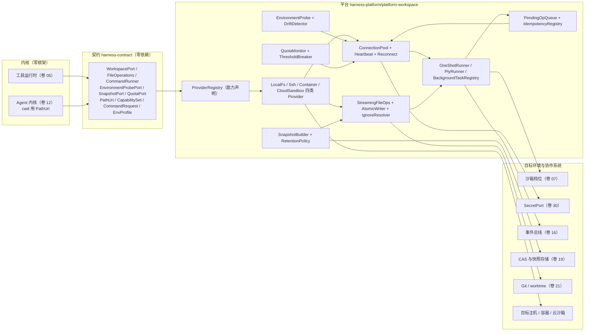
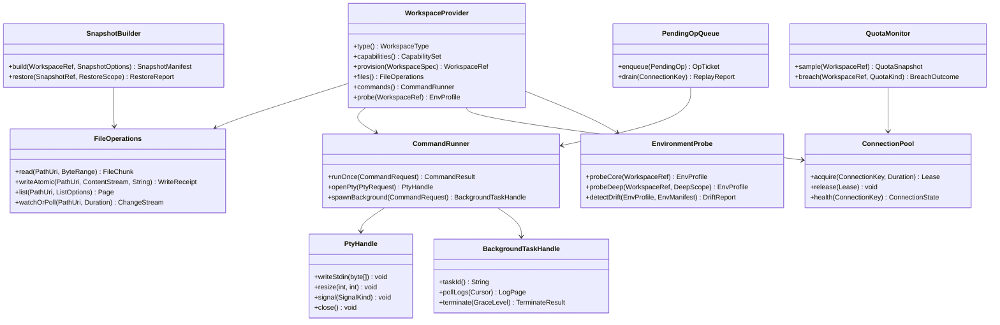
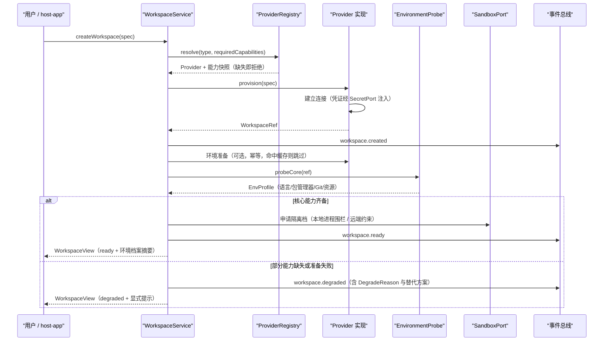
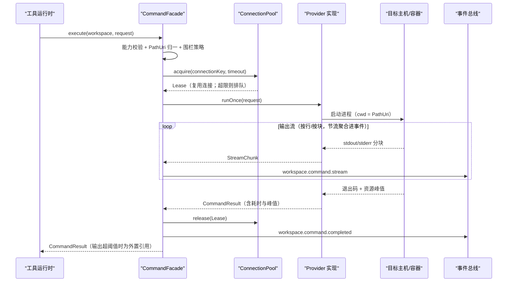
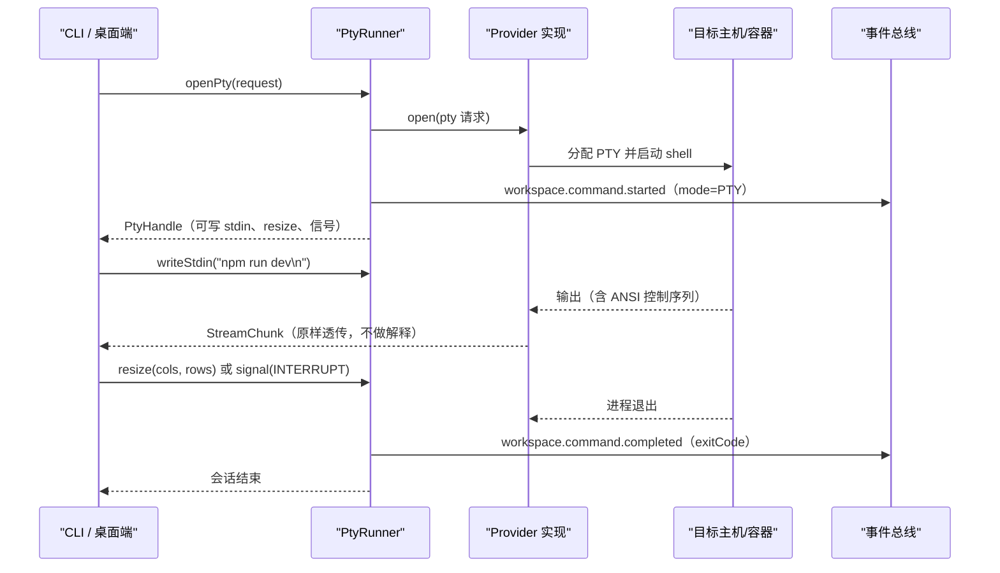
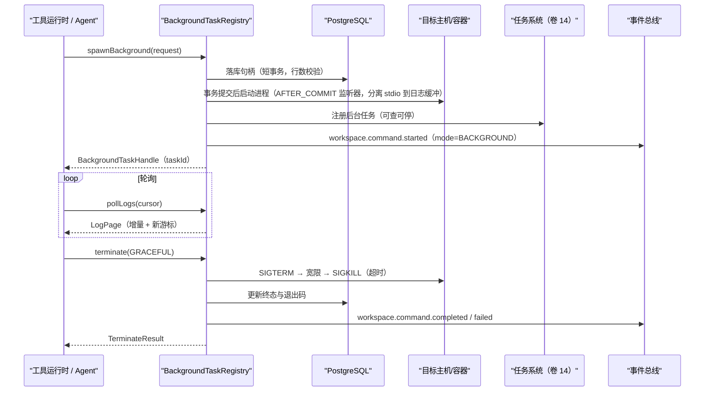
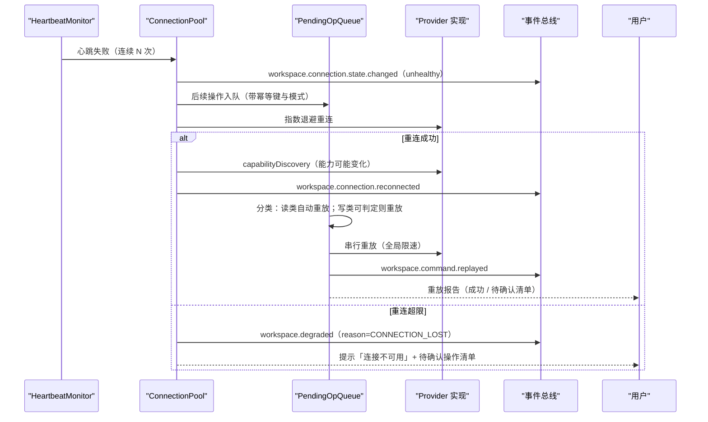
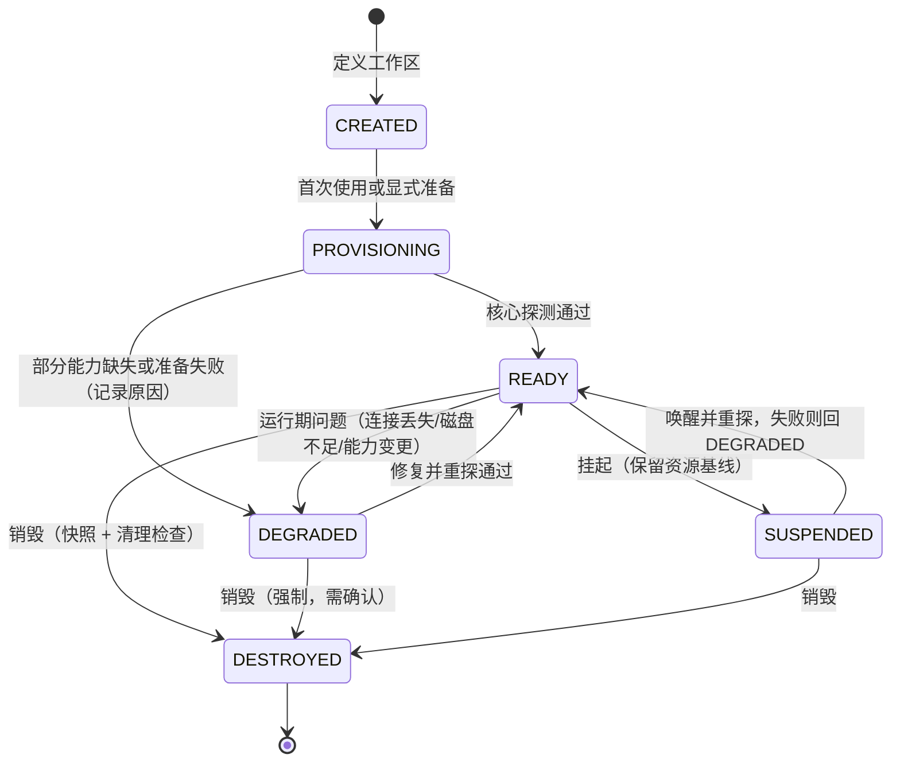
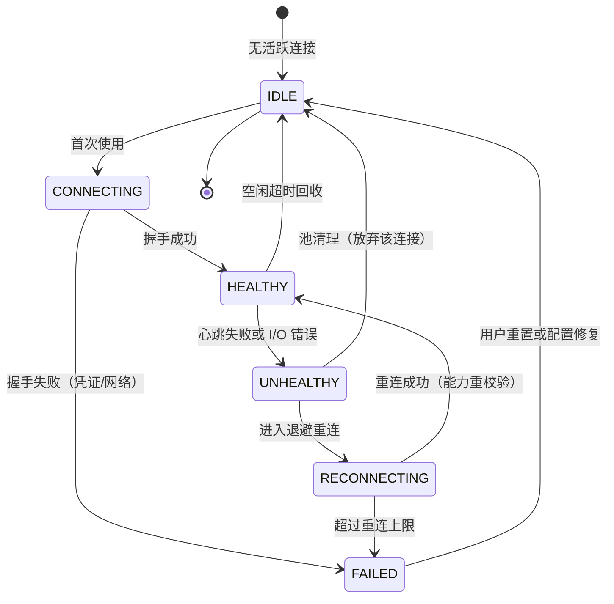
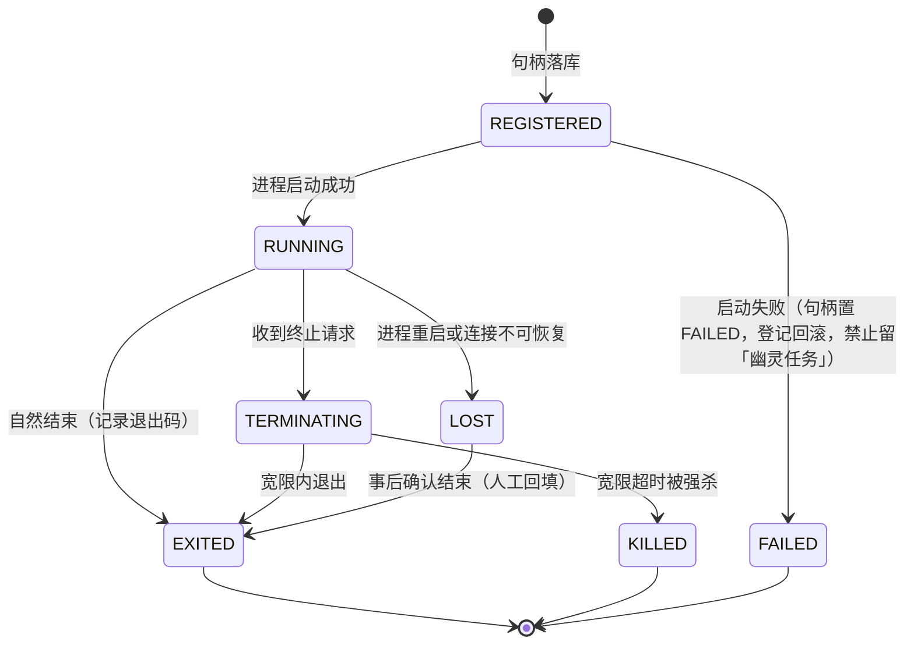

# Phase B 实现方案 20 · 工作区与执行后端（Workspace Provider Implementation）

> 本文件是 Phase B 实现层方案，对应 Phase A 卷 20（`docs/harness/20-workspace-system.md`）与全局约束 H-010（统一 Workspace 抽象）、REQ-WS-1…12、REQ-INT-6（媒体独立存储）。
> 上游契约不可修改：与卷 20 冲突之处一律写入「§⑩.9 对 Phase A 的修订建议（只记录，不改动）」并登记 `I-WS-n`。
>
> 证据标记沿用 `00-research-plan.md` §2：`[E1]` 源码｜`[E2]` 官方文档｜`[E3]` 第三方｜`[E4]` 推断。本文件必须消化的竞品台账行（`research/LESSONS-AND-ADOPTIONS.md` §6.4）：L-072。
>
> 实现落点：`harness-contract`（`com.hk.opencoding.contract.workspace`，零依赖端口与值对象）、`harness-platform/platform-workspace`（`com.hk.opencoding.platform.workspace`，Spring 允许）、
> `harness-platform/platform-sandbox`（隔离档位联动）、`harness-platform/platform-vcs`（Git 能力）、`harness-host/host-app`（用例编排与授权门）、`harness-host/host-server`（管理面 REST）、`harness-host/host-cli`（`oc ws` 命令面）。四段式模块与依赖规则见卷 27 §4.1–§4.2（R1/R2）。

---

## ① 实现目标与范围

### 1.1 本组件解决什么

把「代码在哪里、怎么读写、怎么跑命令、环境是什么、断了怎么办、怎么回收」统一为一套**可替换后端 + 声明式能力**的工程实现：

1. **四类后端统一抽象**：LocalFS / SSH / Container / CloudSandbox 共享 `WorkspaceProvider`，差异只以**能力矩阵**显式表达（D-WS-1）；生命周期显式六态，销毁前快照与清理检查（D-WS-2）。
2. **环境与命令能力**：结构化环境探测八类信息并注入上下文 S2 区段（D-WS-3）；文件流式分页 + 原子写（D-WS-4）；一次性 / PTY / 后台三模式命令（D-WS-5）。
3. **远程与断线治理**：持久连接池 + 心跳 + 重连 + 多路复用 + 并发上限（D-WS-9）；断线期间操作进入**有界队列 + 幂等键**，重连后按语义分类重放（§⑩.3 算法）。
4. **快照与配额**：内容寻址增量清单 + 排除清单（构建产物 + 机密文件）+ 保留窗口与容量上限（D-WS-7）；磁盘/CPU/内存/网络/inode 监控，超阈值暂停执行并按策略清理（D-WS-10）。

### 1.2 与 Phase A 的对应关系

| Phase A 决策 | 本文件落实位置 |
| --- | --- |
| D-WS-1 统一 Provider + 四类实现 + 能力矩阵 | §③ I-WS-1、§④、§⑤ `WorkspaceProvider`、§⑦.1 |
| D-WS-2 六态生命周期 | §③ I-WS-2、§⑥.1、§⑦.1 |
| D-WS-3 结构化环境探测 + 档案注入 | §③ I-WS-6、§⑥.1、§⑧ `oc_env_profile` |
| D-WS-4 流式分页 + 原子写 + 监听 | §⑤ `FileOperations`、§⑩.2、§⑪.1 |
| D-WS-5 三模式命令执行 | §③ I-WS-4、§⑥.2–6.4、§⑨.3 |
| D-WS-6 预置镜像 + 缓存 + 清单驱动准备 | §③ I-WS-7、§⑧ `oc_workspace_pending_op`、§⑨.5 |
| D-WS-7 快照（内容寻址增量） | §③ I-WS-8、§⑥.5、§⑧ `oc_snapshot*`（与卷 19 共用存储，本文件提供清单内容） |
| D-WS-8 多工作区（主 + 关联） | §③ I-WS-5、§⑤ `WorkspaceBinding`、§⑨.1 |
| D-WS-9 持久连接池 + 心跳 + 重连 + 复用 | §③ I-WS-3、§⑥.5、§⑦.2、§⑩.3 |
| D-WS-10 资源监控与配额 / D-WS-12 环境一致性 | §③ I-WS-7、§⑧ `oc_workspace_quota_sample`；§② REQ-WS-14、§⑧ `oc_env_profile.drift` |
| D-WS-11 围栏 + 沙箱 + 凭证托管 + 审计 | §⑨.4、§⑩.6、§⑪.2 |
| H-010 统一 Workspace 抽象 / REQ-INT-6 媒体独立存储 | §④ 端口-适配器分层、§⑤ 契约；§⑧.3 对象前缀与引用模型 |

### 1.3 本组件不解决什么

- **不解决**隔离技术本身（卷 07）：本文件只做**选路与能力声明**（哪档隔离可用、缺失时如何显式降级）。
- **不解决**Git 语义（卷 21）：工作区只保证 `git` 可执行与工作树可读写；worktree/提交/合并由卷 21 负责。
- **不解决**工具语义与结果外置（卷 05）：工具经 `WorkspacePort` 调文件/命令能力，结果外置走卷 05/19。
- **不解决**知识索引实现（卷 11）：本文件只提供文件变更事件与远端同步策略输入。
- **不解决**权限判定（卷 06）：动作描述携带工作区与路径，判定由决策链完成（本文件只声明所需权限点）。

### 1.4 上下游依赖

| 方向 | 依赖对象 | 接口 / 契约 |
| --- | --- | --- |
| 上游 | 工具运行时（卷 05） | 文件/命令工具经 `WorkspacePort`；资源声明（路径/端口/子进程）参与冲突调度 |
| 上游 | 沙箱（卷 07） | `ExecutionIsolationPort`：本地工作区申请进程围栏；远程工作区申请远端约束策略 |
| 上游 | 权限（卷 06） | 动作含 `workspaceId + PathUri`；跨工作区访问需显式授权 |
| 上游 | 密钥（卷 30） | `SecretPort`：连接凭证与密钥引用注入（不落盘） |
| 上游 | 事件（卷 16） | 工作区与命令事件进主事件流（分区键 = 工作区/会话） |
| 上游 | 持久化（卷 19） | 快照 CAS 与引用计数、导出包中的 `workspace-refs.json` |
| 下游 | Git（卷 21） | worktree 创建/合并均在工作区内执行（需 `git` 能力） |
| 下游 | 知识（卷 11） | 索引以工作区文件为源；远端工作区需同步策略（拉取索引源或远端建索引） |
| 下游 | Agent 内核（卷 12） | 环境档案注入上下文；cwd 以 `PathUri` 表达 |

### 1.5 模块落点

**落地登记（R07：模块 / 顺序 / 批次；清单见 `reviews/R07-scope-build-platform.md`）**：
- **模块坐标**：`harness-contract`（包 `contract/workspace`）+ `harness-platform/platform-workspace` + `harness-host/{host-app,host-server}`；与卷 27 §4.3「20 工作区 → `platform-workspace`」一致（22/23 端侧只经协议面，不直连本模块）。
- **实施顺序（卷 27 §4.5）**：第 **12** 步「工作区（Local + SSH；容器后置）」（依赖第 4 步工具运行时、第 11 步沙箱 L0+）。容器/Cloud 后端按卷 27 原文后置，本文件的 `ContainerProvider` / `CloudSandboxProvider` 属第 12 步之后的叠加项，不得作为第 12 步的验收前置。
- **数据迁移批次**：B1 = `oc_workspace` `oc_workspace_binding` `oc_connection_profile` `oc_env_profile` `oc_workspace_ignore_rule` `oc_workspace_quota_sample`；B4 = `oc_workspace_command` `oc_workspace_pty_session` `oc_workspace_background_task` `oc_workspace_pending_op`。`oc_snapshot` / `oc_snapshot_entry` 属 B1 但**拥有者为 `19`**（本文件只提供清单内容）；`oc_recovery_item` 同样由 `19` 拥有。
- **I- 决策落点**：`I-WS-1…9`（9 条）模块落点为上表；类级落点见 §⑤ 类图（`LocalFsProvider`/`PendingOpQueue`/`EnvironmentProbeImpl`），逐条绑定登记为 R07 建议 S4。

```text
harness-contract/src/main/java/com/hk/opencoding/contract/workspace/
    枚举：WorkspaceType / WorkspaceState / Capability / CommandMode / ConnectionState / DegradeReason / SyncMode / IgnoreSource
    值对象：WorkspaceRef / PathUri / WorkspaceSpec / CapabilitySet / CommandRequest / CommandResult
            PtyHandle / BackgroundTaskHandle / EnvProfile / SnapshotManifest / QuotaSnapshot
    SPI：WorkspaceProviderSPI / FileSyncStrategySPI / EnvironmentProbeSPI / ProcessSupervisorSPI
         ConnectionAuthSPI / IgnoreRuleSourceSPI / QuotaEnforcerSPI / SnapshotStoreSPI

harness-platform/platform-workspace/src/main/java/com/hk/opencoding/platform/workspace/
    provider/   LocalFsProvider、SshProvider、ContainerProvider、CloudSandboxProvider
    conn/       ConnectionPool、HeartbeatMonitor、ReconnectPolicy、MultiplexLimiter
    files/      StreamingFileOps、AtomicWriter、DirectoryPager、IgnoreResolver、WatcherBridge
    exec/       OneShotRunner、PtyRunner、BackgroundTaskRegistry、SignalChannel、OutputSpiller
    probe/      EnvironmentProbeImpl、ProfileCache、DriftDetector
    snapshot/   SnapshotBuilder、SnapshotRestorer、RetentionPolicy、SnapshotStoreClient
    quota/      QuotaMonitor、ThresholdBreaker、CleanupAdvisor
    queue/      PendingOpQueue、IdempotencyRegistry、ReplayDispatcher
```

**分层纪律**：契约层零框架、零 IO；所有进程/网络/文件调用在 platform 实现；host 只做用例编排与授权门（卷 27 R1/R2）。

---

## ② 功能需求清单（REQ-WS-n）

| REQ | 需求描述 | 来源 | 优先级 | 验收要点 |
| --- | --- | --- | --- | --- |
| REQ-WS-01 | 四类后端（LocalFS/SSH/Container/CloudSandbox）实现同一 `WorkspaceProviderSPI`，差异以能力矩阵声明 | 卷 20 §3 D-WS-1 | P0 | 同一契约测试套件对四实现（Cloud 为适配器桩）全绿 |
| REQ-WS-02 | 显式生命周期六态；`destroyed` 前必须经快照与清理检查（有未提交改动则要求确认） | 卷 20 §3 D-WS-2 | P0 | 状态机非法迁移一律拒绝并抛统一异常（含当前态与目标态；契约侧 `HarnessException`、外壳侧 `BusinessException`） |
| REQ-WS-03 | 结构化环境探测八类信息，写入 `oc_env_profile` 并注入上下文 S2；探测结果带时间戳与失效判定 | 卷 20 §3 D-WS-3 | P0 | 探测项缺失时以「未知」显式表达，禁止猜测；档案变更触发 `workspace.env.probed` |
| REQ-WS-04 | 文件操作流式分页：读支持行/字节范围与编码探测；写为原子替换 + 校验和；目录分页 + 忽略规则 | 卷 20 §3 D-WS-4 | P0 | 1 GiB 文件读不 OOM（基准用例）；写中断不产生半文件 |
| REQ-WS-05 | **`PathUri` 类型化 cwd**：`scheme://authority/path`，含编码策略与规范化；一个 Turn 可并存**多个环境实例**（主 + 关联） | L-072（`03-codex.md` §8#13 `[E1]`：`protocol.rs:150-178` 的 Environment 多实例 + cwd 类型化） | P0 | 相对路径解析、跨工作区引用需显式指定目标；非法 scheme 直接拒绝 |
| REQ-WS-06 | 命令三模式：① 一次性（捕获输出/退出码/超时/资源）② PTY（stdin/resize/信号）③ 后台任务（句柄、增量日志、终止） | 卷 20 §3 D-WS-5 | P0 | 三模式各有集成用例；后台任务纳入任务系统可查可停 |
| REQ-WS-07 | 后台任务句柄持久化：跨进程重启后可查询状态（`RUNNING/LOST/EXITED`），`LOST` 必须显式提示而非当作成功 | 卷 20 §3 D-WS-5 + 卷 19 D-PERS-7 | P0 | 重启后 `LOST` 任务在 UI 标注「状态丢失，结果未知」 |
| REQ-WS-08 | 持久连接池：每目标一个池、复用、心跳（默认 30s）、断线指数退避重连（上限可配）、并发命令上限 | 卷 20 §3 D-WS-9 | P0 | 故障注入：杀连接后 ≤ 重连上限内恢复；超限标记 `degraded` |
| REQ-WS-09 | **远端执行可作为独立服务**：`exec-server` 形态承载远端文件系统与进程能力，带心跳看门狗与**能力发现**（能力缓存 + 失效重探） | L-072（`03-codex.md` §4.16 `[E1]`：`exec-server/src/` 的 `capability_discovery.rs`、`websocket_pong_watchdog.rs`、`ExecutorFileSystem`） | P1 | 能力发现结果缓存且可失效；本地形态内嵌同语义实现（不引入独立进程） |
| REQ-WS-10 | **能力缺失显式降级**：无文件监听 → 轮询（默认 2s，可配）+ 明确提示；不可实现能力返回 `UNSUPPORTED_CAPABILITY` | 卷 20 §4.2 降级规则；DeepSeek「能力缺失响亮拒绝」`[E1]`（`04-deepseek-harness.md` §4.9）；L-015（禁沉默不对等） | P0 | 契约测试覆盖每种能力缺失路径；日志与事件含 `DegradeReason` |
| REQ-WS-11 | 快照：内容寻址增量清单（与卷 19 D-PERS-6 一致），排除构建产物与**机密文件**（`.env*`、`.oc/secrets*` 等） | L-049（`09-secondary-tier.md` §⑤ S8 `[E1]`：Roo `excludes.ts` + `createSanitizedGit`）+ L-014 隐藏文件集合 | P0 | 机密文件不进入清单（断言）；去重率 ≥ 60%；恢复支持全量/目录/单文件 |
| REQ-WS-12 | 配额：磁盘/CPU/内存/网络/inode 监控；容器与云可强限、SSH 仅观测；超阈值告警并**暂停执行** | 卷 20 §3 D-WS-10 | P1 | 超阈值用例：正在执行的命令被暂停而非杀死（可恢复语义） |
| REQ-WS-13 | 环境清单驱动准备：`.oc/env.yaml` 声明依赖与初始化命令，首次准备结果缓存复用 | 卷 20 §3 D-WS-6 | P1 | 准备幂等（重复执行不重复安装）；失败可重试并保留日志 |
| REQ-WS-14 | 环境差异检测：探测结果 vs 清单 vs CI 期望 → 差异报告 + 可选一键准备 | 卷 20 §3 D-WS-12 | P1 | 差异报告含期望值/实际值/影响面；一键准备产出可复制命令 |
| REQ-WS-15 | 忽略语义分层：内置默认 + `.gitignore` + `.ocignore` + 租户策略；忽略仅影响列举/索引/快照，**不阻止显式路径访问** | 卷 20 §3 D-WS-4；gemini-cli 忽略清单经验 `[E1]`（`09-secondary-tier.md` §⑤ S8 排除清单） | P1 | 显式读取被忽略文件成功且记审计；`list` 结果与忽略规则一致 |
| REQ-WS-16 | 跨平台路径与编码：Windows 驱动器/UNC/长路径；行尾与字符集探测（UTF-8/GBK/UTF-16）写回时保持原编码 | 卷 20 §7 可靠性；`20-workspace-system.md` §4.1 能力矩阵 | P0 | Windows 用例（`C:\`、UNC、260+ 字符路径）与 GBK 文件往返一致 |
| REQ-WS-17 | **断线期间操作排队与幂等**：有界队列 + 幂等键；读类可自动重放、写类需显式确认（不改语义） | 卷 20 §2 REQ-WS-9 冲突点；Cline/Codex 持久连接反面证据：每命令一次握手不可接受 `[E1]` | P0 | 断线注入：队列不丢、重连后按类别重放；重复重放不产生双重副作用 |
| REQ-WS-18 | 本地文件操作延时可测：小文件读 ≤ 5ms（P95）；远程操作超时可配且可取消 | 卷 20 §7 性能 | P1 | 基准用例达标；取消后进程组被清理（无僵尸） |
| REQ-WS-19 | 审计：每条命令记录目标、用户、命令摘要、资源峰值、退出码（脱敏）；跨工作区访问记审计 | 卷 20 §3 D-WS-11 | P0 | 审计可查且命令内容按 DLP 规则脱敏 |
| REQ-WS-20 | 多工作区绑定：会话可绑定主 + 关联工作区；写范围可限定（只读关联区） | 卷 20 §3 D-WS-8 | P1 | 只读关联区写入被拒绝（`WORKSPACE_PATH_DENIED`）；授权后可写 |
| REQ-WS-21 | **远端连接信任（安全红线）**：SSH 工作区默认 `host-key-policy=strict`（首次信任需人工核对指纹后落库，禁止 `accept-new`/`no` 静默信任）；主机密钥变化即**阻断连接**并告警（疑似 MITM）；跳板逐跳校验主机密钥；`ForwardAgent` 默认关闭且跳板禁用 `-A`；远端端点 `deny-private`（拒回环 / 链路本地 / 云元数据地址）；非 HTTP 凭据代理不可用时拒绝而非降级 | 卷 30 §4.3 B5「主机密钥校验（SSH）」；`27-security-runtime-impl.md` §4.2 边界 B5 启动期检查；DeepSeek SSH 执行 provider 家族 `[E1]`（`04-deepseek-harness.md` §4.16） | P0 | 故障注入：伪造主机密钥被拒 + 告警；`accept-new` 配置被启动校验拒绝；跳板场景逐跳校验生效 |

**竞品增量需求说明**：REQ-WS-05/09/10/11/17 共 5 条来自竞品源码事实（Codex `Environment` 多实例与 `exec-server`、DeepSeek 能力缺失拒绝、Roo 影子仓排除清单、各家连接复用实践），在 §③ 作为候选分支参与评分并登记 `I-WS-n`；
REQ-WS-21（远端连接信任）为 R04 安全轮新增，对应 §③ 的 `I-WS-9` 与 §⑩.6 的远端信任纪律。

---

## ③ 技术方案选型（M×N 比选）

评分沿用 `README.md` §4 权重：**F 30% / U 20% / S 25% / M 25%**。

### D-WSI-1 后端抽象形态

| 分支 | 描述 | F | U | S | M | 加权 | 结论 |
| --- | --- | --- | --- | --- | --- | --- | --- |
| B1 | 每类后端各写一套工具实现 | 6 | 6 | 5 | 5 | 55.0 | 淘汰（行为不一致、重复实现） |
| B2 | **统一 `WorkspaceProviderSPI` + 四类内置实现 + Provider 注册表（能力声明）** | 9 | 8 | 8 | 9 | 86.0 | **选定** |
| B3 | 只做本地 + 「远程命令转发」薄壳 | 6 | 7 | 7 | 6 | 64.0 | 淘汰（文件语义缺失，远端不可用） |

**选定 B2**：DeepSeek 的六 provider 注册表证明「同一接口背后可换实现」是长期正确形态 `[E1]`；能力声明让缺失显式（REQ-WS-10）。被放弃分支代价：B1 的「实现自由」换来四套行为漂移，测试成本翻倍。回退触发：若 Provider 抽象在 3 个版本内无法覆盖某后端的必要语义（需 5 处以上 `instanceof` 分支），回退为「LocalFS 一等 + 远端专用工具族」。

### D-WSI-2 cwd 与目标寻址

| 分支 | 描述 | F | U | S | M | 加权 | 结论 |
| --- | --- | --- | --- | --- | --- | --- | --- |
| B1 | 字符串路径 + workspaceId 参数 | 7 | 6 | 8 | 6 | 68.0 | 基线（跨工作区易歧义、无法表达远端语义） |
| B2 | **`PathUri`（scheme://authority/path）+ 环境多实例并存 + 显式目标解析** | 9 | 9 | 8 | 9 | 87.5 | **选定** |
| B3 | 仅相对路径 + 会话级单一根 | 5 | 5 | 9 | 5 | 59.5 | 淘汰（多仓协作不可行） |

**选定 B2**（L-072 适配）：`Environment` 升级为可复数并存的一等目标，`cwd` 类型化；本地形态下 scheme 固定 `local`，远端为 `ssh`/`container`/`cloud`。被放弃分支代价：B1 在「同 Turn 内两仓协作」场景会产生二义性与错误写。回退触发：若 `PathUri` 在工具层造成 > 10% 的调用失败（规范化歧义），收敛为「workspaceId + 规范化相对路径」双字段表达。

### D-WSI-3 远程连接形态

| 分支 | 描述 | F | U | S | M | 加权 | 结论 |
| --- | --- | --- | --- | --- | --- | --- | --- |
| B1 | 每命令新建连接（SSH 短连） | 6 | 5 | 8 | 5 | 59.5 | 淘汰（延迟高、易被限流；REQ-WS-8 明确淘汰） |
| B2 | **持久连接池 + 心跳 + 重连 + 多路复用 + 并发上限** | 9 | 8 | 8 | 9 | 86.0 | **选定（默认）** |
| B3 | 独立常驻 `exec-server` 服务（Codex 形态） | 9 | 7 | 6 | 8 | 75.5 | 作为**可选档**：跨区/跨云场景经 `WorkspaceProviderSPI` 接入 |

**选定 B2，并把 B3 作为可选适配器**：常驻独立执行服务带来运维面（部署、升级、鉴权）与本地形态冲突（D-ARC-3 双模要求本地内嵌）；因此默认进程内实现，`exec-server` 形态仅在「远端执行需独立扩缩容」场景启用（`open-coding.workspace.remote.mode=embedded|exec-server`）。被放弃分支代价：B3 的隔离性与伸缩性更好，但多一跳网络与一套运维。回退触发：若进程内实现无法满足企业网络策略（需独立服务做出口管控），默认切 `exec-server`。

### D-WSI-4 命令执行实现

| 分支 | 描述 | F | U | S | M | 加权 | 结论 |
| --- | --- | --- | --- | --- | --- | --- | --- |
| B1 | 统一「一次性执行」+ 用管道模拟交互 | 6 | 6 | 8 | 6 | 64.0 | 淘汰（无法支持 REPL/密码提示/交互式工具） |
| B2 | **真实三模式：一次性 / PTY / 后台任务句柄** | 9 | 9 | 8 | 9 | 87.5 | **选定** |
| B3 | 仅 PTY（把一次性当 PTY 特例） | 7 | 7 | 7 | 7 | 70.0 | 淘汰（输出语义与退出码捕获不可靠，且浪费资源） |

**选定 B2**：PTY 与一次性语义不同（行尾处理、echo、信号、退出码时机），合并会持续产生边界 bug。被放弃分支代价：B3 实现更少代码，但一次性命令的退出码/输出完整性无法保证。回退触发：若 PTY 在 Windows 上不可用（ConPTY 缺失），降级为「一次性 + 后台」并对交互式需求返回 `UNSUPPORTED_CAPABILITY`。

### D-WSI-5 文件同步与镜像策略

| 分支 | 描述 | F | U | S | M | 加权 | 结论 |
| --- | --- | --- | --- | --- | --- | --- | --- |
| B1 | 全量双向同步（把远端镜像到本地） | 6 | 6 | 5 | 5 | 55.0 | 淘汰（大仓不可行、冲突难判） |
| B2 | **远端为执行地（不镜像）+ 按需拉取/推送；镜像是「快照与索引」的可选加速** | 9 | 8 | 8 | 9 | 86.0 | **选定** |
| B3 | 本地为源 + 增量上传（rsync 式），远端只读 | 7 | 7 | 7 | 7 | 70.0 | 淘汰（远端无法直接跑命令/写产物） |

**选定 B2**：工作区语义是「在哪里执行」，不是「把代码搬哪里」；索引与快照各自按需取内容（卷 11/19）。被放弃分支代价：B1 的「本地全量可见」以存储与时延为代价，且双向同步冲突无法自动裁决。回退触发：若远端不可达时间 > 配置阈值且用户开启离线模式，降级为 `MIRROR_CACHE`（只读缓存）并显式提示。

### D-WSI-6 断线期间操作处置

| 分支 | 描述 | F | U | S | M | 加权 | 结论 |
| --- | --- | --- | --- | --- | --- | --- | --- |
| B1 | 立即失败并向上抛错 | 6 | 5 | 9 | 6 | 63.5 | 淘汰（长任务断线即全废，体验不可接受） |
| B2 | **有界队列 + 幂等键 + 重连后分类重放（读自动、写确认）** | 9 | 8 | 8 | 9 | 86.0 | **选定** |
| B3 | 本地暂存 + 离线执行 + 冲突合并 | 8 | 7 | 5 | 7 | 68.0 | 淘汰（离线执行语义与沙箱/审计冲突，合并不可判定） |

**选定 B2**：与卷 19「幂等重放」同构；写类操作重放**不改语义**——只重放「未被目标确认且可判定为未生效」的写，无法判定的写转为 `NEEDS_CONFIRMATION` 提示。被放弃分支代价：B3 的离线能力以正确性为代价（不可判定冲突）。回退触发：若队列积压导致重连风暴（重放 QPS 超阈值），改为「按会话串行重放 + 全局限速」。

### D-WSI-7 资源配额执行位置

| 分支 | 描述 | F | U | S | M | 加权 | 结论 |
| --- | --- | --- | --- | --- | --- | --- | --- |
| B1 | 无监控（依赖用户自管） | 4 | 4 | 8 | 4 | 49.0 | 淘汰（磁盘打满即事故） |
| B2 | **平台侧监控 + 可强制时强制（容器/云 cgroup 级）+ SSH 仅观测 + 超阈值暂停** | 8 | 8 | 8 | 8 | 80.0 | **选定** |
| B3 | 全部强制（SSH 上注入 cgroup/systemd 限制） | 7 | 6 | 5 | 6 | 60.5 | 淘汰（需远端 root，与「禁止提权」冲突） |

**选定 B2**：能力边界诚实（SSH 只观测），与 D-WS-10 一致。被放弃分支代价：B3 的强限更彻底，但需远端提权，安全上不可接受。回退触发：若 SSH 场景磁盘事故频发（季度 ≥ 2 次），增加「写前配额预检」（`df` 采样 + 单次写入上限）作为补偿。

### D-WSI-8 快照与排除清单

| 分支 | 描述 | F | U | S | M | 加权 | 结论 |
| --- | --- | --- | --- | --- | --- | --- | --- |
| B1 | 全量打包（含全部文件） | 6 | 7 | 7 | 5 | 61.0 | 淘汰（成本高且会带走机密文件） |
| B2 | **内容寻址增量 + 排除清单（构建产物 + 机密文件）+ 保留窗口 + 容量上限** | 9 | 8 | 8 | 9 | 86.0 | **选定** |
| B3 | 依赖容器镜像层 / 文件系统 reflink | 6 | 6 | 7 | 6 | 62.5 | 作为 Container/Cloud 后端可选加速（同 SPI） |

**选定 B2**：与卷 19 D-PERS-6 一致，且**必须**含机密文件排除（L-049 风险列：检查点会复制 `.env`）。被放弃分支代价：B1 简单但可复现性差、合规风险高。回退触发：若去重率 < 40%，改为按项目分桶 + 缩短保留窗口。

### D-WSI-9 环境探测执行者与粒度

| 分支 | 描述 | F | U | S | M | 加权 | 结论 |
| --- | --- | --- | --- | --- | --- | --- | --- |
| B1 | 不做探测，让模型自行试错 | 6 | 5 | 8 | 5 | 59.5 | 淘汰（D-WS-3 明确淘汰） |
| B2 | **分层探测：快速核心（语言/版本/包管理器/Git）+ 按需深度（测试框架/网络/资源）+ 缓存与失效重探** | 9 | 9 | 8 | 9 | 88.0 | **选定** |
| B3 | 全量探测（每次进入工作区全跑一遍） | 7 | 6 | 6 | 6 | 63.5 | 淘汰（首次准备延迟高，远端尤其） |

**选定 B2**：核心探测 ≤ 2s（本地）/≤ 5s（SSH），深度项按需触发；档案带 `probedAt` 与失效条件（环境清单变更、镜像变更、用户手动刷新）。被放弃分支代价：B3 信息更全，但拖慢首轮对话。回退触发：若模型仍频繁试错（评测中「无效探测命令」占比 > 15%），把深度项提前到首轮。

### D-WSI-10 忽略与可见性语义

| 分支 | 描述 | F | U | S | M | 加权 | 结论 |
| --- | --- | --- | --- | --- | --- | --- | --- |
| B1 | 服务端实现完整 gitignore 语义并强制阻断访问 | 7 | 6 | 6 | 6 | 63.5 | 淘汰（语义复杂、误伤显式访问） |
| B2 | **分层忽略（内置 + `.gitignore` + `.ocignore` + 租户策略）+ 仅影响列举/索引/快照 + 显式访问放行并审计** | 9 | 8 | 8 | 9 | 86.0 | **选定** |
| B3 | 无忽略（全部可见） | 5 | 5 | 9 | 5 | 59.5 | 淘汰（大仓列举与索引不可用） |

**选定 B2**：忽略是「默认视图」而非「访问控制」；真正的禁区由卷 07 路径围栏承担。被放弃分支代价：B1 的强约束更安全，但会把 `.env` 排查类正常操作变成不可能。回退触发：若企业策略要求硬阻断，通过 `IgnoreRuleSourceSPI` 提供 `DENY` 级别规则（走卷 06 决策链，不在本文件实现）。

### 3.9 实现级决策登记（I-WS-n）

| 编号 | 决策 | 选定 | 被放弃分支代价 | 回退触发 |
| --- | --- | --- | --- | --- |
| I-WS-1 | 后端抽象 | 统一 Provider + 四实现 + 能力矩阵 + 注册表 | 四套实现行为漂移、测试翻倍 | 需 > 5 处 `instanceof` 分支 → LocalFS 一等 + 远端专用工具族 |
| I-WS-2 | 目标寻址 | `PathUri` + 环境多实例并存（L-072 适配） | 字符串路径在跨工作区场景二义 | 工具层调用失败 > 10% → workspaceId + 相对路径双字段 |
| I-WS-3 | 远端执行形态 | 默认进程内连接池；`exec-server` 为可选档（配置切换） | 独立服务运维面与多一跳延迟 | 企业网络策略要求独立出口 → 默认切 exec-server |
| I-WS-4 | 命令执行 | 真实三模式（一次性/PTY/后台）+ 后台句柄持久化 | 模拟交互在复用/信号场景持续出 bug | Windows 无 ConPTY → 降级两模式 + `UNSUPPORTED_CAPABILITY` |
| I-WS-5 | 同步与读范围 | 远端为执行地，不镜像；镜像是快照/索引的可选加速 | 无本地全量视图，离线不可用 | 需要离线镜像 → `MIRROR_CACHE` 只读模式（显式提示） |
| I-WS-6 | 断线处置 | 有界队列 + 幂等键 + 分类重放（读自动、写确认） | 队列积压可能造成重连风暴 | 重放 QPS 超阈值 → 会话串行 + 全局限速 |
| I-WS-7 | 探测与配额 | 分层探测 + 平台侧监控（容器/云强制、SSH 仅观测） | SSH 无法强限，靠预检兜底 | 季度磁盘事故 ≥ 2 次 → 增加写前配额预检 |
| I-WS-8 | 快照与忽略 | CAS 增量 + 排除清单（产物 + 机密）+ 保留窗口；忽略分层且显式访问放行 | 无硬阻断能力（由卷 06 决策链兜底） | 去重率 < 40% → 项目分桶 + 缩短保留窗口 |
| I-WS-9 | 远端连接信任（R04 新增） | `host-key-policy=strict` + 首次信任人工核对指纹 + 密钥变化阻断 + 跳板逐跳校验 + `ForwardAgent` 默认关 + 端点 `deny-private` | 放弃「一键接受新主机密钥」的便利：首次连接需一次人工指纹核对（企业可预置 known_hosts 分发） | 企业集中分发 known_hosts 与轮换流程就绪 → 保持 strict 不变，仅把首次核对移入运维流程 |

**与竞品对照的取舍**：工作区/执行后端在竞品中以「本地子进程 + cwd」为主流（全量九组竞品的共同基线），差分点在远端形态——OpenHands 系以容器为执行地、Grok/DeepSeek 以本地目录直连 `[E1]`（`research/CROSS-COMPARISON.md` §2/§4 与 `06-grok-cli-and-build.md`）。**取舍**：① 抽象选四实现统一 Provider + 能力矩阵（I-WS-1）而非「本地优先 + 远端插件」——代价是测试翻倍，换得工具层零 `instanceof` 分支；② 寻址采纳 L-072 的 `PathUri` 适配经验（`00-research-plan.md` §6.4 台账），放弃纯字符串路径（跨工作区二义）；③ 远端「不镜像、按需拉取」——放弃离线全量可见（回退路径为 `MIRROR_CACHE` 只读模式，I-WS-5）；④ 配额执行位置分层：容器/云强制、SSH 仅观测 + 写前预检（I-WS-7）——不接受为 SSH 强行提权做硬限，代价是 SSH 场景配额为「软约束 + 告警」。

---

## ④ 总体架构图



**说明**：内核只依赖 `WorkspacePort`（契约零依赖）；`ProviderRegistry` 按能力声明选择实现（能力缺失 → `UNSUPPORTED_CAPABILITY`，不静默降级）；`QUEUE` 是断线期间的唯一入口（§⑩.3）；Spring 装配点由 `host-bootstrap` 以 `@ConditionalOnMissingBean` 装配四类 Provider，`local` 形态仅装配 `LocalFsProvider`。

---

## ⑤ 类图与关键契约



**Java 21 关键签名（节选，完整形态见 `com.hk.opencoding.contract.workspace`）**

```java
package com.hk.opencoding.contract.workspace;

/**
 * 工作区后端统一端口（节选，全部 public 方法均有完整 JavaDoc 与 @throws 语义）。
 * 四类实现（LocalFS / SSH / Container / CloudSandbox）共享本接口，差异一律经 {@link CapabilitySet} 声明；
 * 能力缺失时由注册表显式拒绝（UNSUPPORTED_CAPABILITY），禁止静默降级。
 */
public interface WorkspaceProviderSPI {

    WorkspaceType type();

    CapabilitySet capabilities();

    /** 准备并激活工作区；连接失败或凭证无效抛 WORKSPACE_UNAVAILABLE。 */
    WorkspaceRef provision(WorkspaceSpec spec);

    /** 探测环境并产出档案；未知项以 UNKNOWN 显式表达；不可达抛 WORKSPACE_UNAVAILABLE。 */
    EnvProfile probe(WorkspaceRef ref, ProbeScope scope);

    /** 关闭并释放资源；存在未完成后台任务且策略要求先终止时抛 CONFLICT。 */
    void close(WorkspaceRef ref, CloseReason reason);
}
```

```java
package com.hk.opencoding.contract.workspace;

/**
 * 类型化路径：{@code scheme://authority/path}。
 * scheme 与工作区类型一一对应（local/ssh/container/cloud）；authority 为连接配置标识（local 固定为 local-host）；
 * path 一律表达为「工作区根 + 根内相对路径」，禁止跨工作区隐式解析（REQ-WS-05）。
 *
 * @param scheme    协议（必填，枚举）
 * @param authority 连接配置标识（必填）
 * @param rootPath  工作区根（必填，规范化绝对路径）
 * @param relative  根内相对路径（可空，空表示根自身）
 * @param encoding  路径编码策略（必填：UTF-8 / 平台本地编码）
 */
public record PathUri(WorkspaceType scheme, String authority, String rootPath, String relative,
                      EncodingPolicy encoding) {

    /** 越界片段（禁止出现在 relative 中；常量集合见 PathUriConstants）。 */
    private static final Set<String> FORBIDDEN_SEGMENTS = PathUriConstants.FORBIDDEN_SEGMENTS;

    /**
     * 构造并规范化路径（Windows 驱动器 / UNC / 长路径 / 分隔符统一在此收敛）。
     *
     * @param scheme 协议（必填）；authority 连接配置标识（必填）；rootPath 工作区根（必填）
     * @param relative 根内相对路径（可空）；encoding 编码策略（必填）
     * @return 规范化后的路径
     * @throws HarnessException 含越界片段或非法字符时抛出，错误码 WORKSPACE_PATH_DENIED
     */
    public static PathUri of(WorkspaceType scheme, String authority, String rootPath, String relative,
                             EncodingPolicy encoding) {
        return new PathUri(scheme, authority, PathUris.normalizeRoot(rootPath),
                PathUris.normalizeRelative(relative, FORBIDDEN_SEGMENTS), encoding);
    }

    /** 渲染为展示串（日志与 UI 用；禁止用于再次解析）。 */
    public String display() { return PathUris.display(this); }
}
```

```java
package com.hk.opencoding.contract.workspace;

/** 命令执行模式（code + desc + of() 工厂，遵循常量抽取规范；DB 与事件只存 code）。 */
public enum CommandMode {
    ONE_SHOT("ONE_SHOT", "一次性执行"),
    PTY("PTY", "交互式会话"),
    BACKGROUND("BACKGROUND", "后台任务");

    private final String code;
    private final String desc;

    CommandMode(String code, String desc) {
        this.code = code;
        this.desc = desc;
    }

    public String getCode() { return code; }

    public String getDesc() { return desc; }

    /**
     * 由 code 反解枚举。
     *
     * @param code 编码值（必填）
     * @return 对应枚举
     * @throws HarnessException 未知 code 时抛出，错误码 INVALID_ARGUMENT
     */
    public static CommandMode of(String code) {
        for (CommandMode mode : values()) {
            if (mode.code.equals(code)) {
                return mode;
            }
        }
        throw new HarnessException(ErrorCode.INVALID_ARGUMENT, "未知命令执行模式：" + code);
    }
}
```

**编码规约落地示例（外壳侧 = `harness-platform/platform-workspace`，Spring 允许；事务与外部调用纪律见 §6.4）**：

```java
package com.hk.opencoding.platform.workspace.exec;

/**
 * 命令执行门面（平台侧，`platform-workspace`）：三模式统一入口，负责能力校验、隔离联动、审计与输出外置。
 * 事务边界：命令执行本层不做数据库长事务；「后台任务登记」的短事务在 {@link BackgroundTaskService} 内，
 * 进程启动经 `AFTER_COMMIT` 事件触发（外部副作用永不出现在事务内）。
 */
@Slf4j
@Service
@RequiredArgsConstructor
public class CommandFacade {

    private final WorkspaceProviderRegistry registry;
    private final SandboxPort sandboxPort;
    private final ExecutionAuditRecorder auditRecorder;
    private final BackgroundTaskService backgroundTaskService;

    /**
     * 执行命令（按 mode 分派三模式之一）。
     *
     * @param workspace 工作区引用（必填，须为 READY 或 DEGRADED）
     * @param request   命令请求（必填：cwd 为 {@link PathUri}、模式、超时、资源上限）
     * @return 执行结果（一次性返回退出码与输出引用；PTY 与后台返回句柄）
     * @throws BusinessException 能力缺失（能力矩阵未声明）或工作区不可用时抛出
     */
    public CommandResult execute(WorkspaceRef workspace, CommandRequest request) {
        log.info("执行工作区命令，workspaceId={}, mode={}, cwd={}",
                workspace.workspaceId(), request.mode().getDesc(), request.cwd().display());

        // 1. 能力校验：缺失能力必须显式拒绝，禁止静默降级（REQ-WS-10）
        CapabilitySet caps = registry.capabilitiesOf(workspace.workspaceId());
        if (!caps.supports(request.mode())) {
            throw new BusinessException(ErrorCode.UNSUPPORTED_CAPABILITY,
                    "当前工作区不支持「" + request.mode().getDesc() + "」，可用模式：" + caps.commandModes());
        }
        // 2. 路径围栏（cwd 落在受控根内）+ 隔离档选择（本地进程围栏 / 远端约束）
        SandboxPlan plan = sandboxPort.planFor(workspace, request.cwd().normalize());

        // 3. 分派执行（后台模式：先落库句柄，进程由提交后监听器启动，见 §6.4 与 BackgroundTaskService）
        CommandResult result = switch (request.mode()) {
            case ONE_SHOT -> registry.providerOf(workspace).commands().runOnce(request.withPlan(plan));
            case PTY -> registry.providerOf(workspace).commands().openPty(request.withPlan(plan)).toResult();
            case BACKGROUND -> CommandResult.ofBackground(
                    backgroundTaskService.registerAndSpawnAfterCommit(workspace, request, plan));
        };

        // 4. 审计与输出外置（超阈值输出改引用，正文经卷 05/19 外置）
        auditRecorder.record(workspace, request, result, plan.enforcement());
        log.info("工作区命令结束，workspaceId={}, mode={}, exitCode={}, degraded={}",
                workspace.workspaceId(), request.mode().getDesc(), result.exitCode(), result.degraded());
        return result;
    }
}

/**
 * 后台任务登记与启动（**独立 Bean**：跨 Bean 调用才走 Spring 事务代理，避免自调用导致 `@Transactional` 失效）。
 * 事务边界：仅「登记句柄」在短事务内；**进程启动是外部副作用，必须在事务提交后执行**——
 * 否则事务回滚会留下无登记行的孤儿进程，且长事务占连接池。
 */
@Slf4j
@Service
@RequiredArgsConstructor
public class BackgroundTaskService {

    private final WorkspaceProviderRegistry registry;
    private final BackgroundTaskMapper taskMapper;
    private final ApplicationEventPublisher eventPublisher;

    /**
     * 登记后台任务句柄，并在事务提交后启动进程（`REGISTERED` → `RUNNING`）。
     *
     * @param workspace 工作区引用（必填，须为 READY 或 DEGRADED）
     * @param request   命令请求（必填，mode 必须为 BACKGROUND）
     * @param plan      隔离计划（必填，由沙箱端口产出）
     * @return 已登记的句柄（进程尚未启动完成时状态为 `REGISTERED`，跨重启可据句柄判定 `LOST`）
     * @throws BusinessException 句柄登记失败（`INTERNAL_ERROR`）时抛出；启动失败在提交后由监听器置 `FAILED`
     */
    @Transactional(rollbackFor = Exception.class)
    public BackgroundTaskHandle registerAndSpawnAfterCommit(WorkspaceRef workspace, CommandRequest request,
                                                           SandboxPlan plan) {
        log.info("登记后台任务开始，workspaceId={}, cwd={}", workspace.workspaceId(), request.cwd().display());

        // 1. 先落库句柄（REGISTERED）：崩溃后可按句柄判定 LOST，而不是「当作成功」；登记行数必须为 1
        BackgroundTaskHandle handle = registry.providerOf(workspace).commands().newHandle(request, plan);
        if (taskMapper.insertHandle(workspace, request, handle) != 1) {
            throw new BusinessException(ErrorCode.INTERNAL_ERROR, "后台任务句柄登记失败，未启动进程");
        }

        // 2. 进程启动移出事务：AFTER_COMMIT 监听器执行 spawn；失败即置 FAILED 并写事件（禁止幽灵 RUNNING）
        eventPublisher.publishEvent(new BackgroundTaskSpawnRequestedEvent(workspace.workspaceId(), handle.handleId()));

        log.info("登记后台任务完成，workspaceId={}, handleId={}", workspace.workspaceId(), handle.handleId());
        return handle;
    }
}
```

**异常与日志纪律**：异常按层分工——**契约侧（`contract.workspace`：`PathUri` / `CommandMode` 等零框架值对象与枚举）统一 `HarnessException` + `ErrorCode`**；**平台与宿主侧（`platform.workspace` / `host-*`，Spring）统一 `BusinessException` + `ErrorCode`，由外壳全局异常处理器按码映射**（错误模型见附录 B §B.7）；工作区三码 `WORKSPACE_UNAVAILABLE` / `WORKSPACE_PATH_DENIED` / `WORKSPACE_QUOTA_EXCEEDED`，能力缺失 `UNSUPPORTED_CAPABILITY`；禁止裸 `RuntimeException`；连接与进程清理失败带 `Throwable` 打 `log.error`；命令内容进审计前按 DLP 规则脱敏。

---

## ⑥ 核心流程时序图

### 6.1 工作区创建 → 准备 → 探测 → ready/degraded

前置条件：连接配置与凭证引用可用；目标环境可达（容器/云需镜像可拉取）。主路径：provision → 环境准备（可选）→ 核心探测 → ready。
异常与补偿：准备失败或部分能力缺失 → `degraded` 并写 `DegradeReason`；探测失败不阻塞创建（标记为 `UNKNOWN` 项）。幂等与并发点：以 `workspaceId` 加准备锁；重复 provision 返回既有引用（幂等）。



### 6.2 一次性命令与流式输出

前置条件：工作区 `ready` 或 `degraded`；命令经权限决策链放行。主路径：取连接 → 执行 → 流式收输出 → 汇总结果。
异常与补偿：超时 → 发送终止信号 → 清理进程组；输出超阈值 → 外置为引用。幂等与并发点：`commandId` 幂等键；并发上限由连接池令牌控制（超限排队而非拒绝）。



### 6.3 PTY 交互会话

前置条件：能力矩阵声明 PTY 支持（否则 `UNSUPPORTED_CAPABILITY`）。主路径：openPty → 双向流 → 信号/尺寸 → close。
异常与补偿：连接中断 → PTY 标记 `LOST`（远端进程按策略终止）；不支持恢复的远端直接提示会话丢失。幂等与并发点：`ptySessionId` 唯一；同工作区 PTY 数受配额限制。



### 6.4 后台任务（句柄、日志、终止）

前置条件：能力矩阵声明后台任务支持；任务系统可用。主路径：**登记句柄（短事务，先落库）→ 事务提交后启动进程** → 增量日志 → 终止或自然结束。
异常与补偿：**登记提交后启动失败** → 句柄 `REGISTERED → FAILED`（记录失败原因，禁止留「幽灵 RUNNING 任务」，禁止自动重试以免重复副作用）；进程重启后句柄状态为 `LOST`（结果未知，UI 显式提示）；终止先 `SIGTERM` 宽限再 `SIGKILL`。幂等与并发点：`backgroundTaskId` 唯一；同工作区后台任务数受配限额。**事务纪律**：进程启动是外部副作用，一律在事务提交后执行（`AFTER_COMMIT` 监听器），禁止在 `@Transactional` 方法内直接 spawn。



### 6.5 断线重连与排队操作重放

前置条件：连接心跳失败达到阈值；`PendingOpQueue` 中存在待重放操作。主路径：标记不健康 → 指数退避重连 → 能力重校验 → 分类重放。
异常与补偿：重连超限 → `degraded` + 提示；写类无法判定 → `NEEDS_CONFIRMATION` 提示用户。幂等与并发点：每个待重放操作携带幂等键；重放串行执行并全局限速。



---

## ⑦ 状态机

### 7.1 工作区生命周期（六态 + 降级）



### 7.2 连接状态



### 7.3 后台任务状态



> 纪律：`LOST` **不得**被视为成功；UI 与任务系统必须显示「状态丢失，结果未知」并提示人工核对（REQ-WS-07）。

**迁移补全（触发 / 守卫 / 副作用）**：`REGISTERED → FAILED`——触发：进程启动失败（spawn 异常 / 目标不可达）；副作用：句柄置 `FAILED` 并**保留登记行与失败原因**（供审计与幂等回执；**禁止**留 `RUNNING` 幽灵任务，**禁止**自动重试以免重复副作用），写 `workspace.command.failed`；`RUNNING → TERMINATING`——触发：显式终止或配额策略终止；副作用：SIGTERM → 宽限（默认 10s）→ SIGKILL，退出码落库；`RUNNING → LOST`——触发：进程重启或连接不可恢复且无退出凭据；副作用：标记「结果未知」+ 任务系统同步（人工回填 `EXITED` 需显式操作与审计）；**超时路径**：`TERMINATING` 宽限超时 → `KILLED`（`--force` 语义对分离进程不可用，需目标侧兜底清理并告警）。

---

## ⑧ 数据模型

### 8.1 表（`oc_*`，全部含 `tenant_id` 与审计字段）

**字段类型约定（全表适用）**：`workspace_id`/`path_uri`/`connection_key`/`snapshot_id` 为 `text`；`state`/`type`/`mode`/`degraded_reason` 一律 `text` 存 `code`；时间为 `timestamptz`；`capability_set`/`env_profile`/`options`/`quota_snapshot` 为 `jsonb`（含 Schema 版本号）；`size_bytes`/`file_count` 为 `bigint`；`content_hash`/`digest` 为 `char(64)`。

| 表 | 关键字段 | 约束 / 索引 | 保留 |
| --- | --- | --- | --- |
| `oc_workspace` / `oc_workspace_binding` | workspace：type、name、project_id、state、root_path、capability_json、env_profile_id、quota_json；binding：subject_type（session/task/team）、subject_id、workspace_id、role（PRIMARY/LINKED）、write_scope | 唯一 `(tenant_id, name, project_id)`；唯一 `(subject_type, subject_id, workspace_id)` | 随项目 / 随主体 |
| `oc_connection_profile` | profile_id、type、endpoint、jump_host、credential_ref、timeout_ms、retry_json、labels | 唯一 `(tenant_id, name)` | 长期 |
| `oc_env_profile` | profile_id、workspace_id、probed_at、core_json、deep_json、unknown_fields、drift_json、invalidated_by | `(workspace_id, probed_at DESC)` | 随工作区；90 天历史 |
| `oc_workspace_command` | command_id、workspace_id、session_id、mode、cwd_uri、command_digest、exit_code、duration_ms、peak_json、output_ref、degraded_reason | `(workspace_id, started_at DESC)`；`(session_id)` | 1 年 |
| `oc_workspace_pty_session` | pty_id、workspace_id、session_id、state、cols、rows、opened_at、closed_at、lost_reason | `(workspace_id, state)` | 90 天 |
| `oc_workspace_background_task` | task_id、workspace_id、command_id、state、pid、log_cursor、started_at、ended_at | `(workspace_id, state)`；`(state, started_at)` | 1 年 |
| `oc_workspace_pending_op` | op_id、workspace_id、connection_key、op_kind、idem_key、payload_ref、state、attempts、created_at | 唯一 `idem_key`；`(workspace_id, state, created_at)` | 30 天 |
| `oc_workspace_quota_sample` | workspace_id、sampled_at、disk_used_bytes、disk_total_bytes、cpu_ratio、mem_used_bytes、net_bytes、inodes | `(workspace_id, sampled_at DESC)`；分区 `(tenant_id, sampled_at)` 月 | 90 天 |
| `oc_snapshot` / `oc_snapshot_entry` | 由卷 19 拥有存储与清单表；本文件提供清单内容（`path/content_hash/mode/mtime`）与排除结果 | 唯一 `(snapshot_id, path)` | 保留窗口 + 容量上限 |
| `oc_workspace_ignore_rule` | rule_id、scope_type（tenant/project/workspace）、pattern、kind（IGNORE/DENY）、priority、source | 唯一 `(scope_type, scope_id, pattern)` | 长期 |

### 8.2 Redis Key（经统一 `RedisKeys` 工厂，禁止业务拼接）

| 用途 | Key 形态（工厂方法） | TTL | 降级 |
| --- | --- | --- | --- |
| 连接健康位 / 准备锁 | `RedisKeys.state(Module.WS, "conn", connectionKey)` / `RedisKeys.lock(Module.WS, "provision", workspaceId)` | 60s（心跳续期）/ 300s | 进程内 Map / 进程内锁 |
| PTY 会话注册 | `RedisKeys.map(Module.WS, "pty", sessionId)` | 随会话 | 无（丢失即断会话） |
| 配额熔断位 / 探测节流 | `RedisKeys.state(Module.WS, "quota-breach", workspaceId)` / `RedisKeys.rate(Module.WS, "probe", workspaceId)` | 300s / 60s | 无（重新采样）/ 本地令牌桶 |
| 待重放队列游标 | `RedisKeys.cursor(Module.WS, "replay", connectionKey)` | 无（持久） | 无（下次全量扫描） |

### 8.3 对象存储前缀与引用模型

| 前缀 | 内容 | 说明 |
| --- | --- | --- |
| `media/` | 用户上传媒体（REQ-INT-6） | 工作区只存引用，不入库正文 |
| `artifacts/ws-output/` | 命令输出超阈值后的外置内容 | 内容寻址 + 引用计数（卷 19） |
| `snapshots/{tenant}/{project}/{hash}` | 快照内容块 + 清单 | 与卷 19 共用；清单由本文件生成 |

### 8.4 事件清单（新增部分；全部经卷 16，code 只增不改）

| 事件 | 载荷要点 |
| --- | --- |
| `workspace.created` / `provisioned` / `ready` / `degraded` / `suspended` / `destroyed` | workspace_id、type、duration_ms、degrade_reason |
| `workspace.env.probed` / `workspace.env.drift.detected` | profile_id、probed_at、unknown_fields；drift[]（期望 vs 实际） |
| `workspace.file.changed` | workspace_id、path_uri、change_kind、source（watch/poll） |
| `workspace.command.started` / `completed` / `failed` / `queued` / `replayed` | command_id、mode、cwd_uri、exit_code、duration_ms、peak；op_id、idem_key、attempts、outcome |
| `workspace.connection.state.changed` / `reconnected` | connection_key、from_state、to_state、attempt |
| `workspace.snapshot.created` / `restored` | snapshot_id、manifest_ref、bytes、dedupe_ratio、scope |
| `workspace.quota.exceeded` / `workspace.execution.paused` | quota_kind、current、limit、action（pause/terminate） |

### 8.5 指标（卷 20 §6 清单 + 本文件补齐）

`oc_workspace_active{type}`、`oc_workspace_provision_ms{type}`、`oc_workspace_command_latency_ms{type,mode}`、`oc_workspace_connection_errors_total{type}`、`oc_workspace_disk_used_ratio`、`oc_workspace_snapshot_bytes`、`oc_workspace_reconnect_total`、
`oc_workspace_pending_op_depth{workspace}`、`oc_workspace_replay_failures_total`、`oc_workspace_probe_duration_ms{scope}`、`oc_workspace_degraded_total{reason}`、`oc_workspace_pty_active`、`oc_workspace_background_lost_total`、`oc_workspace_quota_breach_total{kind}`。

---

## ⑨ 接口与扩展点

### 9.1 管理面 REST

| 方法 + 路径 | 入参 | 出参 | 错误码 |
| --- | --- | --- | --- |
| `GET/POST /api/v1/workspaces` | 列表过滤 / `WorkspaceSpec` | 工作区列表 / `workspaceId` | `WORKSPACE_UNAVAILABLE` |
| `POST /api/v1/workspaces/{id}/provision`、`POST .../probe`、`GET .../quota` | `{ prepare }` / `{ scope: core\|deep }` / 无 | 状态与能力快照 / `EnvProfile` / `QuotaSnapshot` | `WORKSPACE_UNAVAILABLE`、`WORKSPACE_QUOTA_EXCEEDED` |
| `GET /api/v1/workspaces/{id}/files` | `path_uri`、`cursor`、`limit` | 分页目录（含忽略标记） | `WORKSPACE_PATH_DENIED` |
| `POST /api/v1/workspaces/{id}/snapshots` / `POST .../{sid}/restore` | `SnapshotOptions` / `RestoreScope` | `snapshotId` / `RestoreReport` | `CONFLICT` |
| `GET/POST /api/v1/connection-profiles` | CRUD（凭证只接受引用） | 配置列表 | `INVALID_ARGUMENT` |
| `POST /api/v1/workspaces/{id}/pending-ops/replay` | `{ onlyRead: bool }` | `ReplayReport` | `CONFLICT` |

**错误矩阵（契约侧 `HarnessException`、平台与宿主侧 `BusinessException`，同携带 `ErrorCode`；错误模型见附录 B §B.7）**：

| 错误码 | 触发场景 | retryable | 面向用户的恢复动作 |
| --- | --- | --- | --- |
| `INVALID_ARGUMENT` | `PathUri` 非法字符 / 越界片段、未知枚举 code、快照参数非法 | 否 | 修正参数后重试 |
| `WORKSPACE_UNAVAILABLE` | 工作区不存在、连接不可用、探测失败影响主路径 | 是（重连后重试） | 触发 `probe` 重探或修复连接配置 |
| `WORKSPACE_PATH_DENIED` | 路径围栏拒绝（`..` / 符号链接逃逸 / 只读关联区写入） | 否 | 改用工作区内合法路径或申请跨区授权 |
| `WORKSPACE_QUOTA_EXCEEDED` | 磁盘/配额超阈值 | 是（清理后） | 清理或扩容后重试；执行侧已按策略暂停 |
| `CONFLICT` | 快照恢复与在途写冲突、重放任务在途、句柄登记行数 != 1 | 否（稍后重试） | 等待在途任务结束并刷新状态 |
| `UNSUPPORTED_CAPABILITY` | 能力矩阵未声明（无 PTY / 无强限 / Windows 无 ConPTY） | 否 | 按 `alternatives` 换模式（如 PTY → 一次性）或换后端 |
| `RATE_LIMITED` | 命令并发队列满、重放 QPS 超限 | 是（带 `Retry-After`） | 等待队列消化后重试 |
| `DEPENDENCY_UNAVAILABLE` | 目标主机 / 容器编排 / 快照存储不可用 | 是 | 自动退避重连；超限进入 §10.5 降级阶梯（`degraded`） |

### 9.2 会话面（JSON-RPC，附录 B §B.1）

`workspace.list`、`workspace.exec`（三模式经 `mode` 参数）、`workspace.readFile` / `workspace.writeFile`、`workspace.pty.open|input|resize|signal|close`、`workspace.snapshot.create|restore`。

### 9.3 CLI（`oc ws`）

```text
oc ws list | add --type <local|ssh|container|cloud> --profile <id> | remove <id>
oc ws probe <id> [--deep] | oc ws env-diff <id> | oc ws prepare <id>
oc ws exec <id> -- <cmd...> [--mode one-shot|pty|background] [--timeout 60s] [--cwd <uri>]
oc ws pty <id> | oc ws tasks <id> [--watch] | oc ws kill <id> <taskId>
oc ws snapshot <id> [--out <dir>] | oc ws restore <id> --snapshot <sid> [--scope file:<path>]
oc ws replay <id> [--only-read] | oc ws quota <id>
```

### 9.4 SPI 扩展点（登记进卷 18 目录）

| SPI | 职责 | 默认实现 |
| --- | --- | --- |
| `WorkspaceProviderSPI`（卷 20 §5） | 新工作区后端（如 K8s Pod、远程开发环境） | 四类内置 Provider |
| `FileSyncStrategySPI` | 文件同步策略（镜像 / 缓存 / 双向） | ONDEMAND（不镜像） |
| `EnvironmentProbeSPI` | 环境探测扩展（新语言/工具链） | 八类内置探测项 |
| `ProcessSupervisorSPI` | 进程监管（资源限制 / 信号 / 日志管道） | 平台进程监管（虚拟线程 + 信号通道） |
| `ConnectionAuthSPI` | 新认证方式（企业跳板 / 证书体系） | 密钥引用 + 密码引用（经 SecretPort） |
| `IgnoreRuleSourceSPI` / `QuotaEnforcerSPI`（本文件新增） | 忽略规则来源（租户策略 / 企业标准忽略集）；配额执行器（cgroup / 云 API / 预检） | 内置默认 + `.gitignore` + `.ocignore`；容器与云强制、SSH 观测 |
| `SnapshotStoreSPI`（卷 19 新增，本文件复用） | 内容寻址存储读写 | 本地 FS / S3 兼容 |

### 9.5 配置项（`open-coding.workspace.*`，纯数据类 `WorkspaceProperties`，不加 `@Component`）

| 键 | 默认值 | 必填 | 环境变量 | 说明 |
| --- | --- | --- | --- | --- |
| `open-coding.workspace.remote.mode` | `embedded` | 否 | `OC_WS_REMOTE_MODE` | `embedded`（进程内）或 `exec-server`（独立服务） |
| `open-coding.workspace.heartbeat.interval-seconds` / `reconnect.max-attempts` | `30` / `5` | 否 | `OC_WS_HEARTBEAT_SEC` / `OC_WS_RECONNECT_MAX` | 心跳间隔；重连上限（指数退避，封顶 60s） |
| `open-coding.workspace.connection.max-concurrent-commands` / `command.queue-capacity` | `4` / `256` | 否 | `OC_WS_MAX_CONCURRENT` / `OC_WS_CMD_QUEUE` | **每连接**并发命令上限（每工作区 = 4 连接 × 4 = 16、单实例合计 ≤ 64；防打爆目标机）；命令并发队列容量（满即 `RATE_LIMITED` 并带 `Retry-After`，与 §⑩.2 的 256 同源） |
| `open-coding.workspace.poll.interval-seconds` | `2` | 否 | `OC_WS_POLL_SEC` | 无监听能力时的轮询间隔 |
| `open-coding.workspace.file.read-range-max-bytes` / `list-page-size` | `1048576` / `2000` | 否 | `OC_WS_FILE_*` | 单次读区间上限（1 MiB）；目录分页大小 |
| `open-coding.workspace.command.default-timeout-seconds` / `background-max-active` / `pty.max-active-per-session` | `300` / `8` / `8` | 否 | `OC_WS_CMD_*` | 一次性命令默认超时；单工作区后台任务上限；单会话 PTY 活跃上限（超限 `RATE_LIMITED`） |
| `open-coding.workspace.pending-op.queue-capacity` / `replay-rate-per-second` | `500` / `20` | 否 | `OC_WS_PENDING_*` | 断线队列容量（满即拒绝并提示）；重放限速 |
| `open-coding.workspace.probe.core-timeout-seconds` | `5` | 否 | `OC_WS_PROBE_CORE_TIMEOUT` | 核心探测超时（超时项记 UNKNOWN） |
| `open-coding.workspace.snapshot.capacity-gb` | `200` | 否 | `OC_WS_SNAPSHOT_CAP_GB` | 单项目快照容量上限 |
| `open-coding.workspace.quota.disk-pause-ratio` | `0.95` | 否 | `OC_WS_DISK_PAUSE_RATIO` | 磁盘占用达此比例暂停执行 |
| `open-coding.workspace.ssh.credential-ref` | 空 | **是（SSH 启用时）** | `OC_WS_SSH_CRED_REF` | 连接凭证引用（敏感，禁止硬编码） |
| `open-coding.workspace.ssh.host-key-policy` | `strict` | 否 | `OC_WS_SSH_HOST_KEY_POLICY` | SSH 主机密钥策略：`strict`（默认，必须匹配 known_hosts，变化即阻断）/ `strict-trust-on-first-use`（首次人工核对指纹后落库，后续同 strict）；**禁止** `accept-new` / `no`（启动校验拒绝非法值） |
| `open-coding.workspace.ssh.known-hosts-file` | `${OC_HOME}/ssh/known_hosts` | 否 | `OC_WS_SSH_KNOWN_HOSTS` | 受控 known_hosts 路径（权限 0600；与用户 `~/.ssh/known_hosts` 分离，企业可集中分发） |
| `open-coding.workspace.ssh.allow-agent-forward` | `false` | 否 | `OC_WS_SSH_AGENT_FORWARD` | 是否允许 SSH agent 转发（默认关；开启时仅对目标主机、跳板禁用 `-A`，且限制可转发密钥集合） |
| `open-coding.workspace.remote.endpoint-policy` | `deny-private` | 否 | `OC_WS_REMOTE_ENDPOINT_POLICY` | 远端端点地址策略：`deny-private`（默认，拒绝回环 / 链路本地 / 私网段 / `169.254.169.254` 云元数据地址）/ `allow-private`（仅企业内网形态显式开启，需白名单） |

新增变量同步 `.env.example`；启动期 `@PostConstruct` 校验必填项与比例取值范围（`0 < ratio ≤ 1`），非法即启动失败（Fail-Fast）。

---

## ⑩ 非功能与工程细节

### 10.1 并发模型与背压

- 文件与命令 IO 在虚拟线程执行；每连接命令并发由信号量控制（`max-concurrent-commands`），超限**排队**而非拒绝（队列满才报 `RATE_LIMITED`）。
- PTY 与后台任务独立配额（`pty-active`、`background-max-active`），防单会话占满目标机；输出流按行聚合并节流（默认 100ms/批）进事件总线，避免日志洪泛。

### 10.2 性能预算与容量

| 指标 | 目标 | 验证方式 |
| --- | --- | --- |
| 本地小文件读 | P95 ≤ 5ms | 基准用例 |
| 命令启动延迟 | 本地 ≤ 50ms；SSH ≤ 300ms（复用后）；容器 ≤ 800ms | 基准用例（各后端） |
| 核心探测 | 本地 ≤ 2s；SSH ≤ 5s；容器/云 ≤ 8s | 基准用例 |
| 大文件读 | 1 GiB 分页读无 OOM，吞吐 ≥ 200 MiB/s（本地） | 基准用例 |
| 重连恢复 / 断线队列重放 | ≤ `max-attempts` 次内恢复且 P95 ≤ 30s；500 条操作重放 ≤ 60s | 故障注入 + 集成用例 |
| 快照去重率 | ≥ 60%（典型代码仓） | 基准用例 |

容量：单会话工作区数 ≥ 20；单工作区文件数 ≥ 50 万（分页与索引支撑）；单工作区快照数受容量上限钳制并触发回收。

**容量估算（单实例 / 单租户默认）**：单会话 ≥ 20 工作区、单工作区 ≥ 50 万文件；命令并发按 `connection.max-concurrent-commands`（**每连接默认 4** ⇒ 每工作区 16、单实例 64，配置同源见 §⑨.5）计，超限排队（`command.queue-capacity` 默认 **256**，满则 `RATE_LIMITED`）；PTY 活跃 ≤ 8/会话、后台任务活跃 ≤ `background-max-active`（默认 **8/工作区**，§⑨.5）；输出流按 100ms 聚合批（单批 ≤ 64KB）⇒ 单实例事件写入 ≤ 1 万条/秒量级（远低于卷 16 事件总线容量）；快照按「去重后 = 工作区体积 × 0.4 × 快照数」估算并受 `snapshot-capacity-gb` 钳制（超限触发回收，回收失败告警）；断线待重放队列 ≤ 500 条/工作区（溢出即拒，不静默丢弃）；SSH 连接池按工作区 × 1 复用连接计，单实例 ≤ 200 条长连接。

### 10.3 断线恢复与队列重放协议（精确算法 + 断线点矩阵）

**输入**：连接健康状态、`oc_workspace_pending_op`（含幂等键与模式）、最后确认位点（每连接的操作回执游标）、能力快照。

**算法（D0–D6，可重复执行）**：

1. **D0 健康判定**：心跳连续失败 ≥ 阈值（默认 3 次）→ 连接置 `UNHEALTHY` 并发布 `workspace.connection.state.changed`。
2. **D1 入队**：此后所有操作写入 `PendingOpQueue`（幂等键 = `workspaceId + opKind + 目标 PathUri + 请求摘要哈希`）；队列满 → 拒绝并返回 `RATE_LIMITED`，**不丢操作、不静默排队**。
3. **D2 重连 + 能力重发现**：指数退避（初始 1s，倍率 2，封顶 60s，上限 `reconnect.max-attempts`）；成功后重新发现能力（镜像升级、插件缺失都可能改变能力矩阵）。
4. **D3 能力重校验**：逐条重校验所需能力；缺失 → 该操作置 `UNSUPPORTED_CAPABILITY` 并通知用户（不重放）。
5. **D4 分类重放**：`READ` 类（读文件、列举、探测、查询状态）自动重放；`WRITE` 类仅当「目标侧可判定未生效」（校验和比对或原子写临时名）才自动重放，否则转 `NEEDS_CONFIRMATION`。**与卷 19 判定域的映射（唯一口径）**：可判定未生效 ≡ 账本 `IDEMPOTENT` → 19 判定 `REPLAYABLE`；不可判定 ≡ `UNKNOWN` → 19 判定 `NEEDS_CONFIRMATION`（20 侧「待确认清单」与 19 首屏提示是**同一份清单**，禁止各维护一套）。
6. **D5 串行限速与落状**：按连接串行、全局限速（`replay-rate-per-second`），每条结果落 `oc_workspace_pending_op.state`（`REPLAYED` / `FAILED` / `NEEDS_CONFIRMATION`）。
7. **D6 报告**：产出 `ReplayReport`（成功 / 待确认 / 能力缺失三类）与事件 `workspace.command.replayed`；`NEEDS_CONFIRMATION` 项在 UI 首屏提示。

**幂等键登记（本文件唯一口径；全表见卷 19 §⑩.3.4）**：待重放操作 `idem_key = hash(workspaceId, opKind, 目标 PathUri, 请求摘要)` → 唯一约束在 `oc_workspace_pending_op`；
一次性命令 `commandId`（同 `commandId` 重复执行返回既有结果）；后台任务 `backgroundTaskId ≡ oc_workspace_background_task.task_id`；PTY `ptySessionId`（**唯一且不可重放**）；
快照内容寻址 `content_hash`（重传同一块幂等）；准备动作以 `provision` 锁 + 内容寻址幂等。**跨重启唯一协调者**：待重放队列不另起扫描器——由卷 19 §⑩.3 R1 采集（`item_ref = op:<idem_key>`）后交由本文件 D0–D6 执行，报告回写 19 的 `oc_recovery_item`。

**断线点矩阵（每行是 §⑪.2 的强制测试用例）**：

| 断线/崩溃点 | 期望结果 |
| --- | --- |
| 心跳失败但连接仍可用（网络抖动） | 不立刻弃连接；仅标记 `UNHEALTHY`；恢复心跳即回 `HEALTHY`，不入队 |
| 一次性命令执行中断线 | 操作入队；重连后按 D4 判定：读类重放；写类若目标侧无副作用证据则重放，否则 `NEEDS_CONFIRMATION` |
| PTY 中断线 | PTY 标记 `LOST`（远端进程按策略终止）；**不自动重放**（交互式语义不可重放），提示用户重建 |
| 后台任务期间断线 | 任务继续在目标侧运行；句柄保持 `RUNNING`；重连后恢复日志轮询 |
| 服务进程崩溃（本地形态） | 重启后扫描 `oc_workspace_background_task` 中非终态项 → 置 `LOST`（结果未知，显式提示）；`pending_op` 按幂等键重放 |
| 原子写中途崩溃 | 临时文件残留（`*.oc-tmp`）由清理任务回收；目标文件保持旧内容（原子替换保证） |
| 快照内容上传中途断线 | 报错并保留 `OPEN` 快照记录 → 下次构建重新上传缺失块（内容寻址幂等）；不产生半可用快照（清单未写即不可见） |
| 重放中途再次断线 | 已 `REPLAYED` 的操作不重复（幂等键 + 状态位）；剩余项继续留在队列 |
| 重连后能力减少（镜像变更） | 队列中依赖缺失能力的项置 `UNSUPPORTED_CAPABILITY` 并列出替代方案 |
| 队列溢出 | 新操作被拒（`RATE_LIMITED` + 明确文案）；已有队列项保留 |
| 服务重启后在途 PTY 会话（`oc_workspace_pty_session` 非终态） | 由卷 19 §⑩.3 R1 采集（`pty:<id>`）后置 `LOST`（远端进程按策略终止；本地形态随宿主退出）；**不自动重放**；UI 提示「会话丢失，需重建」（与一次性/后台语义区分） |
| 服务重启后在途后台任务（句柄 `RUNNING` 但宿主已重启） | 句柄置 `LOST`（结果未知、显式提示）；**不自动重试**（避免重复副作用）；重连后按 `log_cursor` 续读日志（**日志可续、语义不可假定成功**） |
| 跨重启待重放队列（`oc_workspace_pending_op` 有残留） | 由卷 19 §⑩.3 R1 采集（`op:<idem_key>`）并回调本文件 D3–D6 执行；重启前已 `REPLAYED` 项不重复；`NEEDS_CONFIRMATION` 项与 19 首屏共用同一清单（禁止两套队列） |

### 10.4 本地与远端一致性

- `local` 形态：`LocalFsProvider` 直接使用 JDK NIO（`Files`/`WatchService`/`ProcessBuilder`），路径一律经 `PathUri` 归一（Windows 驱动器、UNC `\\?\`、长路径统一处理）。
- 编码与行尾：读时探测（BOM → UTF-8 → 平台编码），写时**保持原编码与行尾风格**（CRLF/LF 探测结果随 `WriteReceipt` 返回）；无法判定时默认 UTF-8 并记事件（防乱码回写）。

### 10.5 失败与降级

| 失败 | 处置 | 禁止 |
| --- | --- | --- |
| 能力缺失（无监听/无 PTY/无强限） | 显式 `UNSUPPORTED_CAPABILITY` 或降级替代（轮询）+ `DegradeReason` | 静默降级 |
| 连接不可用超阈值 / 配额超限（磁盘） | 标记 `degraded` + 队列保护 + 提示；暂停执行（一次性命令在安全点、后台任务按策略终止） | 丢弃操作、静默写满磁盘 |
| 探测超时 / 快照存储故障 | 该项记 `UNKNOWN` 并保留上次值；快照操作拒绝（写路径不受阻） | 猜测默认值、假装快照成功 |

**降级阶梯（由轻到重，任一级触发即写事件并告警）**：① **能力降级**——某项能力缺失 → `DEGRADED` + `DegradeReason`（如 PTY 不可用 → 一次性模式；轮询替代事件流），显式提示「已降级」；② **连接降级**——心跳失败 → `UNHEALTHY` + 操作入有界队列（幂等键）+ 指数退避重连；③ **执行降级**——重连超限 → `degraded(reason=CONNECTION_LOST)`，写类操作转「待用户确认清单」；④ **配额降级**——磁盘超阈值 → **暂停执行**（一次性命令在安全点、后台任务按策略终止），不杀死进程、不静默写满；⑤ **快照降级**——快照存储故障 → 拒绝快照操作，**写路径不受阻**（禁止假装快照成功）；⑥ **只读收口**——持续不可恢复 → 工作区转只读镜像模式（`MIRROR_CACHE`，显式提示离线语义）。

### 10.6 安全

- **路径围栏与跨区访问**：文件操作经 `PathUri` 归一 + 卷 07 围栏（禁 `..`、符号链接逃逸、跨工作区隐式引用）；写类跨区操作需显式授权，只读关联区写入直接 `WORKSPACE_PATH_DENIED`。
- **凭证托管**：SSH 私钥/密码、云凭证一律 `SecretPort` 引用注入，**不落盘、不出现在日志与事件**；审计只记录引用 ID。
- **命令审计与网络策略**：记录目标、用户、cwd、命令摘要（按 DLP 脱敏）、资源峰值、退出码，保留 ≥ 1 年；SSH/容器工作区默认受限出站（企业可白名单），本地按卷 07 档位。

**远端信任纪律（REQ-WS-21 / I-WS-9，R04 安全轮新增，补齐「远端工作区 → 本地内核」这条信任边界）**：

- **主机密钥（红线）**：默认 `host-key-policy=strict`——连接前校验受控 `known_hosts`（`0600`，与用户 `~/.ssh/known_hosts` 分离，路径见 §⑨.5）；**密钥变化（指纹不匹配）即阻断连接**、发布 `workspace.connection.hostkey.mismatch` 告警事件并提示疑似 MITM，**禁止自动更新 known_hosts**（自动改写本身就是 MITM 的落地方式）；首次信任走 `strict-trust-on-first-use`：展示指纹供人工核对（企业可预置清单跳过核对），核对结果落库留审计；`accept-new` / `no` 配置值被启动校验拒绝（对应 `27-security-runtime-impl.md` §4.2 边界 B5 启动期检查项）。
- **跳板与转发**：多跳（`jump_host`）场景**逐跳校验主机密钥**（任一跳失败即阻断）；`ForwardAgent` 默认关闭；确需转发时仅对**目标主机**开启、跳板禁用 `-A`、限制可转发密钥集合（`SSH_AGENT_CONSTRAIN` 类机制），会话结束即撤销转发；凭据优先走 `SecretPort` 短租约 + 签名代理（与卷 27 哨兵机制同源，SSH 等非 HTTP 协议不适用哨兵替换，代理不可用时**拒绝连接**而非降级为明文密钥）。
- **密钥材料落地**：私钥优先驻留 ssh-agent（签名代理）不落盘；必须落临时文件时权限 `0600` + 仅本次会话生命周期 + 退出即销毁，且该目录进入快照/检查点/诊断包的**强制排除清单**（与 REQ-WS-11 机密排除同一清单）。
- **端点策略**：`remote.endpoint-policy=deny-private`（默认）——拒回环 / 链路本地 / 私网段 / 云元数据地址（`169.254.169.254`），企业内网形态需显式开启 + 白名单（防「工作区地址」被用作内网探测入口）。
- **TOCTOU 围栏**：路径围栏在**打开时**解析 `realpath` 并以句柄操作（`NOFOLLOW` 语义），**检查与使用之间不做二次路径拼接**；符号链接在围栏外即拒绝。仓库可控内容的执行面加固（git 钩子 / 配置 / 过滤器 / 预检）见 `21-git-worktree-impl.md` §⑩.7 G-1…G-7，本组件不在文件操作层重复实现。

```java
package com.hk.opencoding.contract.workspace;

/**
 * SSH 主机密钥校验策略。
 * 决定远端工作区连接对主机密钥的信任方式；取值经配置与事件落库，DB 与日志只存 code。
 * 不提供「静默接受新密钥」分支——首次信任必须经人工核对指纹（企业可预置清单）。
 */
public enum SshHostKeyPolicyEnum {

    /** 严格：连接前必须匹配受控 known_hosts；密钥变化即阻断并告警（默认） */
    STRICT("STRICT", "严格校验"),

    /** 首次信任：首次连接人工核对指纹后落库，后续按严格校验 */
    TRUST_ON_FIRST_USE("TRUST_ON_FIRST_USE", "首次信任");

    private final String code;
    private final String desc;

    SshHostKeyPolicyEnum(String code, String desc) {
        this.code = code;
        this.desc = desc;
    }

    public String getCode() { return code; }

    public String getDesc() { return desc; }

    /**
     * 按 code 解析策略。
     *
     * @param code 策略编码（必填，取值见枚举项）
     * @return 对应的主机密钥策略
     * @throws HarnessException 编码未知时抛出（INVALID_ARGUMENT，禁止回落默认策略）
     */
    public static SshHostKeyPolicyEnum of(String code) {
        for (SshHostKeyPolicyEnum policy : values()) {
            if (policy.code.equals(code)) {
                return policy;
            }
        }
        throw new HarnessException(ErrorCode.INVALID_ARGUMENT, "未知 SSH 主机密钥策略：" + code);
    }
}
```

**执行链顺序（跨文件统一口径，20/21/23/24 一致引用）**：任何触达工作区的执行按固定顺序 —— ① 权限决策链（卷 06；含卷 27 硬拦截与软风险注入，顺序 `deny → 硬拦截 → 软风险 → 审批`）→ ② 沙箱档位与围栏计划（卷 07，经本组件 `SandboxPort`）→ ③ 能力校验（缺失即 `UNSUPPORTED_CAPABILITY`）→ ④ 分派执行（本组件三模式 / 卷 21 Git 通道）→ ⑤ 审计与事件。任一步拒绝即**终态**，禁止跳步、禁止以「能力降级」名义绕过 ①/②。A2A/ACP 外部调用方触发的任务（卷 24）走同一链路；外部审批回填只作为 ① 的**输入通道**，不形成第二套审批语义。

### 10.7 可观测

- **日志（`@Slf4j`，中文，占位符）**：创建/准备/探测/命令/快照/重连入参与结果均打点；异常带 `Throwable`（`log.error("SSH 重连失败，connectionKey={}, attempt={}", key, attempt, ex)`）。
- **指标与追踪**：见 §⑧.5（`pending_op_depth`、`degraded_total` 进 SLO 看板，卷 32）；span 为 `ws.provision`、`ws.probe`、`ws.command`、`ws.snapshot`、`ws.reconnect`、`ws.replay`，属性含 `workspace_id`、`type`、`mode`、`degraded_reason`。
- **敏感信息**：命令内容按 DLP 规则脱敏；凭证、私钥、Token 一律禁止输出（脱敏规则见 `logging-rules.md` §6）。

### 10.8 最难权衡

1. **远端为执行地 vs 本地可见性**：不镜像带来真实施工语义与低时延，代价是「本地看不到远端全貌」；靠按需拉取 + 远端索引解决，但离线能力丧失（I-WS-5 回退路径为只读缓存）。
2. **PTY 不可重放 vs 断线体验，以及 SSH 仅观测 vs 配额刚性**：前者选择「标记 LOST + 用户重建」换正确性；后者为不引入远端提权而放弃强限，以「写前预检 + 阈值暂停」补偿（I-WS-7 回退触发）。

### 10.9 对 Phase A 的修订建议（只记录，不改动 Phase A）

| # | 建议 | 依据 | 影响 |
| --- | --- | --- | --- |
| 1 | 卷 20 §4.1 的 `Workspace`/`WorkspaceBinding` 模型建议补「一个 Turn 内可并存多个环境实例 + cwd 类型化为 `PathUri`」 | L-072（`03-codex.md` §8#13 `[E1]`） | 卷 20 §4.1、卷 12 cwd 语义 |
| 2 | 建议明确「远端执行可为独立服务（exec-server 形态），但本地形态必须内嵌同语义实现」 | L-072 风险列（独立执行服务增加运维面） | 卷 20 §3 D-WS-9、卷 01 D-ARC-3 |
| 3 | SSH 目录监听降级为轮询时，建议在事件与 UI 中携带「非实时」标记（当前仅提示「非实时」文本） | 卷 20 §10 默认决策；本文件 REQ-WS-10 | 卷 20 §4.2 降级规则 |
| 4 | 忽略语义建议显式声明「仅影响列举/索引/快照，不阻断显式访问」，与卷 07 围栏职责分离 | 本文件 D-WSI-10；L-014 隐藏文件语义 | 卷 20 §4.2、卷 07 |
| 5 | 快照排除清单建议升级为**强制项**（机密文件排除），并在卷 19 导出包路径复用 | L-049 风险列（检查点复制 `.env`） | 卷 20 §3 D-WS-7、卷 19 §4.4 |

---

## ⑪ 测试与验收（DoD）

### 11.1 测试分层

| 层 | 范围 | 关键断言 |
| --- | --- | --- |
| 单元 | `PathUri` 归一（Win/UNC/长路径/越界）、能力矩阵判定、忽略规则匹配、编码探测、幂等键生成 | 全部分支覆盖；越界路径抛 `WORKSPACE_PATH_DENIED` |
| 集成（Testcontainers + 真实 sshd 容器） | 四类后端契约套件；文件流式分页与原子写；三模式命令；快照创建/恢复；配额暂停 | 同一套契约用例对四实现全绿；原子写中断不产生半文件 |
| 故障注入 | 连接杀死、网络抖动、目标机重启、磁盘打满、能力变更（镜像升级）、服务重启（PTY/后台/待重放队列） | §⑩.3 断线点矩阵 **13 行**逐点验证 |
| 契约 | Provider/Probe/Quota/Snapshot SPI 实现矩阵；错误码与文案 | 每个 SPI 至少 2 实现跑同一套用例 |
| 跨平台 | Windows（本地）与 Linux（SSH/容器）双跑；GBK/UTF-8 文件往返 | 编码往返逐字节一致 |

### 11.2 故障注入专项（DoD 硬项）

`-Dtest='*WsFailureIT'` 执行 §⑩.3 断线点矩阵 **13 行**（含 3 行服务重启行），断言：① 操作不丢（队列深度与入队数一致）；② 重复重放不产生双重副作用；③ `LOST` 任务在 API 与 UI 均标注「结果未知」；④ 降级路径均带 `DegradeReason` 且产生事件；⑤ 无僵尸进程残留（`ps` 断言）。

**远端信任故障注入（REQ-WS-21，R04 安全轮新增硬项）**：① 伪造主机密钥（中间人容器）→ 连接被阻断 + `workspace.connection.hostkey.mismatch` 告警 + known_hosts **未被改写**（断言文件哈希不变）；② 首次信任流程中指纹与预置清单不符 → 拒绝；③ 跳板场景任一跳密钥变化 → 整体阻断；④ `ForwardAgent` 未开启时远端 `ssh-add -l` 为空、开启后仅目标主机可见且会话结束即失效；⑤ `remote.endpoint-policy=deny-private` 下以回环/元数据地址注册工作区 → 注册被拒。

### 11.3 性能门禁与验收命令

```bash
# 契约 + 平台模块编译与单测（离线可跑）
mvn -pl harness-platform/platform-workspace -am test

# 四类后端契约与命令三模式（需 Docker：sshd 容器 + 目标容器）
mvn -pl harness-platform/platform-workspace -am verify -Dtest='*WorkspaceIT'

# 断线/配额/跨平台故障注入 + 性能门禁（§⑩.2 全部指标）
mvn -pl harness-platform/platform-workspace -am verify -Dtest='*WsFailureIT' -Pperf-gate
scripts/ci/ws-fault-inject.sh --case heartbeat-loss-mid-exec,disk-quota-exceeded,pty-lost-on-reconnect,path-escape-attempt,symlink-swap-mid-write,host-key-mismatch,tampered-known-hosts,agent-forward-abuse

# main 链路（bootstrap 装配 + 事件 + 持久化 + 工作区）
mvn -pl harness-host/host-server -am test
```

门禁：§⑩.2 全部指标达标（未达标 CI 失败并附报告）；断线点矩阵 13 行全通过。

### 11.4 DoD 清单（对齐卷 20 §8）

- [ ] 四类后端至少三类（LocalFS/SSH/Container）端到端可用，CloudSandbox 有至少一家适配器实现（REQ-WS-01）。
- [ ] 能力矩阵落地，缺失能力有显式降级路径与提示，无静默降级（REQ-WS-10）。
- [ ] 环境探测覆盖八类信息并注入上下文；档案含 `probed_at` 与失效条件；环境差异检测可用（REQ-WS-03/14）。
- [ ] 命令三模式全部可用；后台任务纳入任务系统可查可停，`LOST` 语义正确（REQ-WS-06/07）。
- [ ] 连接池、心跳、重连、多路复用、并发上限全部生效（REQ-WS-08）；断线排队与幂等重放 **13 行**矩阵全通过（REQ-WS-17，含 3 行服务重启行）。
- [ ] 快照创建/恢复/单文件恢复可用；机密文件排除成立；去重率 ≥ 60%（REQ-WS-11）。
- [ ] 多工作区绑定与跨工作区授权生效，只读关联区写入被拒（REQ-WS-20）。
- [ ] 配额监控与告警可用；磁盘超阈值暂停执行而非杀死（REQ-WS-12）。
- [ ] 跨平台路径与编码处理通过 Windows + Linux 双跑；`PathUri` 归一与字符集兼容层落地（REQ-WS-16）。
- [ ] **远端连接信任（REQ-WS-21）**：主机密钥默认 `strict` 且密钥变化阻断 + 告警 + 不改写 known_hosts；跳板逐跳校验；`ForwardAgent` 默认关且受限开启；端点 `deny-private` 生效；`accept-new`/`no` 配置值被启动校验拒绝；非 HTTP 凭据代理不可用时拒绝而非降级。
- [ ] 执行链顺序固定为「权限链 → 沙箱计划 → 能力校验 → 执行 → 审计」；故障注入验证任一步拒绝即终态、无跨步绕过（跨文件对齐 21/23/24）。

> 自报计量：本文件 Mermaid 图 10 张（§④ 架构 1、§⑤ 类图 1、§⑥ 时序 5、§⑦ 状态机 3）；`I-WS` 决策 9 条；竞品增量 REQ 6 条（含 R04 新增 REQ-WS-21）；断线点矩阵 **13 行**（原 10 行 + R05 汇聚补 3 行重启行）。
