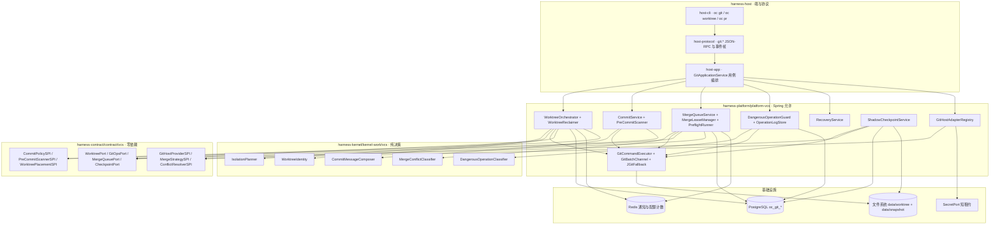
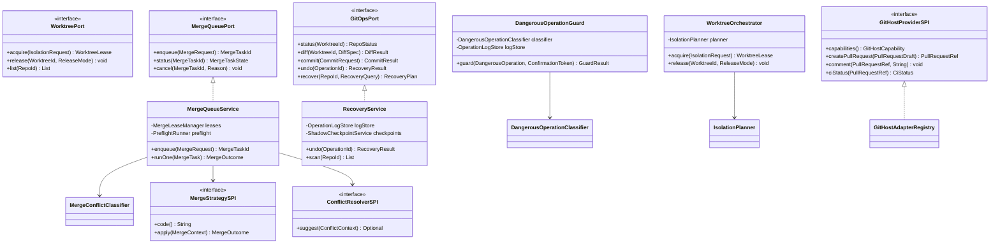
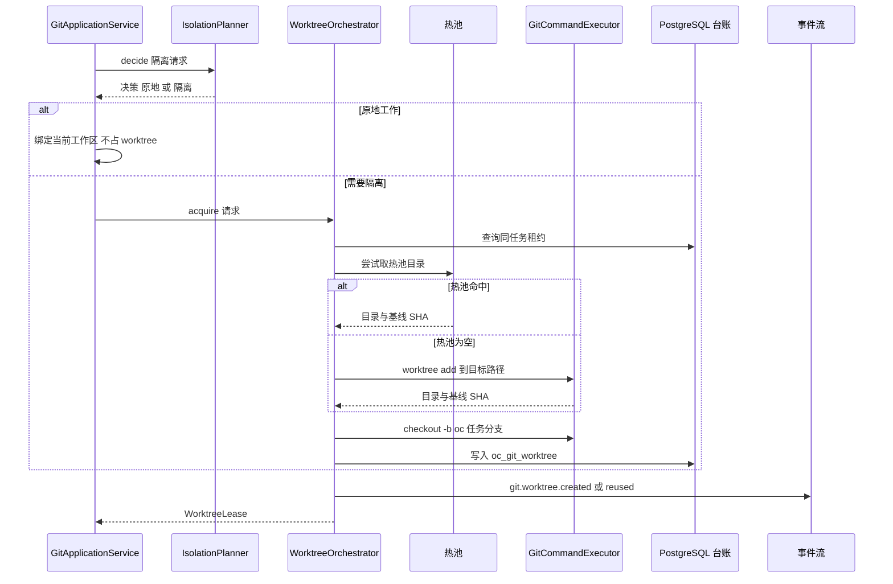
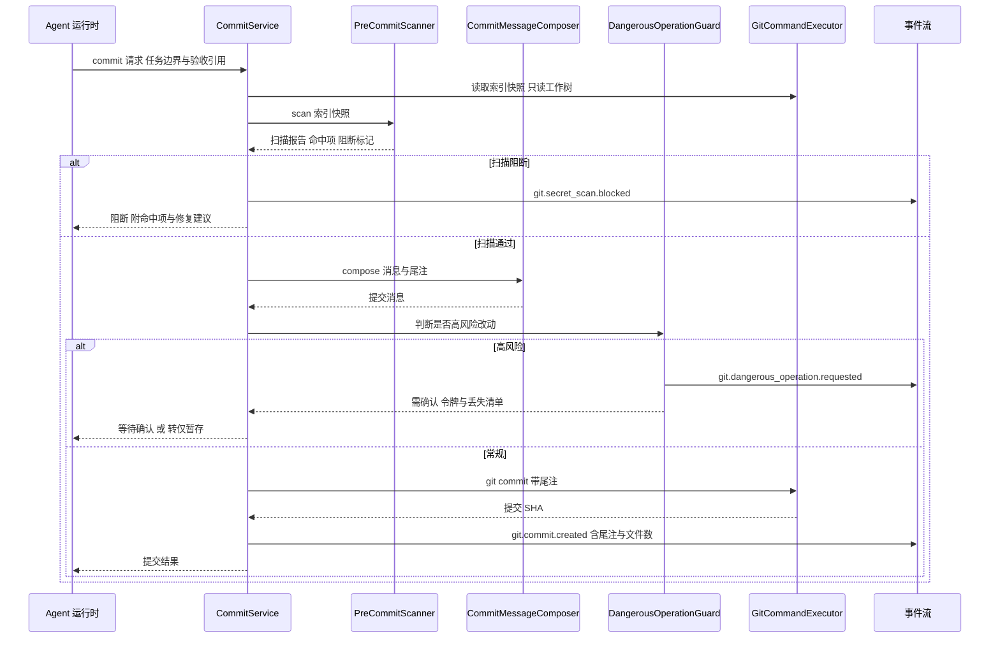
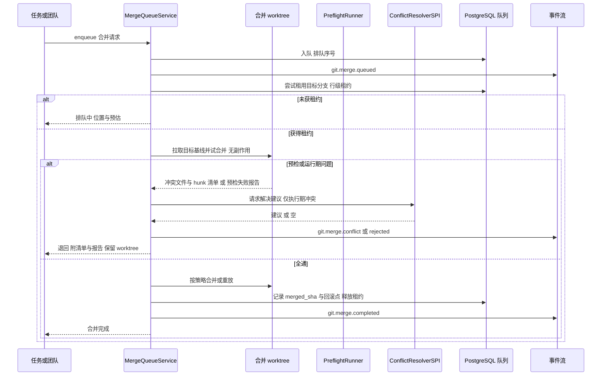
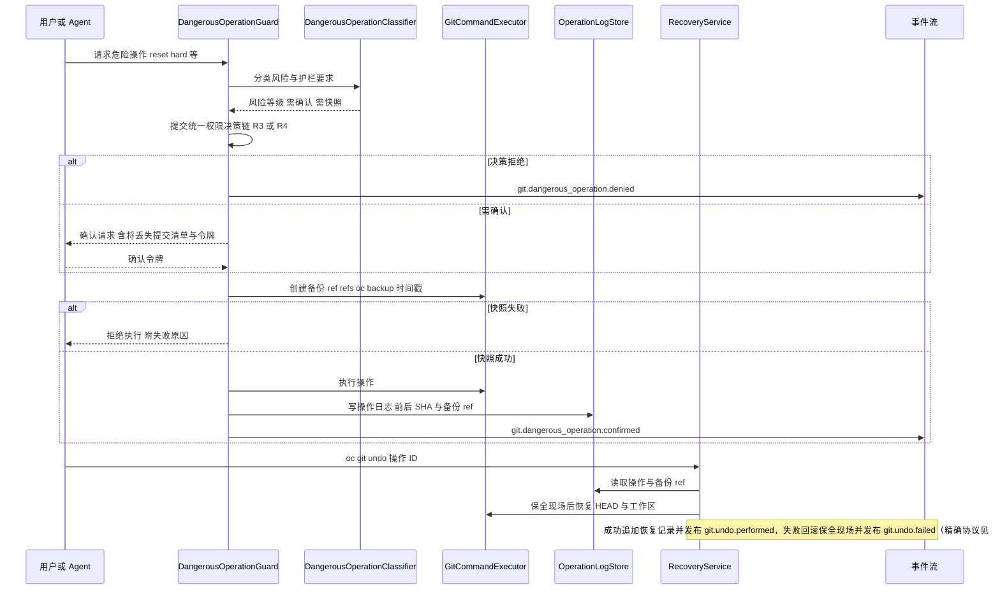
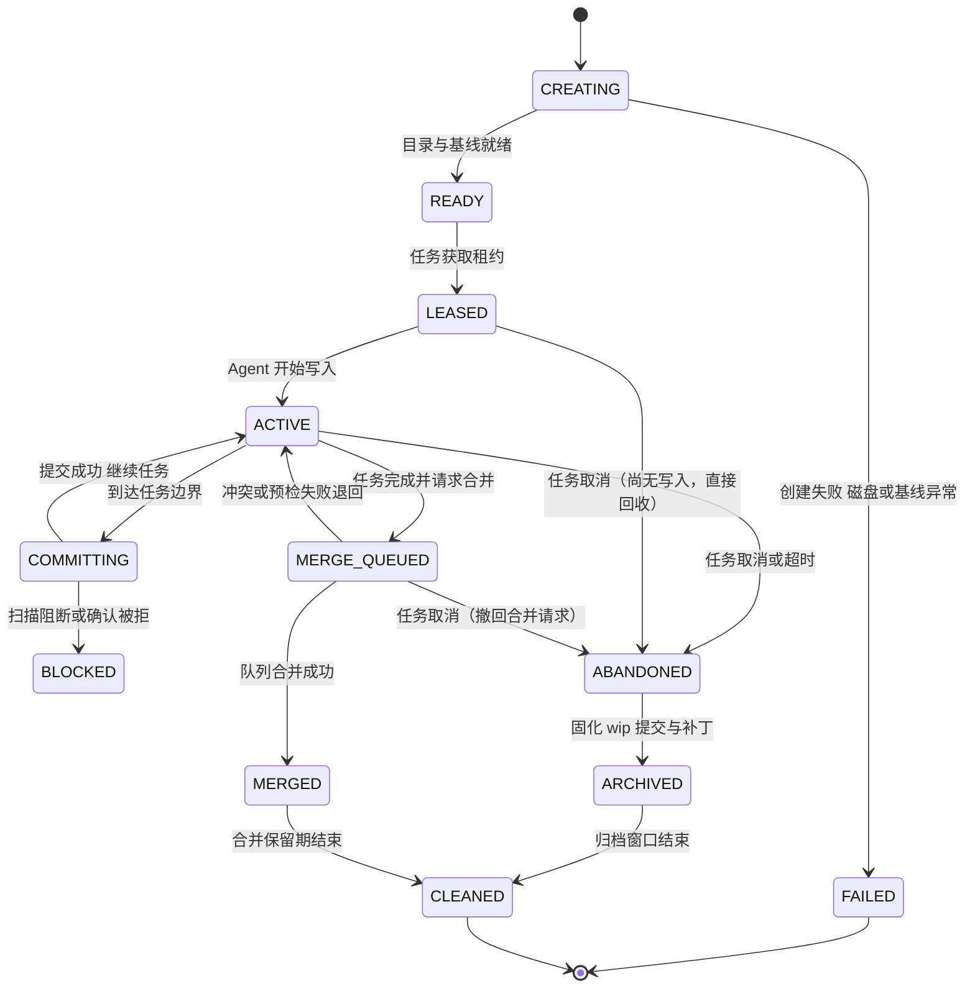
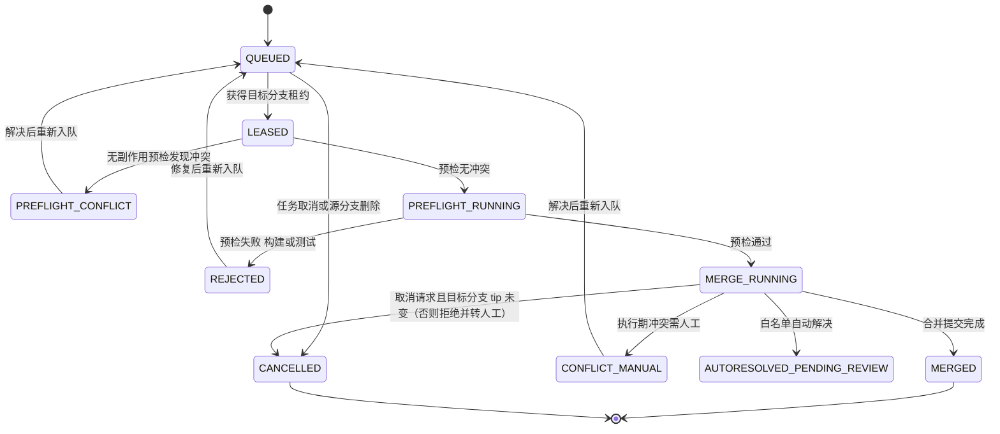
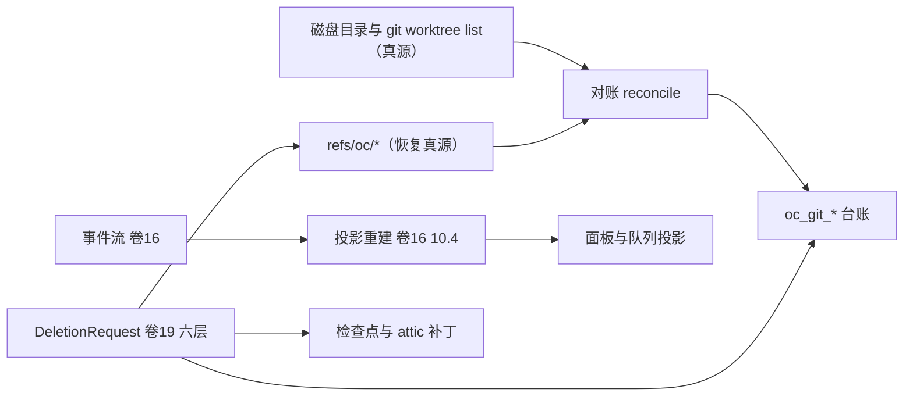

# 实现方案 21 · Git 与 Worktree 隔离（Git & Worktree Implementation）

> 本文件是 Phase B 实现层方案，对应 Phase A 卷 21（`docs/harness/21-git-and-worktree.md`，决策 D-GIT-1…12）、
> 全局决策 H-002（常驻内核 + 多前端）/ H-003（内核 / 外壳边界）/ H-006（追加事件日志）/ H-008（统一权限决策链）。
> 采纳台账落点：**L-048**（回滚必须事务化）、**L-049**（影子 Git 仓检查点 + 回收）、**L-062**（同仓 worktree 共享工作区记忆）。
> 反面证据输入：`research/CROSS-COMPARISON.md` §4.2 **N5**（worktree 隔离 + 分支合并治理为行业空白）、§4.4 第 3 条（影子仓污染红线）、§6.3 **A2**（Git/Worktree 完整治理的差异化行动项）。
>
> 证据标记沿用 `research/00-research-plan.md` §2：`[E1]` 源码｜`[E2]` 官方文档｜`[E3]` 第三方｜`[E4]` 推断。
> 上游契约不可修改：与卷 21 冲突之处一律记入 §⑩.10「修订建议」，不直接改动 Phase A 卷册。
> 实现落点：`harness-platform/platform-vcs`（Spring 允许）+ `harness-contract/.../contract/vcs`（纯契约）+ `harness-kernel/kernel-work/vcs`（纯决策）。

---

## ① 实现目标与范围

### 1.1 本组件解决什么

把「Agent 改了文件」变成**可隔离、可提交、可合并、可回滚、可审计**的版本库事实：
以「按需隔离」替代「一律 worktree」（避免磁盘与认知成本），以「任务边界提交」替代「每步提交」（避免提交噪声），
以「合并队列 + 预检」替代「各自合并」（避免目标分支被同时破坏），以「护栏 + 私有 ref 快照 + 操作日志」替代「靠用户小心」。
**合并队列是九份竞品研究中全集合空白（N5 `[E4]`）的部分，本文件自研并给出可验证收益指标。**

### 1.2 与 Phase A 的对应关系

| Phase A 决策 | 本文件落实位置 |
| --- | --- |
| D-GIT-1 实现方式：CLI 为主 + 库兜底 + 契约测试 | §③ D-GITI-1、§⑤ `GitCommandExecutor`、§⑪.4 |
| D-GIT-2 worktree 按需分层（单任务原地 / 多任务隔离 / 只读共享） | §③ D-GITI-2、§⑥.1、§⑦.1、§⑩.4 |
| D-GIT-3 任务边界提交 + 规范消息 + 高风险确认；D-GIT-4 每任务一分支 + 主分支保护 | §② REQ-GIT-03/04/16、§⑥.2、§⑧ `oc_git_worktree.branch` |
| D-GIT-5 合并队列（串行 + 预检 + 退回报告）；D-GIT-6 三方合并 + AI 辅助 + 高风险人工 | §③ D-GITI-3/7、§⑥.3、§⑦.2、§⑩.3 |
| D-GIT-7 护栏清单 + 自动快照 + 一键撤销 | §③ D-GITI-5、§⑤ `DangerousOperationGuard`、§⑩.5 |
| D-GIT-8 部分克隆 + 稀疏检出 + 索引加速 + LFS | §③ D-GITI-6、§⑨ 配置表、§⑪.4 |
| D-GIT-9 多平台适配器（GitHub / GitLab / Gitee / 内网）；D-GIT-11 结构化追溯尾注 | §③ D-GITI-8、§⑤ `GitHostAdapterRegistry`、§⑥.2、§⑧ `oc_git_commit_trace` |
| D-GIT-10 提交前增量扫描 + 阻断；D-GIT-12 三层审查（自审 / 团队 / 人类） | §③ D-GITI-4、§⑥.2、§⑩.7、§⑩.8、§⑪.2 |
| L-048 回滚事务化（保全现场 → 成功才提交 → 失败可回滚 → 留审计） | §③ D-GITI-5、§⑥.4、§⑩.5 |
| L-049 影子仓内容寻址 + 独立 git dir + 机密文件排除 + 回收 | §③ D-GITI-6、§⑩.9、§⑪.2 |
| L-062 「隔离的是文件，不是记忆」：同仓 worktree 共享工作区记忆 | §② REQ-GIT-15、§⑧ `WorktreeIdentity` |

### 1.3 本组件不解决什么

- **不解决**文件读写与工作区抽象（卷 20）：Git 只消费工作区的 `PathUri` 与执行通道，不自行拼接 SSH / 容器路径。
- **不解决**沙箱档位（卷 07）、任务验收（卷 14）、权限决策（卷 06）、知识索引（卷 11）：
  Git 命令在沙箱内运行、只按 `taskId` 关联任务、只**上报**风险等级、只**发布**提交事件。

### 1.4 上下游依赖

| 方向 | 依赖对象 | 接口 |
| --- | --- | --- |
| 上游 | 工作区（卷 20）/ 权限（卷 06） | `WorkspaceExecPort.run(cmd, cwd, env)`；`PermissionPort.assess(ActionDescriptor)`（危险操作以 R3/R4 提交） |
| 上游 | 密钥（卷 30）/ 事件（卷 16） | `SecretPort.lease(scope, ttl)` 短租约（推送凭据）；`EventPort.append(envelope)` |
| 上游 | 持久化（卷 19） | `GitStore`（worktree / 合并任务 / 操作日志 / 扫描缓存 / 提交追溯 / 检查点） |
| 下游 | 任务（卷 14）/ 记忆（卷 10） | 提交与合并结果回写 `TaskRevision`；`WorktreeIdentity` 供工作区记忆共享（L-062） |
| 下游 | 知识库（卷 11）/ 评测（卷 26） | `git.commit.created` / `git.merge.completed` 触发增量索引；合并与护栏行为进入回放用例 |

### 1.5 模块落点

**落地登记（R07：模块 / 顺序 / 批次；清单见 `reviews/R07-scope-build-platform.md`）**：
- **模块坐标**：`harness-contract`（包 `contract/vcs`）+ `harness-kernel/kernel-work`（子包 `work/vcs`；拆分建议 `kernel-vcs` 见 §⑩.10-R4 / IMPL-DECISIONS `X-44`）+ `harness-platform/platform-vcs` + `harness-host/host-protocol` / `host-cli`。契约侧**不建** `harness-contract-*` 子模块。
- **实施顺序（卷 27 §4.5）**：第 **13** 步「Git + worktree + 合并队列」（依赖第 12 步工作区）。护栏与撤销的**最小子集**需第 7 步权限决策链先到位（危险操作确认）；若第 7 步未完成，本步只允许交付「隔离创建 + 只读扫描」，危险操作护栏后置——顺序上不得倒置（先有围栏再开写口）。
- **数据迁移批次**：`oc_git_*` 表族在卷 27 §4.4 未被明列 → 建议**扩写 B4** 为「工作对象（WorkItem/依赖/证据）+ 团队 + 调度记录 + **交付物（Git 仓库/工作树/合并队列/操作日志/提交追溯）**」后归入 B4（与第 13 步同批，B1 之后）；未明列项已登记 R07 §2。
- **表所有权**：`oc_git_checkpoint` 为本文件所有（与 `19` 的 `oc_snapshot` 不同族，前者是 git 内部检查点引用）；`oc_snapshot` 只读引用 `19`。
- **I- 决策落点**：`I-GIT-1…10`（10 条）模块落点为上表；类级落点见 §⑤（`IsolationPlanner`/`MergeQueueService`/`DangerousOperationGuard`），逐条绑定登记为 R07 建议 S4。

```text
harness-contract/.../contract/vcs/
    WorktreeId / WorktreeSpec / IsolationRequest / IsolationDecision / ReleaseMode
    CommitRequest / CommitTrailer / MergeRequest / MergeTaskState / ConflictClass
    DangerousOperation / OperationRisk / OperationBackup / RecoveryPlan / RecoveryCandidate
    WorktreePort / GitOpsPort / MergeQueuePort / CheckpointPort
    GitHostProviderSPI / MergeStrategySPI / ConflictResolverSPI / CommitPolicySPI
    PreCommitScannerSPI / WorktreePlacementSPI / GitHostCapability

harness-kernel/kernel-work/src/main/java/.../kernel/work/vcs/
    isolation/  IsolationPlanner（纯函数：给定任务画像与写范围 → 是否隔离、位置偏好、分支名）
    guard/      DangerousOperationClassifier（操作 → 风险类与护栏要求，不含确认交互）
    commit/     CommitMessageComposer（type/scope/正文/尾注模板校验，纯函数）
    merge/      MergeConflictClassifier（冲突块 → 自动 / 人工 / 语义强制人工）
    identity/   WorktreeIdentity（origin 归一 + 归属校验，输出记忆共享键）

harness-platform/platform-vcs/src/main/java/.../platform/vcs/
    exec/       GitCommandExecutor、GitBatchChannel、JGitFallback
    worktree/   WorktreeOrchestrator、WorktreeReclaimer、WorktreePlacement
    commit/     CommitService、PreCommitScanner、BlobScanCache
    merge/      MergeQueueService、MergeLeaseManager、PreflightRunner、ConflictWorkbench
    guard/      DangerousOperationGuard、OperationLogStore、RecoveryService
    checkpoint/ ShadowCheckpointService（独立 git dir，与 worktree 目录分离）
    host/       GitHostAdapterRegistry、GithubAdapter、GitlabAdapter、GiteeAdapter、GenericGiteaAdapter
```

**分层纪律**：`kernel-work/vcs` 零框架、零 IO、零进程调用（可纯 JVM 单测）；`platform-vcs` 允许 Spring 与进程调用；
`host-protocol` 仅做 JSON-RPC 适配，不含 Git 规则。卷 27 §4.3 未列 `kernel-vcs` 模块，
本文件把纯决策组件寄生在 `kernel-work/vcs` 子包（见 §⑩.10 实现注记，非契约修订）。

---

## ② 功能需求清单（REQ-GIT-n）

| REQ | 需求描述 | 来源 | 优先级 | 验收要点 |
| --- | --- | --- | --- | --- |
| REQ-GIT-01 | **按需隔离决策**：单任务且写范围不重叠 → 用户工作区；多任务 / 团队 / 写范围重叠 / 高风险 → 独立 worktree；纯只读任务共享不隔离 | 卷 21 §3 D-GIT-2、§4.1 | P0 | 决策纯函数可单测；同文件并发写用例被前置隔离 |
| REQ-GIT-02 | **worktree 命名与生命周期**：`oc-wt/<taskId>` 目录 + `oc/<taskId>-<slug>` 分支；创建（含基线选择）→ 使用 → 合并/放弃 → 清理（默认合并后 24h、未合并 14 天） | 卷 21 §4.1；竞品 Grok `worktree_pool.rs` 池化 [E1]（`06-grok-cli-and-build.md` §4.17）、Codex `DEFAULT_WORKTREE_KEEP_COUNT=15` [E1]（`03-codex.md` §4.17） | P0 | 生命周期状态机与应用一致；目录位置与用户工作区物理分离（避免误删） |
| REQ-GIT-03 | **任务边界提交**：任务 / 步骤完成时提交，非每步提交；高风险改动（批量删除、配置/CI 变更、> 阈值文件数）提交前需确认；支持 `stage-only` 模式 | 卷 21 §3 D-GIT-3 | P0 | 提交粒度用例；`stage-only` 下零自动提交 |
| REQ-GIT-04 | **提交消息规范与追溯尾注**：Conventional Commits 风格 + `Refs/Agent/Approval` 结构化尾注；署名沿用用户 Git 配置并可追加 `Co-authored-by` | 卷 21 §3 D-GIT-3/D-GIT-11、§4.2；竞品 Aider 提交信息由模型生成 + trailer [E1]（`09-secondary-tier.md` §2.1 `repo.py:222-275`） | P0 | 尾注字段齐全可解析；企业可强制；无尾注提交被策略拒绝 |
| REQ-GIT-05 | **提交前增量扫描**：密钥模式（高熵串、私钥头、云凭证）、大文件（>`git.scan.max-blob-mb` 阻断）、敏感路径（`.env`/证书/生产配置）、依赖清单变更告警；按 blob 哈希缓存 | 卷 21 §3 D-GIT-10 | P0 | 三类用例均可阻断；重复 blob 不重复扫描（缓存命中率有指标） |
| REQ-GIT-06 | **合并队列**：同一目标分支串行（租约）；入队 → 拉取基线 → 重放 → 预检（构建/测试/扫描）→ 合并 → 完成；失败退回附报告 | 卷 21 §3 D-GIT-5、§4.3；竞品基线为 Grok ACP `x.ai/git/worktree/*` 含 apply 合并回主目录 [E2]（`06-grok-cli-and-build.md` §4.17）；**合并队列本身 7 家二线 + 5 家核心全未观测 [E1][E4]**（`CROSS-COMPARISON.md` §4.2 N5） | P0 | 并发入队不交叉污染；队列深度与耗时进指标；重启后队列恢复 |
| REQ-GIT-07 | **冲突预检与处置**：入队即做无副作用冲突预检；执行期冲突按「自动 / 人工 / 语义强制人工」三分类处置，解决过程与结论入库可审计 | 卷 21 §3 D-GIT-6、§4.3；竞品 Gemini 「无分支合并队列与冲突处理」为反面证据 [E1]（`08-gemini-cli.md` §6.4） | P0 | 冲突清单含文件 + hunk 范围 + 分类；自动解决默认关闭且留痕 |
| REQ-GIT-08 | **合并策略与回滚点**：默认 `squash`，可选 `merge-commit` / `rebase-then-merge`；每次合并前记录目标 tip 与 `refs/oc/backup/merge/<id>` | 卷 21 §10 默认决策 + §4.3 | P0 | 三种策略各有用例；合并回滚可用且提示「不可用于已被他人推进的目标」 |
| REQ-GIT-09 | **危险操作护栏七类**：`reset --hard`、`push --force`、`clean -fd`、已推送历史 `rebase`、删除分支/tag、丢弃未提交改动、amend 已推送提交；每类需确认 + 自动快照 | 卷 21 §3 D-GIT-7、§4.4 | P0 | 七类逐一有阻断与放行用例；快照引用可在 UI 与 CLI 列出 |
| REQ-GIT-10 | **撤销与找回**：`oc git undo` 基于操作日志与备份 ref 恢复；`oc git recover` 扫描 dangling 提交并提供候选；对象已 GC 时显式告知不可恢复 | 卷 21 §4.4「一键恢复」；竞品 Aider `/undo` 直接 revert + 编辑前 `dirty_commit` [E1]（`09-secondary-tier.md` §2.1 `base_coder.py:2417-2432`） | P0 | 四类丢失场景各有恢复用例；不可恢复场景不静默 |
| REQ-GIT-11 | **大仓优化**：部分克隆（blobless / treeless）+ 稀疏检出（cone 模式）+ commit-graph / multi-pack-index + 并行 fetch + LFS 提示；首次准备后台化并显示进度 | 卷 21 §3 D-GIT-8；竞品 Codex / OpenCode 均未观测大仓优化 [E1][E4]（`CROSS-COMPARISON.md` §4.2 N5） | P1 | 100k 文件仓库 `status` ≤ 500ms；首次准备有进度事件 |
| REQ-GIT-12 | **多平台集成**：GitHub / GitLab / Gitee（+ 通用 Gitea / 内网）适配器：PR/MR 创建、评论、审查状态、CI 状态查询、Webhook 接收；企业可禁用平台 | 卷 21 §3 D-GIT-9、§4.5 | P0 | ≥2 家真机契约测试 + 其余 mock 契约；能力矩阵按平台声明 |
| REQ-GIT-13 | **三层审查与 CI 触发**：① Agent 自审（对照验收标准 + diff）② 机器人（扫描 + 静态规则 + AI 审查）③ 人类 PR/MR；审查意见可回流为任务修订项；CI 由 push/PR/队列预检三处触发 | 卷 21 §3 D-GIT-12；竞品 Claude Code 三层审批处理器与 Qoder Quest 提交链 [E1][E2]（`CROSS-COMPARISON.md` §2.2 端形态行） | P1 | 意见回流链路可用；CI 状态在会话内可见 |
| REQ-GIT-14 | **影子检查点**：独立 git dir 内容寻址、不污染用户仓库（不 stash / 不建临时 commit）、`preview()` 不改工作区返回 diff；与 worktree 目录分离；机密文件排除 + 保留窗口 + 去重 + 容量上限 | 采纳 L-049（`09-secondary-tier.md` §3.6 Cline `checkpoint-restore.ts`、Roo `RepoPerTaskCheckpointService`、OpenCode `snapshot.ts:94-122`） | P0 | 检查点目录不含 `.env*`（扫描断言）；配额与回收指标可观测 |
| REQ-GIT-15 | **工作区记忆共享身份**：同仓库（含 clone 与 worktree）共享一份工作区记忆，身份取 origin 归一（`org/repo`，无 origin 退化目录路径），共享前校验归属防串租户 | 采纳 L-062（`06-grok-cli-and-build.md` §4.18） | P1 | 两 worktree 记忆命中一致；伪造 origin 被拒绝共享 |
| REQ-GIT-16 | **分支模型与保护**：每任务一分支；主分支/保护分支禁止直接推送；分支与任务/会话双向关联；完成后可创建 PR/MR | 卷 21 §3 D-GIT-4、§10 | P0 | 保护分支推送被拒并给出替代动作（开分支 / 提 PR） |
| REQ-GIT-17 | **事件与可观测**：全部 Git 动作发布 `git.*` 事件；关键事件带 before/after SHA 与追溯尾注；指标覆盖合并队列与 worktree 资源 | 卷 21 §6 | P0 | 事件可重放；指标在诊断页可见 |
| REQ-GIT-18 | **可移植与隔离执行**：四类工作区（本地 / SSH / 容器 / 云）能力矩阵声明；Git 命令在沙箱内执行；推送凭据经密钥代理短租约 | 卷 21 §4.6、§7；L-019 凭据遮蔽思想（`research/LESSONS-AND-ADOPTIONS.md` §3.5） | P0 | 四类工作区各有 smoke 用例；日志中无凭据明文 |
| REQ-GIT-19 | **高风险动作 fail-explicit**：对象不可恢复、平台能力缺失、预检命令未配置等情形必须显式报错并给出替代动作，禁止静默降级 | 反面 DoD：`CROSS-COMPARISON.md` §4.4 第 3 条（影子仓污染）与第 6 条（提示注入面）；`exception-handling-rules.md` §8 | P0 | 每个能力缺失路径有契约测试（`UNSUPPORTED_CAPABILITY` + alternatives） |
| REQ-GIT-20 | **仓库内容不可信：执行面加固**（安全红线）——仓库可控的 hooks / 本地 git config / attributes 过滤器 / 子模块传输 / 仓库级 `.oc/ci.yaml` 预检命令 **一律不得成为宿主执行面**：Git 子进程强制 `GIT_CONFIG_NOSYSTEM=1` + 执行类配置键拒绝、`.git/hooks` 只读且 `core.hooksPath` 重定向、`GIT_ALLOW_PROTOCOL=https:ssh`（禁 `ext:`/`file:`）、`GIT_*` 环境变量清洗、预检命令与普通命令同走权限链与沙箱；worktree 路径与分支 slug 白名单 + `realpath` 围栏（防符号链接替换与 `../` 穿越） | 卷 30 §4.3 B5（工作区/远端威胁）；卷 07 围栏；Codex `WritableRoot` 强制 `.git/hooks` 只读 `[E1]`（`03-codex.md` §1 条目 3）；Roo `createSanitizedGit` 清洗 `GIT_*` `[E1]`（`09-secondary-tier.md` §2.2）；Qoder `security.blockGitExtensions` `[E2]`（`07-qoder.md` §3） | P0 | 恶意仓库夹具（钩子 / `filter.*.clean` / `ext::` 子模块 / `.oc/ci.yaml` 注入）逐条被拒或降级为只读；无宿主侧命令执行（进程树断言） |
| REQ-GIT-21（**R05 新增**） | **台账对账与快照合规**：`oc_git_worktree` / `oc_git_checkpoint` 台账必须与磁盘目录、`git worktree list` 与 `refs/oc/*` 定期对账（启动全量 + 周期增量），漂移可检测、可修复且修复幂等；合规删除必须穿透 `refs/oc/` 三类私有 ref（backup / attic / restore-transactions）、attic 补丁与检查点 git dir，不得因「快照 / 回滚点」而留存已删内容 | 本文件 §⑩.11（数据与检索侧一致性镜头）；对齐卷 19 §⑥.4 六层删除 | P0 | 五类漂移（`DIR_MISSING`/`ORPHAN_DIR`/`REF_MISSING`/`OBJECT_MISSING`/孤儿检查点）各有修复用例；`verify_state ≠ VERIFIED` 时不得声称可恢复；删除演练后无快照残留 |

**竞品增量需求说明**：REQ-GIT-02（池化与保留计数）、REQ-GIT-06（合并队列自研基线）、REQ-GIT-10（Aider `/undo` + 编辑前干净回滚点的教训）、
REQ-GIT-14（Cline / Roo / OpenCode 三种影子仓形态的收敛）四条为 Phase A 未下沉到机制层的实现级需求，对应 §③ 的 `I-GIT-2` / `I-GIT-3` / `I-GIT-5` / `I-GIT-6`；
REQ-GIT-20（仓库内容执行面加固）为 R04 安全轮新增，对应 §③ 的 `I-GIT-10` 与 §⑩.7 加固清单；REQ-GIT-21（台账对账与快照合规）为 R05 数据与检索侧轮新增，对应 §⑩.11 与 §10.10 R5 修订建议。

---

## ③ 技术方案选型（M×N 比选）

评分沿用 `README.md` §4：**F 30% / U 20% / S 25% / M 25%**。

### D-GITI-1 Git 命令执行通道

| 分支 | 描述 | F | U | S | M | 加权 | 结论 |
| --- | --- | --- | --- | --- | --- | --- | --- |
| B1 | 每条命令一次 `ProcessBuilder`（纯 CLI） | 8 | 7 | 7 | 6 | 71.5 | 淘汰（大仓批量读取与 `status` 轮询开销不可接受） |
| B2 | **混合：短命令直连 CLI + 批量读走 `--batch` 长驻通道 + JGit 兜底（无 git 环境 / 需细粒度对象操作）** | 9 | 8 | 9 | 9 | 88.0 | **选定** |
| B3 | 全 JGit 实现 | 6 | 7 | 8 | 7 | 68.5 | 淘汰（worktree / LFS / hooks 行为与用户不一致） |

### D-GITI-2 worktree 供应模型

| 分支 | 描述 | F | U | S | M | 加权 | 结论 |
| --- | --- | --- | --- | --- | --- | --- | --- |
| B1 | 纯按需创建、用后即删 | 8 | 7 | 9 | 8 | 80.0 | 淘汰（每次创建在部分克隆下可能秒级到十秒级） |
| B2 | **按需创建 + 热池（保留 `hot-pool-size` 个已就绪 worktree）+ 惰性回收** | 9 | 9 | 8 | 9 | 88.0 | **选定** |
| B3 | 全池化（预创建 N 个，按任务分配） | 7 | 7 | 6 | 7 | 67.5 | 淘汰（空闲磁盘与分支占用不可控；Grok 池化仅用于其自研 crate 的短任务场景 [E1]） |

**选定 B2**：热池只保留**目录已创建且基线已物化**的裸 worktree（不预分配分支），获取时再 `checkout -b`，
兼顾创建延迟与磁盘可控；池大小与仓库无关，逐仓可配（Codex `DEFAULT_WORKTREE_KEEP_COUNT=15` 是保留计数
而非池 [E1]，本文件两者区分：热池 = 待分配，保留 = 待清理）。

### D-GITI-3 合并队列串行化载体

| 分支 | 描述 | F | U | S | M | 加权 | 结论 |
| --- | --- | --- | --- | --- | --- | --- | --- |
| B1 | 进程内 `ReentrantLock` + 内存队列 | 6 | 7 | 4 | 4 | 51.5 | 淘汰（重启即丢队列，违反卷 21 §7「队列持久化」） |
| B2 | **PostgreSQL 持久队列 + 单行租约（`lease_owner` / `lease_expire_at` / 心跳续租）+ Redis 仅做唤醒通知** | 9 | 8 | 9 | 9 | 88.0 | **选定** |
| B3 | Redisson 分布式锁 + Redis List 队列 | 8 | 7 | 7 | 7 | 72.5 | 淘汰（真相在 Redis，重启与故障转移语义弱于 PG 事务） |

**选定 B2**：队列与租约同库同事务，天然满足「重启恢复 + 租约过期接管」；Redis 只承担「有新任务」的低延迟通知
（丢失只影响延迟不影响正确性）。租约过期接管前必须校验任务状态与幂等键，防止双执行。

### D-GITI-4 提交前扫描的位置与缓存

| 分支 | 描述 | F | U | S | M | 加权 | 结论 |
| --- | --- | --- | --- | --- | --- | --- | --- |
| B1 | 提交后异步扫描 + 事后告警 | 6 | 6 | 5 | 6 | 57.5 | 淘汰（密钥一旦 push 即泄漏，事后无意义） |
| B2 | **提交前同步扫描：blob 哈希缓存 + 规则集版本化 + 命中即阻断（fail-closed），大文件与敏感路径走快速预筛** | 9 | 8 | 9 | 9 | 88.0 | **选定** |
| B3 | 完全依赖平台侧 secret scanning（push 后） | 5 | 6 | 6 | 5 | 54.5 | 淘汰（私有化部署无此能力；且企业要求出网前拦截） |

### D-GITI-5 撤销与恢复的实现

| 分支 | 描述 | F | U | S | M | 加权 | 结论 |
| --- | --- | --- | --- | --- | --- | --- | --- |
| B1 | 只提示 `git reflog`，让用户自行处理 | 4 | 4 | 6 | 5 | 47.0 | 淘汰（Agent 造成的高频小改动场景不可接受） |
| B2 | **操作日志 + 私有 ref 快照（`refs/oc/backup/*`、`refs/oc/attic/*`）+ 事务化恢复（保全现场 → 执行 → 成功才记账 → 失败回滚）** | 9 | 9 | 9 | 9 | 90.0 | **选定** |
| B3 | 全量影子仓检查点 + 文件级回滚（OpenCode revert 式） | 8 | 7 | 7 | 8 | 75.5 | 吸收为检查点路径（REQ-GIT-14），不作为 Git 层撤销主路径 |

**选定 B2**：直接吸收 L-048 的事务语义（Cline `refs/cline/restore-transactions/<uuid>` [E1]）；
与 B3 的分工是「Git 层撤销管提交与 ref，检查点管工作区文件」，两条路径共享同一操作日志与审计事件。

### D-GITI-6 大仓准备与检查点存储

| 分支 | 描述 | F | U | S | M | 加权 | 结论 |
| --- | --- | --- | --- | --- | --- | --- | --- |
| B1 | 全量克隆 + 全工作区复制检查点 | 6 | 6 | 5 | 6 | 57.5 | 淘汰（10 万文件仓库首次准备分钟级起） |
| B2 | **treeless / blobless 部分克隆 + cone 稀疏检出 + commit-graph；检查点独立 git dir + 内容寻址 + 机密排除 + 保留窗口** | 9 | 8 | 8 | 9 | 85.5 | **选定** |
| B3 | 裸仓镜像 + 按需物化（自研对象服务器） | 7 | 6 | 5 | 4 | 56.0 | 淘汰（运维面与私有化成本不可接受） |

### D-GITI-7 冲突分类与自动解决边界

| 分支 | 描述 | F | U | S | M | 加权 | 结论 |
| --- | --- | --- | --- | --- | --- | --- | --- |
| B1 | 一律人工 | 6 | 5 | 9 | 8 | 70.5 | 淘汰（并行度高时人工成为瓶颈） |
| B2 | **三分类：自动（白名单且开关开启）/ 人工（AI 建议 + hunk 交互）/ 语义强制人工（同符号、签名变更、锁文件、二进制、生成物）** | 9 | 8 | 8 | 9 | 85.5 | **选定** |
| B3 | 一律 AI 自动解决 | 7 | 7 | 3 | 5 | 54.0 | 淘汰（不可审计的静默改写，违反 L-052 精神） |

**选定 B2**：自动解决**默认关闭**（`git.merge.autoresolve.enabled=false`），开启时只允许白名单类型
（引用排序差异、格式空白、双方各自新增不同区块），且必须走机器人审查后再合并；语义冲突强制人工是硬约束。

### D-GITI-8 平台集成形态

| 分支 | 描述 | F | U | S | M | 加权 | 结论 |
| --- | --- | --- | --- | --- | --- | --- | --- |
| B1 | 仅 GitHub | 5 | 5 | 7 | 6 | 56.5 | 淘汰（企业内网与国产托管不可用） |
| B2 | **统一适配器 + 能力矩阵：GitHub / GitLab / Gitee 一等，Gitea / Gerrit 可选（企业自建走通用 REST + Webhook 规范化）** | 9 | 8 | 8 | 9 | 85.5 | **选定** |
| B3 | 依赖用户 `gh` / `glab` CLI 外部工具 | 6 | 6 | 5 | 5 | 55.5 | 淘汰（凭据与错误语义外置，企业无法治理） |

### 3.9 实现级决策登记（I-GIT-n）

| ID | 主题 | 选定 | 代价 | 回退触发 |
| --- | --- | --- | --- | --- |
| I-GIT-1 | Git 执行通道 | CLI 短命令 + `--batch` 长驻读通道 + JGit 兜底，三方契约测试对齐 | 两条实现路径需常驻一致性用例 | 契约测试出现不可对齐差异 → 禁用对应路径并降级为纯 CLI |
| I-GIT-2 | worktree 供应 | 按需创建 + 热池（`hot-pool-size`）+ 惰性回收（合并 24h / 放弃 14 天） | 空闲目录占用磁盘 | 单仓磁盘超配额 → 热池降为 0 并先清 merged |
| I-GIT-3 | 合并队列 | PG 持久队列 + 行租约 + 心跳续租；Redis 仅通知 | 队列延迟受轮询周期影响 | 通知丢失导致 P95 入队延迟 > 5s → 缩短轮询间隔并加长租约 |
| I-GIT-4 | 提交前扫描 | blob 哈希缓存 + 规则版本化 + fail-closed 阻断 | 首次全量扫描较慢 | 1000 文件提交扫描 > 3s → 转「快筛同步 + 深扫异步确认」两段式 |
| I-GIT-5 | 撤销与恢复 | 操作日志 + 私有 ref 快照 + 事务化恢复（L-048） | 每次危险操作多一次 ref 写入 | ref 写入失败 → 拒绝执行危险操作（不允许无快照执行） |
| I-GIT-6 | 检查点与克隆 | 独立 git dir 检查点 + 部分克隆 + 稀疏检出（L-049 / D-GIT-8） | treeless 下部分操作需按需拉取 | 稀疏检出导致构建失败率上升 → 该仓库回退 `full` 模式 |
| I-GIT-7 | 冲突处置 | 三分类 + 自动解决默认关闭 + 语义冲突强制人工 | 并行高时人工确认排队 | 冲突人工率 > 30% → 提高预检粒度（按目录拆分任务） |
| I-GIT-8 | 平台集成 | 适配器 + 能力矩阵 + Webhook 规范化 | 平台能力差异需持续维护 | 某平台 API 破坏性变更 → 该平台能力降级并在诊断页告警 |
| I-GIT-9 | 记忆共享身份 | origin 归一（`org/repo`）+ 归属校验后共享（L-062） | 无 origin 仓库退化为目录身份 | 检出跨租户串共享 → 立即禁用共享并回滚记忆索引分区 |
| I-GIT-10 | 仓库内容执行面加固（R04 新增） | 执行类 git 配置键拒绝 + `.git/hooks` 只读重定向 + 传输协议白名单 + `GIT_*` 清洗 + 预检同权限链/同沙箱 + 路径 `realpath` 围栏；受信任仓库（folder trust）经审批才可启用真实钩子 | 放弃「仓库自带钩子/过滤器开箱即用」：部分依赖 husky/LFS smudge 的仓库需显式授权或降级为指针文件 | 企业要求全禁仓库钩子 → `git.trust.repo-hooks` 固定 `never`（加固清单不变，仅去掉受信任分支） |

**与竞品对照的取舍**：Git/worktree 治理是九组竞品的**系统性空白**（`research/CROSS-COMPARISON.md` §4.2 N5「worktree 隔离 + 分支合并治理为行业空白」、§4.4 第 3 条「影子仓污染红线」、§6.3 A2 差异化行动项；本项目为唯一正面行动项）。**取舍**：① 采纳 L-048「回滚必须事务化」（MiniMax CLI `[E1]`）为 I-GIT-5——危险操作先写私有 ref 快照，禁止无快照执行；② 采纳 L-049「影子 Git 仓检查点 + 回收」（DeepSeek harness `[E1]`）为 I-GIT-6，但检查点用**独立 git dir**并与 worktree 目录分离（竞品混用影子仓导致污染，CROSS-COMPARISON §4.4 反例）；③ 采纳 L-062「同仓 worktree 共享工作区记忆」但以 origin 归一 + 归属校验为前置（防跨租户串共享）；④ **自研增量**：合并队列串行化 + 三分类冲突处置 + 语义强制人工——竞品普遍止步于「单分支提交」，无合并队列概念。

---

## ④ 总体架构图



**装配点**：`host-bootstrap` 的装配计划在 `open-coding.git.enabled=true` 时装配 `platform-vcs` 全部 Bean；
未装配时 `GitOpsPort` 走 `NoopGitOps`（能力声明为空 → 所有 Git 能力返回 `UNSUPPORTED_CAPABILITY`，
UI 隐藏 Git 面板，符合 REQ-GIT-19 的显式拒绝要求）。

---

## ⑤ 类图与 Java 21 契约



### 5.1 契约签名（节选，JavaDoc 完整）

```java
package com.hk.opencoding.contract.vcs;

import lombok.Getter;
import lombok.RequiredArgsConstructor;

/**
 * 工作树租约：一次隔离工作期的句柄。
 * 由 {@code platform-vcs} 创建并写入 worktree 台账；持有者必须在任务结束调用 {@link #release(ReleaseMode)}，
 * 未释放的租约由回收任务按保留策略处置；禁止调用方直接删除工作树目录或清理分支。
 */
public interface WorktreeLease {

    /** 租约唯一标识（事件与审计以此关联）。 */
    WorktreeId id();

    /** 绑定的任务分支名（形如 {@code oc/<taskId>-<slug>}）。 */
    String branch();

    /** 工作树绝对路径（位于 {@code open-coding.git.worktree.root} 之下）。 */
    Path path();

    /** 创建时的基线提交（重放与差异计算的基线）。 */
    String baseSha();

    /**
     * 释放租约。
     *
     * @param mode 释放模式（合并后保留 / 放弃保留 / 立即回收），不得为 {@code null}
     * @throws HarnessException 租约已释放、或当前调用方非持有者时抛出
     */
    void release(ReleaseMode mode) throws HarnessException;
}

/**
 * 工作树释放模式。
 * 决定回收时机与分支保留策略；取值经事件落库，恢复与审计按 code 读取，禁止依赖 desc。
 */
@Getter
@RequiredArgsConstructor
enum ReleaseMode {

    /** 合并成功后释放：保留至 `retention-merged-hours` 结束 */
    AFTER_MERGE("AFTER_MERGE", "合并后保留"),

    /** 放弃任务释放：先固化 wip 提交与归档补丁，保留至放弃窗口结束 */
    ABANDON("ABANDON", "放弃保留"),

    /** 立即回收：仅允许分支已合并或无改动时使用，回收前二次校验 */
    IMMEDIATE("IMMEDIATE", "立即回收");

    private final String code;
    private final String desc;

    /**
     * 按 code 解析释放模式。
     *
     * @param code 释放模式编码（必填，取值见枚举常量）
     * @return 对应枚举项
     * @throws HarnessException code 为空或未知时抛出
     */
    public static ReleaseMode of(String code) throws HarnessException {
        for (ReleaseMode mode : values()) {
            if (mode.code.equals(code)) {
                return mode;
            }
        }
        throw new HarnessException("未知的工作树释放模式：" + code);
    }
}
```

**日志与异常纪律**：异常按层分工——**契约侧（`contract/vcs` 的接口与枚举，零框架）统一 `HarnessException` + `ErrorCode`**；**外壳侧（`platform-vcs`，Spring 允许）统一 `BusinessException` + `ErrorCode`，由外壳全局异常处理器按码映射**（错误模型见附录 B §B.7），业务失败文案含仓库与分支；`platform-vcs` 全部类 `@Slf4j` 且入口方法中文打点（入参 / 返回值 / 耗时）；
外部平台 SDK 异常在适配器内转换为 `BusinessException` 或 `AiException` 前记录 `log.error` 并传 `Throwable`；内核侧决策类不打日志（纯函数，由调用方打点）。

---

## ⑥ 核心流程时序图

### 6.1 隔离决策与 worktree 获取

**前置条件**：任务已创建并声明写范围；工作区已连接；`open-coding.git.enabled=true`。
**主路径**：任务画像评估（写范围 / 任务类型）→ 隔离决策（隔离 / 共享）→ `acquire`（热池优先 → 按需创建）→ 分支命名与基线记录（`base_sha`）→ 台账登记 → 返回租约。
**异常与补偿**：热池耗尽 → 同步创建（部分克隆下可能 2–10s，交互端显示进度）；磁盘配额超限 → 先回收 merged，
再回收 abandoned，仍不足则拒绝并提示清理。**幂等与并发**：同一 `taskId` 重复 `acquire` 返回同一租约（台账唯一键
`(repo_id, task_id)`）；租约创建用 `INSERT ... ON CONFLICT DO NOTHING` + 回读。



### 6.2 任务边界提交（含扫描与高风险确认）

**前置条件**：任务或步骤到达边界；工作区有改动。**主路径**：检测改动 → 危险操作先快照（私有 ref）→ 提交前扫描（blob 缓存 + 规则版本）→ 生成规范消息与追溯尾注 → 提交并写 `git.commit.created`。**异常与补偿**：扫描阻断 → 提交不发生，改动留在工作区并附修复建议；
高风险确认被拒 → 走 `stage-only`（仅暂存）。**幂等与并发**：提交以 `(worktreeId, boundaryId)` 为幂等键；
同一 worktree 的提交串行（租约内单写者）。



### 6.3 合并队列（串行、预检、退回）

**前置条件**：源分支存在且任务声明完成；目标分支保护策略允许队列合并。**主路径**：入队（幂等键 + `queue_seq`）→ 获目标分支租约 → 无副作用预检 → 预检运行 → 合并执行 → 合并提交 → 事件与追溯链。**异常与补偿**：冲突预检失败 → 退回且不清理 worktree；预检命令失败 → 退回附报告；租约过期 → 接管者先校验幂等键。
**幂等与并发**：`(repoId, sourceBranch, targetTip)` 为幂等键；同一目标分支同一时刻仅一个 `RUNNING`。



### 6.4 危险操作与撤销（事务化恢复）

**前置条件**：操作进入护栏；操作日志可用。**主路径**：风险分级（R1–R4）→ 快照（私有 ref + 操作日志）→ 确认（R3/R4 通道）→ 执行 → 撤销时按快照事务化恢复（`git.undo.performed`）。**异常与补偿**：快照创建失败 → 拒绝执行（不允许无快照执行）；
恢复过程失败 → 回滚到保全现场并记 `log.error`。**幂等与并发**：恢复以 `(operationId, restoreAttempt)`
为幂等键，仅追加明细，不产生半恢复状态。



**放弃与回收的时序**由 §10.4 精确协议覆盖（判定 → wip 固化 → 归档补丁与 `refs/oc/attic/*` → 目录删除 → 配额淘汰顺序），
不额外绘制时序图以避免与状态机重复。

---

## ⑦ 状态机

### 7.1 worktree 生命周期



### 7.2 合并任务生命周期



**状态迁移纪律**：每次迁移写 `git.merge.*` 事件并携带 `attempt`、`conflictClass`、`prevTargetSha`；
`attempt` 超过 `open-coding.git.merge.max-attempts`（默认 3）后进入人工队列（`state=BLOCKED_MANUAL`，UI 明确提示）。

**迁移补全（触发 / 守卫 / 副作用）**：`MERGE_RUNNING → CANCELLED`——触发：取消请求；守卫：目标分支 tip **必须**仍等于 `prev_target_sha`（否则已发生外部推进，取消可能造成部分应用，转人工）；副作用：按回滚点校验 + `git.merge.cancelled` + 释放目标分支租约；**超时路径**——`LEASED` 租约过期（心跳缺失）→ 接管者先做幂等校验（源分支 head 与记录一致才继续，否则 `REJECTED`）；**失败路径**——`PREFLIGHT_RUNNING → REJECTED` 后条目保留在队列（修复可重入），不得删除历史尝试记录。

---

## ⑧ 数据模型

### 8.1 表结构（`oc_*`，逐表 `@TableName` 显式声明）

**字段类型约定（全表适用）**：`repo_id`/`worktree_id`/`task_id`/`branch`/`commit_sha` 为 `text`（sha 固定 40/64 hex）；`state`/`purpose`/`strategy`/`conflict_class`/`op_type`/`risk_class`/`scan_verdict`/`reason` 一律 `text` 存 `code`；时间为 `timestamptz`；`protected_branches`/`sparse_paths`/`conflict_files`/`preflight_report`/`findings`/`hunks` 为 `jsonb`（只存结构化摘要，见下 JSONB 纪律）；`disk_bytes`/`insertions`/`deletions`/`size_bytes` 为 `bigint`。

| 表 | 关键字段 | 索引 / 约束 |
| --- | --- | --- |
| `oc_git_repo` | id、tenant_id、project_id、remote_url、provider、default_branch、protected_branches(jsonb)、clone_mode、sparse_paths(jsonb)、created_at | 唯一 `(tenant_id, remote_url)`；`provider ∈ GitHub/GitLab/Gitee/Gitea/Gerrit/Custom` |
| `oc_git_worktree` | id、repo_id、task_id、session_id、path、branch、base_sha、head_sha、state、purpose(WRITE/READ)、disk_bytes、created_at、last_used_at、keep_until、archived_patch、`reconcile_state`（**R05 新增**：`IN_SYNC`/`DIR_MISSING`/`ORPHAN_DIR`/`REF_MISSING`，对账结果）、`last_reconciled_at`（**R05 新增**） | 唯一 `(repo_id, task_id)`；索引 `(state, keep_until)` 供回收扫描；`(reconcile_state)` 供对账巡检 |
| `oc_git_merge_task` | id、repo_id、source_branch、target_branch、strategy、state、queue_seq、attempts、lease_owner、lease_expire_at、prev_target_sha、conflict_class、conflict_files(jsonb)、preflight_report(jsonb)、merged_sha、created_at、updated_at | 唯一 `(repo_id, source_branch, target_branch, prev_target_sha)`；索引 `(repo_id, target_branch, state, queue_seq)` |
| `oc_git_operation_log` | id、repo_id、worktree_id、op_type、risk_class、args_digest、prev_head、new_head、backup_ref、confirmed_by、result、trace_id、created_at | 索引 `(repo_id, created_at)`；保留 30 天（`git.oplog.retention-days`） |
| `oc_git_commit_trace` | id、repo_id、commit_sha、session_id、task_id、team_id、model_id、agent_role、approval_id、message_subject、files_changed、insertions、deletions、scan_verdict、created_at | 唯一 `(repo_id, commit_sha)`；审核与成本归因按 `task_id` 聚合 |
| `oc_git_scan_cache` | id、repo_id、blob_sha、rule_set_version、verdict、findings(jsonb)、scanned_at | 唯一 `(repo_id, blob_sha, rule_set_version)` |
| `oc_git_conflict_resolution` | id、merge_task_id、conflict_class、hunks(jsonb)、suggestion_source(AI/HUMAN)、accepted_by、resolved_at | 索引 `(merge_task_id)`；审计保留期同合并任务 |
| `oc_git_checkpoint` | id、repo_id、worktree_id、checkpoint_dir_hash、tree_ref、reason(TURN/PRECOMMIT/MANUAL)、size_bytes、created_at、expire_at、`verify_state`（**R05 新增**：`VERIFIED`/`OBJECT_MISSING`/`ORPHAN_DIR`，对账结果）、`last_verified_at`（**R05 新增**） | 索引 `(repo_id, created_at)`、`(expire_at)`、`(verify_state)`；唯一 `(worktree_id, tree_ref)` 去重 |

**JSONB 使用纪律**：`conflict_files` / `preflight_report` / `findings` 只存**结构化摘要**（文件、hunk 范围、规则 ID、
计数），完整报告与日志外置到工件存储并以 `artifactRef` 引用；禁止把 diff 全文写进 JSONB（容量与脱敏风险）。
JSONB 列一律携带 `schema_version`，读取校验版本（与卷 13 §⑧.1 同口径）。

**真源与重建登记（R05 新增，权威口径见 §⑩.11）**：本域真源是**仓库自身**（`refs/*`、`.git/worktrees/*` 注册表、对象库）与任务系统（卷 14）；`oc_git_*` 台账是**加速与治理索引**，不构成第二事实源：
① `oc_git_worktree` 与磁盘目录 / `git worktree list` 漂移时以**仓库与磁盘为准**修台账（对账协议见 §⑩.11）；
② `oc_git_scan_cache` 是纯缓存（真源 = 提交内容 + 规则集版本），可整体清空重扫（去重率仅影响性能，不影响正确性）；
③ `oc_git_checkpoint` 行必须与检查点 git dir 对象一致，`verify_state ≠ VERIFIED` 时**不得**对外声称「可恢复」；
④ 私有 ref（`refs/oc/backup/*`、`refs/oc/attic/*`、`refs/oc/restore-transactions/*`）是恢复能力的真源，GC 前必须与台账对账（§10.4-7）。派生物（Git 面板投影、待同步队列视图）登记卷 16 `oc_projection_state`：`git.worktree.panel`、`git.merge.board`。

### 8.2 Redis Key（经统一 Key 工厂生成）

| 用途 | Key 形态（由 `RedisKeys` 生成） | TTL |
| --- | --- | --- |
| 合并队列唤醒通知 | `oc:git:merge:wake:{targetBranchHash}` | 60s |
| 单仓 worktree 磁盘计数 | `oc:git:worktree:disk:{repoId}` | 无（按事件刷新） |
| 扫描规则集版本 | `oc:git:scan:ruleset` | 无 |
| 平台 Webhook 去重 | `oc:git:webhook:dedup:{provider}:{deliveryId}` | 24h |
| 危险操作确认令牌 | `oc:git:confirm:{operationId}` | 300s |

### 8.3 事件清单（`git.*`，只追加、永不重编号）

`git.repo.opened`、`git.fetch.completed`、`git.branch.created`、`git.branch.deleted`、`git.commit.created`、
`git.commit.blocked`、`git.push.completed`、`git.force_push.blocked`、`git.secret_scan.blocked`、
`git.merge.queued`、`git.merge.started`、`git.merge.completed`、`git.merge.conflict`、`git.merge.rejected`、
`git.merge.cancelled`、`git.merge.rolled_back`、`git.worktree.created`、`git.worktree.reused`、
`git.worktree.abandoned`、`git.worktree.cleaned`、`git.dangerous_operation.requested`、
`git.dangerous_operation.confirmed`、`git.dangerous_operation.denied`、`git.undo.performed`、`git.undo.failed`、
`git.recover.performed`、`git.checkpoint.captured`、`git.checkpoint.restored`、`git.host.pr.created`、
`git.host.ci.status_changed`。

**指标**：`oc_git_commit_total`、`oc_git_scan_blocked_total`、`oc_git_merge_queue_depth`、
`oc_git_merge_duration_ms`、`oc_git_merge_conflict_total`、`oc_git_merge_autoresolved_total`、
`oc_git_worktree_active`、`oc_git_worktree_disk_bytes`、`oc_git_worktree_churn_total`、`oc_git_undo_total`、
`oc_git_recover_total`、`oc_git_checkpoint_bytes`、`oc_git_exec_latency_ms`。

---

## ⑨ 接口与扩展点

### 9.1 会话协议面（JSON-RPC，见附录 B §B.2 扩展）

| 方法 | 说明 | 备注 |
| --- | --- | --- |
| `git.status` / `git.diff` | 状态与差异（支持 `worktreeId` 或默认工作区） | 大仓走批通道 |
| `git.commit` | 任务边界提交（可带 `stageOnly`） | 幂等键 `(worktreeId, boundaryId)` |
| `git.branch` / `git.push` | 分支创建与推送（保护分支校验） | 推送需密钥租约 |
| `git.pr` | 创建 PR/MR / 查询 CI / 发评论 | 能力矩阵驱动 |
| `git.merge` | 入队 / 查询 / 取消 / 回滚 | 返回 `queueSeq` 与预估 |
| `git.undo` / `git.recover` | 撤销操作 / 扫描候选提交 | 返回恢复计划 |
| `git.worktree` | acquire / list / release（含 `abandon`） | 租约语义 |
| `git.checkpoint` | capture / preview / restore | 与卷 19 检查点对齐 |

**错误矩阵（契约侧 `HarnessException`、平台侧 `BusinessException`，同携带 `ErrorCode`；错误模型见附录 B §B.7）**：

| 错误码 | 触发场景 | retryable | 面向用户的恢复动作 |
| --- | --- | --- | --- |
| `INVALID_ARGUMENT` | 分支名/路径非法、未知枚举 code、`release` 模式缺失 | 否 | 修正参数后重试 |
| `NOT_FOUND` | 仓库 / worktree / 合并任务 / 提交不存在 | 否 | 刷新列表后重试 |
| `CONFLICT` | 租约非持有者释放、合并入队重复（同 `prev_target_sha`）、解决结果与 hunk 不符 | 否 | 刷新台账后重试；重复入队读既有任务 |
| `GIT_CONFLICT` | 预检/执行期冲突（含语义强制人工） | 否 | 按冲突分类走人工工作台；解决后重新入队 |
| `GIT_PROTECTED_BRANCH` | 直推 / force push 保护分支 | 否 | 改走合并队列或申请保护分支豁免（企业审批） |
| `SCAN_UNAVAILABLE` | 扫描规则加载失败（fail-closed） | 是（规则恢复后） | 修复规则源后重试提交（**禁止**「扫描不了就放行」） |
| `DANGEROUS_OPERATION_DENIED` | 危险操作未确认 / 确认令牌过期（300s） | 否 | 重新发起确认（R3/R4 通道） |
| `UNSUPPORTED_CAPABILITY` | 平台能力缺失（无 PR API / CI 查询 / 无法用 merge-tree） | 否 | 按能力矩阵降级（如本地 `merge --no-commit` 等价路径） |
| `DEPENDENCY_UNAVAILABLE` | git 可执行 / 平台 API / 对象存储不可用 | 是 | 自动退避重试（JGit 兜底或「待同步」队列）；进入 §10.6 降级阶梯 |

### 9.2 CLI 命令面（对齐卷 22 §4.4）

`oc git status|diff|commit|branch|pr|merge|undo|recover|worktree|checkpoint`；
`oc worktree ls|open|release|gc`；全部支持 `--json`、`--dry-run`（仅打印动作清单）、稳定退出码。

### 9.3 扩展点（登记进卷 18 目录）

| SPI | 说明 |
| --- | --- |
| `GitHostProviderSPI` | 新托管平台适配（含内网自建） |
| `MergeStrategySPI` | 自定义合并策略（squash / merge-commit / rebase-then-merge / 企业自定义） |
| `ConflictResolverSPI` | 语义合并与 AI 建议来源 |
| `CommitPolicySPI` | 提交消息规范与校验（企业强制尾注） |
| `PreCommitScannerSPI` | 扫描规则扩展（许可证、依赖清单、企业合规条目） |
| `WorktreePlacementSPI` | worktree 存放位置策略（本地盘 / 高速盘 / 网络盘） |

**能力拒绝契约**：`GitHostProviderSPI.capabilities()` 返回 `GitHostCapability`（布尔 + 说明），
缺失能力必须返回 `UNSUPPORTED_CAPABILITY` 并附 `alternatives[]`，禁止静默降级（REQ-GIT-19）。

### 9.4 配置项（`open-coding.git.*`，全部可通过环境变量覆盖）

| 配置项 | 默认值 | 环境变量 | 说明（影响范围） |
| --- | --- | --- | --- |
| `git.enabled` | true | `OC_GIT_ENABLED` | 装配开关（false 时 Git 能力显式不可用） |
| `git.worktree.root` | `${OC_HOME}/worktree` | `OC_GIT_WORKTREE_ROOT` | worktree 根目录（与用户工作区分离） |
| `git.worktree.max-per-repo` / `hot-pool-size` | 20 / 2 | `OC_GIT_WORKTREE_MAX` / `OC_GIT_WORKTREE_POOL` | 单仓上限与热池目录数（0 = 关闭池化） |
| `git.worktree.retention-merged-hours` / `retention-abandoned-days` | 24 / 14 | `OC_GIT_WT_MERGED_HOURS` / `OC_GIT_WT_ABANDONED_DAYS` | 合并后 / 放弃后保留期 |
| `git.worktree.disk-quota-gb` | 50 | `OC_GIT_WT_DISK_QUOTA` | 单租户 worktree 磁盘配额（超限按 §10.4-6 淘汰） |
| `git.worktree.reconcile-interval`（**R05 新增**） | 30m | `OC_GIT_WT_RECONCILE_INTERVAL` | 台账 ↔ 磁盘 ↔ `git worktree list` 对账周期（启动时另做一轮全量；见 §⑩.11） |
| `git.clone.mode` | blobless | `OC_GIT_CLONE_MODE` | `full`/`blobless`/`treeless` |
| `git.commit.mode` | task-boundary | `OC_GIT_COMMIT_MODE` | `task-boundary`/`stage-only`/`manual` |
| `git.commit.require-trailers` / `co-authored-by` | false / false | `OC_GIT_REQUIRE_TRAILERS` / `OC_GIT_COAUTHORED` | 企业强制尾注 / Agent 联合署名 |
| `git.scan.max-blob-mb` / `rule-set` | 100 / default | `OC_GIT_SCAN_MAX_BLOB_MB` / `OC_GIT_SCAN_RULESET` | 大文件阻断阈值 / 规则集名称（版本化） |
| `git.merge.strategy` / `max-attempts` | squash / 3 | `OC_GIT_MERGE_STRATEGY` / `OC_GIT_MERGE_ATTEMPTS` | 默认合并策略 / 冲突重试上限 |
| `git.merge.lease-seconds` / `poll-seconds` | 900 / 5 | `OC_GIT_MERGE_LEASE_SEC` / `OC_GIT_MERGE_POLL_SEC` | 租约时长（含心跳）/ 队列轮询周期 |
| `git.merge.preflight.command` | 空（必配） | `OC_GIT_PREFLIGHT_CMD` | 预检命令（或从 `.oc/ci.yaml` 读取） |
| `git.merge.autoresolve.enabled` | false | `OC_GIT_AUTORESOLVE` | 白名单自动解决开关（默认关） |
| `git.oplog.retention-days` | 30 | `OC_GIT_OPLOG_DAYS` | 操作日志保留期（撤销窗口） |
| `git.checkpoint.retention-days` / `max-total-gb` | 14 / 20 | `OC_GIT_CP_DAYS` / `OC_GIT_CP_MAX_GB` | 检查点保留期与总量上限（超限先淘汰最旧） |
| `git.host.providers` / `protected-branches` | github,gitlab,gitee / main,master | `OC_GIT_HOSTS` / `OC_GIT_PROTECTED` | 启用适配器 / 保护分支（禁止直接推送） |
| `git.trust.repo-hooks` | `never` | `OC_GIT_REPO_HOOKS` | 仓库钩子与执行类仓库配置的处置：`never`（默认，仓库内容不得成为执行面）/ `trusted-only`（仅受信任仓库经审批后启用真实钩子）；**禁止**值 `always`（启动校验拒绝） |
| `git.trust.preflight-approval` | `true` | `OC_GIT_PREFLIGHT_APPROVAL` | 仓库级预检命令首次出现/摘要变更时是否要求人工审批（企业可收紧为「始终审批」） |

**模板同步**：新增变量必须同步 `.env.example`；`GitProperties` 每个字段带 JavaDoc（用途 / 默认值 / 影响范围）。
**必填语义（修正）**：`git.merge.preflight.command` 是「全局默认值」且可为空——为空时按**目标仓库**的 `.oc/ci.yaml` 解析；
仓库级文件在启动期不可知，因此**不在 `@PostConstruct` 做进程级 Fail-Fast**；两者皆缺时在**合并入队阶段**拒绝并给出显式文案
（错误码 `PREFLIGHT_NOT_CONFIGURED`，提示配置位置），即 Fail-Fast 落在「入队」这一可判定点上。
**不可信输入纪律（R04 新增，与 REQ-GIT-20 同源）**：`.oc/ci.yaml` 与 `git.merge.preflight.command` 中的仓库级命令属**不可信输入**——
解析只取**命令与超时字段的只读结构化子集**（禁止 shell 插值、禁止读取仓库内脚本路径以外的解释器）；执行时与普通工具命令**同一**权限决策链、**同一**沙箱档位与**同一**超时/资源上限（禁止宿主直跑、禁止 `sh -c` 拼接）；命令摘要（SHA-256）首次出现或变更时需人工审批（留审计）；`git.trust.repo-hooks=never` 的仓库不执行任何仓库声明的命令，仅执行全局预检配置或转为只读检查。

---

## ⑩ 非功能与工程细节

### 10.1 并发模型

- **队列租约**：`oc_git_merge_task` 行级租约 + 心跳。**心跳间隔统一规则 = `min(租约/10, 30s)`**（`git.merge.lease-seconds` 默认 900 → 心跳 30s），**失联判定 = 连续缺失 3 个心跳（≈90s）**；该规则与卷 14 §⑧.2 / §⑨.4（执行租约 900s、心跳 30s、失联 90s）、卷 13 §⑧.2（成员心跳 30s）一致，**明确不采用「续租周期 = 租约/3」的稀疏心跳**——900s 租约按 /3 续租会把接管延迟拉到 15 分钟，与全仓「失联 ≤ 90s」口径冲突。
  租约过期由接管者校验 `state` 与幂等键后接管，**不允许两个执行者同时处于 `MERGE_RUNNING`**（DB 条件更新行数必须为 1）。
- **worktree 单写者**：同一 worktree 的写操作（提交 / 检出 / 合并）由会话内串行通道执行；跨任务并行靠独立 worktree。
- **批读 vs 写**：`status` / `diff` / `log` 走只读批通道并可并发（虚拟线程，上限 `git.exec.max-parallel-read`）；
  一切改变 ref 的操作串行。
- **扫描并行**：blob 扫描按批并行（虚拟线程，上限可配），缓存命中在锁外先查；规则加载单例不可变。
- **回收任务**：单实例定时任务（Redisson 锁防止多实例重复），逐批处理并记录进度，长任务可中断续跑。

### 10.2 性能预算与容量

| 项 | 预算 | 说明 |
| --- | --- | --- |
| CLI / 端 Git 面板冷启动 | ≤ 150ms（首次 `status` 返回） | 批通道预热 + 结果缓存（TTL 2s） |
| `status` / `diff`（100k 文件） | ≤ 500ms（P95） | fsmonitor 可选 + commit-graph + 稀疏检出 |
| worktree 获取 | ≤ 2s（热池命中 ≤ 200ms） | 部分克隆下首次可能 2–10s，异步化并显示进度 |
| 单次提交（含扫描，100 文件） | ≤ 1.5s（P95） | 扫描缓存命中后 ≤ 400ms |
| 合并队列吞吐 | ≥ 10 次/分钟（同目标分支串行，不同目标并行） | 预检并行为上限 2（避免资源挤占） |
| Git 子系统常驻内存 | ≤ 48MB（不含检查点对象缓存） | 批通道缓冲上限 8MB |
| 检查点单次捕获 | ≤ 300ms / 1000 文件 | 走 `hash-object` / `mktree` 批量 |
| 检查点磁盘 | 去重后 ≤ 0.25 × 工作区（中位） | 上限 `git.checkpoint.max-total-gb` |
| worktree 磁盘 | ≤ 1.0 × 工作区（稀疏检出下更小） | 配额超限先回收 merged / abandoned |

**容量估算（单实例 / 单租户默认）**：单实例并发 worktree = 热池（`git.worktree.hot-pool-size`，默认 2）+ 按需活动数，合计受 `git.worktree.max-per-repo`（默认 20）钳制，超限按 FIFO 排队（**与 §9.4 配置表同源**；本文早期版本「热池 8 / 按需 ≤ 32」与配置表冲突，已按配置收敛）。团队场景（卷 13 §⑩.1「每团队 ≤ 8 个」）合计仍受本上限约束——**不得按「团队数 × 8」线性放大**，超限时由团队侧排队而非新建 worktree；worktree 磁盘 = 并发数 × 工作区体积（部分克隆 + 稀疏检出的典型下界 0.3×），单仓配额触发先回 merged 后回 abandoned 的回收序；合并队列深度目标 ≤ 100/目标分支（超出告警并按 FIFO 消化，不丢条目）；扫描缓存按 blob 数 × 规则版本计（100k 文件仓首扫 ≈ 100k 行缓存，增量提交命中率目标 ≥ 90%）；检查点磁盘 ≤ 0.25 × 工作区（去重后，`checkpoint.max-total-gb` 钳制）；批通道缓冲 ≤ 8MB、Git 子系统常驻 ≤ 48MB；平台 Webhook 去重键按 24h TTL 滚动（每仓 ≤ 数千键）。

### 10.3 合并队列冲突处置协议（精确）

1. **入队预检（无副作用）**：取目标分支 tip 后，用 `git merge-tree --write-tree <targetTip> <source>`（等价地：
   在专用合并 worktree 内 `git merge --no-commit --no-ff` 于临时索引）计算冲突集合；**不改动源 worktree、
   不推送、不写 ref**。
2. **预检冲突**：状态置 `PREFLIGHT_CONFLICT`，发布 `git.merge.conflict`（阶段 = preflight），退回任务并附
   「文件 + hunk 范围 + 冲突类型（内容 / 修改-删除 / 重命名 / 二进制 / 锁文件）」；**保留源 worktree 与分支**
   （不清理，避免证据丢失）；`attempts++`。
3. **执行期冲突**：按 `MergeConflictClassifier` 三分类处置——
   - **自动**：仅当 `git.merge.autoresolve.enabled=true` 且类型在白名单（引用排序、空白格式、双方各新增不相邻区块），
     由 `ConflictResolverSPI`/内置策略生成结果并写 `oc_git_conflict_resolution`（`suggestion_source=AUTO`），
     合并前必须通过机器人审查（静态规则 + 扫描 + 可选 AI 审查），否则回到人工。
   - **人工**：附 AI 建议与 hunk 视图（桌面并排 / CLI 内联分页），解决结果写库（`accepted_by` 记录操作者）。
   - **语义强制人工**（硬约束）：同符号 / 同函数体的相邻改动、公共接口签名变更、锁文件
     （`package-lock.json` / `pom.xml` 之外的 lock 类）、二进制与生成物 —— 一律不得自动解决。
4. **重入**：解决完成后（在源 worktree 内提交解决结果）重新入队，`attempts` 累加；超过 `git.merge.max-attempts`
   转人工队列（`state=BLOCKED_MANUAL`），UI 与 CLI 给出「需要人工处理」的显式状态位。
5. **回滚点**：合并前记录 `prev_target_sha` 与 `refs/oc/backup/merge/<mergeTaskId>`；合并后如判定有害，
   `oc git merge rollback <mergeTaskId>` 仅当目标分支 tip 仍等于 `merged_sha` 时允许（否则必须走 revert 提交），
   回滚动作写 `git.merge.rolled_back` 与操作日志。
6. **串行边界**：租约按 `(repoId, targetBranch)` 粒度，不同目标分支并行；同目标分支严格 FIFO（`queue_seq`）。
7. **重启恢复**：启动扫描 `state ∈ {QUEUED, LEASED, PREFLIGHT_RUNNING, MERGE_RUNNING}` 的任务；
   `QUEUED` 继续排队；`LEASED/…RUNNING` 且租约过期 → 接管并先做一次幂等校验（源分支 head 与
   `oc_git_merge_task` 记录一致才继续，否则置 `REJECTED` 并要求重新入队）。

**算法输入 / 输出与可证伪断言（§⑪ 故障注入的断言依据）**：

- **输入**：`MergeTask{repoId, targetBranch, sourceBranch, sourceHead, targetTip, queueSeq, idemKey, attempts}` + 队列行租约。
- **输出**：`MergeOutcome ∈ {MERGED(mergedSha, prevTargetSha), QUEUED, PREFLIGHT_CONFLICT(files[], hunks[]), REJECTED(reason), BLOCKED_MANUAL}`。
- **可证伪断言**（每条都能被具体反例打破，故不是空断言）：a) 任何时刻同 `(repoId, targetBranch)` 的 `MERGE_RUNNING` 行数 **≤ 1**——注入「双执行者」即须检出（条件更新行数 ≠ 1 时抛 `BusinessException`）；b) 幂等键 `(repoId, sourceBranch, targetTip)` 相同且 `sourceHead` 未变时，重复入队必须返回既有 `mergeTaskId`，若产生第二行即缺陷；c) 非 FIFO 完成（`queue_seq` 小的任务在 `RUNNING` 而更小的仍在 `QUEUED`）即缺陷；d) 回滚在「目标分支 tip ≠ `merged_sha`」时执行即缺陷（必须改走 revert）；e) 租约过期接管未做幂等校验（跳过 §10.3-7 的一致性比对）即缺陷；f) 未合并分支被 GC 删除 ref（缺少收编 `refs/oc/attic/*` 步骤）即缺陷。

### 10.4 worktree 放弃与回收协议（精确）

1. **放弃判定**（任一命中）：任务取消或失败且静默超时（默认 30 分钟，可配）；会话归档；用户显式
   `oc worktree release --abandon`；`last_used_at` 超过未活动 TTL。
2. **固化**：先 `git status --porcelain=v2` 采集；有未提交改动时尝试提交 `chore(wip): <任务摘要>` 并附尾注
   `AutoGenerated: worktree-abandon-guard`；提交失败（索引损坏等）则把工作区打包为归档副本（含清单），
   归档路径写入 `oc_git_worktree.archived_patch`。
3. **保留**：状态 `ABANDONED`，`keep_until = now + retention-abandoned-days`；UI 明确展示「已放弃，可直接恢复」。
4. **回收（GC）**：到期后导出 `git format-patch --binary <baseSha>..<head>` 到
   `{data}/git/attic/<worktreeId>.patch`，并把分支保留为 `refs/oc/attic/<worktreeId>`（若从未合并）；
   然后删除工作树目录、执行 `git worktree prune`、台账置 `CLEANED`。
5. **不静默删除**：`refs/oc/attic/*` 与 attic 补丁默认保留 90 天，只能由 `oc git gc --attic --older-than <days>`
   显式清理；清理前打印待删除清单（`--dry-run` 可预演）。
6. **配额压力**：磁盘超配额时淘汰顺序为「已 CLEANED 残留 → ABANDONED 最久未用 → MERGED 最久未用」；
   热池优先归零；**永不淘汰** `ACTIVE` / `MERGE_QUEUED` 的 worktree；淘汰动作写事件与操作日志。
7. **分支未合并保护**：任何 GC 路径在删除分支 ref 前校验「该分支的提交是否已包含在目标分支」；
   未包含则只删目录、保留 ref（迁移为 `refs/oc/attic/*`）。

### 10.5 丢失提交恢复协议（精确）

| 场景 | 检测依据 | 恢复手段 | 前提与限制 |
| --- | --- | --- | --- |
| `reset --hard` 丢提交 | 操作日志 `op_type=RESET_HARD` | `oc git undo <opId>`：从 `refs/oc/backup/<ts>` 恢复 HEAD 与工作区 | 操作日志在保留期内（默认 30 天） |
| 分支被误删 | `op_type=BRANCH_DELETE` | 从 `refs/oc/attic/<branch>` 重建分支并复原上游跟踪 | 删除动作确实经过护栏（未经护栏的外部分支删除需走场景 3） |
| rebase / amend 后旧提交不可达 | `op_type=REBASE/AMEND` | `oc git recover --op <opId>` 从备份 ref 与 reflog 交点定位 | 对象未被 GC |
| 丢弃未提交改动 / `clean -fd` | `op_type=CHECKOUT_DISCARD/CLEAN` | 从影子检查点恢复（L-049）或 `oc git undo --worktree` | 检查点在 `retention-days` 内 |
| 任意未知丢失 | 用户主动 `oc git recover --scan` | 扫描 `git fsck --unreachable` + `git rev-list --all --reflog` 生成候选（SHA、时间、作者、首行、变更文件数），选中后恢复为 `oc/recover/<sha8>` 分支 | 候选按时间倒序，最多 `git.recover.max-candidates`（默认 50） |
| 对象已被 GC 裁剪 | `fsck` 无候选且备份 ref 已过期 | **显式告知不可恢复**；若曾推送远端则查询远端同名分支 / PR 提供「从远端恢复」按钮 | fail-explicit，禁止伪造成功 |

**恢复事务（L-048 语义）**：① 保全现场——把当前 HEAD 与工作区状态写为临时 ref
`refs/oc/restore-transactions/<uuid>`（含未跟踪文件清单）；② 执行恢复；③ 成功 → 追加操作日志并发布
`git.recover.performed`；④ 失败 → 回滚到保全现场并发布 `git.undo.failed`（含原因与保全 ref）。
**审计**：恢复动作与候选清单全部落 `oc_git_operation_log` 与事件流，形成「谁在何时恢复了什么」的完整链路。

### 10.6 失败与降级

| 失败 | 处置 |
| --- | --- |
| git 可执行文件缺失 | 切 JGit 路径，能力矩阵标记 `partial`；不支持的能力显式拒绝 |
| 平台 API 5xx / 限流 | 退避重试（上限可配），仍失败则进「待同步」队列，UI 显示待同步计数 |
| 扫描规则加载失败 | fail-closed 阻断提交并报 `SCAN_UNAVAILABLE`，禁止「扫描不了就放行」 |
| 预检命令未配置 | 拒绝入队并给出「配置 `.oc/ci.yaml`」的具体动作（不静默跳过预检） |
| 磁盘配额耗尽 | 拒绝新建 worktree / 检查点，提示清理入口；已在进行中的任务不中断 |
| 部分克隆下对象缺失 | 按需 `git fetch --filter` 补齐，补齐失败则退回 `full` 模式并要求重试 |

**降级阶梯（由轻到重，任一级触发即写事件并告警）**：① **执行通道降级**——CLI 不可用 → JGit 路径（能力矩阵标 `partial`，不支持能力显式拒绝）；② **平台集成降级**——平台 API 5xx/限流 → 退避重试 → 「待同步」队列（UI 显示计数），PR/CI 相关功能降为只读提示；③ **扫描降级（fail-closed）**——规则加载失败 → 阻断提交（**禁止**「扫描不了就放行」）；④ **预检降级**——预检命令未配置 → 拒绝入队并给出配置动作（**不静默跳过**）；⑤ **磁盘降级**——配额耗尽 → 拒绝新建 worktree/检查点（进行中任务不中断）+ 回收序（merged → abandoned）；⑥ **克隆降级**——稀疏检出/部分克隆导致构建失败率上升 → 该仓库回退 `full` 模式（体积换正确性）。

### 10.7 安全

- **凭据**：推送 / 平台 API 凭据一律经 `SecretPort` 短租约（TTL 绑定会话与资源范围），
  子进程环境变量只含哨兵值 + 代理端点；日志与事件中禁止出现 token（脱敏工具统一处理）。
- **保护分支**：推送前校验远端保护规则（本地缓存 + 平台 API 兜底），违者拒绝并提示「开分支 / 提 PR」。
- **提交前扫描**：密钥 / 大文件 / 敏感路径三类阻断；扫描失败 fail-closed（§10.6）。
- **检查点脱敏**：检查点与 attic 补丁排除 `.env*`、证书、私钥、云凭证（复用卷 07 `SECRET_FILES` 集合），
  归档前二次扫描；导出包（卷 19）复用同一排除清单。
- **越权**：跨用户 / 跨租户的 worktree、分支、合并任务访问一律校验归属，违者返回「无权访问该资源」并记审计。
- **危险操作不可绕过**：护栏是唯一入口（`GitOpsPort` 不暴露裸命令拼接），企业策略可加严（禁用某类操作）。

**仓库内容不可信：执行面加固清单（REQ-GIT-20 / I-GIT-10，R04 安全轮新增，补齐「仓库可控内容 → 宿主执行」这条信任边界）**：

| # | 攻击面（仓库可控） | 加固控制（控制缺失即为缺陷） | 依据 |
| --- | --- | --- | --- |
| G-1 | `.git/hooks/*`（`pre-commit` / `post-checkout` / `pre-push` 等在宿主进程内执行） | worktree 内 `.git/hooks` **强制只读**，`core.hooksPath` 重定向到只读空目录；真实钩子仅在 `git.trust.repo-hooks=trusted-only` 且该仓库通过 folder trust + 显式审批后启用（启用即审计，可一键回收） | Codex `WritableRoot` 在可写根内强制保留 `.git/hooks`、`.codex` 等提权元数据路径只读 `[E1]`（`03-codex.md` §1 条目 3） |
| G-2 | 仓库本地 git config 执行类键：`filter.*.clean/smudge`、`core.fsmonitor`、`core.sshCommand`、`credential.helper`、`diff.external`、`core.pager`、`include.path`/`includeIf` | Git 子进程一律 `GIT_CONFIG_NOSYSTEM=1` 启动；仓库本地 config 以**只读白名单**读取（`user.*`/`core.autocrlf`/`core.longpaths` 等非执行键），命中执行类键即**拒绝该次 Git 操作**并告警；禁止 `include.path` 逃逸到仓库外 | Qoder `security.blockGitExtensions`（阻止 git 扩展成为执行面）`[E2]`（`07-qoder.md` §3）；04-deepseek `strictDepBuilds` 默认拒绝安装脚本 `[E1]` |
| G-3 | `.gitattributes` 自定义过滤器与 LFS smudge（检出即执行） | 非白名单 filter 一律拒绝 checkout；LFS 默认 `GIT_LFS_SKIP_SMUDGE=1`（检出为指针文件并显式提示），需要真实文件时经审批开启（失败不静默） | 本文件 REQ-GIT-11 |
| G-4 | 子模块与传输协议（`ext::` / `file://` 传输、`url.*.insteadOf` 改写、`submodule.recurse`） | `GIT_ALLOW_PROTOCOL=https:ssh` + `protocol.ext.allow=never`（启动期写入并断言）；子模块默认**不递归**初始化且需显式确认；`insteadOf` 改写仅企业白名单内生效 | 卷 30 §4.3 B5 |
| G-5 | `GIT_*` 环境变量串扰（`GIT_DIR` / `GIT_WORK_TREE` / `GIT_INDEX_FILE` / `GIT_OBJECT_DIRECTORY` / `GIT_ALTERNATE_OBJECT_DIRECTORIES` / `GIT_CONFIG*` / `GIT_CEILING_DIRECTORIES`） | 每个 Git 子进程先行清洗全部 `GIT_*` 变量并显式重设 `GIT_DIR`/`GIT_WORK_TREE` 指向目标 worktree；`safe.directory` 仅登记本仓（不使用通配 `*`） | Roo `createSanitizedGit` 清洗 Git 环境变量防 `GIT_DIR` 串扰 `[E1]`（`09-secondary-tier.md` §2.2） |
| G-6 | 仓库级 `.oc/ci.yaml` 预检命令（仓库可控的任意命令） | 与普通命令**同一**权限链 + 同一沙箱档位 + 同一超时/资源上限；解析只取只读结构化子集（无 shell 插值）；命令摘要首次出现/变更需审批；`repo-hooks=never` 仓库不执行（§⑨.4 不可信输入纪律） | 本文件 §10.3-1；卷 06/07 决策链同源 |
| G-7 | worktree 路径与分支名（`../` 穿越、slug 注入、符号链接替换） | 分支 slug 白名单 `[a-z0-9._-]`（拒绝 `..`、前导 `-`、`refs/` 前缀、超长）；worktree 目标路径 `realpath` 后必须落在 `git.worktree.root` 之内；**检查与使用之间不做二次路径拼接**（围栏在打开时解析并以句柄操作，防 TOCTOU 符号链接替换）；回收/删除前重校验（防目录被替换为指向外部的链接） | 卷 07 围栏；`20-workspace-provider-impl.md` §⑩.6 |

> **设计不变式**：仓库内容只能作为**数据**（diff / 树 / 元数据）被读取，不得成为**执行面**的配置来源（hooks / config / filters / submodule / 预检五类）。G-1…G-7 每项至少一条故障注入用例（§⑪.3「恶意仓库夹具」行），并作为 `27-security-runtime-impl.md` §4.2 边界 B5 的运行期探针项。

### 10.8 可观测

**日志打点**（`@Slf4j`，中文文案，占位符，异常传 `Throwable`）：仓库打开（repoId、remote、cloneMode）；worktree 创建 / 复用（worktreeId、路径、耗时）；
提交（commitSha、文件数、扫描判定、是否高风险）；扫描阻断（规则 ID、路径、哈希前缀，**不打印命中内容**）；合并入队 / 开始 / 完成 / 退回（mergeTaskId、attempt、耗时、预检结果）；
危险操作（opType、风险类、确认人、备份 ref）；撤销与恢复（前后 SHA、恢复路径）；回收任务（扫描数、清理数、归档数、耗时）。

**三层审查与 CI 触发**：

| 层 | 触发点 | 内容 | 失败处置 |
| --- | --- | --- | --- |
| ① Agent 自审 | 任务边界提交前 | 对照验收标准逐条核对 diff；无证据不得声明完成 | 补齐证据或降级为「部分完成」 |
| ② 机器人 | 提交前 + 入队预检 + push 后 | 扫描、静态规则、构建/测试预检、AI 审查机器人（卷 35） | 阻断提交 / 退回队列 |
| ③ 人类 | PR/MR 创建后 | 评论、审查状态、逐文件讨论；意见回流为任务修订项 | 未批准不得合并（保护分支策略） |

**CI 触发**：push 后平台 Webhook（`git.host.ci.status_changed`）→ 会话内展示 CI 状态；
队列预检复用项目 CI 命令的子集（构建 + 快速测试）；PR 创建 / 更新触发完整流水线（由项目侧 CI 定义）。
Webhook 接收做去重（`oc:git:webhook:dedup:*`）与签名校验（适配器内），失败的事件进「待处理」队列并告警。

### 10.9 检查点（影子仓）与工作中目录的关系

- **目录分离**：`{data}/worktree/...`（隔离工作树）与 `{data}/snapshot/{tenant}/{project}/{hash}`（检查点 git dir）物理分离；检查点**不建在项目目录内**（避免 `git status` 噪音与 IDE 索引污染）。
- **不污染用户仓库**：不 `stash`、不建临时提交、不写用户 `.git`（不变量：写入前断言 `git rev-parse --git-dir` 指向检查点目录）。
- **内容寻址与去重 + 回收**：`hash-object` / `mktree` 批量写入并按内容去重；单文件上限（默认 2MB）之外只记引用；`expire_at` 与总量上限双约束，回收前打印清单并写 `git.checkpoint.*` 事件。

### 10.10 与 Phase A 的修订建议与实现注记

| # | 项 | 证据 / 理由 | 建议 |
| --- | --- | --- | --- |
| R1 | 卷 21 §4.4 未规定「合并回滚点」的失效条件 | 合并后目标分支可能被他人推进，`reset` 回滚会产生历史改写 | 建议在卷 21 §4.3 补一句「回滚点仅在同一 tip 时可 reset，否则必须 revert」，本文件已在 §10.3-5 落地 |
| R2 | 卷 21 §7 容量「单仓 worktree ≤ 20」未区分热池与保留 | 池化与保留是两种不同资源（待分配 vs 待清理） | 建议卷 21 §4.1 明确两者区分；本文件以 `hot-pool-size` 与 `retention-*` 两个配置落地 |
| R3 | 卷 21 §10 未定义 attic（归档区）语义 | 放弃的 worktree 若无归档区，GC 即静默丢改动 | 建议补「`refs/oc/attic/*` + 补丁归档 + 90 天窗口」；本文件 §10.4 已落地 |
| R4 | 卷 27 §4.3 模块清单无 `kernel-vcs` | 纯决策组件（隔离、风险、冲突分类）需要零 IO 落点 | **实现注记**（非契约变更）：寄生 `kernel-work/vcs` 子包，域膨胀后再拆分 |
| R5（R05 新增） | 卷 21 §7 未定义「台账 ↔ 磁盘 ↔ `git worktree list`」漂移对账 | 崩溃/手工删除/孤儿目录会让台账与实际状态分叉，GC 可能误删或漏回收 | 建议卷 21 §4.1 增补「对账（reconcile）」条目；本文件 §⑩.11 已落地（`reconcile_state` + 巡检 + 修复规则） |

---

### 10.11 恢复、幂等与删除贯通（R05 数据与检索侧）

> 镜头：worktree 是**最接近物理现实**的存储——文件系统、Git refs、DB 台账三份状态必须能互相校验；同时其快照（检查点 / attic / 备份 ref）不得成为「已删敏感内容的静默留存处」。
> 权威单点：事件唯一事实源与投影重建 = `impl/16-event-bus-impl.md` §⑩.9 / §⑩.4；六层合规删除 / tombstone = `impl/19-persistence-recovery-impl.md` §⑥.4；仓库内容不可信与路径围栏 = 本文件 §10.7（G-1…G-7）。

**对账协议（reconcile，R05 新增 · 三源比对）**

输入：① 台账（`oc_git_worktree` / `oc_git_checkpoint`）；② `git worktree list --porcelain` + `refs/oc/*` 列举；③ `git.worktree.root` 与 `{data}/snapshot/**` 目录遍历（路径经 realpath 围栏）。
时机：启动时全量一轮（后台、可中断续跑）+ 每 `git.worktree.reconcile-interval`（默认 30 分钟）增量一轮 + GC 前置校验。
输出与修复（**幂等，只修台账与派生缓存，不动用户仓库**）：

| 观测 | `reconcile_state` | 修复动作 |
| --- | --- | --- |
| 台账 in `CREATING`/`ACTIVE` 但目录不存在 | `DIR_MISSING` | 状态置 `FAILED`（记 `git.worktree.cleaned` 或失败事件），释放认领租约（卷 13 侧同步）；**不**静默改回 `ACTIVE` |
| 目录存在但台账无行 | `ORPHAN_DIR` | 保留 ≥ 24h 观察窗后按「孤儿」回收（先导出补丁到 attic 再删目录）；**禁止**直接 `rm -rf`（防误删在途创建窗口内的目录） |
| 台账 `MERGED`/`ABANDONED` 但 `refs/oc/*` 缺失 | `REF_MISSING` | 若对象仍在（`git cat-file -e`）→ 从 reflog/备份 ref 恢复；否则按 §10.5「对象已被 GC」路径**显式告知不可恢复**（fail-explicit） |
| 检查点行存在但 git dir 对象缺失 | `OBJECT_MISSING` | `verify_state=OBJECT_MISSING`，UI/CLI 标注「不可恢复」；该行进入回收；**禁止**用残缺对象拼出「恢复成功」 |
| 检查点目录存在但无台账行 | `ORPHAN_DIR` | 计入 `oc_git_checkpoint_bytes` 统计并纳入配额；观察窗后回收 |

**R05-表-1 · 存储 × 三条重建路径**

| 存储 | 真源 | (a) 进程崩溃 | (b) 内容 / 索引损坏 | (c) Schema 迁移 |
| --- | --- | --- | --- | --- |
| `oc_git_worktree`（台账） | 磁盘目录 + `git worktree list` + 分支 ref | 对账修复（上表）；`CREATING` 半成品按 `FAILED` 收敛并回收目录；租约在卷 13 侧到期回收 | 台账行损坏 → 从 `git worktree list` + 目录重建行（`task_id` 由分支名 `oc/<taskId>-<slug>` 反解，slug 白名单校验） | 枚举 code 只增不改；新增 `reconcile_state` 为可空列（expand 阶段） |
| `oc_git_merge_task`（队列） | 队列自持久（PG 行租约） | §10.3-7 重启恢复：`QUEUED` 续排；`LEASED/…RUNNING` 且租约过期 → 接管 + 幂等校验（源分支 head 一致才继续） | 行损坏 → 由 `git.merge.*` 事件重建（`queue_seq` 与 `attempt` 从事件推导）；**已合并**事实以目标分支历史为准（`merged_sha` 可在目标分支验证） | 队列状态枚举只增不改；`preflight_report` JSONB 含版本 |
| `oc_git_operation_log` | 事件流 + 私有 ref 实际存在性 | 危险操作「快照后执行前 kill」→ 日志 `PENDING`，接管时人工裁决（§11.3），**不自动执行** | 日志行缺失 → 由 `git.dangerous_operation.*` 事件重建可检索记录；`backup_ref` 真实性以 ref 存在性为准 | 保留期滚动（30 天）与 19 保留策略对齐 |
| `oc_git_scan_cache` | 提交内容 + `rule_set_version` | 进程崩溃不影响（缓存可丢） | 整表清空 → 重扫（命中率下降但正确性不变）；**规则集版本升级即视为全表失效**（`rule_set_version` 已含于唯一键） | 唯一键 `(repo_id, blob_sha, rule_set_version)` 天然支持多版本并存 |
| `oc_git_checkpoint` + `{data}/snapshot/**` | 检查点 git dir（内容寻址）+ 台账 | 写入中 kill → 断点续跑不重复归档；**先写对象后写 ref**（无悬挂 ref，§11.3） | 对账（上表）；损坏检查点丢弃并从卷 19 快照体系兜底 | `tree_ref` 内容寻址天然跨版本；台账行含 `schema_version` |
| `refs/oc/*`（backup / attic / restore-transactions） | 用户仓库对象库（**唯一的物理真源**） | 崩溃不产生半 ref（先对象后 ref）；`restore-transactions` 残留由对账收编 | 对象被 GC → fail-explicit（§10.5 末行） | ref 命名空间与格式稳定（`refs/oc/<kind>/<id>`），迁移不改名 |
| Redis（唤醒 / 计数 / 扫描规则版本 / webhook 去重 / 确认令牌） | DB + 事件 | 全丢只影响时效（唤醒退轮询）；磁盘计数按对账重算 | 直接淘汰；规则集版本可重建（配置 + 缓存） | Key 含 repoId / branchHash |

**R05-表-2 · 可竞争的写路径与并发控制**

| 写路径 | 风险 | 既有控制（落点） | R05 补充判定 |
| --- | --- | --- | --- |
| worktree 获取 | 同任务并发 acquire | `uk(repo_id, task_id)` + `INSERT ... ON CONFLICT DO NOTHING` + 回读（§6.1） | 回读命中必须返回**同一租约标识**（幂等），禁止第二条目录 |
| 热池取用 | 两任务取同一池目录 | 池目录取出即绑定（台账先行） | 取用与登记必须同事务；对账发现「池目录被绑定两条 ACTIVE」即缺陷 |
| 提交 | 同 worktree 并发提交 | 单写者串行通道 + `(worktreeId, boundaryId)` 幂等键（§6.2） | 幂等命中返回既有 `commitSha`（不得产生第二个提交对象） |
| 合并队列 | 双执行者 | 行租约 + `MERGE_RUNNING` 条件更新行数必须为 1（§10.3 可证伪断言 a） | 租约过期接管必须先做幂等校验（§10.3-7 / 断言 e） |
| 危险操作快照 | 无快照执行 | **快照失败即拒绝执行**（§6.4，I-GIT-5）；`git.trust.*` 不可绕过 | 快照 ref 与操作日志必须**同事务记账前**写入（先 ref 后日志，失败可对账） |
| GC / 回收 | GC 与创建 / 合并并发 | 回收任务单实例锁（§10.1 Redisson）、先校验后删（§10.4-7） | 从未合并分支的 ref 删除前必须确认已收编 `refs/oc/attic/*`（§10.3 断言 f）；**永不淘汰** `ACTIVE`/`MERGE_QUEUED` |
| 检查点捕获 / 回收 | 捕获与到期回收竞态 | `expire_at` 与总量双约束；§10.4-6 淘汰序 | 捕获写台账后立即置 `verify_state=VERIFIED`；回收删除前二次校验「无引用 + 未被在途恢复使用」 |
| Webhook 去重 | 平台重投 | `oc:git:webhook:dedup:*` 24h TTL + 签名校验（§10.8） | 去重键丢失（Redis 清空）时以「PR/CI 状态幂等 upsert」兜底，不得重复触发流水线动作 |

**R05-表-3 · 删除贯通（对齐 19 §⑥.4 六层；含快照/回滚合规）**

| 层 | 本域资源 | 处置 |
| --- | --- | --- |
| 在线表 | `oc_git_worktree` / `merge_task` / `operation_log` / `commit_trace` / `scan_cache` / `conflict_resolution` / `checkpoint` | 项目/仓库删除：级联置位 + 后台物理清理；`commit_trace` 与 `operation_log` 属审计留存（保留期内只做主体过滤视图，不走硬删） |
| 工作区目录 | `git.worktree.root` 下该仓库全部 worktree | 先固化（wip 提交或补丁归档）再删目录；**已删用户数据的目录不得只从台账移除而留在磁盘**（重建会重新发现 → 属漏删） |
| 私有 ref / 快照 | `refs/oc/backup/*`、`refs/oc/attic/*`、`refs/oc/restore-transactions/*`、attic 补丁、检查点 git dir | **合规删除必须穿透快照**：attic/backup 中的提交与补丁按主体过滤（重写补丁或整包删除）+ 检查点按 `worktree_id` 清除；**禁止**以「历史不可变」为由保留已删敏感内容（历史不可变约束的是事件流，不是可重建的本地快照） |
| 缓存 | Redis 全部 `oc:git:*` 键、Git 面板投影 | 定向删除；面板投影随在线层清除 |
| 对象存储 | 预检报告 / 冲突工作台附件 / `artifactRef` 指向件 | 随仓库删除清除；`kb/raw` 等跨域对象由对应域承接 |
| 事件 | `git.*` 载荷（含尾注、`files_changed`、冲突文件清单） | 段内处置（`TOMBSTONED → ARCHIVED`），不重写历史事件行（16 §⑩.9） |
| 备份 | 本域表 + 对象 | tombstone 登记 + 证明签发（19 §⑦.4）；本域计数进 `layer_results` |
| 凭据 | 推送 / 平台 API 短租约 | 删除或吊销时立即失效租约（卷 30 密钥生命周期），不等待 TTL |

**与 16 / 19 的一致性**：① `git.*` 事件在卷 16 注册，`code` 只增不改；② 合并队列恢复使用「重启扫描 + 租约接管 + 幂等校验」的同一语义，与 19 §10.3 的恢复协调器**不冲突**（本域只恢复队列条目，不重放业务副作用）；③ 删除请求由 19 六层执行器统一编排，本域**只**提交资源清单与清理计数，不自建删除 API；④ 检查点与卷 19 的 `oc_snapshot` 体系互补（本域管 Git 层文件快照，19 管内容寻址快照），两者的删除清单必须合并去重后执行。



---

## ⑪ 测试与验收（DoD）

### 11.1 单元测试（纯内核，无 IO）

- `IsolationPlannerTest`：只读共享、写范围重叠、并发阈值、风险阈值四类分支与理由枚举。
- `DangerousOperationClassifierTest`：七类操作 → 风险类与护栏要求（「必须快照」不可为空的断言）。
- `CommitMessageComposerTest`：type/scope 白名单、尾注字段完整性、企业强制策略拒绝路径。
- `MergeConflictClassifierTest`：白名单自动 / 人工 / 语义强制人工三类，含锁文件与二进制用例。
- `WorktreeIdentityTest`：origin 归一（ssh / https 两种 URL）、无 origin 退化、归属校验拒绝。

### 11.2 集成测试（Testcontainers：PG + Redis；本地临时 git 仓库）

- worktree 全生命周期：创建 → 复用 → 提交 → 合并 → 回收；两任务改同一文件互不干扰。
- 合并队列：并发入队 10 个任务、单目标严格串行、多目标并行；预检失败退回；重启恢复。
- 冲突矩阵五类（内容 / 修改-删除 / 重命名 / 二进制 / 锁文件）+ 自动解决开关开与关的行为差异。
- 扫描：密钥形态、> 阈值大文件、敏感路径三类阻断；缓存命中率与重复扫描计数。
- 危险操作与撤销：七类各一次「确认 → 执行 → undo」；快照创建失败时拒绝执行。
- 恢复四场景 + `--scan` 候选：构造 dangling 提交后找回并断言内容一致；不可恢复场景断言报错文案。
- 检查点：捕获 → 预览（不改工作区）→ 恢复；断言检查点目录不含 `.env*`；配额与回收。
- 平台适配：GitHub / GitLab（真机或录制回放）+ Gitee / Gitea（契约 + mock）；能力缺失路径返回 `UNSUPPORTED_CAPABILITY`。
- 三层审查与 CI：自审缺证据被拒；机器人三联阻断；PR 评论回流为 `TaskRevision`；保护分支推送被拒并给出替代动作。
- 对账（R05 新增）：构造五类漂移（台账 ACTIVE 无目录 / 目录无台账 / MERGED 无 ref / 检查点对象缺失 / 检查点孤儿目录）→ 对账逐类修复且**不误删在途目录**；修复动作幂等（重复对账不重复归档）；对账期间 GC 与创建不互相破坏。
- 快照删除贯通（R05 新增）：合规删除后扫描 `refs/oc/*`、attic 补丁、检查点 git dir 与磁盘目录 → 无残留（演练断言）。

### 11.3 故障注入矩阵（DoD 硬项）

| 注入点 | 期望 |
| --- | --- |
| 合并执行中 kill 进程 | 租约过期后接管；幂等校验通过则继续，否则 `REJECTED` 并提示重新入队 |
| 合并提交已完成、事件未发布 | 重启后以 `merged_sha` 补发事件（幂等键去重） |
| 危险操作：快照后、执行前 kill | 操作日志为 `PENDING`；接管时询问用户（继续或回滚），不自动执行 |
| 撤销过程中 kill | 恢复幂等：保全 ref 存在 → 从保全现场回滚；不产生半恢复状态 |
| 回收任务中途 kill / 检查点写入中 kill | 断点续跑不重复归档；检查点无悬挂 ref（先写对象后写 ref） |
| Webhook 重复投递 | 去重键命中，只处理一次 |
| **恶意仓库夹具：钩子 / `filter.*.clean` / LFS smudge / `ext::` 子模块**（R04 新增） | 全部被拒或降级：G-1…G-4 生效；进程树断言「宿主侧无仓库声明的进程」（仅 Git 本进程） |
| **恶意仓库：`.oc/ci.yaml` 预检命令注入**（R04 新增） | 与普通命令同一权限链 + 同一沙箱档位执行；未审批的新摘要被拒；`repo-hooks=never` 仓库不执行 |
| **本地 git config 执行类键注入**（`core.fsmonitor` / `core.sshCommand` / `credential.helper`，R04 新增） | 该次 Git 操作被拒绝并告警（`git.repo_config.blocked`），流程继续但功能降级为显式报错 |
| **worktree 路径符号链接替换（check→use 之间）**（R04 新增） | `realpath` 围栏拒绝（`WORKSPACE_PATH_DENIED` 类语义），无越界读写；回收前重校验同样拒绝 |
| **台账与磁盘分叉（手工删除目录 / 手工建目录，R05 新增）** | 对账按 §⑩.11 修复：`DIR_MISSING` 收敛为 `FAILED` 并释放租约；`ORPHAN_DIR` 观察窗后回收（先归档后删）；再次对账结果稳定（幂等，无反复漂移） |
| **检查点对象被裁剪（R05 新增）** | `verify_state=OBJECT_MISSING` 且 CLI/UI 显式「不可恢复」；恢复请求返回业务异常而非部分内容（fail-explicit） |
| **合规删除后快照残留（R05 新增）** | 扫描 refs/attic 补丁/检查点目录 → 无被删主体内容；备份 tombstone 生效（恢复演练后仍不可读） |

### 11.4 性能门禁、大仓与一致性用例

- 100k 文件仓库（含 5k 目录）夹具：`status` P95 ≤ 500ms；首次 `blobless` 准备 ≤ 90s（后台化）。
- 合并队列：10 次/分钟吞吐；单次合并（无冲突、预检 30s）端到端 ≤ 90s；提交扫描 1000 文件首次 ≤ 3s、缓存命中 ≤ 1s（超门禁触发 I-GIT-4 两段式回退）。
- 长路径与大小写：Windows 长路径（> 260 字符）可用（`core.longpaths=true` + 路径规范化）；大小写不敏感平台上「仅大小写不同」的两条路径检出时给出明确告警（不静默覆盖）。
- 平台一致性契约测试：同一批操作在 CLI 与 JGit 两条路径产生等价的 ref / 树 / 提交元数据。

### 11.5 负面 DoD（出现即视为未完成）

- 检查点 / attic 补丁中出现任何 `.env*`、私钥或云凭证样本（`CROSS-COMPARISON.md` §4.4 第 3 条）。
- 合并队列在冲突时静默丢弃改动，或自动解决未留痕（违反 D-GIT-6 与 L-052 精神）。
- 无备份 ref 直接执行危险操作；或撤销路径不写审计（违反 L-048）。
- **出现任何「由仓库内容触发的宿主侧命令执行」**：未加固的钩子执行、`filter.*.clean/smudge` 触发、`ext::`/`file:` 传输、`core.fsmonitor`/`core.sshCommand` 生效、仓库级预检命令绕过权限链或沙箱（违反 REQ-GIT-20 / G-1…G-7）。
- worktree 路径或分支 ref 逃出 `git.worktree.root` / `refs/oc/*` 命名空间（含符号链接替换、`..` 穿越、slug 注入）。

### 11.6 验收命令

```bash
mvn -pl harness-kernel/kernel-work -am test                    # 纯决策单测
mvn -pl harness-platform/platform-vcs -am test                 # 集成（PG/Redis 容器 + 临时 git 仓）
./scripts/ci/git-gate.sh                                       # 故障注入矩阵 + 冲突矩阵 + 撤销恢复
scripts/ci/git-fault-inject.sh --case kill-mid-merge,lease-expire-mid-preflight,lost-commit-recover,disk-quota-race
./scripts/bench/git-large-repo.sh                              # 大仓性能门禁（100k 文件夹具）
mvn -pl harness-host/host-protocol -am test                    # git.* 方法契约测试
```

### 11.7 DoD 清单（对应卷 21 §8）

- [ ] Git 基础能力（状态 / 差异 / 提交 / 分支 / 标签 / 储藏 / 日志）全端可用且行为一致（契约测试通过）。
- [ ] worktree 按需创建与清理生效；并行任务互不干扰（两任务改同一文件用例）。
- [ ] 任务边界提交 + 消息规范 + 追溯尾注落地；高风险改动需确认（七类护栏全部有阻断用例）。
- [ ] 合并队列串行化 + 预检 + 冲突退回全通（故障注入矩阵全绿）。
- [ ] `oc git undo` 与 `oc git recover` 可用；四类丢失场景可恢复；不可恢复场景显式告知。
- [ ] 大仓优化生效：部分克隆 + 稀疏检出 + commit-graph；100k 文件仓库 `status` ≤ 500ms。
- [ ] 平台集成 ≥ 2 家真机通过 + 其余 mock 契约通过；能力矩阵按平台声明并可查。
- [ ] 提交前扫描三类阻断生效；扫描不可用按 fail-closed 阻断。
- [ ] 三层审查可用；审查意见可回流为任务修订项；CI 状态在会话内可见。
- [ ] 影子检查点与 worktree 目录分离、机密排除、回收窗口与配额全部有测试。
- [ ] 同仓 worktree 共享工作区记忆（L-062）且归属校验生效。
- [ ] **仓库内容执行面加固（REQ-GIT-20）**：G-1…G-7 七项控制全部生效；恶意仓库夹具（钩子 / filter / 子模块 / 预检注入 / 配置注入 / 符号链接替换）逐条被拒；进程树无宿主侧执行证据。
- [ ] `git.trust.repo-hooks` 与 `git.trust.preflight-approval` 进 `.env.example` 且 `always` 值被启动校验拒绝。
- [ ] **对账与重建（R05 新增）**：`reconcile_state` 五类漂移各有修复用例；启动全量对账 + 周期增量对账生效；检查点/队列/操作日志三条重建路径各有集成用例。
- [ ] **快照与回滚合规（R05 新增）**：`refs/oc/*`、attic 补丁、检查点与磁盘目录在合规删除后无残留；备份 tombstone 演练通过；`git.worktree.reconcile-interval` 进 `.env.example`。
