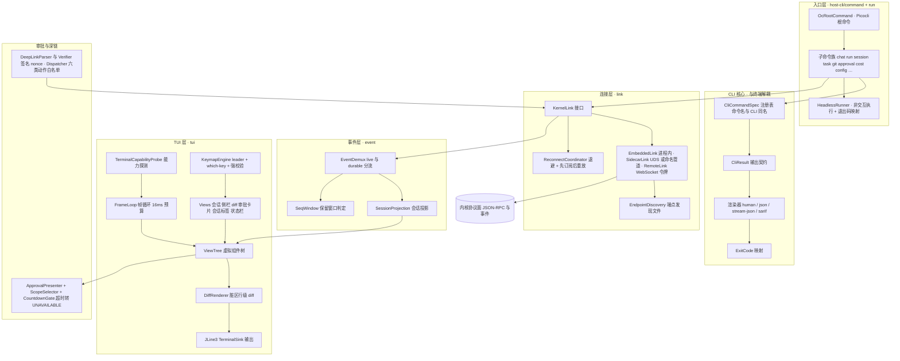
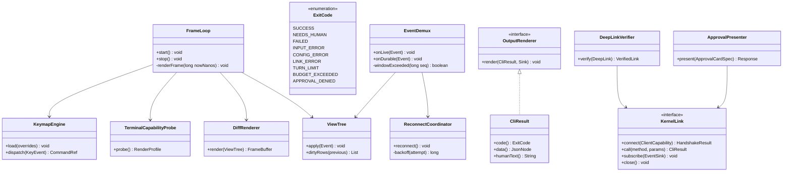
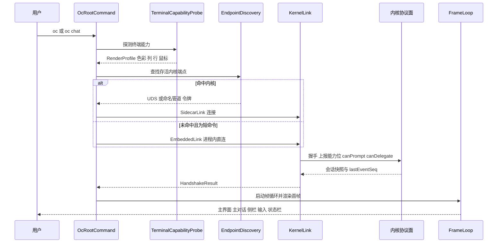
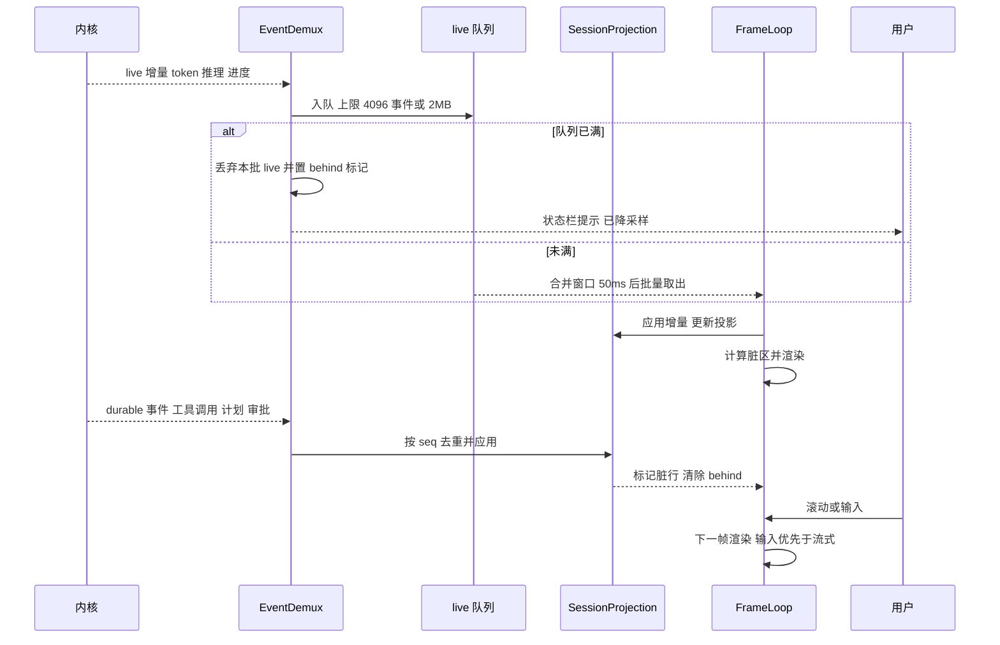
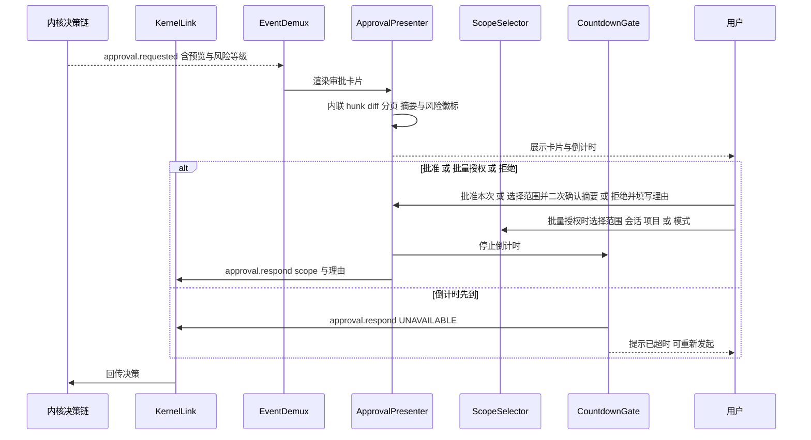
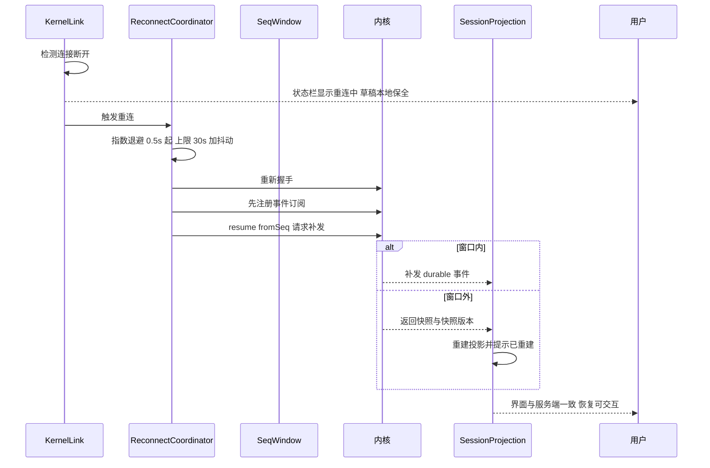
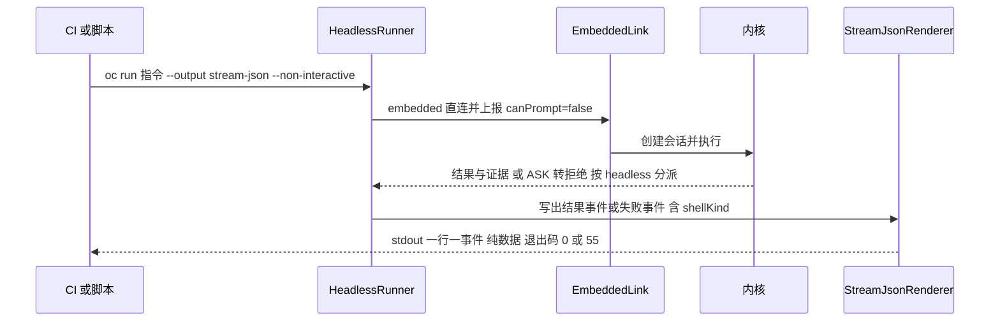
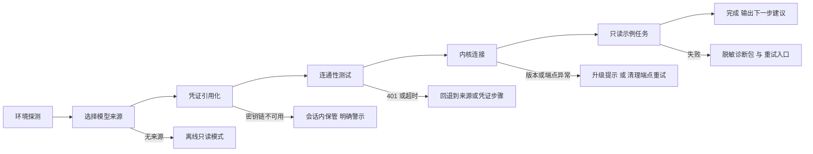
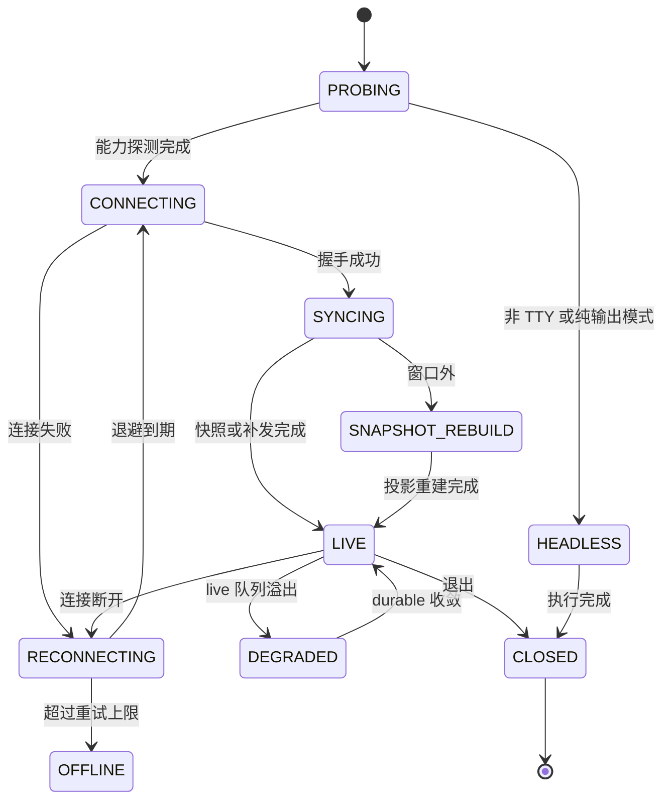
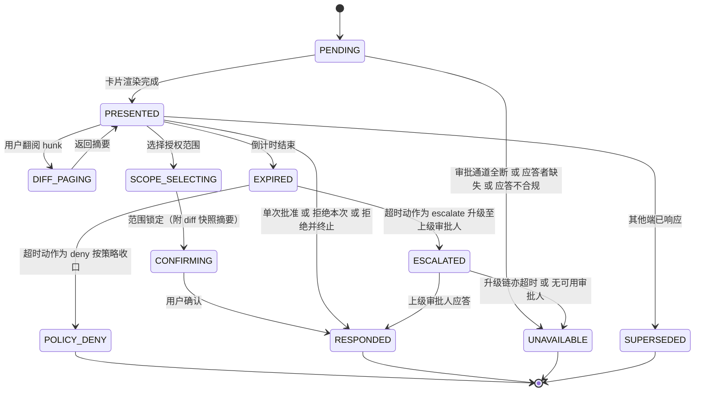

# 实现方案 22 · CLI 与 TUI（CLI / TUI Implementation）

> 本文件是 Phase B 实现层方案，对应 Phase A 卷 22（`docs/harness/22-clients-cli-desktop.md`，决策 D-UI-1/2/5/7/8/9/10/13/14）、
> 全局决策 H-002（常驻内核 + 多前端）/ H-003（内核 / 外壳边界）/ H-008（统一权限决策链）/ H-015（端形态铁律）。
> 采纳台账落点：**L-008**（外壳差异分派：交互 = 提示、headless = 拒绝、被集成 = 交宿主）、
> **L-056**（headless 与 TUI 共用同一服务端协议）、**L-057**（agent 友好输出契约与稳定退出码矩阵）。
> 桌面端（Electron + Vue）由 `23-desktop-electron-vue-impl.md` 覆盖；本文件只管终端面（CLI + TUI + headless）。
>
> 证据标记沿用 `research/00-research-plan.md` §2：`[E1]` 源码｜`[E2]` 官方文档｜`[E3]` 第三方｜`[E4]` 推断。
> 上游契约不可修改：与卷 22 冲突之处一律记入 §⑩.9「修订建议」，不直接改动 Phase A 卷册。
> 实现落点：`harness-host/host-cli`（Picocli 命令面 + JLine3 TUI + headless）+ `harness-contract/.../contract/cli`（契约与枚举）。

---

## ① 实现目标与范围

### 1.1 本组件解决什么

把「终端」做成内核的**一等端**：命令面（脚本可消费）、TUI（人可操作）、headless（CI 可驱动）共享**同一协议面与同一语义**（L-056），
差异只在「外壳能力位」与呈现方式——交互壳上报 `canPrompt=true`、headless 壳上报 `canPrompt=false`，由**内核裁决**审批语义（L-008），
避免同一条命令在三个入口产生三种权限结果。同时把延迟做成一等指标：冷启动 ≤ 300ms、首帧 ≤ 60ms、流式不阻塞输入。

**首屏承诺（R06 新增）**：终端面的第一条体验线是「从零到第一个任务」——`oc` 首次运行 → 认证（凭证引用化）→ 首个任务（只读示例），
每一步有**目标时长**与**确定的恢复动作**（§6.6）；第二条线是「每个界面在任何时刻都处于六态之一且有恢复路径」（§7.3，与 `30-interaction-ux-impl.md`
的 `InteractionState` 同一 code）。两条线都有 CI 门禁与用例（§⑪.4/§⑪.8）。

### 1.2 与 Phase A 的对应关系

| Phase A 决策 | 本文件落实位置 |
| --- | --- |
| D-UI-1 CLI 形态：Picocli + JLine3（内嵌 / sidecar 双模） | §③ D-CLII-2、§⑤ 类图、§⑩.2 |
| D-UI-2 TUI 布局：主对话 + 可折叠侧栏 + 状态栏 + 全屏视图切换 | §④ 架构图、§⑤ `ViewTree`、§⑨ 配置表 |
| D-UI-5 协议复用：契约生成共享 SDK（TS/Java） | §③ D-CLII-4、§⑨.1、§⑪.4 |
| D-UI-7 命令面板 + 可定制键位 + 命令与 CLI 同名 | §② REQ-CLI-07/17、§⑥.3、§⑨.2 |
| D-UI-8 多标签 / 多窗口 / 会话列表 / 跨端接管 | §② REQ-CLI-08、§⑥.4、§⑧ `oc_cli_attach` |
| D-UI-9 主题与可访问性；D-UI-10 国际化（标识符不翻译） | §② REQ-CLI-10/18、§⑩.6 降级矩阵、§⑨.4 |
| D-UI-13 输入增强（粘贴 / 拖拽 / `@` 引用）；D-UI-14 事件流 + 快照对齐 | §⑨.4 `input.*` 配置、§③ D-CLII-5、§⑥.2、§⑩.4 |
| L-008 外壳差异分派（交互 / headless / 被集成） | §② REQ-CLI-05、§⑥.5、§⑩.5 |
| L-056 headless 是「进程内客户端」而非独立实现 | §② REQ-CLI-04、§③ D-CLII-2、§⑥.5 |
| L-057 CLI agent 友好输出契约 + 稳定退出码矩阵 | §② REQ-CLI-02/03/16、§⑤ `ExitCode`、§⑨.2 |
| H-001 回退触发：CLI 冷启动 > 300ms 或内存 > 200MB → 轻量内核档 | §⑩.2 预算与 §⑪.4 门禁 |

### 1.3 本组件不解决什么

- **不解决**协议与事件语义（卷 01 §4.5 / 卷 16）：CLI 只消费 `event` / `approval.requested` / `agent.phase` 通知帧。
- **不解决**权限决策（卷 06）：CLI 只上报能力位与呈现提示，`ASK → 提示 or 拒绝` 的分派在内核（L-008）。
- **不解决**桌面端与 IDE 插件（卷 22 另一半 + 卷 29）、沙箱与工作区执行（卷 07/20）：只提供可复用协议客户端契约，PTY 由卷 20 的 `exec` 承担。

### 1.4 上下游依赖

| 方向 | 依赖对象 | 接口 |
| --- | --- | --- |
| 上游 | 内核协议面（卷 01 / 附录 B）+ 事件总线（卷 16） | JSON-RPC over IPC（`session.*` / `approval.*` / `event` 通知）；durable（带 `seq`）与 live 双通道分流 |
| 上游 | 权限与审批（卷 06） | `approval.list` / `approval.respond(scope)`；四值决策（含 `UNAVAILABLE`） |
| 上游 | 持久化（卷 19）+ 密钥（卷 30） | `CliStore`（客户端注册、接入会话、草稿、深链一次性令牌）；令牌存系统密钥链（Keychain / DPAPI / libsecret） |
| 下游 | 自动化（卷 34）/ 生态（卷 29）/ 桌面端（impl 23） | `oc run` 退出码与 JSON/SARIF 输出被 CI 消费；SDK 与桌面端复用同一 SDK 契约、能力位模型、断线重连协议 |

### 1.5 模块落点

**落地登记（R07：模块 / 顺序 / 批次 / 端形态；清单见 `reviews/R07-scope-build-platform.md`）**：
- **模块坐标**：`harness-host/host-cli`（Picocli + JLine3 + headless）+ `harness-contract`（包 `contract/cli`）+ `harness-host/host-protocol`（IPC/JSON-RPC 契约与 SDK 生成）；终端侧**不新增 Maven 模块**。
- **实施顺序（卷 27 §4.5）**：第 **8** 步「协议面（JSON-RPC）+ CLI 基础」（依赖第 5/6/7 步）。R06 新增的「首次运行六步向导」引用卷 29 §4.6 与生态侧导入能力（第 17–18 步区段），因此**向导与 `oc import` 属后置挂载**：第 8 步只交付命令骨架与只读示例路径，向导在生态侧就绪后启用（挂载点 `host-cli` 的 `init` 子命令），避免与 `29` 形成实现互锁。
- **数据迁移批次**：`oc_cli_*` 表族未在卷 27 §4.4 明列 → 建议新批次 **B7 端形态与交互**（`22`/`23`/`30`：客户端注册/挂载/草稿/深链/键位覆盖/日指标/偏好/布局/分享链接）；未映射项已登记 R07 §2。
- **端形态与前端契约**：前端为独立 pnpm workspace（`client/`，卷 27 §4.1 D-PATH-5，三包 `app`/`ui`/`sdk`）；**TS 类型单一来源 = `harness-contract` → `host-protocol` 生成 `client/packages/sdk`**，端侧禁止手写协议类型。端侧门禁命令统一为 `pnpm -C client ...`（§⑪.7 已修正，禁止写 `npm --prefix open-coding-client`）。
- **I- 决策落点**：`I-CLI-1…15`（15 条）模块落点为上表；类级落点见 §⑤ 类图，逐条绑定登记为 R07 建议 S4。

```text
harness-contract/.../contract/cli/
    ExitCode / OutputFormat / ShellCapability / ClientKind / RenderProfile
    FrameBudgetPolicy / BackpressurePolicy / CliResult / CliError / StreamEnvelope
    CliCommandSpec / KeyBindingSpec / ApprovalCardSpec / DeepLinkAction
    UiRendererSPI / UiCommandSPI / CliCompletionSPI / StatuslineSPI / DeepLinkHandlerSPI

harness-host/host-cli/src/main/java/.../host/cli/
    command/    OcRootCommand、ChatCommand、RunCommand、GitCommand、TaskCommand、…（Picocli 子命令）
    run/        HeadlessRunner（非交互执行 + 退出码映射 + JSONL 输出）
    output/     ResultRenderer、HumanRenderer、JsonRenderer、StreamJsonRenderer、SarifRenderer
    link/       KernelLink、EmbeddedLink、SidecarLink、RemoteLink、EndpointDiscovery、ReconnectCoordinator
    event/      EventDemux（live/durable 分流）、SessionProjection、SeqWindow
    tui/        TuiShell、FrameLoop、ViewTree、DiffRenderer、TerminalCapabilityProbe、KeymapEngine
    tui/view/   ConversationView、SidebarView、DiffView、ApprovalCardView、SessionTabsView、StatuslineView
    approval/   ApprovalPresenter、ScopeSelector、CountdownGate
    deeplink/   DeepLinkParser、DeepLinkVerifier、DeepLinkDispatcher
```

**分层纪律**：`command` 与 `run` 不直接持有终端对象（可测试）；`tui` 只依赖 `FrameLoop` 抽象与 `KernelLink`；
所有网络与进程访问经 `link` 包；命令实现里禁止 `System.out.println`（见 §⑩.9 R3 编译期门禁）。

### 1.6 R06 新增登记（体验就绪：首屏 / 六态 / 审批语义 / 可控性）

| 类型 | 编号 | 主题 | 权威单点 |
| --- | --- | --- | --- |
| REQ | `REQ-CLI-22` | 首次运行路径（首次运行 → 认证 → 首个任务），每步含目标时长与恢复动作 | 本文件 §6.6 / §⑩.2 |
| REQ | `REQ-CLI-23` | 终端面六态落地：九类界面 × 六态全部映射到 `InteractionState`，每格有恢复键 | `30-interaction-ux-impl.md` §7.1（矩阵）/ 本文件 §7.3（终端呈现） |
| REQ | `REQ-CLI-24` | 审批语义对齐 `impl/06`：超时按策略收口（非 `UNAVAILABLE`）、六级范围 chips、级联拒绝、预览与执行 digest 绑定 | `06-permission-system-impl.md` §3.7.8 / 本文件 §⑩.5 |
| REQ | `REQ-CLI-25` | 自动化模板与智能增强的终端可控面：可发现 / 可取消 / 可解释 / 成本可见 | `31-automation-library-impl.md` §9.1.1 / `32-intelligent-augmentation-impl.md` §9.3.1 |
| I-CLI | `I-CLI-10` | 首屏路径作为门禁项：自动步骤总时长与逐步恢复动作纳入 CI 断言 | 本文件 §⑪.8 |
| I-CLI | `I-CLI-11` | 审批终态四分支（`GRANTED` / `DENIED` / `HALT` / `EXPIRED` / `UNAVAILABLE`）在端上**三呈现**（拒绝 / 按策略超时 / 无人应答）且统计口径分离 | 本文件 §⑤.1 `ApprovalOutcomeKind` |
| I-CLI | `I-CLI-12` | 文案键空间与三段式错误文案：终端文案全部来自 locale 键，中文为基线 | `30-interaction-ux-impl.md` §9.6（键空间唯一权威） |

> 上述编号为本轮新增，不回改既有编号；`IMPL-DECISIONS.md` 由编排方汇总登记（本轮只入 findings 与 §⑩.9 修订建议）。

---

## ② 功能需求清单（REQ-CLI-n）

| REQ | 需求描述 | 来源 | 优先级 | 验收要点 |
| --- | --- | --- | --- | --- |
| REQ-CLI-01 | **子命令面**：对齐卷 22 §4.4 命令表（chat/run/session/task/plan/goal/schedule/team/skill/plugin/mcp/kb/memory/ws/git/permit/cost/context/hooks/doctor/config）；配置层级 `flag > env > 项目 .oc/config.yaml > 用户 config.yaml > 默认` | 卷 22 §4.4；竞品 Codex ≥56 斜杠命令与 Grok 479 行 slash 命令表 [E1]（`03-codex.md` §4.20、`06-grok-cli-and-build.md`） | P0 | 命令表 100% 有 `--help`、`--json`、退出码；层级解析有单测矩阵 |
| REQ-CLI-02 | **稳定退出码矩阵**：0 成功 / 1 需人工 / 2 失败 + 细分码（输入错 / 配置错 / 连接错 / 轮次超限 / 预算超限 / 审批拒绝），一经发布不得改义 | 采纳 L-057（`research/LESSONS-AND-ADOPTIONS.md` §3.3）；竞品 Grok 退出码 0/1/130/143 [E2]、MiniMax agent 友好输出契约 [E1]（`CROSS-COMPARISON.md` §2.2 端形态行） | P0 | `ExitCode` 枚举 + `of()`；CI 集成用例断言每个码 |
| REQ-CLI-03 | **输出契约**：stdout 只写数据、stderr 只写进度与诊断；`--output human\|json\|stream-json\|sarif`、`--quiet`、`--non-interactive`、`--dry-run` | 采纳 L-057；竞品 Codex `#![deny(clippy::print_stdout)]` 强制 stdout 纯净 + `--json` 模式一行一事件 [E1]（`03-codex.md` §4.2） | P0 | 重定向用例逐字节断言；`--dry-run` 覆盖全部写类命令 |
| REQ-CLI-04 | **headless 与 TUI 共用同一协议**：headless 是「进程内客户端」（embedded 直连），不是独立实现 | 采纳 L-056；竞品 Codex `exec` 用 `InProcessAppServerClient` [E1]、OpenCode Embedded 模式下用内存 HttpClient 打同一 router [E1]（`03-codex.md` §4.2、`02-opencode.md` §4.1） | P0 | 同一 Op / Event 契约在 embedded 与 sidecar 下行为一致（对拍用例） |
| REQ-CLI-05 | **外壳差异分派由内核裁决**：交互壳 `ASK → 提示`；headless 壳 `ASK → 拒绝`；被集成壳 `ASK → 交宿主决策`；外壳只上报能力位 | 采纳 L-008（`research/LESSONS-AND-ADOPTIONS.md` §3.3、`07-qoder.md` §8-4） | P0 | 三壳能力位用例；同一动作在三壳下的决策可解释（事件含 `shellKind` 与理由） |
| REQ-CLI-06 | **TUI 渲染架构**：单线程帧循环 + 双缓冲帧 + 脏区增量 diff；流式输出有背压与降采样（丢 live 不丢 durable） | 卷 22 §7 性能指标；竞品 Claude Code Ink/React 组件化渲染与 Gemini `ScreenReaderAppLayout` 切换 [E1]（`01-claude-code-purpose-built.md` §4.20、`08-gemini-cli.md` §4.20） | P0 | 2000 行滚动 ≥ 55fps；丢帧有 `oc_ui_frame_drop_ratio` 指标 |
| REQ-CLI-07 | **键盘全流程**：leader 键（默认 `Ctrl+X`）+ which-key 提示 + 可配置键位 + **未知键直接报错**（不静默忽略） | 竞品 OpenCode `keybind.ts` leader=`ctrl+x`、~200 项、`parse()` 对未知键抛错 [E1]（`02-opencode.md` §4.20）；Grok 523 行快捷键表 [E1] | P0 | 键位覆盖文件校验用例；冲突检测（同键多命令）报错 |
| REQ-CLI-08 | **多会话并发视图**：多标签切换、会话列表（暂停 / 归档 / 搜索）、后台会话状态徽标（运行 / 待审批 / 失败）、跨端接管提示 | 卷 22 §3 D-UI-8；竞品 Codex `codex agents` 浏览共享 daemon 上的全部会话 [E1]（`03-codex.md` §4.20） | P1 | 4 会话并发时切换 ≤ 50ms 且无串话；后台事件不丢 |
| REQ-CLI-09 | **审批交互**：内联 hunk diff 审阅（分页）、动作摘要 + 风险徽标（R0–R5）、授权范围选择（本次 / 会话 / 项目 / 模式）、超时倒计时 → `UNAVAILABLE`、拒绝可填理由、批量授权 | 卷 22 §4.1/§4.3；L-005 的 `UNAVAILABLE` 一等结果（`research/LESSONS-AND-ADOPTIONS.md` §3.2） | P0 | 四值决策全路径；超时**不得**记为拒绝；批量授权带确认摘要 |
| REQ-CLI-10 | **终端能力降级**：颜色（truecolor/256/16/mono）、Unicode 宽度、OSC 8 真链接、鼠标、镜像字体；窄终端（< 80 列）与矮终端（< 24 行）自动收起侧栏；非 TTY 自动转 headless | 卷 22 §3 D-UI-2「终端能力探测」；竞品 Gemini `ToolDisplayFormat` 5 档与屏幕阅读器布局 [E1]（`08-gemini-cli.md` §4.20） | P0 | 降级矩阵（§⑩.6）逐格用例；非 TTY 下零交互提示 |
| REQ-CLI-11 | **IPC 通道与断线重连**：UDS / Windows 命名管道优先，loopback WebSocket 回退，embedded 直连；端点发现文件 + 令牌认证；断线指数退避 + 先订阅后重放 + 窗口外快照重建 | H-002 与 L-056；竞品 Codex 三传输（stdio / unix socket / websocket）+ 本地控制 socket [E1]、Grok single-leader over `~/.grok/leader.sock` [E1] | P0 | 断连 30s 后界面与事件流一致（卷 22 §8 DoD）；重连 P95 ≤ 2s |
| REQ-CLI-12 | **`oc://` 深链**：六类动作白名单（打开会话 / 任务 / 审批 / 知识页 / 新建会话 / 跟随），签名参数 + 一次性 nonce + 首次确认；审批类禁止一键批准 | 卷 22 §10 与卷 29 D-ECO-11（六动作白名单 + 签名 + 二次确认） | P1 | 伪造签名被拒；nonce 重放被拒；审批深链必须二次确认 |
| REQ-CLI-13 | **冷启动与内存预算**：CLI 冷启动 ≤ 300ms（H-001 回退触发线）；TUI 常驻 RSS ≤ 120MB、空闲 CPU ≤ 1% | 卷 22 §7、H-001 回退触发 | P0 | CI 性能门禁（§⑪.4）；超标触发轻量内核档评估 |
| REQ-CLI-14 | **草稿保护**：崩溃 / kill 后未发送输入可恢复（本地草稿 + 服务端 draft 双份） | 卷 22 §7「本地草稿保护」 | P1 | kill -9 后重启恢复草稿；文件权限 0600 |
| REQ-CLI-15 | **工具结果内联渲染契约**：五档展示（auto/compact/box/hidden/notice）+ 插件自定义渲染（`UiRendererSPI`，纯函数、含纯文本回退） | 卷 22 §5 `UiRendererSPI`；竞品 Gemini `ToolDisplayFormat` 五档 [E1]、SWE-agent ACI 的「空输出固定话术」教训 [E2] | P1 | 每档有快照用例；插件渲染失败回退纯文本并记 WARN |
| REQ-CLI-16 | **schema 导出**：`oc tools export-schema` 输出工具与命令的机器可读 schema（供 SDK / CI 消费） | 采纳 L-057（`export-schema` 增量）；竞品 Gemini 官方文档的 export-schema 命令 [E2]（`08-gemini-cli.md` §6.3） | P2 | schema 与运行时校验一致（同一来源生成） |
| REQ-CLI-17 | **命令面板与 CLI 命令同名**：TUI `Ctrl+P` 面板列出全部命令与技能 / 插件命令，执行效果与 CLI 完全一致 | 卷 22 §3 D-UI-7 | P1 | 面板命令与 CLI 命令同名映射测试；未登记命令不出现在面板 |
| REQ-CLI-18 | **国际化和文案**：中英双语（message bundle），命令名 / 参数名 / 错误码标识符不翻译；终端文案遵循术语表；**文案键空间、中文基线与三段式错误模板的唯一权威在 `30-interaction-ux-impl.md` §9.6**（R06 修正：终端不得自定义第二套键或模板） | 卷 22 §3 D-UI-10 | P1 | 三条扫描（硬编码 / 缺键 / 禁用词）+ **第四条：错误类文案缺「动作」段即失败**；`LANG=C` 下输出英文；键缺失回退中文基线并计数 |
| REQ-CLI-19 | **非交互确定性**：`--non-interactive` / 无 TTY 时禁止一切提示、强制 QUEUE 投递、审批按 L-008 拒绝 | 采纳 L-008；卷 22 §4.4 脚本友好 | P0 | 无 TTY 用例：任何提示路径均被拒绝且退出码明确 |
| REQ-CLI-20 | **遥测默认关闭**：`ui.*` 匿名事件默认不发送，开启需显式同意；企业可强制内部实例开启 | 卷 22 §10 开放问题（遥测默认关闭） | P2 | 默认零外发（网络层断言）；同意后仅白名单字段 |
| REQ-CLI-21 | **输入增强**：粘贴图片 / 拖拽文件 / `@` 引用（文件 / 技能 / 会话 / 知识）；附件单文件上限 `cli.input.max-attachment-mb`，超限提示改用引用而非静默丢弃 | 卷 22 §3 D-UI-13；竞品 Gemini 屏幕阅读器模式与附件族 [E1] | P1 | 附件登记与引用解析各有用例；超限行为有断言 |
| REQ-CLI-22 | **首次运行路径（R06 新增）**：`oc` 无配置首次运行 → 环境探测 → 模型来源选择 → 凭证引用化 + 连通性测试 → 只读示例任务 → 输出下一步建议；**全流程可跳过**，每一步有目标时长（P95）与至少一个恢复动作 | 卷 29 §4.6 首次使用向导（`oc init`）；卷 33 §3/§5 空态与引导 | P0 | 自动步骤合计 ≤ 20s、端到端（不含用户输入）≤ 90s；六条失败路径（探测/来源/凭证/连通性/内核/示例任务）各有一条恢复动作用例；非交互 `--yes` 可全自动 |
| REQ-CLI-23 | **六态在终端面的落地（R06 新增）**：九类界面族 × 六态（`EMPTY`/`LOADING`/`ERROR`/`OFFLINE`/`PERMISSION_DENIED`/`EDGE_DATA`）逐格给出终端呈现 + 恢复键；非 TTY 时六态全部降为「纯文本 + 退出码」 | 卷 33 §2 D-UX-1；`30-interaction-ux-impl.md` §7.1 矩阵（权威） | P0 | §7.3 表逐格有呈现与恢复键；`mono`/非 TTY 档下六态均有文字标签（不依赖色彩） |
| REQ-CLI-24 | **审批语义对齐（R06 新增）**：超时按**该请求声明的超时动作**收口（`deny` 默认 / `escalate` 企业），只有通道全断 / 应答者缺失 / 应答不合规才是 `UNAVAILABLE`；六级范围 chips 与 `impl/06` 词汇一一对应；提供「拒绝并终止」（级联拒绝）；预览与执行绑定同一 `action_digest` | `06-permission-system-impl.md` §3.7.6/§3.7.8（权威）；卷 33 §4 错误文案 | P0 | 三终态（按策略拒绝 / 升级 / 无人应答）各有用例且**文案与统计互不混同**；R4/R5 不提供范围 chips；digest 不一致时拒绝执行 |
| REQ-CLI-25 | **终端可控面（R06 新增）**：自动化模板（`oc auto …`）与智能增强能力（`oc ai …`）在命令面与 TUI 命令面板同名可达；每次运行可取消、可解释（为什么跑 / 为什么不跑 / 为什么被拦）、成本可见（预估 + 运行中 + 结算） | `31-automation-library-impl.md` §9.1.1；`32-intelligent-augmentation-impl.md` §9.3.1；卷 34/35 | P1 | 命令同名映射测试；取消在安全点生效；解释字段齐套；成本三项在 `--json` 与人类输出中均可读 |

**竞品增量需求说明**：REQ-CLI-02/03/16（退出码矩阵、stdout 纯净、schema 导出）来自 L-057 与 Codex / Grok / MiniMax / Gemini
的源码与官方文档事实；REQ-CLI-07/08（键位强校验、共享 daemon 会话浏览）来自 OpenCode / Codex 的 E1 证据；
REQ-CLI-04（headless 复用同一协议）为 L-056 的直接落地，三条均在 §③ 登记 `I-CLI-n`。

---

## ③ 技术方案选型（M×N 比选）

评分沿用 `README.md` §4：**F 30% / U 20% / S 25% / M 25%**。

### D-CLII-1 TUI 渲染模型

| 分支 | 描述 | F | U | S | M | 加权 | 结论 |
| --- | --- | --- | --- | --- | --- | --- | --- |
| B1 | 逐行直接写终端（事件驱动 print） | 6 | 7 | 8 | 7 | 69.0 | 淘汰（流式 + 多面板必然闪烁与错位） |
| B2 | **保留模式虚拟组件树 + 双缓冲帧 + 脏区增量 diff** | 9 | 9 | 8 | 9 | 88.0 | **选定** |
| B3 | 每帧全屏重绘（简单一致） | 7 | 5 | 9 | 8 | 73.0 | 淘汰（2000 行场景 55fps 不可达，带宽浪费） |

### D-CLII-2 内核连接形态

| 分支 | 描述 | F | U | S | M | 加权 | 结论 |
| --- | --- | --- | --- | --- | --- | --- | --- |
| B1 | 一律 sidecar（连接常驻内核进程） | 8 | 7 | 8 | 8 | 78.0 | 淘汰（一次性 `oc run` 也要拉起内核，冷启动不可达 300ms） |
| B2 | **三模自适应：短命令 embedded 直连；长会话 sidecar；`--attach` 连远端实例** | 9 | 9 | 8 | 9 | 88.0 | **选定** |
| B3 | 一律 embedded（进程内内核） | 7 | 8 | 6 | 6 | 67.5 | 淘汰（后台 Schedule / Teams 与多端接管要求常驻内核，H-002） |

**选定 B2**：与 H-002「内核必须支持单机内嵌启动档」一致；`embedded` 复用同一 `KernelLink` 接口（进程内直连，
零网络栈），因此 headless 与 TUI 的语义差异只在**能力位**，不在协议（L-056）。切换规则见 §⑩.4。

### D-CLII-3 IPC 传输选择

| 分支 | 描述 | F | U | S | M | 加权 | 结论 |
| --- | --- | --- | --- | --- | --- | --- | --- |
| B1 | TCP loopback + 随机端口 | 8 | 7 | 6 | 7 | 70.5 | 淘汰（任何本机进程可连，需额外鉴权；Windows 防火墙弹窗） |
| B2 | **Unix domain socket / Windows 命名管道优先，loopback WebSocket 按需回退（远端 / IDE）** | 9 | 8 | 9 | 9 | 88.0 | **选定** |
| B3 | stdio 子进程（每次握手） | 6 | 6 | 7 | 6 | 62.5 | 淘汰（多端接入与断线重连语义弱；Codex 保留其用于嵌入式场景 [E1]） |

**选定 B2**：UDS / 命名管道天然带文件系统权限（0600 / ACL），是把「本机即信任边界」写进操作系统的做法；
WebSocket 仅在远端 attach 或 IDE 集成时启用，且必须带令牌（§⑩.7）。端点发现文件见 §⑧.3。

### D-CLII-4 协议与客户端来源

| 分支 | 描述 | F | U | S | M | 加权 | 结论 |
| --- | --- | --- | --- | --- | --- | --- | --- |
| B1 | 手写 CLI 内协议客户端 | 6 | 6 | 4 | 4 | 50.5 | 淘汰（与桌面端漂移，D-UI-5 明确禁止） |
| B2 | **契约（JSON-RPC 方法 + 事件 Schema）为唯一来源，生成 Java 客户端 + 错误码枚举；CLI 只做薄封装** | 9 | 8 | 9 | 9 | 88.0 | **选定** |
| B3 | 复用第三方 JSON-RPC 库自带客户端生成 | 7 | 6 | 6 | 6 | 63.0 | 淘汰（无法表达 `serialization_scope` 式分区与双通道） |

### D-CLII-5 事件通道与重连语义

| 分支 | 描述 | F | U | S | M | 加权 | 结论 |
| --- | --- | --- | --- | --- | --- | --- | --- |
| B1 | 单通道全量事件（一律带 `seq`，全部可重放） | 8 | 8 | 6 | 7 | 72.0 | 淘汰（流式增量入库不可接受，卷 16 已定双通道） |
| B2 | **双通道：live（无游标，可丢）+ durable（带 `seq`，可重放）；重连先订阅后重放，窗口外请求快照** | 9 | 8 | 9 | 9 | 88.0 | **选定** |
| B3 | 客户端轮询快照（低频） | 5 | 5 | 9 | 6 | 61.5 | 淘汰（事件到界面 ≤ 200ms 不可达） |

### D-CLII-6 输出渲染与退出码

| 分支 | 描述 | F | U | S | M | 加权 | 结论 |
| --- | --- | --- | --- | --- | --- | --- | --- |
| B1 | 每个命令自行格式化输出（含退出码分支） | 6 | 6 | 4 | 5 | 52.0 | 淘汰（漂移不可控，L-057 的教训正是退出码语义不可改） |
| B2 | **单一 `CliResult` 模型 + 四个渲染器（human / json / stream-json / sarif）+ `ExitCode` 枚举映射** | 9 | 9 | 9 | 9 | 90.0 | **选定** |
| B3 | 用同一 JSON 渲染所有模式（含交互） | 6 | 5 | 9 | 7 | 67.0 | 淘汰（交互体验退化，且人类模式无法表达 diff 等富文本） |

### D-CLII-7 键盘与命令分发

| 分支 | 描述 | F | U | S | M | 加权 | 结论 |
| --- | --- | --- | --- | --- | --- | --- | --- |
| B1 | 固定快捷键表（硬编码） | 6 | 6 | 7 | 6 | 62.5 | 淘汰（企业键位差异与键盘布局问题无法解决） |
| B2 | **键位表数据驱动 + leader 前缀 + which-key 提示 + 用户覆盖 + 未知键 / 冲突键报错** | 9 | 9 | 8 | 9 | 88.0 | **选定** |
| B3 | 以 Vim 模式为主交互范式 | 7 | 6 | 7 | 7 | 67.5 | 淘汰（学习成本高；作为可选模式保留，见 §⑨.4） |

**选定 B2**：键位表由 `CliCommandSpec` 生成（命令名与 CLI 同名，D-UI-7），插件可用 `CliCompletionSPI` /
`UiCommandSPI` 注册；未知键报错吸收 OpenCode `parse()` 的强校验 [E1]——静默忽略是「用户以为按了、系统没动」的经典缺陷。

### 3.8 实现级决策登记（I-CLI-n）

| ID | 主题 | 选定 | 代价 | 回退触发 |
| --- | --- | --- | --- | --- |
| I-CLI-1 | 渲染模型 | 保留模式虚拟树 + 双缓冲帧 + 脏区 diff（帧预算 16ms） | 组件不得直接写终端；需行级 diff 测试 | 脏区计算导致 P95 帧时 > 16ms → 降级为按面板整块重绘 |
| I-CLI-2 | 连接形态 | 三模自适应（embedded / sidecar / remote），协议零依赖 | 三模行为需一致性用例 | embedded 与 sidecar 出现语义差异 → 该命令强制 sidecar 并告警 |
| I-CLI-3 | IPC 传输 | UDS / 命名管道优先，loopback WS 回退，端点发现文件 + 令牌 | Windows 管道与 UDS 行为差异需封装 | 平台管道不可用 → 自动回退 WS（事件记录降级原因） |
| I-CLI-4 | 事件语义 | 双通道 + 先订阅后重放 + 窗口外快照重建 | 客户端需维护 `lastEventSeq` 与窗口判定 | 快照重建 P95 > 1s → 缩短保留窗口阈值或引入增量快照 |
| I-CLI-5 | 输出与退出码 | 单一 `CliResult` + 四渲染器 + `ExitCode` 枚举 | 新命令必须声明退出码映射 | 渲染器分叉导致字段缺失 → 以契约测试锁定字段集合 |
| I-CLI-6 | 键盘体系 | 数据驱动键位 + leader + which-key + 未知键报错 | 覆盖文件需校验与冲突检测 | 用户覆盖导致无可用按键 → 提供 `oc config keymap reset` |
| I-CLI-7 | 审批交互 | 内联 hunk diff + 范围选择 + 超时 `UNAVAILABLE` + 批量授权 | 窄终端下的 diff 呈现受限 | 窄终端 diff 不可读 → 退化为摘要 + 全屏 diff 视图 |
| I-CLI-8 | 降级策略 | 能力探测四档 + 屏幕阅读器模式 + 非 TTY 转 headless | 组合矩阵测试成本高 | 某终端族出现不可判定能力 → 保守取最低档（mono + 纯文本） |
| I-CLI-9 | 深链 | 六类动作白名单 + 签名 + 一次性 nonce + 二次确认（审批类禁止一键批准） | 需要签名密钥分发与时钟校验 | 签名校验误拒率 > 1% → 增加时钟偏差容差并记事件 |
| I-CLI-10 | 首屏路径（R06） | `oc init` 六步向导 + 可跳过 + 每步恢复动作 + 只读示例任务收尾；自动步骤 ≤ 20s | 首次运行多一条需要长期维护的路径（探测规则随工具链演进） | 首屏完成率 < 70%（埋点 `cli.firstrun.completed`）→ 减步为「最低三问」（来源 / 凭证 / 工作区）并把其余降为可后置 |
| I-CLI-11 | 审批终态呈现（R06） | 内核四分支（`GRANTED`/`DENIED`/`HALT`/`EXPIRED`/`UNAVAILABLE`）→ 端上三呈现（主动拒绝 / 按策略超时 / 无人应答），统计口径分离 | 端上不得本地判定超时结果（必须等内核终态），首帧会晚一次往返 | 内核终态到达延迟 P95 > 500ms → 端上先显示「等待内核裁定」占位（仍不得猜结果） |
| I-CLI-12 | 文案键空间（R06） | 终端文案 100% 来自 locale 键（`ui.*` 键空间，中文为基线），CI 第四条扫描：错误类文案缺「动作」段即失败 | 文案键治理与翻译纪律成本 | 扫描误报率 > 5% → 白名单需评审记录（与 `30` §9.6 同一条规则，禁止两处各定义一套） |

**与竞品对照的取舍**：终端面路线以三处竞品实证为输入——① **外壳差异分派**（交互 = 提示、headless = 拒绝、被集成 = 交宿主，L-008，来自 `research/competitors/04-deepseek-harness.md` 与 `09-secondary-tier.md`）：本文件落为 `ExitCode` 枚举 + 四渲染器（I-CLI-5），并以契约测试锁定字段集合；② **headless 与 TUI 共用同一服务端协议**（L-056，`06-grok-cli-and-build.md`）：落为 I-CLI-2 三模自适应（embedded / sidecar / remote），**放弃**竞品「TUI 与 headless 两套链路」的做法（双链路必然语义漂移）；③ **agent 友好输出契约与稳定退出码矩阵**（L-057）：落为 stdout 纯净 + `--json` + 稳定退出码，作为 CI 集成契约。**反向取舍**：不引入竞品的完整 TUI 应用框架——渲染层为薄壳（保留模式虚拟树 + 脏区 diff），业务语义全部在内核，保证多端一致与可回放（对齐 H-002/H-015）。

---

## ④ 总体架构图



**装配点**：`host-bootstrap` 按 `open-coding.cli.link.mode`（`auto`/`embedded`/`sidecar`/`remote`）装配 `KernelLink` 实现；
`auto` 由 `EndpointDiscovery` 决定（发现存活内核 → sidecar；否则短命令 → embedded）。未装配 TUI 时（`--output json`）
`FrameLoop` 不启动，事件直通渲染器（headless 路径零终端依赖）。

---

## ⑤ 类图与 Java 21 契约



### 5.1 契约签名（节选，JavaDoc 完整）

**分层标注（R1–R4）**：本节为**契约侧**（`harness-contract/.../contract/cli`，Spring/ORM/Redis/HTTP 客户端一律禁止；零运行期依赖）；`lombok.Getter` / `lombok.RequiredArgsConstructor` 属**编译期注解处理**（provided 作用域，不产生运行期依赖），契约与内核模块允许。外壳侧实现（`harness-host/host-cli`，Spring 允许）见本节末段示例。

```java
package com.hk.opencoding.contract.cli;

import lombok.Getter;
import lombok.RequiredArgsConstructor;

/**
 * CLI 退出码。
 * 供脚本与 CI 判定结果；**一经发布不得改变语义**（只能新增），因此取值与文案集中在本枚举。
 * 语义分层：0 成功；1 需人工介入；2 及以上为失败类，细分码用于自动化分流。
 */
@Getter
@RequiredArgsConstructor
public enum ExitCode {

    /** 成功完成 */
    SUCCESS("0", "成功", 0),
    /** 需人工介入（审批超时 / 冲突待裁决） */
    NEEDS_HUMAN("1", "需人工介入", 1),
    /** 通用失败 */
    FAILED("2", "执行失败", 2),
    /** 输入 / 参数非法 */
    INPUT_ERROR("42", "输入非法", 2),
    /** 配置缺失或非法 */
    CONFIG_ERROR("43", "配置非法", 2),
    /** 连接内核失败（不可达 / 版本不兼容） */
    LINK_ERROR("44", "连接失败", 2),
    /** 轮次或步数超限 */
    TURN_LIMIT("53", "轮次超限", 1),
    /** 预算超限（含配额熔断） */
    BUDGET_EXCEEDED("54", "预算超限", 1),
    /** 审批被拒 */
    APPROVAL_DENIED("55", "审批被拒", 2);

    private final String code;
    private final String desc;
    private final int processCode;

    /**
     * 按 code 解析退出码。
     *
     * @param code 退出码字符串（必填，取值见枚举常量）
     * @return 对应枚举项
     * @throws HarnessException code 为空或未知时抛出
     */
    public static ExitCode of(String code) throws HarnessException {
        for (ExitCode exitCode : values()) {
            if (exitCode.code.equals(code)) {
                return exitCode;
            }
        }
        throw new HarnessException("未知的退出码：" + code);
    }
}
```

```java
package com.hk.opencoding.contract.cli;

import lombok.Getter;
import lombok.RequiredArgsConstructor;

/**
 * 审批终态在终端端的呈现口径（R06 新增）。
 * <p>
 * 内核（{@code impl/06} §3.7.8）的终态是封闭集：批准 / 拒绝（含级联拒绝 HALT）/ 超时按策略收口 / 通道不可用；
 * 本枚举是**端上唯一**的呈现与统计口径——展示文案键由 {@link #getCopyKey()} 决定，
 * 统计口径由 {@link #isUserInitiated()} 决定（用户主动拒绝与「按策略超时」「无人应答」必须分开计数，
 * 混同会把「人不在」误算成「人反对」，从而污染审批打扰率与策略调整依据）。
 */
@Getter
@RequiredArgsConstructor
public enum ApprovalOutcomeKind {

    /** 用户批准（含批量授权与范围授予） */
    GRANTED("GRANTED", "已批准", "ui.approval.outcome.granted", true),
    /** 用户主动拒绝本次（模型可换路） */
    DENIED("DENIED", "已拒绝", "ui.approval.outcome.denied", true),
    /** 用户「拒绝并终止」（同会话 pending 全部终结，级联拒绝） */
    HALT("HALT", "已拒绝并终止会话后续动作", "ui.approval.outcome.halt", true),
    /** 倒计时结束且该请求的超时动作为 deny：按策略收口，**不是**用户拒绝 */
    EXPIRED_POLICY_DENY("EXPIRED_POLICY_DENY", "审批超时，已按策略拒绝", "ui.approval.outcome.expired", false),
    /** 超时动作 escalate：已升级至上级审批人，用户可继续等待 */
    ESCALATED("ESCALATED", "已升级至上级审批人", "ui.approval.outcome.escalated", false),
    /** 通道全断 / 应答者缺失 / 应答不合规：调用方 fail-closed，**不是**用户拒绝 */
    UNAVAILABLE("UNAVAILABLE", "无人应答或通道不可用，已按安全默认拒绝", "ui.approval.outcome.unavailable", false),
    /** 其他端已处理：本端转为只读结果视图 */
    SUPERSEDED("SUPERSEDED", "已由其他端处理", "ui.approval.outcome.superseded", false);

    private final String code;
    private final String desc;
    /** locale 文案键（`30-interaction-ux-impl.md` §9.6 键空间，中文为基线） */
    private final String copyKey;
    /** 是否计入「用户主动拒绝」统计（false 者不得进入审批打扰率与拒绝率分子） */
    private final boolean userInitiated;

    /**
     * 按内核终态 code 解析呈现口径。
     *
     * @param code 内核审批终态编码（必填，取值见枚举常量）
     * @return 对应的呈现口径
     * @throws HarnessException code 为空或未知时抛出（未知终态必须显式失败，禁止按默认分支猜呈现）
     */
    public static ApprovalOutcomeKind of(String code) {
        for (ApprovalOutcomeKind kind : values()) {
            if (kind.code.equals(code)) {
                return kind;
            }
        }
        throw new HarnessException("未知的审批终态：" + code);
    }
}
```

```java
package com.hk.opencoding.host.cli.tui;

import lombok.RequiredArgsConstructor;
import lombok.extern.slf4j.Slf4j;

/**
 * TUI 帧循环。
 * 单线程持有 {@link ViewTree} 并在固定预算内完成一帧渲染；事件线程只投递「脏标记」，
 * 不做任何终端写操作，保证渲染顺序确定且可回放（回放用于黄金帧测试）。
 */
@Slf4j
@RequiredArgsConstructor
public final class FrameLoop {

    private final FrameBudgetPolicy budget;
    private final TerminalCapabilityProbe probe;
    private final ViewTree viewTree;
    private final DiffRenderer renderer;
    private final TerminalSink sink;

    private volatile boolean running;

    /**
     * 启动帧循环（阻塞至 {@link #stop()} 被调用）。
     *
     * @throws BusinessException 终端初始化失败（非 TTY 或写入被拒）时抛出
     */
    public void start() throws BusinessException {
        RenderProfile profile = probe.probe();
        log.info("TUI 帧循环启动，色彩档={}, 列数={}, 行数={}", profile.colorDepth(), profile.columns(), profile.rows());
        running = true;
        while (running) {
            long startNanos = System.nanoTime();
            renderFrame(profile);

            // 帧预算剩余时间用于睡眠，避免空转占满 CPU（空闲目标 ≤ 1%）
            long elapsedMillis = (System.nanoTime() - startNanos) / budget.nanosPerMilli();
            if (elapsedMillis < budget.frameBudgetMillis()) {
                sink.awaitInputOrTimeout(budget.frameBudgetMillis() - elapsedMillis);
            }
        }
        sink.flush();
        log.info("TUI 帧循环停止");
    }

    /**
     * 停止帧循环（安全点退出，由信号或命令触发）。
     */
    public void stop() {
        running = false;
    }

    /** 渲染一帧：仅输出脏区；超预算只记降级（live 已按背压丢弃，绝不阻塞事件线程）。 */
    private void renderFrame(RenderProfile profile) {
        if (!viewTree.hasDirtyRows()) {
            return;
        }
        FrameBuffer buffer = renderer.render(viewTree);
        sink.write(buffer.dirtyLines());
        if (buffer.renderCostMillis() > budget.frameBudgetMillis()) {
            log.debug("帧耗时超预算，costMs={}, budgetMs={}, 脏行数={}", buffer.renderCostMillis(),
                    budget.frameBudgetMillis(), buffer.dirtyLines().size());
        }
    }
}
```

**日志与异常纪律**：异常按层分工——**契约侧（`contract/cli` 的枚举与值对象，零框架）统一 `HarnessException` + `ErrorCode`**；**外壳侧（`host-cli`，Spring 允许）统一 `BusinessException` + `ErrorCode`**，由外壳全局异常处理器按码映射（错误模型见附录 B §B.7）。`host-cli` 全部类 `@Slf4j`，命令入口与连接生命周期用中文 `log.info` 打点（命令名、参数摘要、
耗时、退出码）；帧循环与按键分发属热路径，用 `log.debug` 且带限流；业务失败统一抛 `BusinessException`
（中文文案 + `ExitCode` 映射），禁止 `System.exit` 直接调用（由根命令统一映射退出码）。

---

## ⑥ 核心流程时序图

### 6.1 启动、连接与首帧

**前置条件**：终端可用；内核已安装（`oc` 首次运行会引导安装内核）。**主路径**：探测终端能力 → 端点发现（UDS / 管道 / WS）→ 握手（版本与能力）→ attach 或新建会话 → 拉取快照 → 渲染首帧。**异常与补偿**：令牌失效 → 重新握手并提示；
版本不兼容 → 明确报错并给出升级命令（不静默降级）。**幂等与并发**：多个 CLI 同时启动只允许一个 sidecar 拉起
（内核侧单实例锁）；`attach` 幂等（同一 `clientId` 重复接入返回同一视图与 `lastEventSeq`）。



### 6.2 流式回合与背压

**前置条件**：已 attach 且 `lastEventSeq` 对齐。**主路径**：输入提交 → durable 游标推进 → live 合帧（≤50ms 窗口）→ 脏区渲染 → 队列超限仅降采样提示。**异常与补偿**：live 队列溢出 → 丢弃 live 增量并置
`behind=true` 标记（界面提示「输出过快，已降采样」），durable 事件到达后自动收敛。
**幂等与并发**：渲染线程单写；事件线程只投递；同一 `seq` 的 durable 事件去重。



### 6.3 审批交互（内联 diff 与批量授权）

**前置条件**：内核决策为 ASK 且外壳能力位 `canPrompt=true`。**主路径**：卡片呈现（内联 diff）→ hunk 分页审阅 → 范围选择（本次 / 会话 / 项目）→ 响应 → 内核回执与卡片状态收敛。**异常与补偿**：倒计时结束 → 结果置
`UNAVAILABLE`（**不得**记为拒绝，L-005）；多端同时响应 → 先到先得，后到者收到「已被其他端处理」提示。
**幂等与并发**：审批参数一律从已流式的 `tool/call` 事件取（禁止二次查库，避免两份真相）；同一
`approvalId` 只接受一次有效响应。



### 6.4 断线重连与快照对齐

**前置条件**：已建立 sidecar / remote 连接。**主路径**：心跳失败 → `RECONNECTING`（退避）→ 先订阅后重放 `resume(fromSeq)` → 窗口外快照重建 → 对齐校验（`lastEventSeq`）恢复增量。**异常与补偿**：重试上限后进入离线模式（只读历史 + 草稿保护）；
窗口外 → 请求快照重建；重建期间禁止乐观更新（只读）。
**幂等与并发**：重连后先订阅再重放（L-051 语义），`resume(fromSeq)` 幂等。



### 6.5 headless 执行与退出码

**前置条件**：非 TTY 或显式 `--headless`；命令与参数已解析；`--json` 或脚本模式已声明。**主路径**：连接内核（或 embedded）→ 非交互分派（L-008：提示 / 拒绝 / 交宿主）→ stdout 仅输出数据 → 结果与退出码映射（`ExitCode`）。
**异常与补偿**：内核不可达 → `LINK_ERROR`（44）且不重试交互路径；审批需求在非交互下按分派规则处置（超时 → `UNAVAILABLE`，**不得静默批准**）；部分失败 → 退出码取最严重项并输出机器可读错误段。
**幂等与并发点**：写类命令必须携带 `Idempotency-Key`（或 `--dry-run`）；重复执行由内核幂等键去重；stdout 纯净性由契约测试断言（禁止混入进度与日志）。



### 6.6 首次运行 → 认证 → 首个任务（每步有恢复动作，R06 新增）

**前置条件**：`~/.opencoding/config.yaml` 不存在或缺少模型来源；终端可用。
**主路径**：环境探测 → 模型来源选择 → 凭证引用化 → 连通性测试 → 内核连接 → 只读示例任务 → 完成（输出可复制的下一步命令）。
**异常与补偿**：六条失败路径各有**确定的恢复动作**（下表）——「失败但不知道下一步做什么」视为体验缺陷；全流程可跳过（跳过即进入离线只读模式，首屏仍可用）。

| # | 步骤 | 目标时长（P95） | 成功判据 | 失败时的恢复动作（必须可在同一界面执行） |
| --- | --- | --- | --- | --- |
| 1 | 环境探测（语言 / 工具链 / Git / 容器运行时 / 终端能力） | ≤ 2s | 探测报告可读；不可用项标注「可选」而非阻断 | 探测失败**不阻塞**：允许手动指定（`oc init --set toolchain=…`）并继续 |
| 2 | 模型来源选择（官方端点 / 私有端点 / 本地模型） | 用户输入（无自动耗时） | 选定来源写入引用 | 无可用来源 → 进入「离线只读模式」并给恢复动作（稍后 `oc config set` 或改用本地模型） |
| 3 | 凭证引用化（值入系统密钥链，配置文件只存引用） | ≤ 1s | 配置 / 日志 / 事件中零明文 | 密钥链不可用 → 明确警示「本次会话不持久化令牌」+ 提供环境变量临时注入路径（`OC_*_API_KEY`） |
| 4 | 连通性测试（`oc doctor model <provider> --probe`） | ≤ 3s | 返回模型标识与首字节延迟 | 401/403 → 回到步骤 3（带原因码）；超时 → 建议备用端点或本地模型；无凭证 → 以 dry-run 结论继续（不假装成功） |
| 5 | 内核连接（端点发现 → 握手 → attach / 新建会话） | ≤ 300ms（冷启动预算，§⑩.2） | 握手成功且版本兼容 | 版本不兼容 → 输出明确升级命令（不静默降级）；端点文件残留 → 按 pid 清理后重试 |
| 6 | 首个任务（**只读**示例：读代码 → 回答架构问题，验证闭环） | 首 token ≤ 1.5s（对齐 `33` §11.4） | 输出含至少 1 条可打开引用 | 失败 → 一键 `oc doctor --export`（脱敏诊断包）+ 重试入口；**不自动修改用户配置** |
| 7 | 完成 | ≤ 1s | 输出「下一步建议 + 可复制命令」 | —（无失败路径；若写入建议失败按 WARN 记录并不阻塞退出） |

**预算合计**：自动步骤（1/3/4/5/6 的机器耗时）合计 **≤ 20s（P95）**；端到端（不含用户输入时间）**≤ 90s（P95）**；非交互形态 `oc init --yes` **≤ 20s**。
**纪律**：每步必须显示一行「为什么需要」（locale 键 `ui.firstrun.<step>.why`，中文基线）；跳过任一步都不产生半成品配置（配置写入是最后一步的原子提交）。



---

## ⑦ 状态机

### 7.1 连接与渲染状态



### 7.2 审批卡片状态



**状态纪律（R06 对齐 `impl/06` §3.7.8，替换原「超时即 `UNAVAILABLE`」表述）**：
`EXPIRED` 不是终态——它按**该请求声明的超时动作**收口为 `POLICY_DENY`（默认，文案「审批超时（<timeout>s 内未响应），已按策略拒绝」，**不计入用户拒绝**）
或 `ESCALATED`（企业策略，文案「已升级至上级审批人」，端上显示等待态且可继续等待）；`UNAVAILABLE` **只**对应「通道全断 / 应答者缺失 / 应答不合规」三种原因
（L-005 与 `impl/06` §3.7.8「不可用」行），文案「无人应答或通道不可用，已按安全默认拒绝」；三者在 §⑤.1 `ApprovalOutcomeKind` 中口径固定且**统计互不混同**
（`isUserInitiated=false` 者不得进入拒绝率与审批打扰率分子）。端上倒计时结束**不得本地判定结果**（最多显示「等待内核裁定」占位），
以内核终态为准；`SUPERSEDED` 必须提示用户「已由其他端处理」，并把该端的选择展示为只读结果；所有迁移写 `cli.approval.*` 事件（含耗时与终态 code，用于体验优化）。
**迁移补全（触发 / 守卫 / 副作用）**：`SCOPE_SELECTING → CONFIRMING`——触发：范围选定（六级之一，见 §⑩.5 与 `30` §6.1 映射表）；守卫：范围不得超出卡片声明的最大授权且不得超出内核下发的可授予范围；副作用：即时刷新 diff 快照摘要（**范围变更必须重看 diff**，防「先改范围后偷换内容」）；`PRESENTED → EXPIRED`——触发：倒计时结束（以内核下发 `expiresAt` 为准，端上时钟只作展示）；守卫：无；副作用：**不发本地拒绝**，等待内核终态并按 `ApprovalOutcomeKind` 呈现 × 非交互端按 L-008 分派（提示 / 拒绝 / 交宿主）；`PRESENTED → SUPERSEDED`——触发：其他端已响应（`cli.approval.responded` 到达）；副作用：本端卡片转只读并提示；`PRESENTED → RESPONDED` 的三条路径（批准 / 拒绝本次 / 拒绝并终止）分别对应 `GRANTED` / `DENIED` / `HALT`，其中 `HALT` 会终结同会话全部 pending（级联拒绝，`impl/06` §3.7.8）。

### 7.3 六态在终端面的落地（R06 新增；矩阵权威在 `30-interaction-ux-impl.md` §7.1）

终端面的特殊约束：**任何一态都不得只靠色彩表达**（`mono` 档与屏幕阅读器模式必须可读），且**每一格都要有一个恢复键**（而不是「请重试」四个字）。

| 界面族 | 空 | 加载 | 错误 | 权限不足 | 离线 | 超长（EDGE_DATA） |
| --- | --- | --- | --- | --- | --- | --- |
| 会话流 | `[空] 无会话 · n 新建 · e 示例任务` | 骨架 3 行 + `agent.phase` 阶段文案；`Esc` 取消 | 三段式 + `c` 复制诊断 | `[权限] 缺 <权限名>（R<级>) · a 申请` | 输入禁用 + 重连倒计时 + 草稿保留 | `virtualize-threshold-items` 触发虚拟滚动 + 时间分组折叠；`G` 跳到底部 |
| 审批卡片 | 无待审批则不出现（非空态，不计格） | 参数拼装占位 ≤ 200ms 后可交互；过期则提示刷新来源 | 关联失败 → `r` 刷新工具调用源 | 无审批权 → 只读展示 + `h` 查看原因 | 决策不可提交（保留已选范围与理由） | diff > 2000 行 → hunk 折叠 + `[` `]` 跳块 |
| 工具卡 | 工具未产出 → 占位行 | 运行中脉冲 + 耗时（`TAB` 展开） | 失败 → 错误卡 + `r` 重试 | 工具禁用 → 灰卡 + `h` 权限说明 | 「离线暂缓」标记 | 输出超长 → 摘要 + 外置引用展开 |
| 任务与计划 | 无任务 → `n` 创建 CTA | 计划生成进度 | 失败 → 根因 + `R` 重跑 | 无权限 → 归属说明 | 看板只读 + 同步标记 | DAG > 200 节点 → 分层折叠 |
| 成本看板 | 无用 → 引导开启计量 | 骨架 ≤ 500ms | 报表失败 → `r` 重试 + 上次快照 | 无 `cost.read` → 金额屏蔽 + 申请入口 | 显示上次缓存 + 「数据滞后」徽标 | 30 天点超限 → 降采样 + 说明 |
| Registry 与导入 | 无包 → 引导 | 同步 / 扫描进度 | 校验失败 → 清单 + 修复指引 | 私仓未授权 → 配置引导 | 本地缓存索引 + 断点说明 | 包列表超长 → 分页 + 过滤记忆 |
| 设置与偏好 | 默认值即内容 | 骨架 | 保存失败 → 保留旧值 + 提示 | 企业锁 → 只读 + 来源展示 | 本地可改、同步延后（标注） | 键位 / 术语表超长 → 搜索 + 分组 |
| 向导 | 未开始 → 跳过或开始 | 步骤加载 | 某步失败 → 保留已填 + `r` 重试 | 权限不足 → 跳过项说明 | 离线可用（本地步骤） | 来源文件超多 → 抽样预览 + 后台全量 |
| 分享视图 | 无内容可分享 | 投影生成中 | 投影失败 → 重试 | 令牌无效 / 过期 → 单页提示 | 静态呈现（天然离线） | 超长会话 → 分页 + 目录导航 |
| 自动化模板库（R06 新增） | 无模板 → `i` 导入 / 浏览内置 | 装载与校验进度（含干跑阶段） | 装载被拒 → 字段级原因 + `r` 重试 | 无 `automation.manage` → 只读 + 申请 | 缓存目录 + 离线镜像标记 | 模板 / 运行列表超长 → 分页 + 过滤 |
| 智能增强（R06 新增） | 无运行 → `n` 选择能力 | 运行进度（阶段 + 当前成本） | 门禁拦截 → 拦截报告 + `h` 原因 | 能力禁用 → 隐藏入口 + `h` 说明 | 进度停留 + 恢复补发 | 发现列表超长 → 分级折叠（高严重度置顶） |

**纪律**：六态 code 与文案键同 `30` §5.1 `InteractionState` 与 §9.6 键空间；状态迁移产出 `ui.state.changed{surface, state}`；
`EDGE_DATA` 阈值全部来自配置（`cli.render.scroll-buffer-lines` / `cli.render.max-message-lines` / `virtualize-threshold-items`），禁止硬编码；
非 TTY 下六态一律降为「纯文本标签 + 退出码」（§⑩.6 最低档）。

---

## ⑧ 数据模型

### 8.1 表结构（`oc_*`，逐表 `@TableName` 显式声明）

**字段类型约定（全表适用）**：`client_id`/`session_id`/`user_id`/`nonce` 为 `text`；`kind`/`mode`/`scope`/`action` 一律 `text` 存 `code`；时间为 `timestamptz`（`day` 为 `date`）；`capabilities`/`attachments`/`overrides`/`exit_code_hist` 为 `jsonb`；`p50_ms`/`p95_ms`/`invoke_count` 为 `bigint`；`protocol_version` 为 `text`（语义化版本）。

| 表 | 关键字段 | 索引 / 约束 |
| --- | --- | --- |
| `oc_cli_client` | id、tenant_id、user_id、kind(TUI/HEADLESS/IDE/FOLLOW)、capabilities(jsonb：canPrompt/canDelegate/colorDepth/columns)、protocol_version、host、pid、connected_at、last_seen_at | 唯一 `(tenant_id, user_id, client_id)`；`last_seen_at` 索引供僵尸清理 |
| `oc_cli_attach` | id、client_id、session_id、attached_at、detached_at、last_event_seq、mode(EDIT/READ_ONLY) | 唯一 `(client_id, session_id)`；`session_id` 索引供「谁在跟随」查询 |
| `oc_cli_draft` | id、client_id、session_id、content、attachments(jsonb)、updated_at | 唯一 `(client_id, session_id)`；30 天清理（`cli.draft.retention-days`）；服务端可禁用（企业数据驻留） |
| `oc_cli_deeplink` | id、nonce、action、params_digest、signature、issued_by、expires_at、consumed_at | 唯一 `nonce`；`expires_at` 索引；一次性消费 |
| `oc_cli_keymap_override` | id、tenant_id、user_id、scope(GLOBAL/PROJECT)、overrides(jsonb)、updated_at | 唯一 `(tenant_id, user_id, scope)`；校验失败拒绝写入 |
| `oc_cli_metric_daily` | id、tenant_id、day、command、invoke_count、p50_ms、p95_ms、exit_code_hist(jsonb) | 唯一 `(tenant_id, day, command)`；仅聚合值，无内容字段 |

**最小化原则**：终端侧只存「交互必需的元数据」；命令历史默认本地（§8.3），云端不落输入内容；
`content` 与 `attachments` 在服务端可选（企业可禁用以满足数据驻留要求，禁用时仅本地草稿）。

### 8.2 Redis Key（经统一 Key 工厂生成）

| 用途 | Key 形态 | TTL |
| --- | --- | --- |
| 会话在线端集合 | `oc:cli:attach:{sessionId}` | 无（断开即移除） |
| 客户端最后事件位点 | `oc:cli:lastseq:{clientId}` | 24h |
| 深链 nonce 防重放 | `oc:cli:deeplink:nonce:{nonce}` | 5 分钟（与卷 29 有效期一致） |
| 输入暂存 / 重连风暴抑制 | `oc:cli:stash:{clientId}` / `oc:cli:reconnect:{clientId}` | 24h / 60s |

### 8.3 本地文件（终端侧）

| 路径 | 内容 | 权限 |
| --- | --- | --- |
| `~/.opencoding/config.yaml` | 用户级配置（模型别名、主题、键位覆盖、输出默认） | 0600 |
| `~/.opencoding/keymap.yaml` | 键位覆盖（校验后生效） | 0600 |
| `~/.opencoding/history` | 命令历史（可关闭；不含文件内容） | 0600 |
| `~/.opencoding/drafts/<sessionId>.json` | 未发送草稿（崩溃保护） | 0600 |
| `~/.opencoding/endpoints.json` | 端点发现（UDS 路径 / 管道名 / WS 端口 + pid + 版本 + 令牌路径） | 0600 |
| `~/.opencoding/logs/cli.log` | 终端日志（滚动 5 × 10MB，脱敏） | 0600 |

### 8.4 事件清单（`cli.*` / `ui.*`，只追加、永不重编号）

`cli.client.connected`、`cli.client.disconnected`、`cli.session.attached`、`cli.session.detached`、
`cli.approval.responded`（含 `shellKind` / 耗时 / 范围）、`cli.command.invoked`、`cli.deeplink.received` / `accepted` / `rejected`、
`cli.stream.stalled` / `recovered`、`cli.link.degraded`（传输回退）、`cli.snapshot.rebuilt`；前端复用卷 22 §6 的 `ui.view.opened` / `ui.error.surfaced`。

**指标**：`oc_ui_render_latency_ms`、`oc_ui_frame_drop_ratio`、`oc_ui_stream_stall_total`、`oc_ui_reconnect_total`、
`oc_cli_cold_start_ms`、`oc_cli_command_latency_ms`、`oc_cli_approval_respond_seconds`、`oc_cli_exit_code_total`。

---

## ⑨ 接口与扩展点

### 9.1 会话协议面（JSON-RPC，见附录 B §B.2 扩展）

| 方法 | 说明 | 备注 |
| --- | --- | --- |
| `session.attach` / `session.detach` | 多端接入（返回快照 + `lastEventSeq`） | 幂等；`mode` 支持只读跟随 |
| `session.resume` | `resume(fromSeq)` 补发或快照重建 | 先订阅后重放 |
| `session.sendMessage` / `session.steer` / `session.interrupt` | 发送 / 插话 / 中断 | 非交互强制 QUEUE（REQ-CLI-19） |
| `approval.list` / `approval.respond` | 待审批列表 / 响应（含范围与理由） | 四值决策，超时 → `UNAVAILABLE` |
| `client.capabilities.update` | 能力位变更（如终端尺寸、色彩档变化） | 驱动内核分派（L-008） |
| `cli.command.invoke` | 命令面板调用（与 CLI 同名命令） | 权限与审计同 CLI |
| `cli.tools.exportSchema` | 工具 / 命令 schema 导出 | REQ-CLI-16 |
| `cli.deeplink.consume` | 深链一次性令牌换取动作 | 签名 + nonce（REQ-CLI-12） |
| `diagnostics.get` | 装配计划、链路健康、端点信息 | `oc doctor` 消费 |

**错误矩阵（`ExitCode` 与 `ErrorCode` 双口径；退出码为主口径，`code` 供端侧判定）**：

| 退出码 / 错误码 | 触发场景 | retryable | 面向用户与脚本的恢复动作 |
| --- | --- | --- | --- |
| `2` / `INPUT_ERROR` | 参数非法、未知枚举 code、深链签名/nonce 校验失败 | 否 | 修正参数后重试（脚本按退出码分支） |
| `43` / `CONFIG_ERROR` | 配置缺失或非法、键位覆盖冲突 | 否 | `oc config` 修正后重试；`oc config keymap reset` 复位 |
| `44` / `LINK_ERROR` | 内核不可达、协议版本不兼容 | 是 | 自动重连退避；超限转离线提示（`oc doctor` 诊断） |
| `1` / `TURN_LIMIT` | 轮次/步数超限 | 是（继续对话） | 用户输入「继续」或调高配额 |
| `1` / `BUDGET_EXCEEDED` | 预算超限（含配额熔断） | 否（待预算恢复） | 按提示调整预算或等待配额窗口 |
| `2` / `APPROVAL_DENIED` | 用户主动拒绝（含批量授权拒绝与「拒绝并终止」的级联拒绝） | 否 | 调整动作后重发；查看拒绝理由（`h`） |
| `1` / `APPROVAL_EXPIRED`（R06 修正） | 审批倒计时结束且该请求超时动作为 `deny`（**按策略收口，不计入用户拒绝**） | 是（重新发起） | 端上文案「审批超时（<timeout>s 内未响应），已按策略拒绝；可重新发起或调整审批策略」；重复同动作走 30s 去重窗口 |
| `1` / `APPROVAL_ESCALATED`（R06 修正） | 超时动作为 `escalate`，已升级至上级审批人 | 是（等待应答） | 端上显示「已升级至上级审批人」等待态；`approval.list` 可查看升级对象与剩余 SLA |
| `2` / `APPROVAL_UNAVAILABLE`（R06 修正） | 审批通道全断 / 应答者缺失 / 应答不合规（**不是用户拒绝**） | 是（通道恢复后） | 端上文案「无人应答或通道不可用，已按安全默认拒绝」；恢复通道后经 `approval.list` 重试入口重新发起 |
| `2` / `FAILED` | 其他执行失败（含 `SCAN_UNAVAILABLE` 等域码透传） | 视域码 | 按 `code` 映射文案与恢复动作（禁止按 message 判断） |
| `130`（SIGINT） | 用户中断 | 否 | 中断语义：live 丢弃、durable 保留（`session.resume` 可续）；在途工具按安全点处置（§⑩.5 第 9 条） |

### 9.2 CLI 命令面与退出码（节选）

| 命令 | 主要参数 | 成功 | 需人工 | 失败 |
| --- | --- | --- | --- | --- |
| `oc` / `oc chat` | `--workspace` `--mode` `--model` `--continue` `--resume` | 0 | 1 | 2 |
| `oc run "<指令>"` | `--yes` `--output` `--non-interactive` `--dry-run` `--max-turns` | 0 | 1 | 42/43/44/53/54/55 |
| `oc session ls\|show\|fork\|export\|import` | `--json` `--quiet` | 0 | — | 42/44 |
| `oc git …` | `--json` `--dry-run`（写类命令必须支持） | 0 | 1（冲突待裁决） | 2 |
| `oc tools export-schema` / `oc config …` | `--out <file>` / `--json` | 0 | — | 42/43 |
| `oc doctor` | `--export`（脱敏诊断包） | 0 | 1（存在可修复项） | 2 |
| `oc init`（R06 新增） | `--yes`（全自动）`--skip <step>`（可重复）`--set <k>=<v>`（手动指定探测结果） | 0 | 1（有需人工确认的跳过项） | 42（步骤参数非法）/43（配置写入失败）/44（内核连接失败） |
| `oc auto templates\|instance\|run\|metrics`（R06 新增） | `--json` / `run cancel <runId>` / `run show <runId> --explain` | 0 | 1（等待接管 / 待审批） | 42/43/44 + 域码（`LINT_BLOCKED`/`PREAUTH_DENIED`/`QUOTA_EXCEEDED` 透传） |
| `oc ai list\|pr\|review\|test\|flaky\|doc\|digest\|qa\|migrate\|cost\|explain\|cancel`（R06 新增） | `--json` / `--format sarif` / `cost --run <runId>` / `explain <runId>` / `cancel <runId>` | 0（或 10，有高严重度发现） | 1（预算耗尽可续跑 / 待人工确认） | 42/43/44/53/54/55 + 域码（`INTEL_*` 透传） |
| `oc deeplink handle <url>` | `--confirm`（非交互需显式确认） | 0 | 1（需确认） | 42/55 |

### 9.3 扩展点（登记进卷 18 目录）

| SPI | 说明 |
| --- | --- |
| `UiCommandSPI` | 插件注册命令（命令面板 + CLI 同名命令） |
| `UiRendererSPI` | 工具结果内联渲染（纯函数 + 纯文本回退） |
| `CliCompletionSPI` | 补全扩展（子命令、参数、`@` 引用候选） |
| `StatuslineSPI` | 状态栏片段（模型、成本、审批计数） |
| `NotificationChannelSPI` | 通知通道（与卷 15 共用；终端侧含桌面通知与响铃） |
| `DeepLinkHandlerSPI` | 新深链动作（需白名单评审 + 签名） |

### 9.4 配置项（`open-coding.cli.*`，全部可通过环境变量覆盖）

| 配置项 | 默认值 | 环境变量 | 说明（影响范围） |
| --- | --- | --- | --- |
| `cli.link.mode` / `ws-fallback` | auto / true | `OC_CLI_LINK_MODE` / `OC_CLI_WS_FALLBACK` | 连接模式（auto/embedded/sidecar/remote）/ 管道不可用时回退 loopback WS |
| `cli.link.token-ttl-seconds` | 900 | `OC_CLI_TOKEN_TTL` | IPC 令牌有效期（自动旋转） |
| `cli.reconnect.max-attempts` / `backoff-base-ms` | 12 / 500 | `OC_CLI_RECONNECT_MAX` / `OC_CLI_BACKOFF_BASE` | 重连上限（超限进离线模式）/ 退避基数（上限 30s 含抖动） |
| `cli.seq-window.events` | 5000 | `OC_CLI_SEQ_WINDOW` | 补发窗口（事件数）；超出转快照重建 |
| `cli.live.queue-events` / `queue-bytes` | 4096 / 2097152 | `OC_CLI_LIVE_QUEUE` / `OC_CLI_LIVE_BYTES` | live 队列上限（事件数 / 2MB，超限丢 live 不丢 durable） |
| `cli.render.frame-budget-ms` / `merge-window-ms` | 16 / 50 | `OC_CLI_FRAME_BUDGET` / `OC_CLI_MERGE_WINDOW` | 帧预算（约 60fps）/ 流式批量渲染合并窗口 |
| `cli.render.scroll-buffer-lines` | 10000 | `OC_CLI_SCROLL_BUFFER` | 环形滚动缓冲上限（超出丢弃最旧行） |
| `cli.render.tool-display` / `screen-reader` | auto / false | `OC_CLI_TOOL_DISPLAY` / `OC_CLI_SCREEN_READER` | 工具结果五档展示 / 屏幕阅读器模式（纯文本 + 公告区） |
| `cli.keymap.leader` / `which-key-delay-ms` | ctrl+x / 800 | `OC_CLI_LEADER` / `OC_CLI_WHICHKEY_MS` | leader 键（可覆盖）/ which-key 提示延迟（0 = 关闭） |
| `cli.approval.countdown-seconds` / `batch-scope-max` | 300 / project | `OC_CLI_APPROVAL_SEC` / `OC_CLI_APPROVAL_SCOPE` | 倒计时**展示**阈值（R06 修正：仅在内核未下发 `expiresAt` 时兜底，且受内核值钳制——超时语义唯一权威是 `impl/06` 的「超时动作」）/ 批量授权最大范围（取值必须为六级范围之一：`session`/`project`/`workspace`/`pattern`/`dir`；企业可限 `session`） |
| `cli.first-run.enabled`（R06 新增） | true | `OC_CLI_FIRST_RUN` | 首次运行向导开关（关闭则直接进入离线只读模式，不自动发起探测与网络请求） |
| `cli.first-run.auto-budget-seconds`（R06 新增） | 20 | `OC_CLI_FIRST_RUN_BUDGET_S` | 自动步骤合计预算（超预算即把剩余步骤转「手动确认」，不静默跳过） |
| `cli.first-run.probe-timeout-seconds`（R06 新增） | 3 | `OC_CLI_FIRST_RUN_PROBE_S` | 环境探测与连通性测试单次超时（失败即给恢复动作，不重试轰炸） |
| `cli.input.max-attachment-mb` | 20 | `OC_CLI_INPUT_ATTACH_MB` | 粘贴 / 拖拽附件单文件上限（超限提示改用引用） |
| `cli.deeplink.enabled` / `history.enabled` | true / true | `OC_CLI_DEEPLINK` / `OC_CLI_HISTORY` | 深链开关 / 本地历史（关闭则不落盘） |
| `cli.telemetry.enabled` | false | `OC_CLI_TELEMETRY` | 匿名使用事件（默认关闭，REQ-CLI-20） |
| `cli.i18n.locale` | auto | `OC_CLI_LOCALE` | `auto`/`zh-CN`/`en-US`（命令与标识符不翻译） |
| `cli.draft.retention-days` | 30 | `OC_CLI_DRAFT_DAYS` | 服务端草稿保留期 |

**模板同步**：新增变量必须同步 `.env.example`；`CliProperties` 每个字段带 JavaDoc（用途 / 默认值 / 影响范围），
`cli.link.mode=remote` 时 `cli.link.token-ttl-seconds` 与端点文件为必填，缺失在 `@PostConstruct` 校验并 Fail-Fast。

---

## ⑩ 非功能与工程细节

### 10.1 并发模型

- **单线程帧循环**：`FrameLoop` 独占终端写权限；事件、按键、定时器只投递脏标记（无锁队列 + `volatile` 标志）。
- **事件线程**：`EventDemux` 单线程消费 IPC 帧，按 `live`/`durable` 分流；durable 按 `seq` 去重后投递。
- **命令执行**：除 TUI 主界面外的命令在虚拟线程执行；交互式命令通过 `Steer`/`Interrupt` 与内核协作，不阻塞渲染。
- **输入优先与资源上限**：每帧先处理按键队列再渲染流式内容（「打字不卡」硬指标）；滚动缓冲为环形（默认 10000 行），单条消息超过 `cli.render.max-message-lines`（默认 2000）自动转分页。

### 10.2 性能预算（含冷启动与内存）

| 项 | 预算 | 说明 |
| --- | --- | --- |
| CLI 冷启动（端到端到首帧） | ≤ 300ms | 分解：JVM 启动与类加载 ≤ 180ms（AppCDS 归档 + 裁剪）、连接握手 ≤ 60ms（embedded 直连）、首帧渲染 ≤ 60ms |
| `oc run` 单命令冷启动 | ≤ 350ms（不含模型耗时） | embedded 模式下零网络往返 |
| 首次运行自动步骤合计（R06 新增） | ≤ 20s（P95） | §6.6 六步路径；端到端（**不含用户输入**）≤ 90s；`oc init --yes` 全自动 ≤ 20s；失败恢复只重跑当前步骤（不重跑已完成步骤） |
| 首个示例任务首 token（R06 新增） | ≤ 1.5s（P95） | 对齐 `33-quality-eval-impl.md` §11.4 首 token 门禁；离线只读模式下该步标记为「需配置后可用」而不计时 |
| 常驻内存 / 空闲 CPU | ≤ 120MB RSS（TUI 开 3 会话）/ ≤ 1% | 滚动缓冲 10000 行 + 投影 ≈ 30MB、JVM 基线 ≈ 70MB；帧预算睡眠 + 事件驱动唤醒 |
| 流式渲染帧率 | ≥ 55fps（2000 行可见内容滚动） | 脏区增量 + 合并窗口 50ms |
| 事件到界面 | ≤ 200ms（P95） | durable 语义事件；live 可降采样 |
| 键盘响应 | ≤ 50ms（P95，按键到帧可见） | 输入优先于流式 |
| 多会话切换 | ≤ 50ms（4 会话） | 每会话独立投影 + 缓存视图树 |
| 大输出分页 | 10 万行文件 ≤ 200ms 打开（分页流式读） | 不整文件载入 |
| 重连恢复 | 窗口内 ≤ 2s；窗口外（快照重建）≤ 1s + 投影重建 | 见 §10.4 |

**容量估算（单实例 / 单租户默认）**：单实例在线客户端 ≤ 200（`oc_cli_client` 行数，僵尸按 `last_seen_at` 清理）；**与卷 16 §⑨.3 的 `stream.maxConnectionsPerInstance`（默认 500/实例）相容**——每客户端 1–2 条推送连接 ⇒ 峰值 ≤ 400 条，留有余量；超限由推送面按限流语义拒绝（客户端退避重连，不重试风暴）；单会话并接端 ≤ 8（多端跟随）；滚动缓冲 10000 行/会话 ⇒ 4 会话常驻 ≈ 30MB 投影 + JVM 基线 70MB ≈ 120MB RSS（§10.2 门禁）；冷启动 ≤ 300ms（AppCDS + 裁剪）⇒ 每客户端进程一次；命令面 `cli.command.invoke` 频次按 1 次/秒/客户端设计、峰值 5×；草稿与历史本地保留 30 天（`cli.draft.retention-days`），云端不落输入内容（企业可禁 `oc_cli_draft`）；深链 nonce 按 5 分钟 TTL 滚动（≤ 千级键）。

### 10.3 背压协议（精确）

1. **两级队列**：`live` 队列（上限 `cli.live.queue-events` 事件 / `cli.live.queue-bytes` 字节）与
   `durable` 队列（无上限，落投影后投递；durable 不丢）。
2. **live 溢出**：丢弃**整批** live 增量（不做部分拼接，避免出现半截 token），置 `behind=true`，
   状态栏提示「输出过快，已降采样」并写 `cli.stream.stalled`；durable 到达后清除标记并写 `cli.stream.recovered`。
3. **渲染合并窗口**：事件线程每 50ms 汇总一次脏标记交给帧循环（小于合并窗口的批不单独出帧），
   保证高频 token 不触发逐条重绘。
4. **超长单条内容**：单条消息超过 2000 行转分页；单行超过终端宽度时软换行而非截断（`mono` 档截断并提示）。
5. **禁止阻塞事件线程**：渲染、磁盘写、网络都不得在事件线程内同步等待；违反由静态检查（§⑪.1）与压力用例兜底。

### 10.4 连接与重连协议（精确）

| 场景 | 规则 |
| --- | --- |
| 模式选择 | `auto`：发现存活内核 → sidecar；短命令（`oc run` / `oc config`）且无存活内核 → embedded；`--attach <endpoint>` → remote |
| 端点发现 | `~/.opencoding/endpoints.json`（0600）：数组元素含 `transport`（unix/pipe/ws）、`path` 或 `port`、`pid`、`protocolVersion`、`tokenFile`；内核启动写、优雅退出删、崩溃留脏条目（启动时按 `pid` 与进程存活校验清理） |
| 认证 | 令牌文件（0600）读取，握手携带；令牌 TTL 900s 自动旋转；失败返回 `LINK_ERROR` 并给出重连命令 |
| 版本协商 | 握手携带客户端协议版本；内核返回支持区间；不兼容 → `LINK_ERROR`（不静默降级），提示升级命令 |
| 断线检测 | **连接存活探测**（本端 5s 间隔，3 次未响应判定断开）+ 写失败立即判定。**机制区分（避免与租约心跳混淆）**：连接存活探测是「链路可用性」判定（5s / 3 次 ≈ 15s），与**租约心跳**（`min(租约/10, 30s)`，失联判定 ≈90s，见卷 13 §⑧.2 / 卷 14 §⑧.2 与 §⑨.4 / 卷 21 §⑩.1）**不是同一机制**，两者参数不得互相套用；推送帧本身的保活与连接上限由卷 16 §⑨.3 `stream.*`（默认心跳 15s / 500 连接/实例）统一登记 |
| 退避 | 0.5s → 1s → 2s → 4s → 8s → 16s → 30s 封顶，乘 ±20% 抖动；上限 `cli.reconnect.max-attempts`（默认 12）后进入 `OFFLINE` |
| 重放 | **先注册订阅再 `resume(fromSeq)`**（L-051 语义）；窗口（`cli.seq-window.events`）内补发 durable；窗口外请求快照 + `snapshotVersion`，客户端整体替换投影并提示「已重建视图」 |
| 冲突裁决 | 乐观更新仅限输入类操作（发送、点审批）；服务端返回为准，冲突时提示「已被其他端处理」并校正界面 |
| 离线模式 | 只读历史 + 草稿可编辑但不可发送；发送按钮置灰并显示原因（可解释性要求） |

### 10.5 审批交互协议（精确）

1. **参数来源**：审批请求的 `toolCallId` 与参数**从已流式的 `tool/call` 事件取**，审批 DTO 不重复携带参数（避免两份真相与事件体膨胀）。
2. **卡片内容**（自上而下，字段顺序与 `30-interaction-ux-impl.md` §6.1 一致，端上不得增删字段）：风险徽标（R0–R5）→ 动作摘要 → 命令 / diff 预览（内联 hunk，`[` `]` 跳块、`n` `p` 跳文件）→ 目标资源 → 授权范围 chips → 倒计时。
3. **五类响应（R06 对齐 `impl/06`）**：`ALLOW_ONCE`（本次）/ `ALLOW_SCOPE`（按范围写入授权记忆，需二次确认摘要）/ `REJECT`（仅拒绝本次，可填理由）/ `REJECT_AND_HALT`（拒绝并终止：同会话 pending 全部终结、工具调用中断、回合结束，即 `impl/06` 的级联拒绝）/ 无响应（等内核终态）。
4. **超时语义（R06 修正）**：超时**不是** `UNAVAILABLE`——内核按**该请求声明的超时动作**收口：`deny`（默认）→ 文案「审批超时（<timeout>s 内未响应），已按策略拒绝」；`escalate`（企业）→ 文案「已升级至上级审批人」。只有「通道全断 / 应答者缺失 / 应答不合规」才是 `UNAVAILABLE`，文案「无人应答或通道不可用，已按安全默认拒绝」。三种呈现（主动拒绝 / 按策略超时 / 无人应答）由 §⑤.1 `ApprovalOutcomeKind` 固定，**端上不得本地判定，也不得把三者混为一谈**。
5. **批量授权边界**：最大范围由 `cli.approval.batch-scope-max` 限定（取值必须是六级范围之一，默认 `project`；企业可限为 `session`）；高风险动作（R4/R5）**不提供范围 chips**（仅 `ALLOW_ONCE`），与 `impl/06` REQ-PERM-28「危险操作不留存」同源。
6. **多端并发**：先到先得；后到者转只读结果视图并提示处理者（`clientId` 与端类型）。
7. **注入防护**：审批卡片中的命令 / 参数按不可信数据处理（不做 shell 展开、不注入执行、链接默认不打开），与卷 30 提示注入对策同源。
8. **范围 chips 与六级授权记忆映射（R06 新增）**：chips 取值 `once` / `session` / `project` / `workspace` / `pattern` / `dir`，词汇与语义权威在 `30-interaction-ux-impl.md` §6.1 映射表；终端只做呈现与选择，**不得自造第七种范围**，也不得在卡片上把「模式」当作独立范围（模式走 `permission.mode` 变更，不是授权记忆）。
9. **中断与在途工具（R06 新增）**：`Esc` / `SIGINT` 请求中断，内核在**安全点**生效（§6.4）；在途工具调用按可逆性处置——可回滚的写类工具按最近检查点回滚，不可回滚的按「已产生副作用清单」显式列出（不静默丢弃、不谎称未执行）；中断后立即给出回滚点候选（`eco.safePoints`，`30` REQ-UX-12）；**中断不丢已提交产物**。
10. **撤销与回滚 affordance（R06 新增）**：低风险操作提供撤销窗口（窗口值唯一来源 `open-coding.ui.undo-window-seconds`，5–30，默认 10；CLI 不新增同义配置），键位 `u` 撤销、`Esc` 保持；窗口过期后统一引导到「回滚点」（`session.rewind`）与生成类产出的「一键撤销」（`32` REQ-INTEL-I11）；撤销结果必须回读确认（不能只删本地视图）。
11. **预览与执行一致（R06 新增）**：卡片展示的预览与执行绑定同一 `action_digest`（`impl/06` §3.7.6 第 11 条）；终端在提交前复核 digest，不一致立即拒绝执行并产 `permission.approval.preview.mismatch` 安全事件（防「看 A 跑 B」）；卡片角落显示 digest 短前缀供人工核对。
12. **去重合并展示（R06 新增）**：同 actor、同动作、同资源在去重窗口（`impl/06` 默认 30s）内合并计数，只显示一张卡片并标注「同动作 ×N」（不静默丢弃请求，也不刷屏）；合并分组的展开可查看每一次请求的目标资源。

### 10.6 终端能力降级矩阵

| 维度 | 探测方式 | 满档 | 中档 | 低档 | 最低档（mono / 非 TTY） |
| --- | --- | --- | --- | --- | --- |
| 色彩 | `COLORTERM` / `TERM` / `tput colors` | truecolor：风险徽标与 diff 着色 | 256 色：语义色映射 | 16 色：仅红 / 黄 / 绿 / 默认 | 纯文本标签（`[R4]` / `+/-`） |
| 宽度 | `COLUMNS` / `ioctl` | ≥ 120：三栏（对话 + 侧栏 + 状态） | 80–119：两栏，侧栏可折叠 | < 80：单栏，侧栏转独立视图 | 无布局，按行输出 |
| 高度 | `LINES` / `ioctl` | ≥ 30：完整状态栏 | 24–29：精简状态栏 | < 24：状态栏按需弹出 | 无状态栏，`--quiet` 提示 |
| Unicode | locale / `TERM` | 图标与框线 | ASCII 框线 | 纯文本 | 纯文本 |
| 真链接 / 鼠标 | `TERM_PROGRAM` / OSC 8 / 协议探测 | 可点击链接 + 滚动点击 | 显示 URL 文本 + 仅键盘 | 同左 | 不适用 |
| 屏幕阅读器 | `cli.render.screen-reader=true` | 纯文本 + 公告区（live region 语义） | 同左 | 同左 | 同左 |
| 非 TTY | `isatty` | — | — | — | 自动 headless：stdout 纯数据 + 退出码 |

**强制规则**：任何降级都必须在状态栏 `--verbose` 下可见（说明降级原因）；`NO_COLOR` 环境变量优先于探测结论；
`CLICOLOR_FORCE=1` 可在探测失败时强制色彩（用户显式意图优先）。

**降级阶梯（由轻到重，任一级触发即记事件并在 `--verbose` 可见）**：① **渲染降级**——帧时超预算（P95 > 16ms）→ 整块重绘 + 降帧频；live 队列溢出 → `DEGRADED`（durable 收敛后回 `LIVE`）；② **终端能力降级**——按 §10.6 矩阵逐维降档（色彩 → 宽度 → 高度 → Unicode → 链接），最低档 = mono + 纯文本；③ **传输降级**——UDS/管道不可用 → loopback WS 回退（记 `cli.link.degraded`）；④ **连接降级**——重连超限 → `OFFLINE` + 本地只读（草稿与历史仍可用）；⑤ **交互降级**——非 TTY / 屏幕阅读器 / 窄终端 → headless 或纯文本公告区（L-008 三态分派）；⑥ **审批降级（R06 修正）**——端上倒计时展示失败或卡片渲染异常 → 回退为「纯文本卡片 + 键盘选择」；**审批终态一律等内核裁定**：超时按请求声明的超时动作收口（`deny` → 按策略拒绝；`escalate` → 升级），只有通道全断 / 应答者缺失 / 应答不合规才呈现为「无人应答（`UNAVAILABLE`）」；非交互端按 L-008 分派，**绝不静默批准**，也**绝不把「人不在」呈现成「人反对」**。

### 10.7 安全

- **令牌存储**：凭据存系统密钥链（macOS Keychain / Windows DPAPI / Linux libsecret），文件仅存引用；
  日志与事件禁止输出令牌明文（脱敏工具统一处理）。
- **IPC 边界**：UDS 与命名管道权限 0600 / 当前用户 ACL；WS 回退仅绑定 `127.0.0.1` 并要求令牌；
  端点文件 0600，禁止写入共享目录。
- **深链**：签名（企业密钥 / 本地密钥）+ 一次性 nonce（5 分钟）+ 六类动作白名单 + 首次确认；审批类深链
  **禁止一键批准**（必须回到交互界面确认）；未安装客户端时引导安装（不自动执行动作）。
- **渲染安全**：终端输出一律转义控制字符（防 `\x1b` 注入与 OSC 攻击）；链接默认不自动打开；剪贴板读取需确认。
- **越权与最小化**：`--attach` 远端需令牌 + 租户 / 用户一致（只读跟随禁止写操作）；历史与草稿默认本地、遥测默认关闭、诊断包导出前脱敏（路径 / 令牌 / 主机名）。

### 10.8 可观测

**日志打点**（`@Slf4j`，中文文案，占位符，异常传 `Throwable`）：命令入口（命令名、参数摘要、`clientId`、`shellKind`）；连接生命周期（模式、传输、耗时、重连次数、降级原因）；
退出码（命令、退出码、耗时）；审批响应（`approvalId`、范围、耗时、结果类型，**不含参数内容**）；帧循环降级（`log.debug`，限流）；深链（动作、来源、接受或拒绝原因）。
**追踪**：每个命令一个 span（`cli.command`），连接与重连为子 span，`traceparent` 透传至内核并与桌面端共享 `traceId`。

### 10.9 与 Phase A 的修订建议与实现注记

| # | 项 | 证据 / 理由 | 建议 |
| --- | --- | --- | --- |
| R1 | 卷 22 §4.4 命令表缺 `oc tools export-schema` 与 `oc deeplink` | L-057 与卷 29 D-ECO-11 均要求（schema 导出 / 深链处理入口） | 建议在卷 22 §4.4 补两条命令；本文件 §9.2 已落地 |
| R2 | 卷 22 §4.4 只写「非零退出码语义」，无退出码表 | L-057 要求稳定矩阵，且**一经发布不可改义** | 建议退出码表进附录 B（与错误码同级治理）；本文件 §⑤ `ExitCode` 为初版 |
| R3 | 卷 22 未声明「禁止 stdout 直写」的强制手段 | 竞品 Codex 用 `#![deny(clippy::print_stdout)]` 编译期强制 stdout 纯净 [E1] | **实现注记**：`host-cli` 加 Checkstyle / ErrorProne 规则禁止 `System.out`，仅 `TerminalSink` 与 `Sink` 实现可写 |
| R4 | 卷 22 §3 D-UI-2 未给窄终端阈值 | 降级行为需要可判定阈值（否则每端自定义） | 建议补「< 80 列单栏 / < 24 行精简状态栏」；本文件 §10.6 已落地 |
| R5（R06 新增） | 卷 22 §7 未给「首次运行 → 认证 → 首个任务」的时长预算与逐步恢复动作 | 卷 29 §4.6 只有流程与「可跳过 / 可重试」，没有数字与恢复动作清单，端上无法验收 | 建议在卷 22 §7 补「首次运行自动步骤 ≤ 20s、端到端（不含用户输入）≤ 90s（P95）；每步必须有可执行恢复动作」；本文件 §6.6 已落地 |
| R6（R06 新增） | 卷 22 §4.1/§4.3 与卷 33 §6 未明确「超时 ≠ `UNAVAILABLE`」，与卷 06 的「超时动作 deny / escalate」存在解释空间 | 端上把超时呈现为无人应答，会污染拒绝率与策略调整依据（L-005 的二义面） | 建议在卷 33 §6 补「审批三终态（按策略拒绝 / 升级 / 无人应答）呈现与统计口径分离」，并注明权威在 `impl/06` §3.7.8；本文件 §⑤.1/§⑩.5 与 `30` §6.6 已落地 |
| R7（R06 新增） | 卷 22 未声明终端文案的键空间与中文基线 | 无键空间则「无硬编码文案」无法机检，也无法与桌面端共用术语与错误模板 | 建议在卷 22 §3 D-UI-10 补「文案键空间 `ui.*`、中文基线、错误三段式（事实 + 原因 + 动作）」，键空间唯一权威在 `impl/30` §9.6 |

---

## ⑪ 测试与验收（DoD）

### 11.1 单元测试（无终端、无 IO）

- `ExitCodeTest`：`of()` 全覆盖与未知码异常；退出码语义冻结用例（快照表比对）。
- `KeymapEngineTest`：leader 前缀派发、which-key 候选、未知键报错、冲突键报错、覆盖文件优先级。
- `DiffRendererTest`：脏区最小化（相同输入两次渲染只有变化行）、行级 diff 正确性、宽字符宽度计算。
- `EventDemuxTest`：live 溢出丢批与 `behind` 标记、durable 去重与顺序、窗口判定边界。
- `CliResultRendererTest`：human / json / stream-json / sarif 四渲染器字段集合快照（契约测试锁定）。
- `TerminalCapabilityProbeTest`：色彩 / 宽度 / 非 TTY 判定矩阵（含 `NO_COLOR` 与 `CLICOLOR_FORCE` 优先级）。

### 11.2 PTY 端到端测试（借鉴 Grok 的 PTY harness [E1]）

- 启动 → 首帧 → 发送消息 → 流式渲染 → 完成，断言关键帧与状态栏文本（黄金帧快照，Codex `insta` 风格 [E1]）。
- 审批全流程：卡片出现 → hunk 翻页 → 批量授权（会话范围）→ 二次确认 → 回传结果。
- 多会话：4 会话并发运行，切换、后台徽标、待审批计数正确，无串话。
- 降级矩阵：`TERM=dumb`、`NO_COLOR=1`、`COLUMNS=40`、`LINES=10`、非 TTY（管道）→ 每格断言降级行为符合 §10.6。
- 输入增强：粘贴图片（模拟剪贴板）、拖拽路径、`@` 引用补全。
- 退出码：`oc run` 九个细分码各一用例（含 headless 下 ASK → 拒绝 = 55）。
- 首次运行路径（R06 新增）：`oc` 空配置启动 → 六步向导 → 只读示例任务；六条失败路径（探测 / 来源 / 凭证 / 连通性 / 内核 / 示例任务）各注入一次，断言「有可执行恢复动作且不重复已完成步骤」；`oc init --yes` 断言非交互完成。
- 六态矩阵（R06 新增）：§7.3 表逐格（11 界面族 × 6 态）至少一条 PTY 断言（含 `mono` 与非 TTY 档的文字标签可读性）。

### 11.3 故障注入

| 注入点 | 期望 |
| --- | --- |
| 渲染进行中 kill 内核（sidecar） | 状态栏进入重连；退避重连成功；`resume(fromSeq)` 后界面与服务端一致 |
| 事件流中断（丢一段 live） | 不出现半截 token；durable 到达后收敛；`cli.stream.recovered` 事件存在 |
| 快照窗口外重连 | 请求快照重建，提示「已重建视图」；历史与工具结果一致（对拍） |
| 审批倒计时结束 | 结果由内核按该请求的超时动作收口：`deny` → 呈现「已按策略拒绝」且**不计入用户拒绝**；`escalate` → 呈现「已升级至上级审批人」等待态（三终态见 `ApprovalOutcomeKind`） |
| 审批通道全断 / 应答者缺失（R06 新增） | 呈现「无人应答或通道不可用，已按安全默认拒绝」（`UNAVAILABLE`），与主动拒绝分开计数；通道恢复后给 `approval.list` 重试入口 |
| 首次运行凭证无效（R06 新增） | 回到凭证步骤并带原因码；密钥链不可用时警示「本次会话不持久化」；不写半成品配置 |
| 撤销窗口内撤回低风险操作（R06 新增） | 撤销生效并回读确认；窗口过期后给「回滚点」入口而非报错 |
| 多端同时响应 | 先到先得；后到端提示「已由其他端处理」并转只读 |
| 端点文件残留（内核崩溃）/ 键位覆盖文件损坏 | 启动按 pid 校验清理死端点；损坏覆盖文件拒绝加载并回退默认键位（WARN 含路径与原因） |
| 剪贴板读取被拒（无权限） | 提示手动路径输入，不崩溃 |

### 11.4 性能门禁与契约测试

- 冷启动门禁：`oc --version` ≤ 300ms、`oc run`（mock 模型）≤ 350ms（H-001 回退触发线，超限即开轻量内核档评估）。
- 首次运行门禁（R06 新增）：`oc init --yes`（mock 探测与 mock 模型）自动步骤合计 ≤ 20s（P95，10 次采样中位数 + P95）；六条失败路径恢复动作可执行率 100%（用例断言，不只检查文案存在）。
- 内存门禁：3 会话 TUI 常驻 RSS ≤ 120MB；空闲 CPU ≤ 1%（连续 5 分钟采样）。
- 渲染门禁：2000 行滚动 ≥ 55fps；按键到帧 ≤ 50ms（P95）；事件到界面 ≤ 200ms（P95）。
- 契约测试：IPC 方法清单 vs 测试清单差集为空（端点覆盖门禁，L-073 思想）；事件 Schema 只追加且 `cli.*` / `ui.*` 全量过 Registry。
- 加载性能：10 万行文件分页打开 ≤ 200ms；万条会话列表滚动不卡帧。
- 六态覆盖门禁（R06 新增）：`30-interaction-ux-impl.md` §7.1 矩阵的每一格在本文件 §7.3 有对应呈现与恢复键，缺格即失败；文案键在 `30` §9.6 键空间中存在，缺键即失败。

### 11.5 安全用例

- 深链：伪造签名拒绝、nonce 重放拒绝、过期拒绝、审批类深链要求二次确认（一键批准用例失败）。
- 终端注入：输出含 `\x1b]` OSC 与 `\x07` 的控制序列被转义（断言渲染文本无副作用）。
- 令牌：日志与诊断包中无令牌明文；端点文件权限为 0600（平台对应权限断言）。
- 非交互：`--non-interactive` 下所有提示路径被拒且退出码明确；无 TTY 时零交互。

### 11.6 负面 DoD（出现即视为未完成）

- 存在绕过 `CliResult` 直接 `System.out.println` 的业务代码（R3 门禁失效）。
- 「按策略超时」或「无人应答（`UNAVAILABLE`）」被呈现或统计为「用户拒绝」（R06 修正口径；违反 `impl/06` 语义与 `30` §9.6 文案契约）。
- 端上本地判定审批超时结果（不等内核终态即渲染拒绝/批准）。
- headless 与 TUI 出现语义分叉（同一动作在两壳下决策不可解释）。
- 退出码语义被修改（历史 CI 集成被破坏，违反 L-057）。
- 首次运行任一步骤失败后无恢复动作、或恢复时重跑已完成步骤（R06 新增）。
- 六态矩阵存在无呈现或无恢复键的格子；文案出现硬编码字面量（非 locale 键）或错误文案缺「动作」段（R06 新增）。

### 11.7 验收命令

```bash
mvn -pl harness-host/host-cli -am test                     # 单元 + 契约（无终端）
./scripts/ci/cli-pty-e2e.sh                                # PTY 端到端 + 黄金帧 + 降级矩阵
./scripts/ci/cli-pty-e2e.sh --case first-run,first-run-recovery,six-state-matrix,approval-outcome-threeway,cascade-halt,undo-window   # R06 体验门禁
./scripts/ci/cli-fault-inject.sh --case link-drop-mid-stream,approval-timeout,approval-escalated,approval-unavailable,snapshot-window-out,keymap-conflict
./scripts/bench/cli-cold-start.sh                          # 冷启动与内存门禁（H-001 线）
./scripts/bench/cli-first-run.sh                           # R06：首次运行自动步骤 ≤ 20s（P95）
pnpm -C client run lint:copy                                # R06：文案键与三段式扫描（键空间权威在 impl/30 §9.6；前端为 client/ pnpm workspace）
mvn -pl harness-host/host-protocol -am test                # IPC 方法契约与事件 Schema 兼容性
```

### 11.8 DoD 清单（对应卷 22 §8 的终端部分）

- [ ] 子命令面与配置层级落地；命令与 CLI 同名面板可用（REQ-CLI-01/17）；退出码矩阵与输出契约可被脚本消费（stdout 纯净、`--dry-run` 覆盖写类命令）。
- [ ] TUI 主界面（流式 + 侧栏 + 输入 + 状态栏）在三大平台终端可用；降级矩阵逐格通过。
- [ ] 键位全流程可用：leader + which-key + 覆盖校验 + 未知键报错。
- [ ] 多会话并发视图可用；后台徽标与待审批计数正确。
- [ ] 审批卡片含风险徽标、内联 diff、范围选择与倒计时；超时 → `UNAVAILABLE`。
- [ ] IPC 四模可用（embedded / sidecar / remote / 非 TTY headless）；断连 30s 后状态一致。
- [ ] `oc://` 深链六类动作可用，签名与二次确认生效。
- [ ] 冷启动 ≤ 300ms、内存 ≤ 120MB、帧率 ≥ 55fps 三门禁在 CI 常驻。
- [ ] 中文与英文界面可切换（无硬编码文案）；命令与标识符不翻译。
- [ ] headless 与 TUI 的 Op / Event 行为一致性对拍用例通过（L-056）。
- [ ] **首次运行路径（R06）**：六步向导可跳过、可全自动（`oc init --yes` ≤ 20s）、自动步骤合计 ≤ 20s、六条失败路径各有可执行恢复动作；每步显示「为什么需要」。
- [ ] **六态矩阵落地（R06）**：§7.3 表逐格有终端呈现与恢复键，`mono` / 非 TTY 档文字标签可读；文案键全部命中 `30` §9.6 键空间。
- [ ] **审批语义对齐 `impl/06`（R06）**：三终态（按策略拒绝 / 升级 / 无人应答）呈现与统计分离；提供「拒绝并终止」；R4/R5 无范围 chips；预览与执行 digest 一致；去重合并展示可用。
- [ ] **终端可控面（R06）**：`oc auto …` 与 `oc ai …` 可发现（命令面板同名）、可取消（安全点）、可解释（`--explain`）、成本可见（预估 / 运行中 / 结算）。
