# 实现方案 23 · 桌面端（Electron + Vue 3）实现技术方案

> 本文件是 Phase B 实现层方案，对应 Phase A 卷 22（`docs/harness/22-clients-cli-desktop.md`，桌面部分）与卷 33（`docs/harness/33-interaction-details.md` 的组件级细则）、全局决策 H-015（Electron + Vue 双端）与 D-ARC-10（增量事件 + 快照对齐）。
>
> **域编码说明**：卷 22 的域编码为 `CLI-UI`（`DECISIONS.md` §0）。本文件只覆盖**桌面端**，为避免与同卷的 `22-cli-tui-impl.md`（CLI/TUI）编号冲突，需求前缀取桌面子域 `REQ-DSK-n`、决策前缀取 `I-DSK-n`；两者同属 `CLI-UI` 域，汇总进 `IMPL-DECISIONS.md` 时以 `CLI-UI/DSK` 标注。
>
> 上游契约不可修改；凡与卷 22 冲突或缺口之处在 §⑩.8 记录「反驳证据 + 建议修订」。
> 证据标记沿用 `00-research-plan.md` §2：`[E1]` 源码｜`[E2]` 官方文档｜`[E3]` 第三方｜`[E4]` 推断。
> 实现落点：`client/packages/app`（Electron 主进程 + 渲染进程）、`client/packages/ui`（组件库/主题/无障碍）、`client/packages/sdk`（协议客户端封装），见卷 27 §4.1。

---

## ① 实现目标与范围

### 1.1 本组件解决什么

桌面端是企业编码 Agent 的**主工作台**：把内核（JVM 常驻进程）的思考、动作、审批、计划、团队与成本呈现为可操作界面，
并承担三件只有桌面形态才能做好的事——**与操作系统的能力对接**（窗口/托盘/文件选择器/通知/快捷键/钥匙串/协议处理器）、
**多会话多工作区的并行承载**（多标签 + 多窗口 + 跨屏）、**在弱网与内核不可达时的可用性兜底**（只读缓存、草稿保护、明确降级横幅）。

### 1.2 与 Phase A 的对应关系

| Phase A 决策/条款 | 本文件落实位置 |
| --- | --- |
| D-UI-3 桌面栈（Electron + Vue 3 + TS + Pinia + 组件库） | §1.5 模块落点、§⑤ 契约、§⑨.5 组件库装配 |
| D-UI-4 工作台信息架构（导航 + 多标签 + 右侧面板 + 状态栏） | §④ 架构图、§⑤ `LayoutStore`、§⑨.1 `window.*` 通道 |
| D-UI-5 协议复用（由契约生成共享 SDK） | §⑤.1 `ProtocolClient`、§⑨.4 生成流水线 |
| D-UI-6 分级通知 + 托盘 + 外通道 | §② REQ-DSK-12、§⑨.1 `notify.*` / `tray.*` |
| D-UI-7 命令面板 + 可定制键位 + 双端同名命令 | §② REQ-DSK-13、§⑨.1 `shortcut.*` / `command.*` |
| D-UI-8 多会话与多窗口 + 跨端接管 | §② REQ-DSK-14、§⑦.2 窗口状态机 |
| D-UI-9 主题与可访问性 | §② REQ-DSK-23、§⑩.8 |
| D-UI-10 国际化（中英 + 术语表 + 本地化格式） | §② REQ-DSK-24、§⑩.8 |
| D-UI-12 只读跟随端 | §② REQ-DSK-25、§⑨.5 REST |
| D-UI-13 输入增强（图片/文件/截图/@ 引用） | §② REQ-DSK-11、§⑥.4 时序 |
| D-UI-14 事件流 + 快照对齐 + 服务端权威 | §② REQ-DSK-05/06/07、§⑤ `EventProjector`、§⑥.2 |
| 卷 01 D-ARC-5（会话面 JSON-RPC over WS/stdio） | §⑥.1 冷启动与内核探测、§⑦.1 连接状态机 |
| H-015 回退触发（包体/内存超标→系统 WebView 壳） | §③ I-DSK-5、§⑩.2 性能预算 |
| 卷 28 D-DIST-1/3（三通道 + 防降级） | §② REQ-DSK-21/22、§⑥.5 更新发布 |

### 1.3 本组件不解决什么

- **不解决**任何业务规则：权限判定（卷 06）、上下文压缩（卷 03）、任务状态机（卷 14）全在内核；桌面端只呈现与转发意图。
- **不解决**协议语义与扩展装载：会话协议定义在卷 01 §4.5 与附录 B §B.2，本文件只定义桌面侧**消费方式**；插件运行时（卷 18）只提供面板容器与隔离约定。
- **不解决**企业身份与配额（卷 24）与移动原生端（卷 22 §10 仅 Web 只读跟随）：桌面只做登录跳转、令牌保管与受管配置只读展示。

### 1.4 上下游依赖

| 方向 | 依赖对象 | 交互面 |
| --- | --- | --- |
| 上游 | 内核（卷 01） | 本机 `spawn` sidecar + WS 回环（或 stdio 同构），JSON-RPC 2.0 会话面 |
| 上游 | 事件系统（卷 16） | durable 事件（语义）+ live-only 增量（token/推理/进度）双通道 |
| 上游 | 协议 SDK（`host-protocol` 生成） | `client/packages/sdk` 由契约生成，禁止手改（契约变更 → 重新生成） |
| 上游 | 分发与遥测（卷 28） | 更新通道、三级同意、诊断包上报（默认关） |
| 上游 | 企业受管配置（卷 24） | 受管策略读取（只读）、危险权限模式不可由项目/本地自举 |
| 下游 | 插件面板（卷 18） | `UiPanelSPI` / `UiCommandSPI` / `UiRendererSPI` 注册与隔离 |
| 下游 | CLI/TUI（卷 22） | 同会话跨端接管：`session.attach` / `session.resume(fromSeq)` |
| 下游 | 只读跟随端 | 生成/撤销 share-link（卷 22 D-UI-12、附录 B §B.10） |

### 1.5 模块落点（前端 pnpm workspace）

**落地登记（R07：模块 / 顺序 / 批次 / 端形态；清单见 `reviews/R07-scope-build-platform.md`）**：
- **包布局（卷 27 §4.1 D-PATH-5 三包，唯一口径）**：`client/packages/app`（Electron 主/预加载/渲染）、`client/packages/ui`（组件库/主题/无障碍）、`client/packages/sdk`（协议客户端：由 `harness-contract` → `host-protocol` 生成 + 手写封装）。本文件此前的 `client/packages/shared` 名称**废弃**——主/渲染共享的 IPC 类型与通道清单生成到 `app/src/shared/ipc/`（应用内部），协议类型一律取 `@open-coding/sdk`，不得另建第四包。
- **类型单一来源**：后端契约（`harness-contract` + `host-protocol` 生成物）→ `client/packages/sdk`；本地 IPC 通道清单（`channel-manifest.json`）→ `app/src/shared/ipc/` 生成类型。两条来源各只有一处生成入口，生成目录禁止手改（REQ-DSK-03）。
- **构建与运行命令**：`pnpm -C client install` / `pnpm --filter @open-coding/app test` / `pnpm --filter @open-coding/sdk generate --check` / `pnpm -C client run lint:i18n|check:a11y|perf:budget|package:<os>`（§⑪.5 已统一，不再出现 `@open-coding/shared`）。
- **实施顺序（卷 27 §4.5）**：第 **15** 步「桌面端（会话 + 审批 + diff + 成本面板）」（依赖第 8 步协议面 + CLI 基础）。成本面板依赖计量最小子集（`26` 的用量落账），故第 15 步只要求「成本只读展示」，配额/预算裁决随第 20 步（见 `26` 落地登记）。
- **数据迁移批次**：`oc_ui_*` 表族未在卷 27 §4.4 明列 → 建议新批次 **B7 端形态与交互**；其中 `oc_ui_preference` 的**拥有者为 `30`**（服务端支撑面），本文件只声明桌面本地副本与服务端同步读取，不得双写。
- **I- 决策落点**：`I-DSK-1…6`（6 条）模块落点为上表；类级落点见 §⑤，逐条绑定登记为 R07 建议 S4。

```text
client/
  packages/app/
    src/main/          # 主进程：窗口/托盘/单实例/协议处理器/更新/钥匙串/内核监管/IPC 路由
      ipc/             # 通道注册表（单一来源生成 + 运行时校验）
      kernel/          # KernelChannel（JSON-RPC 客户端、重连、请求作用域串行化）
      dialog/          # 原生选择器（含无原生对话框时的 browse 降级）
      updater/         # 通道策略、差分下载、强制更新窗口、失败回滚
      secrets/         # 钥匙串抽象（keytar 适配；不可用时明确降级为不持久化）
    src/preload/       # contextBridge 暴露的白名单 API（无 Node 能力外泄）
    src/renderer/      # Vue 3 应用：路由、Pinia 分域 store、事件投影器、组件
      stores/          # 分域 store（见 §⑤.1）
      projection/      # 事件 → 视图投影器（按 seq 应用、可重放）
      views/           # 工作台视图（会话/任务/团队/知识/技能/工作区/设置与诊断）
      locales/         # locale 资源（界面文案唯一来源）
    src/shared/        # 主/渲染共享的类型与常量（由契约生成 + 手写封装）
  packages/ui/         # 组件库封装、主题令牌、无障碍原语（焦点环/live region）
  packages/sdk/        # 协议客户端：生成部分 + 手写封装（重连、补发、快照对齐）
```

**纪律**：主进程不出现任何业务判断（只做「能力对接 + 路由 + 生命周期」）；渲染进程不出现任何 Node/文件系统直连；
所有会话语义只经 `packages/sdk` 的协议客户端发出。

---

## ② 功能需求清单（REQ-DSK-n）

| REQ | 需求描述 | 来源 | 优先级 | 验收要点 |
| --- | --- | --- | --- | --- |
| REQ-DSK-01 | **主进程职责白名单**：窗口/托盘/单实例/协议处理器/自动更新/钥匙串/原生对话框/系统通知/全局快捷键/内核进程监管；业务规则一律不进主进程 | 卷 22 §1 边界；竞品 DeepSeek 桌面 Node IPC 只承载 boot 注入/就绪/致命错误/关停四类 [E1]（`research/competitors/04-deepseek-harness.md` §4.1） | P0 | 主进程源码静态扫描：无领域模型导入、无 SQL/HTTP 业务调用 |
| REQ-DSK-02 | **渲染进程零特权**：`contextIsolation=true`、`sandbox=true`、`nodeIntegration=false`、严格 CSP、IPC 通道白名单 + `sender` 校验 | 卷 22 §7 安全；竞品 04 桌面把 Web 入口打包进签名资源再加载 [E1]（`04` §4.20） | P0 | 渗透用例：注入脚本无法拿到文件系统/内核令牌；非法 sender 请求被拒 |
| REQ-DSK-03 | **IPC 契约单一来源**：通道清单 → 生成 TS 类型 + 运行时入参校验 + 清单门禁（新增通道必须同步类型与测试） | 竞品 OpenCode 由同一 HttpApi 契约生成客户端且 `src/generated` 禁手改、协议变更必须重跑生成 [E1]（`02-opencode.md` §4.1、§1 第 3 条） | P0 | `channel-manifest.json` 与生成类型差集为空，否则 CI 失败 |
| REQ-DSK-04 | **本地通道归属**：主进程持有唯一内核连接（WS 回环或 stdio），多窗口经 IPC 复用；连接状态机 + 指数退避重连 | 卷 01 §4.3 进程拓扑（桌面 `spawn + WS 回环`）、附录 B §B.2 | P0 | 断网/杀内核后 30s 内自动恢复且窗口状态不丢 |
| REQ-DSK-05 | **事件双族分流**：live-only 增量只驱动「正在输出」区域，durable 语义事件驱动状态与历史；**流式增量不入库、不做逐字重放** | 卷 22 §4.6 双通道约束、卷 16 §4.3 | P0 | 重连后不重放逐字动画；最终呈现与语义事件重建一致 |
| REQ-DSK-06 | **快照对齐**：`session.attach` 返回快照 + `lastEventSeq`；保留窗口外请求全量重建；本地 store 按 `seq` 去重排序 | 卷 22 D-UI-14、附录 B §B.2 | P0 | 断网 30s 后两端状态逐字段一致（对拍用例） |
| REQ-DSK-07 | **乐观更新边界**：仅输入类操作（发送消息/点击审批）可乐观，标 `pending`；服务端确认或纠正，纠正必须可见提示 | 卷 22 D-UI-14 | P0 | 篡改服务端响应为拒绝 → 界面回滚并提示「已被服务端纠正」 |
| REQ-DSK-08 | **工作台信息架构**：左导航（会话/任务/团队/知识/技能/工作区/设置）+ 多标签主区 + 右侧上下文面板 + 状态栏；9 项关键界面规范落地 | 卷 22 §4.2/§4.3 | P0 | 逐项走查 9 个界面规范（含审批卡、diff、成本面板） |
| REQ-DSK-09 | **审批卡片**：风险徽标 R0–R5 + 动作摘要 + diff/命令预览（可全屏）+ 授权范围（本次/会话/项目/模式）+ 超时倒计时 + 拒绝并填理由；**审批数据来自事件流，禁止二次查库** | 卷 22 §4.3；竞品 DeepSeek 审批请求刻意不携带工具参数、以 `toolCallId` 关联 [E1]（`04` §8 L5） | P0 | 审批卡只消费事件载荷；参数漂移用例（事件与执行侧不一致）不出现 |
| REQ-DSK-10 | **原生选择器与窗口绑定**：并发请求共享一个对话框、取消返回空路径、失败可重试；无原生对话框（无 zenity/kdialog）时降级为内置 browse 模式 | 竞品 04 桌面原生目录选择器行为三项 + Linux 降级 [E1]（`04` §4.20） | P1 | 并发调用用例只弹一次；无桌面门户环境下 browse 模式可用 |
| REQ-DSK-11 | **输入增强**：文件/图片拖拽与粘贴、屏幕区域截图、语音转写（可选）、`@` 引用（文件/技能/会话/知识） | 卷 22 D-UI-13、§4.3 | P0 | 大文件（≥100MB）不在渲染进程缓冲，直接走引用上传 |
| REQ-DSK-12 | **分级通知 + 托盘**：需人工介入/完成/失败走系统通知；静默时段；托盘显示进度与待审批计数；声音可关 | 卷 22 D-UI-6 | P0 | 静默时段内不弹系统通知但托盘计数更新 |
| REQ-DSK-13 | **命令面板与键位**：`Cmd/Ctrl+K` 命令面板、键位可定制、命令与 CLI 同名、插件可注册命令；注册冲突必须可见提示 | 卷 22 D-UI-7、§4.5；竞品 OpenCode 键位强校验（未知键直接抛错）[E1]（`02` §2.2 端形态行） | P0 | 冲突键位给出提示并保留生效者；命令面板可达全部命令 |
| REQ-DSK-14 | **多窗口 + 多工作区**：窗口 ↔ 工作区绑定、多标签、跨屏；窗口位置/布局持久化并在重启后恢复；从 CLI 接管同一会话 | 卷 22 D-UI-8、§4.6 | P0 | 关窗重开后布局一致；CLI 接管时桌面端自动 attach |
| REQ-DSK-15 | **单实例与深链**：`oc://` 协议处理器；第二实例参数转发给既有窗口；未注册协议时给出可操作的提示 | 卷 22 §7 打包；竞品 04 自定义协议 `dsh-app://app/` 承载应用资源 [E1]（`04` §4.20） | P1 | 二次启动不产生新进程且参数被转发 |
| REQ-DSK-16 | **内核进程监管**：探测本机内核（回环端口/通道文件）→ 无则按启动档拉起 sidecar → 健康检查 → 崩溃重建；退出策略（有在跑会话时确认） | 卷 01 §4.3、H-002/H-004 | P0 | 杀死内核后 30s 内恢复；有活跃会话时退出弹确认 |
| REQ-DSK-17 | **离线与降级态**：内核不可达 / 网络断开 / 更新中 / 只读模式（企业只读）四态各有横幅、可用动作与禁用项说明 | 卷 22 §7；竞品 04 桌面强制更新页与更新协调器 [E1]（`04` §4.20） | P0 | 四态各有可执行动作且不出现「可点击但必然失败」的按钮 |
| REQ-DSK-18 | **草稿保护**：未发送输入崩溃后可恢复；草稿本地加密落盘并与会话绑定 | 卷 22 §7 可靠性 | P1 | kill -9 后重启可恢复草稿（含附件引用） |
| REQ-DSK-19 | **凭据保管**：令牌/凭证引用存系统钥匙串；钥匙串不可用时明确降级（会话内内存保管 + 明确警示），渲染进程永不接触明文 | 卷 22 §7；竞品 Claude Code 用 macOS Keychain 等系统凭据库 [E2]（`01-claude-code-purpose-built.md` §4.23） | P0 | 渲染进程内存与日志中检索不到令牌明文 |
| REQ-DSK-20 | **性能预算**：冷启动至首屏可交互 ≤ 3.5s；常驻内存 ≤ 350MB；流式滚动 ≥ 55fps（2000 行）；事件到界面 ≤ 200ms | 卷 22 §7（内存/帧率/事件延迟已有数字；冷启动新增，见 §⑩.8） | P0 | 性能门禁脚本逐项断言（§⑪.5） |
| REQ-DSK-21 | **打包与签名**：Windows 走 Authenticode/EV 证书、macOS notarization + hardened runtime、Linux AppImage/deb；三通道（`stable` / `beta` / `nightly`，与卷 28 §5.1 `UpdateChannel` 枚举同源；迁移期历史写法 `latest` 映射为 `stable`）且**切通道不得降级**（企业钉扎优先，裁决优先级见卷 28 §4.2） | 卷 28 D-DIST-1/3；竞品 OpenCode Windows 签名脚本仅在 CI 执行 [E1]（`02` §4.22）；竞品 04 Windows 走 NSIS 而非 Squirrel 并注释理由 [E1]（`04` §4.22） | P0 | 三平台安装包可安装、签名校验通过；低版本通道切换被拒 |
| REQ-DSK-22 | **自动更新**：默认开启可关；企业可指向私服；强制更新策略与更新窗口分离；失败可回滚且不影响已装版本 | 卷 22 §10 开放问题；竞品 04 `mandatory-update-policy` / `mandatory-update-window` / `update-coordinator` / 渲染页四件套 [E1]（`04` §4.20） | P1 | 更新中断后回滚可用；强制更新可被企业策略关闭 |
| REQ-DSK-23 | **可访问性**：键盘全可达、焦点可见 ≥3:1、读屏 live region 通报流式状态、动效可全局关闭、字号缩放 | 卷 22 D-UI-9、§4.7 | P0 | axe 无 blocker；仅键盘完成「创建会话→发送→审批→导出」全链路 |
| REQ-DSK-24 | **本地化（locale-owned copy）**：界面文案只存在于 locale 资源（组件零字面量，门禁扫描）；术语表统一；日期/数字/时区本地化；**原生 OS 面板跟随 shell locale**；命令与代码标识符不翻译 | 卷 22 D-UI-10、§4.7；竞品 04 About 菜单走 Electron 原生面板并跟随 shell locale [E1]（`04` §4.20）；竞品 OpenCode App 侧 i18n key 承载权限语义文案 [E1]（`02` §4.6） | P0 | 中英切换无缺 key；文案扫描门禁为 0 命中；伪本地化截图无截断 |
| REQ-DSK-25 | **只读跟随端**：生成/撤销 Web 分享链接（可设过期与密码），跟随端只读 + 可审批、不可改代码 | 卷 22 D-UI-12、附录 B §B.10 `share-links` | P1 | 跟随端 API 不可达任何写端点（契约测试） |
| REQ-DSK-26 | **插件面板隔离**：`UiPanelSPI` 面板运行在受控 iframe/独立渲染容器，默认无内核直连；每面板显式声明所需能力 | 卷 22 §5 扩展点、卷 18 D-PLG-5 | P1 | 面板越权调用被拒并产生审计事件 |
| REQ-DSK-27 | **诊断**：装配计划、能力门控、插件健康、连接状态、最近错误一键导出**脱敏**诊断包 | 卷 22 §4.3、附录 B §B.10 | P1 | 诊断包内不含令牌/提示词全文/文件内容（白名单校验） |
| REQ-DSK-28 | **两阶段启动 + 无框架 boot 页**：先起模块系统，再逐个激活客户端插件，全部就绪才挂载应用；失败逐条可见，禁止白屏 | 竞品 DeepSeek 客户端两阶段启动 + 无框架 boot 页「失败 bundle 保持可见而非白屏」[E1]（`04` §4.20） | P0 | 注入一个坏 bundle → boot 页显示失败项且可复制详情 |
| REQ-DSK-29 | **请求作用域串行化**：IPC/RPC 按作用域（全局/会话/工作区/工作区路径）分区，长请求不阻塞其他会话的交互 | 竞品 Codex 协议为每个请求声明 `serialization_scope` 并按作用域串行化 [E1]（`03-codex.md` §4.5） | P1 | 大 diff 加载期间另一会话仍可发送消息（并发用例） |
| REQ-DSK-30 | **实验能力门控**：实验特性需显式开关 + 界面标注「实验」+ 单独遥测同意；默认关闭 | 竞品 Codex 子命令与能力显式标 `[experimental]` 且特性开关按需启用 [E1]（`03-codex.md` §4.5、§4.7） | P2 | 关闭开关后实验入口不出现；开启时界面有「实验」标识 |
| REQ-DSK-31 | **首屏与引导路径（R06 新增）**：boot 页 → 首屏可交互 → 引导向导（复用卷 29 §4.6 九步，桌面合并为 5 屏）→ 首个只读示例任务 → 完成；全流程可跳过，每步有「为什么需要」与至少一个恢复动作；**无凭证时首屏仍可达**（只读浏览 + 配置引导，示例任务置灰并说明原因） | 卷 29 §4.6；卷 33 §3/§5；`30-interaction-ux-impl.md` REQ-UX-26 | P0 | 首屏可交互 ≤ 3.5s（无会话）/ ≤ 5s（含首屏数据）；引导自动步骤合计 ≤ 20s（P95）；用户操作时长中位数 ≤ 3 分钟（埋点 `ui.firstrun.completed`，不计门禁）；六条失败路径（内核拉起 / 首屏数据 / 环境探测 / 模型来源 / 凭证 / 示例任务）各有可执行恢复动作；工作区不可用时给「更换目录 / 申请权限」两条路径 |
| REQ-DSK-32 | **六态在桌面端的落地（R06 新增）**：每个路由与面板实现 `InteractionState` 六态（空 / 加载 / 错误 / 离线 / 权限不足 / 超长），承接 `30-interaction-ux-impl.md` §5.2 `UiViewState` 判别联合；缺格或本地自造状态即 CI 失败 | 卷 33 §2 D-UX-1；`30` §7.1 矩阵（权威） | P0 | §7.4 表逐格有组件与恢复动作；每格 ≥ 1 条组件测试；`ui.state.changed{surface,state}` 埋点覆盖全格 |
| REQ-DSK-33 | **审批体验对齐 `impl/06`（R06 新增）**：超时按请求声明的超时动作收口（`deny` / `escalate`），只有通道全断 / 应答者缺失 / 应答不合规才是 `UNAVAILABLE`；三终态呈现与统计分离；六级范围 chips；「拒绝并终止」（级联拒绝）；预览与执行 digest 绑定；同动作去重合并展示（同动作 ×N） | `06-permission-system-impl.md` §3.7.6/§3.7.8（权威）；`30` §6.1/§6.6 | P0 | 三终态各有组件用例；端上不本地判定超时；R4/R5 无范围 chips；digest 不一致时拒绝执行；级联拒绝终结同会话 pending |
| REQ-DSK-34 | **自动化模板与智能增强面板（R06 新增）**：左导航提供「自动化」与「智能增强」两处入口；每项能力/模板可发现（命令面板同名）、可取消（安全点）、可解释（为什么跑 / 为什么不跑 / 为什么被拦）、成本可见（预估 + 运行中 + 结算），并纳入引导五层投放纪律 | `31-automation-library-impl.md` §9.1.1；`32-intelligent-augmentation-impl.md` §9.3.1；卷 34/35 | P1 | 两面板六态齐备；取消在安全点生效并保留已发布产物；解释字段齐套；成本三处可见且与内核结算一致（对拍用例） |

**竞品增量需求说明**：REQ-DSK-01/03/05/10/21/22/24/28/29/30 来自竞品源码级事实（DeepSeek / OpenCode / Codex / Claude Code 的 `[E1]`/`[E2]` 证据），
是 Phase A 未下沉到实现层的机制级需求，已在 §③ 逐一登记 `I-DSK-n`。

---

## ③ 技术方案选型（M×N 比选）

评分沿用 `README.md` §4：**F 30% / U 20% / S 25% / M 25%**。

### I-DSK-1 本地通道归属

| 分支 | 描述 | F | U | S | M | 加权 | 结论 |
| --- | --- | --- | --- | --- | --- | --- | --- |
| B1 | 每个窗口各自与内核建连（多连接） | 8 | 8 | 6 | 7 | 72.5 | 淘汰（多窗口令牌与订阅放大、重连风暴） |
| B2 | **主进程持有唯一连接，窗口经 IPC 复用；按作用域串行化** | 9 | 8 | 9 | 9 | 88.5 | **选定** |
| B3 | 渲染进程直连（主进程只做进程监管） | 7 | 7 | 5 | 6 | 63.0 | 淘汰（令牌进入渲染进程、CSP 复杂化） |

**选定 B2**：与卷 01 §4.3「桌面端 spawn + WS 回环」一致；单连接使重连、补发、快照对齐只有一处实现（复杂度收敛），
并满足 REQ-DSK-02（令牌不出主进程）与 REQ-DSK-04。B1 被放弃的代价：无法统一限流与订阅合并，多窗口下事件重复订阅；
回退触发：若单连接在 > 20 窗口下 P95 IPC 延迟 > 50ms 且作用域隔离失效，则按窗口分片连接（仍由主进程持有）。

### I-DSK-2 IPC 契约形态

| 分支 | 描述 | F | U | S | M | 加权 | 结论 |
| --- | --- | --- | --- | --- | --- | --- | --- |
| B1 | 手写 `ipcMain.handle` 字符串通道，无类型 | 6 | 7 | 5 | 5 | 57.5 | 淘汰（通道漂移、错误只能运行时发现） |
| B2 | **清单为单一来源：生成 TS 类型 + 运行时入参校验 + 清单/类型差集门禁** | 9 | 8 | 9 | 9 | 88.5 | **选定** |
| B3 | 渲染进程直连 HTTP（REST/WS）绕过 IPC | 7 | 6 | 5 | 6 | 61.0 | 淘汰（违背 REQ-DSK-02；能力面无审核边界） |

**选定 B2**：对齐竞品「契约生成 + 生成目录禁手改 + 变更必须重跑生成」的纪律 [E1]（`02-opencode.md` §1 第 3 条）；
代价是构建链多一步生成（本地开发需 watch 生成器）。B3 被放弃的代价：托盘/更新/钥匙串等 OS 能力无法经契约表达。

### I-DSK-3 渲染状态模型

| 分支 | 描述 | F | U | S | M | 加权 | 结论 |
| --- | --- | --- | --- | --- | --- | --- | --- |
| B1 | 组件内状态 + props 透传 | 5 | 6 | 4 | 5 | 50.0 | 淘汰（长会话下不可维护） |
| B2 | 单一 Pinia store 承载全部状态 | 7 | 7 | 6 | 6 | 65.5 | 淘汰（跨域耦合、订阅粒度粗、重渲染放大） |
| B3 | **分域 Pinia store + 事件投影器（按 `seq` 应用、快照对齐、可重放）** | 9 | 9 | 9 | 9 | 90.0 | **选定** |

**选定 B3**：直接落实 D-UI-14 与卷 16 双通道约束；投影器是纯函数，可离线单测与回放（对齐卷 26 要求）。
被放弃分支 B2 的代价：无法表达「同一事件只更新相关域」；回退触发：若分域 store 数量 > 20 导致订阅管理成本失控，
按「会话流 / 工作对象 / 治理面板 / 设备态」四族合并并保留投影器边界。

### I-DSK-4 流式渲染策略

| 分支 | 描述 | F | U | S | M | 加权 | 结论 |
| --- | --- | --- | --- | --- | --- | --- | --- |
| B1 | 逐 token 直写 DOM | 7 | 8 | 5 | 5 | 63.0 | 淘汰（帧率不稳、长会话内存增长） |
| B2 | **批量帧（rAF 合帧）+ 虚拟列表 + 语义事件重建最终呈现** | 9 | 9 | 9 | 8 | 88.5 | **选定** |
| B3 | 增量入队后整体替换消息对象 | 6 | 6 | 7 | 7 | 65.0 | 淘汰（复杂条目下重渲染成本高） |

**选定 B2**：满足 REQ-DSK-20 的 55fps@2000 行与「不重放逐字动画」；虚拟列表按「条目高度估算 + 实测回填」实现。

### I-DSK-5 打包、签名与更新线

| 分支 | 描述 | F | U | S | M | 加权 | 结论 |
| --- | --- | --- | --- | --- | --- | --- | --- |
| B1 | 手工脚本 + 各平台原生安装器 | 6 | 6 | 6 | 5 | 58.0 | 淘汰（签名/公证/更新各写一套） |
| B2 | **electron-builder 三通道 + 平台签名/公证 + 差分更新 + 防降级** | 9 | 8 | 8 | 9 | 85.5 | **选定** |
| B3 | 仅系统包管理器分发（无自更新） | 7 | 7 | 7 | 6 | 68.0 | 淘汰（企业桌面无自更新不可运维） |

**选定 B2**：三通道 appId 变体（`.dev`/`.beta`/无后缀）与「签名只在 CI 执行」的做法直接采纳 [E1]（`02` §4.22）；
Windows 安装器沿用 NSIS（不用 Squirrel，避免与自动更新器语义冲突，理由写入构建脚本注释）[E1]（`04` §4.22）。
与 H-015 回退触发（包体/内存超标 → 系统 WebView 壳）联动：本方案把「协议层零重写」作为前提，壳层可替换。

### I-DSK-6 离线态语义

| 分支 | 描述 | F | U | S | M | 加权 | 结论 |
| --- | --- | --- | --- | --- | --- | --- | --- |
| B1 | 只读缓存 + 全部输入禁用 | 7 | 6 | 9 | 8 | 76.5 | 基线（但用户无法继续记录想法） |
| B2 | **只读缓存 + 草稿保护 + 输入暂存 + 重连后按快照对齐回放** | 9 | 9 | 8 | 9 | 88.5 | **选定** |
| B3 | 离线写队列（恢复后自动提交） | 7 | 8 | 5 | 6 | 63.0 | 淘汰（自动提交与审批语义冲突，责任不可界定） |

**选定 B2**：离线只允许「记录」（草稿/暂存），**不自动执行任何写操作**——这是与卷 06「一切动作过决策链」的兼容约束。

### 3.7 实现级决策登记（I-DSK-n）

| ID | 主题 | 选定 | 被放弃分支的代价 | 回退触发条件 |
| --- | --- | --- | --- | --- |
| I-DSK-1 | 本地通道归属 | 主进程唯一连接 + IPC 复用 | 主进程成为单点（需守护与降级） | > 20 窗口时 P95 IPC > 50ms 且作用域隔离失效 |
| I-DSK-2 | IPC 契约形态 | 清单单一来源 + 生成类型 + 门禁 | 构建链多一步生成器 | 生成器成为发布瓶颈（生成 > 30s）时改为增量生成 |
| I-DSK-3 | 渲染状态模型 | 分域 Pinia + 事件投影器 | store 数量增长带来订阅管理成本 | store > 20 个且合并收益明确 |
| I-DSK-4 | 流式渲染 | 批量帧 + 虚拟列表 + 语义重建 | 实现复杂度高于直写 DOM | 55fps 目标在低端机达不到（改用 canvas 行渲染） |
| I-DSK-5 | 打包与更新 | electron-builder 三通道 + 签名 + 防降级 | 需要维护三平台签名流水线 | 单平台签名成本 > 收益（企业只发 Linux 时） |
| I-DSK-6 | 离线态语义 | 只读缓存 + 草稿保护（不自动执行） | 离线可用性弱于「离线队列」 | 内核提供「离线意图队列 + 恢复后重新审批」语义后复议 |

**与竞品对照的取舍**：桌面端路线以 DeepSeek 桌面「主进程只承载 boot 注入 / 就绪 / 致命错误 / 关停四类 IPC」为边界样本（`research/competitors/04-deepseek-harness.md` §4.1 `[E1]`）——本文件采纳为 REQ-DSK-01 主进程职责白名单（静态扫描：无领域模型导入、无 SQL/HTTP 业务调用）；IPC 通道从「手写字符串」升级为**清单单一来源 + 生成类型 + CI 漂移门禁**（I-DSK-2，替代 B1 的运行时才发现漂移）。**取舍**：① 流式渲染选「批量帧 + 虚拟列表 + 语义重建」（I-DSK-4），**放弃**逐 delta 直写 DOM——竞品做法在 2000 行规模下帧率不稳（REQ-DSK-20 的 55fps 门禁即反例约束）；② 离线态选「只读缓存 + 草稿保护、不自动执行」（I-DSK-6），拒绝竞品类「离线队列」形态——离线排队会让审批与预算语义错位（回退触发已登记为「内核提供离线意图队列后复议」）；③ 更新线选「签名 + 防降级 + 三通道」（I-DSK-5）——对齐供应链要求（卷 30），放弃「后台静默自动升级」。第四条：渲染层不做业务规则（与卷 22 同一 H-003 边界铁律）。

---

## ④ 总体架构图

```mermaid
flowchart TB
  subgraph OS["操作系统能力层"]
    TRAY["托盘 / 系统通知"]
    DLG["原生文件与目录选择器"]
    KEY["钥匙串 / 凭据库"]
    SHORTCUT["全局快捷键"]
    SCHEME["oc 协议处理器"]
    FS["文件系统与剪贴板"]
  end

  subgraph MAIN["Electron 主进程（能力对接 + 路由 + 生命周期）"]
    WM["WindowManager 窗口与工作区绑定"]
    ROUTER["IpcRouter 通道路由 + sender 校验"]
    SEcrets["SecretVault 钥匙串抽象"]
    UPD["UpdateCoordinator 通道/差分/回滚"]
    SUP["KernelSupervisor 探测/拉起/健康/重建"]
    KC["KernelChannel 唯一 JSON-RPC 连接"]
    NOTIF["NotificationHub 分级/静默时段"]
    BOOT["BootReporter 两阶段启动状态"]
  end

  subgraph PRE["Preload 桥（contextBridge 白名单）"]
    BRIDGE["DesktopBridge 受限 API"]
  end

  subgraph REN["渲染进程（Vue 3 工作台）"]
    ROUTE["路由 / 视图"]
    STORES["分域 Pinia store"]
    PROJ["EventProjector 事件→视图投影"]
    LOC["locale 资源（文案唯一来源）"]
    A11Y["无障碍原语 live region / 焦点环"]
  end

  subgraph KERNEL["本机内核（JVM 常驻或多形态服务实例）"]
    RPC["会话协议 JSON-RPC over WS/stdio"]
    EVT["durable 语义事件 + live-only 增量"]
  end

  OS --- MAIN
  MAIN --> PRE --> REN
  SUP -->|"spawn / 探测回环"| KERNEL
  KC <-->|"JSON-RPC 2.0"| RPC
  KC <-->|"事件双通道"| EVT
  ROUTER -->|"IPC 通道（生成类型 + 校验）"| BRIDGE
  PROJ --> STORES --> ROUTE
  BOOT --> ROUTE
  LOC --> ROUTE
  A11Y --> ROUTE
```

**装配点**：主进程在 `app.whenReady()` 前完成 `secretVault`（钥匙串探测）与 `kernelSupervisor`（本机内核探测）装配；
`BootReporter` 在渲染进程挂载前逐条上报「模块系统 → 客户端插件 → 首屏数据」三段状态（对齐 REQ-DSK-28）。

---

## ⑤ 类图与关键契约

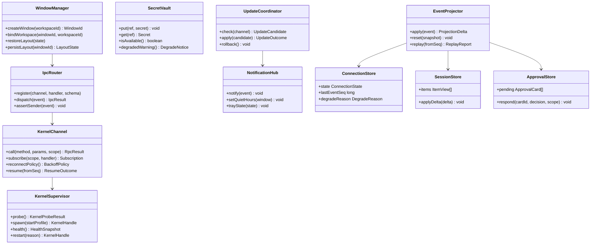

### 5.1 关键 TypeScript 契约（主/渲染共享，生成落点 `client/packages/app/src/shared/ipc/`；协议类型一律取 `@open-coding/sdk`）

```typescript
/**
 * IPC 通道清单的单一来源：主进程注册、preload 暴露、渲染进程调用三方共用。
 * 新增通道必须同时登记 manifest、运行时 schema 与契约测试（REQ-DSK-03 门禁）。
 */
export interface IpcChannelManifest {
  // 应用与生命周期
  'app.getInfo': { req: void; res: AppInfo };
  'app.requestQuit': { req: { force: boolean }; res: QuitDecision };
  'boot.report': { req: BootStageReport; res: void };
  'boot.state': { req: void; res: BootState };
  // 窗口与布局
  'window.create': { req: { workspaceId: WorkspaceId }; res: WindowId };
  'window.bindWorkspace': { req: { windowId: WindowId; workspaceId: WorkspaceId }; res: void };
  'window.saveLayout': { req: { windowId: WindowId; layout: LayoutState }; res: void };
  // 内核通道（唯一连接，按作用域串行化）
  'kernel.status': { req: void; res: ConnectionSnapshot };
  'kernel.call': { req: { method: RpcMethod; params: RpcParams; scope: RpcScope }; res: RpcResult };
  'kernel.subscribe': { req: { scope: RpcScope }; res: SubscriptionId };
  'kernel.resume': { req: { fromSeq: number }; res: ResumeOutcome };
  // 桌面专属能力
  'dialog.pickFiles': { req: PickFilesRequest; res: PickedFiles };
  'dialog.pickDirectory': { req: PickDirectoryRequest; res: PickedDirectory };
  'fs.readReference': { req: { path: string; maxBytes: number }; res: FileReference };
  'clipboard.readImage': { req: void; res: ImageReference | null };
  'notify.show': { req: NotificationRequest; res: void };
  'shortcut.bind': { req: { commandId: CommandId; keys: KeyChord }; res: ShortcutBindingResult };
  'updater.check': { req: { channel: UpdateChannel }; res: UpdateCandidate | null };
  'secrets.put': { req: { ref: string; secret: string }; res: void };
  'draft.save': { req: { sessionId: SessionId; content: DraftContent }; res: void };
  'diagnostics.export': { req: { redact: true }; res: { objectRef: string } };
  // 其余通道（tray/updater.apply/secrets.isAvailable/draft.load/shell/log 等）见 §⑨.1 完整表
}
```

```typescript
/** 主进程暴露给渲染进程的唯一入口；不暴露 Node 能力（REQ-DSK-02）。 */
export interface DesktopBridge {
  /**
   * 调用一个已登记通道。
   * @param channel 通道名（必须存在于 IpcChannelManifest）
   * @param payload 入参（按通道 schema 校验，校验失败返回 INVALID_ARGUMENT 而不进主进程）
   * @throws DesktopIpcError 主进程拒绝（PERMISSION_DENIED）、校验失败（INVALID_ARGUMENT）、内核不可达（DEPENDENCY_UNAVAILABLE）
   */
  invoke<C extends keyof IpcChannelManifest>(
    channel: C,
    payload: IpcChannelManifest[C]['req'],
  ): Promise<IpcChannelManifest[C]['res']>;

  /** 订阅主进程推送（连接状态、更新进度、托盘计数、boot 状态），返回取消函数。 */
  on<T>(topic: DesktopTopic, handler: (payload: T) => void): () => void;
}

/** 事件投影器：纯函数式，输入事件 + 当前投影，输出差量与后继投影（可重放）。 */
export interface EventProjector<S extends ProjectionState> {
  /**
   * 应用一条事件（durable 语义事件；live-only 增量走 StreamingBuffer 不走此处）。
   * @returns delta 为 null 表示「重复或窗口外事件，已忽略」；nextSeq 用于推进游标
   */
  apply(state: S, event: HarnessEvent): { delta: ProjectionDelta; nextSeq: number } | null;

  /** 用快照重建投影（断线窗口外或 attach 时使用），丢弃本地未确认增量。 */
  reset(snapshot: SessionSnapshot): S;

  /** 离线回放：验证「同一批事件 → 同一投影」（评测与回归用）。 */
  replay(events: HarnessEvent[]): ProjectionState;
}

/** 连接状态与降级原因（对应 §⑦.1 状态机）。 */
export type ConnectionState =
  | 'DISCONNECTED' | 'PROBING' | 'READY' | 'DEGRADED' | 'OFFLINE' | 'RECONNECTING';

export type DegradeReason =
  | 'KERNEL_UNREACHABLE' | 'NETWORK_OFFLINE' | 'UPDATING' | 'READ_ONLY_MODE';

/** 请求串行化作用域：不同作用域之间互不阻塞（REQ-DSK-29）。 */
export type RpcScope =
  | { kind: 'GLOBAL' }
  | { kind: 'SESSION'; sessionId: SessionId }
  | { kind: 'WORKSPACE'; workspaceId: WorkspaceId }
  | { kind: 'WORKSPACE_PATH'; workspaceId: WorkspaceId; pathDigest: string };
```

**纪律**：以上类型由 `client/packages/app/src/shared/ipc/contracts/ipc.manifest.ts` 单一来源产生（应用内部，非第四包）；生成目录禁止手改，
协议或通道变更必须重跑 `pnpm -C client --filter @open-coding/app run gen:ipc --check` 并更新 `channel-manifest.json`（门禁见 §⑪.4）；后端协议类型变更重跑 `pnpm -C client --filter @open-coding/sdk generate --check`。

**错误与异常约定（与内核同口径）**：内核与契约侧（零框架）统一抛 `HarnessException` 并携带 `ErrorCode`；外壳侧（Spring）统一抛 `BusinessException` 并携带 `ErrorCode`，由外壳全局异常处理器按码映射为统一错误响应（错误模型见附录 B §B.7）。桌面侧沿用同一错误码口径：IPC 与 `kernel.call` 的错误一律以 `DesktopIpcError.code` 承载（内核/外壳错误码原样透传，如 `INVALID_ARGUMENT` / `PERMISSION_DENIED` / `DEPENDENCY_UNAVAILABLE` / 领域码），渲染进程**只按 `code` 分支**映射用户文案与恢复动作，禁止按 message 文本判断，禁止未归类错误直出用户。

### 5.2 Pinia store 划分（每域一个投影边界）

| store | 承载 | 订阅事件族 | 说明 |
| --- | --- | --- | --- |
| `connectionStore` | 连接状态、`lastEventSeq`、降级原因 | 连接态推送 + `event` 序列水位 | 唯一可写连接态 |
| `sessionStore` | 会话元信息、条目流（消息/工具卡/推理折叠） | `agent.*`、`session.*` | 大条目引用化（`payloadRef`） |
| `approvalStore` | 待审批卡（含倒计时） | `approval.requested` / `approval.resolved` | 参数从事件载荷取，禁止二次查库 |
| `workStore` | 计划/任务/Goal/日程 | `task.*`、`goal.*`、`schedule.*` | 看板与依赖图数据源 |
| `teamStore` | 团队拓扑/泳道/消息流 | `team.*` | 成本瀑布按成员聚合 |
| `costContextStore` | 上下文九区段占用、成本与用量、缓存命中 | `context.*`、`usage.*` | 只读派生，不做本地估算 |
| `workspaceStore` / `gitStore` | 工作区连接、变更与 worktree | `workspace.*`、`git.*` | diff 视图数据源 |
| `knowledgeStore` / `memoryStore` / `extensionStore` | 检索结果与引用 chip、记忆条目、技能/插件/MCP 清单与健康 | `kb.*`、`memory.*`、`skill.*`、`plugin.*`、`mcp.*` | 引用失效率可见；面板注册在此登记 |
| `settingsStore` / `notificationStore` | 用户偏好与受管策略只读视图、通知分级与静默时段 | `config.*`、`ui.*` | 受管项标注来源层；与主进程 `NotificationHub` 双向同步 |
| `layoutStore` / `draftStore` | 标签/面板/窗口布局、各会话草稿 | 本地 + `ui.window.state.changed`、`draft.*` | 布局持久化到主进程；草稿离线可用（REQ-DSK-18） |

**规则**：组件只读 store（经 selector）；只有投影器与明确的 action 可写；跨 store 读写一律经 action，禁止组件间直接互调。

---

## ⑥ 核心流程时序图

### 6.1 冷启动 → 单实例 → 内核探测/拉起 → 首屏（REQ-DSK-04/16/28）

**前置条件**：用户双击图标；本机可能已有内核实例。
**主路径**：`app.requestSingleInstanceLock()` → 建窗与 boot 页 → 探测内核 → 建连与能力协商 → 拉取首屏数据 → 挂载工作台。
**异常与补偿**：探测超时 → 拉起 sidecar（按启动档）；握手不兼容 → 提示升级并给出版本区间；首屏数据失败 → boot 页可重试。
**幂等与并发点**：单实例锁保证只有一处执行「探测 + 拉起」；拉起带互斥（`oc:desktop:kernel:spawn`）。

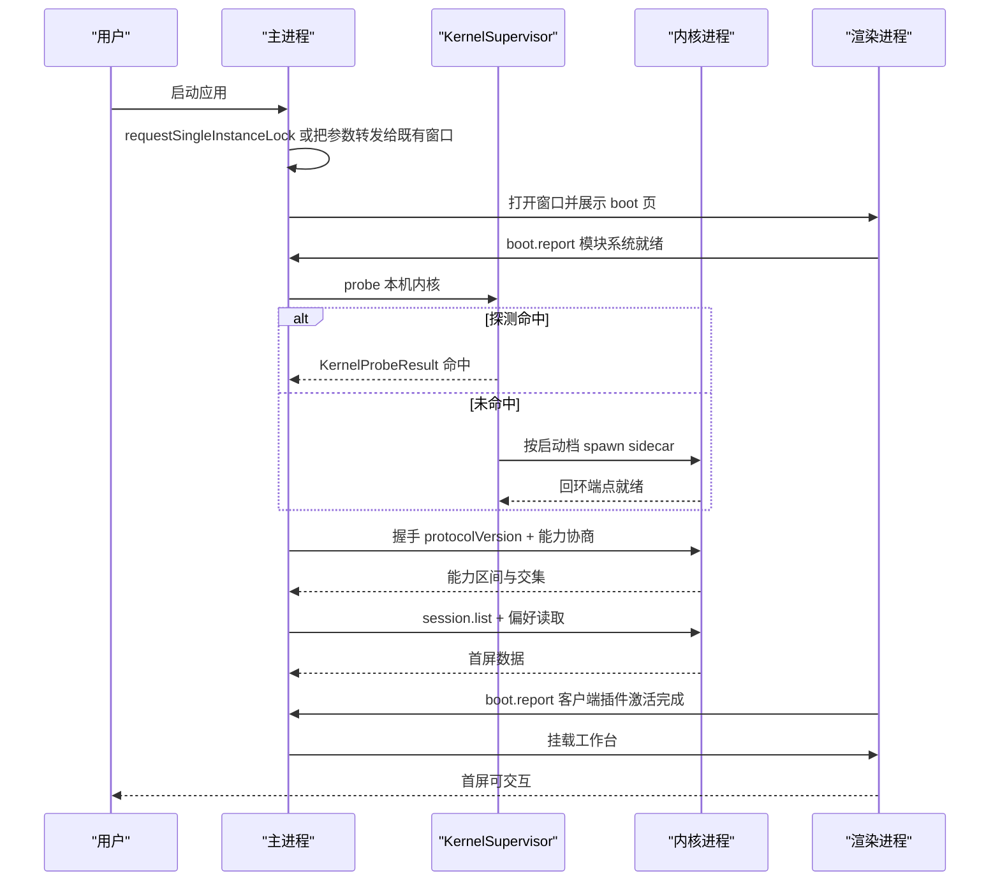

### 6.2 会话流订阅与增量渲染 + 断线重连（REQ-DSK-05/06/29）

**前置条件**：`READY` 且已 attach 目标会话。
**主路径**：durable 事件进投影器；live-only 增量进合帧缓冲；滚动区虚拟化。
**异常与补偿**：断连 → 连接态 `RECONNECTING` 并冻结增量；重连后 `resume(fromSeq)`，窗口外改为 `attach` 取快照重建。
**幂等与并发点**：按 `seq` 去重；重复事件投影返回 `null`；重连与用户操作并发时以服务端权威为准（REQ-DSK-07）。

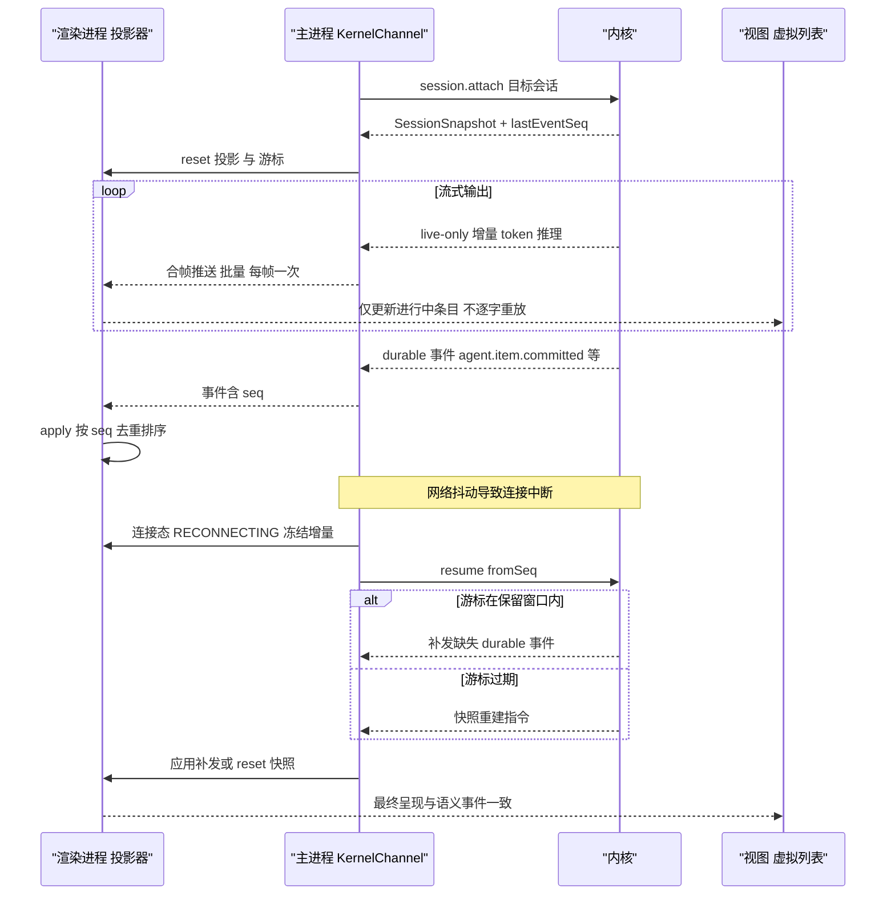

### 6.3 审批卡片全流程（REQ-DSK-09/12）

**前置条件**：内核在决策链产出 `ASK`，审批请求进入事件流。
**主路径**：事件 → 审批 store → 系统通知（若窗口不聚焦）→ 用户选择范围与决定 → `approval.respond`。
**异常与补偿**：窗口关闭 → 托盘计数保留；超时 → 内核按该请求的超时动作收口（`deny` 默认 → 呈现「已按策略拒绝」；`escalate` → 呈现「已升级至上级审批人」）并广播 `approval.resolved`；通道全断 / 应答者缺失 / 应答不合规 → 呈现「无人应答或通道不可用，已按安全默认拒绝」（`UNAVAILABLE`，**与主动拒绝分开统计**）；渲染通道不可用 → 降级为系统通知 + 托盘浮层（不静默丢失请求，也不自动批准）。
**幂等与并发点**：乐观更新标 `pending`；服务端纠正（如范围不被授权）必须可见提示并回滚卡片状态；同 actor / 同动作 / 同资源在 `impl/06` 去重窗口（30s）内合并为一张卡并标注「同动作 ×N」（展开可看每次目标资源）；卡片展示的预览与执行绑定同一 `action_digest`（`impl/06` §3.7.6 第 11 条），提交前复核不一致即拒绝执行并产安全事件；R4/R5 不提供范围 chips（仅本次批准）。

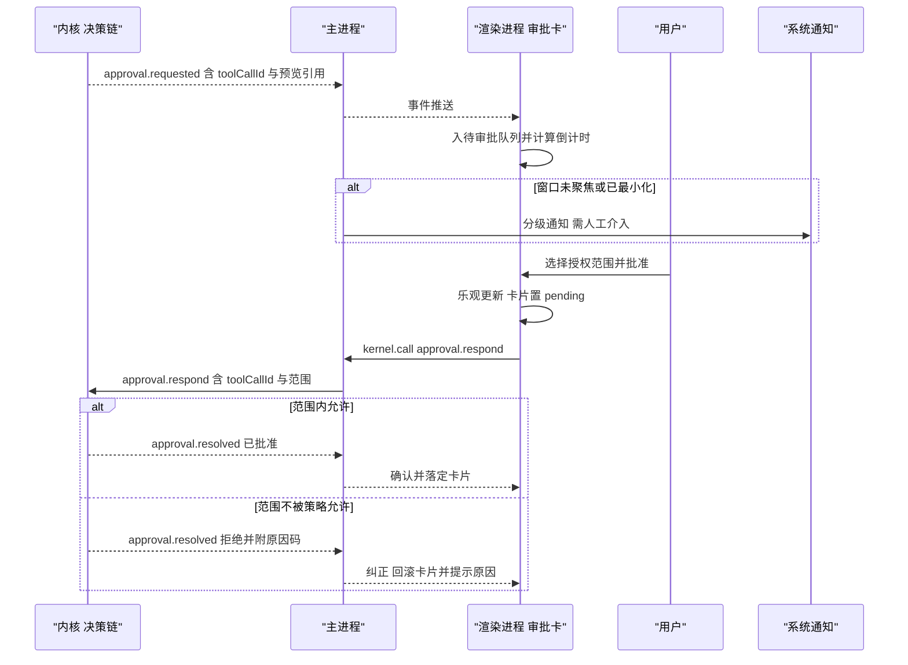

### 6.4 桌面专属能力：拖拽/截图/多窗口工作区分发（REQ-DSK-10/11/14）

**前置条件**：工作台已挂载；用户拖入文件或截取屏幕区域。
**主路径**：渲染进程取引用（不读全量字节）→ 主进程上传或建立引用 → 以 `@` 引用形式插入输入框 → 发送消息时携带引用。
**异常与补偿**：大文件 → 直接走引用上传通道；权限不足 → 明确提示并允许改用目录选择器；多窗口 → 由目标窗口的绑定工作区决定引用根。
**幂等与并发点**：同一路径重复拖入去重；并发选择器请求共享同一对话框。

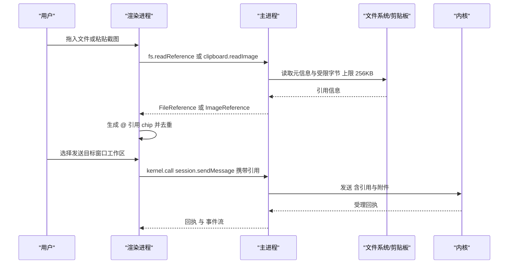

### 6.5 自动更新与强制更新窗口（REQ-DSK-21/22）

**前置条件**：应用在 `READY` 且存在更新通道配置。
**主路径**：检查通道（防降级）→ 差分下载 → 校验签名 → 安装 → 重启。
**异常与补偿**：下载中断可续；签名校验失败即丢弃候选并记录；强制更新窗口在会话运行中只提示不阻塞（除非企业策略要求）。
**幂等与并发点**：更新协调器单实例，重复检查返回进行中的同一候选。

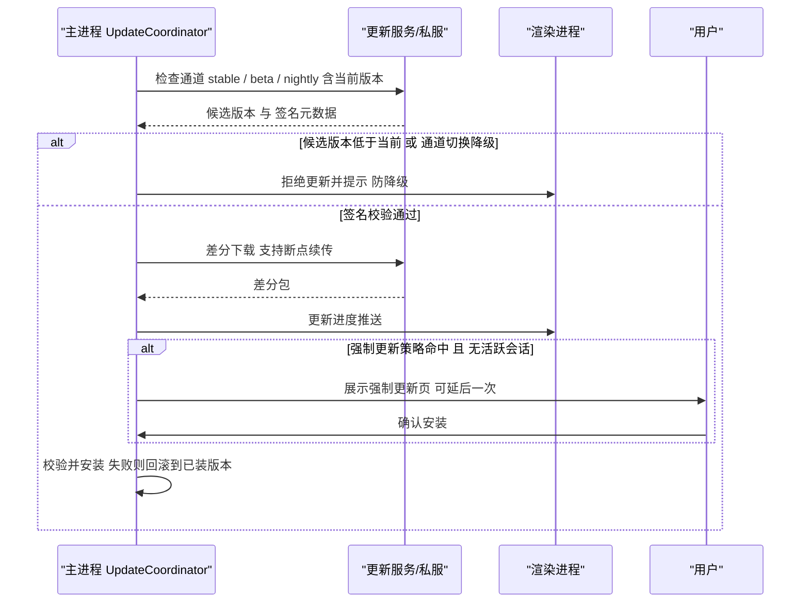

### 6.6 首屏 → 引导 → 首个任务（每步有恢复动作，R06 新增）

**前置条件**：首次安装；可能无内核、无凭证、无工作区。**主路径**：单实例锁 → 建窗与 boot 页 → 内核探测 / 拉起 → 首屏可交互 → 引导向导（5 屏合并卷 29 §4.6 的九步）→ 首个**只读**示例任务 → 完成并给「下一步建议 + 可复制命令」。
**异常与补偿**：六条失败路径各有确定的恢复动作（下表）；**首屏在无凭证 / 无内核时仍必须可达**——可交互的只读浏览 + 配置引导，绝不白屏、绝不出现「点了必然失败」的按钮（对齐 REQ-DSK-17）。

| 屏 | 覆盖卷 29 §4.6 的步骤 | 自动步骤时长（P95） | 恢复动作（必须在本屏可执行） |
| --- | --- | --- | --- |
| S1 欢迎与探测 | 环境探测（语言 / 工具链 / 容器运行时 / Git） | ≤ 2s | 探测失败不阻塞：允许手动指定（`window.*` 只读展示 + 「手动选择工具链」） |
| S2 模型来源 | 选择模型来源 + 连通性测试 | ≤ 3s | 无可用来源 → 「离线只读模式」；401/403 → 留在本屏改凭证；超时 → 备用端点或本地模型 |
| S3 凭证 | 凭证配置（引用化，值只进钥匙串） | ≤ 1s | 钥匙串不可用 → 明确警示「本次会话不持久化」+ 环境变量注入路径；渲染进程永不接触明文（REQ-DSK-19） |
| S4 工作区与权限档 | 选择工作区 + 权限模式与沙箱档建议（含解释） | 用户输入（选择器 ≤ 800ms 窗口创建） | 目录不可读 / 无权限 → 「更换目录」或「申请权限」（两条路径都要有，不只报错） |
| S5 预置与示例任务 | 导入迁移（可选）+ 预置技能插件建议 + 只读示例任务（验证闭环） | 首 token ≤ 1.5s | 导入失败 → 保留已填并可跳过（不产生半成品配置）；示例任务失败 → 一键导出脱敏诊断包 + 重试入口 |

**预算合计**：自动步骤（S1/S2/S3/S4 的选择器与 S5 的首 token）合计 **≤ 20s（P95）**；首屏可交互 **≤ 3.5s**（无会话）/ **≤ 5s**（含首屏数据，§⑩.2）；用户操作时长中位数目标 **≤ 3 分钟**（埋点 `ui.firstrun.completed`，仅观测不作门禁）。
**纪律**：每屏必须显示一行「为什么需要」（locale 键 `ui.firstrun.<screen>.why`，中文基线，键空间权威在 `30-interaction-ux-impl.md` §9.6）；**任何一屏都可跳过**，跳过即进入可用首屏并在状态栏保留「继续配置」入口；配置写入是最后一步的原子提交（跳过不产生半成品配置）。

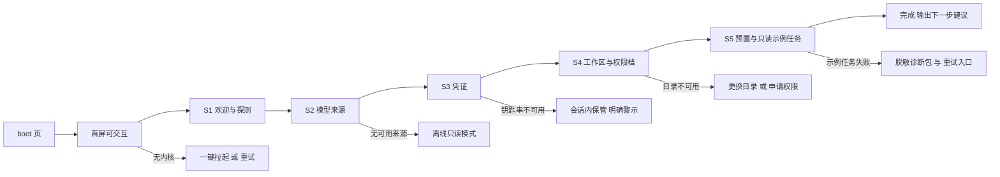

---

## ⑦ 状态机

### 7.1 连接状态机（主进程连接态 = 渲染进程 `connectionStore` 的唯一来源）

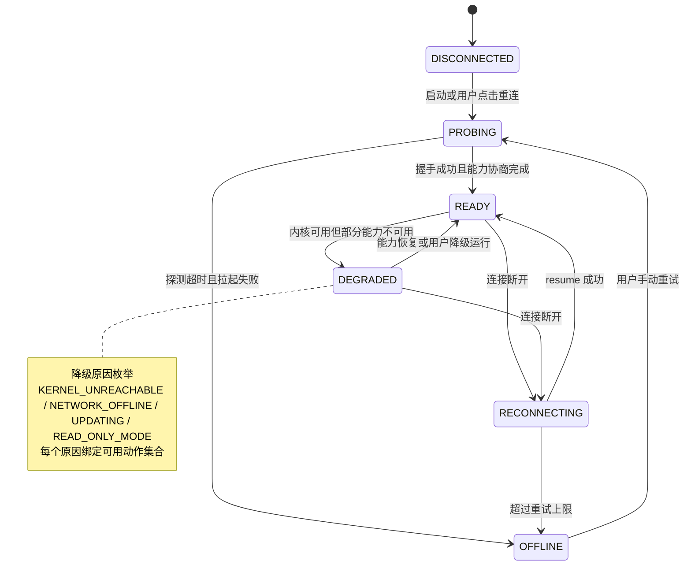

### 7.2 窗口与工作区状态机（REQ-DSK-14）

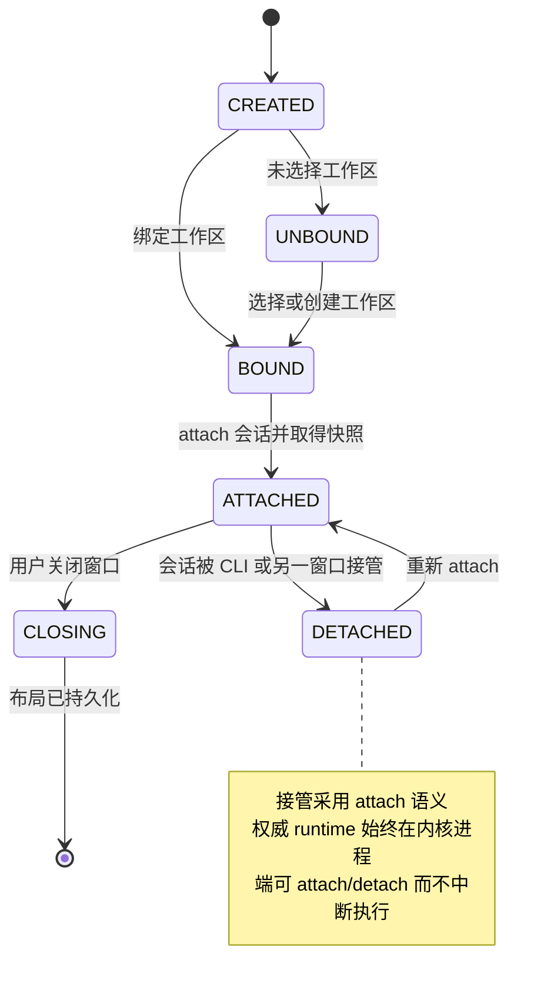

### 7.3 审批卡片状态机（REQ-DSK-09）

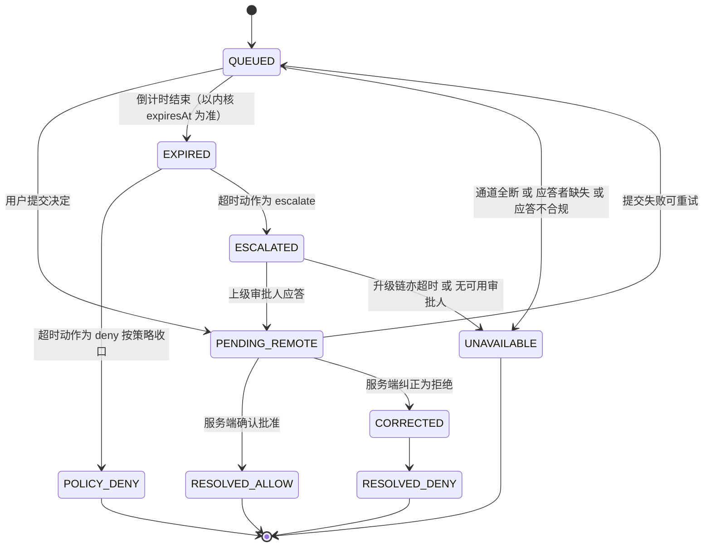

**状态纪律与迁移补全（触发 / 守卫 / 副作用；R06 对齐 `impl/06` §3.7.8）**：`QUEUED → PENDING_REMOTE`——触发：用户提交决定；守卫：`decision` 在封闭集合内（批准 / 拒绝本次 / 拒绝并终止）且范围不超过卡片声明；副作用：乐观标记「提交中」+ 幂等键（重复提交只发一次）；`PENDING_REMOTE → CORRECTED`——触发：服务端裁决与本地期望不一致（含已被其他端处理）；**语义以服务端为准**（本地一律渲染为「已由服务端裁定」并展示原因码），不得把纠正态静默当作拒绝；`QUEUED → EXPIRED`——触发：倒计时结束（**以内核下发 `expiresAt` 为准**，端上时钟只作展示，不做本地判定）；守卫：无；副作用：等待内核终态——`deny` → `POLICY_DENY`（文案「审批超时（<timeout>s 内未响应），已按策略拒绝」，**不计入用户拒绝**）；`escalate` → `ESCALATED`（卡片转等待态「已升级至上级审批人」，可继续等待）；`QUEUED → UNAVAILABLE`——触发：通道全断 / 应答者缺失 / 应答不合规；副作用：文案「无人应答或通道不可用，已按安全默认拒绝」，与主动拒绝**分开统计**（键与口径见 `30` §9.6 与 22-impl §⑤.1 `ApprovalOutcomeKind`）；`PENDING_REMOTE → QUEUED`——触发：网络失败可重试；副作用：保留用户已选范围与理由（不丢输入）。

### 7.4 六态在桌面端的落地（R06 新增；矩阵权威在 `30-interaction-ux-impl.md` §7.1）

桌面端六态由 `30` §5.2 的 `UiViewState` 判别联合承载：组件**只渲染投影产出的状态**，禁止本地推导（REQ-DSK-32 与 `30` REQ-UX-02 同一条铁律）。每个路由/面板的六态落点如下（缺格即 CI 失败，11 界面族完整清单见 `30` §7.1）：

| 界面族 | 空 | 加载 | 错误 | 权限不足 | 离线 | 超长（EDGE_DATA） |
| --- | --- | --- | --- | --- | --- | --- |
| 会话流 | 空态卡（为什么空 + 新建 + 示例任务）+ `@` 引用提示 | 骨架屏 + `agent.phase` 阶段文案；> 5s 显示「可取消」 | 错误三段式 + 复制诊断（traceId） | 权限横幅 + 申请入口（临时授权 / 联系管理员） | 输入禁用 + 连接横幅 + 重连倒计时 + 草稿保留 | 虚拟列表（`virtualizeThresholdItems`）+ 折叠分组 + 「跳到底部」 |
| 审批卡片 | 无待审批则不出现（非空态） | 参数拼装占位 ≤ 200ms 后可交互 | 关联失败 → 刷新来源按钮 | 无审批权 → 只读卡 + 原因（缺哪个权限、风险级） | 决策不可提交（保留已选范围与理由） | diff > 2000 行 → hunk 折叠 + 仅显示变更区 |
| 工具卡 | 占位行 | 运行中脉冲 + 耗时 | 错误卡 + 重试 + 修复建议 | 灰卡 + 权限说明 | 「离线暂缓」标记 | 摘要 + 外置引用展开 |
| 任务与计划 | 创建 CTA | 计划生成进度 | 根因 + 重跑 | 归属说明 | 看板只读 + 同步标记 | DAG > 200 节点 → 分层折叠 |
| 成本看板 | 引导开启计量 | ≤ 500ms 骨架 | 重试 + 上次快照 | 无 `cost.read` → 金额屏蔽 + 申请 | 上次缓存 + 「数据滞后」徽标 | 自动降采样 + 说明 |
| Registry 与导入 | 引导（内置 / 私仓 / 市场） | 同步进度条 | 校验失败清单 + 修复指引 | 私仓未授权 → 配置引导 | 本地缓存索引 + 断点说明 | 分页 + 过滤记忆 |
| 设置与偏好 | 默认值即内容 | 骨架 | 保留旧值 + 提示 | 企业锁 → 只读 + 来源展示 | 本地可改、同步延后（标注） | 搜索 + 分组 |
| 向导 | 跳过 / 开始 | 步骤加载 | 保留已填 + 重试 | 跳过项说明 | 本地步骤可用 | 抽样预览 + 后台全量 |
| 分享视图 | 无内容可分享 | 首屏 ≤ 800ms | 重试 + 链接状态 | 令牌无效 / 过期 → 单页提示 | 静态呈现 | 分页 + 目录导航 |
| 自动化模板库（R06 新增） | 无模板 → 导入 / 浏览内置 | 装载与干跑进度 | 装载被拒 → 字段级原因 + 重试 | 无 `automation.manage` → 只读 + 申请 | 缓存目录 + 离线镜像标记 | 分页 + 过滤 |
| 智能增强（R06 新增） | 无运行 → 选择能力 | 进度（阶段 + 当前成本） | 门禁拦截报告 + 原因 | 能力禁用 → 隐藏入口 + 说明 | 进度停留 + 恢复补发 | 分级折叠（高严重度置顶） |

---

## ⑧ 数据模型

### 8.1 表（`oc_*`，桌面侧只声明「设备与偏好」域，业务事实仍在内核域表）

**字段类型约定（全表适用）**：`device_id`/`window_id`/`session_id`/`user_id`/`link_id`/`export_id` 为 `text`（`link_id`/`export_id` 为 uuid）；`platform`/`channel`/`theme`/`scope`/`redaction_policy` 一律 `text` 存 `code`；时间为 `timestamptz`；`layout`/`bounds`/`tab_order`/`notify_policy`/`keybindings`/`attachments` 为 `jsonb`（布局含 Schema 版本号，跨版本不兼容时重置为默认并提示）；`token_hash` 为 `char(64)`；`size_bytes` 为 `bigint`。

| 表 | 关键字段 | 索引与约束 |
| --- | --- | --- |
| `oc_ui_device` | `device_id`、`tenant_id`、`user_id`、`platform`、`channel`、`app_version`、`os_locale`、`ui_locale`、`keys_ref`（钥匙串引用，非明文）、`last_seen_at`、`revoked_at` | `uk(device_id)`；`(tenant_id, user_id, revoked_at)` |
| `oc_ui_preference` | `user_id`、`tenant_id`、`theme`、`scale`、`reduce_motion`、`notify_policy jsonb`、`keybindings jsonb`、`updated_at` | `uk(tenant_id, user_id)` |
| `oc_ui_layout_state` | `window_id`、`user_id`、`workspace_id`、`layout jsonb`、`bounds jsonb`、`tab_order jsonb`、`updated_at` | `uk(user_id, window_id)`；`(user_id, updated_at desc)` |
| `oc_ui_draft` | `draft_id`、`session_id`、`user_id`、`device_id`、`content_ref`（对象存储或小文本内联）、`attachments jsonb`、`updated_at` | `uk(session_id, user_id)`；保留窗口 30 天 |
| `oc_ui_share_link` | `link_id`、`session_id`、`token_hash`、`expires_at`、`password_hash`、`scope`（READ_ONLY / READ_ONLY_APPROVE）、`revoked_at`、`created_by` | `uk(link_id)`；`uk(token_hash)`；`(session_id, revoked_at)` |
| `oc_ui_diagnostics_export` | `export_id`、`device_id`、`object_ref`、`redaction_policy`、`size_bytes`、`created_at` | `(device_id, created_at desc)` |

**约束**：桌面端**不得**写入任何业务事实表（会话/任务/事件）；上表由外壳（Spring）维护并受企业受管策略约束（如企业可禁共享链接）。

### 8.2 Redis Key（统一 `RedisKeys` 工厂）

| 语义 | Key 形态 | TTL |
| --- | --- | --- |
| 设备在线心跳 | `RedisKeys.uiPresence(deviceId)` → `oc:ui:presence:{device}` | 90s（过期视为离线） |
| 内核拉起互斥 | `RedisKeys.desktopKernelSpawn(hostId)` → `oc:ui:kernel:spawn:{host}` | 租约 30s |
| 分享链接令牌 | `RedisKeys.uiShareToken(tokenHash)` → `oc:ui:share:{hash}` | 随链接有效期（≤ 7 天） |
| 更新候选去重 | `RedisKeys.desktopUpdateCandidate(channel)` → `oc:ui:update:{channel}` | 1h |

### 8.3 事件与指标

**事件**（卷 22 §6 清单 + 本文件新增 6 条）：`ui.view.opened`、`ui.command.invoked`、`ui.approval.responded`、`ui.error.surfaced`、`ui.follow.readonly.joined`；
**新增** `ui.window.state.changed`（布局持久化与绑定点）、`ui.channel.degraded`（降级原因与恢复动作）、`ui.draft.protected`（草稿保全）、
`ui.update.blocked`（防降级或签名校验拒绝）、`ui.shortcut.conflict`（键位冲突与生效者）、`ui.render.stall`（帧率跌破阈值与条目规模）。

**指标**：`oc_ui_frame_drop_ratio`、`oc_ui_render_latency_ms`、`oc_ui_reconnect_total`、`oc_ui_command_latency_ms`、`oc_ui_stream_stall_total`；
**新增** `oc_ui_cold_start_ms`（分阶段：进程 → 窗口 → 首屏可交互）、`oc_ui_memory_bytes{process}`、`oc_ui_ipc_latency_ms{channel}`、
`oc_ui_event_to_paint_ms`、`oc_ui_update_download_bytes`、`oc_ui_a11y_violation_total{rule}`（仅开发与内测期采集，默认不上报）。

---

## ⑨ 接口与扩展点

### 9.1 主 ↔ 渲染 IPC 通道表（完整；通道名与 `IpcChannelManifest` 一一对应）

| # | 通道 | 方向 | 入参 | 出参 | 错误语义 |
| --- | --- | --- | --- | --- | --- |
| 1 | `app.getInfo` | R→M | 无 | `AppInfo{version, channel, buildId, osLocale, uiLocale}` | `INTERNAL_ERROR` |
| 2 | `app.requestQuit` | R→M | `{force}` | `QuitDecision{allowed, blockingSessions[]}` | `CONFLICT`（有活跃会话且未确认） |
| 3 | `boot.report` | R→M | `BootStageReport{stage, ok, detail?}` | 无 | — |
| 4 | `boot.state` | R→M | 无 | `BootState{stages[], failedBundle?}` | — |
| 5 | `window.create` | R→M | `{workspaceId}` | `WindowId` | `INVALID_ARGUMENT`、`RESOURCE_EXHAUSTED`（超窗口上限） |
| 6 | `window.list` | R→M | 无 | `WindowSummary[]` | — |
| 7 | `window.bindWorkspace` | R→M | `{windowId, workspaceId}` | 无 | `NOT_FOUND`、`CONFLICT`（已被其他窗口独占写） |
| 8 | `window.saveLayout` | R→M | `{windowId, layout}` | 无 | `INVALID_ARGUMENT` |
| 9 | `kernel.status` | R→M | 无 | `ConnectionSnapshot{state, lastEventSeq, degradeReason?}` | — |
| 10 | `kernel.call` | R→M | `{method, params, scope}` | `RpcResult` | `INVALID_ARGUMENT`、`DEPENDENCY_UNAVAILABLE`、`PERMISSION_DENIED`、`RATE_LIMITED` |
| 11 | `kernel.subscribe` | R→M | `{scope}` | `SubscriptionId` | `INVALID_ARGUMENT` |
| 12 | `kernel.resume` | R→M | `{fromSeq}` | `ResumeOutcome{replayed, snapshotRequired}` | `NOT_FOUND`、`DEPENDENCY_UNAVAILABLE` |
| 13 | `dialog.pickFiles` | R→M | `PickFilesRequest{filters, multi, windowId}` | `PickedFiles{paths[]}` | `PERMISSION_DENIED`（无桌面门户）、`CANCELLED`（返回空集合而非异常） |
| 14 | `dialog.pickDirectory` | R→M | `PickDirectoryRequest{windowId}` | `PickedDirectory{path?}` | 同上；无原生对话框时返回 `DEGRADED_MODE` 标记由渲染进程切 browse |
| 15 | `fs.readReference` | R→M | `{grantRef, path, maxBytes}` | `FileReference{path, size, digest, preview}` | `WORKSPACE_PATH_DENIED`（路径不在授权票据内 / 票据过期或跨窗口复用 / 命中 A0 敏感路径拒绝清单）、`TOOL_OUTPUT_TOO_LARGE` |
| 16 | `clipboard.readImage` | R→M | 无 | `ImageReference \| null` | — |
| 17 | `notify.show` | R→M | `NotificationRequest{level, titleKey, bodyKeys, actionCommandId}` | 无 | 静默时段内返回 no-op 且不报错 |
| 18 | `tray.update` | R→M | `TrayState{runningCount, pendingApprovals, progress}` | 无 | — |
| 19 | `shortcut.bind` | R→M | `{commandId, keys}` | `ShortcutBindingResult{bound, conflictWith?}` | `CONFLICT`（键位被占用，返回占用者） |
| 20 | `updater.check` | R→M | `{channel}` | `UpdateCandidate \| null` | `DEPENDENCY_UNAVAILABLE`、`UPDATE_PRECHECK_FAILED` |
| 21 | `updater.apply` | R→M | `{candidateId}` | `UpdateOutcome{state, note}` | `UPDATE_SIGNATURE_INVALID`、`UPDATE_ROLLED_BACK` |
| 22 | `secrets.put` | R→M | `{ref, secret}` | 无 | `DEPENDENCY_UNAVAILABLE`（钥匙串不可用 → 降级为会话内保管并返回标记）、`INVALID_ARGUMENT`（`ref` 不在 `ui:` 客户端命名空间内） |
| 23 | `secrets.isAvailable` | R→M | 无 | `Availability{available, backend, degradeNotice?}` | — |
| 24 | `draft.save` / `draft.load` | R→M | `{sessionId, content}` / `{sessionId}` | 无 / `DraftContent \| null` | `INVALID_ARGUMENT` |
| 25 | `diagnostics.export` | R→M | `{redact: true}` | `{objectRef}` | `PERMISSION_DENIED`（企业禁用导出） |
| 26 | `shell.openExternal` | R→M | `{url}` | 无 | `PERMISSION_DENIED`（协议不在 `http/https/mailto` 白名单，或主进程确认未完成） |
| 27 | `log.write` | R→M | `{level, event, fields}` | 无 | 字段白名单之外的键被丢弃（脱敏） |

**通道纪律（R04 安全轮新增，均为「控制缺失即视为缺陷」）**：

- **`fs.readReference` 走能力票据而非裸路径**：路径来源必须是主进程建档的**一次性授权票据**（`dialog.pickFiles` / `dialog.pickDirectory` / 拖拽建档时签发，绑定 `windowId` + `realpath` 后的路径 + 有效期 + 单次使用）；渲染进程传入票据之外或未在票据中的路径一律 `WORKSPACE_PATH_DENIED`；**敏感路径拒绝清单**（`.env*`、私钥、凭据库、`~/.ssh/*`、云凭证目录，与卷 07 `SECRET_FILES`、卷 27 A0 资产同源）**即使票据命中根目录也拒绝**并记审计（防「渲染进程被注入脚本后成为任意文件读取通道」）。
- **`shell.openExternal` 由主进程裁决**：`confirmed` 由**主进程**在原生确认弹窗后置位，**不接受渲染进程传入的确认标记**（原字段语义废止，避免被冒充为「已确认」而绕过）；协议白名单 `http/https/mailto` 之外（`file:` / `smb:` / `javascript:` / 自定义 scheme）一律拒绝；外链不在弹窗内展示完整 URL 时不得放行。
- **`secrets.put` 命名空间收口**：`ref` 必须落在 `ui:` 客户端命名空间（如 `ui:byok:provider`），主进程校验前缀并拒绝其他命名空间；**不存在 `secrets.get` 通道且禁止新增**（接口面断言，契约测试守住）——渲染进程只写不读，令牌仅由主进程注入内核。
- **`oc://` 深链白名单**：深链参数只允许「打开会话 / 定位工作区 / 打开设置页」三类**只读导航**动作；**任何状态变更动作（审批批准或拒绝、更新安装、诊断导出、分享链接生成、凭据写入）不得由深链触发**，必须由用户在窗口内显式操作（防「一键钓鱼批准」）；未知/超长/非法参数直接忽略并记 `ui.deeplink.rejected`。

**主进程 → 渲染进程推送 topic**：`boot.state`、`connection.changed`、`event.batch`（durable 事件批量）、`stream.delta`（live-only 合帧）、
`approval.requested`、`tray.changed`、`update.progress`、`shortcut.conflict`、`degrade.changed`。

### 9.2 会话协议方法（渲染进程经 `kernel.call` 使用的子集）

| 方法 | 关键入参 | 出参 | 错误码 |
| --- | --- | --- | --- |
| `session.list` / `session.get` / `session.attach` / `session.resume` | `cursor?`、`filter?` / `sessionId` / `fromSeq` | 分页列表 / 详情 / `SessionSnapshot{lastEventSeq, ...}` | `NOT_FOUND`、`CONFLICT` |
| `session.sendMessage` / `session.steer` / `session.interrupt` | `blocks`、`attachments?`、`budgetOverride?` / `text` / `mode` | `SubmitAck` / `TurnOutcome` | `RATE_LIMITED`、`INVALID_ARGUMENT`、`CONFLICT` |
| `approval.list` / `approval.respond` / `permission.explain` | `state?` / `{approvalId, decision, scope, reason?}` / `decisionId` | 列表 / `ApprovalResolution` / 解释（原因码 + 文案 + 策略引用） | `APPROVAL_TIMEOUT`、`PERMISSION_DENIED`、`NOT_FOUND` |
| `context.get` / `cost.get` / `diagnostics.get` | `sessionId` 或无参 | 九区段占用 / 用量与成本 / 装配与能力摘要 | `NOT_FOUND` |
| `plan.get` / `task.list` / `team.list` | `sessionId` 等 | 计划 / 任务 / 团队视图数据 | `NOT_FOUND` |
| `kb.search` / `memory.list` | `query` / `scope` | 检索结果 / 记忆条目 | `NOT_FOUND` |
| `git.diff` / `git.status` | `workspaceId`、`path?` | diff / 状态 | `GIT_CONFLICT` |

**错误矩阵（IPC 通道与 `kernel.call` 共用；错误一律以 `code` 承载，渲染进程只按 `code` 分支）**：

| 错误码 | 触发场景 | retryable | 面向用户的恢复动作 |
| --- | --- | --- | --- |
| `INVALID_ARGUMENT` | 通道入参 schema 校验失败（不进主进程）、未知枚举 code | 否 | 修正操作重试；开发期即暴露（契约测试门禁） |
| `NOT_FOUND` | 会话 / 工作区 / 窗口 / 审批项不存在 | 否 | 刷新列表后重试 |
| `CONFLICT` | 窗口工作区独占写冲突、`requestQuit` 有活跃会话、审批已被其他端处理 | 否 | 按提示选择接管或等待；卡片转只读 |
| `PERMISSION_DENIED` | 无桌面门户 / 企业禁用导出 / 外链未确认 | 否 | 走企业策略或改用原生能力（无门户时返回 `DEGRADED_MODE`） |
| `DEPENDENCY_UNAVAILABLE` | 内核不可达、事件流断连、更新服务不可用 | 是 | 自动退避重连（`OFFLINE` 态保留只读缓存与草稿）；更新候选丢弃并提示 |
| `RATE_LIMITED` | `kernel.call` 频次超限、更新检查节流 | 是（带 `Retry-After`） | 等待窗口后重试（UI 显示排队态） |
| `UPDATE_SIGNATURE_INVALID` / `UPDATE_PRECHECK_FAILED` | 更新签名不符 / 防降级预检失败 | 否 | 丢弃候选并记录 `ui.update.blocked`（**禁止**绕过签名） |
| `RESOURCE_EXHAUSTED` | 超窗口上限（多窗口工作区） | 否 | 关闭闲置窗口后重试 |
| `CANCELLED` | 原生对话框被用户取消 | 否 | 返回空集合而非异常（无错误弹窗） |

### 9.3 桌面相关管理面 REST（沿用附录 B §B.9 约定：cursor 分页、`Idempotency-Key`、ISO-8601）

| 端点 | 方法 | 说明 | 权限点 |
| --- | --- | --- | --- |
| `/api/v1/desktop/preferences` | GET/PUT | 用户 UI 偏好同步 | `*`（自有） |
| `/api/v1/desktop/devices` | GET + `POST revoke` | 设备列表与吊销 | `*`（自有）/ `member.manage` |
| `/api/v1/desktop/drafts/{sessionId}` | GET/PUT | 跨端草稿同步 | `*`（自有） |
| `/api/v1/share-links` | CRUD | 只读跟随链接 | `session.share` |
| `/api/v1/updates/check` / `apply` / `rollback` | POST | 更新三操作（沿用卷 28） | `system.update` |
| `/api/v1/updates/channels` | GET/PUT | 通道与策略 | `system.update` |
| `/api/v1/diagnostics` | GET + `export` | 诊断包（强制脱敏） | `diagnostics.read` |
| `/api/v1/notifications` / `routes` | GET/PUT | 通知聚合与路由 | `notification.manage` |

### 9.4 配置项（`open-coding.desktop.*`，`DesktopProperties`；纯数据类不加 `@Component`，由 `@ConfigurationPropertiesScan` 激活）

| 字段 | 说明（默认值、必填性、影响面） | 环境变量 |
| --- | --- | --- |
| `channel` | 更新通道（`stable` 默认 / `beta` / `nightly`，取值经卷 28 `UpdateChannel.of()` 解析，未知值**拒绝且不回落**；企业可指向私服并钉扎候选集） | `DESKTOP_CHANNEL` |
| `autoUpdate` | 自动更新开关（默认 true；企业可强制 false） | `DESKTOP_AUTO_UPDATE` |
| `mandatoryPolicy` | 强制更新策略（默认 `PROMPT_AND_DEFER_ONCE`；企业可 `FORCE_ON_IDLE`） | `DESKTOP_MANDATORY_POLICY` |
| `kernel.probeTimeoutMs` | 本机内核探测超时（默认 1500） | `DESKTOP_KERNEL_PROBE_MS` |
| `kernel.spawnProfile` | 未探测到内核时的启动档（默认 `local`） | `DESKTOP_KERNEL_PROFILE` |
| `kernel.healthIntervalSeconds` | 健康检查间隔（默认 15） | `DESKTOP_KERNEL_HEALTH_S` |
| `reconnect.backoffBaseMs` / `reconnect.backoffMaxMs` | 重连退避（默认 500 / 30000） | `DESKTOP_RECONNECT_BASE_MS`、`DESKTOP_RECONNECT_MAX_MS` |
| `window.maxCount` | 窗口数上限（默认 8，防资源耗尽） | `DESKTOP_MAX_WINDOWS` |
| `ipc.maxPayloadBytes` | 单次 IPC 载荷上限（默认 262144，超限强制走引用通道） | `DESKTOP_IPC_MAX_PAYLOAD` |
| `stream.frameBudgetMs` | 流式合帧预算（默认 16，即一帧） | `DESKTOP_STREAM_FRAME_MS` |
| `notify.quietHours` | 静默时段（默认 `22:00-08:00`，可关） | `DESKTOP_QUIET_HOURS` |
| `draft.retentionDays` | 草稿保留（默认 30） | `DESKTOP_DRAFT_RETENTION_D` |
| `telemetry.consent` | 遥测同意档（默认 `OFF`，不得随包默认开启） | `DESKTOP_TELEMETRY_CONSENT` |
| `ui.locale` / `ui.fallbackLocale` | 界面语言与回退（默认跟随 shell，回退 `zh-CN`） | `DESKTOP_UI_LOCALE`、`DESKTOP_UI_FALLBACK_LOCALE` |

**模板同步**：新增变量必须同步 `.env.example`；`DesktopProperties` 每个字段带 JavaDoc（用途/默认值/影响范围）。
**桌面侧只读项**：受管策略（卷 24）由内核下发，桌面端不得本地覆盖（危险权限模式禁止由本地/项目设置自举）。

### 9.5 扩展点与组件库装配

| 扩展点 | 桌面侧义务 |
| --- | --- |
| `UiPanelSPI` | 面板以受控容器渲染（独立 iframe/渲染上下文），声明显式能力需求；越权调用拒绝并审计 |
| `UiCommandSPI` | 命令注册进命令面板，与 CLI 同名；键位冲突走 `shortcut.bind` 的统一冲突检测 |
| `UiRendererSPI` | 会话内联卡片的受控渲染协议（结构化数据 + 白名单组件集，禁止任意脚本） |
| `ThemeProviderSPI` | 主题令牌注入点（颜色/字号/圆角/密度），必须过对比度校验 |
| `NotificationChannelSPI` | 桌面只实现「系统通知 + 托盘」，外通道（邮件/IM/Webhook）由卷 15 侧提供 |

**组件库装配**：默认 Naive UI（Vue 3 原生、主题能力强）；Element Plus 为备选（团队熟悉度优先）。
无论选型，`client/packages/ui` 必须收敛为**唯一入口**（禁止业务代码直接 import 组件库），以便后续替换不影响业务层。

---

## ⑩ 非功能与工程细节

### 10.1 并发模型

- **主进程**：单线程事件循环，一切阻塞操作（文件读写、更新下载、诊断打包）下沉到 `utilityProcess`/Worker；主进程不做 CPU 密集任务。
- **渲染进程**：投影器与虚拟列表在同一线程但按帧预算切分（`frameBudgetMs`）；大面积 diff 解析放 Web Worker。
- **连接复用**：唯一 `KernelChannel`，按 `RpcScope` 分区串行化（REQ-DSK-29）；订阅按作用域去重（同窗口同会话只订一次）。**保活与连接上限不自定义**：推送面参数引用卷 16 §⑨.3 `stream.*`（默认心跳 15s、单实例 500 连接）；桌面端只维护本地连接状态机（§7.1）与本机探测超时（`kernel.probeTimeoutMs`，默认 1500ms），**三套参数（推送保活 / 连接状态判定 / 内核探测）语义不同，不得互相套用**。
- **背压**：事件批量推送有上限（默认 500 条/批、2MB/批），超限转「分批 + 拉取」模式；渲染侧队列超过阈值时丢弃 live-only 增量并请求权威重绘（durable 事件永不丢）。

### 10.2 性能预算（门禁数字）

| 项 | 预算 | 说明 |
| --- | --- | --- |
| 冷启动 → 首屏可交互 | ≤ 3.5s（P95，SSD，无会话）；≤ 5s（P95，含首屏数据） | 分阶段埋点：进程 → 窗口 → boot → 挂载 |
| 窗口创建 | ≤ 800ms | 含 preload 与渲染进程启动 |
| 引导自动步骤合计（R06 新增） | ≤ 20s（P95） | §6.6 五屏；每屏自动部分（探测 / 连通性 / 凭证写入 / 选择器）独立计时；用户操作时长中位数 ≤ 3 分钟仅观测；失败恢复只重跑当前屏（不重跑已完成屏） |
| 事件到界面 | ≤ 200ms（P95） | durable 事件入 store 到 paint |
| 流式滚动帧率 | ≥ 55fps @ 2000 行 | 低于则触发 `ui.render.stall` |
| 常驻内存 | ≤ 350MB（空闲，主 + 渲染合计） | 与卷 22 §7 一致；超限触发 H-015 回退评估 |
| 长会话内存增长 | 4 小时连续会话 ≤ 10% | 虚拟列表 + 条目引用化 |
| IPC 往返 / 更新包 | IPC ≤ 15ms（P95，本地）；载荷 > 256KB 走引用通道；差分包 ≤ 30MB | 超限提示完整包选项 |

### 10.3 容量与缓存

- 会话条目本地仅保留**渲染窗口内**的视图对象（其余按需从内核拉取，内核为唯一事实源）。
- 目录树/文件引用缓存按工作区隔离（上限 20MB，LRU 淘汰，不缓存文件内容）；事件补发窗口外的会话不落本地副本——**桌面端不做离线事实副本**。

**容量估算（单设备 / 单用户默认）**：常驻内存 ≤ 350MB（REQ-DSK-20；主进程 ≈ 120MB + 每窗口渲染 ≈ 60MB × ≤ 4 窗口 + 共享 ≈ 60MB）；多窗口上限默认 4（`resident-window-max`，超限 `RESOURCE_EXHAUSTED`）；**推送连接占用**：单设备 ≤ 4 窗口且订阅按作用域去重 ⇒ 典型 4–8 条连接，受卷 16 §⑨.3 `stream.maxConnectionsPerInstance`（默认 500/实例）总闸约束（**桌面端不申请额外配额**）；IPC 通道 32 条、单通道载荷 ≤ 1MB（大对象一律引用化，`fs.readReference` 上限走 `maxBytes` 校验）；事件批量帧 ≤ 500 条/批或 200ms 刷窗（先到者为准）⇒ 稳态 CPU ≤ 5%（空闲）；本地只读缓存 ≤ 512MB（超限 LRU 淘汰）；诊断包 ≤ 200MB（脱敏白名单后）。

### 10.4 失败与降级

| 失败 | 用户可见行为 | 自动动作 |
| --- | --- | --- |
| 内核不可达 | 横幅「内核未运行」+ 一键拉起/重试 | 退避重连；`OFFLINE` 态仍可看本地草稿与只读缓存 |
| 事件流断连 | 状态栏转黄 + 进行中条目冻结 | `resume(fromSeq)`；窗口外自动 `attach` 重建 |
| 钥匙串不可用 | 明确警示「本次会话不持久化令牌」 | 降级为内存保管，退出即失效 |
| 更新签名失败 | 提示更新被拒绝并给出详情入口 | 丢弃候选并记录 `ui.update.blocked` |
| 客户端插件激活失败 | boot 页列出失败项与详情复制按钮 | 继续挂载其余插件（不白屏） |
| 渲染进程崩溃 | 窗口自动重建并恢复布局与草稿 | 上报 `ui.error.surfaced`（脱敏） |
| 首次运行无凭证 / 无内核（R06 新增） | 首屏仍可达：可交互的只读浏览 + 配置引导；示例任务置灰并说明「需先配置模型」 | 保留已填内容；内核可用时自动进入一键拉起路径（不重复引导） |
| 引导中途退出 / 跳过（R06 新增） | 状态栏保留「继续配置」入口，不出现半成品配置 | 配置原子提交（未完成不落盘），重进引导从断点屏续接 |
| 审批倒计时结束 / 通道不可用（R06 新增） | 三终态呈现分离：按策略拒绝 / 已升级至上级审批人 / 无人应答（`UNAVAILABLE`） | 等内核终态，端上不本地判定；统计口径分离（见 §7.3） |
| 自动化运行 / 增强运行取消（R06 新增） | 提示「已请求取消，将在安全点停止」+ 已发布产物保留 | 取消在安全点生效；未产出时给「重跑」入口；不吞掉已产生的证据 |

**降级阶梯（由轻到重，任一级触发即写 `ui.channel.degraded` 并在状态栏可见）**：① **帧率降级**——`oc_ui_frame_drop_ratio` 超阈 → 降低批量帧频率 + 折叠动画（保留业务可用性）；② **通道降级**——本地门户不可用（无原生对话框 / 剪贴板受限）→ `DEGRADED_MODE` 标记 + 渲染进程切纯 Web 能力路径；③ **连接降级**——内核不可达 / 事件流断连 → `OFFLINE`（只读缓存 + 草稿保护，**不自动执行**）+ 一键拉起/重试；④ **凭据降级**——钥匙串不可用 → 内存保管（明确警示「本次会话不持久化令牌」），退出即失效；⑤ **插件降级**——客户端插件激活失败 → boot 页列出失败项并继续挂载其余插件（不白屏）；⑥ **更新收口**——签名失败 / 防降级预检失败 → 丢弃候选并提示（**禁止**绕过签名安装）。

### 10.5 安全

- **进程边界**：`contextIsolation` + `sandbox` + `nodeIntegration=false`；preload 只暴露清单通道；CSP 禁 `unsafe-eval`，外链资源默认拒绝。
- **IPC 校验**：`IpcRouter.assertSender` 校验 `event.senderFrame` 与窗口白名单；参数按 schema 校验，非法即 `INVALID_ARGUMENT`（不进主进程）。
- **凭据**：令牌只存钥匙串；渲染进程仅持有短期会话引用；日志与诊断包按字段白名单脱敏（禁止提示词全文、文件内容、令牌）。
- **越权**：桌面端不自行判断权限；所有敏感动作经内核决策链。面板越权调用走同一门禁并留痕。
- **外链与下载**：`shell.openExternal` 由**主进程**原生确认 + 协议白名单（`http/https/mailto`）；下载产物强制签名校验（更新）或引用化（附件）。
- **内核端点身份（防端口抢注 / 假内核）**：主进程连接本机内核必须完成**双向令牌握手**——读 `0600` 令牌文件（`27-security-runtime-impl.md` §4.2 边界 B2）作为客户端凭据，同时要求内核证明其持有同一令牌（挑战-应答或首帧签名），握手失败即断开并提示「疑似本机伪造内核」；令牌只驻留主进程内存，**渲染进程永不接触**（`secrets.get` 通道不存在），随进程退出失效。
- **深链与 IPC 白名单（R04 新增）**：`oc://` 深链只做只读导航（见 §⑨.1 通道纪律），状态变更动作一律要求窗口内显式操作；IPC 通道以清单为唯一来源，清单外通道在 preload 与主进程两侧都不可达（生成期差集门禁）。
- **分享链接（只读跟随端）**：默认 `scope=READ_ONLY`；`READ_ONLY_APPROVE` 必须由持有者显式开启且审批范围受**风险等级上限**约束（R3+ 高危动作不得由跟随端批准，只能由宿主端批准），每次批准记录 `linkId + decided_by` 并入审计；链接泄漏按「撤销链接 → 吊销令牌 → 复核该窗口内审批」处置（`uk(token_hash)` 撤销即时生效，`RedisKeys.uiShareToken` 缓存同步失效）。

### 10.6 可观测

- **指标**：§8.3 清单；`oc_ui_*` 前缀，默认只在本机聚合视图暴露，上报需三级同意。
- **日志**：结构化 JSON，字段固定（`traceId`、`sessionId?`、`channel`、`durationMs`、`outcome`）；中文文案；异常必带堆栈。
- **追踪**：桌面侧生成 `traceId` 随 `kernel.call` 透传，形成「桌面动作 → 内核 → 工具 → 模型」端到端 span 链。

### 10.7 无障碍与本地化落地细则（REQ-DSK-23/24）

| 项 | 落地要求 |
| --- | --- |
| 键盘 | 全部交互可达；焦点顺序确定；无键盘陷阱；命令面板覆盖全部命令 |
| 读屏 | 流式状态用 `aria-live=polite` 通报**阶段**而非逐字；审批卡有可读名称与倒计时文本 |
| 对比度 | 正文 ≥ 4.5:1，大字/图标 ≥ 3:1；主题令牌层做对比度校验（CI 断言） |
| 动效 | 全局「减少动效」开关；流式渲染不依赖动画；关闭后不损失信息 |
| 字号/密度 | 全局缩放（80%–150%）；终端字号建议项独立 |
| 文案归属 | **locale-owned copy**：`src/renderer/locales/{zh-CN,en-US}/*.json` 是唯一来源；组件内禁止文案字面量（门禁扫描）；**键空间 `ui.*`、中文基线与错误三段式模板的唯一权威在 `30-interaction-ux-impl.md` §9.6**（R06 修正：桌面端不得自定义第二套键或模板，缺键回退中文基线并计数） |
| 错误文案 | 三段式（**事实 + 原因 + 动作**）：如「内核未运行（事实）：未探测到本机内核进程（原因）；点击「启动内核」或改用远端实例（动作）」；错误类文案缺「动作」段即 CI 失败（`lint:i18n` 第四条规则，与 `30` §9.6 同一条） |
| 原生面板 | 系统对话框/菜单跟随 **shell locale**（与界面语言解耦，可手动覆盖） |
| 术语 | 统一术语表（附录 C）：命令、模式、能力名保留原文；文案经术语校验 |
| 伪本地化 | 构建期生成伪本地化包（长度膨胀 30%）用于布局回归截图 |

### 10.8 与 Phase A 的关系与建议修订（只登记，不改卷）

| # | 差异/缺口 | 事实 | 建议修订方向 |
| --- | --- | --- | --- |
| 1 | 卷 22 §7 给出内存/帧率/事件延迟数字，但**未给出桌面端冷启动与首屏预算** | 本文件 REQ-DSK-20 取 ≤3.5s / ≤5s，来源为同类 Electron 产品工程经验 `[E4]` 与 H-015 回退触发 | 建议卷 22 §7 补「桌面端冷启动 ≤ 3.5s、首屏数据就绪 ≤ 5s（P95）」 |
| 2 | 卷 22 D-UI-5 只规定「共享 SDK」，**未规定 IPC 契约的生成与门禁** | 竞品 OpenCode 生成客户端 + 生成目录禁手改 + 变更必须重跑生成 `[E1]`（`02` §1 第 3 条） | 建议卷 22 §7 或卷 29 补「前端契约（IPC + 协议）生成与差集门禁」 |
| 3 | 卷 22 未定义**请求串行化作用域**，多端并发时无隔离语义 | 竞品 Codex 每请求声明 `serialization_scope` 并按作用域串行 `[E1]`（`03` §4.5） | 建议补入卷 22 §4.6 或卷 01 §4.5 的客户端实现约定 |
| 4（R06 新增） | 卷 29 §4.6 给出向导九步与「可跳过 / 可重试」，但**未给时长预算与逐步恢复动作清单** | 端上无法验收「首屏是否够快、失败是否有出路」；无数字则「可重试」易退化为「请重试」 | 建议卷 29 §4.6 补「引导自动步骤 ≤ 20s（P95）、首屏可交互 ≤ 3.5s / ≤ 5s；每步必须有可执行恢复动作」；本文件 §6.6 与 `22-impl` §6.6 已落地 |
| 5（R06 新增） | 卷 33 §2 的九类界面矩阵**未覆盖自动化模板库与智能增强两处界面**（卷 34/35 新增能力面） | 新能力面上线即缺少六态契约，容易出现「加载中永远转圈」「无权限点了才报错」 | 建议卷 33 §2 扩为 11 类界面 × 6 态（= 66 格），并在 `impl/30` §7.1 维护矩阵；本文件 §7.4 已给出桌面落点（登记 `I-UX-10`） |
| 6（R06 新增） | 卷 22/33 未声明**文案键空间**与**错误三段式（事实 + 原因 + 动作）**的机械判据 | 「无硬编码文案」不可机检；错误文案容易只有「事实」而无「动作」，用户不知道下一步 | 建议卷 33 §3 D-UX-2 补键空间 `ui.*`、中文基线、三段式模板与第四条扫描；键空间唯一权威落在 `impl/30` §9.6 |

---

## ⑪ 测试与验收（DoD）

### 11.1 单元测试（Vitest，无 Electron 运行时）

- 事件投影器：按 `seq` 去重/乱序/重复/窗口外四类输入；`apply` 与 `replay` 结果一致（同批事件 → 同投影）。
- diff 归一化、条目高度估算、虚拟列表切片、成本与上下文派生计算、locale 格式化（日期/数字/时区）。
- IPC schema 校验：非法入参一律 `INVALID_ARGUMENT`；载荷超限走引用通道。
- 乐观更新：确认/纠正/超时三路径的状态回滚正确。

### 11.2 组件测试（Vue Test Utils + 可访问性断言）

- 审批卡：键盘全操作、倒计时语义、范围选择与理由输入、纠正提示可见。
- 会话流：工具卡折叠/展开、推理折叠、错误红标与修复建议按钮、引用 chip 失效标红。
- 主题与缩放：对比度断言（令牌层）、减少动效生效、焦点环可见。

### 11.3 E2E（Playwright Electron，主链路）

| 用例 | 断言 |
| --- | --- |
| 冷启动全链路 | 首屏可交互 ≤ 3.5s；boot 页逐条状态可见 |
| 首屏与引导（R06 新增） | 引导自动步骤 ≤ 20s；六条失败路径（内核拉起 / 首屏数据 / 探测 / 来源 / 凭证 / 示例任务）各注入一次并断言「有可执行恢复动作且不重复已完成屏」；无凭证时首屏仍可达（示例任务置灰 + 原因可见） |
| 六态矩阵（R06 新增） | 11 界面族 × 6 态逐格至少一条用例（含两处空态判为非格的理由）；每格断言恢复动作可点击且不产生「必然失败」的调用 |
| 断网 30s 重连 | 重连后会话状态与内核投影逐字段一致；不重放逐字动画 |
| 审批批准/拒绝/超时 | 三种结局的卡片状态与事件序列一致；按策略超时呈现为「已按策略拒绝」且**不计入用户拒绝**；`escalate` 呈现为升级等待态；通道不可用呈现为「无人应答」（三终态见 §7.3） |
| 审批级联与去重（R06 新增） | 「拒绝并终止」终结同会话全部 pending；同动作 30s 内合并为一张卡且标注「同动作 ×N」；`action_digest` 不一致时拒绝执行并产安全事件 |
| 多窗口多工作区 | 两窗口不同工作区并行；布局重启后恢复；CLI 接管后桌面片自动 detach/attach |
| 离线降级 | 四态横幅与可用动作正确；不发生「必然失败」的写操作 |
| 更新失败回滚 | 注入签名错误 → 候选被拒且已装版本可用 |
| 只读跟随端 | 分享链接打开后无任何写端点可达（网络断言） |

### 11.4 契约与门禁测试（CI 硬项）

- **通道清单差集**：`channel-manifest.json` vs 生成类型 vs 主进程注册表三者差集为空，否则失败（REQ-DSK-03）。
- **文案字面量扫描**：渲染进程源码中界面字符串命中数为 0（locale-owned copy 门禁）；键空间与模板权威在 `30` §9.6，**错误类文案缺「动作」段即失败**（R06 新增第四条规则）。
- **六态覆盖门禁（R06 新增）**：`30` §7.1 矩阵逐格必须在 §7.4 有实现落点，缺格即失败；每个路由/面板的六态必须有组件测试（非「N/A」需给出理由并在矩阵中标注）。
- **无障碍门禁**：axe 无 blocker/serious；仅键盘走查脚本通过。
- **敏感信息扫描**：构建产物中不含令牌模式、诊断包样本通过脱敏断言。
- **安全门禁（R04 新增，全部为 CI 硬项）**：① 渲染进程注入脚本（模拟 XSS / 恶意内联卡片）后调用 `fs.readReference` 传任意路径 → 全部 `WORKSPACE_PATH_DENIED`（含票据外路径、`~/.ssh` 类敏感路径）；② `shell.openExternal` 传入 `file:`/自定义 scheme 或伪造确认 → 全部 `PERMISSION_DENIED`；③ `secrets.put` 写入非 `ui:` 命名空间 → `INVALID_ARGUMENT`，且全仓检索确认**不存在** `secrets.get` 通道（接口面断言）；④ `oc://` 深链携带审批/安装/导出参数 → 仅导航动作生效，状态变更参数被忽略并产 `ui.deeplink.rejected`；⑤ 假内核占位回环端口 → 双向令牌握手失败并断连提示。
- **依赖与打包门禁**：安装脚本默认拒绝策略（对齐竞品严格依赖策略 [E1]，`04` §2）在 lockfile 变更时人工放行。

### 11.5 性能门禁与验收命令

```bash
# 环境准备与单元/组件测试（前端为独立 pnpm 工程）
pnpm -C client install
pnpm -C client --filter @open-coding/app test

# 契约门禁（类型差集 / 文案扫描 / 无障碍）
pnpm -C client --filter @open-coding/sdk generate --check
pnpm -C client --filter @open-coding/app run gen:ipc --check
pnpm -C client run lint:i18n
pnpm -C client run check:a11y

# 桌面 E2E（含性能断言）与性能基线（超标即失败）
pnpm -C client --filter @open-coding/app e2e -- --grep "cold-start|reconnect|approval"
pnpm -C client --filter @open-coding/app e2e -- --grep "fault-injection" --case kernel-kill-mid-stream,update-signature-tamper,crash-renderer-restart,deep-link-phishing,ipc-path-grant-bypass,open-external-unconfirmed,kernel-port-squat
pnpm -C client run perf:budget

# 打包与签名（仅 CI：Win Authenticode/EV、mac notarization + hardened runtime、Linux AppImage/deb）
pnpm -C client run package:win && pnpm -C client run package:mac && pnpm -C client run package:linux

# 相关后端契约面（协议变更时必跑）
mvn -pl harness-host/host-protocol -am test
```

### 11.6 DoD 清单（对应卷 22 §8，桌面部分）

- [ ] 工作台信息架构落地：导航 / 多标签 / 右侧面板 / 状态栏；9 项关键界面规范逐项走查通过。
- [ ] 审批卡片含风险徽标、diff/命令预览、授权范围与倒计时；参数来自事件流（无二次查库）。
- [ ] 断线重连与快照对齐：断网 30s 后状态一致；窗口外正确重建。
- [ ] 通知分级与静默时段生效；托盘进程与待审批计数正确。
- [ ] 快捷键与命令面板可用；键位冲突可见提示；命令与 CLI 同名（抽测 20 个命令）。
- [ ] 桌面专属能力：原生选择器（含无门户降级）、拖拽/粘贴/截图、单实例与 `oc://`、多窗口多工作区。
- [ ] 离线与降级四态均有横幅与可用动作；草稿可恢复。
- [ ] 可访问性清单全项通过（键盘全可达 + 对比度 + 读屏 + 减少动效 + 缩放）。
- [ ] 国际化中英切换无缺 key、无硬编码文案（扫描为 0）；原生面板跟随 shell locale。
- [ ] 性能预算全部达标（冷启动/内存/帧率/事件延迟）；CI 性能门禁可拒绝超标构建。
- [ ] **首屏与引导（R06）**：首屏可交互 ≤ 3.5s / ≤ 5s；引导五屏可跳过、自动步骤 ≤ 20s；六条失败路径各有可执行恢复动作；无凭证时首屏仍可达且「需先配置模型」原因可见；引导退出后可断点续接。
- [ ] **六态矩阵落地（R06）**：§7.4 表逐格有实现与组件测试；`ui.state.changed` 覆盖全格；无本地推导业务状态（投影为唯一来源）。
- [ ] **审批三终态与对齐 `impl/06`（R06）**：按策略超时 / 升级 / 无人应答呈现与统计分离；「拒绝并终止」与去重合并可用；`action_digest` 绑定；R4/R5 无范围 chips。
- [ ] **自动化与智能增强面板（R06）**：两面板六态齐备；可发现（命令面板同名）、可取消（安全点）、可解释、成本三处可见且与内核结算一致。
- [ ] 三平台安装包可安装且签名有效；更新通道防降级与失败回滚通过用例；通道取值经 `UpdateChannel.of()` 解析，`latest` 等未知值拒绝且不回落。
- [ ] **桌面安全门禁（R04）**：`fs.readReference` 能力票据生效（票据外与敏感路径全拒）；`shell.openExternal` 主进程确认 + 协议白名单；`secrets.put` 仅 `ui:` 命名空间且无 `secrets.get`；`oc://` 深链只读导航、状态变更必须窗口内操作；假内核端口抢注被双向握手拒绝；分享链接默认 `READ_ONLY`，`READ_ONLY_APPROVE` 受风险等级上限约束且可即时撤销。
