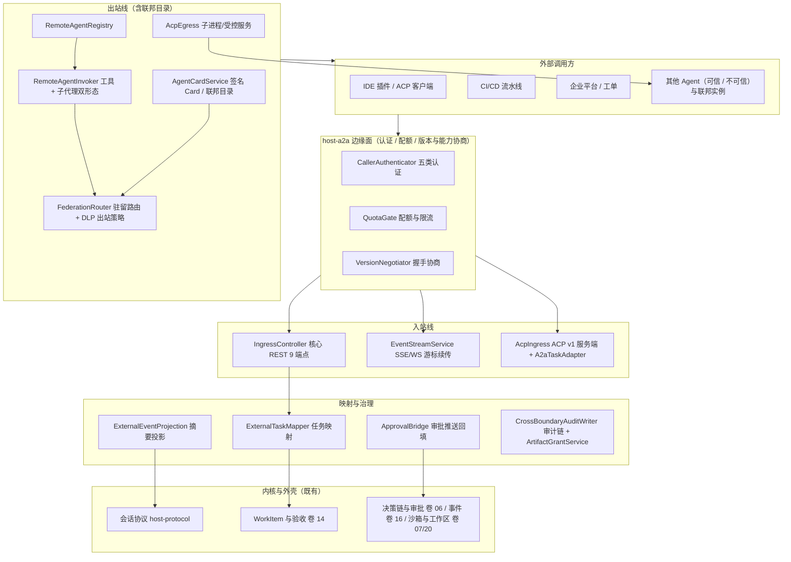
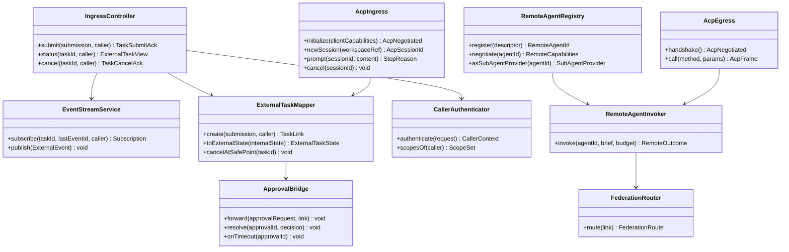
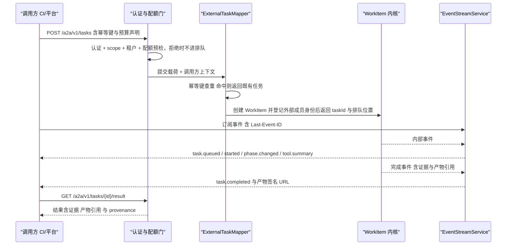
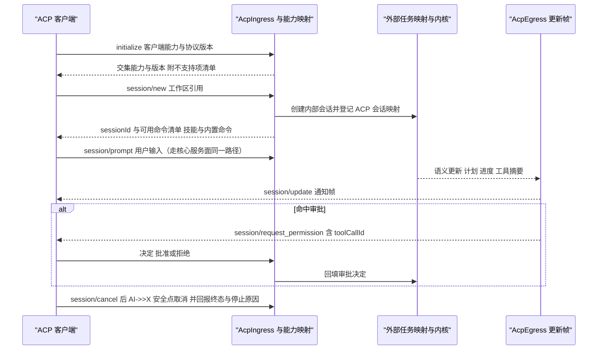
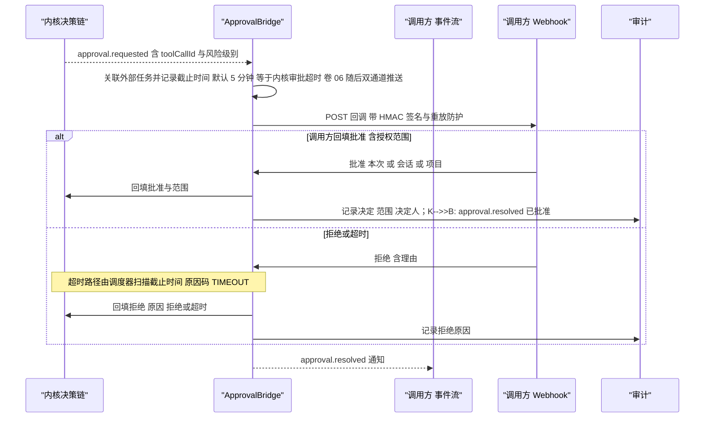
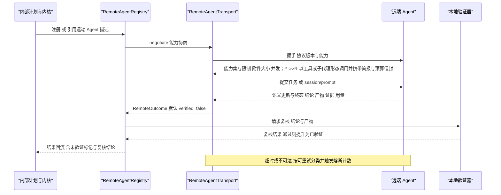
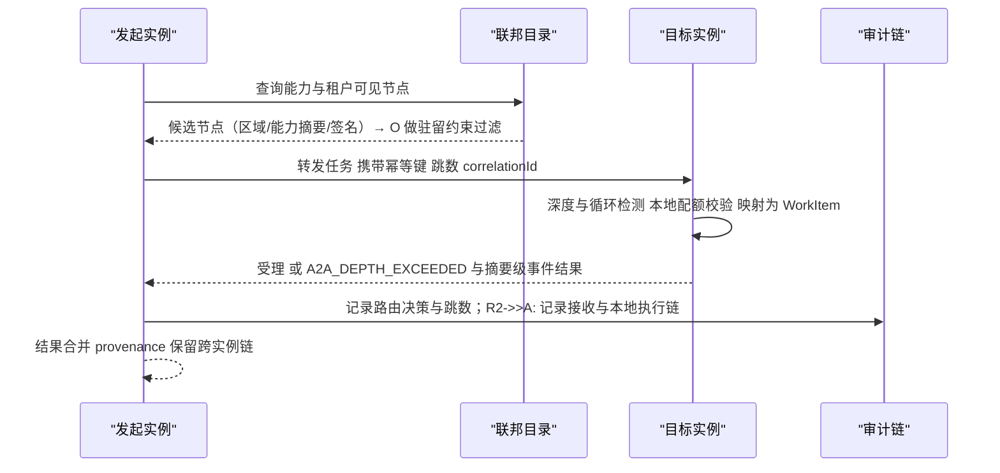
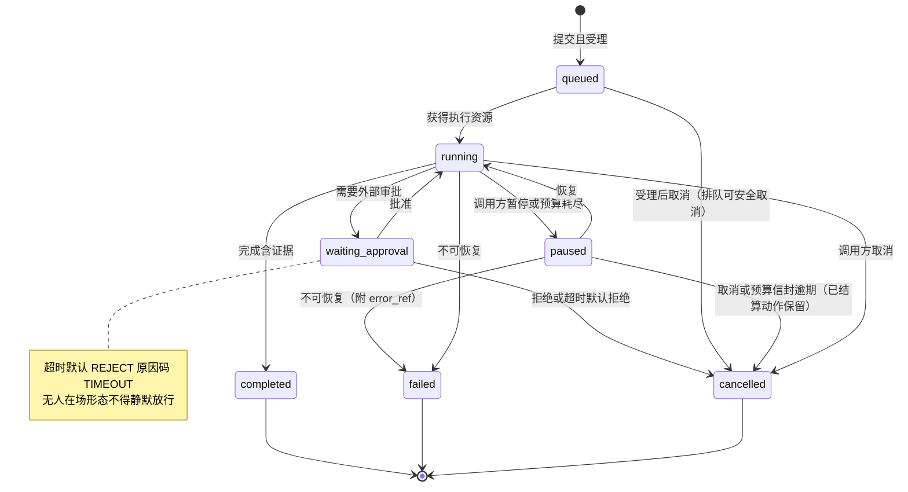
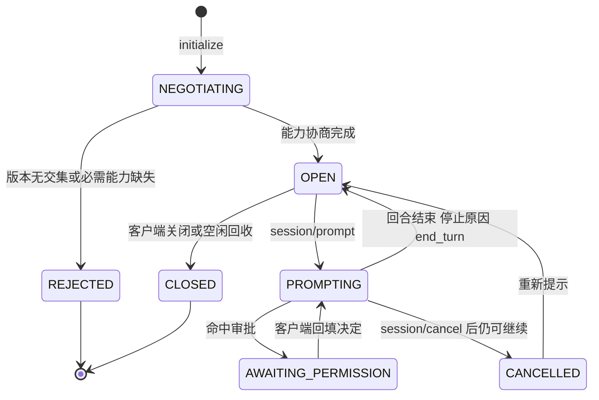
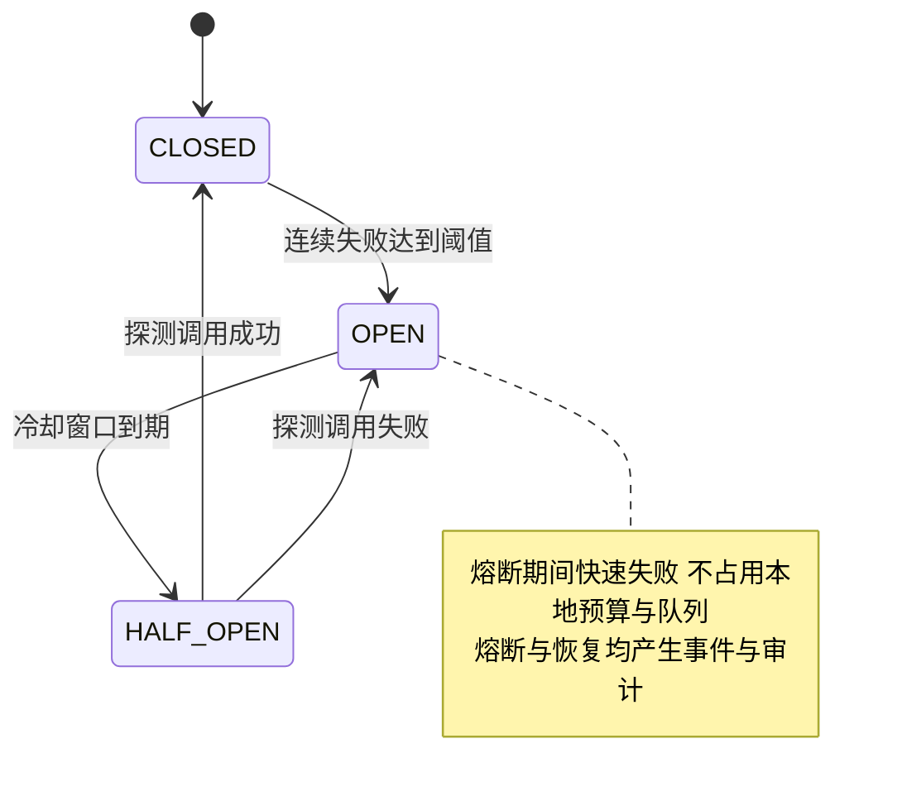

# 实现方案 24 · A2A 网关（双向互操作）实现技术方案

> 本文件是 Phase B 实现层方案，对应 Phase A 卷 23（`docs/harness/23-agent2agent-interop.md`）与全局决策 H-018（双向互操作）、REQ-CMP-15（开放 harness 平台化）。
>
> **实现主线**：**ACP 兼容入站/出站 + A2A 联邦** 双线。卷 23 已选「核心协议自研（REST + SSE/WS）+ 第三方标准适配器」（D-A2A-1），本文件把这句抽象条款落成三条具体协议线：
> ① **核心服务面**（自研，语义最完整：任务 + 事件流 + 审批回调 + 产物）；② **ACP 兼容线**（入站/出站适配，行业实际收敛度最高）；③ **A2A 联邦线**（跨组织/跨实例的 Agent Card + 任务/消息语义）。
>
> **依赖修订**：本文件 §③ I-A2A-1 需要 Phase A 卷 23 增补 ACP 兼容面（`CROSS-COMPARISON.md` §7.5 X1 已登记冲突、§7.4 Q10 已登记未决项）。按 `LESSONS-AND-ADOPTIONS.md` §6.2 G6，本文件**只登记建议、不改卷册**，并在 §⑩.8 汇总。
> 证据标记沿用 `00-research-plan.md` §2：`[E1]` 源码｜`[E2]` 官方文档｜`[E3]` 第三方｜`[E4]` 推断。
> 实现落点：`harness-contract/.../contract/a2a/`（契约与 SPI）+ `harness-host/host-a2a`（Spring 外壳：服务面/客户端/联邦），见卷 27 §4.1/§4.3。

---

## ① 实现目标与范围

### 1.1 本组件解决什么

让 OpenCoding 既**能被驱动**也能**主动驱动**：外部 CI/平台/其他 Agent/IDE 可提交任务、订阅事件、参与审批、取回带证据的产物；
本产品也可把外部 Agent 注册为「能力」（工具/子代理形态）参与内部计划，并对每一次跨界动作保留可解释的授权链与审计链。五条线拆分如下：

| 线 | 方向 | 内容 | 本文件章节 |
| --- | --- | --- | --- |
| L1 服务面（被调用） | 入站 | 端点族、任务生命周期映射、审计与配额、五类调用方认证 | §②/§⑥.1/§⑧/§⑨.1 |
| L2 客户端面（调用） | 出站 | `RemoteAgent` 适配器、能力协商、失败与超时、结果标「未验证」 | §②/§⑥.4/§⑨.3 |
| L3 ACP 兼容线 | 双向 | ACP 入站（IDE 驱动本产品）、ACP 出站（本产品驱动 ACP Agent）、能力映射、版本协商 | §③ I-A2A-1/§⑥.2/§⑨.2/§⑨.3 |
| L4 A2A 联邦线 | 双向 | Agent Card、任务/消息语义、跨组织信任、数据驻留路由、跨实例追踪 | §③ I-A2A-7/§⑥.5/§⑨.4 |
| L5 事件与审计贯通 | 贯通 | 外部事件为内部事件的过滤投影；`correlationId` + provenance 贯穿两端 | §⑧.3/§⑩.6 |

### 1.2 与 Phase A 的对应关系

| Phase A 决策/条款 | 本文件落实位置 |
| --- | --- |
| D-A2A-1 双栈（核心协议 + 标准适配器） | §③ I-A2A-1（细化为「核心 + ACP + A2A 联邦」三线）、§④ 架构图 |
| D-A2A-2 认证授权组合 | §② REQ-A2A-14、§⑤ `CallerAuthenticator`、§⑨.5 | 
| D-A2A-3 异步任务 + 流式订阅 + 幂等 + 预算声明 | §③ I-A2A-2、§⑥.1、§⑦.1 |
| D-A2A-4 外部任务 → 内部 WorkItem 映射 | §③ I-A2A-3、§⑤ `ExternalTaskMapper`、§⑧ `oc_a2a_task_link` |
| D-A2A-5 Agent Card/Manifest（可签名） | §② REQ-A2A-18、§⑨.4、§⑧ `oc_federation_node` |
| D-A2A-6 统一 `RemoteAgent` 抽象 | §③ I-A2A-5、§⑤ `RemoteAgentRegistry`、§⑨.3 |
| D-A2A-7 审批回调 + 超时默认拒绝 | §③ I-A2A-6、§⑥.3 |
| D-A2A-8 幂等键 + 结果缓存 + 去重窗口 | §② REQ-A2A-15、§⑧.2 |
| D-A2A-9 不可信调用方三层收窄 | §② REQ-A2A-17、§⑩.5 |
| D-A2A-10 联邦目录 + 路由 + 数据驻留 | §③ I-A2A-7、§⑥.5 |
| 卷 23 §4.1 端点 9 个 + 外部事件 11 类 | §⑨.1（完整表 + 错误码）、§⑧.3 |
| 卷 23 §5 扩展点 4 个 + 附录 B §B.7/B.8（错误与版本协商） | §⑨.7（+ 新增 3 SPI）、§⑨.1 错误列、§⑩.2 |
| 卷 06 D-PERM-5/L-008（三通道策略分派） | §② REQ-A2A-33、§⑥.3（无人在场的调用方形态） |
| 卷 07 L-015（能力矩阵显式声明） | §⑩.5（不可信调用方 L1+、能力缺失显式拒绝） |

### 1.3 本组件不解决什么

- **不解决** MCP 能力接入（卷 09）：MCP 提供「能力」，A2A/ACP 提供「任务」；两者互补不互替。
- **不解决**内部会话协议与事件定义（卷 01 §4.5、卷 16）：本文件只做**协议转换与投影**，不新增内部原语。
- **不解决**团队内部编排（卷 13）与企业身份体系（卷 24）：远程 Agent 只是 SubAgent 协议的一个 Provider；本文件消费既有租户与主体模型，不新建账号体系。
- **不解决**审批决策本身（卷 06）：只做「审批请求转发 + 决定回填 + 超时策略」，判定链仍在内核。

### 1.4 上下游依赖

| 方向 | 依赖对象 | 交互面 |
| --- | --- | --- |
| 上游 | 会话协议（`host-protocol`） | 外部任务以内部 `session.*` / `task.*` 语义落地；事件来自卷 16 分区流 |
| 上游 | Agent 运行时（卷 12） | 远程 Agent 以 `SubAgentProvider` 形态参与；预算信封与深度上限由其校验 |
| 上游 | 工作对象与权限（卷 14/06） | WorkItem 创建/推进/验收；`ASK` 走外部审批通道，`UNAVAILABLE` 与超时默认拒绝对齐 |
| 上游 | 沙箱（卷 07） | 外部任务默认 L1+；能力矩阵用于对调用方声明「实际隔离强度」 |
| 上游 | 企业（卷 24/31） | 租户解析、配额、审计存储、DLP 出站策略 |
| 下游 | IDE/CI/平台（外部） | ACP 客户端、A2A 客户端、CI/工单系统 |
| 下游 | 桌面/CLI（卷 22） | 远程审批卡片、远端 Agent 调用可视化（`remote_agent.*` 事件） |

### 1.5 模块落点

**落地登记（R07：模块 / 顺序 / 批次；清单见 `reviews/R07-scope-build-platform.md`）**：
- **模块坐标**：`harness-contract`（包 `contract/a2a`）+ `harness-host/host-a2a`（Spring 外壳）+ `harness-host/{host-protocol,host-app}`；与卷 27 §4.3「23 A2A → `host-a2a`」一致。
- **实施顺序（卷 27 §4.5）**：第 **20** 步「企业（多租户/SSO/审计/配额/DLP）+ A2A + 发布流水线」（依赖第 9/15/19 步）。**同批内部排序（必须遵守）**：`25`（身份/租户/API Key/审计，最小子集）→ 本文件 → `25` 完整治理面；理由：五类调用方认证与跨租户阻断依赖 `25` 的主体模型，而 `25` 的吊销扇出又引用本文件 §9.5 的委托凭据——**互为前置**（详见 R07 §3 C4），排期时不得并行开工同一接缝。
- **数据迁移批次**：`oc_a2a_*` / `oc_remote_agent*` / `oc_federation_*` 未在卷 27 §4.4 明列 → 建议新批次 **B9 生态与互操作**（与本文件 + `29` 同批）；未映射项已登记 R07 §2。
- **表所有权（R07 核对，防双声明）**：`oc_acp_session_link` 拥有者**本文件**（`25` 只做吊销扇出引用）；`oc_audit_event` 拥有者 `25`（本文件只写不建）；`oc_usage_event` 拥有者 `26`（本文件只引用计量）。
- **I- 决策落点**：`I-A2A-1…10`（10 条）模块落点为上表；类级落点见 §⑤，逐条绑定登记为 R07 建议 S4。

```text
harness-contract/.../contract/a2a/
    标识与枚举：ExternalTaskId / TaskLinkId / CallerId / ProtocolKind / CallerKind / ExternalTaskState
    载荷：ExternalTaskSubmission / ExternalTaskView / ExternalEvent / ArtifactGrant / AgentCard
    审批与联邦：ApprovalCallback / FederationRoute / HopBudget / TrustLevel
    SPI：A2AProtocolAdapterSPI / A2AClientTransportSPI / A2AApprovalChannelSPI / A2AFederationDirectorySPI
         CallerAuthenticatorSPI / AcpCapabilityMapperSPI / RemoteAgentTransportSPI

harness-host/host-a2a/
    ingress/  IngressController（核心 REST）、EventStreamService（SSE/WS + 游标续传）
    acp/      AcpIngress（stdio 服务端）、AcpEgress（客户端）、AcpCapabilityMapper、AcpCommandExposer
    a2a/      A2aTaskAdapter（A2A 风格任务）、AgentCardService（签名/发现）、FederationRouter
    client/   RemoteAgentRegistry、RemoteAgentInvoker、RemoteCallAuditor
    auth/     CallerAuthenticator（五类）、ScopeResolver、QuotaGate、RateLimiter
    approve/  ApprovalBridge（推送/回填/超时/审计）；project/  ExternalEventProjection（摘要投影）
    audit/    CrossBoundaryAuditWriter（调用方 + 委托者 + 决策 + 批准 + 产物）
```

**纪律**：`host-a2a` 属外壳（可用 Spring）；契约与 SPI 在 `harness-contract`（零框架）；内核不得依赖本模块。

---

## ② 功能需求清单（REQ-A2A-n，续卷 00 §5.23 的 REQ-A2A-1…10）

| REQ | 需求描述 | 来源 | 优先级 | 验收要点 |
| --- | --- | --- | --- | --- |
| REQ-A2A-11 | 核心服务面 9 端点 + 外部可见 11 类事件落地，外部事件为内部事件的**过滤投影**（摘要级，不含完整参数与内部提示词） | 卷 23 §4.1/§10；竞品 Gemini A2A 服务端把内核事件翻译为任务状态更新 [E1]（`research/competitors/08-gemini-cli.md` §4.19） | P0 | 抽检 100 条外部事件：无提示词全文、无完整工具参数、无内部路径 |
| REQ-A2A-12 | 任务生命周期 10 态与内部 WorkItem 双向映射；取消按安全点语义停止（不丢已结算动作） | 卷 23 §4.2；竞品 Gemini「每个 Turn 映射为一次 task 状态推进」[E1]（`08` §4.13） | P0 | 映射表逐行用例；取消后已结算产物仍可取回 |
| REQ-A2A-13 | **协议适配器 SPI + 每适配器独立版本矩阵**：新增协议不改内核与核心服务面 | 卷 23 §5/§7；竞品 DeepSeek 对外协议面为 ACP v1 + 自有 JSON-RPC 并可独立演进 [E1]（`04-deepseek-harness.md` §4.19） | P0 | 新增一个假适配器不改动 ingress 代码；版本不兼容时握手拒绝并给出版本区间 |
| REQ-A2A-14 | **五类调用方认证与授权**：CI/CD（API Key）、企业平台（OAuth JWT 用户委托）、可信 Agent（mTLS + Key）、不可信 Agent（受限 Key）、内部服务（回环 + 令牌）；scope 与租户绑定 | 卷 23 §4.4；竞品 MiniMax 用**工具租约**（短期 token 绑定资源）治理子进程凭据 [E1]（`05-minimax-cli.md` §4.14） | P0 | 五类各有成功与拒绝用例；越租户访问一律 `CROSS_TENANT_DENIED` |
| REQ-A2A-15 | **幂等键 + 结果缓存 + 去重窗口**：重复提交返回既有任务而非新建 | 卷 23 D-A2A-8 | P0 | 同键并发提交 10 次只产生 1 个任务，其余返回 `A2A_IDEMPOTENT_REPLAY` |
| REQ-A2A-16 | **审批回调协议**：推送到调用方（事件流或 webhook）→ 回填决定（批准/拒绝/授权范围）→ 超时按策略（默认拒绝） | 卷 23 D-A2A-7；卷 06 L-005（`UNAVAILABLE` 一等结果） | P0 | 超时用例产出 `RESOLVED_DENY` 且审计含「超时」原因 |
| REQ-A2A-17 | **不可信调用方三层收窄**：权限默认只读 + 受限写、沙箱 L1+、独立预算与并发上限 | 卷 23 D-A2A-9、卷 07 L-015 | P0 | 不可信调用方无法拿到未声明工具；越权请求返回 `PERMISSION_DENIED` 并留痕 |
| REQ-A2A-18 | **Agent Card 可发现且可签名**：能力、约束、端点、认证要求、限流、`protocolVersion` | 卷 23 D-A2A-5 | P0 | Card 签名可校验；篡改任一段即校验失败 |
| REQ-A2A-19 | **`RemoteAgent` 统一抽象**：注册（端点/协议/认证引用/能力/预算/可信级别）→ 能力协商 → 执行 → 结果映射（结论/产物/证据） | 卷 23 D-A2A-6；竞品 OpenHands 以 ACP 驱动多家 Agent 并处理**后端能力差异**（凭据要求、配置落盘差异）[E1]（`09-secondary-tier.md` §OpenHands） | P0 | 注册后即可在计划中被引用；能力缺失在派生前拒绝 |
| REQ-A2A-20 | 远端产出**默认标记「未验证」**，需本地验证器复核才可提升为「已验证」证据 | 卷 23 §4.3；竞品 Gemini 维护「已确认远端 agent」列表 [E1]（`08` §4.9） | P0 | 未复核的远端结论在验收中不计入证据 |
| REQ-A2A-21 | **ACP 入站服务端**：`initialize`（能力协商）→ `session/new`｜`session/load` → `session/prompt` → 语义更新 → `session/cancel`，独立可关会话 | 竞品 DeepSeek ACP v1 服务端能力清单与其**刻意省略的 DSH 专属呈现能力** [E1]（`04` §4.19） | P0 | 脚本化 ACP 客户端可完整驱动一轮任务（含取消） |
| REQ-A2A-22 | **ACP 能力映射表**：ACP 能力 ↔ 内部能力逐项声明；不支持的能力**响亮拒绝**（`UNSUPPORTED_CAPABILITY` + `alternatives[]`），不做静默降级 | 卷 23 §5.8-4 精神；竞品 DeepSeek「需要但缺失 → 响亮拒绝，绝不 accept-then-ignore」[E1]（`04` §8 L11） | P0 | 每个映射行有正/反用例；拒绝响应含可选替代 |
| REQ-A2A-23 | **ACP 出站**：以子进程（stdio）或受控服务（回环 + 令牌）两种方式驱动外部 ACP Agent；stdout 只承载协议流量 | 竞品 Grok `grok agent stdio` / `grok agent serve --bind --secret` 双入口 [E2]（`06-grok-cli-and-build.md` §4.19）；DeepSeek「stdout 仅协议流量」[E1]（`04` §4.1） | P1 | 日志走 stderr/文件；协议帧与日志不混流（用例） |
| REQ-A2A-24 | **ACP 命令暴露**：把已启用技能与内置命令以 ACP 命令提供给客户端；内置命令名**优先于**冲突技能名；非法/重复名省略；技能发现失败时内置命令仍可用；安装或启用技能后须重开会话刷新菜单 | 竞品 MiniMax `docs/tui-capabilities.md` 的 ACP Skill commands 规则 [E1]（`05` §4.14） | P1 | 四类名冲突用例；技能发现失败降级用例 |
| REQ-A2A-25 | **A2A 联邦线**：Agent Card 联邦目录（注册/审核/签名）、按策略路由（数据驻留优先）、跨实例任务可追踪 | 卷 23 D-A2A-10 | P1 | 两实例间任务路由与驻留约束用例；路由决策进审计 |
| REQ-A2A-26 | **跨 Agent 调用深度限制**（默认 ≤3 跳）与上溯循环检测，超限 `A2A_DEPTH_EXCEEDED` | 卷 23 §10 | P0 | A→B→A 环用例被拒；深度计数跨实例传递（`correlationId` 携带） |
| REQ-A2A-27 | **审计链贯通**：任一外部任务可还原「调用方 + 委托者 + 权限决策 + 批准者 + 动作 + 产物 provenance」 | 卷 23 §4.5、H-018 | P0 | 给定 taskId 可导出完整链条（含跨实例跳） |
| REQ-A2A-28 | 事件流断线续传（`Last-Event-ID`/游标），重连不丢事件 | 卷 23 §7；竞品 Gemini 以 `eventId` 游标续传重放 [E1]（`08` §4.13） | P0 | 断连 30s 后补发完整（含并发写入用例） |
| REQ-A2A-29 | 大产物**引用化**：签名 URL（默认 15 分钟，可续签）；事件体不内联大对象 | 卷 23 §4.6/§10 | P0 | 100MB 产物不进入事件；URL 过期后拒绝并给续签入口 |
| REQ-A2A-30 | 限流与排队：按调用方 RPM/并发/日预算；超限 429 + `Retry-After`；排队位置可见 | 卷 23 §4.6 | P0 | 超限用例返回 429 且带 `Retry-After`；队列位置可查 |
| REQ-A2A-31 | 版本协商：`protocolVersion` 握手取交集，兼容期 ≥2 小版本；不兼容拒绝并提示升级 | 附录 B §B.8 | P0 | 旧客户端连新实例用例通过（交集能力生效） |
| REQ-A2A-32 | **脚本化协议客户端测试夹具** + 契约测试端点覆盖强制（缺覆盖即 CI 失败） | 竞品 Grok `acp_scripted_client`/`acp_policy` 做协议级端到端 [E1]（`06` §4.24）；OpenCode「端点覆盖不全即 fail」[E1]（`02-opencode.md` §4.23） | P0 | 协议用例离线可跑；端点清单与测试清单差集为空 |
| REQ-A2A-33 | 无人在场的调用方形态三档：ACP/CI（按策略：拒绝或钩子放行或宿主委派）；Host 侧不得静默放行 | 卷 06 D-PERM-5/L-008（三通道策略分派） | P0 | 三档各有用例；未配置策略时默认拒绝 |
| REQ-A2A-34 | 出站 DLP 与网络策略约束：出站内容过 DLP 与域名白名单；不可信远端产出标记「未验证」并隔离存放 | 卷 23 §4.3；卷 07/30 | P1 | 含密钥/敏感字段的出站请求被阻断并留痕 |

**竞品增量需求说明**：REQ-A2A-11/13/19/21/22/23/24/28/32 来自竞品源码级事实（Gemini A2A / DeepSeek ACP / MiniMax ACP / Grok ACP / OpenHands ACP 宿主的 `[E1]`/`[E2]` 证据），
是 Phase A 未下沉到实现层的机制级需求，已在 §③ 逐一登记 `I-A2A-n`。

---

## ③ 技术方案选型（M×N 比选）

评分沿用 `README.md` §4：**F 30% / U 20% / S 25% / M 25%**。

### I-A2A-1 服务面协议主线（**必选登记项：ACP 兼容 vs A2A 联邦**）

| 分支 | 描述 | F | U | S | M | 加权 | 结论 |
| --- | --- | --- | --- | --- | --- | --- | --- |
| B1 | 仅 A2A 风格服务面（卷 23 D-A2A-1 原样） | 8 | 7 | 7 | 7 | 73.0 | 淘汰为**单线**（无 IDE/其他 Agent 的实际互操作面） |
| B2 | 仅 ACP（放弃自研服务面与联邦） | 7 | 7 | 9 | 8 | 77.5 | 淘汰（缺任务/审批回调/联邦，企业流水线无法接入） |
| B3 | **双线：核心自研服务面 + ACP 兼容入站/出站 + A2A 风格联邦适配** | 9 | 9 | 8 | 8 | 85.0 | **选定** |

**证据（为什么必须补 ACP）**：九组竞品中**只有 Gemini CLI 一家实现 A2A**（`packages/a2a-server`，`@a2a-js/sdk` + express [E1]，`08` §4.19），而 **ACP 至少六家**：
Grok（`grok agent stdio|serve`，明示「协议选择是 ACP，不是 MCP/A2A」[E2]，`06` §4.19）、Qoder（术语表：CLI↔IDE 走 ACP [E2]，`07` §4.19）、MiniMax（`tui/src/acp/*` [E1]，`05` §4.14）、
DeepSeek（`acp` profile「仅自动化的 ACP v1 服务端」[E1]，`04` §4.19）、OpenCode（[E1]，`02` §4.19）、OpenHands（可驱动「any ACP-compatible agent」[E1]，`09`）。
`CROSS-COMPARISON.md` §0-8 与 §7.5 X1 同向判断：**行业收敛在 ACP，卷 23 若只做 A2A 可能选错主协议**。
**选择理由**：ACP 解决「IDE/宿主 ↔ Agent」的**会话级互操作**（本产品最重要的被集成场景），A2A 解决「Agent ↔ Agent」的**跨组织任务联邦**（差异化窗口，唯一对手是 Gemini CLI）。
两者**不是替代关系而是层次关系**：ACP 频率高、语义细（capability 协商 + 权限请求 + 文件系统代理）；A2A 频率低、语义粗（任务/消息/产物 + 组织信任）。
**被放弃分支的代价**：只做 A2A 会失去 IDE 生态入口（企业客户最常用的接入方式）；只做 ACP 会失去 CI/工单平台的异步任务面（我方独有设计：审批回调 + 预算声明）。
**回退触发**：若 A2A 规范发生破坏性演进且无兼容层可行，联邦线降级为「私有 Card + 任务 REST」并只保留适配器版本矩阵（内核协议不动，与 H-018 回退条款一致）；
若 ACP 独立生态出现分裂（多方言互不兼容），ACP 线退化为「仅遵守共同子集 + 扩展方法前缀化」。

### I-A2A-2 任务交互形态

| 分支 | 描述 | F | U | S | M | 加权 | 结论 |
| --- | --- | --- | --- | --- | --- | --- | --- |
| B1 | 同步阻塞（一次请求等到完成） | 5 | 4 | 8 | 7 | 60.5 | 淘汰（长任务不可行、连接占用高） |
| B2 | **异步任务 + 流式订阅（`submit` → `subscribe` → `status`/`result`/`cancel`）** | 9 | 9 | 9 | 9 | 90.0 | **选定** |
| B3 | 仅事件流（无任务对象） | 7 | 7 | 6 | 6 | 65.0 | 淘汰（CI 无法定位「哪次提交」与取回结果） |

**选定 B2**：与 D-A2A-3 一致；外部任务对象是幂等、配额、审批、审计四处治理的**聚合根**。

### I-A2A-3 外部任务与内部对象映射

| 分支 | 描述 | F | U | S | M | 加权 | 结论 |
| --- | --- | --- | --- | --- | --- | --- | --- |
| B1 | 直接执行（无内部对象） | 5 | 5 | 4 | 5 | 47.5 | 淘汰（不可追踪、不可恢复） |
| B2 | **映射为内部 WorkItem + 请求者作为「外部成员」** | 9 | 8 | 9 | 9 | 88.5 | **选定** |
| B3 | 独立外部任务态机（不复用 WorkItem） | 7 | 7 | 6 | 6 | 65.0 | 淘汰（两套状态必然漂移） |

**选定 B2**：复用权限、审批、预算、审计与恢复全部治理能力；**映射表是唯一真相**（§⑧ `oc_a2a_task_link`），
外部态机只是内部态机的投影 + 两处外部专有状态（`queued` 排队可见、`waiting_approval` 等待外部审批）。

### I-A2A-4 协议适配器装载形态

| 分支 | 描述 | F | U | S | M | 加权 | 结论 |
| --- | --- | --- | --- | --- | --- | --- | --- |
| B1 | 内嵌 if/else 分支（按协议类型散落判断） | 6 | 6 | 5 | 5 | 55.0 | 淘汰（协议增多即不可维护） |
| B2 | **SPI 注册表 + 每适配器独立版本矩阵 + 握手协商** | 9 | 8 | 9 | 9 | 88.5 | **选定** |
| B3 | 独立网关进程（协议转换服务） | 7 | 7 | 7 | 6 | 67.5 | 淘汰（本地/桌面形态无法承担额外进程；运维面与延迟双增） |

**选定 B2**：对齐卷 23 §7 与附录 B §B.8；代价是 SPI 需要严格版本纪律，由 §⑩.2 兼容矩阵与 §⑪ 互操作用例守住。

### I-A2A-5 出站 `RemoteAgent` 承载形态

| 分支 | 描述 | F | U | S | M | 加权 | 结论 |
| --- | --- | --- | --- | --- | --- | --- | --- |
| B1 | 仅工具形态（`remote_agent.invoke`） | 8 | 8 | 8 | 7 | 77.5 | 作为**最小可用面**保留 |
| B2 | **双形态：工具 + `SubAgentProvider`（远程子会话，独立预算与观测）** | 9 | 9 | 8 | 8 | 85.0 | **选定** |
| B3 | 仅子代理形态（模型无法直接点名某远端能力） | 7 | 7 | 7 | 7 | 70.0 | 淘汰（计划自由度下降） |

**选定 B2**：与卷 12 的 `SubAgentProvider` 注册表兼容（竞品 DeepSeek 用六 provider 并存验证该形态可行 [E1]，`04` §4.9）；
工具形态用于「单次取用」，子代理形态用于「多轮协作」，两者共享同一 `RemoteAgentTransport` 与审计。

### I-A2A-6 审批回调通道

| 分支 | 描述 | F | U | S | M | 加权 | 结论 |
| --- | --- | --- | --- | --- | --- | --- | --- |
| B1 | 仅事件流内推送（调用方自行订阅） | 8 | 7 | 9 | 8 | 80.5 | 作为**基础通道**保留（ACP/IDE 场景） |
| B2 | **事件流 + Webhook 双通道 + 超时默认拒绝 + 范围化决定** | 9 | 9 | 8 | 9 | 87.5 | **选定** |
| B3 | 同步阻塞等待调用方应答 | 6 | 6 | 5 | 5 | 55.0 | 淘汰（无人值守场景必然挂死） |

**选定 B2**：事件流覆盖长连接调用方，Webhook 覆盖 CI/工单；超时默认拒绝对齐卷 23 §10 并复用卷 06 `UNAVAILABLE` 语义。

### I-A2A-7 联邦目录与路由

| 分支 | 描述 | F | U | S | M | 加权 | 结论 |
| --- | --- | --- | --- | --- | --- | --- | --- |
| B1 | 无目录（靠文档 + 手工配置） | 6 | 6 | 8 | 7 | 67.5 | 淘汰（无法自动发现与审核） |
| B2 | 静态注册表 + 行政审核（无签名） | 7 | 8 | 8 | 8 | 77.5 | 基线 |
| B3 | **目录服务 + Agent Card 签名 + 数据驻留路由 + 跨实例追踪** | 9 | 8 | 7 | 8 | 80.5 | **选定** |

**选定 B3**：与 D-A2A-10 一致；签名与审核把「谁能进目录」变成可治理动作，驻留约束为路由第一排序键（次键为成本/负载）；代价是目录运维与密钥轮换。

### I-A2A-3／I-A2A-8 次要分叉（结论登记，矩阵从略）

| 决策 | 候选（各 2 分支以上） | 选定与理由 |
| --- | --- | --- |
| I-A2A-3 外部任务与内部对象映射 | B1 直接执行（无内部对象，不可追踪）／B2 映射 WorkItem + 外部成员身份／B3 独立外部任务态机（与内部态机并存） | **B2**（F9/U8/S9/M9 → 88.5）：复用权限、审批、预算、审计与恢复全部治理能力；映射表是唯一真相（§⑧ `oc_a2a_task_link`），B3 的两套状态机必然漂移 |
| I-A2A-8 外部可见事件粒度 | B1 全量内部事件透出／B2 摘要级过滤投影（白名单剥离）／B3 摘要流 + 授权细粒度双流 | **B2**（F9/U8/S9/M9 → 88.5）：与卷 23 §10「摘要级」一致；B3 需先解决细粒度授权的租户与合规评审，本轮登记不实现 |

### 3.9 实现级决策登记（I-A2A-n）

| ID | 主题 | 选定 | 被放弃分支的代价 | 回退触发条件 |
| --- | --- | --- | --- | --- |
| I-A2A-1 | 服务面协议主线 | 核心自研 + ACP 兼容双线 + A2A 联邦 | 需同时维护三套映射与测试 | A2A 破坏性演进无兼容层 / ACP 生态分裂 |
| I-A2A-2 | 任务交互形态 | 异步任务 + 流式订阅 + 幂等 + 预算声明 | 调用方需实现轮询/订阅 | 调用方普遍无法维持长连接（改推 Webhook-only） |
| I-A2A-3 | 外部任务映射 | WorkItem 映射 + 外部成员身份 | 映射表是新的耦合点（需契约测试锁死） | 内部 WorkItem 语义发生破坏性变化 |
| I-A2A-4 | 适配器装载 | SPI 注册表 + 独立版本矩阵 | SPI 契约需严格版本纪律 | 适配器 > 8 个且加载时间显著（改延迟加载） |
| I-A2A-5 | 出站承载 | 工具 + 远程子代理双形态 | 两套入口需共享审计与预算口径 | 远程调用成本不可控（收敛为仅工具形态） |
| I-A2A-6 | 审批回调 | 事件流 + Webhook + 超时默认拒绝 | 需维护 HMAC 签名与重放防护 | 无人在场场景过多（改「策略预授权 + 事后审计」） |
| I-A2A-7 | 联邦目录 | 目录服务 + 签名 + 驻留路由 | 目录运维与密钥轮换成本 | 联邦实例 < 3（退化为静态注册表） |
| I-A2A-8 | 事件粒度 | 摘要级过滤投影 | 调试与联调体验下降（需本地日志兜底） | 客户合规允许细粒度且提供审计承诺时复议 |

**与竞品对照的取舍**：互操作主线由竞品观测收敛度决定——九组竞品中仅 Gemini CLI 具备 A2A 服务端形态 `[E1]`（`research/competitors/08-gemini-cli.md` §4.19），而 ACP 兼容面至少六家具备（Grok `[E2]`、Qoder `[E2]`、MiniMax / DeepSeek / OpenCode / OpenHands `[E1]`；`CROSS-COMPARISON.md` §7.4 Q10、§7.5 X1）。**取舍**：① 主线选「核心自研（语义最完整）+ ACP 兼容双线 + A2A 联邦」——**放弃**「只做 A2A」的聚合路线（生态落点不足），也**放弃**「只做核心面」（外部 Agent 互操作成本过高）；② ACP 侧对齐「服务端刻意不暴露专属呈现能力」的竞品做法（内部 todo 面板 / 标题生成 / 轨迹查看以摘要或事件代替）；③ A2A 联邦采取**保守启用**：目录签名 + 驻留路由 + 跳数上限，默认不开放公网联邦（企业审批后启用）；④ 出站选「工具 + 远程子代理双形态」（I-A2A-5）但共享同一审计与预算口径——竞品把远程调用做成第二套预算通道，是成本失控来源。

---

## ④ 总体架构图



**装配点**：`host-a2a` 通过 `@ConditionalOnProperty(open-coding.a2a.enabled=true)` 装配；本地形态**默认关闭服务面**（仅回环），
`server`/`enterprise-server` 形态默认开启；ACP 入站仅在本机 stdio 或显式受控回环下开启（与卷 23 §10 默认决策一致）。

---

## ⑤ 类图与关键 Java 21 契约



### 5.1 关键 Java 21 签名（契约层，零框架依赖）

```java
/**
 * 核心服务面入口：提交、查询、取消与追加指令。
 * 不变量：外部 task ↔ 内部 WorkItem 映射唯一（oc_a2a_task_link 唯一约束）；写路径先过认证与配额，再进映射层。
 */
public interface A2AIngressService {
    /**
     * 提交外部任务（幂等）。
     * @param submission 提交载荷（必填：幂等键、目标工作区、模式、预算声明；可选：审批回调、优先级）
     * @param caller     调用方上下文（由认证面构造，必填；含租户、主体、scope 与受限标记）
     * @return 受理回执：返回既有任务时为幂等命中（isReplay=true），并携带外部任务号
     * @throws HarnessException 幂等键冲突且载荷不一致（CONFLICT）、深度超限（A2A_DEPTH_EXCEEDED）、
     *                          配额耗尽（RATE_LIMITED）、工作区不可达（WORKSPACE_UNAVAILABLE）
     */
    TaskSubmitAck submit(ExternalTaskSubmission submission, CallerContext caller);

    /**
     * 查询外部任务状态（含排队位置与阶段）。
     * @param taskId 外部任务号（必填）
     * @param caller 调用方上下文（必填；非本人任务一律拒绝）
     * @return 外部可见视图（摘要级状态与证据引用，不含内部提示词与完整参数）
     * @throws HarnessException 任务不存在（NOT_FOUND）或无权访问（CROSS_TENANT_DENIED）
     */
    ExternalTaskView status(ExternalTaskId taskId, CallerContext caller);

    /**
     * 取消任务（安全点语义）。
     * @param taskId 外部任务号（必填）
     * @param caller 调用方上下文（必填）
     * @return 取消回执：已结算动作保留、未结算动作为何处置（回滚 / 标记不确定）
     * @throws HarnessException 状态非法（TASK_STATE_INVALID：已完成/已失败不可取消）
     */
    TaskCancelAck cancel(ExternalTaskId taskId, CallerContext caller);
}

/** 调用方种类：决定默认权限、沙箱档位与配额维度。 */
public enum CallerKind {
    /** CI/CD 流水线（项目级 API Key） */
    CI("CI", "CI/CD 流水线"),
    /** 企业平台（OAuth JWT 用户委托） */
    PLATFORM("PLATFORM", "企业平台"),
    /** 可信 Agent（mTLS + API Key） */
    AGENT_TRUSTED("AGENT_TRUSTED", "可信 Agent"),
    /** 不可信 Agent（受限 API Key，默认沙箱 L1+） */
    AGENT_UNTRUSTED("AGENT_UNTRUSTED", "不可信 Agent"),
    /** 内部服务（本实例回环 + 令牌） */
    INTERNAL("INTERNAL", "内部服务");

    private final String code;
    private final String desc;

    CallerKind(String code, String desc) {
        this.code = code;
        this.desc = desc;
    }

    public String getCode() {
        return code;
    }

    public String getDesc() {
        return desc;
    }

    /**
     * 按编码解析调用方种类。
     * @param code 编码（必填，取值见各枚举项）
     * @return 匹配的枚举项
     * @throws HarnessException 编码未知时抛出（INVALID_ARGUMENT）
     */
    public static CallerKind of(String code) {
        for (CallerKind kind : values()) {
            if (kind.code.equals(code)) {
                return kind;
            }
        }
        throw new HarnessException(ErrorCode.INVALID_ARGUMENT, "未知调用方种类：" + code);
    }
}

/** 外部任务状态（投影自内部 WorkItem，仅两处外部专有）。同一 `code + desc + of(String code)` 模式，未知态显式失败。
 *  **编码大小写约定**：本枚举 `code` 为小写，因其属 A2A/ACP **线上词表**（外部协议约定，随协议版本演进）；
 *  内部枚举一律 `UPPER_SNAKE_CASE`，两域之间在映射层显式转换——DB 与事件只存 `code`，前端只传 `code`。 */
public enum ExternalTaskState {
    // 取值：QUEUED / RUNNING / WAITING_APPROVAL / PAUSED / COMPLETED / FAILED / CANCELLED
    QUEUED("queued", "已排队"), RUNNING("running", "执行中"), WAITING_APPROVAL("waiting_approval", "等待外部审批"),
    PAUSED("paused", "已暂停"), COMPLETED("completed", "已完成"), FAILED("failed", "已失败"), CANCELLED("cancelled", "已取消");

    private final String code;
    private final String desc;

    ExternalTaskState(String code, String desc) {
        this.code = code;
        this.desc = desc;
    }

    public String getCode() {
        return code;
    }

    public String getDesc() {
        return desc;
    }

    /**
     * 按编码解析状态。
     *
     * @param code 状态编码（必填，取值见各枚举项）
     * @return 匹配的枚举项
     * @throws HarnessException 编码未知（INVALID_ARGUMENT）；未知状态**不得**回落为默认态
     */
    public static ExternalTaskState of(String code) {
        for (ExternalTaskState state : values()) {
            if (state.code.equals(code)) {
                return state;
            }
        }
        throw new HarnessException(ErrorCode.INVALID_ARGUMENT, "未知外部任务状态：" + code);
    }
}

/** 协议适配器 SPI：新增协议只实现本接口，不改核心服务面（REQ-A2A-13）。 */
public interface A2AProtocolAdapterSPI {
    /** 返回本适配器支持的协议种类与版本区间（用于握手分发与取交集，见附录 B §B.8）。 */
    AdapterDescriptor descriptor();

    /**
     * 把一个协议帧翻译为核心服务面调用。
     * @param frame 协议原始帧（非空）
     * @param caller 已认证的调用方上下文（非空）
     * @return 适配结果；能力不支持时**必须**返回 UNSUPPORTED 并附 alternatives，禁止静默降级
     */
    AdaptedCall adapt(ProtocolFrame frame, CallerContext caller);
}

/** 出站远程 Agent 传输 SPI：ACP / A2A / 自定义共用一个出口。 */
public interface RemoteAgentTransportSPI {
    /** 协商远端能力（握手）。 */
    RemoteCapabilities negotiate(RemoteAgentDescriptor descriptor);

    /**
     * 提交远程任务并等待终态或超时。
     * @param descriptor 远端描述（端点、认证引用、预算上限、可信级别）
     * @param brief      委派简报（结构化，不含父对话原文）
     * @param budget     预算信封（超限即取消远端任务）
     * @return 远端结果：结论、产物、证据、用量；verified=false 表示尚未被本地验证器复核
     * @throws HarnessException 不可达/超时（DEPENDENCY_UNAVAILABLE，可重试）、能力缺失（UNSUPPORTED_CAPABILITY，含 alternatives）
     */
    RemoteOutcome invoke(RemoteAgentDescriptor descriptor, SubAgentBrief brief, BudgetEnvelope budget);
}
```

**枚举与配置纪律**：`CallerKind`、`ExternalTaskState`、`ProtocolKind`（`CORE`/`ACP`/`A2A`/`CUSTOM`）、`HopDisposition`（`ACCEPTED`/`DEPTH_EXCEEDED`/`LOOP_DETECTED`）全部 `code + desc` + `of(String code)`；所有阈值进 `A2AProperties`（§⑨.6），代码内不得出现字面量。

**异常与错误码约定**：异常按层分工——**契约与内核侧（`harness-contract/.../contract/a2a` 等，零框架）统一抛 `HarnessException` 并携带 `ErrorCode`**（本文件 §5.1 契约签名即为该侧）；**外壳侧（`harness-host/host-a2a` 等 Spring 模块）统一抛 `BusinessException` 并携带 `ErrorCode`**，由外壳全局异常处理器按码映射为统一错误响应（错误模型见附录 B §B.7；只增码、不改义见 §B.11）；**禁止裸抛 `RuntimeException` / `IllegalArgumentException`**；服务面对外错误一律以错误码 + 中文文案 + `traceId` 输出（附录 B §B.7）。

---

## ⑥ 核心流程时序图

### 6.1 入站：提交（幂等）→ 排队 → 执行 → 事件流 → 结果（REQ-A2A-11/12/15/28）

**前置条件**：调用方已认证且配额预检通过。**主路径**：幂等键查重 → 创建外部任务与映射 → 内部 WorkItem 创建 → 事件流订阅 → 结果与产物引用。
**异常与补偿**：配额不足 429 + `Retry-After`；工作区不可达不排队直接失败。**幂等与并发**：幂等命中返回既有任务；同键并发用唯一约束兜底。



### 6.2 ACP 入站：能力协商 → 新会话 → 提示 → 语义更新 → 取消（REQ-A2A-21/22/24）

**前置条件**：客户端以 stdio 或受控回环连接。**主路径**：`initialize` 取版本与能力交集 → 建会话 → 提交提示 → 语义更新（含审批）→ 取消或终态。
**异常与补偿**：能力不支持 → `UNSUPPORTED_CAPABILITY` + `alternatives[]`（不静默降级）；会话缺失按策略重建并告警（对齐竞品 [E1]，`05` §4.14）。**幂等与并发**：同会话 `prompt` 串行化；`session/cancel` 在安全点生效。



### 6.3 审批回调（事件流 + Webhook + 超时默认拒绝，REQ-A2A-16/33）

**前置条件**：决策链产出 `ASK`。**主路径**：任务转 `waiting_approval` → 双通道推送 → 调用方回填决定（含授权范围）→ 后续执行按范围生效 → 审计留痕。
**异常与补偿**：无人在场形态默认拒绝（企业可配「宿主委派 / 钩子放行」，**禁止静默放行**）。**幂等与并发**：同一审批只接受第一个有效决定，其余 `CONFLICT`；超时路径由调度器扫描截止时间（原因码 `TIMEOUT`）。
**审批决定绑定（R04 安全轮新增，防冒充与重放）**：回填必须绑定 `approvalId + toolCallId + callerId + linkId` 四元组；**决定人身份一律取自认证上下文**（token/证书推导，禁止请求体自声明 `decided_by`）；**禁止自批**——`AGENT_UNTRUSTED` 调用方对自身任务产生的审批不得自行批准（默认拒绝；企业策略放开也仅限只读类工具与低风险等级），需要「宿主委派」时由宿主端凭独立凭据批准；授权范围只能**收窄**（≤ 调用方 scope、≤ 风险等级上限，与 §⑨.5 同源），越界请求按拒绝并附原因码；决定**一次性**（首个有效决定生效，重复走 `CONFLICT`），回填后经**同一**权限决策链复核后生效（不形成第二套审批语义，对齐卷 27 §3.8「复用卷 06 决策链」）。
**回调目标防 SSRF（R04 安全轮新增补漏）**：`approvalCallback` 指向的 Webhook 目标必须过**出站域名白名单 + 私有地址拒绝**（回环 / 链路本地 / 私网段 / 云元数据 `169.254.169.254`）；域名解析后校验**解析所得 IP** 并以该 IP 建连（防 DNS 重绑定），**不跟随重定向**；回调目标变更需重新登记并审计（`a2a.callback.registered`）。原稿仅声明「出站 DLP + 域名策略」，未覆盖「调用方指定回调 → 本地代发」这条 SSRF 路径，本轮补齐（与 §⑨.6 `egress.callback-policy` 同源）。



### 6.4 出站：RemoteAgent 注册 → 协商 → 调用 → 结果回流（REQ-A2A-19/20/26）

**前置条件**：远端 Agent 已注册（可信级别 + 预算上限）。**主路径**：能力协商 → 以工具或子代理形态暴露 → 执行 → 结果映射与「未验证」标记 → 本地验证器复核 → 验证提升。
**异常与补偿**：能力缺失在**派生前**拒绝；超时按可重试分类；结果不完整标「部分成功」。**幂等与并发**：熔断打开时快速失败；远端结果默认 `verified=false`，复核通过才提升。



### 6.5 联邦路由（Agent Card 发现 → 驻留约束 → 跨实例追踪，REQ-A2A-25/27）

**前置条件**：目录可用且两实例 Card 已签名审核。**主路径**：查询能力 → 驻留约束过滤 → 转发任务（跳数 + `correlationId`）→ 回传结果与审计引用。
**异常与补偿**：无合规实例即明确失败（不得静默改投）；跨实例审计链断裂即告警。**幂等与并发**：跨实例沿用同一幂等键；跳数递增且超上限即拒（`A2A_DEPTH_EXCEEDED`）。



---

## ⑦ 状态机

### 7.1 外部任务生命周期（与内部 WorkItem 映射）



**迁移补全（触发 / 守卫 / 副作用）**：`queued → cancelled`——触发：调用方在受理后取消；守卫：无（排队可安全取消）；副作用：出队 + 释放配额占位 + `a2a.task.cancelled`；`paused → cancelled`/`paused → failed`——触发：预算耗尽后调用方取消 / 逾期未续期；守卫：`paused` 停留超过预算信封有效期；副作用：按安全点停止 + 已结算动作保留（与 `cancel` 同语义）；**超时路径**——`waiting_approval` 超时 → `cancelled(reason=TIMEOUT)`（**禁止**静默放行），且 `settledActions` 与 `uncertainActions` 在回执中分离；`running → failed` 为不可恢复错误的唯一出口，失败必须附 `error_ref`（禁止无原因的失败态）。

### 7.2 ACP 会话状态（入站）



**迁移补全（触发 / 守卫 / 副作用）**：`NEGOTIATING → REJECTED`——触发：版本无交集或必需能力缺失；守卫：`initialize` 载荷已校验（格式非法同判拒绝）；副作用：返回本端支持区间 + 升级指引，写 `acp.session.closed(close_reason=INCOMPATIBLE)`；`PROMPTING → CANCELLED`——触发：`session/cancel`；守卫：无（安全点中断）；副作用：回合在安全点终止，会话**保持 `OPEN`**（`CANCELLED → OPEN` 可重新提示，与「会话终止」严格区分）；**超时路径**——`AWAITING_PERMISSION` 超过审批窗口（默认随内核策略）→ 按拒绝处置并写原因码 `TIMEOUT`；`OPEN → CLOSED`——触发：客户端关闭或空闲回收（默认 30min）；副作用：释放工作区占位、写 `acp.session.closed`（含关闭原因）。

### 7.3 远端 Agent 熔断状态（出站）



---

## ⑧ 数据模型

### 8.1 表（`oc_*`，全部含 `tenant_id` 与审计字段，写操作走 `@Transactional(rollbackFor = Exception.class)`）

**字段类型约定（全表适用）**：`caller_id`/`agent_id`/`node_id`/`link_id`/`external_task_id`/`acp_session_id` 为 `text`；`state`/`kind`/`protocol`/`auth_method`/`channel`/`decision`/`close_reason`/`residency_rule`/`trust_level` 一律 `text` 存 `code`；时间为 `timestamptz`；`scopes`/`quota`/`allowlist`/`capabilities`/`usage` 为 `jsonb`（含 Schema 版本号）；`credential_ref`/`auth_ref`/`brief_ref`/`result_ref` 为引用（**禁止明文凭证**）；`card_digest`/`url_digest` 为 `char(64)`；`hop_depth` 为 `int`（服务端校验上限）。

| 表 | 关键字段 | 索引与约束 |
| --- | --- | --- |
| `oc_a2a_caller` | `caller_id`、`tenant_id`、`kind`、`auth_method`、`credential_ref`（密钥引用，非明文）、`scopes jsonb`、`quota jsonb`、`allowlist jsonb`、`state`、`created_by` | `uk(caller_id)`；`(tenant_id, kind, state)` |
| `oc_a2a_task_link` | `link_id`、`external_task_id`、`protocol`、`caller_id`、`work_item_id`、`session_id`、`idempotency_key`、`correlation_id`、`hop_depth`、`state`、`submitted_at`、`settled_at` | `uk(external_task_id)`；`uk(caller_id, idempotency_key)`；`(tenant_id, state, submitted_at)` |
| `oc_a2a_approval` | `approval_id`、`link_id`、`tool_call_id`、`channel`（STREAM/WEBHOOK）、`deadline_at`、`decision`、`scope_ref`、`decided_by`、`decided_at`、`reason_code` | `uk(approval_id)`；`(link_id, decision)`；部分索引 `(deadline_at)` 仅未决 |
| `oc_a2a_artifact_grant` | `grant_id`、`artifact_id`、`caller_id`、`url_digest`、`expires_at`、`renewed_from`、`revoked_at` | `uk(grant_id)`；`(artifact_id, expires_at)` |
| `oc_remote_agent` | `agent_id`、`tenant_id`、`name`、`protocol`、`endpoint`、`auth_ref`、`capabilities jsonb`、`trust_level`、`budget jsonb`、`card_digest`、`state` | `uk(tenant_id, name)`；`(tenant_id, state)` |
| `oc_remote_agent_call` | `call_id`、`agent_id`、`parent_thread_id`、`brief_ref`、`state`、`result_ref`、`usage jsonb`、`verified`、`verified_by`、`finished_at` | `(agent_id, finished_at desc)`；`(parent_thread_id)`；`(tenant_id, verified)` |
| `oc_acp_session_link` | `acp_session_id`、`protocol_version`、`capabilities jsonb`、`workspace_id`、`session_id`、`opened_at`、`closed_at`、`close_reason` | `uk(acp_session_id)`；`(workspace_id, closed_at)` |
| `oc_federation_node` / `oc_federation_route` | 节点：`node_id`、`instance_url`、`region`、`tenants jsonb`、`capabilities_digest`、`card_signature`、`state`、`approved_by`；路由：`route_id`、`link_id`、`from_node`、`to_node`、`residency_rule`、`decision` | `uk(node_id)`、`(region, state)`；`(link_id)`、`(from_node, decided_at desc)` |

**分区与保留**：`oc_a2a_task_link`/`oc_federation_route` 按月分区；审批与授权记录随审计保留策略（卷 24），产物授权保留 90 天。**跨租户隔离**：查询强制 `tenant_id`，调用方身份不得由请求体决定（附录 B §B.10）。

### 8.2 Redis Key（统一 `RedisKeys` 工厂）

| 语义 | Key 形态 | TTL |
| --- | --- | --- |
| 幂等去重窗口 | `RedisKeys.a2aIdempotent(tenantId, callerId, key)` → `oc:a2a:idem:{tenant}:{caller}:{key}` | 24h |
| 配额计数 | `RedisKeys.a2aQuota(tenantId, callerId, window)` → `oc:a2a:quota:{tenant}:{caller}:{window}` | 窗口长度（1m/1d） |
| 排队位置 / 事件游标 | `RedisKeys.a2aQueue(tenantId, taskId)` / `RedisKeys.a2aEventCursor(tenantId, taskId)` | 任务生命周期 / 7 天 |
| 远端熔断 / 联邦 Card 缓存 | `RedisKeys.remoteAgentCircuit(tenantId, agentId)` / `RedisKeys.federationCard(nodeId)` | 冷却窗口 60s / 5 分钟 |

**键面纪律（R06 新增，对齐 25 §8.5 与卷 24 §4.10 红线 3）**：除 `federationCard`（联邦目录为跨租户共享域，显式声明为全局 Key，其**内容**按 `tenants jsonb` 逐租户过滤）外，上表全部 Key 的**首个变参恒为 `tenantId`**；`oc:a2a:quota/{idem}` 若缺租户段即视为隔离缺陷（幂等键跨租户碰撞会让 A 租户的重复提交命中 B 租户任务）。单测对 `RedisKeys` 上表重载集做结构穷举断言，差集为空。

### 8.3 事件与指标

**事件**（卷 23 §6 清单 + 本文件新增 7 条）：`a2a.task.submitted`/`accepted`/`rejected`、`a2a.task.progress`/`completed`/`failed`/`cancelled`、`a2a.approval.forwarded`/`resolved`、`a2a.client.invoked`/`client.failed`、`a2a.federation.routed`、`a2a.ratelimit.exceeded`；**新增** `acp.session.opened`/`closed`（含协商结果与关闭原因）、`acp.capability.negotiated`（交集与拒绝项）、`acp.command.invoked`（命令名与来源：内置/技能）、
`a2a.idempotent.hit`（命中幂等键）、`a2a.artifact.granted`（产物授权与过期）、`a2a.depth.rejected`（跳数或循环拒绝）、`a2a.projection.redacted`（投影剥离了敏感字段）；**R06 新增** `a2a.caller.registered`/`activated`/`suspended`/`deprovisioned`（调用方生命周期，§9.8）、`a2a.credential.revoked`（吊销扇出逐项结果，含未完成项）、`a2a.cross_tenant.denied`（跨租户越界 SEV2，§8.4）。

**指标**：`oc_a2a_tasks_total{caller,outcome}`、`oc_a2a_task_duration_ms`、`oc_a2a_queue_depth`、`oc_a2a_event_lag_ms`、`oc_a2a_ratelimit_total{caller}`、`oc_a2a_client_latency_ms`；**新增** `oc_a2a_idempotent_hit_total`、`oc_acp_sessions_active`、
`oc_acp_negotiation_ms`、`oc_remote_agent_success_ratio{agent}`、`oc_remote_agent_circuit_state{agent}`、`oc_a2a_federation_routes_total{decision}`；**运行面（R06 新增）** `oc_a2a_cross_tenant_denied_total{surface}`、`oc_a2a_callback_backlog`、`oc_a2a_credential_revocation_failures_total`、`oc_a2a_projection_lag_ms`。

### 8.4 多租户隔离矩阵与运行时阻断（R06 新增）

> 判据不是「按约定过滤」，而是**存在一个运行时检查会拒绝跨租户读取**；每行都必须在 §⑪ 有对应泄漏用例。

| 资源类型 | 隔离机制 | 运行时阻断检查（非约定） | 泄漏用例（§⑪） |
| --- | --- | --- | --- |
| PostgreSQL（§8.1 表族：8 行 / 9 张逻辑表） | 行级 `tenant_id` + 租户条件由持久层拦截器强制注入（与 25 `TenantLineHandler` 同一实现） | 拦截器对 `oc_a2a_*` 全表注入 `tenant_id = :ctx`；缺上下文抛 `TENANT_CONTEXT_MISSING`（不返回空集，避免「静默空结果」被当成无数据）；`oc_a2a_artifact_grant`/`oc_acp_session_link` 等表**除租户条件外**还按 `caller_id`/`session_id` 外键校验归属（租户 + 归属双重校验，防「同租户内越调用方」读取） | 以 A 租户上下文按 `external_task_id` 直查 B 租户任务 → 拒绝且发 `ent.cross_tenant.denied` |
| Redis（§8.2） | Key 首段租户前缀 | `RedisKeys` 工厂收窄为唯一入口 + 单测结构穷举断言；**读路径二次校验**：命中缓存后比对值的 `tenantId` 与上下文，不一致即丢弃并告警（防「键漏租户」与「历史遗留键」） | 构造 `oc:a2a:idem:{B}:{caller}:{key}` 在 A 上下文读取 → 二次校验拒绝 |
| 对象存储（产物 / 证据 / 导出） | 前缀 `oc-a2a/{tenantId}/{callerId}/{taskId}/...`（产物落卷 19 内容寻址库，本面只存引用与授权） | 签名 URL 签发时把 `tenantId + callerId + artifactId + expiresAt` 一并签名；校验期比对**当前调用方身份**，不匹配 → `PERMISSION_DENIED`（URL 不可转让）；授权撤销走 `revoked_at` 逐请求校验 | 拿 A 调用方的签名 URL 在 B 调用方身份下访问 → 拒绝并审计 |
| 向量 / 全文索引 | 本面**不建独立索引**（外部任务检索复用 25/11 的租户标签索引） | 复用「召回前置过滤」不变式；若新增 A2A 检索面，必须带 `tenant_id` 标签并通过 25 §10.4 的对抗用例集 | 借统一搜索检索他租户外部任务 → 不可见且不入计数（由 29 §⑪ 承接） |
| 工作流 / 队列 / 事件分区 | 分区键 `partitionKey = tenantId : callerId : taskId`；消费组按租户分区消费 | 消费者反序列化后校验信封 `tenantId` 与分区 `tenantId` 一致，不一致即丢入毒信通道 + SEV2（防「投影泄漏」——卷 24 §4.10 事件域常见遗漏） | 注入跨分区事件 → 被拒并触发 SEV2 |
| 审计与跨边界导出 | `oc_audit_event.tenant_id`（卷 25 §8.3）+ 跨边界导出限定 `scope=cross-boundary` 且带租户过滤 | 导出任务在 SQL 层带 `tenant_id`；导出包标注租户与查询指纹；`audit.read` 权限不跨租户授予 | 以 `audit.read` 导出他租户跨边界审计 → 拒绝 + SEV2 |
| 联邦目录（跨租户共享域） | `oc_federation_node.tenants jsonb` 显式声明可见租户；Card 缓存为全局 Key（已在 §8.2 说明） | 路由期校验 `link.tenantId ∈ node.tenants`，不在集合内 → `CROSS_TENANT_DENIED` 且路由决策记 `decision=CROSS_TENANT` | 联邦节点声明只服务 T1，从 T2 发起路由 → 拒绝不改投 |

**对等机制**：`X-Tenant-Id` 类请求头**不可信**（身份只取自 `CallerAuthenticator` 的认证产物，附录 B §B.10）；委托（OAuth/OBO）场景租户取自委托链上的主体租户，且不可被请求体覆盖。

**跨租户越界即 SEV2**：上述任一检查命中 → 记 `ent.cross_tenant.denied` + `oc_a2a_cross_tenant_denied_total`、冻结相关会话与调用方（按 25 §6.2 冻结流程）、自动取证快照（请求 ID、调用方、目标对象、上游 IP 段）。

---

## ⑨ 接口与扩展点

### 9.1 核心服务面（REST + SSE/WS；全部要求 `Idempotency-Key`、cursor 分页、ISO-8601）

| # | 方法与路径 | 入参 | 出参 | 错误码 |
| --- | --- | --- | --- | --- |
| 1 | `GET /a2a/v1/manifest` | 无（可选 `Accept-Signature`） | `AgentCard{capabilities, constraints, endpoints[], auth[], rateLimits, protocolVersion, signature}` | `INTERNAL_ERROR` |
| 2 | `POST /a2a/v1/tasks` | `ExternalTaskSubmission{idempotencyKey, workspaceRef, mode, budget, approvalCallback?, priority?, hopDepth}` | `TaskSubmitAck{taskId, isReplay, queuePosition}` | `A2A_CALLER_UNAUTHORIZED`、`A2A_IDEMPOTENT_REPLAY`、`A2A_DEPTH_EXCEEDED`、`RATE_LIMITED`、`WORKSPACE_UNAVAILABLE`、`UNSUPPORTED_CAPABILITY` |
| 3 | `GET /a2a/v1/tasks/{id}` | `id` | `ExternalTaskView{state, phase, queuePosition, evidenceRefs[]}` | `NOT_FOUND`、`CROSS_TENANT_DENIED` |
| 4 | `GET /a2a/v1/tasks/{id}/events` | `Last-Event-ID?`（SSE/WS） | 事件流（11 类 + `acp.*` 见 §8.3） | `NOT_FOUND`、`A2A_CALLER_UNAUTHORIZED` |
| 5 | `GET /a2a/v1/tasks/{id}/result` | `id` | `ExternalTaskResult{conclusion, evidence[], artifacts[], usage}` | `TASK_STATE_INVALID`（未终态）、`NOT_FOUND` |
| 6 | `POST /a2a/v1/tasks/{id}/cancel` | `{reason?}` | `TaskCancelAck{settledActions, uncertainActions[]}` | `TASK_STATE_INVALID`、`NOT_FOUND` |
| 7 | `POST /a2a/v1/tasks/{id}/messages` | `{kind: INSTRUCTION \| APPROVAL_DECISION, content, approvalId?, decision?, scope?}` | `MessageAck` | `CONFLICT`（审批已被决定）、`APPROVAL_TIMEOUT`、`INVALID_ARGUMENT` |
| 8 | `GET /a2a/v1/tasks` | `state?`、`from?`、`to?`、`cursor`、`limit` | `Page<ExternalTaskView>` | `INVALID_ARGUMENT`、`RATE_LIMITED` |
| 9 | `GET /a2a/v1/artifacts/{id}` | `id`、`renew?` | `302` 签名 URL 或续签后的 URL | `NOT_FOUND`、`PERMISSION_DENIED`（URL 过期或调用方不匹配） |

**游标语义（与卷 16 §⑨.1 帧规则对齐，唯一口径）**：`Last-Event-ID` 取**该外部任务所属分区**（`partitionKey` = 外部任务号 / 会话）内的 **durable `seq`**；**禁止**跨分区比较或拼装「全局游标」（卷 16 明确「跨分区禁止比较」）；**live 帧不携带 `seq`、不得用作游标**（语义内容丢失时用 `stream.gap` 提示并由 durable 补齐）。窗口外（游标早于保留期，默认 7 天或已归档）→ 返回「重新拉取结果」指令（`GET /tasks/{id}/result`），**不报错、不静默跳过**。

### 9.2 ACP 入站方法表（stdio 或受控回环；stdout 仅协议流量，日志走 stderr/文件）

| ACP 方法 | 内部映射 | 入参要点 | 出参/通知 | 拒绝条件 |
| --- | --- | --- | --- | --- |
| `initialize` / `authenticate` | 认证 + 版本与能力协商 | 客户端能力、`protocolVersion`；凭证类型与载荷 | 服务端能力 + 交集 + 版本；认证结果与 scope | 版本无交集 → 拒绝并给区间；`A2A_CALLER_UNAUTHORIZED` |
| `session/new` | `session.create` + 建 `oc_acp_session_link` | 工作区引用、模式 | `sessionId` + 命令清单 | 工作区不可达 |
| `session/load` | `session.attach` / `session.resume(fromSeq)` | 会话标识、游标 | 快照或补发 | 会话不存在 → 按策略重建并告警 |
| `session/prompt` | `session.sendMessage` | 内容块、附件引用 | 停止原因（`end_turn`/`cancelled`/`refusal`） | 配额不足 → `RATE_LIMITED` |
| `session/cancel` | `session.interrupt(SAFE_POINT)` | 会话标识 | 终止确认 | 状态非法 |
| `session/update`（通知，S→C） | 外部事件投影 | 阶段/进度/工具摘要/审批请求 | — | — |
| `session/request_permission`（请求，S→C） | `ApprovalBridge.forward` | `toolCallId`、风险级别、可选预览引用 | 客户端决定（批准/拒绝/范围） | 超时 → 默认拒绝 |
| `fs/read_text_file`、`fs/write_text_file`、`terminal/*` | 工作区文件操作（**由宿主代理时**转回客户端）与 PTY 工具 | 路径/范围；命令/环境 | 内容或确认；输出流 | 路径越界 → `WORKSPACE_PATH_DENIED`；未授权终端 → `UNSUPPORTED_CAPABILITY` |

**能力映射要点（节选，完整表随实现交付）**：`session/new` ↔ `session.create`；`session/load` ↔ `attach/resume`；
`session/prompt` ↔ `sendMessage`；`session/cancel` ↔ `interrupt(SAFE_POINT)`；`session/update` ↔ 事件投影；`request_permission` ↔ 审批桥。
**刻意不暴露**（对齐竞品「ACP 服务端省略专属呈现能力」的做法 [E1]，`04` §4.19）：内部 todo 面板、标题生成、轨迹查看、elicitation 交互——以摘要或事件代替。

### 9.3 ACP 出站与 A2A 联邦端点（`host-a2a` 内部面）

| 端点/方法 | 形态 | 说明 | 失败分类 |
| --- | --- | --- | --- |
| `AcpEgress.handshake()` | 子进程 stdio 或受控回环（回环需令牌，禁止裸监听） | 与远端 ACP Agent 协商 | 不可达 → `DEPENDENCY_UNAVAILABLE`（可重试） |
| `AcpEgress.call(method, params)` | 同上 | 驱动远端会话与提示 | 能力缺失 → `UNSUPPORTED_CAPABILITY`（不可重试） |
| `POST /a2a/v1/federation/nodes` | REST（内部/受管） | 注册联邦节点（Card 与签名） | 签名无效 → `A2A_CALLER_UNAUTHORIZED` |
| `GET /a2a/v1/federation/nodes`、`GET /a2a/v1/agents/{id}/card` | REST | 目录查询（按能力/区域/租户过滤）与远端 Card 查询（缓存 5 分钟） | `NOT_FOUND` |
| `POST /a2a/v1/federation/route` | REST（内部） | 路由决策与转发（幂等键 + 跳数） | `A2A_DEPTH_EXCEEDED`、`CROSS_TENANT_DENIED` |

### 9.4 管理面 REST（沿用附录 B §B.9；权限点为项目既有域）

| 端点 | 方法 | 说明 | 权限点 |
| --- | --- | --- | --- |
| `/api/v1/a2a/callers` | CRUD + `POST rotate` | 调用方注册、scope、密钥轮换 | `project.manage` / `policy.edit` |
| `/api/v1/a2a/callers/{id}/suspend` / `resume` | POST | 调用方**暂停/恢复**（暂停即拒新提交，存量任务按策略排队或安全点取消）；暂停/恢复进审计 | `project.manage` |
| `/api/v1/a2a/callers/{id}/usage` | GET | 调用方用量与预算对账（维度：`callerId` + 六维，口径与 join 键见 §9.8）；不内联明细，明细走 26 报表面 | `billing.read` / `cost.read` |
| `/api/v1/a2a/remote-agents` | CRUD + `POST test` | 远端 Agent 注册、连通性与能力探测 | `plugin.manage`（复用扩展治理） |
| `/api/v1/a2a/federation/nodes` | CRUD + `POST approve` / `suspend` | 联邦节点审核与暂停 | `system.update` |
| `/api/v1/a2a/quotas`、`/api/v1/a2a/approvals` | GET/PUT；GET + `POST resolve` | 调用方配额（RPM/并发/日预算）；远程审批查询与强制解决 | `quota.manage`、`policy.edit` |
| `/api/v1/audit/events?scope=cross-boundary` | GET + `export` | 跨边界审计导出（含调用方与授权链） | `audit.read` |

### 9.5 五类调用方认证与默认权限（与配额）

| 调用方 | 认证方式 | 默认权限 | 默认沙箱 | 配额维度 |
| --- | --- | --- | --- | --- |
| CI/CD | 项目级 API Key（`Authorization: Bearer`） | 受限写（指定分支/路径） | L1 | 并发 2 + 日预算 |
| 企业平台 | OAuth 2.0 Client Credentials / JWT（用户委托） | 继承委托用户权限（可收窄，不可放大） | 继承用户默认档 | 按用户配额 |
| 其他 Agent（可信） | mTLS + API Key | 只读 + 指定工具集 | L1 | 独立预算 |
| 其他 Agent（不可信） | 受限 API Key（只读 scope） | 只读 + 沙箱 L1+ | L1+（强制） | 严格上限（并发 1） |
| 内部服务（本实例） | 回环 + 短期令牌 | 全权（等同用户） | 继承 | 无（不占外部配额） |

**规则**：`mTLS` 在本地/桌面形态不可用时降级为「API Key + 强制回环源地址校验」，并在 `AgentCard.auth[]` 中如实声明（不得声称已启用 mTLS）。
**凭据生命周期与即时吊销（R04 新增）**：调用方凭据（API Key / OAuth / mTLS 证书）只存摘要或 `credential_ref`（密钥服务），**禁止明文落库与日志**；轮换（`POST /callers/{id}/rotate`）为「新凭据生效 + 旧凭据宽限期（默认 0，可配）后吊销」；**吊销即时生效**——逐请求校验吊销状态（本地吊销位 + 缓存 TTL ≤ 60s，见 §⑨.6 `credential.revocationCacheTtlSeconds`），吊销后残留令牌一律认证失败（与卷 27 §7.1 凭证六态生命周期对齐）；主体离职/停用时经卷 25 吊销扇出清单**级联吊销**其委托的 A2A 调用方凭据（见 `25-enterprise-iam-audit-impl.md` §6.2），吊销未确认期间该主体相关调用方按拒绝处理（fail-closed）。

**错误矩阵（入站/出站/联邦三类调用共用；`retryable` 供调用方重试判定）**：

| 错误码 | 触发场景 | retryable | 面向调用方的恢复动作 |
| --- | --- | --- | --- |
| `A2A_CALLER_UNAUTHORIZED` | 认证失败、scope 不足、Card 签名无效 | 否 | 轮换凭证 / 修正 scope；不得重试 |
| `A2A_IDEMPOTENT_REPLAY` | 幂等键命中且载荷一致（返回既有 `taskId`） | 否 | 直接读取既有任务（非错误语义） |
| `A2A_DEPTH_EXCEEDED` | `hopDepth` 超限或检测到环路 | 否 | 改为本地执行或缩短委派链 |
| `TASK_STATE_INVALID` | 已完成/失败任务取消、未终态读结果 | 否 | 刷新状态后重试（`GET /tasks/{id}`） |
| `APPROVAL_TIMEOUT` | 审批窗口关闭（超时默认拒绝） | 否 | 重新提交并携带审批回调可达性证明 |
| `CONFLICT` | 审批已被其他通道决定、消息与审批竞态 | 否 | 读取最新审批态（`approval.list`） |
| `RATE_LIMITED` | 配额（RPM/并发/日预算）耗尽 | 是（带 `Retry-After`） | 按 `Retry-After` 退避；不降级为「少做」 |
| `UNSUPPORTED_CAPABILITY` | 能力缺失（含 alternatives 清单） | 否 | 按 `alternatives` 换协议/能力（**禁止静默降级**） |
| `WORKSPACE_UNAVAILABLE` / `DEPENDENCY_UNAVAILABLE` | 目标工作区不可达 / 远端 Agent 不可达 | 是 | 自动重试或改投同能力节点（受驻留约束）；熔断期快速失败 |
| `CROSS_TENANT_DENIED` | 跨租户访问（任务/产物/节点） | 否 | 不得重试；记录安全审计 |

### 9.6 配置项（`open-coding.a2a.*`，`A2AProperties`；纯数据类不加 `@Component`，由 `@ConfigurationPropertiesScan` 激活）

| 字段 | 说明（默认值、必填性、影响面） | 环境变量 |
| --- | --- | --- |
| `enabled` | 服务面总开关（**默认 false**；server/enterprise 形态默认开启） | `A2A_ENABLED` |
| `ingress.defaultMode` | 默认主协议（`CORE` / `ACP` / `A2A`，默认 `CORE`） | `A2A_DEFAULT_MODE` |
| `ingress.allowRemoteBind` | 是否允许非回环监听（默认 false，企业显式开启） | `A2A_ALLOW_REMOTE_BIND` |
| `task.approvalTimeoutMinutes` / `artifact.urlTtlMinutes` | 远程审批超时（**默认 5，与内核审批超时一致**——卷 06 §10 `approval.default-timeout-seconds` 默认 300s；**启动校验 `a2a.timeout ≤ kernel.timeout`，否则拒绝启动**，避免内核先到期导致外部决定无处可落）/ 产物签名 URL 有效期（默认 15，可续签） | `A2A_APPROVAL_TIMEOUT_MIN`、`A2A_ARTIFACT_TTL_MIN` |
| `task.maxQueueSize` / `task.maxHopDepth` | 单调用方排队上限（默认 200）/ 跨 Agent 跳数上限（默认 3） | `A2A_MAX_QUEUE`、`A2A_MAX_HOP_DEPTH` |
| `ratelimit.defaultRpm` / `ratelimit.burst` | 默认限流（默认 60 RPM / 突发 10） | `A2A_DEFAULT_RPM`、`A2A_BURST` |
| `acp.exposeSkills` / `acp.idleCloseMinutes` | 技能暴露为 ACP 命令（默认 true，内置名优先）/ 空闲会话回收（默认 30） | `ACP_EXPOSE_SKILLS`、`ACP_IDLE_CLOSE_MIN` |
| `egress.circuitThreshold` / `egress.circuitCooldownSeconds` / `egress.dlpPolicyRef` | 熔断阈值与冷却（默认 5 次 / 60s）/ 出站 DLP 策略引用（默认继承租户） | `A2A_CIRCUIT_THRESHOLD`、`A2A_CIRCUIT_COOLDOWN_S`、`A2A_DLP_POLICY_REF` |
| `approval.allowSelfApproval` | 是否允许调用方批准自身任务产生的审批（默认 **false**；`AGENT_UNTRUSTED` **恒 false**，不受配置影响） | `A2A_ALLOW_SELF_APPROVAL` |
| `egress.callback-policy` | Webhook 回调目标地址策略（默认 `deny-private`：拒回环 / 链路本地 / 私网段 / 云元数据；`allow-private` 仅企业内网形态显式开启 + 白名单；解析后以校验所得 IP 建连、不跟随重定向） | `A2A_CALLBACK_POLICY` |
| `credential.revocationCacheTtlSeconds` | 凭据吊销状态校验缓存 TTL（默认 60；`0` = 逐请求实时校验） | `A2A_REVOCATION_TTL` |
| `federation.enabled` / `federation.residencyPriority` / `projection.summaryMaxChars` | 联邦开关与驻留优先级（默认 false / true）/ 摘要上限（默认 512，超限转引用） | `A2A_FEDERATION_ENABLED`、`A2A_RESIDENCY_PRIORITY`、`A2A_SUMMARY_MAX_CHARS` |

**Fail-Fast**：`enabled=true` 时必须存在至少一种认证配置（否则启动失败并在启动日志明确报错）；`allowRemoteBind=true` 时强制要求 TLS 与认证（否则拒绝启动）。

### 9.7 扩展点（登记进卷 18 目录）

| SPI | 说明 |
| --- | --- |
| `A2AProtocolAdapterSPI` | 新协议适配（ACP 方言、自定义企业协议）——卷 23 §5 原有 |
| `A2AClientTransportSPI` | 出站传输（HTTP/消息队列/子进程）——卷 23 §5 原有 |
| `A2AApprovalChannelSPI` | 远程审批通道（webhook 签名算法、IM 卡片等）——卷 23 §5 原有 |
| `A2AFederationDirectorySPI` | 联邦目录实现（企业自有目录服务）——卷 23 §5 原有 |
| `CallerAuthenticatorSPI` / `AcpCapabilityMapperSPI` | 新认证方式（企业 SSO 一次性令牌）/ ACP 能力映射裁剪 | 
| `RemoteAgentTransportSPI` | 远端 Agent 传输实现（异种 Agent、私有协议） |

**能力拒绝契约**：任何适配器/传输的能力缺失一律返回 `UNSUPPORTED_CAPABILITY` + `capability` + `alternatives[]`（附录 B §B.7），**禁止静默降级**。

### 9.8 调用方与租户生命周期、配额执行点与成本归因（R06 新增）

**生命周期（登记 → 激活 → 变更 → 暂停 → 注销）**：

| 阶段 | 触发 | 动作与约束 | SLA / 证据 |
| --- | --- | --- | --- |
| INVITED 登记 | 管理员创建调用方（§9.4） | 声明 `kind`/`scopes`/`quota`/`allowlist`；凭据仅一次回显；**未激活不可调用**（认证即拒） | `a2a.caller.registered` 事件 + 审计 |
| ACTIVE 激活 | 首次成功认证 + scope 声明完整 | scope 缺失即降级为只读并提示补全；不静默放大 | 激活耗时 ≤ 1 个认证往返；`a2a.caller.activated` |
| 变更 scope / 归属 | 管理员或委托链 | **只可收窄或显式追加**（追加记 `granted_by` + 理由）；租户归属不可改（跨租户迁移必须走导出/导入，卷 24 红线 2） | 变更审计含前后值与审批引用 |
| SUSPENDED 暂停 | 管理员暂停 / SCIM 停用扇出 / 滥用熔断 | 新提交立即拒绝（吊销缓存 TTL ≤ 60s，见 §⑨.6 `credential.revocationCacheTtlSeconds`）；存量任务按策略排队或安全点取消，**不丢已结算动作** | 生效 ≤ 60s；`a2a.caller.suspended` |
| DEPROVISIONED 注销/离职 | 调用方删除 / 主体离职（25 §6.2 吊销扇出） | **级联吊销**：① 全部凭据（API Key/OAuth/mTLS）；② `oc_acp_session_link` 活跃会话；③ `oc_a2a_artifact_grant` 未过期授权（置 `revoked_at`，签名 URL 立即失效）；④ Webhook 回调令牌；⑤ 幂等键窗口内不产生新任务（命中即拒而非重放）。**SLA：吊销完成 ≤ 5 分钟**（对齐 25 §6.2 / 27 REQ-SEC-8）；吊销未确认期间该调用方 fail-closed（逐请求校验） | 逐项结果写 `ent.identity.offboarded` 与安全审计 |
| 数据保留与删除交接 | 租户注销 / 合规删除 | 本面无独立删除语义：`oc_a2a_task_link`/审计按卷 24 留存策略（安全 3 年 / 业务 1 年）；产物授权 90 天；个人数据删除复用 25 §7.1（级联删除 + 备份 tombstone + DEK 销毁）。**禁止**在保留期内物理删除审计；**禁止**以删除为由绕过锚点链 | 删除证明与计数（复用 25 §7.1 格式） |

**配额执行点（三段式，与 26 §⑩.5 的 fail-open/fail-closed 对偶一致）**：

| 阶段 | 执行点 | 手段 | 超限行为 |
| --- | --- | --- | --- |
| 准入前（pre-flight） | `POST /tasks` 与 ACP `session/prompt` 前 | RPM/突发桶 + 并发计数 + 日预算**预扣**（scope = `callerId`，走 26 `ReservationCounter` 同一 Redis Lua 路径，禁止本面自建计数器） | `RATE_LIMITED`（429 + `Retry-After`）或 `QUOTA_EXCEEDED`；排队位置可见 |
| 在途（in-flight cap） | 任务执行中 | 并发上限 + 单任务预算信封（§⑨.1 提交参数 `budget`）与 26 的软/硬阈值取更小者（`cost.budget.clamped`） | 拒绝 / 排队 / 降级三档之一，**必发事件留痕**（禁静默降级） |
| 事后（post-hoc） | 任务终态 | 真实用量结算入 26 账本（`cost.usage.recorded`），差额释放；差异走 26 §⑥.4 对账 | 偏离基线 > 50% 告警；突增 ≥ 3× 仅暂停自治任务（人工保留） |

**成本归因 join 键（「谁在花多少钱」必须可答）**：

- 归因链：`callerId → link_id → work_item_id / session_id → oc_usage_event(session_id, task_id, model_id, tool_name, business_stage)`；`callerId` 作为**附加归因维度**落 `oc_usage_event` 的归因元数据（不新增表），使「按调用方 / 会话 / 项目 / 团队 / 模型 / 工具」六个切面均可聚合。
- 会话与项目维度：外部任务映射为内部 WorkItem（§③ I-A2A-3），因此 `project_id`/`team_id`/`user_id`（委托者）由映射链解析，不靠事后猜测。
- **对客账单导出**：复用 26 §⑨.2 `/api/v1/cost/reports/invoice-export`（新增，带 `period` + `scope` 过滤）与 `BillingSinkSPI`（25 §9.2 登记）；A2A 只提供 `callerId` 过滤面 `/api/v1/a2a/callers/{id}/usage`，**不产生第二套账单口径**（单一事实源 = 26 账本）。
- 对账口径：外部调用方账单与内部账本必须由 26 §⑥.4 同一对账任务覆盖；`usage` 字段随 `GET /tasks/{id}/result` 返回，与账本行金额一致（差集即缺陷）。

### 9.9 运行面：探针、告警与 On-call 首 5 分钟（R06 新增）

**探针**：复用 34 §9.1 三档端点（`/live` `/ready` `/deep`）；A2A 作为 `HealthProbeSPI` 的**独立层**（建议 34 §9.3 注册，见 §10.8 修订项）探测：入站自检（回环提交 + 取消，最小真实动作）、ACP 握手、联邦目录可达、Redis 幂等与配额计数可写、回调出口连通。`GET /deep?layers=a2a` 返回该层结论 + 证据 + 耗时（对齐 34 REQ-OPS-03「功能探测而非假设」）。

**告警与 Runbook（首命令取自 §9.2/§9.4 与 34 §9.2 CLI）**：

| 告警 | 阈值 | Runbook | 值班首 5 分钟动作 |
| --- | --- | --- | --- |
| 入站错误率 | > 5% 持续 5min | RB-A2A-01 网关不可用 | `oc doctor --deep --layers=a2a` 定位层（认证/幂等/Redis/下游）→ 若最近发布相关按卷 28 回滚；否则关闭 A2A 面（`A2A_ENABLED=false` 或暂停调用方）保人工会话 |
| 限流/配额拒绝激增 | `oc_a2a_ratelimit_total` > 基线 ×3 | RB-A2A-02 调用方超额 | `GET /api/v1/a2a/callers/{id}/usage` 定位调用方 → 通知其管理员 → 必要时 `suspend`（误伤面最小） |
| 审批回调积压 | 未决审批 > 20/小时 | RB-A2A-03 审批积压 | 检查 Webhook 可达性与签名错误计数 → 事件流兜底可达则通知调用方订阅 → 超时默认拒绝（不可放行） |
| 联邦路由失败 | 连续失败 ≥ 阈值 | RB-A2A-04 联邦停摆 | `POST /a2a/v1/federation/nodes/{id}/suspend`（驻留约束优先，**不得改投违规节点**）→ 通告受影响调用方 |
| 凭据吊销未确认 | 吊销扇出 > 5min 未完成 | RB-A2A-05 吊销超限 | 将 `credential.revocationCacheTtlSeconds` 置 0（逐请求实时校验）→ SEV2 定级 → 安全值班复核 |
| 跨租户拒绝计数 | `oc_a2a_cross_tenant_denied_total` > 0 | RB-A2A-06 越界响应 | 按 §8.4 走 SEV2：冻结会话 + 取证快照 + 通知安全值班（禁止先「调大缓存」压制告警） |

**结构化日志与追踪**：JSON 日志固定字段 `tenantId`/`callerId`/`taskId`/`traceId`/`correlationId`/`outcome`/`hopDepth`；敏感项（凭据、委托令牌）永不落日志；事件流与日志不混流（ACP stdout 仅协议流量）。**升级路径**：值班 → 领域负责人 15min → 架构/安全 30min → 管理层 1h（卷 32 §7），A2A 相关 P0/P1 归属协议域负责人。

---

## ⑩ 非功能与工程细节

### 10.1 并发模型

- **入站分区**：外部任务按 `callerId` 哈希分区处理；单调用方并发受配额限制（默认配置见 §9.6），跨调用方互不阻塞。
- **虚拟线程**：`submit`/`status` 等短请求与事件流写出使用虚拟线程承载；SSE 长连接按连接数上限与心跳保活（默认 500/实例、心跳 15s——**参数引用卷 16 §⑨.3 `stream.maxConnectionsPerInstance` / `stream.heartbeatSeconds`，本面不自定义**，保证同一推送面只有一套保活参数）。
- **Webhook 出站与背压**：独立有界线程池 + 退避重试（仅可重试错误，4xx 直接失败告警），禁止阻塞事件流线程；队列满时 `submit` 返回 429 + `Retry-After`，慢消费者只产生游标滞后告警而不阻塞执行。

### 10.2 版本与兼容矩阵

| 面 | 版本载体 | 协商方式 | 兼容期 |
| --- | --- | --- | --- |
| 核心服务面 | 路径（`/a2a/v1`）+ `AgentCard.protocolVersion` | 握手取交集 | ≥ 2 个小版本 |
| ACP / A2A 联邦 | `initialize.protocolVersion` / `AgentCard.protocolVersion` | 能力与版本取交集（不支持即拒绝）/ Card 交换 + 握手 | ≥ 2 个小版本 |
| 外部事件 Schema | `event.version` | 消费者声明区间，只追加不改义 | 永久（与附录 B §B.8 一致） |

**破坏性变更流程**：公告（≥1 个小版本提前）→ 双栈并存 → 弃用告警（响应头 `Deprecation` + `Sunset` + 迁移链接，AgentCard 同步声明）→ 移除；**弃用窗口 ≥ 2 个小版本**（附录 B §B.8 口径，与 25 §10.8、29 REQ-ECO-04 同一纪律：SDK 与协议面弃用期一致）。全过程登记 `DECISIONS.md` 与发布说明。与 `27-technical-path.md` 的关系：27 只规定「协议版本协商 + 双栈并存 + 迁移演练」纪律，**未定义弃用期长度**，本文件以附录 B 为准并在 findings 登记「建议 27 补弃用期条款」；若 27 后续收紧，以 27 为准。

**对外 SLA 面（企业采购必答，R06 新增）**：

| 面 | 承载力承诺 | 超限行为 | 契约载体 |
| --- | --- | --- | --- |
| 限流 | 按调用方 RPM / 突发 / 并发（§⑨.6 `ratelimit.*`，默认 60 RPM / 突发 10） | 429 + `Retry-After`；排队位置可见（§⑨.1 `queuePosition`） | `AgentCard.rateLimits` + 错误矩阵 `RATE_LIMITED` |
| 配额 | 五类调用方默认权限与配额（§9.5）+ 日预算 + 单任务预算信封；执行点见 §9.8 | `QUOTA_EXCEEDED` / 拒绝 / 排队 / 显式降级（三档全留痕） | 错误矩阵 + §9.4 `/quotas` 管理面 |
| 错误契约 | `retryable` 布尔逐码声明（§9.5 表），调用方可据此实现退避 | 不可重试码重试不改结果；**禁止**把能力缺失伪装成可重试 | 错误矩阵 + 附录 B §B.7 结构 |
| 版本 | `protocolVersion` 握手取交集，兼容期 ≥ 2 小版本（§10.2） | 不兼容 → 拒绝并返回 `LOCAL_RANGE` 与升级指引（不静默降档） | AgentCard + 握手响应 |
| 弃用 | 提前 ≥ 1 个小版本公告，弃用期 ≥ 2 个小版本 | 弃用期后移除；期内外均返回迁移链接 | 响应头 + 发布说明 + `DECISIONS.md` |

**版本协商矩阵（ACP / A2A 逐格判定；`LOCAL_RANGE` = 本端支持区间，`PEER_RANGE` = 对端声明区间）**：

| 情形 | 判定规则 | 结果与动作 |
| --- | --- | --- |
| `PEER_RANGE` ∩ `LOCAL_RANGE` ≠ ∅ | 取**最高**共同版本（双方各自降档到该版本） | `ACCEPTED`；写 `acp.capability.negotiated`（含交集与降档说明） |
| 交集为最高共同版本但低于本端最低兼容位 | 本端最低位 = 当前大版本 − 2；低于即判不兼容 | `REJECTED` + 返回 `LOCAL_RANGE` 与升级指引（**不静默降档到无兼容位**） |
| 对端未声明版本（老客户端） | 按协议默认版本（ACP：首版；A2A Card 缺 `protocolVersion`）处理 | 按最低兼容位协商；无法判定 → `REJECTED` 并提示补 `protocolVersion` |
| 版本号非语义化 / 无法解析 | 格式校验失败 | `REJECTED`（`A2A_CALLER_UNAUTHORIZED` 同类语义：契约非法） |
| 版本兼容但**必需能力**缺失 | 能力交集必须覆盖 `requiredCapabilities`（如审批回调） | `UNSUPPORTED_CAPABILITY`（附 `alternatives`，如「降级为轮询式审批」需调用方显式接受） |
| 版本兼容、必需能力在、可选能力缺 | 可选能力以交集为准 | `ACCEPTED`；缺项逐条记入 `acp.capability.negotiated`，对应功能按「不可用」显式返回 |
| 联邦节点 Card 版本与本端不交 | 联邦路由期发现 | 路由决策记 `decision=INCOMPATIBLE`，不改投（驻留约束优先），任务失败并告警 |

**算法输入 / 输出与可证伪断言（§⑪.4 互操作用例的断言依据）**：

- **输入**：`NegotiationInput{LOCAL_RANGE, LOCAL_REQUIRED_CAPS, PEER_RANGE?, PEER_CAPS?, peerKind ∈ {ACP, A2A, FEDERATION}}`；**输出**：`NegotiationOutcome ∈ {ACCEPTED(version, sharedCaps, missingOptional[]), REJECTED(reason, LOCAL_RANGE), UNSUPPORTED_CAPABILITY(missing[], alternatives[]), INCOMPATIBLE}`。
- **可证伪断言**（每条都能被具体反例打破）：a) 交集非空却返回 `REJECTED` 即缺陷；b) 取到的共同版本**必须是最高的**（交集含 3 个版本却降到最低即缺陷）；c) 低于本端最低兼容位（当前大版本 − 2）却被接受（静默降档）即缺陷；d) 对端未声明版本时若按「最新版」而非最低兼容位协商即缺陷；e) 版本号非语义化却继续握手（未 `REJECTED`）即缺陷；f) 必需能力缺失却返回 `ACCEPTED`（静默降级）即缺陷——必须 `UNSUPPORTED_CAPABILITY` + `alternatives[]`；g) 联邦节点不交却发生改投（违反驻留约束）即缺陷；h) 协商结果未落 `acp.capability.negotiated` 事件（含交集与缺项）即缺陷（审计链断裂）。

### 10.3 性能预算

| 项 | 预算 | 说明 |
| --- | --- | --- |
| 提交延迟 | ≤ 300ms（P95，不含排队） | 认证 + 幂等 + 映射三层 |
| 事件流延迟 | ≤ 500ms（P95，跨网络） | 投影 + 推送 |
| ACP 握手 | ≤ 200ms（本机 stdio） | 能力协商 |
| 单实例并发外部任务 | ≥ 200（可水平扩展） | 与卷 23 §7 一致 |
| 联邦路由 / 远端调用 | 路由 ≤ 100ms（P95，缓存命中 ≤ 20ms）；远端 ≤ 远端超时 + 100ms 本地开销 | 超时统一进预算信封 |

### 10.4 容量估算

| 维度 | 估算口径 | 数值（单实例 / 单租户默认） | 处置 |
| --- | --- | --- | --- |
| 外部任务吞吐 | 1 万任务/日 ≈ 0.12 QPS 均值，峰值按 5× 设计 ≈ 0.6 QPS；单实例并发 ≥ 200（§10.3） | 峰值余量 ≥ 100× | 按 `callerId` 分区、无状态水平扩展 |
| 外部事件量 | 单任务平均 40–120 条（摘要级），按 1 万外部任务/日 ≈ 60–120 万条/日 | 60–120 万条/日 | 按月分区归档；保留与导出走卷 24 策略 |
| 事件流连接 | SSE 长连接 ≤ 500/实例、心跳 15s（**引自卷 16 §⑨.3 `stream.*`，单一来源**） | 500 连接 × 3 实例 = 1500 | 超限拒绝新连接并提示重试（429） |
| 游标与幂等键存储 | 游标保留 7 天；幂等键按窗口（默认 24h）计 | 约 1–2 万键常驻 | Redis 过期淘汰，无长尾累积 |
| 跨边界审计 | 提交 + 审批 + 远端调用 + 路由四类 ≈ 3×任务数 | 约 3 万条/日 | 与事件同管道落卷 16 日志 |
| 出站 Webhook 队列 | 每任务至多 1 个回调 × 重试 5 次（指数退避） | 峰值 ≤ 5×任务数 | 有界队列 + 队列满 429，不阻塞事件流 |
| 联邦路由缓存 | Agent Card 缓存 TTL 默认 5 分钟 | ≈ 节点数 × 1 条 | 命中率目标 ≥ 95%（§10.3 路由命中 ≤ 20ms） |

**口径说明**：以上为「单实例 / 单租户默认」，容量随水平扩展线性放大；瓶颈阈值（连接上限、队列容量、幂等窗口、缓存 TTL）全部落 `A2AProperties`（§⑨.6）可调，调整需走容量评审并同步 `.env.example`。

### 10.5 安全

- **认证**：五类调用方（§9.5）；API Key 只存摘要（`credential_ref` 指向密钥服务），禁止明文落库与日志。
- **授权**：scope 与租户双维校验；委托场景下**只可收窄不可放大**；跨租户一律 `CROSS_TENANT_DENIED` 并留痕。**审批绑定与自批禁止（R04）**：审批决定绑定 `approvalId + toolCallId + callerId + linkId`、决定人取自认证上下文、范围只可收窄、决定一次性（详见 §⑥.3）；`AGENT_UNTRUSTED` 自批恒拒。
- **隔离**：不可信调用方强制 L1+ 沙箱与独立预算；能力缺失显式拒绝（不做静默降级）。
- **出站与防滥用**：DLP + 域名策略；**回调目标默认 `deny-private`（拒回环/链路本地/私网/云元数据，解析后以校验 IP 建连、不跟随重定向，防 SSRF 与 DNS 重绑定）**；远端产出默认「未验证」并隔离存放；幂等窗口防重复提交，跳数上限与环路检测防放大，webhook 带 HMAC + 时间戳 + 重放防护；**凭据吊销即时生效**（吊销状态逐请求校验，残留令牌一律失败）。
- **日志脱敏**：调用方密钥、委托令牌、审批凭据一律脱敏；日志用占位符与 `Throwable`，禁止 `e.getMessage()` 单串。

### 10.6 可观测与审计链

- **日志**：`@Slf4j` + 中文文案；入口方法打点入参与返回值（如「外部任务提交开始，callerId={}, idempotencyKey={}」）；核心步骤（幂等命中、审批超时、熔断、路由决策）逐条打点；异常必带堆栈。
- **指标**：§8.3 清单；`oc_a2a_*` 与 `oc_acp_*` 前缀。
- **追踪与审计链字段（固定）**：外部请求携带 `traceId` 与 `correlationId` 并跨实例/跨 Agent 透传；`provenance` 贯穿产物；字段为 `callerId`、`delegatedSubjectId?`、`tenantId`、`decisionId?`、`approverId?`、`action`、`taskId`、`hopDepth`、`nodeId?`、`outcome`、`occurredAt`。

### 10.7 失败与降级

| 失败 | 行为 | 自动动作 |
| --- | --- | --- |
| 调用方 webhook 不可达 | 审批仍走事件流；超时按策略 | 重试（指数退避，仅可重试错误）；最终超时拒绝 |
| 事件流断线 | 客户端凭 `Last-Event-ID` 续传 | 保留 7 天游标；窗口外提示重新拉取结果 |
| ACP 客户端崩溃 / 远端连续失败 | 会话保持（可 `session/load` 恢复）/ 熔断快速失败 | 空闲回收并记录原因；冷却后半开探测，熔断与恢复均产生事件 |
| 联邦目标实例不可达 | 任务失败并保留本地记录 | 按策略排队或改投同能力节点（**驻留约束优先**，不得违规改投） |
| 配额耗尽 | 429 + `Retry-After` | 不降级为「少做」；排队位置可见 |

**降级阶梯（由轻到重，任一级触发即写事件并审计）**：① **投影降级**——事件流负载超限 → 摘要级过滤投影（`a2a.projection.redacted`，剥离敏感内部字段）；② **回调降级**——调用方 Webhook 不可达 → 审批仍走事件流 + 指数退避重试，最终超时拒绝；③ **客户端降级**——mTLS 不可用（本地/桌面）→ API Key + 强制回环源校验，并**如实声明**（禁止声称已启用）；④ **熔断降级**——远端 Agent 连续失败 → `OPEN` 快速失败（不占用本地预算与队列），冷却后半开探测；⑤ **路由降级**——联邦目标不可达 → 按策略排队或改投同能力节点（**驻留约束优先**，不得违规改投）；⑥ **隔离收口（fail-closed）**——不可信调用方 → 只读 scope + L1+ 沙箱 + 独立预算；能力缺失一律显式 `UNSUPPORTED_CAPABILITY`，**禁止静默降级**。

### 10.8 依赖修订与建议（只登记，不改 Phase A 卷册）

| # | 差异/缺口 | 事实与依据 | 建议修订方向 |
| --- | --- | --- | --- |
| 1 | **卷 23 以 A2A 为主协议**，无 ACP 面 | 九组竞品中仅 Gemini CLI 有 A2A `[E1]`（`08` §4.19）；ACP 至少六家（Grok `[E2]`、Qoder `[E2]`、MiniMax/DeepSeek/OpenCode/OpenHands `[E1]`）；`CROSS-COMPARISON.md` §0-8、§7.4 Q10、§7.5 X1 | **依赖修订 X1**：卷 23 增补「ACP 兼容入站/出站」为与 A2A 并列的适配线（本文件 I-A2A-1 为其实施依据） |
| 2 | 卷 23 §4.1 端点表未含 ACP 方法面与联邦目录面 | 本文件 §9.2/§9.3 已给出方法级映射 | 建议卷 23 补「ACP 方法映射表（含刻意不暴露的能力清单）」与「联邦目录端点」 |
| 3 | 卷 23 §6 事件清单未含 ACP 与投影相关事件 | 本文件 §8.3 新增 7 条（`acp.*` 与 `a2a.idempotent.hit` 等） | 建议卷 23 §6 补登，并纳入卷 16 事件目录（只增不改） |
| 4 | 「可信 Agent 用 mTLS」在本地/桌面形态不可用 | 本地形态无证书体系；竞品对不可用能力均**显式声明降级**（卷 07 L-015 精神） | 建议卷 23 §4.4 补「mTLS 不可用时的降级路径 + AgentCard 如实声明」 |
| 5 | 卷 32 §3 告警清单无 A2A 面（限流风暴/审批积压/联邦停摆/吊销超限/跨租户拒绝） | 本文件 §9.9 给出六条规则与值班首命令 | 建议卷 32 §3 补 A2A 规则行（P1 为主）并编号 RB-A2A-01…06 |
| 6 | 卷 32 §4 Runbook 无 A2A 条目；卷 24 §4.10 未覆盖「联邦目录」共享域 | 本文件 §9.9（Runbook 首命令）与 §8.4（`tenants jsonb` 显式声明 + 路由期校验） | 建议卷 32 §4 增补 RB-A2A-*；卷 24 §4.10 增一行「联邦目录（跨租户共享域，必须显式声明可见租户集合）」 |
| 7 | 34 §9.3 `HealthProbeSPI` 五层无 A2A 层，`/deep` 无法覆盖网关 | 本文件 §9.9 定义 A2A 层探测项（回环自检提交、ACP 握手、联邦目录、Redis 计数、回调出口） | 建议 34 §9.3 注册第六层 `A2A` 并纳入 `/deep?layers=a2a` |

---

## ⑪ 测试与验收（DoD）

### 11.1 单元测试（纯逻辑，无 IO）

- 状态映射：内部 WorkItem 态 → 外部 7 态 → 反向；**未知态必须失败**（不得回落默认）。
- 幂等：同键并发 10 次只创建 1 个；同键不同载荷 → `CONFLICT`。
- 投影过滤：敏感字段剥离（提示词、完整参数、内部路径）；摘要截断为引用。
- 深度与循环 / 配额与限流：跳数递增与环路拒绝；窗口计数、突发桶、429 的 `Retry-After` 计算。

### 11.2 契约与互操作测试（CI 硬项）

- **ACP 互操作套件**：脚本化 ACP 客户端（对齐竞品 `acp_scripted_client` 做法 [E1]，`06` §4.24）驱动完整流程：`initialize` → `session/new` → `prompt` → 审批 → `cancel`；含能力缺失拒绝用例。
- **A2A 互操作套件**：以 Gemini A2A 服务端形态（`POST /tasks` + `status-update` 事件 [E1]，`08` §4.19）做**夹具对拍**：任务映射、状态推进、产物引用三处语义一致。
- **门禁**：端点清单 vs 测试清单差集为空（对齐竞品强制覆盖做法 [E1]，`02` §4.23）；错误码表（附录 B §B.11）与实现常量差集为空，已发布码不得改义。

### 11.3 集成测试（Testcontainers：PG + Redis；假模型）

| 用例 | 断言 |
| --- | --- |
| 五类调用方认证 | 各自成功路径 + 越权/越租户拒绝路径；降级路径（mTLS 不可用）如实声明 |
| 审批回调三结局 | 批准（含范围）/ 拒绝 / 超时默认拒绝；审计含原因码 |
| 事件流续传 | 断连 30s 后补发完整；并发写入不丢（`Last-Event-ID` 边界） |
| 不可信隔离 | 只读 scope 生效、L1+ 沙箱生效、独立预算生效（三层收窄各一例） |
| 远端 Agent 全链 / 联邦两实例 | 注册 → 协商 → 调用 → 「未验证」→ 复核提升与熔断恢复；驻留优先路由、跳数限制、跨实例审计链串联 |
| 产物授权 | 15 分钟过期、续签、越权访问拒绝、撤销后立即失效 |
| **跨租户泄漏（R06 新增，DoD 硬项）** | 按 §8.4 矩阵逐行注入：① A 租户上下文直查 B 租户 `external_task_id`/`link_id`（含联表路径）→ `CROSS_TENANT_DENIED` + SEV2；② 构造 `oc:a2a:idem/quota` 缺租户段键 → 二次校验拒绝；③ 拿 A 调用方签名 URL 以 B 调用方身份访问产物 → `PERMISSION_DENIED`；④ 联邦节点 `tenants` 不含当前租户 → 路由拒绝且不改投；⑤ 注入 `tenantId` 与分区不一致的事件 → 毒信通道 + SEV2；⑥ 伪造 `X-Tenant-Id` 头 → 不生效（身份取自认证产物）。**任一「通过」即判定隔离缺陷并阻断发布** |

### 11.4 故障注入

- 调用方 webhook 5xx / 超时 / 返回非法 JSON；审批决定与超时竞争。
- 远端 ACP 子进程崩溃、stdout 混入非协议输出（必须被识别并告警）。
- 联邦目标实例中途不可达；目录返回被篡改 Card（签名校验必须拒绝）；PG 抖动 / Redis 不可用（配额降级为本地限流必须显式可观测）。
- **安全对抗（R04 新增，DoD 硬项）**：① 跨调用方回填他人审批 / 伪造 `decided_by` / 自批（`AGENT_UNTRUSTED`）→ 全部拒绝且审计含 `callerId` 与拒绝原因；② 审批决定重放（已决审批再次回填）→ `CONFLICT`，首个决定不被覆盖；③ 范围放大请求（客户/项目级 > 调用方 scope）→ 拒绝并记录；④ 回调地址指向 `127.0.0.1` / `169.254.169.254` / 私网段 → 注册或发送被拒；DNS 重绑定（首次解析公网、二次解析私网）→ 以校验 IP 建连仍被拒；⑤ 凭据吊销后 5 秒内以残留令牌提交 → 认证失败（缓存 TTL 生效）；⑥ 超过全量断言：`a2a.projection.redacted` 投影不含提示词原文与内部路径。

### 11.5 性能门禁与验收命令

```bash
# 网关模块（契约 + 集成 + 互操作 + 性能；Testcontainers 需本地 Docker）
mvn -pl harness-host/host-a2a -am test
mvn -pl harness-host/host-a2a test -Dgroups=interop
mvn -pl harness-host/host-a2a test -Dgroups=perf -Dperf.profile=gateway
scripts/ci/a2a-fault-inject.sh --case webhook-5xx,acp-stdout-noise,peer-instance-down,tampered-card,pg-jitter
# 多租户隔离扫描（R06 新增；七类资源矩阵逐行对抗用例，任一组通过即失败）
scripts/ci/tenant-isolation-scan.sh --surface a2a
# 运维面冒烟（R06 新增：探针层 + Runbook 幂等）
oc doctor --deep --format json --layers a2a && oc ops runbook run RB-A2A-01 --dry-run
# 契约面（协议定义、事件 Schema、错误码表一致性）
mvn -pl harness-contract -am test -Dgroups=contract
# 全链路（main 链路回归，含跨边界审计断言）
# 注：`open-coding-bootstrap` 为当前仓库 v1 模块名，迁移目标 = `harness-host/host-bootstrap`（卷 27 §4.1/§4.8.1）
mvn -pl harness-host/host-bootstrap -am test
```

### 11.6 DoD 清单（对应卷 23 §8）

- [ ] 核心服务面 9 端点可用；Agent Card 可发现并**可签名校验**。
- [ ] 任务生命周期与内部 WorkItem 映射正确（用例：外部取消即内部安全点停止，已结算动作保留）。
- [ ] 事件流（SSE/WS）可断线续传且外部事件集不含敏感内部细节（审计验证）；五类调用方认证与配额生效，限流返回 429 + `Retry-After`。
- [ ] 审批回调协议可用（批准/拒绝/超时默认拒绝），三档无人在场策略各有用例；客户端模式注册 → 调用 → 结果回流且产出默认「未验证」。
- [ ] 幂等与隔离：重复提交返回既有任务、同键并发只创建一个；不可信调用方权限收窄 + 沙箱 L1+ + 独立预算（用例）。
- [ ] 审计链完整（调用方/委托者/决策/批准，跨实例可串联）；联邦目录与路由可用（含数据驻留约束）。
- [ ] **安全（R04）**：审批决定四元组绑定 + 决定人取自认证上下文 + 自批默认禁止生效；回调目标 `deny-private`（含 DNS 重绑定与重定向防护）生效；凭据吊销即时生效（残留令牌认证失败）；`approval.allowSelfApproval`、`egress.callback-policy`、`credential.revocationCacheTtlSeconds` 进 `.env.example`。
- [ ] **ACP 兼容线**：脚本化 ACP 客户端可完整驱动一轮任务（含审批与取消）；能力缺失显式拒绝；命令暴露规则四类冲突用例通过。
- [ ] **多租户可证明性与生命周期（R06 新增）**：§8.4 矩阵七类资源逐行有泄漏用例且逐组失败（任一组通过即阻断发布）；调用方全生命周期（登记→激活→变更→暂停→注销）有用例，离职吊销扇出 ≤ 5 分钟且未确认期间 fail-closed；配额三段式执行点（准入预扣/在途信封/事后结算）各有用例且与 26 账本对账一致；成本可按 `callerId`+六维聚合且对外账单复用 26 单一口径。
- [ ] **运行面（R06 新增）**：A2A 探针层可被 `/deep` 调用（含功能探测）；RB-A2A-01…06 六条 Runbook 有首命令与成功判据并实机验证至少 3 条；跨租户拒绝计数、审批积压、回调积压、吊销失败四类指标接入告警。
- [ ] 端点覆盖门禁与错误码门禁在 CI 生效（差集为空即通过，否则失败）。
