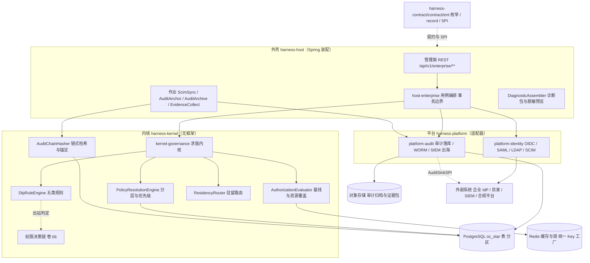
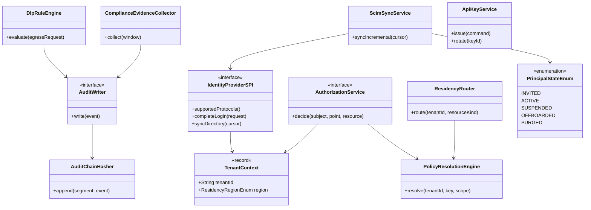
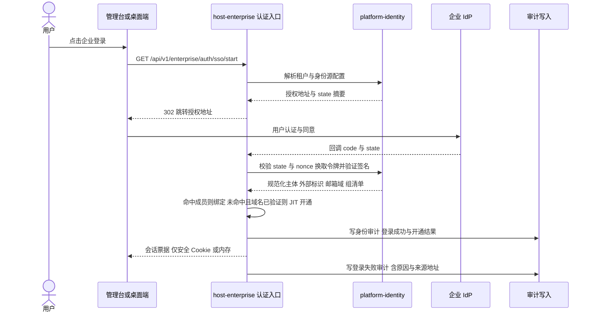
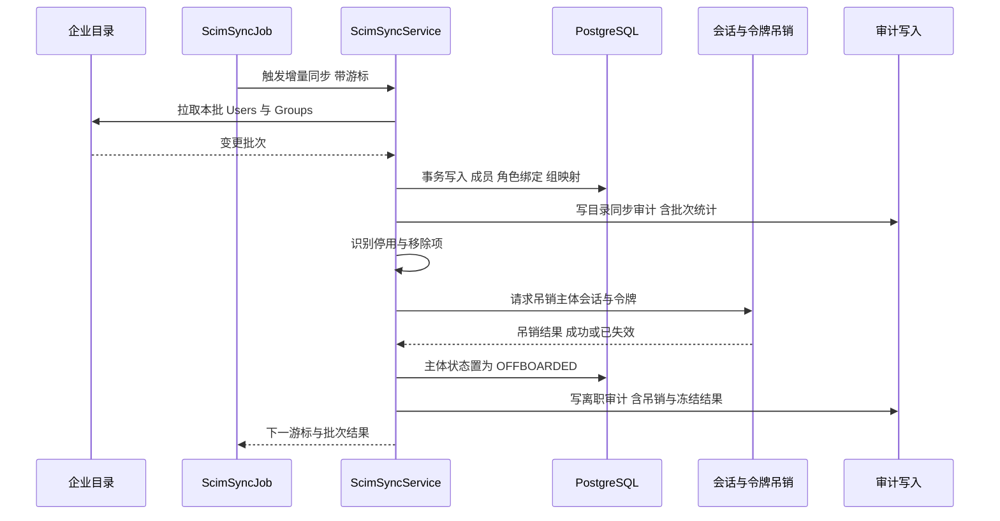
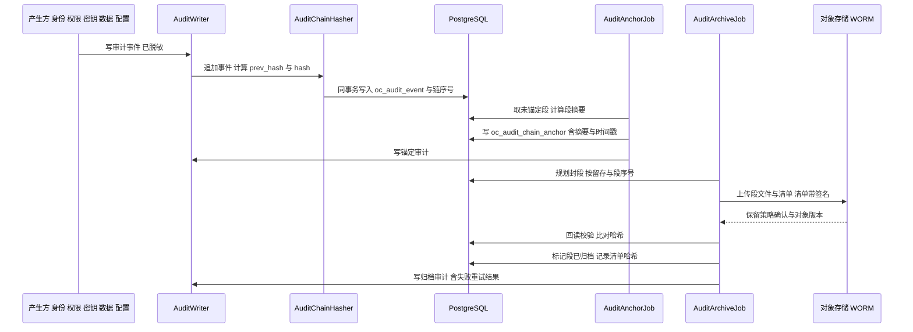
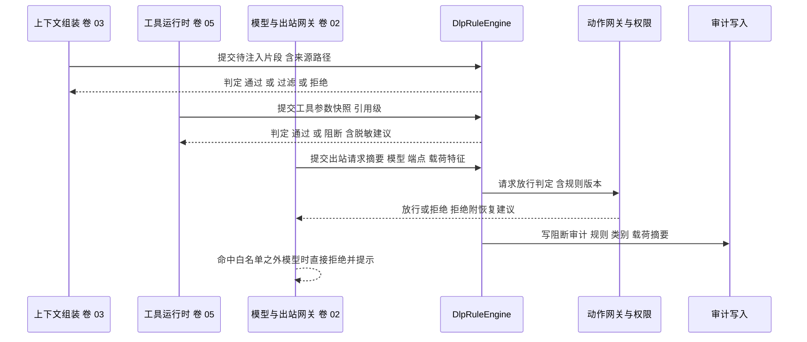
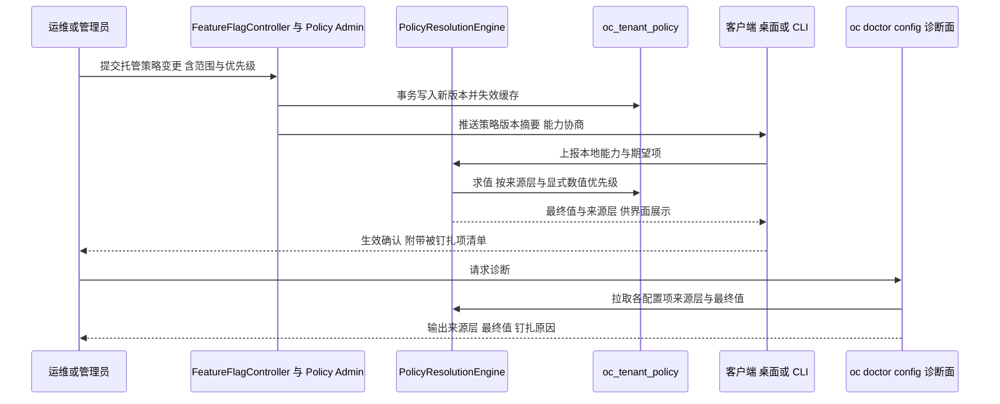
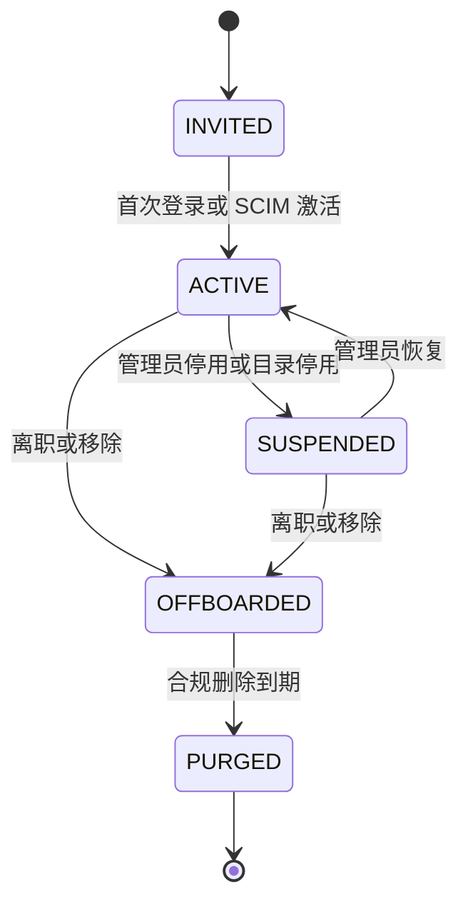
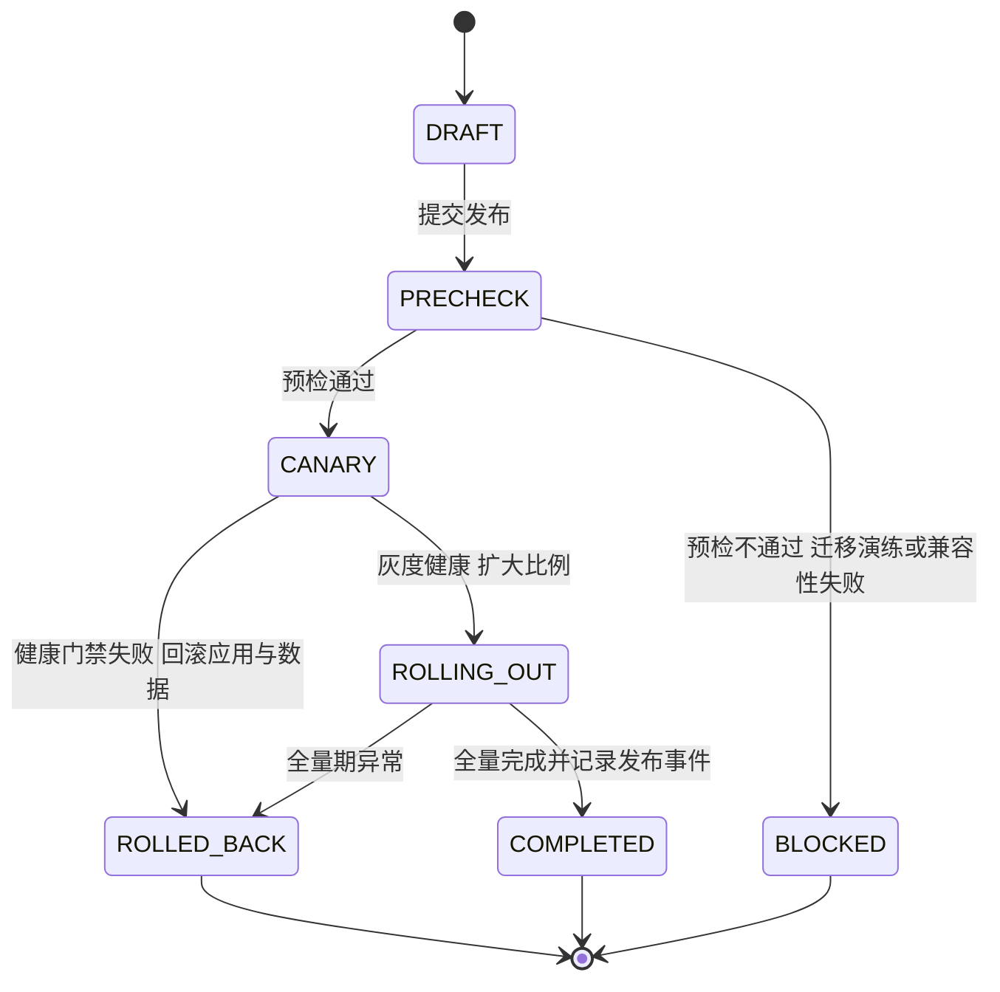

# 实现方案 25 · 企业 IAM 与审计（Enterprise IAM / Audit / Governance）实现技术方案

> 本文件是 Phase B 实现层方案，对应 Phase A 卷 24（`docs/harness/24-enterprise-operations.md`）与域内决策 D-ENT-1…12，覆盖 REQ-ENT-1…12（卷 00 §5.24）的实现落地，并续写 REQ-ENT-13…41。
>
> **实现主线**：**身份面 → 授权面 → 审计面 → 治理面 → 交付面** 五线，全部按「契约与求值在内核侧、适配与用例在外壳侧」落位：
> ① **身份面**（组织三级模型 + SSO/SCIM + 服务账号）；② **授权面**（角色矩阵 + 资源级 ACL + 组织基线不可突破）；③ **审计面**（三级审计 + 哈希链 + WORM 归档 + 合规证据自动采集）；④ **治理面**（DLP 出口管控 + 驻留路由 + 多租户隔离红线）；⑤ **交付面**（四形态私有化 + 升级灰度 + 特性开关 + 诊断包）。
>
> **边界声明（防重复实现）**：配额/计量/预算归 `26-quota-cost-impl.md`（卷 31）；密钥轮换、供应链与密钥代理归 `27-security-runtime-impl.md`（卷 30）；可观测三支柱运行时归 `34-operations-runtime-impl.md`（卷 32）；数据迁移与删除证明归 `19-persistence-recovery-impl.md`（卷 19）。本文件只**消费**其接口并定义企业侧的组合语义。
> 证据标记沿用 `00-research-plan.md` §2：`[E1]` 源码｜`[E2]` 官方文档｜`[E3]` 第三方｜`[E4]` 推断。
> 实现落点：`harness-contract/.../contract/ent/`（契约与 SPI，零框架）+ `harness-kernel/kernel-governance`（纯 Java 求值内核）+ `harness-platform/platform-identity`、`platform-audit`（适配器，Spring 依赖集中于此）+ `harness-host/host-enterprise`（管理面用例编排），分层口径与卷 27 模块地图（contract → kernel → platform → host）一致。

---

## ① 实现目标与范围

### 1.1 本组件解决什么

把「能不能安全地交给一千个人用」变成可运行的机制：**身份可管、权限可证、动作可审、数据可留、版本可控**。

| 线 | 内容 | 本文件章节 |
| --- | --- | --- |
| L1 身份面 | 组织/团队/用户三级模型、OIDC/SAML SSO、SCIM 同步、服务账号与 API Key 生命周期、离职即时生效 | §2/§6.1/§6.2/§8.1/§9.1 |
| L2 授权面 | 内置 7 角色 + 自定义角色 + 资源级覆盖、权限点枚举目录、组织基线不可突破、求值单一入口与缓存 | §3.2/§5/§6.5/§8.2 |
| L3 审计面 | 三级审计分区留存、哈希链与周期锚定、WORM 归档、脱敏导出、审计出海 SPI、合规证据自动采集 | §2/§6.3/§8.3/§9.2 |
| L4 治理面 | DLP 五类规则三层拦截、模型白名单、驻留声明与路由、多租户隔离红线与越界处置、托管策略与钉扎 | §3.4/§3.5/§6.4/§6.5/§8.4 |
| L5 交付面 | 四形态交付物（容器/Helm/离线包/桌面与 CLI）、升级预检与灰度回滚、特性开关灰度、部署能力矩阵、诊断包 | §2/§3.6/§7.2/§8.5/§9.3 |

### 1.2 与 Phase A 的对应关系

| Phase A 决策/条款 | 本文件落实位置 |
| --- | --- |
| D-ENT-1 三级组织模型 + 行级隔离 + 级联配额 | §2 REQ-ENT-13/14、§4 架构、§8.1（`oc_org`/`oc_team`/`oc_membership`） |
| D-ENT-2 身份：本地 + OIDC/SAML + LDAP/AD + SCIM + 服务账号 | §3.1 I-ENT-1、§5 `IdentityProviderSPI`、§6.1/§6.2、§9.1 |
| D-ENT-3 角色模板 + 资源级覆盖 | §3.2 I-ENT-2、§5 `PermissionPointEnum`/`AuthorizationService`、§8.2 |
| D-ENT-4 三级审计（安全/业务/使用）+ 哈希链 + 导出 | §3.3 I-ENT-3、§6.3、§8.3（`oc_audit_event`/`oc_audit_chain_anchor`） |
| D-ENT-5/D-ENT-6/D-ENT-7 配额计费与可观测 | **不在本文件**：出接口给 `26-quota-cost-impl.md`（§9.2 `BillingSinkSPI`、§10.1 准入协作点）；治理域指标与打点见 §10.6 |
| D-ENT-8 四形态交付 + 预检/灰度/回滚 | §3.6 I-ENT-6、§7.2、§9.3（`DeploymentProbeSPI`）、§11.4 |
| D-ENT-9 能力门控 + 多维灰度 + 变更审计 | §3.4 I-ENT-4、§6.5、§8.5（`oc_feature_flag*`） |
| D-ENT-10 驻留声明 + 全链路加密 + 字段级加密 + BYOK | §2 REQ-ENT-28、§3.5、§10.5（密钥引用走卷 30 `SecretPort`） |
| D-ENT-11 模型白名单 + DLP + 出站审查 + 审计 | §3.5 I-ENT-5、§6.4、§8.4（`oc_dlp_rule`/`oc_dlp_block_record`） |
| D-ENT-12 一键诊断包 + 脱敏预览 | §2 REQ-ENT-39、§4（`DiagnosticAssembler`） |
| 卷 24 §4.10 租户化改造清单 + 跨租户红线 1–4 | §2 REQ-ENT-14/29/30、§10.4（红线转为可执行门禁）、§11.3 |
| 卷 24 §5 扩展点 8 个；附录 B §B.3 管理面约定；附录 A §A.5 INV-3/INV-4 | §9.2（8 + 3 SPI）、§9.1（端点与权限点）、§10.4 |
| 卷 24 §10 默认值（留存 3 年/1 年/90 天、Admin/Owner 强制 MFA） | §9.3 配置项默认值、§3.3 回退触发 |
| L-058 企业策略分层与钉扎 | §3.4 I-ENT-4、§6.5、§9.3 钉扎清单附注、§10.9 |
| 卷 06 D-PERM-10（企业基线技术强制不可覆盖） | §3.2 I-ENT-2 选定分支、§6.5、§9.2 `RolePolicySPI` |

### 1.3 本组件不解决什么

- **不解决**权限决策算法本体（卷 06）：本文件产出「主体在某资源上是否持有权限点」的**求值结果与来源层**，决策链的顺序、风险分级、审批编排仍归卷 06；企业基线只是决策链的**硬约束输入**。
- **不解决**配额准入与计费聚合（卷 31/26）：本文件只在请求入口装配租户上下文与主体身份，扣减与预算动作由配额服务完成（§10.1 协作点）。
- **不解决**密钥的生成、轮换与代理注入（卷 30）：本文件只做**凭证引用（`credential_ref`）与生命周期状态**，明文永不落库、落配置、落日志（INV-9）。
- **不解决**终端用户界面（卷 22/33）：管理台只消费 §9.1 REST 面，桌面端/CLI 的登录跳转与令牌存放由端侧负责（§10.5 令牌不落盘要求）；跨区域数据复制（卷 19/23）走导出/导入流程并留审计。

### 1.4 上下游依赖

| 方向 | 依赖对象 | 交互面 |
| --- | --- | --- |
| 上游 | 会话协议与事件总线（卷 01/16） | 事件信封强制 `tenantId`；企业域事件走同一 Schema Registry（code 只增不改，L-052） |
| 上游 | 权限决策链（卷 06） | 消费 `AuthzDecision` 作为基线输入；拒绝优先记录进审计（卷 24 §4.3） |
| 上游 | 持久化（卷 19） | 全部企业表走 `oc_*` 命名 + `tenant_id` 列 + 分区；迁移流水线由 19 提供 |
| 上游 | 安全运行时（卷 30） | `SecretPort` 取密钥引用；DLP 的密钥模式规则与密钥代理联动（L-082） |
| 上游 | 模型网关（卷 02） | 模型白名单在路由前判定；驻留区域参与端点选择 |
| 下游 | 配额与成本（卷 31/26） | 提供 `QuotaScope`（组织/团队/用户/服务账号）与预算归因维度 |
| 下游 | 管理台/CLI/桌面（卷 22/33） | §9.1 REST 面 + `oc doctor config` 诊断面；桌面端登录跳转 |

### 1.5 模块落点

**落地登记（R07：模块 / 顺序 / 批次；清单见 `reviews/R07-scope-build-platform.md`）**：
- **模块坐标**：`harness-contract`（包 `contract/ent`）+ `harness-kernel/kernel-governance`（**扩展模块**：卷 27 §4.1 未列，命名遵循 `harness-<层>/<层前缀>-<域>`，待登记）+ `harness-platform/platform-identity`、`harness-platform/platform-audit`（**卷 27 §4.1 的 `platform-enterprise` 拆分为两子模块的口径，待登记**）+ `harness-host/host-enterprise`（扩展）+ `harness-host/{host-app,host-protocol}`。
- **实施顺序（卷 27 §4.5）**：分两段——① **基础身份/租户/主体模型**（`oc_org`/`oc_identity`/`oc_membership`/`oc_team`）属 B1，须在第 9 步之前可用（`tenant_id` 贯穿是全栈前置，不能等到第 20 步）；② **完整治理面**（SSO/SCIM/策略求值/审计链/DLP/合规证据）随第 **20** 步（依赖第 9/15/19 步）。
- **数据迁移批次**：B1 = `oc_org` `oc_identity` `oc_membership` `oc_team` `oc_service_account` `oc_api_key` `oc_deployment_instance`；B3 = `oc_role` `oc_role_binding` `oc_resource_grant` `oc_tenant_policy` `oc_policy_eval_trace` `oc_audit_event` `oc_audit_chain_anchor` `oc_audit_export` `oc_compliance_control` `oc_compliance_evidence`；B6 = `oc_feature_flag` `oc_feature_flag_override` `oc_dlp_rule` `oc_dlp_block_record` `oc_scim_sync_record`（B6 原文「插件/Skill/Hook/MCP + 企业（配额/预算/特性开关）」已覆盖）。
- **表所有权**：`oc_audit_event` 拥有者本文件（`24` 只写不建）；`oc_acp_session_link` 拥有者 `24`（本文件仅在吊销扇出清单中引用）。
- **I- 决策落点**：`I-ENT-1…7`（7 条）模块落点为上表；类级落点见 §⑤（`AuthorizationEvaluator`/`AuditChainHasher`/`DlpRuleEngine`），逐条绑定登记为 R07 建议 S4。

```text
harness-contract/.../contract/ent/
    枚举：IdentityProtocolEnum / PrincipalKindEnum / PermissionPointEnum / RoleEnum / ApiKeyStateEnum
         AuditCategoryEnum / AuditOutcomeEnum / DlpActionEnum / ComplianceFrameworkEnum
         DeploymentFormEnum / ResidencyRegionEnum / ScimOpEnum / PrincipalStateEnum
    载荷：TenantContext / NormalizedPrincipal / ScimBatch / AuthzDecision / AuditEvent
         DlpDecision / ResidencyDecision / PolicyValue / ComplianceEvidence / DeploymentCapabilityMatrix
    SPI：IdentityProviderSPI / RolePolicySPI / AuditSinkSPI / DlpRuleSPI / FeatureFlagProviderSPI
         ComplianceReportSPI / BillingSinkSPI / DeploymentProbeSPI
         + TenantResolverSPI / MfaChallengeSPI / PolicySourceSPI

harness-kernel/kernel-governance/            # 纯 Java，无 Spring，可单测
    authz/ AuthorizationEvaluator（基线合并 + 资源级覆盖 + 来源层）
    policy/ PolicyResolutionEngine（分层求值 + 显式数值优先级 + 求值轨迹）
    audit/ AuditChainHasher（链式哈希 + 锚定摘要）+ AuditSegmentPlanner（封段与留存）
    dlp/ DlpRuleEngine（五类规则 + 脱敏建议）    residency/ ResidencyRouter（驻留路由）

harness-platform/platform-identity/          # 外壳：OIDC/SAML/LDAP/SCIM 适配器（Spring 依赖集中于此）
harness-platform/platform-audit/             # 外壳：PG 写入、对象存储 WORM 归档、SIEM 出海

harness-host/host-enterprise/                # 外壳：管理面用例与作业
    api/  OrgAdminController / TeamAdminController / RoleAdminController / IdentityAdminController
          ApiKeyAdminController / AuditAdminController / DlpAdminController
          ComplianceController / DeploymentAdminController / FeatureFlagController
    job/  ScimSyncJob / AuditAnchorJob / AuditArchiveJob / EvidenceCollectJob / ConfigDriftJob
    diag/ DiagnosticAssembler（诊断包 + 脱敏预览）
```

**纪律**：`kernel-governance` 不得依赖 Spring 与 `platform-*`（R1/R2）；契约与 SPI 只出现在 `harness-contract`；管理面写操作用例一律 `@Transactional(rollbackFor = Exception.class)`，外部目录/IdP 调用移出事务（§6.1/§6.2 的 `AFTER_COMMIT` 说明）。

---

## ② 功能需求清单（REQ-ENT-13…41，续卷 00 §5.24 的 REQ-ENT-1…12）

| REQ | 需求描述 | 来源 | 优先级 | 验收要点 |
| --- | --- | --- | --- | --- |
| REQ-ENT-13 | **三级组织模型落地**：组织（计费/合规/策略根）→ 团队（协作与预算单元）→ 用户/服务账号；跨团队共享必须显式授权且留痕 | 卷 24 D-ENT-1/§4.1 | P0 | 跨团队访问未授权一律拒绝；共享动作产生 `ent.grant.changed` 事件 |
| REQ-ENT-14 | **租户上下文 Fail-Fast**：协议面入口、事件消费、定时任务三处强制装配；持久层强制注入租户条件，缺条件即以测试失败阻断 | 卷 24 §4.10 红线 1；附录 A INV-3 | P0 | 无租户条件的查询在集成测试中被扫描器判失败 |
| REQ-ENT-15 | **SSO 双协议**：OIDC（Discovery URL 一键配置）与 SAML 2.0 同组织二选一；属性映射必含邮箱；JIT 开通限定「已验证邮箱域名」；本地账号保留为 break-glass 兜底 | 卷 24 D-ENT-2；竞品 Qoder 六步配置与域名自动入组 [E2]（`research/competitors/07-qoder.md` §4.23） | P0 | OIDC 与 SAML 各有端到端用例；未验证域名的 JIT 开通被拒 |
| REQ-ENT-16 | **SCIM 2.0 同步**（Users/Groups 全量与增量）：游标可续、冲突可诊断、组到团队映射可配、离职即时生效 | 卷 24 D-ENT-2；竞品 Qoder **未观测到 SCIM**（缺口即我们的增量）[E2]（`07` §4.23/§10-12） | P0 | 1,000 用户首次同步 ≤ 5 分钟；停用后既有会话与令牌在 1 分钟内失效 |
| REQ-ENT-17 | **服务账号与 API Key 生命周期**：签发（scope 限定）→ 轮换（重叠窗口）→ 吊销（即时）→ 过期（到期自动失效）；记录最后使用时间与来源 IP 段；密钥值只存摘要与 `credential_ref` | 卷 24 D-ENT-2；竞品 DeepSeek「配置只引用 key 名、不落值、轮换后无需改配置」[E1]（`research/competitors/04-deepseek-harness.md` §4.21） | P0 | 明文不出现在库、配置、日志、事件四处（扫描用例）；轮换期间新旧双活不超过重叠窗口 |
| REQ-ENT-18 | **内置 7 角色 + 自定义角色 + 资源级覆盖**：权限点目录枚举化（code + desc + `of()` 工厂）；资源级覆盖只可**收窄或显式追加**，追加必须记授权来源 | 卷 24 D-ENT-3/§4.2 | P0 | 角色矩阵逐格用例；非法权限点 code 抛业务异常而非默认放行 |
| REQ-ENT-19 | **组织基线不可被下级突破**（INV-4）：任一求值结果不得放大上级范围；求值产出「生效来源层 + 策略版本」并写入求值轨迹 | 卷 24 D-ENT-3；卷 06 D-PERM-10；附录 A INV-4 | P0 | 构造上下级冲突矩阵，全部结果等于上级约束 |
| REQ-ENT-20 | **求值性能与缓存**：授权判定 P95 ≤ 5ms；缓存键含租户与策略版本，策略变更广播失效（不依赖 TTL） | 卷 24 §7；竞品 Claude Code 策略缓存问题（`feature()` 组合导致行为漂移）[E4]（`01` §7-4） | P0 | 缓存命中 P95 ≤ 1ms；策略发布后 1s 内全局一致 |
| REQ-ENT-21 | **三级审计落地**：① 安全审计（身份/权限/密钥/沙箱/数据/配置）② 业务审计（任务/提交/审批）③ 使用审计（功能与用量）；默认留存 3 年/1 年/90 天 | 卷 24 D-ENT-4/§4.3/§10 | P0 | 三类各有写入与查询用例；留存策略可被租户覆盖但不可低于合规下限 |
| REQ-ENT-22 | **安全审计哈希链**：`prev_hash` 顺序链 + 周期锚定摘要；提供 `verify` 工具，任意篡改可定位到段与序号 | 卷 24 D-ENT-4/§7 | P0 | 篡改一行后校验失败并输出首个断裂点 |
| REQ-ENT-23 | **WORM 归档**：按段导出（清单 + 签名 + 校验和）→ 合规保留写入对象存储；回读校验通过才算归档成功 | 卷 24 D-ENT-4；Phase B 新增（介质与流程在本文件 I-ENT-6） | P0 | 归档对象不可删改（保留策略验证）；回读哈希一致 |
| REQ-ENT-24 | **审计导出脱敏**：导出前逐项预览，敏感字段按规则替换；大数据量异步任务 + 幂等 + 权限点校验 | 卷 24 §4.9；竞品 MiniMax 诊断产物只出**计数投影**与不透明归档名 [E1]（`research/competitors/05-minimax-cli.md` §4.13） | P0 | 导出包中无密钥/明文手机号；预览项与最终替换一致 |
| REQ-ENT-25 | **管理操作 MFA**：Admin/Owner 默认强制，企业可要求全体；本地形态降级为「口令 + 二次确认」并如实声明 | 卷 24 §7/§10 | P0 | 未完成 MFA 的管理写操作一律拒绝 + 审计 |
| REQ-ENT-26 | **模型白名单与 DLP 五类规则**：模型/端点白名单（含提示与审计）、数据外发模式、目录限制、工具限制、出站审查；越界**阻断并给出脱敏重试建议**，不静默拦截 | 卷 24 D-ENT-11/§4.8 | P0 | 五类规则各有用例；阻断响应含 `recovery` 建议与 `traceId` |
| REQ-ENT-27 | **托管制收窄扩展面**：托管模式下插件/钩子/MCP 只允许托管清单（`allowManaged*` 语义），项目级设置不得自举危险模式 | 卷 24 D-ENT-9；竞品 Claude Code `allowManagedHooksOnly/PermissionRulesOnly/McpServersOnly` [E2]（`01` §4.23） | P0 | 项目设置尝试开启被拒并留痕；托管清单为空时按「拒绝全部非内置」处理 |
| REQ-ENT-28 | **数据驻留声明与路由**：租户级区域声明 → 模型端点/对象存储/向量库/缓存分片选择受驻留约束；跨区传输需显式放行并留审计 | 卷 24 D-ENT-10 | P0 | 未放行的跨区请求被拒；路由决策进审计 |
| REQ-ENT-29 | **多租户隔离落地清单**：缓存键含租户前缀、向量索引带租户标签与前置过滤、对象存储前缀按租户、沙箱执行域按租户、搜索与投影自动过滤 | 卷 24 §4.10（逐域清单） | P0 | 清单逐行有对应测试；缺失即视为隔离缺陷 |
| REQ-ENT-30 | **跨租户命中即安全事件（SEV2）**：检测到越界读写、跨租户缓存命中、索引串味时冻结相关会话并告警 | 卷 24 §4.10 红线 3 | P0 | 注入越界访问触发 SEV2 事件与冻结动作 |
| REQ-ENT-31 | **企业策略下发与强制基线**：设置来源分层（用户 < 项目 < 本地 < 托管）+ 环境变量钉扎（供应商/认证类从非托管来源剥离）+ 危险模式禁止由项目设置自举 | L-058（`research/LESSONS-AND-ADOPTIONS.md`）；竞品 Claude Code 122 项托管变量剥离 [E1]（`01` §4.21） | P0 | 钉扎清单与 `.env.example` 差集为空；项目设置无法覆盖托管项 |
| REQ-ENT-32 | **托管配置入库与服务端求值**：`oc_tenant_policy` 存托管项（含版本、生效范围、显式数值优先级）；客户端只上报能力；`oc doctor config` 输出每项来源层与最终值 | L-058；卷 24 D-ENT-9 | P0 | 求值轨迹可回放；运维可解释「某策略为何不生效」 |
| REQ-ENT-33 | **特性开关多维灰度**：按部署形态/租户/团队/用户/百分比；开关变更即事件（可回放，不出现「同版本行为不可解释」） | 卷 24 D-ENT-9；竞品 Claude Code 远端开关随机翻转的反面证据 [E4]（`01` §7-4） | P0 | 灰度 10%→50%→100% 可执行且可回退；变更全量留痕 |
| REQ-ENT-34 | **合规映射**：等保 2.0 三级与 SOC 2 TSC 控制项目录（枚举）→ 控制项到机制映射表（控制项 ID → 机制实现 → 证据来源 → 责任域）；缺口报告可导出 | 卷 24 §5 `ComplianceReportSPI`；Phase B 新增可执行化 | P0 | 映射表逐行可点回机制与证据；缺口项明确标「未覆盖」 |
| REQ-ENT-35 | **控制项证据自动采集**：周期采样（配置快照、审计链锚定、备份与演练记录、密钥轮换记录、DLP 命中统计）→ 证据包（哈希 + 时间戳 + owner） | 卷 24 §5/§7 | P0 | 证据包可离线校验；采集缺失即缺口告警 |
| REQ-ENT-36 | **四形态交付与离线包**：容器镜像（多架构）+ Helm Chart + 离线包（镜像 + 依赖 + 迁移工具 + 回滚介质）+ 桌面/CLI 包；离线包附**逐文件清单 + 敏感串门禁 + 未执行验收项边界声明** | 卷 24 D-ENT-8；竞品 MiniMax「已审查公开投影 + `check:source` + NOT RUN 边界声明」[E1]（`05` §3.3/§8-1） | P0 | 清单与包内容差集为空；发现内网地址/凭据即发布阻断 |
| REQ-ENT-37 | **升级流程**：预检（迁移演练 + 兼容性 + 依赖检查）→ 灰度（按实例/租户，默认 1 个租户）→ 全量 → 回滚（应用版本 + 可回滚迁移）；不可回滚迁移必须先走 expand-contract | 卷 24 D-ENT-8/§4.6；卷 19 D-PERS-2/3 | P0 | 演练脚本可执行；回滚后数据一致（校验用例） |
| REQ-ENT-38 | **部署形态能力矩阵**：local/server/enterprise-server/air-gapped 四形态逐能力声明（SSO、SCIM、MFA、WORM、SIEM 出海等），不可用项**显式降级声明**；启动自检输出形态与版本身份 | 卷 24 §4.5；竞品 Qoder `vpcInstanceName` 式形态开关 [E2]（`07` §4.22） | P0 | 四形态矩阵逐格有测试；不支持能力请求返回 `UNSUPPORTED_CAPABILITY` |
| REQ-ENT-39 | **一键诊断包**：环境摘要 + 装配计划 + 连接状态 + 最近错误（脱敏）+ 指标快照 + 可选会话轨迹；导出前脱敏预览；大对象只出计数投影 | 卷 24 D-ENT-12/§4.9；竞品 MiniMax 计数投影 [E1]（`05` §4.13） | P0 | 包内无敏感明文；预览项与包内实际一致 |
| REQ-ENT-40 | **管理面本地化**：管理台文案与合规报告模板按 locale 成对维护（成对缺失即门禁失败），后端只提供结构化数据 | 卷 24 §4.11；竞品 DeepSeek 双语文档成对 + `i18n.yaml` 配对与 CI fresh 校验 [E1]（`04` §3.1/§4.24） | P1 | 文案键差集为空；报告模板两语种结构一致 |
| REQ-ENT-41 | **管理面统一约定**：全部端点带权限点校验、`Idempotency-Key` 幂等、cursor 分页与分页上限（防超大 size 拖垮库）、错误结构走附录 B §B.7 | 附录 B §B.3；`config-extraction-rules.md` §6 分页上限 | P0 | 超上限的分页请求返回 `INVALID_ARGUMENT`；重复幂等键不产生二次副作用 |

**竞品增量需求说明**：REQ-ENT-15/16/17/24/27/31/36/39/40 来自竞品源码级或官方文档证据（Qoder SSO 六步与 SCIM 缺口、DeepSeek 凭据 key 引用与双语文档成对、MiniMax 计数投影与交付投影门禁、Claude Code 托管收窄与钉扎清单），其中 REQ-ENT-16/36/40 是**我们相对竞品补齐的差项**（竞品未做或未公开），REQ-ENT-27/31 是**同向采纳但按多租户改造**（L-058 的「托管配置应入库而非单机文件」）。

---

## ③ 技术方案选型（M×N 比选）

**评分口径**：沿用 `README.md` §4 —— F 功能完整度 30%、U 用户体验 20%、S 落地稳定性 25%、M 企业级可维护性 25%，满分 10，加权总分 = (0.30F + 0.20U + 0.25S + 0.25M) × 10；并列时按 F > S > M > U 决胜。每个维度的选定分支登记为 `I-ENT-n`，被放弃分支写「代价 + 回退触发」。

### 3.1 M1 身份联邦集成方式 → I-ENT-1

| 分支 | 描述 | F/U/S/M | 总分 | 结论 |
| --- | --- | --- | --- | --- |
| B1 自研协议栈 | 直接以 Nimbus/OpenSAML 实现 OIDC 与 SAML 校验 | 9/7/6/6 | 71.0 | 放弃：协议细节（时钟偏移、密钥轮换、重放窗口）自维护成本高，S/M 落后 |
| **B2 外壳层成熟栈 + 契约面只留 SPI** | OIDC Login 与 SAML2 Service Provider 落在 `platform-identity`；`harness-contract` 只留 `IdentityProviderSPI` | **9/8/8/9** | **85.5** | **选定** |
| B3 身份网关外部化 | 信任企业前置网关的签名断言，本产品不接 IdP | 7/8/8/7 | 74.5 | 放弃：把身份可靠性外包给客户网关，U 与 F 均受限（air-gapped 形态作为兼容路径保留） |

**放弃代价与回退触发**：弃 B1 的代价是「协议栈升级需跟随外壳框架版本」；弃 B3 的代价是「涉密客户需额外部署网关」。**回退触发**：① 若客户红头要求「零第三方身份库」，启用 B3 兼容路径（`TrustedAssertionProvider` 实现，关闭 B1/B2 之外的协议解析）；② 若外壳框架的 OIDC 实现出现无法修复的安全缺陷（CVE 无法在 30 天内消解），切换到 B1 实现同一 SPI。

### 3.2 M2 租户隔离实现方式 → I-ENT-2

| 分支 | 描述 | F/U/S/M | 总分 | 结论 |
| --- | --- | --- | --- | --- |
| B1 显式传参 + 人工过滤 | 每个查询手写租户条件 | 6/7/6/6 | 62.0 | 放弃：遗漏即越界，红线 1 无法机械保证 |
| **B2 持久层强制注入 + 测试扫描** | 租户条件由持久层拦截器强制注入（`TenantLineHandler` 语义），并配「无租户条件即失败」的集成测试扫描 | **9/8/8/9** | **85.5** | **选定** |
| B3 物理隔离（每租户独立库/schema） | 租户间物理不共享 | 8/6/5/6 | 63.5 | 放弃：成本与运维复杂度高，且与「同源五形态」的 local 形态冲突 |

**放弃代价与回退触发**：弃 B1 的代价是「拦截器存在误伤（需白名单机制，白名单本身是风险面）」；弃 B3 的代价是「高隔离客户需整套独立实例」。**回退触发**：出现涉密客户要求物理隔离时，走卷 24 D-ENT-1 的备选分支「实例即租户」（单租户部署），B2 拦截器在同租户实例上退化为直通（保留代码路径与测试）。

### 3.3 M3 审计存储与不可篡改性 → I-ENT-3

| 分支 | 描述 | F/U/S/M | 总分 | 结论 |
| --- | --- | --- | --- | --- |
| B1 应用日志 + WORM 文件 | 复用日志管道落只追加文件 | 6/7/8/6 | 67.0 | 放弃：查询能力弱，哈希链需另建，F/M 落后 |
| **B2 关系表 + 哈希链 + 周期锚定 + WORM 归档** | 审计落 `oc_audit_event`（分区），链式哈希 + 周期锚定摘要，封段后归档到 WORM 对象 | **9/8/9/9** | **88.0** | **选定** |
| B3 只追加日志集群 | Kafka + 不可变日志存储作为审计事实源 | 8/7/6/8 | 73.0 | 放弃：引入第二套事实源与运维栈，与 H-005（PG 为事实源）冲突 |

**放弃代价与回退触发**：弃 B1 的代价是「审计与运行日志分家，排障需两个入口」；弃 B3 的代价是「超大规模写入靠分区与批量化消化」。**回退触发**：若审计写入 P95 连续 7 天 > 卷 24 §4.7（SLO/SLI 表「事件写入 P95 ≤ 10ms」）的预算且优化无效，启用 B3 形态的「审计总线 + 独立存储」通道（`AuditSinkSPI` 不变，仅替换 sink 实现与消费端）。

### 3.4 M4 企业策略下发与强制基线 → I-ENT-4（L-058 落点）

| 分支 | 描述 | F/U/S/M | 总分 | 结论 |
| --- | --- | --- | --- | --- |
| B1 单机配置文件 | 各端各存一份托管配置 | 5/6/7/4 | 54.5 | 放弃：多租户下谁都能改，管控形同虚设 |
| **B2 托管配置入库 + 服务端求值 + 钉扎清单 + 防自举** | `oc_tenant_policy` 存托管项；服务端按「来源层 + 显式数值优先级」求值；钉扎清单为唯一权威表；项目设置不得自举危险模式 | **9/8/8/9** | **85.5** | **选定** |
| B3 远端开关服务 | 托管项放远端开关服务，按实验随机翻转 | 8/7/6/5 | 65.5 | 放弃：破坏「策略快照可回放」，运维无法解释行为差异 |

**放弃代价与回退触发**：弃 B1 的代价是「本地单机形态需提供等价通道」；弃 B3 的代价是「灰度只能靠开关版本推进，牺牲实时调整」。**回退触发**：单租户 local 形态无服务端时，降级为「签名基线文件 + 完整性校验」（`PolicySourceSPI` 的 `SIGNED_FILE` 实现），诊断面标注「来源：签名文件，未经过服务端求值」。

### 3.5 M5 DLP 出口管控位置 → I-ENT-5

| 分支 | 描述 | F/U/S/M | 总分 | 结论 |
| --- | --- | --- | --- | --- |
| B1 仅网关出站扫描 | 只在模型/HTTP 出口扫一遍 | 7/7/8/7 | 72.5 | 放弃：上下文层与工具参数层的泄露面未覆盖（如把密钥写进提交） |
| **B2 三层拦截** | 上下文层（目录/模式过滤）+ 工具层（参数快照检测）+ 出站层（模型请求与外部 HTTP）；阻断给脱敏建议 | **9/8/8/9** | **85.5** | **选定** |
| B3 端点 MITM 全流量代理 | 沙箱出口做 TLS 终结与正文替换 | 8/6/5/6 | 63.5 | 放弃：证书与客户端兼容成本高（L-082 已将其限定为 L2/L3 可选叠加） |

**放弃代价与回退触发**：弃 B1 的代价是「三层判定重复计算，需统一规则版本」；弃 B3 的代价是「非 HTTP 协议（如 gRPC 流式）的正文替换能力弱」。**回退触发**：当沙箱上报执行强度为 `PARTIAL`（L-012）时，三层中的「文件级遮蔽」自动拒绝并降级为「阻断 + 人工放行」路径；**禁止静默降级**（卷 07 D-SBOX-11）。

### 3.6 M6 WORM 归档介质 → I-ENT-6

| 分支 | 描述 | F/U/S/M | 总分 | 结论 |
| --- | --- | --- | --- | --- |
| **B1 对象存储合规保留** | 兼容 S3 的 Object Lock 或云厂商保留策略（compliance 模式） | **8/8/9/9** | **85.0** | **选定** |
| B2 离线介质导出 | 磁带/介质导出 + 介质哈希 + 人工入库存证 | 7/5/8/7 | 68.5 | 放弃为主路径：自动化程度低（保留为 air-gapped 兜底） |
| B3 自建只追加校验集群 | 自建存储 + 定期校验 | 7/6/6/7 | 65.5 | 放弃：自证清白力度弱于第三方保留策略 |

**放弃代价与回退触发**：弃 B2 的代价是「无对象存储客户需人工流程」；弃 B3 的代价是「换云厂商时保留策略需重新验证」。**回退触发**：air-gapped 且无对象存储时走 B2（导出清单 + 介质哈希 + 入库记录进 `oc_compliance_evidence`），归档格式不变。

### 3.7 选定结论登记

| I-决策 | 维度 | 选定分支 | 关键不变量 |
| --- | --- | --- | --- |
| I-ENT-1 | 身份联邦集成方式 | B2 外壳成熟栈 + 契约 SPI | 新增身份源不改认证入口代码 |
| I-ENT-2 | 租户隔离实现 | B2 持久层强制注入 + 测试扫描 | 无租户条件即测试失败（红线 1） |
| I-ENT-3 | 审计存储与不可篡改 | B2 关系表 + 哈希链 + 锚定 + WORM | 安全审计缺失即告警（100% 完整率） |
| I-ENT-4 | 企业策略下发 | B2 入库 + 服务端求值 + 钉扎 + 防自举 | 组织基线不可被下级突破（INV-4） |
| I-ENT-5 | DLP 拦截位置 | B2 三层拦截 + 显式拒绝降级 | 能力缺失时拒绝而非静默放行 |
| I-ENT-6 | WORM 归档介质 | B1 对象存储合规保留 | 回读校验通过才算归档成功 |

**汇总说明**：以上 6 条 `I-` 决策由 `impl/IMPL-DECISIONS.md` 汇总；与 Phase A 无冲突（均为 D-ENT-1…12 的实现级细化）；`I-ENT-4` 显式承载 L-058（§6.2 G2 要求被采纳机制必须出现在比选中）。

### 3.8 与竞品对照的取舍（research 证据）

| 对照维度 | 竞品证据 | 我们的取舍 | 主动放弃的收益 |
| --- | --- | --- | --- |
| 企业能力重心 | 策略下发派：Codex/Grok `requirements.toml`、Gemini admin 策略不可覆盖、Cline remote-config；账号体系派：仅 Qoder（SAML/OIDC + Audit Log + VPC），审计 schema 未公开（`research/CROSS-COMPARISON.md` §2.3 与观察 7）[E1][E2] | 两派都做但**分序落地**：受管配置 + 审计先行，SSO/SCIM 紧随（对齐 D9） | 不做网关式身份外包 → 涉密客户需前置网关时走 §3.1 B3 兼容路径 |
| 托管收窄强度 | Claude Code 122 项环境变量钉扎 + `allowManaged*Only` 三开关（`competitors/01` §4.23）[E2] | 同向采纳并多租户化：钉扎常量类 + 服务端求值（L-058；REQ-ENT-31/32） | 本地单机形态牺牲实时性，改签名基线文件兜底（§3.4 回退触发） |
| 凭据零明文 | DeepSeek「配置只引用 key 名、轮换下次请求生效、UI 不暴露值」（`competitors/04` §4.21）[E1] | 全采纳为 API Key 摘要 + `credential_ref`（REQ-ENT-17） | 运维无法从库内取回密钥，须走密钥服务按需申请 |
| 审计不可篡改 | 9 家均**未观测到**哈希链 + WORM 归档组合；唯一有 Audit Log 的 Qoder schema 未公开（`CROSS-COMPARISON.md` §5 N4） | 自建三层证据（链 + 锚点 + WORM）并开放校验接口，列为差异化项（I-ENT-3/6） | 引入对象存储合规保留依赖；air-gapped 降级为离线介质（§3.6 B2） |
| 交付与诊断边界 | MiniMax「计数投影 + `check:source` + NOT RUN 边界声明」（`competitors/05` §3.3/§8-1）[E1] | 采纳为诊断包/离线包纪律（REQ-ENT-36/39） | 诊断包可读性下降，深度排障需走按需审批 |

---

## ④ 总体架构图



**装配点**：`host-enterprise` 由 `@ConditionalOnProperty(open-coding.enterprise.enabled=true)` 装配；local 形态默认关闭管理面并启用「本地主体解析 + 本地审计（不归档）」；`platform-identity` 仅在配置了身份源时装配，缺失时以本地账号与 break-glass 路径启动并在能力矩阵标注。

---

## ⑤ 类图



### 5.1 关键 Java 21 签名（契约面，符合 `.qoder/rules/`）

```java
/**
 * 租户上下文（请求与任务级不可变载体）。
 * 由外壳在协议面入口、事件消费、定时任务三处装配；内核与平台层一律通过本类型读取，
 * 禁止使用 ThreadLocal 直接取值——虚拟线程切换与异步续跑会丢失绑定，进而产生越租户风险。
 */
public record TenantContext(String tenantId, String orgId, ResidencyRegionEnum region, PrincipalRef actor) {

    /** 紧凑构造：缺失租户或驻留声明即 Fail-Fast（附录 A INV-3）。 */
    public TenantContext {
        Objects.requireNonNull(tenantId, "租户上下文未装配：tenantId 缺失");
        Objects.requireNonNull(region, "驻留声明未加载：region 缺失");
    }
}

/**
 * 身份源扩展点（OIDC / SAML / LDAP / 托管断言）。
 * 新增企业身份源只需实现本接口并注册进装配计划，禁止在认证入口堆叠分支判断。
 */
public interface IdentityProviderSPI {

    /**
     * 该身份源支持的协议种类。
     *
     * @return 协议枚举集合（非空；同一组织同时启用多种协议时由托管策略决定优先级）
     */
    Set<IdentityProtocolEnum> supportedProtocols();

    /**
     * 用授权码或断言结束登录流程并产出规范化主体。
     *
     * @param request 认证回调载荷（必填；含 state、授权码与原始断言）
     * @return 规范化主体（外部主体标识、邮箱域、显示名与组清单）
     * @throws HarnessException state 校验失败、断言签名无效或必需声明缺失时抛出（契约面属内核层带，见 §9.4 异常命名约定）
     */
    NormalizedPrincipal completeLogin(SsoCallbackRequest request);

    /**
     * 增量拉取或推送目录变更。
     *
     * @param cursor 上次同步游标（可空表示全量）
     * @return 本批变更与下一游标（无变更时返回空集合而非 null）
     * @throws HarnessException 上游目录不可用或载荷格式非法时抛出（目录调用在事务外，见 §6.2 `AFTER_COMMIT`）
     */
    ScimBatch syncDirectory(ScimCursor cursor);
}

/**
 * 授权求值单一入口（INV-4：成员权限 ⊆ 团队权限 ⊆ 会话权限 ⊆ 租户策略 ⊆ 组织基线）。
 * 管理面与内核权限决策必须经本入口；禁止在业务代码内自行拼装角色判断。
 */
public interface AuthorizationService {

    /**
     * 判定主体在指定资源上是否持有权限点。
     *
     * @param subject  主体引用（用户或服务账号，必填）
     * @param point    权限点（枚举，必填；见 PermissionPointEnum）
     * @param resource 资源引用（可空表示组织级；非空时参与资源级覆盖合并）
     * @return 判定结果（含是否放行、生效来源层与策略版本，供解释与审计）
     * @throws HarnessException 租户上下文缺失或组织基线被突破时抛出
     */
    AuthzDecision decide(PrincipalRef subject, PermissionPointEnum point, ResourceRef resource);
}

/**
 * 权限点目录（内置角色组合与自定义角色的原子来源）。
 * code 用于策略与审计存储，desc 面向管理台展示；非法 code 一律抛业务异常，禁止回落默认放行。
 */
@Getter
@RequiredArgsConstructor
public enum PermissionPointEnum {

    /** 会话创建与任务执行 */
    SESSION_CREATE("session.create", "会话创建"),
    /** 组织与团队策略编辑（含基线下发） */
    POLICY_EDIT("policy.edit", "策略编辑"),
    /** 审计读取与导出 */
    AUDIT_READ("audit.read", "审计读取");

    private final String code;
    private final String desc;

    /**
     * 按 code 解析权限点。
     *
     * @param code 权限点编码（必填）
     * @return 对应权限点
     * @throws HarnessException 编码未登记时抛出（Fail-Fast，避免静默放行）
     */
    public static PermissionPointEnum of(String code) {
        for (PermissionPointEnum point : values()) {
            if (point.code.equals(code)) {
                return point;
            }
        }
        throw new HarnessException(ErrorCode.PARAM_INVALID, "未知权限点：" + code);
    }
}

/**
 * 企业治理配置（节选：其余字段见 §9.3 配置项表）。
 * 影响身份、审计、治理与升级核心逻辑；部署时按环境变量覆盖（敏感项默认留空并由启动校验兜底）。
 */
@Getter
@Setter
@ConfigurationProperties(prefix = "open-coding.enterprise")
public class EnterpriseProperties {

    /** 企业能力总开关（默认 false；server 与 enterprise-server 形态由部署模板置 true） */
    private boolean enabled;

    /** 授权求值缓存 TTL 秒（默认 30；策略版本变更立即失效，不等待 TTL） */
    private int authzCacheTtlSeconds;

    /** 安全审计留存天数（默认 1095；不得低于合规下限，低于下限时启动失败） */
    private int auditRetentionSecurityDays;

    /** 管理面分页上限（默认 200；防止超大 size 拖垮数据库） */
    private int adminPageSizeMax;
}
```

---

## ⑥ 核心流程时序图

### 6.1 SSO 登录与 JIT 开通



- **前置条件**：组织已启用 SSO 且域名已验证；`state` 与 `nonce` 由服务端生成并短期缓存。
- **主路径**：如上；绑定成功后按角色矩阵求值（§3.2）并返回最小会话票据。
- **异常与补偿**：断言签名无效、时钟偏移超容忍窗口、域名未验证时拒绝登录并写失败审计；IdP 不可达时返回 `DEPENDENCY_UNAVAILABLE`（可重试）并提示 break-glass 路径（仅在托管策略允许时开放）。
- **JIT 开通加固（R04 安全轮新增，防伪造身份与域接管）**：断言必须通过 **issuer / audience / nonce / 签名算法（拒绝 `alg=none` 与算法降级）/ 时钟偏移** 全链校验；`email_verified=true` 且邮箱域在本租户**已验证**、**未被其他租户占用**（域独占校验，防「先注册域后接管」）；JIT 只授予**最小默认角色**（禁止默认 Admin/Owner，权限提升必须走显式授权与 MFA）；同一 `state`/`nonce` 只消费一次；JIT 开通速率超阈值（默认 10 次/分钟/租户，可配）即告警并可自动转为人工复核（防批量伪造账号）。
- **幂等与并发点**：同一 `state` 只允许消费一次（Redis 一次性票据，键经 `RedisKeys.entSsoState(tenantId, stateDigest)`）；JIT 开通以 `(tenantId, idpCode, externalSubject)` 唯一约束兜底，重复回调返回既有成员；写审计为异步批量，但**登录失败与 JIT 开通**要求先落盘后返回。

### 6.2 SCIM 增量同步与离职即时生效



- **前置条件**：SCIM 凭据（`credential_ref`）有效；组到团队映射表已配置。
- **主路径**：增量拉取 → 事务落库（成员/绑定/组映射）→ 离职分支（**吊销扇出**，见下）→ 审计。
- **吊销扇出清单（R04 安全轮新增，防「SCIM 离职但令牌仍活」）**：离职/停用主体必须级联吊销 ① 会话票据（桌面 / CLI / Web / ACP 会话 `oc_acp_session_link`）；② `oc_api_key` 全部 `ACTIVE`/`ROTATING` 记录；③ 长期令牌与 PAT；④ 该主体持有的服务账号密钥（按策略**转交**或**冻结**，禁止留活）；⑤ 桌面设备令牌（重登即失效）；⑥ **外部委托凭据**：A2A 调用方（`24-a2a-gateway-impl.md` §9.5「凭据生命周期与即时吊销」）、MCP OAuth 授权与服务器凭据（卷 09/18）、IM/Webhook 回调令牌（卷 16/24）；⑦ 该主体创建的分享链接（`23-desktop-electron-vue-impl.md` §10.5，`share-link` 撤销即时生效）。**SLA：吊销完成 ≤ 5 分钟**（对齐 `27-security-runtime-impl.md` REQ-SEC-8「离职/泄露事件触发吊销 ≤ 5 分钟」）；吊销结果与未完成项写入 `oc_scim_sync_record` 与 `ent.identity.offboarded` 事件。
- **异常与补偿**：上游 429/5xx 按指数退避重试（游标不推进，保证不丢不重）；单条冲突（邮箱重复、组缺失）记入 `oc_scim_sync_record` 并跳过该条，其余继续，批次结束后输出冲突清单；**吊销失败**（如会话服务不可达）时主体状态仍置 `OFFBOARDED` 并进入重试队列，重试期间该主体所有请求在授权求值首层被拒（并在 5 分钟 SLA 超限时升级告警 + 冻结租户内相关凭据为全局拒绝）。
- **幂等与并发点**：批次以 `(tenantId, syncKind, cursorDigest)` 幂等键去重；同步作业由 `RedisKeys.lock(RedisKeys.Module.ENT, "scim-sync", tenantId, syncKind)` 串行化，重叠触发复用同一游标；吊销动作逐主体幂等（已失效视为成功）。
- **漂移对账（R06 新增，防「增量丢事件导致权限残留」）**：增量同步之外，每租户按 `scim.reconcile-cron`（默认每日 03:00）执行**全量对账**——分页拉全量目录 → 与 `oc_membership`/`oc_identity`/组映射做三方比对 → 产出四类差异：① 目录有本地无（漏建，含「离职事件丢失」）；② 本地有目录无（漏删 / 挂起候选）；③ 字段漂移（角色 / 邮箱 / 组归属）；④ 组未映射（映射表缺失）。差异落 `oc_scim_sync_record.conflicts` 并发 `ent.identity.scim.drift` 事件（新增，§8.7），漂移率 `oc_scim_drift_ratio` 超阈值（默认 0.5%）告警。**自动修复边界**：漏建/漏删可自动修复（逐条留审计），**角色与组映射类漂移只报告不自动改**（防目录误配一键放大权限）；修复与增量同步共用同一幂等键与分布式锁，禁止并行。验收（§⑪.4）：注入「删除增量丢失」→ 对账发现漏删并修复；注入「角色漂移」→ 只报告不改且有告警。

### 6.3 审计写入、哈希链锚定与 WORM 归档



- **前置条件**：`oc_audit_event` 已按月分区；对象存储支持合规保留（I-ENT-6）。
- **主路径**：写入即链接（同事务保证链不断）；周期锚定形成「锚点 + 链」双层证据；封段归档并回读校验。
- **异常与补偿**：归档失败不删除源数据、进入重试并告警（超过重试上限转人工工单）；**链断裂**（`prev_hash` 不匹配）视为 SEV1，冻结该分区写合并触发取证流程；锚点写入失败不阻塞业务写入但触发告警。
- **幂等与并发点**：归档以 `(tenantId, segmentId)` 幂等，重复上传同段返回既有对象版本；链序号由数据库唯一约束 + 悲观读保证严格递增；锚定任务由 `RedisKeys.lock(Module.ENT, "audit-anchor", tenantId)` 保证单实例执行。

### 6.4 DLP 三层阻断



- **前置条件**：租户已发布 DLP 规则集（版本化）；模型白名单已配置。
- **主路径**：三层各调一次判定，规则集版本随判定结果返回，便于解释「为什么被拦」。
- **异常与补偿**：规则引擎不可用时按**拒绝优先**（fail-closed）处理并告警；误报采用「临时放行单」（限时、限主体、限规则、双人确认、留审计），不做全局关规则。
- **幂等与并发点**：判定结果按 `(ruleVersionDigest, payloadDigest)` 短期缓存（仅缓存「通过」结果，避免把阻断缓存成放行）；放行单使用 `Idempotency-Key`；规则版本更新通过 `RedisKeys.entDlpRuleVersion(tenantId)` 广播失效。

### 6.5 策略求值与钉扎（含来源层与诊断）



- **前置条件**：托管策略写入者持有 `policy.edit` 且完成 MFA；钉扎清单与 `.env.example` 已同步。
- **主路径**：变更入库（乐观锁）→ 版本广播 → 客户端按来源层求值 → 诊断面可解释。
- **异常与补偿**：客户端离线时沿用上一版本并上报「策略版本滞后」；求值出现「下级试图覆盖托管项」时**拒绝该次求值并保留上级值**，同时写审计与告警（不得静默忽略）；托管项缺失时按「安全默认」（拒绝放行类能力）处理。
- **幂等与并发点**：策略版本单调递增，更新用乐观锁（`version` 字段）且更新行数不为 1 时抛业务异常并提示刷新重试；多实例缓存在版本变更后 1s 内一致（版本号比对 + 广播）。

---

## ⑦ 状态机

### 7.1 主体状态（成员与服务账号）



**规则**：离开 `ACTIVE` 即触发令牌与 API Key 吊销（§6.2 吊销扇出清单，含 A2A/ACP 委托与 MCP OAuth）；`OFFBOARDED` 状态下保留审计与工作对象归属（可转移），不参与授权求值；`PURGED` 仅删除个人数据，审计保留按留存策略（卷 19 删除证明联动）。**离职时效（R04 新增）**：`ACTIVE/SUSPENDED → OFFBOARDED` 的吊销完成 SLA ≤ 5 分钟；吊销未确认期间该主体**所有**认证入口（含已签发未过期令牌）按 fail-closed 拒绝（授权求值首层拒绝 + 认证层拒绝双侧兜底，防「只在授权层拦」被旁路）。

**删除模型（全栈一致，依赖 `impl/10` §③ B1 选定）**：企业与审计域**不引入第二套删除语义**，一律复用「**级联删除 + 备份 tombstone 重放 + 删除证明**」——① 主体数据删除按 §8 表族级联（组织/成员/服务账号/凭据引用），每一步产出计数并入删除证明（`oc_*_deletion_proof` 同构，落审计）；② 备份侧登记 tombstone 并由恢复流程重放，保证「恢复演练后个人数据仍不可召回」；③ **WORM 段与审计链的不可删改不与删除权冲突**：审计事件只存主体引用（`subject_ref` 哈希 + `credential_ref`），个人数据以字段级加密落库、密钥由 KMS 按主体/租户维度派生（DEK），删除即**销毁 DEK（crypto-shredding）**——密文留存满足合规保留期，明文不可恢复；④ 审计链哈希只覆盖脱敏后载荷与引用（§10.5 哈希公式），DEK 销毁不破坏链校验与回读逐字节比对。依赖：密钥服务（`27-security-runtime-impl`）提供 DEK 派生与销毁，删除证明格式与演练由卷 19 统一定义；本文件只登记企业侧穿透点（组织/成员/凭据引用/驻留声明）。

### 7.2 升级发布状态



**规则**：`PRECHECK` 必含迁移演练与兼容性检查（不可回滚迁移必须先走 expand-contract，卷 19）；`CANARY` 默认 1 个租户，`ROLLING_OUT` 按 10% → 50% → 100%（比例来自配置而非硬编码）；任意阶段失败都必须能回到 `ROLLED_BACK` 或 `BLOCKED` 两个安全终止态。

### 7.3 组织与身份生命周期（R06 新增：邀请 → 激活 → 角色变更 → 离职 → 数据交接）

| 阶段 | 触发 | 动作与约束 | SLA / 证据 |
| --- | --- | --- | --- |
| 组织创建 | 平台开通 / 自助开通 | 落 `oc_org`（`residency_region` + `audit_retention_policy` 必填）；首个 Owner 由开通流程显式授予（**禁止** JIT 路径产生 Owner） | 审计 `ent.tenant.created` |
| INVITED 邀请 | 管理员邀请 / SCIM 首次拉取到未激活成员 | 邀请票据一次性、TTL 默认 72h（配置化）；未激活主体**不参与授权求值、不占席位预算**；过期邀请转「待重新邀请」 | 邀请与过期均审计 |
| ACTIVE 激活 | 首次登录（SSO JIT 或本地）或 SCIM 激活 | JIT 只授最小默认角色（§6.1）；激活后自动挂团队映射（有则挂、无则进「未分组」清单而非自动建团队） | 激活 ≤ 1 个登录往返；`ent.identity.sso.bound` |
| 角色 / 归属变更 | 管理员操作 / SCIM 组映射 | 只可收窄或显式追加（REQ-ENT-18），追加记 `granted_by` 与理由；**权限提升必须 MFA**；缓存版本广播后 1s 内全局一致（REQ-ENT-20） | `ent.grant.changed` 含前后值与来源层 |
| SUSPENDED 停用 | 管理员 / 目录停用 / 风险熔断 | 立即执行吊销扇出（§6.2，SLA ≤ 5 分钟）；资产保留但不可访问；恢复需显式管理员动作 | 吊销结果 + `ent.identity.offboarded`（含 reason=SUSPENDED） |
| OFFBOARDED 离职 | SCIM 移除 / 管理员 / 离职流程 | ① 吊销扇出七类入口（§6.2）；② **资产交接**：在 `handoverWindowDays`（默认 30）内完成「会话 / 项目 / 知识库 / 服务账号 / 自动化模板 / 团队黑板」归属转移，默认接收人 = 团队 Owner，缺省进「待认领」清单；③ 未认领 90 天进入合规删除评估（**禁止资产孤儿化**） | 交接清单逐项计数入审计；90 天未认领告警 |
| PURGED 删除 | 留存到期 + 合规评估 | 复用 §7.1 删除模型（级联删除 + 备份 tombstone + DEK 销毁 + 删除证明）；**审计与会话轨迹按卷 24 留存策略保留**（不随主体删除消失，也不因删除请求而提前删除） | 删除证明 + 计数；删除后 WORM 与链校验仍全绿 |

**不变量**：任一阶段都不得出现「已离职仍可授权求值」的窗口（认证层 + 授权层双侧 fail-closed，§7.1）；任何资产交接**不得改变租户归属**（跨租户交接必须走导出/导入并留审计，卷 24 红线 2）；离职交接的接收人变更同样进审计（防「悄悄转移给外部人员」）。

---

## ⑧ 数据模型

### 8.1 组织与身份

| 表 | 关键字段 | 索引/约束 | 留存/分区 |
| --- | --- | --- | --- |
| `oc_org` | `tenant_id`、`name`、`residency_region`、`audit_retention_policy`、`sso_protocol` | PK `(tenant_id)`；`residency_region` 非空 | 长期 |
| `oc_team` | `team_id`、`tenant_id`、`name`、`parent_org_id` | `(tenant_id, name)` 唯一 | 长期 |
| `oc_membership` | `membership_id`、`tenant_id`、`team_id`、`principal_id`、`role_code`、`state` | `(tenant_id, team_id, principal_id)` 唯一；`(tenant_id, principal_id, state)` | 长期 |
| `oc_identity` | `identity_id`、`tenant_id`、`principal_id`、`idp_code`、`external_subject`、`email_domain` | `(tenant_id, idp_code, external_subject)` 唯一 | 长期 |
| `oc_service_account` | `sa_id`、`tenant_id`、`name`、`owner_principal_id`、`state`、`branch_allowlist` | `(tenant_id, name)` 唯一 | 长期 |
| `oc_api_key` | `key_id`、`tenant_id`、`principal_id`、`key_prefix`、`key_digest`、`scope_set`、`state`、`expires_at`、`last_used_at` | `(tenant_id, key_prefix)` 唯一（仅存摘要）；`state` 部分索引仅供 `ACTIVE`/`ROTATING` | 吊销后 1 年 |
| `oc_scim_sync_record` | `record_id`、`tenant_id`、`sync_kind`、`cursor_digest`、`batch_stat`、`conflicts` | `(tenant_id, sync_kind, created_at DESC)` | 1 年 |
| `oc_role` | `role_id`、`tenant_id`、`code`、`name`、`point_set`（JSONB）、`builtin` | `(tenant_id, code)` 唯一 | 长期 |
| `oc_role_binding` / `oc_resource_grant` | `binding_id`、`tenant_id`、`principal_id`、`role_code`、`scope_ref`、`granted_by`、`expires_at` | `(tenant_id, principal_id, scope_ref)`；`expires_at` 部分索引 | 授权变更后 3 年 |

### 8.2 策略与开关

| 表 | 关键字段 | 索引/约束 | 留存/分区 |
| --- | --- | --- | --- |
| `oc_tenant_policy` | `policy_id`、`tenant_id`、`key`、`value`（JSONB）、`source_layer`、`priority`、`scope_ref`、`version` | `(tenant_id, key, scope_ref)` 唯一 + 乐观锁 `version` | 变更历史 3 年 |
| `oc_policy_eval_trace` | `eval_id`、`tenant_id`、`principal_id`、`key`、`chosen_layer`、`inputs_digest`、`result` | `(tenant_id, created_at DESC)`；`eval_id` 唯一 | 90 天（排障用） |
| `oc_feature_flag` / `oc_feature_flag_override` | `flag_key`、`tenant_id`、`default_value`、`rollout_percent`、`scope_ref`、`enabled` | `(tenant_id, flag_key, scope_ref)` 唯一 | 变更留痕进审计 |
| `oc_deployment_instance` | `instance_id`、`deployment_form`、`version`、`capability_matrix`（JSONB）、`identity_label` | `(deployment_form, version)` | 长期 |

### 8.3 审计与合规

| 表 | 关键字段 | 索引/约束 | 留存/分区 |
| --- | --- | --- | --- |
| `oc_audit_event` | `audit_id`、`tenant_id`、`category`、`action`、`outcome`、`actor_ref`、`resource_ref`、`detail`（JSONB，已脱敏）、`prev_hash`、`hash`、`chain_seq`、`occurred_at` | `(tenant_id, category, occurred_at)`；`(tenant_id, chain_seq)` 唯一 | 按 `(tenant_id, occurred_at)` 月分区；安全 3 年 / 业务 1 年 / 使用 90 天 |
| `oc_audit_chain_anchor` | `anchor_id`、`tenant_id`、`segment_id`、`anchor_digest`、`anchored_at`、`anchor_signer` | `(tenant_id, segment_id)` 唯一 | 永久 |
| `oc_audit_export` | `export_id`、`tenant_id`、`query_ref`、`state`、`object_ref`、`manifest_digest`、`idempotency_key` | `idempotency_key` 唯一；`(tenant_id, state, created_at DESC)` | 导出记录 3 年，包体随 WORM 策略 |
| `oc_compliance_control` | `control_id`、`framework`、`clause_ref`、`mechanism_ref`、`evidence_kind`、`owner_domain` | `(framework, control_id)` 唯一 | 长期 |
| `oc_compliance_evidence` | `evidence_id`、`tenant_id`、`control_id`、`window_start`、`window_end`、`payload_digest`、`collected_at`、`collector` | `(tenant_id, control_id, window_start)` 唯一 | 按框架要求（默认 3 年） |

### 8.4 治理（DLP 与驻留：驻留声明落 `oc_org.residency_region`，跨区放行项落 `oc_tenant_policy`，不单独建表）

| 表 | 关键字段 | 索引/约束 | 留存/分区 |
| --- | --- | --- | --- |
| `oc_dlp_rule` | `rule_id`、`tenant_id`、`rule_kind`（模型白名单 / 外发模式 / 目录限制 / 工具限制 / 出站审查）、`matcher`（JSONB）、`action`、`version`、`enabled` | `(tenant_id, rule_kind, version)` 唯一 | 规则历史 3 年 |
| `oc_dlp_block_record` | `block_id`、`tenant_id`、`rule_id`、`layer`（上下文 / 工具 / 出站）、`principal_id`、`payload_digest`、`recovery_hint` | `(tenant_id, layer, created_at DESC)` | 1 年（含规则版本） |

### 8.5 Redis Key（统一 Key 工厂，禁止业务代码拼接）

| Key | 用途 | TTL |
| --- | --- | --- |
| `RedisKeys.entAuthzCache(tenantId, principalId, scopeDigest)` | 授权判定缓存（含策略版本号）；键含租户前缀（红线 3） | 随 `authzCacheTtlSeconds`，版本变更即失效 |
| `RedisKeys.entPolicyVersion(tenantId)` / `RedisKeys.entDlpRuleVersion(tenantId)` | 托管策略与 DLP 规则集版本号（广播失效依据，亦为判定缓存键组成） | 无 TTL |
| `RedisKeys.entSsoState(tenantId, stateDigest)` | 一次性 `state` 票据（防重放） | 10 分钟（配置化） |
| `RedisKeys.entScimCursor(tenantId, syncKind)` | 同步游标热副本 | 随同步周期 |
| `RedisKeys.entDlpRuleVersion(tenantId)` | 规则集版本（判定缓存键组成部分） | 无 TTL |
| `RedisKeys.entApiKeyUsage(keyId)` | 最后使用时间写入去抖计数 | 1 小时滚动 |
| `RedisKeys.lock(RedisKeys.Module.ENT, "scim-sync", tenantId, syncKind)` | 同步串行化锁 | 租约 300s，看门狗续约 |
| `RedisKeys.lock(RedisKeys.Module.ENT, "audit-anchor", tenantId)` | 锚定任务单实例锁 | 租约 600s |

### 8.6 对象存储前缀

| 前缀 | 内容 | 保留 |
| --- | --- | --- |
| `oc-audit-worm/{tenantId}/{yyyy}/{mm}/segment-{segmentId}.jsonl.zst` | 审计段（封段后写入，合规保留）与同目录 `manifest/{segmentId}.json` 清单 | 按留存策略，不可删改 |
| `oc-compliance-evidence/{tenantId}/{framework}/{window}/` | 证据包与校验文件 | 默认 3 年 |
| `oc-diagnostic/{tenantId}/{requestId}/` | 诊断包（脱敏后，短期） | 30 天 |

### 8.7 事件类型清单（只增不改，L-052）

| 事件 | 说明 |
| --- | --- |
| `ent.tenant.created` / `ent.org.updated` / `ent.team.member.changed` / `ent.grant.changed` | 组织、团队与授权变更 |
| `ent.identity.login` / `ent.identity.logout` / `ent.identity.sso.bound` / `ent.identity.scim.synced` / `ent.identity.scim.drift`（R06 新增） / `ent.identity.offboarded` | 身份（含离职吊销与冻结结果、SCIM 全量对账漂移四类差异） |
| `ent.apikey.issued` / `ent.apikey.rotated` / `ent.apikey.revoked` | API Key 生命周期 |
| `ent.policy.changed` / `ent.featureflag.changed` / `ent.deploy.precheck.failed` / `ent.upgrade.gray.progressed` | 策略、开关与发布 |
| `ent.dlp.blocked` / `ent.model.denied` / `ent.residency.violation` / `ent.residency.cross_region.granted` / `ent.cross_tenant.denied` | 治理（含跨租户越界 SEV2，触发冻结流程） |
| `ent.audit.exported` / `ent.audit.chain.anchored` / `ent.audit.archive.written` / `ent.audit.chain.broken` | 审计面（含 SEV1 断裂） |
| `ent.compliance.evidence.collected` / `ent.compliance.gap.detected` / `ent.diagnostic.exported` / `ent.mfa.challenged` | 合规证据与缺口、诊断与 MFA |

**指标（与卷 24 §6 命名对齐）**：`oc_tenant_active`、`oc_audit_events_total{category,outcome}`、`oc_audit_chain_breaks_total`、`oc_dlp_block_total{rule_kind,layer}`、`oc_authz_eval_seconds`、`oc_authz_cache_hit_ratio`、`oc_sso_login_total{protocol,result}`、`oc_scim_sync_batch_seconds`、`oc_policy_eval_conflict_total`、`oc_cross_tenant_denied_total`、`oc_compliance_gap_total{framework}`；**R06 新增** `oc_scim_drift_ratio{tenant}`、`oc_handover_pending_total{tenant}`、`oc_credential_revocation_latency_seconds`（离职吊销扇出耗时，P99 目标 ≤ 5 分钟）、`oc_outstanding_invites_total{tenant}`。

---

## ⑨ 接口与扩展点

### 9.1 管理面 REST（延续附录 B §B.3，全部要求 MFA 与权限点）

| 端点 | 方法 | 说明 | 权限点 | MFA |
| --- | --- | --- | --- | --- |
| `/api/v1/enterprise/orgs` | GET/POST/PUT | 组织与驻留声明、留存策略 | `org.manage` | 是 |
| `/api/v1/enterprise/teams` | CRUD | 团队与成员 | `team.manage` | 写操作要求 |
| `/api/v1/enterprise/roles` | CRUD | 内置与自定义角色（权限点集合）与资源级覆盖（`grants` 子资源） | `role.manage` / `policy.edit` | 是 |
| `/api/v1/enterprise/identity-providers` | CRUD + `POST test` + SCIM 子资源（凭据轮换与手动同步） | OIDC/SAML/LDAP 配置与连通性测试、SCIM 触发 | `identity.manage` | 是 |
| `/api/v1/enterprise/identity-providers/{id}/scim/reconcile` | POST + `GET report` | **全量对账**（R06 新增）：触发/查询漂移报告（四类差异 + 自动修复逐条结果；角色类漂移只报告） | `identity.manage` | 是 |
| `/api/v1/enterprise/handover` | GET + `POST {action: assign\|reassign\|claim}` | **离职资产交接**（R06 新增）：待认领清单、指定/改派接收人、认领动作；全部进审计 | `member.manage` | 是 |
| `/api/v1/enterprise/service-accounts` | CRUD | 服务账号与分支白名单 | `member.manage` | 是 |
| `/api/v1/enterprise/api-keys` | POST + `POST rotate` + `POST revoke` | API Key 生命周期（响应只回显一次明文） | `apikey.manage` | 是 |
| `/api/v1/enterprise/policies` | GET/PUT + `GET evals/{id}` | 托管策略（含版本与优先级）与求值轨迹 | `policy.edit` | 是 |
| `/api/v1/enterprise/features` | GET/PUT | 特性开关与灰度（沿用附录 B `/api/v1/features`） | `feature.manage` | 是 |
| `/api/v1/audit/events` | GET + `POST export` | 三级审计查询与导出（含 `scope` 与 `category` 过滤） | `audit.read` | 读不要求，导出要求 |
| `/api/v1/audit/chain/verify` | POST | 链校验（区间与段）与归档状态查询（`/audit/archives`） | `audit.read` | 是 |
| `/api/v1/enterprise/dlp/rules` | CRUD + `POST test` | DLP 规则（五类）与命中预演 | `policy.edit` | 是 |
| `/api/v1/enterprise/residency` | GET/PUT | 驻留声明与跨区放行 | `policy.edit` | 是 |
| `/api/v1/enterprise/compliance/controls` | GET | 控制项与映射表 | `audit.read` | 否 |
| `/api/v1/enterprise/compliance/evidence` | GET + `POST collect` | 证据查询与手动采集 | `audit.read` | 是 |
| `/api/v1/enterprise/deployments` | GET + `POST precheck` | 实例矩阵、预检报告 | `system.update` | 是 |
| `/api/v1/enterprise/upgrades` | POST + `POST rollback` | 灰度推进与回滚 | `system.update` | 是 |
| `/api/v1/diagnostics` | GET + `POST export` | 诊断包与脱敏预览 | `diagnostics.read` | 是 |

**约定**：分页 cursor + `pageSize ≤ adminPageSizeMax`；写操作支持 `Idempotency-Key`；错误结构按附录 B §B.7，新增错误码见 §9.4；跨租户访问一律 `CROSS_TENANT_DENIED`。

### 9.2 SPI 扩展点（登记进卷 18 目录）

| SPI | 来源 | 说明 |
| --- | --- | --- |
| `IdentityProviderSPI` | 卷 24 §5 | 新身份源（OIDC/SAML/LDAP/托管断言） |
| `RolePolicySPI` | 卷 24 §5 | 自定义角色与权限点（校验必须走 `PermissionPointEnum`，禁止自由字符串） |
| `BillingSinkSPI` | 卷 24 §5 | 计费系统对接（实现由 `26-quota-cost-impl.md` 提供，本文件只登记归属） |
| `ComplianceReportSPI` | 卷 24 §5 | 合规报告模板（等保/SOC 2 扩展框架） |
| `FeatureFlagProviderSPI` | 卷 24 §5 | 开关来源（本地配置 / 企业平台） |
| `AuditSinkSPI` | 卷 24 §5 | 审计出海（SIEM/数据湖），要求至少一次投递 + 去重键 |
| `DlpRuleSPI` | 卷 24 §5 | DLP 规则扩展（新 `rule_kind` 必须声明匹配器与脱敏策略） |
| `DeploymentProbeSPI` | 卷 24 §5 | 部署预检项扩展（迁移演练、兼容性、依赖检查） |
| `TenantResolverSPI` / `MfaChallengeSPI` / `PolicySourceSPI` | Phase B 新增 | 租户解析（域名 / 头 / 目录，本地形态返回单租户）；二次因子来源（TOTP / IdP step-up / 本地确认）；托管策略来源（服务端求值 / 签名基线文件，对齐 I-ENT-4 回退触发） |

### 9.3 配置项（`open-coding.enterprise.*`，`EnterpriseProperties`；纯数据类不加 `@Component`，由 `@ConfigurationPropertiesScan` 激活）

| 字段 | 说明（默认值、必填性、影响面） | 环境变量 |
| --- | --- | --- |
| `enabled` | 企业能力总开关（默认 false；enterprise-server 形态必填 true） | `OPENCODING_ENTERPRISE_ENABLED` |
| `authzCacheTtlSeconds` | 授权缓存 TTL（默认 30；过大会延迟策略生效）；`authzEvalBudgetMs` 单次求值预算（默认 5） | `OC_ENT_AUTHZ_CACHE_TTL` |
| `auditRetentionSecurityDays` | 安全审计留存（默认 1095；低于合规下限启动失败） | `OC_ENT_AUDIT_RETENTION_SEC_DAYS` |
| `auditRetentionBusinessDays` / `auditRetentionUsageDays` | 业务审计 365 / 使用审计 90（默认值；租户可覆盖但不得低于下限） | `OC_ENT_AUDIT_RETENTION_BIZ_DAYS`、`OC_ENT_AUDIT_RETENTION_USE_DAYS` |
| `auditAnchorIntervalMinutes` | 锚定间隔（默认 60；影响篡改定位精度）；`auditArchiveBatchSize` 归档批量（默认 10000） | `OC_ENT_AUDIT_ANCHOR_MIN` |
| `dlpMode` | DLP 模式（`ENFORCE` / `MONITOR`，默认 `ENFORCE`；`MONITOR` 仅用于灰度上线验证，需托管策略允许） | `OC_ENT_DLP_MODE` |
| `residencyDefaultRegion` | 默认驻留区域（必填；缺失时启动失败） | `OC_ENT_RESIDENCY_REGION` |
| `rolloutInitialPercent` | 灰度初始百分比（默认 10，对齐卷 24 §4.6 的 10% → 50% → 100% 与 REQ-ENT-33；开关灰度与升级灰度共用此基线） | `OC_ENT_ROLLOUT_INITIAL_PERCENT` |
| `adminPageSizeMax` | 管理面分页上限（默认 200） | `OC_ENT_ADMIN_PAGE_SIZE_MAX` |
| `mfaRequiredRoles` | 强制 MFA 的角色集合（默认 Admin 与 Owner） | `OC_ENT_MFA_ROLES` |
| `identity.oidc.issuerUri` / `identity.oidc.clientId` | OIDC 配置（企业身份源启用时必填） | `OPENCODING_SSO_ISSUER`、`OPENCODING_SSO_CLIENT_ID` |
| `identity.oidc.clientSecret` | OIDC 客户端密钥（**敏感，默认留空，仅环境变量注入**） | `OPENCODING_SSO_CLIENT_SECRET` |
| `identity.saml.metadataUri` / `identity.saml.entityId` | SAML 元数据与实体标识（启用 SAML 时必填） | `OC_ENT_SAML_METADATA_URI`、`OC_ENT_SAML_ENTITY_ID` |
| `identity.scim.credentialRef` | SCIM 凭据引用（**不存明文**，指向卷 30 密钥服务） | `OC_ENT_SCIM_CREDENTIAL_REF` |
| `scim.reconcileCron` / `scim.driftRatioThreshold` | 全量对账周期（默认每日 03:00；对账为只读拉取 + 有限自动修复，见 §6.2）/ 漂移率告警阈值（默认 0.5；超阈值告警并暂停自动修复） | `OC_ENT_SCIM_RECONCILE_CRON`、`OC_ENT_SCIM_DRIFT_RATIO` |
| `handover.windowDays` / `handover.unclaimedAlertDays` | 离职资产交接窗口（默认 30 天）/ 未认领告警阈值（默认 90 天，触发合规删除评估） | `OC_ENT_HANDOVER_WINDOW_DAYS`、`OC_ENT_HANDOVER_UNCLAIMED_DAYS` |
| `breakGlassEnabled` | break-glass 本地账号开关（默认 false；仅托管策略允许时开启） | `OC_ENT_BREAK_GLASS_ENABLED` |

**Fail-Fast 规则**：`enabled=true` 且 `residencyDefaultRegion` 为空 → 启动失败；启用 OIDC/SAML 但密钥缺失 → 启动失败并明确报错；`auditRetentionSecurityDays` 低于合规下限 → 启动失败；`dlpMode=MONITOR` 但托管策略未显式放行 → 启动失败。

**钉扎清单附注（REQ-ENT-31）**：托管模式下需从非托管来源剥离的环境变量分三类，唯一权威表为实现侧常量类 `EnterprisePinnedEnvConstants`，与 `.env.example` 同源生成、差集必须为空——① 供应商路由类（`ANTHROPIC_*`、`OPENAI_*`、`OLLAMA_HOST`）；② 认证与会话类（`OPENCODING_SSO_*`、break-glass 凭据）；③ 危险模式类（权限模式与沙箱档位，禁止由项目级设置自举）。

### 9.4 新增错误码（延续附录 B §B.7）

| 错误码 | 语义 | 恢复建议 |
| --- | --- | --- |
| `TENANT_CONTEXT_MISSING` | 租户上下文缺失（INV-3） | 检查调用方身份与路由配置 |
| `CROSS_TENANT_DENIED` | 跨租户访问被拒（同时发 SEV2 事件） | 走显式导出/导入流程 |
| `SSO_STATE_INVALID` | `state` 过期或已消费（重放防护） | 重新发起登录 |
| `SCIM_CONFLICT` | 目录条目冲突（邮箱重复、组缺失） | 在冲突清单中人工裁决后重跑 |
| `DLP_BLOCKED` | 命中出站规则 | 按返回的脱敏建议修改后重试 |
| `RESIDENCY_VIOLATION` | 触犯驻留约束 | 申请跨区放行或改选区域内端点 |
| `AUDIT_CHAIN_BROKEN` | 审计链断裂（SEV1） | 冻结相关分区并启动取证 |
| `MFA_REQUIRED` | 管理操作缺少 MFA | 完成二次校验后重试 |
| `POLICY_BASELINE_VIOLATION` | 下级设置试图突破组织基线 | 由管理员在上级范围调整 |

**异常命名约定**（对齐 `impl/README.md` §5.5）：内核域带（`kernel-governance`）失败抛 `HarnessException(ErrorCode, 中文文案)`；外壳域带（`host-enterprise` / `platform-identity`）抛 `BusinessException(ErrorCode, 中文文案)`；两者均由全局异常处理器按 `ErrorCode` 映射为附录 B §B.7 统一错误响应；**禁止**裸 `RuntimeException` / `IllegalArgumentException` / 空文案异常。

### 9.5 错误矩阵（场景 → 错误码 → 对外文案 → 处置）

| 场景 | 错误码 | 对外文案（中文） | 客户端建议动作 | 服务端动作 |
| --- | --- | --- | --- | --- |
| 协议面/作业面未装配租户上下文 | `TENANT_CONTEXT_MISSING` | 租户上下文缺失，请检查身份配置 | 重新登录 | 拒绝 + WARN 日志 + 计数 |
| 跨租户读写或缓存键碰撞 | `CROSS_TENANT_DENIED` | 无权访问该资源 | 走导出/导入流程 | SEV2 事件 + 冻结会话 + 取证快照 |
| `state` 过期或已消费（重放） | `SSO_STATE_INVALID` | 登录状态已失效，请重新发起 | 重新发起登录 | 记失败审计（含来源地址） |
| SCIM 邮箱重复 / 组缺失 | `SCIM_CONFLICT` | 同步存在冲突条目，需人工裁决 | 查看冲突清单 | 游标不推进 + 冲突清单落 `oc_scim_sync_record` |
| DLP 命中出站规则 | `DLP_BLOCKED` | 命中数据外发规则，已阻断 | 按脱敏建议修改后重试 | `oc_dlp_block_record` + `ent.dlp.blocked` |
| 请求超出驻留区域 | `RESIDENCY_VIOLATION` | 该操作超出数据驻留区域 | 申请跨区放行 | 拒绝 + 审计（含路由决策） |
| 审计链校验失败 | `AUDIT_CHAIN_BROKEN` | 审计完整性校验失败（SEV1） | 联系安全值班 | 冻结分区写 + 取证 + 告警 |
| 管理写操作缺 MFA | `MFA_REQUIRED` | 需要二次验证 | 完成 step-up 后重试 | 不产生任何副作用 |
| 下级设置突破组织基线 | `POLICY_BASELINE_VIOLATION` | 该设置超出组织基线，已被拒绝 | 联系管理员 | 保留上级值 + 求值轨迹留痕 |
| API Key 已吊销或过期 | `NOT_FOUND` / `AUTH_REQUIRED` | 凭据无效或已失效 | 重新签发 | 命中吊销缓存即拒绝，不落明文库 |
| 归档对象存储不可用 | `DEPENDENCY_UNAVAILABLE` | 归档服务暂不可用（可重试） | 稍后重试 | 段不标记已归档 + 重试 + 告警 |
| 分页超上限 / 非法参数 | `INVALID_ARGUMENT` | 请求参数不合法 | 收敛参数 | 返回上限值与合法范围 |

---

## ⑩ 非功能与工程细节

### 10.1 并发模型与外部系统协作

- **请求面**：管理面读多写少，读走虚拟线程 + 缓存，写走固定事务边界（`@Transactional(rollbackFor = Exception.class)`）；所有写操作在事务提交后才推送策略/开关版本（避免「已对外可见但未提交」）。
- **作业面**：SCIM 同步、锚定、归档、证据采集四类作业各自独立调度，互不阻塞；每类作业由分布式锁保证单实例执行（§8.5）。
- **审计写入与配额协作**：审计异步批量（有界队列 + 批量落库），队列水位超阈值时对**安全审计**切同步写入并告警（放弃吞吐保完整率 —— 审计完整性 **fail-closed**）；请求进入时装配 `TenantContext` 并调用配额准入（卷 31），配额服务不可用时按卷 24 §7「宽松放行 + 告警」处理（配额准入 **fail-open**，高风险租户可配严格模式 fail-closed；与 `impl/26`「预算闸门 fail-closed / 计量 fail-open」成对，二者边界见 26 §⑩.5）。

### 10.2 性能预算

| 项 | 预算 | 说明 |
| --- | --- | --- |
| 授权求值 | P95 ≤ 5ms；缓存命中 P95 ≤ 1ms | 单次求值只做基线合并 + 资源覆盖 |
| SCIM 同步 | 1,000 用户首次全量 ≤ 5 分钟；增量批次 ≤ 30s；策略求值 P95 ≤ 20ms；SSO 登录 P95 ≤ 2s | 批量 500 条/事务 |
| 审计写入 | P95 ≤ 10ms（卷 24 §4.7 SLO/SLI 表；§7 仅述「审计写入异步、不阻塞主流程、失败告警」）；审计查询 P95 ≤ 2s（近 30 天，更早区间走归档回读） | 链式哈希在写路径内完成 |
| 审计导出 | 100 万条 ≤ 10 分钟（异步） | 分片读取 + 流式写对象存储 |
| 链校验 | 100 万条 ≤ 30s | 顺序扫描 + 摘要比对 |

### 10.3 容量估算

**口径（与卷 31 §2 对表）**：取卷 31 示例租户的一半规模 —— 5,000 名成员 × 人均 50 轮/日（卷 31 `T`，按约 6 轮/会话折算）≈ **4 万会话/日**；审计事件约为会话数的 6–10 倍（身份/权限/密钥/沙箱/数据/配置六类动作，卷 24 §4.3）。

| 量 | 公式 | 测算 |
| --- | --- | --- |
| 日审计事件 | `会话数 × (6–10)` | 24–40 万条/日（≈ **1.2 亿条/年**） |
| 热存储（30 天，`tenant_id + 月` 分区） | `32 万条/日 × 30 × 1.5KB`（卷 31 §2 `S_e`） | ≈ 14.4 GB（含索引 ≈ 18 GB） |
| 归档段文件（压缩 JSONL） | `1,000 万条/月 × 1.5KB × 0.23`（卷 31 §2 压缩比） | ≈ **3.5 GB/月** |
| 策略求值轨迹 | `oc_policy_eval_trace` 90 天滚动 | ≈ 200 万行 |

**与卷 31 的关系**：本表是「**企业经营审计**」子集口径（约 1% 量级），与卷 31 §4.1 的领域事件总量（10k 用户 ≈ 3.0×10⁷ 事件/日、热数据 ≈ 1.35 TB/30 天）**不重叠、可相加**；审计热存与段文件应登记进容量看板（卷 31 §4.7 阈值：单分区 > 50 GB 或 > 30 天未归档即告警）。`oc_policy_eval_trace` 保留策略按 §9.3 计算磁盘水位并纳入容量看板（卷 31 联动）。

### 10.4 租户隔离校验（红线转门禁）

| 校验 | 门禁形式 | 失败后果 |
| --- | --- | --- |
| 查询必须含租户条件（红线 1） | 集成测试扫描器 + 持久层拦截器双保险 | 测试失败，阻断合并 |
| 缓存与索引键必须含租户前缀（红线 3） | 单元测试断言 Key 结构；代码评审必检项 | 视为缺陷，禁止发布 |
| 跨租户数据移动必须走导出/导入（红线 2） | 管理面不提供直读端点；导出动作留审计 | 端点缺失即视为满足 |
| 共享知识域必须显式声明并标注「共享」（红线 4） | 知识域元数据必含 `shared` 标记与授权主体 | 未标注即拒绝跨租户注入 |
| 越界检测 | `oc_cross_tenant_denied_total` 计数器 + 冻结流程（REQ-ENT-30） | 触发 SEV2 与复盘 |

### 10.4.1 资源级隔离机制矩阵（R06 新增：机制 + 运行时阻断 + 用例）

> 与 §10.4 门禁表互补：门禁表回答「怎么发现违规」，本表回答「每类资源上**是谁在运行时挡住跨租户读取**」。

| 资源类型 | 隔离机制 | 运行时阻断检查（非约定） | 用例（§⑪） |
| --- | --- | --- | --- |
| PostgreSQL（企业经营表，§8.1–8.4） | `tenant_id` 列 + 租户条件由持久层拦截器（`TenantLineHandler` 语义）强制注入 | 拦截器注入失败即抛 `TENANT_CONTEXT_MISSING`（**不静默返回空集**）；无租户语义的全局字典表进白名单（新增须代码评审双签）；`oc_compliance_control` 等无租户全局表显式登记 | 以 A 租户上下文直查 B 租户 `oc_audit_event`/`oc_membership` → 拒绝 + SEV2 |
| Redis（§8.5） | Key 首段租户前缀；`RedisKeys` 工厂唯一入口 | 读路径比对值的 `tenantId` 与上下文，不一致即丢弃 + 告警；工厂重载集结构穷举单测（差集为空） | 构造缺租户段键并读取 → 二次校验拒绝 |
| 对象存储（审计 WORM / 证据 / 诊断包，§8.6） | 前缀 `oc-audit-worm/{tenantId}/...`、`oc-compliance-evidence/{tenantId}/...`、`oc-diagnostic/{tenantId}/...` | 所有读写经统一 `ObjectStoreClient`：路径构造只允许 `tenantId` 来自 `TenantContext`（不接受请求入参拼接）；导出/诊断包下载走**短时效签名 URL 且绑定主体**，跨主体不可转让 | 以 B 租户身份请求 A 租户 WORM 段或证据包 → `CROSS_TENANT_DENIED` + SEV2 |
| 向量 / 全文索引（复用卷 11 索引面） | 文档标签必带 `tenant_id`；共享知识域带 `shared` 标记 + 授权主体 | **召回前置过滤**（非后置过滤）；未标注共享的跨租户注入一律拒绝（红线 4） | 构造他租户文档注入 → 不可见且不入计数；共享库未标注 → 注入被拒 |
| 作业与消费者（SCIM 同步 / 链锚定 / 归档 / 证据采集） | 作业按 `tenantId` 分片；单实例锁键含租户（§8.5） | 消费者反序列化后校验信封 `tenantId` 与分片一致，不一致丢毒信 + SEV2（防投影泄漏） | 注入跨分片事件 → 毒信 + SEV2 |
| 导出包与合规证据 | 导出任务 SQL 强制带 `tenant_id`；包内清单标注租户与查询指纹 | 导出记录与包体 `manifest_digest` 绑定；复核时校验「包内租户 = 任务租户」 | 篡改包内租户标记或跨租户下载 → 校验失败并审计 |
| 策略 / 开关 / DLP 规则 | 全部按 `(tenant_id, key, scope_ref)` 唯一（§8.2/§8.4） | 求值只读本租户行；跨租户「继承他租户策略」无代码路径（策略求值输入只含本租户 + 组织上级） | 构造跨租户策略来源 → 求值拒绝并留痕 |

**对等机制**：`TenantResolverSPI` 的解析结果（域名/头/目录）只用于**选择**租户，不构成授权依据；伪造 `X-Tenant-Id` 头不改变上下文（附录 B §B.10）。

**隔离证明（Isolation Proof）**：隔离不靠约定而靠三条可测不变量 —— ① **数据面**：持久层拦截器对全部 `oc_*` 企业经营表强制注入 `tenant_id`，白名单仅允许无租户语义的全局字典表（新增须代码评审双签）；② **键面**：全部缓存/锁/幂等键经 `RedisKeys` 工厂生成且首个变参恒为 `tenantId`，单测对工厂重载集做穷举结构断言（差集为空）；③ **检索面**：向量与全文索引文档必带 `tenant_id` 标签且过滤在**召回前置**阶段应用（不依赖后置过滤）。证明方式：CI 内置对抗用例集四组 —— 缺租户条件的查询、跨租户缓存键碰撞、跨租户索引召回、伪造 `X-Tenant-Id` 头；逐组必须失败（拒绝或空集），任一组「通过」即判定隔离缺陷并阻断发布；线上以 `oc_cross_tenant_denied_total` 观测真实越界尝试。

### 10.5 安全

- **认证与授权**：五类主体（成员 / 服务账号 / break-glass / 内部服务 / 目录同步）；break-glass 仅在托管策略允许时可用，且每次使用产生高优先级审计与通知（**默认关闭 + 凭据时限（≤ 24h）+ 使用后强制轮换 + 事后复盘**）。**离职吊销（R04）**：`OFFBOARDED` 吊销扇出 ≤ 5 分钟且未确认期间双侧 fail-closed（§7.1）；**IdP/SCIM 载荷不可信**——入站断言与目录载荷一律按不可信输入处理（schema 校验、字段白名单、长度/条数上限、未知组**忽略而非自动建团队**、`externalId` 冲突不回写 IdP）。
- **令牌与密钥**：会话票据与会话绑定（绑定主体 + 来源地址段 + 有效期），不落盘、不进日志；API Key 仅存摘要与 `credential_ref`；日志中 token、secretKey、密码一律脱敏（`logging-rules.md` §6）。
- **越权防护**：求值单一入口 + 组织基线硬约束；资源级覆盖追加必须记录授权来源；管理面全部端点带权限点校验，缺权限返回 `PERMISSION_DENIED` + `decisionId`。
- **审计完整性**：哈希链 + 锚点 + WORM 三层证据；链断裂为 SEV1。**驻留与加密**：字段级加密覆盖敏感字段（身份证、密钥引用元数据），密钥由 KMS 管理并支持 BYOK；跨区传输需显式放行（§9.1 `/residency`）。

**审计防篡改证明（Tamper-Evidence）**：`hash = SHA-256(prev_hash ‖ chain_seq ‖ tenant_id ‖ canonical(脱敏后事件载荷))`；`chain_seq` 由 `(tenant_id, chain_seq)` 唯一约束保证严格递增且无空洞；每 60 分钟（`auditAnchorIntervalMinutes`）对未锚定段计算段摘要写入 `oc_audit_chain_anchor`，且锚点摘要串入下一周期计算（锚点链）；封段归档对象在 WORM compliance 保留期内不可删改（删除尝试必须失败）且回读逐字节比对。**可证明边界**：单行篡改必然被 `verify` 定位到首个断裂点；「绕过应用直改库 + 重算后续哈希」的攻击窗口为该段锚定完成前的间隔（上界 60 分钟），命中该窗口由锚点摘要比对检出并触发 SEV1。校验手段：`POST /api/v1/audit/chain/verify`（区间/段）与离线 CLI 对导出包复算，对同一区间必须给出同一结论。**删除与不可篡改的相容性**：WORM 段内个人数据以主体/租户维度 DEK 加密落库，合规删除只销毁 DEK 并登记备份 tombstone（§7.1 删除模型），密文与锚点链保持完整——「不可删改」约束的是密文与链，不约束密钥生命周期。

**安全边界检查清单（发布门禁逐项勾选）**：

- [ ] 五类主体的权限点最小集已枚举；break-glass 默认关闭，开启需托管策略显式允许且每次使用留高优审计
- [ ] 管理面全部端点：权限点 + 写操作 MFA + `Idempotency-Key` + cursor 分页上限，缺一即契约测试失败
- [ ] 令牌/密钥明文零落库、零日志、零事件（扫描用例）；API Key 只存摘要；`credential_ref` 不可反解
- [ ] DLP 五类规则 + 模型白名单在 `ENFORCE` 下逐类有阻断用例；规则引擎缺失时 fail-closed（拒绝外发）
- [ ] 驻留：未放行跨区请求被拒；区域内端点缺失返回拒绝而非静默跨区（不得回落）
- [ ] 归档与导出：WORM 保留策略自检（可删即拒绝启动）；导出包脱敏预览与实际逐项一致
- [ ] 钉扎：`EnterprisePinnedEnvConstants` 与 `.env.example` 差集为空；项目设置覆盖托管项的对抗用例被拒
- [ ] 审计链：链校验 + 锚点 + 归档回读三项在发布候选版本上全绿，`oc_audit_chain_breaks_total` 基线为 0
- [ ] **离职吊销与 JIT 加固（R04 新增）**：离职/停用的吊销扇出清单七类入口逐项有用例且完成 ≤ 5 分钟；吊销未确认期间残留令牌（会话/API Key/委托 OAuth/MCP/分享链接）全部认证失败；JIT 域独占（同域两租户）与 `email_verified=false` 被拒；`alg=none`/算法降级断言被拒；JIT 速率阈值告警可用。

### 10.6 可观测

- **日志打点（强制）**：入口入参与返回值（如「SSO 登录开始，tenantId={}, idpCode={}, 协议={}」）；核心步骤（JIT 开通、离职吊销、锚定、归档回读校验、DLP 三层判定、策略求值冲突）逐条打点；异常必带 `Throwable`；**禁止**打印断言原文、令牌、API Key 明文。
- **指标**：§8.7 清单；`oc_authz_eval_seconds` 与 `oc_audit_chain_breaks_total` 进入默认告警规则（可导入 Prometheus 规则）。
- **追踪**：管理面请求与作业均带 `traceId`；跨作业链路用 `correlationId` 串联（同步批次 → 成员变更 → 吊销 → 审计）。
- **探针与健康面（R06 新增）**：企业层注册为独立 `HealthProbeSPI` 层（建议 34 §9.3 增补，`/deep?layers=ent`），**功能探测而非配置推断**：① IdP 可达 + 断言签名算法自检（拒绝 `alg=none`）；② SCIM 上游可达 + 游标新鲜度（超 `2×reconcileCron` 即告警）；③ 审计写入延迟与链锚定滞后；④ WORM 对象存储可写 + 保留策略自检（可删即拒绝启动）；⑤ DLP 规则引擎可用性（不可用 = fail-closed，探针须如实报 `DOWN`）。输出 `GET /api/v1/enterprise/health`（五层结论 + 证据 + 耗时）供 34 告警与状态页消费。

### 10.7.1 故障处置与 On-call 首 5 分钟（R06 新增）

| 告警 / 事件 | 阈值 | Runbook | 值班首 5 分钟动作（命令取自 34 §9.2 CLI 与 §9.1 端点） |
| --- | --- | --- | --- |
| IdP 不可达 | 连续失败 ≥ 3 次 | RB-ENT-01 身份源故障 | 确认影响面（`oc doctor --deep --layers=ent`）→ 判断是否放行 break-glass（仅托管策略允许；默认**不放行**）→ 通知受影响租户管理员 |
| SCIM 同步停滞 / 漂移超阈值 | 游标滞后 > 2 周期或 `oc_scim_drift_ratio` > 0.5% | RB-ENT-02 目录同步异常 | `POST /identity-providers/{id}/scim/reconcile` 触发全量对账 → 查 `conflicts` 四类差异 → 漏删优先修（权限残留风险最高），角色漂移只报告不改 |
| 审计链断裂 | `oc_audit_chain_breaks_total` > 0 | RB-ENT-03 审计完整性 SEV1 | 冻结该分区写入 + 取证快照 + 通知安全值班（**禁止**先「重算哈希」或删除异常行）；校验手段 `POST /api/v1/audit/chain/verify` 与离线复算双验证 |
| WORM 归档停滞 | 封段未归档 > 2×锚定间隔 | RB-ENT-04 归档阻塞 | 检查对象存储写入与保留策略（可删即拒绝启动）→ 段保留源数据、重试；超上限转人工工单（**不得跳过归档静默通过**） |
| 跨租户越界 | `oc_cross_tenant_denied_total` > 0 | RB-ENT-05 越界 SEV2 | 冻结相关会话 + 取证（§8.4 检查清单逐项）+ 通知安全值班；24h 内出初步结论（对齐卷 30 SEV2 时限） |
| 离职吊销超时 | `oc_credential_revocation_latency_seconds` P99 > 300s | RB-ENT-06 吊销扇出超时 | 相关缓存 TTL 置 0（逐请求校验）→ 复核未完成项清单 → 升级安全值班；禁止以「已置 OFFBOARDED」当作吊销已完成 |
| 合规证据采集缺失 | `oc_compliance_gap_total` 增长 | RB-ENT-07 证据缺口 | 查采集作业与来源（配置快照/备份记录/密钥轮换），补采或登记缺口（**不得**手工伪造证据） |

**升级路径**：值班 → 身份/审计域负责人 15min → 架构/安全负责人 30min → 管理层 1h（卷 32 §7）；RB-ENT-03/05 为安全类，直接按 SEV1/SEV2 通报流程处置（卷 30 §4.7）。

### 10.7 失败与降级

| 失败 | 行为 | 自动动作 |
| --- | --- | --- |
| IdP 不可达 | 本地账号与 break-glass 兜底（受托管策略约束） | 重试；连续失败告警；不做「信任未验证断言」 |
| SCIM 上游 429/5xx | 游标不推进，退避重试 | 超上限转人工工单并输出冲突清单 |
| 审计队列积压 | 安全审计切同步写入 | 限流业务侧非关键审计；持续积压告警 |
| WORM 写入失败 | 源数据保留，段不标记已归档 | 重试；超上限进入人工流程 |
| 规则引擎不可用 | DLP fail-closed（拒绝外发） | 告警 + 人工放行单通道 |
| 跨租户命中 | 冻结相关会话 + SEV2 | 自动取证快照 + 通知安全值班 |

### 10.8 版本与兼容

| 面 | 版本载体 | 规则 |
| --- | --- | --- |
| 管理面 REST | 路径 `/api/v1` | 新增字段向后兼容；删除走新版本路径（附录 B §B.8） |
| 事件类型与枚举 code | `event.version` / 枚举 code | 只增不改、永不重编号（L-052）；`compat` 读取器承接历史值 |
| 策略与开关 | `version` 字段 | 单调递增；开关状态可回放（REQ-ENT-33） |
| 合规控制项目录 | `framework + control_id` | 目录修订保留旧 ID 映射表，禁止复用 ID 表示新控制项 |

### 10.9 依赖修订与建议（只登记，不改 Phase A 卷册）

| # | 差异/缺口 | 事实与依据 | 建议修订方向 |
| --- | --- | --- | --- |
| 1 | 卷 24 §6 事件清单未含 API Key、离职、链锚定、跨租户拒绝等事件 | 本文件 §8.7 新增 12 条 | 建议卷 24 §6 补登并纳入卷 16 事件目录（只增不改） |
| 2 | 卷 24 未定义企业表的字段与索引 | 本文件 §8.1–8.4 给出表族与索引口径（与附录 A §A.6 表族对齐） | 建议卷 24 增「企业域表清单」，或并入附录 A |
| 3 | 卷 24 §4.10 的「共享知识域」未给出标注机制 | 本文件 §10.4 给出 `shared` 标记与授权主体要求 | 建议卷 11 补「共享标记进索引标签」的契约 |
| 4 | WORM 介质与流程未指定 | 竞品无对应机制可比；本文件 I-ENT-6 选定对象存储合规保留 + 离线介质兜底 | 建议卷 24 §7 补「归档介质与回读校验」条款 |
| 5 | 本地/桌面形态无 IdP 与 MFA；无 SCIM 与交付投影的竞品可比样本 | REQ-ENT-25/38 已要求显式降级声明（对齐卷 07 D-SBOX-11 的「如实声明」原则）；Qoder 未观测到 SCIM [E2]、MiniMax 交付契约非安全审计语义 [E1] | 建议卷 24 §4.5 部署形态表补「不可用能力清单」列；SCIM 与交付投影作为我们的差异化项登记（REQ-ENT-16/36） |
| 6 | 卷 24 §4.10 租户化清单未覆盖「身份生命周期与资产交接」与「联邦目录共享域」 | 本文件 §7.3（交接窗口 + 未认领处置）与 24 §8.4（`tenants jsonb` 显式声明） | 建议卷 24 §4.10 增两行：「身份与资产交接（离职后资产不得孤儿化）」「跨租户共享域（联邦目录/共享知识域）必须显式声明可见租户集合」 |
| 7 | 卷 32 §3/§4 无企业域告警与 Runbook 条目（IdP 故障、审计链断裂、WORM 停滞、跨租户越界、吊销超时） | 本文件 §10.7.1 给出七条与首命令 | 建议卷 32 增补 RB-ENT-01…07 并按安全类定级（链断裂 SEV1 / 越界 SEV2） |
| 8 | 34 §9.3 `HealthProbeSPI` 五层未含企业层 | 本文件 §10.6 定义五项功能探测 | 建议 34 §9.3 注册 `ENT` 层并纳入 `/deep?layers=ent` |

---

## ⑪ 测试与验收（DoD）

### 11.1 单元测试（纯逻辑，无 IO）

- 基线合并：构造「组织 > 团队 > 用户 > 资源覆盖」冲突矩阵，断言结果恒等于上级约束（INV-4）。
- 分层求值：显式数值优先级 + 来源层组合；钉子项被下级覆盖时**拒绝求值并保留上级值**。
- 链式哈希：顺序不同则摘要不同；篡改任意一行后 `verify` 输出首个断裂点序号。
- DLP 规则引擎：五类规则的正/反例；`MONITOR` 模式只记录不阻断（且仅在托管放行时可用）；驻留路由在区域内端点缺失时返回拒绝而非跨区回落（不得静默跨区）。
- 钉扎常量与 `.env.example` 差集为空（读文件断言，作为构建期门禁）。

### 11.2 契约测试

- SPI 契约：`IdentityProviderSPI` 三个方法在 OIDC/SAML/LDAP 三个实现上的行为一致性（以假 IdP 夹具驱动）。
- 端点与权限点清单：管理面端点表与权限点常量表的差集为空；未声明权限点的端点即测试失败。
- 错误码：§9.4 与实现常量差集为空；已发布错误码不得改义（WARN 级门禁）。
- 事件与枚举：`AuditCategoryEnum` 等新增值必须同时进 Schema Registry；`wire` 标签固定化测试通过。

### 11.3 集成测试（Testcontainers：PostgreSQL + Redis + MinIO 兼容对象存储；假模型与假 IdP）

| 用例 | 断言 |
| --- | --- |
| SSO OIDC 与 SAML 端到端 | 登录成功、JIT 开通、域名未验证被拒、`state` 重放被拒 |
| SCIM 全量与增量 | 游标续传不丢不重；冲突条目进清单且不影响其余；停用后 1 分钟内会话与令牌失效 |
| 授权求值与缓存 | 策略版本变更后 1s 内一致；缓存键含租户（构造跨租户键碰撞用例，必须分别命中） |
| 三级审计与留存 | 三类事件写入 + 查询 + 分区滚动；留存覆盖生效（低于下限被拒） |
| 链锚定与 WORM 归档 | 锚点摘要可校验；归档对象保留策略生效（删除尝试失败）；回读哈希一致 |
| 审计导出脱敏 | 导出包无密钥/Token/明文手机号；预览项与最终替换一致；大导出异步且幂等 |
| DLP 三层 | 上下文（目录限制）、工具（参数含密钥）、出站（模型白名单）各一例阻断 + 一例放行 |
| 驻留与跨区 | 未放行跨区被拒且留审计；放行后路由到指定区域端点 |
| 跨租户红线扫描 | 扫描器对缺租户条件的查询判失败（构造反例验证扫描器有效） |
| 升级流程 | 预检失败阻断；灰度 1 个租户 → 扩大 → 回滚（含迁移回滚）数据一致；诊断包无敏感明文且预览与包一致 |
| **跨租户泄漏（R06 新增，DoD 硬项）** | 按 §10.4.1 矩阵逐行注入：① 无租户条件的查询被扫描器判失败；② 缺租户段 Redis 键读取被二次校验拒绝；③ 跨租户请求 WORM 段 / 合规证据包 / 诊断包 → `CROSS_TENANT_DENIED` + SEV2；④ 未标注 `shared` 的跨租户知识注入被拒；⑤ 跨分片事件进毒信通道；⑥ 导出包清单租户与任务租户不一致 → 校验失败。**任一组「通过」即判定隔离缺陷并阻断发布** |
| **SCIM 漂移对账与生命周期交接（R06 新增）** | 注入「删除增量丢失」→ 全量对账发现漏删并自动修复（逐条审计）；注入「角色漂移」→ 只报告不改 + 漂移率告警；离职交接：30 天窗口内资产归属转移且不含跨租户交接；90 天未认领触发告警与合规删除评估；邀请过期转「待重新邀请」且未激活主体不参与求值 |

### 11.4 故障注入

- IdP 返回过期断言、签名算法降级（`alg=none` 必须拒绝）、时钟偏移超窗口。
- SCIM 上游持续 429 与部分条目 4xx；同步中途进程重启（游标一致性）。
- 审计队列打满 → 安全审计切同步；PG 抖动导致批次失败（不丢段、可重试）。
- 对象存储不可写 / 保留策略被误设为可删（启动自检必须拒绝启动）。
- 跨租户注入：伪造 `tenantId` 头、构造跨租户缓存键；必须拒绝并产生 SEV2 事件。
- **离职吊销与 JIT（R04 新增）**：SCIM 置 `OFFBOARDED` 后残留令牌（会话票据 / API Key / A2A 委托 OAuth / MCP OAuth / 分享链接）全部认证失败且耗时 ≤ 5 分钟；吊销服务不可达时进入重试且该主体请求被拒（不出现「已离职仍可操作」窗口）；同域两租户 JIT 与 `email_verified=false` 被拒；JIT 速率超阈值触发告警。

### 11.5 性能门禁与验收命令

```bash
# 企业域模块（契约 + 求值内核 + 管理面集成；Testcontainers 需本地 Docker）
mvn -pl harness-kernel/kernel-governance -am test
mvn -pl harness-host/host-enterprise -am test
mvn -pl harness-host/host-enterprise test -Dgroups=integration
# 性能门禁（授权求值、审计写入、SCIM 同步、审计导出）
mvn -pl harness-host/host-enterprise test -Dgroups=perf -Dperf.profile=enterprise
# 多租户隔离扫描 + 生命周期/漂移用例（R06 新增；矩阵逐行对抗用例，任一组通过即失败）
scripts/ci/tenant-isolation-scan.sh --surface ent
mvn -pl harness-host/host-enterprise test -Dtest='ScimDriftReconcile*Test,Handover*Test,CredentialRevocation*Test'
# 运维面冒烟（R06 新增：企业层探针 + 关键 Runbook 幂等）
oc doctor --deep --format json --layers ent && oc ops runbook run RB-ENT-03 --dry-run
# 契约面（端点与权限点清单、错误码、事件 Schema、钉扎清单与 .env.example 差集）
mvn -pl harness-contract -am test -Dgroups=contract
# 全链路回归（main 链路，含跨租户扫描与审计完整性断言）
mvn -pl harness-host/host-bootstrap -am test
```

### 11.6 DoD 清单（对应卷 24 §8）

- [ ] 三级组织模型与行级隔离落地；跨团队共享需显式授权（用例通过）；无租户条件的查询被门禁判失败。
- [ ] SSO（OIDC 与 SAML 各一）与 SCIM 同步可用；本地账号与 break-glass 兜底受托管策略约束。
- [ ] 内置 7 角色 + 自定义角色 + 资源级覆盖可用；组织基线不可被下级突破（冲突矩阵用例）。
- [ ] 三级审计落地；安全审计哈希链可验证；WORM 归档 + 回读校验通过；导出含脱敏预览。
- [ ] 服务账号与 API Key 全生命周期可用（签发/轮换/吊销/过期/最后使用），明文零落库零日志。
- [ ] 特性开关按部署形态/租户/团队/用户/百分比灰度生效；开关变更可回放。
- [ ] 四形态交付物与离线包就绪（逐文件清单 + 敏感串门禁 + 未验收边界声明）。
- [ ] 删除模型一致：主体删除级联 + 备份 tombstone 重放（恢复演练后不可召回）+ DEK 销毁证明；WORM 回读与链校验在删除后仍全绿（用例）。
- [ ] 升级流程演练通过：预检 → 灰度 → 全量 → 回滚（含迁移回滚）。
- [ ] DLP 五类规则可配置并阻断（含提示、脱敏建议与审计）；模型白名单生效。
- [ ] 驻留声明与路由生效；跨区放行留审计；跨租户命中触发 SEV2 与冻结。
- [ ] 合规映射（等保 2.0 三级 / SOC 2 TSC）控制项到机制可点回；证据包自动采集并可离线校验。
- [ ] 一键诊断包可用，脱敏预览有效（无敏感明文）；端到端权限点与错误码门禁在 CI 生效。
- [ ] **多租户可证明性（R06 新增）**：§10.4.1 矩阵七类资源逐行有对抗用例且逐组失败（任一组通过即阻断发布）；线上 `oc_cross_tenant_denied_total` 有告警与 SEV2 冻结流程。
- [ ] **生命周期闭环（R06 新增）**：组织创建 → 邀请（TTL + 过期转待重新邀请）→ 激活 → 角色变更（MFA + 前后值审计）→ 停用/离职（吊销扇出 ≤ 5 分钟，未确认期间双侧 fail-closed）→ 资产交接（30 天窗口 + 未认领 90 天告警）→ 删除（证明 + 审计保留不提前删）全链有用例；SCIM 全量对账可发现并修复漏删/漏建，角色类漂移只报告。
- [ ] **运行面（R06 新增）**：企业层探针接入 `/deep`（五项功能探测）；RB-ENT-01…07 有首命令与成功判据，其中 RB-ENT-03/05 至少各实机验证一次；`oc_scim_drift_ratio`、`oc_credential_revocation_latency_seconds`、`oc_handover_pending_total` 接入告警。
