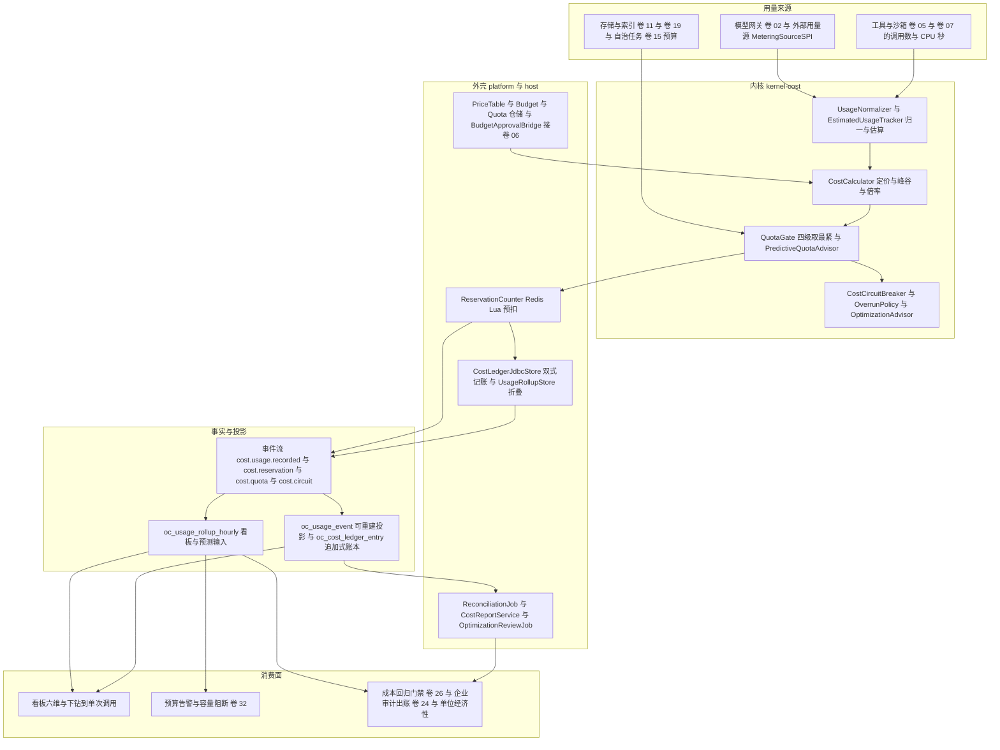
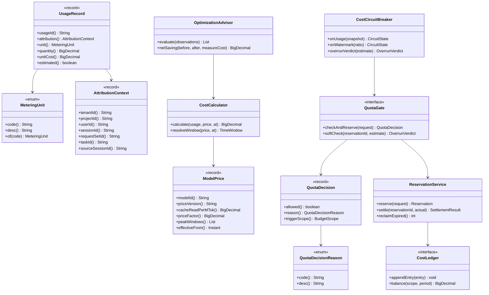
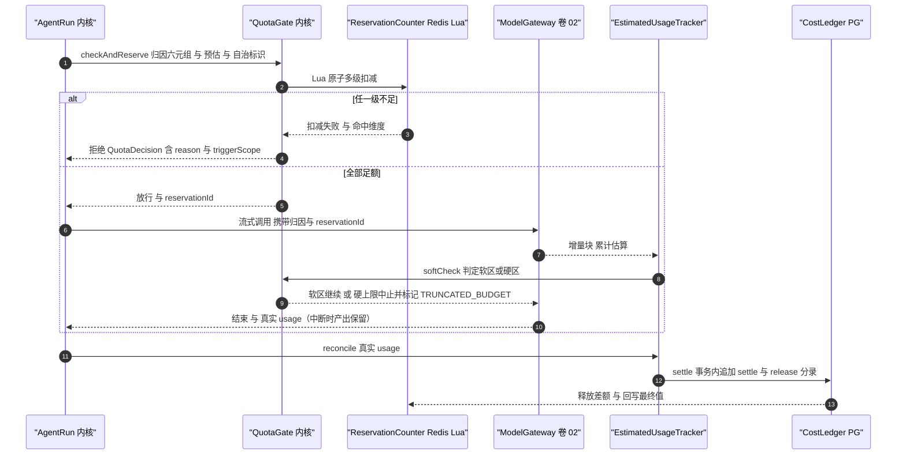
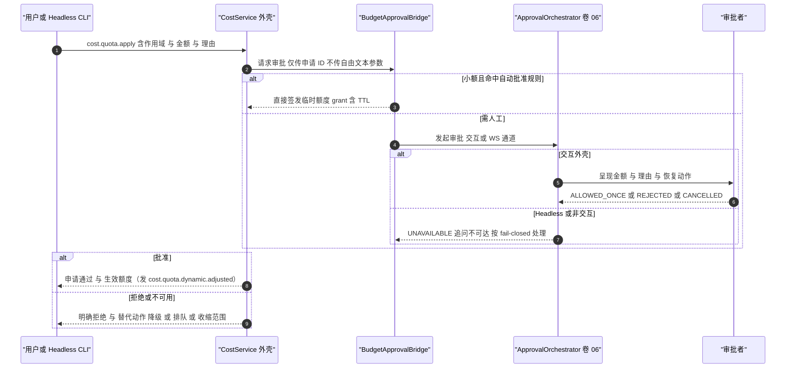
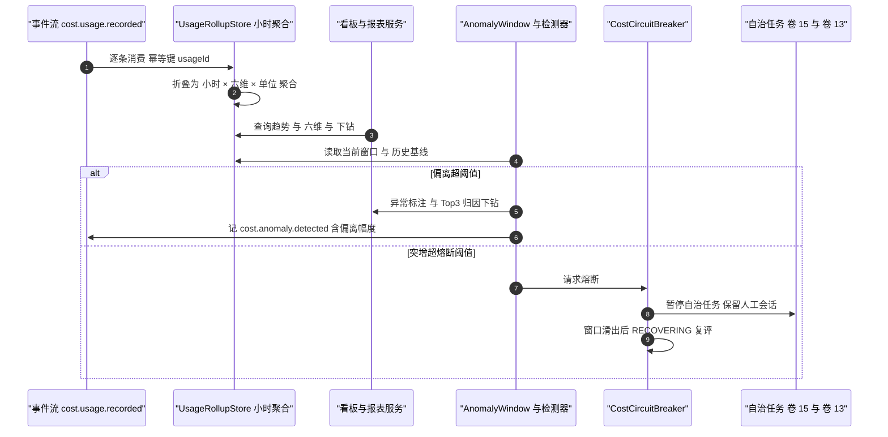
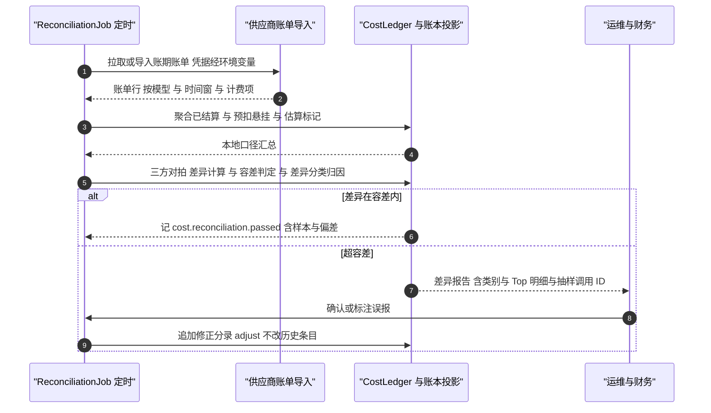
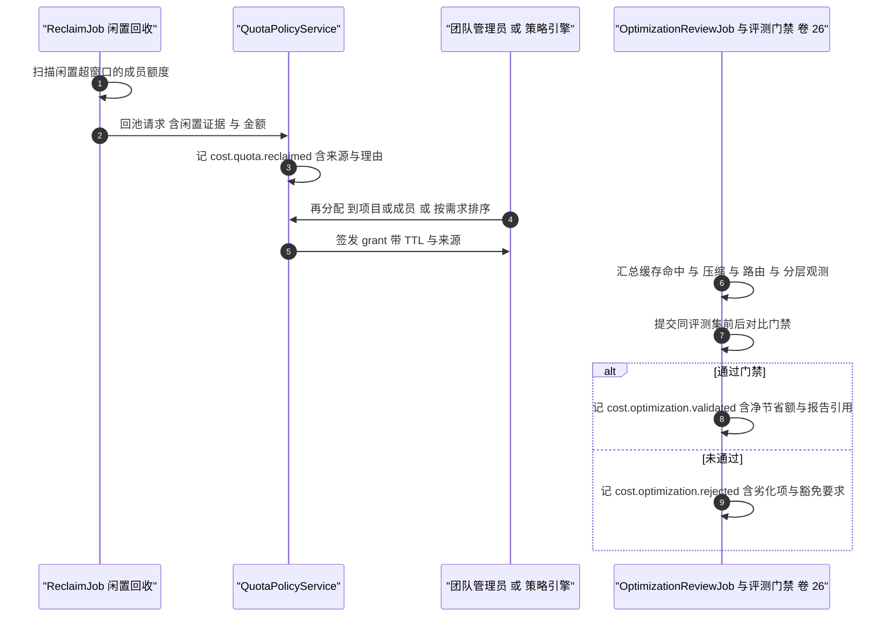
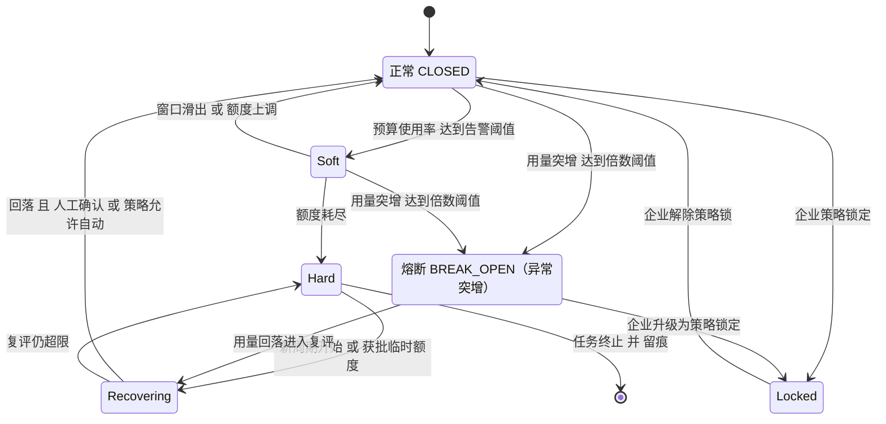
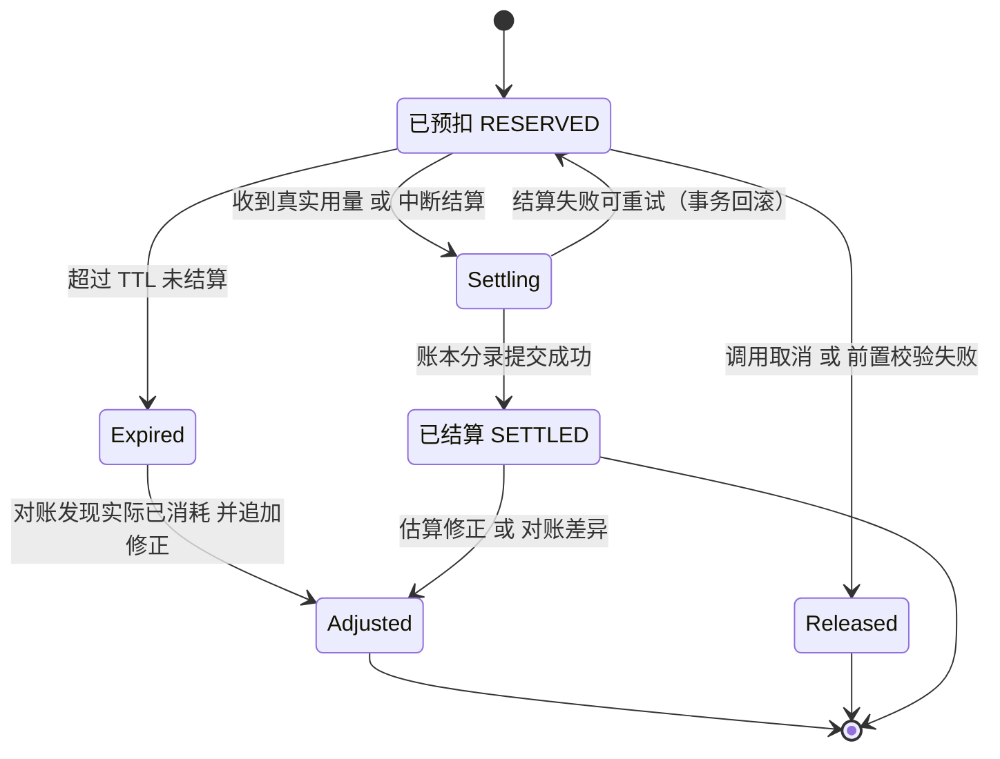

# 实现方案 26 · 配额、计量与成本归因（Quota, Metering & Cost Implementation）

> 本文件是 Phase B 实现层方案，对应 Phase A 卷 31（`docs/harness/31-capacity-and-cost.md`）的域内决策 D-CAP-1…10；并落实研究台账
> `research/LESSONS-AND-ADOPTIONS.md` §2 第 511 行指定——「P0 中『卷 31 容量』相关行通过本文件落位」，逐条对齐 **L-020 / L-026 / L-045 / L-051 / L-052 / L-055 / L-074**
> 与 `config-extraction-rules.md` §6（业务阈值配置化）、台账 D7（阈值一律 `open-coding.*`）。
>
> 上游契约不可修改：凡与卷 31 表述冲突之处，本文件只记录「反驳证据 + 建议修订」（见 §⑩.11），不改 Phase A 卷册。
> 证据标记沿用 `00-research-plan.md` §2：`[E1]` 源码｜`[E2]` 官方文档｜`[E3]` 第三方｜`[E4]` 推断。
> 实现落点：`harness-kernel/kernel-cost`（计量归一、定价计算、配额判定、熔断、ROI，零框架）
> ＋ `harness-platform/platform-persistence`（账本、定价表、配额与预算、用量投影、对账）
> ＋ `harness-platform/platform-runtime-store`（预扣原子计数、水位缓存、异常滑窗）
> ＋ `harness-host/host-app`（审批编排装配、报表与对账任务）＋ `harness-host/host-protocol`（成本面 API 与通知帧）。

---

## ① 实现目标与范围

### 1.1 本组件解决什么

把卷 31 的**量化模型**落成**可执行、可复核、可熔断**的运行时机制，满足五条硬性质：

1. **算得清**：任一账单可下钻到单次调用，本地账本与厂商账单抽样对齐误差 ≤ 1%（卷 31 §7）；金额全程 `BigDecimal`。
2. **源头唯一**：计量与事件**共源**——用量由事件承载（`cost.usage.recorded`），`oc_usage_event` 是可重建投影，禁止双写（L-052；DeepSeek「会话日志即唯一事实源」`[E1]`）。
3. **先扣后花**：调用前**预扣**（Redis 原子多级扣减），结束后按真实用量**结算**并释放差额；流式中途超额按「软区提示继续 + 硬上限中止/暂停并留痕」处置，**禁止静默截断**。
4. **超限可解释**：四级配额（个人/团队/项目/组织）同时生效**取最紧**，拒绝结论携带触发维度与原因枚举（对齐 L-003）。
5. **降本不降质**：优化项以 **ROI 净值**排序（扣除优化自身成本），且必须过同评测集前后对比门禁（卷 31 §4.8 成本不劣化 > 10% 需豁免留痕）。

同时提供六条能力面：多单位计量、六维归因、预算与配额、预扣结算、熔断降级、报表对账。

### 1.2 与 Phase A 的对应关系

| Phase A 决策 | 本文件落实位置 |
| --- | --- |
| D-CAP-1 基准驱动建模 + 校准 | §⑨.3 `capacity.*` 配置组、§⑧.1 `oc_capacity_parameter`、§⑩.3 容量估算与季度校准 |
| D-CAP-2 热/温/冷三层存储 | §⑧.1 `oc_storage_metering`（分层计量与迁移收益）、`StorageTierPolicySPI` |
| D-CAP-3 事件量控制（采样 + 折叠） | §③ D-QC-1、§⑧.1 `oc_usage_rollup_hourly`、§⑩.1「明细可丢、账本不可丢」 |
| D-CAP-4 分级索引容量 | §⑧.1 索引计量（向量条数 × 维度 × byte·h）、§⑨.4 `CapacityModelSPI` |
| D-CAP-5 六维归因 + 缓存折扣单列 | §③ D-QC-9、§⑤ `AttributionContext`、§⑧.1 六维列与 `cache_*` 单列 |
| D-CAP-6 ROI 排序优化清单 | §⑥.5 优化闭环、§⑧.1 `oc_optimization_finding`、§⑨.2 报表端点 |
| D-CAP-7 静态 + 预测式 + 再分配 + 熔断 | §③ D-QC-6/7、§⑥.2/6.5、§⑦.1 熔断状态机 |
| D-CAP-8 单位经济性与敏感度 | §⑥.5、§⑨.2 `/reports/unit-economics`、§⑩.11 修订建议 |
| D-CAP-9 阈值 + 趋势预测 + 分级动作 | §⑦.1、§⑧.4 指标、§⑨.3 `alert.*` / `capacity.watermark*` |
| D-CAP-10 月度评审 + 预算责任 + 收益度量 | §⑥.5、§⑧.1 `oc_budget` / `oc_optimization_finding`、§⑩.10、§⑪.6 |
| 卷 06 审批决策链、卷 13 D-TEAM-6、卷 15 固定预算、卷 16 事件、卷 19 分域、卷 26 门禁、卷 28 遥测同意 | §⑥.2、§⑥.5、§⑧、§⑩.9 |

### 1.3 本组件不解决什么

- **不解决**容量公式本身的正确性（卷 31 §4.1）：公式与系数落成可配参数并记录校准来源与版本，不重推公式。
- **不解决**工具结果预算（卷 05 D-TOOL-5、L-020/L-026）：工具侧字符/token 预算是**上下文工程**手段，本组件只计量其节省额并纳入 ROI；两套阈值分属不同配置命名空间，禁止互相覆盖。
- **不解决**模型定价的采集与谈判（卷 02 §4.6）与企业出账（卷 24）：前者由人工/目录同步价格事实，后者（发票、合同、对客结算）属企业域。
- **不解决**权限判定与审批编排（卷 06）：只发起「超额申请」并消费审批结果，决策链与通道完全复用。

### 1.4 上下游依赖

| 方向 | 依赖对象 | 接口 |
| --- | --- | --- |
| 上游 | 模型网关（卷 02） | 调用前后 `MeteringContext` 注入 + provider usage 回传（缓存读/写与推理 token 分列） |
| 上游 | Agent 内核（卷 12/13/15）、工具（卷 05）、沙箱（卷 07） | 归因六元组与运行标识；沙箱 CPU·s；自治任务固定预算（L-045） |
| 上游 | 事件系统（卷 16） | `EventAppender.append(...)`（用量与账本事件唯一落点） |
| 上游 | 定价来源（卷 02 目录 / 运维导入） | `PriceTableSPI`；自建模型机时参数 |
| 下游 | 权限与审批（卷 06） | 超额申请 → 审批结果封闭集（ALLOWED_ONCE / REJECTED / CANCELLED / UNAVAILABLE） |
| 下游 | 企业运维（卷 24/32）、评测（卷 26） | 预算水位/熔断/对账差异；优化项前后对比报告与成本回归门禁 |

### 1.5 模块落点

**落地登记（R07：模块 / 顺序 / 批次；清单见 `reviews/R07-scope-build-platform.md`）**：
- **模块坐标**：`harness-contract`（包 `contract/cost`）+ `harness-kernel/kernel-cost`（**扩展模块**：卷 27 §4.1 未列，待登记）+ `harness-platform/platform-persistence`（成本/配额表族）+ `harness-platform/platform-runtime-store` + `harness-host/{host-app,host-protocol}`。卷 27 §4.3 **缺「卷 31 容量与成本」行** → R07 建议在 §4.3 补行（不改卷册）。
- **实施顺序（卷 27 §4.5）**：分两段——① **计量最小子集**（`oc_usage_event` 落账 + 单价计算）须在**第 9 步之后、第 15 步之前**可用（第 15 步桌面成本面板与第 19 步自治循环的预算门都读它）；② 配额/预算/熔断/对账/优化器随第 **20** 步。若严格按 20 步原序（本域全部放第 20 步），则第 15 步的「成本面板」无数据源——**不可行前置**，故必须两段拆分（R07 §3 C2）。
- **数据迁移批次**：B2 = `oc_usage_event` `oc_usage_rollup_hourly` `oc_cost_ledger_entry` `oc_reservation` `oc_price_table` `oc_self_hosted_cost_model` `oc_reconciliation` `oc_storage_metering`；B6 = `oc_budget` `oc_quota_policy` `oc_quota_grant` `oc_cost_allocation_rule` `oc_capacity_parameter` `oc_optimization_finding`（B6「企业（配额/预算/特性开关）」已覆盖）。
- **表所有权**：`oc_usage_event` 拥有者本文件（`24` 只引用，不建表）。
- **I- 决策落点**：`I-COST-1…9`（9 条）模块落点为上表；类级落点见 §⑤（`UsageNormalizer`/`QuotaGate`/`CostLedgerJdbcStore`），逐条绑定登记为 R07 建议 S4。

```text
harness-contract/.../contract/cost/    record UsageRecord/AttributionContext/ModelPrice/QuotaDecision；枚举 MeteringUnit/BudgetScope/QuotaDecisionReason；SPI CostAttributionSPI/QuotaPolicySPI/PriceTableSPI/StorageTierPolicySPI/CapacityModelSPI/MeteringSourceSPI
harness-kernel/kernel-cost/.../cost/   meter/ UsageNormalizer、EstimatedUsageTracker；price/ CostCalculator、TimeWindowResolver；quota/ QuotaGate、PredictiveQuotaAdvisor；circuit/ CostCircuitBreaker、OverrunPolicy；roi/ OptimizationAdvisor、RoiCalculator
harness-platform/platform-persistence/ cost/ CostLedgerJdbcStore、BudgetRepository、QuotaRepository、GrantRepository、PriceTableRepository、UsageRollupStore、ReconciliationRepository、OptimizationRepository
harness-platform/platform-runtime-store/ cost/ ReservationCounter（Lua）、BudgetWatermarkCache、AnomalyWindow
harness-host/host-app/                 BudgetApprovalBridge（接卷 06）、CostReportService、ReconciliationJob、OptimizationReviewJob
harness-host/host-protocol/            cost.* JSON-RPC、成本面 REST、通知帧（cost.alert / cost.overrun）
```

**分层纪律**：`kernel-cost` 只依赖契约层与 JDK（金额一律 `BigDecimal`，时间一律 `java.time`），不依赖 Spring/Redis/JDBC，
可用内存实现完整单测（含熔断与 ROI）；Redis 计数、PG 账本、定时任务全在 platform/host。
**Spring 装配点**：`platform-persistence` 以 `@Transactional(rollbackFor = Exception.class)` 单事务完成「账本分录 + 用量事件产出」；
`host-bootstrap` 显式注入 `QuotaGate` 端口实现，缺失时装配内存实现（单机档与单测）；配置类为纯数据类（不加 `@Component`），由 `@ConfigurationPropertiesScan` 激活。

---

## ② 功能需求清单（REQ-COST-n）

| REQ | 需求描述 | 来源 | 优先级 | 验收要点 |
| --- | --- | --- | --- | --- |
| REQ-COST-01 | **多单位计量**：token（输入/输出/推理/缓存读/缓存写）+ 模型调用 + 工具调用 + 沙箱 CPU·s + 存储 byte·h + 计算时长 + 出网字节；单位归一与量纲校验 | 卷 31 §4.1/§4.2 | P0 | 未知单位抛业务异常；五类 token 明细共存且不与合计混淆 |
| REQ-COST-02 | **计量与账本共源事件系统**：用量以 `cost.usage.recorded` 承载，`oc_usage_event` 为可重建投影，禁止双写 | 卷 16 D-EVT-1/3；L-052；`04-deepseek-harness.md` §4.12 `[E1]` | P0 | 清空投影后由事件流重建逐条一致；代码中无第二处写入口 |
| REQ-COST-03 | **调用级归因元数据**：每次调用携带 `requestSetId/taskId/sourceSessionId/businessStage`，归因不依赖事后 join | `07-qoder.md` §4.13 `[E1]`（`ContextMetadata{request_id, session_id, task_id, request_set_id, …, source_session_id}` + `BusinessMetadata{stage, sub_task}`） | P0 | 账单行凭自身字段即可还原「谁在哪个任务/来源会话/阶段」花费 |
| REQ-COST-04 | 六维归因（用户/团队/项目/会话/模型/工具）+ 缓存折扣单列 + 自定义维度扩展 | 卷 31 D-CAP-5、§4.3 | P0 | 六维任意组合可聚合；`cache_read/write` 独立列示；`CostAttributionSPI` 可注入成本中心 |
| REQ-COST-05 | **版本化定价表**：模型 × 单价 × 倍率（Price Factor）× 生效窗口 × 峰谷折扣；账本按 `priceVersion` 可复算；改价事件化 | 卷 31 §4.2；`07-qoder.md` §4.22 `[E2]`（Credits + Price Factor + DeepSeek 峰谷「谷价 50%」） | P0 | 峰谷与生效边界用例通过；改价后历史金额不变；发 `cost.price.changed` |
| REQ-COST-06 | **自建模型成本折算**：机时价 × 摊销 ÷ 目标吞吐 × 利用率系数 → 每 M token 折算价；私有化交付成本单列 | 卷 31 §4.6（企业版「客户自建算力」口径） | P1 | 参数缺失按等价供应商价兜底并标记 `selfHosted=false`；折算价一键重算 |
| REQ-COST-07 | **四级配额取最紧**：个人/团队/项目/组织，结论携带触发维度与原因枚举；企业策略可锁 | 卷 31 §4.5、H-019；卷 24 D-ENT-9 | P0 | 「个人足/团队不足」拒绝且 `reason=TEAM_EXCEEDED`；锁定后个人放宽无效 |
| REQ-COST-08 | **预测式动态额度**：P95 历史 + 任务规模预测，放宽 ≤ 上限（默认 30%），带理由事件化 | 卷 31 §4.5 D-CAP-7 | P1 | 区间外任务不获放宽；`cap.quota.dynamic.adjusted` 含理由与比例 |
| REQ-COST-09 | **团队内再分配**：闲置额度回池（窗口可配）→ 池内二次分配；回收/再分配全程审计 | 卷 31 §4.4#9/§4.5、卷 13 D-TEAM-6 | P1 | 两侧额度与事件成对；可追溯来源与理由；回补通道可用 |
| REQ-COST-10 | **预扣与结算**：Redis 原子多级预扣 → 真实用量结算 → 差额释放；双式记账（reserve/settle/release/adjust/grant/expire）；结算滞后可观测 | 卷 31 §7（误差 ≤ 1%） | P0 | 重复结算被拒；悬挂预扣 TTL 回收 + WARN；借贷平衡断言 |
| REQ-COST-11 | **流式中途超额双阈值**：软区内提示继续；硬上限中途中止或转暂停待批，**产出落库不丢**并标记 `TRUNCATED_BUDGET`/`SUSPENDED_BUDGET` | 卷 31 §4.5；卷 02 D-MDL-5 | P0 | 软区不中断仅发事件；硬区中断后部分结果可见且原因一致 |
| REQ-COST-12 | **熔断与降级三档**（拒绝/排队/降级模型）+ 用户偏好（省成本/质量/平衡，默认平衡）+ 企业可锁 + **显式留痕、禁静默降级** | 卷 31 §10；`LESSONS §4 R5`（禁无声明隐式回退）`[E1]` | P0 | 降级必发 `cost.degrade.applied`（原/新模型 + 理由）；无事件即无降级 |
| REQ-COST-13 | **异常检测与自治熔断**：偏离基线 > 阈值（默认 50%）告警；突增 ≥ 倍数阈值（默认 3×）熔断——仅暂停自治任务，人工会话不受影响 | 卷 31 §4.5/§4.7 D-CAP-9 | P0 | 自治任务 paused 且原因可读；同窗口人工会话成功率不变 |
| REQ-COST-14 | 预算三级动作：50% 通知 / 80% 降级可用 / 100% 熔断（可配）+ 趋势外推预警 | 卷 31 §4.7 | P0 | 三级各触发一次；趋势预测演练命中 |
| REQ-COST-15 | **优化器 ROI 清单**（卷 31 §4.4 十项）+ **净节省额**（扣除优化自身成本）+ 同评测集前后对比门禁 | 卷 31 D-CAP-6/§4.4/§4.8；卷 26 §4.2 | P1 | 每项含收益/成本/风险/报告引用；未过门禁不得标 `VALIDATED` |
| REQ-COST-16 | **缓存命中 ROI**：`cache_read`/`cache_write` 分列计价 + 命中率 + **前缀漂移检测** + 缓存失效惩罚口径（输入成本 × 倍率） | 卷 31 §4.4#1/§4.2；L-032；`07-qoder.md` §4.5 `[E1]`（`patches` 以 `cache_id` 为键 + `cache_control{type}`） | P0 | 命中率下降超阈值发 `cost.cache.prefix_drift` 并归因来源 |
| REQ-COST-17 | **压缩 ROI**：压缩前后 token **必须校验**；净节省 = 节省输入成本 − 压缩调用成本；失败/膨胀不计收益 | 卷 31 §4.4#3；L-029 | P1 | 「压缩后 token 增加」不计正收益并记 WARN |
| REQ-COST-18 | **模型路由 ROI**：节省额以显式回退链与质量门禁为前提；成本不劣化 > 10% 需显式豁免 | 卷 31 §4.4#2/§4.8；卷 02 D-MDL-6 | P1 | 路由评测报告含成本与质量双列；豁免含理由与恢复计划 |
| REQ-COST-19 | 存储分层计量与迁移收益：热/温/冷 byte·h 分别计价，迁移发 `cap.storage.tier.moved` 与节省额 | 卷 31 D-CAP-2、§4.2 | P1 | 迁移前后成本可对比；冷读回读成本计入 |
| REQ-COST-20 | **与权限/审批联动**：超额一键申请；小额规则自动批准、大额走卷 06；结果封闭集消费；**UNAVAILABLE fail-closed**；headless 下 ask 转拒绝；临时额度 TTL 回收 | 卷 31 §4.5；L-005/L-006/L-008/L-010 | P0 | 审批不可用时拒绝而非放行；额度到期回落并发事件 |
| REQ-COST-21 | **计量上报故障隔离**：明细落库/上报失败不影响主流程（WARN + 有界缓冲重试），缺口可被对账发现；账本结算不随主事务回滚 | 卷 02 M19；`08-gemini-cli.md` §4.13 `[E1]`（`Usage` 事件 + `trackerService`）；`01-claude-code-purpose-built.md` §2.1 `[E2]`（OTel `token.usage`/`cost.usage`） | P0 | 注入上报失败：回合正常完成；缺口由对账报告暴露 |
| REQ-COST-22 | **供应商账单对账**：本地账本 vs 账单 vs 预算三方对拍；差异 > 容差（默认 1%）触发七类归因与**追加式**修正分录 | 卷 31 §7 | P1 | 注入五类差异分类准确；历史分录不可改 |
| REQ-COST-23 | **单位经济性与敏感度**：三版本成本结构 + 每席/每任务成本目标 + 敏感度一键重算（模型价/缓存命中/端侧分流） | 卷 31 D-CAP-8/§4.6 | P2 | 改价后可重算；输出三因素贡献度 |
| REQ-COST-24 | **容量水位联动**：水位 ≥ 80% 告警、≥ 90% 阻断高成本新任务（保留人工）；消费者滞后纳入同一告警面 | 卷 31 D-CAP-9/§4.7 | P0 | 阻断只影响高成本任务；人工会话继续可用 |
| REQ-COST-25 | **成本回归门禁**：触及上下文/提示词/路由的变更在同评测集成本不劣化 > 10%，否则显式豁免（理由 + 恢复计划） | 卷 31 §4.8 | P0 | 门禁 CI 常驻；豁免可检索 |
| REQ-COST-26 | **计量正确性不变量**：预扣不重复、不悬挂（TTL 回收）；结算恰好一次；重试与失败尝试分别计量；估算在真实 usage 到达后以修正分录对齐 | 卷 31 §7；L-052 | P0 | 并发重复结算下借贷平衡；估算修正后与厂商口径一致 |
| REQ-COST-27 | **自治预算叠加钳制**：固定回合预算与配额判定**取更小者**并产生「预算钳制」事件 | L-045 风险行 | P0 | 双约束冲突取小者生效 + `cost.budget.clamped` 含双方额度 |
| REQ-COST-28 | **用量外发同意**：外发独立开关、默认关闭、字段白名单、egress 清单可机器校验 | L-074；卷 28 D-DIST-6 | P1 | 默认无外发流量；白名单外字段序列化层丢弃 |

**竞品与台账增量需求说明**：REQ-COST-03/05/16 来自 Qoder 契约与计费文档事实（调用级归因元数据、倍率与峰谷价、`cache_id` + `cache_control`）；REQ-COST-21 来自 Gemini CLI 的 `Usage` 事件与 Claude Code 官方 OTel 计量面；REQ-COST-02 的共源纪律来自 DeepSeek 运行时不变式与 L-052；REQ-COST-27 来自台账 L-045。
反向证据同样重要：**三家均未观测到租户级配额强制的技术实现**（`07-qoder.md` §4.23「配额强制未展开」、`04-deepseek-harness.md` §4.23 负证据、`08-gemini-cli.md` §4.23 仅 `QuotaContext` 提示 UI），故 REQ-COST-07/08/10/20 为**自建**，不得以「竞品已验证」为由简化。

---

## ③ 技术方案选型（M×N 比选）

评分沿用 `README.md` §4：**F 30% / U 20% / S 25% / M 25%**，加权总分 = `30F+20U+25S+25M` / 10。九个实现级分叉（D-QC-1…9）各含 3 个候选分支。

### 3.1 分叉矩阵

| 维度 | 分支 | 描述 | F | U | S | M | 加权 | 结论 |
| --- | --- | --- | --- | --- | --- | --- | --- | --- |
| D-QC-1 计量承载物 | B1 | 独立计量库双写（事件与计量各写一份） | 7 | 7 | 6 | 6 | 65.0 | 淘汰（双写漂移，违反事实源唯一） |
| | B2 | **事件共源：用量事件承载 + `oc_usage_event` 可重建投影 + 小时滚动聚合** | 9 | 8 | 9 | 9 | **88.0** | **选定** |
| | B3 | 仅供应商账单后置拉取 | 5 | 6 | 7 | 6 | 59.5 | 淘汰（无法实时熔断与归因） |
| D-QC-2 预扣机制 | B1 | 纯 PG 行级事务计数 | 7 | 7 | 8 | 7 | 72.5 | 淘汰（热点行锁竞争，锁等待超判定预算） |
| | B2 | **Redis 原子预扣（Lua 多级扣减）+ PG 账本结算 + 对账补偿** | 9 | 8 | 8 | 9 | **85.5** | **选定** |
| | B3 | 无预扣（事后告警） | 6 | 8 | 5 | 6 | 61.5 | 淘汰（超额不可控） |
| D-QC-3 流式中途超额 | B1 | 允许跑完事后结算 | 5 | 7 | 5 | 6 | 56.5 | 淘汰（大流可击穿任务预算） |
| | B2 | **双阈值：软区提示继续 + 硬上限中止/暂停并留痕，产出落库** | 9 | 8 | 8 | 8 | **83.0** | **选定** |
| | B3 | 单一硬中止（无软区） | 7 | 5 | 8 | 7 | 68.5 | 淘汰（长回答体验抖动大） |
| D-QC-4 定价表形态 | B1 | 代码内常量价表 | 6 | 6 | 4 | 4 | 50.0 | 淘汰（改价需发版，违反配置判断线） |
| | B2 | **版本化定价表（DB + 生效窗口 + 峰谷/倍率 + `PriceTableSPI`）** | 9 | 8 | 9 | 9 | **88.0** | **选定** |
| | B3 | 仅账单回填（无前置定价） | 5 | 6 | 7 | 5 | 57.0 | 淘汰（预扣与优化 ROI 无价可算） |
| D-QC-5 自建模型折算 | B1 | 视为零成本 | 4 | 6 | 5 | 5 | 49.0 | 淘汰（私有化毛利盲区） |
| | B2 | **机时折算（GPU·h/CPU·h + 摊销期 + 目标吞吐 + 利用率系数）** | 8 | 7 | 8 | 8 | **78.0** | **选定** |
| | B3 | 按等价供应商价 | 6 | 7 | 7 | 6 | 64.5 | 淘汰（掩盖自有算力真实成本） |
| D-QC-6 配额判定层次 | B1 | 单一组织级 | 5 | 5 | 8 | 6 | 60.0 | 淘汰（无法解释「谁超了」） |
| | B2 | **四级同时生效取最紧 + 触发维度可解释 + 策略可锁** | 9 | 8 | 8 | 9 | **85.5** | **选定** |
| | B3 | 仅个人级 | 6 | 7 | 6 | 5 | 59.5 | 淘汰（团队/项目预算无处落地） |
| D-QC-7 异常熔断作用域 | B1 | 全局暂停（含人工会话） | 4 | 3 | 7 | 6 | 50.5 | 淘汰（误伤面大） |
| | B2 | **仅暂停自治任务 + 分级阈值 + 人工会话不受影响** | 8 | 9 | 8 | 9 | **84.5** | **选定** |
| | B3 | 只告警不动作 | 5 | 8 | 5 | 5 | 56.0 | 淘汰（无人值守下成本失控） |
| D-QC-8 降级策略默认 | B1 | 全局统一（无偏好） | 6 | 5 | 7 | 6 | 60.5 | 淘汰（省成本/质量诉求无法并存） |
| | B2 | **用户偏好（默认平衡）+ 企业可锁 + 降级显式留痕** | 8 | 9 | 8 | 8 | **82.0** | **选定** |
| | B3 | 静默降级（不告知） | 4 | 6 | 2 | 4 | 39.0 | 淘汰（违铁律与 L-055 教训） |
| D-QC-9 归因时机 | B1 | 事后 join 拼接 | 6 | 6 | 7 | 6 | 62.5 | 淘汰（跨任务拼接易错且昂贵） |
| | B2 | **调用前注入归因六元组 + 事件信封携带** | 9 | 8 | 9 | 8 | **85.5** | **选定** |
| | B3 | 仅会话级归因 | 6 | 6 | 7 | 5 | 60.0 | 淘汰（无法回答「哪个任务/工具最贵」） |

### 3.2 选定要点、被放弃代价与回退触发

| 维度 | 选定要点（对齐依据） | 被放弃分支代价 | 回退触发 |
| --- | --- | --- | --- |
| D-QC-1 | 用量事件是事实，投影可重建；账本条目本身也是事件（`cost.reservation.*`/`cost.usage.recorded`） | B1 的独立写入性能被放弃，代价是投影重建流程与门禁 | 投影重建 > 10min/月 → 增量物化 + 位点校验（事实源不变） |
| D-QC-2 | Redis 做计数与准入，PG 账本做事实与复算，最终一致靠对账补偿 | 强一致被放弃，代价是 Redis 故障期需降级策略（§⑩.5） | Redis 不可用 > 5min → PG 逐次扣减（并发超阈值则排队） |
| D-QC-3 | 软区 = 预扣 × 增额系数（默认 1.2）；硬上限 = 任务/日配额；中止亦落库并解释 | 全量高保真输出被放弃（成本可控优先） | 软区申诉率超阈值 → 调整系数与估算模型 |
| D-QC-4 | DB 定价表 + 生效窗口 + 峰谷 + 倍率；账本按 `priceVersion` 复算 | 常量价表的零运维被放弃，代价是定价治理 | 定价查询成热路径瓶颈 → 进程内缓存 + 版本失效 |
| D-QC-5 | 折算单价 = 机时价 × 摊销份额 ÷ 目标吞吐 × 利用率倒数 | 「零成本」简化叙事被放弃 | 参数缺失 → 等价供应商价并标记 `selfHosted=false`（禁按 0 计） |
| D-QC-6 | 判定顺序「组织 → 项目 → 团队 → 个人 → 策略锁」，任一级不足即拒并记录命中维度 | 单级判定的简单性被放弃 | 判定延迟超预算 → 预聚合额度视图（维度语义不变） |
| D-QC-7 | 熔断只作用于自治任务与批处理；人工会话仅提示（水位 ≥ 90% 时例外：拦高成本新任务、保留人工） | 全局止血的彻底性被放弃 | 单租户异常影响其他租户 → 租户级隔离并评估跨租户熔断 |
| D-QC-8 | 偏好三级 + 企业锁 + 每次降级必发 `cost.degrade.applied`（原/新模型、触发维度、理由） | 自动最优路由的「聪明感」被放弃 | 「质量优先」仍被降级 → 按 P1 缺陷处理 |
| D-QC-9 | `AttributionContext` 随调用元数据下发，事件信封同时携带六维 | B1 的宽松低成本被放弃，代价是链路需透传字段 | 协议膨胀 → 压缩为不可变引用 ID（可解析回全量） |

### 3.3 实现级决策登记（I-COST-n）

| ID | 主题 | 选定 | 理由与代价 | 回退触发 |
| --- | --- | --- | --- | --- |
| I-COST-1 | 计量承载物 | 事件共源 + 可重建投影 + 小时滚动聚合 | 事实源唯一、可回放；代价是投影重建流程 | 重建超预算 → 增量物化 + 位点校验 |
| I-COST-2 | 预扣机制 | Redis Lua 原子多级扣减 + PG 账本结算 + 对账补偿 | 判定低延迟、账本可复算；代价是最终一致窗口 | Redis 长故障 → PG 逐次扣减降级 |
| I-COST-3 | 流式中途超额 | 双阈值（软区继续 / 硬区中止或暂停）+ 产出落库 + 显式事件 | 成本可控且体验可接受；代价是估算口径需校准 | 申诉率超阈值 → 调整系数与估算模型 |
| I-COST-4 | 定价表 | DB 版本化 + 生效窗口 + 峰谷/倍率 + `PriceTableSPI` + 进程内缓存 | 改价不发版、历史可复算；代价是定价治理责任 | 查询成瓶颈 → 缓存 + 版本失效 |
| I-COST-5 | 自建模型折算 | 机时 × 摊销 ÷ 吞吐 × 利用率 | 私有化毛利可见；代价是参数需定期校准 | 参数缺失 → 等价供应商价兜底并标记 |
| I-COST-6 | 配额判定 | 四级取最紧 + 原因枚举 + 策略锁 | 可解释可治理；代价是判定链更长 | 判定延迟超预算 → 预聚合额度视图 |
| I-COST-7 | 异常熔断 | 仅自治任务 + 分级阈值 + 人工会话保留 | 不误伤人工；代价是异常期成本仍可能增长 | 跨租户影响出现 → 升级租户级隔离 |
| I-COST-8 | 降级策略 | 用户偏好（默认平衡）+ 企业锁 + 强制留痕 | 体验与成本并存；代价是配置面增大 | 质量优先被降级 → 按缺陷处理 |
| I-COST-9 | 归因时机 | 调用前注入六元组 + 事件信封携带 | 归因准确可下钻；代价是协议字段透传 | 协议膨胀 → 引用 ID 间接化 |

### 3.4 与竞品对照的取舍（research 证据）

| 对照维度 | 竞品证据 | 我们的取舍 | 主动放弃的收益 |
| --- | --- | --- | --- |
| 成本口径可下钻 | Cline 在二线 7 家中**成本口径最强**（hub 多客户端 + 受管指令物化；`research/CROSS-COMPARISON.md` §2.3）[E1] | 采纳「可核算 ≤ 1%」为门禁并把口径写进 `oc_usage_event` 契约（REQ-COST 计量共源） | 单机简单记账被放弃，代价是投影与对账流程 |
| 档位与计费解耦 | MiniMax 档位化路由（Auto/Ultimate/Performance/Efficient）但未见租户级配额；L-055 要求**拒绝档位与 credit 倍率同文耦合**（`LESSONS-AND-ADOPTIONS.md` L-055） | 采纳档位抽象 + 「降级必发 `cost.degrade.applied`」（I-COST-8） | 静默降级的「无缝体验」被放弃（L-055 教训） |
| 预算必须显式 | Goose PTC `ExecutionLimits` **默认全为不限**，被判定为缺陷（L-026）；Claude Code 订阅配额算法公式**未观测**（`competitors/01` §10-1） | 反向采纳为「强制显式预算」：单轮/任务/日三级预算缺省值全部配置化且启动期校验（I-COST-3） | 上游式「不限即自由」的顺滑感被放弃 |
| 企业配额内核 | **8 组未观测**多租户/SSO/SCIM/配额计费内核（`CROSS-COMPARISON.md` §5 N4）；唯一有组织计费的 Qoder「Org Resource Package」语义未公开 [E2] | 自建四级配额 + 版本化定价表，列为差异化项（I-COST-4/6） | 无法靠竞品对标验证，需求证据只能来自内部治理（卷 31 定位承认此点） |
| 预算钳制叠加 | L-045：自治固定预算与租户配额**取更小者**并产生「预算钳制」事件 | 全采纳（I-COST-6 + `cost.budget.clamped`，§8.3） | 钳制事件会暴露内部额度关系，需按角色过滤明细 |

---

## ④ 总体架构图



**内核/外壳边界**：内核持有「归一、估算、计价、判定、熔断、ROI」六件纯逻辑；Redis 计数、PG 账本与投影、审批桥、定时任务属外壳。
**Spring 装配点**：`platform-persistence` 以单事务完成「账本分录 + 用量事件产出」；`host-bootstrap` 注入端口实现，缺失时装配内存实现（单机档/单测）。
**单向数据流纪律**：预扣只经 `ReservationCounter`，结算只经账本；**投影永不反向写账本**，对账修正以**追加分录**表达。

---

## ⑤ 类图与关键契约



**图中未列但同属内核**：`UsageNormalizer`（provider usage → 五类 token 归一）、`EstimatedUsageTracker`（流式估算与修正）、
`PredictiveQuotaAdvisor`（动态额度建议）、`ReconciliationService`（对账与差异归因），签名与职责见 §⑧ 与 §⑨.4。

### 5.1 关键 Java 21 签名（内核契约，零框架依赖）

```java
/**
 * 计量单位（量纲）：所有用量必须归一为「单位 + 数量」，禁止无单位数字入账
 * （对齐卷 31 §4.2 口径表：token 五类分列 + 调用 + 工具 + 沙箱 + 存储 + 计算 + 出网）。
 */
@Getter
@RequiredArgsConstructor
public enum MeteringUnit {
    /** 输入 token（未命中缓存部分） */
    TOKEN_IN("TOKEN_IN", "输入 token"),
    /** 输出 token（不含推理 token） */
    TOKEN_OUT("TOKEN_OUT", "输出 token"),
    /** 推理 token（单列；卷 02 §4.2 要求占比可观测） */
    TOKEN_REASONING("TOKEN_REASONING", "推理 token"),
    /** 缓存读 token（按缓存价计价，折扣单列） */
    TOKEN_CACHE_READ("TOKEN_CACHE_READ", "缓存读 token"),
    /** 缓存写 token（建立缓存成本单独计价） */
    TOKEN_CACHE_WRITE("TOKEN_CACHE_WRITE", "缓存写 token"),
    /** 模型调用次数（含失败与重试尝试，不合并） */
    MODEL_CALL("MODEL_CALL", "模型调用次数"),
    /** 工具调用次数（按工具族统计性价比） */
    TOOL_CALL("TOOL_CALL", "工具调用次数"),
    /** 沙箱 CPU·秒（隔离档位与工具族维度） */
    SANDBOX_CPU_SECOND("SANDBOX_CPU_SECOND", "沙箱 CPU·秒"),
    /** 存储 byte·小时（事件/媒体/检查点/索引向量） */
    STORAGE_BYTE_HOUR("STORAGE_BYTE_HOUR", "存储 byte·小时"),
    /** 计算时长毫秒（嵌入/重排/本地小模型） */
    COMPUTE_MILLIS("COMPUTE_MILLIS", "计算时长毫秒"),
    /** 出网字节（分发/CDN/Webhook） */
    EGRESS_BYTE("EGRESS_BYTE", "出网字节");

    private final String code;
    private final String desc;

    /**
     * 按编码解析计量单位。
     *
     * @param code 单位编码（必填，取值见枚举常量）
     * @return 对应计量单位
     * @throws HarnessException code 为空或未知时抛出（文案含原始 code，便于定位错配来源；契约面属内核层带）
     */
    public static MeteringUnit of(String code) {
        // 单位错配会污染账本与对账口径，非法值必须立即失败而非兜底
        for (MeteringUnit unit : values()) {
            if (unit.code.equals(code)) {
                return unit;
            }
        }
        throw new HarnessException(ErrorCode.PARAM_INVALID, "未知计量单位：" + code);
    }
}

/**
 * 成本归因上下文（六维 + 调用级来源标识）：调用发起前构造并随元数据下发，归因不依赖事后 join
 * （对齐 Qoder `ContextMetadata` 的 `request_set_id / task_id / source_session_id` `[E1]`，见 `07-qoder.md` §4.13）；
 * 全部为内部 ID，不含个人信息（日志与事件按 `.qoder/rules/logging-rules.md` §6 处理）。
 */
public record AttributionContext(
        String tenantId, String teamId, String projectId, String userId,
        String sessionId, String agentRunId, String requestSetId,
        String taskId, String sourceSessionId, String businessStage) {
}

/**
 * 用量事实（record，不可变）：由事件 `cost.usage.recorded` 承载，`oc_usage_event` 为其可重建投影；
 * `usageId` 为幂等键（重复入账必须被拒绝）；`estimated` 表示流式估算值，待真实 usage 到达后
 * 以**追加修正分录**对齐（禁止改写历史条目）。
 */
public record UsageRecord(
        String usageId, AttributionContext attribution, String modelId, String priceVersion,
        MeteringUnit unit, BigDecimal quantity, BigDecimal unitCost,
        Instant occurredAt, String originCallId, boolean estimated) {
}

/**
 * 配额闸门：所有模型调用与受限工具调用的唯一准入判定点。
 * 判定「四级取最紧」并完成原子预扣；判定失败必须给出可解释原因（枚举 + 命中维度）。
 */
public interface QuotaGate {

    /**
     * 判定并预扣一次调用的额度。
     *
     * @param request 预扣请求（归因上下文、预估用量与金额、调用类型、任务与自治标识）
     * @return 判定结论（是否放行、命中维度、原因枚举、预扣 ID、可选降级建议）
     * @throws HarnessException 请求非法（缺少归因上下文或预估量为负；不可重试）
     */
    QuotaDecision checkAndReserve(ReserveRequest request);

    /**
     * 流式期间的中途复检：按当前估算判定软区/硬区。
     *
     * @param reservationId 预扣 ID（必填，必须属于本调用）
     * @param currentEstimate 当前累计估算用量（由调用方基于增量估算提供）
     * @return 超限判定（NORMAL / SOFT_OVERRUN / HARD_OVERRUN 与应执行动作）
     * @throws HarnessException 预扣不存在或已结算（调用生命周期已被并发终结）
     */
    OverrunVerdict softCheck(String reservationId, BigDecimal currentEstimate);
}
```

**契约纪律**：内核不抛 `RuntimeException` / `IllegalArgumentException`（统一 `HarnessException(ErrorCode, 中文文案)`；
`DependencyUnavailableException` 为 `HarnessException` 的域内子类，仅携带可重试标记，非平行异常体系）；金额只用 `BigDecimal` 与 `RoundingMode` 显式常量；
增额系数、TTL、阈值、容差全部来自 §⑨.3 配置；日志按 `.qoder/rules/logging-rules.md`（`@Slf4j`、中文、占位符、异常传 `Throwable`），
计量明细与账本**禁止**记录 Prompt 正文、密钥、Token 与个人信息。

---

## ⑥ 核心流程时序图

### 6.1 一次模型调用的预扣 → 流式 → 结算（含中途超额）



**前置条件**：`AttributionContext` 完备（缺失即拒，REQ-COST-03）；目标模型定价已加载；自治任务已把固定回合预算折算为预估（REQ-COST-27）。
**主路径**：预扣在调用前、结算在用量确认后；结算与用量事件同事务提交（提交点是「进展」判定点，卷 16 §4.4）。
**异常与补偿**：① 硬上限中止以**中断结算**入账（`estimated=true` + 已消耗），余量释放，产出落库并标记 `TRUNCATED_BUDGET`；
② 预扣存储不可用按 §⑩.5 降级（本地宽松限流 + WARN + 对账补偿），企业可切 `FAIL_CLOSED`；③ 真实 usage 缺失 → 全量估算入账并标记，账单到达后追加修正分录。
**幂等与并发点**：`reservationId` 唯一约束保证结算恰好一次；Lua 脚本以 `reservationId` 为幂等键；TTL 到期由 `reclaimExpired` 回收并告警。

### 6.2 超额申请与审批联动（复用卷 06 决策链）



**前置条件**：申请者具备 `cost.quota.apply` 权限点；审批通道可用（交互 / WS / ACP；headless 视为不可追问）。
**主路径**：申请 → 规则判定（小额自动批准，矩阵与超时兜底对齐 L-010）→ 签发带 TTL 的临时额度（`oc_quota_grant`）→ 事件化（`cost.quota.dynamic.adjusted`）。
**异常与补偿**：审批不可用 / 超时 / 应答者缺失一律降级 `UNAVAILABLE` 并 **fail-closed 拒绝**（L-005）；额度到期由回收任务撤销并发事件；窗口内重复申请合并（防审批刷屏）。
**幂等与并发点**：申请以 `(scope, period, 需求金额)` 去重；签发额度用乐观并发（并发审批只成功一次）；审批结果只以封闭集消费。

### 6.3 归因、看板、异常检测与熔断



**前置条件**：事件流连续可消费（卷 16 位点）；基线窗口已积累（冷启动用绝对阈值兜底并在报表标注）。
**主路径**：明细 → 小时折叠 → 基线 → 偏离/突增判定 → 分级动作（告警 / 熔断 / 容量阻断），全部动作事件化（`cost.circuit.opened/closed`）。
**异常与补偿**：消费者滞后 → 熔断判定**冻结**（不用陈旧数据做熔断）并发 `cost.detector.stale` 告警；恢复条件 = 窗口滑出 + 用量回落 + 人工确认（自治可配自动）。
**幂等与并发点**：聚合按 `usageId` 幂等；熔断状态转换由租约互斥（多实例只产生一次 `opened`）。

### 6.4 对账与差异分析



**前置条件**：账期与计费口径对齐（峰谷时区、税费与汇率、模型别名映射）；账单文件不含密钥（凭据只走环境变量）。
**主路径**：三方对拍 → 七类归因（未结算预扣 / 重复计数 / 缓存计价差 / 峰谷窗口偏差 / 模型别名映射 / 汇率与税 / 估算未修正）→ 追加修正分录 + `cost.reconciliation.variance`。
**异常与补偿**：账单缺失或格式变化 → 保留上次基线 + 告警（**禁止**跳过对账静默通过）；修正分录必须携带原因与审批引用。
**幂等与并发点**：同账期重复对账以 `(period, invoiceRef)` 幂等；任务由 Redisson 租约互斥（L-045 集群锁要求）。

### 6.5 动态额度再分配与优化 ROI 闭环



**前置条件**：再分配需管理员权限点或企业策略授权；优化项须有同评测集基线与实施记录。
**主路径**：回收 → 事件 → 再分配（带 TTL）→ 优化评估 → 门禁 → `VALIDATED` / `REJECTED`；节省额计入季度公示（卷 31 §4.8）。
**异常与补偿**：回收误判（成员静默后被回收）保留**回补通道**（管理员一键回补并发事件）；未过门禁仍上线记为流程违规并在看板标注（反作弊）。
**幂等与并发点**：回池与再分配以 `grantId` 幂等；同一成员同窗口的回收与回补互斥（租约）。

---

## ⑦ 状态机

### 7.1 预算闸门与熔断状态机


（状态扩展说明：`Soft` = 警戒 SOFT_LIMIT 已用超告警阈值；`Hard` = 阻断 HARD_LIMIT 额度耗尽；`Recovering` = 恢复评估；`Locked` = 策略锁定 POLICY_LOCKED。）

**不变量**：`BREAK_OPEN` 归因自治任务时**只暂停自治**，人工会话仍可通行（REQ-COST-13）；`POLICY_LOCKED` 优先于一切自动恢复；
所有转换必须产出 `cost.circuit.opened/closed` 或 `cap.alert.threshold.reached` 之一（无事件即无转换）。

### 7.2 预扣条目生命周期


（状态扩展说明：`Settling` = 结算中；`Released` = 已释放（取消或失败）；`Expired` = 已过期（TTL 回收）；`Adjusted` = 已修正。）

**不变量**：预扣与结算之差**必须**以 `release` 分录释放（禁止悬挂余额）；`EXPIRED` 不代表「未消耗」，由对账转为 `ADJUSTED`；
`ADJUSTED` 只追加不覆写（追加式账本）。

---

## ⑧ 数据模型

### 8.1 表（`oc_*`；除定价类全局表外均含 `tenant_id` 与审计字段）

| 表 | 关键字段 | 索引、约束与分区 |
| --- | --- | --- |
| `oc_usage_event` | `usage_id`、`origin_call_id`、`unit`、`quantity`、`unit_cost`、`cost_amount`、`currency`、`price_version`、`model_id`、`tool_name`、六维列（`tenant_id`/`team_id`/`project_id`/`user_id`/`session_id`/`agent_run_id`）、`request_set_id`、`task_id`、`source_session_id`、`business_stage`、`estimated`、`occurred_at` | **可重建投影**；按 `occurred_at` 月分区；`uk(usage_id)`；`(tenant_id, occurred_at)`、`(project_id, occurred_at)`、`(session_id, occurred_at)`、`(model_id, occurred_at)`；明细在线 30 天并归档（D-CAP-3） |
| `oc_usage_rollup_hourly` | `bucket_hour`、六维列、`unit`、`quantity_sum`、`cost_sum`、`call_count`、`estimated_ratio` | PK `(bucket_hour, tenant_id, project_id, user_id, model_id, tool_name, unit)`；保留 25 个月（看板与预测输入） |
| `oc_cost_ledger_entry` | `entry_id`、`entry_type`（RESERVE/SETTLE/RELEASE/ADJUST/GRANT/EXPIRE/REFUND）、`reservation_id`、`scope_type`、`scope_id`、`period`、`amount`、`currency`、`reason_code`、`ref_entry_id`、`operator_ref`、`created_at` | **追加式**（应用层拒绝 UPDATE/DELETE）；`uk(entry_id)`、`uk(entry_type, reservation_id)`（结算恰好一次）；`(scope_type, scope_id, period)`；按月分区 |
| `oc_reservation` | `reservation_id`、`scope_json`、`reserved_amount`、`state`（RESERVED/SETTLING/SETTLED/RELEASED/EXPIRED/ADJUSTED）、`ttl_expire_at`、`estimator` | PK `reservation_id`；`(state, ttl_expire_at)` 供回收扫描；按月分区 |
| `oc_budget` / `oc_quota_policy` | 预算：`budget_id`、`scope_type`、`scope_id`、`period_type`（DAY/MONTH/QUARTER）、`amount`、`currency`、`owner_ref`、`alert_ratios jsonb`、`degrade_ratio`、`enabled`；配额：`policy_id`、`scope_type`、`scope_id`、`unit` 或 `cost_amount` 上限、`window`（DAY/MONTH/ROLLING）、`over_action`（REJECT/QUEUE/DEGRADE）、`priority`、`locked_by_policy` | 预算 `uk(scope_type, scope_id, period_type, period_key)`（责任到团队，D-CAP-10）；配额 `uk(policy_id)`、`(scope_type, scope_id, window)`，企业锁不可被覆盖 |
| `oc_quota_grant` | `grant_id`、`source`（APPROVAL/REALLOCATION/PREDICTIVE/ADMIN）、`scope_type`、`scope_id`、`amount`、`ttl_expire_at`、`approval_ref`、`reason`、`state`（ACTIVE/EXPIRED/REVOKED） | `uk(grant_id)`；`(state, ttl_expire_at)`；`approval_ref` 指向卷 06 审批实例（禁止内联审批参数） |
| `oc_price_table` | `model_id`、`price_version`、`input_per_mtok`、`output_per_mtok`、`reasoning_per_mtok`、`cache_read_per_mtok`、`cache_write_per_mtok`、`price_factor`、`peak_windows jsonb`（时段 + 折扣 + 时区）、`effective_from`、`effective_to`、`source_ref` | `uk(model_id, price_version)`；`(model_id, effective_from desc)`；**历史版本不删不改**（账本复算依赖） |
| `oc_self_hosted_cost_model` | `model_id`、`machine_type`、`machine_hour_price`、`amortization_months`、`target_throughput_per_hour`、`utilization_target`、`derived_cost_per_mtok`、`currency`、`updated_at` | `uk(model_id, machine_type)`；折算价落库便于审计（参数变更即重算并留版本说明） |
| `oc_cost_allocation_rule` | `rule_id`、`match_jsonb`（标签/项目/团队匹配）、`cost_center`、`priority`、`enabled` | `(priority)`；自定义归因维度落点（`CostAttributionSPI` 提供匹配逻辑） |
| `oc_reconciliation` | `recon_id`、`period`、`invoice_ref`、`local_amount`、`invoice_amount`、`variance_amount`、`variance_ratio`、`categories jsonb`、`state`（PENDING/PASSED/VARIANCE/CONFIRMED）、`sample_call_ids jsonb` | `uk(period, invoice_ref)`；`(state, period desc)`；差异明细落对象存储并留引用 |
| `oc_optimization_finding` | `finding_id`、`measure_code`、`estimated_saving`、`implement_cost`、`risk_level`、`net_saving`、`status`（PROPOSED/RUNNING/VALIDATED/REJECTED/PAUSED）、`evidence_ref`、`owner_ref`、`due_at` | `uk(finding_id)`；`(status, net_saving desc)`；`evidence_ref` 指向同评测集前后对比报告（卷 26） |
| `oc_storage_metering` | `bucket_hour`、`tier`（HOT/WARM/COLD）、`object_class`（EVENT/MEDIA/CHECKPOINT/INDEX_EXPORT）、`byte_sum`、`cost_sum` | PK `(bucket_hour, tenant_id, tier, object_class)`；分层迁移收益对比输入（D-CAP-2） |
| `oc_capacity_parameter` | `param_key`、`param_value`、`version`、`source_ref`、`calibrated_at`、`note` | `uk(param_key, version)`；容量系数带版本与实测来源（D-CAP-1） |

### 8.2 Redis Key（统一 `RedisKeys` 工厂，禁止业务代码拼接）

| 语义 | Key 形态 | TTL |
| --- | --- | --- |
| 预扣余额（多级）与已花累计 | `RedisKeys.costReserve(tenantId, scope, period)` → `oc:cost:reserve:{tenant}:{scope}:{period}`、`RedisKeys.costSpend(tenantId, scope, period)` → `oc:cost:spend:{tenant}:{scope}:{period}` | 与周期对齐（日/月），到期自然回收 |
| 预扣明细（幂等与释放） | `RedisKeys.costReservation(tenantId, reservationId)` → `oc:cost:rsv:{tenant}:{id}`（Hash：各级扣减与状态） | 预扣 TTL（默认 900s，可配） |
| 临时额度缓存与异常滑窗 | `RedisKeys.costGrant(tenantId, grantId)` → `oc:cost:grant:{tenant}:{id}`、`RedisKeys.costAnomalyWindow(tenantId, scopeId, window)` → `oc:cost:anomaly:{tenant}:{scope}:{win}` | 与 `ttl_expire_at` 对齐 / 滑窗长度（默认 1h） |
| 定价缓存（不可变，版本变化即换键） | `RedisKeys.costPrice(modelId, priceVersion)` → `oc:cost:price:{model}:{ver}` | 无（**全局共享域**：定价表无租户语义，显式登记为白名单键；键值含 `priceVersion`，跨租户读取无敏感差异） |
| 看板水位缓存 | `RedisKeys.costWatermark(tenantId, scopeId, period)` → `oc:cost:watermark:{tenant}:{scope}:{period}` | 30s |
| 对账/优化任务锁 | `RedisKeys.costJobLock(tenantId, job)` → `oc:cost:job:lock:{tenant}:{job}` | Redisson 租约 600s，心跳续租（L-045 集群锁） |

**键面纪律（R06 新增）**：除价格缓存（全局白名单，且为不可变键）外，**首变参恒为 `tenantId`**（对齐 25 §8.5 与卷 24 §4.10 红线 3）；`scope` 段即使内含主体/项目 ID 也不得省略租户段（ID 生成域跨租户不可假设不碰撞）。读路径二次校验：命中后比对值的 `tenantId` 与 `TenantContext`，不一致即丢弃 + `oc_cross_tenant_denied_total{surface=cost}` + 告警。

**对象存储前缀（R06 新增）**：对账差异明细与导出包落 `oc-cost-recon/{tenantId}/{period}/`、报表导出落 `oc-cost-export/{tenantId}/{reportKind}/{period}/`；路径只由服务端按 `TenantContext` 构造，签名 URL 绑定主体且短期有效（与 25 §8.6 同一客户端契约）。

**降级**：Redis 全不可用按 §⑩.5 走「本地宽松限流 + PG 逐次扣减 + 对账补偿」；账本与定价事实永不依赖 Redis。

### 8.3 事件清单（经卷 16 Schema Registry 登记；命名 `<域>.<对象>.<动作>`）

| 事件 | 触发与必含字段 |
| --- | --- |
| `cost.usage.recorded` | 每次结算的用量明细（单位、数量、单价、金额、`priceVersion`、六维、`estimated`） |
| `cost.reservation.created` / `.settled` / `.released` / `.expired` | 预扣生命周期（`reservationId`、金额、作用域、原因码；`.expired` 带告警标记） |
| `cost.quota.exceeded` / `cost.quota.dynamic.adjusted` / `cost.quota.reclaimed` | 拒绝（原因枚举、命中维度、替代动作）/ 放宽与临时额度（理由、TTL）/ 回收（来源与理由） |
| `cost.budget.clamped` | 固定回合预算与配额取更小者（双方额度与生效方），落实 L-045 风险行 |
| `cost.streaming.overrun` / `cost.degrade.applied` | 软区/硬区（阈值类型、当前估算、预扣金额、动作）/ 显式降级（原/新模型、触发维度、理由；无此事件不得降级） |
| `cost.circuit.opened` / `.closed`、`cost.detector.stale` | 熔断与恢复（作用域、理由、恢复条件）；检测器数据陈旧冻结 |
| `cost.anomaly.detected` / `cost.cache.prefix_drift` / `cost.price.changed` | 异常（偏离幅度、Top3 归因）/ 缓存前缀漂移（来源归因、命中率变化）/ 定价变更（版本与生效时间） |
| `cost.reconciliation.passed` / `.variance` / `.confirmed` | 对账（账期、金额、比例、类别、抽样调用 ID） |
| `cost.optimization.validated` / `.rejected` | 优化门禁结果（净节省、报告引用、劣化项） |
| `cap.usage.sampled` / `cap.storage.tier.moved` / `cap.alert.threshold.reached` | 沿用卷 31 §6 既有事件（本文件不改名、不改语义） |

**载荷纪律**：成本事件只含枚举 code、金额、数量、时长与对象引用；**禁止** Prompt 正文、身份信息、密钥与凭据；
定价明细为商业敏感（`sensitivity=SENSITIVE`），非授权角色不可查询倍率与单价（卷 16 D-EVT-9）。

### 8.4 指标（卷 31 §6 清单 + 补齐）

`oc_cap_cost_per_user_day`、`oc_cap_cost_per_task{level}`、`oc_cap_cache_hit_ratio`、`oc_cap_quota_utilization{dimension}`、
`oc_cap_optimization_savings_total{measure}`、`oc_cap_hot_storage_bytes`、`oc_cap_cold_storage_bytes`、`oc_cap_events_per_day`；
**新增** `oc_cost_spend_total{scope,unit}`、`oc_cost_reserve_latency_ms`、`oc_cost_settle_lag_ms`、`oc_cost_quota_reject_total{scope,reason}`、
`oc_cost_reservation_expired_total`、`oc_cost_overrun_total{threshold}`、`oc_cost_degrade_total{from_model,to_model}`、
`oc_cost_circuit_state{scope}`、`oc_cost_anomaly_total{category}`、`oc_cost_recon_variance_ratio{period}`、
`oc_cost_self_hosted_unit_cost{model}`、`oc_cost_egress_bytes`（与 egress 清单对账）；**R06 新增** `oc_cost_cross_tenant_denied_total{surface}`、`oc_cost_invoice_export_total{period,result}`、`oc_cost_attribution_missing_total{dimension}`（归因元数据缺失计数，缺失即告警而非静默归入「未知」）。

### 8.5 多租户隔离矩阵与运行时阻断（R06 新增）

| 资源类型 | 隔离机制 | 运行时阻断检查（非约定） | 泄漏用例（§⑪） |
| --- | --- | --- | --- |
| PostgreSQL（§8.1 表族共 14 张，定价类全局表除外） | 六维列含 `tenant_id` + 持久层拦截器强制注入 | 拦截器对 `oc_usage_event`/`oc_cost_ledger_entry`/`oc_reservation`/`oc_budget`/`oc_quota_policy`/`oc_quota_grant`/`oc_reconciliation`/`oc_optimization_finding`/`oc_storage_metering` 全表注入 `tenant_id`；缺上下文抛 `TENANT_CONTEXT_MISSING`；**定价类全局表**（`oc_price_table`/`oc_self_hosted_cost_model`/`oc_capacity_parameter`/`oc_cost_allocation_rule`）显式登记为「无租户语义白名单」，只读且不含客户数据 | A 租户上下文直查 B 租户用量明细/账本/预算 → 拒绝 + SEV2 |
| Redis（§8.2） | Key 首段租户前缀（价格缓存除外，见 §8.2 白名单） | 读路径二次校验 `tenantId`；`RedisKeys` 重载集穷举单测；预扣 Lua 脚本内**不接受外部传入 tenantId**（由上下文装配） | 构造 `oc:cost:reserve` 缺租户段键 → 二次校验拒绝 |
| 对象存储（对账差异 / 报表导出） | `oc-cost-recon/{tenantId}/...`、`oc-cost-export/{tenantId}/...` | 路径由服务端按上下文构造；导出下载走绑定主体的短效签名 URL | 以 B 租户身份下载 A 租户报表导出 → `CROSS_TENANT_DENIED` |
| 看板 / 下钻 / 缓存 | 三重过滤（租户 + 项目 + 角色）；看板缓存 60s、**下钻不缓存** | 报表查询恒带租户条件；权限指纹进缓存键（对齐 16 §⑩.5 与 29 §8.2 同一纪律） | 构造跨租户缓存命中 → 不命中（键含租户）+ 计数告警 |
| 计量投影与聚合消费者 | 事件信封 `tenantId` + 分区键含租户 | 消费者校验信封与分区一致，不一致进毒信 + SEV2（防投影泄漏） | 注入跨分区事件 → 毒信 + SEV2 |
| 归因维度解析（团队 / 项目 / 会话） | 维度解析只读本租户组织树（25 §8.1 表族） | 跨租户维度 ID 解析不到即记 `oc_cost_attribution_missing_total` 并保留原始 ID（**不猜测、不静默归入父级**） | 以 B 租户 projectId 归因 A 租户用量 → 解析拒绝 + 缺失计数 |
| 对外账单 / 计费出口 | 账单行由 26 账本生成，导出带租户 + 账期过滤 | `BillingSinkSPI` 投递载荷只含本租户聚合；跨租户账单**无代码路径**（导出任务 SQL 恒带 `tenant_id`） | 构造跨租户账单导出 → 拒绝 + 审计 |

---

## ⑨ 接口与扩展点

### 9.1 会话协议与通知帧（JSON-RPC / WS，沿用附录 B §B.2）

| 方法/帧 | 关键入参 | 出参 | 错误码 |
| --- | --- | --- | --- |
| `cost.status` | `scopeType?`、`scopeId?`、`period?` | 各级水位、已用/剩余、熔断状态、下次重置时间 | `INVALID_ARGUMENT`、`PERMISSION_DENIED` |
| `cost.usage.query` | `filters`（六维/单位/时间窗）、`cursor` | 用量明细页（含 `estimated` 与 `priceVersion`） | `INVALID_ARGUMENT`、`PERMISSION_DENIED` |
| `cost.quota.apply` | `scopeType`、`scopeId`、`amount`、`reason` | 申请 ID + 状态（`PENDING`/`AUTO_APPROVED`/`REJECTED`） | `CONFLICT`（窗口内重复申请）、`RATE_LIMITED` |
| `cost.budget.set` | `scopeType`、`scopeId`、`periodType`、`amount`、`alertRatios` | 预算 ID 与生效时间 | `PERMISSION_DENIED`（需 `cost.admin`）、`INVALID_ARGUMENT` |
| `cost.alert` / `cost.overrun`（通知帧） | 告警：`level`（50/80/100%）、`scopeType`、`scopeId`、`action`；超额：`threshold`（SOFT/HARD）、`estimate`、`reserved`、`action` | — | — |

**帧规则**：额度与熔断状态为**只读事实**（客户端不得自行推算余额）；`cost.overrun` 的 HARD 帧必须与随后的 `run.truncated` / `run.suspended` 原因一致。

### 9.2 REST（管理面与报表）

| 端点 | 方法 | 说明 | 权限点 |
| --- | --- | --- | --- |
| `/api/v1/cost/usage` | GET | 六维条件查询与下钻（cursor 分页；按租户与项目强制过滤） | `cost.read` |
| `/api/v1/cost/reports/dashboard` | GET | 看板：趋势 + 六维聚合 + 异常标注 | `cost.read` |
| `/api/v1/cost/reports/drilldown/{callId}` | GET | 单次调用下钻（用量、单价、缓存标记、归因链） | `cost.read` |
| `/api/v1/cost/budgets` 与 `/api/v1/cost/quotas` | GET / POST | 预算与配额策略查询与设置（含 `overAction`、`alertRatios`、优先级；写操作要求 `Idempotency-Key`） | `cost.read` / `cost.admin` |
| `/api/v1/cost/grants` | GET / POST `{action: revoke}` | 临时额度列表与撤销（来源、TTL、审批引用） | `cost.admin` |
| `/api/v1/cost/prices` 与 `/api/v1/cost/self-hosted-models` | GET / POST / PUT | 定价表（版本、生效窗口、峰谷、倍率）与自建模型机时参数及折算价；写操作审计 | `cost.read` / `cost.admin` |
| `/api/v1/cost/reconciliation` | GET / POST `{period, invoiceRef}` | 对账报告、差异分类与确认、修正分录引用 | `cost.reconcile` |
| `/api/v1/cost/optimizations` | GET / POST `{action: validate\|reject\|pause}` | 优化项列表、门禁结论、节省额公示 | `cost.admin` |
| `/api/v1/cost/reports/unit-economics` | GET / POST `{recompute: true}` | 三版本成本结构与敏感度重算 | `cost.read` / `cost.admin` |
| `/api/v1/cost/reports/invoice-export` | POST `{period, scopeType?, scopeId?, callerId?}` + `GET {exportId}` | **对客账单 / 报表导出（R06 新增）**：按账期 + 作用域（含 A2A `callerId`，见 24 §9.8）生成对账一致的账单包；异步 + `Idempotency-Key` + 租户/项目/角色三重过滤；产出对象落 `oc-cost-export/{tenantId}/...` 并记 `oc_cost_invoice_export_total`；对外投递经 `BillingSinkSPI`（25 §9.2 登记，本文件提供实现） | `cost.read` / `cost.admin` |

### 9.3 配置项（`open-coding.cost.*`，纯数据类不加 `@Component`）

| 字段 | 说明（默认值、必填性、影响面） | 环境变量 |
| --- | --- | --- |
| `currency` | 记账币种（默认 `USD`；必填，影响全部金额与对账口径） | `COST_CURRENCY` |
| `metering.enabled` / `metering.detailRetentionDays` / `metering.rollupRetentionMonths` / `metering.dropPolicy` | 计量开关（默认 true，关闭仅在测试环境且必须告警）/ 明细在线保留（默认 30）/ 聚合保留（默认 25）/ 队列满策略（默认 `DROP_ESTIMATED`：只丢估算明细，账本不丢） | `COST_METERING_ENABLED`、`COST_DETAIL_RETENTION_DAYS`、`COST_ROLLUP_RETENTION_MONTHS`、`COST_METERING_DROP_POLICY` |
| `reserve.enabled` / `reserve.slackRatio` / `reserve.ttlSeconds` / `reserve.unavailableAction` | 预扣开关（默认 true）/ 软区系数（默认 0.2）/ TTL（默认 900，禁小于最大单轮时长）/ 存储不可用动作（默认 `LOCAL_FALLBACK`，可选 `FAIL_CLOSED`） | `COST_RESERVE_ENABLED`、`COST_RESERVE_SLACK_RATIO`、`COST_RESERVE_TTL_SECONDS`、`COST_RESERVE_UNAVAILABLE_ACTION` |
| `overrun.hardAction` / `quota.dynamicMaxBoostRatio` / `quota.idleReclaimHours` | 硬上限动作（默认 `ABORT_STREAM`，可选 `SUSPEND_FOR_APPROVAL`）/ 预测式放宽上限（默认 0.3，对齐卷 31 §4.5）/ 闲置回收窗口（默认 72，0 关闭） | `COST_OVERRUN_HARD_ACTION`、`COST_QUOTA_MAX_BOOST_RATIO`、`COST_IDLE_RECLAIM_HOURS` |
| `anomaly.deviationRatio` / `anomaly.breakerRatio` / `alert.warnRatio` / `alert.degradeRatio` / `alert.blockRatio` | 偏离告警与突增熔断阈值（默认 0.5 / 3.0）/ 预算三级阈值（默认 0.5 / 0.8 / 1.0，对齐卷 31 §4.5/§4.7） | `COST_ANOMALY_DEVIATION_RATIO`、`COST_ANOMALY_BREAKER_RATIO`、`COST_ALERT_WARN_RATIO`、`COST_ALERT_DEGRADE_RATIO`、`COST_ALERT_BLOCK_RATIO` |
| `capacity.watermarkWarn` / `capacity.watermarkBlock` | 容量水位阈值（默认 0.8 / 0.9；≥ 阻断仅拦高成本新任务） | `COST_WATERMARK_WARN`、`COST_WATERMARK_BLOCK` |
| `selfHosted.utilizationTarget` / `selfHosted.amortizationMonths` | 自建折算参数（默认 0.75 / 36；缺失按等价供应商价兜底） | `COST_SELF_HOSTED_UTILIZATION`、`COST_SELF_HOSTED_AMORTIZATION_MONTHS` |
| `pricing.refreshCron` | 定价表同步任务（默认 `0 15 2 * * *`） | `COST_PRICING_REFRESH_CRON` |
| `recon.cron` / `recon.toleranceRatio` / `recon.sampleRate` | 对账任务（默认每月 2 日 03:30）/ 容差（默认 0.01）/ 抽样率（默认 0.02） | `COST_RECON_CRON`、`COST_RECON_TOLERANCE_RATIO`、`COST_RECON_SAMPLE_RATE` |
| `regression.toleranceRatio` / `optimization.reviewCron` | 成本回归门禁容差（默认 0.10，对齐卷 31 §4.8）/ 优化项评审（默认每季度首月 5 日 10:00） | `COST_REGRESSION_TOLERANCE_RATIO`、`COST_OPTIMIZATION_REVIEW_CRON` |
| `telemetry.usageEgressEnabled` | 用量数据外发开关（**默认 false**；白名单字段，egress 清单可校验） | `COST_USAGE_EGRESS_ENABLED` |

**模板同步与 Fail-Fast**：新增变量必须同步 `.env.example`；每字段带 JavaDoc（用途/默认值/影响范围）；
`@PostConstruct` 校验危险组合（`metering.enabled=false` 而非测试环境 / `reserve.enabled=false` 而阈值动作依赖预扣 / `reserve.ttlSeconds` 小于单轮最大时长 → 启动失败）。

### 9.4 扩展点（登记进卷 18 目录）

| SPI | 说明 |
| --- | --- |
| `CostAttributionSPI` | 自定义归因维度（成本中心、客户合同等）；匹配逻辑与规则来源由企业提供 |
| `QuotaPolicySPI` | 配额与预测策略（预测算法、放宽规则、再分配算法） |
| `PriceTableSPI` | 定价来源接入（人工导入 / 目录同步 / 供应商 API）；**必须提供版本与生效窗口** |
| `CapacityModelSPI` | 容量模型参数与校准（`oc_capacity_parameter` 来源与校验） |
| `MeteringSourceSPI` | 外部用量源或自建推理服务上报；须声明单位与幂等键；与 `PriceTableSPI` 配合完成私有化成本折算 |
| `StorageTierPolicySPI` | 分层与归档策略（阈值、迁移窗口、回读定价） |

**能力拒绝契约**：不支持的计量单位、缺失定价版本的模型、无法归因的调用一律返回 `UNSUPPORTED_CAPABILITY`
（附 `capability` 与 `alternatives[]`，如「按等价模型价兜底」或「进入待定价队列」），**禁止**静默按 0 计价。

### 9.5 错误矩阵（场景 → 错误码 → 对外文案 → 处置）

| 场景 | 错误码 | 对外文案（中文） | 客户端建议动作 | 服务端动作 |
| --- | --- | --- | --- | --- |
| 四级配额任一级不足 | `QUOTA_EXCEEDED` | 额度不足（命中维度：团队），请联系管理员或等待重置 | 申请临时额度 / 等待周期重置 | 拒绝准入 + 记录命中维度与剩余额 |
| 预算闸门需人工审批 | `AUTH_REQUIRED` → `PENDING` | 超预算申请已提交审批 | 等待审批结果 | 走卷 06 决策链；`UNAVAILABLE` 一律 fail-closed |
| 同窗口重复申请 | `CONFLICT` | 该作用域已有在途申请 | 查看申请状态 | 合并/拒绝重复申请 |
| 模型无定价版本 | `UNSUPPORTED_CAPABILITY` | 该模型尚未定价，暂不可用 | 改选已定价模型 | 进待定价队列 + 告警（禁止按 0 计价） |
| 流式中途触达硬上限 | `BUDGET_EXCEEDED`（`TRUNCATED_BUDGET`） | 已达任务预算上限，输出已中止并落库 | 提高预算后续跑 | `cost.overrun` HARD 帧 + 产出落库（无静默截断） |
| Redis/预扣存储不可用 | `DEPENDENCY_UNAVAILABLE` | 计费服务暂不可用 | 稍后重试 | 默认 `LOCAL_FALLBACK` 宽松放行 + WARN；配 `FAIL_CLOSED` 时明确拒绝 |
| PG / 事件总线不可用 | `DEPENDENCY_UNAVAILABLE` | 结算暂不可用 | 稍后重试 | 有界重试缓冲；满则拒新自治任务、保留人工 |
| 跨租户查询成本明细 | `CROSS_TENANT_DENIED` | 无权访问该数据 | 走授权流程 | 安全审计 + 告警（对齐卷 16 §10.6） |
| 对账超容差 | —（任务侧，非 API） | — | 财务确认差异报告 | 七类归因 + 追加修正分录 + `cost.reconciliation.variance` |
| 代他人申请额度 | `PERMISSION_DENIED` | 只能为本作用域申请 | 由本人发起 | 拒绝 + 记录越权尝试 |

**异常命名约定**（对齐 `impl/README.md` §5.5）：内核域带（`kernel-cost`）抛 `HarnessException(ErrorCode, 中文文案)`；外壳域带（`platform-persistence` / `host-*`）抛 `BusinessException(ErrorCode, 中文文案)`；全局异常处理器按 `ErrorCode` 映射为附录 B §B.7 统一响应；**禁止**裸 `RuntimeException` 与空文案异常。

### 9.6 配额执行点三段式与成本归因 join 键（R06 新增）

**执行点（pre-flight / in-flight / post-hoc）——准入面与事实面分离，三段都必须可观测**：

| 阶段 | 执行点 | 手段与配置 | 超限行为（全部留痕） |
| --- | --- | --- | --- |
| 准入前（pre-flight） | 模型调用前 / 工具调用前 / 外部任务提交前（含 24 §9.8 的 A2A 面）/ 自治回合前 | `QuotaGate` 四级取最紧（组织→项目→团队→个人，D-QC-6）+ 预测式放宽（`quota.dynamicMaxBoostRatio`）+ Redis Lua 多级**预扣** | `cost.quota.exceeded`（原因枚举 + 命中维度 + 替代动作）；自治与批处理默认拒绝，人工会话按偏好 |
| 在途（in-flight cap） | 流式生成中 / 长任务运行中 | 软区（预扣 × `reserve.slackRatio`，默认 1.2）提示继续；硬上限 = 任务/日配额；并发计数上限（会话 / 工具 / 外部任务） | 软区：`cost.streaming.overrun`（不中断）；硬区：`ABORT_STREAM` 或 `SUSPEND_FOR_APPROVAL`，**产出落库**并标记 `TRUNCATED_BUDGET`/`SUSPENDED_BUDGET` |
| 事后（post-hoc） | 调用结束 / 回合结束 / 日结 / 月账期 | 真实 usage 结算（`SETTLE`/`RELEASE`，恰好一次）→ 投影重建校验 → 对账（`recon.cron`，容差 1%）→ 账单导出（§9.2 `invoice-export`）+ `BillingSinkSPI` | 差异 > 容差 → 七类归因 + **追加式**修正分录 + `cost.reconciliation.variance`；账单缺失不静默通过 |

**三条机械断言**：① 准入侧——100 并发同作用域无超卖且「最终余额 = 初始 − Σ 实收」；② 在途侧——硬区中止后账本有且仅有一条结算分录，产出可查且原因与 `cost.overrun` 通知帧一致；③ 事后侧——任一月账单可下钻到单次调用，`oc_cost_recon_variance_ratio` ≤ 1%。

**成本归因 join 键（任一维度都必须可答「谁在花多少钱」）**：

| 问题 | 归因路径（join 键） | 事实来源 |
| --- | --- | --- |
| 哪个**会话**最贵 | `oc_usage_event.session_id`（+ `source_session_id` 溯源） | 账本 + 投影 |
| 哪个**项目 / 团队 / 用户**最贵 | `project_id` / `team_id` / `user_id` 由**调用前注入的归因元数据**携带（REQ-COST-03/09） | 调用元数据 → 事件信封 → 投影 |
| 哪个**任务**最贵（含外部任务） | `task_id` / `agent_run_id`；外部任务经 24 §9.8 `link_id → work_item_id/session_id` 同一链路 | 24 `oc_a2a_task_link` ↔ `oc_usage_event.task_id/session_id` |
| 哪个**模型**最贵 | `model_id` + `price_version`（历史金额可按版本复算） | `oc_price_table` |
| 哪个**工具**最贵 | `tool_name`（工具族粒度）+ 单位（调用数 / CPU·s / 出网字节） | 工具与沙箱上报 |
| **缓存折扣**省了多少 | `cache_read`/`cache_write` 单价列 + 命中率 + `cost.cache.prefix_drift` | `oc_price_table` + 计量明细 |
| 阶段与批次 | `business_stage` / `request_set_id`（调用级元数据，不靠事后 join） | 事件信封 |

**不变量**：归因元数据在**调用前注入**（D-QC-9），禁止依赖事后 join 拼接；缺维度的用量**不得**静默归入「未知/父级」——必须显式计数（`oc_cost_attribution_missing_total`）并进入对账归因。

### 9.7 运行面：探针、告警与 On-call 首 5 分钟（R06 新增）

**探针**：`GET /api/v1/cost/health`（§10.8 已定义）作为 `HealthProbeSPI` 的 `COST` 层注册进 34 §9.3（`/deep?layers=cost`，**功能探测**）：预扣探针键可写、结算落库往返、定价新鲜度（最近 `pricing.refreshCron` 成功性）、对账任务水位、计量队列深度、`oc_cost_settle_lag_ms`。

| 告警 | 阈值 | Runbook | 值班首 5 分钟动作 |
| --- | --- | --- | --- |
| 预算/配额熔断 | 50/80/100% 三级 或 突增 ≥ 3× | RB-COST-01 成本熔断 | 确认作用域（`GET /api/v1/cost/usage` 下钻 Top3）→ 仅暂停自治任务（人工保留）→ 通知租户管理员；**不得**全局关熔断 |
| 预扣悬挂 | `oc_cost_reservation_expired_total` 持续增长 | RB-COST-02 预扣回收异常 | 检查回收任务与 `oc:cost:rsv:*` TTL → 重跑回收（幂等）→ 对账补差；悬挂未清前不放宽 `reserve.ttlSeconds` |
| 结算滞后 | `oc_cost_settle_lag_ms` P95 超预算 | RB-COST-03 结算积压 | 查 PG / 事件总线与补偿队列 → 恢复后按 `reservationId` 幂等补结；积压期只拒新自治任务（人工保留） |
| 对账差异超容差 | `oc_cost_recon_variance_ratio` > 1% | RB-COST-04 对账差异 | 按七类归因定位（抽样 `sample_call_ids`）→ 修正分录需审批引用；**禁止**改历史分录平账 |
| 定价缺失 / 同步失败 | 待定价队列增长 或 定价同步连续失败 | RB-COST-05 定价同步 | 保留上次基线 + 告警；受影响模型返回 `UNSUPPORTED_CAPABILITY`（不按 0 计价）；确认后放行 |
| 计量上报缺口 | 事件追加失败计数 > 0 | RB-COST-06 计量缺口 | 查健康面缺口指标 → 缺口进对账（估算明细可重放、账本不丢）；**禁止**先补假数据 |
| 跨租户拒绝计数 | `oc_cost_cross_tenant_denied_total` > 0 | RB-COST-07 越界 SEV2 | 按 §8.5 走 SEV2：冻结会话 + 取证 + 通知安全值班（禁止调大缓存压制告警） |

**升级路径**：值班 → 成本/计量域负责人 15min → 架构/安全 30min → 管理层 1h（卷 32 §7）；RB-COST-01/04 涉及资金口径，处置记录必须进入月度成本评审材料。

---

## ⑩ 非功能与工程细节

### 10.1 并发模型与提交点

- **准入串行化**：同一 `(scope, period)` 的预扣在 Redis 内串行（Lua 单线程）；跨作用域扣减在同一原子脚本内完成，避免部分扣减。
- **结算与明细解耦**：结算分录按调用维度落库（强一致，提交点即 `settle` 成功）；明细事件按批（默认 100 条或 500ms）追加，降低写放大（D-CAP-3）。
- **投影消费与提交点**：`oc_usage_event` 由事件消费者投影，幂等键 `usageId`；投影滞后不影响准入（准入读 Redis 计数事实）；预扣释放以账本 `RELEASE` 分录为准（Redis 计数只做加速）。
- **背压**：计量队列有界（默认 8192）；满时按 `metering.dropPolicy` 处理——**账本与结算分录永不丢弃**，仅丢估算明细并记 `cost.usage.dropped`。
- **定时任务**：回收、对账、定价同步、优化评审全部 `@Scheduled`，遵守「入口入参与返回值打点 + 类内兜底捕获 + 异常不中断调度」（`logging-rules.md` §7）。

### 10.2 性能预算

| 指标 | 预算 | 测量点 |
| --- | --- | --- |
| 预扣判定（含 2 次 Redis 往返 + 定价缓存命中） | P99 ≤ 15ms | `oc_cost_reserve_latency_ms` |
| 结算落库（单调用，含分录与事件） | P95 ≤ 50ms | `oc_cost_settle_lag_ms` |
| 看板查询（六维 + 30 天）/ 单次调用下钻 / 月账期对账全量 | P95 ≤ 500ms / ≤ 300ms / ≤ 10min | 报表基准与对账任务打点 |
| 小时聚合滞后 / 计量对主流程额外开销 | ≤ 5min（P95） / ≤ 3% | 消费者滞后告警面、成本回归门禁 |

### 10.3 容量估算与校准

- **明细量**：单轮 ≈ 2 模型调用 + 12 工具调用（卷 31 §4.2 口径）→ 10k 用户 × 50 轮 ≈ 7×10⁶ 行/天；单行 ≈ 0.4KB → 约 2.8GB/天，
  热保留 30 天 ≈ 84GB（含索引 ≈ 110GB），超期归档（Parquet + zstd，约 3.5:1）——投影独立于卷 31 §4.1 的事件热存（10k 用户 ≈ 1.35 TB/30 天），二者相加入容量看板。
- **聚合量**：小时 × 六维约 10⁵ 行/天 → 25 个月（≈760 天）约 7.6×10⁷ 行（分区 + 只读，可承受）。
- **账本量**：每调用 2 分录（RESERVE + SETTLE/RELEASE）→ 1.4×10⁷ 行/天；追加式 + 月分区 + 归档，禁止 UPDATE。
- **校准**：容量系数（`S_e`/`F_c`/去重率/工具并发）带版本存 `oc_capacity_parameter`，季度校准一次，误差 ≤ 30%（卷 31 §8）。

### 10.4 缓存策略

- **定价缓存**：`(modelId, priceVersion)` 不可变缓存（版本变化即换键）；缺价模型**不缓存负结果**（避免长期误兜底）。
- **水位与聚合缓存**：水位缓存 TTL 30s 仅用于展示与水印判定（**准入判定永不读缓存水位**）；看板结果缓存 60s，下钻不缓存（必须按当前权限过滤，防跨租户泄漏，对齐卷 16 §⑩.5）。
- **不缓存清单**：归因上下文、用户额度明细、对账差异明细（跨租户风险与合规要求）。

### 10.5 失败与降级矩阵

| 故障 | 处置 | 不变量 |
| --- | --- | --- |
| Redis 不可用 | 默认 `LOCAL_FALLBACK`：本地令牌桶宽松限流 + PG 逐次扣减 + WARN + 对账补偿；企业可配 `FAIL_CLOSED` | 账本与定价不受影响；降级期超额在下一窗口收紧 |
| PG 不可用 / 事件总线不可用 | 预扣仍可（Redis）；结算进入有界重试缓冲；缓冲满则拒绝**新自治任务**并保留人工；明细与账本分录同一补偿队列 | 不产生半笔分录；恢复后按 `reservationId` 幂等补结；事实不丢（缺口可观测） |
| 定价缺失（新模型） | `UNSUPPORTED_CAPABILITY` + 进入待定价队列；同族价兜底需显式开启且有事件 | 禁止静默按 0 计价 |
| 供应商账单缺失/格式变化；熔断期间申诉 | 保留上次基线 + 告警并置 `PENDING`；人工会话保留、自治可一键恢复（企业允许时） | 不跳过对账静默通过；恢复动作事件化并审计 |

**预算闸门 fail-closed 与计量 fail-open 的对偶设计（专节）**：

- **闸门（准入）fail-closed**：`QuotaGate` / `ReservationCounter` 判定失败时默认不放行**自治与批处理**；人工会话按 `reserve.unavailableAction` 处理——默认 `LOCAL_FALLBACK`（宽松放行 + WARN + 对账补偿），企业可切 `FAIL_CLOSED`（全拒并给替代动作）。人工会话的宽松路径即卷 24 §7「配额与预算服务降级为宽松放行 + 告警」的落点（高风险租户可直接 `FAIL_CLOSED`）。语义：**宁可少花，不可超支**。
- **计量（上报）fail-open**：`UsageRecorder` / 事件追加失败**永不阻塞**主流程（对齐 M19：有意吞异常 + WARN），缺口落健康面指标。语义：**宁可记漏，不可阻断**。
- **对账收敛**：两性分离的代价是「降级窗口内的账实差」。`期末余额 = 期初 + Σ(SETTLE) − Σ(RELEASE) + Σ(ADJUST)`；降级窗口引入的偏差上界 `Δ ≤ 窗口时长 × 峰值请求率 × 单请求预算上限`，由对账七类归因中的「未结算预扣 / 估算未修正」两类吸收，修正分录必须带窗口引用与审批。
- **证明责任（三条机械断言）**：① 闸门侧——100 并发同作用域压测断言「最终余额 = 初始 − Σ 实收」且无超卖；② 计量侧——注入事件追加失败，回合完成率 100% 且缺口在 `/health` 可见（不静默）；③ 两侧同时故障（Redis 与事件总线）——人工会话可继续、新自治任务被拒，恢复后**一个对账周期内** `oc_cost_recon_variance_ratio` 收敛回 ≤ 1%。

### 10.6 安全与合规

- **敏感分级**：定价、倍率、折扣、毛利与客户合同为商业敏感（`SENSITIVE`）；成本明细按「租户 + 项目 + 角色」三重过滤；跨租户查询返回 `CROSS_TENANT_DENIED` 并记安全审计（对齐卷 16 §⑩.6）。
- **日志脱敏**：禁止输出 API Key、账号、账单文件原文、Prompt 正文与用户标识明细（`logging-rules.md` §6）；金额字段只出现在受控报表与事件载荷。
- **越权防护与不可篡改**：`cost.quota.apply` 只允许为本作用域申请（不得代他人申请）；额度调整与定价修改可配双人复核；账本追加式（应用层拒绝 UPDATE/DELETE），修正全部以新分录表达，定价历史版本永久保留、删除需合规流程并留证明；`operator_ref` 进账本与审计。
- **反作弊**：不允许以降低质量/跳过验证达成成本下降（评测门禁强制，卷 31 §4.8）；命中即记 `cost.optimization.rejected`。
- **租户 / 主体注销时的计量数据处置（R06 新增）**：账本与对账记录属**财务事实**，按卷 24/31 成本口径要求保留（账本与定价历史不受主体删除影响，`operator_ref` 为审计引用而非明文身份）；用量明细中的个人标识（`user_id`/`session_id`）在主体删除时按统一删除模型（`impl/10` §③）处理——明细行保留计费所需最小集（金额、单位、模型、`project_id`、时间）并去标识化，聚合表（`oc_usage_rollup_hourly`）不回溯删除（聚合后无个人标识）；删除动作产出计数并入删除证明。**禁止**为配合删除而删除账本（会导致账单不可复算与对账断裂）。

**安全边界检查清单（发布门禁逐项勾选）**：

- [ ] 成本明细/账本查询恒带「租户 + 项目 + 角色」三重过滤；跨租户返回 `CROSS_TENANT_DENIED` 并记安全审计
- [ ] `cost.quota.apply` 仅限本作用域；额度调整与定价修改支持双人复核（`cost.admin` 权限点 + 审计含 `operator_ref`）
- [ ] 账本追加式：应用层拒绝 `UPDATE/DELETE`（DB 权限与 ORM 双层）；修正只以新分录表达；定价历史版本永久保留
- [ ] 日志/事件/追踪：无 API Key、账号、账单原文、Prompt 正文、归因身份明细；Span 属性走白名单（L-074）
- [ ] 用量外发默认关闭；开启需白名单字段 + egress 清单核对（`cost.usage.dropped` 与出网字节可对账）
- [ ] 计量队列满时只丢估算明细，账本与结算分录零丢弃（压测断言）；丢弃动作产生可观测事件
- [ ] 供应商账单凭据只经环境变量注入；账单文件入仓前走敏感串门禁（密钥/账号扫描）
- [ ] 熔断与降级动作全部留痕（`cost.circuit.*` / `cost.degrade.applied`），无事件即视为未发生（可审计断言）

### 10.7 日志打点（`@Slf4j`，中文，占位符，异常传 `Throwable`）

- 预扣：`log.debug("预扣判定完成，scope={}, 结果={}, 命中维度={}, 耗时={}ms", ...)`；拒绝：`log.warn`（原因、需求金额、替代动作）。
- 结算：`log.info("调用结算完成，reservationId={}, 实收={}, 释放={}, 估算={}", ...)`；重复结算 `log.warn`；悬挂回收 `log.warn`。
- 流式超额：软区 `log.info`（估算、预扣、系数）；硬区 `log.warn`（动作、已消耗）。
- 熔断：`log.warn("成本熔断开启，scope={}, 倍率={}, 作用范围={}", ...)`；恢复 `log.info`。
- 对账：`log.info("对账完成，账期={}, 差异比例={}, 类别={}", ...)`；导入失败与归因异常 `log.error`（含 `Throwable`）。
- 定时任务：开始 / 结束（处理数量、耗时、节省额）三件套；异常在本方法内捕获记 `log.error`（不中断调度）。
- 禁止：循环内逐条 `log.info`、打印密钥与账单原文、字符串拼接替代占位符。

### 10.8 可观测与追踪

- **Span**：`cost.reserve` / `cost.settle` / `cost.overrun` / `cost.reconcile` / `cost.rollup` 五类；属性遵循白名单（模型 ID、单位、是否缓存命中、是否估算），**不携带金额明细与归因身份**（白名单对齐 L-074）。
- **指标与健康面**：§8.4 全量接入监控；`oc_cost_settle_lag_ms` 与 `oc_cost_reservation_expired_total` 为一级告警；`/api/v1/cost/health` 暴露预扣延迟、结算滞后、悬挂预扣数、熔断状态、对账缺口、定价新鲜度（卷 32 Runbook 消费）。
- **看板**：日/周/月趋势 + 异常检测（偏离 > 50% 告警）+ 下钻到单次调用（含缓存命中标记，卷 31 §4.3）。

### 10.9 与相邻系统的协作

| 协作点 | 规则 |
| --- | --- |
| 事件系统（卷 16）与持久化（卷 19） | 计量事实全部经 `EventAppender` 追加；`oc_usage_event` 为投影（参与重建回放）；账本与定价参与关键备份，用投影不纳入备份以降低备份成本；合规删除穿透明细与聚合（**统一删除模型**见 `impl/10` §③：级联删除 + 备份 tombstone 重放 + 删除证明；本域只提供穿透点与计数）；Schema 只增不改 |
| 模型网关（卷 02） | 调用前注入归因与 `reservationId`；usage 必须分列缓存读/写与推理 token；缺失按估算入账并标记（对账修正） |
| 工具与沙箱（卷 05/07） | 工具计量按「工具族 × 单位」；沙箱 CPU·s 由执行器上报；工具预算（L-020/L-026 限额）**只报节省额不参与准入** |
| 自治与团队（卷 13/15） | 固定回合预算与配额取更小者（L-045）+ `cost.budget.clamped`；团队黑板展示团队额度水位 |
| 权限与审批（卷 06） | 复用决策链与审批通道；结果封闭集消费；UNAVAILABLE fail-closed；headless 下 ask 转拒绝 |
| 评测（卷 26）与遥测（卷 28） | 成本回归门禁常驻 CI 且优化项需前后对比报告（含质量列）；用量外发默认关闭 + 白名单 + egress 清单 |

### 10.10 校准与治理节奏

每小时折叠明细与刷新看板并推进异常滑窗；每日回收悬挂预扣与到期额度、检查定价新鲜度、执行对账抽样；
每月完成账单对账与成本评审材料（Top3 异常归因，超支说明草案自动生成，卷 31 §4.8）；
每季度评审优化清单（ROI 排序推进）并校准容量系数（写入 `oc_capacity_parameter` 新版本）；
发布前填写「容量与成本影响评估」（增量用量/存储/成本/阈值影响，PR 必填项，缺失 CI 提醒，卷 31 §10）。

### 10.11 与 Phase A 的差异与修订建议（只记录，不改 Phase A）

| 项 | Phase A 现状 | 本文件落地 | 建议 |
| --- | --- | --- | --- |
| 卷 31 §4.5「降级策略」 | 超限可选：拒绝 / 排队 / 降级廉价模型；未言明流式**中途**语义 | §③ D-QC-3、§⑥.1 双阈值 + `TRUNCATED_BUDGET` / `SUSPENDED_BUDGET` + 产出落库 | 增量：补一句「流式中途超额按软区/硬区双阈值处理，中止亦落库并留痕」 |
| 卷 31 §5 扩展点 | 四个 SPI（归因/配额/分层/容量） | §⑨.4 增补 `PriceTableSPI` 与 `MeteringSourceSPI`（登记 I-COST-4/5） | 增量：扩展点目录补两项，并标注「定价来源必须提供版本与生效窗口」 |
| 卷 31 §6 事件 | `cap.*` 五事件 | §8.3 明细化到 `cost.*`（含 `cost.budget.clamped`、`cost.degrade.applied`、`cost.cache.prefix_drift`） | 增量：卷 31 §6 引用 `cost.*` 全集或在 Schema 目录登记；L-045 的预算钳制事件需显式登记 |
| 卷 31 §4.7「预算 50/80/100%」 | 三级动作笼统 | §⑨.3 `alert.*` 三阈值 + 与容量水位联动 | 增量：把「80% 降级可用」细化为「降级偏好生效 + 新自治任务排队」 |
| 卷 31 §7「可核算 ≤ 1%」 | 目标值 | §⑥.4 对账流程 + 七类差异 + 抽样比对 + 修正分录 | 增量：把「抽样对齐」写成可执行任务（`recon.sampleRate`）并登记差异类别枚举 |
| 卷 31 §4.6 单位经济性 | 静态表 | §⑥.5 + `/reports/unit-economics` 一键重算 | 增量：敏感度三因素贡献度需定义为固定口径 |
| 台账 L-045 风险行；卷 31 §6 事件登记 | 「取更小者并产生预算钳制事件」；`cap.*` 五事件 | §⑥.5 + §8.3 `cost.budget.clamped`；明细化到 `cost.*` 全集 | 对齐：本文件为首次落点，无需改卷 15；卷 31 §6 需引用 `cost.*` 全集或在 Schema 目录登记 |
| 卷 31 §8 DoD 缺「账单导出」验收项 | 卷 31 §7 只要求「可下钻」，未要求对客账单/报表导出路径 | §9.2 `invoice-export` + `BillingSinkSPI` 实现（§9.6 三段式第 3 段） | 建议卷 31 §8 增一条「任一月账单可导出且与账本一致（含按项目/团队/模型/工具/会话/调用方聚合）」 |
| 卷 32 §3/§4 无成本域告警与 Runbook（预扣悬挂、结算积压、对账差异、定价缺失、计量缺口） | 本文件 §9.7 给出七条与首命令 | 建议卷 32 增补 RB-COST-01…07（RB-COST-01/04 涉及资金口径，需财务侧确认人） |
| 34 §9.3 `HealthProbeSPI` 五层未含成本层 | 本文件 §9.7 定义六项功能探测 | 建议 34 §9.3 注册 `COST` 层并纳入 `/deep?layers=cost` |

---

## ⑪ 测试与验收（DoD）

### 11.1 单元与契约测试（纯内核，假时钟，无 IO）

- `MeteringUnitTest` / `UsageNormalizerTest`：五类 token 分列不合并；未知单位抛业务异常；缓存读/写不混入输入 token；推理 token 单列且可算占比；数量缺失或为负 fail-fast。
- `CostCalculatorTest`：峰谷窗口边界（含跨时区与工作日判定）、生效窗口临界时刻、倍率叠加顺序固定；改价后历史金额不变；`BigDecimal` 精度与舍入策略用例。
- `QuotaGateTest`：四级取最紧（个人足/团队不足 → `TEAM_EXCEEDED`）；策略锁优先级最高；原因枚举全覆盖；预扣幂等（同请求不重复扣减）。
- `OverrunPolicyTest` / `CostCircuitBreakerTest`：软区 / 硬区 / 正常三分支与硬区动作联动；状态机全转换覆盖（含 `POLICY_LOCKED` 优先）；自治暂停不触及人工会话（断言放行）；陈旧数据冻结分支。
- `RoiCalculatorTest` / `SelfHostedCostModelTest`：净节省 = 节省 − 优化自身成本（压缩后 token 增加或失败不计正收益）；自建折算公式与缺失参数兜底（`selfHosted=false` 且不按 0 计价）。
- `ReconciliationClassifierTest`：七类差异各自识别（未结算/重复计数/缓存计价/峰谷窗口/别名映射/汇率与税/估算未修正）；容差边界。

### 11.2 集成测试（Testcontainers：PG + Redis；假模型可编程返回 usage）

- **共源与投影**：清空 `oc_usage_event` 后由事件流重建并逐条对拍一致；投影滞后 5min 不影响准入。
- **预扣 → 结算全链路**：正常结束（预扣 > 实收 → 释放差额）、中断结算（`TRUNCATED_BUDGET` + 已消耗入账）、取消释放、TTL 回收（余额回落 + `cost.reservation.expired`）。
- **并发与幂等**：100 并发同作用域预扣无超卖（最终余额 = 初始 − Σ 实收）；重复 `settle` 被拒；重复投递用量事件不产生双份账。
- **超额审批**：小额自动批准 → grant 生效且 TTL 到期回收；大额三结果（批准 / 拒绝 / `UNAVAILABLE`）；headless 下 ask 转拒绝；窗口内重复申请合并。
- **动态额度与再分配**：预测式放宽 ≤ 上限且带理由；闲置回收 → 再分配（`grantId` 幂等）；回补通道可用。
- **熔断**：注入突增（× 3）→ 自治任务 paused + `cost.circuit.opened`，人工会话成功率不变；窗口滑出后 `RECOVERING → CLOSED`。
- **对账**：注入 5 类差异 → 分类准确 + 追加修正分录 + 历史分录未改（摘要比对）。
- **计量上报故障隔离**：注入事件追加失败 → 回合正常完成 + 缺口在健康面可见（不静默）。
- **缓存与漂移**：命中率下降超阈值 → `cost.cache.prefix_drift` 且归因来源（工具集变更 / 审批注入 / 记忆变更三类各一例）。
- **多租户泄漏（R06 新增，DoD 硬项）**：按 §8.5 矩阵逐行注入——① A 租户上下文直查 B 租户用量/账本/预算/对账 → 拒绝 + SEV2；② 构造 `oc:cost:reserve`/`oc:cost:rsv` 缺租户段键 → 二次校验拒绝；③ 以 B 租户身份下载 A 租户报表导出 → `CROSS_TENANT_DENIED`；④ 跨租户缓存命中 → 不命中（键含权限指纹）；⑤ 注入跨分区计量事件 → 毒信 + SEV2；⑥ 以 B 租户 `projectId` 归因 A 租户用量 → 解析拒绝 + `oc_cost_attribution_missing_total` 计数。**任一组「通过」即判定隔离缺陷并阻断发布**。
- **账单导出与六维归因（R06 新增）**：`invoice-export` 异步 + 幂等 + 三重过滤；导出包金额与账本对该账期逐行一致；按会话 / 项目 / 团队 / 模型 / 工具五个切面分别可聚合且合计相等；外部任务（24）经 `link_id` 链路可归因到调用方；跨租户账单导出被拒。
- **配额三段式执行点（R06 新增）**：准入预扣（429/`QUOTA_EXCEEDED` 带原因与命中维度）、在途硬区（产出落库 + 账本恰一条结算）、事后对账（差异 ≤ 1% 或触发七类归因 + 追加修正）三条各有用例；`oc_cost_attribution_missing_total` 在维度缺失时增长（不静默归入父级）。

### 11.3 故障注入（DoD 硬项）

| 注入点 | 期望 |
| --- | --- |
| Redis 宕机 30 分钟 | 默认 `LOCAL_FALLBACK`：回合可继续、WARN 有提示、账本正常；恢复后对账发现并修正超额；配 `FAIL_CLOSED` 时明确拒绝并给替代动作 |
| PG 主库切换 / 结算过程 kill | 结算进补偿队列且无半笔分录；重启后预扣仍 `RESERVED` → TTL 回收或补结；账本无重复分录 |
| 流式中断（硬上限） | 产出落库可见、`run.truncated` 原因与 `cost.overrun` 通知一致；无静默截断 |
| 供应商 usage 缺失 / 账单格式变化 | 估算入账（`estimated=true`）+ 后续修正分录；导入失败告警 + 保留基线，对账不得静默通过 |
| 时钟回拨 / 时区漂移；定价表清空（误操作） | 峰谷判定不受影响（服务器授时 + 显式时区配置）且异常记 WARN；模型进「待定价」队列并返回 `UNSUPPORTED_CAPABILITY`，不按 0 计价 |
| 遥测开关开启但白名单为空 | 启动失败（Fail-Fast）；默认关闭下网络断言无外发 |

### 11.4 性能与容量门禁

- 门禁：预扣 P99 ≤ 15ms；结算 P95 ≤ 50ms；聚合滞后 ≤ 5min；看板 P95 ≤ 500ms；下钻 P95 ≤ 300ms；对账 ≤ 10min；计量开销 ≤ 3%。
- 容量用例：明细 30 天热 + 归档回读可用；聚合 25 个月可查询；账本月分区滚动与归档不破坏复算（按 `priceVersion` 复算一致）。
- 成本回归门禁：`regression.toleranceRatio` 生效（劣化 > 10% 需豁免，且豁免记录可检索）。

### 11.5 验收命令

```bash
mvn -pl harness-kernel/kernel-cost -am test                  # 内核计价/判定/熔断/ROI（假时钟、无 IO）
mvn -pl harness-platform/platform-persistence -am test       # 账本/配额/定价/投影/对账（PG + Redis 容器）
./scripts/ci/cost-gate.sh                                    # 共源对拍 + 预扣幂等 + 熔断作用域 + 计量开销 + egress 断言
# 多租户隔离扫描 + 账单导出一致性（R06 新增；矩阵逐行对抗用例，任一组通过即失败）
scripts/ci/tenant-isolation-scan.sh --surface cost
mvn -pl harness-platform/platform-persistence test -Dtest='InvoiceExport*Test,CostAttributionJoin*Test'
# 运维面冒烟（R06 新增：成本层探针 + 关键 Runbook 幂等）
oc doctor --deep --format json --layers cost && oc ops runbook run RB-COST-02 --dry-run
mvn -pl harness-host/host-protocol -am test                  # 成本面 API 与通知帧契约测试
mvn -pl harness-host/host-app -am test                       # 审批桥、对账任务、优化评审任务
```

### 11.6 DoD 清单（对应卷 31 §8）

- [ ] 多单位计量与口径表落地（五类 token + 调用 + 工具 + 沙箱 + 存储 + 计算 + 出网）；无单位数字被拒。
- [ ] 计量与事件共源：`oc_usage_event` 可由事件流重建且逐条一致；不存在第二写入口。
- [ ] 六维归因可用；任一账单可下钻到单次调用（含缓存命中标记与 `priceVersion`）；缓存折扣单列。
- [ ] 版本化定价表与峰谷/倍率生效；改价不影响历史账本；自建模型折算价可重算（缺失参数兜底并标记）。
- [ ] 四级配额取最紧且原因可解释；预测式放宽、团队再分配、闲置回收、超额申请与审批联动全部可用。
- [ ] 预扣与结算全链路可用（含 TTL 回收与对账修正）；账本借贷平衡且追加式不可改写。
- [ ] 流式中途超额双阈值可用：软区不中断、硬区中止或暂停且产出落库、原因一致、无静默截断。
- [ ] 熔断只暂停自治任务（人工不受影响）；水位 ≥ 90% 阻断高成本新任务（用例断言）。
- [ ] 对账：超容差触发分类与修正分录；抽样比对可执行；账单缺失不静默通过。
- [ ] 优化清单十项各有前后对比报告（至少 5 项 `VALIDATED`）；净节省额（含优化成本）公示；成本回归门禁常驻。
- [ ] 计量上报故障隔离（失败不影响主流程，缺口可发现）；用量外发默认关闭 + 白名单 + egress 清单可校验。
- [ ] 容量告警阈值全部接入监控并演练触发（含阻断动作）；「容量与成本影响评估」进入 PR 模板；降级必带 `cost.degrade.applied`（无事件即无降级），预算钳制事件在自治任务上可复现。
- [ ] **多租户可证明性（R06 新增）**：§8.5 矩阵七类资源逐行有泄漏用例且逐组失败（任一组通过即阻断发布）；Redis 键首段租户纪律由单测穷举断言守住；`oc_cost_cross_tenant_denied_total` 接入告警与 SEV2 流程。
- [ ] **配额治理闭环（R06 新增）**：三段式执行点（准入预扣 / 在途上限 / 事后对账）全链可用且与 24 §9.8（外部调用方）共用同一 `QuotaGate` 与账本口径；对客账单导出（`invoice-export` + `BillingSinkSPI`）可用并与账本一致；「谁在花多少钱」在会话 / 项目 / 团队 / 模型 / 工具五个切面均可答。
- [ ] **运行面（R06 新增）**：`COST` 探针层接入 `/deep`（六项功能探测）；RB-COST-01…07 有首命令与成功判据，RB-COST-01/04 至少各实机验证一次；租户/主体注销时计量数据处置符合「账本保留 + 明细去标识化 + 删除证明」三约束（用例）。
