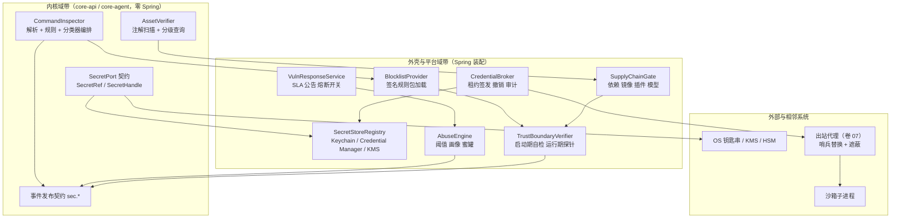
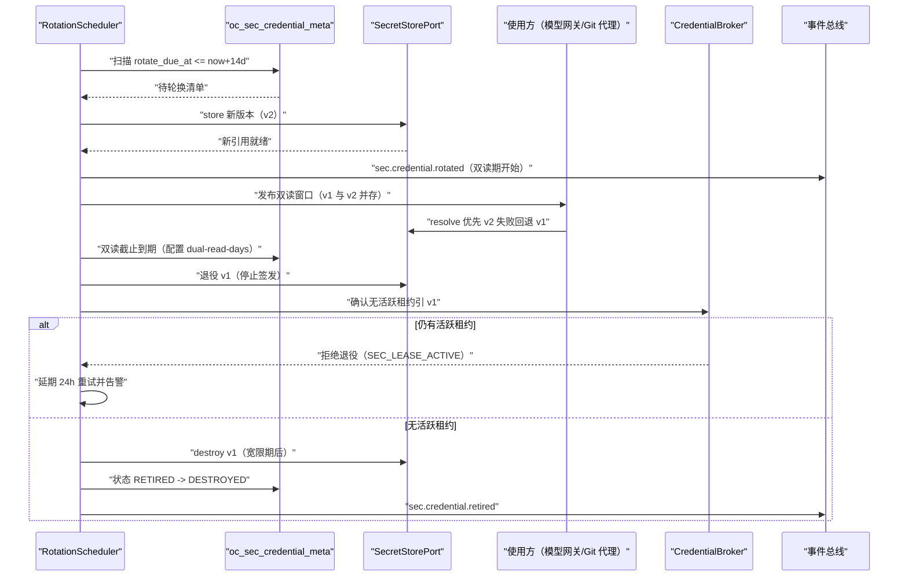
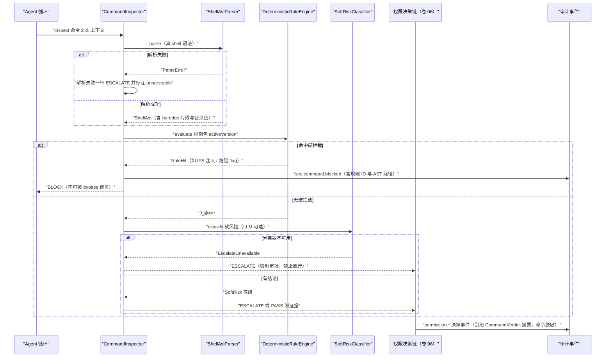
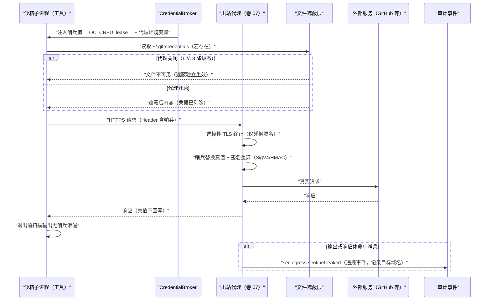
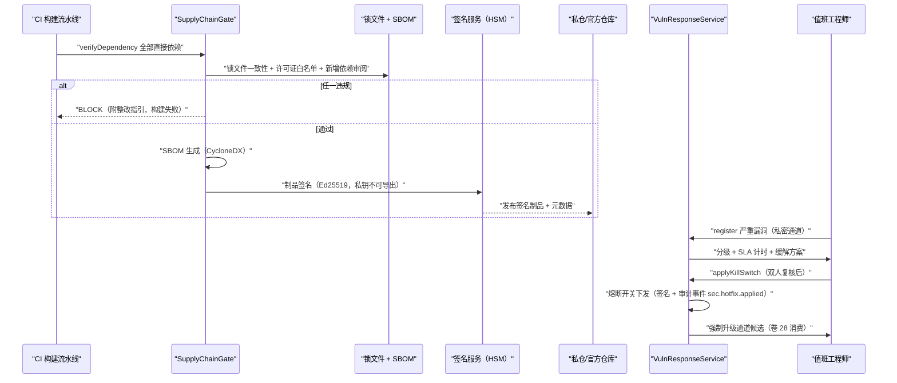
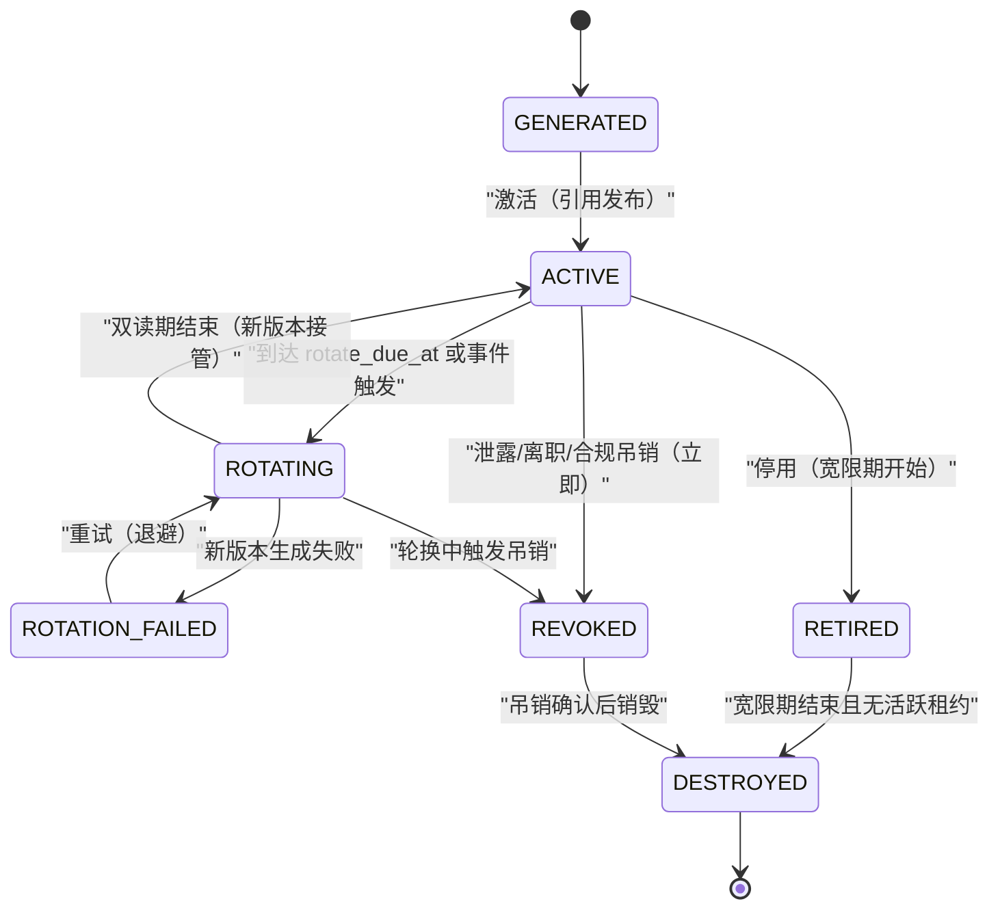
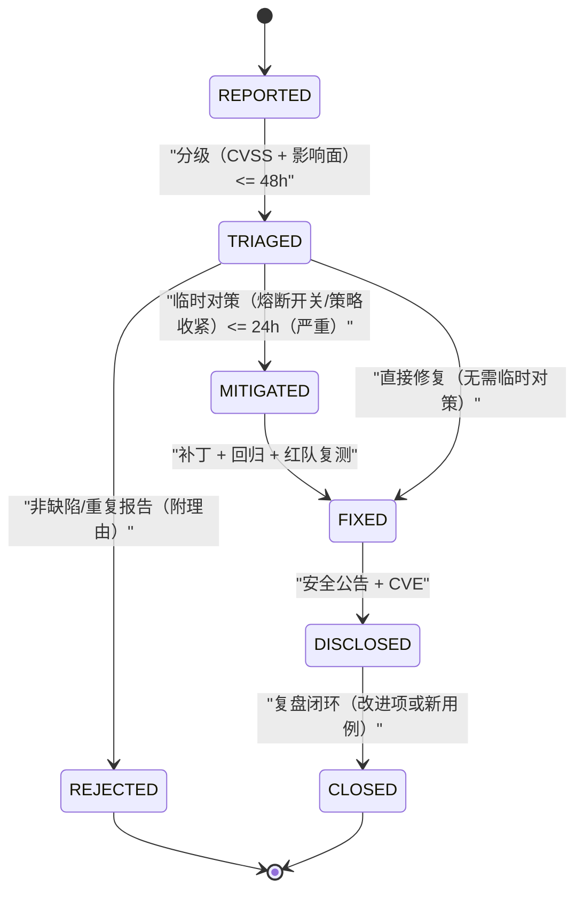

# Phase B 实现方案 27 · 安全运行时（Security Runtime）

> **上游契约**：Phase A 卷 30《安全工程与威胁模型》§2–§8（D-SEC-1…12）；关联卷 06（权限）、07（沙箱）、09（MCP）、18（插件）、19（持久化）、24（企业运营）；NFR-S 系列（深度防御、最小权限、fail-closed）。
> **定位**：Phase A 回答「谁在攻击我们、信任边界在哪、靠什么挡住」；本文件回答**「每条控制由什么代码在什么阶段强制、密钥在哪里活着、规则清单怎么发布与回归、被突破时第一分钟做什么」**。
> **竞品证据**：`research/competitors/01-claude-code-purpose-built.md`（E1：`bashSecurity.ts` 2,590 行静态分析清单、`shadowedRuleDetection.ts` 规则遮蔽检测、safetyCheck 路径免疫 bypassPermissions）、`05-minimax-cli.md`（E1：MITM CA + 凭据遮蔽/哨兵/body 替换、"代理关闭仍保文件保护"）、`03-codex.md`（E1：denied-read ⇒ 不可脱沙箱的单点谓词）、`02-opencode.md`（E1：能力受限进程内解释器 vs 显式无沙箱 bash）、`04-deepseek-harness.md`（E1：`strictDepBuilds` 默认拒绝安装脚本、NSIS 签名分发、机械门禁）、`08-gemini-cli.md`（E1/E2：遥测默认关 + 显式同意）。
> **不修改 Phase A**：本文件所有选定分支均落在 D-SEC-1…12 的选定分支内；新增实现级决策登记为 `I-SEC-1…7`，供 `impl/IMPL-DECISIONS.md` 汇总。

---

## 1. 实现目标与范围

### 1.1 本组件解决什么

1. **资产分级的运行期执行**：A0–A3 不是文档标签，而是**元数据 + 注解处理器 + 存储/日志/导出三类闸门**联动的可执行约束（A0 永不落普通存储、A1 出站必经 DLP 与脱敏）。
2. **10 条信任边界的可执行校验**：每条边界在**编译期 / 启动期 / 运行期**至少一处被机器校验，校验结果落 `sec.boundary.verified` 事件，缺口即启动失败或降级告警（§4.2）。
3. **密钥与凭据全生命周期**：生成 → 存储（OS 钥匙串 / KMS）→ 引用式使用 → 轮换（双读期）→ 退役 → 销毁；子进程只见**租约 token / 哨兵值**，明文不出宿主安全域（§5、§6.1、§6.3）。
4. **命令解析安全**：注入 / 引号 / heredoc / 危险 flag / 畸形 token / zsh 模块命令的**完整规则集 + 真 shell 解析器** + 两级分类器 + 规则遮蔽检测 + 误报治理（§6.2、§3.2）。
5. **供应链、漏洞响应与防滥用**：依赖锁定 / SBOM / 制品签名 / 构建可复现四件套 + 分级 SLA + 热修补三级通道（§6.4、§7.2）；速率 / 内容 / 越权探测三面滥用检测 → 熔断与人工复核（§6.4）。

### 1.2 本组件不解决什么

| 不解决 | 归属 |
| --- | --- |
| 权限判定链、审批编排、规则 DSL 求值 | 卷 06 权限系统（本组件提供硬拦截清单数据与命令解析结论作为其判定输入） |
| 五档隔离档位、围栏建立、网络代理本体 | 卷 07 沙箱执行器（本组件管密钥注入协议与代理的凭据遮蔽规则） |
| DLP 内容规则、租户/SSO/审计存储实现；更新制品签名的业务分发 | 卷 24 企业运营、卷 16/19、卷 28（本组件只做边界校验脚本、滥用信号与验证库） |

### 1.3 上下游依赖

| 方向 | 依赖方 | 契约 |
| --- | --- | --- |
| 上游 | 卷 06 权限决策链 | 硬拦截结论以 `CommandVerdict` 注入决策链最内层，顺序固定：deny → 硬拦截 → 软风险 → 审批 |
| 上游 | 卷 07 沙箱 | `CredentialLease` 经密钥代理注入；`SandboxEnforcement` 为 `partial` 时密钥代理**拒绝**而非降级（L-012） |
| 上游 | 卷 18 插件运行时 | 装载前调用 `SupplyChainGate.verifyExtension(...)`；签名/哈希/清单/来源四查（L-018） |
| 下游 | 卷 16 事件总线 | 全部 `sec.*` 事件（§8.3），哈希链入审计 |
| 下游 | 卷 24 / 32 | 合规证据导出、SEV 演练、告警路由 |

### 1.4 归属分带与模块落位

**落地登记（R07：模块 / 顺序 / 批次；清单见 `reviews/R07-scope-build-platform.md`）**：
- **模块坐标**：`harness-contract`（包 `contract/security`）+ `harness-kernel/kernel-security`（**扩展模块**，待登记）+ `harness-platform/platform-security`（**扩展模块**：卷 27 §4.1 十二个 `platform-*` 不含安全运行时，待登记）+ `harness-host/{host-protocol,host-cli,host-bootstrap}`。卷 27 §4.3 **缺「卷 30 安全工程」行** → R07 建议补行（不改卷册）。
- **实施顺序（卷 27 §4.5）**：**无对应步骤（结构性缺口）**。建议挂两段：① **前置段随第 4/7 步**——命令静态检查与凭证引用/租约（`SecretRef` 不过内核）是工具执行与权限链的安全前置，不能等到第 20 步；② **完整段随第 20 步**（供应链/SBOM/红队/滥用引擎/边界探针）。按原 20 步执行会出现「先开工具执行口、后补安全围栏」的倒置（R07 §3 C5）。
- **数据迁移批次**：`oc_sec_*` 表族未在卷 27 §4.4 明列 → 建议新批次 **B8 安全运行时与分发遥测**（与本文件 + `28` 同批）；未映射项已登记 R07 §2。
- **表所有权**：`oc_sec_egress_manifest` 拥有者本文件（`28` 的 telemetry egress 清单须引用或降为其子集，不得另建同名表）。
- **I- 决策落点**：`I-SEC-1…7`（7 条）模块落点为上表；类级落点见 §⑤（`CommandInspector`/`CredentialBroker`/`BoundaryProbe`），逐条绑定登记为 R07 建议 S4。

| 组件 | 带 | 候选模块 | 装配方式 |
| --- | --- | --- | --- |
| 值对象 / SPI（`SecretStorePort`、`AbuseDetectorSPI` 等） | 内核域带 | `harness-contract`（`.../contract/security/`） | 零 Spring；只依赖 JDK |
| 命令解析 + 规则求值 + 分类器编排（纯函数） | 内核域带 | `harness-kernel/kernel-security` | 无 IO，可全量单测（R1：不依赖 Spring/JDBC/Redis/HTTP，不依赖 `harness-platform`） |
| 轮换调度、供应链接口、滥用引擎、边界校验器；钥匙串/Credential Manager/KMS 适配器 | 平台域带 | `harness-platform/platform-security`（`security` 与 `security.store` 子包）+ 表与属性绑定住 `platform-persistence`（`properties` 包，纯数据类不加 `@Component`） | Spring；由 `harness-host/host-bootstrap` 以 `@ConditionalOnMissingBean` 装配；DB 版 SPI 实现住平台域带 |
| 安全面 REST 与 `oc security` 命令 | 交互域带 | `harness-host/host-protocol` / `harness-host/host-cli`（命令族对齐 `22-cli-tui-impl`） | Spring MVC / CLI |

> **依赖方向（R1–R5，27-technical-path §4.2）**：`harness-contract ← harness-kernel ← harness-platform ← harness-host`；上表全部落点属该链内，无反向依赖（R2）与循环（R5）；模块名以 §4.1 目录布局为准（不使用 v1 `open-coding-*` 工程名，R4）。

### 1.5 三个必答问题（结论先行）

**Q1：10 条信任边界各自靠什么在哪个阶段被校验？**
答案见 §4.2 表：**编译期**做「不可能写错」的约束（依赖白名单、A0/A1 类型不得进日志参数的静态检查、IPC/清单 schema 代码生成）；**启动期**做「配置与信任根正确」的自检（localhost 绑定、令牌文件权限、证书固定表载入、KMS 可达性）；**运行期**做「行为符合声明」的探针与信号（路径围栏、越权探测、遥测白名单校验）。任一阶段失败按边界分级：B1/B2/B8/B9 关键控制 fail-closed，其余降级 + 告警。

**Q2：命令安全为什么不能只依赖 LLM 分类器？**
LLM 判定不可复现、可被提示注入操弄，且离线/配额受限时不可用。因此采用**确定性硬拦截（数据文件版本化、回归用例库）在前、LLM 软风险判定在后**的两级结构（L-009/L-017）：硬拦截永不被 bypass 覆盖；软风险只提升摩擦（强制离开快速路径 + 审批），不单独授予放行。

**Q3：密钥明文为什么可以「内核不见」？**
A0 资产以**引用**（`SecretRef`）在内核流通，明文只存在于密钥代理（`CredentialBroker`）与出站代理进程的内存中（引用式使用，卷 30 D-SEC-4）；子进程拿到哨兵值 `__OC_CRED_<leaseId>__`，代理在出站边界替换真值并支持签名重算（L-016/L-082）。内核任何日志/事件/工件中出现明文的路径都是缺陷。

---

## 2. 功能需求清单（REQ-SEC-n）

| 编号 | 需求描述 | 来源 | 优先级 | 验收要点 |
| --- | --- | --- | --- | --- |
| REQ-SEC-1 | 资产分级 A0–A3 元数据落地：数据字典逐字段标注级别，新增字段未标注即 CI 失败 | 卷 30 §2.1 D-SEC-2 | P0 | 数据字典与代码注解一致（生成式比对）；A0 字段不出现在任何表/日志 schema |
| REQ-SEC-2 | A0 资产「引用式使用」：表与配置只存 `secretRef`，明文仅经密钥服务接口取用 | 卷 30 §4.1 | P0 | 全仓扫描无 A0 明文；`oc_*` 表无密钥列 |
| REQ-SEC-3 | 10 条边界可执行校验（编译/启动/运行三阶段，§4.2 表逐行实现） | 卷 30 §2.2 D-SEC-3 | P0 | 每边界 ≥1 编译期或启动期校验 + ≥1 运行期探针；缺口报告 |
| REQ-SEC-4 | 密钥六态生命周期：生成/激活/轮换/退役/销毁 + 吊销事件触发，全程审计 | 卷 30 §4.2 D-SEC-4 | P0 | 状态机不变式测试全过；每次迁移产 `sec.credential.*` 事件 |
| REQ-SEC-5 | 轮换 SLA：凭证默认 90 天、签名密钥按策略、事件触发立即；到期前 14 天告警 | 卷 30 §4.2 | P0 | `oc_sec_credentials_due_rotation` 可观测；逾期自动进入强制轮换 |
| REQ-SEC-6 | OS 钥匙串集成：macOS Keychain / Windows Credential Manager / Linux Secret Service；无钥匙串环境回退加密文件 0600 并标注降级 | 卷 30 §10 默认实现 | P0 | 三平台集成测试矩阵；降级时 UI/日志显式标注 `file-fallback` |
| REQ-SEC-7 | 引用式句柄不可导出：`SecretHandle` 无 `reveal()`，仅代理进程可解析；进程内存不落交换文件的关键路径 | 卷 30 §4.1 | P1 | 接口面审计：无明文获取通道；句柄跨进程传输被拒 |
| REQ-SEC-8 | 模型凭证 / Git / SSH / 签名密钥分类存储与轮换策略差异化 | 卷 30 §4.2 表 | P1 | 每类密钥有轮换策略记录；离职/泄露事件触发吊销 ≤ 5 分钟 |
| REQ-SEC-9 | 命令解析安全：真 shell 解析器产出 AST + 完整规则集（IFS 注入、ANSI-C 引号绕过、heredoc 替换、危险 flag、畸形 token、zsh 模块命令） | 卷 30 + 竞品增量 01-claude-code §1 条目 11 [E1]（`bashSecurity.ts` 2,590 行） | P0 | 规则语料 ≥ 150 条全过；正常命令误报率 ≤ 0.5%（§6.2） |
| REQ-SEC-10 | 两级分类器：确定性硬拦截（数据文件发布、可审计、免 LLM）+ 软风险 LLM 判定（不可用时不放行、降级为强制审批） | 竞品增量：L-009（05-minimax §8 M4 [E1]） | P0 | 硬拦截清单独立发布且签名；分类器不可用时全部软风险转审批 |
| REQ-SEC-11 | 规则遮蔽检测：更宽规则遮蔽窄规则（如 `Bash(git *)` 遮蔽 `Bash(git push:*)` 的 deny）在策略加载时检出并阻断 | 竞品增量：01-claude-code §8#13 [E1]（`shadowedRuleDetection.ts`） | P0 | 遮蔽用例集全检出；企业策略导入时给出修复建议 |
| REQ-SEC-12 | 敏感路径读取判定免疫 bypass：读取 `.env`/密钥文件/证书库等敏感路径的请求**不可被** bypassPermissions/规则放行覆盖 | 竞品增量：01-claude-code §4 [E1]（safetyCheck `bypass 免疫`） | P0 | 免疫项用例：任何模式剖面下敏感读取仍触发 AI 门 |
| REQ-SEC-13 | 凭据租约：宿主持有长期凭据，向工具子进程仅发短期 token（TTL ≤ 1 执行、绑定 session/工具、可撤销、发放与撤销均审计） | 竞品增量：L-016（05-minimax §8 M9 [E1]） | P0 | 缺失撤销/绑定视为缺陷；吊销后残留哨兵一律失效 |
| REQ-SEC-14 | 出网凭据遮蔽：选择性 TLS 终止 + 环境/文件遮蔽 + 哨兵诱捕 + 请求体替换；**代理关闭仍保文件保护** | 竞品增量：L-082（05-minimax §1 条目 5 [E1]） | P1 | 无明文注入下 `git push`/`npm publish` 可用；文件遮蔽独立生效 |
| REQ-SEC-15 | 供应链四类治理：依赖锁文件 + 镜像签名 + 插件/技能签名与清单 + 模型摘要；违规阻断构建/装载 | 卷 30 §4.4 D-SEC-6 + L-018 | P0 | 四类检查在 CI 与运行期强制；阻断有事件与整改指引 |
| REQ-SEC-16 | SBOM 生成与可复现构建：CycloneDX SBOM 随发行物归档；构建时间戳与路径归一化可复现；关键安全类目覆盖率门禁 | 卷 30 §4.4 + 竞品增量 04-deepseek §6 [E1]（机械门禁） | P1 | 两次构建产物哈希一致；SBOM 与依赖树差异为零 |
| REQ-SEC-17 | 安全测试六层：SAST（含密钥扫描）/依赖与镜像扫描/提交前密钥检测/DAST/模糊测试（解析器与协议 schema）/红队，全部门禁化 | 卷 30 §3 D-SEC-7 | P0 | 六层在 CI 流水线运行；红队季度执行并产回归用例 |
| REQ-SEC-18 | 红队 10 类用例与信任边界一一映射（§4.3） | 卷 30 §4.3 验证方式 | P0 | RT-01…RT-10 全部有可执行脚本与通过标准 |
| REQ-SEC-19 | 漏洞响应：私密报告通道 + 分级 SLA（严重 24h 缓解 / 高 7d / 中 30d / 低 90d）+ 公告 + CVE + 复盘闭环 | 卷 30 §4.5 D-SEC-8 | P0 | SLA 看板可查；`oc_sec_patch_latency_hours` 有数据 |
| REQ-SEC-20 | 热修补三级：服务端配置熔断（分钟级）/客户端强制升级通道（小时级）/计划内修复；全部留审计 | 卷 30 §4.5 补丁通道 | P1 | 熔断开关演练：命中即禁用且可回滚 |
| REQ-SEC-21 | 防滥用：速率（配额 + 令牌桶 + 队列）、内容（高危工具组合 / 外发字节量）、越权探测（403/404 枚举指纹 + 蜜罐对象）三面检测与处置 | 卷 30 §4.8 D-SEC-12 | P0 | 五类模式中三类上线并有处置记录；误封可申诉解冻 |
| REQ-SEC-22 | 安全事件响应 SEV1–4：四角色、冻结/隔离手段（会话冻结/插件熔断/凭证吊销/租户限流）、取证与复盘产出「设计变更或新用例」 | 卷 30 §4.7 D-SEC-11 | P1 | 一次 SEV2 桌面演练全链路留痕；复盘关闭前禁止结案 |

> 说明：REQ-SEC-9…14、16 为竞品研究带来的增量需求（§3 模板要求），实现落在 §3.2/§3.3/§4.2/§5/§6.2/§6.3/§3.5。

---

## 3. 技术方案选型（M×N 比选）

### 3.1 I-SEC-1：密钥存储后端

| 分支 | 描述 | F | U | S | M | 加权 | 结论 |
| --- | --- | --- | --- | --- | --- | --- | --- |
| B1 本地加密文件（0600/ACL） | 零依赖；与已泄露磁盘镜像同亡 | 7 | 9 | 9 | 6 | 76 | 仅作降级档（Headless 无钥匙串环境） |
| B2 OS 钥匙串优先 + KMS/HSM 可选 + 统一引用 | 钥匙串（Keychain/Credential Manager/Secret Service）/ 服务端 KMS / 企业 HSM，经 `SecretStorePort` 多后端；引用式使用 | 9 | 8 | 8 | 9 | 85.5 | **选定** |
| B3 全量 KMS 强绑定 | 强合规；离线/桌面单机不可用 | 6 | 5 | 7 | 9 | 67.5 | 淘汰（违背 local-lite 档） |

**选定 B2 的代价**：三平台 + 三类后端的适配与测试矩阵成本；后端差异（如 Linux 无 Secret Service 的容器场景）通过**能力探测 + 显式降级标注**处理，不静默落文件。**回退触发**：企业安全基线禁止 OS 钥匙串（要求全部 KMS/HSM）时，`SecretStoreSPI` 换实现，接口不变。

### 3.2 I-SEC-2：命令解析安全引擎

| 分支 | 描述 | F | U | S | M | 加权 | 结论 |
| --- | --- | --- | --- | --- | --- | --- | --- |
| B1 正则黑名单 | 便宜；绕过面大（引号、变量、编码） | 4 | 8 | 8 | 5 | 58 | 淘汰（仅作纵深防御的补充信号） |
| B2 真 shell 解析器 AST + 规则集 + 两级分类器 | `bash -n` 级解析 + 自研 AST 遍历 + 数据文件规则 + LLM 软风险 | 9 | 7 | 8 | 9 | 84.5 | **选定** |
| B3 仅沙箱兜底（解析器不做判定） | 少误报；L0 档等于无控制，且拦截时机过晚 | 5 | 6 | 7 | 7 | 61 | 淘汰（保留：解析失败一律 fail-closed 转高风险） |

**选定 B2 的代价**：解析器与规则集维护成本（须用例库 + 季度回归，L-017 风险项）；误报以「软风险 → 审批」而非「硬拦截」兜底，硬拦截清单**仅收确定性注入模式**。**回退触发**：规则语料误报率连续两季度 > 2% → 冻结自动硬拦截，全量转审批并复核。

### 3.3 I-SEC-3：硬拦截清单与规则包发布形态

| 分支 | 描述 | F | U | S | M | 加权 | 结论 |
| --- | --- | --- | --- | --- | --- | --- | --- |
| B1 编译进代码常量 | 不可热修；无法审计历史版本 | 5 | 5 | 9 | 6 | 62.5 | 淘汰（L-009 明示风险） |
| B2 独立签名数据文件（版本化） | 与运行时解耦、可回滚、企业可叠加自有规则包 | 9 | 8 | 8 | 9 | 85.5 | **选定** |
| B3 远端配置中心下发 | 实时；引入新信任面与离线不可用 | 7 | 8 | 6 | 8 | 71 | 备选（仅企业自有端点，非默认） |

**选定 B2 的代价**：规则包与内核版本的兼容矩阵需维护（包声明 `minKernelVersion`）；企业自定义包只能**加严不能放宽**（求交语义），放宽必须走豁免审批并留审计。**回退触发**：签名校验链不可用（根公钥轮换失败）→ 使用内置基线包继续运行并冻结更新。

### 3.4 I-SEC-4：凭据注入与租约形态

| 分支 | 描述 | F | U | S | M | 加权 | 结论 |
| --- | --- | --- | --- | --- | --- | --- | --- |
| B1 环境变量明文注入 | 兼容性最好；进程可读、易进日志/crash dump | 7 | 9 | 3 | 5 | 57.5 | 淘汰（卷 07 D-SBOX-5 已淘汰） |
| B2 租约 broker + 哨兵替换 + 签名重算 | 子进程仅见哨兵；出站边界替换真值 | 9 | 7 | 8 | 9 | 84.5 | **选定** |
| B3 零注入（改写协议走 helper） | 最安全；仅覆盖 Git/包管理器少数场景 | 5 | 6 | 8 | 7 | 63.5 | 兼容子路径（双证书场景回退「不注入 + 失败提示」） |

**选定 B2 的代价**：需覆盖 AWS SigV4 / HMAC 类签名的重算（实现集中在 `CredentialMutator`）；无法安全重写的客户端（mTLS）显式失败。**非 HTTP 协议例外（R04 明确）**：SSH / 数据库等非 HTTP 通道**不适用哨兵替换**——走「短租约 + 签名代理（ssh-agent 类）」或一次性凭据（卷 20 §⑩.6 远端信任纪律），代理/密钥服务不可用时**拒绝连接**而非降级为明文注入。**回退触发**：重算失败率 > 5% → 该客户端加入兼容清单，回退 B3 模式。

### 3.5 I-SEC-5：供应链验证强度

| 分支 | 描述 | F | U | S | M | 加权 | 结论 |
| --- | --- | --- | --- | --- | --- | --- | --- |
| B1 锁文件 + CVE 扫描 | 基线；对投毒与作者账户失陷无效 | 6 | 9 | 9 | 6 | 71 | 基线保留（社区形态） |
| B2 锁文件 + SBOM + 制品签名 + 可复现构建 + 机械门禁 | 四查 + 构建期阻断 + 关键模块覆盖率门禁 | 9 | 7 | 8 | 9 | 84.5 | **选定** |
| B3 完整 TUF 式多角色 | 最强；密钥操作与运营成本高 | 8 | 5 | 6 | 9 | 71 | 备选（企业升级路径，接口不变） |

**选定 B2 的代价**：可复现构建要求消除构建路径/时间戳/依赖解析顺序差异（`project.build.outputTimestamp` + 离线依赖仓），个别第三方插件产物字节级不可复现时登记**白名单豁免 + 理由**（04-deepseek 对安装脚本逐条 review 的类比 [E1]）。**回退触发**：Maven Central 签名与私仓镜像不一致 → 冻结该依赖升级，人工复核后放行。

### 3.6 I-SEC-6：防滥用与越权探测引擎

| 分支 | 描述 | F | U | S | M | 加权 | 结论 |
| --- | --- | --- | --- | --- | --- | --- | --- |
| B1 静态阈值 | 简单；对慢速/分布式探测无效 | 6 | 7 | 9 | 6 | 69 | 基线（保留为兜底规则） |
| B2 阈值 + 画像基线（EWMA）+ 组合信号 + 蜜罐 | 多维信号聚合，处置分级 | 9 | 7 | 8 | 8 | 81 | **选定** |
| B3 全量 ML 评分 | 上限高；可解释性与冷启动差 | 7 | 5 | 5 | 8 | 62.5 | 淘汰（信号保留给后续演进） |

**选定 B2 的代价**：画像需要 14 天冷启动期（期间以静态阈值兜底）；组合信号需人工复核队列避免误封（误封申诉通道强制）。**回退触发**：误封率 > 0.1%（周）→ 自动处置降级为「告警 + 人工」，仅保留速率硬限。

### 3.7 I-SEC-7：漏洞热修补与强制升级通道

| 分支 | 描述 | F | U | S | M | 加权 | 结论 |
| --- | --- | --- | --- | --- | --- | --- | --- |
| B1 仅常规发版 | 简单；严重漏洞暴露窗口以周计 | 4 | 6 | 9 | 6 | 60.5 | 淘汰 |
| B2 三级：配置熔断（分钟）/强制升级（小时）/计划修复（天） | 按杀伤半径选通道；全部留审计 | 9 | 8 | 8 | 8 | 83 | **选定** |
| B3 二进制热补丁 | 无停机；签名/回滚/兼容矩阵复杂度极高 | 6 | 9 | 3 | 5 | 56.5 | 淘汰（安全域不引入不可审计补丁面） |

**选定 B2 的代价**：熔断开关本身是新攻击面 ⇒ 开关清单进硬拦截数据文件同源审计，变更须双人复核；强制升级会让用户被动中断（除安全级外默认采纳静默窗口）。**回退触发**：熔断误伤主流程（P0 功能不可用）→ 自动回滚开关并告警。

### 3.8 与竞品对照的取舍（research 证据）

| 对照维度 | 竞品证据 | 我们的取舍 | 主动放弃的收益 |
| --- | --- | --- | --- |
| 命令安全检测 | Claude Code `bashSecurity.ts` 2,590 行独立检测项清单（IFS 注入 / ANSI-C 引号绕过 / heredoc 替换 / jq 危险 flag / 畸形 token / zsh 模块命令；`competitors/01` §1 条目 11）[E1] | 同向采纳为「真解析器 AST + 可枚举规则家族」（I-SEC-2/3；REQ-SEC-9），规则包独立签名发布 | 不做纯正则黑名单（绕过面大），代价是解析器与用例库维护成本（L-017 风险项） |
| 规则遮蔽与 bypass 免疫 | `shadowedRuleDetection.ts` + safetyCheck 敏感读取**不可被 bypass 覆盖**（`competitors/01` §8#13/§4）[E1] | 全采纳（REQ-SEC-11/12）：遮蔽在策略加载期阻断、敏感路径读取任何剖面下仍触发 AI 门 | 「一次 bypass 全放开」的爽感被放弃 |
| 凭据形态 | MiniMax 凭据遮蔽 MITM（本地 CA / 哨兵 / body 替换 / AWS SigV4）+「代理关闭仍保文件保护」（`competitors/05` §1 条目 5）[E1]；DeepSeek 配置只引用 key 名 [E1] | 合并采纳为「租约 + 哨兵 + 选择性 TLS 终止 + 文件遮蔽独立生效」（I-SEC-4；REQ-SEC-13/14） | 无代理场景牺牲 mTLS 类客户端兼容（显式失败而非降级明文） |
| 沙箱-审批交互 | Codex `unsandboxed_execution_allowed(fs_policy) = !fs_policy.has_denied_read_restrictions()` 单点谓词（`competitors/03` §8 M2）[E1] | 采纳「结构性不可能脱沙箱」为可测谓词（跨文件对齐 `07-sandbox-executor-impl.md`），并扩为敏感路径读取免疫 | 不引入第二套审批语义（复用卷 06 决策链），代价是谓词需随策略面同步演进 |
| 供应链与发布 | DeepSeek `strictDepBuilds` 默认拒绝安装脚本 + NSIS 签名 + CI 机械门禁（`competitors/04` §2）[E1] | 采纳为四查 + SBOM + 可复现构建（I-SEC-5；REQ-SEC-15/16） | 允许个别产物白名单豁免（登记理由），不追求全域字节级可复现 |

---

## 4. 总体架构图

### 4.1 组件与数据流



### 4.2 信任边界的三阶段校验矩阵（REQ-SEC-3）

| 边界 | 编译期 / 构建期校验 | 启动期校验 | 运行期校验 | 失败动作 |
| --- | --- | --- | --- | --- |
| B1 客户端↔端 | DTO 校验注解 + OpenAPI 契约比对（缺覆盖即 CI 失败，L-073 同源） | 认证/CSRF/CORS 配置自检；Swagger 生产关闭检查 | 参数校验、速率限制、越权探测（§6.4） | 拒绝请求 + `sec.abuse.detected` |
| B2 端↔内核 | IPC 帧 schema 由单一事实源生成（禁止手写解析） | 回环绑定检查 + 令牌文件权限（0700/0600）+ 短时效参数检查 | 本地令牌校验（绑定用户/进程）、连接数上限 | 拒绝连接 + 本机告警 |
| B3 内核↔模型 | 响应 schema 类 + 不可信类型包装（`UntrustedContent`）编译期强制 | 端点证书固定表载入 + 钉扎公钥完整性 | 出站脱敏、请求留痕（脱敏）、预算熔断 | 丢弃响应 / 切降级 |
| B4 执行沙箱 | 归档：规则包语法（解析器单测） | 能力探测（卷 07 §4.2） | 围栏见证 + 违规检测（07 §4.4） | 拒执行 + 冻结（07） |
| B5 工作区/远端 | 提交扫描规则包版本化 + 用例回归；仓库执行面加固清单（`21-git-worktree-impl.md` §⑩.7 G-1…G-7）进 CI 用例 | SSH 主机密钥校验配置检查：`host-key-policy` 必须为 `strict` 系（`strict` / `strict-trust-on-first-use`），检测到 `accept-new` / `no` / 全局 `ForwardAgent=yes` **即 FAIL**；受控 `known_hosts` 存在且权限 0600 | 路径围栏、内容检测、提交前扫描（卷 21）、**仓库执行面探针**（钩子只读、执行类配置键拒绝、传输协议白名单、仓库级预检同沙箱）、主机密钥变化告警 | 阻断提交 + 告警；**主机密钥失败即断连**并提示疑似 MITM |
| B6 插件/MCP | 清单 schema 生成 + 签名验证代码单测 | 装载时签名/哈希/来源四查（L-018） | 权限门面、调用审计、资源熔断 | 拒绝装载 / 熔断 |
| B7 外部调用方 | DTO + scope 注解一致性检查 | API Key/OAuth 配置与 scope 校验 | 配额、限流、幂等键、被调用方沙箱化 | 429 / 403 + 审计 |
| B8 存储/密钥 | 迁移脚本评审 + 加密列清单生成 | 最小权限账号自检（禁 superuser）、TLS 强制、KMS 可达性 | 审计哈希链校验、异常访问检测 | **fail-closed**（拒绝敏感写） |
| B9 供应链 | 锁文件 + SBOM + 许可证白名单 + 新增依赖审阅（构建期阻断） | 发行物/插件签名根加载校验 | 热更新包运行时验证（卷 28 协作） | 阻断构建 / 拒绝装载 |
| B10 遥测/更新 | 固定证书表与公钥钉扎内置（编译期常量） | 端点白名单与通道配置检查 | 签名 + 哈希 + 防降级 + 遥测白名单校验 | 拒绝应用 / 拒绝上报 |

**缺口语义**：`TrustBoundaryVerifier` 启动期产出 `BoundaryReport`；关键边界（B2/B8/B9）任一 `FAIL` ⇒ 启动失败（fail-fast）；其余 `FAIL` ⇒ 降级启动 + `sec.boundary.degraded` 事件 + UI 徽章。
### 4.3 红队用例映射（RT ↔ B，每边界 ≥ 1 条）

| 用例 | 目标边界 | 场景 | 通过标准 |
| --- | --- | --- | --- |
| RT-01 | B1 | 会话令牌重放 / CSRF / 越权对象访问序列 | 全部被拒；产生越权探测信号 |
| RT-02 | B2 | 同机恶意进程伪造 IPC 帧 / 读取令牌文件 | 帧校验失败；文件权限导致读取失败 |
| RT-03 | B3 | 提示注入诱导工具外发源码；证书替换 | 出站 DLP 命中；固定校验拒绝替换 |
| RT-04 | B4 | 沙箱内逃逸尝试（需在测试沙箱档执行） | 围栏拒绝 + `Violated` + 无真实越界 |
| RT-05 | B5 | 恶意仓库内容（hooks、`.git` 本地配置注入、`.gitattributes` 过滤器 / LFS smudge、子模块 `ext::` / `file:` 传输、`.oc/ci.yaml` 预检命令注入、worktree 路径符号链接替换） | `21 §⑩.7` G-1…G-7 全部生效：宿主侧零仓库声明进程（进程树断言）；治理路径不可写；主机密钥变化被拒并告警 |
| RT-06 | B6 | 未签名/哈希不符插件装载；权限放大请求 | 装载被拒；权限门面拒绝越权 API |
| RT-07 | B7 | 伪造调用方 scope / 幂等键冲突 / 配额耗尽 | 403/409/429；审计链完整 |
| RT-08 | B8 | 直连数据库绕过端口；审计链篡改 | 网络/账号策略拒绝；哈希链校验报警 |
| RT-09 | B9 | 投毒依赖（含安装脚本）进入构建 | 构建阻断（默认拒绝安装脚本，04-deepseek 类比 [E1]） |
| RT-10 | B10 | 中间人返回旧版本/篡改元数据 | 防降级 + 签名校验拒绝；告警 |

---

## 5. 类图与 Java 21 签名

```mermaid
classDiagram
    class SecurityRuntimeFacade {
        +posture(tenantId) SecurityPosture
        +rotate(SecretRef ref, RotateReason reason) RotationTicket
        +revoke(SecretRef ref, RevokeReason reason) void
        +reloadBlocklist(RulePack pack) BlocklistVersion
    }
    class CommandInspector {
        <<interface>>
        +inspect(CommandRequest req) CommandVerdict
    }
    class ShellAstParser {
        +parse(String command) ShellAst
    }
    class DeterministicRuleEngine {
        +evaluate(ShellAst ast, RulePack pack) List~RuleHit~
    }
    class SoftRiskClassifier {
        +classify(ShellAst ast, RiskContext ctx) SoftRisk
    }
    class ShadowedRuleDetector {
        +detect(List~PolicyRule~ rules) List~ShadowedRule~
    }
    class BlocklistProvider {
        +load(Path path, SignatureEnvelope sig) RulePack
        +activeVersion() BlocklistVersion
    }
    class SecretStorePort {
        <<interface>>
        +resolve(SecretRef ref) SecretHandle
        +store(SecretRef ref, SecretMaterial material) void
        +destroy(SecretRef ref) void
    }
    class CredentialBroker {
        +issue(LeaseRequest req) CredentialLease
        +revoke(LeaseId id, RevokeReason reason) void
    }
    class SupplyChainGate {
        +verifyDependency(DependencySpec spec) GateResult
        +verifyExtension(ExtensionManifest m, SignatureEnvelope s) GateResult
        +verifyModelArtifact(ModelRef ref, Digest digest) GateResult
    }
    class TrustBoundaryVerifier {
        +verifyAtStartup() BoundaryReport
        +probe(BoundaryId id) ProbeResult
    }
    class AbuseEngine {
        +evaluate(AbuseSignal signal) AbuseDisposition
        +freeze(TenantId id, FreezeScope scope) void
    }
    class VulnResponseService {
        +register(VulnReport report) VulnTicket
        +applyKillSwitch(KillSwitchRef ref, Actor operator) void
    }
    class AssetLevel {
        <<enumeration>>
        A0_CRITICAL
        A1_SENSITIVE
        A2_INTERNAL
        A3_PUBLIC
    }
    class CredentialState {
        <<enumeration>>
        GENERATED
        ACTIVE
        ROTATING
        RETIRED
        REVOKED
        DESTROYED
    }
    class SecRuntimeException {
        <<exception>>
    }
    SecurityRuntimeFacade --> CommandInspector
    SecurityRuntimeFacade <|.. DefaultSecurityRuntimeFacade
    CommandInspector <|.. DefaultCommandInspector
    DefaultCommandInspector --> ShellAstParser
    DefaultCommandInspector --> DeterministicRuleEngine
    DefaultCommandInspector --> SoftRiskClassifier
    BlocklistProvider --> ShadowedRuleDetector
    CredentialBroker --> SecretStorePort
    SupplyChainGate --> TrustBoundaryVerifier
    AbuseEngine --> VulnResponseService
    SecRuntimeException --|> HarnessException
```



### 5.1 命令判定接口（内核域带，纯函数）

```java
/**
 * 命令安全检查器。
 * 对模型产出的命令执行「解析 → 确定性硬拦截 → 软风险判定」三级检查，
 * 结论注入权限决策链最内层；本接口不执行命令、不访问网络。
 */
public interface CommandInspector {

    /**
     * 检查一条待执行命令。
     *
     * @param request 命令检查请求（必填；含原始命令、工作区根、风险上下文）
     * @return 判定结论：BLOCK（硬拦截）/ ESCALATE（转审批）/ PASS
     * @throws SecRuntimeException 规则包未加载或解析器不可用时抛出（失败一律转 ESCALATE，禁止放行）
     */
    CommandVerdict inspect(CommandRequest request);
}
```

```java
/**
 * 命令行判定结论（封闭集，禁止新增隐式分支）。
 * BLOCK 不可被任何绕过模式覆盖；ESCALATE 强制离开快速路径进入审批；PASS 仅表示未见风险。
 */
public record CommandVerdict(VerdictKind kind, List<RuleHit> hits, SoftRisk softRisk) {

    /** 结论种类：BLOCK 硬拦截 / ESCALATE 转审批 / PASS 放行 */
    public enum VerdictKind {
        BLOCK("BLOCK", "硬拦截"), ESCALATE("ESCALATE", "转审批"), PASS("PASS", "放行");

        private final String code;
        private final String desc;

        VerdictKind(String code, String desc) {
            this.code = code;
            this.desc = desc;
        }

        /**
         * 按编码解析结论种类。
         *
         * @param code 编码（必填，取值见枚举项）
         * @return 匹配的枚举项
         * @throws SecRuntimeException 编码未知时抛出（SEC_CONTRACT_VIOLATION，禁止回退默认值）
         */
        public static VerdictKind of(String code) {
            for (VerdictKind kind : values()) {
                if (kind.code.equals(code)) {
                    return kind;
                }
            }
            throw new SecRuntimeException(SecErrorCode.SEC_CONTRACT_VIOLATION, "未知判定结论：" + code);
        }
    }
}
```

### 5.2 密钥存储与租约（平台域带）

```java
/**
 * 密钥存储端口。
 * 屏蔽 OS 钥匙串 / KMS / HSM / 加密文件四种后端的差异；只暴露引用式操作，
 * 任何实现都不得提供「读取明文」方法（A0 资产的引用式使用约束）。
 */
public interface SecretStorePort {

    /**
     * 解析引用为进程内句柄（仅代理进程与密钥服务可调用）。
     *
     * @param ref 密钥引用（必填；格式 backend:namespace:name）
     * @return 不可导出明文的句柄；句柄随会话结束失效
     * @throws SecRuntimeException 引用不存在（SEC_CREDENTIAL_NOT_FOUND）或后端不可用（SEC_STORE_UNAVAILABLE，fail-closed）
     */
    SecretHandle resolve(SecretRef ref);

    /**
     * 生成并存储新密钥材料（轮换第一步）。
     *
     * @param ref 目标引用（必填）
     * @param material 密钥材料（必填；调用方持有，存储后立即清零内存）
     * @throws SecRuntimeException 后端写入失败或引用已存在（SEC_ROTATION_CONFLICT）
     */
    void store(SecretRef ref, SecretMaterial material);

    /**
     * 销毁密钥材料（宽限期后调用，不可逆）。
     *
     * @param ref 密钥引用（必填）
     * @throws SecRuntimeException 引用仍被活跃租约占用（SEC_LEASE_ACTIVE，禁止强删）
     */
    void destroy(SecretRef ref);
}
```

```java
/**
 * 凭据租约签发器。
 * 宿主长期持有凭据，向工具子进程只发短期租约（L-016）：TTL 绑定单次执行、绑定 session 与工具标识、可随时撤销。
 */
@Slf4j
@Service
@RequiredArgsConstructor
public class CredentialBroker {

    private final SecretStorePort secretStore;
    private final SecurityEventPublisher eventPublisher;
    private final SecurityProperties properties;
    private final LeaseRegistry leaseRegistry;
    private final LeasePolicy leasePolicy;

    /**
     * 签发一次性租约。
     *
     * @param request 租约请求（必填；含 sessionId、工具名、目标域名、所需能力）
     * @return 短期租约（内含哨兵值，不含明文）
     * @throws SecRuntimeException 能力未授权（SEC_LEASE_DENIED）或域名不在白名单（SEC_LEASE_DENIED）
     */
    public CredentialLease issue(LeaseRequest request) {

        // 1. 校验能力与域名授权（拒绝即终态，不做降级放行）
        requireLeaseAuthorized(request);

        // 2. 生成租约实体：TTL 取配置值（默认 15 分钟，运维可调，属安全策略而非代码常量）
        long ttlSeconds = properties.leaseTtlSeconds();
        CredentialLease lease = CredentialLease.issue(request, ttlSeconds);

        // 3. 审计：只记录引用掩码标识，禁止记录任何明文或可逆编码
        log.info("凭据租约已签发，leaseId={}, credentialRef={}, tool={}, ttlSeconds={}", lease.leaseId(), MaskingConverter.maskRef(request.secretRef()), request.toolName(), ttlSeconds);
        eventPublisher.publish(SecurityEvents.leaseIssued(lease));

        return lease;
    }

    /**
     * 撤销租约（执行结束、异常、外泄检测命中三种触发）。
     *
     * @param leaseId 租约标识（必填）
     * @param reason 撤销原因（必填）
     * @throws SecRuntimeException 租约不存在（SEC_LEASE_NOT_FOUND）
     */
    public void revoke(LeaseId leaseId, RevokeReason reason) {
        // 撤销幂等：重复撤销视为成功并只发布一次事件
        boolean revoked = leaseRegistry.revoke(leaseId, reason);
        if (revoked) {
            log.info("凭据租约已撤销，leaseId={}, reason={}", leaseId, reason.getDesc());
            eventPublisher.publish(SecurityEvents.leaseRevoked(leaseId, reason));
        }
    }

    private void requireLeaseAuthorized(LeaseRequest request) {
        // 能力与域名白名单双校验（任一不满足即拒绝，禁止部分授予）
        if (!leasePolicy.isAuthorized(request.capability(), request.targetDomain())) {
            throw new SecRuntimeException(SecErrorCode.SEC_LEASE_DENIED,
                    "凭据租约被拒：能力或目标域名未授权，tool=" + request.toolName());
        }
    }
}
```

### 5.3 边界校验与供应链接口

```java
/**
 * 信任边界校验器。
 * 启动期执行全部边界的可机器校验项（§4.2 表），运行期按周期与事件触发探针；
 * 校验结果作为 `sec.boundary.verified` 事件入审计，缺口即降级或 fail-fast。
 */
public interface TrustBoundaryVerifier {

    /**
     * 启动期全量校验。
     *
     * @return 边界报告（含每条边界的三阶段校验结果与缺口清单）
     * @throws SecRuntimeException 关键边界（B2/B8/B9）校验失败时抛出（SEC_BOUNDARY_FAILED，触发启动失败）
     */
    BoundaryReport verifyAtStartup();

    /**
     * 运行期单边界探针（幂等，可重复执行）。
     *
     * @param boundaryId 边界标识（必填，B1…B10）
     * @return 探针结果与证据摘要（不含敏感载荷）
     */
    ProbeResult probe(BoundaryId boundaryId);
}
```

```java
/**
 * 供应链门禁。
 * 四类制品（依赖/镜像/插件/模型）的签名、哈希、来源、清单检查；
 * 违规按 `open-coding.security.supply-chain.fail-mode` 处理：closed 阻断，warn 记录并放行（仅社区形态允许）。
 */
public interface SupplyChainGate {

    /**
     * 校验单个依赖（构建期由 CI 调用，运行期由插件装载调用）。
     *
     * @param spec 依赖规格（必填；坐标 + 版本 + 摘要）
     * @return 门禁结果（PASS / BLOCK / WARN + 整改指引）
     * @throws SecRuntimeException 扫描器不可用且 fail-mode=closed 时抛出（SEC_SCANNER_UNAVAILABLE）
     */
    GateResult verifyDependency(DependencySpec spec);

    /**
     * 校验扩展（插件/技能）装载前的四查。
     *
     * @param manifest 扩展清单（必填；含权限声明与载荷哈希列表）
     * @param signature 签名信封（必填；企业私仓场景验私仓根）
     * @return 门禁结果（哈希须覆盖全部载荷，L-018）
     * @throws SecRuntimeException 签名链不可信（SEC_SIGNATURE_INVALID）
     */
    GateResult verifyExtension(ExtensionManifest manifest, SignatureEnvelope signature);
}
```

### 5.4 错误码枚举（统一异常体系内）

```java
/**
 * 安全运行时错误码。
 * 与全局异常处理器映射为附录 B 错误响应；code 为稳定契约，只增不改。
 */
@Getter
@RequiredArgsConstructor
public enum SecErrorCode {

    /** 密钥引用不存在 */
    SEC_CREDENTIAL_NOT_FOUND("SEC_CREDENTIAL_NOT_FOUND", "密钥引用不存在"),
    /** 密钥后端不可用（fail-closed 场景） */
    SEC_STORE_UNAVAILABLE("SEC_STORE_UNAVAILABLE", "密钥存储后端不可用"),
    /** 轮换冲突（引用已存在或并发轮换） */
    SEC_ROTATION_CONFLICT("SEC_ROTATION_CONFLICT", "密钥轮换冲突"),
    /** 轮换失败（旧密钥保留，可重试） */
    SEC_ROTATION_FAILED("SEC_ROTATION_FAILED", "密钥轮换失败"),
    /** 租约未授权（能力或目标域名不在白名单） */
    SEC_LEASE_DENIED("SEC_LEASE_DENIED", "凭据租约被拒"),
    /** 租约被活跃占用，禁止销毁 */
    SEC_LEASE_ACTIVE("SEC_LEASE_ACTIVE", "租约仍活跃"),
    /** 规则包签名或语法非法 */
    SEC_RULEPACK_INVALID("SEC_RULEPACK_INVALID", "规则包非法"),
    /** 关键边界校验失败 */
    SEC_BOUNDARY_FAILED("SEC_BOUNDARY_FAILED", "信任边界校验失败"),
    /** 契约违例（未知枚举值等，禁止静默回退） */
    SEC_CONTRACT_VIOLATION("SEC_CONTRACT_VIOLATION", "安全契约违例");

    private final String code;
    private final String desc;
}
```

---

## 6. 核心流程时序图

### 6.1 密钥轮换（90 天 SLA + 双读期）



- **前置条件与主路径**：`CredentialMeta` 处于 `ACTIVE` 且 `rotate_due_at ≤ now + 14d`（或事件触发）；生成新版本 → 双读期 → 退役旧版本 → 宽限期后销毁，每步产审计事件。
- **异常与补偿**：新版本生成失败 ⇒ 保持旧版本 + `SEC_ROTATION_FAILED` 告警重试；双读期回退率异常 ⇒ 延长双读期并排查客户端缓存。
- **幂等与并发点**：`RedisKeys.sec.rotation(secretRef)` 分布式锁 + `rotationEpoch` 版本号；重复触发为幂等（已轮换则跳过）。

### 6.2 命令安全判定（解析 → 硬拦截 → 软风险 → 审批）



- **前置条件与主路径**：命令已经模型产出且尚未执行、规则包已加载且签名有效；解析成功 → 无硬拦截 → 软风险结论 → 注入权限决策链。
- **异常与补偿**：解析器崩溃 ⇒ **禁止放行**（ESCALATE）；规则包缺失 ⇒ `SEC_RULEPACK_INVALID` 触发 fail-closed（拒绝 R2+ 执行）。
- **幂等与并发点**：同命令文本 + 规则包版本可缓存判定（`RedisKeys.sec.verdictCache(hash)`，TTL 10 分钟）；缓存键含规则包版本，更新即失效。
- **误报治理**：漏拦走回归用例补充、误拦走误报工单 + 规则收窄；两个方向都有指标（§10.5）。

**规则集完整性与误报策略（专节）**：

- **完整性论证（按语法家族对 AST 节点类型）**：六个规则家族各自锚定解析器产出的节点类型，家族覆盖 = 语法面覆盖，保证「新增一种语法 = 新增一个可枚举家族」而非开放集 —— ① IFS 注入族（`Assignment` + `Word` 展开，含 `IFS=...` 前缀赋值）；② 引号/编码绕过族（`ANSI-C Quoting`、`$''`、八进制/十六进制转义、Unicode 同形）；③ heredoc 与命令替换族（`HereDoc`、`CommandSubstitution`、`ProcessSubstitution`，含嵌套与跨行）；④ 危险 flag 族（按命令族的参数语义表，如 `rm -rf` 越界路径、`jq -f` 文件读取、`curl -o` 越界写入）；⑤ 畸形/截断 token 族（解析歧义、NUL、超长行、控制字符）；⑥ shell 方言族（zsh 模块命令、`setopt` 危险项、别名展开差异）。**完备性门禁**：红队语料 ≥ 150 条按家族分组，每组必须 ≥ 12 条且逐条有断言；语料未覆盖的 AST 节点类型清单进构建期报告，缺口为非空即告警。
- **误报分层策略（宁转审批、不静默放行）**：硬拦截层**只收确定性注入模式**（命中即 BLOCK，不可被 bypass 覆盖）；语义可疑但不确定的一律 ESCALATE（转审批），审批结果可回写为**会话/项目级允许规则**（对齐 Codex `amend` 手法的我们版本，见 `06-permission-system-impl.md`），使同一命令第二次出现时不再打断；解析失败 → ESCALATE + `unparseable` 标注（fail-closed）。
- **误报率与豁免纪律**：硬拦截误报率门禁 ≤ 0.5%（周度实跑，超限自动把该规则降为 ESCALATE 并开单）；软区误报走「临时放行单」（限时/限主体/限规则/双人确认/留审计，与 25/26 同款纪律）；**禁止**全局关规则。指标双向：`sec_command_false_block_total`（误拦）与红队语料漏拦计数（漏拦），任一超阈值即冻结该家族规则发布。

### 6.3 出网凭据遮蔽（代理关闭仍保文件保护）



- **前置条件与主路径**：租约已签发且代理已在会话内注册域名策略；哨兵注入 → 请求经代理替换 → 真值不回写。
- **异常与补偿**：代理启动失败 ⇒ 需网络的命令拒绝执行（fail-closed）；文件遮蔽层不可用 ⇒ 拒绝读取该文件（不返回原始内容）。
- **幂等与并发点**：同一 leaseId 的替换为幂等；签名重算按 `(client, keyId)` 缓存算法参数。

### 6.4 供应链阻断与热修补熔断



- **前置条件**：依赖图已解析；签名服务可用（不可用时失败关闭，禁止未签名发布）。
- **主路径**：四查通过 → SBOM → 签名发布；漏洞进入 SLA 计时。
- **异常与补偿**：SBOM 与依赖树不一致 ⇒ 构建失败（禁止手工豁免，只能修复）；熔断开关误伤 ⇒ 回滚开关 + 事件复盘。
- **幂等与并发点**：签名与发布以制品摘要为幂等键；同一漏洞重复报告合并到同一 `VulnTicket`。

---

## 7. 状态机

### 7.1 凭证生命周期（六态 + 吊销旁路）



不变式：(a) `DESTROYED` 前必须确认零活跃租约，否则 `SEC_LEASE_ACTIVE`；(b) `ROTATING` 期间新旧并存为唯一合法双活；(c) 每次迁移落库 `oc_sec_credential_meta` 并先发布事件后返回（保证可重放）。

### 7.2 漏洞生命周期（SLA 计时）



不变式：`CLOSED` 必须携带至少一条改进项（设计变更或新增用例）；`MITIGATED` 状态的开关必须在 `FIXED` 后 30 天内清理（防临时对策长期化）。

---

## 8. 数据模型

### 8.1 表（`oc_sec_*`，全部含 `tenant_id` 与审计字段；写操作 `@Transactional(rollbackFor = Exception.class)`）

| 表 | 关键列 | 索引/约束 |
| --- | --- | --- |
| `oc_sec_asset_tag` | `resource_type, field_name, level(A0-A3), marked_by, marked_at` | 唯一 `(tenant_id, resource_type, field_name)`；level 变更写审计 |
| `oc_sec_credential_meta` | `secret_ref, backend(KEYCHAIN/CREDMAN/SECRET_SERVICE/KMS/HSM/FILE), state, rotate_due_at, dual_read_until, last_rotated_by` | 唯一 `(tenant_id, secret_ref)`；**无任何密文列** |
| `oc_sec_credential_lease` | `lease_id, secret_ref, session_id, tool_name, target_domain, issued_at, expires_at, revoked_at, revoke_reason` | 唯一 `lease_id`；按 `expires_at` 分区清理 |
| `oc_sec_blocklist_version` | `version, sha256, signature_verified, entries_count, min_kernel_version, loaded_at` | 唯一 `(tenant_id, version)` |
| `oc_sec_boundary_probe` | `boundary_id(B1-B10), stage(STARTUP/RUNTIME), result(PASS/FAIL/DEGRADED), evidence_digest` | 唯一 `(tenant_id, boundary_id, stage, probe_at)` |
| `oc_sec_vulnerability` | `vuln_id, severity(CRITICAL/HIGH/MEDIUM/LOW), cvss, status, sla_due_at, kill_switch_ref, fixed_version, disclosed_at` | 唯一 `vuln_id`；SLA 逾期扫描 |
| `oc_sec_incident` | `incident_id, sev(SEV1-SEV4), status, frozen_targets(jsonb), forensics_ref` | 唯一 `incident_id` |
| `oc_sec_abuse_signal` | `signal_id, signal_type(RATE/CONTENT/PROBE/MINING/SHARING), subject_ref(哈希), score, evidence(脱敏), disposition` | 按月分区；subject 一律哈希非明文 |
| `oc_sec_egress_manifest` | `manifest_version, allowlist(jsonb), sha256, machine_verified` | 唯一 `(tenant_id, manifest_version)` |

### 8.2 Redis Key（统一 Key 工厂，禁止业务侧拼接）

| Key 工厂方法 | 用途 | TTL |
| --- | --- | --- |
| `RedisKeys.sec.rotation(secretRef)` | 轮换分布式锁 | 锁租约 60s + 看门狗 |
| `RedisKeys.sec.rateLimit(subjectRef)` | 速率令牌桶 | 滑动窗口 60s |
| `RedisKeys.sec.enumerationCounter(subjectRef)` | 越权探测计数（403/404 指纹） | 300s |
| `RedisKeys.sec.verdictCache(commandHash)` | 命令判定缓存（键含规则包版本） | 600s |
| `RedisKeys.sec.abuseBaseline(subjectRef)` | 用量画像基线（EWMA） | 14 天滚动 |
| `RedisKeys.sec.honeytoken(tokenId)` | 蜜罐对象触发记录 | 90 天 |

### 8.3 事件清单（全部经卷 16 事件总线，哈希链入审计）

卷 30 §6 全集：`sec.asset.classified`、`sec.credential.rotated` / `sec.credential.revoked`、`sec.cert.trust.changed`、`sec.supplychain.blocked`、`sec.vuln.reported` / `mitigated` / `fixed`、`sec.incident.opened` / `contained` / `closed`、`sec.abuse.detected` / `mitigated`。
实现级补充（登记于 I-SEC 汇总）：`sec.boundary.verified` / `sec.boundary.degraded`、`sec.rulepack.updated`、`sec.lease.issued` / `sec.lease.revoked`、`sec.command.blocked`、`sec.egress.sentinel.leaked`、`sec.hotfix.applied`。

---

## 9. 接口与扩展点

### 9.1 管理面（REST，权限点见附录 B）

| 方法 | 路径 | 入参 → 出参 | 错误码 |
| --- | --- | --- | --- |
| GET | `/api/v1/security/posture` | tenantId → 边界报告 + 轮换到期 + 未清 SLA | `SEC_BOUNDARY_FAILED`（降级态返回 200 + degraded 标记） |
| POST | `/api/v1/security/credentials/{secretRef}/rotate` | reason → RotationTicket | `SEC_ROTATION_CONFLICT` / `SEC_STORE_UNAVAILABLE` |
| POST | `/api/v1/security/credentials/{secretRef}/revoke` | reason → 204 | `SEC_CREDENTIAL_NOT_FOUND` |
| GET | `/api/v1/security/blocklist/versions` | — → 版本清单 | — |
| POST | `/api/v1/security/blocklist/reload` | RulePack（签名） → BlocklistVersion | `SEC_RULEPACK_INVALID` |
| GET/POST | `/api/v1/security/vulnerabilities` | VulnReport → VulnTicket | `SEC_CONTRACT_VIOLATION`（严重级非法） |
| POST | `/api/v1/security/vulnerabilities/{id}/mitigate` | killSwitchRef → 200 | `SEC_CONTRACT_VIOLATION`（开关不在清单） |
| GET | `/api/v1/security/abuse/signals` | 分页 → 信号清单（脱敏） | — |

### 9.2 CLI 面（对齐卷 22）

`oc security posture`（输出三阶段校验矩阵结果）、`oc security rotate <secretRef>`、`oc security revoke <secretRef>`、`oc security blocklist status|reload <file>`、`oc security vuln list|report`。

### 9.3 SPI 扩展点（对齐卷 30 §5 与卷 18 目录）

| SPI | 语义 | 装配条件 |
| --- | --- | --- |
| `SecretStoreSPI` | 密钥后端（KMS/HSM/钥匙串/自研） | 按配置 `open-coding.security.store.backend` 选择；DB 版住 domain |
| `ThreatModelProviderSPI` | 企业自定义威胁模型与对策 | 存在实现时叠加，不替换内置矩阵 |
| `CertTrustSPI` | 自定义 CA 与证书固定策略 | 企业代理场景 |
| `SupplyChainScannerSPI` | 新制品类型扫描器 | 注册进 `SupplyChainGate` 管线 |
| `VulnFeedSPI` | 漏洞情报源（本地库/订阅） | 默认内置离线库 |
| `AbuseDetectorSPI` | 滥用检测规则扩展 | 叠加信号，不放开硬限 |
| `CommandRulePackSPI`（实现级新增） | 企业自有规则包（只能加严） | 与内置包求交；放宽须豁免审计 |

### 9.5 错误矩阵（场景 → 错误码 → 对外文案 → 处置）

| 场景 | 错误码 | 对外文案（中文） | 客户端建议动作 | 服务端动作 |
| --- | --- | --- | --- | --- |
| 命令命中硬拦截 | `SEC_COMMAND_BLOCKED` | 该命令命中高危模式已被拦截（规则：<ruleId>） | 改用安全等价命令 | `sec.command.blocked` + 审计（命令脱敏） |
| 解析器不可用 / 解析失败 | —（ESCALATE） | 无法解析该命令，已转人工审批 | 等待审批 | fail-closed，禁止快速路径放行 |
| 规则包签名无效 | `SEC_RULEPACK_INVALID` | 规则包校验失败，已拒绝加载 | 核对规则包来源 | 拒绝 R2+ 执行 + 告警；使用内置基线包 |
| 密钥服务 / KMS 不可用 | `SEC_STORE_UNAVAILABLE` | 密钥服务暂不可用（敏感操作已阻断） | 稍后重试 | 敏感操作 fail-closed；其余降级 + 告警 |
| 轮换并发冲突 | `SEC_ROTATION_CONFLICT` | 该凭证正在轮换中 | 稍后重试 | 锁串行化；同引用重复请求幂等返回票据 |
| 凭证不存在 / 已销毁 | `SEC_CREDENTIAL_NOT_FOUND` | 指定的凭证引用不存在 | 核对 `secretRef` | 404 + 审计 |
| 活跃租约未清即销毁 | `SEC_LEASE_ACTIVE` | 该凭证仍有活跃租约，无法销毁 | 先撤销租约 | 拒绝迁移 + 列出活跃租约 |
| 凭据哨兵泄漏 | —（违规事件） | —（无对外文案） | 轮换该凭据 | `sec.egress.sentinel.leaked` + 吊销 + 复盘 |
| 滥用信号熔断 | `RATE_LIMITED` | 触发风控限制，已暂停（可申诉） | 提交申诉 | 冻结目标 + `sec.abuse.detected` + 人工复核队列 |
| 未知枚举 code | `SEC_CONTRACT_VIOLATION` | 请求含非法枚举值 | 修正参数 | 拒绝（禁止回落默认值）+ 记录 |

**异常命名约定**（对齐 `impl/README.md` §5.5）：安全域带（`kernel-security`）抛 `HarnessException(ErrorCode, 中文文案)`，`SecRuntimeException` 为其域内子类（只承载 `SecErrorCode`，非平行体系）；`SecErrorCode` 为 `ErrorCode` 的语义别名集合，不新增平行异常体系；外壳域带（`platform-*` / `host-*`）抛 `BusinessException(ErrorCode, 中文文案)`；全局处理器按 `ErrorCode` 映射；**禁止**裸 `RuntimeException`。

### 9.4 配置项（`open-coding.*` + 环境变量）

| 配置 | 默认 | 必填 | 影响 |
| --- | --- | --- | --- |
| `open-coding.security.store.backend` | `os`（os/kms/file） | 否 | 密钥后端选择；`file` 为降级档 |
| `open-coding.security.rotation.default-days` | 90 | 否 | 凭证轮换 SLA |
| `open-coding.security.rotation.dual-read-days` | 7 | 否 | 双读期长度 |
| `open-coding.security.command.ruleset-version` | `builtin` | 否 | 规则包锚定（企业包名） |
| `open-coding.security.supply-chain.fail-mode` | `closed` | 否 | closed 阻断 / warn 记录 |
| `open-coding.security.abuse.freeze-threshold` | 8 | 否 | 组合信号熔断阈值 |
| `open-coding.security.vuln.report-endpoint` | `${OC_SEC_VULN_ENDPOINT:}` | 否 | 私密报告通道（默认空 = 仅本地） |
| `OC_SEC_KMS_ENDPOINT` / `OC_SEC_KMS_CREDENTIAL` | 空 | 条件必填 | KMS 后端敏感凭证，仅环境变量注入 |
| `OC_SEC_BLOCKLIST_PUBKEY` | 内置根公钥 | 条件必填 | 企业私仓规则包验证根 |

**Fail-Fast**：`store.backend=kms` 而 `OC_SEC_KMS_ENDPOINT` 为空 ⇒ 启动失败并明确报错（禁止静默回退 file）。

---

## 10. 非功能与工程细节

### 10.1 并发模型与容量

- 轮换调度使用虚拟线程批量执行（每批 ≤ 50 个引用，批间 1s 抖动防雪崩）；同一引用轮换由 Redis 锁串行化。
- 命令判定在 Agent 热路径：AST 解析 + 规则求值目标 ≤ 10ms（P95），超时 30ms 即 ESCALATE（fail-closed）。
- 滥用引擎按租户分片（一致性哈希），信号聚合窗口 60s；熔断动作走事件（不阻塞请求路径）。
- 边界探针按边界独立周期（B2 1 分钟、B10 15 分钟、其余 5 分钟），探针结果聚合到 `oc_sec_boundary_probe`。

**容量估算（5,000 人租户 · 日均 4 万会话口径，与 25 §10.3 同源）**：

| 对象 | 估算 | 结论 |
| --- | --- | --- |
| 命令判定调用 | 每会话 ≈ 75 条命令（卷 31 §4.2 口径：12 工具调用/轮 × 50 轮/人·日 ÷ ≈6 轮/会话）→ 日判定量 ≈ 3.0×10⁶ 次；≤ 10ms/次（P95）→ 峰值 ≈ 420 次/秒（4× 峰值系数） | 虚拟线程 + 判定缓存（600s，命中率目标 ≥ 85%）下并发压力 < 8 线程；缓存衰减即告警 |
| 规则求值 | 规则包 ≤ 5,000 条（六家族 × ≤ 800 条 + 企业叠加）→ 单次求值 ≤ 2ms（AST 节点过滤后按家族分派） | 规则包加载 ≤ 200ms；超限即拒绝装载 |
| Redis 键量 | `sec.verdictCache`（600s）峰值 ≈ 800 键/租户；`rateLimit`/`enumerationCounter`/`abuseBaseline` 合计 < 2MB/租户 | 单实例可承载 ≥ 500 租户；键量入容量看板 |
| 审计与事件 | `sec.*` 事件 ≈ 判定量的 2%（拦截/审计采样）→ 6 万条/日 | 走全局审计管道（25 §10.3 分区口径，6 万 ÷ 24–40 万 = 占其 24–40 万条/日的 ≈ **15–25%**，取中值约 20%） |
| 轮换负载 | 每 90 天全量轮换 + 事件触发增量；日轮换峰值 ≤ 200 引用 × 3s | 虚拟线程批 ≤ 50 + 1s 抖动；不与其他作业争锁 |

### 10.2 性能预算（可测门槛）

| 指标 | 预算 | 测量点 |
| --- | --- | --- |
| 命令判定（解析 + 规则） | ≤ 10ms P95；≤ 30ms 硬超时 | `sec.command.inspect` span |
| 关键路径脱敏 / 模式匹配 | ≤ 10ms（卷 30 §7 硬约束） | 脱敏器 span |
| 租约签发 / 轮换单引用 | 签发 ≤ 5ms P95；轮换端到端 ≤ 3s（不含双读期） | 事件时间差 |
| 启动期边界全量校验 | ≤ 2s（不拖慢启动预算） | 启动剖析 |

### 10.3 失败与降级（fail-closed 语义）

| 触发 | 敏感操作（A0/A1 写、密钥、R2+ 执行） | 其余操作 |
| --- | --- | --- |
| KMS/密钥服务不可用 | 拒绝（fail-closed） | 降级并告警 |
| 规则包不可加载 | 拒绝 R2+ 执行 | R0/R1 放行 + 标注 |
| 供应链接不可用 | 拒绝装载新扩展/新依赖 | 已有制品继续运行 |
| 滥用引擎不可用 | 保留速率硬限 | 信号入队延迟处置 |
| **出站凭据代理 / 签名代理不可用（HTTP 与 SSH 等非 HTTP 通道，R04 新增）** | 拒绝需凭据的命令与远端连接（fail-closed，含 SSH 工作区；不降级为明文密钥注入） | 无凭据可执行的本地操作正常 |
| **SSH 主机密钥校验失败（指纹不匹配）** | 阻断连接（视为疑似 MITM）+ 告警 + **不改写 known_hosts** | 本地工作区不受影响 |
| **仓库内容触发执行面（恶意钩子 / 过滤器 / 预检，R04 新增）** | 拒绝该次 Git 操作（fail-closed） | 只读查看（diff/log）正常 |
| 边界校验 `FAIL`（非关键） | 对应边界动作降级 + 徽章 | 正常 |

### 10.4 安全与越权（本组件自身的纪律）

- 本组件所有日志：只记录 `secretRef` 掩码（`MaskingConverter.maskRef`，形如 `kms:prod:***e9f2`）、租约 ID、规则 ID；**禁止**记录命令原文（可含凭据）、哨兵真值、密钥材料、PII。
- REST 面全部经统一鉴权 + 审计；`security.admin` 权限点与租户绑定，跨租户访问直接 403 并产越权信号。

**安全边界检查清单（发布门禁逐项勾选）**：

- [ ] A0 资产全仓扫描零明文（表/配置/日志 schema/事件载荷四处）；`SecretStorePort` 无 `reveal()` 类方法（接口面断言）
- [ ] 三阶段校验矩阵：B1–B10 每边界 ≥ 1 编译期/启动期校验 + ≥ 1 运行期探针；`oc security posture` 输出与实现清单差集为空
- [ ] 敏感路径读取在任何模式剖面（含 bypassPermissions）下仍触发 AI 门；用例可复现
- [ ] 规则包签名链验证通过；企业包与内置包求交（只能加严）；解析失败与规则缺失一律 fail-closed
- [ ] 凭据租约：TTL ≤ 1 次执行、绑定 session/工具、可撤销；吊销后残留哨兵失效（断言）；哨兵泄漏事件链路可用
- [ ] **非 HTTP 通道凭据（R04 新增）**：SSH/数据库等不适用哨兵替换——代理不可用时拒绝连接（fail-closed）；私钥优先驻留签名代理，落临时文件时 0600 + 退出即销毁且进快照/诊断包排除清单；主机密钥策略 `strict` 系、密钥变化阻断告警、known_hosts 不被自动改写
- [ ] **仓库内容执行面（R04 新增）**：卷 21 §⑩.7 G-1…G-7 在 B5 运行期探针中逐项可验证；恶意仓库夹具（钩子 / 过滤器 / `ext::` 子模块 / 配置注入 / 预检注入 / 符号链接替换）六类全部被拒且宿主侧零执行
- [ ] 供应链：锁文件 + 制品签名 + SBOM + 可复现构建在 CI 强制；Fail-mode 缺省 `closed`
- [ ] 日志与审计：命令原文、哨兵真值、密钥材料、PII 零出现（扫描用例）；滥用主体一律哈希
- [ ] 红队 RT-01…RT-10 全部可执行且通过；热修补熔断开关演练可回滚并留审计
- 熔断开关与规则包加载为双人复核动作（审批流复用卷 06），操作者身份入事件。

### 10.5 可观测（指标名 + 日志 + span）

指标（卷 30 §6 全集 + 补充）：`oc_sec_high_cve_open`、`oc_sec_patch_latency_hours{severity}`、`oc_sec_credentials_due_rotation`、`oc_sec_trust_failures_total`、`oc_sec_abuse_blocks_total`、`oc_sec_incidents_open{sev}`、`oc_sec_command_verdict_total{kind}`、`oc_sec_command_false_positive_ratio`、`oc_sec_lease_active`、`oc_sec_boundary_probe_result{boundary}`。
日志打点：轮换开始/完成、租约签撤、规则包加载、门禁阻断（含指引）、熔断开关动作；全部中文占位符，异常传 `Throwable`。
追踪 span：`sec.command.inspect`、`sec.credential.rotate`、`sec.lease.issue`、`sec.boundary.probe`。

---

## 11. 测试与验收（DoD）

### 11.1 测试分层清单

| 层 | 内容 | 数量级 |
| --- | --- | --- |
| 单测 | 解析器语料（IFS/ANSI-C/heredoc/jq flag/畸形 token/zsh 模块命令）+ 误报语料 + 遮蔽检测 + 状态机不变式 | ≥ 150 条规则用例 + 100 条误报对照 |
| 集成 | 三平台钥匙串（CI 矩阵）+ KMS 模拟器 + 代理哨兵替换 + 规则包热加载 | 每后端 ≥ 10 用例 |
| 契约与回放 | `sec.*` 事件 schema、REST DTO、SPI（附录 B）；判定链回放（同命令 + 同规则包 ⇒ 同结论，1000 条历史重放一致） | 全端点覆盖（缺覆盖 CI 失败） |
| 故障注入 | 钥匙串拒绝、KMS 超时、规则包篡改、代理关闭、审计链断裂、SSH 签名代理不可用、主机密钥变化（R04 新增） | 每场景 1 用例 + 预期 fail-closed 行为 |
| 红队 | RT-01…RT-10（§4.3） | 季度执行 + 回归入语料库 |

### 11.2 性能门禁与验收命令

```bash
mvn -pl harness-kernel/kernel-security -am test -Dtest="CommandInspector*Test"   # 解析与规则回归（含语料库）
mvn -pl harness-platform/platform-security -am test -Psecurity-integration       # 钥匙串/KMS/代理集成
mvn -pl harness-host/host-bootstrap -am test -Psecurity-red-team                 # 红队脚本化用例 RT-01…RT-10
mvn -pl harness-host/host-bootstrap -am verify -Dsecurity.coverage.gate=security # 安全关键包逐文件 100% 覆盖率门禁
```

门禁：命令判定 P95 > 10ms、误报率 > 2%（硬拦截）或红队任一用例失败 ⇒ 流水线阻断。

### 11.3 完成定义（对齐卷 30 §8）

- [ ] 资产分级逐字段落地且 CI 比对通过；A0 资产零明文扫描通过。
- [ ] 10 条边界三阶段校验全绿，缺口报告为空或显式降级留痕。
- [ ] 密钥六态 + 轮换 SLA 可观测；三平台钥匙串集成用例通过。
- [ ] 规则语料库 ≥ 150 条全过、误报率达标；遮蔽检测阻断生效；safetyCheck 免疫用例通过。
- [ ] 租约签发/撤销审计完整；代理关闭场景文件遮蔽仍生效。
- [ ] 供应链四查在 CI 与运行期强制；可复现构建哈希一致；SBOM 归档。
- [ ] 安全测试六层在门禁中运行；红队 10 类用例通过。
- [ ] 漏洞 SLA 看板 + 一次熔断开关演练 + 一次 SEV2 桌面演练闭环。
- [ ] 防滥用三类上线并有处置与申诉记录。
- [ ] **边界 B5 运行期探针（R04 新增）**：仓库执行面加固（卷 21 G-1…G-7）与主机密钥变化在探针中可验证；SSH 等非 HTTP 通道凭据代理不可用时拒绝连接；恶意仓库夹具六类全拒。

---

## 12. 实现级决策汇总（I-SEC）

| ID | 主题 | 选定 | 被放弃分支的代价 | 回退触发 |
| --- | --- | --- | --- | --- |
| I-SEC-1 | 密钥存储后端 | OS 钥匙串优先 + KMS/HSM 可选 + 加密文件降级档 | 放弃纯本地文件：放弃零依赖单机形态的默认安全等级 | 企业基线禁钥匙串 → 换 `SecretStoreSPI` 实现（KMS 强绑定） |
| I-SEC-2 | 命令解析引擎 | 真 shell 解析器 + 数据文件规则 + 两级分类器 | 放弃纯正则：放弃极低实现成本 | 误报率连续两季 > 2% → 冻结自动硬拦截转审批 |
| I-SEC-3 | 规则包发布形态 | 独立签名数据文件 + 企业叠加（只加严） | 放弃远端下发：放弃分钟级规则更新 | 签名根轮换失败 → 内置基线包运行 + 冻结更新 |
| I-SEC-4 | 凭据注入形态 | 租约 broker + 哨兵替换 + 签名重算 | 放弃明文环境注入：放弃对任意客户端无条件兼容 | 重算失败率 > 5% → 该客户端加入兼容清单（不注入模式） |
| I-SEC-5 | 供应链强度 | 锁文件 + SBOM + 签名 + 可复现构建 + 机械门禁 | 放弃 TUF 全角色：放弃离线多角色密钥运营 | 私仓镜像与官方摘要不一致 → 冻结升级待人工复核 |
| I-SEC-6 | 防滥用引擎 | 静态阈值 + EWMA 画像 + 组合信号 + 蜜罐 | 放弃全量 ML：放弃对未知模式的自动覆盖 | 周误封率 > 0.1% → 自动处置降级为告警 + 人工 |
| I-SEC-7 | 热修补通道 | 三级：配置熔断 / 强制升级 / 计划修复 | 放弃二进制热补丁：放弃无停机修复能力 | 熔断误伤 P0 主流程 → 自动回滚开关并复盘 |

**与 Phase A 的一致性声明**：I-SEC-1…7 均落在 D-SEC-1…12 选定分支内；「关键边界启动 fail-fast + 其余降级」是对 D-SEC-3/D-SEC-11 的收紧（更保守）；`CommandRulePackSPI`（企业包只加严、放宽须豁免）是对 D-SEC-6 与卷 06 D-PERM-10 的实现级细化，不需要回改 Phase A 卷册。
