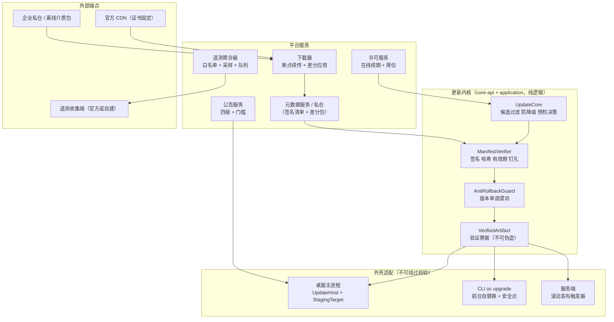
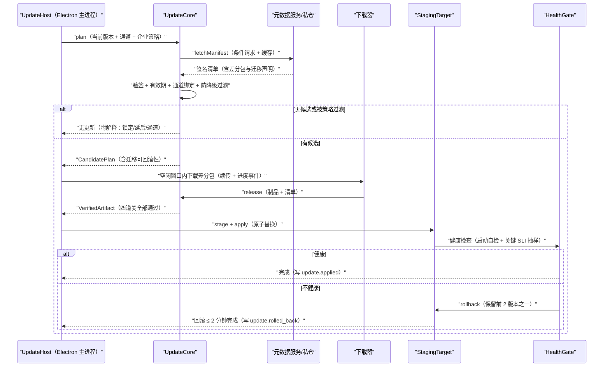
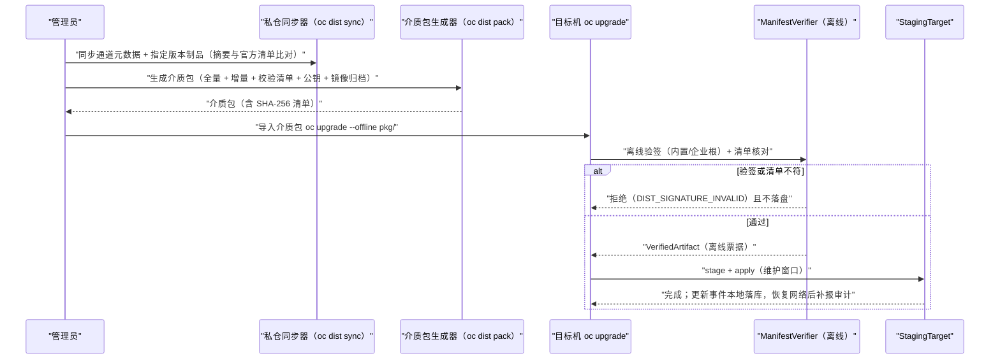
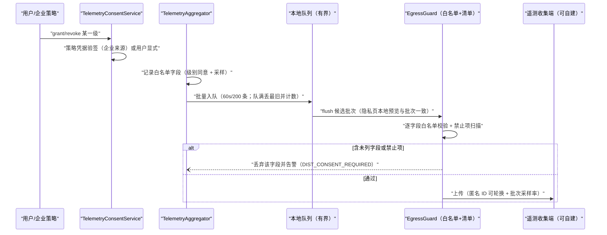
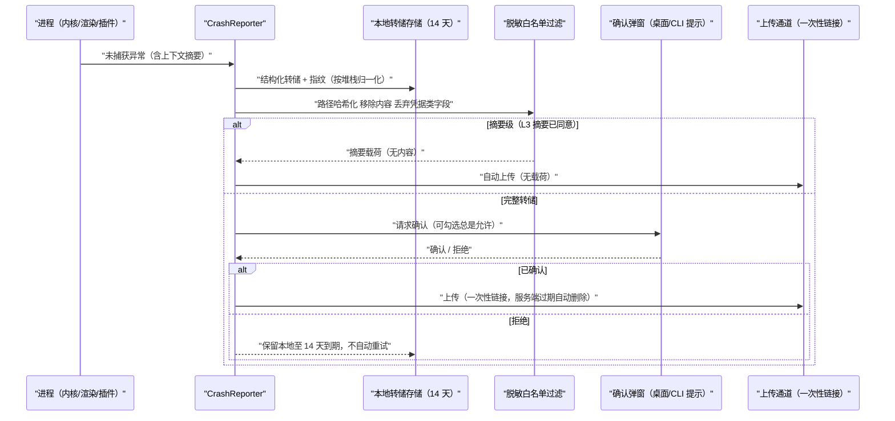
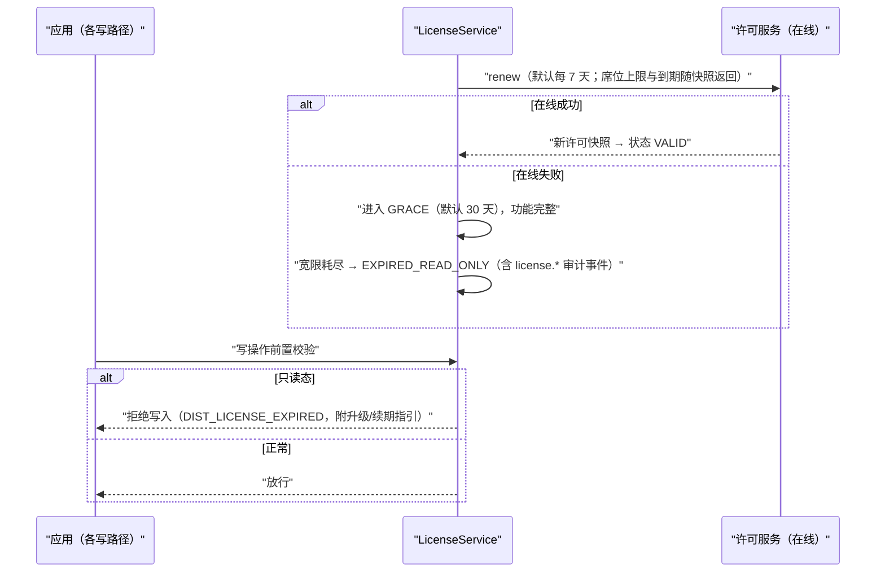
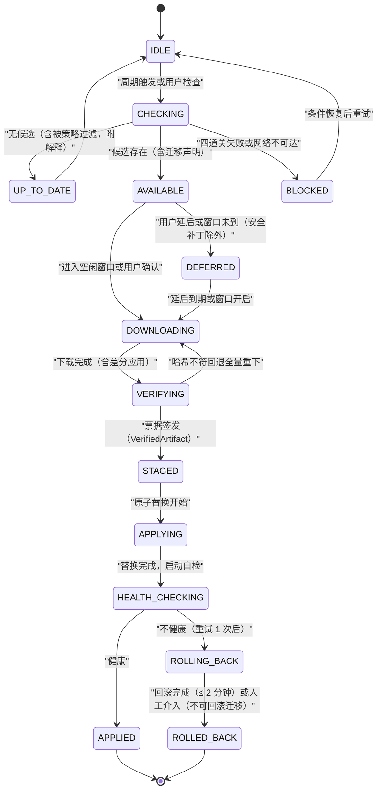
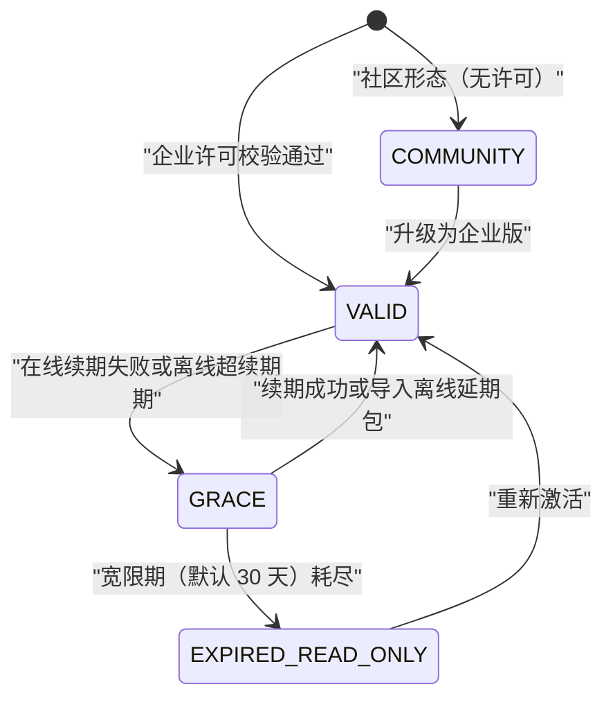

# Phase B 实现方案 28 · 分发、更新与遥测（Distribution / Update / Telemetry）

> **上游契约**：Phase A 卷 28《更新、分发与遥测》§2–§8（D-DIST-1…12）；关联卷 19（迁移与恢复）、卷 24（部署灰度、企业许可）、卷 22/23（CLI 与桌面外壳）、卷 30（签名、钉扎、脱敏）；NFR：默认最小上报、可证明回滚。
> **定位**：Phase A 回答「升级怎么安全、遥测怎么合规、许可怎么算数」；本文件回答**「更新器在三形态里各自怎么落地、四道校验在哪一层单点实现、同意与 egress 如何机器可验证、宽限与只读如何不锁死用户」**。
> **竞品证据**：`research/competitors/01-claude-code-purpose-built.md`（E1：`autoUpdater.ts` 双通道与切通道防降级）、`04-deepseek-harness.md`（E1：`strictDepBuilds` 默认拒绝安装脚本、electron-builder + NSIS 签名分发、CI 机械门禁）、`08-gemini-cli.md`（E1/E2：遥测默认关 + 显式同意 + `sanitize.ts` 脱敏与限流）、`03-codex.md`（E1：安全不变式以单点谓词实现的手法）、`05-minimax-cli.md`（E1：`DO_NOT_TRACK` 类开关与凭据遮蔽配套的隐私默认）。
> **不修改 Phase A**：本文件所有选定分支均落在 D-DIST-1…12 选定分支内；新增实现级决策登记为 `I-DIST-1…7`，供 `impl/IMPL-DECISIONS.md` 汇总。

---

## 1. 实现目标与范围

### 1.1 本组件解决什么

1. **一套更新内核、三种外壳落地**：候选选择 / 防降级 / 清单校验 / 预检决策是**纯逻辑单点实现**；Electron 桌面、CLI、服务端（滚动发布）只提供「替换原语 + 空闲窗口判定 + 健康检查钩子」，外壳无法绕过任何一道校验（§4.2）。
2. **交付安全四道关**：签名元数据 + 制品哈希 + 防降级（anti-rollback）+ 通道绑定与证书固定；任一道失败即拒绝应用并留审计（D-DIST-3）。
3. **可证明的回滚**：保留前 2 个版本、一键回滚 ≤ 2 分钟、健康检查失败**自动回滚**、涉及数据迁移按卷 19 可回滚性判定（D-DIST-4）。
4. **离线与私仓**：介质包（全量 + 增量）生成与导入、私仓元数据同步、离线激活与离线许可宽限；沙箱镜像预置清单 + 私仓优先 + 预热（D-DIST-5/D-DIST-11）。
5. **遥测三级同意与可验证最小化**：默认全关、逐级独立开关、企业可强制（带策略证明）或全禁；端上聚合 + 字段白名单（机器可校验的 egress 清单）+ 本地预览与一键清除（D-DIST-6、L-074）。
6. **崩溃诊断、许可席位与公告门槛**：摘要自动 / 转储需确认、诊断包企业可禁、离线宽限 30 天 + 过期只读不锁死、公告四级 + 强制门槛 + 一键迁移（D-DIST-7/8/9/12）。

### 1.2 本组件不解决什么

| 不解决 | 归属 |
| --- | --- |
| 服务端部署拓扑与滚动发布编排本身 | 卷 24 D-ENT-8（本组件只输出「兼容性与迁移清单」并触发部署系统） |
| 崩溃后的会话恢复与数据一致性；通知通道本体（邮件/IM/Webhook 适配） | 卷 19；卷 15/24（本组件只做崩溃采集边界与聚合路由决策） |
| 沙箱镜像构建与内容 | 卷 07（本组件负责镜像的分发、签名校验与缓存治理） |

### 1.3 上下游依赖

| 方向 | 依赖方 | 契约 |
| --- | --- | --- |
| 上游 | 卷 30 安全运行时 | 公钥钉扎表（内置根）、签名验证库、脱敏器（`MaskingConverter`）与 egress 清单校验 |
| 上游 | 卷 19 持久化 | 迁移可回滚性判定（`MigrationRollbackVerdict`）；回滚前的数据快照 |
| 上游 | 卷 24 企业运营 | 租户策略（强制通道/维护窗口/强制升级门槛）、席位口径、审计事件接收 |
| 下游 | 卷 15/33 交互 | 更新公告、迁移引导、遥测预览页、崩溃上传确认框 |
| 下游 | 卷 22/23 | CLI 命令族与桌面 IPC 通道（只消费本组件事件，不自行判定） |

### 1.4 归属分带与模块落位

**落地登记（R07：模块 / 顺序 / 批次；清单见 `reviews/R07-scope-build-platform.md`）**：
- **模块坐标**：`harness-contract`（包 `contract/dist`）+ `harness-kernel/kernel-dist`（**扩展模块**，待登记）+ `harness-platform/platform-dist`（**扩展模块**，待登记）+ `harness-platform/platform-persistence`（表与配置绑定）+ `harness-host/{host-protocol,host-cli,host-bootstrap}` + `client/*`（桌面 IPC 适配）。
- **实施顺序（卷 27 §4.5）**：分两段——① **打包/签名/本地更新最小集**必须随第 **8**（CLI 发行）/第 **15**（桌面发行）步可用，否则端无法交付安装包；② 完整段（通道策略/差分/遥测聚合/许可/崩溃上报/公告）随第 **20** 步「发布流水线」。按原 20 步单点落位会出现「桌面端先交付、签名与更新通道后建」的倒置（R07 §3 C3）。
- **数据迁移批次**：`oc_dist_*` / `oc_tele_*` 表族未在卷 27 §4.4 明列 → 建议新批次 **B8 安全运行时与分发遥测**（与 `27` 同批）；未映射项已登记 R07 §2。
- **表所有权**：`oc_sec_egress_manifest` 拥有者 `27`（本文件 egress 清单只做端点维度引用）；`oc_telemetry_queue_dropped_total` 等端侧埋点与 `30` 共享命名空间，指标口径权威在 `30` §8.4。
- **I- 决策落点**：`I-DIST-1…7`（7 条）模块落点为上表；类级落点见 §⑤（`UpdateCore`/`VerifierTicket`/`TelemetryAggregator`），逐条绑定登记为 R07 建议 S4。

| 组件 | 带 | 候选模块 | 装配方式 |
| --- | --- | --- | --- |
| 值对象 / SPI / `UpdateCore`（候选选择、防降级、预检决策） | 内核域带 | `harness-contract`（`.../contract/dist/`）+ `harness-kernel/kernel-dist`（纯逻辑，无 IO） | 零 Spring（R1：不依赖 Spring/JDBC/Redis/HTTP 与 `harness-platform`）；外壳不可绕过的校验票据由本层签发 |
| 下载器、差分应用、签名校验、遥测聚合、许可校验、私仓客户端 | 平台域带 | `harness-platform/platform-dist`（`dist` / `telemetry` / `license` 子包） | Spring；`@ConditionalOnMissingBean`，由 `harness-host/host-bootstrap` 按形态装配（R2：不依赖 `harness-host`） |
| 表、Flyway、属性绑定（`DistributionProperties` 等） | 平台域带 | `harness-platform/platform-persistence`（`properties` 包） | `@ConfigurationPropertiesScan` 激活，纯数据类不加 `@Component` |
| REST / CLI / 桌面 IPC 适配 | 交互域带 | `harness-host/host-protocol` / `harness-host/host-cli`（对齐 `22-cli-tui-impl`）与 `client/*`（对齐 `23-desktop-electron-vue-impl`） | 外壳只实现 `UpdateHost` 与 `StagingTarget` |

> **依赖方向（R1–R5，27-technical-path §4.2）**：`harness-contract ← harness-kernel ← harness-platform ← harness-host ← client`；模块名以 §4.1 目录布局为准，不使用 v1 `open-coding-*` 工程名（R4），无反向依赖与循环（R2/R5）。

### 1.5 三个必答问题（结论先行）

**Q1：三种形态如何共享一套校验而不各自实现？**
`UpdateCore` 在应用层单点实现「候选过滤 → 清单验签 → 防降级 → 预检决策」，产物是**验证票据** `VerifiedArtifact`（含制品摘要与四道关结论）。外壳（桌面主进程 / CLI / 部署系统）只能消费票据执行「原子替换」，不得接受未带票据的制品（类型强制：`StagingTarget.stage(VerifiedArtifact)`）；外壳自研下载校验的 PR 视为缺陷。
**Q2：通道切换、防降级、企业主版本锁定冲突如何裁决？**
固定优先级（L-079 风险项落地）：**安全补丁强制 ≥ 防降级（版本单调不减）> 企业锁定（只缩小候选集，不构成降级授权）> 通道偏好**。锁定先过滤候选、防降级再做终检；唯一例外是「紧急回退」（修复新版本引入的回归），需 `--allow-downgrade` + 双人审批 + 审计，且目标版本 ≥ `minSupportedVersion`。

**Q3：遥测「默认关」与企业「可强制」如何共存而不产生静默开启？**
同意状态机 `UNKNOWN → GRANTED / DENIED`，企业强制产生 `FORCED_BY_POLICY`——必须携带**签名策略凭据**并在隐私页显式展示「由组织策略启用」（含来源与申诉入口）；出站载荷经**字段白名单 + egress 清单**双校验，未列字段在类型层面无法进入批次；debug/CI 构建强制关闭（`BuildProfile.PRIVACY_STRICT`）。

---

## 2. 功能需求清单（REQ-DIST-n）

| 编号 | 需求描述 | 来源 | 优先级 | 验收要点 |
| --- | --- | --- | --- | --- |
| REQ-DIST-1 | 三通道 `stable / beta / nightly` + 每构件语义化版本 + 兼容矩阵；企业可锁定主版本只收补丁 | 卷 28 §3 D-DIST-1 | P0 | 通道切换/锁定矩阵用例全过；跨大版本需中间版本门槛生效 |
| REQ-DIST-2 | 内置更新器三形态（桌面/CLI/服务端）共用 `UpdateCore`；检查 → 下载 → 预检 → 应用 → 健康检查 → 回滚全链可用 | 卷 28 §4.2 D-DIST-2 | P0 | 故障注入验证自动回滚；外壳无自定义校验分支 |
| REQ-DIST-3 | 四道关：签名元数据 + 制品哈希 + 防降级 + 通道绑定与证书固定；企业可要求「仅私仓签名」 | 卷 28 §3 D-DIST-3 | P0 | 篡改用例全部被拒；`oc_update_*` 指标可查 |
| REQ-DIST-4 | 增量优先：差分包体积 ≤ 30% 全量；差分不可用/失败回退全量；断点续传 | 卷 28 §7 NFR | P0 | 差分包生成回归；回退路径用例；续传中断恢复 |
| REQ-DIST-5 | 保留前 2 版本 + 一键回滚 ≤ 2 分钟 + 健康检查失败自动回滚 + 数据可回滚性判定 | 卷 28 §3 D-DIST-4 | P0 | 回滚演练计时达标；迁移不可回滚时**禁止**自动回滚并升级提示 |
| REQ-DIST-6 | 更新时机：空闲窗口（无运行中任务）+ 可延后（默认 7 天，安全补丁除外）+ 企业维护窗口 | 卷 28 §4.2 | P0 | 运行中任务不被中断；延后上限与安全补丁强制用例 |
| REQ-DIST-7 | 离线分发：介质包（全量 + 增量）+ 私仓元数据同步 + 离线激活 | 卷 28 §3 D-DIST-5 | P0 | 无外网环境完成安装与升级；介质包校验清单验证 |
| REQ-DIST-8 | 沙箱镜像：预置清单 + 私仓优先 + 签名校验 + 本地缓存与清理 + 离线介质携带 | 卷 28 §3 D-DIST-11 | P1 | 内网无公网可用；`oc_image_cache_bytes` 治理生效 |
| REQ-DIST-9 | 遥测三级独立开关（L1 使用统计 / L2 性能采样 / L3 崩溃错误），默认全关；企业可强制或全禁 | 卷 28 §4.4 D-DIST-6 | P0 | 三级开关组合矩阵；企业强制携带策略凭据并 UI 显式标注 |
| REQ-DIST-10 | 遥测字段白名单：只允许固定枚举/布尔/计数/时长；egress 清单机器可校验；debug/CI 构建自动关闭 | 竞品增量：L-074（06 §8-10 [E1/E2] + 03 §8#12 [E1]） | P0 | 禁止项扫描 0 命中；egress 清单校验脚本进 CI |
| REQ-DIST-11 | 本地预览与一键清除：最近 N 条待上报可查看、可删除；匿名 ID 可轮换 | 卷 28 §4.4 | P1 | 预览与实际载荷逐字节一致；清除后无残留 |
| REQ-DIST-12 | 崩溃上报：摘要自动（无载荷）+ 完整转储需用户确认（可「总是允许」）+ 本地保留默认 14 天 | 卷 28 §3 D-DIST-7 | P0 | 上传前脱敏白名单过滤；转储过期自动清理 |
| REQ-DIST-13 | 诊断包：本地导出默认 + 可选上传（脱敏预览 + 一次性链接 + 过期删除）+ 企业可指定内部端点或禁用 | 卷 28 §3 D-DIST-8 | P1 | 上传链接过期删除可证；企业禁用后上传入口不可达 |
| REQ-DIST-14 | 许可：在线校验（7 天续期）+ 离线签名许可文件 + 宽限 30 天 + 过期只读（可读可导出，不锁死） | 卷 28 §4.6 D-DIST-9 | P0 | 每项用例；过期只读时写操作被拒且提示升级路径 |
| REQ-DIST-15 | 席位：按 30 天活跃口径；超限拒绝新激活、**不中断**既有会话；席位与用量可对账 | 卷 28 §4.6 | P1 | 超限用例；对账报告导出 |
| REQ-DIST-16 | 公告四级（信息/重要/强制/迁移引导）+ 强制门槛（低于 `minVersion` 拒绝连接服务端）+ 一键迁移可回滚 | 卷 28 §4.8 D-DIST-12 | P0 | 强制门槛用例；`oc upgrade --migrate` 失败可回滚 |
| REQ-DIST-17 | 切通道防降级：任何通道切换后候选版本 ≥ 当前版本（除显式紧急回退豁免）；与锁定冲突按 §1.5 Q2 裁决 | 竞品增量：L-079（01-claude-code §8#14 [E1] `autoUpdater.ts`） | P0 | 切 stable/beta/nightly 全部用例；豁免路径审计完整 |
| REQ-DIST-18 | 发布治理：Windows NSIS + EV 代码签名、制品签名（Ed25519）、构建前依赖安装脚本默认拒绝逐个 review、发布门禁机械校验 | 竞品增量：04-deepseek §2 条目 [E1]（NSIS/strictDepBuilds/门禁） | P1 | 签名缺失构建失败；未 review 的安装脚本阻断；门禁清单可查 |
| REQ-DIST-19 | 端上聚合：批量（默认 60s / 200 条）+ L2 采样率默认 10% + 队列有界（私有化可指定自建收集端） | 卷 28 §4.4 + 竞品增量 08-gemini §22 [E1/E2] | P1 | 队列超限丢弃最旧并告警；自建端点替换成功 |
| REQ-DIST-20 | 三形态联动：桌面（主进程 staging + 退出重启）、CLI（前台自替换 + 安全点）、服务端（滚动 + 健康检查） | 卷 28 §4.2 | P0 | 三形态各一组端到端用例；事件与状态一致 |
| REQ-DIST-21 | 通知聚合（D-DIST-10 复用）：`(事件类型, 对象)` 聚合、去重窗口 5 分钟、优先级路由、静默时段、失败重试与死信 | 卷 28 §4.7 | P2 | 去重与死信用例；静默时段 P0 穿透可配 |
| REQ-DIST-22 | 遥测默认关与「默认最小」在社区形态不可被企业策略外的任何来源开启；`DO_NOT_TRACK` 类环境变量优先 | 竞品增量：08-gemini §22 [E2] + 05-minimax 检索项 [E1] | P1 | 环境变量置位后全部等级强制关；来源审计记录 |

> 说明：REQ-DIST-10、17、18、22 为竞品研究带来的增量需求（§3 模板要求），实现落在 §3.3、§4.2、§3.2/§3.4/§6.1 与 §5.2。

---

## 3. 技术方案选型（M×N 比选）

### 3.1 I-DIST-1：更新器承载形态

| 分支 | 描述 | F | U | S | M | 加权 | 结论 |
| --- | --- | --- | --- | --- | --- | --- | --- |
| B1 平台原生 auto-updater | 直接用 Squirrel/electron-updater；少代码 | 6 | 8 | 7 | 5 | 65.5 | 淘汰：无法实现私仓/防降级/票据制 |
| B2 自研 `UpdateCore` + 外壳适配（`UpdateHost`/`StagingTarget`） | 校验单点、三形态共享 | 9 | 8 | 8 | 9 | 85.5 | **选定** |
| B3 纯包管理器（winget/brew/apt） | 企业友好；桌面体验与控制力弱 | 5 | 6 | 8 | 7 | 63.5 | 作为补充通道保留（不自研清单校验） |

**选定 B2 的代价**：自研替换原语（Windows 文件占用、macOS 代码签名重签校验、Linux 包管理共存）的跨平台成本；通过「原语最小化 + 每平台 1 名维护者 + 平台矩阵用例」控制。**回退触发**：某平台自研替换连续两版本出现文件锁问题 → 该平台退化为「引导用户下载安装包」（B1 语义，仍保留四道校验）。

### 3.2 I-DIST-2：差分与包形态

| 分支 | 描述 | F | U | S | M | 加权 | 结论 |
| --- | --- | --- | --- | --- | --- | --- | --- |
| B1 仅全量 | 简单；带宽与升级时长高 | 6 | 6 | 9 | 6 | 68 | 基线（差分不可用时的回退） |
| B2 块级差分（vcdiff 类）+ 全量回退 | 体积 ≤ 30% 全量；实现中等 | 9 | 8 | 8 | 8 | 83 | **选定** |
| B3 内容寻址 CAS 增量 | 最优复用；改造成本与磁盘占用高 | 8 | 7 | 6 | 8 | 73 | 备选（服务端形态可局部采用） |

**选定 B2 的代价**：需为「最近 2 个保留版本 × 当前平台」维护差分链，跨的大版本时需要中间版本链（`minVersion` 门槛由此产生）；差分链缺失时回退全量并提示。**回退触发**：差分应用后制品哈希不符 ⇒ 自动放弃差分、重下全量（安全优先，不重试差分）。

### 3.3 I-DIST-3：元数据签名模型

| 分支 | 描述 | F | U | S | M | 加权 | 结论 |
| --- | --- | --- | --- | --- | --- | --- | --- |
| B1 仅 TLS | 简单；无法抵御源侧/镜像投毒 | 4 | 8 | 9 | 5 | 61.5 | 淘汰 |
| B2 单角色签名 + 有效期 + 防重放 + 钉扎（TUF-lite） | 覆盖主威胁；实现可控 | 9 | 8 | 8 | 8 | 83 | **选定** |
| B3 完整 TUF（多角色/快照/时间戳） | 最强；密钥运营复杂 | 9 | 6 | 5 | 9 | 74.5 | 备选（企业升级路径，接口不变） |

**选定 B2 的代价**：单角色密钥泄露影响面大 ⇒ 用**离线签名服务（HSM，私钥不可导出）+ 元数据有效期（默认 7 天，过期即拒绝应用）+ 客户端钉扎旧公钥轮换窗口**缓解；B3 升级时客户端接口不变。**回退触发**：签名服务不可用 ⇒ 停发新元数据（允许已缓存且未过期元数据继续服务），禁止临时降级到无签名。

### 3.4 I-DIST-4：遥测传输形态

| 分支 | 描述 | F | U | S | M | 加权 | 结论 |
| --- | --- | --- | --- | --- | --- | --- | --- |
| B1 逐事件实时上报 | 时效好；请求量放大、隐私面大 | 7 | 7 | 6 | 6 | 65.5 | 淘汰（除安全级崩溃摘要可即时） |
| B2 端上聚合 + 批量 + 采样 | 请求量小；本地可见可删 | 9 | 8 | 8 | 8 | 83 | **选定** |
| B3 仅本地不上报 | 零风险；产品改进失效 | 4 | 6 | 9 | 5 | 60.5 | 淘汰（保留为「全禁」企业形态） |

**选定 B2 的代价**：端上聚合状态需持久化（崩溃丢批次可接受，但需落盘队列）；采样率改变使长周期对比需按采样率归一。**回退触发**：聚合器连续崩溃 ⇒ 降级为「逐条直写本地队列，恢复后补聚合」。

### 3.5 I-DIST-5：崩溃转储采集

| 分支 | 描述 | F | U | S | M | 加权 | 结论 |
| --- | --- | --- | --- | --- | --- | --- | --- |
| B1 JVM 结构化摘要 + Electron renderer 钩子（无原生 minidump） | 覆盖主进程/渲染/内核三类崩溃；体积小、脱敏可控 | 8 | 8 | 9 | 8 | 82.5 | **选定** |
| B2 原生 minidump 全覆盖 | 定位最强；体积与隐私面大 | 9 | 6 | 6 | 7 | 71.5 | 可选扩展（`CrashSinkSPI`，企业开启前须 DLP 评审） |
| B3 仅日志 grep | 最轻；定位能力差 | 4 | 7 | 9 | 5 | 61.5 | 淘汰 |

**选定 B1 的代价**：无法定位原生层（PTY/原生模块）崩溃 ⇒ 用「原生层崩溃由守护进程记录退出码 + 模块版本 + 最后事件」近似归因；B2 作为企业可选扩展。**回退触发**：同一指纹两周无法定位且影响面蔓延 ⇒ 评审后为受影响平台启用 minidump。

### 3.6 I-DIST-6：许可校验形态

| 分支 | 描述 | F | U | S | M | 加权 | 结论 |
| --- | --- | --- | --- | --- | --- | --- | --- |
| B1 纯在线 | 最强控制；离线不可用、服务故障即锁死 | 6 | 5 | 7 | 7 | 62.5 | 淘汰（违背离线宽限） |
| B2 离线签名许可文件 + 可选在线续期（7 天）+ 宽限 30 天 | 离线可用且可控 | 9 | 8 | 8 | 8 | 83 | **选定** |
| B3 纯离线无校验 | 简单；无法对账与席位治理 | 5 | 8 | 8 | 5 | 63.5 | 淘汰（仅社区形态无许可） |

**选定 B2 的代价**：许可文件可被复制 ⇒ 设备绑定为**可选**（企业可开），默认按「活跃席位 + 用量对账」治理；宽限期内功能完整、超期只读（可读可导出），绝不静默锁死。**回退触发**：许可服务长期不可用（> 宽限期）⇒ 企业可申请「离线延期包」（签名文件，人工审批）。

### 3.7 I-DIST-7：私仓同步与介质包

| 分支 | 描述 | F | U | S | M | 加权 | 结论 |
| --- | --- | --- | --- | --- | --- | --- | --- |
| B1 全量镜像官方仓库 | 简单；存储与同步成本高 | 6 | 7 | 7 | 6 | 64.5 | 淘汰 |
| B2 按通道 + 版本集合拉取 + 介质包生成器 + 校验清单 | 按需最小同步；涉密可交付 | 9 | 8 | 8 | 9 | 85 | **选定** |
| B3 按需代理（客户端直连透传） | 简单；离线不可用、缓存治理弱 | 6 | 7 | 7 | 6 | 64.5 | 备选（临时过渡形态） |

**选定 B2 的代价**：私仓需自建同步任务与介质包流水线（提供 CLI：`oc dist sync` / `oc dist pack`）；离线介质包必须携带「校验清单 + 公钥 + 镜像归档」。**回退触发**：私仓元数据与官方摘要不一致 ⇒ 冻结该版本入仓并人工复核（05-minimax 源码 pin + 摘要校验的同款纪律 [E1]）。

### 3.8 与竞品对照的取舍（research 证据）

| 对照维度 | 竞品证据 | 我们的取舍 | 主动放弃的收益 |
| --- | --- | --- | --- |
| 更新通道与防降级 | Claude Code `autoUpdater.ts` 双通道 + 切通道防降级（`competitors/01` §8#14，L-079）[E1] | 采纳并升级为「票据制四道关 + 单点谓词」（I-DIST-1/3；REQ-DIST-3/17） | 放弃平台原生 updater 的低成本，代价是跨平台替换原语自研 |
| 发布与依赖安全 | DeepSeek `strictDepBuilds` 默认拒绝安装脚本 + NSIS 签名 + CI 机械门禁（`competitors/04` §2）[E1] | 同向采纳（REQ-DIST-18）：未 review 安装脚本阻断、EV 签名缺失构建失败 | 放弃「一键装依赖」的开发便利 |
| 遥测默认值 | Gemini 默认关 + 显式同意 + `sanitize.ts` 脱敏限流（`competitors/08` §22）[E2]；MiniMax `DO_NOT_TRACK` 类开关（`competitors/05`）[E1]；反面：Codex 默认 Statsig OTLP、Qoder `usageStatisticsEnabled=true`（`CROSS-COMPARISON.md` D10） | 采纳「显式同意 + 默认最小 + 三级独立」（I-DIST-4；REQ-DIST-9/22） | 放弃默认开启带来的产品洞察效率（改用企业强制通道补回） |
| 许可与席位 | 9 家中仅 Qoder 有组织计费语义（Org Resource Package，schema 未公开）[E2]；其余均未观测 | 自建「离线许可 + 宽限 + 只读降级 + 席位对账」，**不静默锁死** | 放弃强在线校验的控制力，换取离线可用与企业信任 |
| 诊断包与崩溃面 | MiniMax 交付投影「计数 + 不透明归档名 + NOT RUN 声明」[E1] | 采纳为诊断包双闸门（本地导出 + 上传各一次脱敏预览） | 诊断包直接可读性下降 |

---

## 4. 总体架构图

### 4.1 三形态更新链路



### 4.2 交付安全四道关与冲突裁决（REQ-DIST-3/17）

| 关 | 校验内容 | 实现层 | 失败动作 |
| --- | --- | --- | --- |
| 1 签名 | 元数据签名 + 证书固定 + 钉扎公钥；企业「仅私仓签名」时验私仓根 | `ManifestVerifier`（core） | 拒绝候选版本 + `update.blocked` |
| 2 哈希 | 制品/差分包逐段哈希与清单比对（下载完成后 + 应用前二次校验） | `ManifestVerifier` + 下载器 | 丢弃制品；差分失败回退全量 |
| 3 防降级 | 候选 `version ≥ 当前版本` 谓词（单一实现点，任何路径不得旁路） | `AntiRollbackGuard`（core） | 拒绝并提示等待同版或更高 |
| 4 通道绑定 | 元数据 `channel` 与请求通道一致；企业锁定的候选集过滤 | `UpdateCore` | 拒绝应用 + 记录策略来源 |

**裁决优先级（固定，禁止按场景改写）**：安全补丁强制 > 防降级 > 企业主版本锁定 > 通道偏好。紧急回退豁免（`--allow-downgrade`）只允许目标版本 ≥ `minSupportedVersion`，且必须双人审批 + `update.rolled_back(reason=REGRESSION)` 审计。
**豁免票据必须签名（R04 安全轮新增）**：`DowngradeTicket` 必须由审批服务**签名**签发（Ed25519 / 企业信任根），字段含 `currentVersion → candidateVersion` 绑定、`minSupportedVersion` 下限、到期时间与**一次性 nonce**（服务端记录已消费）；客户端**离线验签**（与元数据验签共用信任根管理，即卷 27 §4.2 边界 B10 的钉扎公钥）；无签名 / 验签失败 / 版本对不匹配 / nonce 复用 / 过期一律视为**无票据**——`--allow-downgrade` CLI 参数本身**不构成豁免**（禁止「本地开关即降级」，防本机伪造）。

**仲裁矩阵（反降级 × 企业钉扎逐例裁决，单测矩阵的权威口径）**：

| # | 当前版本 | 候选版本 | 通道/锁定条件 | 裁决 | 依据 |
| --- | --- | --- | --- | --- | --- |
| A1 | 2.3.5 | 2.3.6（安全补丁，标记 `security=true`） | 企业锁定 `2.3.x`；候选在锁定集内 | **放行**（无视 defer 与维护窗口）。安全补丁优先级最高 | 优先级 1 > 2 |
| A2 | 2.3.5 | 2.4.0（普通） | 企业锁定 `2.3.x`（仅补丁） | **拒绝**：候选被锁过滤；提示「等待同版或更高补丁」 | 优先级 3 只缩小候选集 |
| A3 | 2.3.5 | 2.3.4（切 nightly 后元数据回指旧版） | 无锁定 | **拒绝**（防降级终检拦截）；审计 `update.blocked(reason=ANTI_DOWNGRADE)` | 优先级 2 是不可变谓词 |
| A4 | 2.4.2 | 2.4.0 | 企业紧急回退（`--allow-downgrade` + 双人审批 + 回归工单） | **放行**（一次性票据，含到期时间；目标 ≥ `minSupportedVersion`） | 唯一豁免路径（Q2 例外） |
| A5 | 2.3.5 | 2.3.5（同版重装/修复） | 任意 | **放行**（相等允许重装修复） | 谓词 `candidate ≥ current` 含相等 |
| A6 | 2.4.0 | 3.0.0 | 跨大版本，无中间版本链 | **拒绝**：要求先经 2.9.x 中间门槛（`minVersion` 链约束） | 兼容矩阵（REQ-DIST-1） |
| A7 | 2.3.5（企业私仓） | 2.3.6（官方源） | 企业「仅私仓签名」 | **拒绝**：验签根不符（关 4 通道绑定 + 私仓根） | 四道关逐关独立，缺一即拒 |

矩阵用例（≥ 7 例）进 `UpdateCoreTest` 单测清单，任一裁决回归即阻断流水线；上表同时是运维排障的「为什么没升上去」解释表（由 `oc update explain` 输出同一口径）。

**防降级单点谓词（借鉴 03-codex「安全不变式写成可测谓词」[E1]）**：

```java
/**
 * 防降级判定。
 * 版本单调不减是交付安全不变式：通道切换、企业锁定或人工参数都不得旁路，
 * 唯一例外是登记在案的紧急回退豁免（由审批服务**签名**签发，客户端离线验签，见 downgradeTicket）。
 */
public boolean isUpgradeAllowed(Version current, Version candidate, DowngradeTicket ticket) {
    // 优先检查紧急回退票据（仅回归修复豁免）：签名 + current→candidate 绑定 + 到期 + 一次性 nonce 缺一不可；
    // 验签失败或 nonce 复用一律视为无票据（CLI 开关本身不放行）
    if (ticket != null && ticket.isValidFor(current, candidate)) {
        return true;
    }
    // 恒等或升级才放行（相等允许重装修复，禁止更低版本）
    return candidate.compareTo(current) >= 0;
}
```

### 4.3 遥测同意与 egress 清单矩阵（REQ-DIST-9/10/22）

| 同意状态 | 来源 | L1 | L2 | L3 摘要 | L3 完整转储 | 可被覆盖 |
| --- | --- | --- | --- | --- | --- | --- |
| `UNKNOWN`（默认） | 初始 | 关 | 关 | 关 | 关 | 用户可逐级开启 |
| `GRANTED` | 用户显式 | 按开关 | 按开关 | 按开关 | 需单独确认 | 用户可回退 |
| `DENIED` | 用户显式 | 关 | 关 | 关 | 关 | 企业强制除外 |
| `FORCED_BY_POLICY` | 企业签名策略 | 可开（默认开） | **恒关或显式开** | 可开 | 仍需确认 | 用户不可关；UI 展示策略来源与申诉入口 |
| `PRIVACY_STRICT`（debug/CI 构建） | 编译期常量 | 关 | 关 | 关 | 关 | **不可覆盖** |

**egress 清单**：每个上报端点对应一份机器可校验的字段清单（与 `oc_sec_egress_manifest` 同源治理）；批次构造时逐字段校验，未列字段**在类型层面无法进入** `TelemetryBatch`（`TelemetryField` 枚举白名单构造器）。禁止项（代码内容、提示词正文、文件路径原文、密钥、用户标识明文）扫描为 0 命中方可发布（卷 28 §4.4）。

**转储与诊断包的秘密扫描（R04 安全轮新增，封堵「遥测/崩溃通道夹带秘密」）**：崩溃转储与诊断包属 A1 资产，**上传前**必须过与遥测批次同一套 egress 白名单 + 禁止项扫描，并**额外**扫描 ① 哨兵值形态（`__OC_CRED_<leaseId>__`，复用卷 27 §6.3 哨兵机制）与 ② 已知密钥指纹（本机密钥服务登记的摘要集合）；命中即**阻断上传**、本地留存并告警（`telemetry.egress.blocked` + 复核工单），**禁止「先上传后复核」**；转储正文以 DEK 加密封存（§8.1 删除模型），对象存储清单/索引只含摘要与哈希，不含原文；诊断包的导出与上传两个节点都经脱敏预览（双闸门，§⑩.4）。

---

## 5. 类图与 Java 21 签名

```mermaid
classDiagram
    class UpdateCore {
        +plan(CandidateQuery query) CandidatePlan
        +release(ArtifactRef artifact, ManifestEnvelope manifest) VerifiedArtifact
    }
    class ManifestVerifier {
        <<interface>>
        +verify(ManifestEnvelope envelope, TrustedRoots roots) VerifiedManifest
    }
    class AntiRollbackGuard {
        +isUpgradeAllowed(Version current, Version candidate, DowngradeTicket ticket) boolean
    }
    class UpdateSourcePort {
        <<interface>>
        +fetchManifest(Channel channel, Version current) ManifestEnvelope
        +listArtifacts(Version version, Platform platform) List~ArtifactRef~
    }
    class UpdateHost {
        <<interface>>
        +isIdleWindow() boolean
        +deferUntil(Instant deadline) void
    }
    class StagingTarget {
        <<interface>>
        +stage(VerifiedArtifact artifact) StagedRelease
        +apply(StagedRelease release) ApplyOutcome
        +rollback(Version target) RollbackOutcome
    }
    class HealthGate {
        <<interface>>
        +check(Version candidate) HealthReport
    }
    class TelemetryConsentService {
        +state(Actor actor) ConsentSnapshot
        +grant(Actor actor, TelemetryLevel level) ConsentSnapshot
        +revoke(Actor actor, TelemetryLevel level) ConsentSnapshot
    }
    class TelemetryAggregator {
        +record(TelemetryField field, long value) void
        +flush() TelemetryBatch
    }
    class CrashReporter {
        +capture(Throwable error, CrashContext ctx) CrashFingerprint
        +uploadSummary(CrashFingerprint fp) void
        +uploadDump(CrashFingerprint fp, UploadConsent consent) void
    }
    class LicenseService {
        +evaluate() LicenseSnapshot
        +renew() LicenseSnapshot
    }
    class SeatTracker {
        +activeSeats() SeatState
        +activate(UserRef user) ActivationResult
    }
    class AnnouncementService {
        +active(Channel channel, Version current) List~Announcement~
        +acknowledge(String announcementId, Actor actor) void
    }
    class UpdateChannel {
        <<enumeration>>
        STABLE
        BETA
        NIGHTLY
    }
    class ConsentState {
        <<enumeration>>
        UNKNOWN
        GRANTED
        DENIED
        FORCED_BY_POLICY
    }
    class LicenseState {
        <<enumeration>>
        VALID
        GRACE
        EXPIRED_READ_ONLY
        COMMUNITY
    }
    class DistRuntimeException {
        <<exception>>
    }
    UpdateCore --> ManifestVerifier
    UpdateCore --> AntiRollbackGuard
    UpdateCore --> UpdateSourcePort
    StagingTarget <|.. DesktopStagingTarget
    StagingTarget <|.. CliStagingTarget
    UpdateHost <|.. DesktopUpdateHost
    HealthGate --> StagingTarget
    TelemetryAggregator --> TelemetryConsentService
    CrashReporter --> TelemetryConsentService
    LicenseService --> SeatTracker
    DistRuntimeException --|> HarnessException
```



### 5.1 更新核心（纯逻辑，票据制）

```java
/**
 * 更新核心。
 * 候选选择、防降级、预检决策的单点实现；外壳只消费 `VerifiedArtifact` 票据，
 * 不得自行接受未验证制品（类型层面强制：StagingTarget 只接受票据）。
 */
public interface UpdateCore {

    /**
     * 计算候选更新计划。
     *
     * @param query 候选查询（必填；含当前版本、通道、企业策略、平台）
     * @return 候选计划（含被过滤候选项与原因，供 UI 解释「为什么不升」）
     * @throws DistRuntimeException 元数据不可达且无缓存（DIST_MANIFEST_EXPIRED）；策略冲突（DIST_POLICY_CONFLICT）
     */
    CandidatePlan plan(CandidateQuery query);

    /**
     * 对已下载制品完成四道关并签发验证票据。
     *
     * @param artifact 制品引用（必填；含摘要与大小）
     * @param manifest 签名清单信封（必填；含通道、有效期、兼容区间）
     * @return 验证票据（不可伪造，含四道关结论与证据摘要）
     * @throws DistRuntimeException 验签失败（DIST_SIGNATURE_INVALID）、哈希不符（DIST_DIGEST_MISMATCH）、
     *         元数据过期（DIST_MANIFEST_EXPIRED）、防降级拒绝（DIST_DOWNGRADE_BLOCKED）
     */
    VerifiedArtifact release(ArtifactRef artifact, ManifestEnvelope manifest);
}
```

```java
/**
 * 目标通道枚举（三通道模型，D-DIST-1）。
 * 企业锁定只作用于候选集过滤，不改变通道语义；未知通道显式失败，禁止回退 stable。
 */
@Getter
@RequiredArgsConstructor
public enum UpdateChannel {

    /** 稳定通道：默认通道，仅收正式发布与安全补丁 */
    STABLE("stable", "稳定"),
    /** 尝鲜通道：预发布验证，含回归风险提示 */
    BETA("beta", "尝鲜"),
    /** 每夜构建：仅供开发者，默认高风险提示 */
    NIGHTLY("nightly", "每夜");

    private final String code;
    private final String desc;

    /**
     * 按编码解析通道。
     *
     * @param code 通道编码（必填，取值见枚举项）
     * @return 匹配的枚举项
     * @throws DistRuntimeException 编码未知（DIST_CONTRACT_VIOLATION，禁止默认回退）
     */
    public static UpdateChannel of(String code) {
        for (UpdateChannel channel : values()) {
            if (channel.code.equals(code)) {
                return channel;
            }
        }
        throw new DistRuntimeException(DistErrorCode.DIST_CONTRACT_VIOLATION, "未知更新通道：" + code);
    }
}
```

### 5.2 遥测同意与白名单（L-074 落地）

```java
/**
 * 遥测同意服务。
 * 三级独立同意；企业强制必须携带签名策略凭据（FORCED_BY_POLICY），
 * `PRIVACY_STRICT`（debug/CI）不可被任何来源覆盖——该判定在编译期常量上短路。
 */
@Slf4j
@Service
@RequiredArgsConstructor
public class TelemetryConsentService {

    private final ConsentStorePort consentStore;
    private final PolicyProofVerifier policyProofVerifier;
    private final BuildProfile buildProfile;

    /**
     * 授予某一级同意。
     *
     * @param actor 操作主体（必填；用户或企业策略签发者）
     * @param level 遥测级别（必填；L1/L2/L3）
     * @return 更新后的同意快照
     * @throws DistRuntimeException 企业策略凭据验签失败（DIST_SIGNATURE_INVALID）
     */
    public ConsentSnapshot grant(Actor actor, TelemetryLevel level) {

        // 1. 严格构建模式短路：debug/CI 构建禁止开启任何遥测（编译期常量，不可被策略覆盖）
        if (buildProfile.isPrivacyStrict()) {
            log.info("隐私严格构建，拒绝开启遥测，level={}", level.getDesc());
            return ConsentSnapshot.privacyStrict();
        }

        // 2. 企业策略来源必须验签（防第三方冒充组织策略静默开启）
        if (actor.isEnterprisePolicy()) {
            policyProofVerifier.requireValid(actor.policyProof());
        }

        // 3. 逐级独立记录并审计（同意变更进审计链，不允许批量静默变更）
        ConsentSnapshot snapshot = consentStore.grant(actor, level);
        log.info("遥测同意已更新，level={}, state={}, sourceKind={}", level.getDesc(), snapshot.state(level), actor.kind().getDesc());
        return snapshot;
    }
}
```

```java
/**
 * 遥测聚合器。
 * 端上聚合 + 批量 + 采样；批次构造只接受 `TelemetryField` 白名单枚举，
 * 未列字段在类型层面不可进入（L-074 的类型自证手法）。
 */
@Service
@RequiredArgsConstructor
public class TelemetryAggregator {

    private final ConsentSnapshotProvider consentProvider;
    private final TelemetryQueue queue;
    private final TelemetryProperties properties;
    private final Sampler sampler;

    /**
     * 记录一个白名单字段的取值。
     *
     * @param field 白名单字段（必填；枚举，未列字段无法构造）
     * @param value 计数值 / 时长毫秒（非负）
     * @throws DistRuntimeException 级别未获同意仍尝试写入（DIST_CONSENT_REQUIRED，属编码缺陷）
     */
    public void record(TelemetryField field, long value) {

        // 1. 同意校验：级别未开启直接丢弃（不缓存不落盘，避免「先存后问」的隐私越界）
        if (!consentProvider.isEnabled(field.level())) {
            return;
        }

        // 2. L2 采样（默认 10%）：批次携带采样率供服务端归一；L1/L3 不采样
        if (field.level() == TelemetryLevel.L2 && !sampler.hit(properties.l2SampleRate())) {
            return;
        }

        // 3. 入有界队列：队满丢最旧并计数（丢弃计数本身作为 L1 上报，形成自观测）
        queue.offer(new TelemetrySample(field, value, clock.instant()));
    }
}
```

### 5.3 许可与席位（离线宽限）

```java
/**
 * 许可服务。
 * 离线签名许可文件 + 可选在线续期；宽限 30 天；过期只读（可读可导出），禁止锁死。
 */
public interface LicenseService {

    /**
     * 计算当前许可状态快照（本地判定优先，在线续期为增强）。
     *
     * @return 许可快照（含状态、到期时间、宽限剩余、席位上限与已用）
     * @throws DistRuntimeException 许可文件签名非法（DIST_SIGNATURE_INVALID）；社区形态返回 COMMUNITY，不抛异常
     */
    LicenseSnapshot evaluate();

    /**
     * 在线续期（默认每 7 天一次；失败进入宽限而非立即失效）。
     *
     * @return 续期后的快照；失败时返回上一快照并携带 `renewFailed=true`
     * @throws DistRuntimeException 许可已过期且宽限耗尽（DIST_LICENSE_EXPIRED，同时进入只读态）
     */
    LicenseSnapshot renew();
}
```

**席位口径（`SeatTracker`）**：活跃 = 30 天内有会话活动的用户（企业可配）；**超限拒绝新激活但绝不中断既有会话**，拒绝时返回「释放不活跃席位」的操作建议；席位一律哈希存储，不落明文标识。

### 5.4 错误码枚举（统一异常体系内）

```java
/**
 * 分发与遥测错误码。
 * code 为稳定契约（只增不改），由全局异常处理器映射为附录 B 错误响应；
 * 对应文案为中文且可指导恢复动作。
 */
@Getter
@RequiredArgsConstructor
public enum DistErrorCode {

    /** 元数据签名非法 */
    DIST_SIGNATURE_INVALID("DIST_SIGNATURE_INVALID", "更新元数据签名校验失败，已拒绝应用"),
    /** 元数据过期 */
    DIST_MANIFEST_EXPIRED("DIST_MANIFEST_EXPIRED", "更新元数据已过期，请稍后重试"),
    /** 制品摘要不符 */
    DIST_DIGEST_MISMATCH("DIST_DIGEST_MISMATCH", "制品哈希不符，已丢弃并回退全量下载"),
    /** 防降级拒绝 */
    DIST_DOWNGRADE_BLOCKED("DIST_DOWNGRADE_BLOCKED", "目标版本低于当前版本，已拒绝；如需紧急回退请走审批豁免"),
    /** 策略冲突（锁定与候选不可满足） */
    DIST_POLICY_CONFLICT("DIST_POLICY_CONFLICT", "企业策略与候选版本冲突，请检查锁定与通道设置"),
    /** 许可过期且宽限耗尽（进入只读） */
    DIST_LICENSE_EXPIRED("DIST_LICENSE_EXPIRED", "许可已过期，当前为只读模式；可继续读取与导出数据"),
    /** 同意缺失（编码缺陷，不应在运行期出现） */
    DIST_CONSENT_REQUIRED("DIST_CONSENT_REQUIRED", "未获得对应级别遥测同意，已丢弃数据"),
    /** 契约违例（未知枚举值等） */
    DIST_CONTRACT_VIOLATION("DIST_CONTRACT_VIOLATION", "分发契约违例");

    private final String code;
    private final String desc;
}
```

---

## 6. 核心流程时序图

### 6.1 桌面形态：检查 → 应用 → 健康检查 → 自动回滚



- **前置条件与主路径**：候选存在且四道关通过；检查 → 下载 → 应用 → 健康检查，全程事件驱动（UI 只消费事件）。
- **异常与补偿**：下载中断 ⇒ 断点续传；应用失败 ⇒ 恢复旧版本（原子性）；迁移不可回滚 ⇒ **禁止**自动回滚，升级为「人工介入 + 快照恢复指引」（卷 19 判定）。
- **幂等与并发点**：`RedisKeys.dist.updateLock(installId)` 单实例锁；同一 `version+platform` 的密钥/票据缓存；健康检查失败重试 1 次后才判定不健康。

### 6.2 离线/私仓升级（无外网）



- **前置条件与主路径**：私仓已同步目标版本；介质包携带完整校验材料；离线通道仍执行全部四道关（不因离线降级）。
- **异常与补偿**：介质包校验失败 ⇒ 拒绝导入并给出缺失清单；私仓元数据与官方不一致 ⇒ 入仓前即冻结（§3.7 回退触发）。
- **幂等与并发点**：介质包以 `(channel, version, platform, digest)` 幂等；重复导入为 no-op。

### 6.3 遥测同意、聚合与出站（egress 校验）



- **前置条件与主路径**：对应级别已获同意；批次经白名单与禁止项校验后上传。
- **异常与补偿**：收集端不可达 ⇒ 队列有界重试（退避 + 上限），超限丢弃最旧并仅保留计数；本地预览与批次逐字节一致，预览中清除 ⇒ 本地队列即时清空且不再补报。
- **幂等与并发点**：批次 ID 幂等（服务端去重）；同意变更立即生效——变更后未上传批次重新过同意校验。
### 6.4 崩溃上报（摘要自动 / 转储需确认）



- **前置条件与主路径**：崩溃被捕获且本地存储可写；摘要自动、转储需确认。
- **异常与补偿**：转储写盘失败 ⇒ 降级为「最小摘要（退出码 + 模块版本 + 最后事件）」；上传失败 ⇒ 本地保留至到期，不无限重试。
- **幂等与并发点**：崩溃指纹去重（同指纹短期内合并计数）；并发多进程崩溃分别采集，聚合展示。

### 6.5 许可宽限与过期只读



- **前置条件与主路径**：在线续期失败进入宽限；宽限耗尽转只读（可读、可导出）。
- **异常与补偿**：许可文件损坏 ⇒ 保持上一有效快照并告警（不立即只读）；席位超限 ⇒ 拒绝新激活并给「释放不活跃席位」建议。
- **幂等与并发点**：续期幂等（同一许可号并发续期只取最新）；快照缓存 + 事件驱动失效。

---

## 7. 状态机

### 7.1 更新状态机（三形态共用，外壳只映射为 UI 状态）



不变式：(a) 进入 `APPLYING` 前必有 `VerifiedArtifact`；(b) `ROLLING_BACK` 前必须完成健康检查两次判定；(c) 迁移不可回滚时禁止进入自动 `ROLLING_BACK`，转人工（卷 19 判定为硬前置）。

### 7.2 许可状态机



不变式：`EXPIRED_READ_ONLY` 下写操作全拒、读与导出放行；`GRACE` 期间功能完整（不降级功能，只倒计时与提醒）；状态迁移全部产 `license.state.changed` 审计事件。

---

## 8. 数据模型

### 8.1 表（`oc_dist_*` / `oc_tele_*`，全部含 `tenant_id` 与审计字段）

| 表 | 关键列 | 索引/约束 |
| --- | --- | --- |
| `oc_dist_install_state` | `instance_id, current_version, channel, retained_versions(jsonb, ≤2), locked_major, pinned_hashes(jsonb)` | 唯一 `(tenant_id, instance_id)` |
| `oc_dist_update_event` | `event_id, kind(CHECK/DOWNLOAD/APPLY/ROLLBACK/BLOCK), from_version, to_version, reason, artifact_digest` | 按 `created_at` 月分区；`update.rolled_back` 必带 `reason` |
| `oc_dist_announcement_ack` | `announcement_id, level(INFO/IMPORTANT/MANDATORY/MIGRATION), required_min_version, acked_by, acked_at` | 唯一 `(tenant_id, announcement_id, acked_by)` |
| `oc_dist_license` | `license_no, state, expires_at, grace_until, seat_limit, bound_device(可选), proof_digest` | 唯一 `license_no`；**无密钥明文列**；席位绑定见 `oc_dist_seat_binding(user_ref 哈希, active_until 滚动 30 天)` 同域管理 |
| `oc_dist_crash_fingerprint` | `fingerprint, module(KERNEL/RENDERER/PLUGIN), count, first_seen, last_seen, dump_ref` | 唯一 `(tenant_id, fingerprint)`；本地保留 14 天策略在端上执行 |
| `oc_dist_consent_audit` | `actor_kind(USER/ENTERPRISE_POLICY), level, state, policy_proof_digest, changed_at` | 追加写（不更新、不删除） |
| `oc_dist_egress_manifest` | `endpoint, manifest_version, allowlist(jsonb), machine_verified, sha256` | 唯一 `(tenant_id, endpoint, manifest_version)` |

**遥测数据删除模型（与全栈一致，依赖 `impl/10` §③）**：遥测域**不引入第二套删除语义**——① **服务端遥测**为匿名聚合口径（无用户可回指字段，字段白名单在类型层强制），保留 **30 天原始 / 聚合后 1 年**（卷 31 §10 默认），"删除请求"落为「匿名 ID 轮换 + 批次去关联」，不适用 crypto-shredding（无密钥可销毁，亦无明文可删）；② **崩溃转储与诊断包**可能含真实载荷 → 走**加密封存 + DEK 销毁**（密钥经 `27-security-runtime-impl` 密钥服务派生，与 `impl/25` §7.1 同一模型）+ 到期删除 + 备份 tombstone 重放；③ 删除动作产出**删除证明**（格式与演练由卷 19 统一定义），端上「一键清除」与服务端处置均须可证（REQ-DIST-11/13）。

### 8.2 Redis Key（统一 Key 工厂，禁止业务侧拼接）

| Key 工厂方法 | 用途 | TTL |
| --- | --- | --- |
| `RedisKeys.dist.updateLock(instanceId)` / `RedisKeys.dist.checkJitter(instanceId)` | 单实例更新互斥锁 / 检查抖动种子（防雪崩） | 租约 300s + 看门狗 / 24h |
| `RedisKeys.dist.manifestCache(channel)` | 元数据条件请求缓存（ETag） | 与元数据有效期一致 |
| `RedisKeys.dist.licenseCache(tenantId)` / `RedisKeys.dist.consentCache(actorRef)` | 许可与同意快照缓存 | 1h（事件失效优先）/ 会话级 |
| `RedisKeys.dist.announcementSeen(tenantId)` | 公告已读水位 | 90 天 |

### 8.3 对象存储前缀与事件清单

对象存储前缀：`dist/artifacts/{channel}/{version}/{platform}/`（签名制品）、`dist/deltas/{from}->{to}/`（差分包）、`media/offline/{version}/`（离线介质包与校验清单）、`crash/dumps/{fingerprint}/`（转储，过期删除）、`diagnostics/{ticket}/`（诊断包，一次性链接）。

事件（卷 28 §6 全集）：`update.check.completed` / `update.available`、`update.download.started` / `completed` / `failed`、`update.applied` / `update.rolled_back`、`update.blocked`、`telemetry.consent.changed`、`telemetry.exported` / `crash.captured` / `crash.uploaded`、`license.state.changed` / `license.grace.started` / `license.expired`、`notification.aggregated` / `delivered` / `failed`、`image.pulled` / `verified` / `purged`。
实现级补充（登记于 I-DIST 汇总）：`update.channel.changed`、`dist.manifest.expired`、`telemetry.egress.blocked`、`crash.retention.purged`、`license.seat.limit.reached`、`announcement.acknowledged`、`dist.offline.package.imported`。

---

## 9. 接口与扩展点

### 9.1 CLI 面（三形态共享命令语义，对齐卷 22）

| 命令 | 语义 | 关键参数与错误码 |
| --- | --- | --- |
| `oc upgrade --check` | 检查更新（输出候选与解释） | `--channel`；无候选返回 0 |
| `oc upgrade --apply` | 空闲窗口内应用 | `--defer <duration>`；`DIST_POLICY_CONFLICT` |
| `oc upgrade --rollback` | 一键回滚（保留前 2 版本） | `--to <version>`；不可回滚迁移时拒绝 |
| `oc upgrade --channel <c>` | 切换通道（防降级生效） | `DIST_DOWNGRADE_BLOCKED` |
| `oc upgrade --offline <pkg>` | 介质包导入升级 | `DIST_SIGNATURE_INVALID` |
| `oc upgrade --migrate` | 一键数据迁移（公告内嵌入口） | 失败自动回滚；需 `--confirm` |
| `oc telemetry status/preview/purge` | 同意状态 / 本地预览 / 一键清除 | `--level`；`DIST_CONSENT_REQUIRED` |
| `oc license status/activate` / `oc diagnostics export/upload` | 许可状态与续期 / 诊断包导出与上传 | `DIST_LICENSE_EXPIRED`；企业禁用时诊断上传入口不可达 |

### 9.2 REST 面（服务端形态与企业管理面）

| 方法 | 路径 | 入参 → 出参 |
| --- | --- | --- |
| GET | `/api/v1/distribution/updates` | `channel, currentVersion` → CandidatePlan（含解释字段） |
| POST | `/api/v1/distribution/updates/apply` | version → 202 + 事件流后续状态 |
| POST | `/api/v1/distribution/updates/rollback` | `to, reason` → RollbackOutcome |
| GET/PUT | `/api/v1/telemetry/consent` 与 `/api/v1/telemetry/egress-manifest` | 级别开关矩阵（企业强制需策略凭据）；字段清单（机器可校验，含版本与哈希） |
| GET/POST | `/api/v1/license` 与 `/api/v1/license/renew` | 空 → LicenseSnapshot（席位与宽限剩余）；续期失败返回宽限状态 |
| GET | `/api/v1/distribution/announcements` | `channel, version` → 公告清单（含门槛与迁移入口） |

### 9.3 桌面 IPC（Electron 主进程 ↔ 渲染进程）

`update:check` / `update:apply` / `update:defer` / `update:rollback`（命令）；`update:state`（事件流：状态机全量投影，渲染层禁止自行拼装状态）；`update:announcement.ack`。渲染进程**无下载权限**，所有网络与替换动作在主进程执行（对齐 `23-desktop-electron-vue-impl.md`）。

### 9.4 SPI 扩展点（对齐卷 28 §5 与卷 18 目录）

| SPI | 语义 | 装配条件 |
| --- | --- | --- |
| `UpdateSourceSPI` | 更新来源（官方/私仓/介质包） | 按 `open-coding.dist.source` 选择 |
| `UpdateChannelPolicySPI` | 通道与升级策略（企业） | 存在实现时叠加（只加严） |
| `TelemetrySinkSPI` / `CrashSinkSPI` | 遥测与崩溃接收端（企业自建） | 企业替换官方端点 |
| `LicenseProviderSPI` | 许可来源（在线/离线/自研） | 默认内置离线解析器 |
| `ImageRegistrySPI` | 沙箱镜像仓库 | 私仓优先 |
| `AnnouncementSourceSPI` / `NotificationChannelSPI` | 公告来源与通知通道（与卷 15/24 共用） | 官方通道或企业公告板 |

### 9.5 配置项（`open-coding.*` + 环境变量）

| 配置 | 默认 | 必填 | 影响 |
| --- | --- | --- | --- |
| `open-coding.dist.check-interval-hours` | 6 | 否 | 检查周期（带抖动） |
| `open-coding.dist.defer-max-days` | 7 | 否 | 延后上限（安全补丁不受限） |
| `open-coding.dist.keep-versions` | 2 | 否 | 保留版本数（回滚能力） |
| `open-coding.telemetry.l1/l2/l3.enabled` | false | 否 | 三级开关（企业可强制） |
| `open-coding.telemetry.retention-local-days` | 14 | 否 | 崩溃/遥测本地保留 |
| `open-coding.license.grace-days` | 30 | 否 | 离线宽限 |
| `open-coding.license.seat-activity-days` | 30 | 否 | 席位活跃口径（企业可配） |
| `OC_DIST_METADATA_URL` / `OC_DIST_PRIVATE_REPO` | 空 | 条件必填 | 私仓模式必填；私仓关闭时用官方 |
| `OC_DIST_UPDATE_PUBKEY` | 内置根 | 条件必填 | 企业私仓签名根（仅环境变量注入） |

**Fail-Fast**：`open-coding.dist.source=private` 而 `OC_DIST_PRIVATE_REPO` 为空 ⇒ 启动失败并明确报错；`telemetry` 企业强制策略无签名凭据 ⇒ 拒绝进入 `FORCED_BY_POLICY` 并告警（不静默开启）。

### 9.6 错误矩阵（场景 → 错误码 → 对外文案 → 处置）

| 场景 | 错误码 | 对外文案（中文） | 客户端建议动作 | 服务端/端上动作 |
| --- | --- | --- | --- | --- |
| 元数据签名校验失败 | `DIST_SIGNATURE_INVALID` | 更新包校验失败，已拒绝 | 联系管理员核对私仓 | 拒绝候选 + `update.blocked` + 告警 |
| 防降级拦截 | `DIST_DOWNGRADE_BLOCKED` | 候选版本低于当前版本，已拒绝 | 等待同版或更高版本 | 审计（含当前/候选版本） |
| 企业锁定过滤 | `DIST_VERSION_PINNED` | 该版本不在企业允许范围内 | 查看组织更新策略 | 提示锁定来源（策略引用） |
| 元数据过期 | `DIST_METADATA_EXPIRED` | 更新元数据已过期，请稍后重试或使用离线介质 | 重试 / 离线包 | 拒绝应用（**不得**降级为无签名） |
| 差分应用哈希不符 | `DIST_DELTA_MISMATCH` | 增量包校验失败，已切换全量 | 无需操作（自动） | 放弃差分 + 重下全量（不重试差分） |
| 磁盘空间/文件占用 | `DIST_STAGING_FAILED` | 更新准备失败（空间不足或文件被占用） | 释放空间后重试 | 保留当前版本 + 提示；不回滚未应用状态 |
| 健康检查失败 | `DIST_HEALTHCHECK_FAILED` | 新版本健康检查失败，已自动回滚 | 无需操作 | 自动回滚（≤ 2 分钟）；迁移不可回滚时转人工 |
| 许可过期 | `LICENSE_EXPIRED_READONLY` | 许可已过期，当前为只读模式 | 续期 / 导入离线许可 | 拒写保读（可导出）；绝不锁死 |
| 席位超限 | `LICENSE_SEAT_EXCEEDED` | 活跃席位已达上限，无法激活新成员 | 管理员释放席位 | 拒绝新激活；**不中断**既有会话 |
| 遥测未同意即上报 | —（构造期拒绝） | — | — | 白名单构造器抛异常（类型层不可达）+ 计数告警 |

**异常命名约定**（对齐 `impl/README.md` §5.5）：更新内核与遥测聚合（`harness-contract` / `harness-kernel` 层）抛 `HarnessException(ErrorCode, 中文文案)`；桌面主进程与 CLI 外壳（Spring/宿主层）抛 `BusinessException(ErrorCode, 中文文案)`；`DistRuntimeException` 为域内专用子类（按所在层带继承上述二者之一，只承载 `DistErrorCode`，非平行体系）；全局处理器按 `ErrorCode` 映射；**禁止**裸 `RuntimeException`。

---

## 10. 非功能与工程细节

### 10.1 并发模型与容量

- 单实例更新互斥（Redis 锁 + 本地文件锁双保险）；检查任务带 0–10 分钟随机抖动，防大规模同时打点（雪崩）；下载并发：单制品 4 分片并行 + 断点续传，差分应用在独立虚拟线程执行，应用阶段单写者。
- 遥测聚合器每租户单线程消费队列（60s / 200 条批量）；队列有界（默认 10,000 条），超限丢最旧并计数。
- 私仓同步按「通道 × 版本集合」批处理，默认并发 2 个下载 worker，避免压垮企业带宽。

**容量估算（10 万装机 · 3 通道 · 保留 2 版本口径）**：

| 对象 | 估算 | 结论 |
| --- | --- | --- |
| 元数据与清单 | 每版本 ≈ 6 平台 × 2 形态 × (全量 + 差分清单) ≈ 40 个条目，单条 ≤ 4KB → 单版本 ≈ 160KB，保留 2 版本 + 通道 3 → ≤ 1MB | 检查请求（缓存命中 ≤ 1s）零压力；元数据可全量进 CDN/私仓 |
| 制品与差分 | 全量 ≈ 180MB/平台/形态 → 6 平台 × 2 形态 ≈ 2.2GB/版本；差分 ≤ 30% ⇒ 660MB；保留 2 版本 ≈ 5.6GB/版本线 | 私仓需要 ≥ 50GB 预留（含 nightly 双倍）；磁盘水位入看板 |
| 更新波峰 | 10 万装机 × 检查间隔 6h（±10min 抖动）→ 均值 ≈ 4.6 检查/秒，波峰 ≤ 30/秒 | 服务端形态（自建元数据端点）单实例可承载；CDN/私仓按 3 倍冗余规划 |
| 遥测批次 | 默认关（企业强制开）时 L1/L2 批量 200 条 / 60s → 每装机 ≤ 2.9 批/日（≈580 条摘要级事件/装机/日 ÷ 200 条/批；60s 是发送窗口上界，**不是**每日批次数上界）；1 万开启装机 → ≤ 2.9×10⁴ 批/日；批次均值 ≈ 2KB（200 条摘要级字段）→ 典型 ≈ 1.8GB/月（2.9×10⁴ × 2KB × 30 ≈ 1.74GB），**上界**（撞 64KB/批上限）≈ 56GB/月（2.9×10⁴ × 64KB × 30 ≈ 55.7GB） | 自建接收端单实例可承载；`oc_telemetry_queue_dropped_total` 为水位信号；批大小上限用于防重试放大，**不得**按上限做容量规划 |
| 本地缓存 | 崩溃转储保留 14 天，单转储 ≤ 50MB → 每装机 ≤ 200MB 上界；镜像缓存 `oc_image_cache_bytes` 默认 ≤ 2GB | 超限 LRU 清理 + `oc_image_cache_bytes` 告警 |

### 10.2 性能预算（可测门槛，对齐卷 28 §7）

| 指标 | 预算 | 测量点 |
| --- | --- | --- |
| 检查更新（缓存命中） | ≤ 1s | `update.check.completed` 间隔 |
| 差分包体积 | ≤ 30% 全量（目标） | 制品统计与趋势 |
| 应用更新（桌面 / 服务端滚动） | ≤ 60s / ≤ 5min | `update.applied` 间隔 |
| 回滚（一键 / 自动，含健康检查判定） | ≤ 2 分钟；健康检查桌面 ≤ 30s | `update.rolled_back` 与触发时间差 |
| 遥测上传批大小 | ≤ 64KB / 批 | 批次统计（防大包重试放大） |

### 10.3 失败与降级

| 触发 | 桌面/CLI | 服务端 |
| --- | --- | --- |
| 私仓不可用 / 元数据过期 | 回退官方源（若允许）或缓存元数据（过期即拒绝应用，不降级为无签名）；离线介质包兜底 | 停止滚动并保持当前版本 |
| 同意存储不可读 / 快照损坏 | **视为未同意（fail-closed）**：停止上报、本地队列不落盘、隐私页提示重新确认；企业 `FORCED_BY_POLICY` 需重新验签后才生效 | 同左（不信任无法验证的同意凭据） |
| 许可服务不可用 | 进入宽限（30 天），功能完整 | 与桌面一致（滚动不受影响） |
| 遥测端点不可用 | 有界重试 + 丢最旧；本地预览仍可用 | 同左 |
| 健康检查失败 | 自动回滚（迁移不可回滚时转人工） | 部署系统回滚（卷 24） |

**闸门 fail 方向（显式）**：遥测同意为 **opt-in（默认三级全关，fail-closed：无记录即不上报）**；egress 白名单与禁止项扫描失败即**丢弃该字段/批次**（fail-closed）；更新四道校验任一失败即拒绝应用（fail-closed，禁止降级为无签名）；许可为**显式 fail-open**（宽限 30 天 + 过期只读不锁死，理由：许可服务故障不得阻断用户既有工作，卷 28 §4.6）。

### 10.4 安全与隐私纪律

- 更新器自身日志：记录版本、通道、制品摘要前缀（12 位十六进制）、失败原因；**禁止**记录许可密钥、签名原文、用户标识明文（席位一律哈希）。
- 上传前一律经 `MaskingConverter` + egress 白名单；诊断包在导出与上传两个节点都要经脱敏预览（双闸门）；企业禁用诊断上传后，`/diagnostics` 上传路由与桌面菜单项**同时**不可达（配置驱动单点）。

**安全边界检查清单（发布门禁逐项勾选）**：

- [ ] 制品校验：签名 + 哈希（下载后与应用前二次）+ 防降级 + 通道绑定，四关在 `UpdateCore` 单点实现；外壳无自研校验分支（PR 门禁）
- [ ] 私钥不出 HSM（签名服务离线）；客户端仅持公钥，钉扎轮换窗口与元数据有效期（默认 7 天）生效，过期即拒绝
- [ ] 更新决策全链审计：候选来源、四关结论、豁免票据（含双人审批引用）可回放
- [ ] 遥测：白名单构造器使未列字段类型层不可达；同意状态机含 `FORCED_BY_POLICY` 签名凭据要求；debug/CI 强制 `PRIVACY_STRICT`
- [ ] 禁止项扫描（代码内容/提示词正文/路径原文/密钥/标识明文）= 0 命中；egress 清单机器可校验并进 CI
- [ ] 许可：过期只读（可读可导出）而非锁死；席位超限不中断既有会话；宽限与延期包有人工审批留痕
- [ ] 更新器日志与诊断包：许可密钥、签名原文、用户标识明文零出现；席位一律哈希
- [ ] 离线介质包携带「校验清单 + 公钥 + 镜像归档」，导入时四关照常执行（离线不等于免检）
- [ ] **降级豁免票据（R04 新增）**：`DowngradeTicket` 必须签名且含 `current→candidate` 绑定 + 到期 + 一次性 nonce；无签名 / 验签失败 / nonce 复用 / 越 `minSupportedVersion` 一律放行失败；`--allow-downgrade` 单独使用被拒（用例）
- [ ] **遥测/转储秘密扫描（R04 新增）**：崩溃转储与诊断包上传前经哨兵值 + 已知密钥指纹扫描，命中即阻断 + 告警；测试用「含哨兵值的转储」必须上传失败；对象存储清单与诊断包索引不含原文

### 10.5 可观测（指标名 + 日志 + span）

指标（卷 28 §6 全集 + 补充）：`oc_update_success_ratio{channel}`、`oc_update_rollback_total`、`oc_update_check_latency_ms`、`oc_telemetry_upload_total{level}`、`oc_crash_fingerprint_top`、`oc_license_seats_used`、`oc_notification_delivery_latency_ms{channel}`、`oc_image_cache_bytes`、`oc_update_delta_ratio`、`oc_telemetry_queue_dropped_total`、`oc_license_grace_remaining_days`。
日志与追踪：检查开始/结束（含通道与候选数）、验签失败（原因 + 摘要前缀）、应用/回滚（版本对 + 耗时）、同意变更（来源与级别）、许可状态迁移；全部中文占位符，异常传 `Throwable`。span：`dist.update.check`、`dist.update.apply`、`dist.update.rollback`、`telemetry.flush`、`license.renew`。

---

## 11. 测试与验收（DoD）

### 11.1 测试分层清单

| 层 | 内容 | 数量级 |
| --- | --- | --- |
| 单测 | 候选过滤（锁定 × 通道 × 防降级矩阵）、清单验签与有效期、差分应用、同意状态机、白名单构造器、许可宽限边界 | 矩阵用例 ≥ 80 条 |
| 契约与回放 | `update.*` / `telemetry.*` / `license.*` 事件 schema、REST DTO、IPC 帧（缺端点覆盖 CI 失败）；更新决策回放同历史 ⇒ 同候选结论 | 全端点覆盖 + 500 条重放一致 |
| 故障注入与隐私验收 | 应用中途 kill、签名篡改、防降级尝试、**伪造降级票据（无签名 / 过期 / nonce 复用 / 版本对不匹配）**、**含哨兵值的崩溃转储上传**、时钟偏移（元数据有效期）、离线宽限第 29/30/31 天、席位超限、遥测端 500；禁止项扫描（代码内容/提示词/路径原文/密钥/标识明文）= 0 命中 | 每场景 1 用例；egress 清单校验脚本进 CI |
| 端到端 | 三形态各一组：桌面 staging/回滚、CLI 自替换、服务端滚动（含健康检查失败自动回滚） | 3 组 × 2 分支 |

### 11.2 性能门禁与验收命令

```bash
mvn -pl harness-kernel/kernel-dist -am test -Dtest="UpdateCore*Test"                   # 候选/防降级矩阵
mvn -pl harness-platform/platform-dist -am test -Pdist-integration                    # 私仓/差分/遥测聚合集成
mvn -pl harness-host/host-bootstrap -am test -Pdist-e2e                              # 三形态端到端（含回滚计时断言）
mvn -pl harness-host/host-bootstrap -am verify -Dtelemetry.privacy.gate=scan          # 禁止项扫描 + egress 清单校验
```

门禁：回滚耗时 > 2 分钟、差分体积 > 30%（连续两版本）、隐私扫描非零命中、防降级任一用例失败 ⇒ 流水线阻断。

### 11.3 完成定义（对齐卷 28 §8）

- [ ] 三通道 + 兼容矩阵 + 跨大版本中间版本门槛全部落地。
- [ ] 三形态更新器全链可用；故障注入验证自动回滚；保留前 2 版本。
- [ ] 签名、哈希、防降级、证书固定四道校验生效（篡改用例被拒）。
- [ ] 离线：介质包（全量 + 增量）安装与升级可用；私仓同步可用；离线激活可用。
- [ ] 遥测三级开关、本地预览、一键清除、企业强制/全禁全部可用；禁止项扫描 0 命中；egress 清单机器校验通过。
- [ ] 崩溃上报：摘要自动 + 完整需确认；转储保留 14 天并可证清理。
- [ ] 许可：在线校验 + 离线许可 + 30 天宽限 + 席位绑定 + 过期只读（每项用例）。
- [ ] 公告四级 + 强制门槛 + 一键迁移（失败可回滚）生效；通知聚合（去重/优先级/静默/死信）全通。
- [ ] 镜像预置清单 + 私仓优先 + 签名校验 + 缓存治理可用。

---

## 12. 实现级决策汇总（I-DIST）

| ID | 主题 | 选定 | 被放弃分支的代价 | 回退触发 |
| --- | --- | --- | --- | --- |
| I-DIST-1 | 更新器承载 | 自研 `UpdateCore` + 外壳适配（票据制） | 放弃平台原生 updater：放弃低成本与生态惯例 | 某平台连续两版本文件锁问题 → 该平台退化为引导下载安装包 |
| I-DIST-2 | 差分与包形态 | 块级差分 + 全量回退 | 放弃 CAS 增量：放弃多版本复用与磁盘优化 | 差分后哈希不符 → 自动放弃差分重下全量（不重试差分） |
| I-DIST-3 | 元数据签名 | 单角色签名 + 有效期 + 防重放 + 钉扎（TUF-lite） | 放弃完整 TUF：放弃多角色密钥运营强度 | 签名服务不可用 → 停发新元数据；禁止降级为无签名 |
| I-DIST-4 | 遥测传输 | 端上聚合 + 批量 + 采样 | 放弃实时逐条：放弃时效性 | 聚合器连续崩溃 → 逐条落本地队列，恢复后补聚合 |
| I-DIST-5 | 崩溃转储 | JVM 结构化摘要 + 渲染钩子（minidump 为可选扩展） | 放弃原生 minidump 全覆盖：放弃原生层深度定位 | 同指纹两周无法定位且影响蔓延 → 评审后启用 minidump |
| I-DIST-6 | 许可形态 | 离线签名文件 + 在线续期（7 天）+ 宽限 30 天 | 放弃纯在线：放弃强控制与即时吊销 | 许可服务长期不可用 → 人工审批签发「离线延期包」 |
| I-DIST-7 | 私仓与介质包 | 按通道拉取 + 介质包生成器 + 校验清单 | 放弃全量镜像：放弃一次性完整镜像的简单性 | 私仓元数据与官方摘要不一致 → 冻结该版本入仓并复核 |

**与 Phase A 的一致性声明**：I-DIST-1…7 均落在 D-DIST-1…12 选定分支内；「票据制外壳不可绕过」「防降级优先于企业锁定」「FORCED_BY_POLICY 需签名策略凭据」均为对 D-DIST-2/D-DIST-3/D-DIST-6 的**收紧**（更保守），不需要回改 Phase A 卷册；`update.channel.changed` 等实现级事件按卷 16 只追加原则登记。
