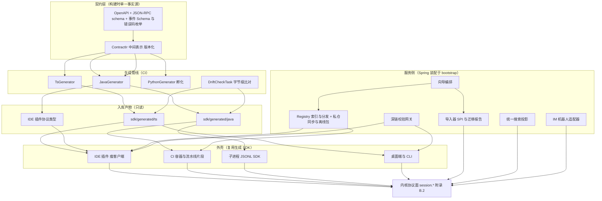
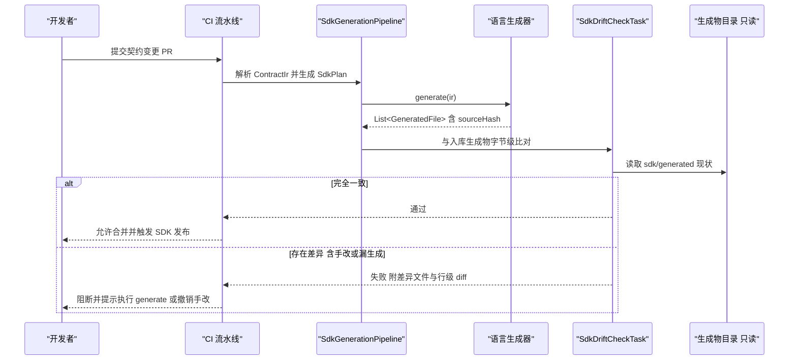
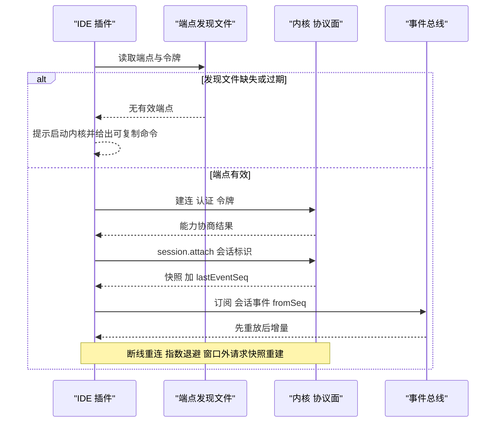
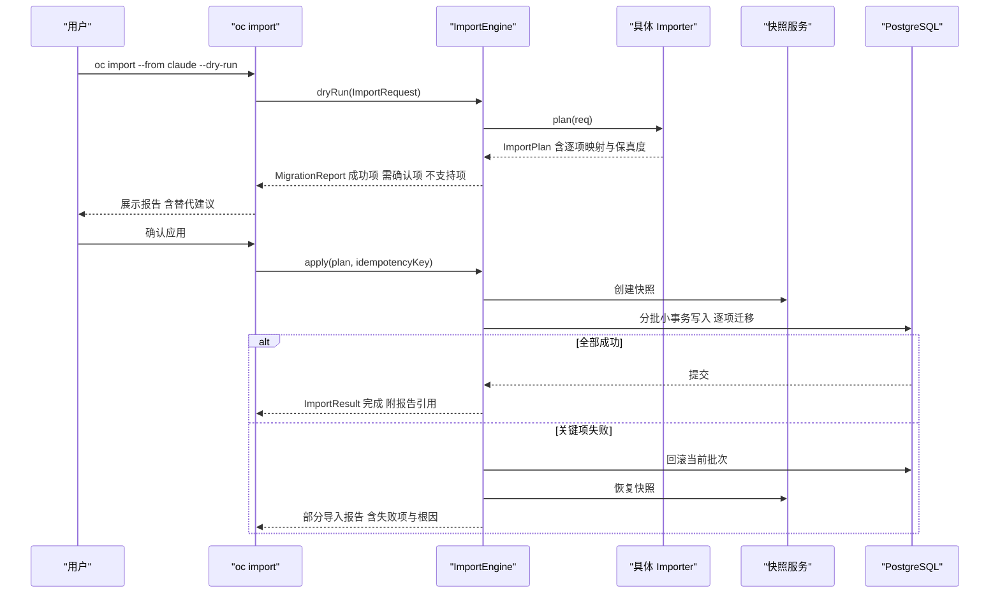
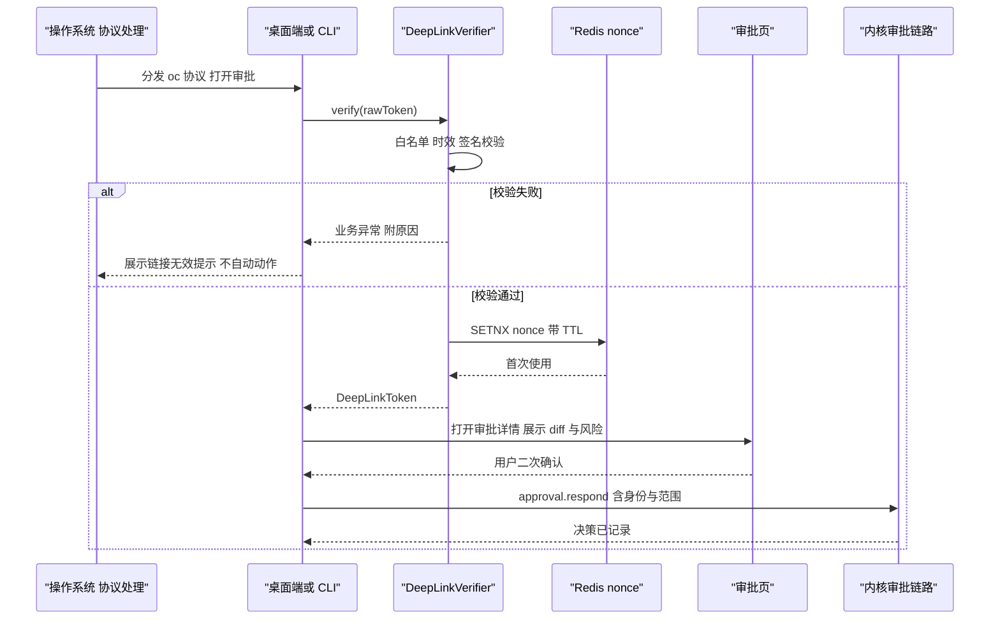
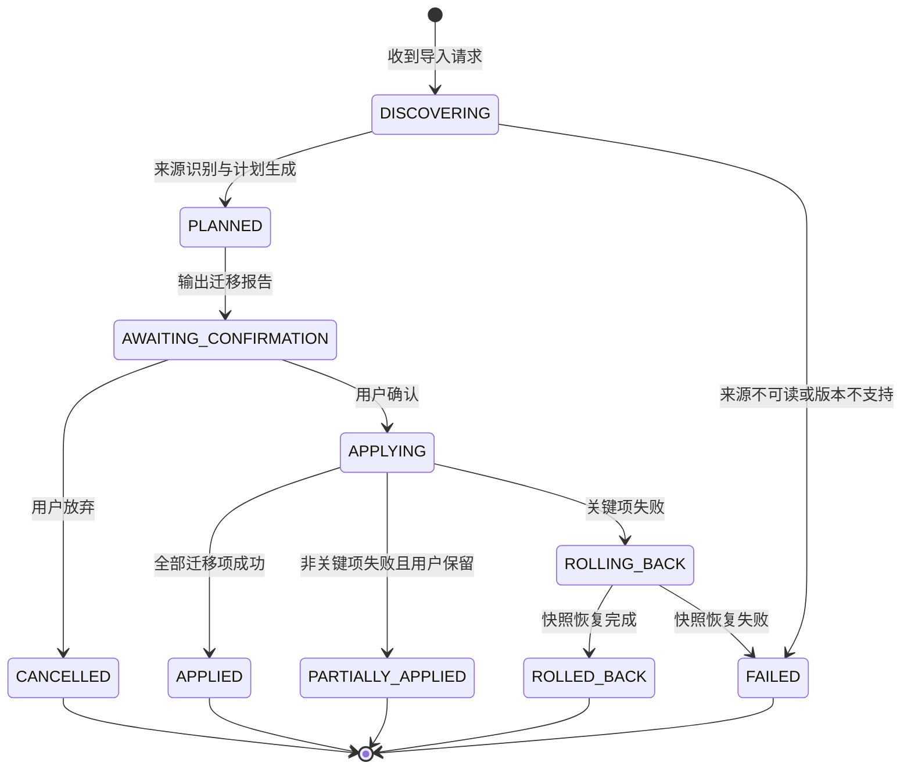
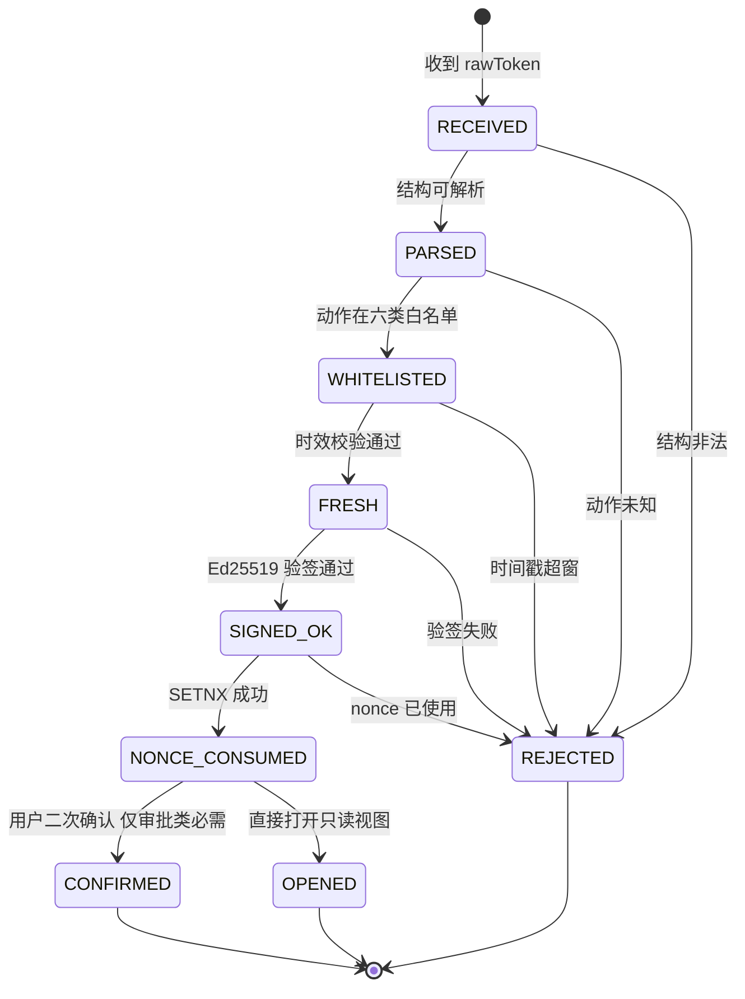

# 29 · 开发者生态与集成 — 实现技术方案（Phase B）

> 对应 Phase A 卷：`29-developer-ecosystem.md`（D-ECO-1…12）；协作卷：`22-clients-cli-desktop.md`（CLI 命令面/端形态）、`19-persistence-migration-recovery.md`（导出包）、`18-plugin-extension.md`（SPI 目录）、`23-agent2agent-interop.md`（认证）。
> 上游契约：附录 B（B.2 会话协议 / B.3 管理面 REST / B.6 插件 SPI / B.8 版本协商）；`docs/design/` 为冻结语义来源。
> 本文只回答「怎么接、怎么生成、怎么迁移、怎么发布」——不重新定义协议语义，不修改任何 Phase A 卷册。

---

## ① 实现目标与范围

### 1.1 本组件解决什么

| 实体 | 归属 | 交付形态 | 对应 Phase A |
| --- | --- | --- | --- |
| 协议契约 IR 与 SDK 生成管线 | 构建时（CI），不进入运行时 | `contract/`（IR 定义）+ 生成器插件 + 入库生成物 + 漂移校验任务 | D-ECO-1 / D-ECO-2 |
| IDE 插件（瘦客户端） | 外壳 | VS Code 扩展 + JetBrains 插件，经协议面连内核 | D-ECO-3 |
| CI 三件套 | 外壳 | 容器镜像 + 三家流水线片段 + headless CLI 输出契约 | D-ECO-4 |
| Registry / 导入器 / 统一搜索 / 深链 / IM | 服务侧 | `harness-platform/platform-eco`（+ `harness-kernel/kernel-eco` 纯逻辑；Spring 装配于 `harness-host/host-bootstrap`；v1 名称 `open-coding-integrations` 已废弃） | D-ECO-7/6/10/11/12 |
| 向导与 Shell 集成 | 外壳 | `oc init` 七步向导 + 四类 Shell 补全脚本 | D-ECO-8 / D-ECO-5 |

### 1.2 本组件不解决什么

- **协议本体**（消息、会话、审批语义）在卷 01 §4.5 与附录 B.2 已冻结，本文件只消费。
- **插件装载与信任边界**（签名、隔离、依赖求解）归卷 18（`18-plugin-runtime-impl.md`）；Registry 只负责「索引 + 分发 + 治理信号」，不做装载。
- **市场内容治理**（评审、举报、下架策略）归卷 08/18；本文件实现治理动作的执行面与通知。
- **分发与更新**（更新器、通道、遥测同意）归卷 28（`28-distribution-telemetry-impl.md`）。

### 1.3 上下游依赖与接缝

| 方向 | 依赖对象 | 接缝形态 | 实现归属 |
| --- | --- | --- | --- |
| 上游 | 内核协议面（01）、事件总线（16） | JSON-RPC / 事件订阅；IDE 经 `session.attach` | `harness-host/host-protocol` |
| 上游 | CLI 命令面与 `CliResult`/`ExitCode`（22-impl §⑦） | `oc run --json`、`oc import`、`oc find`、`oc init` | `harness-host/host-cli`（枚举由 22-impl 定义，本文件只扩展子命令） |
| 上游 | 导出包格式（19-impl §⑧）、凭证引用（30-impl） | 会话包 / 移植包解析；导入只写引用 | `harness-platform/platform-persistence`（导出包）/ `harness-platform/platform-security`（密钥引用，落点对齐 `27-security-runtime-impl`） |
| 下游 | IDE 插件 / CI / 子进程 SDK / 桌面与 CLI | 生成 SDK + 协议面 | 本文件（生态服务内核 `harness-kernel/kernel-eco` + 服务侧 `harness-platform/platform-eco` / `harness-host/host-eco`） |

> **依赖方向（R1–R5，27-technical-path §4.2）**：生态侧只经 `harness-contract` 与 `harness-host/host-protocol` 暴露的门面交互，`client/*` 只能经生成的 SDK 调用（R3），不得直连存储；模块名以 §4.1 目录布局为准（不使用 v1 `open-coding-*` 工程名，R4）。

### 1.4 边界口径（Phase B 新增登记）

**落地登记（R07：模块 / 顺序 / 批次；清单见 `reviews/R07-scope-build-platform.md`）**：
- **模块坐标**：`harness-contract`（包 `contract/eco` 等）+ `harness-kernel/kernel-eco`（**扩展模块**，待登记）+ `harness-platform/platform-eco`（**扩展模块**，待登记）+ `harness-host/{host-protocol,host-cli,host-bootstrap}`；SDK 生成与漂移校验归属 `host-protocol`（§⑪ 的 `-Dsdk.skip=false` 门禁）。卷 27 §4.3 **缺「卷 29 开发者生态」行** → R07 建议补行。
- **实施顺序（卷 27 §4.5）**：第 **17–18 步区段**（「Skill/MCP，依赖 4,14」→「插件体系，依赖 17」）+ 第 **20** 步收口（Registry/反馈/通知）。模板与导入属第 17 步邻域，注册表市场与统一搜索可后移。**与 `22` 的互锁**：22 的首次运行向导调用本文件 `oc init`/导入能力，本文件的命令面宿主是 `host-cli`（22）——同接缝不得并行开工（R07 §3 C1）：先由 22 交付命令骨架，再由本文件挂 `init`/`import` 子命令。
- **数据迁移批次**：B6 = 技能/插件/MCP 相关（`oc_scope` 等）；`oc_registry_*` / `oc_import_*` / `oc_feedback_item` / `oc_im_binding` / `oc_deeplink_audit` / `oc_search_document` / `oc_sdk_release` 未在卷 27 §4.4 明列 → 建议新批次 **B9 生态与互操作**（与 `24` 同批）；未映射项已登记 R07 §2。
- **表所有权**：`oc_import_job` 拥有者 `19`（本文件只写 `oc_import_item` 明细，作业主表复用）。
- **I- 决策落点**：`I-ECO-1…10`（10 条）模块落点为上表；类级落点见 §⑤（`RegistryIndexService`/`ImportEngine`/`SearchService`），逐条绑定登记为 R07 建议 S4。

- 本文件新增 `oc_sdk_release` / `oc_import_job` / `oc_import_item` / `oc_deeplink_audit` 等表（见 §⑧），需回改卷 19/附录 A 登记 → 已登记 `I-ECO-5`，汇总入 `IMPL-DECISIONS.md`。
- 新增管理面端点 `POST /api/v1/eco/ide/open`（只读呈现动作，不承载会话语义，遵循附录 B「会话语义只走会话协议面」）。

---

## ② 功能需求清单（REQ-ECO-n）

| REQ | 需求描述 | 来源 | 优先级 | 验收要点 |
| --- | --- | --- | --- | --- |
| REQ-ECO-01 | **官方双语言 SDK**：TS 与 Java 由同一契约 IR 生成；Python/Go/Rust 走「生成器 + 规范」孵化（Python 优先） | 卷 29 §3 D-ECO-1、§4.1、§10 | P0 | 两语言公开 API 面由 IR 单源派生；示例矩阵全绿 |
| REQ-ECO-02 | **SDK 生成管线**：单一契约源（OpenAPI + JSON-RPC schema + 事件 Schema）→ IR → 目标语言生成器 → 生成物入库 → **漂移校验**（重生成后字节级比对） | 卷 29 §4.1「不手写双份」；竞品 OpenCode「客户端从 HttpApi 契约生成、`generated/` 禁手改、改契约后必须跑 generate」`[E1]`（`02-opencode.md` §⑧ L9） | P0 | CI 漂移任务失败即阻断合并；生成物带 banner（文件 + 契约版本 + 来源） |
| REQ-ECO-03 | **生成物只读纪律**：`sdk/generated/**` 与 IDE 协议类型目录禁止人工编辑，手改由 CI 检出 | 竞品 OpenCode AGENTS.md 纪律固化 `[E1]`；卷 29 §7「生成物入库 + CI 校验一致」 | P0 | 注入一处手改 → 漂移任务报错并打印 diff 片段 |
| REQ-ECO-04 | **SDK 版本与兼容**：独立语义化 + 兼容矩阵（SDK ↔ 协议 ↔ 内核）+ 弃用流程保留 ≥ 2 个小版本；旧调用产生带迁移链接的弃用告警 | 卷 29 §3 D-ECO-2、§7、§8 | P0 | 兼容矩阵由断言维护；告警含替换建议与到期版本 |
| REQ-ECO-05 | **子进程 JSONL SDK 形态**：`query()` 返回异步生成器，spawn CLI 子进程双向 JSONL，作为「与 CLI 零漂移」第二形态 | 采纳 L-075（`07-qoder.md` §8-10 `[E1]/[E2]`）；卷 29 §4.1 | P1 | 与协议 SDK 对拍同一任务事件序列；子进程异常退出映射为明确错误码 |
| REQ-ECO-06 | **测试夹具**：假模型 + 内存内核 + 断言助手，离线单测 Agent 集成 | 卷 29 §4.1 | P1 | 无网络环境通过；假模型覆盖四协议（卷 02 D-MDL-1） |
| REQ-ECO-07 | **示例库**：每能力一个最小可运行示例，CI 校验可运行（编译 + 骨架执行） | 卷 29 §4.1；竞品 Aider 仅 `--message` + `--yes` 的窄被集成面作为反例 `[E1]`（`09-secondary-tier.md` §2.1） | P1 | 示例清单纳入 CI 矩阵；失败示例阻断发布 |
| REQ-ECO-08 | **IDE 插件是协议面瘦客户端**：禁止内嵌 Agent 逻辑；插件产物不得依赖内核实现模块 | 卷 29 §4.2 原则；卷 22 §3 D-UI-11 | P0 | 依赖审计：插件包无内核 jar/包；行为核对表逐项指向协议方法 |
| REQ-ECO-09 | **IDE 连接与发现**：端点发现文件 + 令牌认证 + `session.attach`（快照 + `lastEventSeq`）+ 断线先订阅后重放 | 卷 22 §4.6；竞品 Codex 三传输 + IDE 侧独立 IPC 并校验对端 SID `[E1]`（`03-codex.md` §4.1/§4.4） | P0 | 断连 30s 后 IDE 与内核状态一致；跨用户读取发现文件被拒 |
| REQ-ECO-10 | **IDE 能力矩阵**：会话面板 / 审批（含 diff）/ 内联 diff 应用 / @ 引用 / 诊断；VS Code 首发、JetBrains 次之；引用跳转与 LSP 式建议为渐进项 | 卷 29 §4.2、§10 | P0 | 首发两家各通过 5 项核心抽测；渐进项有显式能力门控 |
| REQ-ECO-11 | **CI 容器镜像**：固定入口 `oc run --json`；内置 JRE 与基础沙箱依赖；镜像签名与校验；默认无网络外呼（除模型端点白名单） | 卷 29 §4.3 | P0 | 签名校验用例；单命令产出 JSON 报告 |
| REQ-ECO-12 | **流水线片段三件套**：GitHub Actions（Action）、GitLab CI（include 模板）、Jenkins（共享库片段） | 卷 29 §3 D-ECO-4、§4.3 | P0 | 三段片段在示例仓库可运行；版本号变量注入 |
| REQ-ECO-13 | **headless 输出与退出码**：`--json`/SARIF/Markdown；退出码 0 成功 / 1 需人工 / 2 失败 + 细分码（输入错、配置错、连接错、轮次超限、预算超限、审批拒绝） | 采纳 L-057（`05 §8 M14 [E1]` + `08 §⑧ G11 [E2]`）；卷 22 §4.4；与 22-impl §⑦ 共用 `ExitCode` 枚举 | P0 | 逐码用例；stdout 纯数据（重定向逐字节断言）；发布后不改语义 |
| REQ-ECO-14 | **CI 权限与预算**：默认 `readonly` 或受限写（需显式声明）；预算上限必填，超限即停并输出报告 | 卷 29 §4.3 | P0 | 未声明预算即失败（Fail-Fast）；超限退出码 1 且报告含已花费与上限 |
| REQ-ECO-15 | **Registry 索引与检索**：元数据索引（名称/标签/版本/签名/评分/安装量/兼容矩阵）+ 关键词/标签/兼容性过滤 + cursor 分页 | 卷 29 §4.5；竞品 Codex 协议面 cursor 分页 `[E1]`（`03-codex.md` §4.7 `pagination.rs`） | P0 | 过滤组合矩阵用例；分页无重复无遗漏 |
| REQ-ECO-16 | **下载与完整性**：制品 + 签名 + 校验和；断点续传；私有镜像地址可覆盖公共源 | 卷 29 §4.5、§7 | P0 | 校验和不匹配拒绝；断点续传从 50% 恢复 |
| REQ-ECO-17 | **评分与治理**：评分需登录 + 安装记录（防刷）；自动扫描（恶意模式、权限声明异常）+ 下架 + 已安装通知 | 卷 29 §4.5 | P1 | 无安装记录评分被拒；下架后已安装实例收到通知事件 |
| REQ-ECO-18 | **私仓与离线镜像包**：自建优先；双向同步（公共 → 私仓）；可禁用公共源；离线包在无外网环境可安装 | 卷 29 §3 D-ECO-7、§7 | P0 | 断网安装成功；同步游标可恢复、重复同步幂等 |
| REQ-ECO-19 | **六类导入来源**：① 指令文件（AGENTS.md/CLAUDE.md/.cursorrules）② MCP 配置 ③ 模型与端点配置 ④ IDE 设置 ⑤ 插件与技能清单 ⑥ 会话导出包 | 卷 29 §4.4、D-ECO-6 | P0 | 每来源各 1 套 fixture；多文件指令按目录层级拆为分层指令（S3） |
| REQ-ECO-20 | **迁移报告 + 预演**：默认 `--dry-run` 输出报告（成功 / 需人工确认 / 不支持 + 建议）；不得静默丢弃；凭证只导入引用与补值提示 | 卷 29 §4.4、§10；采纳 L-080（`06 §8-11 [E1]/[E2]`：把对手配置导入语义当兼容层测试面） | P0 | 报告 schema 校验；凭证扫描无明文；不支持项必带替代建议 |
| REQ-ECO-21 | **导入可回滚与幂等**：导入前快照；部分失败回滚到快照；同任务重复执行幂等（幂等键 = 来源指纹 + 目标 + 计划哈希） | 卷 29 §7 | P0 | 失败注入（第 N 项失败）后恢复至快照；重跑不产生重复对象 |
| REQ-ECO-22 | **迁出能力**：导出移植包（指令 Markdown + MCP JSON + 会话摘要 + 任务计划 JSON + 技能包）+ 迁出检查清单；默认脱敏、凭证永不导出、无需管理员审批 | 卷 29 §4.4.1（产品铁律 10） | P1 | 移植包可被 `oc import` 逆向导入（自洽用例）；导出物无凭证 |
| REQ-ECO-23 | **工具呈现元数据三件套**：`render` + `presentationMeta` 与模型面 schema 分离；注册表用**显式白名单**剥离宿主字段；`render` 为纯函数 | 竞品 DeepSeek L1 `[E1]`（`04-deepseek-harness.md` §8 L1：`ToolOutputDefinition{schema, render, presentationMeta}`）；L-084（展示字段过对比度校验） | P0 | 呈现元数据不含宿主字段（白名单用例）；`render` 纯函数测试；插件渲染失败回退纯文本 |
| REQ-ECO-24 | **向导七步**（`oc init` + 桌面首次运行）：环境探测 → 模型来源 → 凭证 + 连通性 → 导入（可选）→ 工作区 → 权限与沙箱建议 → 预置技能/插件 → 示例任务 → 诊断摘要 | 卷 29 §4.6、D-ECO-8、§8 | P0 | 全程可跳过；失败可重试且保留已填；结束输出可复制命令 |
| REQ-ECO-25 | **统一搜索**：8 类数据源（会话/任务/目标/团队/知识/记忆/插件与技能/工作区文件路径）+ **权限前置过滤** + 混合排序 + P95 ≤ 300ms + cursor 分页 + 动作（打开 / @ 引用 / 深链 / 导出） | 卷 29 §4.7、D-ECO-10；NFR-P-8 | P0 | 跨租户零泄漏用例被拒；P95 门禁；「作为上下文引用」生成合法引用对象 |
| REQ-ECO-26 | **深链 `oc://`**：六类动作白名单 + 非对称签名（短时效）+ 一次性 nonce + 首次确认；审批类**必须二次确认**；未安装时引导 | 卷 29 §4.8、D-ECO-11、§10；竞品 DeepSeek 入站 webhook「唯一动作」最小面 `[E1]`（`04` §4.19） | P0 | 伪造/过期/重放被拒；审批深链一键批准被拦；参数转义与长度限制 |
| REQ-ECO-27 | **Shell 集成**：四类 Shell 补全 + 别名建议 + 提示符片段（当前会话/待审批）+ `cd` 联动工作区 + 历史回填 | 卷 29 §3 D-ECO-5、§8 | P1 | 四类 Shell 用例；补全项与命令表一致性校验 |
| REQ-ECO-28 | **IM 机器人**：审批卡片（批准/拒绝/查看 diff）+ 状态查询（`/status` `/task` `/cost`）+ 任务提交（受权限与配额，默认 plan 待确认）+ 事件订阅 + 身份绑定 | 卷 29 §4.9、D-ECO-12 | P1 | 未绑定账号拒绝；敏感信息不落 IM（只给链接）；决策写回含身份 |
| REQ-ECO-29 | **反馈闭环**：应用内反馈（上下文引用 + 脱敏诊断）+ 去重聚合 + 工单/Issue 双向同步（状态回传）+ 满意度回访 | 卷 29 §3 D-ECO-9、§6 | P2 | 状态回传应用内可见；诊断包通过 PII 扫描 |
| REQ-ECO-30 | **生态可观测**：卷 29 §6 事件与指标齐套；SDK/IDE/导入/搜索/深链/IM 全链打点；事件不含敏感值 | 卷 29 §6 | P1 | 指标名与 §6 一致；脱敏用例 |
| REQ-ECO-31 | **生成式目录 + 漂移门禁**：SDK 能力目录、导入器支持矩阵、Registry 兼容矩阵由脚本从源码生成并 CI 校验 freshness | 竞品 DeepSeek §6-2 `[E1]`（生成式目录 + `type-equiv`）+ L-081（缺 CI 门禁比不复制更糟） | P2 | 目录过期即 CI 失败；生成脚本与测试断言双保险 |
| REQ-ECO-32 | **双 SDK 期望输出快照**：协议变更 PR 必须同步刷新 SDK 期望输出快照，快照与生成物同 PR 更新 | 竞品 DeepSeek `vitest.expected.config.ts`（`DSH_SNAPSHOT=refresh`）+ Python SDK 同源 runtime `[E1]`（`04` §4.19/§4.22） | P1 | 缺快照刷新即 CI 失败；replay 模式可在无模型环境复现 |

**竞品增量需求说明**：REQ-ECO-02/03/31/32 来自 OpenCode「生成物禁手改」与 DeepSeek「生成式目录 + 期望输出快照」源码事实 `[E1]`；REQ-ECO-15（cursor 分页）来自 Codex 协议设计 `[E1]`；REQ-ECO-05/20/13 分别落地 L-075/L-080/L-057；已登记 `I-ECO-n`。

---

## ③ 技术方案选型（M×N 比选）

评分沿用 `README.md` §4：**F 30% / U 20% / S 25% / M 25%**。

### D-ECOIMPL-1 SDK 生成策略

| 分支 | 描述 | F | U | S | M | 加权 | 结论 |
| --- | --- | --- | --- | --- | --- | --- | --- |
| B1 | 手写双份（TS / Java 各自维护） | 5 | 6 | 4 | 4 | 47.0 | 淘汰（必然漂移，与 D-ECO-1「不手写双份」冲突） |
| B2 | **单一契约 IR → 目标语言生成器 → 生成物入库 + 漂移校验** | 9 | 9 | 8 | 8 | 85.0 | **选定** |
| B3 | 无生成物，运行时反射/动态代理构造客户端 | 6 | 7 | 7 | 6 | 64.5 | 淘汰（类型不可静态检查，企业要求可审计固定产物） |

**选定 B2**：IR 是唯一事实源，入库生成物使「SDK 与内核同步」成为 CI 可验证的机械动作（吸收 OpenCode / DeepSeek 纪律 `[E1]`）；B3 放弃编译期契约，兼容矩阵无法自动核对。

### D-ECOIMPL-2 IDE 插件形态

| 分支 | 描述 | F | U | S | M | 加权 | 结论 |
| --- | --- | --- | --- | --- | --- | --- | --- |
| B1 | 插件内嵌内核（独立实现 Agent 逻辑） | 6 | 6 | 3 | 3 | 45.0 | 淘汰（双实现漂移，卷 29 §4.2 禁止） |
| B2 | **协议面瘦客户端（复用内核 + 共享生成 SDK；编辑器能力经宿主 API 桥）** | 9 | 9 | 9 | 8 | 87.5 | **选定** |
| B3 | 仅调起 CLI（浅集成，无面板） | 6 | 5 | 8 | 8 | 68.0 | 淘汰（审批与 diff 体验不达标） |

**选定 B2**：插件的全部「智能」在内核，插件只做编辑器宿主适配（选区、diff 呈现、文件打开）；与 Gemini CLI 把文件系统调用代理回 IDE 宿主同向 `[E1]`（`08-gemini-cli.md` §4.16）。

### D-ECOIMPL-3 连接拓扑

| 分支 | 描述 | F | U | S | M | 加权 | 结论 |
| --- | --- | --- | --- | --- | --- | --- | --- |
| B1 | 每次会话起新内核进程 | 6 | 6 | 7 | 7 | 65.0 | 淘汰（多端接管与后台 Schedule 需常驻内核，H-002） |
| B2 | **复用常驻内核 + 端点发现文件 + 令牌；`session.attach/detach` 多端接入** | 9 | 9 | 8 | 8 | 85.0 | **选定** |
| B3 | 为 IDE 单独部署 daemon | 7 | 6 | 6 | 5 | 60.5 | 淘汰（双内核双配置面） |

**选定 B2**：与 22-impl D-CLII-2「三模自适应」共用 `KernelLink` 与发现机制；IDE 只是又一个 attach 客户端。Codex 为 TUI↔IDE 通信设独立 socket 并校验对端 SID `[E1]`，同类防护落在发现文件 0600 权限 + 令牌。

### D-ECOIMPL-4 CI 镜像构建

| 分支 | 描述 | F | U | S | M | 加权 | 结论 |
| --- | --- | --- | --- | --- | --- | --- | --- |
| B1 | 基础镜像 + 运行时下载 JRE | 6 | 6 | 7 | 6 | 62.5 | 淘汰（流水线不可重复） |
| B2 | **多阶段构建 + 固定入口 + 镜像签名 + SBOM** | 9 | 8 | 9 | 8 | 85.5 | **选定** |
| B3 | 只发 fat jar，用户自制镜像 | 5 | 5 | 8 | 7 | 62.5 | 淘汰（入场成本高） |

**选定 B2**：镜像即契约的一部分（入口、退出码语义、默认无网络策略），签名与 SBOM 承担供应链可审计（对齐卷 30 D-SEC-1）。

### D-ECOIMPL-5 Registry 后端形态

| 分支 | 描述 | F | U | S | M | 加权 | 结论 |
| --- | --- | --- | --- | --- | --- | --- | --- |
| B1 | 仅公共托管 | 5 | 6 | 7 | 7 | 62.0 | 淘汰（企业离线不可用） |
| B2 | **自建优先（PG 索引 + 对象存储制品）+ 离线包 + 双向同步** | 9 | 8 | 8 | 9 | 85.5 | **选定** |
| B3 | 纯文件系统静态目录 | 6 | 5 | 8 | 8 | 68.0 | 淘汰（无法表达评分/治理/同步游标；离线包可复用 B2 制品布局） |

**选定 B2**：索引与制品分离——元数据走 PG（可检索、可审计），制品走对象存储（断点续传与镜像）；离线包 = 制品 tarball + 索引快照 + 校验和清单。

### D-ECOIMPL-6 导入迁移引擎

| 分支 | 描述 | F | U | S | M | 加权 | 结论 |
| --- | --- | --- | --- | --- | --- | --- | --- |
| B1 | 一次性迁移脚本（逐来源硬编码） | 5 | 5 | 4 | 5 | 47.5 | 淘汰（六类来源 × 版本矩阵不可维护，L-080 要求兼容层测试面） |
| B2 | **`Importer` SPI + 两段式（计划 → 确认 → 应用）+ 快照回滚 + 幂等键** | 9 | 9 | 8 | 8 | 85.0 | **选定** |
| B3 | 与对手工具双向持续同步 | 6 | 6 | 4 | 4 | 50.0 | 淘汰（D-ECO-6 已否决：复杂且脆弱） |

**选定 B2**：两段式把不可逆动作变成可预演报告（对齐 §10 默认 dry-run）；SPI 使每类来源独立版本化。

### D-ECOIMPL-7 深链签名方案

| 分支 | 描述 | F | U | S | M | 加权 | 结论 |
| --- | --- | --- | --- | --- | --- | --- | --- |
| B1 | 无签名，仅自定义 scheme | 5 | 6 | 3 | 4 | 44.5 | 淘汰（钓鱼风险，D-ECO-11 要求签名） |
| B2 | **Ed25519 非对称签名 + 一次性 nonce + 5 分钟时效 + 审批类二次确认** | 8 | 8 | 9 | 8 | 82.5 | **选定** |
| B3 | HMAC 共享密钥（安装器内置） | 7 | 7 | 6 | 6 | 65.0 | 淘汰（密钥随客户端分发，撤销困难） |

**选定 B2**：签发方持私钥，客户端仅内置公钥（可轮换）；nonce 落 Redis 一次性使用。

### D-ECOIMPL-8 统一搜索实现

| 分支 | 描述 | F | U | S | M | 加权 | 结论 |
| --- | --- | --- | --- | --- | --- | --- | --- |
| B1 | 联邦查询（各域实时聚合） | 7 | 7 | 6 | 7 | 67.5 | 淘汰（8 源扇出使 P95 ≤ 300ms 不可达） |
| B2 | **统一投影索引（复用卷 11 索引 + 会话/任务投影）+ 权限前置过滤** | 9 | 9 | 7 | 8 | 82.5 | **选定** |
| B3 | 引入独立搜索引擎（外挂 ES/Meilisearch） | 8 | 6 | 6 | 5 | 63.5 | 淘汰（新增运维组件，私有化部署面变大） |

**选定 B2**：投影可重放、可回填；权限过滤在索引写入与查询两侧同时生效。

### D-ECOIMPL-9 IM 机器人形态

| 分支 | 描述 | F | U | S | M | 加权 | 结论 |
| --- | --- | --- | --- | --- | --- | --- | --- |
| B1 | 仅通知（单向 webhook） | 5 | 6 | 8 | 8 | 67.0 | 淘汰（D-ECO-12 选双向；移动场景需审批） |
| B2 | **适配器 SPI + 卡片审批 + 身份绑定 + 双向命令（受权限与配额）** | 8 | 9 | 7 | 8 | 79.5 | **选定** |
| B3 | 自建长连接网关（逐家协议自研） | 6 | 5 | 5 | 4 | 50.5 | 淘汰（平台协议差异大） |

**选定 B2**：接口保持中立（§10），首发企业微信/飞书二选一；卡片动作与网页端共享同一审批链路与身份模型。

### 3.10 实现级决策登记（I-ECO-n）

| ID | 主题 | 选定 | 代价 | 回退触发 |
| --- | --- | --- | --- | --- |
| I-ECO-1 | SDK 生成 | 契约 IR 单源 + 生成器插件 + 生成物入库 + 漂移校验 | IR 需版本化；模板维护成本 | 生成器对新协议特性滞后 > 1 迭代 → 允许「生成 + 手工补丁区」（补丁区单独校验） |
| I-ECO-2 | IDE 插件 | 瘦客户端（协议面 + 宿主适配），产物依赖白名单 | 编辑器 API 差异需适配层 | 某 IDE 无等价 diff/选区 API → 降级为「打开文件 + 全屏 diff」 |
| I-ECO-3 | 深链签名 | Ed25519 + 一次性 nonce + 5 分钟时效 + 二次确认 | 公钥轮换与时钟容差 | 误拒率 > 1% → 时钟容差 ±120s 并记 `eco.deeplink.blocked` 原因 |
| I-ECO-4 | CI 镜像 | 多阶段构建 + 固定入口 + 签名 + SBOM | 构建时长与体积上升 | 镜像 > 800MB 或构建 > 10min → 拆「基础镜像 + 工具层」两级 |
| I-ECO-5 | Registry 后端 | PG 索引 + 对象存储 + 离线包 + 双向同步；新增 `oc_registry_*` 等表（§⑧） | 运维两套存储；游标恢复 | 同步冲突率 > 5% → 命名空间锁 + 冲突隔离目录 |
| I-ECO-6 | 导入引擎 | SPI + 两段式 + 快照回滚 + 幂等键 | 快照成本；报告 schema 冻结 | 快照体积超阈值 → 受影响对象增量快照 + 清单 |
| I-ECO-7 | 搜索 | 统一投影索引 + 权限前置过滤 + 混合排序 | 投影延迟；回填需重放 | P95 > 300ms 持续 2 周 → 冷热分层（热窗口内存索引） |
| I-ECO-8 | 子进程 SDK | spawn CLI + 双向 JSONL，版本随 CLI 锁定 | 进程开销；与 CLI 强耦合 | 启动 P95 > 1.5s → 标记为批量/CI 场景，交互回退协议 SDK |
| I-ECO-9 | IM 机器人 | 适配器 SPI + 卡片审批 + 身份绑定 | 平台卡片差异需能力探测 | 卡片不支持 diff → 降级为「摘要 + 深链打开」 |
| I-ECO-10 | 导入兼容层 | 对手版本矩阵锁定 + 语义差异映射表 + 失败降级为「部分导入报告」 | 每来源需版本画像与回归样本 | 对手格式破坏性变更 → 暂停自动解析，改「原样归档 + 人工映射向导」 |

### 3.11 与竞品对照的取舍（research 证据）

| 对照维度 | 竞品证据 | 我们的取舍 | 主动放弃的收益 |
| --- | --- | --- | --- |
| 契约生成与漂移 | OpenCode 从 HttpApi 契约生成客户端（`generated/` 禁手改）[E1]；Codex `ts_rs` 导出 TS 类型 [E1]；L-073 契约差集即失败 | 采纳并升级为「IR 单源 + 漂移校验阻断 CI」（I-ECO-1；REQ-ECO-01/02） | 手工补丁的灵活性被放弃，代价是生成器需覆盖新协议特性 |
| 导入迁移 | Codex `/import`（Claude Code 设置与近期会话）[E1]；Grok 跨 harness 导入 + 兼容 `.claude/settings.json` [E1]；MiniMax `mmx agent setup` 反向配置 6 家 [E1] | 采纳「六类来源 + 保真度报告 + 快照回滚」（I-ECO-6/10；REQ-ECO-19/20） | 不做「无脑全量复制」，无法迁移的项显式列「不支持」 |
| 被集成面广度 | Gemini 进程内 SDK + A2A server + ACP + VS Code 伴生 [E1]；OpenHands 多协议宿主 [E1]；Aider/SWE-agent 面窄 [E1] | 取「CLI 协议 SDK 优先（spawn + JSONL）+ IDE ≥ 2 家」的窄而深路线（I-ECO-2/8） | 不做 A2A 之外的第三套嵌入协议，牺牲部分生态吸引 |
| 深链与二次确认 | Goose cron + deeplink 发起 [E1]；卷 29 D-ECO-11 要求签名 + 二次确认 | 全采纳并对 `oc://` 参数做长度限制与转义（I-ECO-3；REQ-ECO-26） | 深链的「一键直达」体验被削弱（多一次确认） |
| Registry 与签名 | Goose `extension_malware_check`/`validate_extensions` 准入 [E1]；MiniMax 社区插件独立仓 [E1] | 采纳签名 + 校验和 + SBOM + 下架通道（I-ECO-4/5；REQ-ECO-15…18） | 不做中心化全托管市场，私仓运维成本交给企业 |

---

## ④ 总体架构图



**装配点**：`harness-host/host-bootstrap` 用 `@AutoConfiguration` + `@ConditionalOnMissingBean` 装配 `RegistryIndexService` / `ImportEngine` / `SearchProjectionService` / `DeepLinkVerifier` / `ImBotRegistry`；企业私仓模式切换 `RegistryBackendSPI` 实现，不改调用方。

---

## ⑤ 类图与 Java 21 契约

```mermaid
classDiagram
  direction TB
  class ContractIr {
    <<record>>
    +String contractVersion
    +List~ContractOperation~ operations
    +List~EventSchema~ events
  }
  class SdkLanguageGenerator {
    <<interface>>
    +String language()
    +List~GeneratedFile~ generate(ContractIr ir)
  }
  class GeneratedFile {
    <<record>>
    +String relativePath
    +String content
    +String sourceHash
  }
  class SdkGenerationPipeline {
    -List~SdkLanguageGenerator~ generators
    +SdkPlan plan(ContractIr ir)
    +SdkArtifactSet render(SdkPlan plan)
  }
  class SdkDriftCheckTask {
    -String generatedRoot
    +DriftReport verify(ContractIr ir)
  }
  class IdeSessionFacade {
    -KernelLink kernelLink
    +AttachResult attach(AttachCommand cmd)
    +void respondApproval(ApprovalCommand cmd)
    +void applyDiff(DiffApplyCommand cmd)
  }
  class Importer {
    <<interface>>
    +ImportSourceKind kind()
    +ImportPlan plan(ImportRequest req)
  }
  class ImportEngine {
    -List~Importer~ importers
    +MigrationReport dryRun(ImportRequest req)
    +ImportResult apply(ImportPlan plan, String idempotencyKey)
    +void rollback(String jobId)
  }
  class MigrationReport {
    <<record>>
    +String jobId
    +Instant generatedAt
    +List~MigrationItem~ items
    +ImportSummary summary
  }
  class MigrationItem {
    <<sealed interface>>
  }
  class RegistryIndexService {
    +Page~PackageSummary~ search(PackageQuery query, String cursor)
    +PackageDetail detail(String packageId, String version)
  }
  class SearchProjectionService {
    +void onEvent(DomainEvent event)
    +Page~SearchHit~ query(SearchQuery query, String cursor)
  }
  class DeepLinkVerifier {
    -PublicKey publicKey
    +DeepLinkToken verify(String rawToken)
  }
  class ImBotAdapter {
    <<interface>>
    +String platform()
    +void pushCard(ApprovalCard card)
  }
  class ImportSourceKind {
    <<enumeration>>
    INSTRUCTION_FILE
    MCP_CONFIG
    MODEL_CONFIG
    IDE_SETTINGS
    PLUGIN_LIST
    SESSION_PACKAGE
  }
  MigrationItem <|-- Migrated
  MigrationItem <|-- NeedsAttention
  MigrationItem <|-- Unsupported
  SdkLanguageGenerator ..> ContractIr
  SdkGenerationPipeline o-- SdkLanguageGenerator
  ImportEngine o-- Importer
  ImportEngine ..> MigrationReport
  MigrationReport o-- MigrationItem
  Importer ..> ImportPlan
  Importer ..> ImportSourceKind
  DeepLinkVerifier ..> DeepLinkAction
```



**关键 Java 21 签名（节选）**：

```java
/**
 * 导入迁移来源枚举。
 * 数据库与迁移报告存储 {@code code}；非法值经 {@link #of(String)} 抛业务异常而非静默回退。
 */
@Getter
@RequiredArgsConstructor
public enum ImportSourceKind {

    /** 项目指令文件（AGENTS.md / CLAUDE.md / .cursorrules 等） */
    INSTRUCTION_FILE("INSTRUCTION_FILE", "项目指令文件"),
    /** MCP 服务器配置 */
    MCP_CONFIG("MCP_CONFIG", "MCP 配置"),
    /** 模型与端点配置 */
    MODEL_CONFIG("MODEL_CONFIG", "模型配置"),
    /** IDE 设置（快捷键/主题） */
    IDE_SETTINGS("IDE_SETTINGS", "IDE 设置"),
    /** 插件与技能清单 */
    PLUGIN_LIST("PLUGIN_LIST", "插件与技能清单"),
    /** 会话导出包 */
    SESSION_PACKAGE("SESSION_PACKAGE", "会话导出包");

    private final String code;
    private final String desc;

    /**
     * 按 code 解析枚举。
     *
     * @param code 来源编码（必填）
     * @return 匹配的来源枚举
     * @throws HarnessException code 为空或未知时抛出（生态服务内核属内核层带，见 §9.5 异常命名约定）
     */
    public static ImportSourceKind of(String code) {
        for (ImportSourceKind kind : values()) {
            if (kind.code.equals(code)) {
                return kind;
            }
        }
        throw new HarnessException(ErrorCode.PARAM_INVALID, "未知导入来源：" + code);
    }
}
```

> **层带标注（R03）**：以下 `DeepLinkVerifier` 属**外壳层/平台域带**（`harness-platform/platform-eco`，Spring 装配、Redis 消费）；本节前部的 `*Port` / record / 枚举签名属 `harness-kernel/kernel-eco` 与 `harness-contract`，零框架依赖。

```java
/**
 * 深链签名校验器。
 * 私钥仅存在于签发侧；本类只持公钥并校验 Ed25519 签名、时效与一次性 nonce（Redis 消费）。
 */
@Slf4j
@Component
@RequiredArgsConstructor
public class DeepLinkVerifier {

    /** 签名算法名（固定，不做配置化） */
    private static final String SIGN_ALGORITHM = "Ed25519";

    private final DeepLinkProperties properties;
    private final StringRedisTemplate redisTemplate;
    private final DeepLinkActionRegistry actionRegistry;

    /**
     * 校验深链令牌并返回已解析动作。
     *
     * @param rawToken 深链携带的令牌（必填，签名 + 载荷 + 时间戳）
     * @return 校验通过的令牌载荷
     * @throws BusinessException 签名不合法、已过期、nonce 重放或动作不在白名单时抛出
     */
    public DeepLinkToken verify(String rawToken) {

        // 1. 解析与白名单校验：动作必须属六类白名单，未知动作一律拒绝（不做兼容猜测）
        DeepLinkToken token = DeepLinkToken.parse(rawToken);
        DeepLinkAction action = actionRegistry.require(token.actionCode());

        // 2. 时效校验：超过短时效窗口的令牌拒绝，避免链接被长期收藏后滥用
        Duration ttl = properties.getTokenTtl();
        if (Duration.between(token.issuedAt(), Instant.now()).abs().compareTo(ttl) > 0) {
            log.warn("深链令牌已过期，action={}, issuedAt={}", action.getDesc(), token.issuedAt());
            throw new BusinessException("链接已过期，请重新生成");
        }

        // 3. 签名校验：Ed25519 验签失败即拒绝（防篡改）；校验器不可用属系统级问题，向上抛出由全局处理器兜底
        try {
            Signature verifier = Signature.getInstance(SIGN_ALGORITHM);
            verifier.initVerify(properties.getPublicKey());
            verifier.update(token.signedPayload());
            if (!verifier.verify(token.signature())) {
                log.warn("深链签名校验失败，action={}", action.getDesc());
                throw new BusinessException("链接校验失败，请通过应用内入口重新获取");
            }
        } catch (GeneralSecurityException e) {
            log.error("深链签名校验器不可用，algorithm={}", SIGN_ALGORITHM, e);
            throw new IllegalStateException("深链签名校验器不可用", e);
        }

        // 4. 一次性消费：同一 nonce 只允许成功一次（SETNX + TTL），重放即拒绝
        Boolean firstUse = redisTemplate.opsForValue()
                .setIfAbsent(RedisKeys.deeplinkNonce(token.nonce()), action.getCode(), ttl);
        if (!Boolean.TRUE.equals(firstUse)) {
            log.warn("深链 nonce 重放被拒，action={}", action.getDesc());
            throw new BusinessException("链接已被使用，请重新生成");
        }

        log.info("深链校验通过，action={}, nonce={}", action.getDesc(), token.nonce());
        return token;
    }
}
```

```java
/**
 * 开发者生态配置。
 * 影响深链时效、导入快照阈值与 Registry 同步节奏，部署期可通过环境变量覆盖。
 */
@Getter
@Setter
@ConfigurationProperties(prefix = "open-coding.eco")
public class EcoProperties {

    /** 深链令牌有效期（默认 5 分钟，见卷 29 §10） */
    private Duration deeplinkTokenTtl = Duration.ofMinutes(5);

    /** 导入前快照体积阈值（字节，超过则退化为增量快照） */
    private long importSnapshotMaxBytes = 2_147_483_648L;

    /** 私仓同步批大小（影响单次同步索引拉取量） */
    private int registrySyncBatchSize = 200;

    /** 统一搜索单页上限（防止前端传超大 size 拖垮数据库） */
    private int searchMaxPageSize = 50;

    /** 深链公钥（PEM，必填，环境变量注入；缺失即启动失败） */
    private String deeplinkPublicKeyPem;

    /**
     * 启动期必填校验（Fail-Fast）。
     * 公钥缺失会导致全部深链被拒，属配置错误，启动即失败而非运行时逐个报错。
     */
    @PostConstruct
    public void validate() {
        if (!StringUtils.hasText(deeplinkPublicKeyPem)) {
            throw new IllegalStateException("open-coding.eco.deeplink-public-key-pem 未配置");
        }
    }
}
```

**TS 侧生成物契约（端上消费，禁止手改）**：

```ts
/** 生成物：sdk/generated/ts/contract.ts（变更走 IR 与 generate） */
export interface EcoSearchHit {
  readonly kind: 'session' | 'task' | 'goal' | 'team' | 'kb' | 'memory' | 'package' | 'file';
  readonly id: string;
  readonly title: string;
  readonly score: number;
  readonly updatedAt: string;
}
```

---

## ⑥ 核心流程时序图

### 6.1 SDK 生成与漂移校验（CI 阻断路径）

**前置条件**：契约变更 PR 已提交，IR 版本号已递增。
**主路径**：生成 → 字节级比对 → 一致则允许合并并触发 SDK 发布。
**异常与补偿**：不一致 → 输出 diff 指引并阻断合并；生成器异常 → 记录 `eco.sdk.generate.failed` 并 fail-fast（不产出半套 SDK）。
**幂等与并发**：生成器无状态、对 IR 逐字节确定（同输入同输出）；漂移检查只读；CI 并发触发的重复生成以 `irDigest` 去重。



### 6.2 IDE 插件连接内核（attach 与断线重连）

**前置条件**：常驻内核已启动并写端点发现文件；插件有本机令牌读取权限。
**主路径**：读发现文件 → 认证 → attach（快照 + `lastEventSeq`）→ 订阅事件（先重放后增量）。
**异常与补偿**：发现文件缺失 → 引导启动内核（不自动拉起）；令牌失效 → 重读并重试一次；内核不可达 → 指数退避重连；窗口外事件 → 请求快照重建。
**幂等与并发**：attach 可重复执行（幂等，快照 + 序号为权威）；多端并发以服务端为权威，订阅位移由客户端上报、服务端裁剪。



### 6.3 六类导入迁移（dry-run → 确认 → 应用 → 回滚）

**前置条件**：来源目录可读；用户具备导入权限（R3）；快照空间充足。
**主路径**：发现 → 计划 → 报告（含保真度与不支持项）→ 用户确认 → 快照 → 分批应用 → 报告落库。
**异常与补偿**：关键项失败 → 回滚当前批次并恢复快照 → 输出部分导入报告（含失败项与根因）；来源版本未知 → 降级「原样归档 + 人工映射向导」（I-ECO-10），不猜测映射。
**幂等与并发**：幂等键 = 来源指纹 + 目标 + 计划哈希；重复 apply 返回既有结果；同一目标并发导入由锁串行化。



### 6.4 深链打开审批（含二次确认与未安装引导）

**前置条件**：用户点击 `oc://approve/{id}?sig=...&nonce=...`；客户端已注册协议处理器。
**主路径**：客户端接管 → 验签 + 时效 + nonce → 打开审批页（展示 diff 与风险）→ 二次确认 → 审批链路写入（含身份与范围）。
**异常与补偿**：未安装客户端 → 官网/文档引导页（**不自动下载执行**）；校验失败 → 展示原因 + 「去应用内查看」（不产生任何副作用）；审批链路不可用 → 明确失败并可重试。
**幂等与并发**：nonce 一次性（`SETNX` + TTL）；审批自身幂等由卷 06 `approval.respond` 保证；同一票据并发点击只放行一次。



---

## ⑦ 状态机

### 7.1 导入迁移作业状态机



**语义说明**：默认不进入 `PARTIALLY_APPLIED`（需用户显式保留成功项）；`ROLLED_BACK` 必须附「失败根因 + 已恢复对象清单」；状态迁移全部产出事件（§⑧）。

### 7.2 深链令牌校验流水线



---

## ⑧ 数据模型

### 8.1 表（`oc_*`，Phase B 新建表已登记 I-ECO-5）

**`oc_sdk_release`（SDK 发布登记）**

| 字段 | 类型 | 约束 | 说明 |
| --- | --- | --- | --- |
| id | bigserial | PK | — |
| language | varchar(16) | NOT NULL | typescript / java / python |
| sdk_version | varchar(32) | NOT NULL | 语义化版本 |
| contract_version | varchar(32) | NOT NULL | 生成所用 IR 版本 |
| kernel_range | varchar(64) | NOT NULL | 兼容内核区间（如 `>=1.4 <2`） |
| deprecated_at | timestamptz | NULL | 弃用公告（≥ 2 小版本保留期） |
| artifact_checksum | varchar(128) | NOT NULL | 制品校验和 |
| created_at | timestamptz | NOT NULL DEFAULT now() | — |

索引：`uk_sdk_release (language, sdk_version)`；`idx_sdk_release_contract (contract_version)`。

**`oc_import_job`（导入作业）**

| 字段 | 类型 | 约束 | 说明 |
| --- | --- | --- | --- |
| id | uuid | PK | — |
| tenant_id | bigint | NOT NULL | 租户 |
| project_id | bigint | NULL | 目标项目 |
| source_kind | varchar(32) | NOT NULL | 对应 `ImportSourceKind.code` |
| source_fingerprint | varchar(128) | NOT NULL | 来源内容指纹（幂等键组成） |
| idempotency_key | varchar(160) | NOT NULL | 幂等键 |
| state | varchar(32) | NOT NULL | 见 §7.1 状态机 |
| snapshot_ref / report_ref | varchar(256) | NULL | 快照与报告引用 |
| created_by | bigint | NOT NULL | 发起人 |
| created_at / updated_at | timestamptz | NOT NULL | — |

索引：`uk_import_job_idem (tenant_id, idempotency_key)`；`idx_import_job_state (state, updated_at)`。

**`oc_search_document`（统一搜索投影）**

| 字段 | 类型 | 约束 | 说明 |
| --- | --- | --- | --- |
| id | bigserial | PK | — |
| tenant_id / project_id | bigint | NOT NULL / NULL | 权限前置过滤第一、二维 |
| visibility | varchar(24) | NOT NULL | private/project/team/org |
| source_kind | varchar(16) | NOT NULL | session/task/goal/team/kb/memory/package/file |
| source_id | varchar(128) | NOT NULL | 源对象标识 |
| title / body_digest | text | NOT NULL / NULL | 检索字段 |
| updated_at / deleted_at | timestamptz | NOT NULL / NULL | 时效排序与投影收回 |

索引：`uk_search_doc (tenant_id, source_kind, source_id)`；`idx_search_doc_scope (tenant_id, project_id, visibility, updated_at DESC)`；全文索引按卷 11 方案（`zhparser`/`pg_trgm` 由部署配置择一）。

**其余表（摘要）**

| 表 | 关键字段 | 约束 |
| --- | --- | --- |
| `oc_import_item` | id, job_id(FK), category(MIGRATED/NEEDS_ATTENTION/UNSUPPORTED), source_path(脱敏), target_ref, fidelity, suggestion | `idx_import_item_job (job_id, category)` |
| `oc_registry_package` | id, namespace, name, kind(plugin/skill/team_template), summary, tags[], rating_avg, install_count, status(active/blocked/deprecated) | `uk_registry_pkg (namespace, name)`；`idx_registry_pkg_kind (kind, status)` |
| `oc_registry_version` | package_id(FK), version, kernel_range, protocol_range, artifact_key, checksum, signature, published_at, yanked_at | `uk_registry_ver (package_id, version)` |
| `oc_registry_install` | package_id, version, tenant_id, user_id, installed_at, source(public/mirror) | `idx_registry_install_pkg (package_id, tenant_id)`；评分门槛查此表 |
| `oc_registry_sync_cursor` | namespace, cursor, last_sync_at, state, error_detail | `uk_registry_sync (namespace)` |
| `oc_deeplink_audit` | tenant_id, action_code, result(OPENED/CONFIRMED/BLOCKED), block_reason(过期/签名失败/nonce 重放/动作未知), actor_user_id, occurred_at | `idx_deeplink_audit_reason (tenant_id, result, block_reason, occurred_at DESC)`（R06：补租户列，跨租户审计不可见） |
| `oc_im_binding` | tenant_id, platform, platform_user_id, platform_tenant_id, user_id, bound_at, revoked_at | `uk_im_binding (platform, platform_user_id, platform_tenant_id)`；`idx_im_binding_tenant (tenant_id, user_id, revoked_at)`（R06：补租户列，绑定与撤销按租户隔离） |
| `oc_feedback_item` | tenant_id, user_id, kind, summary, context_ref, diagnostics_key, dedup_hash, external_issue_url, external_state, resolved_at | `uk_feedback_dedup (tenant_id, dedup_hash)`；`idx_feedback_state (external_state, updated_at)` |

### 8.2 Redis Key（经 `RedisKeys` 统一工厂，禁止业务侧拼接）

| 方法 | 片段 | 用途 | TTL |
| --- | --- | --- | --- |
| `RedisKeys.deeplinkNonce(tenantId, nonce)` | `eco:deeplink:nonce` | 深链一次性 nonce | 5 分钟（可配） |
| `RedisKeys.registrySyncLock(tenantId, namespace)` | `eco:registry:sync:lock` | 私仓同步互斥（Redisson）；私仓命名空间绑定租户，公共源同步用 `tenantId=SYSTEM` 显式标记 | 租约 60s 自动续期 |
| `RedisKeys.registryIndexCache(queryHash)` | `eco:registry:index:cache` | 索引检索结果缓存 | 30s（**全局共享域白名单**：公共 Registry 元数据无租户语义，已显式登记；私仓索引走 `registryIndexCache(tenantId, queryHash)` 分区键） |
| `RedisKeys.searchQueryCache(tenantId, queryHash)` | `eco:search:cache` | 搜索结果缓存（含权限指纹） | 10s |
| `RedisKeys.ideEndpointToken(tenantId, connId)` | `eco:ide:token` | 端点令牌校验缓存 | 与令牌同 TTL |
| `RedisKeys.imChallenge(tenantId, platform, platformUserId)` | `eco:im:challenge` | 身份绑定挑战码 | 5 分钟 |
| `RedisKeys.feedbackDedup(tenantId, dedupHash)` | `eco:feedback:dedup` | 反馈去重窗口 | 7 天 |

**键面纪律（R06 新增）**：除公共 Registry 索引缓存（全局白名单，见上）外**首变参恒为 `tenantId`**（对齐 25 §8.5 / 24 §8.2 / 26 §8.2）；读路径二次校验值的 `tenantId` 与上下文，不一致即丢弃 + `oc_eco_cross_tenant_denied_total` + 告警。

**缓存键必须含权限指纹**（`tenantId + projectId + visibility` 哈希），否则跨权限命中属越权泄漏（§⑩.4 有专门用例）。

### 8.3 对象存储前缀

| 前缀 | 内容 | 生命周期 |
| --- | --- | --- |
| `oc-registry/{kind}/{namespace}/{name}/{version}/` | 公共 Registry 制品 + 签名 + 校验和（**全局共享域**：已在 §8.2/§8.5 显式登记，不含任何租户数据） | 跟随版本（yank 后保留） |
| `oc-registry-mirror/{tenantId}/{namespace}/` | 私仓镜像归档与离线包（R06：补租户段；私仓命名空间绑定租户） | 按保留策略 |
| `oc-import/{tenantId}/{jobId}/` | 迁移报告 + 原始来源归档（R06：补租户段） | 180 天 |
| `oc-import-snapshot/{tenantId}/{jobId}/` | 导入前快照（R06：补租户段） | 成功 7 天 / 失败 30 天 |
| `oc-feedback/{tenantId}/{itemId}/` | 脱敏诊断包（R06：补租户段） | `feedback-retention-days` |

**路径构造纪律（R06 新增）**：全部前缀由服务端按 `TenantContext` 构造（**不接受请求入参拼接**），下载走绑定主体的短时效签名 URL；`oc-registry/`（公共源）为唯一无租户段前缀，其内容发布前经敏感信息扫描（禁止任何租户标识、路径、凭证进入公共制品）。

### 8.4 事件类型清单（卷 29 §6 基础上，新增项已标注）

| 事件 | 来源 | 说明 |
| --- | --- | --- |
| `eco.sdk.connected` / `eco.sdk.request` | 卷 29 §6 | SDK 接入（版本 + 客户端标识） |
| `eco.ide.connected` | 卷 29 §6 | IDE 插件连接 |
| `eco.import.started` / `eco.import.planned`（新增） / `eco.import.completed` / `eco.import.rolled_back`（新增） | 卷 29 §6 + 本文件 | 计划事件使 dry-run 可回放；回滚完成含恢复清单引用 |
| `eco.registry.sync.completed` / `eco.registry.blocked`（新增） | 卷 29 §6 + 本文件 | 同步完成 / 下架并通知已安装实例 |
| `eco.wizard.completed` / `eco.search.executed` | 卷 29 §6 | 向导完成（耗时 + 跳过项）/ 统一搜索（来源分布 + 延迟） |
| `eco.feedback.submitted` / `linked` / `resolved` | 卷 29 §6 | 反馈闭环 |
| `eco.deeplink.opened` / `blocked` | 卷 29 §6 | 含拒绝原因（枚举化） |
| `eco.im.command.executed` / `eco.sdk.generate.failed`（新增） | 卷 29 §6 + 本文件 | IM 指令 / 生成管线失败（CI 事件，不入会话流） |
| `eco.identity.surface.revoked`（R06 新增） | 本文件 | 生态侧身份面吊销结果（IDE 端点令牌 / IM 绑定 / 深链令牌 / CI 凭据引用，含未完成项与耗时） |

### 8.5 多租户隔离矩阵与运行时阻断（R06 新增）

| 资源类型 | 隔离机制 | 运行时阻断检查（非约定） | 泄漏用例（§⑪） |
| --- | --- | --- | --- |
| PostgreSQL（§8.1 表族） | `tenant_id` 列 + 持久层拦截器强制注入；`oc_import_job`/`oc_search_document`/`oc_feedback_item`/`oc_registry_install`/`oc_deeplink_audit`/`oc_im_binding` 均含租户列（R06 补齐后两列） | 缺上下文抛 `TENANT_CONTEXT_MISSING`；**公共 Registry 元数据**（`oc_registry_package`/`oc_registry_version`）显式登记为全局共享域（只含制品元数据，无租户数据），其写入只允许发布流程 | A 租户上下文直查 B 租户导入作业 / 反馈单 / 安装记录 / IM 绑定 → 拒绝 + SEV2 |
| Redis（§8.2） | Key 首段租户前缀（公共 Registry 索引缓存白名单除外） | 读路径二次校验 `tenantId`；`RedisKeys` 重载集穷举单测 | 构造缺租户段 `eco:search:cache` 键 → 二次校验拒绝 |
| 对象存储（§8.3） | 租户段前缀 + 服务端构造路径 | 下载走绑定主体的短效签名 URL；`oc-registry/`（公共源）写入前过敏感扫描（禁止租户标识/路径/凭证进入） | 以 B 租户身份下载 A 租户导入快照 / 私仓镜像 → `CROSS_TENANT_DENIED` |
| 统一搜索（投影 + 检索） | `oc_search_document` 带 `tenant_id`/`project_id`/`visibility`；查询三要素取自**会话上下文**（客户端入参不可信） | 召回**前置过滤** + 缓存键含权限指纹；越权命中在结果构造期剔除并计数（不报错、不可见） | 构造他租户文档 → 不可见且不入计数；篡改 `projectId` 入参 → 不生效 |
| 深链（`oc://`） | 非对称签名载荷含 `tenantId + actorUserId + actionCode + nonce + expireAt` | 验签后校验**当前上下文租户与主体**与载荷一致，不一致即拒（fail-closed，对外不区分原因） | 用 A 租户签发的深链在 B 租户上下文打开 → 拒绝 + 审计记真实原因 |
| IM 绑定与推送 | `oc_im_binding` 按 `(tenant_id, user_id)` 归属；事件外发按绑定主体过滤 | 推送前校验接收人绑定属于事件租户；未绑定/已撤销即不推送（**禁止**回落到平台默认接收人） | 注入跨租户事件 → 不产生对外推送（计数断言） |
| CI / SDK 凭据 | CI 凭证运行时注入（镜像零凭证）；SDK 会话令牌绑定租户与项目 | 令牌校验含租户比对；镜像与 SDK 不含任何租户数据（生成物扫描） | 用 A 项目令牌提交 B 项目任务 → 拒绝 + 审计 |
| 私仓同步与离线包 | 命名空间绑定租户；同步锁键含租户 | 同步与安装双重校验：命名空间归属 + 签名 + 来源对账（fail-closed） | 用 A 租户私仓镜像安装到 B 租户 → 拒绝 + 告警 |

### 8.6 生态侧身份生命周期与吊销扇出（R06 新增）

| 面 | 生命周期 | 离职/停用时的处置（承接 25 §6.2 扇出，SLA ≤ 5 分钟） |
| --- | --- | --- |
| IDE 端点令牌 | 连接建立签发 → 会话绑定 → 撤销/过期 | 断开活动连接 + 吊销令牌校验缓存（`eco:ide:token`）→ 已连接客户端下次心跳即失联 |
| IM 绑定 | 挑战码绑定 → 使用 → 解绑/撤销 | 置 `revoked_at` + 撤销平台侧消息投递权（不再推送、不可提交任务） |
| 深链令牌 | 签发（短时效）→ 使用（once）→ 失效 | 主体离职时其未使用令牌立即失效；已使用 nonce 不可重放（本就不含长期凭据） |
| CI / SDK 凭据 | 运行时注入 → 轮换 → 吊销 | 吊销引用并在缓存 TTL 内生效（`credential.revocationCacheTtlSeconds` 同 24 §⑨.5）；镜像与 SDK 不含凭据 |
| Registry 制品 | 发布 → 弃用（deprecated）→ 下架（yank/blocked） | 下架即清缓存 + 通知已安装实例；**已安装实例仍可用但升级被拒**（避免「下架即断供」影响生产）；下架动作进审计 |
| 导入作业与快照 | dry-run → 应用 → 回滚 / 过期 | 快照按成功 7 天 / 失败 30 天清理；主体离职不豁免清理（无长期驻留） |

**结果上报**：全部吊销动作产出 `eco.identity.surface.revoked`（含未完成项与耗时），未完成项进入 25 §6.2 的重试队列；**吊销未确认期间相关面按拒绝处理**（fail-closed）。

---

## ⑨ 接口与扩展点

### 9.1 管理面 REST（附录 B.3，`/api/v1`，全部要求认证与权限点）

| 端点 | 方法 | 入参 | 出参 | 错误码要点 |
| --- | --- | --- | --- | --- |
| `/api/v1/eco/registry/packages` | GET | `q`、`kind`、`kernelVersion`、`cursor`、`size≤50` | `Page<PackageSummary>`（含 `nextCursor`） | 400 参数；403 权限 |
| `/api/v1/eco/registry/packages/{id}/versions/{v}` | GET | — | `PackageDetail`（含签名与校验和） | 404 不存在；409 已下架 |
| `/api/v1/eco/registry/install` | POST | `packageId`、`version`、`target` | `InstallTicket`（仅票据，装载走卷 18） | 409 版本不兼容；402 配额不足（卷 31） |
| `/api/v1/eco/registry/sync` | POST | `namespace`、`mode(mirror/offline)` | `SyncTicket` | 409 并发同步冲突（锁） |
| `/api/v1/eco/import/jobs` | POST | `sourceKind`、`path`、`dryRun`（默认 true） | `MigrationReport` 或 `ImportTicket` | 400 来源不可读；422 版本不支持 |
| `/api/v1/eco/import/jobs/{id}` | GET | — | 作业状态 + 报告引用 | 404 |
| `/api/v1/eco/import/jobs/{id}/rollback` | POST | — | `RollbackTicket` | 409 状态不允许回滚 |
| `/api/v1/eco/search` | GET | `q`、`kinds[]`、`cursor`、`size≤searchMaxPageSize` | `Page<SearchHit>`（权限前置过滤） | 越权源被剔除而非报错（剔除数入响应元数据） |
| `/api/v1/eco/deeplink/verify` | POST | `rawToken` | `DeepLinkRenderHint` | 401 校验失败（对外不区分原因，审计记原因） |
| `/api/v1/eco/ide/open` | POST | `connectionId`、`file`、`line`、`mode` | `OpenTicket` | 404 连接失效 |
| `/api/v1/eco/im/bindings` | POST / DELETE | `platform`、`platformUserId`、`challenge` | `BindingState` | 409 挑战码无效；403 已绑定他人 |
| `/api/v1/eco/feedback` | POST | `kind`、`summary`、`contextRef`、`attachDiagnostics` | `FeedbackReceipt` | 409 去重命中返回既有单 |
| `/api/v1/eco/sdk/releases` | GET | `language` | `List<SdkRelease>`（含兼容矩阵与弃用状态） | — |

### 9.2 会话协议面（附录 B.2）的消费方式

IDE / 子进程 SDK / CI 一律复用 B.2 既有方法（`session.attach/detach`、`session.resume(fromSeq)`、`diagnostics.get`），本文件不新增会话语义。唯一增补为只读查询方法：

| 方法 | 方向 | 说明 | 状态 |
| --- | --- | --- | --- |
| `eco.safePoints` | C→S | 列出可回滚安全点（供 IDE 呈现回滚候选） | **建议增补**（与 30-interaction-ux-impl §⑨ 共用；汇总 IMPL-DECISIONS） |

### 9.3 SPI 扩展点（对接卷 18 扩展点目录）

| SPI | 归口 | 语义 | 装载约束 |
| --- | --- | --- | --- |
| `SdkLanguageGeneratorSPI` | 构建期 | 新语言 SDK 生成 | 无状态、确定性输出 |
| `IdeIntegrationSPI` | 外壳 | 新 IDE 集成（编辑器协议适配） | 产物依赖白名单校验（REQ-ECO-08） |
| `ImporterSPI` | 服务侧 | 新导入源（含新竞品迁移器） | 必须提供 `plan` 与 `apply` 能力及来源版本画像 |
| `RegistryBackendSPI` | 服务侧 | Registry 后端（私仓/镜像） | 读接口幂等；写接口必须带游标 |
| `SearchSourceSPI` | 服务侧 | 统一搜索新数据源 | 必须实现「权限指纹提取」与「删除投影收回」 |
| `DeepLinkActionSPI` | 外壳 + 服务侧 | 新深链动作 | 过安全评审（白名单评审记录）并登记 `DeepLinkAction` |
| `ImBotAdapterSPI` | 服务侧 | IM 平台适配 | 必须实现身份绑定与卡片能力探测 |

### 9.4 配置项（`open-coding.eco.*` + 环境变量）

| 配置 | 环境变量 | 默认 | 必填 | 影响 |
| --- | --- | --- | --- | --- |
| `open-coding.eco.deeplink-token-ttl` | `ECO_DEEPLINK_TOKEN_TTL` | `5m` | 否 | 深链时效（卷 29 §10） |
| `open-coding.eco.deeplink-public-key-pem` | `ECO_DEEPLINK_PUBLIC_KEY_PEM` | 空 | **是** | 验签公钥（缺失启动失败，Fail-Fast） |
| `open-coding.eco.import-snapshot-max-bytes` | `ECO_IMPORT_SNAPSHOT_MAX_BYTES` | `2147483648` | 否 | 快照策略分档 |
| `open-coding.eco.registry-sync-batch-size` | `ECO_REGISTRY_SYNC_BATCH_SIZE` | `200` | 否 | 同步吞吐/背压 |
| `open-coding.eco.search-max-page-size` | `ECO_SEARCH_MAX_PAGE_SIZE` | `50` | 否 | 分页上限（防拖库） |
| `open-coding.eco.feedback-retention-days` | `ECO_FEEDBACK_RETENTION_DAYS` | `180` | 否 | 诊断包生命周期 |
| `open-coding.eco.registry-mirror-enabled` | `ECO_REGISTRY_MIRROR_ENABLED` | `false` | 否 | 私仓镜像开关（企业模式） |
| `open-coding.eco.public-registry-url` | `ECO_PUBLIC_REGISTRY_URL` | 官方地址 | 否 | 公共源（可置空禁用） |

> 新增环境变量必须同步 `.env.example`（AGENTS.md 第四节：模板是唯一变量清单）。

### 9.5 错误矩阵（场景 → 错误码 → 对外文案 → 处置）

| 场景 | 错误码 | 对外文案（中文） | 客户端建议动作 | 服务端动作 |
| --- | --- | --- | --- | --- |
| SDK 漂移校验失败 | `ECO_SDK_DRIFT` | 生成物与契约不一致，已阻断合并 | 重跑生成或撤销手改 | CI 失败 + 行级 diff 指引 |
| Registry 版本不兼容 | `ECO_VERSION_INCOMPATIBLE` | 该包与当前内核版本不兼容 | 升级内核或改用兼容版本 | 返回兼容矩阵区间 |
| Registry 并发同步冲突 | `CONFLICT` | 该命名空间正在同步中 | 稍后重试 | 锁串行化；游标保留 |
| 导入来源不可读 / 版本未知 | `INVALID_ARGUMENT` / `UNSUPPORTED_CAPABILITY` | 来源不可读或版本未知，已转为原样归档 | 走人工映射向导 | 降级「原样归档」+ 报告 |
| 导入关键项失败 | `ECO_IMPORT_PARTIAL` | 部分导入完成，已回滚失败项 | 查看报告并修复后重试 | 回滚批次 + 恢复快照 + 报告落库 |
| 深链验签/时效/nonce 失败 | `AUTH_REQUIRED`（对外不区分原因） | 链接无效或已过期 | 去应用内查看 | 审计记真实原因；fail-closed |
| 统一搜索越权命中 | —（剔除而非报错） | —（结果中不可见） | — | 权限前置过滤 + 剔除计数入响应元数据 |
| 反馈重复提交 | `CONFLICT` | 该反馈已提交 | 查看既有单 | 去重命中返回既有单（幂等） |
| 配额不足（安装/同步） | `QUOTA_EXCEEDED` | 配额不足，无法执行 | 申请配额 | 复用 26 配额判定 |
| CI 门禁结果 | —（进程退出码矩阵） | —（stdout 摘要行） | 按退出码 0/1/2/3 分支 | 退出码语义稳定并与文档一致（REQ-ECO-14） |

**异常命名约定**（对齐 `impl/README.md` §5.5）：生态服务内核（`kernel-eco` 纯逻辑）抛 `HarnessException(ErrorCode, 中文文案)`；服务侧与外壳（`host-eco` / IDE 宿主适配）抛 `BusinessException(ErrorCode, 中文文案)`；全局处理器按 `ErrorCode` 映射；`IllegalStateException` 仅允许在「验签器不可用 / 公钥未配置」等系统级不可恢复场景携带 cause 抛出（R01 观察项 F-08 的显式口径）；**禁止**裸 `RuntimeException`。

### 9.6 外部消费方 SLA 面：限流、配额、错误契约与版本弃用（R06 新增）

> 面向 SDK 消费者、CI 流水线、IDE 插件、IM 平台与私仓运维方；企业采购的「我们被集成后会不会被打爆 / 突然不可用」由此表回答。

| 消费面 | 限流 / 承载力 | 配额 | 错误契约 | 版本与弃用 |
| --- | --- | --- | --- | --- |
| SDK（TS / Java / Python） | 连接建立 ≤ 300ms 本地 / ≤ 800ms 远程；请求受内核协议面限流（复用内核实现在 §22/附录 B 的额度） | 继承会话主体配额（26 §9.6 三段式：准入/在途/事后） | 错误码表稳定，已发布码**不改语义**；子进程 JSONL 形态异常退出映射为明确错误码（REQ-ECO-05） | SDK 独立语义化版本 + 兼容矩阵（SDK ↔ 协议 ↔ 内核）；**弃用期 ≥ 2 个小版本**，旧调用产生含迁移链接的弃用告警（REQ-ECO-04）；`oc_sdk_release.deprecated_at` 为唯一登记处 |
| CI（镜像 / Action / GitLab / Jenkins） | 单命令串行执行；并发由 CI 侧与内核配额共同约束；镜像默认无外呼（除模型端点白名单） | **预算上限必填**，超限即停并输出报告（REQ-ECO-14） | 退出码 0/1/2 + 细分码语义**发布后不改**（REQ-ECO-13）；stdout 纯数据（重定向逐字节断言） | 镜像 tag 采用语义化 + 内核兼容区间；流水线片段版本变量注入；弃用同上（≥ 2 小版本） |
| IDE 插件（VS Code / JetBrains） | 事件到界面 ≤ 200ms；连接发现文件 + 令牌认证；断线先订阅后重放 | 继承用户配额 | 连接失败/失效返回明确错误码；能力缺失走 `UNSUPPORTED_CAPABILITY` + 能力门控（REQ-ECO-10） | 插件版本 ↔ 协议版本兼容矩阵由生成物维护（禁手写）；渐进能力以能力门控而非版本号硬判 |
| IM 机器人 | 指令频率受平台限制 + 本地令牌桶；审批卡片推送按绑定过滤 | 提交任务受权限与配额（默认 `plan` 待确认） | 未绑定账号拒绝；超限返回配额错误并给链接 | 适配器 SPI 与平台版本解耦；卡片协议变更按平台版本窗口 |
| Registry / 私仓 | 索引检索 P95 ≤ 150ms；同步批 200（背压）；单包制品上限 50MB | 安装/同步复用 26 配额判定（`QUOTA_EXCEEDED`） | §9.5 错误矩阵（`ECO_VERSION_INCOMPATIBLE`/`CONFLICT`/`QUOTA_EXCEEDED`） | 包用语义化版本 + `kernel_range` 兼容门禁；**下架（yank/blocked）不等于断供**：已安装实例可用但升级被拒（§8.6） |
| 深链（`oc://`） | 验签 + 一次性 nonce（5 分钟 TTL） | 不适用 | 对外不区分失败原因（`AUTH_REQUIRED`），审计记真实原因 | 六类动作白名单可增不可改义；新增动作走安全评审（`DeepLinkActionSPI`） |

**破坏性变更政策（R06 新增，与 24 §10.2、25 §10.8 同一纪律）**：① 变更分级——**破坏性**（移除/改义端点、事件字段、错误码语义、配置项语义）必须走「公告 ≥ 1 小版本 → 双栈并存 → 弃用告警 → 弃用期 ≥ 2 小版本后移除」，全程登记 `DECISIONS.md` 与发布说明；② **非破坏性**（只增字段、只增枚举值、只增端点）可直接发布，但枚举新增值消费端必须容忍（`compat` 读取器）；③ 与 `27-technical-path.md` 的关系：27 已定义「协议版本协商 + 双栈并存 + 迁移演练 + 回滚」纪律，**未定义弃用期长度**——本文件采用附录 B §B.8 的 ≥ 2 小版本口径并在 findings 登记「建议 27 增补弃用期条款」；若 27 后续收紧则以 27 为准；④ 生成物（SDK/插件类型）的兼容性由漂移校验与 `oc_sdk_release.kernel_range` 机械守住，禁止人工声明「向后兼容」。

---

## ⑩ 非功能与工程细节

### 10.1 并发模型与性能预算

- 生成管线为构建期任务，串行且确定性；漂移校验按语言并行。
- 服务侧写操作（导入应用、Registry 同步、安装票据）用虚拟线程 + 有界并发池；互斥走 Redisson 锁（`RedisKeys.registrySyncLock`）。
- 导入应用是长任务：逐项迁移采用「小事务批次 + 断点续跑」，禁止整批单事务（避免长事务占连接池；对齐 `exception-handling-rules.md` §3）。
- 搜索投影消费事件总线（卷 16），分区键 = `tenantId` 保证同租户有序；落后由 `oc_search_projection_lag_seconds` 暴露。

| 指标 | 目标 | 出处 |
| --- | --- | --- |
| SDK 连接建立 | 本地 ≤ 300ms / 远程 ≤ 800ms | 卷 29 §7 |
| 向导全流程 | ≤ 5 分钟（可跳过） | 卷 29 §7 |
| 统一搜索 | P95 ≤ 300ms（含权限过滤） | 卷 29 §4.7 / NFR-P-8 |
| 导入 dry-run | ≤ 30s（10k 文件来源） | 本文件（Phase B 设定，压测核准） |
| Registry 检索 | P95 ≤ 150ms（索引缓存命中） | 本文件 |
| 深链校验 | P95 ≤ 50ms（含 Redis nonce） | 本文件 |
| IDE 事件到界面 | ≤ 200ms | 卷 22 §7 |

### 10.2 容量估算与缓存策略

- 搜索投影：单租户 100 万文档 × 0.5KB 摘要 ≈ 500MB PG 存储；会话类占约 60%。Registry 单包制品上限 50MB（超限拒绝发布）；单导入作业 ≤ 100k 文件（超出要求拆分批次）。
- Registry 索引 30s 缓存；搜索 10s 缓存（含权限指纹）；生成物不入缓存（构建期物）。缓存失效事件驱动：`eco.registry.blocked` 清除对应包缓存；`eco.import.completed` 触发搜索回填。

### 10.3 失败与降级

| 故障 | 降级行为 | 用户可见性 |
| --- | --- | --- |
| Registry 不可达 / 私仓同步中断 | 用本地已安装缓存 + 最近索引快照（**只读**；缓存/离线镜像仅用于已有包与已通过对账的索引，**安装与升级仍强制签名校验与来源对账（fail-closed）**）；游标保留后续传、重复同步幂等 | 明确提示 + 重试；同步面板显示断点 |
| 搜索投影落后 | 结果附「索引滞后 Ns」标记 | 复用卷 33 文案 |
| 签名公钥轮换 | 双公钥并行校验窗口（旧钥接受到期） | 无感；审计记录用钥 |
| IM 平台或深链依赖故障 | IM 回退应用内通知；深链全部拒绝（fail-closed） | 通知含「在应用内处理」链接 / 提示应用内查看 |

### 10.4 安全

- **越权**：搜索查询必须带 `tenantId + projectId + visibility` 三要素（来自会话上下文，不信任客户端入参）；缓存键含权限指纹。
- **凭证**：导入永不落明文（只写引用 + 待补值提示）；CI 凭证运行时注入（镜像默认不带）。
- **脱敏**：迁移报告 `source_path` 落库前脱敏（家目录 → `~`、绝对路径哈希化）；诊断包过 PII 扫描（复用卷 25 DLP 规则）。
- **供应链**：镜像签名（I-ECO-4）；制品签名 + 校验和；SBOM 生成归档。
- **协议处理**：`oc://` 参数长度限制 + 转义；审批深链必须二次确认；未安装时不自动下载执行。

**安全边界检查清单（发布门禁逐项勾选）**：

- [ ] 搜索三要素（`tenantId + projectId + visibility`）取自会话上下文，客户端入参不可信；缓存键含权限指纹；越权用例不可见且不入计数
- [ ] 导入凭证零明文：只写引用 + 待补值提示；迁移报告 `source_path` 脱敏（`~` / 哈希）后落库
- [ ] 深链：Ed25519 验签 + 时效 + 一次性 nonce + 二次确认；`oc://` 长度限制与转义；未安装不自动下载（fail-closed）
- [ ] Registry：制品签名 + 校验和 + SBOM；命名空间与租户绑定；下架后缓存立即失效
- [ ] CI 镜像：多阶段 + 固定入口 + 签名；镜像凭证运行时注入（镜像内零凭证）
- [ ] IDE/SDK 产物依赖白名单校验（REQ-ECO-08）；生成物目录禁手改（漂移校验阻断）
- [ ] 日志与 span：令牌、凭证、用户标识明文零出现；`eco.*` 事件载荷经白名单构造

### 10.5 可观测

- 指标：卷 29 §6 全量 + 本文件新增 `oc_sdk_drift_check_failures_total`、`oc_registry_sync_lag_seconds`、`oc_search_projection_lag_seconds`、`oc_deeplink_blocked_total{reason}`；**R06 新增** `oc_eco_cross_tenant_denied_total{surface}`、`oc_eco_revocation_latency_seconds`（生态侧身份面吊销耗时，P99 ≤ 300s）、`oc_registry_mirror_sync_conflicts_total`。
- 日志：写操作入口 `log.info` 打点入参与返回值（中文 + `{}` 占位符）；外部调用（Registry、IM）记录耗时；异常必须传 `Throwable`。
- 追踪：`eco.import.apply`、`eco.registry.sync`、`eco.search.query`、`eco.deeplink.verify` 四个 span；span 属性禁止携带令牌与凭证。

### 10.6 运行面：探针、告警与 On-call 首 5 分钟（R06 新增）

**探针**：注册为 `HealthProbeSPI` 的 `ECO` 层（建议 34 §9.3 增补，`/deep?layers=eco`），**功能探测**：① 公共 Registry 可达 + 签名链可用；② 私仓同步游标新鲜度；③ 搜索投影滞后（`oc_search_projection_lag_seconds`）；④ 深链验签公钥可用（公钥缺失即启动失败，探针须报 `DOWN`）；⑤ IM 适配器可达（不可达只降级通知，不阻断主流程）；⑥ SDK 生成物与契约漂移校验状态（构建期产物，探针读最近一次结果）。

| 告警 | 阈值 | Runbook | 值班首 5 分钟动作 |
| --- | --- | --- | --- |
| 公共 Registry 不可达 / 签名校验失败 | 连续失败 ≥ 3 次 | RB-ECO-01 Registry 故障 | 确认是网络、证书还是索引损坏 → 切换私仓镜像/本地缓存（**只读降级**，安装与升级仍强制签名校验）；通告「安装暂不可用」 |
| 私仓同步中断 / 冲突率超阈值 | 游标滞后 > 2 周期 或 冲突率 > 5% | RB-ECO-02 私仓同步异常 | 查锁与游标（`eco:registry:sync:lock`）→ 恢复后续传（幂等）；持续冲突升级为命名空间锁 + 冲突隔离目录（I-ECO-5 回退触发） |
| 搜索投影滞后 | `oc_search_projection_lag_seconds` > 30s | RB-ECO-03 搜索滞后 | 查消费者与分区（键含租户）→ 提升并发或降级「仅索引既有文档」；结果页显式标注滞后（不静默给旧数据） |
| 深链验签失败激增 / 公钥不可用 | `oc_deeplink_blocked_total` 激增 | RB-ECO-04 深链异常 | 公钥不可用 → **全拒**（fail-closed）并发布公告；误报激增 → 检查密钥轮换窗口与客户端版本 |
| SDK 漂移门禁失败 | CI 阻断事件 | RB-ECO-05 漂移阻断 | 重跑生成器比对 diff → 若为人工手改则回滚手改；若为契约变更未同步快照则补快照后重跑（**不得**跳过门禁） |
| 导入回滚失败 / 快照不可用 | 回滚分支报错 | RB-ECO-06 导入回滚 | 保留快照与报告（成功 7 天 / 失败 30 天策略下先冻结清理）→ 人工按报告修复；**不得**继续应用后续批次 |
| 生态侧吊销未完成 | `oc_eco_revocation_latency_seconds` P99 > 300s | RB-ECO-07 吊销超时 | 相关校验缓存 TTL 置 0（逐请求校验）→ 复核 IDE 令牌 / IM 绑定 / 深链 / CI 引用四类未完成项 → 升级安全值班 |

**升级路径**：值班 → 生态/集成域负责人 15min → 架构/安全 30min → 管理层 1h（卷 32 §7）。

---

## ⑪ 测试与验收（DoD）

### 11.1 用例清单

| 层 | 用例 | 覆盖 REQ |
| --- | --- | --- |
| 单测 | 生成器确定性（两次生成字节一致）；`ImportSourceKind.of` 非法值抛业务异常；`ExitCode.of` 映射；`DeepLinkToken.parse` 边界；`DeepLinkVerifier` 四拒绝路径 | 01/02/13/19/26 |
| 契约测试 | 生成 SDK 与 IR 端点覆盖 100%（差集即失败，L-073 手法） | 02/03 |
| 集成 | 六类导入 fixture：dry-run 报告 + 应用 + 回滚；私仓同步中断恢复与重复同步幂等、离线包安装（无外网命名空间） | 18/19/20/21 |
| 集成 | 统一搜索：8 源投影 + 越权用例（构造他租户文档，断言不可见且不入计数）；CI 退出码矩阵（stdout 逐字节断言） | 13/14/25 |
| 回放 | `eco.import.planned` 与搜索投影事件的离线回放一致性（L-052 回放纪律） | 20/25/30 |
| 端到端 | VS Code 插件：连接 → 会话 → 审批含 diff → 内联 diff 应用 | 08/09/10 |
| 端到端 | 向导七步（全跳过 / 部分跳过 / 中途失败重试保留已填） | 24 |
| 故障注入 | 快照恢复失败、公钥轮换窗口、IM 平台超时、Registry 5xx 风暴；性能门禁三条（搜索 P95、深链 P95、导入 dry-run 时延） | 21/25/26/29 |
| 集成 | **跨租户泄漏（R06 新增，DoD 硬项）**：按 §8.5 矩阵逐行注入——① A 租户上下文直查 B 租户导入作业 / 反馈单 / 安装记录 / IM 绑定 → 拒绝 + SEV2；② 构造缺租户段 `eco:search:cache` 键 → 二次校验拒绝；③ 以 B 租户身份下载 A 租户导入快照 / 私仓镜像 → `CROSS_TENANT_DENIED`；④ 构造他租户搜索文档 → 不可见且不入计数；⑤ A 租户深链在 B 租户上下文打开 → 拒绝且审计记真实原因；⑥ 注入跨租户事件 → 不产生 IM 对外推送。**任一组「通过」即判定隔离缺陷并阻断发布** | 05/18/25/26 |
| 集成 | **生态侧生命周期吊销（R06 新增）**：主体离职后 IDE 端点令牌 / IM 绑定 / 未使用深链令牌 / CI 凭据引用四类在 ≤ 5 分钟内全部失效且 `eco.identity.surface.revoked` 含逐项结果；Registry 下架后已安装实例仍可用但升级被拒 | 04/16/18/28 |

### 11.2 性能门禁与命令

```bash
# SDK 生成 + 漂移校验（CI 与本地同命令；生成器与产物归属 host-protocol）
mvn -q -pl harness-host/host-protocol -am verify -Dsdk.skip=false

# 生态服务侧单测与集成
mvn -pl harness-platform/platform-eco -am test

# 多租户隔离扫描 + 生命周期吊销（R06 新增；矩阵逐行对抗用例，任一组通过即失败）
scripts/ci/tenant-isolation-scan.sh --surface eco
mvn -pl harness-platform/platform-eco test -Dtest='EcoIdentityRevocation*Test,SearchTenantLeak*Test'

# 运维面冒烟（R06 新增：生态层探针 + 关键 Runbook 幂等）
oc doctor --deep --format json --layers eco && oc ops runbook run RB-ECO-05 --dry-run

# 主链路回归（含 IDE/CI 契约用例）
mvn -pl harness-host/host-bootstrap -am test

# 端上插件与示例库（目录为**扩展落点**：`integrations/ide-vscode` 与 `sdk/examples` 未在卷 27 §4.1 列，待登记；
# 登记受阻时并入 `client/` 作为 workspace 包并复用 `client/packages/sdk`，命令改为 `pnpm -C client --filter @open-coding/ide-vscode test`）
npm --prefix integrations/ide-vscode run test && npm --prefix sdk/examples run verify
```

### 11.3 DoD（对齐卷 29 §8 逐条）

- [ ] TS 与 Java SDK 发布（类型生成、示例、测试夹具），CI 漂移校验通过（REQ-ECO-01/02/03/32）。
- [ ] 兼容矩阵文档化 + 旧版本调用产生弃用告警（REQ-ECO-04）。
- [ ] IDE 集成 ≥ 2 家可用：会话、审批（含 diff）、内联 diff、@ 引用（REQ-ECO-08/09/10）。
- [ ] CI 三件套可用：镜像（含签名）+ 两家以上流水线片段 + `--json`/SARIF + 退出码语义（REQ-ECO-11/12/13/14）。
- [ ] Shell 集成（补全 + 提示符 + cd 联动）四类 Shell 可用（REQ-ECO-27）。
- [ ] `oc import` 六类来源 + 迁移报告 + 凭证仅引用（REQ-ECO-19/20/21）。
- [ ] Registry 私仓可部署：索引/搜索/下载/评分/同步/离线包可用（REQ-ECO-15…18）。
- [ ] 向导双端可用、可跳过、结束给可复制命令（REQ-ECO-24）。
- [ ] 统一搜索覆盖 8 类数据源，越权用例被拒（REQ-ECO-25）。
- [ ] 深链六类动作白名单 + 二次确认；钓鱼与重放用例被拦（REQ-ECO-26）。
- [ ] IM 机器人四项能力可用，身份绑定生效（REQ-ECO-28）。
- [ ] 呈现元数据三件套落于工具注册表，`render` 纯函数测试通过（REQ-ECO-23）。
- [ ] 生成式目录与期望输出快照门禁生效（REQ-ECO-31/32）。
- [ ] **多租户可证明性（R06 新增）**：§8.5 矩阵八类资源逐行有泄漏用例且逐组失败（任一组通过即阻断发布）；公共 Registry 与私仓的「共享域 / 租户域」边界显式登记；缓存键权限指纹由单测守住。
- [ ] **生命周期与吊销扇出（R06 新增）**：IDE 令牌 / IM 绑定 / 深链令牌 / CI 凭据四类面在离职时 ≤ 5 分钟失效并上报逐项结果；Registry 下架语义（不断供、拒升级）有用例。
- [ ] **外部 SLA 面（R06 新增）**：§9.6 五类消费面各有「限流 + 配额 + 错误契约 + 版本弃用」四条声明，且破坏性变更政策与 24 §10.2 / 25 §10.8 一致（弃用期 ≥ 2 小版本）；SDK 弃用告警可被消费端观测（迁移链接可用）。
- [ ] **运行面（R06 新增）**：`ECO` 探针层接入 `/deep`（六项功能探测）；RB-ECO-01…07 有首命令与成功判据，RB-ECO-01/05 至少各实机验证一次；`oc_eco_cross_tenant_denied_total`、`oc_eco_revocation_latency_seconds` 接入告警。

### 11.4 未决与依赖（非阻塞）

私钥托管与公钥轮换依赖卷 24 企业密钥管理（I-ECO-3 已给回退触发，轮换窗口先实现双钥并行）；IM 首发平台按目标客户决策、适配器 SPI 先行；Python 生成器按社区孵化节奏推进，IR 与规范发布为 P1 交付（REQ-ECO-01）。
