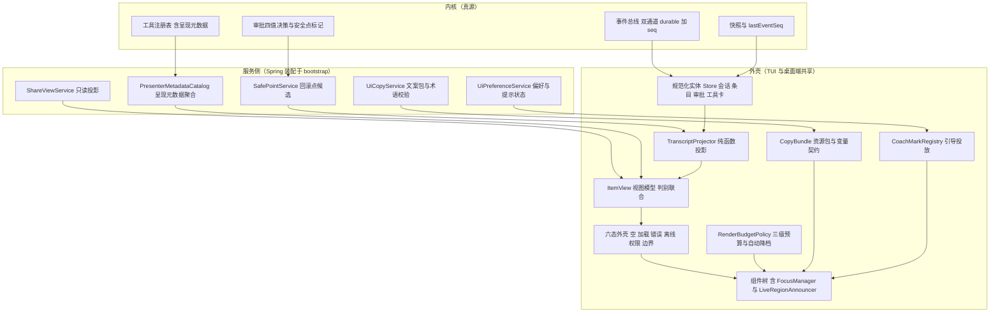
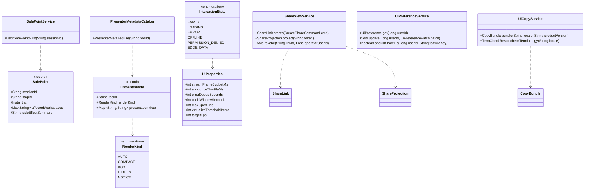
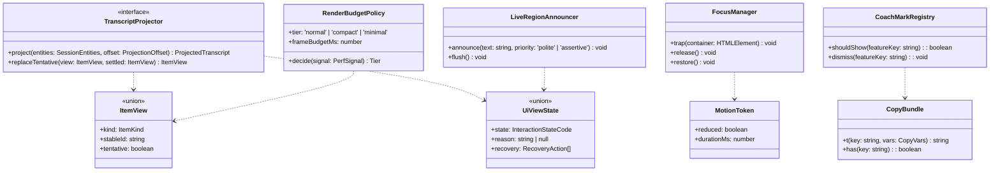
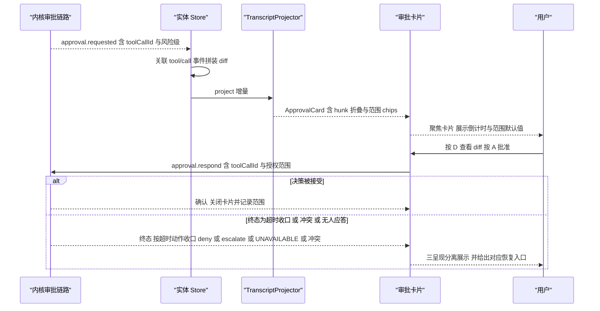
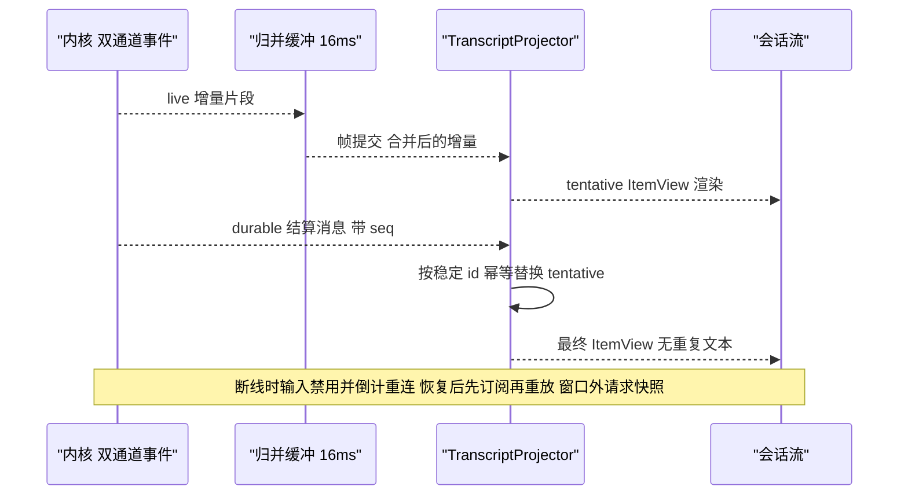
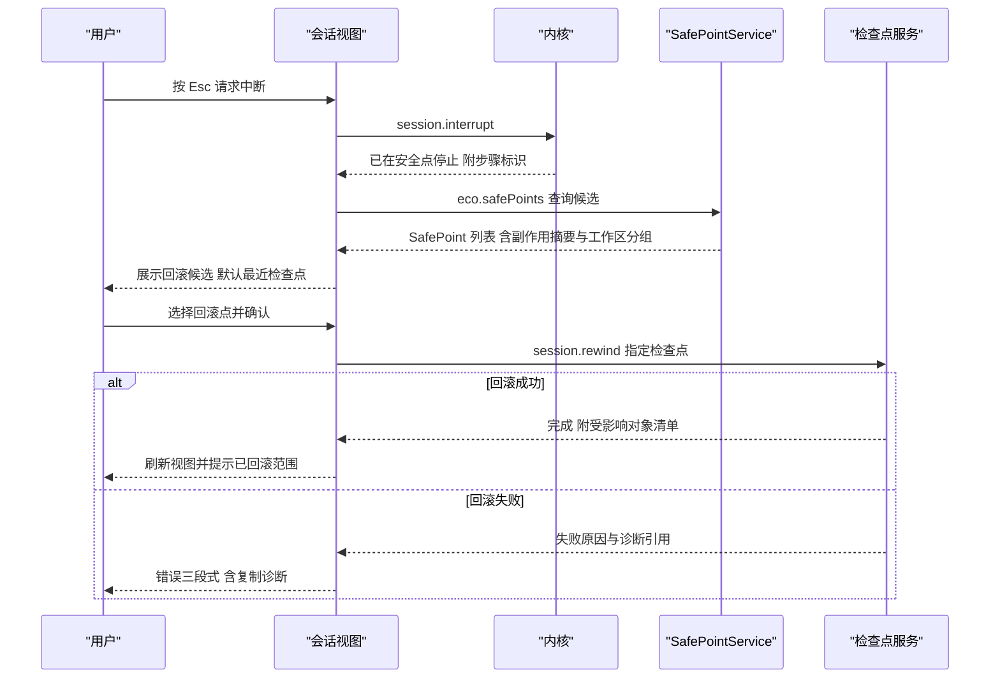
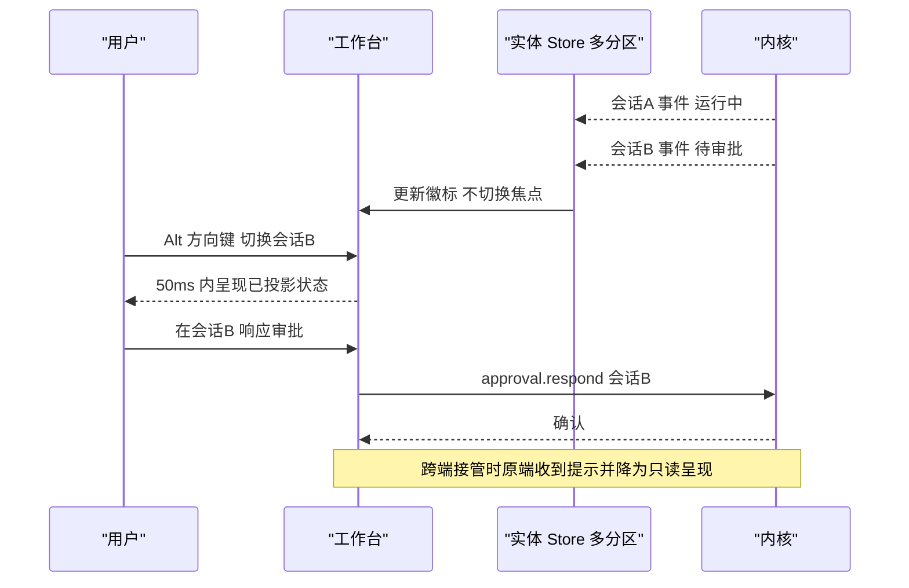
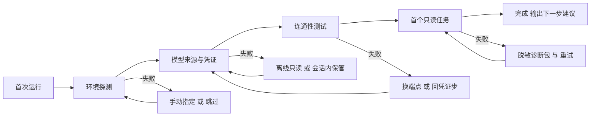
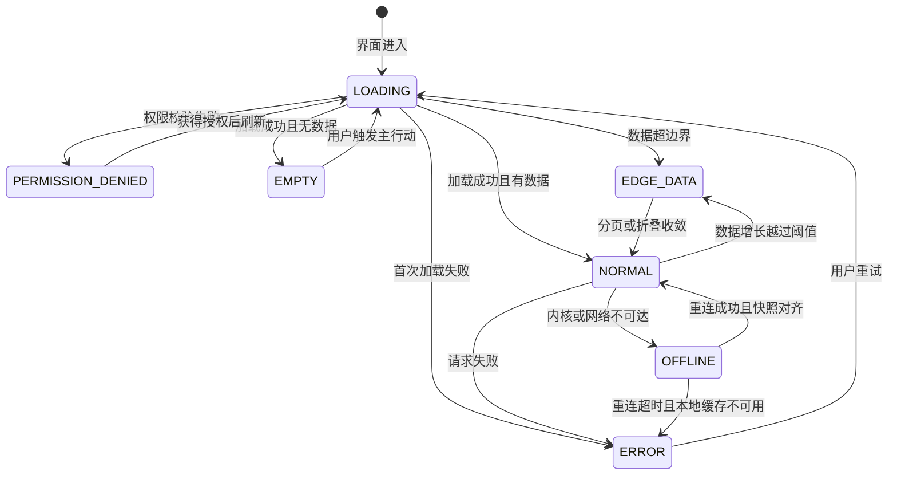
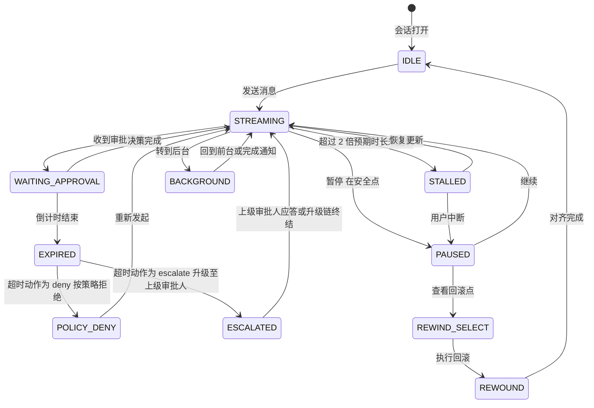

# 30 · 交互细则 — 实现技术方案（Phase B）

> 对应 Phase A 卷：`33-interaction-details.md`（D-UX-1…10，全量）；协作卷：`22-clients-cli-desktop.md`（界面规范/状态模型/可访问性/快捷键）、`16-event-system.md`（双通道事件）、`28-distribution-update-telemetry.md`（通知聚合）、`29-developer-ecosystem.md`（向导衔接）。
> 上游契约：附录 C（术语表，文案唯一权威）；D-ARC-10（增量事件 + 快照对齐）。
> 本文回答「每一帧长什么样、状态归谁、文案从哪来、降级到什么档」——不重新定义界面结构与事件语义。

---

## ① 实现目标与范围

### 1.1 本组件解决什么

卷 33 是**验收依据**：9 类界面 × 6 态矩阵、文案规范、错误呈现、键盘全流程、无障碍细则、长任务表现、危险确认、通知与分享（R06 扩为 11 类 × 6 态 = 66 格，见 §1.4 与 §7.1）。工程化落地需要五个可交付实体：

| 实体 | 归属 | 交付形态 | 对应 Phase A |
| --- | --- | --- | --- |
| 状态归属与投影层 | 外壳（端上） | 规范化实体 store + 纯函数投影 + 快照对齐 | 卷 22 §3 D-UI-14 / §4.6 |
| 逐帧交互规格 | 外壳（端上） | 组件契约表 + 帧预算与合并规则 | 卷 33 §2/§6/§7/§8 |
| 文案与本地化体系 | 外壳 + 服务侧 | locale-owned copy 资源包 + 术语表校验 + CI 门禁 | 卷 33 §3 D-UX-2 |
| 服务侧交互支撑 | 服务侧 | 呈现元数据消费、安全点列表、分享投影、偏好存储 | 本文件 §⑤/§⑨ |
| 降级与降噪 | 双端 | 三级渲染预算 + 自动降档 + 引导投放上限 | 卷 33 §5/§8 |

### 1.2 本组件不解决什么

- **界面结构**（导航、面板划分、工作台信息架构）在卷 22 §4.2/§4.3 与 `23-desktop-electron-vue-impl.md` 已定，本文件只细化「每个状态与每帧」。
- **事件语义与通道划分**在卷 16 已冻结（live 通道可丢、durable 通道可重放），本文件只消费。
- **无障碍技术清单**在卷 22 §4.7 已有条款；本文件负责将其**合并进组件契约**（每组件出厂即带语义与焦点行为），不重复罗列条款。

### 1.3 上下游依赖与接缝

| 方向 | 依赖对象 | 接缝形态 | 实现归属 |
| --- | --- | --- | --- |
| 上游 | 事件总线（16）、共享生成 SDK（29-impl） | 增量事件 + 快照；`lastEventSeq` 对齐 | `interfaces` + `client` |
| 上游 | 工具注册表呈现元数据（29-impl REQ-ECO-23） | `render` + `presentationMeta` 消费 | `interfaces` |
| 上游 | 权限决策与审批（06）、检查点（19） | 审批四值决策；安全点与回滚点 | `application` |
| 下游 | TUI（22-impl）、桌面端（23-impl） | 同一投影规则双端共享 | 本文件 |
| 下游 | 通知通道（28-impl）、IM/深链（29-impl） | 通知模板 + 分享链接 | 本文件 |

### 1.4 边界口径（Phase B 新增登记）

**落地登记（R07：模块 / 顺序 / 批次 / 端形态；清单见 `reviews/R07-scope-build-platform.md`）**：
- **模块坐标**：`harness-host/host-ui`（**扩展模块**：卷 27 §4.1 的 `host-*` 六模块不含 UI 支撑面，待登记；若不新增模块，则落 `host-protocol` 的 `ui.*` 命名空间 + `host-app` 装配，二者择一须在开工前定死）+ `harness-contract`（包 `contract/ux`）+ `client/*`（三端呈现：CLI/TUI 在 `host-cli`、桌面在 `client/packages/app`）。
- **实施顺序（卷 27 §4.5）**：横切两段——① **终端面**（文案键空间、六态、错误三段式、通知模板）随第 **8** 步（CLI 基础）；② **桌面面**（布局/无障碍/降档/分享视图）随第 **15** 步（桌面端）。文案键空间是 `22`/`23` 的共同前置，须先冻结键空间再实现端（否则两端各造一套）。
- **数据迁移批次**：`oc_ui_preference` / `oc_share_link` / `oc_share_visit` 未在卷 27 §4.4 明列 → 建议新批次 **B7 端形态与交互**（与 `22`/`23` 同批）；未映射项已登记 R07 §2。
- **表所有权**：`oc_ui_preference` 拥有者本文件（服务端支撑），`23` 只声明桌面本地副本与同步读取；`oc_ui_*` 指标族口径权威在本文件 §8.4。
- **I- 决策落点**：`I-UX-1…12`（12 条）模块落点为上表；类级落点见 §⑤，逐条绑定登记为 R07 建议 S4。

- 新增会话协议**只读查询**方法 `eco.safePoints`（回滚点候选列表），需回改附录 B.2 登记 → 已登记 `I-UX-5`，汇总入 `IMPL-DECISIONS.md`。
- 新增 2 张 `oc_*` 表（`oc_ui_preference`、`oc_share_link`），需回改卷 19/附录 A 登记 → 已登记 `I-UX-8`。
- **（R06 新增）界面族由 9 类扩为 11 类**：补「自动化模板库」（卷 34/`impl/31`）与「智能增强」（卷 35/`impl/32`）两处能力面——六态矩阵随之由 54 格扩为 66 格 → 已登记 `I-UX-10`，卷 33 修订建议见 §11.4。
- **（R06 新增）审批终态呈现口径**：超时不再等同于 `UNAVAILABLE`（权威在 `impl/06` §3.7.8 的「超时动作」），端上三呈现与统计口径分离 → 已登记 `I-UX-11`。
- **（R06 新增）文案键空间与错误三段式**：键空间 `ui.*`、中文基线、错误文案「事实 + 原因 + 动作」与 CI 第四条扫描 → 已登记 `I-UX-12`（本文 §9.6 是唯一权威）。

---

## ② 功能需求清单（REQ-UX-n）

| REQ | 需求描述 | 来源 | 优先级 | 验收要点 |
| --- | --- | --- | --- | --- |
| REQ-UX-01 | **服务端真源 + 端上投影**：增量事件按 `lastEventSeq` 应用；断线重连先订阅后重放、窗口外请求快照；乐观更新仅限输入类（发送消息/点击审批），服务端确认为准，冲突纠正可见 | 卷 22 §3 D-UI-14、§4.6；D-ARC-10 | P0 | 断网 30s 后状态一致；乐观被纠正时有可见提示而非静默覆盖 |
| REQ-UX-02 | **组件树与状态归属表**：每个视图元素标注「真源（服务端事件/快照）/ 投影（纯函数派生）/ 本地（草稿、滚动、焦点）」三类归属，禁止本地推导业务状态 | 卷 22 §4.2、卷 33 §1 边界（本卷是验收依据） | P0 | 归属表覆盖全部 9 类界面；出现「本地推导业务状态」即评审驳回 |
| REQ-UX-03 | **六态矩阵组件契约**：空/加载/错误/离线/权限/边界六态对 9 类界面逐格落为组件契约，每格 ≥ 1 条实现验收用例（**R06 扩为 11 类界面 = 66 格**：新增「自动化模板库」「智能增强」，登记 `I-UX-10`，卷 33 修订建议见 §11.4） | 卷 33 §2 D-UX-1、§11 DoD | P0 | 矩阵 **66 格**全部有用例；缺格即门禁失败；每格必须有**恢复动作**（不接受「请重试」类无动作文案） |
| REQ-UX-04 | **加载态三段**：≤ 1s 骨架屏（无文字）；> 1s 阶段文案；> 5s 显示「仍在加载 + 可取消」 | 卷 33 §2 | P0 | 三档阈值可配；阶段文案来自服务端 `agent.phase` 通知 |
| REQ-UX-05 | **错误三段式 + 去重**：发生了什么/为什么/怎么办；错误携带 `traceId` 一键复制；同类错误 5s 内去重；不可恢复错误禁用重试并给替代路径 | 卷 33 §4 D-UX-3 | P0 | 三段式字段齐套；traceId 复制成功；5s 内同指纹只展示一次 |
| REQ-UX-06 | **离线态**：顶部持续状态条 + 受影响功能禁用（不静默失败）+ 自动重连倒计时 + 草稿保护（恢复后自动发送需用户确认） | 卷 33 §2、卷 22 §7 | P0 | 离线期间新建/发送被禁用且有原因；草稿 kill -9 后可恢复 |
| REQ-UX-07 | **权限态**：明确「缺哪个权限」+ 申请路径（临时授权/联系管理员）；动作处锁形标识 + 原因 | 卷 33 §2/§3 | P0 | 权限缺失文案含权限名与风险级（如「执行命令」R2） |
| REQ-UX-08 | **边界态**：10 万级事件虚拟滚动、5 万字符消息折叠、检索结果分页；滚动 ≥ 55fps | 卷 33 §2 | P0 | 10 万事件打开 ≤ 2s；滚动帧率门禁 |
| REQ-UX-09 | **审批内联 diff 逐帧**：风险徽标（R0–R5）+ 动作摘要 + hunk 折叠 + 授权范围选择 + 超时倒计时 + 拒绝填理由 + 键盘 `A/R/D/Tab` | 卷 33 §6、卷 22 §4.3；L-007（三作用域沉淀 → 范围 chips 必须给六级范围映射表） | P0 | 四值决策（含 `UNAVAILABLE`）全路径；超时**不得**记拒绝；范围 chip 文案与卷 06 词汇一致 |
| REQ-UX-10 | **工具调用折叠逐帧**：摘要 + 耗时 + 结果引用；默认折叠、展开保留滚动位；渲染由呈现元数据驱动（`render` 纯函数 + 纯文本回退） | 卷 22 §4.3；竞品 DeepSeek 工具呈现三件套 `[E1]`（`04-deepseek-harness.md` §8 L1） | P0 | 每工具一档快照；插件渲染失败回退纯文本并记 WARN |
| REQ-UX-11 | **流式增量渲染**：live 通道增量 → 归并缓冲 → 16ms 帧预算提交；durable 结算消息替换 tentative 段；重连后不重放逐字动画 | 卷 16 双通道、卷 22 §4.6；竞品 DeepSeek live/persisted 两级 `[E1]`（`04` §4.13） | P0 | 单帧增量合并测试；tentative 去重；断线恢复无重复文本 |
| REQ-UX-12 | **中断与回滚点选择**：`Esc` 在安全点中断；中断后展示回滚点候选列表（含副作用提示）；多工作区时按工作区分组 | 卷 33 §7/§9、卷 19 检查点；L-049（检查点式部分回滚） | P0 | 中断不丢已提交产物；回滚点列表来自 `eco.safePoints`；回滚前必须确认 |
| REQ-UX-13 | **多会话并发视图**：多标签切换 ≤ 50ms、后台会话状态徽标（运行/待审批/失败）、无串话、跨端接管提示 | 卷 22 §3 D-UI-8 | P0 | 4 会话并发切换无串话；后台事件不丢 |
| REQ-UX-14 | **文案规范**：中文优先、术语遵循附录 C、代码/命令/路径不翻译；按钮动词开头 ≤ 6 字且同词；标题 ≤ 40 字、描述 ≤ 120 字 | 卷 33 §3 D-UX-2；附录 C | P0 | 文案检查清单逐条可扫描；同义动作只有一个词 |
| REQ-UX-15 | **标准文案库 ≥ 20 条入库**：每条含场景键、中文文案、变量契约（占位符 + 类型 + 溢出策略） | 卷 33 §3（标准文案库）、§11 DoD | P0 | 变量契约完整；缺失变量渲染为保护性占位而非空白 |
| REQ-UX-16 | **文案 CI 门禁**：组件内硬编码文案即失败；键缺失即失败；术语表校验（禁用词命中即失败）；服务端文案与端上键对齐；**R06 新增第四条：错误类文案缺「动作（how）」段即失败**（键空间与三段式模板见 §9.6） | 卷 33 §11 DoD；竞品 DeepSeek 中英双语文档成对 + `i18n.yaml` 配对门禁 `[E1]`（`04` §6-2） | P0 | **四条**扫描规则进 CI；误报白名单需评审记录；缺动作段的错误文案被拦 |
| REQ-UX-17 | **键盘全流程**：六层键位（全局/导航/会话/审批/列表/无障碍）+ 鼠标等价路径 + 冲突检测 + 未知键报错；`?` 面板展示 | 卷 33 §6 D-UX-5、卷 22 §4.5 | P0 | 无鼠标完成「新建会话 → 提问 → 审批 → 查看 diff → 提交」 |
| REQ-UX-18 | **无障碍合并进组件契约**：焦点可见（≥ 3:1）、模态焦点陷阱 + 归位、图标按钮 `aria-label`、`aria-live="polite"` 节流（≥ 500ms 合并，不逐 token）、对比度、reduce-motion 全局令牌 | 卷 33 §7 D-UX-6 | P0 | 8 项细则全部通过；live region 合并测试 |
| REQ-UX-19 | **屏幕阅读器布局**：提供专用布局模式（单流 + 显式命令），流式输出降为「段落级播报」 | 卷 22 §4.7；竞品 Gemini `ScreenReaderAppLayout` 布局切换 `[E1]`（`08-gemini-cli.md` §4.20） | P1 | 模式切换后无视觉依赖操作；播报不重复 |
| REQ-UX-20 | **错误恢复动作矩阵**：6 类错误（输入校验/业务规则/权限/依赖不可用/系统错误/安全拦截）× 呈现位置 × 视觉 × 必含动作 | 卷 33 §4 D-UX-3 | P0 | 矩阵 6 行逐行实现；依赖类错误用中性色（非红色） |
| REQ-UX-21 | **危险操作四级确认**：低（撤销窗口 10s，可调 5–30s）/ 中（对话框 + 快照说明）/ 高（输入确认词 + 倒计时 3s）/ 极高（双人确认 + 窗口限制）；高风险默认快照 | 卷 33 §9 D-UX-8；卷 07 §4.5 | P0 | 四级各自用例；撤销窗口可用；确认词与文案库一致 |
| REQ-UX-22 | **长任务四类表现**：不确定（阶段文案不造假百分比）/ 可估算（ETA 抖动 > 50% 隐藏）/ 后台（状态栏常驻 + 完成通知）/ 卡住（> 2× 预期未更新 → 建议动作） | 卷 33 §8 D-UX-7 | P0 | 四类各有截图验收；ETA 抖动抑制用例 |
| REQ-UX-23 | **通知六类模板 + 聚合去重 + 免打扰**：需人工介入/任务完成/失败/目标进展/成本预警/安全事件；22:00–08:00 静默（P0 穿透） | 卷 33 §10 D-UX-9；卷 28 §4.7 | P1 | 模板变量齐套；夜间静默与穿透用例 |
| REQ-UX-24 | **只读分享视图**：默认只读、可设过期与密码、隐藏成本与工具参数细节、仅展示结论与证据引用、打开行为入审计 | 卷 33 §10 D-UX-10 | P1 | 分享页无成本与参数（用例校验）；过期后拒绝访问 |
| REQ-UX-25 | **引导五层与投放纪律**：L2 coach mark 每功能 ≤ 1 次且可永久关闭、最多 3 个未关闭提示并存、不在危险操作附近教学、不叠加 | 卷 33 §5 D-UX-4 | P1 | 关闭记忆落偏好；叠加用例被拦 |
| REQ-UX-26 | **首次运行与空态引导**：衔接向导（卷 29 §4.6）；空态含「为什么空 + 主行动 + 示例任务一键运行（只读安全）」 | 卷 33 §3/§5 + 卷 29 §4.6 | P0 | 空态四要素齐套；示例任务可一键运行且只读 |
| REQ-UX-27 | **性能与优雅降级**：三级渲染预算（正常/紧凑/极简）自动降档且档位可见可锁；长会话/窄终端/低端机各有降档规则 | 卷 22 §7、卷 33 §2 边界态 | P0 | 降档触发与恢复用例；降档不丢内容只降表现 |
| REQ-UX-28 | **前端可观测**：白名单埋点（`ui.*` 事件）+ 指标 + 默认关闭遥测（开启需显式同意） | 卷 22 §6；L-074（遥测白名单） | P1 | 默认零外发（网络断言）；字段白名单化 |
| REQ-UX-29 | **两阶段客户端启动 + boot 页**：先加载模块系统再激活全部插件；失败 bundle 与插件在 boot 页逐条可见，不白屏 | 竞品 DeepSeek 两阶段启动 + 无框架 boot 页 `[E1]`（`04` §4.20/§6-15） | P1 | 注入失败插件后 boot 页可见且可重试；主界面不出现半初始化 |
| REQ-UX-30 | **新交互渐进门控**：实验性交互默认隐藏，需显式开启（设置或启动参数）；开启状态进事件流可回放 | 竞品 Codex `[experimental]` 子命令与运行时 enablement 开关 `[E1]`（`03-codex.md` §4.1/§4.7） | P2 | 默认不可见；开启状态可审计 |
| REQ-UX-31 | **委派与协作双窗口心智**：长任务以「目标/委派」视图为主（进度、证据、成本），短交互以「会话流」为主；同数据两视图不产生双源 | 竞品 Qoder Quest（委派窗口）与 Editor（协作窗口）分工 `[E2]`（`07-qoder.md` §2-6） | P2 | 两视图共享同一投影；切换不丢上下文 |
| REQ-UX-32 | **首屏与首次运行路径（R06 新增）**：CLI / TUI / 桌面三端各有一条可验收的首屏路径（首次运行 → 认证 → 首个任务），每步有目标时长（P95）与**至少一个可执行恢复动作**；失败不得出现「请重试」这类无动作文案；全流程可跳过且不产生半成品配置 | 卷 29 §4.6；卷 33 §3/§5；`22-cli-tui-impl.md` §6.6、`23-desktop-electron-vue-impl.md` §6.6（平台落地） | P0 | 三端路径表齐备（§6.5）；自动步骤合计 ≤ 20s、端到端（不含用户输入）≤ 90s（CLI）/ ≤ 3 分钟中位数（桌面，仅观测）；六条失败路径各有用例；跳过/退出后可断点续接 |
| REQ-UX-33 | **审批终态三呈现与统计分离（R06 新增）**：超时按该请求的超时动作收口（`deny` → 「已按策略拒绝」；`escalate` → 「已升级至上级审批人」）；只有通道全断 / 应答者缺失 / 应答不合规才呈现「无人应答（`UNAVAILABLE`）」；端上**不得本地判定**超时结果；三者统计口径分离（不得混入用户拒绝率） | `06-permission-system-impl.md` §3.7.8（权威）；L-005；卷 33 §4 | P0 | 三终态各有呈现与用例；`oc_ui_approval_outcome_total{kind}` 分桶正确；「拒绝并终止」（级联拒绝）与去重合并（同动作 ×N）可交互 |
| REQ-UX-34 | **新能力面六态与可控面（R06 新增）**：自动化模板库与智能增强两处界面纳入六态矩阵（扩为 11 类）；每项能力/模板可发现、可取消（安全点）、可解释（为什么跑 / 为什么不跑 / 为什么被拦）、成本可见（预估 + 运行中 + 结算） | 卷 34/35；`31-automation-library-impl.md` §9.1.1；`32-intelligent-augmentation-impl.md` §9.3.1 | P0 | 矩阵 66 格无缺格；四项控制在三端（CLI / TUI / 桌面）均有入口且文案键齐备 |

**竞品增量需求说明**：REQ-UX-10/11 来自 DeepSeek「工具呈现元数据 + live/persisted 两级流式」源码事实 `[E1]`；REQ-UX-16 来自其「中英双语成对 + i18n 校验」门禁 `[E1]`；REQ-UX-29/30 为两阶段启动与实验门控的落地；REQ-UX-09 消化 L-007（审批作用域词汇映射）；REQ-UX-19 复用 Gemini 屏幕阅读器布局证据。以上均在 §③ 登记 `I-UX-n`。

---

## ③ 技术方案选型（M×N 比选）

评分沿用 `README.md` §4：**F 30% / U 20% / S 25% / M 25%**。

### D-UXIMPL-1 状态归属与投影

| 分支 | 描述 | F | U | S | M | 加权 | 结论 |
| --- | --- | --- | --- | --- | --- | --- | --- |
| B1 | 端上各组件独立推导派生状态 | 6 | 6 | 3 | 4 | 47.5 | 淘汰（多份推导必然分叉，与本卷「验收依据」定位冲突） |
| B2 | **服务端真源 + 单一纯函数投影（规范化实体 → ItemView → 组件）** | 9 | 9 | 8 | 8 | 85.0 | **选定** |
| B3 | 全量快照轮询（放弃增量） | 5 | 5 | 9 | 6 | 61.5 | 淘汰（事件到界面 ≤ 200ms 不可达，卷 22 §7） |

**选定 B2**：`TranscriptProjector` 是唯一派生入口，端上仅保留「草稿/滚动/焦点」三类本地状态；投影可快照重放，与 D-ARC-10 对齐。

### D-UXIMPL-2 增量渲染策略

| 分支 | 描述 | F | U | S | M | 加权 | 结论 |
| --- | --- | --- | --- | --- | --- | --- | --- |
| B1 | 每 token 触发整条消息重渲染 | 6 | 5 | 5 | 5 | 52.5 | 淘汰（长消息帧率与内存均不可控） |
| B2 | **条目级归并实体 + 16ms 批帧 + 虚拟滚动 + tentative/durable 双层** | 9 | 9 | 8 | 8 | 85.0 | **选定** |
| B3 | Canvas 自绘会话流 | 7 | 5 | 6 | 4 | 55.0 | 淘汰（可访问性与文本选择全部重做，违反 D-UX-6） |

**选定 B2**：渲染单位是 ItemView（段落/工具卡/审批卡），live 增量先入缓冲、按帧预算提交；durable 事件到达时以稳定 id 替换 tentative 段（幂等替换）。

### D-UXIMPL-3 文案载体

| 分支 | 描述 | F | U | S | M | 加权 | 结论 |
| --- | --- | --- | --- | --- | --- | --- | --- |
| B1 | 组件内硬编码中文 | 5 | 6 | 3 | 3 | 42.5 | 淘汰（无法通过 REQ-UX-16 门禁；企业需英文界面） |
| B2 | **locale-owned copy 资源包（键 + 变量契约）+ 术语表 + CI 扫描** | 9 | 9 | 8 | 9 | 87.5 | **选定** |
| B3 | 服务端下发全部端文案 | 6 | 6 | 7 | 5 | 60.5 | 淘汰（文案版本与端版本耦合；离线不可用） |

**选定 B2**：文案是产品资产（locale-owned），服务端只下发**数据型文案**（错误三段式的「为什么」与恢复动作来自错误码枚举映射，键在端上）。企业术语覆盖走 `CopyBundleSourceSPI`（叠加而非替换，见 §⑨）。

### D-UXIMPL-4 无障碍实现路径

| 分支 | 描述 | F | U | S | M | 加权 | 结论 |
| --- | --- | --- | --- | --- | --- | --- | --- |
| B1 | 上线前集中补 ARIA | 5 | 5 | 6 | 6 | 54.0 | 淘汰（返工成本高，焦点管理无法事后补） |
| B2 | **组件契约内置（语义角色 + 焦点管理器 + live region 节流器 + reduce-motion 令牌）** | 9 | 9 | 8 | 8 | 85.0 | **选定** |
| B3 | 维护独立无障碍界面 | 6 | 4 | 5 | 4 | 48.5 | 淘汰（双份 UI 漂移，且不等于「等价可达」） |

**选定 B2**：无障碍是组件出厂属性；`FocusManager` 与 `LiveRegionAnnouncer` 为共享组件，禁各界面各自实现。

### D-UXIMPL-5 审批交互形态

| 分支 | 描述 | F | U | S | M | 加权 | 结论 |
| --- | --- | --- | --- | --- | --- | --- | --- |
| B1 | 全屏整文件 diff | 7 | 6 | 8 | 7 | 70.0 | 淘汰（审批高频，整文件噪声大、成本高） |
| B2 | **内联 hunk diff + 折叠 + 范围 chips + 键盘优先 + 倒计时** | 9 | 9 | 8 | 8 | 85.0 | **选定** |
| B3 | 仅摘要（不展示 diff） | 5 | 5 | 9 | 8 | 65.0 | 淘汰（不可审计的批准等于盲签） |

**选定 B2**：diff 数据来自已流式的 `tool/call` 事件（L-006：审批不携带参数），端上按 `toolCallId` 关联拼装；范围 chips 与卷 06 六级范围给出映射表（消化 L-007）。

### D-UXIMPL-6 中断与回滚交互

| 分支 | 描述 | F | U | S | M | 加权 | 结论 |
| --- | --- | --- | --- | --- | --- | --- | --- |
| B1 | 立即硬中断（无安全点概念） | 6 | 6 | 5 | 6 | 57.5 | 淘汰（中断在工具执行中会产生半成品产物） |
| B2 | **安全点中断 + 回滚点候选列表 + 副作用预览 + 分组** | 9 | 9 | 8 | 8 | 85.0 | **选定** |
| B3 | 仅支持整会话回滚 | 5 | 4 | 9 | 7 | 61.0 | 淘汰（与 L-049 检查点式部分回滚冲突） |

**选定 B2**：安全点由服务端标记（`eco.safePoints`，I-UX-5），端上只呈现与选择；回滚执行仍走 `session.rewind`。

### D-UXIMPL-7 降级策略

| 分支 | 描述 | F | U | S | M | 加权 | 结论 |
| --- | --- | --- | --- | --- | --- | --- | --- |
| B1 | 无降级（全量渲染到底） | 5 | 4 | 5 | 6 | 49.5 | 淘汰（10 万事件与低端机必然卡死） |
| B2 | **三级渲染预算（正常/紧凑/极简）+ 自动降档 + 档位可见可锁** | 9 | 8 | 8 | 8 | 83.0 | **选定** |
| B3 | 强制分页（每屏固定条数） | 6 | 5 | 9 | 7 | 66.5 | 淘汰（交互割裂，流式体验被破坏） |

**选定 B2**：降档只降「表现」（省略动画、折叠细节、降低采样），不丢内容；档位变化在状态栏可见并产出事件（可观测）。

### D-UXIMPL-8 分享视图实现

| 分支 | 描述 | F | U | S | M | 加权 | 结论 |
| --- | --- | --- | --- | --- | --- | --- | --- |
| B1 | 原样分享会话（含成本与工具参数） | 6 | 7 | 4 | 5 | 54.5 | 淘汰（成本与参数属敏感面，D-UX-10 明确隐藏） |
| B2 | **服务端二次投影（只读视图对象）+ 过期/密码 + 审计** | 9 | 8 | 9 | 8 | 85.5 | **选定** |
| B3 | 截图分享 | 6 | 5 | 8 | 8 | 66.5 | 淘汰（不可追溯、无法访问性友好） |

**选定 B2**：分享对象是投影产物而非原会话，从结构上保证「敏感字段不存在」而不是「前端不显示」。

### D-UXIMPL-9 引导投放

| 分支 | 描述 | F | U | S | M | 加权 | 结论 |
| --- | --- | --- | --- | --- | --- | --- | --- |
| B1 | 强制首次导览（不可跳过） | 5 | 4 | 7 | 7 | 56.0 | 淘汰（D-UX-4 要求全部可永久关闭） |
| B2 | **事件驱动 coach mark + 每功能 ≤ 1 次 + 上限 3 并存 + 关闭记忆** | 8 | 8 | 8 | 8 | 80.0 | **选定** |
| B3 | 仅外部文档 | 4 | 5 | 9 | 9 | 64.5 | 淘汰（发现性差，L2/L3/L5 是 DoD 要求） |

**选定 B2**：触发条件绑定「首次遇到该功能」事件（由投影层判定），投放状态落 `oc_ui_preference`。

### 3.10 实现级决策登记（I-UX-n）

| ID | 主题 | 选定 | 代价 | 回退触发 |
| --- | --- | --- | --- | --- |
| I-UX-1 | 状态归属 | 服务端真源 + 单一纯函数投影；端上仅草稿/滚动/焦点 | 投影需可重放测试；实体规范化成本 | 投影分叉导致状态不一致 → 收紧为「投影只读事件流 + 快照，禁止二次派生」 |
| I-UX-2 | 增量渲染 | 条目级归并 + 16ms 批帧 + tentative/durable 双层 + 虚拟滚动 | 归并缓冲与替换逻辑复杂（幂等要求高） | 帧预算 P95 > 16ms → 降低增量采样（live 合并窗口 32ms）并记事件 |
| I-UX-3 | 文案载体 | locale-owned copy 资源包 + 术语表 + 三条 CI 扫描 | 文案键治理与版本发布纪律 | 扫描误报率 > 5% → 白名单需评审记录（不得静默豁免） |
| I-UX-4 | 无障碍 | 组件契约内置（焦点管理器 + live region 节流器 + reduce-motion 令牌） | 组件开发门槛提高 | 某组件无法满足焦点归位 → 该组件禁用模态形态，改内联面板 |
| I-UX-5 | 回滚点 | 安全点中断 + `eco.safePoints` 候选 + 副作用预览（需回改附录 B.2） | 新增只读方法 + 安全点标记成本 | 安全点粒度不足（回滚语义不清晰）→ 降级为「检查点列表 + 最近检查点必选」 |
| I-UX-6 | 降级 | 三级渲染预算 + 自动降档 + 档位可见可锁 | 三档需分别验收；埋点区分档位 | 降档误触发（正常机降档）→ 提高阈值并加入用户锁定优先 |
| I-UX-7 | 引导投放 | 事件驱动 coach mark + 上限 3 + 永久关闭记忆 | 触发事件定义与埋点 | 引导打扰投诉（≥ 3 例/月）→ 默认全部关闭，仅空态保留 L5 |
| I-UX-8 | 分享视图 | 服务端二次投影 + 过期/密码 + 审计（新增 2 张表） | 投影规则需随会话模型演进同步 | 投影遗漏敏感字段（红队命中）→ 收紧为「白名单字段投影」并全量回归 |
| I-UX-9 | 屏幕阅读器 | 专用布局 + 段落级播报（不逐 token） | 需独立布局维护成本 | 专用布局与主流布局差异过大 → 收敛为「同一布局 + 播报策略差异」 |
| I-UX-10 | 界面族扩展（R06） | 六态矩阵由 9 类扩为 11 类（+自动化模板库、+智能增强）= 66 格；两处新面必须走同一 `InteractionState` 与同一文案键空间 | 矩阵与用例量增加（54 → 66）；卷 33 需回改 | 新面六态覆盖成本过高（单格用例 > 1 人日）→ 允许以「面板级」而非「路由级」为一格，但必须显式登记豁免理由 |
| I-UX-11 | 审批终态呈现（R06） | 三呈现（按策略拒绝 / 已升级 / 无人应答）+ 统计分离；端上不本地判定超时 | 端上需等待内核终态（首帧多一次往返 / 卡片短暂显示「等待裁定」） | 内核终态延迟 P95 > 500ms → 端上先渲染「等待内核裁定」占位（**仍不得猜结果**），并把延迟纳入体验看板 |
| I-UX-12 | 文案键空间与三段式（R06） | 键空间 `ui.<surface>.<element>.<variant>`；中文（zh-CN）为基线；错误文案强制「事实 + 原因 + 动作」；CI 四条扫描 | 文案评审成本上升（每条错误文案需能回答「用户下一步做什么」） | 扫描误报率 > 5% → 白名单需评审记录（与 `I-UX-3` 同一条纪律，禁止静默豁免） |

### 3.11 与竞品对照的取舍（research 证据）

| 对照维度 | 竞品证据 | 我们的取舍 | 主动放弃的收益 |
| --- | --- | --- | --- |
| 状态与投影 | Codex app-server JSON-RPC v1/v2 并存 + `ts_rs` 类型导出 [E1]；OpenCode `session-ui` 共享渲染包 [E1] | 采纳「服务端真源 + 单一纯函数投影 + 端上薄壳」（I-UX-1），三端共享同一投影规则 | 端上自持状态的渲染性能（改由 16ms 批帧补偿，I-UX-2） |
| 交互状态完备性 | 9 家中普遍**未系统化**枚举空/加载/错误/权限/离线/超长六态（负证据：`CROSS-COMPARISON.md` §2.3 前端行未观察态矩阵） | 主动设定「**11 界面 × 6 态 = 66 格**」验收矩阵（REQ-UX-03；R06 由 9 类扩至 11 类）并进 CI（缺格失败） | 不做「按需补状态」的轻交付，前期矩阵维护成本高 |
| 无障碍实现 | Gemini `GOVERNANCE_FILES`、Claude Code 模态焦点管理均为源码级散点（`CROSS-COMPARISON.md` §2.2）[E1] | 收敛为「组件契约内置焦点管理器 + live region 节流 + reduce-motion 令牌」（I-UX-4/9） | 学习成本转移给组件开发者（门槛提高） |
| 降级与档位 | Qoder 交付投影「计数 + 不透明归档名」[E2]；MiniMax 呈现层简化策略 [E1] | 采纳为「三级渲染预算 + 自动降档 + 档位可见可锁」（I-UX-6） | 不做静默降档（L-055 教训），需向用户展示档位 |
| 回滚与安全点 | Codex 会话回滚检查点 + Claude Code `Checkpoint` [E1]；L-006（审批不携带参数，靠 tool/call 关联） | 采纳「安全点中断 + 回滚候选 + 副作用预览」（I-UX-5），新增 `eco.safePoints` 只读方法 | 不做「任意点回滚」（安全点之外的副作用不可逆） |

---

## ④ 总体架构图



**装配点**：端上 `TranscriptProjector` 为无状态纯函数模块（TUI 与桌面端各有一份实现，共享同一 `.spec` 快照基线）；服务侧五个 Service 由 `@AutoConfiguration` 装配，`ShareViewService` 与 `SafePointService` 依赖 `@ConditionalOnMissingBean` 以便企业覆写。

---

## ⑤ 类图与契约

### 5.1 服务侧（Java 21）



```java
/**
 * 界面状态枚举。
 * 端上外壳与验收用例共用同一套 code；数据库与事件只存 {@code code}，非法值经 {@link #of(String)} 抛业务异常。
 */
@Getter
@RequiredArgsConstructor
public enum InteractionState {

    /** 无数据但功能正常 */
    EMPTY("EMPTY", "空态"),
    /** 首次加载 */
    LOADING("LOADING", "加载态"),
    /** 请求失败 */
    ERROR("ERROR", "错误态"),
    /** 内核或网络不可达 */
    OFFLINE("OFFLINE", "离线态"),
    /** 无权访问 */
    PERMISSION_DENIED("PERMISSION_DENIED", "权限态"),
    /** 超长/超大/超量 */
    EDGE_DATA("EDGE_DATA", "边界态");

    private final String code;
    private final String desc;

    /**
     * 按 code 解析枚举。
     *
     * @param code 状态编码（必填）
     * @return 匹配的状态枚举
     * @throws BusinessException code 为空或未知时抛出
     */
    public static InteractionState of(String code) {
        for (InteractionState state : values()) {
            if (state.code.equals(code)) {
                return state;
            }
        }
        throw new BusinessException("未知界面状态：" + code);
    }
}
```

```java
/**
 * 只读分享服务。
 * 分享对象是「服务端二次投影」，成本与工具参数在投影层被剥离（不依赖前端隐藏）。
 */
@Slf4j
@Service
@RequiredArgsConstructor
public class ShareViewService {

    private final ShareLinkMapper shareLinkMapper;
    private final SessionQueryGateway sessionQueryGateway;
    private final UiProperties uiProperties;

    /**
     * 创建只读分享链接。
     *
     * @param cmd 创建命令（会话标识、有效期、可选的访问密码、分享人）
     * @return 分享链接（明文令牌只在本次返回，库中只存哈希）
     * @throws BusinessException 会话不存在、当前用户无权分享或有效期非法时抛出
     */
    @Transactional(rollbackFor = Exception.class)
    public ShareLink create(CreateShareCommand cmd) {

        // 1. 权限与存在性校验：只有可读该会话的成员才能分享（越权分享按归属校验拦截）
        Session session = sessionQueryGateway.requireReadable(cmd.sessionId(), cmd.operatorUserId());

        // 2. 有效期校验：禁止超过上限的有效期，避免「永久分享」成为数据泄漏通道
        Duration ttl = cmd.ttl() == null ? uiProperties.getShareDefaultTtl() : cmd.ttl();
        if (ttl.compareTo(uiProperties.getShareMaxTtl()) > 0) {
            throw new BusinessException("分享有效期最长 " + uiProperties.getShareMaxTtl().toDays() + " 天");
        }

        // 3. 生成一次性令牌并只存哈希（明文仅返回给创建者一次）
        String rawToken = ShareTokens.generate();
        ShareLink link = ShareLink.create(session.id(), cmd.operatorUserId(), rawToken, ttl);
        shareLinkMapper.insert(link);

        log.info("创建只读分享链接，sessionId={}, linkId={}, ttlDays={}",
                session.id(), link.id(), ttl.toDays());
        return link;
    }
}
```

```java
/**
 * 交互与呈现配置。
 * 影响逐帧预算、节流窗口与降级阈值，部署期可经环境变量覆盖。
 */
@Getter
@Setter
@ConfigurationProperties(prefix = "open-coding.ui")
public class UiProperties {

    /** 流式渲染帧预算（毫秒，默认 16 对应 60fps 上限） */
    private int streamFrameBudgetMs = 16;

    /** 读屏公告合并窗口（毫秒，≥ 500 防止逐 token 播报） */
    private int announceThrottleMs = 500;

    /** 同类错误展示去重窗口（秒） */
    private int errorDedupSeconds = 5;

    /** 低风险操作撤销窗口（秒，允许范围 5–30） */
    private int undoWindowSeconds = 10;

    /** 未关闭引导提示并存上限 */
    private int maxOpenTips = 3;

    /** 触发虚拟滚动的条目数阈值 */
    private int virtualizeThresholdItems = 10_000;

    /** 滚动帧率目标（门禁断言用） */
    private int targetFps = 55;

    /** 分享默认有效期（秒） */
    private Duration shareDefaultTtl = Duration.ofDays(7);

    /** 分享最长有效期（秒） */
    private Duration shareMaxTtl = Duration.ofDays(30);
}
```

### 5.2 端上（TypeScript，TUI 与桌面端共享投影规则）



```ts
/** 投影契约：唯一派生入口；组件不得自行推导业务状态（REQ-UX-02）。 */
export interface ProjectedTranscript {
  readonly items: readonly ItemView[];
  readonly viewState: UiViewState;
  readonly nextOffset: ProjectionOffset;
}

/** 视图状态：六态与恢复动作由投影产出，界面只渲染（REQ-UX-03/20）。 */
export type UiViewState =
  | { state: 'EMPTY'; primaryAction: RecoveryAction; exampleTask: string }
  | { state: 'LOADING'; stage: string | null; cancellable: boolean }
  | { state: 'ERROR'; what: string; why: string; how: string; traceId: string; retryable: boolean }
  | { state: 'OFFLINE'; reconnectInMs: number; disabledCapabilities: readonly string[] }
  | { state: 'PERMISSION_DENIED'; missingPermission: string; riskLevel: string; applyPath: string }
  | { state: 'EDGE_DATA'; pageToken: string | null; collapsedSummary: string };
```

---

## ⑥ 核心流程时序图

### 6.1 审批内联 diff 逐帧（键盘优先）

**前置**：`approval.requested` 已到达，且对应 `tool/call` 事件已流式（审批不携带参数，L-006）。
**主路径**：端上按 `toolCallId` 关联拼装 diff → 渲染卡片（风险徽标 + hunk 折叠 + 范围 chips + 倒计时）→ 键盘 `A/R/D/Tab` → `approval.respond`（含范围）→ 服务端确认为准。
**异常补偿（R06 对齐 `impl/06` §3.7.8）**：倒计时结束**不产生终态**——按该请求声明的超时动作收口：`deny` → 呈现「审批超时（<timeout>s 内未响应），已按策略拒绝」；`escalate` → 呈现「已升级至上级审批人」；只有通道全断 / 应答者缺失 / 应答不合规才是「无人应答（`UNAVAILABLE`）」。**端上不得本地判定，也不得把三者混为一谈**（三呈现与统计分离见 `I-UX-11`；映射枚举见 `22-cli-tui-impl.md` §⑤.1 `ApprovalOutcomeKind`）；并发决策冲突 → 以服务端首达为准，端上纠正并提示。
**幂等并发**：`requestId` 去重；重复 respond 返回既有结果；同 actor / 同动作 / 同资源在去重窗口（30s）内合并为一张卡并标注「同动作 ×N」（展开可见每次目标资源）。

**卡片字段顺序（唯一权威，`22`/`23` 只引用不自定）**：① 风险徽标（R0–R5）→ ② 动作摘要 → ③ 预览（diff hunk / 命令全文，按纯文本渲染）→ ④ 目标资源 → ⑤ 授权范围 chips → ⑥ 倒计时与超时动作 → ⑦ 目标 `action_digest` 短前缀（供人工核对，`impl/06` §3.7.6 第 11 条）。
**键盘语义**：`A` 批准本次 / `S` 批准并授予范围（二次确认摘要）/ `R` 拒绝本次（可填理由）/ `Shift+R` 拒绝并终止（级联拒绝，同会话 pending 全部终结）/ `D` 查看 diff / `Tab` 在字段间移动 / `Esc` 收起（不产生决策）。

**范围 chips 与 `impl/06` 六级授权记忆映射（唯一权威；`22`/`23` 引用同一词汇，禁止自造第七种）**：

| chip | `impl/06` 记忆范围 | 语义（用户视角文案） | 可用条件 |
| --- | --- | --- | --- |
| 仅本次 | `once`（不写记忆） | 「就这一次」 | 全部动作可用（含 R4/R5） |
| 本会话 | `session` | 「本次会话内同类动作都同意」 | R0–R3；受 `batch-scope-max` 上限约束 |
| 本项目 | `project` | 「这个项目内同类动作都同意」 | R0–R3；受 `batch-scope-max` 上限约束 |
| 本工作区 | `workspace` | 「这个工作区内同类动作都同意」 | R0–R3；受 `batch-scope-max` 上限约束 |
| 按模式 | `pattern` | 「匹配该路径/命令模式时才同意」（模式在 chips 展开区可预览与编辑，禁止盲授） | R0–R3；模式必须可在确认前看到展开结果 |
| 按目录 | `dir` | 「该目录下才同意」 | R0–R3；目录路径在确认前可见 |

**不可授予的组合（硬约束）**：R4/R5 **不提供**除「仅本次」之外的任何 chip（`impl/06` REQ-PERM-28：危险操作不留存）；无法解析 / 部分解析的命令（`UNPARSED`/`PARTIAL`）同样只允许「仅本次」；企业可把 `batch-scope-max` 收窄到 `session`。范围变更后**必须重看 diff 摘要**（防「先改范围后偷换内容」）。



### 6.2 流式增量渲染（含断线恢复）

**前置**：会话已订阅（live 与 durable 双通道）。
**主路径**：live 增量入归并缓冲 → 16ms 帧预算提交 tentative 段 → durable 结算到达后按稳定 id 幂等替换。
**异常补偿**：断线 → 输入禁用 + 状态条 + 指数退避重连；重连后先订阅再重放，窗口外快照重建；**不重放逐字动画**。
**幂等并发**：tentative 替换按稳定 id 幂等；重复事件按 `seq` 去重。



### 6.3 中断与回滚点选择

**前置**：会话执行中；服务端已标记安全点。
**主路径**：`Esc` → 服务端在最近安全点中断 → 端上拉取回滚点候选（`eco.safePoints`）→ 展示副作用提示 → 用户选择 → `session.rewind` → 快照对齐。
**异常补偿**：无可用安全点 → 提示「将在当前步骤结束后停止」；回滚失败 → 错误态 + 复制诊断。
**幂等并发**：回滚请求带 `requestId`；重复回滚返回既有结果。



### 6.4 多会话并发视图与跨端接管

**前置**：同用户多端或多标签订阅多个会话。
**主路径**：各会话按 `lastEventSeq` 独立投影；后台会话仅更新徽标（运行/待审批/失败）；切换标签 ≤ 50ms 呈现已投影状态。
**异常补偿**：某会话事件窗口超期 → 该标签请求快照重建；跨端接管 → 原端收到提示并降为只读呈现。
**幂等并发**：切换不移除订阅；事件按会话分区，无串话。



### 6.5 首屏与首次运行路径（三端，R06 新增）

**统一契约**：三端共享同一骨架（**首次运行 → 认证 → 首个任务**）与同一失败契约——每步 ≥ 1 个**可执行**恢复动作、恢复只重跑当前步、跳过不产生半成品配置、每步显示一行「为什么需要」（键 `ui.firstrun.<step>.why`）；差异只在呈现形态（终端 = 逐问向导，桌面 = 五屏面板）。**配置写入是最后一步的原子提交**。

| 端 | 首屏定义（可验收） | 路径 | 目标时长（P95） | 失败恢复动作（示例；全量见各 impl 文件） |
| --- | --- | --- | --- | --- |
| CLI / TUI | 「可提问的会话界面出现」：冷启动 ≤ 300ms、首帧 ≤ 60ms | `oc` → 环境探测 → 模型来源 → 凭证引用化 → 连通性测试 → 内核连接 → 只读示例任务 → 完成（输出可复制命令） | 自动步骤合计 ≤ 20s；端到端（**不含用户输入**）≤ 90s；`oc init --yes` ≤ 20s | 探测失败 → 手动指定；无来源 → 离线只读模式；密钥链不可用 → 会话内保管 + 明确警示；401/403 → 回到凭证步；内核版本不兼容 → 升级命令；示例任务失败 → 脱敏诊断包 + 重试 |
| 桌面 | 「首屏可交互」：≤ 3.5s（无会话）/ ≤ 5s（含首屏数据）；boot 页逐条可见 | boot 页 → 内核探测 / 拉起 → 首屏 → S1–S5 引导（合并卷 29 §4.6 九步）→ 只读示例任务 → 完成 | 引导自动步骤合计 ≤ 20s；用户操作中位数 ≤ 3 分钟（仅观测，不作门禁） | 无内核 → 一键拉起；目录不可用 → 更换目录或申请权限；钥匙串不可用 → 会话内保管 + 警示；示例任务失败 → 诊断包 + 重试 |
| 只读跟随端与分享页 | 「分享页首屏」：≤ 800ms（投影快照缓存命中） | 令牌校验 → 投影加载 → 只读呈现（天然离线可用） | ≤ 800ms | 令牌过期 / 无效 → 单页提示（**不泄漏会话是否存在**）；投影失败 → 重试 + 链接状态；密码错误 → 重输入（不区分「链接不存在」） |

**共同底线（任一端违反即视为体验缺陷）**：
1. **无凭证 / 无内核时首屏仍可达**：进入只读浏览 + 配置引导；「示例任务」置灰并给出原因（**可解释性优先于隐藏**——置灰 + 原因优于按钮消失）；
2. **失败文案一律三段式**（事实 + 原因 + 动作，§9.6），禁止「请重试」这类无动作文案（CI 扫描，缺动作段即失败）；
3. **可跳过、可续接**：跳过即进入可用首屏并保留「继续配置」入口；重进引导从断点步 / 断点屏续接；
4. **埋点**：`ui.firstrun.completed{client, steps, durationMs, skipped[]}`（白名单字段，默认关闭遥测），进首屏体验周报；首屏超预算（CLI 自动步骤 > 20s / 桌面 > 5s）产出体验告警条目。



---

## ⑦ 状态机

### 7.1 界面状态机（六态，全界面共享）



**约束**：`OFFLINE` 期间受影响功能一律禁用（不静默失败）；不可恢复错误禁用重试并给替代路径（REQ-UX-05/06）；状态迁移产出 `ui.state.changed` 埋点（白名单字段）。

**六态完备性矩阵（11 界面 × 6 态 = 66 格，逐格有文案键与主行动；缺格 = 契约测试失败；R06 由 9 类扩为 11 类，见 `I-UX-10`）**：

| 界面族 | 空 | 加载 | 错误 | 权限 | 离线 | 超长（EDGE_DATA） |
| --- | --- | --- | --- | --- | --- | --- |
| 会话流 | 「新建会话」主行动 + 快捷示例 | 骨架屏 + 流式占位（不闪空白） | 三段式 + 复制诊断 | 登录引导 + 返回 | 输入禁用 + 重连倒计时 + 草稿保留 | 虚拟滚动（阈值 10000 条）+「跳到底部」+ 时间分组折叠 |
| 审批卡片 | 无待审批 → 不出现（非空态） | 参数拼装中占位（≤ 200ms 后可交互） | 关联失败 → 提示刷新来源 | 无审批权 → 只读展示 + 说明 | 决策离线不可提交，保留选择 | diff 超长（> 2000 行）→ hunk 折叠 + 仅显示变更区 |
| 工具卡 | 工具未产出 → 占位行 | 运行中脉冲 + 耗时 | 工具失败 → 错误卡 + 重试 | 工具禁用 → 灰卡 + 权限说明 | 结果待补 → 「离线暂缓」标记 | 输出超长 → 摘要 + 展开原文（外置引用） |
| 任务与计划 | 无任务 → 创建 CTA | 计划生成中进度 | 计划失败 → 根因 + 重跑 | 无权限 → 说明归属 | 看板只读 + 同步标记 | DAG 超 200 节点 → 分层折叠 |
| 成本看板 | 无用量 → 引导开启计量 | 聚合加载（≤ 500ms 骨架） | 报表失败 → 重试 + 上次快照 | 无 `cost.read` → 屏蔽金额 | 显示上次缓存 + 「数据滞后」徽标 | 30 天点超限 → 自动降采样 + 说明 |
| Registry 与导入 | 无包/无来源 → 引导 | 同步/扫描进度条 | 校验失败 → 清单 + 修复指引 | 私仓未授权 → 配置引导 | 用本地缓存索引 + 断点说明 | 包列表超长 → 分页 + 过滤记忆 |
| 设置与偏好 | 默认值即内容（无空态） | 偏好加载骨架 | 保存失败 → 保留旧值 + 提示 | 企业锁 → 只读 + 来源展示 | 本地可改、同步延后（标注） | 键位/术语表超长 → 搜索 + 分组 |
| 向导 | 未开始 → 「跳过或开始」 | 步骤加载 | 某步失败 → 保留已填 + 重试 | 权限不足 → 跳过项说明 | 离线可用（本地步骤） | 来源文件超多 → 抽样预览 + 全量后台 |
| 分享视图 | 会话为空 → 明确「无内容可分享」 | 投影生成中（≤ 800ms 首屏） | 投影失败 → 重试 + 复制链接状态 | 令牌无效/过期 → 单页提示 | 静态呈现（天然离线） | 超长会话 → 分页 + 目录导航 |
| 自动化模板库（R06 新增） | 无模板 → 「浏览内置模板 / 导入包」双主行动 + 触发方式说明 | 装载 / 干跑进度（分步可见：签名 → 校验 → 干跑） | 装载被拒 → **字段级原因清单** + 修正指引（模板作者视角）；运行失败 → 失败层级 + 证据 | 无 `automation.manage` → 只读浏览 + 申请路径（含权限名） | 用缓存目录 / 离线镜像并标注「离线」；运行请求排队并显示原因 | 模板 / 运行列表超长 → 分页 + 过滤记忆；步骤数超长 → 折叠 + 步骤锚点 |
| 智能增强（R06 新增） | 无运行 → 能力清单（分类 + 触发方式）+ 首运行引导 | 运行进度：阶段 + 当前成本 + 可取消标记 | 门禁拦截 → 拦截报告（哪一层、哪条规则、怎么改）；能力异常 → 原因 + 重跑 | 能力被企业禁用 → 入口隐藏或置灰 + 说明来源（企业策略 / 自己设置） | 进度停留 + 「离线暂缓」标记 + 恢复后自动补发；已产出草稿保留 | 发现列表超长 → 按严重度分级折叠；问答引用超长 → 分页 + 外置引用展开 |

矩阵同时是埋点覆盖表：每格迁移必须产生 `ui.state.changed{surface, state}`（`surface` 取 §7.1 界面族 code，R06 新增 `automation` 与 `intel` 两段，需同步登记事件 Registry）；`EDGE_DATA` 的阈值全部来自配置（`virtualize-threshold-items` 等），不得硬编码。

### 7.2 会话执行视图与长任务状态



**说明**：`STALLED` 只给建议动作（查看日志/中断/继续等待），不自动中断；`BACKGROUND` 期间后台徽标常驻，完成/失败经通知聚合（卷 28 §4.7）。
**说明（R06 补充，审批相关）**：`EXPIRED` 不是终态——它按该请求声明的超时动作收口为 `POLICY_DENY`（「已按策略拒绝」，**不计入用户主动拒绝**）或 `ESCALATED`（「已升级至上级审批人」等待态）；「无人应答（`UNAVAILABLE`）」只对应通道全断 / 应答者缺失 / 应答不合规。三呈现与统计分离（`I-UX-11`），端上**不得本地判定**超时结果；「拒绝并终止」进入 `REWOUND` 之前的级联语义是：同会话 pending 全部终结、工具调用中断、回合结束（`impl/06` §3.7.8）。

---

## ⑧ 数据模型

### 8.1 表（`oc_*`，新增表已登记 I-UX-8）

**`oc_ui_preference`（用户交互偏好与提示状态）**

| 字段 | 类型 | 约束 | 说明 |
| --- | --- | --- | --- |
| id | bigserial | PK | — |
| user_id | bigint | NOT NULL | 用户 |
| tenant_id | bigint | NOT NULL | 租户 |
| locale | varchar(16) | NOT NULL | zh-CN / en-US |
| theme | varchar(16) | NOT NULL | dark/light/system/high-contrast |
| reduce_motion | boolean | NOT NULL | 减少动效 |
| degrade_tier_locked | varchar(16) | NULL | 锁定的降级档（null = 自动） |
| undo_window_seconds | int | NOT NULL | 5–30（默认 10） |
| quiet_hours_start / quiet_hours_end | time | NOT NULL | 默认 22:00 / 08:00 |
| tips_state | jsonb | NOT NULL | `{featureKey: {shownCount, dismissedAt}}` |
| keymap_profile | jsonb | NOT NULL | 键位覆盖（与默认表合并后的结果） |
| updated_at | timestamptz | NOT NULL | — |

索引：`uk_ui_pref (user_id)`。

**`oc_share_link`（只读分享）**

| 字段 | 类型 | 约束 | 说明 |
| --- | --- | --- | --- |
| id | uuid | PK | — |
| session_id | varchar(64) | NOT NULL | 被分享会话 |
| tenant_id / created_by | bigint | NOT NULL | 归属与创建者 |
| token_hash | varchar(128) | NOT NULL | 令牌哈希（明文只返回一次） |
| password_hash | varchar(128) | NULL | 可选访问密码 |
| expires_at / revoked_at | timestamptz | NOT NULL / NULL | 过期与撤销 |
| view_count | int | NOT NULL DEFAULT 0 | 访问计数 |
| created_at | timestamptz | NOT NULL | — |

索引：`uk_share_token (token_hash)`；`idx_share_session (session_id, revoked_at)`。

**`oc_share_visit`（访问审计）**

| 字段 | 类型 | 约束 | 说明 |
| --- | --- | --- | --- |
| id | bigserial | PK | — |
| link_id | uuid | FK → oc_share_link | — |
| visitor_ip_hash | varchar(64) | NOT NULL | IP 哈希（不存明文） |
| user_agent_digest | varchar(64) | NULL | UA 摘要 |
| occurred_at | timestamptz | NOT NULL DEFAULT now() | — |

索引：`idx_share_visit_link (link_id, occurred_at DESC)`。

### 8.2 Redis Key（经 `RedisKeys` 统一工厂）

| 方法 | 片段 | 用途 | TTL |
| --- | --- | --- | --- |
| `RedisKeys.uiErrorDedup(tenantId, fingerprint)` | `ui:error:dedup` | 错误展示去重（5s 窗口） | `errorDedupSeconds` |
| `RedisKeys.uiCopyVersion(locale)` | `ui:copy:version` | 文案包版本（ETag 判定） | 1 小时 |
| `RedisKeys.uiSafePointCache(sessionId)` | `ui:safepoint:cache` | 安全点候选缓存 | 10s |
| `RedisKeys.uiShareToken(hash)` | `ui:share:token` | 分享令牌快速校验 | 与链接同 TTL |
| `RedisKeys.uiDegradeSignal(userId)` | `ui:degrade:signal` | 降档信号（帧率滑窗） | 60s |

### 8.3 对象存储前缀

| 前缀 | 内容 | 生命周期 |
| --- | --- | --- |
| `oc-share/{linkId}/` | 分享投影快照（JSON，供无会话上下文时渲染） | 与链接同生命周期 |
| `oc-ui-diagnostics/{userId}/{ts}/` | 前端诊断包（脱敏，用户主动上报时） | 90 天 |

### 8.4 事件与埋点清单

| 事件/埋点 | 来源 | 说明 |
| --- | --- | --- |
| `ui.view.opened` / `ui.command.invoked` | 卷 22 §6 | 使用分析（匿名，可关闭） |
| `ui.approval.responded` | 卷 22 §6 | 审批响应含耗时与范围（用于体验优化） |
| `ui.error.surfaced` | 卷 22 §6 | 前端错误上报（脱敏，含 traceId） |
| `ui.follow.readonly.joined` | 卷 22 §6 | 只读跟随端接入 |
| `ui.state.changed`（新增） | 本文件 | 六态迁移（含 `InteractionState.code` 与原因码） |
| `ui.degrade.activated`（新增） | 本文件 | 降档（含档位、触发信号、是否锁定） |
| `ui.rewind.requested`（新增） | 本文件 | 回滚请求（含候选数与选中来源：最近检查点/指定点） |
| `ui.share.created` / `ui.share.visited`（新增） | 本文件 | 分享与访问（访问含链接、不含访客标识明文） |
| `ui.tip.dismissed`（新增） | 本文件 | 引导关闭（用于投放上限与打扰度量） |
| `ui.approval.outcome`（R06 新增） | 本文件 | 审批终态呈现（含 `kind`：granted/denied/halt/expired/escalated/unavailable/superseded、是否用户主动、耗时）；**统计口径分离的唯一来源** |
| `ui.firstrun.completed`（R06 新增） | 本文件 | 首次运行完成（含 `client`、步数、耗时、跳过项；白名单字段，默认关闭遥测） |

**指标**：`oc_ui_frame_drop_ratio`、`oc_ui_render_latency_ms`、`oc_ui_reconnect_total`、`oc_ui_command_latency_ms`、`oc_ui_stream_stall_total`（卷 22 §6）+ `oc_ui_degrade_total{tier}`、`oc_ui_live_announce_merges`、`oc_ui_copy_violations_total`（CI 侧）+ `oc_ui_approval_outcome_total{kind,userInitiated}`（R06 新增：拒绝率分子只取 `userInitiated=true`，防止把「人不在」算成「人反对」）+ `oc_ui_firstrun_duration_seconds{client}`（R06 新增：首屏体验周报） 。

---

## ⑨ 接口与扩展点

### 9.1 管理面 REST（`/api/v1`，附录 B.3 语义，全部认证 + 权限点）

| 端点 | 方法 | 入参 | 出参 | 错误码要点 |
| --- | --- | --- | --- | --- |
| `/api/v1/ui/copy-bundles/{locale}` | GET | `productVersion` | `CopyBundle`（ETag 缓存） | 404 未知语言；409 版本不匹配提示降级默认语言 |
| `/api/v1/ui/preferences` | GET / PATCH | 偏好补丁（部分字段） | `UiPreference` | 422 `undoWindowSeconds` 越界（5–30） |
| `/api/v1/ui/share-links` | POST | `sessionId`、`ttl`、`password?` | `ShareLink`（明文令牌仅此一次） | 403 越权分享；422 有效期超上限 |
| `/api/v1/ui/share-links/{id}` | DELETE | — | `RevokeReceipt` | 404 / 409 已撤销 |
| `/api/v1/ui/share/{token}` | GET | `password?` | `ShareProjection`（只读投影） | 410 过期/撤销；401 密码错误 |
| `/api/v1/ui/presenter-metadata` | GET | `toolId`（可空 = 全量） | `List<PresenterMeta>` | 404 未知工具 |
| `/api/v1/ui/tips/{featureKey}/dismiss` | POST | — | `TipState` | 幂等（重复关闭返回既有状态） |

### 9.2 会话协议面增补（附录 B.2）

| 方法 | 方向 | 说明 | 状态 |
| --- | --- | --- | --- |
| `session.rewind` | C→S | 回退到检查点（既有，卷 22 §10） | 复用 |
| `eco.safePoints` | C→S | 列出安全点与回滚点候选（含副作用摘要与工作区分组） | **建议增补**（I-UX-5，与 29-impl §⑨ 共用；汇总 IMPL-DECISIONS） |

### 9.3 SPI 扩展点（对接卷 18 扩展点目录）

| SPI | 归属 | 语义 | 约束 |
| --- | --- | --- | --- |
| `UiPanelSPI` | 外壳（桌面端） | 插件注册新面板 | 面板必须声明其六态表现与降档行为 |
| `UiCommandSPI` | 外壳 | 插件注册命令（命令面板 + CLI 同名） | 命令必须补全键位与 `?` 帮助文案（文案走 copy 键） |
| `UiRendererSPI` | 外壳 | 工具结果自定义渲染 | 纯函数 + 纯文本回退 + 对比度校验（L-084）；禁用文件流输出 |
| `ThemeProviderSPI` | 外壳 | 主题与配色提供者 | 必须满足对比度下限（正文 4.5:1 / 大字与图标 3:1） |
| `NotificationChannelSPI` | 外壳（与卷 15 共用） | 通知通道 | 必须实现聚合去重与静默时段遵从 |
| `CopyBundleSourceSPI`（新增） | 外壳 + 服务侧 | 企业术语与文案叠加源 | 只允许**覆盖术语与词条**，不得删除必需键（缺失键仍走默认包并告警） |
| `AnnouncementProviderSPI`（新增） | 外壳 | 读屏播报策略扩展（如专业读屏器的段落策略） | 必须遵守 `announceThrottleMs` 合并窗口，禁止逐 token 播报 |

### 9.4 配置项（`open-coding.ui.*` + 环境变量）

| 配置 | 环境变量 | 默认 | 必填 | 影响 |
| --- | --- | --- | --- | --- |
| `open-coding.ui.stream-frame-budget-ms` | `OC_UI_STREAM_FRAME_BUDGET_MS` | `16` | 否 | 流式渲染帧预算（60fps 上限） |
| `open-coding.ui.announce-throttle-ms` | `OC_UI_ANNOUNCE_THROTTLE_MS` | `500` | 否 | 读屏公告合并窗口（卷 33 §7 下限） |
| `open-coding.ui.error-dedup-seconds` | `OC_UI_ERROR_DEDUP_SECONDS` | `5` | 否 | 错误展示去重窗口 |
| `open-coding.ui.undo-window-seconds` | `OC_UI_UNDO_WINDOW_SECONDS` | `10` | 否 | 低风险撤销窗口（允许 5–30） |
| `open-coding.ui.max-open-tips` | `OC_UI_MAX_OPEN_TIPS` | `3` | 否 | 引导并存上限（卷 33 §13） |
| `open-coding.ui.virtualize-threshold-items` | `OC_UI_VIRTUALIZE_THRESHOLD_ITEMS` | `10000` | 否 | 虚拟滚动触发阈值 |
| `open-coding.ui.share-default-ttl` | `OC_UI_SHARE_DEFAULT_TTL` | `7d` | 否 | 分享默认有效期（卷 33 §13） |
| `open-coding.ui.share-max-ttl` | `OC_UI_SHARE_MAX_TTL` | `30d` | 否 | 分享有效期上限 |
| `open-coding.ui.first-run.auto-budget-seconds`（R06 新增） | `OC_UI_FIRST_RUN_BUDGET_S` | `20` | 否 | 首次运行自动步骤合计预算；超预算转「手动确认」并把剩余步骤标为需人工，**不静默跳过** |
| `open-coding.ui.first-run.user-target-minutes`（R06 新增） | `OC_UI_FIRST_RUN_TARGET_MIN` | `3` | 否 | 桌面引导「用户操作时长」目标（仅观测与周报，不作门禁） |
| `open-coding.ui.approval.countdown-display-seconds`（R06 新增） | `OC_UI_APPROVAL_COUNTDOWN_S` | `300` | 否 | 端上倒计时**展示**兜底值（仅在内核未下发 `expiresAt` 时使用，且受内核值钳制）；超时动作与终态语义的唯一权威是 `impl/06`，端上不得据此本地判定结果 |

> 新增环境变量必须同步 `.env.example`（AGENTS.md 第四节）。

### 9.5 错误矩阵（场景 → 错误码 → 对外文案 → 处置）

| 场景 | 错误码 | 对外文案（中文，一律「事实 + 原因 + 动作」三段式） | 端上动作 | 服务端动作 |
| --- | --- | --- | --- | --- |
| 会话/消息不存在 | `NOT_FOUND` | 该会话不存在或已被删除（事实）；可能已被清理或不属于当前账号（原因）；已为你返回会话列表，可重新选择（动作） | 回退到会话列表 | 404 + 审计 |
| 审批超时且动作为 `deny`（R06 修正） | `APPROVAL_EXPIRED` | 审批超时（<timeout>s 内未响应），已按策略拒绝（事实 + 原因）；可重新发起，或在设置中调整审批策略与升级链（动作） | 卡片置「已按策略拒绝」+ 重新发起入口；**不计入用户拒绝** | 状态记 `EXPIRED`，不进拒绝统计（`impl/06` §3.7.8） |
| 审批超时且动作为 `escalate`（R06 新增） | `APPROVAL_ESCALATED` | 已升级至上级审批人（事实）；你在 <timeout>s 内未响应（原因）；可继续等待，或前往审批列表查看升级对象（动作） | 卡片转等待态 + 「查看升级对象」入口 | 升级链推进；上级亦超时才终结（`impl/06` §7.3） |
| 审批无人应答 / 通道不可用（R06 修正） | `APPROVAL_UNAVAILABLE` | 无人应答或审批通道不可用，已按安全默认拒绝（事实 + 原因）；恢复通道后可在审批列表重新发起（动作） | 卡片置「无人应答」+ 重试入口；**与主动拒绝分开计数** | fail-closed 视为拒绝；产 `permission.approval.*` 事件 |
| 审批并发冲突 | `CONFLICT` | 该审批已被处理（事实）；可能是其他端先响应（原因）；本卡片已转只读，可查看处理者与结果（动作） | 以服务端为准纠正并提示 | 首达为准，重复 respond 幂等返回 |
| 状态非法迁移（如已回滚再回滚） | `INVALID_ARGUMENT` | 当前状态不支持该操作（事实）；状态已被其他操作推进（原因）；已为你刷新视图，可在新状态下重试（动作） | 刷新视图 | 拒绝 + 埋点 `ui.action.rejected` |
| 无权限访问界面/资源 | `PERMISSION_DENIED` | 你没有权限查看该内容（事实）；缺少「<权限名>」（风险级 <R0–R5>）（原因）；可申请临时授权或联系管理员开通（动作） | 切 `PERMISSION_DENIED` 态 + 申请入口 | 403 + `decisionId` |
| 内核/网络不可达 | `DEPENDENCY_UNAVAILABLE` | 连接已断开，正在重连（事实）；本机内核不可达或网络中断（原因）；受影响动作已禁用，重连成功后会自动恢复（动作） | 切 `OFFLINE` + 禁用受影响功能 + 倒计时 | —（端上判定） |
| 分享令牌无效/过期 | `AUTH_REQUIRED` | 链接无效或已过期（事实）；可能已过期或被撤销（原因）；请联系分享人重新生成链接（动作） | 单页提示（**不泄漏会话是否存在**） | 401 + 访问审计 |
| 首次运行步骤失败（R06 新增） | 见各步码 | 例：「模型凭证无效」（事实）；返回 401，密钥或端点不匹配（原因）；已回到凭证步骤，修正后可直接重试（动作） | 留在当前步 + 高亮恢复动作按钮 | 不写半成品配置（原子提交） |
| 文案键缺失 | —（构建期） | 兜底包文案（不显示键名） | 显示兜底 + 计数 | CI 扫描失败（缺键即阻断） |
| 呈现元数据缺失 | —（降级） | —（卡片角落「渲染已简化」） | 退化为纯文本 + 时长 | 埋点计数 |

**异常命名约定**（对齐 `impl/README.md` §5.5）：交互支撑服务（`host-ui` 外壳域带）抛 `BusinessException(ErrorCode, 中文文案)`；端上 TypeScript 侧不得直接消费异常类名，只消费错误码与文案；全局处理器按 `ErrorCode` 映射为统一响应；**禁止**裸 `RuntimeException`。

### 9.6 文案键空间与错误三段式（唯一权威，R06 新增；`22`/`23`/`31`/`32`/`33` 一律引用本节，不得自建第二套）

**键空间**：`ui.<surface>.<element>.<variant>`。
- `surface` 取 §7.1 矩阵界面族 code：`session` / `approval` / `tool` / `task` / `cost` / `registry` / `settings` / `wizard` / `share` / `automation` / `intel`（R06 新增后两段）；
- 跨界面通用键走 `ui.common.*`；首次运行走 `ui.firstrun.*`；
- 元素名用「名词 + 角色」（`outcome` / `empty` / `retry` / `blocked`），**禁止**用序号或临时命名（`msg1`、`tmp2` 一律评审驳回）。

**中文基线**：`zh-CN` 是源语言与**基线**；其他语言缺键时回退 `zh-CN` 并计数（`oc_ui_copy_violations_total`），**禁止**显示键名或空串；企业术语覆盖走 `CopyBundleSourceSPI`（只叠加不删除，缺失键仍回退默认包并告警）。

**错误三段式（强制）**：每条错误文案由三段构成并按固定顺序渲染——**事实（what）/ 原因（why）/ 动作（how）**；三段都必须在同一条文案内可读（不能只给「事实」让用户自己猜下一步）。示例：

| 文案键 | 中文（基线）文案 | 变量契约 |
| --- | --- | --- |
| `ui.firstrun.credential.invalid` | 模型凭证无效（事实）：端点返回 <status>（原因）；已为你停留在凭证步骤，修正后可直接重试（动作） | `status`: 数字，无溢出 |
| `ui.approval.outcome.expired` | 审批超时（事实）：<timeout> 秒内未响应（原因）；已按策略拒绝，可重新发起或调整审批策略（动作） | `timeout`: 整数秒；≥ 4 位不截断 |
| `ui.approval.outcome.escalated` | 已升级至上级审批人（事实）：你未在 <timeout> 秒内响应（原因）；可继续等待或前往审批列表查看升级对象（动作） | `timeout`: 整数秒 |
| `ui.approval.outcome.unavailable` | 无人应答或审批通道不可用（事实 + 原因）；本次操作已按安全默认拒绝，恢复通道后可在审批列表重新发起（动作） | 无变量 |
| `ui.automation.load.rejected` | 模板装载被拒（事实）：<field> 不符合契约（原因）；按报告修正 <field> 后重新装载（动作） | `field`: 标识符，> 32 字截断并附「等 N 项」 |
| `ui.intel.gate.blocked` | 产出未通过<gateName>门禁（事实）：<detail>（原因）；草稿已保留，修正后可重新运行（动作） | `gateName`: 枚举文案；`detail`: ≤ 120 字，超出折叠 |

**变量契约**：每条文案必须声明占位符名称、类型与**溢出策略**（截断 / 换行 / 省略号 + 最大长度）；变量缺失渲染为保护性占位（不空白、不抛异常），并计数。

**CI 四条扫描（`lint:copy`，任一命中即失败）**：① 组件内硬编码文案（含中文与其他语言）；② 键缺失（代码引用但资源包不存在）；③ 术语表禁用词命中；④ **错误类文案缺「动作（how）」段**（R06 新增；服务端错误码 → 端上键映射表见 §9.5，映射缺失同样失败）。误报白名单需评审记录（`I-UX-3` 同一纪律，禁止静默豁免）。

---

## ⑩ 非功能与工程细节

### 10.1 并发模型与背压

- 端上单帧循环：live 增量入缓冲，按 `streamFrameBudgetMs` 合并提交；缓冲超限时**丢 live 不丢 durable**（采样丢弃并在状态栏显示采样标记）。
- 多会话为独立分区：各自维护 `lastEventSeq`，订阅不随标签切换移除；投影按分区串行，避免交替写同一条目。
- 服务侧广播扇出按会话分区，端数上限由卷 24 并发配额约束；分享访问限流（令牌维度 + IP 哈希维度）。

### 10.2 性能预算

| 指标 | 目标 | 出处 |
| --- | --- | --- |
| 事件到界面 | ≤ 200ms | 卷 22 §7 |
| 流式滚动 | ≥ 55fps（2000 行常驻） | 卷 22 §7 / §8 DoD |
| 桌面端空闲内存 | ≤ 350MB | NFR-P-7 |
| 标签切换 | ≤ 50ms | 卷 22 §3 D-UI-8 |
| 10 万事件会话打开 | ≤ 2s（虚拟滚动 + 摘要） | 卷 33 §2 边界态 |
| 分享页首屏 | ≤ 800ms（投影快照缓存命中） | 本文件 §6.5 |
| 文案包加载 | ≤ 100ms（ETag 命中 0 字节响应） | 本文件 |
| 首屏可交互（桌面，R06 新增） | ≤ 3.5s（无会话）/ ≤ 5s（含首屏数据，P95） | `23-desktop-electron-vue-impl.md` §⑩.2 |
| 首次运行自动步骤合计（R06 新增） | ≤ 20s（P95，三端一致） | 本文件 §6.5；CLI/TUI 与桌面各自的分解见 `22`/`23` §⑩.2 |
| 端到端首次运行（CLI，R06 新增） | ≤ 90s（P95，**不含用户输入时间**） | 本文件 §6.5 |

### 10.3 容量与缓存

- 单会话事件 10 万条为设计上限；超过后默认「时间分组折叠 + 按需加载」，完整历史仍可导出。
- 投影快照按窗口缓存（最近 N 条 + 摘要头）；`ui:safepoint:cache` 10s；分享快照落对象存储。
- 文案包按 `locale + productVersion` 缓存（端上内存 + 服务端 CDN/ETag）。

**容量估算（端上 + 服务侧，5,000 人示例租户口径 = 卷 31 §2 示例租户 10k 的一半规模，换算关系见 `25` §10.3）**：

| 对象 | 估算 | 结论 |
| --- | --- | --- |
| 端上事件缓存 | 单会话 ≤ 10 万事件 × ≈ 1.2KB 投影 ≈ **120MB（未折叠上界）**；常驻仅保留 ≤ 2000 行视图对象 ≈ 4MB + 折叠索引 ≈ 8MB，其余按需分页加载 | 空闲内存 ≤ 350MB 预算内靠「上界不常驻 + 折叠 + 按需加载」成立（上界值即折叠触发条件） |
| 多会话并发 | 单端 ≤ 8 个订阅分区 × 事件增量 ≤ 200 条/秒/分区峰值 | 投影按分区串行、跨分区并行；标签切换 ≤ 50ms |
| 分享快照 | 单快照 ≤ 5MB（超限截断 + 明确标注）；默认 TTL 7 天、上限 30 天 | 对象存储增量 ≈ 1GB/月/千会话；过期任务清理 |
| 偏好与提示状态 | `oc_ui_preference` 单行 ≤ 8KB（tips/keymap JSONB）；全租户 ≈ 5000 行 | 单表可承载；`user_id` 唯一索引 |
| 埋点 | `ui.*` 默认关；开启后 ≤ 20 事件/分钟/端（采样 + 合并） | 批次 ≤ 64KB（同 28 遥测口径），本地队列有界 1000 条 |

### 10.4 失败与降级

| 故障 | 降级行为 | 用户可见性 |
| --- | --- | --- |
| 内核不可达 | 六态切 `OFFLINE`；受影响功能禁用；允许编辑草稿 | 状态条 + 倒计时 + 禁用原因 |
| 帧率跌破阈值 | 自动降档（紧凑 → 极简）；用户可锁定档位 | 状态栏档位徽标 + 事件 |
| 文案包加载失败 | 使用内置兜底包并记 `ui.copy.violations` | 不阻塞使用；不显示键名 |
| 呈现元数据缺失 | 工具卡退化为「纯文本 + 时长」默认档 | 卡片角落提示「渲染已简化」 |
| 读屏节流冲突 | 合并窗口内取最后一条，超出窗口丢弃中间态 | 无视觉影响；指标计数 |
| 分享投影服务不可用 | 分享入口禁用并说明原因 | 明确提示 + 重试 |

### 10.5 安全与隐私

- 分享投影在**服务端**剥离成本、工具参数与内部标识（I-UX-8）；令牌只存哈希；访问审计不存明文 IP。
- 端上埋点为白名单字段（L-074）：禁止上报消息正文、文件路径、工具参数；`ui.*` 默认关闭，开启需显式同意。
- **fail 方向（显式）**：同意为 **opt-in**（无同意记录即不上报，fail-closed）；埋点/遥测**上报失败为 fail-open**（本地队列有界丢弃 + WARN，`oc_telemetry_queue_dropped_total` 为水位信号），**不阻塞交互主链路** —— 与 `impl/28` §⑩ 同一口径。
- 诊断包（REQ-UX-05 的「复制诊断」）走服务端脱敏管线（卷 25 DLP 规则），端上不本地打包原始数据。
- 令牌与凭证在桌面端存系统密钥链（卷 22 §7），日志与埋点一律不打印。

**安全边界检查清单（发布门禁逐项勾选）**：

- [ ] 分享投影在服务端二次投影：成本、工具参数、内部标识零出现（红队 + 白名单字段断言）；令牌只存哈希、明文仅返回一次
- [ ] 访问审计不存明文 IP（哈希）；密码保护分享的错误响应不泄漏「链接是否存在」
- [ ] 端上埋点为白名单字段且默认关闭；开启需显式同意（与 28 遥测同一同意源）
- [ ] 诊断包：「复制诊断」只携带服务端脱敏产物，端上不本地打包原始数据
- [ ] 文案扫描**四条**（硬编码 / 缺键 / 禁用词 / 错误文案缺动作段）在 CI 强制；变量缺失走保护性占位而非暴露模板；键空间与中文基线与 §9.6 一致（无第二套键空间）
- [ ] 六态矩阵逐格有文案键与主行动（R06 扩为 11 类 = 66 格），`OFFLINE` 期功能禁用而非静默失败；迁移埋点覆盖全格
- [ ] **审批呈现与统计分离（R06）**：按策略超时 / 升级 / 无人应答三呈现互不混同，`isUserInitiated=false` 不进入拒绝率；端上不本地判定超时结果；R4/R5 无范围 chips；预览与执行 `action_digest` 一致
- [ ] **首次运行可验收（R06）**：三端路径的自动步骤时长达标（≤ 20s）；每步失败均有可执行恢复动作；无凭证 / 无内核时首屏仍可达（示例任务置灰 + 原因可见）；跳过不产生半成品配置
- [ ] 无障碍 8 项（焦点陷阱/归位、live region 节流、对比度、reduce-motion）在组件契约层强制

### 10.6 可观测

- 指标见 §⑧.4；降档与去重是**体验健康度**的核心信号，纳入周报（`oc_ui_degrade_total` / `oc_ui_live_announce_merges`）。
- 日志：服务侧分享创建/撤销、偏好更新等写操作入口 `log.info` 打点入参与返回值（中文 + `{}` 占位符）；异常传 `Throwable`（如对象存储故障）。
- 追踪：`ui.share.project`、`ui.copy.bundle`、`ui.safepoint.list` 三个 span；span 属性不得含令牌明文。

---

## ⑪ 测试与验收（DoD）

### 11.1 用例清单

| 层 | 用例 | 覆盖 REQ |
| --- | --- | --- |
| 单测 | `TranscriptProjector` 纯函数快照：同一事件序列输入 → 字节一致输出（含 tentative 替换幂等） | 01/02/11 |
| 单测 | `InteractionState.of` 非法值抛业务异常；`UiProperties` 默认值断言（undo 5–30、announce ≥ 500） | 03/05/21 |
| 单测 | 错误去重（同指纹 5s 内一次）；live region 合并（500ms 窗口内 N 条 → 1 次播报） | 05/18 |
| 契约测试 | 六态 × 11 界面 = 66 格逐一有用例（缺格即 CI 失败；R06 由 9 类扩为 11 类） | 03 |
| 契约测试 | 首屏路径（R06 新增）：CLI / TUI / 桌面三端各一条端到端，六条失败路径各注入一次并断言恢复动作可执行 | 26/32 |
| 契约测试 | 审批三终态（R06 新增）：按策略拒绝 / 升级 / 无人应答的呈现与 `oc_ui_approval_outcome_total{kind,userInitiated}` 分桶一致；端上不本地判定 | 09/33 |
| 契约测试 | 文案四条扫描（R06 新增）：硬编码 / 缺键 / 禁用词 / 错误文案缺动作段四条规则各一条正反例；键空间 `ui.*` 无第二套 | 14/15/16 |
| 组件测试 | 审批卡片：倒计时、范围 chips、`A/R/D` 键盘路径、超时不记拒绝 | 09 |
| 组件测试 | 工具卡五档渲染 + 插件 `render` 失败回退纯文本 | 10 |
| 集成 | 断线 30s 后重连：状态一致、无重复文本、草稿可恢复 | 01/06/11 |
| 集成 | 分享：创建 → 访问 → 过期 → 撤销；投影不含成本与工具参数 | 24 |
| 集成 | 回滚点：`eco.safePoints` 列表 → 选择 → `session.rewind` → 视图对齐 | 12 |
| 端到端 | 无鼠标完成「新建会话 → 提问 → 审批 → 查看 diff → 提交」 | 17 |
| 无障碍 | axe 扫描 + 焦点陷阱/归位 + 对比度 + reduce-motion；屏幕阅读器布局切换 | 18/19 |
| 文案 | CI 三条扫描（硬编码 / 缺键 / 禁用词）+ 变量缺失保护性占位 | 14/15/16 |
| 性能 | 55fps、切换 ≤ 50ms、10 万事件 ≤ 2s、内存 ≤ 350MB 四条门禁 | 08/27 |
| 故障注入 | 慢流、错误风暴、文案包损坏、投影服务不可用、插件面板异常 | 05/29 |
| 回放 | 快照重建后投影与在线投影一致（D-ARC-10 回放纪律） | 01/11 |

### 11.2 性能门禁与命令

```bash
# 端上投影与组件测试（含快照基线；前端为 client/ pnpm workspace，卷 27 §4.1）
pnpm -C client --filter @open-coding/app test

# 文案门禁：硬编码 / 缺键 / 禁用词 / 错误文案缺动作段 四条扫描（§9.6）
pnpm -C client run lint:copy

# 六态矩阵与首屏路径 / 审批三终态（R06 体验门禁）
pnpm -C client --filter @open-coding/app test -- -t "six-state-matrix|first-run|approval-outcome-threeway"

# 无障碍与键盘 e2e（Playwright + axe）
pnpm -C client run test:a11y:e2e

# 服务侧交互支撑（分享/偏好/安全点）；host-ui 为扩展模块（待卷 27 §4.1 登记），未登记前以 host-protocol 的 ui.* 面为准
mvn -pl harness-host/host-ui -am test

# 主链路回归（含终端投影实现对拍）
mvn -pl harness-host/host-bootstrap -am test
```

### 11.3 DoD（对齐卷 33 §11 逐条）

- [ ] 11 类界面 × 6 态矩阵完成（66 格），每格 ≥ 1 条实现验收用例（REQ-UX-03；R06 扩类）。
- [ ] 文案检查清单进 CI：硬编码 / 缺键 / 禁用词 /**错误文案缺动作段** 四条扫描生效（REQ-UX-14/16；R06 第四条）。
- [ ] 标准文案库 ≥ 20 条且含变量契约；6 类错误呈现路径实现（含 traceId 复制）（REQ-UX-05/15/20）。
- [ ] 引导五层中 L2/L3/L5 可用；所有提示可永久关闭且上限生效（REQ-UX-25）。
- [ ] 键盘全流程：无鼠标完成主链（REQ-UX-17）。
- [ ] 无障碍 8 项全部通过（含 live region 节流与焦点管理）（REQ-UX-18/19）。
- [ ] 长任务四类表现（不确定/可估算/后台/卡住）实现并有截图验收（REQ-UX-22）。
- [ ] 危险操作四级确认实现；高风险默认快照；撤销窗口可用（REQ-UX-21）。
- [ ] 六类通知模板可用且经聚合去重（REQ-UX-23）。
- [ ] 只读分享视图可用，不含成本与工具参数（用例校验）（REQ-UX-24）。
- [ ] 三级降档可用、档位可见可锁；降档事件可观测（REQ-UX-27）。
- [ ] 两阶段启动 + boot 页：失败插件可见可重试，不白屏（REQ-UX-29）。
- [ ] **首屏与首次运行路径（R06）**：三端路径表（§6.5）逐项达标（自动步骤 ≤ 20s、CLI 端到端 ≤ 90s、桌面首屏 ≤ 3.5s/5s）；六条失败路径各有可执行恢复动作；跳过/退出可续接且不产生半成品配置。
- [ ] **审批三呈现与统计分离（R06）**：`APPROVAL_EXPIRED` / `APPROVAL_ESCALATED` / `APPROVAL_UNAVAILABLE` 呈现互不混同；拒绝率分子只含用户主动拒绝；「拒绝并终止」与同动作去重合并可交互。
- [ ] **新能力面纳入矩阵（R06）**：自动化模板库与智能增强两处界面六态齐备，并具备「可发现 / 可取消 / 可解释 / 成本可见」四项控制（REQ-UX-34）。

### 11.4 未决与依赖（非阻塞）

- `eco.safePoints` 需附录 B.2 增补登记（I-UX-5）；若 Phase A 修订不接受，回退为「检查点列表 + 最近检查点必选」。
- 屏幕阅读器专用布局（REQ-UX-19）与主流布局的复用程度按实现期评估（I-UX-9 回退触发）。
- 企业术语覆盖（`CopyBundleSourceSPI`）依赖卷 24 组织级配置下发通道；先支持本地包叠加。
- **（R06 新增）Phase A 修订建议**：① 卷 33 §2 的界面矩阵建议由 9 类扩为 11 类（66 格，纳入自动化模板库与智能增强，登记 `I-UX-10`）；② 卷 33 §6 建议明确「审批超时按策略收口，`UNAVAILABLE` 只对应无人应答/通道不可用」并注明权威在 `impl/06` §3.7.8（登记 `I-UX-11`）；③ 卷 33 §3 D-UX-2 建议补文案键空间 `ui.*`、中文基线与错误三段式（事实 + 原因 + 动作）及第四条 CI 扫描（登记 `I-UX-12`）；④ 卷 29 §4.6 首次使用向导建议补时长预算与逐步恢复动作（本文件 §6.5 已给出数字）。以上仅登记，不改 Phase A 卷册。
- **`APPROVAL_ESCALATED` 为 R06 新增码**：`impl/06` 定义了「超时动作 `escalate`」的语义但未定义码名；本文件与 `22-cli-tui-impl.md` §9.1 统一使用该码，建议由 `IMPL-DECISIONS.md` 汇总时并入 `impl/06` 错误枚举（不阻塞本轮）。
