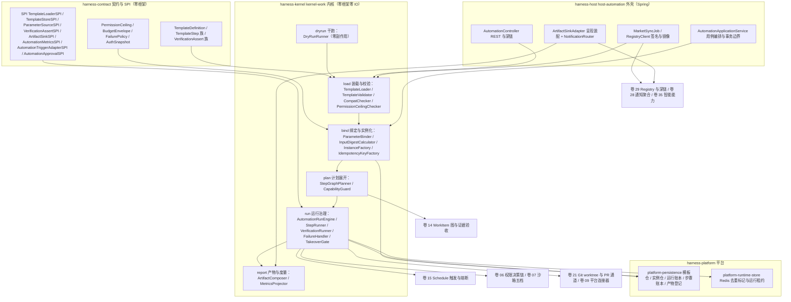
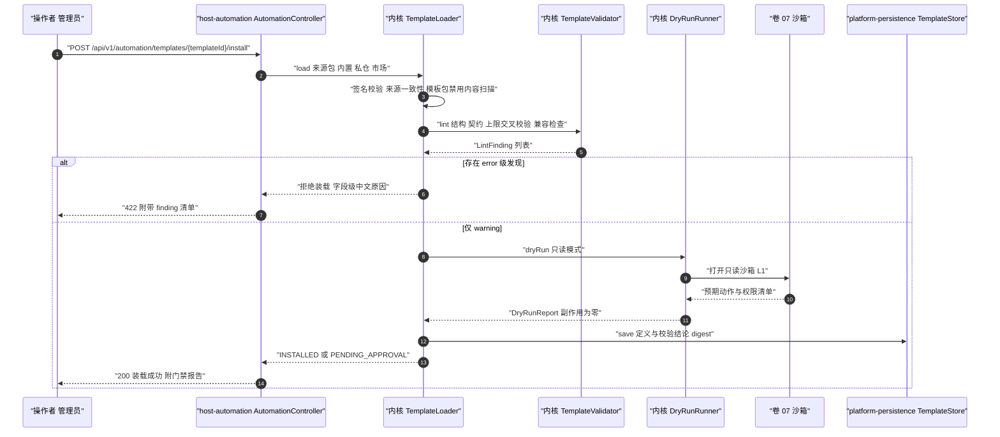
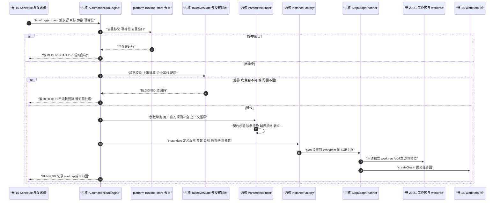
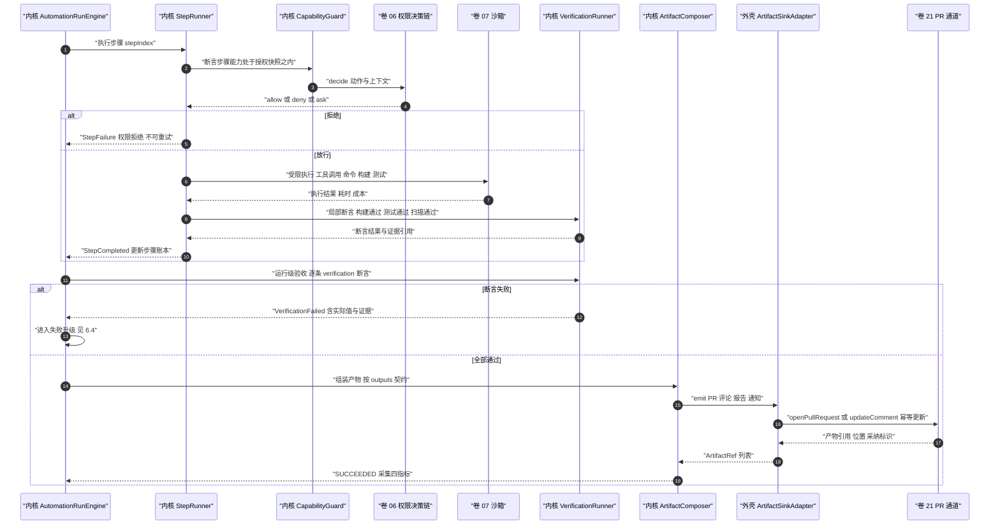
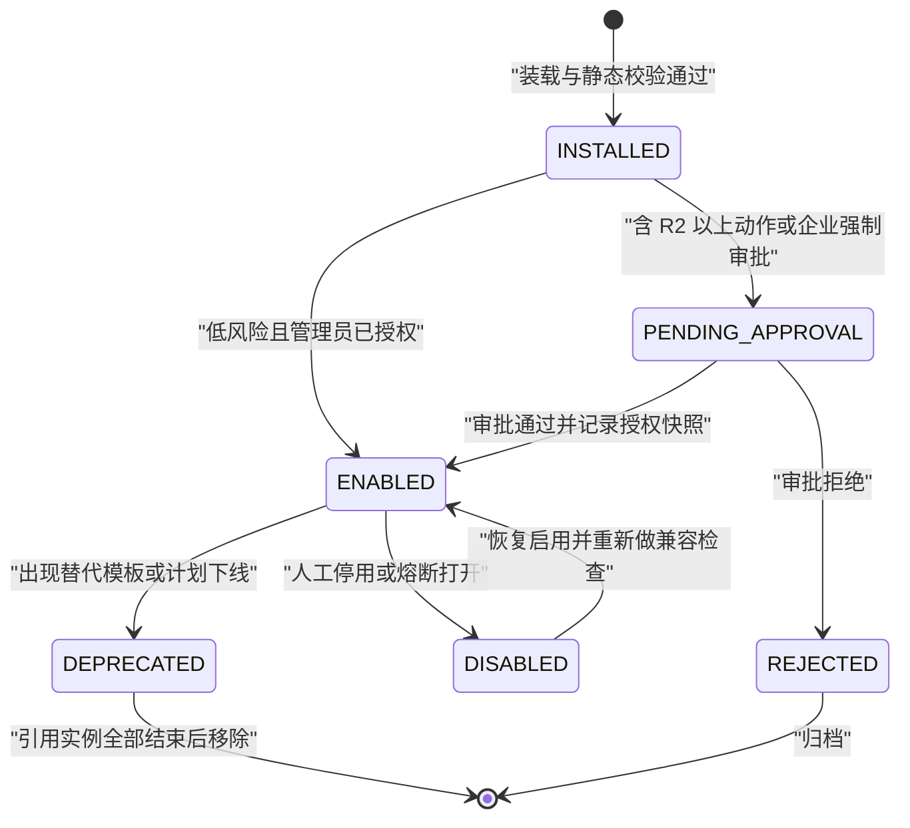
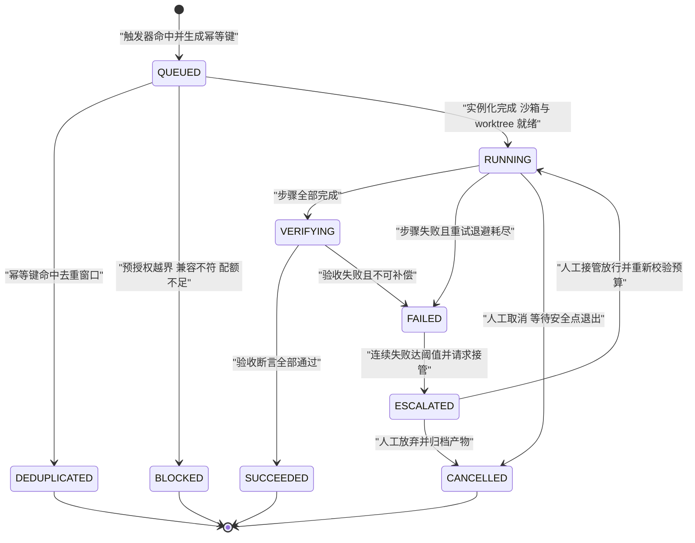

# 实现方案 31 · 自动化模板库（Automation Library Implementation）

> 本文件是 Phase B 实现层方案，对应 Phase A 卷 34（`docs/harness/34-automation-templates.md`）的域内决策 D-AUTO-1…8，并落回
> 卷 15（Schedule 触发面与幂等/熔断）、卷 14（WorkItem 图与证据验收）、卷 13（团队扇出）、卷 12（受限 Turn）、卷 06/07（权限决策链与沙箱五档）、
> 卷 19（持久化）、卷 21（Git 与 worktree）、卷 28（通知聚合）、卷 29（Registry 与深链）、卷 35（智能能力）的既有契约。
>
> **研究台账落点**：`research/LESSONS-AND-ADOPTIONS.md` **L-046**（Recipe / 模板 = 可调度资产，Goose `[E1]`；风险项「响应 schema 与验收标准须统一」在本文件以
> 「输入/输出双契约 + 验收断言直接引用输出 schema」闭环）。**关联引用**（不占用落点，仅作为约束输入）：L-045（调度稳定 jitter / 锁 / 过期 / 上限）、
> L-047（规格驱动：验收标准必填）、L-042（完成信号双口径：工具 + 事件）、L-052（已发布事件 code 只增不改）。
>
> **竞品证据**：`research/competitors/09-secondary-tier.md` §2.5（Goose `recipe/mod.rs:43-210` 字段集、`scheduler.rs:275-320` cron + 深链、`scheduled_recipes/` 副本校验）；
> `research/competitors/04-deepseek-harness.md`（`workflow` 工具扇出且子调用重入完整受守卫管线、PTC `maxParallelSubCalls`、`ctx.webhookRuntime.register(rule)/dispatch(delivery)`、
> `schedule` 显式时区与最小间隔、审批结果集封闭与 fail-closed）；`research/competitors/01-claude-code-purpose-built.md`（27–31 钩子点、五形态、`PermissionRequest` 放行前重跑规则校验、斜杠命令并入 Skill）。
>
> 上游契约不可修改：凡与 Phase A 表述冲突之处，本文件只记录「反驳证据 + 建议修订」（§⑩.10），不改 Phase A 卷册。
> 实现落点：`harness-contract/.../contract/automation/`（契约与 SPI）+ `harness-kernel/kernel-work/.../work/automation/`（装载、校验、实例化与运行裁决，零框架零 IO）
> + `harness-platform/platform-persistence`（模板仓与运行账本）+ `harness-platform/platform-runtime-store`（Redis 去重标记与运行租约）
> + `harness-host/host-automation`（Spring 外壳：REST、市场同步、呈现器与通知装配）。

---

## ① 实现目标与范围

### 1.1 本组件解决什么

1. **模板引擎**：把声明式模板（YAML + 契约 schema）解析为内核可执行的定义对象；装载期完成结构校验、字段级中文报错、兼容检查与权限上限交叉校验，非法即拒（Fail-Fast）。
2. **契约化输入输出**：`inputs[]` 与 `outputs[]` 是同一份契约的两面——前者驱动参数绑定与校验，后者驱动验收断言与产物落位，杜绝「响应 schema 与验收标准两套契约」。
3. **既有系统绑定**：模板不新造执行路径——`triggers[]` → 卷 15 `TriggerSpec`；`target` → `TriggerTarget.TEMPLATE`；`steps[]` → 卷 14 WorkItem 图（含 `for-each` 动态扇出与团队扇出）；`permissions` → 卷 15 预授权 + 卷 06 决策链；每步执行 = 一次能力收窄的受限 Turn。
4. **不可自我提权**：三层权限校验（装载期静态、实例化期快照、动作期决策链）+ 上限清单 + 能力单调收窄不变量；模板请求 `force-push`/生产写/密钥读取/权限修改在装载期即被拒并产安全事件。
5. **运行治理**：幂等键去重、预算四项硬上限、四级失败升级与人工接管、产物幂等更新（评论更新而非重复创建）、真实运行的呈现与通知聚合。
6. **模板市场与版本升级**：三层来源（内置 / 组织私仓 / 签名市场）、签名与准入、离线镜像、兼容结论与实例影响面；升级不自动迁移运行中实例。
7. **效果度量**：由事件与计量派生的四指标（节省人力时长、发现问题数、产物采纳率、单位成本），带数据缺口标记，接入卷 26 门禁矩阵。

### 1.2 与 Phase A 的对应关系

| Phase A 决策 | 本文件落实位置 |
| --- | --- |
| D-AUTO-1 YAML + Schema 校验 + 受限步骤白名单 | §③ I-AUTO-1、§⑤ `TemplateLoader` / `TemplateValidator` / `sealed TemplateStep` |
| D-AUTO-2 五类触发器统一 + 深链 | §⑥.2、§⑨ REST 与深链端点、§⑧ `oc_automation_instance` 触发源字段 |
| D-AUTO-3 预授权清单 + 上限 + 基线钳制 | §③ I-AUTO-4、§⑤ `PermissionCeiling` / `AuthSnapshot`、§⑥.2 预授权网闸、§⑧ `oc_automation_preauth` |
| D-AUTO-4 输入/输出双契约 | §③ I-AUTO-3、§⑤ `InputField` / `OutputContract` / `VerificationAssert`、§⑥.3 验收 |
| D-AUTO-5 内置 + 私仓 + 签名市场 | §③ I-AUTO-7、§⑥.5 市场安装与升级、§⑨ 配置项 `open-coding.automation.market.*` |
| D-AUTO-6 模板级档位 + 运行配额 + 独立 worktree | §③ I-AUTO-5、§⑤ `BudgetEnvelope`、§⑥.2 环境准备、§⑧ `oc_automation_run.budget` |
| D-AUTO-7 四级失败升级 + 人工接管 | §⑥.4、§⑦.2 运行状态机、§⑨ `AutomationApprovalSPI` |
| D-AUTO-8 门禁 + 四指标 | §⑥.1 发布门禁、§⑧.4 指标、§⑩.8 可观测 |
| 卷 15 D-SCH-1…7（触发器/幂等/jitter/熔断） | §⑥.2（全部委托卷 15，本组件不重复实现）、§⑤.2 绑定矩阵 |
| 卷 14 D-TASK-2/7（DAG 与证据验收） | §⑤.2 绑定矩阵、§⑧ `oc_automation_step_run.task_ref` |
| 卷 21 D-GIT-2（按需隔离） | §⑥.2 环境准备、§⑩.6 安全（禁 force-push、独立分支） |
| 卷 28 D-DIST-10（通知聚合） | §⑥.3 呈现、§⑨ `ArtifactSinkSPI` |

### 1.3 本组件不解决什么

- **不解决**触发求值、jitter、幂等唯一约束、并发策略与熔断状态机：全部委托卷 15；本组件只负责「模板声明 → `ScheduleDefinition`」的映射与实例化。
- **不解决**任务状态机与 DAG 求解：步骤展开为 WorkItem 后由卷 14 推进；本组件只读任务状态并驱动失败策略。
- **不解决**权限裁决与沙箱技术：本组件只做「声明上限、生成快照、断言收窄」，裁决归卷 06，隔离归卷 07。
- **不解决**生成类智能能力：PR 描述、测试生成、Flaky 归类、文档漂移检测等一律调用卷 35 提供的工具/技能。
- **不解决**通知传输与平台 API 细节：通知走卷 28 聚合中心，仓库平台访问走卷 09 MCP 连接器与卷 21 通道。

### 1.4 上下游依赖

| 方向 | 依赖对象 | 接口 |
| --- | --- | --- |
| 上游 | 调度（卷 15） | `SchedulePort.register(ScheduleDefinition)`、`RunTriggerEvent`（含触发源与幂等键） |
| 上游 | 任务（卷 14） | `WorkItemPort.createGraph(StepGraphSpec)` / `stateOf(taskRef)` / `markEvidence(...)` |
| 上游 | 权限（卷 06） | `PermissionPort.decide(ActionRequest, AuthSnapshot)`；越界以 `AUTOMATION_PREAUTH_DENIED` 返回 |
| 上游 | 沙箱（卷 07） | `SandboxPort.open(ProfileRef, BudgetEnvelope)`；档位来自模板声明 |
| 上游 | 工作区与 Git（卷 20/21） | `WorkspacePort.worktreeFor(runId)`、`CommitPort.openPullRequest(PrRequest)` |
| 上游 | 模型（卷 02） | 报告生成、归类、摘要类调用；不可用时按 §⑩.5 降级（可写模板直接失败，不产半成品） |
| 上游 | 事件（卷 16） | `EventPort.append`（`automation.*` 全量事件，分区键 = `runId`）；已发布 code 只增不改（L-052） |
| 上游 | 持久化（卷 19） | `TemplateStore` / `InstanceStore` / `RunLedger` / `StepLedger` / `ArtifactStore` 端口 |
| 下游 | 通知（卷 28） | `NotificationPort.notify(route, message)`；聚合键 = `(模板, 目标, 判定)` |
| 下游 | 市场（卷 29） | `RegistryClient.fetchTemplate(templateId, version)`、签名与来源校验；离线镜像目录 |
| 下游 | 智能能力（卷 35） | 通过工具/技能调用；模板声明 `compat.requiresSkills[]`，缺失即装载期拒绝 |
| 下游 | 评测（卷 26） | 门禁项「自动化模板」：12 模板干跑 + 断言；度量回归基线 |

### 1.5 模块落点

**落地登记（R07：模块 / 顺序 / 批次；清单见 `reviews/R07-scope-build-platform.md`）**：
- **模块坐标**：`harness-contract`（包 `contract/automation`）+ `harness-kernel/kernel-work`（子包 `work/automation`，复用第 14 步模块，不新增内核模块）+ `harness-platform/{platform-persistence,platform-runtime-store}` + `harness-host/host-automation`（**扩展模块**：卷 27 §4.1 `host-*` 未列，待登记；亦可先落 `host-app` + `host-protocol` 的 `automation.*` 面）。
- **实施顺序（卷 27 §4.5）**：第 **17** 步（Skill 装载/激活邻域，依赖第 4/14 步）→ 第 **19** 步（Teams/Goal/Schedule 自治编排，依赖 14/16/18）之间；运行引擎需要租约与幂等（第 14 步 WorkItem + 第 9 步持久化），因此**不得早于第 14 步**。与 `32` 的接缝：自动化模板的「智能增强触发」属 `32` 侧，本文件只提供触发器端口。
- **数据迁移批次**：`oc_automation_*` 未在卷 27 §4.4 明列（B6 仅含插件/Skill/Hook/MCP）→ 建议新批次 **B10 自动化、智能增强与前沿实验**（与本文件 + `32` + `35` 同批）；未映射项已登记 R07 §2。
- **I- 决策落点**：`I-AUTO-1…8`（8 条）模块落点为上表；类级落点见 §⑤（`AutomationRunEngine`/`StepGraphPlanner`/`DryRunRunner`），逐条绑定登记为 R07 建议 S4。

```text
harness-contract/.../contract/automation/   枚举 StepKind/ActionType/RiskLevel/RunState/TemplateLifecycle/FailureTier；
                                            sealed TemplateStep 族与 VerificationAssert 族；
                                            record TemplateDefinition/InputField/OutputContract/PermissionCeiling/BudgetEnvelope/
                                                   FailurePolicy/Compatibility/InstanceBinding/AuthSnapshot/StepGraphSpec；
                                            SPI TemplateLoaderSPI/TemplateStoreSPI/ParameterSourceSPI/VerificationAssertSPI/
                                                ArtifactSinkSPI/AutomationMetricsSPI/AutomationTriggerAdapterSPI/AutomationApprovalSPI
harness-kernel/kernel-work/.../work/automation/
    load/     TemplateLoader、TemplateValidator、TemplateLintChain、CompatChecker、PermissionCeilingChecker
    bind/     ParameterBinder、InputDigestCalculator、InstanceFactory、IdempotencyKeyFactory
    plan/     StepGraphPlanner（步骤 → WorkItem 图 + 扇出上限）、CapabilityGuard
    run/      AutomationRunEngine、StepRunner、VerificationRunner、FailureHandler、TakeoverGate
    report/   ArtifactComposer（PR/评论/报告/通知）、MetricsProjector（四指标）
    dryrun/   DryRunRunner（严格只读：预期动作与权限清单，零副作用）
    state/    纯内存聚合与迁移表（可重放）
harness-platform/platform-persistence/.../   TemplateRepository、InstanceRepository、RunLedgerRepository、StepLedgerRepository、ArtifactRepository
harness-platform/platform-runtime-store/.../ AutomationDedupStore（Redis 去重标记）、RunLeaseStore（运行租约）
harness-host/host-automation/.../           AutomationController（REST）、MarketSyncJob、RegistryClient、ArtifactSinkAdapter、NotificationRouter
```

**纪律**：`kernel-work/automation` 不得依赖 Spring、存储与平台模块（零框架零 IO，端口注入）；`host-automation` 属外壳，负责装配与协议；DB 版 SPI 实现住 `platform-persistence`，由 bootstrap 以 `@ConditionalOnMissingBean` 优先装配。

## ② 功能需求清单（REQ-AUTO-n）

> **编号约定（R02 明确）**：`REQ-AUTO-1…16` **严格指代**卷 34 §2 的同号需求（逐号语义一致，本表只做实现侧细化与验收加强）；`REQ-AUTO-17/18` 为本文件新增的 impl 层需求（卷 34 无同号）。引用卷 34 需求时写全称「卷 34 REQ-AUTO-n」，引用本文件新增项写 `REQ-AUTO-17/18`，两者不混用。

| 需求 | 描述 | 来源 | 优先级 | 验收要点 |
| --- | --- | --- | --- | --- |
| REQ-AUTO-1 | 模板即一等资产（声明、版本、来源、导出导入） | 卷 34 §2；轮次 8 | P0 | 导出包单文件、可校验、可导入；`provenance`/`version` 可查 |
| REQ-AUTO-2 | 装载期 Fail-Fast（缺 `steps`/`verification`/`permissions`/`budget` 即拒） | 卷 34 §2/§9 | P0 | 字段级中文原因 + `automation.template.install.rejected` 事件 |
| REQ-AUTO-3 | 五类触发器 + 深链发起（签名 + 二次确认 + 最小间隔约束） | 卷 15 D-SCH-1/2；Goose `scheduler.rs` `[E1]`；DeepSeek `schedule` 显式时区与 ≥5 分钟 `[E1]` | P0 | 深链未签名/未确认即拒；最小间隔缺省 5 分钟 |
| REQ-AUTO-4 | 输入/输出双契约，验收断言引用输出 schema | Goose `Recipe.parameters/response` `[E1]`（L-046）；L-047 | P0 | 参数越界字段级提示；断言与 schema 字段机械对齐 |
| REQ-AUTO-5 | 预授权 + 上限 + 不可自我提权（三层校验 + 单调收窄） | 卷 06 D-PERM-1/6；卷 34 §5.7 | P0 | 越权模板装载被拒；运行期越权抛业务异常并产安全事件 |
| REQ-AUTO-6 | 幂等去重（四层：触发/实例/产物/预算） | 卷 15 D-SCH-3；卷 34 §5.2 | P0 | 重复触发不产生第二份产物；`automation.run.deduplicated` 可查 |
| REQ-AUTO-7 | 四级失败升级 + 人工接管（含接管 SLA 与积压熔断） | 卷 15 D-SCH-6；DeepSeek 审批 fail-closed `[E1]` | P0 | 四级各有用例；接管通道缺失时 fail-closed（不放行） |
| REQ-AUTO-8 | 产物与呈现（PR/评论/报告/通知，幂等更新） | 卷 34 §5.8；卷 28 D-DIST-10 | P1 | 同 PR 评论为更新；通知按级别路由且可静默 |
| REQ-AUTO-9 | 四指标度量与缺口标记 | 卷 34 §5.8；卷 26 门禁 | P1 | 指标可查且缺基准时标「估算」；缺口 > 20% 降级为运行级统计 |
| REQ-AUTO-10 | 市场与升级（签名 + 兼容结论 + 不自动迁移实例） | 卷 29 Registry；卷 18 D-PLG-5 | P1 | 强制模式下未签名被拒；升级报告含实例影响面 |
| REQ-AUTO-11 | 发布门禁（干跑 + 沙箱试运行 + 产出断言，零副作用） | 卷 34 §9；卷 26 | P0 | 干跑副作用断言为零；门禁未过不可 `ENABLED` |
| REQ-AUTO-12 | 默认只提 PR 不合并 + 独立 worktree/分支 | 卷 21 D-GIT-2 | P0 | 自动化运行永不推主干；合并由人或 CI |
| REQ-AUTO-13 | 组合编排：链式 + 团队扇出（子调用重入受守卫管线） | DeepSeek `workflow` / PTC `[E1]`；卷 13；卷 34 §5.3 | P1 | 扇出上限入预算；每个子调用独立权限裁决与审计 |
| REQ-AUTO-14 | 全量审计与内容外发管控 | 卷 24 三级审计；卷 30 §4.7 | P0 | 运行可回放；未声明通道的外发被拒并产安全事件 |
| REQ-AUTO-15 | 入站触发适配器（Webhook / IM / CI 回调） | DeepSeek `ctx.webhookRuntime` `[E1]` | P2 | 未注册来源被拒；适配器不影响权限上限 |
| REQ-AUTO-16 | 复用 hooks/skills 作为扩展底座，不自建第二套 | Claude Code hooks 五形态 + 命令并入 Skill `[E1][E2]`；卷 17/08 | P2 | 关键节点经卷 17 既有钩子暴露；能力以工具/技能形式提供 |
| REQ-AUTO-17 | 模板可观测面（模板详情展示触发/权限/预算/失败策略/度量五项） | 卷 33 文案与状态矩阵 | P1 | 五项齐备；空态/错误态文案符合卷 33 |
| REQ-AUTO-18 | 模板包不得携带安装脚本/构建钩子/网络下载 | 卷 30 供应链；D-AUTO-1-B2 | P0 | 含此类内容的包在装载期拒绝并产安全事件 |
| REQ-AUTO-19 | **用户可控面四件套（R06 新增）**：每项自动化能力必须**可发现**（CLI 动词 + TUI 命令面板同名 + 桌面「自动化」面板三处可达）、**可取消**（安全点退出，保留已发布产物）、**可解释**（为什么跑 / 为什么不跑 / 为什么被拦：触发源、幂等命中、预授权裁决、步骤与断言、失败层级逐条可读）、**成本可见**（运行前预估区间 + 运行中当前成本 + 结束后结算与配额剩余） | 卷 34 §5/§9；卷 33 §2（六态与文案）；`30-interaction-ux-impl.md` §7.1 自动化模板库行 | P0 | 四个控制各有一条端到端用例；三处入口的命令名一致（同名映射测试）；取消后产物与账本一致；解释字段齐套且在 `--json` 与人类输出中同源；成本三处与 `oc_automation_cost_usd_total` 对账一致 |

> **竞品派生的增量需求**（≥2 条，逐条给证据）：REQ-AUTO-3（Goose cron + 深链 + DeepSeek 显式时区与最小间隔）、REQ-AUTO-4（Goose recipe 参数与响应 schema）、REQ-AUTO-13（DeepSeek `workflow` 扇出与 PTC 子调用重入守卫）、REQ-AUTO-15（DeepSeek `webhookRuntime.register/dispatch`）、REQ-AUTO-16（Claude Code hooks 与 Skill 化命令）。

## ③ 技术方案选型（M×N 比选）

### 3.1 八维分叉矩阵（每维 3 分支；权重 F30 / U20 / S25 / M25）

**分叉 1 · 模板解析与契约校验实现**

| 分支 | 描述 | 优点 | 代价与风险 | 得分 |
| --- | --- | --- | --- | --- |
| **B1 Jackson YAML 数据绑定 + 自研静态校验器（Schema 子集 + 中文错误映射）** | 内核零框架：`YAMLMapper` 映射到 record，校验器只做结构性规则 | 离线可测、错误文案可控、无运行时代码求值 | 校验器需自建与维护 | **85.5** |
| B2 复用 Spring Boot `ConfigurationProperties` 绑定 | 复用成熟绑定 | 内核被迫依赖 Spring，违反铁律 | 淘汰 | 69.0 |
| B3 引入完整 JSON Schema 库 + 反射绑定 | 标准完备 | 依赖重、错误信息英文化、版本升级耦合 | 校验策略受制于库 | 74.5 |

**分叉 2 · 运行宿主与展开方式**

| 分支 | 描述 | 优点 | 代价与风险 | 得分 |
| --- | --- | --- | --- | --- |
| **B1 展开为 WorkItem 图，交给卷 14（Schedule 只做触发）** | 步骤天然获得状态机、证据、看板与恢复能力 | 依赖卷 14 契约稳定 | 无第二执行引擎 | **85.5** |
| B2 自建独立运行引擎 | 自由度高 | 与卷 14 状态机/证据/恢复功能重复，双份运维 | 恢复语义难以对齐 | 63.0 |
| B3 每步一个会话，无任务图 | 实现最轻 | 无依赖关系、无证据、不可续跑 | 与 REQ-AUTO-11 冲突 | 61.5 |

**分叉 3 · 参数与产出契约实现**

| 分支 | 描述 | 优点 | 代价与风险 | 得分 |
| --- | --- | --- | --- | --- |
| **B1 JSON Schema 子集 + 自研校验器 + 中文错误映射** | 与分叉 1 同源、可离线测试、错误可定位到字段 | 需覆盖类型/枚举/范围/必填/正则五类规则 | 不追求 schema 全语义 | **85.0** |
| B2 Jakarta Validation 注解式 | 复用 `@Valid` 生态 | 动态模板无法编译期注解，需运行时代理 | 与模板动态性错配 | 67.5 |
| B3 运行时脚本校验 | 表达力强 | 运行任意代码，违反 D-AUTO-1-B2 | 安全面失控 | 53.5 |

**分叉 4 · 权限校验分层**

| 分支 | 描述 | 优点 | 代价与风险 | 得分 |
| --- | --- | --- | --- | --- |
| **B1 三层：装载期静态校验 + 实例化期授权快照 + 动作期决策链** | 越权在最早处被拦；快照可审计；动作仍走决策链 | 声明生成需向导预填 | 三处口径须同源 | **85.5** |
| B2 两层（装载期 + 动作期） | 略轻 | 实例化缺「谁授了什么权」的快照，无人值守审计断链 | 审计不完整 | 80.0 |
| B3 仅动作期 | 最简 | 越权模板可长期存在，事故后才被发现 | 无法满足 REQ-AUTO-5 | 64.5 |

**分叉 5 · 步骤执行隔离粒度**

| 分支 | 描述 | 优点 | 代价与风险 | 得分 |
| --- | --- | --- | --- | --- |
| **B1 整运行单沙箱会话 + 步骤级能力收窄** | 一次环境准备、步骤间状态一致（构建产物可复用）；能力仍单调收窄 | 需要严格的能力断言保护 | 沙箱会话成为单点 | **80.0** |
| B2 每步独立沙箱会话 | 步骤间强隔离 | 环境准备开销 × 步骤数，构建缓存失效 | 与「构建 → 测试」链路冲突 | 74.0 |
| B3 运行内共享宿主进程（无沙箱） | 性能最好 | 违反卷 07 铁律 | 直接淘汰 | 37.5 |

**分叉 6 · 产物提交通道**

| 分支 | 描述 | 优点 | 代价与风险 | 得分 |
| --- | --- | --- | --- | --- |
| **B1 复用卷 21 提交/PR 通道 + 卷 09 平台连接器** | 分支/提交/PR/评论统一护栏（禁 force-push、三层审查） | 依赖通道能力矩阵 | 与交互会话共用同一通道 | **85.5** |
| B2 模板内置平台 API 调用 | 灵活 | 绕过卷 21 护栏、双份凭据管理 | 安全与合规风险 | 60.5 |
| B3 仅本地文件产物 | 最简单 | 「提 PR」类模板失去价值 | 无法满足 12 模板族 | 57.0 |

**分叉 7 · 模板仓与市场同步**

| 分支 | 描述 | 优点 | 代价与风险 | 得分 |
| --- | --- | --- | --- | --- |
| **B1 Registry 服务端 + 客户端缓存 + 离线镜像 + 签名校验** | 三层来源统一、可离线、可审计 | 需维护签名信任根与镜像目录 | 同步失败须降级可用 | **83.0** |
| B2 直接 Git 拉取模板仓 | 无需服务端 | 无签名/准入/版本协商，供应链风险高 | 企业不可接受 | 67.5 |
| B3 本地文件安装 | 离线友好 | 无组织分发能力 | 与 D-AUTO-5-B3 冲突 | 59.5 |

**分叉 8 · 度量采集实现**

| 分支 | 描述 | 优点 | 代价与风险 | 得分 |
| --- | --- | --- | --- | --- |
| **B1 事件流派生（卷 16）+ 计量归因（卷 31）+ 离线聚合** | 与审计同源、可回放、可对账 | 需指标口径与缺口规则 | 聚合滞后于运行 | **83.5** |
| B2 运行账本直查聚合 | 实时 | 与事件流双份口径，易漂移 | 无法支撑门禁回归 | 72.5 |
| B3 独立埋点 SDK | 灵活 | 三套数据源、合规审查面扩大 | 与卷 16「一切皆事件」冲突 | 53.0 |

### 3.2 实现级决策登记（I-AUTO-1…8）

| ID | 主题 | 选定 | 理由与代价 | 回退触发 |
| --- | --- | --- | --- | --- |
| I-AUTO-1 | 模板解析与校验 | Jackson YAML 数据绑定 + 自研 Schema 子集校验器（内核零框架，端口注入） | 离线可测、错误中文可控；代价是校验器自建 | 校验器误报率 > 2% → 引入成熟 Schema 库并保留中文错误映射层 |
| I-AUTO-2 | 运行宿主 | 展开为 WorkItem 图交卷 14；Schedule 只做触发与治理 | 一套状态机与证据体系；代价是依赖卷 14 契约稳定 | 卷 14 状态机变更导致展开语义破坏 → 引入适配层（`StepGraphSpec` 版本化） |
| I-AUTO-3 | 输入/输出契约 | JSON Schema 子集（类型/枚举/范围/必填/正则）+ 输出 schema 与验收断言共键 | 一处契约两处用；代价是模板作者需写契约 | 输出契约表达力不足 → 允许 `freeform` 输出但断言仍须引用结构化字段 |
| I-AUTO-4 | 权限分层 | 三层校验 + `AuthSnapshot` + `CapabilityGuard` 单调收窄断言 | 越权最早拦截且可审计；代价是快照刷新逻辑 | 快照刷新遗漏导致误拒 → 改为「快照 + 首动作二次确认」 |
| I-AUTO-5 | 执行隔离 | 整运行单沙箱会话 + 步骤级能力收窄 + 每运行独立 worktree/分支 | 构建缓存复用、状态一致；代价是沙箱单点 | 单运行超 60min 且步骤互相污染 → 允许模板声明 `isolateSteps: true`（每步独立会话） |
| I-AUTO-6 | 产物通道 | 复用卷 21 提交/PR 通道 + 卷 09 连接器；产物幂等更新键 `(模板, 目标, 幂等键)` | 统一护栏与审查；代价是通道能力依赖 | 通道缺评论更新能力 → 降级为「删除旧评论 + 新建」并记录降级事件 |
| I-AUTO-7 | 市场与版本 | Registry + 签名 + 客户端缓存 + 离线镜像；升级给出兼容结论与实例影响面 | 企业可控且离线可用；代价是信任根运维 | 市场不可用 > 7 天 → 强制离线镜像模式并告警 |
| I-AUTO-8 | 度量采集 | 事件流派生 + 计量归因 + 离线聚合；缺口标记与降级阈值 | 与审计同源、可回放；代价是聚合滞后 | 缺口 > 20% → 降级为运行级统计（次数/成功率/成本），取消节省时长估算 |

### 3.3 与竞品对照的取舍（research 证据）

| 对照维度 | 竞品证据 | 我们的取舍 | 主动放弃的收益 |
| --- | --- | --- | --- |
| 模板资产形态 | Goose `Recipe{parameters,response,sub_recipes}` + `schedule.json` + 深链（L-046/S12）[E1] | 采纳字段集并升级为「输入/输出双契约 + 12 内置模板库」（I-AUTO-3；REQ-AUTO-4/11） | 模板作者需写契约，上手门槛高于 Goose 的自由 prompt 形态 |
| 编排脚本化 | DeepSeek `workflow` 工具（`agent()/parallel()/pipeline()`）与 PTC `run_code` `[E1]`；L-026 要求「子调用重入完整受守卫管线 + 显式限额」 | 采纳为「受限步骤类型 + 每子调用独立权限裁决与审计」（I-AUTO-2/5；REQ-AUTO-13） | 不做任意脚本编排，牺牲模板表达力换取可审计性 |
| 触发与调度 | Goose cron + deeplink [E1]；DeepSeek `schedule` 显式时区与 ≥5 分钟最小间隔 [E1] | 全采纳并加「签名 + 二次确认」深链纪律（REQ-AUTO-3） | 秒级轮询类触发被明确禁止（防抖动风暴） |
| 权限治理 | Claude Code hooks 五形态 + `PermissionRequest` 钩子不可绕过 deny [E1/E2]；L-058 托管收窄 | 采「预授权上限 + 单调收窄 + 不自建钩子体系」（I-AUTO-4；REQ-AUTO-5/16） | 模板无法自带钩子/脚本，扩展只能走 SPI 与既有 hooks |
| 市场与信任 | Goose `extension_malware_check` 准入 [E1]；MiniMax 社区插件独立仓 [E1]；卷 29 Registry 契约 | 采「签名强制 + 兼容结论 + 不自动迁移实例」（I-AUTO-7；REQ-AUTO-10） | 市场便利性下降（未签名包在强制模式下直接拒载） |

## ④ 总体架构图



**装配点（Spring）**：`host-automation` 以 `@ConfigurationPropertiesScan` 激活 `open-coding.automation.*`（纯数据类不加 `@Component`）；DB 版 SPI 实现在 `platform-persistence`，由 bootstrap 以 `@ConditionalOnMissingBean` 优先装配；`AutomationApplicationService` 承担事务边界，内核引擎不持有事务。

## ⑤ 类图与关键契约

```mermaid
classDiagram
  class TemplateDefinition {
    <<record>>
    +String templateId
    +String version
    +List~TemplateStep~ steps
    +PermissionCeiling permissions
    +BudgetEnvelope budget
  }
  class TemplateStep {
    <<sealed interface>>
    +StepKind kind()
    +Set~ActionType~ requires()
  }
  class VerificationAssert {
    <<sealed interface>>
  }
  class TemplateValidator {
    +lint(TemplateDefinition) List~LintFinding~
  }
  class TemplateLoader {
    +load(TemplateSource) LoadedTemplate
  }
  class InstanceFactory {
    +instantiate(LoadedTemplate, InstanceBinding, AuthSnapshot) TemplateInstance
  }
  class AuthSnapshot {
    <<record>>
    +String grantedBy
    +Set~ActionType~ actions
  }
  class StepGraphPlanner {
    +plan(TemplateInstance) StepGraphSpec
  }
  class AutomationRunEngine {
    +start(TemplateInstance, TriggerContext) TemplateRun
    +takeover(String runId, TakeoverDecision) TemplateRun
  }
  class CapabilityGuard {
    <<utility>>
    +assertWithin(Set~ActionType~, Set~ActionType~, String) void
  }
  class FailureHandler {
    +handle(StepFailure, FailurePolicy) FailureAction
  }
  class ArtifactComposer {
    +compose(TemplateRun, List~OutputContract~) List~Artifact~
  }
  class MetricsProjector {
    +project(String templateId) AutomationMetrics
  }
  class TemplateStoreSPI {
    <<interface>>
    +save(TemplateDefinition) void
    +findById(String, String) Optional~TemplateDefinition~
  }
  class ArtifactSinkSPI {
    <<interface>>
    +emit(Artifact) ArtifactRef
  }
  TemplateDefinition "1" o-- "*" TemplateStep
  TemplateDefinition "1" o-- "*" InputField
  TemplateDefinition "1" o-- "*" VerificationAssert
  TemplateStep <|-- DetectStep
  TemplateStep <|-- FilterStep
  TemplateStep <|-- ForEachStep
  TemplateStep <|-- ApplyStep
  TemplateStep <|-- RunStep
  TemplateStep <|-- VerifyStep
  TemplateStep <|-- OpenPrStep
  TemplateStep <|-- ReportStep
  VerificationAssert <|-- SchemaAssert
  VerificationAssert <|-- CommandAssert
  VerificationAssert <|-- ScanAssert
  VerificationAssert <|-- ArtifactAssert
  TemplateLoader --> TemplateValidator
  TemplateLoader --> TemplateStoreSPI
  InstanceFactory --> StepGraphPlanner
  AutomationRunEngine --> InstanceFactory
  AutomationRunEngine --> FailureHandler
  AutomationRunEngine --> CapabilityGuard
  AutomationRunEngine --> ArtifactComposer
  AutomationRunEngine --> MetricsProjector
  ArtifactComposer --> ArtifactSinkSPI
```



### 5.1 关键 Java 21 签名（内核契约，零框架依赖）

```java
/**
 * 模板生命周期状态。
 * DB 存 code，前端传 code；desc 仅用于展示，禁止入库。
 */
@Getter
@RequiredArgsConstructor
public enum TemplateLifecycle {

    /** 已装载：静态校验通过，尚未启用 */
    INSTALLED("INSTALLED", "已装载"),

    /** 待审批：含 R2 以上动作或企业强制审批 */
    PENDING_APPROVAL("PENDING_APPROVAL", "待审批"),

    /** 已启用：可被触发器命中 */
    ENABLED("ENABLED", "已启用"),

    /** 已停用：人工停用或熔断打开 */
    DISABLED("DISABLED", "已停用"),

    /** 已弃用：不再新建实例，必须给出替代模板 */
    DEPRECATED("DEPRECATED", "已弃用"),

    /** 已拒绝：装载或审批被拒 */
    REJECTED("REJECTED", "已拒绝");

    private final String code;
    private final String desc;

    /**
     * 按业务码解析生命周期状态。
     *
     * @param code 事件或持久化携带的业务码（必填）
     * @return 对应生命周期状态
     * @throws HarnessException 未知 code；调用方必须拒绝装载，禁止按默认分支放行（契约/内核层带，见 §9.4 异常命名约定）
     */
    public static TemplateLifecycle of(String code) {
        for (TemplateLifecycle value : values()) {
            if (value.code.equals(code)) {
                return value;
            }
        }
        throw new HarnessException(ErrorCode.PARAM_INVALID, "未知模板生命周期：" + code);
    }
}
```

```java
/**
 * 模板步骤（sealed 族，受限枚举而非脚本）。
 * 新增步骤类型必须实现 {@code TemplateStepSPI} 并声明风险级别与权限需求，供装载期与权限上限做交叉校验。
 */
public sealed interface TemplateStep
        permits DetectStep, FilterStep, ForEachStep, ApplyStep, RunStep, VerifyStep, OpenPrStep, ReportStep {

    /**
     * @return 步骤类型（不可变，用于事件与审计）
     */
    StepKind kind();

    /**
     * @return 该步骤声明的动作需求（与模板权限上限交叉校验的输入；不得为空集合）
     */
    Set<ActionType> requires();
}
```

```java
/**
 * 模板定义（只读、版本化、可签名的 record，字段全集见卷 34 §5.1 与 §⑧ 表结构）。
 * 关键字段：{@code templateId/version}（身份与版本）、{@code riskLevel}（与 permissions 交叉校验）、
 * {@code inputs}（参数契约，含 behavior 标记）、{@code steps}（受限步骤序列）、{@code verification}（可机械判定的断言）、
 * {@code permissions}（预授权与上限）、{@code budget}（四项硬上限）、{@code failure}（四级策略）、{@code compat}（兼容区间）。
 */
public record TemplateDefinition(
        String templateId,
        String version,
        RiskLevel riskLevel,
        List<InputField> inputs,
        List<TemplateStep> steps,
        List<VerificationAssert> verification,
        PermissionCeiling permissions,
        BudgetEnvelope budget,
        FailurePolicy failure,
        Compatibility compat) {
}
```

```java
/**
 * 能力单调收窄守卫。
 * 不变量：步骤能力集 ⊆ 运行授权快照 ⊆ 实例化授予集；任何扩张视为模板自我提权未遂（安全事件）。
 */
public final class CapabilityGuard {

    private CapabilityGuard() {
    }

    /**
     * 断言步骤声明能力处于授权快照之内。
     *
     * @param granted      实例化时授予的动作集（必填）
     * @param stepRequired 当前步骤声明的动作集（必填）
     * @param runId        运行编号（用于安全事件与日志定位，必填）
     * @throws HarnessException 存在越权动作时抛出；文案含 runId 与越权动作清单（内核裁决器，零框架）
     */
    public static void assertWithin(Set<ActionType> granted, Set<ActionType> stepRequired, String runId) {
        Set<ActionType> escalated = new HashSet<>(stepRequired);
        escalated.removeAll(granted);
        if (!escalated.isEmpty()) {
            throw new HarnessException(ErrorCode.FORBIDDEN,
                    "模板步骤请求超出授权上限，runId=" + runId + "，越权动作=" + escalated);
        }
    }
}
```

**输入摘要计算器（`InputDigestCalculator`，见 §⑤ 类图）**：签名 `public static String digest(TemplateDefinition definition, Map<String, Object> boundInputs)`。只对影响运行行为的参数取摘要（模板定义以 `behavior=true` 显式标记），展示类参数（语言、汇报格式）不参与，避免「仅改格式即绕过去重」；实现按行为参数名做字典序排序后取 SHA-256，返回 64 位十六进制字符串；计算为纯函数，不得读取时钟或随机源（保证幂等键可重放）。

### 5.2 四系统绑定矩阵

| 绑定对象 | 契约映射 | 实现要点 | 不变量 |
| --- | --- | --- | --- |
| 卷 15 Schedule | `triggers[]` → `ScheduleDefinition.TriggerSpec`；`target` → `TriggerTarget.TEMPLATE`；`inputs` → `TargetInvocation.inputs`；`permissions` → `PreauthPolicy`；`budget` → 预算信封 | 注册时机：模板 `ENABLED` 时注册，`DISABLED`/`DEPRECATED` 时注销（注销异常须告警并重试） | 模板不得自建定时器；幂等键由本组件计算并交给卷 15 做唯一约束 |
| 卷 14 Task | 每个 `step` → 一个 WorkItem；`for-each` → 动态子 WorkItem；`verification` → 验收标准与证据 | 展开时写 `StepGraphSpec`，任务状态回读驱动失败策略与呈现 | 步骤能力集单调收窄；`verification` 未通过不得置「完成」（L-042 双口径） |
| 卷 13 Teams | `fanout: team` 步骤 → 团队运行；角色需求与并发度来自模板声明 | 扇出上限并入运行预算；团队产出必须回填 `outputs` 契约 | 团队子会话权限 ⊆ 运行授权快照（L-039 差集语义） |
| 卷 12 Agent | `apply`/`run` 步骤 = 一次受限 Turn（会话模板 + 能力收窄） | 步骤系统提示由模板 `steps[].prompt` 片段 + 内核基础提示组装；不复制主会话上下文 | 每步独立 `subagent_id` 与 logger 命名空间，事件可定位（L-041） |

## ⑥ 核心流程（三个时序图 + 两个文字流程）

### 6.1 模板装载与发布门禁



- **前置条件**：来源包已通过签名校验（市场与私仓强制）；模板 `compat` 命中当前内核契约版本。
- **主路径**：装载 → 静态校验 → 干跑（严格只读）→ 落库 → 进入 `INSTALLED`/`PENDING_APPROVAL`。
- **异常与补偿**：校验失败不落库（无半成品记录）；干跑打开沙箱失败 → 装载挂起并给「稍后重试」入口；落库失败重试 3 次后转人工。
- **幂等与并发**：`(templateId, version, digest)` 唯一；同版本重复装载为幂等（刷新结论），不同 digest 同版本拒绝（版本号必须自增）。

### 6.2 触发到实例化（含预授权网闸）



- **前置条件**：模板 `ENABLED`；实例存在且未暂停；许可证有效。
- **主路径**：去重（快速路径 Redis + 最终 DB 唯一约束）→ 预授权网闸 → 参数绑定 → 实例化（快照 + 预算）→ 环境准备 → 任务图提交。
- **异常与补偿**：`BLOCKED` 不消耗预算且保留「为什么没跑」的完整解释；工作区准备失败按失败策略重试退避，仍失败落 `FAILED`。
- **幂等与并发**：同实例串行（运行租约 + 单活跃运行约束）；跨实例并发受租户级并发上限与预算信封双重钳制；jitter 与错过触发处置由卷 15 负责。

### 6.3 单步执行、验收与产物提交



- **前置条件**：运行处于 `RUNNING`；worktree 与沙箱会话就绪；预算未耗尽。
- **主路径**：能力断言 → 权限裁决 → 沙箱执行 → 局部断言 → 步骤账本 → 运行级验收 → 产物组装与幂等落位 → 度量。
- **异常与补偿**：权限拒绝为不可重试失败；构建/测试失败可重试或降级；产物提交失败按幂等键重试，重复提交只更新不新建。
- **幂等与并发**：产物键 `(模板, 目标, 幂等键)`；成本上报幂等；步骤并发仅出现在 `for-each` 扇出且受上限约束。

### 6.4 失败升级与人工接管（文字流程，状态机见 §⑦.2）

**前置条件**：失败已归因（类别、步骤、证据）；`failure` 策略存在（缺省使用安全默认）。
**主路径（四级）**：① 可重试 → 退避重试（次数与间隔来自策略）；② 需换路 → 降级执行（如「升级依赖」降为「只出报告」）并记录降级决策；③ 不可恢复 → 丢弃分支与临时产物、保留报告、`FAILED` 并通知「不可恢复」；④ 连续失败达阈值 → 熔断打开、暂停该模板后续触发、向接管责任人发起「需处理」级请求（经卷 28 聚合，不静默）。
**异常与补偿**：接管通道不可用（通道缺失、责任人缺失、审批超时）→ **fail-closed**：保持 `ESCALATED` 并暂停后续触发，绝不放行（对齐 DeepSeek 审批结果集封闭、应答者缺失一律 `unavailable` 的 fail-closed 语义 `[E1]`）；超 `takeover-sla-minutes` 进入积压熔断（暂停模板 + 告警）。
**幂等与并发**：重试在同一步骤账本条目上累加 `attempt`；接管决定幂等（同决定重复提交只记一次）；人工取消等待当前步骤到达安全点退出（不强杀进程）。

### 6.5 市场安装与版本升级（文字流程）

**前置条件**：信任根已配置（企业可替换内部 CA）；离线镜像目录可用（可选）。
**主路径**：`MarketSyncJob` 拉取目录与签名元数据 → `TemplateLoader` 做签名校验、来源白名单与模板包内容扫描 → `CompatChecker` 比对内核契约与所需工具/技能 → 落库新版本并保留旧版本 → 输出「实例影响面报告」（引用旧版本的实例清单）→ 人工确认升级。
**异常与补偿**：签名失败或内容违规 → 拒绝并产安全事件；不兼容 → 拒绝并给替代版本建议；市场不可用 → 用缓存目录 + 离线镜像并标记「离线」，超 7 天告警；版本回退 → 旧版本定义保留，实例可显式降级。
**幂等与并发**：同 `(templateId, version, digest)` 重复同步幂等；升级与实例创建并发时以「实例绑定版本」为准，不产生半升级状态（运行中实例**不**自动迁移）。

## ⑦ 状态机

### 7.1 模板生命周期



约束：`DEPRECATED` 必须携带 `replacementTemplateId`；`ENABLED → DISABLED` 由熔断驱动时必须在事件中记录熔断原因；任何状态都不得跳过 `INSTALLED`（禁止「直接启用未校验模板」）。

### 7.2 运行生命周期



约束：终态不可逆；`ESCALATED` 为唯一可人工放行回到 `RUNNING` 的状态，且放行前必须重新校验预算与授权快照有效性；`BLOCKED` 与 `DEDUPLICATED` 不计入失败率（避免污染模板健康度）。

## ⑧ 数据模型

### 8.1 表（`oc_*`，全部含 `tenant_id` 与审计字段 `created_at/created_by/updated_at/updated_by`）

| 表 | 关键字段 | 索引与约束 |
| --- | --- | --- |
| `oc_automation_template` | `template_id`、`version`、`digest`、`lifecycle`、`risk_level`、`source`（BUILTIN/ORG_REPO/MARKET）、`signer`、`definition jsonb`、`compat jsonb`、`lint_summary jsonb`、`replacement_template_id` | `uk(template_id, version)`；`(tenant_id, lifecycle)`；`(tenant_id, source)` |
| `oc_automation_instance` | `instance_id`、`template_id`、`template_version`、`inputs jsonb`、`target_type`、`target_ref`、`auth_snapshot jsonb`、`budget jsonb`、`enabled`、`paused_reason`、`last_run_id`、`revision` | `uk(instance_id)`；`(tenant_id, template_id)`；`(tenant_id, target_ref)`；`revision` 乐观锁 |
| `oc_automation_run` | `run_id`、`instance_id`、`trigger_source`、`idempotency_key`、`state`、`cause`（含 PREAUTH_DENIED/DEDUPLICATED/CIRCUIT_OPEN/TAKEOVER_TIMEOUT）、`budget jsonb`、`cost jsonb`、`started_at`、`ended_at`、`step_count`、`artifact_count` | **`uk(tenant_id, idempotency_key)`**；`(tenant_id, state, started_at)`；`(instance_id, started_at desc)`；按月分区（`started_at`） |
| `oc_automation_step_run` | `step_run_id`、`run_id`、`step_index`、`step_kind`、`task_ref`、`attempt`、`state`、`actions jsonb`、`finding_summary jsonb`、`cost jsonb`、`started_at`、`ended_at` | `uk(run_id, step_index, attempt)`；`(run_id, started_at)` |
| `oc_automation_verification` | `verification_id`、`run_id`、`assert_kind`、`assert_ref`、`expected jsonb`、`actual jsonb`、`verdict`、`evidence_ref` | `uk(run_id, verification_id)`；`(tenant_id, verdict)` 部分索引 `verdict=FAILED` |
| `oc_automation_artifact` | `artifact_id`、`run_id`、`artifact_type`（PR/COMMENT/REPORT/NOTIFICATION/FILE）、`locator`、`idempotency_key`、`state`（CREATED/UPDATED/ADOPTED/REJECTED）、`adopted_at`、`revision` | `uk(tenant_id, artifact_type, idempotency_key)`；`(tenant_id, artifact_type, state)` |
| `oc_automation_preauth` | `record_id`、`run_id`、`action_type`、`decision`（ALLOW/DENY）、`policy_ref`、`reason`、`occurred_at` | `(run_id)`；`(tenant_id, decision, occurred_at)`（安全审计视图） |
| `oc_automation_metric` | `metric_id`、`template_id`、`tenant_id`、`period_start`、`period_end`、`runs_total`、`success_total`、`time_saved_minutes`、`findings_total`、`adopt_ratio`、`cost_usd`、`data_gap_ratio` | `uk(tenant_id, template_id, period_start)`；`(tenant_id, period_start)` |
| `oc_automation_market_source` | `source_id`、`url`、`trust_root_ref`、`last_synced_at`、`sync_state`、`catalog_digest` | `uk(source_id)`；`(tenant_id, sync_state)` |

**分区与保留**：`oc_automation_run` 与 `oc_automation_step_run` 按月分区，保留期默认 90 天（配置 `open-coding.automation.retention-days`）；`oc_automation_metric` 按季度聚合保留 3 年（成本口径对齐卷 31）；安全类记录（`oc_automation_preauth`）与审计事件不受保留期限制。
**对象存储前缀**：`oc-automation-report/{tenant}/{templateId}/{runId}/report.{md,json}`、`oc-automation-bundle/{tenant}/{templateId}/{version}/template.tar.zst`（导出包与市场包）、`oc-automation-evidence/{tenant}/{runId}/{verificationId}.json`。

### 8.2 Redis Key（统一 `RedisKeys` 工厂，禁止业务代码拼接）

| 语义 | Key 形态 | TTL |
| --- | --- | --- |
| 触发去重标记 | `RedisKeys.automationDedup(tenantId, idempotencyKey)` → `oc:auto:dedup:{tenant}:{key}` | 2 × 触发周期（封顶 24h）；DB 唯一约束为最终兜底 |
| 运行租约 | `RedisKeys.automationRunLease(runId)` → `oc:auto:run:lock:{run}` | 租约 30s，心跳每 10s 续租 |
| 实例串行锁 | `RedisKeys.automationInstanceLock(instanceId)` → `oc:auto:inst:lock:{inst}` | 运行期间持有，运行结束释放 |
| 模板定义缓存 | `RedisKeys.automationTemplateCache(tenantId, templateId, version, digest)` → `oc:auto:tpl:{tenant}:{id}:{ver}:{digest}` | 10 分钟（变更时主动失效） |
| 市场目录缓存 | `RedisKeys.automationMarketCatalog(sourceId, digest)` → `oc:auto:market:{src}:{digest}` | 1 小时；离线时以缓存继续可用 |
| 租户在飞计数 | `RedisKeys.automationTenantInflight(tenantId)` → `oc:auto:inflight:{tenant}` | 运行期间持有，结束释放（用于并发上限判定） |

**降级**：Redis 不可用 → 去重依赖 DB 唯一约束、租约退化为 PG advisory lock、并发计数退化为「DB 统计 + 保守上限」，功能不丢、时延变差；缓存层跳过并记录 WARN。

### 8.3 事件（`automation.*`，已发布 code 只增不改）

`automation.template.installed` / `.enabled` / `.disabled` / `.deprecated` / `.removed` / `.install.rejected`、
`automation.template.signature.failed`（安全）、`automation.template.selfmodify.denied`（安全）、`automation.template.package.violation`（含禁用内容）、
`automation.instance.created` / `.updated` / `.paused` / `.resumed`、
`automation.run.queued` / `.deduplicated` / `.blocked` / `.started` / `.step.started` / `.step.completed` / `.step.failed`、
`automation.run.verification.failed` / `.completed` / `.failed` / `.escalated` / `.takeover.decided` / `.cancelled`、
`automation.artifact.created` / `.updated` / `.adopted`、`automation.value.measured`、
`automation.market.synced` / `.market.sync.failed`、`automation.cost.clamped`（预算与配额取更小者）。

**载荷纪律**：只含业务编号、枚举 code、数值、对象引用与耗时；报告正文中的敏感字段须脱敏后再进事件；凭证与连接串一律以引用形式出现（`.qoder/rules/logging-rules.md` §6）。

### 8.4 指标

`oc_automation_runs_total{template,outcome}`、`oc_automation_run_duration_seconds{template}`、`oc_automation_success_ratio{template}`、
`oc_automation_cost_usd_total{template}`、`oc_automation_artifact_adopt_ratio{template}`、`oc_automation_findings_total{template,severity}`、
`oc_automation_preauth_denied_total{template,action}`、`oc_automation_takeover_backlog`、`oc_automation_data_gap_ratio{template}`。

## ⑨ 接口与扩展点

### 9.1 REST（管理面，全部走统一响应体与全局异常处理）

| 方法 | 路径 | 入参 | 出参 | 错误码 |
| --- | --- | --- | --- | --- |
| GET | `/api/v1/automation/templates` | `lifecycle`、`category`、`source`、分页 | 模板摘要列表 | `PARAM_INVALID` |
| POST | `/api/v1/automation/templates/{templateId}/install` | 来源包路径或市场坐标 | 装载报告（含门禁结论） | `SIGNATURE_INVALID`、`COMPAT_BLOCKED`、`PACKAGE_VIOLATION` |
| POST | `/api/v1/automation/templates/{templateId}/enable` | `version`、`acknowledgeFindings` | 生命周期与注册结果 | `LINT_BLOCKED`、`APPROVAL_REQUIRED` |
| POST | `/api/v1/automation/templates/{templateId}/dry-run` | 参数样例、目标样例 | 预期动作与权限清单 | `DRYRUN_TIMEOUT` |
| POST | `/api/v1/automation/instances` | `templateId`、`version`、`inputs`、`target`、`budgetOverrides` | 实例（含授权快照摘要） | `PREAUTH_DENIED`、`QUOTA_EXCEEDED` |
| POST | `/api/v1/automation/instances/{instanceId}/pause` \| `/resume` | 原因 | 实例状态 | `NOT_FOUND` |
| GET | `/api/v1/automation/runs` | `templateId`、`state`、时间窗、分页 | 运行列表 | `PARAM_INVALID` |
| GET | `/api/v1/automation/runs/{runId}` | — | 运行详情（步骤、断言、产物、成本） | `NOT_FOUND` |
| POST | `/api/v1/automation/runs/{runId}/takeover` | `decision`（RELEASE/ABANDON）、`reason` | 运行状态 | `TAKEOVER_NOT_ALLOWED` |
| POST | `/api/v1/automation/runs/{runId}/cancel` | `reason` | 运行状态 | `CONFLICT` |
| GET | `/api/v1/automation/templates/{templateId}/metrics` | 时间窗 | 四指标 + 缺口标记 | `PARAM_INVALID` |
| GET | `/api/v1/automation/templates/{templateId}/export` | `version` | 导出包（签名后） | `NOT_FOUND` |
| POST | `/api/v1/automation/templates/import` | 导出包 | 装载报告 | `SIGNATURE_INVALID`、`PACKAGE_VIOLATION` |

**深链**：`open-coding://automation/template/{templateId}?version=...&params=...&sig=...`（签名 + 二次确认，对齐卷 29 D-ECO-11）；未签名或确认缺失一律拒绝。
**会话协议方法**：`automation.template.list`、`automation.instance.create`、`automation.run.start`（手动触发走同一路径，权限等同实例快照）、`automation.run.takeover`。

### 9.1.1 三端入口与四项控制（可发现 / 可取消 / 可解释 / 成本可见，R06 新增）

**可发现（三处可达，命令同名；对齐 `22-cli-tui-impl.md` REQ-CLI-25 与 REQ-DSK-34）**：

| 入口 | 形态 | 命令 / 位置 | 一致性约束 |
| --- | --- | --- | --- |
| CLI | `oc auto …` 子命令族 | `templates ls\|show\|install\|enable\|export\|import`、`instance create\|pause\|resume`、`run start\|show\|cancel\|takeover\|ls`、`metrics --cost` | 命令名与面板同名（基准源） |
| TUI | `Ctrl+P` 命令面板 | 同上逐条同名；运行列表支持取消与「为什么」 | 同名映射测试；未登记命令不出现在面板（REQ-CLI-17） |
| 桌面 | 左导航「自动化」面板 + `Cmd/Ctrl+K` 命令面板 | 模板库 / 实例 / 运行三视图；模板详情五项（触发 / 权限 / 预算 / 失败策略 / 度量） | 面板六态见 `30-interaction-ux-impl.md` §7.1「自动化模板库」行 |

**可取消**：`POST /api/v1/automation/runs/{runId}/cancel` + `oc auto run cancel <runId>` + 桌面运行视图「取消」按钮；语义固定为**等待当前步骤到达安全点退出（不强杀进程，§6.4）**——已落位产物保留并在账本标注取消来源，未产出部分给「重跑」入口；终态 `DEDUPLICATED` / `BLOCKED` 不可取消（返回 `CONFLICT` 并展示既有状态与原因，不假装取消成功）。

**可解释（「为什么」三问；CLI 与桌面读同一投影，禁止各自拼装）**：
1. **为什么跑**：触发源（计划 / 事件 / 深链 / 手动）+ 触发者 + 幂等键 + 绑定的模板版本；
2. **为什么没跑**：`BLOCKED` / `DEDUPLICATED` 的原因码 + 命中的上限项（预授权 / 兼容 / 配额）+ 当前配额余量；
3. **为什么被拦或失败**：预授权裁决定（`oc_automation_preauth`）+ 失败层级（重试 / 降级 / 丢弃 / 熔断）+ 断言实际值与证据引用。

CLI 形态为 `oc auto run show <runId> --explain`（`--json` 输出同源字段），桌面形态为运行详情「为什么」面板（`ui.automation.*` 文案键）。

**成本可见（三处一致，且与指标对账）**：运行前 = 预估区间（模板声明预算 + 历史 P50，**标注「估算」**，`32-impl` 同一条纪律）；运行中 = 进度帧含当前成本与预算剩余；运行后 = 结算值 + `automation.cost.clamped` 事件（预算与配额取更小者）。三处与 `oc_automation_cost_usd_total{template}` 对账一致（用例断言），避免「界面显示 0 成本、账单另有数字」。

### 9.2 配置项（`open-coding.automation.*`，纯数据类不加 `@Component`）

| 配置 | 默认值 | 必填 | 说明 |
| --- | --- | --- | --- |
| `open-coding.automation.enabled` | `false` | 否 | 自动化模板总开关；企业可强制开启或关闭 |
| `open-coding.automation.max-concurrent-runs-per-tenant` | `4` | 否 | 租户并发运行上限（上限 32），超限排队 |
| `open-coding.automation.max-step-fanout` | `8` | 否 | 团队扇出上限；跨仓/跨模块批量上限 `batch-fanout`（默认 `32`） |
| `open-coding.automation.dedup-window-hours` | `24` | 否 | 触发去重窗口 |
| `open-coding.automation.default-budget-usd` | `20` | 否 | 模板未声明预算时的安全默认 |
| `open-coding.automation.min-trigger-interval-minutes` | `5` | 否 | 最小触发间隔下限（对齐 DeepSeek schedule 语义） |
| `open-coding.automation.dry-run-timeout-seconds` | `60` | 否 | 干跑超时 |
| `open-coding.automation.takeover-sla-minutes` | `1440` | 否 | 接管 SLA；超时进入积压熔断流程 |
| `open-coding.automation.market.url` | 空 | 否 | Registry 地址（环境变量注入） |
| `open-coding.automation.market.signature-required` | `true` | 否 | 强制签名模式（企业默认开启） |
| `open-coding.automation.retention-days` | `90` | 否 | 运行账本保留期 |
| `open-coding.automation.metrics-gap-threshold` | `0.2` | 否 | 数据缺口阈值，超过则降级为运行级统计 |

环境变量：`OPEN_CODING_AUTOMATION_MARKET_URL`、`OPEN_CODING_AUTOMATION_MARKET_TRUST_ROOT`（信任根，敏感，默认留空并由启动期 Fail-Fast 校验）、`OPEN_CODING_AUTOMATION_ENABLED`；新增变量必须同步 `.env.example`。

### 9.3 扩展点（登记进卷 18 目录）

| SPI | 稳定性 | 说明 | 权限约束 |
| --- | --- | --- | --- |
| `TemplateLoaderSPI` | stable | 模板来源加载（内置包、私仓、市场、离线镜像）；实现必须返回统一 `TemplateSource` | 不得绕过签名校验 |
| `TemplateStepSPI` | stable | 步骤类型扩展；须声明 `StepKind`、风险级别与动作需求 | 装载期交叉校验；越界即拒 |
| `ParameterSourceSPI` | evolving | 参数来源（仓库探测、环境探测、知识库推导）；返回值进入契约校验 | 只读访问；探测结果记审计 |
| `VerificationAssertSPI` | stable | 验收断言扩展（构建/测试/扫描/自定义）；必须确定性输出 | 断言不得依赖外部非确定性输入 |
| `ArtifactSinkSPI` | evolving | 产物落位（PR/评论/报告/通知/文件）；须实现幂等更新语义 | 经卷 21/28 通道，禁止直连平台 API |
| `AutomationMetricsSPI` | evolving | 度量采集扩展；失败不得影响运行主链路（有意吞异常 + WARN） | 上报字段受 DLP 约束 |
| `AutomationTriggerAdapterSPI` | evolving | 入站触发适配（Webhook/IM/CI 回调）；认证与签名在适配器侧 | 只产出「运行请求」，不得携带权限扩张 |
| `AutomationApprovalSPI` | evolving | 人工接管通道（界面/IM/工单）；通道不可用时 fail-closed | 接管人须有实例所属项目权限 |

### 9.4 错误矩阵（场景 → 错误码 → 对外文案 → 处置）

| 场景 | 错误码 | 对外文案（中文，一律「事实 + 原因 + 动作」三段式；键空间与模板见 `30-interaction-ux-impl.md` §9.6） | 操作者动作 | 服务端动作 |
| --- | --- | --- | --- | --- |
| 模板缺字段/契约非法 | `LINT_BLOCKED` | 模板校验未通过（事实）：<field> 不符合契约（原因）；按报告修正该字段后重新装载（动作） | 按报告修正 | 拒绝装载 + `automation.template.install.rejected` |
| 模板请求越权动作 | `PERMISSION_CEILING_EXCEEDED` | 模板请求了超出上限的动作，已拒绝（事实）：其中 <actions> 不在实例授权快照内（原因）；收敛动作清单后重新装载（动作） | 收敛动作清单 | 拒绝装载 + 安全事件 |
| 未签名/签名无效 | `SIGNATURE_INVALID` | 模板签名无效或缺失（事实）：包内容与签名不匹配（原因）；请使用官方签名包，或由管理员调整信任根后重试（动作） | 换用签名包 | 强制模式下直接拒 |
| 重复触发（去重窗口内） | —（幂等命中） | 该触发已在队列中或已完成（事实）：同一幂等键在 <window>h 内已受理（原因）；可直接查看既有运行结果（动作） | 查看既有运行 | `automation.run.deduplicated` 返回既有实例 |
| 队列/并发上限 | `RATE_LIMITED` | 并发已达上限，已排队（事实）：当前租户有 <n> 个运行在执行（原因）；可等待队列消化，或暂停其他实例后重试（动作） | 等待或稍后重试 | 排队（队列 = 上限 ×3）；满则 `automation.run.blocked(QUEUE_FULL)` |
| 预算/配额不足 | `QUOTA_EXCEEDED` | 预算不足，运行未启动（事实）：本次需要 <need>，剩余 <left>（原因）；可申请额度、缩小运行范围或调低模板预算后重试（动作） | 申请额度 | 复用 26 准入；不产生部分运行 |
| 干跑超时 | `TIMEOUT` | 干跑超时，发布门禁未通过（事实）：<timeout>s 内未完成只读试运行（原因）；可缩小扫描范围或提高 `dry-run-timeout-seconds` 后重跑（动作） | 缩小范围后重跑 | 零副作用；报告标记超时项 |
| 验收断言失败 | `VERIFICATION_FAILED` | 产出未通过验收断言（事实）：<assertName> 的实际值与期望不符（原因）；查看断言明细与证据后修正模板或代码再重跑（动作） | 查看断言明细 | 按失败策略：重试/降级/丢弃产物 + 报告 |
| 接管通道不可用 | `DEPENDENCY_UNAVAILABLE` | 接管通道暂不可用（事实）：无可用审批人或通知通道中断（原因）；运行已保持在**待接管（`ESCALATED`）**状态并不放行，通道恢复后接管请求会自动补发（动作） | 稍后重试 | **fail-closed**：保持 `ESCALATED`（与 §6.4 一致），超 SLA 进积压熔断 |
| 运行不可取消 | `CONFLICT` | 该运行已进入终态，无法取消（事实）：当前状态为 <state>（原因）；可查看运行详情或对失败步骤发起重跑（动作） | 查看详情 / 重跑 | 拒绝取消；返回既有状态与原因码 |
| 直达链未签名/未确认 | `AUTH_REQUIRED` | 链接无效，请在应用内发起（事实）：签名缺失、过期或未完成二次确认（原因）；打开桌面端或 CLI 的模板库发起同一操作（动作） | 应用内发起 | 拒绝 + 审计 |

**异常命名约定**（对齐 `impl/README.md` §5.5）：装载/展开/治理内核（`kernel-work`）抛 `HarnessException(ErrorCode, 中文文案)`；应用与外壳服务（`AutomationApplicationService` 等）抛 `BusinessException(ErrorCode, 中文文案)`；全局处理器按 `ErrorCode` 映射；**禁止**裸 `RuntimeException`。

## ⑩ 非功能与工程细节

### 10.1 并发模型

内核引擎为**无状态裁决器 + 纯内存聚合**，由外壳驱动：外壳用**虚拟线程**（Java 21 `Executors.newVirtualThreadPerTaskExecutor()`）承载单次运行，但**并发受三层钳制**：租户级在飞运行上限、单实例串行锁、扇出上限。背压策略：超限排队（队列长度 = 上限 × 3），队列满时拒绝新触发并把决定写回事件（`automation.run.blocked`，原因 `QUEUE_FULL`），绝不无限堆积。

### 10.2 性能预算

| 指标 | 预算 |
| --- | --- |
| 单模板解析 + 校验 | ≤ 50ms（P95）；模板列表查询与全量装载（12 内置 + 50 组织模板）≤ 1.0s |
| 触发到实例化调度开销 | ≤ 2s（P95，不含环境准备） |
| 沙箱与 worktree 准备 | ≤ 8s（P95）；预热命中 ≤ 1s |
| 干跑（只读）与度量聚合 | 干跑 ≤ 60s（可配）；单模板单周期度量聚合 ≤ 200ms（离线任务） |

### 10.3 容量估算

按 10k 用户（卷 31 §2 示例租户口径）、20% 启用自动化、平均 6 个模板实例 × 每周 4 次运行测算：2,000 × 6 × 4 ÷ 7 ≈ **6,900 次运行/天** → `oc_automation_run` 约 250 万行/年（按月分区约 21 万行/月）；`oc_automation_step_run` 按平均 9 步计约 2,270 万行/年（分区 + 90 天保留后稳态约 560 万行）；事件量按每运行 ≤ 120 条计约 3.0 亿事件/年 —— 折合 ≈ 8.3×10⁵ 事件/日，占卷 31 §4.1 日事件总量（10k 用户 ≈ 3.0×10⁷/天）的 ≈ **2.8%**，可被现有余量吸收，但须登记进容量看板（冷热分层 + 步骤级事件采样：成功步骤可只保留 `step.completed` 摘要，失败与告警步骤保留全量）。

### 10.4 缓存策略

进程内 Caffeine（模板定义与校验结论，`(tenantId, templateId, version, digest)`，TTL 10 分钟、最大 5,000 条）+ Redis 二级（跨实例共享，同键 TTL 10 分钟）；模板/实例变更时按租户广播失效；**缓存键必须含租户**（卷 24 §4.10 红线）；市场目录缓存 1 小时且离线可用。

### 10.5 失败与降级

| 依赖不可用 | 行为 |
| --- | --- |
| 模型不可用 | 报告/摘要类模板降级为「数据摘要 + 待人工分析」；可写类模板（依赖升级/测试补齐等）直接 `FAILED`，不产半成品 PR |
| Redis 不可用 | 去重退化为 DB 唯一约束；租约退化为 PG advisory lock；缓存跳过（WARN） |
| 通知通道不可用 | 降级为界面提示 + 日志；接管请求保留在待办并在通道恢复后补发（不静默丢弃） |
| 沙箱不可用 | 运行不启动，落 `FAILED` 并附「环境不可用」原因；不计入模板健康度失败率 |
| 市场不可用 | 使用缓存目录与离线镜像；标记「离线」，超 7 天告警；缓存/离线镜像**仍强制签名与清单校验**（`market-signature-required=true` 时未签名一律拒绝装载，fail-closed）；卷 14/15 契约不满足 → 注册/展开失败 Fail-Fast 并给出契约版本差异 |
| 预算闸门判定失败 / 耗尽 | **fail-closed**：不启动新运行（在途运行按预算边界收口），`BUDGET_EXHAUSTED` 事件化并通知；判定通道不可用时同样拒绝新运行（不放行） |
| 度量 / 观测上报失败 | **fail-open**：有意吞异常 + WARN（M19），不影响运行主链路；缺口在水位看板可见（与 `impl/26` §⑩.5「计量 fail-open」对偶一致） |

### 10.6 安全

- **不可信模板**：私仓与市场模板一律视为不可信输入；装载期签名校验 + 内容扫描（禁安装脚本、构建钩子、网络下载、超大文件）+ 沙箱内执行；模板尝试修改自身或权限的动作直接拒绝并产安全事件。
- **不可自我提权**：`CapabilityGuard` 断言 + 上限清单 + 快照刷新留痕（三层校验见 I-AUTO-4）。
- **越权防护**：跨租户读取模板/实例/运行一律拒绝（缓存键含租户）；导出包剥离凭证、绝对路径与内部地址。
- **内容外发与凭据**：仅允许声明的模型调用与 PR/评论通道，报告外发需实例显式声明且经 DLP 脱敏；仓库令牌与平台凭据一律经卷 27 密钥生命周期注入沙箱内部，模板与报告不得读取或回显。

**安全边界检查清单（发布门禁逐项勾选）**：

- [ ] 模板视为不可信输入：签名 + 内容扫描（禁安装脚本/构建钩子/网络下载/超大文件）双闸门；扫描清单可枚举、可单测
- [ ] `CapabilityGuard` 单调收窄断言：快照 + 上限清单 + 首动作二次确认；越权在任何路径上不可自举
- [ ] 缓存/查询/导出一律含租户；导出包剥离凭证、绝对路径与内部地址（扫描用例）
- [ ] 每运行独立 worktree 与分支；默认只提 PR 不合并；推主干路径不存在（架构断言）
- [ ] 深链：签名 + 二次确认 + 时效；未签名或未确认直接拒绝
- [ ] 凭据经 27 注入且沙箱内不可回显（断言）；报告/评论/通知载荷过 DLP 与敏感串扫描
- [ ] 运行全量事件化（触发源/步骤/裁决/产物/成本），回放可解释；有意吞异常的度量上报不影响主链路
- [ ] 入站适配器不改权限上限（对抗用例：伪造 Webhook 提权请求被拒）

### 10.7 日志打点（`@Slf4j`，中文、占位符、异常传 `Throwable`）

```java
@Slf4j
@Service
@RequiredArgsConstructor
public class AutomationApplicationService {

    private final TemplateLoader templateLoader;

    /**
     * 装载模板并返回门禁报告。
     *
     * @param request 装载请求（含来源包与操作者，必填）
     * @return 装载报告（含校验发现与干跑结论）
     * @throws BusinessException 校验失败、签名失败或兼容阻塞时抛出
     */
    @Transactional(rollbackFor = Exception.class)
    public InstallReportVO install(InstallTemplateRequest request) {
        log.info("模板装载开始，templateId={}, source={}", request.getTemplateId(), request.getSource());

        // 1. 装载与静态校验（干跑严格只读，不产生任何副作用）
        InstallReport report = templateLoader.loadAndValidate(request);

        // 2. 校验发现分级：error 拒绝装载，warning 需显式确认
        if (report.hasError()) {
            log.warn("模板装载被拒，templateId={}, 发现数={}, 首个原因={}",
                    request.getTemplateId(), report.getFindings().size(), report.firstError());
            throw new BusinessException(ErrorCode.LINT_BLOCKED, "模板校验未通过：" + report.firstError());
        }

        log.info("模板装载完成，templateId={}, 结论={}, 发现数={}",
                request.getTemplateId(), report.getConclusion(), report.getFindings().size());
        return report.toVO();
    }
}
```

> 说明：装载为写操作故加事务；干跑与沙箱调用在事务内只做**只读探测**，不调用外部写通道；若后续需要外部调用（如 Registry 拉取），必须移出事务改为 `AFTER_COMMIT` 事件或前置步骤（`.qoder/rules/exception-handling-rules.md` §3）。

### 10.8 可观测

- **指标**：见 §8.4；模板健康度 = `success_ratio`（排除 `BLOCKED`/`DEDUPLICATED`），低于阈值触发模板级告警。
- **日志**：装载/校验/实例化/每次运行/接管的关键节点中文打点；步骤级日志使用 `runId + stepIndex` 定位。
- **追踪**：`automation.run` 根 span 覆盖「触发求值 → 去重 → 预授权 → 准备 → 步骤 → 验收 → 产物 → 通知」；`automation.market.sync` 独立 span。
- **审计**：授权快照、来源签名、每步动作、内容外发、度量上报五类（见卷 34 §7）。

### 10.9 最难权衡

「**能力收窄的单沙箱会话**（I-AUTO-5）与**步骤间最小权限**」之间的张力：单会话复用让「构建 → 测试」的缓存与状态一致（性能与稳定性），但步骤级能力只能靠断言收窄而不能靠进程隔离。取舍结论：保持单会话 + 强制断言 + 对声明 `isolateSteps` 的高风险模板回退到每步独立会话（回退触发见 I-AUTO-5），并用「越权断言命中即中止运行并产安全事件」把风险限制在单次运行内。

### 10.10 与 Phase A 的差异与修订建议（只记录，不改 Phase A）

| # | 差异点 | 建议修订 |
| --- | --- | --- |
| 1 | 卷 34 §5.6 未给出触发最小间隔下限 | 建议在卷 34 §5.1 `triggers[]` 说明中补「最小触发间隔默认 5 分钟，受组织基线钳制」（对齐卷 15 与竞品语义） |
| 2 | 卷 34 未定义 `freeform` 输出的验收边界与步骤级事件采样 | 建议在 §5.8 补「`freeform` 输出仅校验存在性与长度上限，验收断言仍须引用结构化字段」；在 §7 补「成功步骤事件可采样，失败与告警步骤保留全量」以控制卷 31 事件量估算 |
| 3 | 卷 34 §4.2 编号为 D-AUTO-1…8，而 `DECISIONS.md` 现存 D-AUTO-1…10 | 建议由 `IMPL-DECISIONS.md`/编排方同步为 1…8，并登记四主题合并映射（见卷 34 §4.2 编号说明） |

## ⑪ 测试与验收（DoD）

### 11.1 单元测试（纯内核，假时钟，无 IO）

| 用例组 | 关键断言 |
| --- | --- |
| 装载与校验 | 缺 `steps`/`verification`/`permissions`/`budget` 各 1 例，均抛 `BusinessException` 且文案含字段名；含安装脚本/网络下载的包被拒 |
| 契约校验 | 类型/枚举/范围/必填/正则五类规则各有正反例；错误定位到字段名与约束；幂等键：行为参数变则键变、展示参数变则键不变 |
| 权限上限 | 请求 `force-push`、生产写、密钥读取、权限修改四类模板装载被拒；`CapabilityGuard` 越权断言抛异常 |
| 失败分级 | 四类失败各映射到正确 `FailureAction`；接管通道缺失时 `ESCALATED` 保持不放行（fail-closed） |
| 步骤展开与验收 | `for-each` 扇出上限生效；链式模板（技术债 → 清理）产出流转正确；断言引用输出 schema 字段缺失时报错，断言失败产物不落位 |
| 可控面四件套（R06 新增） | 三端入口命令同名映射一致；`run show --explain` 的三问字段与桌面「为什么」面板同源（同一投影对拍）；取消在安全点生效且保留已落位产物；终态运行取消返回 `CONFLICT`；成本三处（预估 / 进行中 / 结算）与 `oc_automation_cost_usd_total` 对账一致 |

### 11.2 集成测试（Testcontainers：PG + Redis；假模型；假时钟推进）

| 场景 | 断言 |
| --- | --- |
| 端到端 12 模板干跑 | 全部 `INSTALLED`；干跑报告含预期动作与权限清单；副作用为零（无分支、无 PR、无通知） |
| 依赖升级端到端 | 示例仓库产生 ≤ 3 个 PR，构建测试全绿，报告含节省时长估算 |
| PR 巡检端到端 | 重复触发只更新同一条评论；`automation.run.deduplicated` 事件可查 |
| 市场安装与升级 | 签名通过可安装；未签名强制模式被拒；升级报告含实例影响面且运行中实例不迁移 |
| 预算与配额 | 超预算运行落 `FAILED` 且产 `automation.cost.clamped`；租户并发上限触发排队与 `QUEUE_FULL` 拒绝 |
| 接管闭环 | 连续失败熔断 → 通知 → 接管放行/放弃两条路径状态正确；积压超 SLA 触发模板暂停 |
| 可控面闭环（R06 新增） | 运行中取消 → 安全点退出 → 账本与产物一致；跨端一致性：CLI 触发 + 桌面查看「为什么」+ CLI 取消，三处状态收敛（无「一端显示运行中、另一端已终态」） |

### 11.3 故障注入（DoD 硬项）

模型不可用（可写模板失败且无半成品 PR）、Redis 不可用（去重与租约退化但语义不丢）、通知通道不可用（待办不丢、恢复后补发）、沙箱不可用（不启动运行且不计入健康度）、市场不可用（离线镜像可用）、PG 主库切换（运行账本无重复 `runId`）、时钟漂移（去重窗口与 SLA 判定以服务端时钟为准）。

### 11.4 契约与回放

- 模板定义契约：`TemplateDefinition` 序列化/反序列化往返一致；`definition jsonb` 与 record 字段一一对应（含新增 `freeform` 与 `behavior` 标记的向后兼容）。
- 事件回放：任取一次运行，仅凭事件流可重建「触发 → 步骤 → 断言 → 产物 → 成本」全过程（对齐卷 16 回放能力与 L-052）。
- 兼容纪律：`automation.*` 事件 code 只增不改；`StepKind` 枚举新值必须有默认降级分支。

### 11.5 性能门禁与验收命令

```bash
# 契约与内核单测（纯 JVM，无容器）
mvn -pl harness-contract -am test -Dgroups=contract

# 模板引擎与内核治理（假时钟、假沙箱）
mvn -pl harness-kernel/kernel-work -am test -Dgroups=automation

# 外壳与集成（Testcontainers：PG + Redis）
mvn -pl harness-host/host-automation -am test -Dgroups=integration

# 性能门禁（解析/校验/调度开销）
mvn -pl harness-kernel/kernel-work test -Dgroups=perf -Dperf.profile=automation

# 可控面专项（R06：三端入口同名 / 取消语义 / 解释字段同源 / 成本对账）
mvn -pl harness-host/host-automation -am test -Dgroups=integration -Dtest='AutomationControlSurface*Test'
```

门禁阈值：解析校验 P95 ≤ 50ms、调度开销 P95 ≤ 2s、模板列表 P95 ≤ 80ms；超阈即失败并输出分布。

### 11.6 十二个内置模板的实现要点与 DoD

| # | 模板 | 实现要点（关键工具/技能） | 依赖能力 | DoD 断言 |
| --- | --- | --- | --- | --- |
| 1 | 依赖升级 | 包管理器元数据探测工具 + `apply upgrade` + `build`/`test` + PR 通道（限 `maxPrs`） | 卷 20/21、卷 07、卷 09 | ≤3 个 PR，全绿；失败丢弃分支且报告含原因 |
| 2 | PR 巡检 | diff 读取 + 规则检查（规范/测试/危险模式/敏感信息/许可证头）+ SARIF 输出 + 单条评论更新 | 卷 09、卷 21、卷 35 | 重复触发只更新评论；分析失败标注「未完成分析」 |
| 3 | 文档同步 | 变更检测 + 知识库漂移检测（卷 11）+ 文档 PR | 卷 11、卷 21、卷 35 | 冲突转人工并标注位置；文档改动仅限声明目录 |
| 4 | 发布说明 | 标签事件 + 提交归类 + 双语生成 + CHANGELOG 更新 | 卷 16、卷 21、卷 35 | 低置信条目标记「待确认」；CHANGELOG 格式校验通过 |
| 5 | 事故复盘 | 事件总线回放（卷 16）+ 变更记录聚合 + 卷 32 §6 模板渲染 | 卷 16、卷 32 | 时间线每条有事件引用；缺口列清单不臆造 |
| 6 | 技术债巡检 | 静态分析工具（重复率/复杂度/TODO/过时依赖/覆盖率）+ 排序 + 可选链式清理模板 | 卷 05、卷 14、卷 35 | 超时按模块续跑；报告含可执行排序依据 |
| 7 | 指标周报 | 度量聚合（活力/成本/质量/自动化收益）+ 环比 + 多通道呈现 | 卷 31、卷 28 | 缺口标注来源；周报含自动化收益章节 |
| 8 | 测试补齐 | 覆盖率缺口定位 + 测试生成（卷 35）+ 沙箱运行验证 + PR | 卷 35、卷 07、卷 21 | 生成测试必须通过才提 PR；不通过丢弃并报告 |
| 9 | Flaky 检测 | 重跑判定 + 归因（时序/网络/共享状态）+ 低风险修复 PR | 卷 26、卷 35 | 无法判定进观察清单；不产生误改 PR |
| 10 | 许可证审计 | 依赖清单 + 许可证采集 + 白名单比对 + 替代建议 | 卷 30、卷 20 | 白名单缺失全量标「待定级」；零放行 |
| 11 | 周报汇总 | 上游模板产物聚合 + 人工进度 + 单份汇总 | 卷 28、本卷链式编排 | 上游缺失降级为部分汇总并标注 |
| 12 | 仓库健康巡检 | 构建状态/过期分支/大文件/worktree 残留/CI 时长/依赖陈旧度检查 + 健康分 | 卷 20/21、卷 32 | 单项失败标「未采集」；健康分可复现（同输入同分） |

### 11.6.1 十二模板三要素矩阵（可执行验证 / 权限天花板 / 失败模式，R03 补齐）

> 每行三要素缺一不可：**验证**必须是可执行的断言或命令（对应卷 34 §5.6 的 `verification.assert` 与 §5.7 的预算硬上限），**权限天花板**取实例化期授予集与模板声明上限的交集（模板不可自我提权），**失败模式**为四级失败映射的末态。批量执行：`mvn -pl harness-host/host-automation test -Dgroups=integration -Dtemplate=<id>`（每模板 ≥ 1 条集成用例）。

| # | 模板 | 可执行验证（断言 / 命令） | 权限天花板 | 失败模式（末态） |
| --- | --- | --- | --- | --- |
| 1 | 依赖升级 | `build.success && test.success`；`diff.touchedOnly(["**/package.json","**/package-lock.json"])`；PR 数 ≤ `maxPrs` | 写工作区 + 分支/提交/推送 + PR；**禁 force-push** | 构建失败 → 丢弃分支 + 报告（不产半成品 PR） |
| 2 | PR 巡检 | `comment.created`；`findings.every(f => f.evidenceRef != null)`；重复触发仅 1 条评论（更新语义） | 只读 + 评论；**禁写代码** | 分析失败 → 产出「未完成分析」标注，不产错误结论 |
| 3 | 文档同步 | `docs.diff.within(["docs/**"])`；冲突项含位置；文档 PR 可构建 | 只读 + 写文档目录 | 冲突 → 转人工并标位置；丢弃文档 PR |
| 4 | 发布说明 | `changelog.format.ok`；低置信条目 `needsConfirm=true` | 只读 + 写 CHANGELOG | 分类低置信 → 标记「待确认」（不阻断发布） |
| 5 | 事故复盘 | `timeline.every(t => t.eventRef != null)`；缺口清单非空可解释 | 只读（事件总线回放） | 数据缺口 → 列缺口清单，**不重试臆造** |
| 6 | 技术债巡检 | 报告含排序依据；`scan.coverage >= 声明模块集` | 只读（产 PR 需扩展授权） | 扫描超时 → 分模块续跑，仍超时则部分报告 |
| 7 | 指标周报 | 指标含环比且来源可追；`gaps[]` 标注缺失来源 | 只读（度量聚合） | 数据不全 → 标注缺失来源的部分周报 |
| 8 | 测试补齐 | 生成用例全绿才提 PR；覆盖率变化可读；假测试检测通过 | 写测试文件（限 `**/src/test/**`）+ 沙箱执行 | 有用例不通过 → 丢弃并报告（不部分交付） |
| 9 | Flaky 检测 | 归因属六类之一且有运行 ID 佐证；`no_mis_edit`（不改业务代码） | 只读 + 写测试配置（企业开启） | 无法判定 → 观察清单（不误改） |
| 10 | 许可证审计 | 白名单比对结果全量列出；缺失项标「待定级」 | 只读（依赖清单 + 许可证采集） | 白名单缺失 → 全量待定级，**零放行** |
| 11 | 周报汇总 | 汇总含上游运行引用；缺失上游 `degraded=true` | 只读（聚合上游产物） | 上游缺失 → 部分汇总 + 标注降级 |
| 12 | 仓库健康巡检 | 健康分同输入同分（复算哈希一致）；单项 `collected=false` 可解释 | 只读（构建状态/分支/文件统计） | 单项失败 → 标「未采集」，其余项照常 |

**三要素的机械门禁**：① 验证 —— §11.5 集成用例对 12 个模板逐一断言（缺一即流水线阻断）；② 权限天花板 —— 装载期与实例化期两层交叉校验（`TemplateValidator` + `CapabilityGuard`，越权即拒）；③ 失败模式 —— 运行终态必须落在四级映射内并产出可回放事件（`automation.run.failed` 含 tier 与 reason）。

### 11.7 DoD 清单（对应卷 34 §9 与 §2 REQ）
- [ ] 18 字段模板模型齐备，缺关键四字段装载期 Fail-Fast（含字段级中文原因）。
- [ ] 12 内置模板全部可启用并通过「干跑 + 沙箱试运行 + 产出断言」门禁（`mvn -pl harness-host/host-automation -am test -Dgroups=integration`）。
- [ ] 权限上限与不可自我提权：四类越权模板装载被拒；运行期越权断言命中即中止（用例 + 安全事件）。
- [ ] 能力单调收窄可验证：随机抽样 100 次运行的步骤能力集均在快照内（不变量测试）。
- [ ] 幂等四层生效：触发/实例/产物/预算各有一例；重复触发不产生第二份产物。
- [ ] 失败四级 + 接管闭环：熔断 → 通知 → 放行/放弃；接管通道缺失时 fail-closed（不放行）。
- [ ] 双契约生效：缺参/越界字段级提示；验收断言与输出 schema 字段机械对齐，无第二套契约（L-046 风险项闭环）。
- [ ] 市场与升级：签名校验、强制模式拒绝未签名、升级影响面报告、运行中实例不迁移。
- [ ] 度量四指标可查且缺口标注正确；门禁接入卷 26 矩阵；性能门禁达标（§11.5）。
- [ ] 审计可回放：任取一次运行仅凭事件流重建全过程；导出包无凭证与内部地址（扫描用例）。
- [ ] 模板详情五项（触发/权限/预算/失败策略/度量）在 CLI 与桌面端均可见，文案符合卷 33；无 TODO/占位符，全部中文日志与文案，新增环境变量已同步 `.env.example`。
- [ ] **可控面四件套（R06）**：三端入口同名可发现（`oc auto …` / TUI 命令面板 / 桌面「自动化」面板）；运行可取消（安全点，终态返回 `CONFLICT` 且不假装成功）；`--explain` 三问字段与桌面「为什么」面板同源；成本三处可见并与 `oc_automation_cost_usd_total` 对账一致。
- [ ] **文案纪律（R06）**：错误文案全部经 `30-interaction-ux-impl.md` §9.6 键空间与「事实 + 原因 + 动作」三段式；缺动作段的文案被 CI 拦截（`lint:copy` 第四条）。
