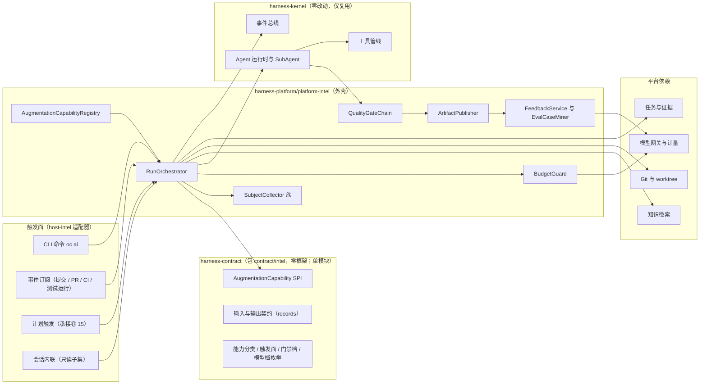
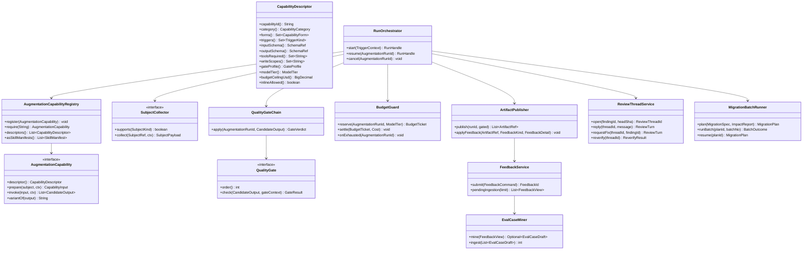
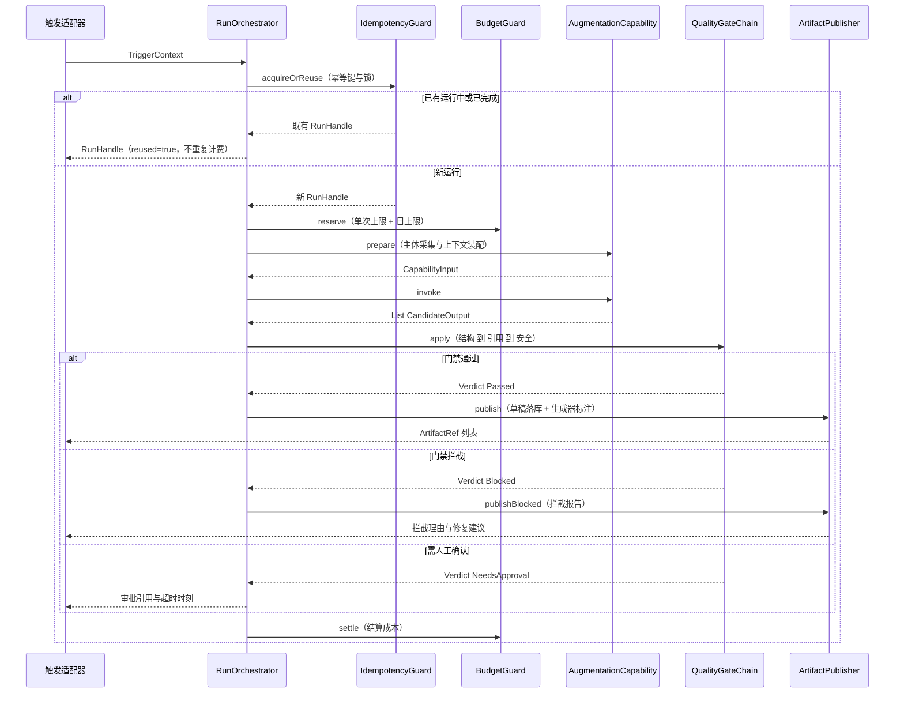
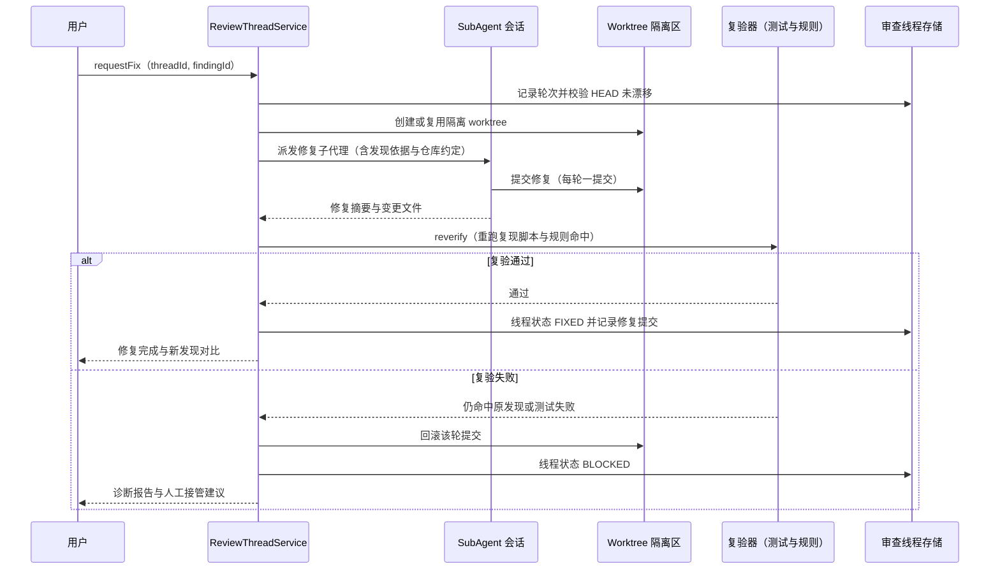
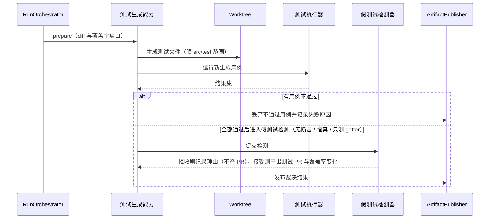
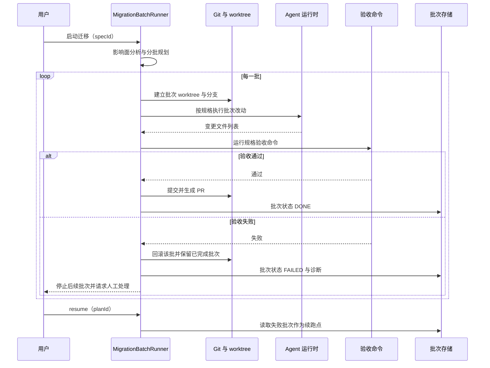
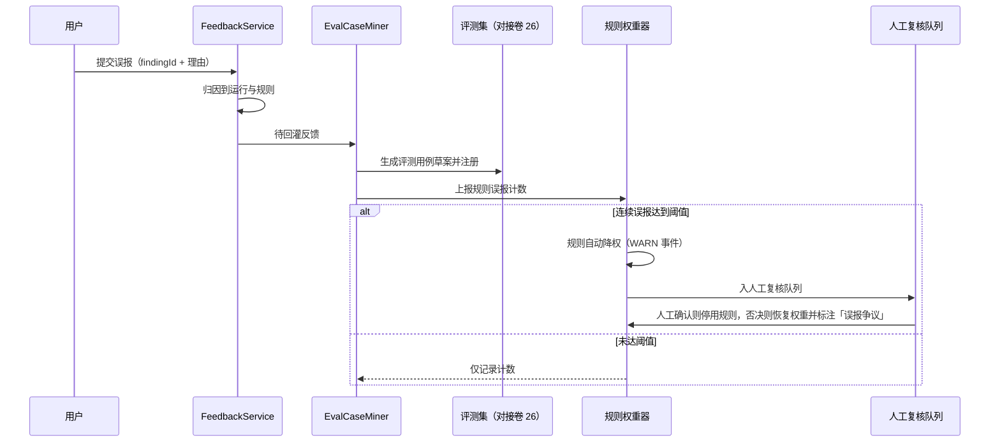
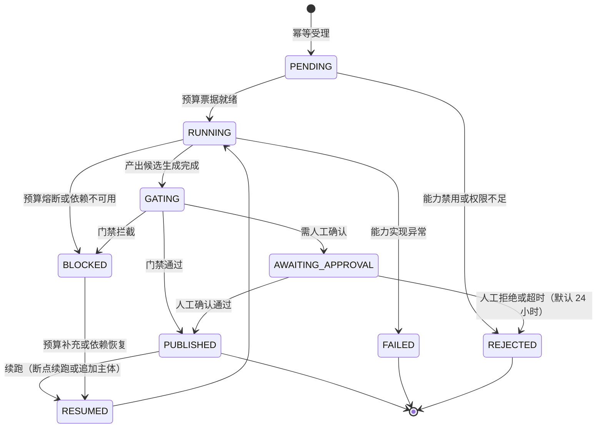
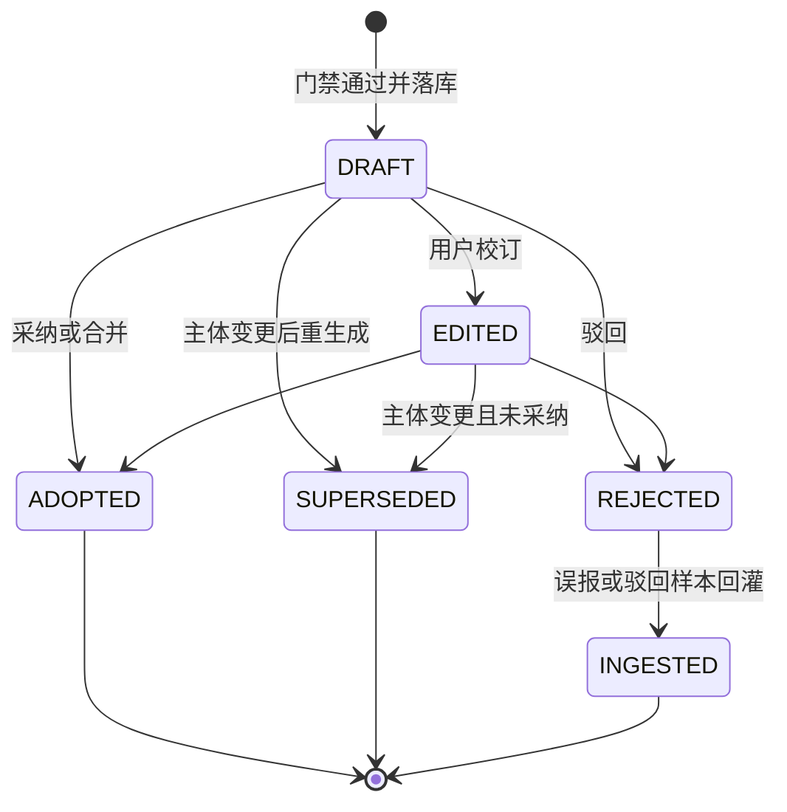
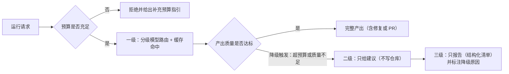

# 实现方案 32 · 智能增强包实现技术方案

> 本文件是 Phase B 实现层方案，对应 Phase A 卷 35（`docs/harness/35-intelligent-augmentation.md`，域内决策 `D-INTEL-1…8`）与卷 00 §5.35（D35 智能增强包，`REQ-AI-1…12`）。
>
> **实现主线**：**一个能力包框架 + 8 项能力**。框架只实现一次「注册 / 触发 / 输入契约 / 输出契约 / 门禁 / 预算 / 产出 / 反馈」八件事（`D-INTEL-7` 的落地），8 项能力以描述符注册的方式接入，共享治理面；不新增执行链路——生成类走卷 12 Agent 运行时与卷 05 工具管线，检索走卷 11，写入走卷 21 Git 与 worktree，证据走卷 14。
>
> **证据标记沿用** `00-research-plan.md` §2：`[E1]` 源码｜`[E2]` 官方文档｜`[E3]` 第三方｜`[E4]` 推断。
> **实现落点**：`harness-contract`（包 `com.hk.opencoding.contract.intel`，**单模块口径**——原写的 `harness-contract/harness-contract-intel` 子模块形式废弃，卷 27 §4.1 的 `harness-contract` 为单模块）+ `harness-platform/platform-intel`（`com.hk.opencoding.platform.intel`，**扩展模块**，待卷 27 §4.1 登记）+ `harness-host/host-intel`（REST/WS 装配，**扩展模块**，待登记；若登记受阻则降为 `host-protocol` 的 `intel.*` 面 + `host-app` 装配）。内核（`harness-kernel`）**零改动**；外壳 Spring 装配点集中在 `host-intel`。
> **落地登记（R07；清单见 `reviews/R07-scope-build-platform.md`）**：**实施顺序**——第 **20** 步之后（依赖第 9/15 步，且八项能力消费第 4/14/17 步产物）；本文件头部原「B5 批次」指 `00-research-plan.md` 研究规划批次，**不是**卷 27 §4.4 数据迁移批次，引用时必须带限定词。**数据迁移批次**——`oc_ai_*` 未在 §4.4 明列 → 建议新批次 **B10 自动化、智能增强与前沿实验**。**表所有权**——`oc_ai_feedback`/`oc_ai_eval_case` 归本文件，评测注册复用 `33` 的 `oc_qa_*`（不另建用例表）。**I- 决策落点**——`I-INTEL-1…19`（19 条）模块落点见 §1.4「上游与下游依赖」的域带表与本节，类级落点见 §⑤；逐条绑定登记为 R07 建议 S4。
> **规划依赖**：对应 `00-research-plan.md` §1.2 第 32 项（B5 批次）；消化 `LESSONS-AND-ADOPTIONS.md` 的 L-081（文档漂移门禁）、L-084（技能界面描述与依赖声明）、L-035（规则按需加载）、L-026（程序化工具调用）、L-023（披露三档）。

---

## ① 实现目标与范围

### 1.1 本组件解决什么

把「用户要手动做的 AI 事」变成**可触发、可信任、可度量、可回退**的产品化能力：同一份能力实现被 CLI、桌面端、CI、模板库、会话内联五处复用；产出经过三层门禁才能进入人的视野；每次运行的成本与价值都留下事实。

| 线 | 内容 | 本文件章节 |
| --- | --- | --- |
| L1 能力包框架 | 描述符注册、四类触发适配、输入/输出契约、评测挂钩、并发与幂等 | §③/§④/§⑤/§⑥.1/§⑦ |
| L2 生成类能力 | PR 描述与变更日志、测试生成与覆盖补强、代码迁移助手 | §⑤.4/§⑥.2/§⑥.3/§⑥.4 |
| L3 审查类能力 | 审查机器人（规则通道 + 模型通道 + 多轮对话式修复线程） | §⑤.4/§⑥.2 |
| L4 检测与汇总能力 | Flaky 检测与隔离、文档漂移检测、Standup/周报、仓库知识问答 | §⑤.4/§⑥.5 |
| L5 治理与闭环 | 门禁链、成本预算与降级、反馈回灌、A/B 与灰度、可观测 | §⑧/§⑨/§⑩/§⑪ |

### 1.2 与 Phase A 的对应关系

| Phase A | 本文件落地 |
| --- | --- |
| 卷 35 §1.3 共性约束 C1–C8 | §⑤ 门禁链与产出状态机 + §⑩.6 权限边界（逐条给校验点） |
| `D-INTEL-1` 技能包优先 + 内置兜底 | §③ `I-INTEL-1`；§⑤ `CapabilityDescriptor` 导出 Skill 清单 |
| `D-INTEL-2` 四类触发 + 能力触发矩阵 | §③ `I-INTEL-5`；§⑨.1 `CapabilityTriggerMatrix` |
| `D-INTEL-3` 三层门禁 + 条件人工门 | §③ `I-INTEL-4`；§⑤ `QualityGateChain`；§⑨.1 `open-coding.intel.gate.*` |
| `D-INTEL-4` 分级人机分工 | §③ `I-INTEL-7`；§⑩.6；内联只读子集 |
| `D-INTEL-5` 混合评测 + 回灌 + 两段式降级 | §③ `I-INTEL-8`；§⑥.5；§⑩.7 A/B 与灰度 |
| `D-INTEL-6` 预算 + 路由 + 缓存 + 降级阶梯 | §③ `I-INTEL-9`；§⑩.4 |
| `D-INTEL-7` 统一框架 + 描述符注册 | §③ `I-INTEL-1`；§④ 架构 |
| `D-INTEL-8` 草稿状态机 + 保留策略 | §③ `I-INTEL-2`；§⑦ 状态机；§⑧.1 表族 |

### 1.3 本组件不解决什么

| 不解决 | 归属实现方案 |
| --- | --- |
| 任务 DAG、依赖求解、证据验收原语 | `14-task-plan-engine-impl.md` |
| 触发器语义（cron / 计划 / 租约 / jitter） | `15-goal-scheduler-impl.md` |
| 模板库与模板权限上限 | `31-automation-library-impl.md` |
| 评测基座（假模型、回放、基准运行器） | `33-quality-eval-impl.md` |
| 模型路由、限流、计量原语 | `02-model-gateway-impl.md`、`26-quota-cost-impl.md` |
| 检索内核（切分 / 三路混合 / 重排） | `11-knowledge-system-impl.md` |
| 技能包加载与市场 | `08-skill-system-impl.md` |
| 界面卡片与通知呈现 | `30-interaction-ux-impl.md`、`23-desktop-electron-vue-impl.md` |

### 1.4 上游与下游依赖

- **上游（必须已就绪）**：卷 12 运行时（SubAgent 与会话）、卷 05 工具管线、卷 11 检索、卷 16 事件（durable/live 双族）、卷 19 持久化、卷 21 worktree、卷 06 权限决策链、卷 26 评测门禁。
- **下游（消费本组件）**：卷 34 模板步骤（把能力作为一步）、卷 22/33 端的命令与卡片、卷 29 CI 三件套（`--format sarif` 与退出码）、卷 24 审计与 DLP。
- **硬前置**：`D-INTEL-3` 的安全扫描依赖卷 30 的密钥模式库与危险 API 清单；`D-INTEL-8` 的回灌依赖卷 26 的用例注册接口。

---

## ② 功能需求清单（REQ-INTEL-I01…I24，impl 层局部号）

> **编号约定（R02 裁决）**：本表 id 采用 impl 层局部号段 `REQ-INTEL-I<n>`，与卷 35 §2.3 的 `REQ-INTEL-1…18`（Phase A 权威号）**平行且互不覆盖**——同号段语义不延续、重排与合并均发生在本文件，故不复用 `REQ-INTEL-n` 串。引用卷 35 需求一律写全称「卷 35 REQ-INTEL-n」（如 `REQ-INTEL-I07` 的来源列引用 `卷 35 §2.3 REQ-INTEL-14`）；引用本文件需求写 `REQ-INTEL-I<n>`。溯源映射（impl → 卷 35）：I01→1、I02→2、I03 运行幂等（卷 35 §5.2 细化）、I04→3、I05→4、I06 产出状态机（新增）、I07→14、I08→5、I09→6、I10→6（多轮修复）、I11→15、I12→9、I13→7、I14→8、I15→9（漂移写路径）、I16→10、I17→11、I18→12、I19→13、I20→16、I21 新增（Skill 渐进披露）、I22 新增（静态安全规则清单化）、I23→4/§8（降级）、I24→17。续卷 00 §5.35 与卷 35 §2.3；标注「增量」者为 Phase B 从竞品证据得到的新需求。

| ID | 需求描述 | 来源 | 优先级 | 验收要点 |
| --- | --- | --- | --- | --- |
| REQ-INTEL-I01 | 能力描述符注册与校验：缺字段（触发面 / 输入契约 / 输出契约 / 工具依赖 / 写范围 / 门禁档 / 预算档）即注册失败 | 卷 35 §5.1 | P0 | 启动期注册表断言；用例覆盖 7 类缺字段 |
| REQ-INTEL-I02 | 四类触发适配器（命令 / 事件 / 计划 / 内联），产出同构 | 卷 35 §3.2 B4 | P0 | 同一能力四种触发产出结构一致（契约测试） |
| REQ-INTEL-I03 | 运行幂等：幂等键 `(capabilityId, subjectRef, subjectDigest, promptVersion)` 唯一约束 + 分布式锁 | 卷 35 §5.2 | P0 | 并发同主体只产生一次计费 |
| REQ-INTEL-I04 | 三层门禁链（结构 → 引用 → 安全）+ 条件人工门；拦截理由可解释 | 卷 35 §5.1 | P0 | 无引用 / 无生成器标注 / 含密钥三类被拦 |
| REQ-INTEL-I05 | 预算守卫：单次上限、单日上限、进度可见、超限可断可续 | 卷 35 §5.5 | P0 | 超限中断后保留已完成部分并可续跑 |
| REQ-INTEL-I06 | 产出状态机：DRAFT / EDITED / ADOPTED / REJECTED / SUPERSEDED，人工校订不被覆盖 | 卷 35 §5.2 | P0 | 重生成不覆盖 `EDITED` 版本（用例） |
| REQ-INTEL-I07 | 反馈包：采纳 / 编辑 / 驳回 / 误报四类可归因到运行与产出 | 卷 35 §2.3 REQ-INTEL-14 | P0 | 反馈事件含 runId + artifactId/findingId |
| REQ-INTEL-I08 | PR 描述与变更日志双产出（引用强制 + 未覆盖项 + breaking 人工门） | 卷 35 §5.3① | P1 | 引用覆盖率 ≥ 90%；内联 P95 ≤ 30s |
| REQ-INTEL-I09 | 审查机器人：规则通道 + 模型通道；置信度分级；低置信不阻塞 | 卷 35 §5.3② | P0 | 规则清单可枚举；每条发现带依据 |
| REQ-INTEL-I10 | **多轮对话式修复线程**：发现 → 追问 → 修复 → 复验 → 关闭；漂移即标记「基于旧版本」 | **增量**：`competitors/09` §2.6 `[E1]`（SWE-agent `review_on_submit_m` 把 `<diff>` 注入复核并要求重跑复现脚本）+ §2.2 Cline 「恢复事务」、§2.3 Roo 「每任务影子仓」 | P0 | 端到端用例：发现 → 修复 → 复验通过 |
| REQ-INTEL-I11 | **生成物归属与回退**：产出带生成器标注与版本；生成类变更可一键撤销 | **增量**：`competitors/09` §2.1 `[E1]`（Aider 模型生成提交信息 + `aider:` 前缀 + `Co-authored-by` trailer + `/undo`） | P0 | 撤销后工作区与提交状态一致（用例） |
| REQ-INTEL-I12 | **文档类产出为可共编资产**：人工修订被标记保护，重生成不覆盖；支持反向同步 | **增量**：`competitors/07` §③ `[E2]`（Qoder Repo Wiki 手工修改受保护 + Git 反向同步 + `wiki_plan.yaml` 页面白名单） | P1 | 人工段落 + 模型重生成并发时不覆盖（用例） |
| REQ-INTEL-I13 | 测试生成：变更驱动 + 覆盖率缺口驱动；生成即运行；假测试检测 | 卷 35 §5.3③ | P1 | 无断言 / 恒真断言被拒；覆盖率提升可量化 |
| REQ-INTEL-I14 | Flaky 检测：重跑 + 统计 + 隔离运行三法交叉；六类归因；隔离默认只建议 | 卷 35 §5.3④ | P1 | 单次失败不标记（用例） |
| REQ-INTEL-I15 | 文档漂移：结构化提取比对 + 差异清单 + 仅允许写路径的修订 PR | 卷 35 §5.3⑤ | P1 | 越界写路径整体拒绝（用例） |
| REQ-INTEL-I16 | Standup / 周报：客观事实层 + 标注主观层 + 环比 + 数据缺口清单 | 卷 35 §5.3⑥ | P2 | 客观层无来源字段被门禁拦截 |
| REQ-INTEL-I17 | 仓库知识问答：强制引用 + 无依据明确拒答 + 权限严格继承 | 卷 35 §5.3⑦ | P0 | 无依据问题拒答率 100%（用例集） |
| REQ-INTEL-I18 | 代码迁移助手：规格驱动 + 小批（≤ 50 文件）+ 每批验证 + 断点续跑 + 失败批次隔离 | 卷 35 §5.3⑧ | P1 | 失败批次回滚不影响已完成批次 |
| REQ-INTEL-I19 | **交付物包契约**：一次运行产出可打包（含证据引用与生成器元数据），供 CLI/桌面/CI 消费 | **增量**：`competitors/04` §7 `[E1]`（`deliverables/presented` 事件 + 客户端「交付物」插件面） | P1 | 包结构版本化；`ai.artifact.produced` 可审计 |
| REQ-INTEL-I20 | **快照回归基座**：能力输出可录制期望输出，提示词/模型变更前必须回归比对 | **增量**：`competitors/04` §③ `[E1]`（`vitest.expected.config.ts` 期望输出快照 + `DSH_SNAPSHOT=refresh`） | P2 | ≥ 4 项能力具备快照；改版未过回归即拒绝发布 |
| REQ-INTEL-I21 | **能力形态走 Skill 渐进披露**：描述符导出 Skill 清单（含界面描述与依赖工具声明），正文按需加载 | **增量**：`competitors/01` §4.8 `[E2]`（`SKILL.md` frontmatter 全可选 + 正文使用时加载）+ `LESSONS-AND-ADOPTIONS.md` L-084/L-035 | P1 | Skill 清单与内置实现一致性校验通过 |
| REQ-INTEL-I22 | **静态安全规则清单化**：审查机器人确定性通道来自可枚举规则清单（含危险 API / 密钥模式 / 注入模式） | **增量**：`competitors/01` §4.3 `[E1]`（`bashSecurity.ts` 2590 行独立检测项清单） | P0 | 规则按 `ruleId` 可查、可单测、可降权 |
| REQ-INTEL-I23 | 成本与降级：分级模型路由 + 上下文指纹缓存 + 三级降级（修复 → 建议 → 报告） | 卷 35 §8 | P0 | 降级链路可观测；缓存不跨租户 |
| REQ-INTEL-I24 | 治理不旁路：全部运行过卷 06 决策链、卷 07 沙箱、卷 24 审计与 DLP | 卷 35 REQ-INTEL-17 | P0 | 无 `bypass` 分支（架构断言测试） |
| REQ-INTEL-I25 | **用户可控面四件套（R06 新增）**：每项能力必须**可发现**（`oc ai …` 动词 + TUI 命令面板同名 + 桌面「智能增强」面板 + 会话内联只读入口四处可达）、**可取消**（批次边界让出，保留已发布产出与草稿）、**可解释**（为什么跑 / 为什么不跑 / 为什么被拦：触发源、主体摘要、门禁层与理由码、模型与提示词版本、缓存命中、降级原因）、**成本可见**（运行前上限与估算区间 + 运行中当前成本 + 结束后结算明细） | 卷 35 §5.1/§8；`30-interaction-ux-impl.md` §7.1「智能增强」行；`22-cli-tui-impl.md` REQ-CLI-25 | P0 | 四项控制各有一条端到端用例；四处入口命令同名（映射测试）；取消后 `oc_ai_run` 状态与产物一致；`--explain` 字段与桌面面板同源；成本三处与 `oc_ai_cost_usd_total{capability}` 对账一致 |

---

## ③ 技术方案选型（M×N 比选）

评分沿用 `README.md` §4：**F 30% / U 20% / S 25% / M 25%**；加权总分 = `30F+20U+25S+25M` / 10。

### 3.1 九维分叉矩阵

| 维度 | 分支 | 描述 | F | U | S | M | 加权 | 结论 |
| --- | --- | --- | --- | --- | --- | --- | --- | --- |
| I-INTEL-1 框架宿主 | B1 | 每个能力一个 Spring 服务类，各自处理触发与门禁 | 7 | 7 | 8 | 5 | 68.5 | 淘汰（治理面漂移） |
| | B2 | **统一编排服务（`harness-platform/platform-intel`）+ 描述符 SPI（`harness-contract`）；门禁/预算/审计/产出共享** | 9 | 9 | 8 | 9 | **87.5** | **选定** |
| | B3 | 每能力独立进程 | 7 | 7 | 5 | 7 | 65.0 | 淘汰（与 local 单机形态冲突） |
| I-INTEL-2 运行承载 | B1 | 每次运行直接跑一个 SubAgent 会话，无独立实体 | 7 | 7 | 8 | 6 | 70.0 | 淘汰（无法度量与续跑） |
| | B2 | **增强运行 = 独立实体（`oc_ai_run` + 独立状态机），可作为模板步骤被 WorkItem 挂载** | 9 | 8 | 8 | 9 | **85.5** | **选定** |
| | B3 | 复用 WorkItem 全量语义（运行即任务） | 8 | 8 | 7 | 7 | 76.0 | 淘汰（问答/内联场景过重） |
| I-INTEL-3 提示词资产形态 | B1 | 提示词内嵌 Java 字符串常量 | 7 | 7 | 9 | 5 | 70.0 | 淘汰（违卷 04 与改版门禁） |
| | B2 | **卷 04 资产包引用（`promptRef` + 版本钉扎）；Skill 形态可覆盖但需签名与基线回退** | 9 | 8 | 8 | 9 | **85.5** | **选定** |
| | B3 | 每次运行由模型自选提示词 | 5 | 6 | 6 | 4 | 52.5 | 淘汰（不可复现） |
| I-INTEL-4 门禁执行位置 | B1 | 门禁在提示词里要求模型自检 | 5 | 7 | 9 | 5 | 64.0 | 淘汰（不可信） |
| | B2 | **平台侧门禁链 + 复用卷 26 `Verifier` SPI；拦截理由结构化** | 9 | 8 | 8 | 9 | **85.5** | **选定** |
| | B3 | 门禁在端侧（CLI / 桌面各自实现） | 6 | 8 | 6 | 5 | 62.5 | 淘汰（两端漂移） |
| I-INTEL-5 触发与幂等 | B1 | 无幂等，触发即跑 | 6 | 6 | 8 | 4 | 60.0 | 淘汰（重复计费） |
| | B2 | **四类适配器统一产出 `TriggerContext`；幂等键唯一约束 + Redisson 锁 + 单写者** | 9 | 9 | 8 | 9 | **87.5** | **选定** |
| | B3 | 仅进程内去重 | 7 | 7 | 9 | 5 | 69.5 | 淘汰（多实例失效） |
| I-INTEL-6 多轮修复会话 | B1 | 修复指令直接改工作区（无隔离） | 6 | 7 | 6 | 5 | 60.0 | 淘汰（污染用户仓库） |
| | B2 | **SubAgent 会话 + worktree 隔离 + 审查线程持久化（`oc_ai_review_thread`）；每轮一个提交，失败即回滚该轮** | 9 | 9 | 8 | 9 | **87.5** | **选定** |
| | B3 | 修复提案只输出 patch 文本（不执行） | 7 | 7 | 9 | 6 | 72.5 | 保留为降级形态（环境不可用时） |
| I-INTEL-7 内联能力子集 | B1 | 内联可用全部 8 项能力 | 8 | 8 | 6 | 6 | 70.5 | 淘汰（写能力在会话内难以预授权） |
| | B2 | **内联仅只读子集（问答 / 解释 / 汇总草稿）；写能力仅命令与事件面 + 预授权** | 8 | 8 | 9 | 9 | **84.5** | **选定** |
| | B3 | 内联完全不可用 | 6 | 6 | 9 | 7 | 69.0 | 淘汰（发现性差） |
| I-INTEL-8 反馈回灌与降级 | B1 | 反馈仅统计，不回灌 | 6 | 7 | 9 | 5 | 66.5 | 淘汰（不收敛） |
| | B2 | **两段式：连续误报达阈值自动降权（WARN + 事件）→ 人工复核后停用；样本入 `oc_ai_eval_case`** | 9 | 8 | 8 | 9 | **85.5** | **选定** |
| | B3 | 达到阈值直接停用规则 | 8 | 7 | 8 | 7 | 75.5 | 淘汰（漏检风险不可控） |
| I-INTEL-9 成本路由与缓存 | B1 | 全能力同模型档 | 6 | 7 | 9 | 6 | 69.5 | 淘汰（复杂能力质量不足） |
| | B2 | **分级路由（能力 × 阶段）+ 上下文指纹缓存（TTL 900s）+ 三级降级** | 9 | 8 | 8 | 9 | **85.5** | **选定** |
| | B3 | 每次运行前询问用户选档 | 7 | 7 | 8 | 6 | 70.0 | 淘汰（打断心流） |

### 3.2 实现级决策登记（I-INTEL-n）

| ID | 主题 | 选定 | 理由与代价 | 回退触发 |
| --- | --- | --- | --- | --- |
| I-INTEL-1 | 框架宿主 | 统一编排服务 + 描述符 SPI；契约零框架，实现在外壳 | 治理只实现一次；代价是抽象需一次到位（用 `capabilityOverrideHooks` 兜特殊能力） | 能力数 > 24 或跨租户硬隔离 → 抽 `intel-worker` 进程（接口不变） |
| I-INTEL-2 | 运行承载 | 独立运行实体 + 可被 WorkItem 挂载 | 度量/续跑/幂等三者可得；代价是两套状态需同步（挂载时以 WorkItem 为父） | 运行表行数 > 2000 万/年 → 按 `created_at` 分区 + 冷归档 |
| I-INTEL-3 | 提示词资产 | 卷 04 资产包 + 版本钉扎；Skill 覆盖需签名 | 改版可控、可回归；代价是资产发布流程变重 | Skill 覆盖产出差异率 > 5% → 关闭 Skill 覆盖层 |
| I-INTEL-4 | 门禁位置 | 平台侧门禁链 + 卷 26 `Verifier` 复用 | 三端一致、可解释；代价是内联场景 +100–400ms | 内联 P95 > 30s → 安全扫描异步后置（先出草稿，落盘前拦） |
| I-INTEL-5 | 触发与幂等 | 四类适配器 + 幂等键唯一约束 + 锁 | 重复计费与重复 PR 根除；代价是触发面越多，集成测试面越大 | 单能力事件触发日频 > 200 → 降级为手动 + 计划 |
| I-INTEL-6 | 多轮修复 | SubAgent + worktree 隔离 + 线程持久化；每轮一提交 | 修复可回滚、可复验；代价是 worktree 与线程生命周期管理 | worktree 创建失败率 > 2% → 降级为 patch 提案形态 |
| I-INTEL-7 | 内联子集 | 只读子集内联；写能力走命令/事件 + 预授权 | 会话内不做不可逆动作；代价是用户需切到命令面 | 写能力采纳率 < 30% 连续 2 周 → 收窄为「只给建议」 |
| I-INTEL-8 | 反馈回灌 | 两段式降权（自动降权 → 人工复核停用） | 闭环收敛且不漏检；代价是需人工复核队列与 SLA | 回灌队列积压 > 1000 → 暂停自动入集，仅人工标注 |
| I-INTEL-9 | 成本 | 分级路由 + 上下文指纹缓存 + 三级降级 | 上限可控；代价是缓存失效策略需与主体摘要严格对齐 | 单能力成本超预算 150% → 自动关停待人工重开 |
| I-INTEL-10 | 快照回归 | 期望输出快照存对象存储，提示词/模型改版前强制回归 | 改版有据；代价是快照刷新需人工确认（防「刷快照」掩盖回归） | 快照维护成本 > 收益（月刷新 > 40 次）→ 改为抽样回归（关键能力保留） |

### 3.3 与竞品对照的取舍（research 证据）

| 对照维度 | 竞品证据 | 我们的取舍 | 主动放弃的收益 |
| --- | --- | --- | --- |
| 审查机器人形态 | SWE-agent `review_on_submit_m` 把 `<diff>` 注入复核并要求重跑复现脚本（`competitors/09` §2.6）[E1] | 采纳「发现 → 追问 → 修复 → 复验」多轮线程（I-INTEL-6；REQ-INTEL-I10），修复在隔离 worktree 且每轮一提交 | 不做「一次性给建议」的轻交互，轮次管理与 worktree 成本上升 |
| 生成物归属与回退 | Aider 模型生成提交信息 + `aider:` 前缀 + `Co-authored-by` + `/undo`（`competitors/09` §2.1）[E1] | 采纳为「生成器标注 + 一键撤销」（REQ-INTEL-I11）；撤销后工作区与提交状态一致 | 不做自动改写提交历史的「干净感」操作（保留可追溯 trailer） |
| 文档共编 | Qoder Repo Wiki：手工修改受保护 + Git 反向同步 + `wiki_plan.yaml` 白名单（`competitors/07` §③）[E2] | 全采纳为「人改保护区 + 重生成不覆盖 + 反向同步」（REQ-INTEL-I12） | 生成密度下降（人工段落永不被模型重写） |
| 交付物与快照 | DeepSeek `deliverables/presented` 事件 + 客户端交付物插件面 [E1]；Vitest 期望输出快照 `DSH_SNAPSHOT=refresh` [E1] | 采纳为「交付物包契约 + 快照回归基座」（I-INTEL-10；REQ-INTEL-I19/I20） | 快照刷新需人工确认，牺牲「自动刷快照」的便利 |
| 静态规则清单化 | Claude Code `bashSecurity.ts` 2590 行可枚举检测项 [E1] | 采纳为审查确定性通道的可枚举规则清单（REQ-INTEL-I22），规则可单测、可降权 | 不把安全检测完全交给模型通道（误报面更大） |

---

## ④ 总体架构图



**装配点（Spring）**：`IntelAutoConfiguration` 在 `host-intel` 中定义 `@Bean`（编排服务、门禁链、预算守卫、发布器、反馈服务），以 `@ConditionalOnProperty(prefix = "open-coding.intel", name = "enabled")` 守门；能力实现经 `@Bean AugmentationCapabilityProvider` 注册（`@ConditionalOnMissingBean` 允许企业覆盖）；CLI 动词由 `host-cli` 注入 `IntelCommandFacade`；计划触发复用 `15-goal-scheduler-impl.md` 的触发对象四类中的「模板型」。

---

## ⑤ 类图与关键 Java 21 契约



### 5.1 契约层关键签名（零框架依赖）

```java
package com.hk.opencoding.contract.intel;

/**
 * 智能增强能力 SPU：一项能力（生成 / 审查 / 检测 / 汇总）的统一实现接口。
 * 实现方只负责「把主体变成候选产出」，门禁、预算、产出与反馈由平台统一治理。
 */
public interface AugmentationCapability {

    /**
     * 返回能力描述符。
     * 描述符是注册与门禁的唯一事实源，缺必填字段即注册失败。
     *
     * @return 能力描述符（不可为 {@code null}）
     */
    CapabilityDescriptor descriptor();

    /**
     * 采集主体并装配能力输入。
     *
     * @param subject 主体引用（diff / 测试运行 / 文档目录 / 时间窗口 / 问题），必填
     * @param ctx     运行上下文（只读视图、预算票据、权限端口），必填
     * @return 能力输入（含上下文片段与主体载荷）
     * @throws HarnessException 主体不可解析或已过期（新提交）时抛出（契约层属内核层带，见 §⑨.5 异常命名约定）
     */
    CapabilityInput prepare(SubjectRef subject, AugmentationContext ctx);

    /**
     * 执行生成，返回候选产出（尚未过门禁）。
     *
     * @param input 能力输入，必填
     * @param ctx   运行上下文，必填
     * @return 候选产出列表（可为空列表，表示无发现 / 无可生成内容；不返回 {@code null}）
     * @throws HarnessException 预算耗尽、权限不足或依赖不可用时抛出
     */
    List<CandidateOutput> invoke(CapabilityInput input, AugmentationContext ctx);

    /**
     * 计算产出的变体标识（用于 A/B 与灰度归因；默认实现返回提示词版本）。
     *
     * @param output 候选产出，必填
     * @return 变体标识（非空；无变体时返回基线标识）
     */
    default String variantOf(CandidateOutput output) {
        return output.promptVersion();
    }
}
```

```java
package com.hk.opencoding.contract.intel;

/**
 * 能力描述符：一项能力的完整治理声明（触发面 / 契约 / 依赖 / 权限 / 门禁 / 预算）。
 * 本记录同时是 Skill 清单的生成源（见 {@code CapabilityDescriptor#asSkillManifest()} 的转换器）。
 *
 * @param capabilityId     能力稳定标识（点分小写，如 {@code pr.description}，不可重命名）
 * @param version          能力实现版本（语义化版本）
 * @param category         能力分类（生成 / 审查 / 检测 / 汇总）
 * @param forms            允许的形态（技能包 / 内置 / 模板步骤）
 * @param triggers         允许的触发面（命令 / 事件 / 计划 / 内联）
 * @param inputSchema      输入契约引用（JSON Schema 资源路径）
 * @param outputSchema     输出契约引用（JSON Schema 资源路径）
 * @param toolsRequired    依赖的工具名集合（注册时校验存在性）
 * @param writeScopes      允许写入的路径范围（空集表示只读）
 * @param gateProfile      门禁档（标准 / 严格 / 含人工门）
 * @param modelTier        默认模型档位
 * @param budgetCeilingUsd 单次运行预算上限（大于零）
 * @param inlineAllowed    是否允许会话内联触发（写能力必须为 {@code false}）
 */
public record CapabilityDescriptor(
        String capabilityId,
        String version,
        CapabilityCategory category,
        Set<CapabilityForm> forms,
        Set<TriggerKind> triggers,
        SchemaRef inputSchema,
        SchemaRef outputSchema,
        Set<String> toolsRequired,
        Set<String> writeScopes,
        GateProfile gateProfile,
        ModelTier modelTier,
        BigDecimal budgetCeilingUsd,
        boolean inlineAllowed) {
}
```

```java
package com.hk.opencoding.contract.intel;

/**
 * 质量门禁：门禁链的一层，顺序由 {@link #order()} 决定（结构 10 → 引用 20 → 安全 30 → 人工 40）。
 * 实现方不得直接向人类输出产出；只能返回裁决。
 */
public interface QualityGate {

    /**
     * 门禁顺序（数值小者先执行）。
     *
     * @return 顺序值，必须来自 {@link GateOrder} 常量
     */
    int order();

    /**
     * 校验候选产出。
     *
     * @param output 候选产出，必填
     * @param ctx    门禁上下文（含引用解析器、安全规则库、人工确认端口），必填
     * @return 门禁结果（通过 / 拦截 / 需人工确认）
     */
    GateResult check(CandidateOutput output, GateContext ctx);
}
```

```java
package com.hk.opencoding.contract.intel;

/**
 * 门禁结果封闭集。
 * 用密封接口表达「拦截 / 需确认」的附加信息，避免布尔返回值退化。
 */
public sealed interface GateResult
        permits GateResult.Passed, GateResult.Blocked, GateResult.NeedsApproval {

    /** 通过。 */
    record Passed() implements GateResult {
    }

    /**
     * 拦截。
     *
     * @param gateName  门禁名（结构化，用于指标标签）
     * @param reasonCode 理由码（枚举名，禁止自由文本）
     * @param detail    可读理由（中文，面向用户）
     */
    record Blocked(String gateName, GateReason reasonCode, String detail) implements GateResult {
    }

    /**
     * 需人工确认（高风险写入）。
     *
     * @param approvalRef 审批引用（对接卷 06 审批编排）
     * @param expiresAt   确认超时时刻（超时按未确认处理）
     */
    record NeedsApproval(String approvalRef, Instant expiresAt) implements GateResult {
    }
}
```

> **层带标注（R03）**：以下 `RunOrchestrator` 属**外壳层**（`platform-intel`，Spring 装配点与事务边界在此层，非契约层）。本节前部签名（`contract/intel` 包）为**契约层、零框架依赖**；本样例因与契约签名同节展示，特此标注，避免误读为内核零依赖契约。

```java
package com.hk.opencoding.platform.intel;

import lombok.RequiredArgsConstructor;
import lombok.extern.slf4j.Slf4j;
import org.springframework.transaction.annotation.Transactional;

/**
 * 增强运行编排：一次运行的唯一生命周期拥有者。
 * 负责幂等去重、主体采集、上下文装配、调用能力、门禁裁决、产出发布与成本结算；
 * 不负责能力内部逻辑（在 {@code AugmentationCapability} 实现里）。
 */
@Slf4j
@RequiredArgsConstructor
public class RunOrchestrator {

    private final AugmentationCapabilityRegistry registry;
    private final IdempotencyGuard idempotencyGuard;
    private final SubjectCollectorRegistry subjectCollectors;
    private final QualityGateChain gateChain;
    private final BudgetGuard budgetGuard;
    private final ArtifactPublisher artifactPublisher;
    private final AugmentationRunRepository runRepository;

    /**
     * 启动一次增强运行（幂等）。
     * 同一幂等键已存在运行中实例时直接返回既有运行；已完成实例直接返回其句柄（不重复计费）。
     *
     * @param trigger 触发上下文（能力 ID、主体引用、主体摘要、触发面），必填
     * @return 运行句柄（含 runId 与是否复用既有运行）
     * @throws BusinessException 能力未注册或已禁用、主体不可解析、日预算耗尽时抛出
     */
    @Transactional(rollbackFor = Exception.class)
    public RunHandle start(TriggerContext trigger) {
        log.info("增强运行开始，capabilityId={}, subjectRef={}, triggerKind={}",
                trigger.capabilityId(), trigger.subjectRef(), trigger.triggerKind());

        // 1. 能力存在性与开关校验（不存在即拒绝，不静默降级到其他能力）
        AugmentationCapability capability = registry.require(trigger.capabilityId());

        // 2. 幂等：同主体同提示词版本只允许一次计费运行
        Optional<RunHandle> existing = idempotencyGuard.acquireOrReuse(trigger);
        if (existing.isPresent()) {
            log.info("增强运行复用既有实例，runId={}", existing.get().runId());
            return existing.get();
        }

        // 3. 预算票据与主体采集（采集失败即回滚，不产生半成品运行记录）
        BudgetTicket ticket = budgetGuard.reserve(trigger, capability.descriptor().budgetCeilingUsd());
        AugmentationContext ctx = AugmentationContext.forRun(trigger, ticket);
        SubjectPayload payload = subjectCollectors.require(trigger.subjectKind())
                .collect(trigger.subjectRef(), ctx);
        AugmentationRun run = runRepository.insertRunning(trigger, payload.digest());

        // 4. 调用能力并过门禁链（拦截不抛异常：以 BLOCKED 收敛并记录 WARN）
        List<CandidateOutput> candidates = capability.invoke(capability.prepare(trigger.subjectRef(), ctx), ctx);
        GateVerdict verdict = gateChain.apply(run.runId(), candidates);
        if (verdict.blocked()) {
            log.warn("增强产出被门禁拦截，runId={}, gate={}, reason={}",
                    run.runId(), verdict.gateName(), verdict.reasonCode());
        }
        artifactPublisher.publish(run.runId(), verdict);
        budgetGuard.settle(ticket, run.cost());

        log.info("增强运行受理完成，runId={}, cost={}", run.runId(), run.cost());
        return RunHandle.of(run.runId(), false);
    }
}
```

### 5.2 八项能力实现要点

| 能力 | 提示词与上下文需求 | 工具依赖 | 权限与安全边界 | 质量门禁 | 缓存与成本 |
| --- | --- | --- | --- | --- | --- |
| ① PR 描述与变更日志 | 卷 04 资产 `intel.pr.describe`（约 1.2k token）+ diff 摘要 + 提交列表 + 任务引用 + 测试证据；超 400 文件时分片摘要 | Git 只读（diff / log）、任务读取、测试证据读取 | 只读仓库 + 写 PR 描述（`writeScopes` 空集，产出走 PR 元数据接口）；不外发未声明代码 | 结构（六段必备）→ 引用（每条摘要须有 file/commit 引用）→ 安全（不泄漏注释中的凭据） | 缓存键 = diff 摘要 + 提示词版本；TTL 900s；内联档位 `efficient` |
| ② 测试生成与覆盖补强 | 资产 `intel.test.gen`（约 2k token）+ 变更 diff + 覆盖率缺口 + 既有测试风格样例 + 被测接口签名 | 文件读写（worktree 内）、测试执行（沙箱）、覆盖率收集、Git 提交 | 写范围限 `**/src/test/**`；禁止修改既有测试期望；执行走卷 07 沙箱 | 结构（测试编译通过）→ 引用（引用被测方法）→ 安全扫描 + **生成即运行**（不通过丢弃）+ 假测试检测 | 缓存按「被测文件摘要 + 框架版本」；单文件上限默认 20 例；拒绝率 > 50% 降级为要点清单 |
| ③ 代码迁移助手 | 资产 `intel.code.migrate`（约 2.5k token）+ 迁移规格（规则 / 正反例 / 验收命令）+ 影响面分析结果 | 文件读写、构建与测试执行、Git 分批提交、worktree | 每批独立 worktree 与分支；`writeScopes` 由规格声明；禁改规格外文件 | 结构（编译通过）→ 引用（改动点对齐规格条目）→ 安全 + **每批验收命令必须通过** | 缓存按「规格版本 + 文件摘要」；批次大小默认 50；超预算即停在批次边界 |
| ④ 审查机器人 | 资产 `intel.review.bot`（约 1.8k token）+ diff + 仓库约定（AGENTS 类规则文件，按需加载）+ 规则清单命中项 | Git 只读、规则库查询、SubAgent（修复）、worktree、测试执行（复验） | 只评论 + 只提 PR；修复在 worktree 内且每轮一提交；不自动合并 | 规则通道（确定性，无置信度）→ 模型通道（必带依据 + 置信度）→ 安全扫描 | 缓存按 diff 摘要；低置信默认折叠；修复线程轮次上限默认 6（防成本失控） |
| ⑤ Flaky 检测与隔离 | 资产 `intel.flaky.detect`（约 0.8k token）+ 测试事件序列 + 历史方差 + 失败签名 | 测试历史查询、重跑触发、隔离标记（测试配置写） | 只建议隔离；自动标记需企业开启且限 `**/test/**` 配置范围 | 结构（归因六类之一）→ 引用（须有运行 ID 佐证）→ 安全（不改业务代码） | 统计通道零模型成本；模型仅用于归因叙述；每日一次汇总 |
| ⑥ 文档漂移检测 | 资产 `intel.doc.drift`（约 0.8k token）+ 代码侧结构化提取 + 文档声明 + 白名单计划（对齐 L-081 生成式目录思路） | 符号与配置提取、文档解析、Git 写（仅文档目录） | 写范围仅 `docs/**`（可配）；人工校订段落受保护（段落指纹比对，重生成不覆盖） | 结构（差异三类）→ 引用（每处差异指向符号与文档位置）→ 安全（越界写路径整体拒绝） | 结构化比对零模型成本；模型仅用于「语义补充」；连续 3 次修订被驳回转只报告 |
| ⑦ Standup / 周报 | 资产 `intel.digest.standup`（约 1k token）+ 事件聚合结果（客观层）+ 上期报告 | 事件查询（卷 16）、任务查询、通知发送 | 只读；跨用户聚合需聚合权限（只看本人或本团队） | 结构（客观层 + 主观层分离）→ 引用（客观层每条须有事件 ID）→ 安全（不泄漏他人私有仓库名） | 客观层确定性聚合；缓存按「时间窗口 + 权限指纹」；计划触发 |
| ⑧ 仓库知识问答 | 资产 `intel.repo.qa`（约 1k token）+ 检索结果（卷 11 三路混合）+ 权限过滤后片段 | 检索（三路混合）、符号图、引用打开 | 严格继承用户权限（文档 ACL + 租户隔离）；缓存键含权限指纹 | 结构（回答 + 引用列表）→ 引用（强制，无引用即拦截）→ 安全 | 缓存按「问题摘要 + 权限指纹 + 索引版本」；无依据时零成本拒答（不走模型） |

### 5.2.1 八能力三要素矩阵（可执行验证 / 权限天花板 / 失败模式，R03 补齐）

> 三要素与 §⑨.5 错误矩阵、§⑪.1 测试清单机械对齐：**验证**列给出可执行断言与用例入口（`mvn -pl harness-platform/platform-intel -am test -Dtest=<能力>UseCaseTest`），**权限天花板** = `CapabilityDescriptor.writeScopes` ∩ 触发面授予集（内联档只读），**失败模式**为终态（`BLOCKED` / `DEGRADED` / 含原因的拒绝）。

| # | 能力 | 可执行验证（断言 / 用例入口） | 权限天花板 | 失败模式（终态） |
| --- | --- | --- | --- | --- |
| ① | PR 描述与变更日志 | 六段结构齐备；每条摘要 `ref != null`；凭据模式零命中（`PrDescribeUseCaseTest`） | 只读仓库 + 写 PR 元数据（`writeScopes` 空集） | 结构或引用门禁拦截 → `BLOCKED` + 拦截报告 |
| ② | 测试生成与覆盖补强 | 生成用例编译且运行全绿才产 PR；假测试检测拒收理由留痕（`TestGenUseCaseTest`） | `**/src/test/**` 写；禁改既有测试期望 | 任一用例不通过 → 丢弃 + 报告（**不部分交付**）；拒绝率 > 50% → 降级要点清单 |
| ③ | 代码迁移助手 | 每批验收命令通过；`touched ⊆ spec.writeScopes`；批次可独立回滚（`MigrationBatchUseCaseTest`） | 规格声明写范围 + worktree/分支；禁改规格外文件 | 批次验收失败 → 回滚该批 + 停止后续 + 请求人工 |
| ④ | 审查机器人 | 规则通道确定性零置信度噪声；模型通道 `evidence != null`；修复轮次 ≤ 6（`ReviewThreadUseCaseTest`） | 只评论 + 只提 PR；不自动合并 | 复验失败 → 回滚该轮提交 + 线程 `BLOCKED`（不自动重试第三次） |
| ⑤ | Flaky 检测与隔离 | 归因属六类之一 + 运行 ID 佐证；隔离标记限 `**/test/**` 配置（`FlakyDetectUseCaseTest`） | 只建议隔离；自动标记需企业开启 | 无法判定 → 观察清单（不误改、不产 PR） |
| ⑥ | 文档漂移检测 | 差异三类分类；每处差异指向符号与文档位置；受保护段落指纹不被覆盖（`DocDriftUseCaseTest`） | 仅 `docs/**`（可配） | 越界写路径整体拒绝；连续 3 次修订被驳回 → 转只报告 |
| ⑦ | Standup / 周报 | 客观层每条含事件 ID；跨用户聚合需聚合权限（`StandupUseCaseTest`） | 只读（事件/任务）+ 通知发送 | 权限不足 → 缩至本人范围；数据缺口标注（不臆造进度） |
| ⑧ | 仓库知识问答 | 回答必带引用；越权片段零进入；无依据拒答（`RepoQaUseCaseTest`） | 只读（继承用户权限，缓存键含权限指纹） | 无依据 → 零成本拒答（`INTEL_EVIDENCE_INSUFFICIENT`，非 HTTP 错误） |

**机械门禁**：① 每能力 ≥ 1 条端到端用例（§⑪.3「8 项能力全部注册并可调用」）且快照回归覆盖 ①②④⑧；② 越权与预算两类对抗用例对 8 项全量执行（写路径越界、内联触发写能力均须被拒）；③ 失败终态必须事件化（`oc_ai_run_total{capability,outcome}`）且 `BLOCKED` 可续跑。

---

## ⑥ 核心流程时序图

### 6.1 一次增强运行的完整生命周期

**前置条件**：能力已注册且启用；调用方具备触发面权限；幂等键四元组可计算。
**主路径**：触发 → 幂等受理 → 预算预扣 → 主体采集 → 能力调用 → 门禁三级 → 产出落库。
**异常与补偿**：主体采集失败 → 回滚运行记录（不产半成品）；门禁拦截 → 转 `BLOCKED` 报告（非异常）；预算熔断 → `BLOCKED` 可续跑。
**幂等与并发**：幂等键唯一约束 + Redisson 锁（同主体并发只产生一次计费）；`reused=true` 复用既有 RunHandle。



### 6.2 审查机器人多轮对话式修复

**前置条件**：审查运行已产出发现（含 `ruleId` 与置信度）；用户选择「请修复」；隔离 worktree 可创建。
**主路径**：requestFix → 校验 HEAD 未漂移 → 隔离 worktree → 修复子代理（每轮一提交）→ 复验（复现脚本 + 规则）→ 置 `FIXED`。
**异常与补偿**：复验失败 → 回滚该轮提交并将线程置 `BLOCKED`（不自动重试第三次）；HEAD 漂移 → 标记「基于旧版本」并要求重跑。
**幂等与并发**：同一 `(threadId, findingId)` 的重复 requestFix 幂等返回既有轮次；每轮提交与回滚以提交摘要为身份，避免串轮。



### 6.3 测试生成「生成即运行」与假测试检测

**前置条件**：存在 diff 或覆盖率缺口主体；worktree 可写且写入范围限定 `src/test`。
**主路径**：prepare（diff + 覆盖缺口）→ 生成测试文件 → 立即运行 → 全部通过 → 假测试检测 → 产出测试 PR + 覆盖率变化。
**异常与补偿**：有用例不通过 → 丢弃该用例并记录失败原因（**不产出 PR**，不部分交付）；假测试检测拒收 → 记录理由并仅保留报告。
**幂等与并发**：以 `(subjectDigest, promptVersion)` 幂等；同一主体重复运行复用既有产出（`SUPERSEDED` 保留历史）；生成与运行在独立 worktree 内串行。



### 6.4 迁移助手分批执行与断点续跑

**前置条件**：迁移规格（spec）已确认；影响面分析完成且批次 ≤ 50 文件/批。
**主路径**：分批规划 → 每批独立 worktree/分支 → 规格驱动改动 → 验收命令 → 通过即提交 + 建 PR → 批次置 `DONE`。
**异常与补偿**：批次验收失败 → 回滚该批、保留已完成批次、停止后续并请求人工（失败批次隔离）；resume 从失败批次续跑，不改写已 `DONE` 批次。
**幂等与并发**：批次以 `(planId, batchSeq, specDigest)` 幂等；同 plan 并发 resume 由锁串行化，重复提交返回既有 PR 引用。



### 6.5 误报反馈回灌与规则两段式降级

**前置条件**：发现带 `ruleId` 或可归因到模型通道；反馈者具备该运行可见性。
**主路径**：提交误报 → 归因（运行 + 规则/模型通道）→ 生成评测用例草案注册进评测集 → 规则误报计数 → 达阈值自动降权（WARN）→ 人工复核终止（停用或恢复权重）。
**异常与补偿**：评测集注册失败 → 反馈仍保留在本地队列（不丢样本）并重试；人工复核超时 → 规则保持降权态（保守方向），不自动恢复。
**幂等与并发**：反馈以 `(findingId, submitter)` 去重；同一规则并发降权只产生一次状态迁移；计数与权重写入走事件（可回放）。



---

## ⑦ 状态机





**状态不可逆约束**：`ADOPTED` 之后不得再变 `SUPERSEDED`（已采纳产出必须保留引用，供审计与度量）；`EDITED` 版本在重生成时**不得被覆盖**（新建 `SUPERSEDED` 记录并保留人工版本，对齐 `07` Repo Wiki 的手工修改保护 `[E2]`）。

---

## ⑧ 数据模型

### 8.1 表族（`oc_` 前缀，按实体显式声明 `@TableName`）

| 表 | 关键列 | 索引与约束 |
| --- | --- | --- |
| `oc_ai_capability` | `tenant_id`、`capability_id`、`version`、`enabled`、`triggers`(jsonb)、`model_tier`、`budget_ceiling_usd`、`config_override`(jsonb) | 唯一 `(tenant_id, capability_id)` |
| `oc_ai_run` | `id`、`tenant_id`、`capability_id`、`trigger_kind`、`subject_ref`、`subject_digest`、`idempotency_key`、`status`、`gate_verdict`(jsonb)、`cost_usd`、`model_id`、`prompt_version`、`started_at`、`finished_at` | 唯一 `idempotency_key`；索引 `(tenant_id, created_at)`、`(status)`、`(capability_id, subject_digest)` |
| `oc_ai_output` | `id`、`run_id`、`artifact_type`、`state`、`payload_ref`、`payload_inline`(jsonb 小载荷)、`generator`(jsonb：模型 + 提示词版本 + 能力版本)、`citation_coverage`、`adopted_by` | 索引 `(run_id)`、`(state, created_at)`；外键 `run_id` |
| `oc_ai_finding` | `id`、`run_id`、`rule_id`、`path`、`line`、`severity`、`confidence`、`evidence_ref`、`disposition`、`false_positive_at` | 索引 `(run_id)`、`(rule_id, false_positive_at)` |
| `oc_ai_feedback` | `id`、`tenant_id`、`run_id`、`output_id`、`finding_id`、`kind`、`detail`(jsonb)、`submitted_by`、`ingested_at` | 索引 `(kind, ingested_at)`；`(finding_id)` |
| `oc_ai_eval_case` | `id`、`tenant_id`、`capability_id`、`input_digest`、`expected_disposition`、`source_run_id`、`label`、`confidence` | 唯一 `(tenant_id, capability_id, input_digest)` |
| `oc_ai_review_thread` | `id`、`finding_id`、`head_sha`、`status`、`turns`(jsonb)、`fix_commit`、`reverify_result`(jsonb) | 索引 `(finding_id)`、`(status)` |
| `oc_ai_migration_plan` / `oc_ai_migration_batch` | `plan_id`、`spec_ref`、`impact_report_ref`、`batch_no`、`status`、`verify_result`(jsonb)、`resume_from_batch` | 唯一 `(plan_id, batch_no)`；索引 `(status)` |

**统一约束**：所有表含 `tenant_id`、`created_at`、`created_by`、`deleted_at`（软删）；大载荷（报告 / 时间线 / 覆盖率快照）入对象存储，表内仅保留 `payload_ref`；表族须进入卷 19 的迁移批次 B7（卷 28–35 相关表），并同步 `appendix-a-domain-model.md` §A.9（本文件新增 `oc_ai_capability`、`oc_ai_eval_case`、`oc_ai_review_thread`、`oc_ai_migration_plan/batch` 五张，登记为 Phase A 增量建议）。

### 8.2 Redis Key（经 `RedisKeys` 统一工厂生成）

| Key 用途 | 生成方法 | TTL |
| --- | --- | --- |
| 运行进度 | `RedisKeys.intelRunProgress(runId)` | 1 小时 |
| 幂等键 | `RedisKeys.intelIdempotent(capabilityId, subjectDigest)` | 24 小时 |
| 单写者锁 | `RedisKeys.intelLock(capabilityId, subjectRef)` | 10 分钟（带心跳续租） |
| 预算计数 | `RedisKeys.intelBudget(tenantId, capabilityId, day)` | 到当日 24 点 |
| 上下文缓存 | `RedisKeys.intelContextCache(capabilityId, contextDigest)` | 900 秒（可配） |
| 索引版本标记 | `RedisKeys.intelIndexVersion(tenantId)` | 随索引更新 |

**硬规则**：Key 片段（module / type / business）由枚举提供；缓存键必须包含**权限指纹**（问答类）与**租户 ID**（全部），禁止跨租户复用；禁止在业务代码中拼接字符串。

### 8.3 对象存储与事件

- **对象存储前缀**：`intel/{tenantId}/{capabilityId}/{yyyy}/{MM}/{runId}/{artifactType}.json`（报告 / 时间线 / 覆盖率快照 / 迁移诊断）。
- **事件类型**：`ai.capability.registered`、`ai.capability.disabled`、`ai.run.started`、`ai.run.completed`、`ai.run.failed`、`ai.gate.blocked`、`ai.artifact.produced`、`ai.artifact.adopted`、`ai.artifact.edited`、`ai.artifact.rejected`、`ai.artifact.superseded`、`ai.finding.reported`、`ai.finding.resolved`、`ai.finding.false_positive`、`ai.review.thread.opened`、`ai.review.thread.fixed`、`ai.review.thread.blocked`、`ai.review.reverified`、`ai.migration.batch.completed`、`ai.migration.batch.failed`、`ai.eval.case.ingested`、`ai.budget.exhausted`。
- 事件信封与分区有序沿用卷 16；`runId` 作为 `correlationId`，`capabilityId` 作为分区键的一部分。
- **运行与灰度数据的删除模型（全栈一致，依赖 `impl/10` §③ B1 选定）**：本域**不引入第二套删除语义** —— ① 主体合规删除时运行记录 / 产出引用 / 反馈样本按主体级联清理，每步计数并入删除证明（格式与演练由卷 19 统一定义）；② 备份侧登记 **tombstone** 并由恢复流程重放，断言为「备份整包恢复后仍不可召回」；③ 产出载荷与引用片段可能含真实仓库内容与用户文本 → 以 **DEK 加密**入对象存储，删除即销毁 DEK（密钥经 `27-security-runtime-impl` 密钥服务派生，与 `impl/25` §7.1 同一模型）；④ A/B 灰度分桶为**匿名哈希**（无用户可回指字段），不适用 crypto-shredding，删除请求落为「桶种子轮换 + 批次去关联」，与 `impl/28` §⑧ 遥测口径同构；⑤ `SUPERSEDED` 为**逻辑**历史保留（不物理删除），合规删除优先级高于保留。

---

## ⑨ 接口与扩展点

### 9.1 REST 与 WS（`host-intel`）

| 方法 | 路径 | 入参 | 出参 | 错误码 |
| --- | --- | --- | --- | --- |
| GET | `/api/v1/intel/capabilities` | `tenantId`（从会话推导） | `List<CapabilityView>`（含触发面与启用态） | — |
| POST | `/api/v1/intel/runs` | `StartRunCommand{capabilityId, subjectRef, triggerKind}` | `RunHandleView` | `INTEL_CAPABILITY_NOT_FOUND`、`INTEL_FEATURE_DISABLED`、`INTEL_BUDGET_EXCEEDED`、`INTEL_SUBJECT_STALE` |
| GET | `/api/v1/intel/runs/{runId}` | 路径参数 | `RunDetailView`（状态 / 成本 / 门禁裁决） | `INTEL_RUN_NOT_FOUND` |
| POST | `/api/v1/intel/runs/{runId}/resume` | — | `RunHandleView` | `INTEL_RUN_NOT_RESUMABLE` |
| POST | `/api/v1/intel/runs/{runId}/cancel`（R06 新增） | `reason?` | `RunHandleView`（`CANCELLING` 或终态） | `INTEL_RUN_NOT_CANCELLABLE`（已终态）、`INTEL_RUN_NOT_FOUND` |
| GET | `/api/v1/intel/runs/{runId}/explain`（R06 新增） | — | `RunExplainView`（三问字段：触发源 / 主体摘要 / 门禁层与理由码 / 模型与提示词版本 / 缓存命中 / 降级原因） | `INTEL_RUN_NOT_FOUND` |
| GET | `/api/v1/intel/cost`（R06 新增） | `capabilityId?`、`since?` | 成本明细（运行级 + 按能力汇总 + 预算剩余） | `PARAM_INVALID` |
| GET | `/api/v1/intel/runs/{runId}/artifacts` | `state` 过滤 | `List<ArtifactView>` | `INTEL_RUN_NOT_FOUND` |
| POST | `/api/v1/intel/artifacts/{artifactId}/feedback` | `FeedbackCommand{kind, detail}` | `FeedbackReceipt` | `INTEL_ARTIFACT_NOT_FOUND` |
| POST | `/api/v1/intel/review/threads` | `OpenThreadCommand{findingId, headSha}` | `ReviewThreadView` | `INTEL_FINDING_NOT_FOUND` |
| POST | `/api/v1/intel/review/threads/{threadId}/messages` | `ReviewMessageCommand{text}` | `ReviewTurnView` | `INTEL_THREAD_CLOSED` |
| POST | `/api/v1/intel/review/threads/{threadId}/fix` | `RequestFixCommand{findingId}` | `ReviewTurnView` | `INTEL_THREAD_BLOCKED`、`INTEL_WORKSPACE_UNAVAILABLE` |
| GET | `/api/v1/intel/qa/query`（SSE） | `query`、`scope` | 事件流（片段 + 引用） | `INTEL_EVIDENCE_INSUFFICIENT`（以事件形式返回而非 HTTP 错误） |
| POST | `/api/v1/intel/migrations` | `StartMigrationCommand{specRef}` | `MigrationPlanView` | `INTEL_SPEC_AMBIGUOUS` |
| POST | `/api/v1/intel/migrations/{planId}/resume` | — | `MigrationPlanView` | `INTEL_MIGRATION_COMPLETED` |

**WebSocket**：`intel.run.progress` 帧（runId / 阶段 / 进度 / 当前成本 / 门禁结果）；`intel.review.turn` 帧（线程轮次增量）；前端渲染约束沿用卷 16「增量不入库」。

**CLI 动词**（`host-cli`，契约面沿用 `22-cli-tui-impl.md` 的 agent 友好契约）：

```text
oc ai list [--json]
oc ai pr describe --base <ref> --head <ref> [--changelog] [--json]
oc ai review --diff <range> [--format sarif] [--fail-on high] [--json]
oc ai test gen --paths <glob> [--coverage-target <percent>] [--json]
oc ai flaky report [--since <duration>] [--json]
oc ai doc drift [--paths <glob>] [--report-only|--open-pr] [--json]
oc ai digest standup [--window-days <n>] [--channel <name>] [--json]
oc ai qa ask "<question>" [--scope <repo|docs|all>] [--json]
oc ai migrate start --spec <file> [--batch-size <n>] [--json]
oc ai migrate resume --plan <id> [--json]
oc ai explain <runId> [--json]                      # 为什么跑 / 为什么不跑 / 为什么被拦（三问同源字段）
oc ai cancel <runId> [--reason "<text>"]            # 批次边界让出；已发布产出与草稿保留
oc ai cost [--capability <id>] [--since <duration>] [--json]   # 运行级明细 + 汇总 + 预算剩余
oc ai feedback --finding <id> --kind false_positive --reason "<text>"
```

退出码语义（对接 CI 三件套）：`0` 成功且无高严重度发现；`10` 有高严重度发现（`--fail-on high`）；`20` 门禁拦截；`30` 预算耗尽；`40` 依赖不可用；`50` 参数或能力错误。

### 9.2 SPI 扩展点（对接卷 18 目录）

| SPI | 语义 | 约束 |
| --- | --- | --- |
| `AugmentationCapabilityProvider` | 注册能力实现 | 描述符缺字段即启动失败 |
| `QualityGateProvider` | 追加门禁层（企业合规） | 只能**增加**门禁，不能移除或降序 |
| `SubjectCollector` | 新增主体类型 | 必须提供稳定摘要算法 |
| `TriggerAdapterProvider` | 新增触发面 | 必须产出 `TriggerContext`（含幂等键） |
| `CitationResolver` | 新增引用来源 | 必须返回可打开引用与版本 |
| `ArtifactPublisher` | 新增产出目的地 | 落盘前必经门禁（不得直连发布） |
| `CostPolicyProvider` | 自定义成本策略与降级阶梯 | 预算只能收窄，不能放宽 |
| `MigrationSpecProvider` | 迁移规格解析格式扩展 | 必须产出规格声明的验收命令 |

### 9.5 错误矩阵（场景 → 错误码 → 对外文案 → 处置）

| 场景 | 错误码 | 对外文案（中文，一律「事实 + 原因 + 动作」三段式；键空间与模板见 `30-interaction-ux-impl.md` §9.6） | 客户端动作 | 服务端动作 |
| --- | --- | --- | --- | --- |
| 能力未注册/禁用 | `INTEL_CAPABILITY_NOT_FOUND` / `INTEL_FEATURE_DISABLED` | 该能力不可用（事实）：<capabilityId> 未注册，或被管理员策略禁用（原因）；可改用 `oc ai list` 中的其他能力，或联系管理员开通（动作） | 入口置灰或隐藏并说明来源（企业策略 / 用户设置；**置灰 + 原因优于直接消失**） | 拒绝 + 审计（含能力 ID） |
| 主体已被变更（漂移） | `INTEL_SUBJECT_STALE` | 内容已更新（事实）：主体摘要与运行时不一致，可能已有新提交（原因）；刷新后基于最新版本重试（动作） | 刷新后重试 | 不消耗预算（预扣释放） |
| 预算耗尽 | `INTEL_BUDGET_EXCEEDED`（退出码 30） | 已达预算上限，本次运行未产出（事实）：本次需要 <need> 超过剩余 <left>（原因）；可提额、缩小范围或缩短时间窗后**续跑**（动作） | 提额或缩范围（引导到续跑入口） | `BLOCKED` 可续跑；保留已完成部分 |
| 门禁拦截 | —（`BLOCKED` 报告） | 产出未通过门禁：<gateName> 判定「<detail>」（事实 + 原因）；已保留草稿，按报告修正后可重新运行（动作） | 查看拦截报告 | 产出门禁报告（非异常），计数 `oc_ai_gate_block_total{gate}` |
| 引用证据不足（问答） | `INTEL_EVIDENCE_INSUFFICIENT` | 依据不足，无法回答（事实）：检索未命中可引用的片段（原因）；可缩小范围、改用关键词或指定文件路径后再问（动作） | 缩小范围改问 | 以事件形式返回（非 HTTP 错误）；拒答率入指标 |
| 审查线程已关闭/阻塞 | `INTEL_THREAD_CLOSED` / `INTEL_THREAD_BLOCKED` | 该线程已关闭或需人工接手（事实）：复验连续失败或线程已归档（原因）；可新建线程发起新一轮修复（动作） | 新建线程 | 拒绝写入轮次 |
| worktree 不可用 | `INTEL_WORKSPACE_UNAVAILABLE` | 隔离环境暂不可用（事实）：worktree 创建失败或不可写（原因）；稍后重试，或改用「patch 提案」形态查看修复内容（动作） | 稍后重试 / 切 patch 形态 | 运行置 `BLOCKED`；不计能力健康度失败率 |
| 门禁链自身不可用（规则库/引用解析器加载失败） | `INTEL_GATE_UNAVAILABLE` | 产出暂不可发布（事实）：校验组件不可用（原因）；稍后重试，期间产出保留为草稿且不会进入他人视野（动作） | 稍后重试 | **fail-closed**：不放行、不降级门禁档位；运行置 `BLOCKED` 且产出留草稿（不进入人的视野） |
| 迁移规格歧义 | `INTEL_SPEC_AMBIGUOUS` | 迁移规格存在歧义项（事实）：<items> 无法唯一判定（原因）；按提示补全规格后重新启动（动作） | 补规格 | 拒绝启动（fail-fast，不猜） |
| 运行不可续跑 / 不可取消 | `INTEL_RUN_NOT_RESUMABLE` / `INTEL_RUN_NOT_CANCELLABLE`（R06 新增） | 该运行状态不支持<续跑 / 取消>（事实）：当前状态为 <state>（原因）；可新建运行，或对失败部分单独重跑（动作） | 新建运行 / 局部重跑 | 状态校验拒绝 |
| 跨租户访问产出 | `CROSS_TENANT_DENIED` | 无权访问该运行（事实）：该运行属于其他租户 / 项目（原因）；可走导出流程或向所属方申请查看（动作） | 走导出流程 | 拒绝 + 安全审计 |

**异常命名约定**（对齐 `impl/README.md` §5.5）：能力内核与编排契约层（`harness-contract` / 纯逻辑）抛 `HarnessException(ErrorCode, 中文文案)`；`host-intel` 外壳服务抛 `BusinessException(ErrorCode, 中文文案)`；全局处理器按 `ErrorCode` 映射；**禁止**裸 `RuntimeException`。

### 9.3 与 Skill / Task / Goal / CI 的集成点

| 集成面 | 方式 | 关键约束 |
| --- | --- | --- |
| Skill（卷 08） | `CapabilityDescriptor` → `SkillManifest`（含 `display_name`、`icon`、`default_prompt`、依赖工具声明，对齐 L-084）；能力正文按需加载（L-035） | Skill 与内置实现一致性校验（启动期 + CI）；差异率 > 5% 触发回退 |
| Task（卷 14） | 增强运行可作为模板步骤被 WorkItem 挂载；产出以证据形态挂到任务（引用 `artifactId`） | 挂载时以 WorkItem 为父状态源；运行失败即任务步骤失败（不静默） |
| Goal / Schedule（卷 15） | Flaky 汇总、文档漂移扫描、Standup 以计划触发；遵循 jitter 与租约规则 | 计划触发不得绕过门禁与预算（同一套守卫） |
| 模板库（卷 34） | 模板步骤引用能力 ID；权限上限取模板与能力的交集 | 交集为空即模板校验失败 |
| CI（卷 29） | `oc ai review --format sarif --fail-on high`；`oc ai doc drift --report-only` | 退出码语义稳定；不得输出明文凭据 |
| 事件（卷 16） | 全部运行事件化，供度量与审计 | 事件 `code` 永不重编号（对齐 L-052） |

### 9.3.1 四处入口与四项控制（可发现 / 可取消 / 可解释 / 成本可见，R06 新增）

**可发现（四处可达，命令同名；与 `31-impl` §9.1.1 同一纪律）**：

| 入口 | 形态 | 命令 / 位置 | 一致性约束 |
| --- | --- | --- | --- |
| CLI | `oc ai …` 动词族 | §9.1 CLI 块全量（含新增 `explain` / `cancel` / `cost`） | 命令名与面板同名（基准源） |
| TUI | `Ctrl+P` 命令面板 | 同上逐条同名；运行卡片支持取消与「为什么」 | 同名映射测试；未登记命令不出现在面板 |
| 桌面 | 左导航「智能增强」面板 + `Cmd/Ctrl+K` | 能力清单（分类 + 触发方式）/ 运行列表（进度 + 当前成本 + 取消）/ 产出（草稿与采纳）/ 反馈 | 面板六态见 `30-interaction-ux-impl.md` §7.1「智能增强」行 |
| 会话内联 | 只读子集（问答 / 解释 / 汇总草稿，I-INTEL-7） | 内联卡片 + `/ai` 命令 | 写能力**不**出现在内联（越权用例拦截）；内联入口必须可见地标注「只读」 |

**可取消**：`POST /api/v1/intel/runs/{runId}/cancel` + `oc ai cancel <runId>` + 桌面「取消」按钮；语义固定为「在**批次边界**让出（迁移 / 覆盖补强按批次；单次运行按下一次工具调用边界）」，已发布产出与草稿保留、未完成部分标 `CANCELLED` 可重跑；已终态返回 `INTEL_RUN_NOT_CANCELLABLE`（不假装取消成功）。

**可解释（三问，`--explain` 与桌面「为什么」面板读同一投影 `RunExplainView`，禁止各自拼装）**：
1. **为什么跑**：触发面（命令 / 事件 / 计划 / 内联）+ 触发者 + `subjectRef` + 主体摘要 + `capabilityId@version`；
2. **为什么不跑**：`PENDING → REJECTED` 的原因（能力禁用 / 权限不足）或 `BLOCKED` 的原因（预算熔断 / 依赖不可用 / worktree 不可用）；
3. **为什么被拦或降级**：门禁层名 + `GateReason` 理由码 + 可读 detail；缓存命中（命中则不重复计费）；三级降级所在级（完整产出 → 只给建议 → 只报告）与触发条件；模型与提示词版本（供 A/B 归因）。

**成本可见（三处一致，且与指标对账）**：运行前 = `budgetCeilingUsd` + 历史 P50 估算区间（**标注「估算」**，禁止把估算展示为确定值）；运行中 = `intel.run.progress` 帧含当前成本与预算剩余；运行后 = `GET /api/v1/intel/cost` 明细 + `ai.budget.exhausted` / `cost.degrade.applied` 事件（复用 26 口径）。三处与 `oc_ai_cost_usd_total{capability}` 对账一致（用例断言）。

**降级可见性（与 `30` §9.6 文案契约一致）**：降级必须显式标注在产出与事件中（「已降级为建议形态：<原因>」），禁止静默降级——用户必须能回答「为什么这次只给了建议，没提 PR」。

### 9.4 配置项（`open-coding.intel.*`）

| 配置项 | 环境变量 | 默认值 | 必填 | 说明 |
| --- | --- | --- | --- | --- |
| `open-coding.intel.enabled` | `OPEN_CODING_INTEL_ENABLED` | `true` | 否 | 总开关（企业可强制关闭） |
| `open-coding.intel.default-model-tier` | `OPEN_CODING_INTEL_DEFAULT_MODEL_TIER` | `efficient` | 否 | 默认模型档（`efficient` / `balanced` / `powerful`） |
| `open-coding.intel.run-budget-usd` / `daily-budget-usd` | `OPEN_CODING_INTEL_RUN_BUDGET_USD` / `_DAILY_BUDGET_USD` | `2.0` / `50.0` | 否 | 单次运行 / 租户日预算上限 |
| `open-coding.intel.max-concurrent-runs` / `inline-timeout-seconds` | `OPEN_CODING_INTEL_MAX_CONCURRENT_RUNS` / `_INLINE_TIMEOUT_SECONDS` | `4` / `30` | 否 | 并发运行上限（超出排队）/ 内联场景时延上限 |
| `open-coding.intel.gate.safety-async` | `OPEN_CODING_INTEL_GATE_SAFETY_ASYNC` | `false` | 否 | 安全扫描异步后置（仅内联场景，落盘前仍拦截） |
| `open-coding.intel.review.min-confidence-to-comment` / `max-turns` | `OPEN_CODING_INTEL_REVIEW_MIN_CONFIDENCE` / `_MAX_TURNS` | `MEDIUM` / `6` | 否 | 最低评论置信度 / 修复线程轮次上限 |
| `open-coding.intel.test-gen.max-cases-per-file` / `coverage-target-percent` | `OPEN_CODING_INTEL_TEST_GEN_MAX_CASES` / `_COVERAGE_TARGET` | `20` / `80` | 否 | 单文件生成用例上限 / 覆盖率补强目标 |
| `open-coding.intel.flaky.rerun-count` | `OPEN_CODING_INTEL_FLAKY_RERUN_COUNT` | `3` | 否 | 重跑判定次数 |
| `open-coding.intel.doc-drift.scan-paths` / `allowed-write-paths` | `OPEN_CODING_INTEL_DOC_DRIFT_SCAN_PATHS` / `_WRITE_PATHS` | `docs/**,README.md` / `docs/**` | 否 | 漂移扫描路径 / 修订 PR 允许写路径白名单 |
| `open-coding.intel.digest.window-days` / `qa.max-citations` | `OPEN_CODING_INTEL_DIGEST_WINDOW_DAYS` / `_QA_MAX_CITATIONS` | `7` / `12` | 否 | 汇总时间窗口 / 单次回答引用上限 |
| `open-coding.intel.migration.batch-size` | `OPEN_CODING_INTEL_MIGRATION_BATCH_SIZE` | `50` | 否 | 迁移批次大小（10–200） |
| `open-coding.intel.feedback.auto-downweight-threshold` / `cache.ttl-seconds` | `OPEN_CODING_INTEL_FEEDBACK_DOWNWEIGHT_THRESHOLD` / `_CACHE_TTL_SECONDS` | `3` / `900` | 否 | 规则连续误报降权阈值 / 上下文缓存 TTL |

**禁止配置化**：能力 ID、规则 ID、事件类型名、门禁顺序、状态机定义、能力分类（按 `config-extraction-rules.md` §8）。配置类放 `harness-platform/platform-intel` 的 `properties` 包，`@ConfigurationProperties(prefix = "open-coding.intel")`，纯数据类不加 `@Component`，由 `@ConfigurationPropertiesScan` 激活；敏感项（模型凭据）走环境变量并在启动时 Fail-Fast；新增变量必须同步 `.env.example`。

---

## ⑩ 非功能与工程细节

### 10.1 并发模型

- 运行编排 I/O 等待用虚拟线程承载（`Executors.newVirtualThreadPerTaskExecutor()`）；能力内部的 Agent 调用复用卷 12 的并发原语。
- 单机并发上限 `max-concurrent-runs`（默认 4），超出**排队而非拒绝**；同主体串行化（锁 + 幂等键）。
- 批量能力（迁移 / 覆盖补强）在批次边界让出：每批结束后检查预算与取消信号。

### 10.2 性能预算

| 场景 | 指标 | 目标 |
| --- | --- | --- |
| 内联（PR 描述 / 问答首字节） | P95 | ≤ 30s（可配） |
| 单次运行受理 / 门禁链 / 安全扫描 / 产出落库 | P95 | ≤ 200ms / ≤ 300ms / ≤ 400ms / ≤ 150ms |
| 进度查询 | P95 | ≤ 1s 刷新粒度 |

### 10.3 容量估算

按 10k 用户（卷 31 §2 示例租户口径）、20% 日活、人均每日 3 次增强运行计：**6,000 次/日**；单运行平均 0.8 万 token、按卷 31 §4.2 混合单价折算 ≈ $0.025（输入 ≈ 7k 含缓存命中 + 输出 ≈ 1k）→ 未压降上界 **$150/日**；启用缓存命中与档位路由压到 ≈ **$0.02** → 日成本约 **$120**；`oc_ai_run` 年增量约 **220 万行**（分区 + 冷归档），产出载荷 90% 入对象存储。**对表**：本域成本占卷 31 §4.2 每用户日成本（$5.4/天 × 10k = $5.4×10⁴/天全量模型成本）的 **0.22%–0.28%**（$120–150 ÷ $5.4×10⁴），属增量且经 `host-intel` 独立预算池核算（I-INTEL-9）。

### 10.4 成本预算与三级降级



**降级触发条件**：单次预算剩余 < 30% 且未完成关键阶段 → 一级降二级；模型连续 2 次调用失败或安全扫描不可用 → 二级降三级。**降级必须显式标注**在产出与事件中，禁止静默降级。

**fail 方向（显式，与 `impl/26` §⑩.5 对偶口径一致）**：**预算闸门 fail-closed** —— 预算判定失败或耗尽一律拒绝/暂停新运行（`ai.budget.exhausted` 事件化），不放行；**计量与观测上报 fail-open** —— `UsageRecorder` / 引用观测写入失败为**有意吞异常 + WARN**（M19），不影响运行主链路，缺口落健康面指标。二者边界：闸门管「花不花」，上报管「记不记得」。

### 10.5 缓存策略

- 上下文指纹 = `subjectDigest + 提示词版本 + 检索索引版本 + 权限指纹`（问答类必须含权限指纹）；主体摘要或提示词版本变化即失效。
- 缓存命中不跳过门禁（门禁作用于产出，不作用于输入）；缓存命中时成本记为 0 并单独打点（`oc_ai_cache_hit_ratio`）。

### 10.6 安全（权限 / 脱敏 / 越权）

- **权限**：全部运行过卷 06 决策链；写能力额外过模板权限上限（禁 force-push / 删分支 / 生产写 / 密钥读）；内联仅只读子集。
- **脱敏与越权**：进模型的上下文过卷 07/24 DLP（密钥不出站）；产出与日志中的凭据模式由安全门禁拦截；问答严格继承用户权限且缓存键含权限指纹；Standup 聚合仅限本人或本团队（跨用户聚合需显式聚合权限）。
- **治理不旁路**：架构断言测试保证不存在跳过门禁或审计的调用路径（REQ-INTEL-I24）。

**安全边界检查清单（发布门禁逐项勾选）**：

- [ ] 能力分级：内联仅只读子集；写能力（改仓库/发 PR/改文档）必须走命令或事件触发 + 预授权，任何路径不可从会话内联直达写入
- [ ] 写路径白名单：文档漂移/迁移等只能写声明目录；越界整体拒绝（用例），不做部分写入
- [ ] 权限继承：问答与摘要严格继承用户权限；缓存键含权限指纹；跨租户缓存永不命中（构造用例）
- [ ] DLP：进模型上下文过 07/24 DLP；出站含密钥模式被安全门禁拦截；生成物标注生成器与版本
- [ ] 预算：单次/单日上限 + 三级降级全部事件化（`cost.degrade.applied` 复用 26 口径）；无事件即视为未降级
- [ ] 反馈与评测集：误报样本入集经脱敏；评测用例不含用户私有内容（白名单字段）
- [ ] 快照与产出：交付物包含证据引用与生成器元数据；`SUPERSEDED` 保留历史不物理删除
- [ ] 凭据：能力运行不持有长期密钥（经 27 租约注入）；日志与事件零明文凭据

### 10.7 可观测与 A/B 灰度

| 类型 | 内容 |
| --- | --- |
| 指标 | `oc_ai_run_total{capability,outcome}`、`oc_ai_run_duration_seconds{capability}`、`oc_ai_adoption_ratio{capability}`、`oc_ai_false_positive_ratio{capability}`、`oc_ai_time_saved_minutes{capability}`、`oc_ai_cost_usd_total{capability}`、`oc_ai_gate_block_total{gate}`、`oc_ai_citation_coverage_ratio{capability}`、`oc_ai_cache_hit_ratio{capability}`、`oc_ai_budget_exhausted_total{capability}` |
| 日志 | 运行开始 / 完成 / 失败（中文 + 占位符）；门禁拦截 WARN（含层名与理由码）；预算熔断 WARN；异常必须传 `Throwable`；span 层级 `intel.run` → `intel.prepare` → `intel.invoke` → `intel.gate.{gate}` → `intel.publish` |
| A/B 与灰度 | 变体维度：提示词版本（主）/ 模型档（次）/ 门禁档（企业）；按租户或用户哈希分桶；评估指标以**采纳率**为主、误报率与单位成本为约束；变体持续不可用（采纳率低于基线 20% 连续 7 天）自动回退基线 |

---

## ⑪ 测试与验收（DoD）

### 11.1 测试清单

| 层 | 用例 |
| --- | --- |
| 单元（纯逻辑） | 描述符校验 7 类缺字段；幂等键生成；门禁链顺序与短路；假测试检测规则；Flaky 三法交叉判定；归因六类映射；文档差异三类分类；客观层来源校验；降级阶梯判定 |
| 集成（Spring + PG + Redis） | 一次运行端到端（四种触发面各一）；超预算中断与续跑；门禁拦截三场景；`EDITED` 不被覆盖；反馈四类落库与回灌入集；并发同主体只产生一次运行 |
| 契约（对接下游） | 产出包 schema 版本；SARIF 输出结构；CLI JSON 输出与退出码；Skill 清单与内置实现一致性；事件类型清单与卷 16 目录一致 |
| 回放（离线） | 以录制事件与假模型重放：审查线程完整修复轮次；迁移分批与失败批次隔离；问答拒答路径 |
| 快照回归 | ≥ 4 项能力（PR 描述 / 审查 / 测试生成 / 问答）具备期望输出快照；提示词改版前必须通过 |
| 故障注入 | 模型超时 / 检索不可用 / Git 不可用 / worktree 创建失败 / 审批超时 / Redis 不可用（降级为 DB advisory lock 并降并发）；越界写路径拒绝；密钥模式被安全门禁拦截；跨租户缓存不命中；问答不返回无权内容 |
| 可控面（R06 新增） | 四处入口命令同名映射一致；`oc ai explain` 三问字段与桌面「为什么」面板同源（同一 `RunExplainView` 对拍）；`oc ai cancel` 在批次边界生效且已发布产出与草稿保留、终态返回 `INTEL_RUN_NOT_CANCELLABLE`；成本三处（上限+估算 / 进行中 / 结算）与 `oc_ai_cost_usd_total{capability}` 对账一致；三级降级在产出与事件中均显式标注 |

### 11.2 性能门禁与验收命令

内联 P95 ≤ 30s；运行受理 P95 ≤ 200ms；门禁链 P95 ≤ 300ms；单能力日均成本不超预算 150%（超出即告警并自动关停）。

```bash
mvn -pl harness-contract,harness-platform/platform-intel -am compile  # 编译（契约单模块 + 平台扩展模块；禁止写 harness-contract/harness-contract-intel）
mvn -pl harness-platform/platform-intel -am test    # 平台侧单元与集成测试（Testcontainers 提供 PG 与 Redis）
mvn -pl harness-host/host-intel -am test            # 外壳装配与契约测试（CLI 与 REST 契约）
mvn -pl harness-host/host-bootstrap -am test               # main 链路回归
mvn -pl harness-platform/platform-intel -am verify -Dintel.e2e=true   # 端到端样例（迁移与审查线程）
mvn -pl harness-host/host-intel -am test -Dtest='IntelControlSurface*Test'   # R06 可控面（入口同名 / 取消 / 解释同源 / 成本对账）
```

### 11.3 DoD

- [ ] 8 项能力全部注册并可调用；四种触发面各有一个端到端用例通过。
- [ ] 描述符缺字段即注册失败；Skill 清单与内置实现一致性校验通过。
- [ ] 三层门禁对 8 项能力生效：无引用 / 无生成器标注 / 含密钥三类被拦（用例）。
- [ ] 审查机器人多轮修复：发现 → 修复 → 复验通过；失败轮次回滚且线程 BLOCKED（用例）。
- [ ] 测试生成：生成即运行 + 假测试拒收（用例）；覆盖率提升可量化。Flaky：三法交叉 + 六类归因；单次失败不标记（用例）。
- [ ] 文档漂移：仅文档目录修订；人工校订段落不被覆盖（用例）。Standup：客观层无来源字段被拦（用例）。
- [ ] 问答：无依据明确拒答；权限不足明确拒绝；跨租户缓存不命中（用例）。
- [ ] 迁移：分批 + 每批验收 + 失败批次隔离回滚 + 断点续跑（示例迁移跑通）。
- [ ] 预算：超单次上限中断可续；超日上限拒绝；降级三级路径可观测（用例）。
- [ ] 反馈闭环：误报 → 评测集 → 规则两段式降权 → 人工复核 全链路走通（用例）。
- [ ] 快照回归：≥ 4 项能力具备快照且纳入改版门禁。
- [ ] 四项指标（采纳率 / 误报率 / 节省时长 / 单位成本）按能力可查并进入看板。
- [ ] 治理不旁路：架构断言测试通过（无跳过门禁 / 审计 / 沙箱的调用路径）。
- [ ] **可控面四件套（R06）**：四处入口同名可发现（CLI / TUI 命令面板 / 桌面面板 / 会话内联只读）；`oc ai cancel` 批次边界生效且不丢已发布产出；`oc ai explain` 与桌面「为什么」面板同源；成本三处可见并与指标对账一致；三级降级显式标注（不静默降级）。
- [ ] **文案纪律（R06）**：能力相关错误与状态文案全部经 `30-interaction-ux-impl.md` §9.6 键空间与三段式；能力被禁用时「置灰 + 原因」而非入口消失；缺「动作」段的文案被 CI 拦截。
