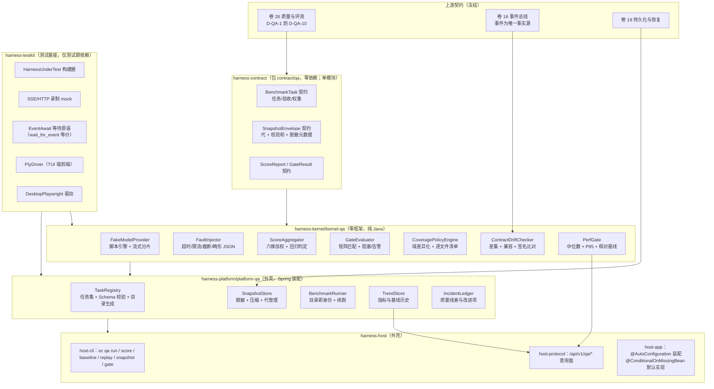
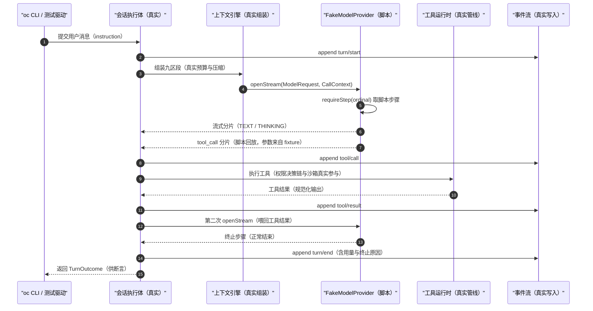
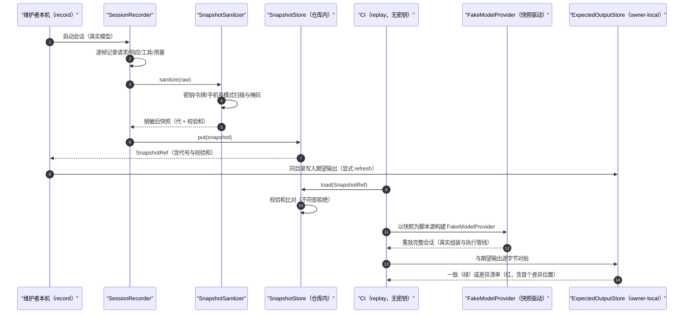
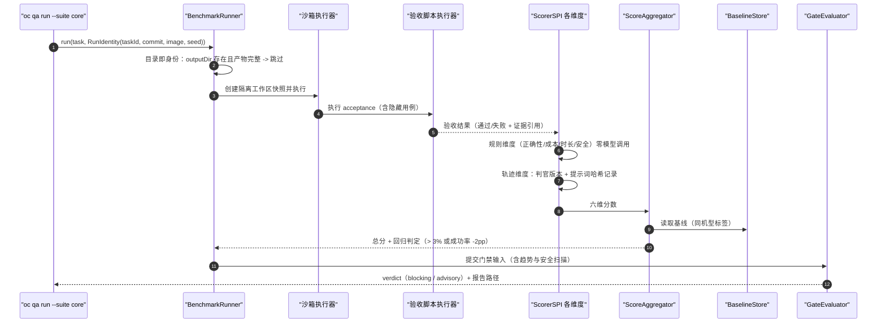
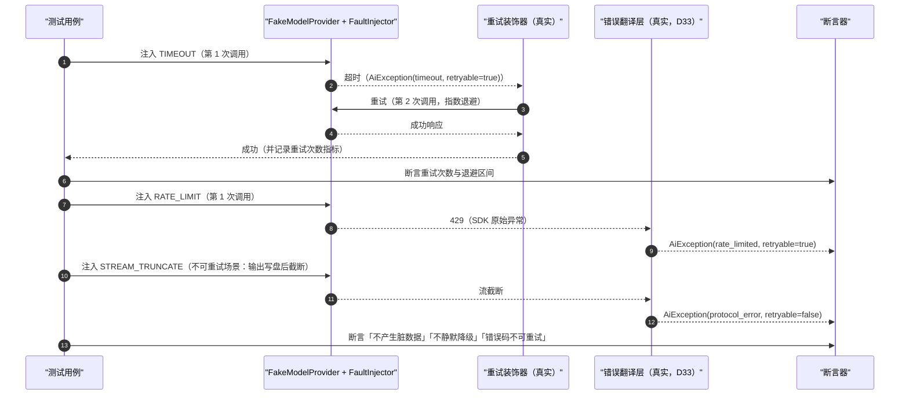
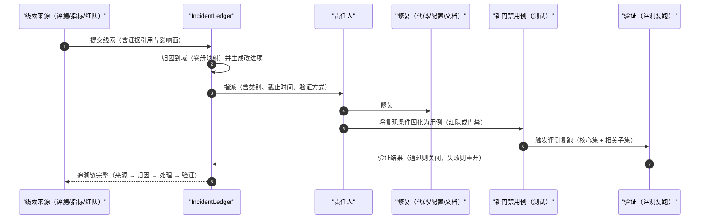
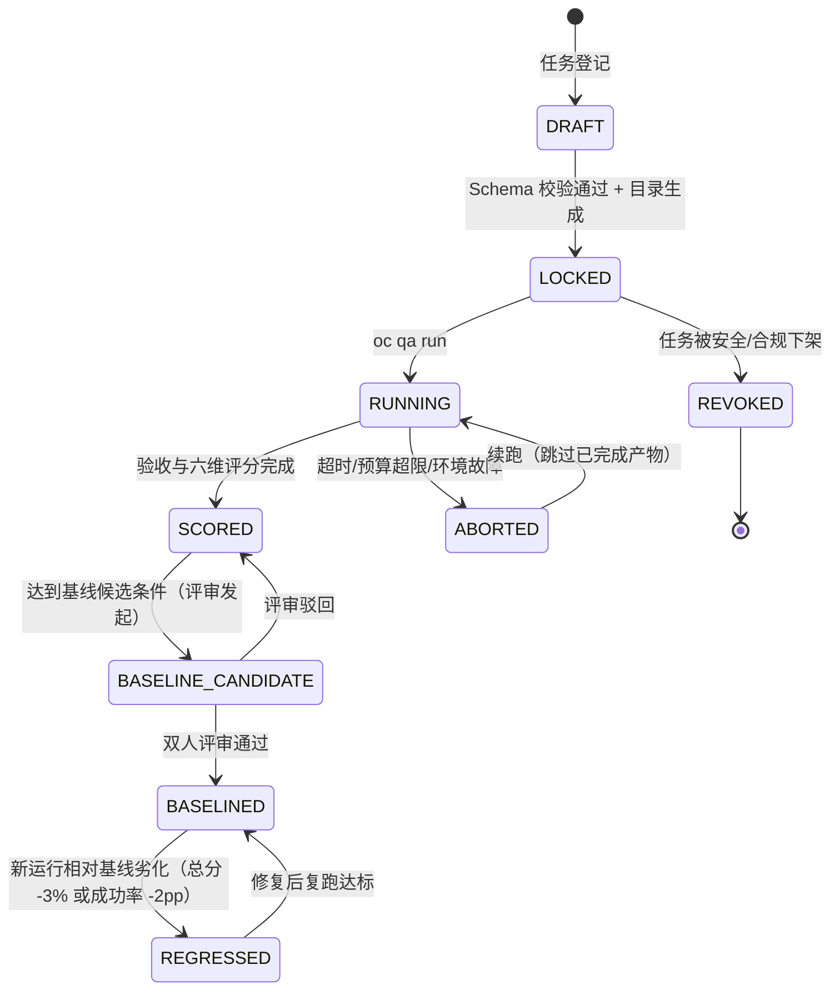
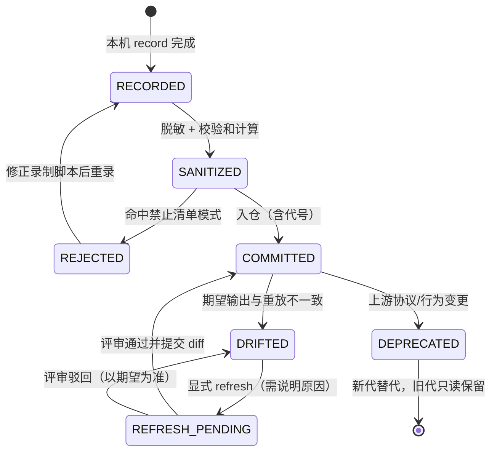

# 实现方案 33 · 质量、评测与门禁（Quality & Evaluation Implementation）

> 本文件是 Phase B 实现层方案，对应 Phase A 卷 26（`docs/harness/26-quality-evaluation-roadmap.md`）的域内决策 D-QA-1…10 与需求 REQ-QA-1…8（`00-vision-and-product.md` §5.26），
> 并落实研究台账 `research/LESSONS-AND-ADOPTIONS.md` 中落在本文件的六行采纳项 **L-029 / L-050 / L-052 / L-073 / L-077 / L-081**。
>
> 上游契约不可修改：凡与卷 26 表述冲突之处，本文件只记录「反驳证据 + 建议修订」，不改 Phase A 卷册（见 §⑩.11）。
> 证据标记沿用 `00-research-plan.md` §2：`[E1]` 源码｜`[E2]` 官方文档｜`[E3]` 第三方｜`[E4]` 推断（含推理链）。
> 实现落点：`harness-contract`（包 `contract/qa`，**单模块口径**——原写的 `harness-contract/contract-qa` 子模块形式废弃）＋ `harness-kernel/kernel-qa`（假模型脚本引擎、故障注入器、评分器核心，零框架；**扩展模块**，待登记）
> ＋ `harness-platform/platform-qa`（任务集、快照仓、基准运行器、趋势数据；**扩展模块**，待登记）＋ `harness-testkit`（测试基座：Testcontainers、脚本化协议客户端、PTY 驱动、SSE mock；**根级扩展模块**，卷 27 §4.1 未列，待登记；仅测试期依赖，不得进生产 classpath）
> ＋ `harness-host/host-cli`（`oc qa ...` 命令面）＋ `harness-host/host-protocol`（QA 查询面）＋ `harness-host/host-app`（装配 `@ConditionalOnMissingBean`）。
> **落地登记（R07；清单见 `reviews/R07-scope-build-platform.md`）**：**实施顺序**——横切全域：最小门禁（`scripts/ci/gate.mjs --profile fast`、单测/覆盖率门）须随第 **1** 步（契约骨架 + Enforcer）就位并逐步骤生效；完整评测（假模型脚本、快照、基准、评分维度）随第 **9/15** 步之后。**数据迁移批次**——`oc_qa_*` 未在卷 27 §4.4 明列 → 建议新批次 **B11 质量与运维**（与 `34` 同批）。**表所有权**——`oc_qa_improvement_item` 拥有者本文件（`34` 只引用，不另建）。**I- 决策落点**——`I-QA-1…10`（10 条）模块落点为上表，类级落点见 §⑤；逐条绑定登记为 R07 建议 S4。

---

## ① 实现目标与范围

### 1.1 本组件解决什么

把「做完了、做对了、没变差」变成**机械可判定的三件事**：

1. **离线可复现**：任一会话/回合/压缩行为都能在**无真实模型凭证**的条件下被重放（假模型脚本 + 录制快照 + 期望输出），且重放结果与记录时逐字节可对拍；
2. **劣化可判定**：基准任务集 + 六维评分 + 基线版本化 + 回归阈值，把「变差了」变成 CI 失败而不是人的感觉；评测产物的目录结构本身即实验身份（L-050）；
3. **门禁可执行**：变更类型 × 必过检查的矩阵以声明式配置表达，阻塞/告警两档分明；开发者本机用**同一个入口、同一顺序**复跑 CI 门禁（避免「本地过、CI 挂」）。

同时提供四条稳定的能力面：假模型的**可编程响应脚本**（含流式分片与工具调用回放）、**故障注入**（超时/限流/截断/畸形 JSON/网络抖动）、**录制回放**（脱敏快照 + owner-local 期望输出）、**离线基准与评分**（任务集 + 评分器 + 人工校准 + 趋势看板）。

### 1.2 不解决什么

- 不实现各业务域的 DoD 明细（分散在各卷，本组件只提供「执行与判定」的机械装置）；
- 不实现实验治理与灰度发布（卷 25 / 卷 28）；
- 不实现评测任务集的内容创作（属于运营资产，本组件提供结构与校验）；
- 不实现生产在线指标的采集管道（卷 16 事件流 + 卷 24 可观测），只**消费**其派生指标做看板与门禁。

### 1.3 与 Phase A 的对应关系

| Phase A 决策 | 本文件落实位置 |
| --- | --- |
| D-QA-1 五层测试体系（单元/集成/契约/端到端/混沌） | §③ D-IQA-1/5、§④ 架构、§⑪.1–§⑪.3 |
| D-QA-2 离线评测任务基准（环境快照 + 验收脚本 + 权重） | §③ D-IQA-3、§⑤ `BenchmarkTask`、§⑧ `oc_qa_task` |
| D-QA-3 六维评分模型（40/20/15/10/10/5） | §③ D-IQA-4、§⑤ `ScoreAggregator`、§⑥.3、§⑧ `oc_qa_score` |
| D-QA-4 在线指标 8 项 + 看板 | §② REQ-QA-25、§⑨.4 趋势查询端点、§⑩.6 |
| D-QA-5 变更门禁矩阵（10 类） | §③ D-IQA-5、§⑤ `GateMatrix`、§⑥.3、§⑧ `oc_qa_gate_rule` |
| D-QA-6 安全红队 10 类 × 60+ 用例 + 季度复核 | §② REQ-QA-26、§⑪.3、§⑪.6 |
| D-QA-7 性能容量 8 场景基准 | §② REQ-QA-22/23、§⑧ `oc_qa_perf_sample`、§⑩.3 |
| D-QA-8 反馈闭环（采集 → 归因 → 改进 → 验证） | §⑥.5、§⑧ `oc_qa_incident`、§⑨.2 `/qa/incidents` |
| D-QA-9 路线图 P0–P4 退出条件 | §⑪.6（每期验收报告模板由本组件的报告器产出） |
| D-QA-10 风险登记册季度复评 | §⑧ `oc_qa_incident` 与风险项的关联字段、§⑪.6 |

---

## ② 功能需求清单（REQ-QA-n）

| REQ | 需求描述 | 来源 | 优先级 | 验收要点 |
| --- | --- | --- | --- | --- |
| REQ-QA-01 | 五层测试体系落成可运行基座：① 单元（内核纯逻辑、无 IO、无 Spring）② 集成（Testcontainers PG/Redis + 真实文件系统）③ 契约（协议/SPI/事件 Schema/四协议适配）④ 端到端（CLI 脚本化 + 桌面 Playwright）⑤ 混沌（故障注入） | 卷 26 §2 D-QA-1 | P0 | 五层各自有独立 gate 入口；任一层在 CI 缺跑即门禁失败；内核层断言「零 Spring 依赖」（import 检查） |
| REQ-QA-02 | 假模型**可编程响应脚本**：按脚本序号/匹配串选择响应，支持流式分片（含超长分片与空分片）、思考块、工具调用、结构化输出、多轮终止 | 卷 26 §2 契约层「录制回放（假模型可编程响应）」 | P0 | 脚本可表达 8 种终止形态（正常/长度截断/工具/拒答/空响应/畸形/超时/取消）；未匹配到脚本步骤时**显式失败**而非静默兜底 |
| REQ-QA-03 | 假模型**无密钥可回放**：经出厂 profile（`oc --profile headless` 等）启动完整 harness，跑真实组装与执行管线，仅模型出口被替换；断言点不需要任何真实凭证 | 竞品 DeepSeek `vitest.snapshot.config.ts`（`DSH_SNAPSHOT=record\|refresh`）与 `vitest.web.perf.config.ts`（`DSH_SNAPSHOT=replay`）[E1]（`04-deepseek-harness.md` §4.24） | P0 | CI 环境无 `*_API_KEY` 变量时可完整跑通录制回放套件；网络断言（无出网连接）通过 |
| REQ-QA-04 | 录制会话快照：**写入前脱敏** + 内容校验和 + 版本化格式（代 generation）+ 撕裂尾自动修复 | 卷 26 §3.3；竞品 DeepSeek `session.jsonl[.zstd]` 代管理与「已提交代永不重命名」[E1]（`04-deepseek-harness.md` §4.12） | P0 | 快照内密钥/令牌模式命中数为 0；校验和不符即拒绝加载；截断文件被识别为撕裂并修复或明确拒绝 |
| REQ-QA-05 | **owner-local 期望输出**：期望输出文件与用例同目录、由用例所有者维护；刷新（refresh）必须显式指定且在工作区留下 diff，禁止 CI 自动刷新 | 竞品 DeepSeek `vitest.expected.config.ts`（`DSH_SNAPSHOT=refresh`）[E1]（`04-deepseek-harness.md` §4.24） | P1 | 期望文件路径与用例文件同目录（校验器断言）；CI 中 refresh 开关被强制关闭；刷新提交需在 PR 描述说明差异原因 |
| REQ-QA-06 | 故障注入器：模型超时 / 限流（429）/ 流截断 / 畸形 JSON / 网络抖动（连接重置、分片乱序、分片延迟）/ 凭证失效 / 空响应，可按调用序号与概率注入 | 卷 26 §4.6 混沌清单 C1/C2；卷 26 §2 混沌层 | P0 | 每类注入有对应断言（含「不产生脏数据」「不静默降级」「错误码可重试标记正确」） |
| REQ-QA-07 | 错误翻译与重试断言：SDK 原始异常不得外溢，必须翻译为 `AiException(ErrorCode)`（D33）；重试只认 `ErrorCode.retryable`（D14）；能力不支持抛 `UNSUPPORTED_CAPABILITY` 而非静默降级 | 卷 02 D-MDL / §5.8-4；`agents.md` 编码规范四 | P0 | 注入 8 类故障后断言异常类型与 `ErrorCode`；不存在原始 SDK 异常类名出现在调用方栈帧的用例 |
| REQ-QA-08 | 评测任务结构全字段落地：`taskId` / `name` / `category` / `environment`（镜像或仓库+提交哈希）/ `instruction`（真实口吻）/ `constraints` / `acceptance`（可执行脚本）/ `baseline` / `weight` | 卷 26 §3.1 D-QA-2 | P0 | 缺 `acceptance` 或 `environment` 的任务在登记期被拒；任务文件有 Schema 校验并生成目录（freshness 门禁） |
| REQ-QA-09 | 六维评分器与总分：成功率 40% / 正确性与质量 20% / 成本效率 15% / 时长效率 10% / 安全性 10% / 轨迹质量 5%；回归定义 = 总分下降 > 3% 或成功率下降 > 2pp | 卷 26 §3.2 D-QA-3 | P0 | 评分报告含六维明细与总分；回归判定用例（构造 -3.1% 与 -2.1pp 各一）分别触发/不触发 |
| REQ-QA-10 | 评分器分层：确定性规则优先（验收脚本、lint、回归用例、成本/时长/安全扫描），LLM 判官仅用于主观维度（轨迹质量），人工抽样 ≥ 10% 且与机器分对账 | 卷 26 §3.2/§11 开放问题 | P1 | 规则维度不调用任何模型（网关断言）；判官得分与人工分偏差 > 1 分（5 分制）时进入校准队列 |
| REQ-QA-11 | **目录即实验身份**：运行输出目录编码 `taskId + commit + 环境镜像摘要 + seed`；可续跑（已有产物默认跳过、显式 `redo` 才重跑）；目录元数据可反查运行参数 | 研究台账 L-050（`09 §⑤ S10` swe-agent `run_batch.py:75-127`）；卷 26 D-QA-2 | P0 | 任一产物目录可由目录名反解实验身份（对拍用例）；重复运行默认 0 次模型调用（调用计数断言） |
| REQ-QA-12 | 基线版本化管理：基线随版本更新且需 ≥ 2 人评审；基线变更入库并产生事件；禁止通过下调目标「修复」回归 | 卷 26 §3.3、§11；卷 32 §2「不允许通过下调目标来修复」 | P0 | 基线更新走审批端点（单人调用被拒）；历史基线可回查；「基线被下调但无评审记录」在审计检查中为 0 条 |
| REQ-QA-13 | CI 门禁矩阵声明式化：变更类型 × 必过检查（10 类）为配置文件；每条检查标注**阻塞（blocking）/ 告警（advisory）**两档；矩阵变更需评审 | 卷 26 §4.2 D-QA-5 | P0 | 矩阵可被测试遍历（每类变更生成一条门禁运行）；advisory 不阻塞合并但必须产出报告条目 |
| REQ-QA-14 | **端点覆盖强制门禁**：生成端点清单（OpenAPI）与测试清单做差集，存在未覆盖或 `@Disabled` 跳过的端点即 CI 失败 | 研究台账 L-073（`02 §⑧ L8` `httpapi-exercise.ts --mode coverage --fail-on-missing --fail-on-skip`）[E1] | P0 | 新增一个端点但不加测试 → 门禁失败并列出差集；跳过需显式白名单并写明理由 |
| REQ-QA-15 | 契约测试与漂移检测：五类契约（事件 Schema、插件 SPI、四协议模型适配、A2A、MCP）+ 生成式目录 freshness + 文档代码块与源码签名比对 | 卷 26 §2；研究台账 L-081（`04 §8 L14` + `05 §8 M12`）；卷 16 D-EVT-2 | P0 | 五类契约各有用例集；目录与代码不一致即失败；文档中 Java 签名块与源码不一致即失败 |
| REQ-QA-16 | 「模型可见即可重建」离线回放门禁：抽取模型请求历史与事件投影对拍（逐字节），不一致即失败 | 研究台账 L-052（`04 §8 L9` `docs/architecture.md:121-127` `deriveMessages()`）[E1]；卷 16 铁律 3 | P0 | 对拍用例常驻 CI；人为篡改一条事件 payload → 对拍失败且给出首个差异位置 |
| REQ-QA-17 | 覆盖率差异化策略：核心域（Agent 循环、上下文、工具管线、权限决策、工作对象）行 ≥ 80% / 分支 ≥ 70%；**关键包逐文件 100% 覆盖门槛**（无分支遗漏）；其余包不作行覆盖率门槛 | 卷 26 §2 表；竞品 DeepSeek 对源码目录采用逐文件 100% 覆盖门槛 [E4]（推理链：`vitest.*` 多配置分面 + `run-gates.ts` 单入口强校验 [E1]，逐文件阈值未在报告 §4.24 登记 → 属推断，采纳时以本文件 §③ D-IQA-6 的包清单为准） | P0 | 逐文件门槛清单在配置中显式列出（禁止全局 blanket 100%）；核心域低于阈值即失败；新增包默认继承所属域策略 |
| REQ-QA-18 | 覆盖率**反作弊**：禁止为凑覆盖率写无意义测试（断言为空、无断言的 `assertDoesNotThrow`、只为执行路径的调用）；对覆盖率异常提升（Δ > 15pp 且新增测试断言密度 < 阈值）产出告警条目 | 卷 26 §2（「不为覆盖率写无意义测试」为本文件落地约束）；竞品 OpenCode 契约卫生测试与依赖边界测试 [E1]（`02-opencode.md` §4.24） | P0 | 静态检查器（断言密度 + 空测试体检测）在门禁中运行；命中即告警并生成待复核项 |
| REQ-QA-19 | 包卫生与依赖治理门禁：Maven 依赖收敛（重复/冲突版本阻止）、依赖方向铁律校验（core 系不得依赖 Spring/domain/infrastructure）、公共 API 消费者编译检查（下游模块编译失败即破坏性变更） | 竞品 DeepSeek hygiene 三件套（publint + workspace 依赖检查 + NodeNext 消费者检查）[E4]（推理链：报告 §4.22 登记 pnpm `strictDepBuilds` 与供应链治理 [E1]，pubilnt 类检查未逐项登记 → 属推断）；`agents.md` 依赖铁律 | P1 | 依赖方向违规在 CI 失败（架构测试）；消费者编译检查作为 API 变更的阻塞项 |
| REQ-QA-20 | 文档门禁（`test:docs` 等价物）：`docs/harness/*` 代码块与源码签名比对、生成式目录 freshness、术语与决策号交叉引用完整性 | 竞品 DeepSeek `verify-type-equiv` + 生成目录 CI freshness [E1]（`04-deepseek-harness.md` §4.24）；研究台账 L-081 | P1 | 签名块漂移即失败；交叉引用的 `D-`/`L-`/`I-` 号不存在即失败 |
| REQ-QA-21 | UI 快照测试：TUI 文本缓冲快照（逐帧关键态）+ 桌面端 4 条关键旅程 Playwright 截图金样（含主题/缩放两档） | 卷 26 §2 端到端层；竞品 Codex `insta` 快照（`tui/src/snapshots/`）[E1]（`03-codex.md` §4.24）、PTY 端到端基座 [E1]（研究台账 L-073） | P1 | TUI 快照不含绝对路径与时间戳（脱敏断言）；桌面截图差异阈值与人工复核流程明确；刷新走 REQ-QA-05 同一纪律 |
| REQ-QA-22 | 性能门禁：冷启动 / 首 token 延迟 / 压缩耗时 / 大仓索引 / 事件吞吐 / 前端滚动帧率；基线相对回退阈值 + 趋势看板 | 卷 26 §4.4（8 场景基准）；卷 32 §2 SLO；竞品 DeepSeek `benchmarks/` 目录作为性能门禁 [E1]（`04-deepseek-harness.md` §4.24） | P0 | 每项有基线、阈值、运行环境说明与报告；趋势数据保留 ≥ 90 天 |
| REQ-QA-23 | 性能门禁判定纪律：不得用「单次绝对阈值」判失败（防抖动误报），使用中位数 + P95 + 相对基线；环境差异（CI 机型变化）自动标注而非直接判失败 | 卷 26 §4.4；竞品 DeepSeek 基准目录与 perf 配置分面 [E1] | P0 | 同一提交在抖动注入（±15% CPU）下不产生假失败（用例）；机型变更产生「基线需重采」提示 |
| REQ-QA-24 | CI 机读输出：门禁与基准产出 JSON/JSONL 报告 + 稳定退出码（0 成功 / 1 通用失败 / 42 输入错误 / 53 预算或轮次超限） | 竞品 gemini-cli 无头形态 `--output-format text\|json\|stream-json` + 退出码矩阵 [E2]（`08-gemini-cli.md` §①-9、§8 G11） | P1 | 退出码矩阵有测试覆盖；JSONL 每行一个事件且可被下游解析（含 `init`/`message`/`tool_result`/`result` 等价类型） |
| REQ-QA-25 | 在线指标 8 项接入看板并告警（完成率/成本/首 token P95/工具成功率/审批打扰率/采纳率/回退率/满意度）；质量信号（不稳定、偷懒类）事件化后聚合 | 卷 26 §4.1 D-QA-4；研究台账 L-077（`06 §8-12` 事件化信号）[E1] | P1 | 指标全部由事件派生（不新增埋点）；信号指标 `oc_quality_signal_total{kind}` 可查；基线 + 阈值 + 人工复核闭环可用 |
| REQ-QA-26 | 安全红队用例库 ≥ 60 条（10 类）+ 每季度外部视角复核；混沌清单 10 项按季度轮换执行 | 卷 26 §4.3 D-QA-6、§4.6 | P0 | 用例可脚本化运行（含越权/注入/外泄/逃逸/资源耗尽/审批绕过）；季度复核记录入库 |
| REQ-QA-27 | 集成测试基座：`TestCodex` 等价构建器 + SSE/HTTP 录制 mock + **事件等待原语**（`wait_for_event` 等价物，带超时与失败诊断） | 竞品 Codex 集成测试基座（`test_support.rs`、SSE mock、事件等待）[E1]（`03-codex.md` §4.24 登记 `test_support.rs`/`schema_fixtures.rs`）＋ 本文件对齐（等待原语为 Phase B 新增，见 §⑩.11） | P0 | 测试不依赖 `Thread.sleep`（静态检查禁用 sleep 式等待）；等待超时输出「期望事件/实收事件」诊断 |
| REQ-QA-28 | 质量事故复盘闭环：任一质量线索可追溯「来源 → 归因 → 处理 → 验证」；改进项必须落**代码/配置/测试/文档**四类之一，禁止「加强意识」类空项 | 卷 26 §5 D-QA-8；卷 32 §6 硬性规则 | P1 | 改进项缺四类归属即被拒（Schema 校验）；月度复盘输出已关闭项清单并可关联到评测复跑结果 |
| REQ-QA-29 | 评测资产与产物管控：任务集默认不公开（防过拟合）；可发布子集需评审；运行轨迹与产物的访问受租户/角色约束 | 卷 26 §11 开放问题（默认不公开） | P1 | 未授权主体查询任务体返回空；发布子集导出含清单与脱敏证明 |
| REQ-QA-30 | 开发者本机与 CI **同入口同序**复跑：单一 gate 入口（`scripts/ci/gate.mjs` 等价物）按 CI 相同顺序执行子门禁；禁止在仓库根之外任意目录直接跑测试（避免工作目录依赖误判） | 竞品 gemini-cli 单一 `verify.mjs`（与 CI 同序同门禁）[E1]（`CROSS-COMPARISON.md` 评测列）；竞品 OpenCode「改动公开协议后必须在包目录执行 `bun run generate`，禁止手改生成物」[E1]（`02-opencode.md` §4.23） | P0 | 入口输出的门禁顺序与 CI 配置文件一致（一致性用例）；模块外执行测试给出明确提示并拒绝 |
| REQ-QA-31 | **本地开发回路可度量（R06 新增）**：① 命令**全部可复制执行**并按「改哪层跑哪组」给出**测试选择指引**；② 每条命令有**时长预期**（超时即视为门禁退化）；③ 默认**零凭证**（无 `*_API_KEY` 也能跑单元 / 契约 / 集成 / 回放与 `fast` 门禁），仅录制（record）与判官需要凭证且显式声明；④ 首次克隆到「首个绿灯」有明确路径与耗时预期（含依赖下载） | 卷 26 §2 D-QA-1；本文件 §11.5.1（命令与时长表，R06 新增）；`29-developer-ecosystem-impl.md` §11.2（生态侧命令，DX 缺口见 findings R6-DX-1） | P0 | 时长表逐项达标（CI 采集实测并对比预期，超 1.5× 即告警）；`fast` ≤ 8min、`full` ≤ 20min；零凭证用例（CI 环境无任何 `*_API_KEY` 时回放套件全绿 + 零出网断言）；测试选择表覆盖 10 类变更 |

**竞品与台账增量需求说明**：REQ-QA-03/04/05/11/14/17/18/19/20/21/22/24/27/30 来自竞品源码事实与台账落点矩阵（L-050 / L-052 / L-073 / L-081），
其中 REQ-QA-27 的事件等待原语与 REQ-QA-19 的 hygiene 三件套为 Phase B 增量（原研究只登记了部分证据），已在 §⑩.11 登记证据回填要求。

---

## ③ 技术方案选型（M×N 比选）

评分沿用 `README.md` §4：**F 30% / U 20% / S 25% / M 25%**，加权总分 = `(30F + 20U + 25S + 25M) / 10`。

### 3.1 分叉矩阵（十维，每维 3 分支）

| 维度 | 分支 | 描述 | F | U | S | M | 加权 | 结论 |
| --- | --- | --- | --- | --- | --- | --- | --- | --- |
| D-IQA-1 假模型形态 | B1 | 纯打桩（Mockito/WireMock 匹配请求） | 7 | 8 | 6 | 6 | 66.5 | 淘汰（无法表达流式/分片/工具回放） |
| | B2 | **脚本引擎：`ResponseScript` + `ScriptStep` + `FaultInjection`，与真实模型出口同接口** | 9 | 8 | 9 | 9 | **88.0** | **选定** |
| | B3 | 仅真机录制代理（必须联网与原凭证） | 6 | 6 | 7 | 5 | 60.0 | 淘汰（CI 不可离线、成本与合规不可接受） |
| D-IQA-2 快照与期望输出 | B1 | 明文快照提交仓库 | 7 | 9 | 4 | 7 | 66.5 | 淘汰（泄漏风险、体积失控） |
| | B2 | **脱敏快照（代 + 校验和 + 压缩）+ owner-local 期望输出同目录** | 9 | 8 | 9 | 8 | **85.5** | **选定** |
| | B3 | 快照存对象存储（CI 拉取） | 8 | 6 | 8 | 7 | 72.5 | 淘汰（离线开发不可用、评审不可见）；对象存储只用于长历史归档 |
| D-IQA-3 基准运行器 | B1 | JUnit 参数化直接跑任务 | 7 | 7 | 7 | 6 | 67.0 | 淘汰（无法续跑/无法按目录对账） |
| | B2 | **独立运行器 + 目录即身份 + 可续跑** | 9 | 9 | 9 | 8 | **87.5** | **选定** |
| | B3 | 外置评测平台（自建服务） | 8 | 6 | 7 | 6 | 67.5 | 淘汰（企业私有化多一个组件）；接口以 `BenchmarkSinkSPI` 留 |
| D-IQA-4 评分器 | B1 | 纯 LLM 判官 | 8 | 7 | 6 | 7 | 70.0 | 淘汰（不可复现、成本高、易漂） |
| | B2 | **规则优先 + LLM 仅主观维度 + 人工校准 ≥10%** | 9 | 8 | 9 | 8 | **85.5** | **选定** |
| | B3 | 纯人工评分 | 6 | 5 | 9 | 4 | 60.0 | 淘汰（无法每次合并执行） |
| D-IQA-5 门禁形态 | B1 | 分散脚本 + 各 CI 步骤自由组合 | 8 | 7 | 6 | 5 | 65.5 | 淘汰（漂移、不可枚举） |
| | B2 | **声明式矩阵 + 阻塞/告警两档 + 单一入口同序执行** | 9 | 9 | 8 | 9 | **87.5** | **选定** |
| | B3 | 全部门禁一律阻塞 | 9 | 6 | 7 | 8 | 75.5 | 淘汰（抖动类检查阻塞合并会摧毁交付节奏） |
| D-IQA-6 覆盖率策略 | B1 | 全局单一行覆盖率阈值 | 8 | 7 | 6 | 5 | 65.5 | 淘汰（倒逼无意义测试） |
| | B2 | **域差异化 + 关键包逐文件 100% + 变更行覆盖优先 + 反作弊检查** | 9 | 8 | 9 | 8 | **85.5** | **选定** |
| | B3 | 不设覆盖率门禁，仅看趋势 | 6 | 8 | 5 | 5 | 59.5 | 淘汰（核心域质量无从保证） |
| D-IQA-7 UI 快照 | B1 | 全屏像素 diff（桌面端） | 7 | 6 | 6 | 6 | 62.5 | 淘汰（跨机型噪声大、维护昂贵） |
| | B2 | **TUI 文本缓冲快照 + 桌面端关键 4 旅程截图金样（区域裁剪 + 阈值）** | 9 | 8 | 8 | 8 | **83.0** | **选定** |
| | B3 | 仅人工走查 | 5 | 6 | 8 | 4 | 57.0 | 淘汰（回归不可发现） |
| D-IQA-8 契约漂移检测 | B1 | 文档约定 + 人工评审 | 6 | 7 | 8 | 4 | 62.0 | 淘汰（不可机械校验） |
| | B2 | **机械门禁：端点差集 + Schema 兼容 + 生成目录 freshness + 签名块比对** | 9 | 8 | 9 | 9 | **88.0** | **选定** |
| | B3 | 从源码反向生成一切文档 | 7 | 8 | 7 | 7 | 72.5 | 淘汰（丢失设计意图）；仅用于目录类产物 |
| D-IQA-9 性能门禁判定 | B1 | 单次绝对阈值 | 7 | 8 | 5 | 6 | 64.5 | 淘汰（假失败多，团队会关掉门禁） |
| | B2 | **中位数 + P95 + 相对基线；机型变更自动标注** | 9 | 8 | 9 | 8 | **85.5** | **选定** |
| | B3 | 仅月度人工基准 | 6 | 8 | 6 | 4 | 60.0 | 淘汰（劣化发现太晚） |
| D-IQA-10 测试执行入口 | B1 | 仓库根统一 `mvn test` | 6 | 8 | 5 | 4 | 57.5 | 淘汰（工作目录/并行度耦合，误判频繁） |
| | B2 | **单入口脚本按 CI 同序执行模块级命令 + 目录守卫** | 9 | 9 | 8 | 9 | **87.5** | **选定** |
| | B3 | 任意目录自由执行 | 5 | 7 | 4 | 3 | 48.5 | 淘汰（结果不可复现） |

### 3.2 选定要点、被放弃代价与回退触发

| 维度 | 选定要点（对齐依据） | 被放弃分支代价 | 回退触发 |
| --- | --- | --- | --- |
| D-IQA-1 | 脚本引擎与真实 `ModelProvider` 同接口，故障注入作为装饰器叠加（与卷 02 装饰器链同构） | B3 的高保真被放弃；以「真机录制快照」（REQ-QA-03）补足保真度 | 出现脚本无法表达的协议行为（≥ 3 例）→ 扩展 `ScriptStep` 类型枚举而非换方案 |
| D-IQA-2 | 脱敏快照提交仓库保证离线可评审（L-050 目录即身份的前置）；对象存储仅存长历史 | B3 的仓库瘦身被放弃，代价是仓库体积增长 | 快照仓体积 > 200MB → 启用稀疏检出 + 对象存储分层（加载路径不变） |
| D-IQA-3 | 运行器与 JUnit 解耦，目录编码实验身份，续跑默认跳过（对齐 L-050） | JUnit 报告原生集成的便利被放弃 | 续跑跳过语义被误用（假绿）→ 强制每次运行输出「跳过项清单」并要求显式 `--no-skip` 用于发布前 |
| D-IQA-4 | 规则维度零模型调用；判官仅轨迹质量并在报告中标注判官版本与提示词哈希 | LLM 判官的覆盖广度被放弃；主观维度靠人工抽样兜底 | 人工与机器偏差持续 > 1 分 → 暂停判官维度改为纯人工（评测总分重算） |
| D-IQA-5 | 阻塞集合只放「确定性 + 快」检查；抖动类（性能趋势、覆盖率趋势）降为告警 | 「全阻塞」的安全感被放弃，代价是告警需有人负责关闭 | 告警长期无人处理（关闭率 < 50%）→ 提升为阻塞或将检查下线（二选一，禁止挂空） |
| D-IQA-6 | 逐文件 100% 清单显式维护，避免全局 blanket 导致的无意义测试；变更行覆盖优先 | 全局数字的可比性被放弃 | 逐文件清单维护成本失控 → 收敛为「核心域包级 90% + 清单收缩到 5 个包」 |
| D-IQA-7 | TUI 文本快照可评审、可 diff；桌面端裁剪固定区域并允许阈值 | 全屏像素 diff 的严格性被放弃 | 桌面端出现跨机型假差异 > 10% → 降低为「关键组件级快照」 |
| D-IQA-8 | 端点差集与 Schema 兼容为机械判据；签名块比对用注解处理器/测试断言（Java 侧替代 `type-equiv`） | B3 的全自动生成被放弃 | 比对器误报率 > 5% → 缩小比对范围至公共契约包（`harness-contract` 的 `contract/qa`）；v1 名称 `core-api` 已废弃） |
| D-IQA-9 | 相对基线 + 统计量；门禁只在同机型同镜像下比较 | 绝对值的直观性被放弃 | 基线重采频繁（> 每月 1 次）→ 引入机型标签 × 基线矩阵 |
| D-IQA-10 | 单入口与 CI 同序执行（对齐 gemini-cli 单一 gate 入口经验 [E1]） | 自由执行的灵活性被放弃 | 单入口成为瓶颈（> 20min）→ 拆分为 `gate:fast` / `gate:full` 两级（顺序不变） |

### 3.3 实现级决策登记（I-QA-n）

| ID | 主题 | 选定 | 理由与代价 | 回退触发 |
| --- | --- | --- | --- | --- |
| I-QA-1 | 假模型形态 | 脚本引擎 `ResponseScript` + 故障装饰器，同 `ModelProvider` 接口 | 离线可复现、可注入；代价是脚本表达能力需持续维护 | 脚本无法表达 ≥ 3 类协议行为 → 扩展 `ScriptStep` 类型 |
| I-QA-2 | 录制快照 | 脱敏 + 校验和 + 代（generation）+ 撕裂尾修复；仓库内提交 | 离线可评审；代价是仓库体积增长 | 体积 > 200MB → 稀疏检出 + 对象存储分层 |
| I-QA-3 | 期望输出位置 | owner-local（与用例同目录），refresh 需显式且留下 diff | 归属清晰、评审可见；代价是合并冲突概率上升 | 冲突率 > 10% → 按用例目录拆分文件粒度 |
| I-QA-4 | 基准运行身份 | 目录编码 `taskId+commit+镜像摘要+seed`；默认跳过已完成产物 | 可对账、可续跑（L-050）；代价是路径冗长 | 跳过语义导致假绿 → 发布前强制 `--no-skip` |
| I-QA-5 | 评分器 | 规则优先 + 判官仅轨迹质量 + 人工 ≥10% 校准 | 可复现、可归因；代价是主观维度覆盖窄 | 偏差 > 1 分 → 该维度改纯人工 |
| I-QA-6 | 门禁矩阵 | 声明式配置 + blocking/advisory 两档 + 单一入口同序 | 可枚举、可演练；代价是配置需评审维护 | 告警关闭率 < 50% → 升级为阻塞或下线 |
| I-QA-7 | 覆盖率策略 | 域差异化 + 关键包逐文件 100% + 变更行优先 + 反作弊静态检查 | 逼出有意义测试；代价是白名单维护成本 | 维护成本失控 → 清单收缩至 5 个包 |
| I-QA-8 | UI 快照 | TUI 文本缓冲快照 + 桌面端 4 旅程裁剪截图 | 稳定可评审；代价是覆盖场景有限（关键 4 条） | 假差异 > 10% → 组件级快照 |
| I-QA-9 | 性能门禁 | 中位数 + P95 + 相对基线 + 机型标签 | 低假失败；代价是基线管理复杂度 | 基线重采 > 每月 1 次 → 机型 × 基线矩阵 |
| I-QA-10 | 执行入口 | `scripts/ci/gate.mjs` 单入口，与 CI 同序；模块目录守卫；**默认提供 `--profile fast` 与 `--profile full` 两级（同序，full 为超集）** | 本地/CI 一致（REQ-QA-30）；代价是入口脚本需与 CI 保持同步 | **R06 更正**：两级 profile 已作为交付形态落地（§11.5），回退触发收紧为「`fast` > 8min 或 `full` > 20min」→ 进一步拆分或引入增量门禁（按受影响模块裁剪，顺序不变） |

### 3.4 与竞品对照的取舍（research 证据）

| 对照维度 | 竞品证据 | 我们的取舍 | 主动放弃的收益 |
| --- | --- | --- | --- |
| 假模型与回放 | DeepSeek 运行时 wheel 只暴露有序 patch 文件（不暴露完整 Cordis 树）[E1]；OpenCode 快照按文件选择性恢复 [E1] | 采纳「脚本 + 故障装饰器 + 脱敏快照」三层假模型（I-QA-1/2；REQ-QA-04/05） | 不做「真实模型小流量采样评测」的在线路线（离线可复现优先） |
| 期望输出快照 | DeepSeek `vitest.expected.config.ts` + `DSH_SNAPSHOT=refresh` [E1] | 采纳并加「refresh 需显式 + 留 diff」（I-QA-3），防「刷快照掩盖回归」 | 快照维护的人工成本上升 |
| 逐文件覆盖率 | DeepSeek 报告 hygiene 三件套（publint/workspace/NodeNext）与逐文件覆盖率阈值（`competitors/04` §4.24）[E4] | 采纳为「域差异化 + 关键包逐文件 100% + 反作弊」（I-QA-7；REQ-QA-17/18） | 不做全局 100% blanket（防白名单泛化），代价是清单维护 |
| 基准与门禁 | Claude Code 契约生成器 `generated/` 禁手改 + 机械门禁 [E1]；L-073 契约差集即失败 | 采纳为「目录即身份 + 单入口同序 + 声明式门禁矩阵」（I-QA-4/6/10） | 门禁矩阵配置需评审维护（告警关闭率 < 50% 即升级为阻塞） |
| 评测资产公开性 | Goose `validate_extensions` 准入 + MiniMax 独立社区仓 [E1]；REQ-QA-29 要求默认不公开 | 采「任务集与产物默认私有 + 可显式公开」 | 不做公开评测榜，牺牲社区对标叙事 |

---

## ④ 总体架构图



**装配说明**：内核与契约模块零 Spring（`common ← core-api ← core-model/agent/tool/implementation` 依赖铁律的评测侧延伸）；
`platform-qa` 为外壳，纯数据配置类 `QaEvaluationProperties` 不加 `@Component`，由 `@ConfigurationPropertiesScan` 激活；
`host-app` 以 `@ConditionalOnMissingBean` 提供默认装配，企业版可替换 `SnapshotStore`（对象存储实现）与 `BenchmarkSinkSPI`。

---

## ⑤ 类图与关键契约

```mermaid
classDiagram
  class ModelProvider {
    <<interface>>
    +openStream(ModelRequest request, CallContext ctx) ModelStream
  }
  class FakeModelProvider {
    -ResponseScript script
    -FaultInjector injector
    +openStream(ModelRequest request, CallContext ctx) ModelStream
  }
  class ResponseScript {
    +List~ScriptStep~ steps
    +ScriptStep requireStep(int ordinal)
  }
  class ScriptStep {
    +int ordinal
    +StepKind kind
    +String matchOn
    +List~StreamChunk~ chunks
    +ToolCallSpec toolCall
    +FaultSpec fault
  }
  class StepKind {
    <<enum>>
    TEXT
    THINKING
    TOOL_CALL
    STRUCTURED
    REFUSAL
    LENGTH_CUT
    EMPTY
    MALFORMED
  }
  class FaultInjector {
    -FaultProfile profile
    +ModelStream decorate(ModelStream raw, int callOrdinal)
  }
  class FaultKind {
    <<enum>>
    TIMEOUT
    RATE_LIMIT
    STREAM_TRUNCATE
    MALFORMED_JSON
    NETWORK_JITTER
    AUTH_EXPIRED
    EMPTY_RESPONSE
  }
  class SnapshotSanitizer {
    +SessionSnapshot sanitize(SessionSnapshot raw)
  }
  class SnapshotStore {
    <<interface>>
    +SnapshotRef put(SessionSnapshot snapshot)
    +SessionSnapshot load(SnapshotRef ref)
  }
  class ExpectedOutputStore {
    +byte[] load(CaseRef ref)
    +void refresh(CaseRef ref, byte[] actual, RefreshReason reason)
  }
  class BenchmarkRunner {
    +RunOutcome run(BenchmarkTask task, RunIdentity identity, RunOptions options)
  }
  class RunIdentity {
    <<record>>
    +String taskId
    +String commit
    +String imageDigest
    +int seed
    +Path outputDir()
  }
  class ScorerSPI {
    <<interface>>
    +DimensionScore score(ScoreContext ctx)
    +ScoreDimension dimension()
  }
  class ScoreDimension {
    <<enum>>
    TASK_SUCCESS
    CORRECTNESS
    COST
    DURATION
    SAFETY
    TRAJECTORY
  }
  class ScoreAggregator {
    +BenchmarkScore aggregate(List~DimensionScore~ parts, BaselineRef baseline)
  }
  class GateMatrix {
    +GateVerdict evaluate(ChangeKind kind, GateInputs inputs)
  }
  class GateRule {
    +ChangeKind changeKind
    +List~GateCheckRef~ required
    +GateSeverity severity
  }
  class GateSeverity {
    <<enum>>
    BLOCKING
    ADVISORY
  }
  class CoveragePolicyEngine {
    +CoverageVerdict check(CoverageReport report, CoveragePolicy policy)
  }
  class ContractDriftChecker {
    +List~DriftFinding~ check(ContractSet contracts)
  }
  class PerfGate {
    +PerfVerdict evaluate(PerfSample sample, PerfBaseline baseline)
  }
  class QualityIncident {
    +String incidentId
    +IncidentSource source
    +List~ImprovementItem~ items
  }
  class ImprovementItem {
    +ImprovementKind kind
    +String owner
    +Instant dueAt
    +VerifyMethod verify
  }
  class ImprovementKind {
    <<enum>>
    CODE
    CONFIG
    TEST
    DOC
  }

  ModelProvider <|.. FakeModelProvider
  FakeModelProvider --> ResponseScript
  ResponseScript --> ScriptStep
  ScriptStep --> StepKind
  FakeModelProvider --> FaultInjector
  FaultInjector --> FaultKind
  SnapshotStore ..> SnapshotSanitizer
  BenchmarkRunner --> RunIdentity
  BenchmarkRunner --> ScorerSPI
  ScoreAggregator --> ScoreDimension
  ScorerSPI --> ScoreDimension
  GateMatrix --> GateRule
  GateRule --> GateSeverity
  QualityIncident --> ImprovementItem
  ImprovementItem --> ImprovementKind
  SnapshotStore --> ExpectedOutputStore
```



**关键 Java 21 签名（节选，符合 `.qoder/rules/` 五条规范）**

```java
/**
 * 假模型提供者：按脚本回放响应，绝不发起真实网络调用。
 * 与真实 Provider 实现同一接缝，因此组装层、上下文层、工具层的真实代码全部参与。
 */
public final class FakeModelProvider implements ModelProvider {

    private final ResponseScript script;
    private final FaultInjector injector;
    private final CallOrdinalCounter ordinalCounter;

    /**
     * @param script 响应脚本（必填，至少一个终止型步骤）
     * @param injector 故障注入器（可空；为空表示无注入）
     * @param ordinalCounter 调用序号计数器（必填，用于按序号注入故障）
     */
    public FakeModelProvider(ResponseScript script, FaultInjector injector, CallOrdinalCounter ordinalCounter) {
        this.script = Objects.requireNonNull(script, "script 不可为空");
        this.injector = injector;
        this.ordinalCounter = Objects.requireNonNull(ordinalCounter, "ordinalCounter 不可为空");
    }

    /**
     * 打开一次模型流（含流式分片与工具调用回放）。
     *
     * @param request 模型请求（由上下文引擎真实组装，不可为空）
     * @param ctx 调用上下文（含 traceId 与租户标识，不可为空）
     * @return 模型流；注入生效时返回包装后的流
     * @throws AiException 脚本耗尽（SNAPSHOT_NOT_FOUND 语义映射为不可重试）时抛出
     */
    @Override
    public ModelStream openStream(ModelRequest request, CallContext ctx) {
        int ordinal = ordinalCounter.next();
        // 脚本耗尽属于「用例未覆盖的新路径」——必须显式失败，禁止静默返回空响应掩盖缺口
        ScriptStep step = script.requireStep(ordinal);
        ModelStream raw = ScriptStreams.of(step, request, ctx);
        return injector == null ? raw : injector.decorate(raw, ordinal);
    }
}

/** 故障注入画像：按调用序号或概率注入，用于混沌与重试断言。 */
public record FaultProfile(Map<FaultKind, FaultRate> rates, Set<Integer> callOrdinals) {

    /** 校验注入画像：序号集合与概率不可同时为空（否则为无效画像）。 */
    public FaultProfile {
        Objects.requireNonNull(rates, "rates 不可为空");
        if (rates.isEmpty() && (callOrdinals == null || callOrdinals.isEmpty())) {
            throw new HarnessException(ErrorCode.PARAM_INVALID, "故障注入画像无效：既未指定序号也未指定概率");
        }
    }
}
```

---

## ⑥ 核心流程时序图

### 6.1 假模型脚本驱动一次完整 Turn（含流式分片与工具调用回放）

**前置条件**：本机与 CI 均无模型凭证；任务使用 `headless` 出厂 profile；脚本含 `TOOL_CALL` 步骤与终止步骤。
**主路径**：CLI 提交指令 → 会话执行体装配九区段 → 假模型按序回放分片与工具调用 → 工具经真实管线（权限/沙箱）执行 → 回喂结果 → 终止步骤 → `turn/end` 落库并返回 `TurnOutcome`。
**异常与补偿分支**：脚本耗尽、工具参数不合法（校验器拒绝）、流式分片长度异常。
**幂等与并发点**：`CallOrdinalCounter` 按会话隔离计数，保证并行用例互不污染。



### 6.2 录制 → 脱敏 → 快照落盘 → CI 无密钥回放

**前置条件**：录制发生在维护者本机（可使用真实凭证），回放发生在 CI 与任意开发机（无凭证、无出网）。
**主路径**：录制逐帧请求/响应 → 脱敏扫描与掩码 → 快照落盘（代 + 校验和）→ CI 加载并按校验和比对 → 快照驱动假模型重放 → 与期望输出逐字节对拍。
**异常与补偿分支**：脱敏命中禁止清单、校验和不符、撕裂尾；三者均拒绝入仓或拒绝加载。
**幂等与并发点**：快照以「代 + 校验和」为键，同代内容相同则写入幂等（重复写入不产生新代）。



### 6.3 基准运行（目录即身份）与六维评分

**前置条件**：任务集已锁定版本；运行环境为隔离沙箱（卷 07 L1+）；基线与当前提交同机型。
**主路径**：目录即身份（存在且完整即跳过）→ 沙箱内执行 → 验收脚本（含隐藏用例）→ 六维评分 → 与基线比对（回归判定）→ 门禁 verdict + 报告。
**异常与补偿分支**：验收脚本超时、成本超上限、运行中断；中断时可续跑（跳过已完成产物，显式 `redo` 才重跑）。
**幂等与并发点**：`RunIdentity` 作为目录名与幂等键；并发运行按 `taskId` 分片，同一任务不并行两次。



### 6.4 故障注入驱动重试与降级断言

**前置条件**：故障画像含 `TIMEOUT` / `RATE_LIMIT` / `STREAM_TRUNCATE` 三档；重试策略由卷 02 装饰器链提供。
**主路径**：注入点按序号集合注入 → 装饰器按 `ErrorCode.retryable` 决策 → 错误翻译层统一为 `AiException` → 断言器核对重试次数、退避区间与「不产生脏数据」。
**异常与补偿分支**：不可重试错误必须立即可见（不重试）；重试次数上限来自配置（非硬编码）。
**幂等与并发点**：同一 `FaultProfile` 可按序号集合精确注入，保证断言可复现。



### 6.5 质量事故 → 复盘闭环 → 转化为门禁用例

**前置条件**：线索来自评测失败、线上指标异常或红队发现（卷 26 §5 三类来源）。
**主路径**：线索入账 → 归因到域并生成改进项 → 指派（类别/截止/验证方式）→ 修复 → 复现条件固化为门禁用例 → 评测复跑验证 → 通过则关闭。
**异常与补偿分支**：改进项未落四类（代码/配置/测试/文档）之一时被拒（Schema 校验）。
**幂等与并发点**：`incidentId` 为幂等键，同一线索重复上报合并而非重复建单。



---

## ⑦ 状态机

### 7.1 基准运行与基线状态机



### 7.2 快照与期望输出生命周期



---

## ⑧ 数据模型

### 8.1 表（`oc_*`，PostgreSQL，MyBatis-Plus，逐实体 `@TableName` 显式声明）

| 表 | 关键列 | 索引 / 约束 | 说明 |
| --- | --- | --- | --- |
| `oc_qa_task` | `id`、`task_no`、`name`、`category`、`weight`、`locked_version`、`tenant_id`、`created_time` | `uk(task_no)`；`idx(category, locked_version)` | 评测任务主表；`category` 用 `QaTaskCategoryEnum`（code + desc） |
| `oc_qa_task_version` | `id`、`task_id`、`version`、`instruction`、`constraints_json`、`environment_json`、`acceptance_ref`、`content_hash` | `uk(task_id, version)` | 任务版本化；`environment_json` 含镜像摘要与提交哈希 |
| `oc_qa_run` | `id`、`run_no`、`task_id`、`task_version`、`commit_hash`、`image_digest`、`seed`、`output_dir`、`status`、`started_at`、`finished_at` | `uk(run_no)`；`uk(output_dir)`；`idx(task_id, commit_hash)` | 一次运行；`output_dir` 唯一即「目录即身份」的机械保证（L-050） |
| `oc_qa_run_artifact` | `id`、`run_id`、`artifact_kind`、`object_uri`、`size_bytes`、`checksum` | `idx(run_id, artifact_kind)` | 轨迹、日志、diff、报告等产物引用 |
| `oc_qa_score` | `id`、`run_id`、`dimension`、`raw_value`、`normalized_score`、`weight`、`evidence_ref`、`scorer_version` | `uk(run_id, dimension)` | 六维明细；`dimension` 用 `ScoreDimension` 枚举 |
| `oc_qa_baseline` | `id`、`suite_id`、`commit_hash`、`image_digest`、`machine_tag`、`total_score`、`success_rate`、`approved_by`、`approved_at`、`active` | `uk(suite_id, commit_hash, image_digest)`；`idx(suite_id, active)` | 基线；`approved_by` 至少两项（双人评审，REQ-QA-12） |
| `oc_qa_snapshot` | `id`、`snapshot_no`、`generation`、`case_ref`、`checksum`、`format_version`、`sanitized`、`size_bytes`、`repo_path` | `uk(snapshot_no, generation)`；`idx(case_ref)` | 录制快照；`generation` 递增且已提交代不可变 |
| `oc_qa_expected_output` | `id`、`case_ref`、`path`、`content_hash`、`updated_by`、`refresh_reason`、`updated_at` | `uk(case_ref)` | owner-local 期望输出索引（内容存仓库，此处存哈希与归属） |
| `oc_qa_gate_rule` | `id`、`change_kind`、`check_ref`、`severity`、`enabled`、`updated_by`、`updated_at` | `uk(change_kind, check_ref)` | 门禁矩阵；`severity` 用 `GateSeverity` |
| `oc_qa_gate_result` | `id`、`gate_run_no`、`change_kind`、`check_ref`、`verdict`、`severity`、`detail_json`、`created_at` | `uk(gate_run_no, check_ref)` | 门禁结果；advisory 失败也留档（REQ-QA-13） |
| `oc_qa_perf_sample` | `id`、`scenario`、`commit_hash`、`image_digest`、`machine_tag`、`median_ms`、`p95_ms`、`samples`、`created_at` | `idx(scenario, commit_hash, machine_tag)` | 性能采样；`scenario` 用 `PerfScenarioEnum`（冷启动/首 token/压缩/索引/吞吐/帧率） |
| `oc_qa_coverage_snapshot` | `id`、`module`、`line_rate`、`branch_rate`、`per_file_json`、`commit_hash`、`created_at` | `idx(module, commit_hash)` | 覆盖率快照；`per_file_json` 存逐文件明细（REQ-QA-17） |
| `oc_qa_incident` | `id`、`incident_no`、`source`、`domain`、`severity`、`title`、`evidence_ref`、`status`、`closed_at` | `uk(incident_no)`；`idx(source, status)` | 质量线索（来源：评测/指标/红队/复盘） |
| `oc_qa_improvement_item` | `id`、`incident_id`、`kind`、`owner`、`due_at`、`verify_method`、`status` | `idx(incident_id, status)` | 改进项；`kind` 限定代码/配置/测试/文档四类（REQ-QA-28） |

### 8.2 Redis Key（经统一 `RedisKeys` 工厂，禁止拼接）

| Key 用途 | 生成方式 | TTL |
| --- | --- | --- |
| 基准运行互斥锁 | `RedisKeys.lock(RedisKeys.Module.QA, "benchmark-run", taskNo)` | 租约 30 分钟（配置 `open-coding.qa.lock-lease-minutes`） |
| 判官并发闸门 | `RedisKeys.semaphore(RedisKeys.Module.QA, "judge")` | 无 TTL（信号量） |
| 门禁结果缓存 | `RedisKeys.cache(RedisKeys.Module.QA, "gate-verdict", gateRunNo)` | 24 小时（可比对重复触发） |
| 快照加载缓存 | `RedisKeys.cache(RedisKeys.Module.QA, "snapshot", snapshotNo)` | 1 小时（内容哈希为键） |

### 8.3 对象存储前缀与事件类型

- 对象存储前缀：`qa/runs/{runNo}/`（轨迹、日志、报告）、`qa/snapshots/{snapshotNo}/{generation}/`（长历史快照归档）、`qa/evidence/{incidentNo}/`（复盘证据）。
- 事件类型（卷 16 目录，只增不改）：`qa.run.started` / `qa.run.finished` / `qa.score.computed` / `qa.baseline.approved` / `qa.gate.evaluated` / `qa.snapshot.committed` / `qa.perf.sampled` / `qa.incident.opened` / `qa.incident.closed`。
- 质量信号事件（L-077 落地）：`qa.signal.recorded`（载荷含 `kind`：不稳定/偷懒/循环/额度耗尽），作为在线质量观测样本。

---

## ⑨ 接口与扩展点

### 9.1 REST 端点（`harness-host/host-protocol`，统一响应体，错误码用统一枚举）

| 方法 | 路径 | 入参 | 出参 | 主要错误码 |
| --- | --- | --- | --- | --- |
| `GET` | `/api/v1/qa/tasks` | `category`、`page`、`size`（上限来自配置） | 任务分页（不含验收脚本正文） | `FORBIDDEN`、`PARAM_INVALID` |
| `GET` | `/api/v1/qa/runs/{runNo}` | 路径参数 | 运行详情 + 六维评分 | `RESOURCE_NOT_FOUND` |
| `POST` | `/api/v1/qa/runs` | `taskNo`、`commit`、`seed`、`suiteId` | 运行标识（异步） | `QUOTA_EXCEEDED`、`CONCURRENT_CONFLICT` |
| `GET` | `/api/v1/qa/baselines` | `suiteId`、`machineTag` | 基线列表（含审批人） | `FORBIDDEN` |
| `POST` | `/api/v1/qa/baselines/{id}/approve` | 审批意见 | 审批结果（需第二人） | `APPROVAL_INSUFFICIENT` |
| `POST` | `/api/v1/qa/snapshots/{snapshotNo}/refresh` | `caseRef`、`reason` | 刷新结果与新哈希 | `EXPECTED_OUTPUT_MISSING` |
| `POST` | `/api/v1/qa/gates/evaluate` | `changeKind`、提交区间 | 门禁 verdict 与逐项明细 | `GATE_INPUT_INCOMPLETE` |
| `GET` | `/api/v1/qa/trends` | `metric`、`window` | 趋势序列（性能/覆盖率/成功率） | `PARAM_INVALID` |
| `GET` | `/api/v1/qa/incidents` | `source`、`status` | 线索分页与追溯链 | `FORBIDDEN` |

### 9.2 CLI 命令面（`harness-host/host-cli`）

```bash
oc qa task validate --all                # 任务集 Schema 校验 + 生成目录 freshness
oc qa run --suite core --commit HEAD     # 运行核心集（目录即身份，默认跳过已完成）
oc qa run --suite full --no-skip         # 发布前强制全量重跑
oc qa replay --snapshot SNAP-2026-09-01-001   # 无密钥回放
oc qa snapshot record --case C-1023 --profile headless   # 本机录制（维护者）
oc qa snapshot refresh --case C-1023 --reason "协议新增字段"
oc qa gate check --change prompt         # 单类变更门禁
oc qa score report --run RUN-000123 --format jsonl
oc doctor model <provider> --probe       # 端点连通性（无密钥时为 dry-run）
```

### 9.3 SPI 扩展点（对接卷 18 目录）

| SPI | 方法（Java 21 签名） | 默认实现 | 说明 |
| --- | --- | --- | --- |
| `ScorerSPI` | `DimensionScore score(ScoreContext ctx)`；`ScoreDimension dimension()` | 六个内置评分器 | 企业可替换轨迹维度判官 |
| `ScenarioDriverSPI` | `void drive(ScenarioContext ctx)` | CLI/PTY/Playwright 三驱动 | 端到端场景驱动（REQ-QA-21） |
| `SnapshotStoreSPI` | `SnapshotRef put(SessionSnapshot s)`；`SessionSnapshot load(SnapshotRef ref)` | 仓库文件实现 | 企业可换对象存储（分层） |
| `FaultSourceSPI` | `List<FaultProfile> profiles(CaseRef ref)` | 声明式 YAML 加载 | 允许从外部注入画像（演练联动） |
| `GateCheckSPI` | `GateCheckResult run(GateCheckContext ctx)` | 内置 10 类检查 | 新增变更类型时扩展 |
| `BenchmarkSinkSPI` | `void onRunFinished(RunSummary summary)` | 本地归档 | 对接外部评测平台（B3 分支预留） |

### 9.4 配置项（`open-coding.qa.*`，yml 一律 `${ENV_VAR:default}`，敏感项默认留空）

| 配置 | 默认值 | 必填 | 说明 |
| --- | --- | --- | --- |
| `open-coding.qa.suite.core` | `core` | 否 | 核心集名称（每次合并执行） |
| `open-coding.qa.run.lock-lease-minutes` | `30` | 否 | 基准运行锁租约 |
| `open-coding.qa.run.max-concurrent` | `4` | 否 | 并发运行上限（防 CI 资源打爆） |
| `open-coding.qa.coverage.core-line-rate` | `0.80` | 否 | 核心域行覆盖率门槛（REQ-QA-17） |
| `open-coding.qa.coverage.core-branch-rate` | `0.70` | 否 | 核心域分支覆盖率门槛 |
| `open-coding.qa.coverage.per-file-packages` | `kernel-agent,kernel-context,kernel-tool,kernel-permission,kernel-work` | 否 | 逐文件 100% 清单（禁止全局 blanket） |
| `open-coding.qa.perf.relative-threshold-pct` | `10` | 否 | 相对基线劣化阈值（超过即告警/阻塞按场景定档） |
| `open-coding.qa.perf.machine-tag` | `${QA_MACHINE_TAG:unknown}` | 否 | 机型标签（跨机型不做直接比较） |
| `open-coding.qa.judge.model` | 空 | 否 | 轨迹判官模型（留空则轨迹维度转人工抽样） |
| `open-coding.qa.judge.sample-rate` | `0.10` | 否 | 人工校准抽样比例（≥ 10%） |
| `open-coding.qa.snapshot.max-repo-mb` | `200` | 否 | 仓库内快照体积上限（超过触发分层提示） |
| `open-coding.qa.artifact.access` | `tenant` | 否 | 运行产物访问范围（`tenant` / `project`） |

环境变量：`QA_MACHINE_TAG`、`QA_JUDGE_API_KEY`（判官专用、默认留空、缺失时判官维度转人工）、`QA_SNAPSHOT_HOME`（快照根目录）。
以上变量必须同步 `.env.example`（模板是唯一变量清单），敏感项禁止写入 yml 默认值。

### 9.5 错误矩阵（场景 → 错误码 → 对外文案 → 处置）

| 场景 | 错误码 | 对外文案（中文，一律「事实 + 原因 + 动作」三段式；键空间与模板见 `30-interaction-ux-impl.md` §9.6） | 调用方动作 | 服务端动作 |
| --- | --- | --- | --- | --- |
| 任务/运行不存在 | `RESOURCE_NOT_FOUND` | 指定对象不存在（事实）：<id> 未找到或已过期清理（原因）；核对编号，或从列表重新选择（动作） | 核对编号 | 404 + 审计 |
| 无权限（跨租户/跨项目） | `FORBIDDEN` | 无权访问该评测资产（事实）：该资产属于其他租户 / 项目（原因）；可走导出流程或向资产所有者申请（动作） | 走授权 | 403 + 安全审计 |
| 参数非法（分页/枚举） | `PARAM_INVALID` | 请求参数不合法（事实）：<field> 取值超出允许范围 <range>（原因）；按提示收敛参数后重试（动作） | 收敛参数 | 返回合法范围 |
| 预算/并发超限 | `QUOTA_EXCEEDED` | 评测并发已达上限（事实）：当前有 <n> 个运行在执行（原因）；可等待，或降低并发配置后重试（动作） | 稍后重试 | 排队；`max-concurrent` 钳制 |
| 同任务并发运行 | `CONCURRENT_CONFLICT` | 该任务已在运行中（事实）：同一任务不允许并行两次（原因）；可等待既有运行完成，或查看其结果（动作） | 等待既有运行 | 拒绝并返回运行引用 |
| 基线未审批 | `APPROVAL_INSUFFICIENT` | 基线缺少第二人审批（事实）：基线更新需 ≥ 2 人评审（原因）；请另一名评审人批准后生效（动作） | 补审批 | 拒绝生效（双人原则） |
| 期望输出缺失 | `EXPECTED_OUTPUT_MISSING` | 期望输出不存在，无法刷新（事实）：该用例尚未录制期望输出（原因）；先执行 `oc qa snapshot record` 录制后再刷新（动作） | 先录制 | 拒绝 refresh |
| 门禁输入不完整 | `GATE_INPUT_INCOMPLETE` | 门禁输入缺失（事实）：缺少变更区间或变更类型（原因）；补齐输入后重新评估（动作） | 补全输入 | 拒绝评估（不猜类型） |
| 快照校验和不符 | `SNAPSHOT_INTEGRITY_FAILED` | 快照校验失败，已拒绝加载（事实）：内容哈希与登记值不一致（原因）；重新录制该快照，勿手改入仓文件（动作） | 重新录制 | 拒绝回放 + 告警（防篡改） |
| 判官不可用 | —（降级） | —（轨迹维度标注「转人工」） | — | 降级为人工抽样，不静默给分 |

**异常命名约定**（对齐 `impl/README.md` §5.5）：评测内核与假模型（`kernel-qa` 纯逻辑）抛 `HarnessException(ErrorCode, 中文文案)`；宿主与服务侧（`host-qa`）抛 `BusinessException(ErrorCode, 中文文案)`；SDK 异常经错误翻译层转 `AiException`（D33）；全局处理器按 `ErrorCode` 映射；**禁止**裸 `RuntimeException`。

---

## ⑩ 非功能与工程细节

1. **并发模型**：基准运行用虚拟线程池（每任务一虚拟线程）；故障注入与快照加载为纯 CPU/IO 短路，不上线程池；判官调用受 `RedisKeys.semaphore` 信号量限制（默认并发 2），避免评测流量冲击生产配额。
2. **性能预算**：单任务冷启动采集额外开销 ≤ 50ms；快照加载 P95 ≤ 200ms（10MB 级快照）；6 项性能基准采集开销 ≤ 场景耗时的 3%；门禁评估（不含运行）≤ 5s。
   **开发者回路预算（R06 新增）**：单模块级命令 ≤ 8 min（见 §11.5.1 逐项表）；`gate --profile fast` **≤ 8 min**；`--profile full --no-skip` **≤ 20 min**；首次克隆到首个绿灯 ≤ 30 min（含依赖下载）。实测超预期 1.5× 即告警（DX 指标 `oc_qa_gate_duration_seconds{profile}`），并触发 I-QA-10 的拆分/增量回退路径。
3. **容量估算**：快照仓库 200MB 上限（约 400 个中等会话，单快照 ≈ 0.5MB）；运行产物按 90 天保留（轨迹压缩后平均 2MB/任务），单套核心集（60 任务）单次运行约 120MB；趋势数据保留 **365 天**（与卷 31 §10「聚合后保留 1 年」对齐）且按日聚合。
4. **缓存策略**：快照内容哈希为键的解析缓存（1 小时）；门禁结果按 `gateRunNo` 缓存 24 小时；覆盖率快照按 `commit_hash` 缓存并随新提交失效。
5. **失败与降级**：判官不可用时轨迹维度转人工抽样（显式标注而非静默给分）；性能环境异常（机型标签变化）时降级为「仅采集不判定」；快照仓超限时降级为对象存储分层（加载接口不变）。**fail 方向（显式）**：**阻塞型门禁**（契约 / 依赖方向 / 密钥扫描 / 端点覆盖）判定链路不可用时一律 **fail-closed 阻断**（不降级放行，`CI` 以非零码退出）；**advisory 门禁**与轨迹判官不可用时显式降级并标注（不静默给分、不静默通过）——与「预算/权限/审批 fail-closed、观测上报 fail-open」的全局口径一致（评测结果上报失败为 fail-open + WARN，不影响 CI 判定本身）。
6. **安全**：① 快照与证据写入前脱敏（密钥/令牌/手机号模式清单，命中即掩码，命中禁止清单即拒写）；② 产物访问按租户/项目约束；③ 评测沙箱执行（卷 07 L1+）且默认拒绝出网；④ 任务集与运行产物默认不公开（REQ-QA-29）；⑤ 判官密钥独立注入且不落日志。
7. **可观测**：指标 `oc_qa_run_total{status}`、`oc_qa_score_dimension{dimension}`、`oc_qa_gate_verdict{kind,severity}`、`oc_qa_perf_p95{scenario}`、`oc_qa_snapshot_bytes`、`oc_quality_signal_total{kind}`；日志在运行开始/结束、门禁判定、快照写入、刷新操作处打点（含 `runNo` / `gateRunNo` / `snapshotNo`）；追踪 span：`qa.run` → `qa.execute` → `qa.score` → `qa.gate`。
8. **日志与异常纪律**：一律 `@Slf4j` + 占位符；异常必须传 `Throwable`；业务失败抛统一业务异常（禁止裸 `RuntimeException`）；外部判官调用异常必须翻译为业务异常后抛出（不吞）。
9. **回滚与兼容**：门禁矩阵、覆盖率策略、性能阈值均为配置，回滚只需恢复配置版本；快照格式版本化，新版本必须能读旧版本（`format_version` ≤ 当前）；已提交代不可变，回滚靠保留旧代。
10. **可迁移性**：`platform-qa` 之外的模块可独立编译（内核无 Spring），便于把假模型与故障注入复用到企业私有化 CI。
11. **回放确定性（跨平台一致）**：快照与期望输出必须**逐字节**跨平台可比，锁定五类非确定性源 —— ① 路径：快照内路径统一为 POSIX 风格相对路径，比较前经 `PathNormalizer` 归一（盘符 / 分隔符 / 大小写不敏感差异）；② 行尾与编码：文本统一 UTF-8 + LF，`.gitattributes` 强制 `eol=lf`；③ 时钟与随机：轨迹时间戳取自脚本 `virtualClock`（种子固定），回放路径禁止 `Instant.now()` / 未播种 `Random`（架构断言扫描）；④ 集合序：迭代序按插入序或显式排序（`LinkedHashMap` + 稳定排序），JSON 序列化键序固定；⑤ 环境：locale / 时区 / `line.separator` 固定为 `C / UTC / \n`，CI 与开发机用同一容器镜像。**验证**：同一快照在 Windows / macOS / Linux 三平台与 CI 容器各跑一遍，期望输出摘要（SHA-256）四者必须一致，不一致即判定回放确定性缺陷并阻断；`seed` 必须进入 `RunIdentity`，缺失即拒绝运行。
12. **安全边界检查清单（发布门禁逐项勾选）**：

- [ ] 快照与证据写入前经脱敏清单（密钥/令牌/手机号）；命中「禁止清单」即拒写（不是掩码），入仓前双检
- [ ] 快照加载以校验和 + 代为完整性前提，不符即拒绝（防手改快照造成假绿）
- [ ] 评测沙箱执行（卷 07 L1+）且默认拒绝出网；任务集与运行产物默认不公开（REQ-QA-29）
- [ ] 产物访问按租户/项目约束（`artifact.access`）；跨租户查询返回 `FORBIDDEN` 并审计
- [ ] 判官密钥独立注入（`QA_JUDGE_API_KEY`），缺失即转人工；密钥不落日志、不进快照
- [ ] 基线审批双人（`APPROVAL_INSUFFICIENT` 用例）；门禁 blocking/advisory 分档且可演练
- [ ] 覆盖率反作弊静态检查（空断言/恒真断言）在门禁中强制；白名单变更需评审记录
- [ ] 回放确定性：三平台 + CI 容器摘要一致（发布候选必须四者全绿）

13. **Phase A 修订建议（仅登记，不改卷册）**：
    - 建议卷 26 §2 覆盖率行补一句「关键包逐文件 100%（清单见 `33-quality-eval-impl.md` §⑨.4 `per-file-packages`）」，避免实施时误解为全局 100%；
    - 建议卷 26 §4.5 的 J1–J12 旅程补「TUI 快照与桌面截图金样」判定方式（当前只写断言文本）；
    - 证据回填：竞品 DeepSeek 报告的 hygiene 三件套（publint/workspace/NodeNext）与逐文件覆盖率阈值未被 §4.24 逐项登记，本文件按 `[E4]` 采纳并给出推理链，建议研究台账补登一行以便追溯。
    - **（R06 新增）开发回路时长预算入卷**：建议卷 26 §4.4 或 §9 DoD 补一句「本地 `fast` 门禁 ≤ 8 min、发布前 `full` ≤ 20 min、首次克隆到首个绿灯 ≤ 30 min（含依赖下载）」，使 DX 与性能门禁同级治理（本文件 §11.5.1 已给出逐项表与 CI 告警阈值）。
    - **（R06 新增）零凭证范围需在卷册显式声明**：卷 26 §2 只写「录制回放（假模型可编程响应）」，未声明「CI 与本地全链路零凭证」；建议补「除录制与轨迹判官外，全部测试层与 `fast` 门禁在无模型凭证、无出网条件下必须可跑通」（本文件 REQ-QA-03/REQ-QA-31 已落地）。

---

## ⑪ 测试与验收（DoD）

### 11.1 单元与契约测试（纯内核，无 IO、无 Spring）

- `ResponseScriptTest`：脚本耗尽显式失败；8 种 `StepKind` 各有用例；流式分片长度边界（1 字节 / 超大分片）不破坏协议解析。
- `FaultInjectorTest`：按序号与概率两种注入方式可复现；`FaultProfile` 空画像被拒（业务异常文案含原因）。
- `ScoreAggregatorTest`：六维权重和 = 100%；`-3.1%` 触发回归、`-2.9%` 不触发；成功率 `-2.1pp` 触发、`-1.9pp` 不触发（REQ-QA-09）。
- `GateMatrixTest`：10 类变更逐类生成门禁运行；blocking 失败 → 合并被拒，advisory 失败 → 仅告警（REQ-QA-13）。
- `CoveragePolicyEngineTest`：核心域低于门槛失败；逐文件清单内任一文件未达 100% 失败；清单外模块不失败；反作弊检查命中空断言用例（REQ-QA-17/18）。
- `ContractDriftDetectorTest`：端点差集（新增未测）、Schema 破坏性变更、目录 freshness、签名块漂移四类各一用例（REQ-QA-14/15/20）。
- `PerfGateTest`：抖动注入（±15%）不产生假失败；真实劣化 12% 触发；机型标签变化产出「基线需重采」而非失败（REQ-QA-23）。
- `RunIdentityTest`：目录名可反解身份；重复身份拒绝创建第二目录（REQ-QA-11）。

### 11.2 集成测试（Testcontainers：PG + Redis；真实文件系统；假模型）

- **无密钥回放**：CI 环境（无任何 `*_API_KEY`）下，录制快照套件全绿；网络断言证明零出网连接（REQ-QA-03）。
- **全链路真实参与**：回放路径中上下文组装、权限决策、工具管线、事件写入均为真实实现（以事件计数与工具执行证据断言，禁止 mock 替换）。
- **快照台账**：脱敏后密钥模式命中 0；校验和不符拒绝加载；撕裂尾（人为截断）识别与修复；已提交代不可变（覆盖写入被拒）（REQ-QA-04）。
- **端点覆盖门禁**：新增一个 REST 端点但不加测试 → 门禁失败并列出差集；白名单跳过需含理由字段（REQ-QA-14）。
- **「模型可见即可重建」对拍**：抽取模型请求历史与事件投影逐字节一致；篡改一条事件 payload → 对拍失败并给出首个差异位置（REQ-QA-16）。
- **续跑语义**：重复运行默认 0 次模型调用；`--no-skip` 强制全量；跳过项清单出现在输出中（REQ-QA-11）。
- **UI 快照**：TUI 快照无绝对路径/时间戳（正则断言）；桌面端 4 旅程截图金样差异在阈值内；刷新走 owner-local 纪律（CI 中 refresh 被拒）（REQ-QA-21）。
- **集成基座自检**：禁止 `Thread.sleep` 等待（静态检查）；`EventAwait` 超时输出期望/实收事件清单（REQ-QA-27）。

### 11.3 故障注入与混沌（DoD 硬项）

| 注入点 | 期望行为 |
| --- | --- |
| 模型超时（+2s / +10s） | 超时分类正确（可重试标记正确）、退避区间符合配置、不产生脏数据（REQ-QA-06/07） |
| 限流 429 | 重试受上限约束；超限后显式失败并联动预算告警（卷 31） |
| 流截断 / 乱序 | 协议错误被翻译且不可重试（写盘后截断场景）；不产生半条消息 |
| 畸形 JSON / 空响应 | 显式协议错误 + WARN 日志（含 traceId，不含正文敏感字段） |
| 网络抖动（连接重置） | 重试后成功；重试次数指标可观测 |
| 凭证失效（401） | 立即失败（不重试）+ 运维手册 RB-06 关联提示 |
| 存储只读（事件写入失败） | 主流程暂停（拿到确认才算提交）、显式报错（卷 26 §4.6 C3） |
| 消费者滞后 10 分钟 | 告警触发、前端状态提示、恢复后追平（C4） |
| Redis 清空（缓存全失效） | 性能下降但功能正确、无数据不一致（C6） |
| 磁盘配额打满 | 快照/外置降级、核心写入保命（C8） |

### 11.4 性能门禁与红队

- 性能门禁（相对基线，同机型）：冷启动中位数劣化 ≤ 10%；首 token P95 ≤ 1.5s（卷 26 §4.1）；压缩耗时劣化 ≤ 10%；大仓索引 ≤ 10min（增量 ≤ 30s）；事件吞吐 ≥ 50k EPS；前端流式滚动 ≥ 55fps。
- 红队：10 类 ≥ 60 用例全绿（卷 26 §4.3），其中「审批绕过」「审计规避」两类必须与卷 06/16 的用例集交叉引用去重；每季度外部视角复核记录入库。

### 11.5 验收命令（可直接运行）

```bash
mvn -pl harness-kernel/kernel-qa -am test                     # 脚本引擎/注入器/评分器/门禁判定单元与契约门禁
mvn -pl harness-platform/platform-qa -am test                 # 任务集/快照台账/运行器（PG + Redis 容器）
mvn -pl harness-testkit -am test                              # 基座自检（禁 sleep、等待原语诊断、SSE mock；根级扩展模块，待卷 27 §4.1 登记）
mvn -pl harness-host/host-cli -am test -Dtest='QaCli*Test'    # 命令面契约（含退出码矩阵 0/1/42/53）
./scripts/ci/gate.mjs --profile fast                          # 单入口门禁（与 CI 同序；覆盖/差集/漂移/性能）
./scripts/ci/gate.mjs --profile full --no-skip                # 发布前全量（强制重跑 + 红队 + 性能门禁）
oc qa replay --suite core --snapshot-dir harness-testkit/src/test/resources/qa/snapshots
```

### 11.5.1 本地开发回路（R06 新增：命令 + 时长预期 + 测试选择指引）

**零凭证前提（硬约束）**：下表命令**全部不需要任何模型凭证**（REQ-QA-03 的落地形式）；唯一例外是「录制快照」（`oc qa snapshot record`，维护者本机）与轨迹判官（`QA_JUDGE_API_KEY`，缺失即转人工抽样，**不阻塞门禁**）。CI 环境无任何 `*_API_KEY` 时必须能跑完 `fast` 门禁（零出网断言）。

**「改哪层跑哪组」测试选择指引**：

| 我改了什么 | 最小必跑集合（可直接复制执行） | 预期时长（本机 P95） | 何时升级到 fast / full |
| --- | --- | --- | --- |
| 单个内核类（无契约变更） | `mvn -q -pl harness-kernel/<module> -am test -Dtest=<Class>Test` | ≤ 1 min | 触达公共契约或事件 Schema → `fast` |
| 内核模块整体 | `mvn -q -pl harness-kernel/<module> -am test` | ≤ 3 min | 跨模块行为变化 → `fast` |
| 契约 / 事件 Schema / SPI | `mvn -q -pl harness-contract -am test -Dgroups=contract` | ≤ 5 min | 生成物变化（SDK / 生成目录）→ `full` |
| 假模型脚本 / 快照 / 期望输出 | `oc qa replay --suite core --snapshot-dir <dir>` + `mvn -pl harness-kernel/kernel-qa -am test` | ≤ 6 min | 触动提示词或模型出口 → `full` |
| 外壳（`host-*`）/ REST 端点 | `mvn -q -pl harness-host/<module> -am test` | ≤ 6 min | 新增端点（端点差集门禁）→ `full` |
| CLI / TUI 呈现与键位 | `mvn -q -pl harness-host/host-cli -am test` + `./scripts/ci/cli-pty-e2e.sh` | ≤ 8 min | 键位 / 降级矩阵变化 → `full` |
| 桌面端（Vue / IPC） | `pnpm -C client --filter @open-coding/app test` + `pnpm -C client --filter @open-coding/sdk generate --check` + `pnpm -C client --filter @open-coding/app run gen:ipc --check` | ≤ 6 min | 通道清单变化 → `full` |
| 文档（`docs/harness/*`） | `./scripts/ci/gate.mjs --profile docs`（签名块比对 + 目录 freshness + 交叉引用完整性） | ≤ 2 min | —（文档门禁非阻塞合并以外的事项） |
| **合并前（任何提交）** | `./scripts/ci/gate.mjs --profile fast` | **≤ 8 min** | — |
| **发布前 / 契约冻结** | `./scripts/ci/gate.mjs --profile full --no-skip` | **≤ 20 min** | — |

**首次克隆到首个绿灯（新人路径）**：`git clone` → `mvn -q -pl harness-kernel/kernel-qa -am test`（首次含依赖下载，**预期 ≤ 15 min**；命中镜像或本地仓库时 ≤ 5 min）→ `oc qa replay --suite core`（零凭证）→ `./scripts/ci/gate.mjs --profile fast`（≤ 8 min）。**总预算 ≤ 30 min（含依赖下载）**，超出即视为入门体验退化并进体验周报。

**时长门禁**：上表数字进 CI——实测耗时与预期对比，**超 1.5× 即告警**（趋势数据保留 90 天）；`fast` / `full` 超过预算即阻塞构建并触发 I-QA-10 的回退路径（拆分或增量门禁）。时长数据本身是 DX 指标（`oc_qa_gate_duration_seconds{profile}`，R06 新增）。

**测试选择的反面纪律**：禁止「全量一把梭」（`full` 是发布前动作，不是日常回路）；禁止在仓库根之外任意目录直接跑测试（REQ-QA-30 目录守卫）；禁止用 `Thread.sleep` 等待事件（REQ-QA-27）。

**生态侧缺口**：`29-developer-ecosystem-impl.md` §11.2 的命令**未**附时长预期与测试选择指引（该文件不在 R06 可修改范围），已登记为 findings `R6-DX-1`，建议下一轮补齐同格式的时长表。

### 11.6 DoD 清单（对应卷 26 §9）

- [ ] 五层测试体系在 CI 全部运行；核心域覆盖率达标；关键包逐文件 100% 清单生效且反作弊检查常驻。
- [ ] 核心评测集 ≥ 60 任务可复现（环境快照 + 验收脚本 + 权重 + Schema 校验）；基线版本化且双人评审约束生效。
- [ ] 六维评分器可用并输出报告；回归判定（> 3% 或 -2pp）自动执行且有用例覆盖。
- [ ] 在线指标 8 项接入看板并可告警；质量信号（L-077）可聚合查询。
- [ ] 门禁矩阵 10 类在 CI 强制；单入口与 CI 同序（REQ-QA-30）可用；advisory 项有责任人关闭机制。
- [ ] 假模型可编程脚本 + 无密钥录制回放 + owner-local 期望输出三件套可用（REQ-QA-02/03/05）。
- [ ] 红队 60+ 用例全过；季度外部复核机制运行；混沌清单 10 项轮换执行并产出报告。
- [ ] 性能容量基准（8 场景）达标且有报告；趋势看板可用且保留 ≥ 90 天。
- [ ] 反馈闭环：任一线索可追溯「来源 → 归因 → 处理 → 验证」；改进项四类归属强制（REQ-QA-28）。
- [ ] 路线图 P0–P4 每期验收报告由本组件报告器产出（评测总分、指标对比、红队结果、已知限制、遗留项）。
- [ ] **本地开发回路可度量（R06）**：§11.5.1 的命令全部可复制执行且**零凭证**；测试选择指引覆盖 10 类变更；时长门禁进 CI（超预期 1.5× 告警）；`fast` ≤ 8min、`full` ≤ 20min；首次克隆到首个绿灯 ≤ 30min（含依赖下载）。
- [ ] **文案纪律（R06）**：评测相关错误与状态文案全部经 `30-interaction-ux-impl.md` §9.6 键空间与「事实 + 原因 + 动作」三段式；缺动作段的文案被 CI 拦截。
