# 实现方案 34 · 运维运行时与演练（Operations Runtime Implementation）

> 本文件是 Phase B 实现层方案，对应 Phase A 卷 32（`docs/harness/32-operations-runbook.md`）的域内决策 D-OPS-1…7 与需求 REQ-OPS-1…7（`00-vision-and-product.md` §5.32），
> 并与卷 24（部署与可观测）、卷 31（容量与成本）、卷 19（持久化与恢复）、卷 07（沙箱）、卷 26（质量与门禁）交叉对齐。
>
> 上游契约不可修改：与卷 32 表述冲突之处只记录「反驳证据 + 建议修订」，不改 Phase A 卷册（见 §⑩.11）。
> 证据标记沿用 `00-research-plan.md` §2：`[E1]` 源码｜`[E2]` 官方文档｜`[E3]` 第三方｜`[E4]` 推断（含推理链）。
> 研究台账 `research/LESSONS-AND-ADOPTIONS.md` 中与本文件相关的行以「引用式落地」处理：**L-050**（目录即演练证据身份，首次落点 `33-quality-eval-impl.md` §③）、
> **L-052**（不变式与兼容纪律，首次落点 `16-event-bus-impl.md` §⑧）、**L-077**（质量/不稳定信号事件化，首次落点 `33-quality-eval-impl.md` §⑧）——
> 本文件按台账矩阵说明以「引用 `L-` 行 + 引用对应 `I-` 决策」方式落地，不重复登记首次落点。
>
> 实现落点：`harness-contract`（包 `contract/ops`，**单模块口径**——原写的 `harness-contract/contract-ops` 子模块形式废弃）＋ `harness-kernel/kernel-ops`（燃尽计算、水位判定、降级顺序决策、幂等步骤内核，零框架；**扩展模块**，待登记）
> ＋ `harness-platform/platform-ops`（探针执行器、告警治理、演练编排、修复执行器、事故时间线；**扩展模块**，待登记）＋ `harness-host/host-cli`（`oc doctor --deep` 与 `oc ops ...`）
> ＋ `harness-host/host-protocol`（`/api/v1/ops/*`）＋ `harness-host/host-app`（装配与特性开关）。
> **落地登记（R07；清单见 `reviews/R07-scope-build-platform.md`）**：**实施顺序**——第 **20** 步之后（依赖第 9/15/19/20 步：探针要持久化、告警要事件与通知、修复要迁移框架与审计）；其中 `/live` `/ready` 最小探针须提前到第 **9** 步（服务起停门禁），属「健康面先行、治理面后置」。**数据迁移批次**——`oc_ops_*` 未在卷 27 §4.4 明列 → 建议新批次 **B11 质量与运维**（与 `33` 同批）。**表所有权**——`oc_qa_improvement_item` 拥有者 `33`（本文件只引用）；`oc_ops_evidence` 与 `19` 的对象存储引用模型一致（引用而非复制内容）。**I- 决策落点**——`I-OPS-1…10`（10 条）模块落点为上表，类级落点见 §⑤；逐条绑定登记为 R07 建议 S4。

---

## ① 实现目标与范围

### 1.1 本组件解决什么

把「出事了按哪一页做」变成**机器可执行、可留证、可复盘**的三件事：

1. **健康可分层判定**：探针分五层（进程 / 内核 / 模型 / 存储 / 沙箱），每层给出可解释结论与**执行强度**（`FULL` / `PARTIAL`），并采用「功能探测而非读配置」（对齐 DeepSeek 用 `bwrap ... -- true` 实测沙箱能力 [E1]）；
2. **SLO 可量化治理**：5 项 SLO + 快/慢燃尽率 + 错误预算账本 + 「违反即冻结发布」的机械判定（不允许通过下调目标「修复」）；
3. **动作可自动执行且可回退**：Runbook as Code（每步命令级、幂等、可断言、留证）、九类演练脚本化（混沌 + 升级 + 回滚 + 恢复）、数据修复三段式（只读诊断 → 灰度修复 → 校验），全部动作产出**证据包**并按 `L-050` 的「目录即身份」组织。

### 1.2 不解决什么

- 不实现可观测技术栈本体（卷 24 §4.2 的指标/日志/追踪后端）；
- 不实现容量模型与成本核算（卷 31）；
- 不实现部署形态与升级包制作（卷 24 §4.5 / 卷 28）；
- 不实现演练的破坏性注入技术本体（复用卷 07 沙箱与测试基座 33 的故障注入器）。

### 1.3 上游 / 下游依赖

| 方向 | 依赖 | 用法 |
| --- | --- | --- |
| 上游 | 卷 16 事件流 | 告警判定、事故时间线、演练证据全部以事件为事实源 |
| 上游 | 卷 26 门禁矩阵与反馈闭环 | 演练与复盘发现的改进项进 33 的 `IncidentLedger`；SLO 违反触发冻结发布门禁 |
| 上游 | 卷 07 沙箱 | 探测沙箱能力、演练中的降级档位 |
| 上游 | 卷 31 容量与成本 | 水位阈值、预算关联（成本异常告警 RB-08） |
| 下游 | 卷 24 可观测 | 本组件产出的指标/日志进统一看板；告警规则由本组件定义 |
| 下游 | 卷 22/23 客户端 | `oc doctor --deep` 与状态页数据源 |

### 1.4 与 Phase A 的对应关系

| Phase A 决策 | 本文件落实位置 |
| --- | --- |
| D-OPS-1 SLO 与燃尽（5 项 + 快/慢 + 违反即冻结） | §③ D-IOPS-3、§⑤ `BurnRateEvaluator`、§⑥.2、§⑧ `oc_ops_slo` |
| D-OPS-2 告警清单（3 级 ≥ 12 条，每条绑定 Runbook） | §③ D-IOPS-6、§⑤ `AlertRule`、§⑥.2、§⑧ `oc_ops_alert` |
| D-OPS-3 Runbook 命令级可执行条目 | §③ D-IOPS-4、§⑤ `RunbookStep`、§⑥.4、§⑧ `oc_ops_runbook_def` |
| D-OPS-4 九类演练 + 报告 + 改进闭环 | §③ D-IOPS-5、§⑥.4、§⑧ `oc_ops_drill_run` |
| D-OPS-5 复盘模板（改进项必落四类） | §⑥.6、§⑧ `oc_ops_postmortem` / `oc_ops_improvement_item` |
| D-OPS-6 值班升级（主副班 + 四级升级 + 五类权限） | §② REQ-OPS-14/24、§⑤ `OnCallShift`、§⑨.4 配置 |
| D-OPS-7 容量水位四级操作 | §③ D-IOPS-7、§⑤ `ScalingPlanner`、§⑥.3、§⑧ `oc_ops_capacity_sample` |

---

## ② 功能需求清单（REQ-OPS-n）

| REQ | 需求描述 | 来源 | 优先级 | 验收要点 |
| --- | --- | --- | --- | --- |
| REQ-OPS-01 | 分层探针：进程（存活/启动完成）/ 内核（Agent 循环、事件追加、会话恢复）/ 模型（端点连通与配额）/ 存储（PG/Redis/对象存储）/ 沙箱（档位能力）；每层输出结论 + 证据 + 耗时 | 卷 32 §3 告警清单；竞品 Codex `codex doctor` 子域（background/disk/network/runtime/sandbox/security/updates…）[E1]（`03-codex.md` §4.22） | P0 | 五层各有独立探针与超时预算；单层失败不阻塞其他层；结论可机读（JSON） |
| REQ-OPS-02 | 探针端点三档：`/live`（进程级，恒定轻量）/ `/ready`（依赖就绪，供负载均衡）/ `/deep`（全五层，带缓存与限流） | 卷 24；卷 32 §3 | P0 | `/live` P99 ≤ 5ms 且无外部调用；`/deep` 缓存窗口内不重复执行（避免探针风暴） |
| REQ-OPS-03 | **功能探测而非假设**：沙箱能力用「实际执行最小命令」验证（bwrap/Seatbelt/ACL 等价探针），存储用「写入并读回」验证，模型端点用「最小请求」验证 | 竞品 DeepSeek `packages/sandbox/sandbox-local/src/index.ts:67-90`（`bwrap ... -- true` 实测 profile 可创建）[E1]；卷 32 §5 | P0 | 配置声称可用但实测不可用时，探针给出 `PARTIAL`/`DOWN` 与原因；关闭沙箱运行时后探针在 ≤ 2 个周期内变红（用例） |
| REQ-OPS-04 | **执行强度上报**：`SandboxEnforcement = FULL \| PARTIAL`，`PARTIAL` 时要求绝对边界的消费者（密钥代理、DLP、修复工具）自行拒绝或降级 | 竞品 DeepSeek `SandboxEnforcement` 与「绝对边界消费者自行拒绝」[E1]（`04-deepseek-harness.md` §4.15） | P0 | `PARTIAL` 下修复工具与密钥代理拒绝执行（用例）；健康面标注降级原因 |
| REQ-OPS-05 | 自愈动作分档：**可逆自愈自动执行**（进程重启、连接池重建、消费并发调整、档位降级）/ **有副作用动作必须人工**（数据修复、扩容缩容、路由切换、租户熔断） | 卷 32 §5 演练与 §7 权限；卷 24 | P0 | 每档动作有白名单配置；绕过白名单调用被拒并有审计事件 |
| REQ-OPS-06 | 自愈**风暴抑制**：同一探针在窗口内连续失败只触发一次自愈；动作执行后进入冷却期；连续 N 次自愈无效则升级为人工事件 | 卷 32 §3 告警质量；卷 16 事件化 | P0 | 注入 10 次连续失败后仅 1 次自愈（计数断言）；无效自愈升级事件可见 |
| REQ-OPS-07 | SLO 定义与计算：协议面可用性 99.9%（30 天）/ 首 token P95 ≤ 1.5s（7 天）/ 事件写入 P95 ≤ 10ms / 会话恢复成功率 ≥ 99.5% / 任务完成率 ≥ 基线；窗口可配置 | 卷 32 §2 D-OPS-1 | P0 | 5 项 SLO 各有用例（含边界：刚好达标/刚好违反）；SLI 全部由事件派生 |
| REQ-OPS-08 | **快/慢燃尽告警**：快窗口（2h 内消耗 5% 预算）与慢窗口（6h 内消耗 2%）双档；燃尽率计算含窗口外推 | 卷 32 §2；卷 26 §4.6（MTTR ≤ 30min 度量） | P0 | 双档告警各自可触发（用例注入预算消耗曲线）；无「只在窗口末尾才发现」的路径 |
| REQ-OPS-09 | **错误预算账本**：预算消耗/回收逐笔记账，可追溯至 SLI 违反事件；违反处置冻结发布（门禁联动）而非下调目标 | 卷 32 §2「不允许通过下调目标来修复」；卷 26 D-QA-5 | P0 | 账本可导出且与 SLI 事件对账一致；「下调 SLO 目标」操作在 API 与 CLI 均不可用（仅变更评审流程） |
| REQ-OPS-10 | 告警规则清单 ≥ 12 条三层（P0/P1/P2），**每条绑定唯一 Runbook ID + 执行角色 + 验证命令 + 成功判据**；无 Runbook 的规则不允许上线 | 卷 32 §3 D-OPS-2 | P0 | 规则 Schema 校验强制 `runbookId`；缺字段即登记失败；规则可被测试遍历生成告警仿真 |
| REQ-OPS-11 | 告警质量治理：聚合（同源合并）、抑制（父子依赖抑制）、静默（计划窗口）、去重（指纹）、降噪（抖动证据）；产出告警质量指标（信噪比、误报率、MTTA、关闭率） | 卷 32 §3（「每条规则必须可执行」）；卷 26 §4.6 效能度量 | P0 | 噪声风暴场景（1000 条告警）经聚合后推送 ≤ 20 条（断言）；抑制不吞掉不同根因告警（用例） |
| REQ-OPS-12 | Runbook as Code：条目为 YAML（步骤：前置检查 / 命令 / 预期 / 超时 / 失败回退），**每步幂等**（可安全重跑）、可断言、产出证据 | 卷 32 §4 D-OPS-3 | P0 | 全步骤重跑两次结果一致（幂等用例）；失败回退分支被执行且留证；任一步骤无预期即 Schema 拒绝 |
| REQ-OPS-13 | Runbook 执行器双形态：本机执行（`oc ops runbook run RB-01`）与远程执行（对目标实例执行，带凭证与审计）；两者同一份定义 | 卷 32 §4；卷 24 部署形态 | P0 | 本机与远程对同一 Runbook 的执行结果结构一致（契约用例）；远程执行需显式目标与授权 |
| REQ-OPS-14 | Runbook **实机验证**要求：每条至少一次 dry-run；RB-01/03/04/05/06 五条全流程实机验证并留证 | 卷 32 §9 DoD | P1 | 验证状态存于定义元数据；未验证的 Runbook 在执行器中标注「未验证」并要求二次确认 |
| REQ-OPS-15 | 演练自动化：九类演练（主从切换 / 进程被杀 / 网络分区 / 磁盘打满 / 沙箱崩溃 / 更新失败回滚 / 备份恢复 / 安全桌面推演 / 容量水位）脚本化，含注入、断言、证据包、报告 | 卷 32 §5 D-OPS-4 | P0 | 九类各有可执行脚本与断言；演练报告字段完整（时间线/动作/偏差/改进项） |
| REQ-OPS-16 | 升级演练与回滚演练：注入坏更新包 → 预检失败 → 自动回滚 ≤ 2 分钟；数据完好（快照对齐） | 卷 32 §5；卷 28 更新器 | P0 | 回滚耗时断言 ≤ 2min；回滚后会话/事件一致性校验通过 |
| REQ-OPS-17 | 备份恢复演练：从备份 + WAL 恢复到指定时间点，RTO ≤ 15min，一致性校验（含跨表与事件序号） | 卷 32 §5；卷 19 | P0 | 恢复后校验报告含「缺口/重复」计数且均为 0；恢复耗时断言 |
| REQ-OPS-18 | 容量水位四级判定（< 60% 正常 / 60–80% 规划 / 80–90% 告警冻结新增大对象 / ≥ 90% 阻断高成本任务 + 紧急扩容）与动作自动化 | 卷 32 §8 D-OPS-7 | P0 | 四级水位各有判定与动作；≥ 90% 时高成本新任务被阻断而人工只读会话保留（用例） |
| REQ-OPS-19 | 自动扩缩策略：声明式（目标水位、步长上限、冷却期、最大副本/存储步进）+ 审批门（有副作用扩缩按 REQ-OPS-05 分档） | 卷 31；卷 32 §8 | P0 | 扩缩动作受步长与冷却期约束（防抖动，用例）；审批门下未审批不执行 |
| REQ-OPS-20 | 值班交接与升级：交接单自动生成（未闭环告警 / 进行中事件 / 待观察变更）；四级升级路径（值班 → 领域负责人 15min → 架构/安全 30min → 管理层 1h）；免打扰策略 | 卷 32 §7 D-OPS-6 | P0 | 交接单可由系统生成且字段完整；升级计时器在模拟事件中按级触发（用例） |
| REQ-OPS-21 | 值班五类权限（回滚、开关、限流、冻结、扩容）落到角色；其余操作需审批；操作全部审计 | 卷 32 §7 | P0 | 越权操作被拒并产生安全事件；五类权限各有授权用例 |
| REQ-OPS-22 | 数据修复三段式：① 只读诊断（生成修复计划，不写）② **灰度修复**（dry-run + 分批 + 限流 + 回滚包）③ 校验（前后计数/校验和/业务不变量） | 卷 19；卷 32 §4；卷 26 反馈闭环 | P0 | dry-run 不产生任何写（事务计数断言）；分批修复中断后可续跑且不重复；校验失败自动执行回滚包 |
| REQ-OPS-23 | 修复动作安全模型：修复计划需**双人复核**；执行需显式目标范围；每次修复产出审计事件与证据包 | 卷 32 §7；卷 30 审计 | P0 | 单人提交的计划不可执行；范围未指定（全库）被拒；审计含计划 ID 与批次 |
| REQ-OPS-24 | 事故时间线**自动采集**：由事件流生成（检测/定位/缓解/恢复/关闭），人工可补注与纠错；时间线与复盘产物关联 | 卷 32 §6 复盘模板；卷 16 事件为事实源 | P0 | 时间线由事件派生（≥ 80% 条目自动生成）；人工补注保留 ≥ 作者与时间 |
| REQ-OPS-25 | 复盘产物强制四类改进（代码/配置/测试/文档），禁止「加强意识」类空项；P0 事件 3 个工作日内出复盘 | 卷 32 §6 D-OPS-5、§11 | P0 | 缺四类归属的改进项被 Schema 拒绝；超期未提交产出提醒与升级 |
| REQ-OPS-26 | 极端组合场景降级顺序（保命 → 保数据 → 保体验）：单点故障按 RB 条目，**并发多故障按 RB-12 降级阶梯**执行 | 卷 32 §4 RB-12 | P0 | 七类组合场景各有判定与阶梯执行用例（含 DB 不可用 + 磁盘 ≥ 90% 的组合） |
| REQ-OPS-27 | 健康面机读输出与退出码：`oc doctor --deep --format json`，稳定退出码（0 健康 / 1 通用 / 42 输入错误 / 53 关键层不可用） | 竞品 gemini-cli 无头 `--output-format json\|stream-json` + 退出码矩阵 [E2]（`08-gemini-cli.md` §①-9、§8 G11）；Codex `codex doctor --json` 等价形态 [E1]（`03-codex.md` §4.22） | P1 | JSON 可被状态页与 CI 消费；退出码矩阵有用例；`--deep` 在 CI 中日均运行并可归档 |
| REQ-OPS-28 | 运行自诊断（对照 CLI 卡顿/内存治理）：启动剖析、堆快照、事件循环监控（服务端为事件循环/GC 暂停监控）、长耗时操作分段耗时 | 竞品 gemini-cli `telemetry/{startupProfiler,heap-snapshot,event-loop-monitor,memory-monitor}` [E1]（`08-gemini-cli.md` §4.24） | P1 | 启动剖析可在诊断包中导出；GC 暂停 P99 超阈值触发告警（阈值配置） |
| REQ-OPS-29 | 状态页与通告：企业版内网状态页（组件状态 + 进行中事件），通告模板化 | 卷 32 §11 开放问题 | P1 | 状态页数据源即探针结果（无第二套事实源）；通告模板含影响面与后续动作 |
| REQ-OPS-30 | 演练与生产影响约束：默认生产低峰；破坏性演练强制在预发环境（执行器拒绝在生产标记环境执行破坏性步骤） | 卷 32 §11 | P0 | 破坏性步骤在生产环境被拒（用例）；非破坏性演练有时间窗校验 |

**竞品增量需求说明**：REQ-OPS-01/03/04/27/28 来自竞品源码/文档事实（Codex `doctor` 子域与 `app-server-daemon` 自更新循环 [E1]、DeepSeek 沙箱功能探测与执行强度上报 [E1]、gemini-cli 无头 JSON 与自诊断遥测 [E1]/[E2]），
其中 REQ-OPS-11（告警质量治理）与 REQ-OPS-22/23（修复三段式 + 双人复核）为本文件相对卷 32 的**可执行化增量**（卷 32 只给动作描述，未定义机械约束）。

---

## ③ 技术方案选型（M×N 比选）

评分沿用 `README.md` §4：**F 30% / U 20% / S 25% / M 25%**。

### 3.1 分叉矩阵（十维，每维 3 分支）

| 维度 | 分支 | 描述 | F | U | S | M | 加权 | 结论 |
| --- | --- | --- | --- | --- | --- | --- | --- | --- |
| D-IOPS-1 探针形态 | B1 | 单一 `/health` 全量探测 | 7 | 8 | 6 | 6 | 66.5 | 淘汰（负载均衡与深度诊断需求冲突） |
| | B2 | **三档端点 + 五层探针 + 缓存与限流** | 9 | 8 | 9 | 8 | **85.5** | **选定** |
| | B3 | 外部黑盒探测（仅从编排层探测） | 7 | 7 | 7 | 7 | 70.0 | 淘汰（无法区分「进程活但内核坏」） |
| D-IOPS-2 探针实现方式 | B1 | 读配置/读状态文件推断能力 | 8 | 7 | 5 | 6 | 65.5 | 淘汰（配置与事实漂移） |
| | B2 | **功能探测（最小真实动作）+ 执行强度上报** | 9 | 8 | 9 | 8 | **85.5** | **选定** |
| | B3 | 深度链路压测级探测 | 6 | 6 | 8 | 5 | 62.0 | 淘汰（探针自身成为负载） |
| D-IOPS-3 燃尽计算 | B1 | 固定阈值告警（错误率 > X%） | 8 | 8 | 6 | 5 | 67.5 | 淘汰（无法提前预警预算耗尽） |
| | B2 | **多窗口燃尽率（快 2h/5% + 慢 6h/2%）+ 预算账本** | 9 | 8 | 9 | 8 | **85.5** | **选定** |
| | B3 | 仅月度报表 | 6 | 8 | 6 | 4 | 60.0 | 淘汰（发现太晚） |
| D-IOPS-4 自愈边界 | B1 | 全自动（含数据修复与扩容） | 8 | 7 | 4 | 6 | 64.0 | 淘汰（不可逆动作自动化是事故温床） |
| | B2 | **可逆自动 + 有副作用人工 + 风暴抑制 + 冷却期** | 9 | 9 | 9 | 8 | **87.5** | **选定** |
| | B3 | 全人工（仅告警） | 6 | 6 | 8 | 5 | 62.0 | 淘汰（MTTR 不达标） |
| D-IOPS-5 演练编排 | B1 | 文档 + 人工执行 | 6 | 6 | 8 | 4 | 60.0 | 淘汰（不可复现、不可断言） |
| | B2 | **Runbook as Code（YAML 步骤 + 幂等 + 断言 + 证据包 + 目录即身份）** | 9 | 8 | 9 | 9 | **88.0** | **选定** |
| | B3 | 引入外部混沌平台 | 8 | 7 | 7 | 6 | 70.0 | 淘汰（企业私有化额外依赖）；接口留 `FaultSourceSPI` |
| D-IOPS-6 告警治理 | B1 | 规则直发 | 8 | 7 | 5 | 5 | 63.5 | 淘汰（噪声摧毁值班响应） |
| | B2 | **聚合 + 抑制 + 静默 + 去重 + 质量指标 + 无 Runbook 不准入** | 9 | 8 | 9 | 8 | **85.5** | **选定** |
| | B3 | 仅分级（P0/P1/P2） | 7 | 8 | 6 | 5 | 65.0 | 淘汰（分级不解决噪声） |
| D-IOPS-7 容量扩缩 | B1 | 纯人工扩缩 | 7 | 7 | 7 | 5 | 65.5 | 淘汰（水位动作滞后） |
| | B2 | **水位四级 + 声明式策略（步长/冷却/上限）+ 审批门** | 9 | 8 | 9 | 8 | **85.5** | **选定** |
| | B3 | 全自动弹性（无审批、无步长限制） | 8 | 8 | 4 | 5 | 63.0 | 淘汰（抖动与成本风险） |
| D-IOPS-8 修复工具安全模型 | B1 | 直接 SQL 脚本 | 7 | 6 | 3 | 5 | 53.0 | 淘汰（不可控） |
| | B2 | **只读诊断 → 灰度修复（dry-run + 分批 + 回滚包）→ 校验；双人复核** | 9 | 8 | 9 | 8 | **85.5** | **选定** |
| | B3 | 无内建工具（交给外部 DBA 流程） | 6 | 5 | 8 | 4 | 57.5 | 淘汰（修复不可追踪） |
| D-IOPS-9 事故时间线 | B1 | 人工填报 | 6 | 7 | 7 | 4 | 60.0 | 淘汰（遗漏与迟报） |
| | B2 | **事件流自动生成 + 人工补注 + 复盘关联** | 9 | 8 | 8 | 8 | **83.0** | **选定** |
| | B3 | 外部工单平台承载 | 7 | 8 | 6 | 6 | 67.5 | 淘汰（企业私有化不可用）；预留 webhook 导出 |
| D-IOPS-10 证据存储 | B1 | 日志文件散落 | 6 | 7 | 6 | 5 | 60.0 | 淘汰（不可检索、不可对账） |
| | B2 | **目录即身份（`L-050`）+ 索引库 + 对象存储分层** | 9 | 8 | 9 | 8 | **85.5** | **选定** |
| | B3 | 全部入对象存储（无本地副本） | 8 | 6 | 7 | 7 | 70.0 | 淘汰（离线演练不可用） |

### 3.2 选定要点、被放弃代价与回退触发

| 维度 | 选定要点（对齐依据） | 被放弃分支代价 | 回退触发 |
| --- | --- | --- | --- |
| D-IOPS-1 | 三档端点分离关注点：`/live` 恒定轻量（供编排与负载均衡），`/deep` 供诊断与 CI；`/deep` 缓存 + 限流防探针风暴 | 单端点的简单性被放弃 | `/deep` 被外部高频调用（> 1 次/分钟/实例）→ 强制鉴权 + 提高缓存窗口 |
| D-IOPS-2 | 功能探测对齐 DeepSeek 实测探针（`bwrap ... -- true`）[E1]，避免「配置说能，实际不能」；`PARTIAL` 强度上报让消费者自行降级 | 探测开销被接受（每层 ≤ 300ms 预算） | 探测开销超预算 → 减少探测频率并分级（关键层高频、次要层低频） |
| D-IOPS-3 | 双窗口燃尽对齐卷 32 §2；账本与 SLI 事件对账保证「冻结发布」有依据 | 报表式治理被放弃 | 燃尽窗口不适配实际业务峰谷 → 窗口可配（语义不变，仍需评审） |
| D-IOPS-4 | 可逆动作自动化把 MTTR 压到 30 分钟内（卷 26 §4.6）；有副作用动作强制人工 + 双人复核 | 自动化覆盖率下降被接受 | 自愈无效率 > 30% → 收窄白名单（先降风险再扩覆盖） |
| D-IOPS-5 | Runbook 与演练同一份 YAML 定义，避免「手册与演练两套」；证据目录编码身份（`L-050`） | 外部混沌平台的生态能力被放弃 | 演练场景复杂度超出手写 YAML 表达力 → 引入步骤插件（`DrillStepHandlerSPI`） |
| D-IOPS-6 | 无 Runbook 的告警不准入，从源头保证「每条告警可执行」（卷 32 §3 要求） | 规则上线速度下降被接受 | 准入变成瓶颈 → 提供规则模板库（仍强制 `runbookId`） |
| D-IOPS-7 | 步长 + 冷却 + 上限三重约束防扩缩抖动；审批门覆盖扩容/缩容等有副作用动作 | 弹性速度被放弃 | 大促类计划性弹性需求 → 预置「计划窗口」并走审批，不放开自动 |
| D-IOPS-8 | 修复三阶段与「要么完整要么不做」（对齐 OpenCode 不可中断区语义 [E1] `02-opencode.md` §4.24） | 修复效率被放弃 | 大批量修复超时 → 提高批大小需评审（不放宽幂等与回滚要求） |
| D-IOPS-9 | 时间线以事件为事实源（与卷 16 铁律一致），人工补注是**叠加**而非覆盖 | 外部平台协作能力被放弃 | 客户要求对接外部 IM/工单 → 以 webhook 单向导出（事实源仍在事件流） |
| D-IOPS-10 | 本地目录（演练可离线复核）+ 索引库（可检索）+ 对象存储（长期保留）三层 | B3 的仓库瘦身被放弃 | 证据总量 > 500GB/年 → 仅索引保留在线，证据按保留策略分层 |

### 3.3 实现级决策登记（I-OPS-n）

| ID | 主题 | 选定 | 理由与代价 | 回退触发 |
| --- | --- | --- | --- | --- |
| I-OPS-1 | 探针分层与端点 | 五层探针 + `/live` `/ready` `/deep` 三档 + 缓存限流 | 关注点分离、可诊断；代价是三档语义需测试锁死 | `/deep` 被滥用 → 鉴权 + 拉长缓存 |
| I-OPS-2 | 探测方式 | 功能探测（最小真实动作）+ `FULL/PARTIAL` 强度上报 | 不欺骗运维；代价是探测开销 | 开销超预算 → 分级频率 |
| I-OPS-3 | 自愈边界 | 可逆自动 / 有副作用人工；风暴抑制 + 冷却 + 无效升级 | MTTR 达标且可控；代价是自动化覆盖有限 | 无效自愈率 > 30% → 收窄白名单 |
| I-OPS-4 | SLO 与预算 | 双窗口燃尽 + 预算账本 + 违反即冻结发布；禁止下调目标 | 机械判定劣化；代价是发布节奏受预算约束 | 窗口不适配 → 窗口可配（需评审） |
| I-OPS-5 | Runbook 形态 | Runbook as Code（YAML，幂等步骤 + 断言 + 证据）；本机/远程同一份 | 手册即代码、可演练；代价是定义维护成本 | 表达力不足 → 步骤插件 SPI |
| I-OPS-6 | 演练编排 | 九类脚本化 + 证据包 + 报告 + 改进闭环（对接 33 的台账） | 可复现可断言；代价是首期投入大 | 场景复杂度上升 → 步骤插件 + 模板库 |
| I-OPS-7 | 告警治理 | 聚合/抑制/静默/去重 + 质量指标 + 无 Runbook 不准入 | 值班可用性优先；代价是规则上线变慢 | 准入瓶颈 → 模板库加速（不放宽准入） |
| I-OPS-8 | 容量扩缩 | 四级水位 + 声明式策略（步长/冷却/上限）+ 审批门 | 防抖动、防成本失控；代价是弹性速度 | 计划性峰谷 → 预置计划窗口（仍走审批） |
| I-OPS-9 | 修复工具 | 三段式（只读诊断 → 灰度修复 → 校验）+ 双人复核 + 回滚包 | 可回退、可审计；代价是修复流程变长 | 批次超时 → 提高批大小（需评审） |
| I-OPS-10 | 证据与时间线 | 目录即身份（`L-050`）+ 索引库 + 对象存储分层；时间线由事件自动生成 + 人工补注 | 可检索、可对账；代价是存储成本 | 年增量 > 500GB → 在线只留索引 |

### 3.4 与竞品对照的取舍（research 证据）

| 对照维度 | 竞品证据 | 我们的取舍 | 主动放弃的收益 |
| --- | --- | --- | --- |
| 探针与诊断面 | Codex `codex doctor` 多子域划分（background/disk/network/runtime/sandbox/security）[E1]；Gemini `telemetry/{startupProfiler,heap-snapshot,event-loop-monitor,memory-monitor}` [E1] | 采纳为五层探针 + 三档端点 + 自诊断四件套（I-OPS-1；REQ-OPS-01/28） | 不做无鉴权的裸探针（`/deep` 需鉴权 + 缓存限流） |
| 执行强度如实上报 | DeepSeek 沙箱功能探测 + `FULL/PARTIAL` 强度语义 [E1]；卷 07 D-SBOX-11「如实声明」 | 全采纳并联动修复工具准入（REQ-OPS-04：`PARTIAL` 拒绝执行） | 「探测失败即当作可用」的乐观路径被禁止 |
| 告警与降噪 | 无竞品可比的完整样本（负证据：9 家均未观测 SLO 燃尽 + Runbook 准入治理） | 自建双窗口燃尽 + 告警质量指标 + 无 Runbook 不准入（I-OPS-4/7） | 无法用竞品对标证明必要性，需以内部事故数据自证 |
| 修复安全 | OpenCode 不可中断区语义 [E1]（「要么完整要么不做」） | 采纳为三段式修复 + 回滚包 + 双人复核（I-OPS-9；REQ-OPS-21/22） | 修复流程变长（不接受「快速直接改库」通道） |
| 背压显式化 | OpenCode `SubscriberOverflowError` 显式背压语义 [E1] | 采纳为「告警管道有界队列 + 溢出显式降级为状态页」（§⑩ 并发模型条） | 不静默丢弃告警（宁可降级可见） |

---

## ④ 总体架构图

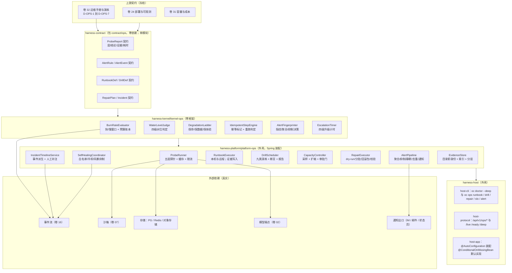

**装配说明**：`kernel-ops` 为纯逻辑（燃尽、水位、降级顺序、幂等判定），零 Spring，可被 CLI 与服务端复用；
`platform-ops` 为外壳，配置类 `OpsProperties` 放 `properties` 包且不加 `@Component`（由 `@ConfigurationPropertiesScan` 激活）；
`host-app` 以 `@ConditionalOnMissingBean` 装配默认 `NotifierSPI`（日志通告）与 `EvidenceStoreSPI`（本地目录），企业版可替换为企业 IM 与对象存储实现。

---

## ⑤ 类图与关键契约

```mermaid
classDiagram
  class HealthProbe {
    <<interface>>
    +ProbeLayer layer()
    +ProbeResult probe(ProbeContext ctx)
  }
  class ProbeLayer {
    <<enum>>
    PROCESS
    KERNEL
    MODEL
    STORAGE
    SANDBOX
  }
  class ProbeResult {
    <<record>>
    +ProbeLayer layer
    +ProbeStatus status
    +EnforcementStrength strength
    +List~ProbeEvidence~ evidence
    +Duration cost
  }
  class EnforcementStrength {
    <<enum>>
    FULL
    PARTIAL
    DOWN
  }
  class SelfHealingPolicy {
    +HealingDecision decide(ProbeResult result, HealingHistory history)
  }
  class HealingAction {
    +HealingActionKind kind
    +Reversibility reversibility
    +boolean whitelisted
  }
  class Reversibility {
    <<enum>>
    REVERSIBLE
    SIDE_EFFECTING
  }
  class SloDefinition {
    +String sloId
    +SliKind sli
    +BigDecimal objective
    +Duration window
    +Duration fastWindow
    +Duration slowWindow
  }
  class BurnRateEvaluator {
    +BurnVerdict evaluate(SloDefinition slo, BudgetLedger ledger, Instant now)
  }
  class BudgetLedger {
    +void consume(SliViolationEvent event)
    +BigDecimal remaining(SloDefinition slo, Instant now)
  }
  class AlertRule {
    +String ruleId
    +Severity severity
    +String runbookId
    +Duration forDuration
  }
  class AlertFingerprinter {
    +Fingerprint fingerprint(AlertEvent event)
    +List~AlertEvent~ aggregate(List~AlertEvent~ raw)
  }
  class AlertPipeline {
    +DispatchResult dispatch(List~AlertEvent~ events)
  }
  class RunbookDef {
    +String runbookId
    +List~RunbookStep~ steps
    +boolean verified
  }
  class RunbookStep {
    +int ordinal
    +StepKind kind
    +String command
    +Duration timeout
    +Assertion assertion
    +String onFailureGoto
  }
  class RunbookExecutor {
    +RunReport run(RunbookDef def, RunTarget target, RunOptions options)
  }
  class DrillDef {
    +String drillId
    +DrillKind kind
    +List~DrillStep~ injection
    +List~DrillAssertion~ assertions
  }
  class DrillKind {
    <<enum>>
    DB_FAILOVER
    PROCESS_KILL
    NETWORK_PARTITION
    DISK_FULL
    SANDBOX_CRASH
    UPDATE_ROLLBACK
    BACKUP_RESTORE
    SECURITY_TABLETOP
    CAPACITY_WATERMARK
  }
  class WaterLevelJudge {
    +WaterLevel judge(CapacitySample sample, CapacityPolicy policy)
  }
  class CapacityPolicy {
    +BigDecimal planLevel
    +BigDecimal alertLevel
    +BigDecimal blockLevel
    +int maxStepPct
    +Duration cooldown
  }
  class ScalingPlanner {
    +ScalingPlan plan(WaterLevel level, CapacitySample sample, ScalingPolicy policy)
  }
  class RepairPlan {
    +String planNo
    +RepairScope scope
    +List~RepairStep~ steps
    +List~String~ reviewers
    +boolean dryRunPassed
  }
  class RepairExecutor {
    +RepairReport execute(RepairPlan plan, BatchOptions options)
    +RollbackPackage buildRollback(RepairPlan plan)
  }
  class IncidentTimeline {
    +String incidentNo
    +List~TimelineEntry~ entries
    +void annotate(TimelineEntry entry, String actor)
  }
  class PostmortemArtifact {
    +String incidentNo
    +List~ImprovementItem~ items
  }
  class ImprovementKind {
    <<enum>>
    CODE
    CONFIG
    TEST
    DOC
  }
  class EscalationPolicy {
    +EscalationStep next(Instant since, Severity severity)
  }

  HealthProbe --> ProbeResult
  ProbeResult --> ProbeLayer
  ProbeResult --> EnforcementStrength
  SelfHealingPolicy --> HealingAction
  HealingAction --> Reversibility
  BurnRateEvaluator --> SloDefinition
  BurnRateEvaluator --> BudgetLedger
  AlertPipeline --> AlertFingerprinter
  AlertPipeline --> AlertRule
  RunbookExecutor --> RunbookDef
  RunbookDef --> RunbookStep
  DrillDef --> DrillKind
  WaterLevelJudge --> CapacityPolicy
  ScalingPlanner --> CapacityPolicy
  RepairExecutor --> RepairPlan
  IncidentTimeline --> PostmortemArtifact
  PostmortemArtifact --> ImprovementKind
```

**关键 Java 21 签名（节选，符合 `.qoder/rules/` 五条规范）**

```java
/**
 * SLO 燃尽评估器：以双窗口燃尽率判定「预算将被提前耗尽」。
 * 快窗口用于捕捉突发（如发布引入的故障），慢窗口用于捕捉持续劣化。
 * 阈值为**缺省基线**（与卷 32 §2 SLO 燃尽表对齐：2h 内消耗 5% / 6h 内消耗 2%），
 * 生产取值来自 `SloDefinition`（数据驱动，可随 SLO 版本调整），常量用于回归断言与基线校验。
 */
public final class BurnRateEvaluator {

    /** 快窗口预算消耗阈值（百分比，卷 32 §2 缺省 5% —— 2h 窗口） */
    private static final BigDecimal FAST_BURN_BUDGET_PERCENT = new BigDecimal("5");

    /** 慢窗口预算消耗阈值（百分比，卷 32 §2 缺省 2% —— 6h 窗口） */
    private static final BigDecimal SLOW_BURN_BUDGET_PERCENT = new BigDecimal("2");

    /**
     * 计算燃尽判定。
     *
     * @param slo SLO 定义（必填；窗口与目标值不可为空，缺省阈值由此对象提供）
     * @param ledger 错误预算账本（必填）
     * @param now 评估时刻（必填，来自统一时钟，便于测试注入）
     * @return 燃尽判定；无违反返回 {@link BurnVerdict#healthy()}，禁止返回 null
     */
    public BurnVerdict evaluate(SloDefinition slo, BudgetLedger ledger, Instant now) {
        // 快窗口（默认 2h）：消耗超过阈值即视为突发劣化 —— 阈值必须参与判定，不得只写在注释里
        BigDecimal fastConsumed = ledger.consumedRatio(slo, now.minus(slo.fastWindow()));
        BigDecimal fastThreshold = slo.fastBudgetPercent() == null ? FAST_BURN_BUDGET_PERCENT : slo.fastBudgetPercent();

        // 慢窗口（默认 6h）：消耗超过阈值即视为持续劣化
        BigDecimal slowConsumed = ledger.consumedRatio(slo, now.minus(slo.slowWindow()));
        BigDecimal slowThreshold = slo.slowBudgetPercent() == null ? SLOW_BURN_BUDGET_PERCENT : slo.slowBudgetPercent();

        return BurnVerdict.of(fastConsumed, fastThreshold, slowConsumed, slowThreshold, slo);
    }
}

/** 自愈决策：仅可逆且在白名单内的动作允许自动执行；其余一律转人工审批。 */
public record HealingDecision(HealingActionKind kind, Reversibility reversibility, String reason) {

    /** 判定是否允许自动执行（白名单 + 可逆 + 未处于冷却期，三者缺一不可）。 */
    public boolean autoExecutable(Set<HealingActionKind> whitelist, HealingHistory history, Instant now) {
        return whitelist.contains(kind)
                && reversibility == Reversibility.REVERSIBLE
                && history.isCooledDown(kind, now);
    }

    /** 构造人工审批决策；文案必须说明触发原因与建议动作。 */
    public static HealingDecision requireApproval(HealingActionKind kind, String reason) {
        return new HealingDecision(kind, Reversibility.SIDE_EFFECTING, reason);
    }
}
```

---

## ⑥ 核心流程时序图

### 6.1 分层探针失败 → 自愈决策 → 动作执行与留证

**前置条件**：`/deep` 探针周期触发（默认 30s，配置化）；自愈白名单已加载。
**主路径**：探针失败 → 分层归因 → 白名单动作选择 → 冷却与风暴抑制检查 → 执行动作 → 留证（事件 + 证据目录）→ 复测验证。
**异常与补偿分支**：动作执行失败、冷却期内重复失败、连续无效自愈。
**幂等与并发点**：同一动作在冷却期内不重复执行；自愈以探针层为幂等键。

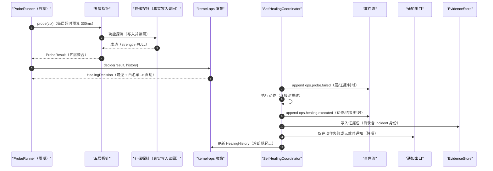

### 6.2 SLO 快/慢燃尽 → 告警聚合抑制 → 冻结发布

**前置条件**：SLI 由事件派生；预算账本持续记账；门禁矩阵可被调用（卷 26 / 33）。
**主路径**：SLI 派生 → 快/慢双窗口燃尽计算 → 阈值命中 → 告警聚合与抑制 → 通知路由 → 违反预算即冻结发布（附恢复条件）。
**异常与补偿分支**：告警风暴、抑制误吞、通知出口不可用（降级为状态页）。
**幂等与并发点**：告警指纹去重；同一根因在抑制窗口内只推送一次。

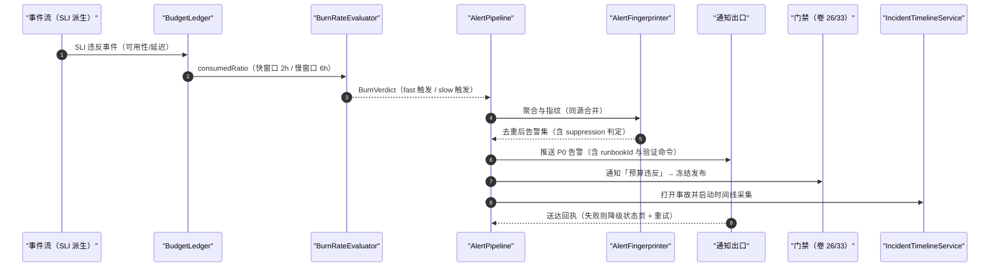

### 6.3 容量水位触发扩缩（含审批门）

**前置条件**：容量采样按周期入库；策略含步长上限与冷却期；有副作用动作需审批。
**主路径**：周期采样 → 四级水位判定 → 声明式策略规划（步长 / 冷却 / 上限）→ 审批门 → 执行扩缩 → 复测水位与留证。
**异常与补偿分支**：扩容失败（依赖不可用）、超上限被拒、审批超时未响应。
**幂等与并发点**：同一水位窗口内只规划一次；扩缩动作幂等键为「计划号 + 批次」。

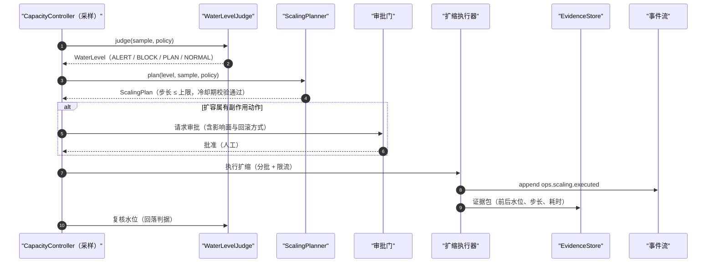

### 6.4 Runbook as Code 演练执行（幂等 + 断言 + 证据）

**前置条件**：Runbook 定义已校验（每步有预期、超时、失败回退）；环境标记明确（生产/预发）。
**主路径**：定义校验 → 环境标记确认 → 逐步执行（幂等前置检查）→ 断言与失败回退 → 证据写入 → 报告与改进闭环（入卷 33 台账）。
**异常与补偿分支**：破坏性步骤在生产环境执行被拒；步骤失败跳转回退分支；证据写入失败不阻断但告警。
**幂等与并发点**：每步带幂等标记（前置检查判断是否已生效）；同一定义同一目标串行执行。

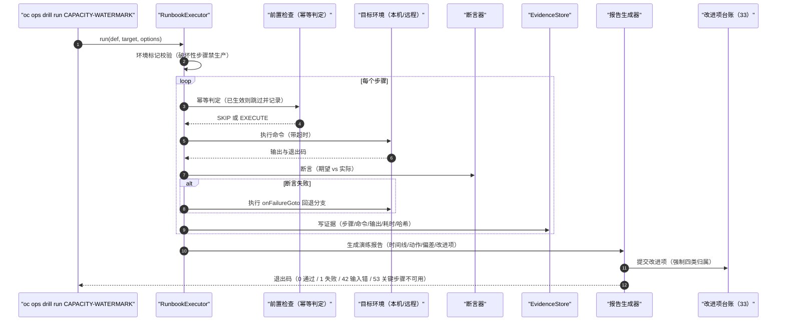

### 6.5 数据修复三段式（只读诊断 → 灰度修复 → 校验）

**前置条件**：修复计划经双人复核；dry-run 已通过；回滚包已生成。
**主路径**：只读诊断 → dry-run → 双人复核 → 灰度批次修复 → 校验（失败自动执行回滚包）→ 收尾报告。
**异常与补偿分支**：校验失败自动执行回滚包；批次中断后可续跑（批次幂等键）。
**幂等与并发点**：批次键 = `planNo + batchNo`；重复执行同一批次不产生重复写。

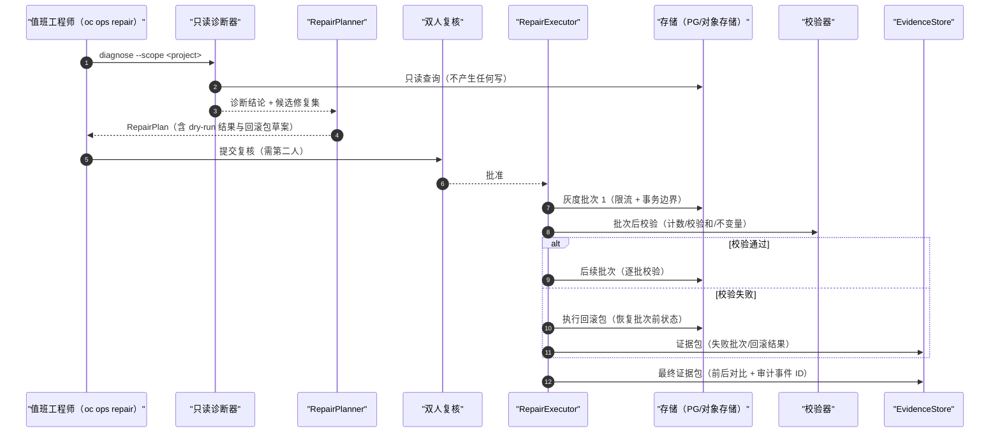

### 6.6 事故时间线自动生成与复盘闭环

**前置条件**：事故被打开（来自告警或人工上报）；事件流可回放事故窗口。
**主路径**：事故打开 → 事件回放生成时间线 → 人工补注叠加 → 复盘产出 → 改进项入卷 33 台账 → 关闭并回写 SLO 影响。
**异常与补偿分支**：时间线缺口（事件丢失）需显式标注；复盘超期触发升级。
**幂等与并发点**：`incidentNo` 为幂等键；重复打开合并；人工补注追加不覆盖。

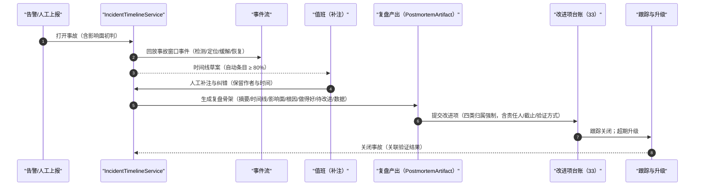

---

## ⑦ 状态机

### 7.1 事故生命周期

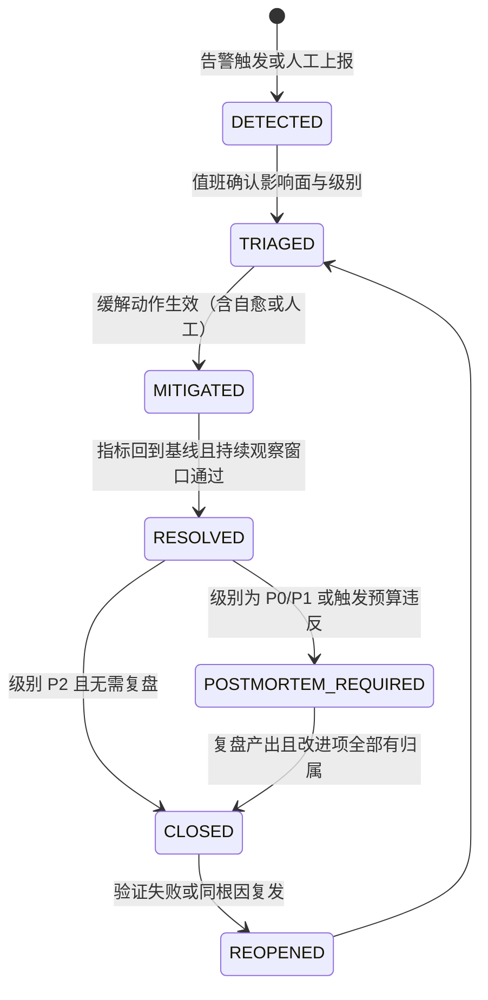

### 7.2 演练与修复计划状态机

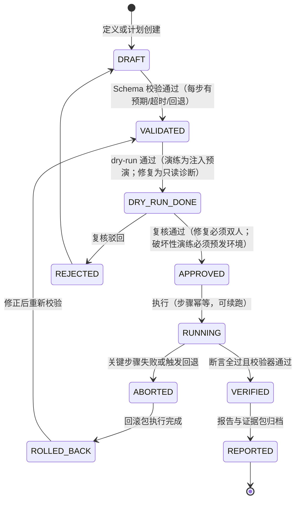

### 7.3 容量水位与扩缩状态

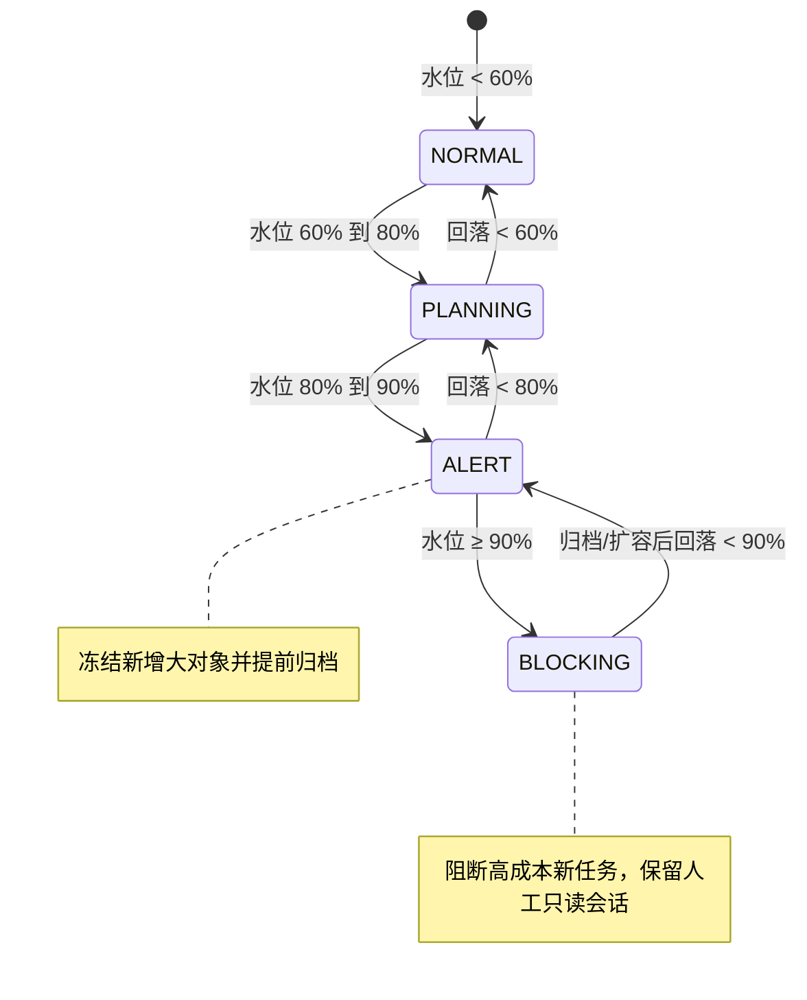

---

## ⑧ 数据模型

### 8.1 表（`oc_*`，PostgreSQL，MyBatis-Plus，逐实体 `@TableName` 显式声明）

| 表 | 关键列 | 索引 / 约束 | 说明 |
| --- | --- | --- | --- |
| `oc_ops_probe_def` | `id`、`probe_key`、`layer`、`interval_seconds`、`timeout_ms`、`enabled` | `uk(probe_key)` | 探针定义；`layer` 用 `ProbeLayer` 枚举 |
| `oc_ops_probe_result` | `id`、`probe_key`、`layer`、`status`、`strength`、`cost_ms`、`evidence_json`、`created_at` | `idx(probe_key, created_at)`；按月分区 | 探针结果；只保留原始 30 天，之后按日聚合 |
| `oc_ops_slo` | `id`、`slo_id`、`sli_kind`、`objective`、`window_days`、`fast_window`、`slow_window`、`enabled` | `uk(slo_id)` | SLO 定义；目标值变更需评审（REQ-OPS-09） |
| `oc_ops_budget_ledger` | `id`、`slo_id`、`occurred_at`、`consumed_micro`、`recovered_micro`、`source_event_id` | `idx(slo_id, occurred_at)`；`uk(source_event_id)` | 预算账本；与 SLI 事件一一对应，可对账 |
| `oc_ops_burn_alert` | `id`、`slo_id`、`window_kind`、`burn_ratio`、`triggered_at`、`type` | `idx(slo_id, triggered_at)` | 燃尽告警记录；`window_kind` 用 `BurnWindowKind`（FAST/SLOW） |
| `oc_ops_alert_rule` | `id`、`rule_id`、`severity`、`expression`、`for_duration`、`runbook_id`、`enabled` | `uk(rule_id)`；`fk(runbook_id)` 逻辑约束 | 规则；`runbook_id` 非空约束（REQ-OPS-10） |
| `oc_ops_alert_event` | `id`、`rule_id`、`fingerprint`、`status`、`first_seen`、`last_seen`、`occurrence_count`、`suppressed_by` | `uk(fingerprint, rule_id)`；`idx(status, last_seen)` | 告警事件；聚合后的 occurrence 计数 |
| `oc_ops_alert_silence` | `id`、`matcher_json`、`starts_at`、`ends_at`、`reason`、`created_by` | `idx(starts_at, ends_at)` | 静默窗口；必须含原因与创建人 |
| `oc_ops_alert_quality_daily` | `id`、`stat_date`、`signal_to_noise`、`false_positive_rate`、`mtta_seconds`、`close_rate` | `uk(stat_date)` | 告警质量日报（REQ-OPS-11） |
| `oc_ops_runbook_def` | `id`、`runbook_id`、`title`、`version`、`verified`、`verified_at`、`content_hash`、`environment_scope` | `uk(runbook_id, version)` | Runbook 定义（YAML 入库 + 哈希）；`verified` 由实机验证置位 |
| `oc_ops_runbook_run` | `id`、`run_no`、`runbook_id`、`version`、`target_json`、`operator`、`status`、`started_at`、`finished_at`、`evidence_dir` | `uk(run_no)`；`uk(evidence_dir)` | 执行记录；`evidence_dir` 目录即身份（`L-050`） |
| `oc_ops_runbook_step` | `id`、`run_id`、`ordinal`、`kind`、`outcome`、`cost_ms`、`output_digest` | `uk(run_id, ordinal)` | 逐步留痕（输出摘要而非全文，防敏感外泄） |
| `oc_ops_drill_def` | `id`、`drill_id`、`kind`、`frequency`、`destructive`、`report_template` | `uk(drill_id)` | 演练定义；`kind` 用 `DrillKind`（九类） |
| `oc_ops_drill_run` | `id`、`drill_run_no`、`drill_id`、`environment`、`status`、`deviation_json`、`report_uri`、`started_at` | `uk(drill_run_no)` | 演练执行与报告；`deviation_json` 记偏差 |
| `oc_ops_evidence` | `id`、`tenant_ref`、`owner_kind`、`owner_no`、`object_uri`、`checksum`、`size_bytes`、`retention_days` | `idx(tenant_ref, owner_kind, owner_no)`；`uk(checksum, owner_no)` | 证据索引；`owner_kind` 用 `EvidenceOwnerKind`（RUNBOOK/DRILL/REPAIR/INCIDENT）；`tenant_ref` 非空即租户数据（R06 新增列） |
| `oc_ops_capacity_sample` | `id`、`resource_kind`、`sampled_at`、`usage_ratio`、`growth_rate`、`source` | `idx(resource_kind, sampled_at)`；按月分区 | 容量采样；`resource_kind` 用 `ResourceKind`（DISK/EVENT_TABLE/SNAPSHOT/MEDIA/CONNECTION） |
| `oc_ops_scaling_action` | `id`、`plan_no`、`resource_kind`、`from_value`、`to_value`、`step_pct`、`approved_by`、`status`、`executed_at` | `uk(plan_no, resource_kind)` | 扩缩动作；`step_pct` 受策略上限约束 |
| `oc_ops_repair_plan` | `id`、`plan_no`、`tenant_ref`、`scope_json`、`diagnosis_uri`、`dry_run_passed`、`reviewers`、`rollback_uri`、`status` | `uk(plan_no)`；`idx(status)`；`idx(tenant_ref, status)` | 修复计划；`reviewers` 至少两人（REQ-OPS-23）；`tenant_ref` 非空且 scope 不得越出租户边界（R06 新增列） |
| `oc_ops_repair_batch` | `id`、`plan_no`、`batch_no`、`affected_rows`、`checksum_before`、`checksum_after`、`verified`、`executed_at` | `uk(plan_no, batch_no)` | 灰度批次；幂等键即唯一约束；**批次只能作用于计划所属租户（`tenant_ref`）范围内的行**——写入前逐行校验归属（R06 新增约束） |
| `oc_ops_incident` | `id`、`incident_no`、`severity`、`source`、`status`、`tenant_ref`、`affected_json`、`opened_at`、`resolved_at`、`closed_at` | `uk(incident_no)`；`idx(status, severity)`；`idx(tenant_ref, opened_at)` | 事故；`source` 用 `IncidentSource`（ALERT/MANUAL/DRILL/SECURITY）；`tenant_ref` 为空 = 平台级事故（R06 新增列） |
| `oc_ops_timeline_entry` | `id`、`incident_no`、`occurred_at`、`phase`、`origin`、`summary`、`actor`、`event_id` | `idx(incident_no, occurred_at)` | 时间线条目；`origin` 用 `TimelineOrigin`（AUTO/MANUAL）；**继承所属事故的 `tenant_ref`**（不单独存列，查询经事故联表过滤，R06） |
| `oc_ops_postmortem` | `id`、`incident_no`、`summary`、`root_cause`、`what_went_well`、`data_json`、`submitted_at`、`overdue` | `uk(incident_no)` | 复盘产物；`overdue` 由 P0 3 工作日规则计算 |
| `oc_ops_improvement_item` | `id`、`incident_no`、`kind`、`owner`、`due_at`、`verify_method`、`status`、`closed_evidence` | `idx(incident_no, status)` | 改进项；`kind` 限四类（代码/配置/测试/文档） |
| `oc_ops_oncall_shift` | `id`、`shift_date`、`primary_owner`、`secondary_owner`、`handover_json`、`handover_at` | `uk(shift_date)` | 值班与交接单；主副班必填（避免单点） |
| `oc_ops_escalation_event` | `id`、`incident_no`、`level`、`due_at`、`notified_at`、`acknowledged_at` | `idx(incident_no, level)` | 升级计时记录；四级升级可审计 |

### 8.2 Redis Key（经统一 `RedisKeys` 工厂）

| Key 用途 | 生成方式 | TTL |
| --- | --- | --- |
| 探针结果缓存 | `RedisKeys.cache(RedisKeys.Module.OPS, "probe", probeKey)` | 由 `interval_seconds` 决定（默认 30s） |
| 自愈冷却标记 | `RedisKeys.lock(RedisKeys.Module.OPS, "healing-cooldown", actionKind)` | 冷却期配置（默认 10 分钟） |
| 告警指纹去重 | `RedisKeys.cache(RedisKeys.Module.OPS, "alert-fingerprint", fingerprint)` | 抑制窗口（默认 1 小时） |
| 演练/修复执行锁 | `RedisKeys.lock(RedisKeys.Module.OPS, "exclusive-run", planNo)` | 租约 60 分钟（可续租） |
| 值班免打扰状态 | `RedisKeys.cache(RedisKeys.Module.OPS, "quiet-hours", shiftDate)` | 24 小时 |

### 8.3 对象存储前缀与事件类型

- 对象存储前缀（**R06 修订：租户维度前置**）：`ops/evidence/{tenantRef|_platform}/{ownerKind}/{ownerNo}/`（演练/修复/事故证据包）、`ops/reports/{tenantRef|_platform}/{drillRunNo}/`（演练报告）、`ops/timeline/{tenantRef|_platform}/{incidentNo}/`（时间线导出）、`ops/backup/{tenantRef|_platform}/{planNo}/`（回滚包）。`_platform` 段仅用于**平台级**对象（无租户数据的演练与平台事故）；路径由服务端按 `TenantContext` 构造，下载走绑定主体的短效签名 URL。
- 事件类型（卷 16 目录，只增不改）：`ops.probe.failed` / `ops.probe.recovered` / `ops.healing.executed` / `ops.healing.ineffective` / `ops.slo.burn_triggered` / `ops.budget.violated` / `ops.alert.triggered` / `ops.alert.resolved` / `ops.alert.silenced` / `ops.drill.started` / `ops.drill.finished` / `ops.runbook.step_failed` / `ops.capacity.threshold_crossed` / `ops.scaling.executed` / `ops.repair.batch_finished` / `ops.repair.rolled_back` / `ops.incident.opened` / `ops.incident.closed` / `ops.incident.timeline_annotated`；**R06 新增** `ops.cross_tenant.denied`（越界访问运维面租户数据，SEV2）、`ops.runbook.verified`（实机验证置位，REQ-OPS-14）、`ops.repair.batch.rejected`（批次越出租户边界被拒）。
- 与质量侧的桥接：演练/复盘产出的改进项通过 `33-quality-eval-impl.md` 的 `oc_qa_improvement_item` 落地；本文件只保证「四类归属 + 责任人 + 截止 + 验证方式」的 Schema 强约束。

### 8.4 多租户隔离矩阵与运行时阻断（R06 新增）

> 运维面是**平台级**能力，但会读写租户数据（修复、证据、时间线、复盘）。因此必须区分「平台级可共享」与「租户级必须隔离」两类对象，并给出运行时阻断。

| 资源类型 | 隔离机制 | 运行时阻断检查（非约定） | 用例（§⑪） |
| --- | --- | --- | --- |
| PostgreSQL（§8.1 表族） | 平台级表（探针 / SLO / 告警规则 / 演练定义 / 值班）显式登记为「无租户语义白名单」；租户级表（`oc_ops_repair_plan`/`oc_ops_repair_batch`/`oc_ops_evidence`/`oc_ops_incident`）带 `tenant_ref`（非空即租户域） | 涉及 `tenant_ref` 非空行的查询由拦截器强制注入租户条件；`tenant_ref IS NULL` 仅平台级事故/证据可读；**修复批次写入前逐行校验行归属**（越界即整批拒绝 + `ops.repair.batch.rejected`） | 以 T1 运维身份读取 T2 修复计划/证据/事故 → `FORBIDDEN` + `ops.cross_tenant.denied` |
| Redis（§8.2） | 运维锁与缓存为平台级（探针结果、告警指纹、执行锁）——显式白名单 | 平台级 Key 不含租户数据；若新增租户级缓存（如租户水位），必须走 `RedisKeys` 且首变参为 `tenantId`（对齐 25/26/29） | 构造租户级缓存键缺租户段 → 工厂结构断言失败（单测） |
| 对象存储（§8.3） | `{tenantRef}`/`_platform` 段前置 | 路径由服务端构造；证据包写入前脱敏（命中 0 才归档）；下载签名 URL 绑定主体 | 以 B 租户身份下载 A 租户证据包/回滚包 → 拒绝 + SEV2 |
| 修复工具（数据面） | 计划必带 `tenant_ref` + `scope_json` 显式范围 | 范围校验：`scope` 必须落在 `tenant_ref` 内（禁「全库」隐式范围，REQ-OPS-23）；dry-run 零写；执行前二次校验 | 构造跨租户 `scope` → 计划被拒（`REVIEWER_REQUIRED` 前置校验） |
| 时间线与复盘 | 继承事故 `tenant_ref`（联表过滤） | 查询经事故联表带租户条件；跨租户时间线导出被拒 | 跨租户导出时间线 → `FORBIDDEN` |
| 演练注入（FaultSource） | 演练目标显式声明环境与范围 | 破坏性步骤在生产环境被拒（双保险）；注入目标若指向租户实例必须携带租户上下文 | 生产环境破坏性注入 → `OPS_DESTRUCTIVE_FORBIDDEN` |
| 状态页与通告 | 平台级（不含租户明细） | 状态页只出组件状态与影响面聚合；**禁止**列出受影响租户名与业务数据 | 状态页渲染含租户名 → 契约测试失败 |

**对等说明**：运维面的「跨租户只读」不是能力而是风险 —— 任何跨租户读取都必须带 `system.update` 类权限 + 显式目标 + 审计；`tenant_ref` 为空的平台级对象**不得**被用来承载租户数据（写入前校验）。

---

## ⑨ 接口与扩展点

### 9.1 探针端点与 REST API（`harness-host/host-protocol`）

| 方法 | 路径 | 入参 | 出参 | 主要错误码 |
| --- | --- | --- | --- | --- |
| `GET` | `/live` | 无 | 进程存活（无外部调用） | — |
| `GET` | `/ready` | 无 | 依赖就绪（PG/Redis/对象存储） | `DEPENDENCY_UNAVAILABLE` |
| `GET` | `/deep` | `layers`（可选子集） | 五层探针报告（含 strength 与证据） | `PROBE_THROTTLED` |
| `GET` | `/api/v1/ops/slo` | 无 | 5 项 SLO 当前达成与预算余量 | `FORBIDDEN` |
| `GET` | `/api/v1/ops/alerts` | `status`、`severity`、`page`、`size` | 告警分页（含 runbookId 与指纹） | `PARAM_INVALID` |
| `POST` | `/api/v1/ops/alerts/{id}/silence` | `duration`、`reason` | 静默结果（原因必填） | `PARAM_INVALID` |
| `GET` | `/api/v1/ops/runbooks` | `verified`、`kind` | Runbook 列表（含验证状态） | `FORBIDDEN` |
| `POST` | `/api/v1/ops/runbooks/{runbookId}/run` | `target`、`options`（`dryRun`） | 执行号与证据目录 | `ENVIRONMENT_FORBIDDEN`、`RUNBOOK_UNVERIFIED` |
| `POST` | `/api/v1/ops/drills/{drillId}/run` | `environment`、`window` | 演练执行号 | `ENVIRONMENT_FORBIDDEN` |
| `GET` | `/api/v1/ops/capacity` | `resourceKind` | 水位、趋势、最近扩缩动作 | `FORBIDDEN` |
| `POST` | `/api/v1/ops/repairs` | `scope`、`steps` | 计划号（进入复核） | `REVIEWER_REQUIRED` |
| `POST` | `/api/v1/ops/repairs/{planNo}/approve` | 复核意见 | 批准结果（需第二人） | `REVIEWER_REQUIRED` |
| `POST` | `/api/v1/ops/repairs/{planNo}/execute` | `batchSize`、`rateLimit` | 批次执行结果与校验结论 | `DRY_RUN_MISSING` |
| `GET` | `/api/v1/ops/incidents/{incidentNo}/timeline` | 无 | 时间线（自动 + 人工条目） | `RESOURCE_NOT_FOUND` |
| `POST` | `/api/v1/ops/incidents/{incidentNo}/postmortem` | 复盘字段 | 提交结果与超期标记 | `IMPROVEMENT_KIND_REQUIRED` |

### 9.2 CLI 命令面（`harness-host/host-cli`）

```bash
oc doctor --deep --format json                  # 五层健康诊断（机读；退出码 0/1/42/53）
oc doctor model <provider> --probe              # 模型端点连通与配额探测（RB-06 第 1 步）
oc ops slo report --window 30d                  # SLO 达成与预算余量
oc ops runbook list --unverified                # 列出未实机验证的 Runbook（REQ-OPS-14）
oc ops runbook run RB-04 --dry-run              # 磁盘压力条目 dry-run
oc ops runbook run RB-01 --target prod-a        # 远程执行（需授权）
oc ops drill run DISK_FULL --env staging        # 破坏性演练仅预发
oc ops capacity show --resource disk            # 水位与趋势（RB-04 第 1 步）
oc ops repair plan --scope project:P-1023 --from diagnosis.json
oc ops repair execute --plan REP-0007 --batch-size 500 --rate-limit 50/s
oc ops incident timeline INC-0031 --format md   # 时间线导出（复盘用）
```

### 9.3 SPI 扩展点（对接卷 18 目录）

| SPI | 方法（Java 21 签名） | 默认实现 | 说明 |
| --- | --- | --- | --- |
| `HealthProbeSPI` | `ProbeLayer layer()`；`ProbeResult probe(ProbeContext ctx)` | 五个内置探针 | 企业可加自定义层（如「许可证状态」） |
| `SelfHealingActionSPI` | `HealingActionKind kind()`；`Reversibility reversibility()`；`HealingOutcome execute(HealingContext ctx)` | 进程重启/连接池重建/档位降级 | 新增动作必须声明可逆性 |
| `DrillStepHandlerSPI` | `String stepType()`；`DrillStepResult handle(DrillStepContext ctx)` | 注入类（延迟/杀进程/填盘/断网） | 扩展演练步骤类型 |
| `RepairStepHandlerSPI` | `String stepType()`；`RepairStepResult apply(RepairStepContext ctx)`；`void rollback(RepairStepContext ctx)` | 行级修复/缓存重建/索引重放 | **必须实现回滚**，否则加载期拒绝 |
| `NotifierSPI` | `DeliveryResult send(Notification msg)` | 日志通告（企业默认替换） | 企业 IM/邮件/状态页 |
| `EvidenceStoreSPI` | `EvidenceRef store(EvidencePackage pkg)` | 本地目录 + 索引库 | 企业可换对象存储分层 |
| `FaultSourceSPI` | `List<FaultProfile> profiles(DrillDef def)` | 内置注入实现 | 与测试基座 33 的故障注入器共享画像 |

### 9.4 配置项（`open-coding.ops.*`，yml 一律 `${ENV_VAR:default}`）

| 配置 | 默认值 | 必填 | 说明 |
| --- | --- | --- | --- |
| `open-coding.ops.probe.interval-seconds` | `30` | 否 | 探针周期（关键层可单独覆盖） |
| `open-coding.ops.probe.timeout-ms` | `300` | 否 | 单层探针超时预算 |
| `open-coding.ops.probe.deep-cache-seconds` | `15` | 否 | `/deep` 缓存窗口（防探针风暴） |
| `open-coding.ops.healing.cooldown-minutes` | `10` | 否 | 自愈冷却期 |
| `open-coding.ops.healing.max-ineffective` | `${OPS_MAX_INEFFECTIVE:3}` | 否 | 连续无效自愈上限（超过升级人工） |
| `open-coding.ops.alert.suppression-window-minutes` | `60` | 否 | 告警抑制/去重窗口 |
| `open-coding.ops.alert.max-push-per-hour` | `20` | 否 | 每值班小时最大推送（防风暴） |
| `open-coding.ops.capacity.plan-level` | `0.60` | 否 | 规划水位 |
| `open-coding.ops.capacity.alert-level` | `0.80` | 否 | 告警水位 |
| `open-coding.ops.capacity.block-level` | `0.90` | 否 | 阻断水位 |
| `open-coding.ops.capacity.max-step-pct` | `0.25` | 否 | 单次扩缩步长上限 |
| `open-coding.ops.capacity.cooldown-minutes` | `30` | 否 | 扩缩冷却期 |
| `open-coding.ops.runbook.allow-destructive-in-prod` | `false` | 否 | 禁止破坏性步骤在生产执行（默认关闭且不建议开启） |
| `open-coding.ops.repair.batch-size` | `500` | 否 | 灰度批次大小（上限受策略约束） |
| `open-coding.ops.repair.rate-limit-per-second` | `50` | 否 | 灰度限流 |
| `open-coding.ops.evidence.retention-days` | `365` | 否 | 证据保留期（事故证据可单独延长） |
| `open-coding.ops.escalation.owner-minutes` | `15` | 否 | 值班到领域负责人升级时限 |
| `open-coding.ops.status-page.enabled` | `${OPS_STATUS_PAGE_ENABLED:false}` | 否 | 企业内网状态页开关 |

环境变量：`OPS_STATUS_PAGE_ENABLED`、`OPS_MAX_INEFFECTIVE`、`OPS_NOTIFY_WEBHOOK`（敏感项，默认留空、缺失时降级为日志通告）。
新增变量必须同步 `.env.example`（模板是唯一变量清单）；敏感项禁止写入 yml 默认值。

### 9.5 错误矩阵（场景 → 错误码 → 对外文案 → 处置）

| 场景 | 错误码 | 对外文案（中文） | 调用方动作 | 服务端动作 |
| --- | --- | --- | --- | --- |
| 探针失败（`/ready` 层） | —（503 + `layer`） | 依赖未就绪 | 等待重试 | 标记不就绪；不阻断 `/live` |
| 自愈动作不可逆/有副作用 | `PERMISSION_DENIED`（需审批） | 该动作需人工审批 | 提交审批 | 白名单外一律不放行 |
| 修复计划缺双人复核 | `APPROVAL_INSUFFICIENT` | 修复计划缺少复核 | 补复核 | 拒绝执行（fail-closed） |
| 生产环境破坏性步骤 | `OPS_DESTRUCTIVE_FORBIDDEN` | 生产环境禁止破坏性步骤 | 改预发验证 | 双保险拒绝（配置 + 环境标记） |
| 修复校验失败 | `OPS_REPAIR_VERIFY_FAILED` | 修复未通过校验，已自动回滚 | 查看回滚报告 | 自动执行回滚包 + 证据留档 |
| 容量扩缩超步长/上限 | `INVALID_ARGUMENT` | 扩缩计划超出策略上限 | 调整计划 | 拒绝（需评审放宽） |
| 告警管道溢出 | —（降级） | —（状态页可见） | 查看状态页 | 显式降级 + 计数（不静默丢弃） |
| 通知出口不可用 | `DEPENDENCY_UNAVAILABLE` | 通知通道不可用 | 查看状态页 | 重试 + 死信 + 恢复补发 |
| 证据写入失败 | —（WARN + 补偿） | —（不影响动作） | 无需操作 | 补偿任务重试；不因证据失败回滚业务动作 |
| 事故时间线存在缺口 | —（显式标注） | 时间线含缺口（已标注） | 人工补注 | 缺口显式标注（不静默补齐） |
| **跨租户访问运维面数据（R06 新增）** | `CROSS_TENANT_DENIED` | 无权访问该租户的运维数据 | 走授权与审计流程 | `ops.cross_tenant.denied` + SEV2（冻结会话 + 取证快照），越界修复批次整批拒绝 |

**异常命名约定**（对齐 `impl/README.md` §5.5）：运维内核（`kernel-ops` 纯逻辑）抛 `HarnessException(ErrorCode, 中文文案)`；宿主与服务侧（`host-ops`）抛 `BusinessException(ErrorCode, 中文文案)`；全局处理器按 `ErrorCode` 映射；**禁止**裸 `RuntimeException`。

### 9.6 值班首 5 分钟动作索引（R06 新增：3am 拿到告警先做什么）

> 每条告警都必须能在**不看设计文档**的情况下被执行：`oc ops runbook run <RB>` 是本文件把手册变代码的落点；下表是「告警 → 首命令 → 停止条件 → 升级」的唯一索引，随新域 Runbook 增补。

| 告警（卷 32 §3 + 各域补充） | 值班首命令 | 停止条件（何时停手升级） | 升级路径 |
| --- | --- | --- | --- |
| P0 协议面错误率 > 5%（5min） | `oc doctor --deep --format json` → `oc ops runbook run RB-01` | 5 分钟内恢复或明确根因在外部依赖 | 15min → 领域负责人 |
| P0 事件写入失败 > 1%（5min） | `oc ops runbook run RB-02` | 写入恢复且滞后 < 10s 并持续 10min | 15min |
| P0 数据库不可用 / 主从切换 | `oc ops runbook run RB-03` | 切换完成且 RPO 校验通过 | 立即（保数据） |
| P0 存储水位 ≥ 90% | `oc ops runbook run RB-04` | 水位 < 75% 且 24h 无反弹 | 30min |
| P0 安全事件 SEV1/2 | `oc ops runbook run RB-09`（卷 30 §4.7 分级） | 冻结 + 吊销 + 取证完成 | 立即（安全值班） |
| P1 消费者滞后 > 60s | `oc ops runbook run RB-05` | 滞后 < 10s 持续 10min | 30min |
| P1 模型端点错误率 > 10% | `oc ops runbook run RB-06` | 错误率回落且成本变化可解释 | 30min |
| P1 沙箱不可用率 > 20% | `oc ops runbook run RB-07` | 档位恢复或降级策略显式生效 | 30min |
| P1 日成本 > 基线 ×1.5 | `oc ops runbook run RB-08` → 成本域 `RB-COST-01`（26 §9.7） | 用量回落或熔断仅作用自治任务 | 30min |
| P1 审批积压 > 20/小时 | `oc ops runbook run RB-10` | 积压低于阈值且延迟回基线 | 30min |
| P2 索引滞后 / 插件熔断 | 工单化 + `oc ops runbook run RB-05`（消费者维度） | 工单关闭 | 常规（免打扰时段） |
| 跨域：审计链断裂 / 跨租户越界 | `RB-ENT-03` / `RB-ENT-05`（25 §10.7.1） | 已冻结 + 已取证 + 已通告 | 立即（SEV1/SEV2） |
| 跨域：A2A 入站不可用 / 配额风暴 | `RB-A2A-01` / `RB-A2A-02`（24 §9.9） | 恢复或已暂停问题调用方 | 15min → 协议域负责人 |
| 跨域：Registry / 私仓同步故障 | `RB-ECO-01` / `RB-ECO-02`（29 §10.6） | 只读降级生效且安装路径仍 fail-closed | 30min |
| 跨域：吊销扇出超时（任何域） | `RB-ENT-06` + 对应域 Runbook | 缓存 TTL=0 且未完成项清零 | 立即（SEV2） |

**纪律**：① 未绑定 Runbook 的告警不允许上线（REQ-OPS-10），因此本表与 `oc_ops_alert_rule.runbook_id` 必须一一对应（差集为空由契约测试守住）；② 停止条件不满足时**禁止**用「调大阈值/关闭告警」作为处置（对齐卷 32 §2「不允许下调目标」）；③ 所有首命令都必须幂等、可重跑（REQ-OPS-12），且执行记录落 `oc_ops_runbook_run` 与证据目录。

---

## ⑩ 非功能与工程细节

1. **并发模型**：探针为定时任务 + 虚拟线程执行（每层一虚拟线程，超时即取消）；演练与修复执行器串行化（`RedisKeys.lock` 排他，禁止同一计划并行）；告警管道为单写者 + 有界队列（溢出显式降级为「仅状态页」，对齐 OpenCode `SubscriberOverflowError` 显式背压语义 [E1]）。
2. **性能预算**：`/live` P99 ≤ 5ms；`/ready` P99 ≤ 50ms；`/deep` 五层合计 ≤ 1.5s（默认配置下）；探针额外开销 ≤ 实例 CPU 的 0.5%；告警聚合在 1000 条/分钟输入下 ≤ 200ms。
3. **容量估算**：探针原始结果 30 天（按月分区；五层探针 × `probe.interval-seconds` 默认 30s → 约 **1.4 万行/实例/天**，30 天 ≈ 43 万行/实例 → 压缩归档）；容量采样按小时 1 点（1 年约 8.8 万行/资源）；证据包按演练次数估算（每次 5–50MB），`retention-days` 到期转对象存储或清理。
4. **缓存策略**：`/deep` 结果按层缓存（窗口 15s，配置）；告警指纹缓存 1 小时；水位判定结果按采样周期缓存；Runbook 定义按 `content_hash` 缓存，定义变更即失效。
5. **失败与降级**：探针失败不阻断主流程（除 `/ready` 语义即「不就绪」）；通知出口不可用时降级为状态页 + 重试 + 死信；容量控制器不可用时不自动扩缩（保持现状并告警），避免「控制面失效导致误扩」；证据写入失败不阻断动作但产生 WARN 与补偿任务。
6. **安全**：① 修复工具与密钥代理在 `strength=PARTIAL` 时拒绝执行（REQ-OPS-04）；② 修复计划双人复核 + 范围显式（禁止「全库」隐式范围）；③ 值班五类权限最小化，其余操作走审批；④ 证据包写入前脱敏（连接串/令牌/客户数据模式）；⑤ 演练注入凭证短期有效且审计；⑥ 生产环境禁破坏性步骤（双保险：配置默认关闭 + 环境标记校验）；⑦ **租户边界（R06 新增）**：`tenant_ref` 非空对象按租户隔离（§8.4 矩阵），跨租户读取一律 `CROSS_TENANT_DENIED` + `ops.cross_tenant.denied`（SEV2）；`tenant_ref IS NULL` 的平台级对象不得承载租户数据；修复批次写入前逐行校验归属。
7. **可观测**：指标 `oc_ops_probe_status{layer,status}`、`oc_ops_probe_cost_seconds{layer}`、`oc_ops_budget_remaining_ratio{slo}`、`oc_ops_burn_ratio{slo,window}`、`oc_ops_alert_pushed_total{severity}`、`oc_ops_alert_suppressed_total{reason}`、`oc_ops_healing_total{kind,outcome}`、`oc_ops_capacity_ratio{resource}`、`oc_ops_drill_duration_seconds{drill}`、`oc_ops_repair_batch_total{plan,outcome}`、`oc_ops_mttr_seconds`；日志在探针失败/恢复、自愈执行、燃尽触发、演练与修复每一步、时间线补注处打点（含 `incidentNo` / `planNo` / `runbookId`）；追踪 span：`ops.probe` → `ops.heal`、`ops.drill.step`、`ops.repair.batch`。
8. **日志与异常纪律**：一律 `@Slf4j` + 占位符；异常传 `Throwable`；业务失败抛统一业务异常（禁止裸 `RuntimeException`）；外部通知/远程执行异常必须翻译为业务异常后抛出或明确降级（不吞）；定时任务入口/出口打点（任务名、处理数量、耗时），异常不得向上抛出中断调度。
9. **迁移与兼容**：Runbook 与演练定义版本化（`version` + `content_hash`）；事件类型只增不改（`L-052`）；探针结果表按月分区，归档策略与卷 16 一致；已关闭事故的时间线不可改写（人工补注为追加）。
10. **回滚策略**：配置类改动（水位、窗口、步长）回滚只需恢复配置版本；Runbook 回滚到上一 `version`；修复回滚靠回滚包；演练无状态残留（注入全部可逆或标注为需清理）。
11. **安全边界检查清单（发布门禁逐项勾选）**：

- [ ] 修复工具与密钥代理在沙箱 `strength=PARTIAL` 时拒绝执行；`FULL` 探测可在发布候选版本上复现
- [ ] 修复计划：双人复核 + 范围显式（禁「全库」隐式范围）+ dry-run 事务计数为 0
- [ ] 生产环境破坏性步骤双保险拒绝（配置默认关 + 环境标记校验）；演练注入凭证短期有效且审计
- [ ] 值班五类权限最小化；其余操作一律走审批；跨租户证据访问返回 `FORBIDDEN`
- [ ] 证据包写入前脱敏（连接串 / 令牌 / 客户数据模式）；脱敏命中 0 才可归档
- [ ] 通知与状态页不携带敏感字段；`OPS_NOTIFY_WEBHOOK` 仅环境变量注入且缺失时降级可见
- [ ] 容量控制器失效时不自动扩缩（保持现状 + 告警），避免控制面失效引发误扩
- [ ] 定时任务入口/出口打点（任务名 / 数量 / 耗时），异常本方法内捕获不中断调度

12. **Phase A 修订建议（仅登记，不改卷册）**：
    - 建议卷 32 §3 表格补一列「**告警质量指标**」（信噪比/误报率/MTTA/关闭率），否则降噪治理无验收口径（对应 REQ-OPS-11）；
    - 建议卷 32 §4 补一条 Runbook：**RB-13 数据修复**（当前 12 条中无修复类条目，而卷 19 与卷 26 均引用修复动作）；
    - 建议卷 32 §9 DoD 补「Runbook ≥ 10 条」为「≥ 13 条」并明确其中五条实机验证（当前隐含）；
    - 证据回填：竞品 Codex `codex doctor` 的多子域划分（background/disk/network/runtime/sandbox/security）与 DeepSeek 沙箱功能探测属强证据，建议研究台账在两份报告 §4 各补一行指向本文件的采纳点；
    - **（R06）建议卷 32 §3/§4 增补四个业务域的告警与 Runbook 条目**：A2A（24 §9.9 RB-A2A-01…06）、企业身份/审计（25 §10.7.1 RB-ENT-01…07）、成本计量（26 §9.7 RB-COST-01…07）、开发者生态（29 §10.6 RB-ECO-01…07）；本文件 §9.6 已给出统一索引与「告警 → 首命令 → 停止条件 → 升级」结构，建议卷 32 直接复用该结构；
    - **（R06）建议 34 自身显式声明探针层注册契约**：各域按 `HealthProbeSPI` 注册独立层（`ENT`/`COST`/`A2A`/`ECO`），`/deep?layers=` 可子集调用；否则「域内故障」只能靠业务指标间接发现；
    - **（R06）建议卷 24 §4.10 增补运维面行**：运维面（修复/证据/时间线）为「平台级读写租户数据」的特例，必须登记 `tenant_ref` 边界与跨租户读取的 SEV2 处置（本文件 §8.4）。

---

## ⑪ 测试与验收（DoD）

### 11.1 单元与契约测试（纯内核 `kernel-ops`，无 IO）

- `BurnRateEvaluatorTest`：快窗口（2h 消耗 5%）与慢窗口（6h 消耗 2%）各自触发；未达阈值不触发；目标值变更记录缺失时拒绝计算（REQ-OPS-08）。
- `WaterLevelJudgeTest`：四级边界（59.9% / 60% / 79.9% / 80% / 89.9% / 90%）逐点判定正确（REQ-OPS-18）。
- `DegradationLadderTest`：七类组合场景（RB-12）各返回「保命 → 保数据 → 保体验」的阶梯动作序列（REQ-OPS-26）。
- `IdempotentStepEngineTest`：步骤重跑两次结果一致；已生效步骤判 `SKIP` 且留痕（REQ-OPS-12）。
- `AlertFingerprinterTest`：同源告警合并；不同根因不被抑制；1000 条风暴聚合后 ≤ 20 条（REQ-OPS-11）。
- `EscalationTimerTest`：三档时限（15/30/60 分钟）逐级触发，含免打扰窗口例外（P0 全天候）（REQ-OPS-20）。
- `RunbookDefValidatorTest`：缺 `runbookId` 的告警规则被拒（REQ-OPS-10）；缺预期/超时/回退的步骤被拒（REQ-OPS-12）；破坏性步骤在生产环境标记下被拒（REQ-OPS-30）。

### 11.2 集成测试（Testcontainers：PG + Redis + 真实文件系统 + 假模型）

- **探针分层与缓存**：关闭沙箱运行时后沙箱层在 ≤ 2 个周期内变红且其他层不受影响（REQ-OPS-01/03）；`/deep` 在缓存窗口内只执行一次（计数断言，REQ-OPS-02）。
- **执行强度联动**：沙箱 `PARTIAL` 时修复工具与密钥代理拒绝执行并产生审计事件（REQ-OPS-04）。
- **自愈与风暴抑制**：连续 10 次同层失败仅触发 1 次自愈；无效自愈达上限后升级人工事件（REQ-OPS-06）。
- **燃尽与冻结**：注入 SLI 违反曲线使快窗口触发 → 告警推送含 `runbookId` 与验证命令 → 发布门禁返回冻结（REQ-OPS-08/09）。
- **证据与目录身份**：Runbook/演练/修复/事故四类证据目录均可由目录名反解身份（对拍用例）；证据写入前脱敏扫描命中 0（`L-050`）。
- **Runbook 本机与远程一致性**：同一 Runbook 在本机与远程目标执行的结果结构一致（契约用例，REQ-OPS-13）。
- **修复三段式**：dry-run 阶段事务计数为 0（无写）；分批修复中断后可续跑且不重复（批次唯一约束与计数断言）；校验失败自动执行回滚包且前后校验和一致（REQ-OPS-22）。
- **时间线生成**：事故窗口回放产生自动条目占比 ≥ 80%；人工补注追加不覆盖且含作者与时间（REQ-OPS-24）。
- **运维面租户边界（R06 新增，DoD 硬项）**：按 §8.4 矩阵逐行注入——① 以 T1 身份读取 T2 的修复计划/证据包/事故时间线 → `CROSS_TENANT_DENIED` + `ops.cross_tenant.denied`（SEV2）；② 构造跨租户 `scope` 的修复计划 → 前置校验拒绝；③ 修复批次写入含他租户行 → 整批拒绝（`ops.repair.batch.rejected`）且零副作用；④ 以 B 租户身份下载 A 租户证据包/回滚包 → 拒绝；⑤ 状态页渲染租户名或业务明细 → 契约测试失败；⑥ 向 `tenant_ref IS NULL` 的平台级对象写入租户数据 → 写入前校验拒绝。**任一组「通过」即判定隔离缺陷并阻断发布**。
- **值班索引完备性（R06 新增）**：§9.6 索引与 `oc_ops_alert_rule.runbook_id` 差集为空（契约测试）；每条首命令在本机与远程执行器均可 dry-run 通过；「停止条件」字段被 Schema 强制（缺失即规则登记失败）。

### 11.3 混沌与演练（DoD 硬项，卷 32 §5 九类）

| 演练 | 注入方式 | 成功判据 |
| --- | --- | --- |
| 数据库主从切换 | 注入主库故障 | RTO ≤ 5min；RPO 0（无数据丢失）；探针在切换后 2 周期内恢复 |
| 进程被杀恢复 | `kill -9` 内核进程 | 未完成会话恢复到检查点；无重复副作用（卷 19 账本断言） |
| 网络分区（模型端点） | 阻断模型出网 10 分钟 | 熔断 + 降级提示 + 恢复后自愈；RB-06 步骤可执行 |
| 磁盘打满 | 填充至 95% | RB-04 全流程可执行；核心写入不受损；水位判定进入 BLOCKING |
| 沙箱崩溃 | 杀掉沙箱运行时 | 任务失败隔离；其他会话无感；档位降级留痕 |
| 更新失败回滚 | 注入损坏更新包 | 自动回滚 ≤ 2min；数据完好（REQ-OPS-16） |
| 备份恢复 | 从备份 + WAL 恢复到指定时间点 | RTO ≤ 15min；一致性校验缺口/重复计数均为 0（REQ-OPS-17） |
| 安全桌面推演 | SEV2 场景推演（无实际破坏） | 四角色到位；动作正确；复盘产出改进项 |
| 容量水位演练 | 压测至 80% 水位 | 告警正确；降级策略生效；扩缩受步长与冷却约束（REQ-OPS-19） |

### 11.4 性能与可靠性门禁

- 探针开销：实例 CPU 额外占用 ≤ 0.5%；`/deep` ≤ 1.5s；`/live` P99 ≤ 5ms。
- 告警管道：1000 条/分钟输入下聚合延迟 ≤ 200ms，推送 ≤ 20 条/小时（配置上限生效）。
- MTTR：注入典型故障（模型端点异常、消费者滞后、沙箱不可用）后中位恢复时间 ≤ 30 分钟（卷 26 §4.6）。
- 证据存储：单次演练证据包 ≤ 50MB；索引查询 1 年内数据 P95 ≤ 300ms。

### 11.5 验收命令（可直接运行）

```bash
mvn -pl harness-kernel/kernel-ops -am test                       # 燃尽/水位/降级/幂等/指纹/升级计时单元与契约
mvn -pl harness-platform/platform-ops -am test                   # 探针/自愈/告警/演练/修复/时间线（PG + Redis 容器）
mvn -pl harness-host/host-protocol -am test -Dtest='OpsProbe*Test'   # /live /ready /deep 与退出码矩阵
mvn -pl harness-host/host-cli -am test -Dtest='OpsCli*Test'       # 命令面契约（dry-run/审批/越权拒绝）
./scripts/ops/run-drill.sh DISK_FULL --env staging                # 九类演练之一（含断言与证据包校验）
./scripts/ops/runbook-verify.sh RB-01 RB-03 RB-04 RB-05 RB-06     # 五条 Runbook 实机验证（卷 32 §9 DoD）
oc doctor --deep --format json > /tmp/doctor.json && jq -e '.layers|length>=5' /tmp/doctor.json   # 五内置层 + 各域注册层（ENT/COST/A2A/ECO，R06）
# 多租户隔离扫描（R06 新增；运维面矩阵逐行对抗用例，任一组通过即失败）
scripts/ci/tenant-isolation-scan.sh --surface ops
# 值班索引完备性（R06 新增：告警规则 ↔ Runbook 差集为空 + 首命令 dry-run）
mvn -pl harness-platform/platform-ops test -Dtest='OncallIndexContractTest' && oc ops runbook run RB-04 --dry-run
```

### 11.6 DoD 清单（对应卷 32 §9）

- [ ] SLO 与快/慢燃尽告警配置完成；预算账本可与 SLI 事件对账；「违反即冻结发布」链路可用且禁止下调目标。
- [ ] 告警规则 ≥ 12 条三层，每条有唯一 Runbook ID、执行角色、验证命令与成功判据；无 Runbook 的规则不能上线。
- [ ] 告警质量治理（聚合/抑制/静默/去重）生效并产出日报指标；噪声风暴用例通过。
- [ ] Runbook ≥ 12 条（含本文件建议新增的 RB-13 数据修复），其中 ≥ 5 条实机验证并留证；执行器支持本机与远程且结果结构一致。
- [ ] 九类演练各执行一次并产出报告（时间线/动作/偏差/改进项）；改进项全部闭环且四类归属强制。
- [ ] 分层探针五层可用（**R06：五层为内置下限；企业/成本/A2A/生态四域以 `HealthProbeSPI` 注册独立层，`/deep?layers=` 可子集调用**）；功能探测与执行强度上报生效；`/live` `/ready` `/deep` 三档语义与退出码矩阵有用例。
- [ ] 自愈分档与风暴抑制生效；有副作用动作全部走审批且审计完整。
- [ ] 容量水位四级操作在真实水位告警时被验证；自动扩缩受步长/冷却/上限约束。
- [ ] 数据修复三段式（只读诊断 → 灰度修复 → 校验）与双人复核落地；dry-run 零写、回滚包可用。
- [ ] 事故时间线自动生成 + 人工补注；复盘产物 ≥ 2 份真实复盘（含改进项落地证据），P0 事件 3 个工作日内出复盘。
- [ ] **运维面租户边界（R06 新增）**：§8.4 矩阵七类资源逐行有泄漏用例且逐组失败（任一组通过即阻断发布）；跨租户越界走 SEV2 冻结 + 取证；修复批次行归属校验零副作用。
- [ ] **3am 可执行性（R06 新增）**：§9.6 值班首 5 分钟索引覆盖全部上线告警（差集为空，契约测试）；每条首命令幂等且本机/远程结果结构一致；「禁止以下调阈值/关闭告警作为处置」写入值班纪律并在演练中抽检。
- [ ] **跨域联动（R06 新增）**：四域 Runbook（RB-A2A / RB-ENT / RB-COST / RB-ECO）在 34 规则库中可登记、可检索、可执行并共享证据目录与升级路径；演练至少覆盖一次「跨域组合故障」（如模型端点异常 + 成本熔断 + 审计链告警）。
- [ ] 值班主副班与四级升级路径文档化并落到角色；五类操作权限有授权用例；交接单可由系统生成。
