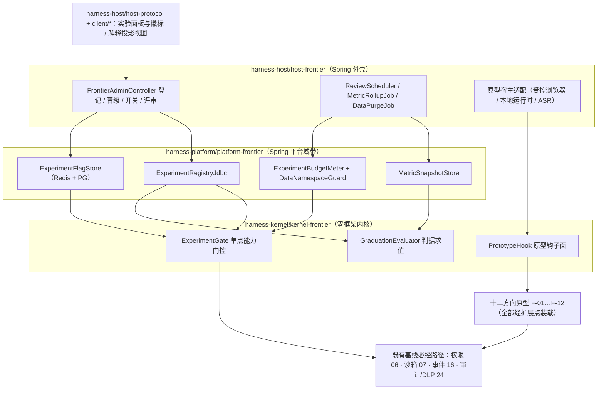
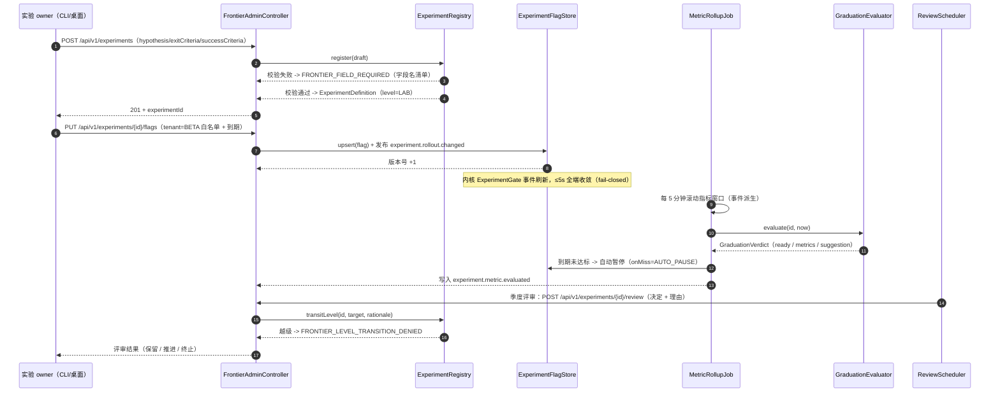
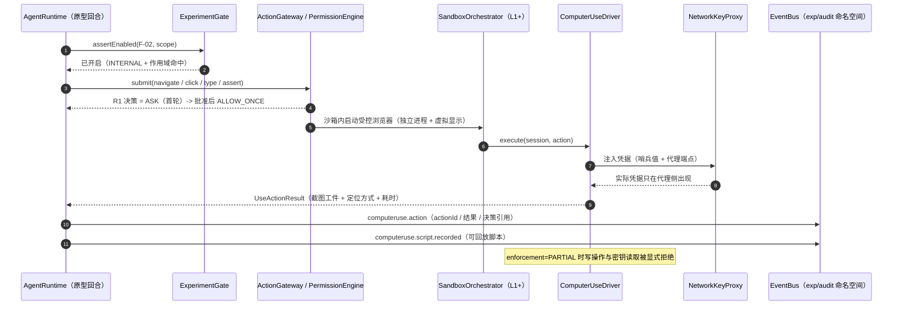
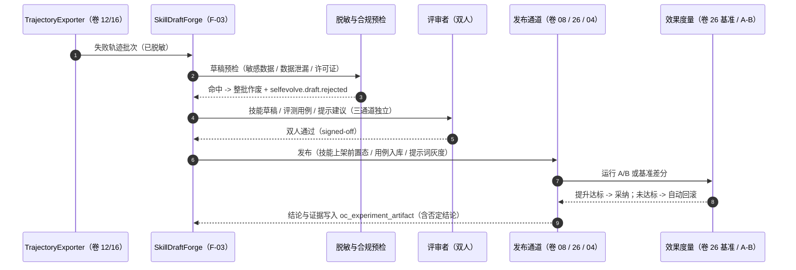
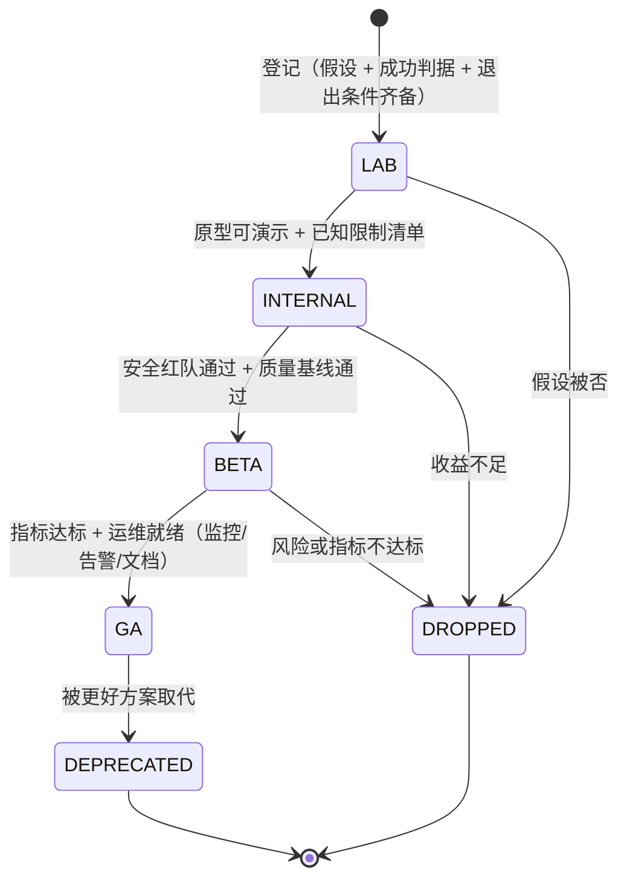

# 实现方案 35 · 前沿原型与实验阶梯实现技术方案

> 本文件是 Phase B 实现层方案，对应 Phase A 卷 25（`docs/harness/25-frontier-exploration.md`，域内决策 D-FR-1…12）与全局约束 D-PROD-6（实验开关 + 内测框架 + 可下线）、REQ-FR-12（研究通道）。
>
> **实现主线**：把卷 25 的治理原则落成**五面工程件**——① 实验注册与五级阶梯状态机；② 三档开关与显式能力门控；③ 独立数据命名空间与度量口径；④ 十二个方向的原型级方案（每个方向只做到「最小可验证原型」）；⑤ 毕业/退出判据的自动评估与人工评审双轨。落地纪律：**实验一律经扩展点（卷 18）实现，核心代码只允许「显式能力门控」分支**（卷 25 §5）；任何实验不得绕过权限/沙箱/审计/DLP（卷 25 §2 硬性规则 2）。
>
> **证据标记沿用 `00-research-plan.md` §2**：`[E1]` 源码｜`[E2]` 官方文档｜`[E3]` 第三方｜`[E4]` 推断。竞品事实来源：`research/competitors/01-claude-code-purpose-built.md`、`03-codex.md`、`04-deepseek-harness.md`、`08-gemini-cli.md`；采纳台账：`research/LESSONS-AND-ADOPTIONS.md`。
>
> **实现落点**：`harness-contract/.../contract/frontier/`（契约与 SPI）+ `harness-platform/platform-frontier`（注册/开关/度量存储）+ `harness-host/host-frontier`（Spring 外壳）+ `harness-host/host-protocol`（实验治理端点）与 `client/*`（实验面板与徽标）。**依赖修订**：§⑩.7 汇总（只登记、不改卷册，遵循 `LESSONS-AND-ADOPTIONS.md` §6.2 G6）。

---

## ① 实现目标与范围

### 1.1 本组件解决什么

让「前沿能力」在不污染主线的前提下**可做、可评估、可上线、可下线**。五条实现线：

| 线 | 内容 | 章节 |
| --- | --- | --- |
| L1 实验治理面 | 实验登记（强制字段 Fail-Fast）、五级阶梯状态机、晋级门禁、季度评审、活跃上限（≤8） | §②/§⑦.1/§⑨.1 |
| L2 开关与隔离面 | 租户/工作区/用户三档作用域 + 灰度千分比；出厂关闭、实验档显式开启；内核显式能力门控 | §③ I-FRONTIER-1/2、§⑥.1 |
| L3 数据与度量面 | 独立命名空间（可导出/可清除）、匿名默认、四类判据口径、预算池独立计量 | §③ I-FRONTIER-3、§⑧ |
| L4 十二方向原型面 | 多模态、计算机使用、自进化、联邦、端侧、图谱、长时自治、市场、互操作、语音、大仓重构、可解释 | §③.7、§⑥.2/§⑥.3 |
| L5 毕业与退出面 | 判据评估器（自动建议）+ 人工评审门禁 + 退出流程（关闭→数据处置→迁移说明→文档回写） | §③ I-FRONTIER-4、§⑦.1 |

### 1.2 与 Phase A 的对应关系

| Phase A 条款 | 本文件落实位置 |
| --- | --- |
| D-FR-1 双向多模态 | §③.7 F-01、§⑨.2 `VisionVerifier` / `MultimodalRenderPort` |
| D-FR-2 沙箱内 GUI 自动化 | §③.7 F-02、§⑥.2 执行链、§⑩.3 隔离与凭据 |
| D-FR-3 受控自进化（草稿 + 人工评审） | §③.7 F-03、§⑥.3 产物回流、§⑧.1 `oc_experiment_artifact` |
| D-FR-4 评测驱动开发（EDD） | **承载为毕业机制本体**：§③.4 判据评估器 + §⑧.3 指标 + §⑪ 门禁（评测体系本体在卷 26，不重复展开为方向卡片） |
| D-FR-5 三类市场 + 私有镜像 | §③.7 F-08、§② REQ-FRONTIER-24 |
| D-FR-6 A2A 能力联邦 | §③.7 F-04、复用卷 23 I-A2A-7 目录与信任（impl/24 §3.7） |
| D-FR-7 个人助理化（主动建议，默认关闭） | §③.7 F-07 的「建议轨」与 §⑦.2 默认关闭语义 |
| D-FR-8 分层推理（端侧小模型） | §③.7 F-05、§③.5 I-FRONTIER-6 |
| D-FR-9 形式化验证（lab 起步） | **不做方向卡片**：保留 lab，以外部工具接入（卷 05 工具注册 + 卷 07 沙箱）实现；预算与退出走 L1/L5 同一机制（§⑩.7 建议 4） |
| D-FR-10 人-代码-决策图谱 | §③.7 F-06、§⑨.2 `GraphQueryPort` |
| D-FR-11 自主运维 | 由卷 32 承载（impl/34）；本文件只保留实验观测嵌入点（§⑩.5） |
| D-FR-12 研究通道制度 | 本文件整体（§③/§⑨.1/§⑪） |
| 卷 25 §2 五级阶梯 + 硬性规则 1–4 | §③ I-FRONTIER-1、§⑦.1、§⑨.1、§⑩.6 |
| 卷 25 §4 登记模板 / §6 事件与指标 / §7 非功能 | §⑤ `ExperimentDefinition` / §⑧.3 / §⑩.4/§⑩.6/§⑨.3 |

### 1.3 本组件不解决什么

- **不解决**已确定功能的设计与实现（见各卷）；本文件只覆盖 lab/internal/beta 级的原型方案。
- **不解决**评测体系本体（卷 26）与运维自诊断/自愈（卷 32）：只做挂钩与观测嵌入。
- **不解决**权限、沙箱、审计、DLP 的新语义：实验能力**消费**这些能力，不新增绕过路径。
- **不解决**市场经济模型（分成/交易）：D-FR-5 的 B3 备选不出现在本文件范围。

### 1.4 上下游依赖

| 方向 | 依赖对象 | 交互面 |
| --- | --- | --- |
| 上游 | 扩展与插件（卷 18 / impl 18） | 实验实现一律注册为扩展点；`ExtensionRegistry` 提供装载与隔离 |
| 上游 | 事件总线（卷 16 / impl 16） | 实验事件走同一信封与分区；指标由事件派生 |
| 上游 | 权限/沙箱/审计（卷 06/07/24） | 门控检查点复用 `ActionGateway` 与 `PermissionEngine` 结果，不新增旁路 |
| 上游 | 模型网关（卷 02 / impl 02） | 预算池经 `UsageRecorder` 变体计量；端侧路由复用 `CapabilityMatrix` |
| 上游 | 评测（卷 26 / impl 33） | 判据评估器消费基准结果；毕业建议必须带评测证据 |
| 上游 | 企业配额（卷 24/31 / impl 26） | 实验预算独立于用户配额；超限暂停由 `ExperimentBudgetMeter` 触发 |
| 下游 | 交互面（卷 22/33 / impl 22/23/30） | 实验面板、徽标、解释视图；用户可自行关闭 beta 及以上实验 |
| 下游 | 运维（卷 32 / impl 34） | 实验指标进入健康度看板；评审节奏进入季度节奏 |

### 1.5 模块落点

**落地登记（R07：模块 / 顺序 / 批次；清单见 `reviews/R07-scope-build-platform.md`）**：
- **模块坐标**：`harness-contract`（包 `contract/frontier`）+ `harness-kernel/kernel-frontier`（**扩展模块**，待登记）+ `harness-platform/platform-frontier`（**扩展模块**，待登记）+ `harness-host/host-frontier`（**扩展模块**，待登记）+ `harness-host/host-protocol`（实验治理端点）+ `client/*`（实验面板与徽标）。卷 27 §4.3「25 前沿 → 各模块的 `experimental` 包 + 开关」仍是**上层纪律**：扩展模块内的原型只能经各域扩展点调用既有能力，不得自建平行实现。
- **实施顺序（卷 27 §4.5）**：第 **20** 步**之后**（无独立步骤）：实验治理（登记/开关/度量/晋级）可在第 1 步后续建，但**原型本体**依赖其所消费域的步骤完成（F-01…F-12 逐条依赖第 4/7/8/11/16/19 步）；不得以「实验」名义跳过前置域（卷 25 的「实验必须登记」纪律）。
- **数据迁移批次**：`oc_experiment_*` / `oc_prototype_run` / `oc_federation_pair` 未在卷 27 §4.4 明列 → 建议新批次 **B10 自动化、智能增强与前沿实验**（与 `31`/`32` 同批）；其中 `oc_experiment_flag` 与 B6 的「特性开关」同源治理（口径权威在 `25` 的 `oc_feature_flag`，本文件只存实验维度）。
- **CI 修正（R07；清单见 `reviews/R07-scope-build-platform.md`）**：§⑪ 原 `mvn -pl harness-core -am test`（模块不存在）已改为 `harness-kernel/kernel-frontier`；`mvn -pl open-coding-bootstrap`（v1 名）已改为 `harness-host/host-bootstrap`。
- **I- 决策落点**：`I-FRONTIER-1…12`（12 条）模块落点为上表；类级落点见 §⑤（`ExperimentGate`/`GraduationEvaluator`/`ExperimentRegistryJdbc`），逐条绑定登记为 R07 建议 S4。

```text
harness-contract/.../contract/frontier/
    标识与枚举：ExperimentId / ExperimentLevelEnum / ScopeTypeEnum / PrototypeKindEnum / ActionOnMissEnum
    载荷：ExperimentDefinition / ExperimentFlag / ExitCriteria / MetricVerdict / GraduationVerdict
    SPI：ExperimentRegistry / ExperimentGate / ExperimentMetricSource / GraduationEvaluator / PrototypeHook
         VisionVerifier / ComputerUseDriver / SkillDraftForge / GraphQueryPort / LocalRuntimeProbe
         RefactorPlanner / ExplanationProjector / VoiceSessionBridge / MarketConnector

harness-kernel/kernel-frontier（内核，零框架；R1：不依赖 Spring/JDBC/Redis/HTTP 与 harness-platform）
    frontier/gate/    ExperimentGate（本地开关缓存 + 事件驱动失效）、CapabilityGate（显式能力门控分支）
    frontier/eval/    GraduationEvaluator（纯函数判据求值）、MetricWindow（时间窗口径）
    frontier/proto/   原型最小实现（F-01…F-12，全部实现 contract SPI，禁止内核直连外部系统）

harness-platform/platform-frontier（平台域带，Spring；R2：不依赖 harness-host）
    frontier/store/   ExperimentRegistryJdbc、ExperimentFlagStore（Redis + PG）、MetricSnapshotStore
    frontier/budget/  ExperimentBudgetMeter（Redis 计数 + 日切）、DataNamespaceGuard（命名空间与清理）
    frontier/review/  ReviewLedgerJdbc（评审记录与决定）

harness-host/host-frontier（外壳装配）
    admin/  FrontierAdminController（登记/晋级/开关/评审/数据处置）
    jobs/   ReviewScheduler（季度评审提醒）、MetricRollupJob（事件 → 指标窗口）、DataPurgeJob
    proto/  原型宿主适配（受控浏览器进程、本地运行时探测、图谱增量构建、ASR 通道）

harness-host/host-protocol + client/*（交互与协议面；R3：端侧只经 SDK/协议调用，不直连存储）
    cli / desktop：实验面板、实验徽标、解释投影视图（只读消费 §⑧ 事件与投影）
```

**纪律**：契约与 SPI 在 `harness-contract`（零框架）；内核只依赖契约；一切外部系统连接（浏览器进程、本地模型运行时、ASR、图谱存储）住 `harness-host/host-frontier` 或 `harness-platform`，内核不得直连。**模块命名以 `27-technical-path.md` §4.1 目录布局为准**（不使用 v1 `open-coding-*` 工程名，R4；无反向依赖与循环，R2/R5）。

---

## ② 功能需求清单（REQ-FRONTIER-n，续卷 00 §5.25 的 REQ-FR-1…12）

> **编号约定（R02）**：`REQ-FRONTIER-01…30` 为本文件实现层号段，是对卷 25 与卷 00 §5.25 `REQ-FR-1…12` 的展开与细化（**不同号段，不构成同串同义**）；引用 Phase A 需求一律写全称「卷 00 REQ-FR-n」或「卷 25 §x」，本文件计数与 README §2 口径不含 `REQ-FR-*`。

| REQ | 需求描述 | 来源 | 优先级 | 验收要点 |
| --- | --- | --- | --- | --- |
| REQ-FRONTIER-01 | 五级阶梯为**受控状态机**（lab/internal/beta/ga + deprecated/dropped 两终态），晋级逐级并附门禁清单（安全红队、质量基线、运维就绪） | 卷 25 §2/§7 | P0 | 越级晋级被拒；每级门禁缺项即拒（含用例） |
| REQ-FRONTIER-02 | 实验登记**强制字段 Fail-Fast**（假设/入口/影响面/成功判据/风险/退出条件/owner/评审时间/指标看板），缺任一字段拒绝登记 | 卷 25 §4 | P0 | 缺字段用例逐一被拒并返回字段名；无退出条件不得进入 beta |
| REQ-FRONTIER-03 | 实验能力**出厂关闭**，由「实验档」（profile/patch 形态）开启；核心代码只允许显式能力门控分支 | 卷 25 §5；DeepSeek `packages/experimental/*` 出厂禁用、由文档化 profile patch 开启 [E1]（`04-deepseek-harness.md` §4.9/§5.4） | P0 | 默认配置下 12 方向全部不可用；开启仅改动配置 |
| REQ-FRONTIER-04 | 开关三档作用域（租户/工作区/用户）+ 千分比灰度；无开关数据时一律 fail-closed（视为关闭） | 卷 25 §2；Codex `requirements.toml` 企业约束面（`browser_computer_use_requirements.rs`）[E1]（`03-codex.md` §4.23） | P0 | 关开关 ≤5s 全端收敛；无记录时门控返回 false |
| REQ-FRONTIER-05 | **活跃实验上限**（默认 ≤8）与**独立实验预算池**（不占用户配额）；超预算自动暂停并告警 | 卷 25 §7 | P0 | 第 9 个实验登记被拒；预算耗尽后自动暂停、恢复需人工 |
| REQ-FRONTIER-06 | 实验数据**独立命名空间** + 一键处置（导出包 / 删除证明）；默认匿名，涉及用户数据须显式同意 | 卷 25 §2 硬性规则 3/4 | P0 | 删除后七天不可查（含备份路径声明）；导出包可离线校验 |
| REQ-FRONTIER-07 | 判据评估器：按窗口评估成功率/成本/时长/满意度，达标生成「毕业建议」、到期未达标生成「暂停/终止建议」 | 卷 25 §2/DoD | P0 | 每个实验至少一条判据；评估结果入事件与评审台账 |
| REQ-FRONTIER-08 | 退出流程：关闭开关 → 数据处置 → 迁移说明 → 事件与公告 → GA 回写卷册；产物与引用可达 | 卷 25 §5/§7 | P0 | 退出后无残留调用路径（静态检查 + 运行时零命中） |
| REQ-FRONTIER-09 | 实验能力在界面显式「实验」徽标；beta 及以上用户可自行关闭；关闭后不影响主线功能 | 卷 25 §7 | P1 | 徽标在 CLI/桌面均可见（文案对齐卷 33）；关闭后主线用例不受影响 |
| REQ-FRONTIER-10 | 安全基线不可绕过：实验不得跳过权限/沙箱/审计/DLP（等价断言：实验开与关的决策链长度一致） | 卷 25 §2 硬性规则 2 | P0 | 属性测试：任意实验开启态下，被拒动作仍被拒 |
| REQ-FRONTIER-11 | 多模态闭环：设计稿/截图 → 代码 → 渲染回评 → 差异报告 → 修复轮次；报告结构化、可复现（同输入同哈希） | 卷 25 D-FR-1；Claude Code 以类型化附件生成器承载图像与诊断上下文 [E1]（`01-claude-code-purpose-built.md` §4.5） | P1 | 30 个还原任务 ≥80% 结构正确率；报告重跑哈希一致 |
| REQ-FRONTIER-12 | 计算机使用**仅限沙箱内**（受控浏览器为主、虚拟显示桌面面后置），执行强度如实上报 `FULL`/`PARTIAL` | 卷 25 D-FR-2；DeepSeek `SandboxEnforcement = full \| partial` 上报并要求绝对边界消费者自行拒绝 [E1]（`04` §1-7/§8 L6） | P1 | `PARTIAL` 档下高风险能力（密钥代理/DLP）显式拒绝；无 `FULL` 不进入 beta |
| REQ-FRONTIER-13 | 计算机使用凭据经代理注入（模型上下文只见哨兵值）+ 域名白名单 + 只读默认 + 生产系统默认禁写 | 卷 07/30；卷 25 §2 | P1 | 上下文抓取无真实凭据；白名单外导航被拒并留痕 |
| REQ-FRONTIER-14 | GUI 用例**录制为可回放脚本**（动作序列 + 截图 + 断言），纳入仓库与回归门禁 | 卷 25 D-FR-2 | P1 | 回放成功率 ≥ 首次执行；脚本变更走评审 |
| REQ-FRONTIER-15 | 自进化三通道产物（技能草稿 / 评测用例 / 提示词建议）全部走「草稿 → 评审 → 发布」，禁止自动发布 | 卷 25 D-FR-3 | P0 | 任一通道无自动发布路径（代码级检查）；评审记录可追溯 |
| REQ-FRONTIER-16 | 自进化产物**效果度量**：每条采纳必须附前后指标对照（A/B 或基准差分）；未提升则回滚并记录否定结论 | 卷 25 D-FR-3/DoD | P0 | 季度 ≥20 条采纳各自带指标证据；无证据条目不计入 |
| REQ-FRONTIER-17 | 程序化工具编排（PTC/编排脚本）作为自进化与长时任务骨架：子调用重入完整受守卫管线、逐条审计、并发有上限 | DeepSeek PTC `run_code` 与 `workflow` 扇出 [E1]（`04` §1-9/§5.2 及 L12）；卷 05 | P0 | 子调用逐条产出事件；上限生效（超限拒绝而非无界排队） |
| REQ-FRONTIER-18 | 联邦协作：目录 + 签名 Agent Card + 分级信任 + 数据驻留路由 + 跳数 ≤3；**跨租户默认禁止**，需双方管理员结对 | 卷 23 I-A2A-7 / 卷 25 D-FR-6；Gemini CLI 以独立 `packages/a2a-server` + `a2a-client-manager` 实现双向远端代理 [E1]（`08-gemini-cli.md` §4.19） | P1 | 结对需双签；未结对调用返回 `CROSS_TENANT_DENIED` |
| REQ-FRONTIER-19 | 联邦与远端产物默认标记「未验证」，本地验证器复核后才可计入证据 | 卷 23 REQ-A2A-20 | P0 | 未复核产物在验收中零计入（用例） |
| REQ-FRONTIER-20 | 端侧/私有模型：探测本地运行时后按能力打分路由，**白名单任务**限定（摘要/分类/重排/草稿）；不预装；降级必须显式留痕 | 卷 25 D-FR-8/§10；卷 02 D-MDL-6（禁止静默降级） | P1 | 三类任务承接比 ≥30%；降级事件含原因与目标模型 |
| REQ-FRONTIER-21 | 图谱增强：人-代码-决策图谱（节点/边/来源引用）+ 三类问答（责任人 / 决策溯源 / 变更影响链）+ 前置权限过滤 | 卷 25 D-FR-10 | P2 | 三类问答准确率 ≥85% 且带引用；越权节点不可见 |
| REQ-FRONTIER-22 | 长时自治：显式契约 + 预授权范围 + 每 Tick 证据 + 漂移检测 + 连续 3 次熔断即降级交互模式 | 卷 15；DeepSeek `auto-review` 实验自陈「可能放行不安全动作、拒绝有用工作、多花 token」→ 必须可关且默认关 [E1]（`04` §4.4） | P1 | 7 天任务完成率 ≥80% 且人工介入 ≤1 次/天；熔断路径有演练 |
| REQ-FRONTIER-23 | 云/远程执行委托：长时任务可提交远端执行并回取 diff，本地复核后应用；远端不可信时仅允许产物回取 | Codex `cloud-tasks` + WebSocket `exec-server`（`environment/add`）+ `codex cloud apply` [E1]（`03-codex.md` §4.16/§1-10） | P2 | 委托 → 回取 → 复核 → 应用全链审计；无云端凭证时能力显式不可用 |
| REQ-FRONTIER-24 | Agent 市场：三类目（技能/插件/团队模板）+ 签名 + 安全扫描 + 评分评论 + 私有镜像 + **撤销通道** | 卷 25 D-FR-5；Gemini extensions 带完整性校验与画廊（`policy/integrity.ts`）[E1]（`08` §1-8） | P2 | 撤销生效 ≤5min；恶意样本（含越权声明）被拦截 |
| REQ-FRONTIER-25 | 跨工具互操作：六类导入迁移 + 通用存档 + 移植包；**不可映射项 100% 显式报告**，禁止静默丢弃 | 卷 29 §4.1–§4.4.1 | P1 | 六类导入各有 golden 用例；不可映射项计数与报告一致 |
| REQ-FRONTIER-26 | 语音/会议：默认关闭 + 显式同意 + 转写文本入 DLP；产出仅为「建议任务/建议文本」，永不自动执行 | 卷 24 DLP；Claude Code 设 `src/voice/` 输入模块 [E1]（`01` §4.20） | P2 | 无同意则录音不可用；建议任务全部待人工确认 |
| REQ-FRONTIER-27 | 代码库级重构：影响分析 → 变更分片（每片可编译、可测试、可回退）→ 分片并行（worktree）→ 逐片门禁合并；禁止一次性全量替换 | 卷 21/14；Gemini 循环检测对批量重构类相似调用**显式豁免误伤**并配 LLM 复核 [E1]（`08` §1-6） | P1 | 目标 API 零残留（静态检查）；每片可回退且测试通过率不降 |
| REQ-FRONTIER-28 | 可解释与信任界面：解释投影**不新增事实源**（全部事件派生）；三层披露（结论/原因/细节）；决策链 100% 可还原 | 卷 06 决策回放 / 卷 16 / 卷 33；决策原因枚举化为可聚合变体 [E1]（`LESSONS-AND-ADOPTIONS.md` L-003，源自 `06` §8-1） | P1 | 决策链可还原 100%；「被拦原因」查询 P95 <1s |
| REQ-FRONTIER-29 | 评审节奏：季度评审（保留/推进/终止）记录、指标看板、成本看板；结论写入台账并可查询 | 卷 25 §7/DoD | P0 | 每季度 ≥1 次评审记录；每个实验有 owner 与 reviewDate |
| REQ-FRONTIER-30 | 实验与评测挂钩：每个实验登记「离线用例 + 在线指标」，缺评测项不得进入 beta（机械门禁） | 卷 25 DoD；卷 26 门禁矩阵 | P0 | 门禁脚本检查登记完整性（差集为空）；缺失即 CI 失败 |

**竞品增量需求说明**：REQ-FRONTIER-03/04/11/12/17/18/22/23/24/26/27/28 来自竞品源码级事实（DeepSeek 实验包策略与执行强度上报 / Codex 企业约束面与云任务 / Gemini A2A 与扩展完整性 / Claude Code 附件与语音 / 决策原因枚举），是 Phase A 未下沉到实现层的机制级需求，逐条落入 §③ 决策、§⑨ SPI 或 §⑩ 约束。

---

## ③ 技术方案选型（M×N 比选）

评分沿用 `README.md` §4：**F 30% / U 20% / S 25% / M 25%**。

### 3.1 I-FRONTIER-1 实验分级的开关与可见性模型

| 分支 | 描述 | F | U | S | M | 加权 | 结论 |
| --- | --- | --- | --- | --- | --- | --- | --- |
| B1 | 单一全局开关（配置文件开/关，无作用域） | 6 | 6 | 9 | 6 | 68.0 | 淘汰（无法小范围灰度与按租户试运行） |
| B2 | **四级组合：实验档（部署级）→ 租户 → 工作区 → 用户 + 千分比灰度 + 到期自动关闭** | 9 | 9 | 8 | 9 | 87.5 | **选定** |
| B3 | 编译期特性开关（构建产物区分） | 7 | 6 | 6 | 5 | 61.5 | 淘汰（发布成本高、无法热收敛） |

**选定 B2**：与卷 25 §2（lab 硬编码 / internal 实验开关 / beta 租户级 / ga 默认开启）一致，补齐**到期自动关闭**防滞留；fail-closed：无记录或读取失败一律关闭。放弃 B1/B3 的代价为需维护作用域解析器（约 200 行 + 用例）。

### 3.2 I-FRONTIER-2 实验代码隔离形态

| 分支 | 描述 | F | U | S | M | 加权 | 结论 |
| --- | --- | --- | --- | --- | --- | --- | --- |
| B1 | 核心代码内 `if (enabled)` 分支（散落） | 8 | 7 | 5 | 4 | 60.5 | 淘汰（实验腐化主线，违反卷 25 §5） |
| B2 | **扩展点插件（卷 18）+ 内核单点显式能力门控（`CapabilityGate`）** | 9 | 8 | 8 | 9 | 85.5 | **选定** |
| B3 | 独立分支/独立二进制 | 6 | 5 | 7 | 6 | 60.0 | 淘汰（双版本维护、与主线漂移） |

**选定 B2**：原型注册为扩展（`PrototypeHook`），内核只在固定检查点（工具执行、模型调用、上下文组装、交互输出）查询一次门控；B1 省一次查询但引入永久腐化。**回退**：门控热路径 P99 恶化 >1ms 时退化为「启动期静态快照 + 事件驱动刷新」（保留显式门控语义）。

### 3.3 I-FRONTIER-3 实验数据收集与度量口径

| 分支 | 描述 | F | U | S | M | 加权 | 结论 |
| --- | --- | --- | --- | --- | --- | --- | --- |
| B1 | 每实验自定义埋点与自建表 | 7 | 7 | 5 | 5 | 60.0 | 淘汰（口径不一、清理难、隐私风险） |
| B2 | **复用卷 16 事件 + 卷 26 口径：命名空间事件 → 指标窗口派生；四类判据统一（成功率/成本/时长/满意度）** | 9 | 8 | 9 | 9 | 88.5 | **选定** |
| B3 | 第三方 A/B 平台（外部 SaaS） | 6 | 7 | 6 | 7 | 65.0 | 淘汰（DLP 与数据驻留不可接受；离线不可用） |

**选定 B2**：指标全部**由事件派生**（不新增事实源），命名空间 `exp:` 前缀 + 保留期与清理随实验状态联动；满意度由显式「反馈卡片」事件采集（可选、默认关闭）。代价是指标依赖事件完整性——由 `MetricRollupJob` 对账（事件计数 vs 窗口计数）发现缺口。

### 3.4 I-FRONTIER-4 毕业与退出判据的执行机制

| 分支 | 描述 | F | U | S | M | 加权 | 结论 |
| --- | --- | --- | --- | --- | --- | --- | --- |
| B1 | 纯人工季度评审（无自动评估） | 6 | 7 | 9 | 7 | 71.5 | 基线（保留为最终决定权） |
| B2 | **自动判据评估（建议）+ 人工评审门禁（晋级/终止唯一决定权）+ 到期自动暂停** | 9 | 9 | 8 | 9 | 87.5 | **选定** |
| B3 | 全自动晋级（指标达标即自动进退） | 7 | 6 | 5 | 5 | 58.5 | 淘汰（安全与合规门禁无法自动通过，违反硬性规则 1） |

**选定 B2**：评估器只产出 `GraduationVerdict` 建议，晋级需 owner + 评审者在管理面确认；到期未达标**自动暂停**（保守方向可自动，激进方向禁止自动）。B3 风险即 DeepSeek `auto-review` 自陈的失败模式（可能放行不安全动作/拒绝有用工作/多花 token）[E1]（`04` §4.4）。

**毕业/退出判据量化表（评估器口径，逐条可机械判定）**：

| 阶梯转换 | 判据（全部满足才 `ready=true`） | 样本要求 | 窗口 | Guardrail（任一违反即不建议晋级） | 未达标的动作 |
| --- | --- | --- | --- | --- | --- |
| LAB → PILOT | ≥ 1 个外部工具接入并登记评测项；能力缺口声明齐备 | — | — | 无 | 6 个月无进展 → 建议归档（`DROPPED`） |
| PILOT → BETA | 成功率相对基线 ≥ 0（双比例检验 p ≤ 0.05）；成本 ≤ 基线 110%；安全门禁全绿 | ≥ 200 任务 / ≥ 50 用户 | 14 天滚动 | 越权 0、数据外泄 0、P0 缺陷 0 | 通过率 < 50% 或误伤 > 5% → 退回 LAB |
| BETA → GA | 成功率 +5pp；成本 ≤ 基线 110%；采纳率 ≥ 30%（能力类）；满意度 ≥ 4.0/5（若启用采集） | ≥ 1000 任务 / ≥ 200 用户 | 30 天滚动 | 同上 + 评审积压 = 0 + 回放确定性件齐备 | 连续 2 季度未达标 → 建议终止 |
| GA → DEPRECATED | 替代能力上线 + 迁移指引齐备 + 无破坏性 API 变更 | — | 90 天公告期 | 无 | 公告期内用户仍可用 |
| 任意 → DROPPED | owner 决定，或「只读后 1 季度仍未评审」 | — | — | — | 数据处置三段式（导出/删除 + 证明） |

**统计口径（防「趋势代替显著性」）**：比例指标用双比例 z 检验（α = 0.05、功效 0.8 ⇒ 检测 5pp 差异约需每臂 200 样本）；成本与时长用 bootstrap 置信区间（不劣化判定取 95% 上界）；样本不足一律 `ready=false`（原因 `INSUFFICIENT_SAMPLE`），禁止以「趋势向好」替代显著性；指标缺口 > 0.1% 时自动判据暂停（仅人工评审，§10.6）。**fail 方向（显式）**：**门控与判据闸门 fail-closed**（无记录 / 回源失败 / 作用域越权 → 一律关闭或暂停，不做「默认开启」兜底，REQ-FRONTIER-04）；**指标与事件上报 fail-open + WARN**（不阻塞原型运行，缺口经对账作业可见）——与「预算/权限/审批 fail-closed、计量/遥测 fail-open」的全局口径一致。

### 3.5 次要分叉（结论登记，矩阵从略）

| 决策 | 候选（各 ≥2 分支） | 选定与理由 |
| --- | --- | --- |
| I-FRONTIER-5 计算机使用承载面 | B1 仅受控浏览器（CDP）／B2 **浏览器面先行 + 桌面面（虚拟显示 + 元素/坐标混合定位）后置**／B3 仅远程 VM | **B2**（F8/U8/S7/M8 → 77.5）：浏览器面覆盖 80% 端到端验证价值且隔离可控；桌面面前置需额外虚拟显示与视觉定位投入；B3 延迟与成本不可接受。回退：浏览器面通过率长期 <50% 则整体降级 lab |
| I-FRONTIER-6 端侧推理运行时形态 | B1 内嵌进程（llama.cpp 绑定）／B2 **外部本地运行时探测接入（Ollama 等，不预装）**／B3 自主分发 sidecar | **B2**（F8/U8/S8/M8 → 80.0）：与卷 25 §10「不预装、检测到才启用」一致；内嵌绑定带来平台编译与体积成本；B3 增加分发与更新负担。回退：本地运行时生态收敛为单一事实标准时复议 B1 |
| I-FRONTIER-7 自进化产物回流通道 | B1 直接改写提示词/技能库／B2 **三通道全部「草稿 → 评审 → 发布」**／B3 仅出报告 | **B2**（F9/U8/S8/M9 → 85.5）：与 D-FR-3 一致；B1 模型自写自用风险不可控；B3 无实际回流价值。回退：评审积压 >60 条时开放「低风险快通道」（仅评测用例可加快） |
| I-FRONTIER-8 联邦协作信任模型 | B1 静态白名单／B2 **目录 + 签名 Card + 分级信任 + 结对 + 驻留路由**／B3 开放联邦 | **B2**（F8/U8/S8/M9 → 82.5）：复用卷 23 I-A2A-7（impl/24）已实现件；B3 企业合规不可接受。回退：联邦实例 <3 时退化为静态注册表（与 impl/24 同一回退条款） |

### 3.6 实现级决策登记（I-FRONTIER-n）

| ID | 主题 | 选定 | 被放弃分支的代价 | 回退触发条件 |
| --- | --- | --- | --- | --- |
| I-FRONTIER-1 | 开关与可见性 | 实验档 → 租户 → 工作区 → 用户 + 千分比 + 到期自动关闭 | 需维护作用域解析与 fail-closed 语义 | 门控 P99 恶化 >1ms（改静态快照 + 事件刷新） |
| I-FRONTIER-2 | 代码隔离 | 扩展点插件 + 内核单点能力门控 | 原型须按 SPI 交付（初期样板多） | 登记实验数 > 12（活跃仍 ≤ 8，配置 `max-active-experiments` 强制）且装载耗时显著（改分组懒加载） |
| I-FRONTIER-3 | 数据与度量 | 事件派生命名空间 + 四类统一口径 | 指标依赖事件完整性（需对账作业） | 事件丢失率 >0.1%（暂停自动判据，仅人工评审） |
| I-FRONTIER-4 | 毕业与退出 | 自动评估建议 + 人工评审门禁 + 到期自动暂停 | 评审需人力（季度固定节奏） | 评审积压 >2 个季度（改 owner 自助 + 抽查） |
| I-FRONTIER-5 | 计算机使用承载 | 浏览器面先行、桌面面后置 | 桌面类端到端能力延后 | 浏览器面通过率 <50%（整体降级 lab） |
| I-FRONTIER-6 | 端侧推理运行时 | 外部运行时探测接入（不预装） | 依赖用户自装运行时（启用率不可控） | 本地运行时生态收敛（复议内嵌绑定） |
| I-FRONTIER-7 | 自进化回流 | 三通道全部草稿-评审-发布 | 评审成为吞吐瓶颈 | 积压 >60 条（开放低风险快通道） |
| I-FRONTIER-8 | 联邦信任 | 目录 + 签名 + 结对 + 驻留路由 | 结对运维成本 | 联邦实例 <3（退化为静态注册表） |

### 3.8 与竞品对照的取舍（research 证据）

| 对照维度 | 竞品证据 | 我们的取舍 | 主动放弃的收益 |
| --- | --- | --- | --- |
| 实验可见性与开关 | DeepSeek 以 profile patch 显式开启实验包（`competitors/04` §5.4）[E1] | 采纳为「实验档 → 租户 → 工作区 → 用户 + 千分比 + 到期自动关闭」（I-FRONTIER-1） | 放弃「环境变量一把梭」的简单开关，需维护作用域解析与 fail-closed |
| 多模态与计算机使用 | Codex `view_image`/realtime/computer-use 要求类型 [E1]；MiniMax 云多模态 18+ 工具 + `browser-core` [E1]；Gemini `browser_agent` 无障碍树驱动 [E1] | 采「浏览器面先行 + 沙箱内受控浏览器」（I-FRONTIER-5；F-02 卡片） | 桌面面（虚拟显示/坐标定位）后置，覆盖场景少于一揽子方案 |
| 端侧推理 | Goose 本地推理 + Ollama 接入 [E1]；Continue 配置驱动多模型 + Ollama [E1] | 采「外部运行时探测接入，不预装」（I-FRONTIER-6） | 启用率依赖用户自装运行时（不可控） |
| 自我扩展/自进化 | DeepSeek `cordis-host-runner` 运行时自我扩展 `[E1]`；OpenCode `codemode` 语言级沙箱 [E1]；SWE-agent ACI「多给上下文反而更差」实证 + history processors [E1] | 采「三通道草稿 → 评审 → 发布」（I-FRONTIER-7；F-03），模型产物不得自写自用 | 放弃「自动生效」的进化速度（安全与合规门禁不可自动通过） |
| 联邦协作 | Gemini A2A server + `a2a-client-manager` [E1]；L-081 类观察（7/9 未观测 A2A） | 复用 impl/24 的信任模型（目录 + 签名 Card + 分级信任 + 结对 + 驻留路由，I-FRONTIER-8） | 不做开放联邦（企业合规不可接受） |

### 3.7 十二个方向原型级方案（逐方向卡片 F-01…F-12）

> 统一口径：**级别**指首次可进入的阶梯级别；**成功判据**与**退出条件**同时登记为 `oc_experiment` 的 `successCriteria` / `exitCriteria`（§⑧.1），由 §③.4 判据评估器按窗口求值。每个方向的原型实现都必须注册 `PrototypeHook`（§⑨.2），只经扩展点触达系统能力。

#### F-01 多模态流式交互（D-FR-1，级别 lab → internal）
- **假设**：若把「设计稿/截图 → 代码 → 渲染回评 → 差异修复」做成闭环，则界面类任务一次通过率显著上升（内部基准结构正确率 ≥80%），因为差异被量化后可定向修复
- **技术路径**：① 输入增强（多图/录屏分片 → 工件引用，卷 03 外置）；② 渲染回评（沙箱内 headless 渲染截图，`MultimodalRenderPort`）；③ 视觉对比（`VisionVerifier`：区域切分 + 像素差 + 语义差异清单）；④ 修复循环（差异报告 → 定向修改，轮次上限 3）；⑤ 图示生成（架构图/流程图由工具产出结构化源码，禁止自由文本「画图」）
- **最小原型范围**：单页面组件级闭环：上传设计稿 PNG → 生成组件代码 → 渲染 → 差异报告 → 一轮修复；仅 1 个前端框架；不做跨页面与响应式矩阵
- **所需系统钩子**：卷 05 工具族（`view_image` / `extract_document` / `render_snapshot`）；卷 12 `VerificationProvider` 注册；卷 03 工件外置与再读鉴权；卷 02 `CapabilityMatrix` 多模态能力位；卷 22 会话输入增强
- **风险与退出条件**：风险：差异误报导致无效迭代；模型无视觉能力时退化为「仅文档抽取」并显式声明。退出：结构正确率 <60%，或单任务视觉迭代成本 >基线 2 倍（同一内部基准 30 任务对照）
- **成功判据**：30 个内部还原任务：结构正确率 ≥80%、平均修复轮次 ≤2、差异报告同输入重跑哈希一致
#### F-02 计算机使用 / 浏览器操作（D-FR-2，级别 lab → internal）
- **假设**：若在沙箱内以受控浏览器执行 GUI 操作，则「端到端验证」可从跑测试扩展到真点一遍，10 个典型 WEB 流程自动化通过率 ≥70% 且零越界
- **技术路径**：① 受控浏览器（Chromium + CDP，独立进程，L1+ 沙箱内）；② 动作面收敛（导航/点击/输入/断言/截图，全部经 `ActionGateway`，风险 R1+）；③ 元素定位优先、视觉坐标兜底（`ComputerUseDriver`）；④ 凭据经 `NetworkKeyProxy` 注入（上下文只留哨兵值）；⑤ 执行录制为可回放脚本（动作序列 + 截图 + 断言）
- **最小原型范围**：单环境（测试站点）：登录 → 表单 → 3 条关键断言链路；桌面 GUI 后置（I-FRONTIER-5）；不做跨浏览器矩阵
- **所需系统钩子**：卷 07 沙箱档位与网络策略；卷 06 风险分级与审批；卷 05 工具族 `browser.*`；卷 20 快照（失败即回放）；卷 16 事件 `computeruse.*`；卷 30 密钥代理
- **风险与退出条件**：风险：对非测试系统误操作；视觉定位不稳；`PARTIAL` 平台（ACL 类后端）能力不对称。退出：1 例越界操作即暂停；10 流程通过率 <50%，或**脚本维护工时 > 手工回归工时的 1.0 倍**（月度结算，工时口径取台账记录）
- **成功判据**：10 流程通过率 ≥70%；全部动作可在审计中复现（截图 + 动作序列 + 决策链三元组）；执行强度上报与平台矩阵一致
#### F-03 自进化与技能自动生成（D-FR-3，级别 lab → internal）
- **假设**：若从失败轨迹提炼技能草稿、评测用例与提示词建议，且全部经人工评审发布，则组织能力季度性增强（每季度 ≥20 条被采纳且有指标提升）
- **技术路径**：① 失败轨迹采集（卷 12 `TrajectoryExporter` + 卷 16 事件）；② 聚类与归因（同类失败归并，产出改进假设）；③ 三通道产物：技能草稿（卷 08 创作器）、评测用例（卷 26 基准仓）、提示词建议（卷 04 灰度）；④ 评审门禁（人工双人复核）；⑤ 效果度量（A/B 或基准差分，未提升即回滚）
- **最小原型范围**：仅一类失败（「测试失败后修复失败」）：产出 20 条评测用例 + 3 个技能草稿，全部走评审；不开放模型自写提示词直接生效
- **所需系统钩子**：卷 08 技能包结构/签名/门禁；卷 26 基准用例仓与门禁；卷 04 灰度与回滚；卷 16 事件（`selfevolve.*`）；卷 18 扩展点（草稿生成器）
- **风险与退出条件**：风险：自我强化错误（模型错误被固化为技能）；评测用例泄漏真实数据。退出：季度采纳 <5 条，或引入 ≥2 次回归；用例含真实敏感数据即整批作废
- **成功判据**：每条采纳附前后指标对照；技能草稿上架后其触发任务成功率提升 ≥5 个百分点（或成本下降 ≥10%）**（窗口：上架后 30 天滚动；样本 ≥50 条触发任务；未达标自动回滚草稿）**
#### F-04 联邦与租户间协作（D-FR-6，级别 lab → beta 前需安全评审）
- **假设**：若以 A2A 能力联邦（共享任务与证据、不共享上下文）连接外部专家 Agent，则企业可获得跨团队复用（如安全审计专长）且合规风险可控
- **技术路径**：① 复用卷 23 目录/签名 Card/驻留路由（impl/24 §3.7 已实现件）；② 跨租户**结对**（双方管理员双签 + 有效期 + 数据用途声明）；③ 任务语义映射（外部任务 → WorkItem，外部产物默认「未验证」）；④ 双计预算与配额；⑤ 全链审计（调用方/委托者/决策/产物 provenance）
- **最小原型范围**：两实例（两租户）结对：一个安全审计 Agent 以工具形态被调用一次，结论回流并本地复核；不做多跳联邦编排
- **所需系统钩子**：卷 23 A2A 服务面/客户端（impl/24）；卷 24 租户与 DLP；卷 31 配额；卷 16 `correlationId` 跨实例；卷 30 密钥与信任；卷 25 §2 硬性规则 2
- **风险与退出条件**：风险：数据外泄与合规失败；结对运维成本高。退出：任一跨租户越权/越驻留事件即冻结联邦并复盘；结对运维工时 > 被复用节省工时，或 90 天窗口内被复用 <2 次（季度评审判定）
- **成功判据**：结对 → 调用 → 复核全链可审计；跳数 ≤3 且环路被拒；DLP 出站零漏放（红队用例 100% 拦截）
#### F-05 端侧 / 私有模型推理（D-FR-8，级别 internal）
- **假设**：若把摘要、分类、检索重排、简单编辑等轻任务路由到端侧/私有小模型，则单位成本显著下降且隐私面收敛
- **技术路径**：① 本地运行时探测（`LocalRuntimeProbe`：Ollama/LM Studio 等，检测到才启用，不预装）；② 能力打分（质量/延迟/上下文窗口）→ 信任分；③ 路由白名单（仅非破坏性任务）+ 显式回退链（卷 02 D-MDL-6，禁止静默降级）；④ 结果引用化与可追溯（哪次调用用了端侧）；⑤ 质量抽样复核
- **最小原型范围**：三类任务（会话摘要、检索重排、commit 消息草稿）走端侧；不做代码生成类任务；不做端侧微调
- **所需系统钩子**：卷 02 `CapabilityMatrix` 与路由；卷 03 摘要；卷 11 重排；卷 26 评测（质量对比）；卷 24 私有化部署形态；卷 16 事件 `localmodel.*`
- **风险与退出条件**：风险：端侧质量不足导致返工；运行时碎片化。退出：人工抽样接受率 <70%，或**季度结算「端侧节省额 − 维护成本 ≤ 0」**（节省额按卷 31 §4.4 口径核算，含路由与复核成本）
- **成功判据**：三类任务端侧承接比 ≥30%；成本下降可计量（卷 31 口径）；质量回归 ≤1%（相对基线）**（窗口：连续 28 天滚动；样本 ≥1000 次路由；未达标回退云端路由并标注）**
#### F-06 知识图谱增强（D-FR-10，级别 internal）
- **假设**：若构建人-代码-决策图谱（提交/任务/审查/记忆/知识页/决策台账派生），则「找对人」与「影响分析」两类问题的解决效率显著提升
- **技术路径**：① 节点与边抽取（人、模块、决策、变更、任务；边带来源引用与时间）；② 存储：PG 邻接表 + 图投影缓存（增量更新）；③ 查询面三类（责任人 / 决策溯源 / 变更影响链）；④ 前置权限过滤（复用卷 11 `PermissionFilterProvider` 模式）；⑤ 置信度与引用强制（无来源不出结论）
- **最小原型范围**：单仓图谱：三类问答各 10 问可答且带引用；不做跨仓、不做组织级人事分析
- **所需系统钩子**：卷 11 索引与权限过滤；卷 19 数据分域；卷 15 触发器（变更后增量更新）；卷 16 事件；卷 10 记忆（可选来源）
- **风险与退出条件**：风险：图谱陈旧与错误归因（「谁改了」≠「谁决策了」）；增量维护成本。退出：三类问答准确率 <70%，或增量更新日均 >30min 且**连续 4 周工时未下降 ≥20%**（无收敛趋势的机械判据）
- **成功判据**：三类问答准确率 ≥85% 且每条带来源引用；影响分析召回 ≥80%（对照人工标注集）；越权节点零泄露**（窗口：30 天滚动；标注集 ≥100 问；窗口内两次复核均需达标）**
#### F-07 长时任务自治（D-FR-7/D-FR-11 的自治轨，级别 internal）
- **假设**：若为长时任务（跨天/跨周）配置显式契约 + 预授权范围 + 熔断，则可在无人值守下推进（7 天任务完成率 ≥80%）而不失控
- **技术路径**：① 契约（目标/验收/预算/时间窗/允许动作白名单）；② 预授权（卷 06：范围化授权 + 到期）；③ Tick 推进（卷 15）+ 每 Tick 证据落盘；④ 漂移检测（目标偏离/重复动作/成本斜率）；⑤ 熔断（连续 3 次失败或成本斜率超阈 → 降级交互 + 通知）；⑥ 断点续跑（卷 19）
- **最小原型范围**：依赖升级类 Goal（模板来自卷 34）：7 天无人值守、每天 ≤3 Tick、只提 PR 不合并；不含生产环境写操作
- **所需系统钩子**：卷 15 Tick/Trigger/预授权审计；卷 12 `RepeatActionGuard`/`DriftGuard`；卷 19 恢复；卷 28 通知聚合；卷 31 预算熔断；卷 34 模板
- **风险与退出条件**：风险：成本失控、无意义推进、错误动作被自动化放大。退出：连续 3 次熔断，或漂移检测命中 ≥2 次/周；任一越权动作即关闭自治轨
- **成功判据**：7 天完成率 ≥80%；人工介入 ≤1 次/天；预算超限零发生（熔断生效且有事件）；全程证据可复核
#### F-08 Agent 市场（D-FR-5，级别 internal → beta）
- **假设**：若提供技能/插件/团队模板三类市场（私有 Registry 优先、公共镜像可选），则内部分发与复用形成飞轮（安装量与复用率持续上升）
- **技术路径**：① 清单契约（schema + 签名 + 权限声明上限 + 评测门禁结果）；② 私有 Registry 优先，公共源可选且默认镜像；③ 安装即受权限与沙箱约束（声明能力 ⊄ 授权 = 拒绝启动）；④ 更新与**撤销通道**（revocation 列表 + 强制卸载）；⑤ 评分评论（企业内可见性可配）
- **最小原型范围**：内网 Registry：10 技能 + 3 插件 + 2 团队模板的上架/校验/安装/卸载/撤销闭环；不做交易与分成
- **所需系统钩子**：卷 29 `RegistryService`；卷 08/18 包与签名；卷 26 门禁结果引用；卷 24 企业策略（允许列表/镜像源/离线）；卷 28 更新通道；卷 07 沙箱（第三方代码执行）
- **风险与退出条件**：风险：供应链攻击（恶意技能/插件）；评分刷单。退出：出现 1 例未被拦截的越权/恶意包即冻结公共源并复盘；撤销生效 >5min 视为门禁缺陷
- **成功判据**：安装成功率 ≥99%；撤销生效 ≤5min；恶意样本集（越权声明、混淆代码）100% 拦截；60 天内复用率（被 ≥2 团队安装）≥40%
#### F-09 跨工具互操作（D-FR-6 生态轨 + 卷 29，级别 internal）
- **假设**：若提供六类导入迁移（AGENTS.md/CLAUDE.md/MCP 配置/模型配置/IDE 设置/会话包）与通用存档/移植包，则从其他 Harness 迁移的首次会话成功率 ≥70%，采纳漏斗打开
- **技术路径**：① 导入器矩阵（每类独立，产出迁移报告）；② 不可映射项显式报告（禁止静默丢弃）；③ 通用存档（厂商中立）+ 移植包（面向其他 Coding Agent）；④ 协议面复用（MCP/ACP/A2A）；⑤ 首次会话「冒烟任务」验证（导入后立即验证闭环）
- **最小原型范围**：两个竞品来源（配置 + 会话记录）的导入 → 报告 → 目标仓库一次会话续跑；不做全量 IDE 设置迁移
- **所需系统钩子**：卷 29 `ImporterSuite`/`WizardService`；卷 19 `ExportImportService`；卷 09 MCP；卷 23 A2A/ACP；卷 04 指令文件分层（AGENTS.md 语义）
- **风险与退出条件**：风险：语义差异导致「导入成功但行为异常」；导入泄密。退出：迁移后首会话失败率 >30%；导入含凭据明文即整批拒绝
- **成功判据**：六类导入各有 golden 用例（含不可映射项场景）；不可映射项 100% 显式报告且计数一致；导入后冒烟任务通过率 ≥70%**（窗口：首个 30 天且样本 ≥20 次导入；未达标则暂停向导推荐入口）**
#### F-10 语音 / 会议场景（无 Phase A 对应方向，lab 立项）
- **假设**：若支持语音口述输入与会议记录 → 任务建议，则需求表达与评审意见的录入成本下降（口述 5 分钟 → 可用会话草稿，关键实体准确率 ≥90%）
- **技术路径**：① ASR 可选（端侧或云，显式同意 + 脱敏）；② 转写文本作为**首条消息**进入会话（与打字等价，不新增输入原语）；③ 会议记录 → 建议任务列表（人工确认，永不自动执行）；④ 音频与转写文本入 DLP 与保留策略；⑤ 默认关闭、按会话开关
- **最小原型范围**：口述需求 5 分钟 → 会话草稿；会议 30 分钟 → 提取 10 条建议任务（带时间戳引用）；不做实时双语、不做通话接入
- **所需系统钩子**：卷 22 输入增强；卷 14 任务建议（草稿态）；卷 24 DLP 与保留策略；卷 33 交互文案与同意流程；卷 16 事件 `voice.*`
- **风险与退出条件**：风险：隐私（录音）+ 误转写导致错误任务。退出：误转写率 >10%，或合规评估不通过；任一默认开启路径视为缺陷
- **成功判据**：关键实体（文件/模块/动作/阈值）准确率 ≥90%；建议任务采纳率 ≥50%；同意与保留策略用例 100% 通过**（窗口：30 天滚动、≥100 条转写样本；未达标默认关闭该输入通道）**
#### F-11 代码库级重构智能（级别 internal）
- **假设**：若把大仓重构（跨模块改名/API 迁移/依赖升级）做成「影响图 + 变更分片 + 逐片门禁」，则可在不中断主线的前提下完成（每片可编译、可测试、可回退），避免一次性大 diff
- **技术路径**：① 符号索引与调用图（卷 03/11）→ 影响分析；② 变更分片（`RefactorPlanner`：每片边界有编译点与测试点）；③ 分片并行（worktree，卷 21）逐片门禁合并（`MergeQueueService`）；④ 失败即回退到上一片（影子检查点）；⑤ 循环护栏对批量重构类相似调用豁免误伤（对齐 Gemini LLM 双检的豁免规则 [E1]，`08` §1-6）
- **最小原型范围**：一个跨 5 模块的 API 改名迁移：自动分片 ≥10 片，每片可独立回退；不做跨仓重构、不做语义级 API 重设计
- **所需系统钩子**：卷 21 worktree/合并队列/护栏；卷 03 符号索引；卷 11 检索；卷 14 DAG 与证据；卷 26 门禁矩阵；卷 12 扇出与预算
- **风险与退出条件**：风险：大范围误改、合并队列拥塞、评审疲劳。退出：分片失败率 >20%，或**人工修复工时 ≥ 手工重构工时 × 1.2**（对照实验 n ≥ 5 个等价迁移任务，工时取台账记录）
- **成功判据**：目标 API 零残留（静态检查）；每片可回退且回退后仓库状态一致；整体测试通过率不下降；主线中断次数为 0**（窗口：迁移执行期 + 迁移后 14 天观察窗；对照实验 n ≥ 5 个等价迁移任务）**
#### F-12 可解释与信任界面（级别 internal）
- **假设**：若把「为什么这样做 / 为什么被拦 / 证据在哪」做成可交互解释层（事件派生，不新增事实源），则审批效率与信任度上升（审批平均时长下降 ≥20%）
- **技术路径**：① 解释投影（`ExplanationProjector`：决策链 / 证据时间线 / 成本归因 / 不确定性标注）；② 三层披露（结论 → 原因 → 细节，默认只展开第一层）；③ 每条结论可点回原始事件（`eventId` 深链）；④ 复用卷 06 决策原因枚举（L-003）与卷 16 回放、卷 31 成本维度；⑤ 只读分享视图（隐藏成本细节）
- **最小原型范围**：桌面端三视图（审批决策链 / 任务证据时间线 / 轮次成本归因）+ 一条深链；不做自然语言问答式解释
- **所需系统钩子**：卷 16 事件与回放/游标；卷 06 决策原因枚举；卷 31 成本归因；卷 33 交互载体与文案；卷 22 双端
- **风险与退出条件**：风险：解释过载（信息洪泛）导致无人看；解释与事实漂移。退出：**开启后 30 天窗口审批平均时长改善 <5%**，或用户关闭率 >60%；投影与事件不一致即视为缺陷并下线
- **成功判据**：决策链还原率 100%（抽样 100 条）；「被拦原因」查询 P95 <1s；审批平均时长下降 ≥20%；关闭率 <20%

---

## ④ 总体架构图



**读图要点**：实验可见性只经 `ExperimentGate` 一次判定；原型只经 `PrototypeHook` 触达系统能力；权限/沙箱/审计/DLP 处于必经路径（BASE），不因实验开启而改变判定链（REQ-FRONTIER-10）。

---

## ⑤ 类图与关键 Java 21 契约

```mermaid
classDiagram
  class ExperimentLevelEnum {
    <<enum>>
    +of(String code) ExperimentLevelEnum
    +canTransitTo(ExperimentLevelEnum target) boolean
  }
  class ExperimentDefinition {
    <<record>>
    +ExperimentId id
    +ExperimentLevelEnum level
    +String owner
  }
  class ExperimentFlag {
    <<record>>
    +ScopeTypeEnum scopeType
    +boolean enabled
    +int rolloutPermille
  }
  class ExperimentRegistry {
    <<interface>>
    +register(ExperimentDefinition draft) ExperimentDefinition
  }
  class ExperimentGate {
    <<interface>>
    +isEnabled(ExperimentId id, ExperimentScope scope) boolean
  }
  class GraduationEvaluator {
    <<interface>>
    +evaluate(ExperimentId id, Instant asOf) GraduationVerdict
  }
  class PrototypeHook {
    <<interface>>
    +kind() PrototypeKindEnum
    +declare() PrototypeCapability
  }
  class VisionVerifier {
    <<interface>>
    +compare(DesignBaseline baseline, RenderedSnapshot actual) VisionDiffReport
  }
  class ComputerUseDriver {
    <<interface>>
    +execute(SandboxedBrowserSession session, UseAction action) UseActionResult
    +enforcement() SandboxEnforcement
  }
  ExperimentRegistry --> ExperimentDefinition
  ExperimentGate --> ExperimentFlag
  GraduationEvaluator --> GraduationVerdict
  PrototypeHook <|.. VisionVerifier
  PrototypeHook <|.. ComputerUseDriver
```



### 5.1 关键 Java 21 签名（契约层，零框架依赖）

```java
/**
 * 实验级别（五级阶梯 + 两个终态）。
 * 晋级不可跳级；只有 GA 允许「被更好方案取代 → DEPRECATED」。
 */
@Getter
@RequiredArgsConstructor
public enum ExperimentLevelEnum {
    /** 实验室：仅开发者可见，硬编码开关，不上报数据 */
    LAB("LAB", "实验室", 0, false, false),
    /** 内测：团队内可见，实验开关，匿名统计 */
    INTERNAL("INTERNAL", "内测", 1, false, true),
    /** 公测：白名单租户/用户，租户级开关，全量指标 + 反馈 */
    BETA("BETA", "公测", 2, true, true),
    /** 正式：全量（可配），默认开启，全量数据 */
    GA("GA", "正式", 3, true, true),
    /** 已弃用：被更好方案取代（仅 GA 可进入），保留迁移期 */
    DEPRECATED("DEPRECATED", "已弃用", 4, true, false),
    /** 已终止：假设被否 / 收益不足 / 风险不可接受 */
    DROPPED("DROPPED", "已终止", 5, false, false);

    private final String code;
    private final String desc;
    private final int order;
    /** 是否对终端用户可见（beta 及以上可见并标注「实验」） */
    private final boolean userVisible;
    /** 是否允许匿名使用数据上报 */
    private final boolean telemetryAllowed;

    /**
     * 按编码解析实验级别。
     * @param code 级别编码（必填，取值见枚举项）
     * @return 对应级别
     * @throws HarnessException 编码为空或非法时抛出（契约/内核层带，见 §⑨.4 异常命名约定）
     */
    public static ExperimentLevelEnum of(String code) {
        if (code == null || code.isBlank()) {
            throw new HarnessException(ErrorCode.PARAM_INVALID, "实验级别编码不能为空");
        }
        for (ExperimentLevelEnum level : values()) {
            if (level.code.equals(code)) {
                return level;
            }
        }
        throw new HarnessException(ErrorCode.PARAM_INVALID, "未知实验级别：" + code);
    }

    /**
     * 判断是否允许流转到目标级别（晋级逐级、终止任一态可达）。
     * @param target 目标级别（非空）
     * @return true 表示允许流转
     */
    public boolean canTransitTo(ExperimentLevelEnum target) {
        if (target == DROPPED) {
            return this != DROPPED && this != DEPRECATED;
        }
        if (target == DEPRECATED) {
            return this == GA;
        }
        // 晋级必须逐级（LAB → INTERNAL → BETA → GA），越级一律拒绝
        return target.order == this.order + 1;
    }
}


/**
 * 实验登记定义（字段与卷 25 §4 登记模板一一对应）。
 * 缺任一必填字段登记即失败（Fail-Fast）。
 */
public record ExperimentDefinition(
        ExperimentId id, String title, String hypothesis, String entry,
        Set<String> scopeDomains, String successCriteria, String risks, String exitCriteria,
        ExperimentLevelEnum level, String owner, LocalDate reviewDate, BigDecimal dailyBudgetUsd) {

    /** 紧凑构造器：登记期 Fail-Fast 校验，错误信息含具体字段名 */
    public ExperimentDefinition {
        requireText(title, "title");
        requireText(hypothesis, "hypothesis");
        requireText(entry, "entry");
        requireText(successCriteria, "successCriteria");
        requireText(risks, "risks");
        // 无退出条件的实验不得登记（卷 25 硬性规则 1）
        requireText(exitCriteria, "exitCriteria");
        Objects.requireNonNull(level, "level 不能为空");
        requireText(owner, "owner");
        Objects.requireNonNull(reviewDate, "reviewDate 不能为空");
    }

    private static void requireText(String value, String field) {
        if (value == null || value.isBlank()) {
            throw new HarnessException(ErrorCode.PARAM_INVALID, "实验登记缺少必填字段：" + field);
        }
    }
}


/**
 * 实验开关判定入口（内核单点能力门控）。
 * 语义 fail-closed：无记录、解析失败、越权作用域一律视为关闭。
 */
public interface ExperimentGate {

    /**
     * 判断某实验在给定作用域下是否开启。
     * @param id    实验标识（必填）
     * @param scope 判定作用域（租户/工作区/用户 + 灰度键，必填）
     * @return true 表示开启；无记录或读取失败返回 false
     */
    boolean isEnabled(ExperimentId id, ExperimentScope scope);

    /**
     * 断言实验开启，未开启时抛出业务异常（供原型实现入口调用）。
     * @param id    实验标识（必填）
     * @param scope 判定作用域（必填）
     * @throws HarnessException 实验未开启时抛出，文案含实验名与级别
     */
    void assertEnabled(ExperimentId id, ExperimentScope scope);
}


/**
 * 毕业/退出判据评估器（纯函数，无 IO）。
 * 只产出建议，晋级与终止由人工评审决定（§③.4 选定 B2）。
 */
public interface GraduationEvaluator {

    /**
     * 评估实验在当前时点的判据达成情况。
     * @param id   实验标识（必填）
     * @param asOf 评估时点（必填，用于选择指标窗口）
     * @return 判据结论与建议（无可评估判据时 ready=false）
     */
    GraduationVerdict evaluate(ExperimentId id, Instant asOf);
}


/**
 * 原型钩子面：十二方向原型的最小契约。
 * 原型必须声明种类与能力上限，能力声明超出用户授权时拒绝装载。
 */
public interface PrototypeHook {

    /**
     * 原型种类（用于开关、预算与指标分组）。
     *
     * @return 种类枚举（非空）
     */
    PrototypeKindEnum kind();

    /**
     * 声明原型需要的能力上限（工具/网络域/沙箱档位/预算）。
     *
     * @return 能力声明（非空；不得声明「无上限」）
     */
    PrototypeCapability declare();
}


/**
 * 视觉对比验证器（F-01）：产出结构化、可复现的差异报告。
 */
public interface VisionVerifier {

    /**
     * 对比设计基线与渲染快照。
     * @param baseline 设计基线（工件引用，必填）
     * @param actual   渲染快照（工件引用，必填）
     * @return 差异报告（同输入重跑哈希一致；无差异返回空清单而非 null）
     * @throws HarnessException 基线或快照不可读、尺寸不可比时抛出
     */
    VisionDiffReport compare(DesignBaseline baseline, RenderedSnapshot actual);
}


/**
 * 计算机使用驱动（F-02）：仅面向沙箱内受控浏览器会话。
 * 实现方负责如实上报执行强度（FULL/PARTIAL），供消费者 fail-closed 判断。
 */
public interface ComputerUseDriver {

    /**
     * 在受控会话中执行单步 GUI 动作。
     * @param session 受控浏览器会话（沙箱内，必填）
     * @param action  动作（导航/点击/输入/断言/截图，必填）
     * @return 执行结果（含截图工件引用与定位方式）
     * @throws HarnessException 动作被权限拒绝、目标不在白名单、定位失败时抛出
     */
    UseActionResult execute(SandboxedBrowserSession session, UseAction action);

    /**
     * 上报当前平台的执行强度。
     *
     * @return FULL（隔离完整）或 PARTIAL（存在已知边界，如 ACL 类后端）
     */
    SandboxEnforcement enforcement();
}
```

**规范对齐**：级别与作用域全部枚举化（无魔法字符串）；业务失败按层带统一 `HarnessException`（`harness-contract`/内核）与 `BusinessException`（外壳）（不裸抛 `RuntimeException`）；集合返回空集合、可空返回 `Optional`；实现类日志一律 `@Slf4j` + 占位符 + `Throwable`（§⑩.5 打点清单）。

---

## ⑥ 核心流程时序图

### 6.1 实验立项 → 开关灰度 → 数据收集 → 毕业评审（REQ-FRONTIER-01/02/04/05/07/29）

**前置条件**：活跃实验数 < 上限；owner 与评审时间已定；退出条件已书面化。**主路径**：登记（字段校验）→ 生成实验档条目（默认关闭）→ 白名单灰度 → 指标窗口滚动 → 判据评估 → 评审决定。
**异常与补偿**：登记缺字段 → 拒绝并返回字段清单；预算耗尽 → 自动暂停 + 告警；评审到期未决 → 保持级别但禁止扩大灰度。**幂等与并发点**：登记以 `(title, owner)` 去重 + 幂等键；开关变更以「版本号 + 事件」发布，多实例最终一致（≤5s）。



### 6.2 计算机使用原型执行链（沙箱内受控浏览器，REQ-FRONTIER-12/13/14）

**前置条件**：实验开关开启；沙箱档位 ≥L1（`enforcement` 已上报）；目标域名在白名单；测试凭据由密钥代理托管。**主路径**：动作请求 → 权限决策（R1+）→ 沙箱内执行（截图为证据）→ 结果与录制脚本落盘。
**异常与补偿**：白名单外导航 → 拒绝 + 留痕；定位失败 → 元素定位降级为视觉坐标（记 WARN）→ 仍失败则终止并回放录制；`PARTIAL` 平台 → 高风险子能力（写操作、密钥读取）直接拒绝。**幂等与并发点**：单会话串行动作（会话级锁）；动作携带 `actionId` 幂等；同目标并行 ≤2 会话。



### 6.3 自进化产物回流（失败轨迹 → 草稿 → 评审 → 灰度，REQ-FRONTIER-15/16/17）

**前置条件**：失败轨迹已脱敏归档；基准仓库可写；提示词灰度通道可用。**主路径**：轨迹聚类 → 生成三通道草稿 → 双人评审 → 发布 → A/B 或基准差分 → 采纳/回滚。
**异常与补偿**：草稿含敏感数据 → 整批作废并告警；A/B 无提升 → 自动回滚并记录否定结论（否定结论同样入库）。**幂等与并发点**：草稿以 `(failClusterHash, channel)` 幂等；同一提示词条目同时只允许一个灰度实验（互斥锁 + 到期释放）。



---

## ⑦ 状态机

### 7.1 实验五级阶梯状态机（含终止与弃用）



规则：① 晋级逐级（`canTransitTo`），越级返回 `FRONTIER_LEVEL_TRANSITION_DENIED`；② 进入 BETA 前必须存在「评测项 + 退出条件」（机械门禁，REQ-FRONTIER-30）；③ 每次流转写 `experiment.level.changed`（含 rationale 与操作者）；④ 到期未评审 → 只读（禁止扩大灰度），不自动降级。

### 7.2 开关与原型特性生命周期（单实验视角）

```mermaid
stateDiagram-v2
  [*] --> OFF: 出厂默认（实验档关闭 / 无开关记录）
  OFF --> ON_SCOPED: 实验档开启 + 作用域命中（租户/工作区/用户）
  ON_SCOPED --> ON_GRAY: 灰度放量（rolloutPermille 提升）
  ON_GRAY --> ON_SCOPED: 灰度回缩（指标恶化 / 负面反馈）
  ON_SCOPED --> OFF: 手动关闭 / 到期自动关闭
  ON_GRAY --> SUSPENDED: 预算耗尽（AUTO_PAUSE）
  SUSPENDED --> ON_SCOPED: 人工恢复（预算重置 + 理由）
  ON_SCOPED --> RETIRED: 退出流程（关闭 + 数据处置 + 迁移说明）
  RETIRED --> [*]
```



---

## ⑧ 数据模型

### 8.1 表（`oc_*`，全部含 `tenant_id` 与审计字段；写操作走 `@Transactional(rollbackFor = Exception.class)`）

| 表 | 关键字段 | 索引/约束 | 说明 |
| --- | --- | --- | --- |
| `oc_experiment` | `id`、`title`、`hypothesis`、`entry`、`scope_domains`、`success_criteria`、`risks`、`exit_criteria`、`level`、`owner`、`review_date`、`daily_budget_usd` | 唯一 `(tenant_id, title, owner)`；索引 `(level, review_date)` | 登记定义（§⑤ `ExperimentDefinition` 落库）；`exit_criteria` 非空约束 |
| `oc_experiment_flag` | `id`、`experiment_id`、`scope_type`、`scope_id`、`enabled`、`rollout_permille`、`expires_at`、`version` | 唯一 `(experiment_id, scope_type, scope_id)`；索引 `(expires_at)` | 作用域开关；`version` 用于事件驱动的多实例收敛 |
| `oc_experiment_metric` | `id`、`experiment_id`、`metric_key`、`window_start`、`window_end`、`value`、`sample_count` | 唯一 `(experiment_id, metric_key, window_start)` | 指标窗口（事件派生，可重算对账） |
| `oc_experiment_review` | `id`、`experiment_id`、`review_date`、`decision`、`rationale`、`evidence_ref`、`operator` | 索引 `(experiment_id, review_date)` | 季度评审记录（保留/推进/终止） |
| `oc_experiment_artifact` | `id`、`experiment_id`、`channel`（SKILL_DRAFT/EVAL_CASE/PROMPT_SUGGESTION）、`payload_ref`、`review_state`、`effect_metric_ref` | 唯一 `(experiment_id, channel, payload_hash)` | 自进化产物与效果度量引用（含否定结论） |
| `oc_experiment_budget_day` | `id`、`experiment_id`、`day`、`used_tokens`、`used_cost_usd`、`paused` | 唯一 `(experiment_id, day)` | 预算池日切记账（独立于用户配额） |
| `oc_federation_pair` | `id`、`local_tenant_id`、`remote_tenant_id`、`card_fingerprint`、`purpose`、`valid_until`、`state` | 唯一 `(local_tenant_id, remote_tenant_id)` | 跨租户结对（F-04，双签与到期） |
| `oc_prototype_run` | `id`、`experiment_id`、`kind`、`run_id`、`enforcement`、`outcome`、`artifact_refs` | 索引 `(experiment_id, kind, started_at)` | 原型运行记录（含执行强度与产物引用） |

分区与保留：`oc_experiment_metric` 按月分区、保留 12 个月（= 卷 31 §10「聚合后保留 1 年」口径）；`oc_prototype_run` 保留 90 天；实验退出时按 §⑩.6 处置（导出/删除并提供证明）。

**数据处置的删除模型（全栈一致，依赖 `impl/10` §③ B1 选定）**：实验域**不引入第二套删除语义** —— ① 处置三段式「标记 → 异步清理 → 出具证明」逐段落删除证明（格式与演练由卷 19 统一定义），可断点续跑；② 备份侧登记 **tombstone** 并由恢复流程重放，断言为「**备份整包恢复后实验数据仍不可召回**」（不以「七天不可查」作为判据——那是弱口径）；③ 含用户载荷的产物（语音转写、截图、转储）以 **DEK 加密**落库，删除即销毁 DEK（密钥经 `27-security-runtime-impl` 密钥服务派生，与 `impl/25` §7.1 同一模型）；④ `oc_experiment_artifact` 等含真实用户内容的记录必须携带 `sensitivity` 标记（默认 `INTERNAL`），`PUBLIC` 与 `INTERNAL` 混合批次禁止整体导出。

### 8.2 Redis Key（统一 `RedisKeys` 工厂生成，禁止业务侧拼串）

| Key 模式 | 用途 | TTL |
| --- | --- | --- |
| `{app}:exp:flag:{experimentId}:{scopeHash}` | 门控判定缓存（含 `version` 与 `expiresAt`） | 60s（事件驱动提前失效） |
| `{app}:exp:budget:{experimentId}:{yyyymmdd}` | 预算日计数（令牌与成本双计） | 48h |
| `{app}:exp:metric:win:{experimentId}:{metricKey}` | 指标窗口临时聚合（滚动重算） | 6h |
| `{app}:exp:lock:{experimentId}` | 实验内串行点（原型 Tick / 产物发布互斥） | 租约 120s（可续） |

### 8.3 事件与指标

| 事件 | 触发 | 关键载荷 |
| --- | --- | --- |
| `experiment.registered` | 登记成功 | `experimentId`、`level`、`owner` |
| `experiment.level.changed` | 阶梯流转 | `from`、`to`、`rationale`、`operator` |
| `experiment.dropped` | 终止 | `reason`、`dataPolicy`（保留/清除） |
| `experiment.metric.evaluated` | 判据评估 | `experimentId`、`verdicts`、`ready` |
| `experiment.rollout.changed` | 开关/灰度变更 | `scopeType`、`rolloutPermille`、`version` |
| `experiment.budget.exceeded` | 预算耗尽 | `experimentId`、`usedCostUsd`、`paused` |
| `experiment.data.purged` | 数据处置完成 | `experimentId`、`proofRef` |
| 原型事件族：`prototype.multimodal.diff`、`computeruse.action`、`selfevolve.draft.*`、`federation.delegated`、`localmodel.route`、`graph.query`、`autonomy.tick`、`market.install`、`interop.imported`、`voice.transcribed`、`refactor.slice.*`、`explain.view.opened` | 十二方向原型运行 | 方向专属最小载荷 + `experimentId`（离线可重算） |

指标（Prometheus 命名沿用卷 25 §6 并增补）：`oc_experiment_active{level}`、`oc_experiment_success_ratio{id}`、`oc_experiment_cost_total{id}`、`oc_experiment_budget_used_ratio{id}`、`oc_experiment_flag_eval_latency_seconds`、`oc_experiment_flag_stale_total`、`oc_prototype_run_total{kind,outcome}`、`oc_prototype_success_ratio{kind}`、`oc_experiment_graduation_pending_days{id}`。

---

## ⑨ 接口与扩展点

### 9.1 实验治理管理面 REST（`host-frontier`；附录 B 风格：cursor 分页 + ISO-8601 + `Idempotency-Key`）

| 方法 | 路径 | 入参（要点） | 出参 | 错误码（要点） |
| --- | --- | --- | --- | --- |
| POST | `/api/v1/experiments` | `ExperimentDefinition` 全字段 | 201 + `experimentId` | `FRONTIER_FIELD_REQUIRED`、`FRONTIER_EXPERIMENT_LIMIT_EXCEEDED`、`FRONTIER_DUPLICATE_EXPERIMENT` |
| GET | `/api/v1/experiments` | `level`、`owner`、`cursor` | 清单 + 指标摘要 | — |
| GET | `/api/v1/experiments/{id}` | — | 定义 + 级别 + 开关 + 判据结论 | `FRONTIER_EXPERIMENT_NOT_FOUND` |
| PATCH | `/api/v1/experiments/{id}/level` | `targetLevel`、`rationale`、`evidenceRef` | 新级别 | `FRONTIER_LEVEL_TRANSITION_DENIED`、`FRONTIER_EXIT_CRITERIA_MISSING` |
| PUT | `/api/v1/experiments/{id}/flags` | `scopeType`、`scopeId`、`enabled`、`rolloutPermille`、`expiresAt` | 新版本号 | `FRONTIER_FLAG_SCOPE_DENIED`（作用域越权） |
| POST | `/api/v1/experiments/{id}/review` | `decision`、`rationale`、`evidenceRef` | 评审记录 | `FRONTIER_REVIEW_CONFLICT`（并发评审） |
| GET | `/api/v1/experiments/{id}/metrics` | `metricKey`、`from`、`to` | 指标窗口序列 | — |
| GET | `/api/v1/experiments/{id}/verdict` | `asOf` | `GraduationVerdict` | — |
| POST | `/api/v1/experiments/{id}/data/export` | `format`（JSONL/SQLite 包） | 导出包引用（签名 URL） | `FRONTIER_DATA_EXPORT_DENIED` |
| DELETE | `/api/v1/experiments/{id}/data` | `confirm`（实验名回填） | 删除证明引用 | `FRONTIER_DATA_DELETE_CONFLICT`（GA 实验禁止删除） |
| GET | `/api/v1/frontier/capabilities` | — | 十二方向能力与执行强度声明 | — |

### 9.2 扩展点（登记进卷 18 目录）

| 扩展点 | 形态 | 说明 |
| --- | --- | --- |
| `ExperimentGateSPI` | 内核 SPI | 自定义门控源（默认读 FlagStore；企业可接配置中心） |
| `ExperimentMetricSourceSPI` | 平台 SPI | 注册指标源（默认消费卷 16 事件；企业可接内部 BI） |
| `PrototypeHookSPI` | 插件 SPI | 原型装载入口（十二方向与第三方实验统一入口） |
| `VisionVerifierSPI` | 插件 SPI | 视觉对比实现（F-01；可替换算法/模型） |
| `ComputerUseDriverSPI` | 插件 SPI | GUI 驱动实现（F-02；受控浏览器 / 虚拟显示桌面两实现） |
| `SkillDraftSinkSPI` | 插件 SPI | 自进化草稿出口（F-03；对接卷 08/26/04） |
| `LocalRuntimeProbeSPI` | 平台 SPI | 本地模型运行时探测（F-05；Ollama 等） |
| `GraphQueryPort` | 内核端口 | 图谱查询（F-06；默认走 PG 邻接表） |
| `RefactorPlannerSPI` | 插件 SPI | 变更分片规划（F-11；默认基于符号索引） |
| `ExplanationProjectorSPI` | 交互 SPI | 解释投影（F-12；默认消费事件与决策原因枚举） |
| `VoiceSessionBridgeSPI` | 平台 SPI | ASR/会议通道接入（F-10；端侧或云实现） |
| `MarketConnectorSPI` | 平台 SPI | 市场源接入（F-08；私有 Registry / 公共镜像） |
| `FederationDirectoryAdapter` | 平台 SPI | 联邦目录适配（F-04；复用卷 23 目录，见 impl/24 §9.7） |

### 9.3 配置项（`open-coding.frontier.*`；`FrontierProperties` 纯数据类不加 `@Component`，由 `@ConfigurationPropertiesScan` 激活）

| 配置 | 默认值 | 必填 | 说明 |
| --- | --- | --- | --- |
| `open-coding.frontier.enabled` | `false` | 否 | 实验档总开关（部署级）；关闭时全部实验不可用 |
| `open-coding.frontier.max-active-experiments` | `8` | 否 | 活跃实验上限（卷 25 §7） |
| `open-coding.frontier.daily-budget.tokens` | `${FRONTIER_DAILY_TOKENS:2000000}` | 否 | 实验池令牌上限/日 |
| `open-coding.frontier.daily-budget.cost-usd` | `${FRONTIER_DAILY_COST_USD:50}` | 否 | 实验池成本上限/日（超限自动暂停） |
| `open-coding.frontier.telemetry.anonymous-stats` | `false` | 否 | 匿名使用统计（租户可再收窄，不可放宽） |
| `open-coding.frontier.gate.cache-seconds` | `60` | 否 | 门控缓存 TTL（事件驱动提前失效） |
| `open-coding.frontier.review.cron` | `${FRONTIER_REVIEW_CRON:0 0 10 1 1,4,7,10 ?}` | 否 | 季度评审提醒（禁止硬编码 cron） |
| `open-coding.frontier.prototypes.computer-use.enabled` | `false` | 否 | F-02 开关（其余方向同构，按 `PrototypeKindEnum` 展开） |
| `open-coding.frontier.prototypes.computer-use.allowed-domains` | 空（不启用） | 是（启用时） | 域名白名单（启用时缺失则启动 Fail-Fast） |
| `open-coding.frontier.prototypes.local-model.probe-endpoints` | 空 | 否 | 本地运行时探测端点清单（端侧方向） |
| `open-coding.frontier.prototypes.voice.consent-required` | `true` | 否 | 语音方向同意强制（不可关闭） |
| `open-coding.frontier.data.retention-days` | `365` | 否 | 实验数据保留期（分区回收依据） |

环境变量族 `FRONTIER_*`：新增变量须同步 `.env.example`；敏感项（企业 ASR 密钥等）一律环境变量注入、默认留空。

### 9.4 错误矩阵（场景 → 错误码 → 对外文案 → 处置）

| 场景 | 错误码 | 对外文案（中文） | 调用方动作 | 服务端动作 |
| --- | --- | --- | --- | --- |
| 实验不存在/未登记 | `FRONTIER_EXPERIMENT_NOT_FOUND` | 指定实验不存在 | 核对编号 | 404 + 审计 |
| 能力未声明/不可用 | `FRONTIER_CAPABILITY_UNAVAILABLE` | 该原型当前不可用（能力缺口已声明） | 查看缺口说明 | 拒绝装载/调用（不静默降级） |
| 门控作用域越权 | `FRONTIER_FLAG_SCOPE_DENIED` | 无权在該范围开启实验 | 缩小范围 | 拒绝 + 审计 |
| 判据样本不足 | `FRONTIER_INSUFFICIENT_SAMPLE` | 样本不足，暂不可评估毕业 | 延长观察窗口 | `ready=false`，不产生建议 |
| 阶梯越级迁移 | `FRONTIER_INVALID_TRANSITION` | 不允许的晋级路径 | 按阶梯顺序申请 | 拒绝 + 提示合法下一级 |
| 评审到期未决 | —（只读降级） | 实验已降为只读，等待评审 | 发起评审 | 禁止扩大灰度；不自动晋级 |
| 预算耗尽 | `QUOTA_EXCEEDED` → `AUTO_PAUSE` | 实验预算耗尽，已自动暂停 | 重置预算并填理由 | 自动暂停 + 事件 + 告警 |
| 数据处置证明缺失 | `FRONTIER_DISPOSAL_INCOMPLETE` | 数据处置未完成（证明缺失） | 续跑处置 | 禁止删除实验定义（断点续跑） |
| 联邦对端信任不足 | `FRONTIER_TRUST_INSUFFICIENT` | 对端未建立结对信任 | 走结对流程 | 拒绝协作（与 impl/24 同一语义） |
| 实验开关回源失败 | —（fail-closed） | —（功能关闭） | 稍后重试 | 一律关闭 + WARN + 告警 |

**异常命名约定**（对齐 `impl/README.md` §5.5）：实验内核（`kernel-frontier` 纯逻辑）抛 `HarnessException(ErrorCode, 中文文案)`；外壳与平台服务抛 `BusinessException(ErrorCode, 中文文案)`；全局处理器按 `ErrorCode` 映射；**禁止**裸 `RuntimeException`。

---

## ⑩ 非功能与工程细节

### 10.1 并发模型

- 门控查询：无锁读（本地缓存 + 事件失效），避免热路径跨进程调用。
- 指标滚动：`MetricRollupJob` 单飞（分布式租约），按实验分片并行（虚拟线程），窗口幂等重算。
- 原型运行：每实验每原型单飞（`RedisKeys.expLock` 租约 120s，可续），防 Tick 叠加与产物并发发布。
- 数据处置：导出/删除串行（同实验互斥），走「标记 → 异步清理 → 出具证明」三段。

**容量估算（10k 用户 / ≤ 8 活跃实验口径，卷 25 §7 活跃上限）**：

| 对象 | 估算 | 结论 |
| --- | --- | --- |
| 实验事件 | 每实验日均 ≤ 5,000 事件（原型运行 + 门控命中 + 反馈），8 活跃实验 ≈ 4 万/日 ≈ **1.5×10⁷/年**（登记方向总数 ≤ 12，非活跃方向不产生运行事件）；`exp:` 命名空间按月分区 | 单分区表可承载（占卷 31 §4.1 日事件总量 3.0×10⁷ 的 ≈ 0.13%）；退出实验整体归档/删除 |
| 指标窗口 | 四类指标 × 6 窗口粒度（1h/1d/7d/14d/30d/90d）× 8 活跃实验 ≈ **192 行/轮** | 滚动重算 ≤ 60s；滞后 ≤ 5min |
| 门控缓存 | 每实例 ≤ 2,000 个开关键 × ≈ 200B ≈ 400KB；回源 P99 < 10ms | 热路径零跨库；变更收敛 ≤ 5s |
| 数据导出 | 100 万事件 ≤ 15min（流式 + 哈希清单）；单实验导出包 ≤ 2GB | 导出与删除串行，不与其他实验争带宽 |
| 原型运行 | F-02 单动作 P95 ≤ 3s；每实验每原型单飞（租约 120s） | 并发上限 = 活跃实验数；防 Tick 叠加 |

### 10.2 性能预算

| 指标 | 预算 | 说明 |
| --- | --- | --- |
| 门控判定（`isEnabled`） | P99 < 1ms（缓存命中）/ < 10ms（回源） | 热路径，禁止同步跨库查询 |
| 开关变更收敛（多实例） | ≤ 5s | 事件驱动失效 + 版本号比对 |
| 指标滚动（10k 用户规模） | 单轮 ≤ 60s，滞后 ≤ 5min | 复用卷 31 容量模型；超限缩小窗口粒度 |
| 判据评估（单实验） | ≤ 200ms | 纯计算 + 单次窗口读 |
| 数据导出（单实验） | ≤ 15min（100 万事件内） | 流式导出 + 哈希清单 |
| F-02 单动作（沙箱内） | P95 ≤ 3s（不含页面加载） | 含截图与审计写入 |

### 10.3 隔离与安全（实验不得绕过基线）

- 门控是**唯一**实验可见性开关；权限/沙箱/审计/DLP 判定链长度与关闭态一致（属性测试断言，REQ-FRONTIER-10）。
- 原型能力声明与运行期授权求交，超出即拒绝装载（`FRONTIER_CAPABILITY_UNAVAILABLE`），不做静默降级（对齐 `LESSONS-AND-ADOPTIONS.md` §4 与卷 25 精神）。
- F-02 凭据经密钥代理注入（模型上下文只见哨兵值）；F-04 跨租户默认禁止、结对双签 + 到期 + 用途声明；F-10 语音默认关闭且同意强制。
- 数据隔离：实验事件与指标使用独立命名空间（`exp:`），退出时可整体处置（导出/删除 + 证明）。

**安全边界检查清单（发布门禁逐项勾选）**：

- [ ] 门控是唯一实验可见性开关：权限 / 沙箱 / 审计 / DLP 判定链长度与关闭态一致（属性测试断言，REQ-FRONTIER-10）
- [ ] 原型能力声明与运行期授权求交；超出即拒绝装载（不静默降级）；能力缺口在 UI/诊断显式声明
- [ ] F-02 凭据经密钥代理注入（模型上下文只见哨兵）；F-04 跨租户默认禁止、结对双签 + 到期 + 用途声明
- [ ] F-10 语音默认关闭且同意强制；音频数据保留期与处置证明齐备
- [ ] 实验数据独立命名空间 + 保留期联动；退出处置三段式（标记 → 清理 → 证明），未证明不得删除定义
- [ ] 实验预算独立于用户配额（防挤占）；超限自动暂停而非静默降档
- [ ] 自动判据只出建议（`GraduationVerdict`），晋级/终止必须人工确认（激进方向禁止自动）
- [ ] 门控回源失败一律 fail-closed（功能关闭）并告警，不做「默认开启」兜底

### 10.4 成本与预算

- 实验预算**独立于用户配额**（卷 25 §7）：双计（令牌 + 成本）日切；超限 `AUTO_PAUSE` 并告警。
- 淘汰机制：到期未评审 → 只读；连续两个季度未达标 → 建议终止（评审必须给出决定）。
- 单位经济性：毕业判据必须含成本维度（`cost_per_task` 相对基线不劣化 >10%），防「能力变强但成本不可持续」。

### 10.5 可观测

- 日志：登记/流转/开关/评审/数据处置全部 `log.info`（中文文案 + 占位符）；失败与拒绝 `log.warn`；作业异常 `log.error` 带 `Throwable`。
- 指标：§⑧.3 清单 + 门控缓存命中率 + `oc_experiment_flag_stale_total`。
- 追踪：跨原型链路沿用卷 16 `correlationId`；原型运行创建 span（`frontier.<kind>`），异常标注 `enforcement` 与 `outcome`。

### 10.6 失败与降级

| 场景 | 行为 |
| --- | --- |
| Redis 不可用 | 门控回源 PG；PG 也不可用 → 一律关闭（fail-closed）+ WARN + 告警 |
| 事件链路缺口 | 指标对账发现；缺口 >0.1% 时暂停自动判据，仅人工评审 |
| 原型实现崩溃 | 钩子熔断（连续 3 次失败即停用该原型并告警），不影响主线与其他能力 |
| 预算耗尽 | 自动暂停（`SUSPENDED`）；恢复需人工重置并填理由（写入评审台账） |
| 评审到期未决 | 实验降为「只读」（禁止扩大灰度），不自动晋级/终止 |
| 退出流程中断 | 数据处置可断点续跑（幂等 + 证明清单部分落盘）；未完成前不允许删除实验定义 |

### 10.7 依赖修订与建议（只登记，不改 Phase A 卷册）

| # | 发现 | 依据 | 建议 |
| --- | --- | --- | --- |
| 1 | 卷 25 §2 未定义「实验档」部署级总开关术语（lab 的「硬编码开关」与产线形态脱节） | 本文件 I-FRONTIER-1；DeepSeek 以 profile patch 显式开启实验包 [E1]（`04` §5.4） | 卷 25 §2 表格补「实验档（deployment profile）」并明确 fail-closed |
| 2 | 卷 25 §6 事件清单缺「到期自动暂停」「数据处置完成」「评审记录」三类事件 | 本文件 §⑧.3 | 卷 25 §6 与卷 16 事件目录补登（只增不改） |
| 3 | 卷 25 §10 未声明端侧运行时的「能力缺口显式声明」义务 | REQ-FRONTIER-12 同构；DeepSeek `full/partial` 上报 [E1]（`04` §1-7） | 卷 25 §10 补「能力缺口显式声明，禁止静默降级」 |
| 4 | D-FR-9（形式化验证）在本文件无方向卡片，存在「无评测项实验」风险 | 卷 25 §8 DoD；卷 26 门禁 | D-FR-9 保留 lab，且须登记「外部工具接入 + 评测项」后方可晋级 |
| 5 | 卷 33 未定义「实验徽标」文案与关闭入口最小事例 | REQ-FRONTIER-09 | 卷 33 文案库补两条（徽标文案、关闭确认文案） |

---

## ⑪ 测试与验收（DoD）

### 11.1 单元测试（纯逻辑，无 IO）

- `ExperimentLevelEnum`：`of()` 非法值抛业务异常；`canTransitTo` 全矩阵（越级、GA→DEPRECATED、任一态→DROPPED）。
- `ExperimentDefinition` 紧凑构造器：缺字段逐一拒绝且错误含字段名；`exitCriteria` 为空必拒。
- `GraduationEvaluator`：判据边界（等于阈值、窗口样本不足、无判据 → `ready=false`）。
- 指标口径：四类指标（成功率/成本/时长/满意度）计算与窗口对齐（含跨日切）。
- 门控语义：无记录 → false；`expiresAt` 过期 → false；作用域越权 → `FRONTIER_FLAG_SCOPE_DENIED`。

### 11.2 集成测试（Testcontainers：PG + Redis；假模型 / 故障注入器）

| 用例 | 断言 |
| --- | --- |
| 登记 → 灰度 → 指标 → 评审全链 | 每步事件齐全；判据建议与人工决定均入库；越级流转被拒 |
| 开关收敛 | 变更后 ≤5s 所有实例一致；重启后状态不回退 |
| 预算与暂停 | 超限后实验暂停、主线不受影响；恢复需理由且留痕 |
| 安全基线不绕过（REQ-FRONTIER-10） | 属性测试：任意开关组合下，被拒动作仍被拒、审计仍写、DLP 仍生效 |
| 数据处置 | 导出包可离线校验；删除后七天不可查（含备份路径声明）；GA 实验禁止删除 |
| F-02 沙箱链 | 白名单外导航拒绝；`PARTIAL` 档写操作拒绝；审计三元组齐全 |
| F-03 回流 | 三通道均无自动发布路径；敏感草稿整批作废；无提升自动回滚 |
| F-04 结对 | 未结对调用被拒；跳数 >3 被拒；DLP 出站零漏放（红队样例） |
| F-11 分片重构 | 每片可独立回退；目标 API 零残留；合并队列无主线阻塞 |

### 11.3 故障注入（复用卷 26 `FaultInjector`）

- Redis 不可用 → 门控 fail-closed 且 WARN；PG 不可用 → 登记/流转不可用但门控不放开。
- 事件链路丢包（10% 采样丢弃）→ 对账告警；自动判据暂停（缺口 >0.1%）。
- 原型崩溃 / 超时 → 熔断停用，主线用例全部通过。
- 时钟漂移（±5min）→ 窗口与日切口径不乱（用例断言）。
- 数据处置作业中途 kill → 重启后续跑且证明一致。

### 11.4 性能门禁与验收命令

```bash
# 前沿模块（契约 + 内核门控 + 外壳管理面 + 集成）
mvn -pl harness-host/host-frontier -am test
mvn -pl harness-host/host-frontier test -Dgroups=integration
mvn -pl harness-kernel/kernel-frontier -am test -Dgroups=frontier-gate        # 门控属性测试（扩展模块，待登记；不得写 harness-core）
mvn -pl harness-host/host-frontier test -Dgroups=perf -Dperf.profile=frontier
# 契约一致性（错误码 / 事件 Schema / 实验登记字段完整性）
mvn -pl harness-contract -am test -Dgroups=contract
# 全链路回归（main 链路，实验开关关闭态与开启态两轮）
mvn -pl harness-host/host-bootstrap -am test
```

### 11.5 DoD 清单（对应卷 25 §8）

- [ ] 12 个方向全部登记（假设/入口/判据/退出条件/级别齐备，缺字段登记被拒）。
- [ ] 五级阶梯状态机落地（门禁清单、越级拒绝、终止与弃用路径）；开关三档 + 灰度 + 到期自动关闭可用且 fail-closed（Redis/PG 故障用例）。
- [ ] 至少 3 个方向进入 internal（多模态 F-01、端侧 F-05、评测驱动由 §③.4 判据机制承载），各带内部演示与已知限制清单。
- [ ] 实验数据隔离与一键处置可用（导出可校验、删除出证明）；预算池独立记账且超限自动暂停。
- [ ] 季度评审机制运行（含「保留/推进/终止」记录与到期只读行为）；GA 实验文档回写流程可用（§⑩.7 建议闭环）。
- [ ] 每个实验有「离线用例 + 在线指标」且门禁脚本机械校验（REQ-FRONTIER-30）；无评测项实验被拒绝进入 beta。
- [ ] 安全基线属性测试（REQ-FRONTIER-10）在 CI 常驻；F-02 在 `PARTIAL` 平台下的能力拒绝用例通过。
