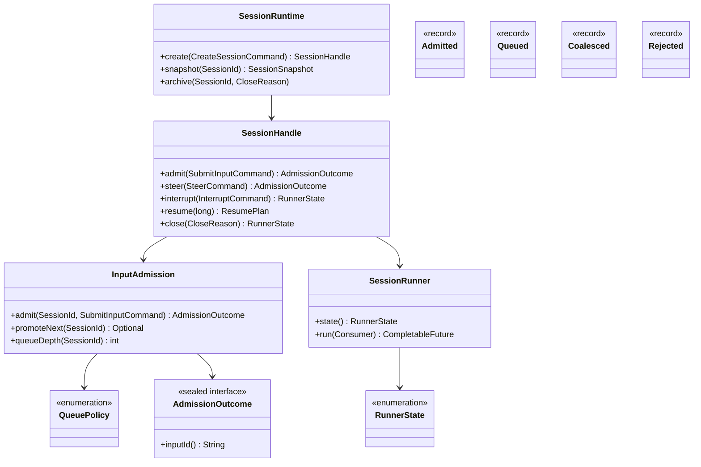
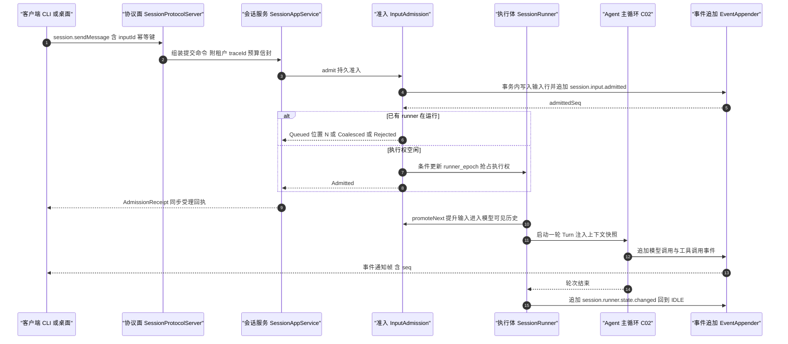
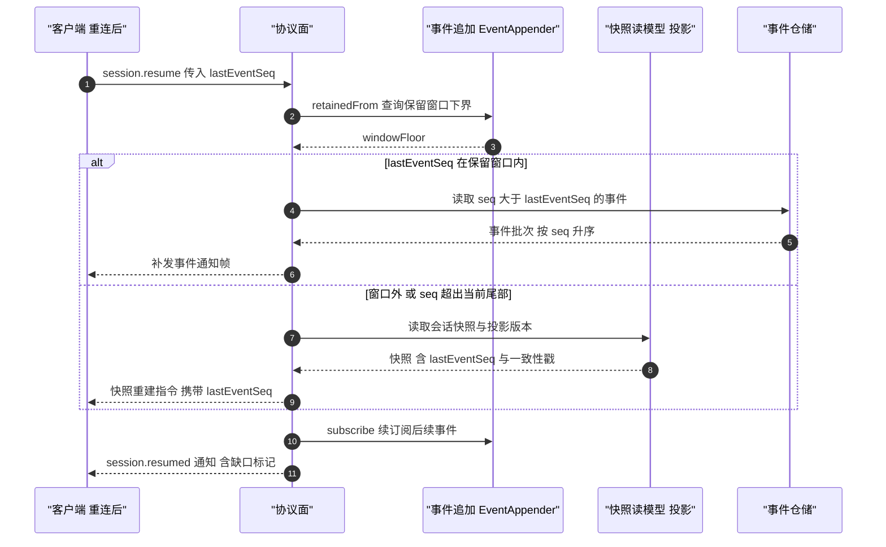
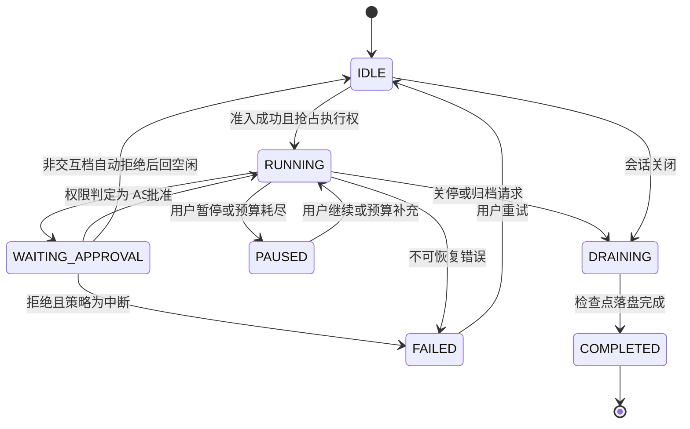
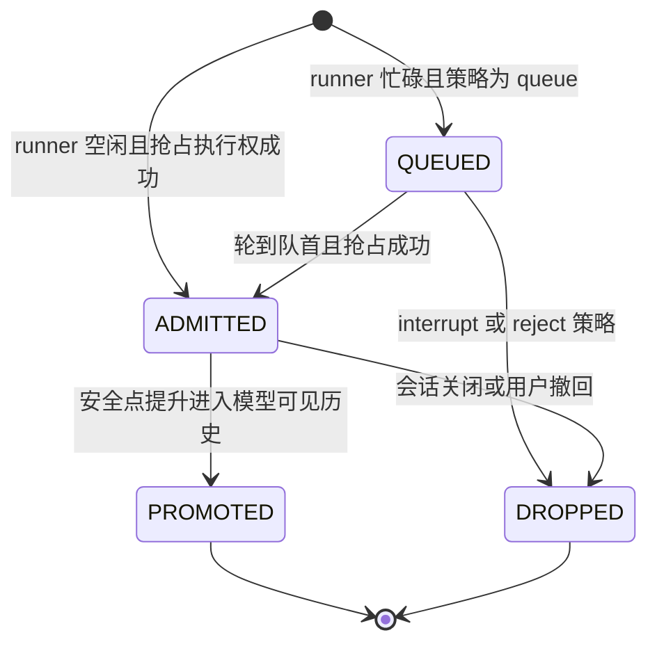

# C01 · SessionManager（会话运行时管理）组件级实现方案

> 组件编号 C01 ｜ 组件别名 SessionManager（会话运行时管理）｜ 归属域 内核与运行时（ARC）
> 上游系统方案：`impl/01-kernel-runtime-impl.md` §1（范围）、§3.3/§3.4（SessionScope 与 durable 准入选型）、§4/§5（架构与内核契约）、§6.2/§6.3/§6.4（核心时序）、§7.1（状态机）、§8（表与事件）、§9（协议面）、§10（并发/性能/降级）
> 上游契约：卷 01 `01-harness-architecture.md`（D-ARC-1…11）、`DECISIONS.md`（H-002/H-003/H-005/H-006/H-019）、`appendix-d-component-inventory.md`（P-01/P-04/P-05）
> 纪律：本组件方案不推翻系统级方案；凡与 `impl/01` 或台账口径冲突之处，一律在文末「修订建议」登记，不回改上游文件。

---

## ① 组件定位与边界

### 1.1 本组件解决什么

1. **会话注册表**：创建、查找、快照、列表、归档（`SessionRuntime`），是全部端形态观察会话状态的唯一入口。
2. **durable 准入与同步受理回执**：`sendMessage` 先在事务内落库并分配 `admittedSeq`，再同步返回 `AdmissionOutcome`，提交方无需等回合结束即可判定「是否受理」（REQ-ARC-12）。
3. **会话级单飞与队列策略**：以 `oc_session.runner_epoch` 条件更新抢占执行权，四策略（`queue` / `interrupt` / `reject` / `coalesce`）在统一有界队列上实现（REQ-ARC-5、I-ARC-4）。
4. **输入两阶段语义**：先 `ADMITTED`（落库可恢复），再 `PROMOTED`（进入模型可见历史）；未提升输入在任何上下文快照中不可见（REQ-ARC-13）。
5. **会话执行体状态机**：IDLE / RUNNING / WAITING_APPROVAL / PAUSED / DRAINING / FAILED / COMPLETED 契约化迁移，非法迁移以 `HarnessException(ErrorCode.CONFLICT, …)` 拒绝（REQ-ARC-4）。
6. **取消与预算作用域**：每会话一个 `SessionScope`，子任务经 `fork` 注册，取消自顶向下传播，归零后才释放执行权（I-ARC-3、D-ARC-4）。
7. **断线续传**：`resume(fromSeq)` 窗口内补发、窗口外快照重建，`lastEventSeq` 单调不回退（REQ-ARC-7）。
8. **恢复会话侧编排与运行诊断**：孤儿标记、非幂等副作用确认投影（REQ-ARC-8/15）；队列水位与 epoch 进入 `oc doctor` 与诊断端点（REQ-ARC-11）。

### 1.2 本组件不解决什么

- **不解决**一次 Turn 内的阶段推进与主循环语义（C02 AgentLoop / `impl/12`）：本组件只管「把输入交到 runner、把 runner 状态管住」。
- **不解决**上下文组装与压缩（卷 03）、工具执行管线（卷 05）、权限决策链（卷 06）：提升只产生「用户消息进入历史」语义。
- **不实现**存储与投影（卷 19 经端口注入，内核不做 SQL）；**不定义**事件 Schema（卷 16）；**不承担**多租户治理策略（卷 24，只做租户贯穿与缺失 Fail-Fast）。

### 1.3 上下游依赖

| 方向 | 对象 | 接口 / 契约 | 说明 |
| --- | --- | --- | --- |
| 上游 | 事件与持久化（卷 16/19） | `EventAppender`/`EventStorePort`、`StoragePort`/`RuntimeStorePort`/`TransactionPort` | 会话事件序 = 分区序且 `(sessionId, seq)` 唯一；输入表、`runner_epoch`、租约 |
| 上游 | 装配（`host-bootstrap`） | `KernelBootstrap.boot` / `AssemblyPlan` | 端口构造注入，无静态可变状态 |
| 下游 | Agent 运行时（C02 / 卷 12） | 提升后的输入、`runner_epoch` 单飞保护 | runner 启动 Turn，Turn 内不再抢占执行权 |
| 下游 | 协议面（`host-protocol`） | `session.create/attach/resume/sendMessage/steer/interrupt/pause/close` | 见 `impl/01` §9.1 帧契约 |
| 下游 | 端形态（CLI / 桌面 / IDE）与运维（卷 32） | `AdmissionReceipt`、事件通知帧、队列水位 | 受理回执是 UI 第一等状态 |

### 1.4 模块落点与命名

| 层带 | 模块（卷 27 §4.1 权威名） | 关键类 | Spring |
| --- | --- | --- | --- |
| 契约 | `harness-contract` | `AdmissionOutcome`（sealed）、`RunnerState`、`QueuePolicy`、`SessionSnapshot` | 禁止 |
| 内核 | `harness-kernel/kernel-agent`（`session` 子包） | `SessionRuntime`、`SessionHandle`、`InputAdmission`、`SessionRunner`、`SessionScope` | 禁止 |
| 平台 / 外壳 | `harness-platform/platform-persistence`、`harness-host/host-{app,protocol,bootstrap}` | 端口适配器（`@Transactional(rollbackFor = Exception.class)`）、`SessionAppService`、`SessionProtocolServer`、`RecoveryCoordinator` | 允许 |

---

## ② 功能需求清单（REQ-C-SM-1…12）

| ID | 需求描述 | 来源 | 优先级 | 验收要点 |
| --- | --- | --- | --- | --- |
| REQ-C-SM-1 | 会话注册表：创建、查找、快照、列表、归档；纯查询不触写路径 | `impl/01` §5.1、卷 01 D-ARC-1 | P0 | 查询无事务与写事件；归档后 `attach` 返回 `CONFLICT` |
| REQ-C-SM-2 | durable 准入 + 同步受理回执；拒绝必附原因与建议 | `impl/01` §6.2、REQ-ARC-12；`03-codex` `[E1]` `core/src/session/handlers.rs:471-494`；`L-051` | P0 | 回执同步返回；Rejected 含 `reasonCode` 与 `suggestion` |
| REQ-C-SM-3 | 单飞执行权：`runner_epoch` 条件更新且行数必须为 1 | `impl/01` §8.1、I-ARC-4；`L-051` `[E1]` | P0 | 500 并发提交仅 1 个 RUNNING；`updated != 1` 转 Queued 非错误 |
| REQ-C-SM-4 | 队列策略四态 + 有界背压 | `impl/01` §3.4、REQ-ARC-5 | P0 | 四策略逐一断言；满返回 `RATE_LIMITED` 含 `retryAfterMs`，不丢输入 |
| REQ-C-SM-5 | 输入两阶段：`ADMITTED` 后提升为 `PROMOTED`，未提升不可见 | `impl/01` §10.9-2、REQ-ARC-13；`02-opencode` `[E1]` `specs/v2/session.md:35-37` | P0 | 上下文快照对拍不含未提升输入；崩溃重启队列不丢 |
| REQ-C-SM-6 | 输入幂等：同 `inputId` 重复投递只准入一次 | `impl/01` §6.2、§11.1 | P0 | 100 次重复投递仅 1 行记录与 1 条 `session.input.admitted` |
| REQ-C-SM-7 | 状态机契约化：非法迁移文案含当前态与期望态 | `impl/01` §7.1、REQ-ARC-4 | P0 | 迁移表全覆盖；外部改库后接入被拒并留痕 |
| REQ-C-SM-8 | `SessionScope` 取消传播与归零 | `impl/01` §3.3、I-ARC-3；`L-051` `[E1]` | P0 | 取消后 1s 内活动任务归零；无 `CancellationException` 泄漏 |
| REQ-C-SM-9 | `resume(fromSeq)`：窗口内补发无缺口，窗口外快照重建 | `impl/01` §6.3、REQ-ARC-7 | P0 | 位点超前返回 `CONFLICT` 并附服务端尾部 seq |
| REQ-C-SM-10 | 崩溃恢复会话侧：孤儿标记、幂等重放、非幂等确认 | `impl/01` §6.4、REQ-ARC-8/15；`04-deepseek` `[E1]` | P0 | `kill -9` 后不重复副作用；需确认项生成待办事件 |
| REQ-C-SM-11 | 非交互档审批自动转拒绝并留痕 | `impl/01` §8.3、REQ-ARC-16；`07-qoder` `[E2]` | P1 | 生成 `approval.denied.headless` 并提示可切换交互档 |
| REQ-C-SM-12 | 会话保留与归档三态（默认保留 N / 全留 / 保留并归档更早） | `L-083` `[E1]`；卷 15 D-SCH-2、卷 19 D-PERS-9 | P2 | 三态可配置；归档不破坏 `resume` 保留窗口语义 |

---

## ③ 关键设计决策（I-C-SM-1…4）

### 3.1 I-C-SM-1 执行权抢占的存储落点

| 分支 | 描述 | F/U/S/M | 加权 | 结论 |
| --- | --- | --- | --- | --- |
| B1 | 进程内内存锁 + 内存队列 | 5/9/4/9 | 61.5 | 淘汰（崩溃丢队列） |
| B2 | PG 条件更新抢占 `runner_epoch`，Redis 仅作加速与租约 | 9/8/9/8 | 86.0 | **选定** |
| B3 | Redis 租约为主承载正确性 | 8/8/6/6 | 71.0 | 淘汰（Redis 失效即丢正确性） |

**选定 B2（与 I-ARC-4 同源）**：正确性锚点是条件更新的行数校验；`oc:arc:session:{sessionId}:lease` 只在 server 档做接管判定，丢失仅重新竞争。**回退**：准入写延迟 P95 > 15ms → server 档改 Redis Stream 先行 + 异步落库（Redis 仍不承载正确性）。

### 3.2 I-C-SM-2 输入表口径（跨域唯一性）

| 分支 | 描述 | F/U/S/M | 加权 | 结论 |
| --- | --- | --- | --- | --- |
| B1 | 双表并存：`oc_session_input` + `oc_agent_input` | 7/6/5/7 | 62.5 | 淘汰（状态易漂移、双写） |
| B2 | 单表 + `delivery`/`source` 列并入，另一表名为同表别名 | 9/8/9/8 | 86.0 | **选定** |
| B3 | 仅事件不落表，准入状态由事件重建 | 7/6/8/7 | 70.5 | 淘汰（热路径需同步回执与唯一索引） |

**选定 B2**：统一 `input_id` / `admitted_seq` / `delivery` / `source` / `state`（`QUEUED`/`ADMITTED`/`PROMOTED`/`DROPPED`）并集，迁移参照 `I-AG-9` 的「列名别名」口径。**回退**：出现第三种语义（阶段 I/O 级输入）→ 下游表降为只读投影，禁止第三张输入表。

### 3.3 I-C-SM-3 队列策略的实现形态

| 分支 | 描述 | F/U/S/M | 加权 | 结论 |
| --- | --- | --- | --- | --- |
| B1 | 每策略一个独立实现类与独立队列 | 8/6/6/7 | 68.5 | 淘汰（恢复路径 ×4） |
| B2 | 统一有界队列 + `InputAdmissionPolicySPI` 策略工厂 | 9/8/9/8 | 86.0 | **选定** |
| B3 | 只实现 `queue` 与 `reject` | 7/5/9/8 | 73.5 | 淘汰（`interrupt` 是人工介入硬需求） |

**选定 B2**：策略只决定准入动作与丢弃对象，队列状态机与恢复路径唯一；`coalesce` 仅在同幂等键一致时合并。**回退**：状态机路径组合 > 16 → 收敛为配置开关矩阵并默认关闭 `coalesce`。

### 3.4 I-C-SM-4 取消与预算的承载方式

| 分支 | 描述 | F/U/S/M | 加权 | 结论 |
| --- | --- | --- | --- | --- |
| B1 | `StructuredTaskScope`（Java 21 preview） | 9/7/6/5 | 68.0 | 备选（JDK 转正后适配器切换） |
| B2 | 自研 `SessionScope` + 平台线程 runner + 虚拟线程子任务 | 9/8/9/8 | 86.0 | **选定** |
| B3 | 裸 `ExecutorService` + 手动 `Future` 集合 | 4/5/4/9 | 52.0 | 淘汰（取消泄漏） |

**选定 B2（与 I-ARC-3 一致）**：runner 用平台线程保证长生命周期与转储可见性，Agent 循环与模型流读取用虚拟线程，全部经 `fork` 纳管。**回退**：8 小时压测出现取消泄漏 → 退化 B1 并接受 `--enable-preview`（仅企业档开关）。

---

## ④ 类图



**说明**：`RunnerState` 取值 `IDLE` / `RUNNING` / `WAITING_APPROVAL` / `PAUSED` / `DRAINING` / `FAILED` / `COMPLETED`（§6.1）；`Admitted` / `Queued` / `Coalesced` / `Rejected` 为 `AdmissionOutcome` 的 record 实现，字段与 `impl/01` §5.1 一致（`admittedSeq` / `runnerEpoch`、`position` / `enqueuedAtMillis`、`mergedIntoInputId`、`code` / `reason` / `suggestion`）。`InputAdmission` 另持有 `InputState`（`QUEUED`/`ADMITTED`/`PROMOTED`/`DROPPED`）与 `QueuePolicy`（`QUEUE`/`INTERRUPT`/`REJECT`/`COALESCE`）；`SessionRunner` 经 `SessionScope.fork` 纳管子任务（`SessionScope` 实现 `CancellationScope` 端口，见 I-C-SM-4）。组件对外只暴露 `SessionRuntime` / `SessionHandle` 两族类型，其余为内核内部协作类（ArchUnit 禁止跨包直接引用，`impl/01` §3.1）；`AdmissionOutcome` 用 sealed 层次而非状态码字段——「未受理」无法被误读为「已受理」。

---

## ⑤ 核心流程时序图

### 5.1 流程 A：sendMessage 的准入、抢占与单飞执行



- **前置条件**：会话存在且未归档；客户端完成握手与能力协商；租户上下文完整；预算可划拨。
- **主路径**：同步受理回执 → 提升 → Agent 循环 → 事件流 → 回 `IDLE`；队列非空自动续跑（消费新输入而非重跑旧输入）。
- **异常与补偿**：队列满 → 按策略 `reject` 且附建议；`interrupt` → 排队输入标 `DROPPED` 并生成 `session.input.dropped`、当前 Turn 在安全点收敛后取消传播至 `SessionScope`（1s 未归零告警并强制释放）；执行异常 → runner 进 `FAILED`，可重试且不重复副作用。
- **幂等与并发点**：`inputId` 唯一索引保证重复投递只准入一次；`runner_epoch` 条件更新 `updated != 1` 时按并发抢占处理并转 Queued；事件追加按 `(sessionId, seq)` 唯一约束串行化。

### 5.2 流程 B：resume(fromSeq) 断线续传与快照对齐



- **前置条件**：客户端持有 `lastEventSeq`；会话未归档；协议版本兼容。
- **主路径**：判定窗口 → 窗口内补发 / 窗口外快照重建 → 续订阅。
- **异常与补偿**：位点超前服务端尾部 → 返回 `CONFLICT` 并附尾部 seq，客户端丢弃本地未确认队列后重放；保留窗口过小导致频繁重建 → 告警并提升阈值。
- **幂等与并发点**：补发只读可重入；快照读取不阻塞写入（投影最终一致 ≤ 5s，NFR-R-4）；重复 resume 以最后一次为准（无状态）。

---

## ⑥ 状态机

### 6.1 会话执行体状态机



**迁移表（实现为静态不可变 Map，非法迁移抛 `HarnessException(ErrorCode.CONFLICT, …)`）**：

| 当前态 | 允许目标 | 触发 | 备注 |
| --- | --- | --- | --- |
| IDLE | RUNNING / DRAINING | 准入成功 / 关闭 | IDLE 是唯一可被抢占执行权的状态 |
| RUNNING | WAITING_APPROVAL / PAUSED / DRAINING / FAILED | 审批 ASK / 暂停或预算耗尽 / 关停 / 不可恢复错误 | 预算耗尽只暂停不失败 |
| WAITING_APPROVAL | RUNNING / FAILED / IDLE | 批准 / 拒绝且中断 / 非交互自动拒绝 | 非交互拒绝属「可恢复的未执行」，回 IDLE |
| PAUSED | RUNNING / DRAINING | 继续 / 关停 | 暂停期接受准入入队，但拒绝提升 |
| DRAINING | COMPLETED | 检查点完成 | 排空阶段禁止新工具调用 |
| FAILED / COMPLETED | IDLE / 终态 | 用户重试 / — | 重试前必须重新加载检查点 |

### 6.2 会话输入状态机



**不变量**：① 只有 `PROMOTED` 输入出现在上下文快照（REQ-C-SM-5 对拍断言）；② `DROPPED` 行保留 7 天供排障；③ 同一 `inputId` 任一时刻只处于一个状态（唯一索引 + 迁移 CAS）；④ `coalesce` 合并仅限幂等键一致的输入。

---

## ⑦ 接口与依赖矩阵

### 7.1 对外接口（内核契约，零框架依赖）

```java
package com.hk.opencoding.kernel.session;

/**
 * 会话注册表：会话的创建、查找、快照、列表与归档。
 * 全部会话操作的唯一入口；查询方法不产生写事件、不持有执行权。
 */
public interface SessionRuntime {

    /**
     * 创建会话。
     *
     * @param command 创建命令（工作区、模型、权限模式与幂等键，均必填）
     * @return 新建会话句柄；同一幂等键重复调用返回既有会话
     * @throws HarnessException 工作区不存在抛 NOT_FOUND；参数非法抛 INVALID_ARGUMENT
     */
    SessionHandle create(CreateSessionCommand command);
}

/** 单个会话的操作面：准入、插话、中断、暂停、续传、关闭与事件读取。 */
public interface SessionHandle {

    /**
     * 提交一条输入并同步返回受理结果。
     *
     * @param command 输入命令（含 inputId 幂等键与策略覆盖，必填）
     * @return 受理结果；Rejected 携带错误码、原因与建议，调用方无需等回合结束
     * @throws HarnessException 会话不存在抛 NOT_FOUND；已终态抛 CONFLICT
     */
    AdmissionOutcome admit(SubmitInputCommand command);
}
```

`SessionHandle` 其余方法（`steer` / `interrupt` / `pause` / `resumeRun` / `resume` / `close` / `events`）签名与语义见 `impl/01` §5.1 与 §9.1 协议表；`resume(long fromSeq)` 的判定算法见 §8.3。

**层次纪律**：协议编解码与错误响应映射由外壳承担；内核只抛 `HarnessException(ErrorCode, 中文文案)`，不得让异常穿透协议面（`impl/01` §5.1、`impl/README.md` §5.5）。

### 7.2 依赖与被依赖矩阵

| 关系 | 组件 / 端口 | 契约要点 | 失效影响 |
| --- | --- | --- | --- |
| 依赖 | `EventAppender` + `EventStorePort` | 追加 ≤ 10ms P95；`(sessionId, seq)` 唯一 | 追加失败即拒绝准入（`DEPENDENCY_UNAVAILABLE`） |
| 依赖 | `StoragePort` | 输入表与 `runner_epoch` 领域操作，不含 SQL | 不可写 → 只读模式，运行中会话检查点后暂停 |
| 依赖 | `RuntimeStorePort` | 租约、心跳、去重索引、队列深度 | 降级进程内实现，正确性由 DB 兜底 |
| 依赖 | `TransactionPort` / `ClockPort` / `IdPort` | 事务边界（外壳 `@Transactional(rollbackFor = Exception.class)`）；可测性端口 | 缺事务即准入与事件不一致，禁止装配 |
| 被依赖 | AgentLoop（C02） | 提升后输入与单飞保护 | Turn 无法启动或并发交错 |
| 被依赖 | 协议面 / 端形态 / `RecoveryCoordinator` | 受理回执与事件帧；会话占用与孤儿标记信号 | UI 无法判定受理状态；恢复与在线执行互相干扰 |

### 7.3 配置项（`open-coding.kernel.session.*`）

| 配置键 | 含义 | 默认 | 必填 | 环境变量 |
| --- | --- | --- | --- | --- |
| `queue-policy` | 默认队列策略（枚举 code 非法即启动 Fail-Fast） | `queue` | 否 | `OC_SESSION_QUEUE_POLICY` |
| `queue-max` | 单会话队列上限 | `32` | 否 | `OC_SESSION_QUEUE_MAX` |
| `max-active` / `max-active-server` | 单实例活跃会话上限（背压） | `50` / `500` | 否 | `OC_SESSION_MAX_ACTIVE`、`OC_SESSION_MAX_ACTIVE_SERVER` |
| `headless.approval-policy` | 非交互档审批态（`deny` / `fail`） | `deny` | 否 | `OC_HEADLESS_APPROVAL_POLICY` |
| `shutdown.timeout-seconds` | 优雅关停上限 | `30` | 否 | `OC_SHUTDOWN_TIMEOUT_SECONDS` |

**纪律**：全部键以 `${ENV_VAR:default}` 声明并同步 `.env.example`；配置类为纯数据类不加 `@Component`，字段 JavaDoc 标明用途、默认值与影响范围。

---

## ⑧ 关键算法

### 8.1 算法 A：准入与执行权抢占

步骤（单事务内，经 `TransactionPort.required`）：① 以 `(session_id, input_id)` 唯一索引尝试插入，冲突即读回既有行并返回其状态对应结果（幂等分支）；② 追加 `session.input.admitted`，取得 `admittedSeq`；③ runner 非 `IDLE` 且非 `PAUSED` → 按策略返回 `Queued` / `Coalesced` / `Rejected`；④ 读 `runner_epoch` 并条件更新为 `expectedEpoch + 1`（限 `state IN (IDLE, PAUSED)`）；⑤ 行数为 1 → `Admitted` 并唤醒 runner，否则转 `Queued`。

```java
// 执行权抢占：仅当会话处于 IDLE 或 PAUSED 且 epoch 未被他人推进时才允许成为 runner
int updated = storage.updateRunnerEpoch(new RunnerEpochCas(
        sessionId, expectedEpoch, expectedEpoch + 1,
        Set.of(RunnerState.IDLE, RunnerState.PAUSED)));
log.info("会话执行权抢占，sessionId={}, 期望 epoch={}, 更新行数={}", sessionId, expectedEpoch, updated);
if (updated != 1) {
    // 并发抢占语义：转排队分支，由调用方返回 Queued，不视为失败
    log.warn("会话执行权已被并发抢占，sessionId={}, 期望 epoch={}", sessionId, expectedEpoch);
    throw new HarnessException(ErrorCode.CONFLICT, "会话正在执行，已排队，位置=" + queueDepth);
}
```

**复杂度**：常数次索引查找 + 一次 CAS，O(log n)；**边界条件**：唯一键冲突必须走幂等分支；`expectedEpoch` 必须同事务读取，禁止跨事务缓存；CAS 失败不重试抢占。

### 8.2 算法 B：安全点提升（steer 全提、queue 单提）

① 取全部 `state = ADMITTED` 且 `delivery = STEER` 的输入，按 `admitted_seq` 升序**全部**提升为 `user_message` Item 并重置步数（对齐 `impl/12` §10.4）；② 若当前 Turn 无需继续且队列非空，取**一个**最早的 `delivery = QUEUE` 输入提升为新 Turn 首输入；③ 其余保持原状态等下一个安全点。**复杂度** O(k)（k 为提升条数）；**边界条件**：重复提升同一输入不产生第二条 Item；Turn 已收尾时 STEER 降级为 QUEUE 并写事件；绝不在流式过程中或工具执行中注入。

### 8.3 算法 C：resume 窗口判定

```
windowFloor = eventStore.retainedFrom(sessionId); tail = eventStore.lastSeq(sessionId)   // 保留窗口下界与当前尾部
if fromSeq > tail:              -> CONFLICT 携带 tail
else if fromSeq >= windowFloor: -> 补发区间 (fromSeq, tail]
else:                           -> 快照重建，lastEventSeq = snapshot.lastEventSeq
```

**复杂度** O(log n) 位点查询 + O(gap) 补发；**边界条件**：`fromSeq = 0` 表示全量快照；快照读取不阻塞写入；重建率上升时告警并提升保留阈值。

---

## ⑨ 错误处理与降级

内核只产出 `HarnessException(ErrorCode, 中文文案)`；下表为本组件唯一权威映射，外壳按 `ErrorCode` 转统一错误响应。

| 错误场景 | ErrorCode | retryable | 处理动作 | 用户可见文案 |
| --- | --- | --- | --- | --- |
| 会话不存在或已归档 | `NOT_FOUND` | 否 | 拒绝并提示重建会话 | 「会话不存在或已归档：`<sessionId>`」 |
| 执行权被并发抢占 | `CONFLICT` | 是（非错误语义） | 转排队并返回位置 | 「会话正在执行，已排队，位置=`<N>`」 |
| 队列满（策略 queue） | `RATE_LIMITED` | 是 | 拒绝受理附 `retryAfterMs`，不丢输入 | 「会话队列已满，上限 `<queue-max>`，请稍后重试」 |
| 状态迁移非法 | `CONFLICT` | 否 | 拒绝写入并留痕 | 「会话状态已变更：当前 `<cur>`，期望 `<expected>`，请刷新后重试」 |
| `resume` 位点漂移 | `CONFLICT` | 否 | 下发快照重建指令 | 「客户端位点超前，已下发快照重建」 |
| 租户上下文缺失 / 单帧超限 | `INVALID_ARGUMENT` | 否 | 拒绝并审计留痕；提示分片或改用引用传递 | 「请求缺少租户上下文，已拒绝」/「单帧超限，请分片」 |
| 存储不可写 | `DEPENDENCY_UNAVAILABLE` | 是 | 只读模式，运行中会话检查点后暂停 | 「存储暂不可用，新输入已被拒绝，运行中会话将在检查点后暂停」 |
| 事件日志尾部撕裂 | `INTERNAL_ERROR` | 否 | 截断至最后完整帧并记事件 | 「检测到事件日志尾部损坏，已截断至最后完整帧」 |
| 内核目录被占用 | `CONFLICT` | 是 | 拒绝启动双实例 | 「内核目录 `<home>` 已被实例 `<pid>` 占用」 |

**降级矩阵（本组件相关行）**：Redis 不可用 → 租约与计数切进程内实现，server 档禁用多实例接管（`system.capability.degraded`）；PG 不可用 → 只读模式 + 排空；对象存储不可用 → 不影响准入与事件（仅影响引用型载荷解析）。

---

## ⑩ 性能与并发

| 指标 | 预算 | 说明 |
| --- | --- | --- |
| 准入含事务与事件 / 执行权抢占 | ≤ 15ms / ≤ 5ms P95 | 准入超限即触发回退（切 Redis Stream 先行） |
| 事件追加 | ≤ 10ms P95；批量 ≥ 50k EPS | 批量批大小 `event.append-batch-size` |
| sidecar 启动到就绪 / 恢复场景 / 会话恢复 / 活跃会话 | ≤ 1.2s / ≤ 3s / ≤ 2s（10k 事件）/ ≥ 50（server ≥ 500）P95 | 含装配与恢复；检查点加速；`max-active` 背压上限 |

**并发模型**：每会话一个 runner **平台线程**（长生命周期、转储可读）；Agent 循环与模型流读取为每会话一个虚拟线程（`SessionScope.fork`）；事件追加器单虚拟线程 + 有界队列（满载阻塞生产者而非丢弃）；工具执行虚拟线程 + 信号量限流；恢复扫描 1 虚拟线程，`readyz` 在恢复完成前 503。

**锁 / 背压 / 取消传播**：① 正确性锁 = `runner_epoch` 条件更新（行数必须为 1）；② `oc:arc:session:{sessionId}:lease` 与 `oc:agent:run:lock:{thread}` 为加速租约，丢失只重新竞争；③ 背压 = 队列上限 + `max-active`，满即拒绝且不丢已受理输入；④ 取消自顶向下传播，`awaitQuiescence` 1s 未归零即告警并强制释放。

---

## ⑪ 测试要点

| 层级 | 用例 | 断言要点 |
| --- | --- | --- |
| 单元 | 状态机迁移表全覆盖（合法 + 全部非法）；队列策略四态；同 `inputId` 重复投递 100 次 | 非法迁移抛 `HarnessException(ErrorCode.CONFLICT, …)` 含两侧状态；四策略回执与丢弃事件逐条断言；仅 1 行输入记录与 1 条 `session.input.admitted` |
| 单元 | `SessionScope` 取消传播与泄漏检测 | 取消后 1s 内活动任务归零；无未捕获 `CancellationException` |
| 集成 | 三档形态同用例集（embedded / sidecar / remote） | 仅装配差异，契约测试全绿 |
| 集成 | 准入并发压测（500 并发提交同一会话） | 恰 1 个 RUNNING，其余 Queued，无重复执行 |
| 集成 | 断线续传（窗口内 / 窗口外 / 位点超前） | 补发无缺口；快照重建后 `lastEventSeq` 单调 |
| 故障注入 | `kill -9`（RUNNING / WAITING_APPROVAL / DRAINING 三态）；Redis 不可用 / PG 只读 | 幂等副作用不重复；非幂等标记待确认；孤儿锁被清除；降级矩阵行为与事件断言 |
| 性能 | §10 全部指标 | 达目标值；CI 门禁失败即阻断合并 |

```bash
# 内核单测（零 Spring 上下文）
mvn -pl harness-kernel/kernel-agent -am test
# main 链路（装配 + 协议面）
mvn -pl harness-host/host-bootstrap,harness-host/host-protocol,harness-host/host-server -am test
# 三档契约测试（需 PG 与 Redis；local-lite 走嵌入式仓储）
mvn -pl harness-host -am test -Dgroups=contract -Dkernel.profile.embedded=true
# 故障注入与恢复
mvn -pl harness-host -am verify -Dgroups=fault-injection
```

---

## 修订建议（本组件登记，待编排方分配 `X-n`）

1. **R-SM-1 输入表统一口径**：`oc_session_input`（`impl/01` §8.1）与 `oc_agent_input`（`impl/12` §8.1）语义重叠，建议明确为**同一物理表**（投递语义列并入），迁移参照 `I-AG-9`「列名别名」处理；涉及 `impl/01` §8.1、`impl/12` §8.1、`impl/19` §8 B1 批次清单。
2. **R-SM-2 会话执行权 Redis Key 命名收敛**：`oc:arc:session:{sessionId}:lease`（`impl/01` §8.2）与 `oc:agent:run:lock:{thread}`（`impl/12` §8.2）描述同一「会话级单飞加速」语义，建议在 `RedisKeys` 工厂口径化为单一命名族并注明「不承载正确性」。
3. **R-SM-3 会话保留三态落点**：`L-083` 的「默认保留 N / 全留 / 归档更早」目前只落卷 15/19，建议在 `oc_session` 语义中补归属说明（由本组件在归档判定时消费），避免 Goal 与普通会话两处各写一套保留逻辑。
