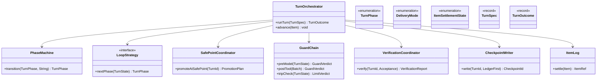
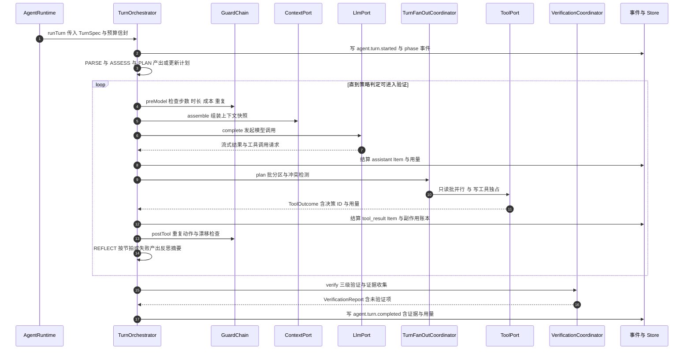
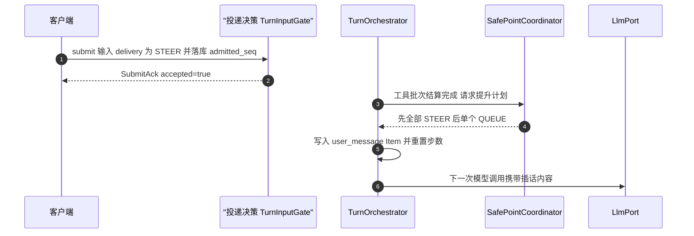
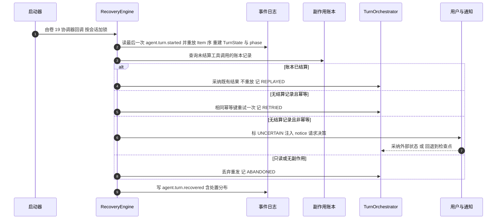
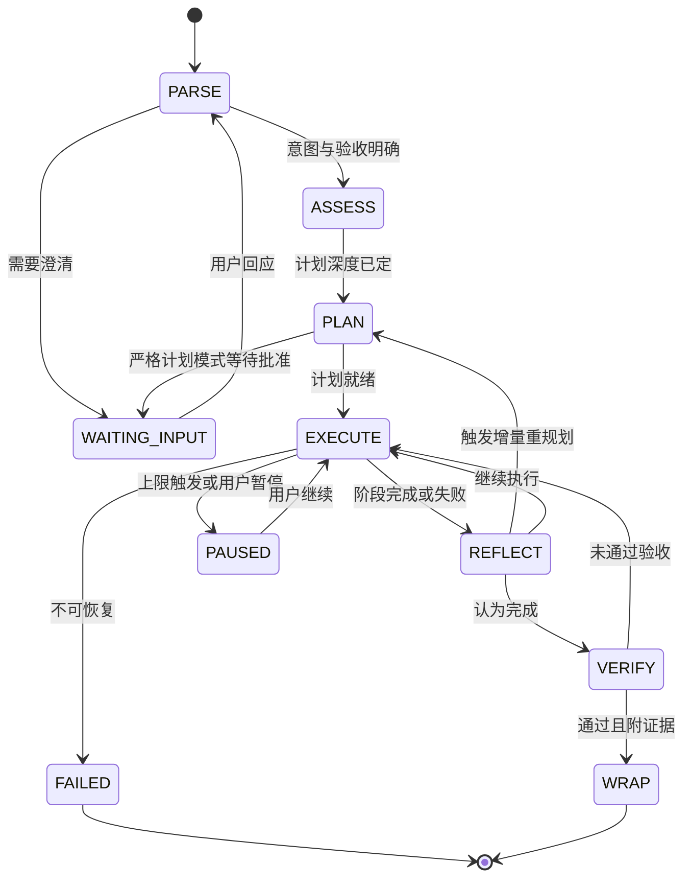
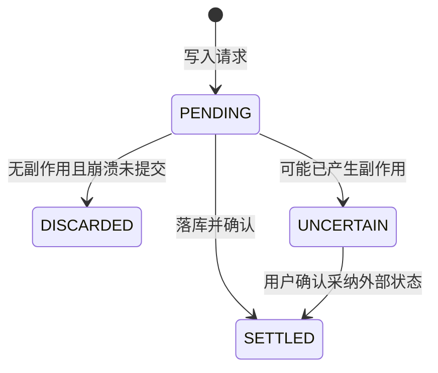

# C02 · AgentLoop（Agent 主循环）组件级实现方案

> 组件编号 C02 ｜ 组件别名 AgentLoop（Agent 主循环）｜ 归属域 Agent 运行时（AG）｜ 纪律：本组件方案不推翻系统级方案，凡与 `impl/12` 或台账口径冲突之处一律在文末「修订建议」登记，不回改上游文件。
> 上游系统方案：`impl/12-agent-runtime-impl.md` §1（范围）、§3（D-AGI-1…8 选型与 I-AG-1…9）、§4/§5（架构与契约）、§6.1/§6.2/§6.4（核心时序）、§7（状态机）、§8（表与事件）、§9（接口与 SPI）、§10（并发/性能/恢复协议/降级）；上游契约：卷 12 `12-agent-core.md`（D-AG-1…14）、`DECISIONS.md`（H-003/H-006/H-011/H-012）、`appendix-d-component-inventory.md`（K-29/K-30/K-31/P-30）

---

## ① 组件定位与边界

### 1.1 本组件解决什么

1. **三段原语**：Thread / Turn / Item 生命周期原语落地，UI 与事件日志可按三层渲染与统计（REQ-AG-01）。
2. **阶段化主循环**：解析 → 评估 → 规划 → 执行 → 反思 → 验证 → 收尾七阶段状态机，阶段迁移带理由字段（REQ-AG-03）。
3. **三策略可插拔**：轻计划 / 严格计划 / 纯 ReAct 共享同一状态机、同一恢复语义与同一事件契约（REQ-AG-02、D-AGI-1）。
4. **事件溯源式回合持久化**：模型可见内容必已落库，历史由 Item 投影得到，禁止运行时拼接（REQ-AG-04，「模型可见 ⟺ 已记录」）。
5. **输入投递与安全点提升 + 工具扇出协调**：STEER / QUEUE / INTERRUPT 三语义，提升顺序「先全部 steer、后单个 queue」，提升即重置步数（REQ-AG-05）；扇出为只读批并行、写工具独占、同资源写冲突前置拦截（REQ-AG-07、D-AGI-4）。
6. **循环护栏**：重复动作计数（3/5/8 阈值，只提醒不阻塞）、步数/时长/成本三重上限（越界暂停 + 摘要 + 请求决策）、目标漂移检测（REQ-AG-10）。
7. **三级验证与证据强制**：静态 / 可执行 / 语义验证，`done` 无证据即非法，未验证项显式标注（REQ-AG-11、INV-10）。
8. **检查点与恢复 + 轨迹与预算**：账本先行（INV-6）、Item 粒度续跑、非幂等副作用 `UNCERTAIN` 挂起（REQ-AG-09、I-AG-6）；轨迹投影可离线重放（REQ-AG-13）；双信封预算熔断（I-AG-7）。

### 1.2 本组件不解决什么

- **不解决**会话级单飞、队列策略与准入落库（C01 SessionManager）：本组件消费「已受理且已提升」的输入。
- **不解决**单次模型调用（卷 02 `LlmPort`）、上下文九区段组装与压缩（卷 03 `ContextPort`）、工具执行管线与权限判定（卷 05/06 `ToolPort`/`PermissionPort`）。
- **不解决**SubAgent 隔离 Provider 与团队级编排（`SubAgentBroker` 归 `impl/12` §1.5 `subagent/` 子包，本文只定义其与主循环的交互边界）；**不实现**调度（卷 15）、工作对象模型（卷 14）与存储（卷 19，全部经端口注入）。

### 1.3 上下游依赖

| 方向 | 对象 | 接口 / 契约 | 说明 |
| --- | --- | --- | --- |
| 上游 | 会话运行时（C01 / 卷 01） | 提升后的输入、`runner_epoch` 单飞保护、`SessionScope` | Turn 串行由会话层保证 |
| 上游 | 事件总线（卷 16） | `EventPort.append` / `EventEnvelope` | 分区序 = 会话内 `seq`；Item 与阶段事件 |
| 上游 | 持久化（卷 19） | `ThreadStore` / `TurnStore` / `ItemStore` / `CheckpointStore` | `oc_checkpoint` 唯一写入者为本域 |
| 上游 | 模型 / 上下文 / 工具 / 权限（卷 02/03/05/06） | `LlmPort.complete`、`ContextPort.assemble`、`ToolPort.invoke`/`cancel`、`PermissionPort` | 内核只消费端口结果并原样入库 |
| 下游 | 任务（卷 14）/ Teams（卷 13）/ Goal（卷 15）/ 评测（卷 26） | Turn 推进 Task；成员 Agent；自治轮次驱动；轨迹导出 | 跨系统不共享内存状态 |

### 1.4 模块落点与命名

| 层带 | 模块（卷 27 §4.1 权威名） | 关键类 | Spring |
| --- | --- | --- | --- |
| 契约 | `harness-contract`（`contract/agent`） | `TurnPhase` / `DeliveryMode` / `ItemPayload`（sealed）、`LoopStrategySPI` 等 9 个 SPI | 禁止 |
| 内核 | `harness-kernel/kernel-agent` | `runtime/`（`AgentRuntime`、`TurnOrchestrator`、`PhaseMachine`、`SafePointCoordinator`）、`loop/`、`input/`、`tools/`、`guard/`、`verify/`、`checkpoint/`、`trajectory/` | 禁止 |
| 平台 / 外壳 | `harness-platform/platform-persistence`、`harness-host/host-{protocol,app,bootstrap}` | Thread/Turn/Item 投影、`oc_checkpoint`、会话面方法映射、`AgentProperties` 装配 | 允许 |

---

## ② 功能需求清单（REQ-C-AL-1…12）

| ID | 需求描述 | 来源 | 优先级 | 验收要点 |
| --- | --- | --- | --- | --- |
| REQ-C-AL-1 | Thread / Turn / Item 三段原语与事件溯源投影 | `impl/12` §5、REQ-AG-01/04；`L-052` `[E1]` | P0 | 模型请求历史与自身投影逐字节一致（对拍用例） |
| REQ-C-AL-2 | 七阶段状态机，迁移带理由且可中断可恢复 | `impl/12` §7.1、REQ-AG-03；`L-036` `[E1]` | P0 | 每阶段有事件与指标；阶段切换 ≤ 5ms |
| REQ-C-AL-3 | 三策略可插拔且共享状态机与恢复语义 | `impl/12` §3 D-AGI-1、REQ-AG-02 | P0 | 同一故障场景在三策略下恢复行为一致 |
| REQ-C-AL-4 | 阶段 I/O 落库为数据（effects-as-data），阶段可重放 | `L-037` `[E1]`；`impl/12` §3 吸收 B3 | P0 | 阶段重放不重跑副作用；控制点可单测 |
| REQ-C-AL-5 | 三档投递与安全点提升：先全 STEER、后单 QUEUE，提升即重置 step | `impl/12` §10.4、REQ-AG-05；`02-opencode` `[E1]` `promoteSteers`/`promoteNextQueued` | P0 | 插话 ≤ 1 次模型调用内可见；队列输入不打断当前 Turn |
| REQ-C-AL-6 | 单一提交队列入口，受理结果同步回执 | `impl/12` §9.1、REQ-AG-06；`03-codex` `[E1]` `submission_loop` + `oneshot`；`L-051` | P0 | 提交方可区分「已受理」与「未受理」；非法 Op 不出队列 |
| REQ-C-AL-7 | 工具扇出：只读批并行 + 写独占 + 冲突前置拦截 | `impl/12` §3 D-AGI-4、REQ-AG-07；`01-claude-code` `[E1]` 批分区 | P0 | 同文件并发写被前置拦截并给出冲突清单 |
| REQ-C-AL-8 | 循环护栏：重复动作阈值提醒 + 三重上限暂停 + 漂移检测 | `impl/12` §10.7、REQ-AG-10；`04-deepseek` `[E1]` `repeat-tool-reminder` 3/5/8；`L-036` | P0 | 越界后暂停 + 摘要 + 请求决策，不静默终止 |
| REQ-C-AL-9 | 三级验证与证据强制：`done` 无证据即非法 | `impl/12` §10.5、REQ-AG-11；`L-042` `[E1]` | P0 | 无证据完成请求在写入层被拒绝；未验证项显式标注 |
| REQ-C-AL-10 | 检查点账本先行 + Item 粒度恢复 + `UNCERTAIN` 挂起 | `impl/12` §10.3、REQ-AG-09；`L-048`/`L-049` `[E1]` | P0 | `kill` 用例：已结算不重放；非幂等注入 notice 请求决策 |
| REQ-C-AL-11 | 预算双信封：循环层前置扣减 + 网关结算 + 差异回冲 | `impl/12` §3 D-AGI-7、I-AG-7 | P0 | 永不超支；分项之和与总额偏差 ≤ 0.5% |
| REQ-C-AL-12 | 轨迹导出与离线回放；能力缺失 Fail-Fast | `impl/12` §10.12-4、REQ-AG-13/14；`04-deepseek` `[E1]` `UNSUPPORTED_CAPABILITY` | P1 | 导出包重放与线上历史一致；每个可选能力缺失路径有契约测试 |

---

## ③ 关键设计决策（I-C-AL-1…4）

### 3.1 I-C-AL-1 循环表达形态

| 分支 | 描述 | F/U/S/M | 加权 | 结论 |
| --- | --- | --- | --- | --- |
| B1 | `while` + 跨迭代状态字段（Claude Code `State` 式） | 8/7/8/7 | 75.5 | 淘汰（状态散落、恢复语义弱） |
| B2 | 显式阶段状态机 + 可插拔策略（策略只决定下一步走哪个阶段） | 9/9/8/9 | 87.5 | **选定** |
| B3 | 可重入流水线「效果即数据」（Goose `state_machine/ops_*` 式） | 9/7/7/8 | 78.5 | 吸收其「阶段 I/O 即数据」用于重放 |

**选定 B2（与 I-AG-1 一致）**：状态机让「中断 / 恢复 / 暂停」在任一策略下语义一致；同时吸收 B3 的「阶段输入输出落库为数据」，使阶段可重放而无需重跑副作用——Java 侧以 `sealed interface` + `record` 显式定义 state 与 effect 两族（`L-037` 的硬要求，否则退化为命令式 while）。**回退**：某策略无法用统一阶段集表达 → 该策略自定义阶段集，但仍走同一事件契约与恢复协议。

### 3.2 I-C-AL-2 安全点与投递注入位置

| 分支 | 描述 | F/U/S/M | 加权 | 结论 |
| --- | --- | --- | --- | --- |
| B1 | 循环内联检查（每迭代开头轮询队列） | 8/7/9/9 | 82.0 | 淘汰（注入点分散、难断言） |
| B2 | 独立 `SafePointCoordinator`，由循环在三处安全点显式调用 | 9/9/9/8 | 88.5 | **选定** |
| B3 | 独立线程异步唤醒并抢占注入 | 7/6/5/6 | 61.0 | 淘汰（竞态与历史交错） |

**选定 B2**：安全点固定为「模型调用返回并结算后 / 工具批次全部结算后 / 检查点写入确认后」三处；不另起线程，避免与 Turn 内状态竞争。**回退**：插话生效延迟 > 1 次模型调用 → 扩展安全点到「只读批之间」（仍不进入流式过程与写工具执行中）。

### 3.3 I-C-AL-3 阶段事件与 Item 的写入顺序

| 分支 | 描述 | F/U/S/M | 加权 | 结论 |
| --- | --- | --- | --- | --- |
| B1 | 先写 `agent.phase.changed` 再结算 Item | 6/6/6/8 | 64.5 | 淘汰（phase 领先 Item，重放不自洽） |
| B2 | 同一事务先结算 Item + `agent.item.committed`，再写 phase 事件 | 9/8/9/8 | 86.0 | **选定** |
| B3 | 并行写入，由投影最终一致收敛 | 7/6/5/7 | 62.5 | 淘汰（崩溃窗口不可判定） |

**选定 B2**：任何崩溃点重放后「phase 永不领先 Item 集合」，恢复判定只需 Item 序即可重建可信状态。**回退**：投影延迟 > 500ms（对应 I-AG-2 回退触发）→ 改写路径同步投影，牺牲吞吐换一致性。

### 3.4 I-C-AL-4 重复动作护栏的统计维度

| 分支 | 描述 | F/U/S/M | 加权 | 结论 |
| --- | --- | --- | --- | --- |
| B1 | 进程内全局计数 | 6/5/7/8 | 64.0 | 淘汰（并行 SubAgent 互相误伤） |
| B2 | 按 `(threadId, toolName, argsHash)` 三元组滑动窗口计数 | 9/8/8/8 | 83.5 | **选定** |

**选定 B2**：`L-036` 明确「须按 Agent 维度隔离统计，全局计数会误伤并行 SubAgent」；参数哈希保证「同工具不同参数」不误报。阈值序列 `3,5,8` 只提醒不阻塞，三重上限才暂停 + 摘要 + 请求决策。**回退**：误报率 > 5% → 降级为「仅本地提醒、不注入模型」。

---

## ④ 类图



**说明**：`TurnPhase` 取 `PARSE`/`ASSESS`/`PLAN`/`EXECUTE`/`REFLECT`/`VERIFY`/`WRAP`；`DeliveryMode` 取 `STEER`/`QUEUE`/`INTERRUPT`；`ItemSettlementState` 取 `PENDING`/`SETTLED`/`DISCARDED`/`UNCERTAIN`（§6.2）；`TurnSpec` / `TurnOutcome` 为 record（输入冻结规格与轮次结果，字段见 `impl/12` §5.1）。三策略 `LightPlanStrategy` / `StrictPlanStrategy` / `ReActStrategy` 实现 `LoopStrategy`，按 `open-coding.agent.default-strategy` 选择；`TurnFanOutCoordinator`（`fanOut` / `detectConflicts`）与 `RecoveryEngine`、`TrajectoryProjector` 的细节见 `impl/12` §1.5 模块树与 §5 类图，本文只定义其与主循环的调用边界。全部枚举 `code + desc` 且带 `of(String code)`；阈值一律进 `AgentProperties`，内核只接收换算后的 `AgentRuntimeLimits`，保证 `kernel-agent` 零 Spring。

---

## ⑤ 核心流程时序图

### 5.1 流程 A：一次 Turn 的完整阶段流转（含扇出与验证）



- **前置条件**：会话存在且 `runner_epoch` 已由 C01 抢占；预算信封可划拨；`TurnSpec` 冻结（预算与权限模式为不可变快照）。
- **主路径**：解析 → 评估 → 规划 → 执行（上下文 → 模型 → 扇出 → 观察）→ 反思 → 验证 → 收尾。
- **异常与补偿**：模型失败按四级分流（重试 / 换路 / 回退 / 人工）；工具失败回流为观察并在反思处理；护栏触发暂停 + 摘要 + 请求决策；验证未通过回 `EXECUTE`。
- **幂等与并发点**：Turn 内 `seq` 单调；工具调用带幂等键；同一 Thread 的 Turn 串行（正确性锚点 `oc_session.runner_epoch` 条件更新，Redis 锁仅加速）。

### 5.2 流程 B：插话（STEER）在安全点生效



- **前置条件**：存在运行中的 Turn；输入 `delivery = STEER` 且策略允许（交互端；非交互强制 QUEUE）。
- **主路径**：输入先入队落库 → 迭代跑到安全点 → 提升计划（steer 优先全提）→ 写入 `user_message` Item、重置步数并写 `agent.input.promoted` 事件 → 注入为下一次模型调用的用户消息。
- **异常与补偿**：Turn 已进入 `WRAP` → steer 降级为队列并成为下一 Turn 首输入，同时写事件告知；提升后 Turn 无需继续且队列非空 → 单提一个 QUEUE 输入开新 Turn。
- **幂等与并发点**：输入在 `admitted_seq` 上唯一；提升是幂等状态迁移（重复提升同一输入不产生第二条 Item）；提升与丢弃由会话级锁串行。

### 5.3 流程 C：崩溃恢复（账本先行 + Item 粒度续跑）



- **前置条件**：进程重启且 `oc_turn` 有未完成记录；事件日志完整到最后一个已提交 `seq`；恢复由卷 19 恢复协调器统一触发（本域不实现第二个扫描器）。
- **主路径**：读最后一次 `agent.turn.started` → 重放 Item 重建 `TurnState` → 按账本与幂等键处置未结算项 → 从崩溃阶段继续。
- **异常与补偿**：重放期间再次崩溃 → 恢复幂等（`agent.turn.recovered` 以 `(turnId, recoveryAttempt)` 为幂等键，只追加明细）；无法判定 → 标 `UNCERTAIN` 并挂起自动推进；`auto-resume` 关闭时只读重放照常、含副作用续跑不执行。
- **幂等与并发点**：恢复以 Turn 级锁串行；`recoveryPoint = min(max(最后一次 started 的 seq, 本 Turn 内最后已提交检查点的 seq), 最早未结算副作用 Item 之前一个已结算 Item 的 seq)`，整体取更早者（保守）；半写检查点一律忽略。

---

## ⑥ 状态机

### 6.1 Turn 阶段状态机（三策略共享）



**迁移约束**：① 迁移实现为 `PhaseMachine.transition(target, reason)`，`reason` 必填，缺失时写入层拒绝；② 非法迁移抛 `HarnessException(ErrorCode.CONFLICT, …)`，文案含当前阶段、目标阶段与 turnId；③ `WAITING_INPUT` 属可恢复等待（对齐 H-012「崩溃不自驱」）；④ 除 `EXECUTE` 外各阶段崩溃可安全重跑，`EXECUTE` 按 §5.3 账本处置后续跑。

### 6.2 Item 结算状态



**不变量**：① `SETTLED` 的 Item 永不重写（只追加）；② `UNCERTAIN` 必须挂起对应 Turn 的自动推进；③ 「用户可见 ⟺ 已提交」——UI 只渲染已 `committed` 的 Item，流式内容标 `provisional` 且重连后丢弃重放。

---

## ⑦ 接口与依赖矩阵

### 7.1 对外接口（内核契约，零框架依赖）

```java
package com.hk.opencoding.kernel.agent.runtime;

/**
 * Turn 编排器：以阶段状态机串起一次「解析到收尾」的完整推进。
 * 阶段迁移先结算 Item 再写阶段事件（I-C-AL-3）；恢复只读重放由 recover 承载。
 */
public interface TurnOrchestrator {

    /**
     * 运行一轮 Turn 直至收尾、暂停或失败。
     *
     * @param spec 轮次规格（会话、预算信封、策略与验收标准，均必填且冻结）
     * @return 轮次结果（阶段终态、Item 统计、用量与未验证项清单）
     * @throws HarnessException 会话不存在抛 NOT_FOUND；阶段迁移非法或并发抢占抛 CONFLICT
     */
    TurnOutcome runTurn(TurnSpec spec);
}
```

`AgentRuntime`（`submit` / `recover`）、`LoopStrategy`（`nextPhase` / `planDepth`）与 9 个 SPI 的完整签名见 `impl/12` §5.1 与 §9.4：`recover` 承载崩溃恢复与跨端接管（§5.3、§8.4），`nextPhase` 只决定下一步阶段与计划深度，不改变状态机与恢复协议。**能力拒绝契约**：任何 Provider / 策略能力缺失必须返回 `UNSUPPORTED_CAPABILITY` 并附 `capability` 与 `alternatives[]`，禁止静默忽略与 accept-then-ignore（REQ-C-AL-12）。

### 7.2 依赖与被依赖矩阵

| 关系 | 组件 / 端口 | 契约要点 | 失效影响 |
| --- | --- | --- | --- |
| 依赖 | `LlmPort`（卷 02） | 流式 + `Usage` 回传；仅 `ErrorCode.retryable` 重试 | 端点不可达 → Turn 进 `PAUSED`，不静默换模型 |
| 依赖 | `ContextPort`（卷 03） | `assemble` 原样投递；压缩在回合边界提交 | 组装失败 → 按可重试错误退避；不拼接临时文本 |
| 依赖 | `ToolPort` / `PermissionPort`（卷 05/06） | `invoke` 三态结果原样入库；`cancel(callId)` | 工具失败回流为观察；权限拒绝按策略中断或降级 |
| 依赖 | `EventPort` + Store 端口（卷 16/19） | Item 与阶段事件同事务；检查点账本先行 | 写失败 → `DEPENDENCY_UNAVAILABLE`，账本保证不丢副作用 |
| 被依赖 | C01 SessionManager / 卷 13 / 14 / 15 / 26 | runner 调用 `runTurn` 且提升后的输入进入本域；成员 Agent、Task 推进、Goal 轮次、轨迹回放 | 会话状态与 Turn 阶段必须自洽（见修订建议 R-AL-3）；跨系统不共享内存状态 |

### 7.3 配置项（`open-coding.agent.*`，外壳 `AgentProperties`）

| 配置键 | 含义 | 默认 | 必填 | 环境变量 |
| --- | --- | --- | --- | --- |
| `default-strategy` | 默认循环策略（`LIGHT_PLAN`/`STRICT_PLAN`/`REACT`） | `LIGHT_PLAN` | 否 | `AGENT_DEFAULT_STRATEGY` |
| `limits.max-steps-per-turn` / `max-duration-minutes` / `max-cost-per-turn` | 三重上限（步数 / 时长 / 成本） | `200` / `60` / `5.00` | 否 | `AGENT_MAX_STEPS` 等 |
| `guard.repeat-action-thresholds` / `drift-threshold` | 重复动作阈值序列 / 漂移相似度下限 | `3,5,8` / `0.55` | 否 | `AGENT_REPEAT_THRESHOLDS` 等 |
| `fanout.max-parallel-readonly` / `subagent.max-depth` / `checkpoint.every-n-items` / `recovery.retry-idempotent-once` | 只读批并发上限 / 嵌套深度上限 / 检查点节拍 / 幂等工具重试次数 | `10` / `3` / `8` / `1` | 否 | `AGENT_MAX_PARALLEL_READONLY` 等 |

**纪律**：全部键同步 `.env.example`；`AgentProperties` 落外壳属性包（`@ConfigurationPropertiesScan` 激活，纯数据类不加 `@Component`），字段 JavaDoc 标明用途、默认值与影响范围。

---

## ⑧ 关键算法

### 8.1 算法 A：阶段决策主循环（state / effect 两族）

```
state = 初始 TurnState（PARSE, step=0, 空计划）
while state.phase 不是终态:
    effect  = strategy.decide(state)              // 阶段 I/O 即数据，可落库重放
    if guardChain.tripCheck(state, effect) 触发上限:
        state = 暂停并产出摘要与决策请求; break
    state   = phaseMachine.apply(state, effect)   // 非法迁移抛 CONFLICT
    if 到达安全点: safePoint.promoteAtSafePoint(turnId)
    itemLog.settle(产出 Item) 并写 agent.item.committed
    写 agent.phase.changed 携 reason
```

**复杂度** O(steps)；**边界条件**：state 与 effect 均为不可变 record，每步可单测、可续跑；检查点由节拍驱动（Turn 结束 / 每 N 个 Item / 用户介入与计划变更 / 心跳兜底，取更频繁者），不是每步都写。

### 8.2 算法 B：安全点提升

① 取全部 `state = ADMITTED` 且 `delivery = STEER` 的输入，按 `admitted_seq` 升序**全部**提升为 `user_message` Item（重置 `step = 1`）；② 若提升后 Turn 无需继续且队列非空，取**一个**最早的 `delivery = QUEUE` 输入提升为新 Turn 首输入；③ 其余保持不变。**复杂度** O(k)；**边界条件**：绝不在模型流式过程中或工具执行中注入；重复提升幂等；`WRAP` 阶段 STEER 降级为 QUEUE 并写事件。

### 8.3 算法 C：工具扇出批分区与冲突前置拦截

① 按调用顺序切批：连续只读调用合并为并行批，写工具单独成批并独占；② 为每批收集 `ResourceClaim`（文件、工作区、网络域）；③ 构建资源到批的冲突图，同一资源存在两个写声明即命中冲突；④ 冲突调用串行化并写 `tool.concurrency.serialized`，无法串行（互斥语义）则在扇出前拒绝并返回冲突清单。**复杂度** O(n log n)；**边界条件**：只读批并发上限 `fanout.max-parallel-readonly`；沙箱档不可用在扇出前拦截（`SANDBOX_UNAVAILABLE`）。

### 8.4 算法 D：恢复区间与处置判定

```
recoveryPoint = min( max(最后一次 agent.turn.started 的 seq, 本 Turn 内最后已提交检查点的 seq),
                     最早未结算副作用 Item 之前一个已结算 Item 的 seq )  // 后项不存在视作正无穷
重放区间 = (recoveryPoint, eventTail]
处置 = 按账本状态与幂等性查表（§5.3：REPLAYED / RETRIED / UNCERTAIN / ABANDONED / ADOPTED）
```

**复杂度** O(重放 Item 数)，≈ 1s/千 Item；**边界条件**：检查点只提供加速与回退锚点、不提供正确性；半写检查点忽略；卷 19 判定 `ABANDONED` 禁止映射为本域 `ABANDONED`，必须映射 `UNCERTAIN` 并挂起。

---

## ⑨ 错误处理与降级

内核只产出 `HarnessException(ErrorCode, 中文文案)`；下表为本组件唯一权威映射（完整表见 `impl/12` §10.10）。

| 错误场景 | ErrorCode | retryable | 处理动作 | 用户可见文案 |
| --- | --- | --- | --- | --- |
| 会话 / Thread 不存在或已归档 | `NOT_FOUND` | 否 | 重新 attach 或新建会话 | 「会话不存在或已归档：`<threadId>`」 |
| 并发 Turn 抢占 / 阶段迁移非法 | `CONFLICT` | 是 / 否 | 抢占转排队重试；非法迁移拒绝写入并留痕 | 「该会话正在执行一轮，输入已排队」/「Turn 状态已变更，请刷新后重试」 |
| 输入队列满 | `RATE_LIMITED` | 是 | 退避重试，不丢输入 | 「输入队列已满，请 `<retryAfterMs>`ms 后重试」 |
| 模型能力不支持（视觉/工具/结构化输出） | `UNSUPPORTED_CAPABILITY` | 否 | 由策略决定换模型 / 转文本 / 换隔离档 | 「当前模型不支持 `<capability>`；可选替代：`<alternatives>`」 |
| 预算耗尽（步数/时长/成本） | `BUDGET_EXHAUSTED` | 否（可追加） | Turn 进 `PAUSED` 并输出摘要 | 「本轮预算已用尽（`<kind>`：`<used>`/`<limit>`），已暂停并输出摘要」 |
| 目标漂移 / 重复动作达上限 | `AGENT_DRIFT_DETECTED` | 否 | 暂停 + 摘要 + 请求决策，不静默终止 | 「检测到目标漂移，已暂停并请求决策」 |
| `done` 无证据 | `VERIFICATION_MISSING` | 否 | 拒绝写入完成态，提示补验证或标注未验证项 | 「完成声明缺少验证证据，已拒绝」 |
| 不可判定副作用（恢复期） | `SIDE_EFFECT_UNCERTAIN` | 否 | 挂起自动推进，等待用户决策 | 「存在不确定的副作用，需人工确认（采纳外部状态 / 回退检查点）」 |
| 子 Agent 越权（工具集超出父） | `POLICY_OVERRIDE_DENIED` | 否 | 拒绝加载并列出越界项（INV-4） | 「子 Agent 定义超出父级权限上限，已拒绝加载」 |
| 存储 / 事件写失败 | `DEPENDENCY_UNAVAILABLE` | 是 | 重试写入；账本先行保证不丢副作用 | 「存储暂不可用，本轮进展已保留在账本，将在恢复后补齐」 |

**降级四级（D-AG-8）**：① 可重试错误 → 网关退避重试（Turn 内计次）；② 能力不支持 → 抛 `UNSUPPORTED_CAPABILITY` 由策略显式换路（禁止静默降级）；③ 副作用已发生且失败 → 依账本回滚到检查点，不可回滚项标 `UNCERTAIN`；④ 无法判定 → 人工（暂停 + 摘要 + 请求决策）。

---

## ⑩ 性能与并发

| 指标 | 预算 | 说明 |
| --- | --- | --- |
| 阶段切换开销 / 插话生效延迟 | ≤ 5ms / ≤ 1 次模型调用（安全点后 P95 ≤ 1s） | 纯状态迁移 + 事件写入；STEER 语义 |
| 工具扇出调度开销 / 检查点写入 / 恢复重放 | ≤ 10ms/批 / ≤ 50ms 异步 / ≤ 1s 每千 Item | 批分区与冲突检测；账本先行；只读重放无副作用重算 |

**并发模型**：会话级串行——同一 Thread 的 Turn 由会话锁串行，正确性锚点是 `oc_session.runner_epoch` 条件更新（行数必须为 1，Redis 锁仅加速）；**并行点仅三处**：① 只读工具批（虚拟线程，上限 `fanout.max-parallel-readonly`）；② 并行子 Agent（各自独立锁与预算信封）；③ 上下文/知识等纯只读拉取。**事务与外部调用纪律**：Turn/Item 写入经 `EventAppender` + `TransactionPort`（内核无注解事务，外壳适配器标注 `@Transactional(rollbackFor = Exception.class)`）；模型调用与工具执行属外部调用，发生在事务之外——先结算、后写账本与事件，禁止把外部调用包进事务体。**背压与取消传播**：输入队列有界（默认 256/会话），满时返回 `RATE_LIMITED` 含 `retryAfterMs` 而不丢输入；`INTERRUPT` 在安全点收敛后经 `SessionScope` 取消传播到工具与子 Agent（1s 未归零告警并强制释放）；心跳 10s，过期即视为崩溃候选（与 C01 的租约判定衔接）。

---

## ⑪ 测试要点

| 层级 | 用例 | 断言要点 |
| --- | --- | --- |
| 单元 | `PhaseMachineTest`：三策略可达路径、非法迁移、任一阶段可暂停/恢复；`InputAdmissionTest`：投递决策表逐行 + 提升算法 | 非法迁移抛 `HarnessException(ErrorCode.CONFLICT, …)`；`reason` 缺失被拒绝；「先全 STEER 后单个 QUEUE」与 step 重置；非交互强制 QUEUE |
| 单元 | `GuardChainTest` / `BudgetEnvelopeTest` / `TrajectoryProjectorTest` | 3/5/8 提醒不阻塞；三重上限触发摘要；信封扣减与结算回冲偏差 ≤ 0.5%；投影与事件序列逐条对拍 |
| 集成 | 全 Turn 旅程（读文件 → 改文件 → 跑测试 → 收尾）与扇出/插话/背压 | Item、事件、成本三序列一致；冲突前置拦截给清单；STEER ≤1 次模型调用内可见；`WRAP` 阶段自动转 QUEUE |
| 集成 | 长任务与接管：A 端 attach → 断连 → B 端 `resume(fromSeq)` 续接 | Item 不丢不重；暂停 → 隔日续跑 → 跨端接管 |
| 故障注入 | 模型返回前 kill / 只读 kill / 幂等写 kill / 非幂等写 kill / 账本后检查点前 kill / 恢复中再 kill / 审批等待中 kill | 各自处置符合 §5.3 表；不得自动重试非幂等动作；审批不重复发起、不默认放行 |
| 契约与回放 | 端口契约套件 + `agent.*` Schema 兼容 + 导出包离线重放 | 重建的模型可见历史与线上逐字节一致 |

```bash
# 单元（无 IO）
mvn -pl harness-kernel/kernel-agent -am test
# 集成（PG/Redis 容器 + 假模型）
mvn -pl harness-platform/platform-persistence -am test
# 崩溃注入矩阵 + 插话 + 扇出 + 回放
./scripts/ci/agent-gate.sh
# 协议面契约测试
mvn -pl harness-host/host-protocol -am test
```

---

## 修订建议（本组件登记，待编排方分配 `X-n`）

1. **R-AL-1 `InputAdmission` 同名双域**：`kernel.session` 的 `InputAdmission`（`impl/01` §5.1，会话级准入）与 `kernel.agent` 的 `InputAdmission`（`impl/12` §1.5，投递决策）同名不同责，建议重命名为 `SessionInputAdmission` / `TurnInputAdmission`，或分包并在附录 C 术语表登记，避免实现期与插件 SPI 面混淆。
2. **R-AL-2 输入表口径**（与 R-SM-1 同源）：`oc_agent_input`（`impl/12` §8.1）与 `oc_session_input`（`impl/01` §8.1）须统一为同一物理表并明确列并集与迁移口径；两文件各自登记该建议，避免悬空。
3. **R-AL-3 会话态与 Turn 态的等待态映射**：`RunnerState.WAITING_APPROVAL`（会话执行体）与 Turn 阶段的等待点（`PLAN → WAITING_INPUT`、审批等待）缺跨域映射表，建议在卷 01 §4.6 与卷 12 §7.1 之间补对照表，否则两端 UI 状态与恢复判定可能出现两套口径。
