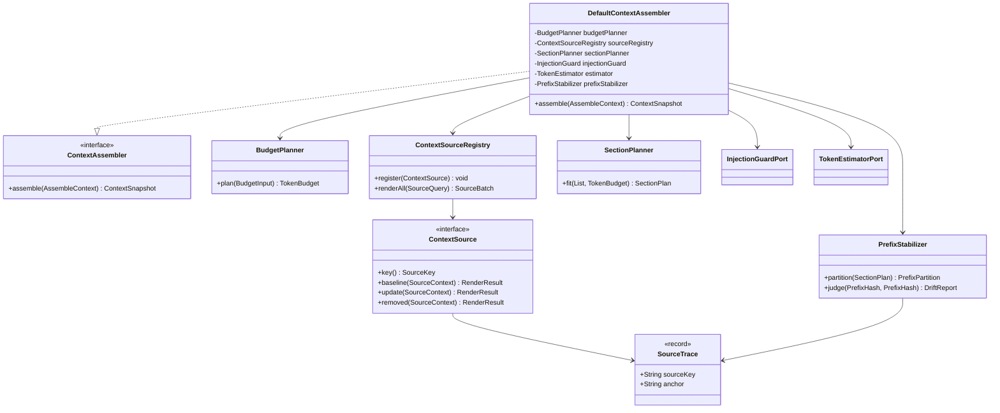
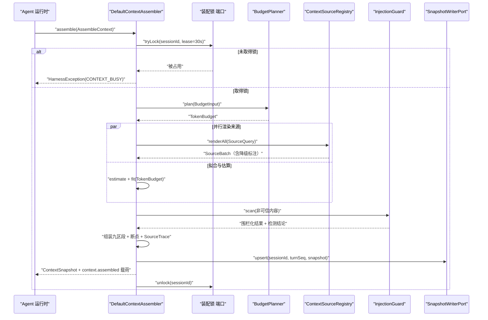
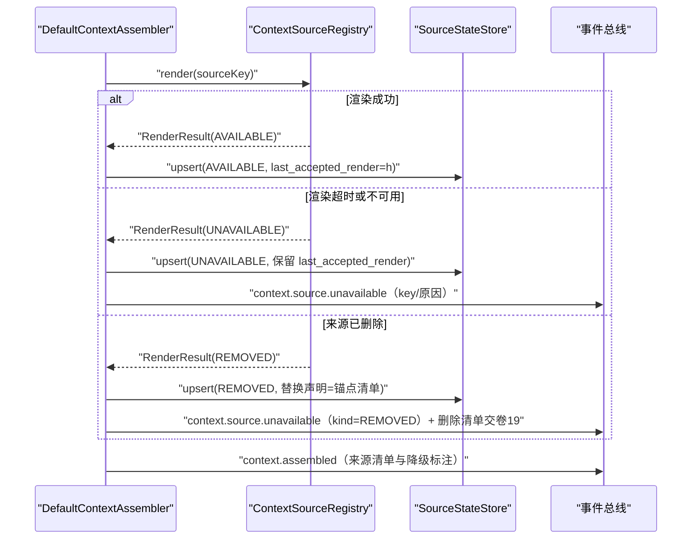
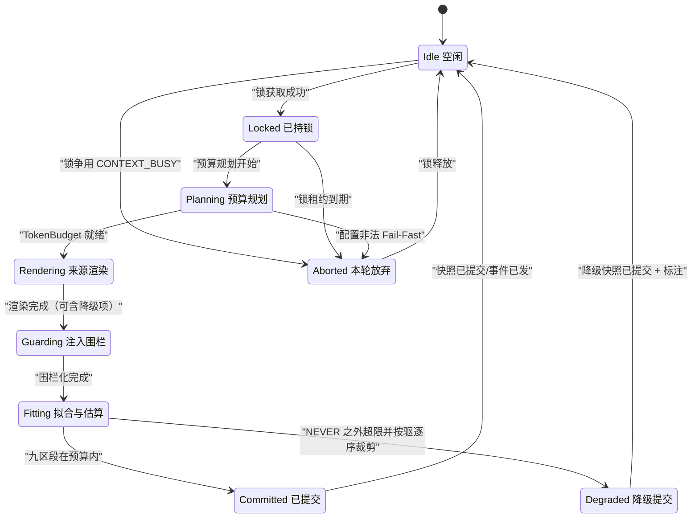

# C03 · ContextAssembler（上下文组装器）组件级实现方案

> 组件编号 **C03**（附录 D 的 K-07 组件级细化）｜系统级方案：`impl/03-context-engine-impl.md`（卷 03 上下文系统，D-CTX-1…11）｜模块落点：`harness-kernel/kernel-context`（包 `com.hk.opencoding.kernel.context.assemble`，零框架）+ `harness-contract`（`ContextAssembleRequest`/`PromptArtifact`/`ArtifactRef` 端口）。
> 上游：Agent 运行时（卷 12）；下游：`CompactionEngine`（C04）、模型网关（卷 02）。本文是**组件级施工图**：把「九区段 + 逐段预算 + 来源三态 + 缓存断点」落到类、算法与门禁；与系统级方案冲突或缺口一律登记为**修订建议指针**（§1.4），不回改系统级文件。
> 编号口径：需求 `REQ-C-CA-n`（CA = ContextAssembler）；决策 `I-C-CA-n`（组件级，只增不复用，不覆盖 `I-CTX-n`）。

---

## ① 组件定位与边界

### 1.1 一句话职责

把「本轮九区段的内容来源」装配为一个**可预算、可溯源、可复现、缓存亲和**的 `ContextSnapshot`——它是模型调用的唯一输入形态（impl/03 §1.2），也是压缩、诊断、检查点、多模型投射的共同上游。

### 1.2 边界（做什么 / 不做什么）

| 类别 | 内容 | 理由 |
| --- | --- | --- |
| 做 | 预算规划（窗口 × 模式 × 覆盖 → `TokenBudget`）、来源渲染与三态切换、区段拟合与驱逐、注入围栏化、指令分层合并、断点标记与漂移判定、溯源锚点、快照幂等写入与 `context.*` 事件载荷 | 均为装配期纯逻辑 + 端口 IO；事件是诊断与缓存指标的唯一输入 |
| 不做 | 压缩（触发、选段、摘要、保真校验、熔断）与摘要模型调用 | 归 C04 `CompactionEngine`；装配器只产出快照，压缩异步独立驱动（impl/03 §6.1 注记） |
| 不做 | 检索召回算法、知识/记忆内容生成、提示词资产版本与灰度 | 归卷 10/11/04；本组件只消费 `SourcedItem`/`PromptArtifact` 与配额 |
| 不做 | 模型侧缓存实现与协议投射、审批与高危动作拦截 | 归卷 02/06；本组件只产出断点标记，注入穿透由权限决策链兜底 |

### 1.3 编译期依赖方向

`kernel-context` 只依赖 JDK 与 `harness-contract` 类型；记忆、知识、符号索引、快照存储、事件总线全部经端口注入，编译期无 Spring、无 domain、无 infrastructure（卷 01 铁律、H-003）。`ContextEngineProperties` 属平台域带，内核只接收换算后的 `TokenBudget` 与水位值对象（impl/03 §5.2 注）。

### 1.4 与系统级方案的关系与修订建议指针

| 条目 | 系统级出处 | 组件级结论 | 处置 |
| --- | --- | --- | --- |
| 预算缩放的模式取值集 | 卷 03 §4.1「编码/计划/审查/研究」；`harness-common` 现网 `AgentMode` 仅 `PLAN`/`BUILD` | 组件按 `AgentMode` 枚举驱动缩放表，禁止字符串模式名 | 修订建议 **R-CA-1**（建议登记为 X-83：声明四模式取值集或以枚举为准） |
| 来源注册表类名 | impl/03 §4 架构图 `SectionSourceRegistry` vs §1.4/§9.2 `ContextSourceRegistry` | 统一采用 `ContextSourceRegistry` | 修订建议 **R-CA-2** |
| `userTunableSections` 默认值 | impl/03 §5.2 注释「默认 S4/S5/S7/S8」但代码默认 `Set.of()`（空集） | 按注释语义落地：默认 `S4/S5/S7/S8`，空集视为配置错误拒绝启动 | 修订建议 **R-CA-3** |
| 熔断期「紧预算」系数 | impl/03 §10.3 未给系数，§5.2 无对应字段 | 定义 `tightBudgetRatio`（默认 0.75）并纳入配置校验 | 修订建议 **R-CA-4**（与 C04 的 R-CMP-2 同源，建议合并登记） |

> 四项均为「实现需成文、语义不变」的登记项，不改变 `D-CTX-1` 九区段模型与任何 `I-CTX-n` 选定分支；编号由编排方在 `IMPL-DECISIONS.md` §4 裁决。

---

## ② 功能需求清单（REQ-C-CA-n）

| ID | 需求描述 | 来源 | 优先级 | 验收要点 |
| --- | --- | --- | --- | --- |
| REQ-C-CA-1 | 九区段装配与逐段预算：九段独立 `tokenLimit`/驱逐等级/压缩方式/缓存属性；权重归一到 100；分配用最大余数法（确定性） | impl/03 REQ-CTX-1、§5.1；卷 03 §4.1 | P0 | 9 区段单测齐备；Σ 分配 ≤ `total − reserve`；同输入同分配 |
| REQ-C-CA-2 | 具名来源三渲染器 + 三态分离：`UNAVAILABLE` 保留上次已接受渲染，`REMOVED` 下发替换声明（禁止指令静默消失） | impl/03 REQ-CTX-18、§3.1 I-CTX-1；OCTX §①-5 `[E1]` | P0 | 两种语义各有用例；重复 `sourceKey` 注册被拒 |
| REQ-C-CA-3 | 稳定前缀分区 + 缓存断点标记 + 漂移检测（合法失效与漂移分离判定） | impl/03 REQ-CTX-7、§10.2；CX §①-6 `[E1]` | P1 | 连续 5 轮断点位置不变；漂移比例可观测 |
| REQ-C-CA-4 | 溯源锚点：每条注入项可回答「来自哪个文件/哪一层/哪个版本」 | impl/03 REQ-CTX-11；卷 00 REQ-CTX-10 | P0 | `SourceTrace` 覆盖 100% 注入片段 |
| REQ-C-CA-5 | token 估算与安全余量：族表系数 × 校准系数 ×（1 + margin）+ 固定余量；`tokenizer_family`/`estimator_version`/`calibration_epoch` 随快照落库 | impl/03 REQ-CTX-2、§10.9 不变式 4 | P0 | 误差 P95 ≤ 7%、最大 ≤ 10%；历史快照不按新口径重算 |
| REQ-C-CA-6 | 注入围栏化：非 `TRUSTED_*` 内容包裹带来源与哈希的围栏块；分隔符出现即转义 | impl/03 REQ-CTX-13、§10.4 | P0 | 10 类攻击用例拦截或降级为数据 |
| REQ-C-CA-7 | 指令分层 L0–L4 合并：项目/目录指令按路径层级合并；`enforced` 被覆盖即拒绝并告警 | impl/03 REQ-CTX-6；卷 04 §4.4 | P0 | 冲突矩阵 12 组全覆盖；产生 `context.instruction.conflict` |
| REQ-C-CA-8 | 混合选择：显式 `@` 项不被静默丢弃；自动候选带 `reason`/`score`；受区段预算约束 | impl/03 REQ-CTX-9 | P0 | 显式项超预算时显式报错或截断标注 |
| REQ-C-CA-9 | 检索增强注入与配额：相关度门限下的候选不入快照；来源与条数进事件载荷；超时按配额降级 | impl/03 REQ-CTX-10 | P1 | 门限下不入快照；单来源超时仅降级该来源 |
| REQ-C-CA-10 | 结构索引注入：种子图排序 + 二分拟合；无文件在上下文时预算放大 8 倍；按 `(文件, mtime)` 失效 | impl/03 REQ-CTX-19；STX §①-1 `[E1]` | P1 | 拟合误差 ≤ 15%；10 万行仓可在预算内产出 |
| REQ-C-CA-11 | 装配幂等与互斥：锁 `oc:ctx:assembling:{sessionId}`（30s 租约、不续租）；快照按 `(sessionId, turnSeq)` 幂等 upsert | impl/03 §6.1、§10.9 R05-表-2 | P0 | 同轮双写仅一行；租约到期不产生第二行 |
| REQ-C-CA-12 | 装配期降级与上报：单来源失败仅降级该来源并标注；每类降级有事件与面板标注 | impl/03 §10.3、§8.4 | P0 | 降级路径逐条有用例；无静默丢内容 |

---

## ③ 关键设计决策（I-C-CA-n）

**I-C-CA-1 预算分配与取整**｜备选：B1 顺序贪婪｜B2 浮点比例四舍五入｜**B3 最大余数法 + 锁定区段保底 + 模式仅重分配可调区段（选定）**。理由：分配和严格等于 `allocatable`（零泄漏）、结果可复现可回放比对、锁定区段（S1/S2/S3/S6/S9）永不为 0。代价：实现复杂度约 +40 行，需维护「锁定/可调」两组权重与归一化次序。回退触发：出现「Σ 分配 ≠ allocatable」或跨进程分配不一致用例即回退 B1，可复现性下沉到快照记录。

**I-C-CA-2 区段填充机制**｜备选：B1 直接拼接字符串｜**B2 具名 `ContextSource` + 三渲染器 + 稳定键（选定，沿用 I-CTX-1 B2）**｜B3 每轮全量重渲染。理由：同时解决缓存亲和（REQ-C-CA-3）、变更可解释（REQ-C-CA-4）与「不可用 ≠ 已移除」（REQ-C-CA-2）。代价：需来源注册表、epoch 管理与 `oc_context_source_state` 落库。回退触发：来源类型膨胀使内核公开类型数突破 H-003 的 400 类线 → 退化 B1，变更解释下沉事件载荷（与系统级回退一致）。

**I-C-CA-3 前缀稳定性双判据**｜备选：B1 每轮全量重算哈希｜B2 只比断点位置｜**B3 合法失效白名单 + 漂移比例双判据（选定）**。理由：「制品哈希变化/epoch 滚动」是合法失效（记账不告警），「位置变化且不在白名单」才是漂移；避免把正常发布误报为缓存退化。代价：需保存上一轮前缀哈希与断点位置（Redis `oc:ctx:prefixhash`，2h），多一次 < 2ms 本地计算。回退触发：漂移误报率（人工复核为合法的告警占比）> 10% 时简化为 B2。

**I-C-CA-4 失败语义**｜备选：B1 任一来源失败即整轮失败｜B2 静默丢弃不可用来源｜**B3 单来源降级、整体不失败（选定，除三类硬失败）**。理由：对齐 §10.3 降级优先与 REQ-C-CA-2；硬失败限定为：会话不存在（`CONTEXT_NOT_FOUND`）、锁争用（`CONTEXT_BUSY`）、`NEVER` 区段加载失败（安全区不可降级）。代价：降级标注必须贯通快照元数据、事件与面板，否则即为静默降质。回退触发：出现「模型基于缺失安全策略执行」事故即回退 B1 并上报安全评审。

---

## ④ 类图



### 4.1 关键 Java 21 签名（节选）

```java
/**
 * 上下文组装器：把九区段来源渲染为一次可预算、可溯源、可复现的 {@link ContextSnapshot}。
 * 组件级边界：本接口不触发压缩（压缩由 C04 CompactionEngine 独立异步驱动），不直连数据库。
 */
public interface ContextAssembler {

    /**
     * 装配一次上下文快照（只读操作，内核层无注解事务）。
     *
     * @param context 装配上下文（请求、预算输入、来源查询、上一轮前缀哈希；必填）
     * @return 不可变快照（含逐段预算、九区段、断点、溯源与降级标注）
     * @throws HarnessException 锁争用（`CONTEXT_BUSY`）、会话不存在或已归档（`CONTEXT_NOT_FOUND`）、
     *                          `NEVER` 区段加载失败（`DEPENDENCY_UNAVAILABLE`）时抛出
     */
    ContextSnapshot assemble(AssembleContext context);
}

/**
 * 具名上下文来源：同一来源用三渲染器表达生命周期；渲染必须是纯函数
 * （相同 `SourceContext` 必得相同字节），否则前缀稳定性不可证明（§8.3）。
 */
public interface ContextSource {

    /** 来源稳定键（全局唯一，重复注册即拒绝；形如 `prompt:org-policy`，小写无空白）。 */
    SourceKey key();

    /**
     * 基线渲染：在 epoch 内冻结，是稳定前缀分区的唯一输入。
     *
     * @param context 来源上下文（会话、epoch、制品哈希；必填）
     * @return 基线渲染结果（片段有序、含溯源锚点与内容哈希）
     */
    RenderResult baseline(SourceContext context);

    /**
     * 增量渲染：变更在区段内按时间序追加，不改写既有片段字节。
     *
     * @param context 来源上下文（含本来源的增量游标；必填）
     * @return 追加片段（可为空列表，表示本轮无变更）
     */
    RenderResult update(SourceContext context);

    /**
     * 移除声明：来源被删除/撤销时下发替换声明，禁止静默消失。
     *
     * @param context 来源上下文（含移除原因码；必填）
     * @return 替换声明（含被移除来源的锚点清单，供删除传播对账）
     */
    RenderResult removed(SourceContext context);
}
```

> 另有 `SourceState`（`AVAILABLE`/`UNAVAILABLE`/`REMOVED`）为 `code`+`desc` 枚举，私有构造 + `of(String code)` 工厂（非法值抛 `HarnessException(ErrorCode.INVALID_ARGUMENT, …)`），`code` 落 `oc_context_source_state.state` 与事件载荷，取值集只增不改（对齐 `.qoder/rules/constant-extraction-rules.md`）。
> 上述类型的阈值与默认值一律不落入代码：全部来自 `ContextEngineProperties`（§7.3），内核只接收换算结果。

---

## ⑤ 核心流程时序图

### 5.1 流程 A：单轮装配主链（锁 → 预算 → 并行渲染 → 围栏 → 组装 → 提交）

前置：会话运行中、能力矩阵可用、提示词制品已产出、上一轮前缀哈希可读。主路径：取锁 → 预算规划 → 并行渲染 → 注入扫描 → 九区段组装 + 估算 + 断点 → 幂等写快照 + 发事件 → 释放锁。异常补偿：来源超时仅降级该来源并保留上次已接受渲染（REQ-C-CA-2）；快照写失败重试 3 次后本轮不落库（内存快照仍可用，事件标注 `snapshotPersisted=false`），历史由事件可重建（impl/03 §10.9 不变式 1）。幂等与并发：锁 30s 租约且**不续租**（超租即失效并放弃本轮，防死锁）；快照按 `(sessionId, turnSeq)` upsert。



### 5.2 流程 B：来源三态切换（不可用保留 vs 已移除替换）

前置：`oc_context_source_state` 中存在该来源上一轮已接受渲染。主路径：成功 → 推进已接受值；失败 → `UNAVAILABLE` 保留上次值 + 事件；被合规删除 → `REMOVED` 下发替换声明 + 事件 + 删除清单交卷 19。异常补偿：状态写入失败时以「不可用」最保守态兜底（保留已接受值、不引入新内容）并在下一轮重试。幂等与并发：状态按 `(sessionId, sourceKey)` 主键 upsert；`last_accepted_render` 仅在 `AVAILABLE` 时推进（防止降级值覆盖已接受值）。前缀漂移判定（流程 C）为纯本地计算（< 2ms），在装配尾部同步执行：哈希与位置均不变则稳定轮次 +1；命中合法失效白名单记 `context.epoch.rolled`；否则按 `driftRatio = |Δ| / |prev|` 发 `context.cache.prefix.drift`，并把结果写回 `oc:ctx:prefixhash`（2h TTL）。



---

## ⑥ 状态机

装配器**每轮装配**是一个短生命周期子状态机（会话级状态机见 impl/03 §7.1；压缩状态归 C04 §⑥）。非法迁移必须抛 `HarnessException(ErrorCode.CONFLICT, 中文文案)` 并记 WARN，禁止静默忽略。



| 非法迁移（示例） | 判定 | 处置 |
| --- | --- | --- |
| `Committed → Fitting` | 同轮同 `turnSeq` 重复装配 | 拒绝并抛 `CONFLICT`；幂等重放走 upsert 而非重跑 |
| `Idle → Rendering` | 未取锁即渲染 | 拒绝（防绕过互斥） |
| `Aborted → Committed` | 锁失效后仍提交 | 拒绝提交；改走 upsert 幂等路径 |
| `Degraded → Committed` | 降级标注丢失 | 拒绝；降级须保留 `degraded=true` 与原因码直至快照被替换 |

---

## ⑦ 接口与依赖矩阵

### 7.1 依赖矩阵（端口注入，契约定义在 `harness-contract`）

| 依赖对象 | 方向 | 契约 | 失败语义 | 降级 |
| --- | --- | --- | --- | --- |
| Agent 运行时（卷 12） | 入 | `ContextAssembleRequest`（会话、模式、任务、预算覆盖） | 请求非法 → `INVALID_ARGUMENT` | 无 |
| 提示词系统（卷 04） | 入 | `PromptArtifact` + `PromptVersionSet` + 制品哈希 | 护栏片段缺失 → 拒绝装配 | 无（Fail-Fast） |
| 记忆（卷 10）/ 知识（卷 11） | 入 | `SourcedItem`（来源、相关度、配额） | 超时/不可用 | 单来源降级 + 事件标注 |
| 符号索引（卷 11 平台侧） | 入 | `SymbolMap`（种子图排序 + 拟合输入） | 索引服务下线 | 退化 grep 候选，标注 `symbolIndex=degraded` |
| TokenEstimator（组件内） | 内 | 族表 + 校准账本（EWMA） | 无校准样本 | 族表系数 + margin 兜底，误差进指标 |
| InjectionGuard（卷 03/06） | 内 | 检测器链（规则必开、模型可选） | 检测器异常 | fail-closed：按 `UNTRUSTED_EXTERNAL` 围栏化 + 事件 |
| 权限决策链（卷 06） | 出 | 高危动作前置校验（越权兜底） | 拒绝 | 拒绝并审计，不泄露归属 |
| `SnapshotWriterPort` | 出 | 快照 upsert（外壳适配器 `@Transactional(rollbackFor = Exception.class)`） | 写失败 | 重试 3 次 → 本轮不落库 + 事件标注 |
| `EventAppendPort`（卷 16） | 出 | `context.*` 事件信封 | 追加失败 | 生产侧幂等键兜底重试；不阻塞返回 |
| `CompactionEngine`（C04） | 出 | 仅交接 `ContextSnapshot` | 压缩失败 | 与装配解耦（异步），不影响本轮 |
| `ContextProjector`（卷 02） | 出 | `ModelPayload` + 断点标记 + `promptCacheKey` | 协议不支持缓存 | 不投射断点（仅命中率下降，行为等价） |
| `RedisKeys`（统一 Key 工厂） | 出 | `oc:ctx:assembling` / `oc:ctx:prefixhash` | Redis 不可用 | 锁降级为单实例本地栅栏 + WARN；漂移仅记基线 |

### 7.2 扩展点（对齐卷 18 扩展点目录）

`SectionProviderSPI`（稳定）、`ContextSourceSPI`（稳定，即 `ContextSource` 注册入口）、`InjectionDetectorSPI`（稳定）、`ContextViewSPI`（稳定）；装配器**不**开放「跳过围栏」「跳过溯源」类扩展点——安全与溯源是组件不变量。

### 7.3 配置项（`open-coding.context.*`，完整字段见 impl/03 §5.2）

| 配置 | 默认 | 校验（启动 Fail-Fast） |
| --- | --- | --- |
| `section-weights` | 卷 03 §4.1 九项比例（5/10/10/5/10/5/30/20/5） | 九键齐备、和 = 100，否则拒绝启动 |
| `user-tunable-sections` | `S4,S5,S7,S8`（R-CA-3） | 仅允许 S4/S5/S7/S8；空集判非法 |
| `estimate-margin` / `reserve-tokens` / `calibration-window` | `0.10` / `2000` / `20` | `0 ≤ margin ≤ 0.5`；`0 < reserve < total/2` |
| `cache-breakpoint-stability-turns` | `5` | `≥ 1` |
| `tight-budget-ratio` | `0.75`（R-CA-4） | `0.5 ≤ ratio < 1.0` |
| `symbol-index-enabled` / `symbol-map-tokens` / `symbol-map-multiplier-no-files` | `true` / `1024` / `8` | `multiplier ≥ 1` |

---

## ⑧ 关键算法

### 8.1 token 预算分配（最大余数法）

```
输入：window（模型窗口）、outputReserve（输出预留）、weights（九区段权重，和=100）、
      modeScale（模式缩放因子，只作用于可调区段）、reserve = reserveTokens、tightRatio
step1  available   = window − outputReserve                      // 可用输入预算
step2  allocatable = floor(available × tightRatio') − reserve    // tightRatio' = 1.0；熔断期 0.75
step3  可调区段权重 × modeScale 后与锁定区段权重一起重标定到 100
step4  base(s) = floor(allocatable × w(s) / 100)
step5  余量 R = allocatable − Σbase(s)，按小数部分降序补 1；小数相等按 ContextSectionId.order() 升序（确定性）
step6  对 EvictionLevel.NEVER 区段取 limit(s) = max(limit(s), neverFloor(s))；若 Σ > allocatable，
       从 HIGH → MEDIUM → LOW 可驱逐区段回收差额
step7  NEVER 保底仍不可满足 → 按 INVALID_ARGUMENT 拒绝装配并提示模型窗口过小（若产品需独立错误码，随 §1.4 登记项一并裁决）
```

数值示例（窗口 200k、输出预留 8k、reserve 2000、正常态）：S1/S2/S3 = 9 500 / 19 000 / 19 000；S4/S5 = 9 500 / 19 000；S6/S9 = 9 500 / 9 500；S7/S8 = 57 000 / 38 000；合计 190 000 = `allocatable`（零泄漏）。

### 8.2 区段拟合与驱逐

1. 段内先裁剪（软顺序）：S3 目录级裁剪 → S4 按相关度截断 → S5 引用化 → S8 外置引用 + 摘要内联（单结果 `inlineMaxTokensPerResult`、单轮合计 `inlineMaxTokensPerTurn` 双层上限）。
2. 段内裁剪后仍 `overBudget()` 才进入跨区段驱逐：按 `HIGH → MEDIUM → LOW` 释放额度，`NEVER` 永不被裁剪（REQ-C-CA-1）。
3. 驱逐只降低 `tokenLimit`，不改变来源状态；被裁片段记入压缩地图语义（`context.budget.exceeded` 载荷含驱逐顺序）。

### 8.3 缓存亲和的前缀稳定性证明

**定义**：前缀分区 `P(t) = concat(baseline(S1), baseline(S2), stable(S3))`，`prefixHash(t) = H(P(t))`；断点位置 `B(t) = f(片段数, 字节偏移)`。

**不变量**：INV-1（epoch 冻结）epoch 内 `baseline` 是纯函数 `f(sourceKey, epoch, artifactHash)`，不含时间/轮次/模型变量；INV-2（追加式更新）变更只经 `update` 追加到区段尾部，改写前缀字节的路径不存在；INV-3（压缩只触尾部）C04 的替换范围 ∈ {S5, S7, S8} 与「epoch 起点之后的动态片段」，L4 折叠不进入前缀分区；INV-4 断点是 `P(t)` 的确定性函数。

**命题**：若 INV-1…4 成立，则「无变更轮」有 `prefixHash(t) = prefixHash(t−1)` 且 `B(t) = B(t−1)`。**证明（归纳）**：基线轮 t0 的前缀字节序列 `P0` 由 INV-1 唯一确定。设 t−1 轮成立。轮 t 无变更时，稳定区段来源的渲染输入（sourceKey、epoch、artifactHash）与 t−1 相同，由 INV-1 得逐段渲染字节相等；由 INV-2 无追加；由 INV-3 压缩不触及前缀 → `P(t) = P(t−1)`，哈希相等；由 INV-4 得断点相等。归纳成立。

**失效与漂移判据**：前缀哈希变化时先查合法失效白名单（制品哈希变化、epoch 滚动、来源 `REMOVED`）；命中记合法失效，未命中按 `driftRatio = |ΔprefixBytes| / |prefixBytes(t−1)|` 记漂移，并在连续 `cacheBreakpointStabilityTurns`（默认 5）轮超阈（默认 0.10）时告警。指标门槛：连续 5 轮断点位置不变 ≥ 99%（impl/03 §10.1）。

### 8.4 压缩触发与保真校验的装配侧契约

装配器只做两件事：① 快照元数据携带 `keepRecentTokens` 保护域标记（尾部 8192 token 不参与压缩）；② 为 `SectionFlags` 打标——`STABLE_PREFIX`（S1/S2/S3）、`NO_SUMMARY`（S6）、`NO_EVICT`（S1/S2/S6/S9），供 C04 的保真断言集直接引用。触发判定、逐级短路与保真校验算法见 C04 §⑧。

---

## ⑨ 错误处理与降级

| 错误场景 | ErrorCode | retryable | 用户可见文案 | 降级动作 |
| --- | --- | --- | --- | --- |
| 同会话已有装配在途 | `CONTEXT_BUSY` | 是 | 「上下文正在装配中，请稍后重试」 | 退避 200ms 重试；连续 3 次按系统错误上报 |
| 会话不存在或已归档 | `CONTEXT_NOT_FOUND` | 否 | 「会话不存在或已归档，sessionId=…」 | 重新 `session.attach` 或新建会话 |
| 记忆/知识召回超时 | `DEPENDENCY_UNAVAILABLE` | 是（降级优先） | 「检索来源暂不可用，已按降级策略继续（无检索）」 | 单来源降级 + 事件标注；下轮重试 |
| 结构索引不可用 | `DEPENDENCY_UNAVAILABLE` | 是 | 「结构索引暂不可用，已降级为文本检索候选」 | 标注 `symbolIndex=degraded` |
| 注入检测器链异常 | `INTERNAL_ERROR` | 否（本轮） | 「内容已按最高不可信等级隔离」 | fail-closed：全按 `UNTRUSTED_EXTERNAL` 围栏化 + 事件 |
| 快照写入失败 | `INTERNAL_ERROR` | 是（后台） | 无（用户无感） | 重试 3 次；仍失败本轮不落库 + 事件标注 `snapshotPersisted=false` |
| Redis 装配锁不可用 | `DEPENDENCY_UNAVAILABLE` | 是 | 「互斥降级为单实例模式」 | 本地栅栏 + WARN；多实例由数据库唯一键兜底 |
| 指令 `enforced` 被覆盖 | `INVALID_ARGUMENT` | 否 | 「指令冲突：`<layer>` 覆盖被拒绝」 | 拒绝该覆盖项；发 `context.instruction.conflict`，其余继续 |
| `NEVER` 区段加载失败 | `DEPENDENCY_UNAVAILABLE` | 是 | 「安全策略不可用，无法装配上下文」 | 整轮失败（B3 三类硬失败之一），不降级 |

**纪律**（对齐 `.qoder/rules/`）：内核业务失败一律 `HarnessException(ErrorCode, 中文文案)`，禁止裸 `RuntimeException`/`IllegalArgumentException`；只读装配**禁止** `@Transactional`，快照写路径由外壳适配器标注 `@Transactional(rollbackFor = Exception.class)`；日志 `@Slf4j`（I-ARC-7）+ 中文文案 + 占位符 + 异常传 `Throwable`；入口/返回打点（`上下文装配开始/完成，sessionId=…, 区段数=…, 估算 token=…, 断点数=…, 耗时=…ms`），来源降级与驱逐用 `log.warn`。

---

## ⑩ 性能与并发

| 项 | 预算 | 说明 |
| --- | --- | --- |
| 快照装配 | P50 ≤ 25ms / P95 ≤ 80ms | 不含检索与索引 IO（impl/03 §10.1） |
| 分区/拟合/漂移判定 | 单轮合计 ≤ 3ms | 纯本地；漂移判定 < 2ms |
| 结构索引拟合 | P95 ≤ 400ms（热）/ ≤ 2s（增量失效后） | 平台侧预算 |
| 估算误差 | P95 ≤ 7%、最大 ≤ 10% | 100 组真实 Usage 回放门禁 |
| 缓存命中率 | ≥ 70%（长会话 ≥ 80%） | 断点稳定性 ≥ 99%（连续 5 轮） |
| 单次装配常驻内存 / 50 并发峰值 | 2–6MB / ≈ 300MB | 每并发一虚拟线程 + 结构化作用域 fork |
| 锁租约 | 30s，不续租 | 超租自动失效并放弃本轮；多实例靠 `(session_id, turn_seq)` 唯一键 |

并发模型：装配在调用方虚拟线程上执行，来源渲染经自研 `SessionScope` 结构化作用域 fork（I-ARC-3，不使用 JDK preview 的 `StructuredTaskScope`），fork 上限 = 来源数（≤ 9）；超时统一收敛，单来源失败只降级该来源；内核禁止静态可变状态（卷 01 铁律 5）。压缩与检查点写入均为下游异步，不在本条关键路径内（首 token 延迟不受压缩影响，NFR-P-10）。

---

## ⑪ 测试要点（DoD）

### 11.1 单测（`kernel-context`，零框架、可离线）

| 用例 | 断言 |
| --- | --- |
| `ContextAssemblerBudgetTest`（3 窗口 × 枚举模式全组合） | Σ 分配 = allocatable；`NEVER` 区段永不为 0；同输入两次分配逐字节相同 |
| `SectionEvictionTest`（超预算 20%/40%/60%） | 按 `HIGH → MEDIUM → LOW` 裁剪；`NEVER` 不被裁剪；驱逐顺序进事件载荷 |
| `ContextSourceRegistryTest` | 重复 `sourceKey` 注册被拒；`baseline` 在 epoch 内冻结；`update` 时间序追加 |
| `SourceStateSemanticsTest` | `UNAVAILABLE` 保留上次已接受值；`REMOVED` 下发替换声明；两态不混用 |
| `PrefixStabilityTest` | 无变更连续 5 轮断点位置与哈希不变；白名单变化记合法失效；非白名单产出 `driftRatio` |
| `AssemblerIdempotencyTest` | 同 `(sessionId, turnSeq)` 重复装配仅一行；租约到期重跑不产生第二行 |
| `AssemblerDegradeTest` | 检索超时/索引下线/检测器异常三条降级路径各有事件与标注；无静默丢内容 |
| `AssemblyLatencyTest`（JFR/微基准） | 1 万 token、九区段全满下 P95 ≤ 80ms |

### 11.2 集成与契约

| 用例 | 场景 | 判据 |
| --- | --- | --- |
| `ContextPersistenceIT` | 装配 → 落库 → 按 `(sessionId,turnSeq)` 读回 | 区段/断点/溯源/`estimator_version` 逐项一致 |
| 重建用例（R05） | 清空 `oc_context_snapshot` 后仅凭事件重建 | 来源清单、断点、估算版本与压缩地图引用逐项一致 |
| `ContextProtocolContractTest` | `context.get` / `context.explain` 契约 | 诊断视图字段齐备；`CONTEXT_BUSY` 文案与错误码一致 |
| 缓存亲和/删除传播回归 | 20 轮长会话；来源被合规删除后的下一轮 | 命中率 ≥ 70%、漂移事件 ≤ 1 次；不再注入已删内容 |

### 11.3 可执行命令

```bash
# 组件单测（内核，零框架）
mvn -pl harness-kernel/kernel-context -am test -Dtest='ContextAssembler*Test,SectionEvictionTest,ContextSourceRegistryTest,PrefixStabilityTest,SourceStateSemanticsTest' -DfailIfNoTests=false
# 集成（PG + Redis）
mvn -pl harness-platform/platform-persistence -am test -Dtest='ContextPersistenceIT' -DfailIfNoTests=false
# 契约 + 回放（假模型）
mvn -pl harness-host/host-protocol -am test -Dtest='ContextProtocolContractTest,CompactionReplayTest' -DfailIfNoTests=false
# 长任务基准（门禁：50 会话 × 50 轮）
mvn -pl harness-host/host-bootstrap -am verify -Pbench-context -Dbench.sessions=50 -Dbench.turns=50
```

**DoD**：REQ-C-CA-1…12 逐条有单测或集成用例；性能门禁（装配 P95 ≤ 80ms、估算误差 P95 ≤ 7%、命中率 ≥ 70%、断点稳定 ≥ 99%）在 CI 强制；四条修订建议指针（R-CA-1…4）已登记待编排方裁决，未裁决前按本文结论施工且不改变任何系统级语义。
