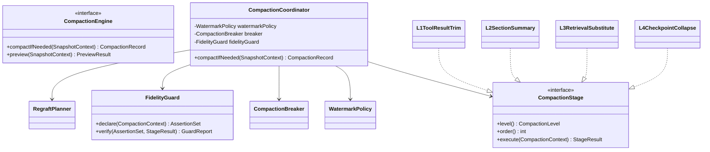
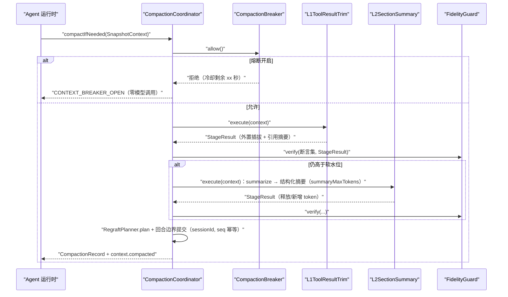
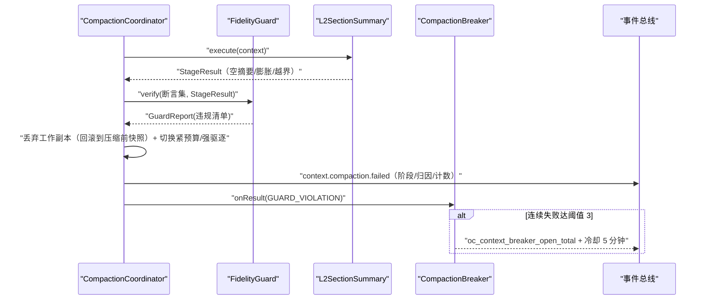
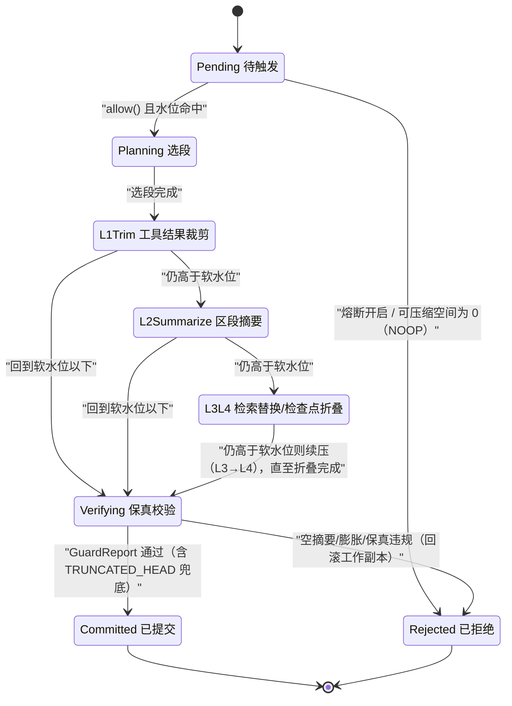

# C04 · CompactionEngine（压缩引擎）组件级实现方案

> 组件编号 **C04**（附录 D 的 K-08 组件级细化）｜系统级方案：`impl/03-context-engine-impl.md`（卷 03 上下文系统，D-CTX-2/3/7/8）｜模块落点：`harness-kernel/kernel-context`（包 `com.hk.opencoding.kernel.context.compaction`，零框架）+ `harness-contract`（`CompactionTrigger`/`CompactionRecord` 契约）。
> 上游：`ContextAssembler`（C03）的 `ContextSnapshot`；下游：摘要模型端口（卷 02）、快照/记录存储与压缩地图对象存储（卷 19）、事件总线（卷 16）。竞品证据：CX `src/services/compact/*`（多机制 + 熔断 + 回灌）`[E1]`、GX `chatCompressionService.ts`（压缩状态化）`[E1]`、OCTX（压缩不删历史）`[E1]`。
> 编号口径：需求 `REQ-C-CMP-n`；决策 `I-C-CMP-n`（组件级，只增不复用，不覆盖 `I-CTX-n`）；修订建议 `R-CMP-n`（§1.4）。

---

## ① 组件定位与边界

### 1.1 一句话职责

在**不阻塞当前轮调用**的前提下，把超水位快照按「L1 工具结果裁剪 → L2 区段摘要 → L3 检索替换 → L4 检查点折叠」逐级压缩，经保真校验与熔断护栏后在**回合边界**原子提交，并产出可回看的压缩地图与压缩后回灌清单。

### 1.2 边界（做什么 / 不做什么）

| 类别 | 内容 | 理由 |
| --- | --- | --- |
| 做 | 水位判定与触发裁决、四级阶段编排与逐级短路、保真断言声明与校验、结果状态化（7 态）、熔断与半开、回合边界提交与回滚、压缩地图产出、回灌清单编排 | 系统级 §6.2/§7.2 的行为主体 |
| 不做 | token 估算与校准（`TokenEstimator`）、快照装配与九区段预算（C03）、来源渲染与注入围栏 | 上游职责；压缩只消费 `tokenEstimate` 与逐段 `tokenLimit` |
| 不做 | 摘要模型调用实现与重试策略、检查点物化写入、外置引用登记与再读鉴权 | 经端口调用（重试只认 `ErrorCode.retryable`，卷 02 D14）；物化归 `CheckpointWriter`（impl/12 I-AG-9 唯一物理表） |
| 不做 | 历史事件的改写与删除、前台 UI 交互 | 压缩不删历史（OCTX `[E1]`）；`context.preview`/`context.editSummary` 由 host-protocol 暴露，引擎只提供纯函数预览与重校验 |

### 1.3 编译期依赖方向

`kernel-context` 零 Spring、零 domain；摘要模型、快照读写、地图落盘、熔断状态、时钟全部经端口注入（`SummaryModelPort`/`SnapshotStorePort`/`CompactionRecordStorePort`/`MapBlobStorePort`/`BreakerStorePort`/`ClockPort`）；配置来自平台域带 `ContextEngineProperties`，内核只接收换算结果（impl/03 §5.2 注）。

### 1.4 与系统级方案的关系与修订建议指针

| 条目 | 系统级出处 | 组件级结论 | 处置 |
| --- | --- | --- | --- |
| 升级门限表述不一致 | §6.2 时序图写「仍超硬水位 0.95」才升级；§11.1 用例要求「水位 0.81 触发 L2」 | 裁决为**双水位语义**：升级门限 = 软水位（0.80），硬水位（0.95）= 压缩目标线（全阶段跑完仍超硬 → `TRUNCATED_HEAD` + 紧预算） | 修订建议 **R-CMP-1**（建议 §6.2 图注成文） |
| 回灌预算配置缺失 | REQ-CTX-20 与 CX 证据使用 `POST_COMPACT_TOKEN_BUDGET=50_000`、`MAX_FILES_TO_RESTORE=5`，§5.2 `ContextEngineProperties` 无对应字段 | 组件定义 `postCompactTokenBudget`（50000）与 `postCompactMaxFiles`（5） | 修订建议 **R-CMP-2** |
| 门面方法命名 | §5.2 门面为 `compact(snapshot, trigger)`，§6.1 时序写 `compactIfNeeded(snapshot)` | 按「门面 `compact(...)` + 引擎内部 `compactIfNeeded(...)`」落地，语义不变 | 修订建议 **R-CMP-3** |
| 膨胀判定阈值未定义 | 仅定义 `INFLATED_TOKENS` 状态，未给判据 | 判据：`summaryTokens ≥ replacedTokens × (1 − inflateTolerance)`（默认容差 0）即膨胀，判失败并回滚 | 修订建议 **R-CMP-4** |

> 四项均为登记项，不推翻 `D-CTX-2`（四级管线）与任何 `I-CTX-n`；编排方在 `IMPL-DECISIONS.md` §4 裁决后回填。

---

## ② 功能需求清单（REQ-C-CMP-n）

| ID | 需求描述 | 来源 | 优先级 | 验收要点 |
| --- | --- | --- | --- | --- |
| REQ-C-CMP-1 | 四级压缩管线与逐级短路：L1→L2→L3→L4 顺序执行，任一阶段回到软水位即停止，不越级 | impl/03 REQ-CTX-3、§6.2；卷 03 §4.2 | P0 | 四级独立用例；不越级执行 |
| REQ-C-CMP-2 | 压缩结果状态化（7 态）：`NOOP`/`SUCCESS`/`TRUNCATED_HEAD`/`EMPTY_SUMMARY`/`INFLATED_TOKENS`/`GUARD_VIOLATION`/`FAILED`，逐态可上报 | impl/03 REQ-CTX-16；GX §①-5 `[E1]` | P1 | 7 态各有单测；空摘要与膨胀判失败 |
| REQ-C-CMP-3 | 保真校验：约束/验收标准/安全策略不进摘要；计划结构字节级保留；`unverified` 标注；压缩地图覆盖每一被替换段；摘要结构化（保留决策与未决项） | impl/03 REQ-CTX-4；卷 03 §4.2 规则 1–4 | P0 | 10 类断言全过；地图覆盖 100% 被替换段 |
| REQ-C-CMP-4 | 熔断与半开：连续 3 次失败暂停自动压缩并冷却 5 分钟（下限 10 秒），冷却期零模型调用，冷却后半开重试 | impl/03 REQ-CTX-17；CX §①-5 `[E1]` | P1 | 熔断 + 半开用例；冷却期模型调用数为 0 |
| REQ-C-CMP-5 | 安全点提交：只在回合边界原子替换，未提交即视为未发生；压缩期以「紧预算快照」继续服务，流式不阻塞 | impl/03 §3.3 I-CTX-3 B2、§6.2 | P0 | 无半压缩状态；首 token 延迟不受影响 |
| REQ-C-CMP-6 | 压缩不删历史 + 压缩地图：被替换内容可回看、可撤销（地图落对象存储，记录落 `oc_context_compaction`） | impl/03 §10.8-2；OCTX `[E1]` | P0 | 地图缺失时显式降级提示，不伪造可回看性 |
| REQ-C-CMP-7 | 压缩后回灌：按预算回灌计划状态、未决项、关键文件片段（≤5 个）与技能摘要，防模型失去抓手 | impl/03 REQ-CTX-20；CX §④ `[E1]` | P1 | 回灌清单进 `context.compacted`；总量不超预算 |
| REQ-C-CMP-8 | 结构化摘要：分段摘要保留决策与未决项；未验证结论标注 `unverified`；长度上限 `summaryMaxTokens` | impl/03 REQ-CTX-4、§5.2 | P0 | 结构化字段齐备；超长即截断并标注 |
| REQ-C-CMP-9 | 人工介入：`context.preview`（dry-run 不落地）与 `context.editSummary`（编辑后重校验保真断言） | impl/03 REQ-CTX-14、§9.1 | P2 | 预览→编辑→提交端到端可用；越界编辑被拒 |
| REQ-C-CMP-10 | 幂等与单飞：Redisson 锁 + 本地栅栏，同会话至多一个压缩任务；提交按 `(sessionId, seq)` 幂等 | impl/03 §6.2、§10.9 R05-表-2 | P0 | 重复触发不产生重复记录；并发触发仅一次生效 |
| REQ-C-CMP-11 | 溢出恢复一次：模型返回 context-overflow 时触发一次溢出压缩；二次溢出即失败（不无限重试） | impl/03 §10.8-4、§11.2 | P0 | 一次成功；二次失败并上报，无额外模型调用 |

---

## ③ 关键设计决策（I-C-CMP-n）

**I-C-CMP-1 提交语义**｜备选：B1 原地修改快照（流式立即可见）｜**B2 working 副本 + 回合边界原子替换（选定，沿用 I-CTX-3 B2）**｜B3 独立压缩进程。理由：避免半压缩与流式错乱；回滚只需丢弃工作副本；与检查点/插话的竞争面收敛为「边界单点」。代价：压缩期双快照常驻（仅复制区段壳层与元数据，区段体共享不可变实例，几十 KB 量级）。回退触发：「压缩提交 vs 用户插话」语义错乱用例无法收敛 → 按系统级回退切 B1（`local-lite` 同步阻塞压缩）。

**I-C-CMP-2 熔断分母与冷却下限**｜备选：B1 所有非成功结果都计失败｜**B2 只计系统型/质量型失败（`FAILED`/`EMPTY_SUMMARY`/`INFLATED_TOKENS`/`GUARD_VIOLATION`）（选定）**｜B3 只计模型调用异常。理由：`NOOP`（无可压缩空间）与 `TRUNCATED_HEAD`（规则摘要兜底成功）不是故障，误计会导致「正常也熔断」。代价：需在 `stageTrace` 中区分结果归因。回退触发：出现「反复压不动且不熔断」的活锁用例即引入「连续 NOOP 计数」独立阈值。冷却下限 10 秒由配置校验强制（`breaker-cooldown < 10s` 拒绝启动，对齐 CX 防误配意图）。

**I-C-CMP-3 保真断言「先声明后执行」**｜备选：B1 各级压缩器自报保真结果｜**B2 压缩前由 `FidelityGuard.declare(context)` 产出断言集，sealed 阶段无权修改（选定）**｜B3 事后抽样人工审计。理由：防「压缩器自证清白」；sealed 使新增级别必须编译期显式登记（impl/03 §5.1 已冻结该约束）。代价：断言集随 `CompactionContext` 全程传递且线程内不可变。回退触发：断言声明成为瓶颈（> 5ms/次）时改为按 `contentHash` 缓存声明结果。

**I-C-CMP-4 回灌独立分账**｜备选：B1 回灌不计入压缩后估算｜**B2 回灌计入压缩后估算（参与水位判定）但独立列账（选定）**｜B3 回灌并入摘要预算。理由：回灌真实占用窗口，不计数会造成水位误判；但计入「压缩收益」会虚报，故 `CompactionRecord` 双列 `tokensReleased` 与 `tokensRegrafted`。代价：指标口径双列（卷 31 成本归因按净额取值）。回退触发：净额与分账不一致的用例出现即回退 B1，水位判定改为含回灌的保守值。

**I-C-CMP-5 双水位语义裁决**｜备选：B1 升级只看软水位｜B2 升级只看硬水位（与 §6.2 图一致但与 §11.1 用例冲突）｜**B3 升级门限 = 软水位、硬水位 = 目标线（选定，R-CMP-1）**。理由：满足「0.81 触发 L2」的验收要求，同时保留硬水位作为「压缩必须达到的有效线」；全阶段跑完仍超硬 → `TRUNCATED_HEAD` + 紧预算（避免第 5 级与无限压缩）。代价：`stageTrace` 需同时记录软/硬判定值。回退触发：Phase A 裁决为 B2 时改判并同步 §11.1 用例。

---

## ④ 类图



### 4.1 关键 Java 21 签名（节选）

```java
/**
 * 压缩引擎门面：水位触发、四级编排、保真校验、熔断与回合边界提交。
 * 组件级边界：不拥有 token 估算（只消费估算值），不直接调用厂商 SDK（经 {@code SummaryModelPort}）。
 */
public interface CompactionEngine {

    /**
     * 按水位裁决并按需压缩；无需压缩时返回 `NOOP` 记录（不写库、不写地图）。
     *
     * @param context 快照上下文（快照、预算、触发原因、保真断言输入；必填）
     * @return 压缩记录（结果状态、前后 token、阶段轨迹、地图引用与回灌清单）
     * @throws HarnessException 调用方非法（`INVALID_ARGUMENT`）、熔断冷却中（`CONTEXT_BREAKER_OPEN`）时抛出；
     *                          保真违规与摘要质量失败**不抛异常**，以结果状态（`GUARD_VIOLATION` 等）回报
     */
    CompactionRecord compactIfNeeded(SnapshotContext context);
}

/**
 * 压缩结果状态（7 态）：逐态可上报、可观测；空摘要与膨胀一律判失败（GX 状态化语义 `[E1]`）。
 * code 落 `oc_context_compaction.outcome` 与事件载荷，desc 仅供展示；熔断分母只认 {@link #countsAsFailure()}。
 */
@Getter
@RequiredArgsConstructor
public enum CompactionOutcome {

    /** 无需压缩：可压缩空间为 0 或已在软水位以下（不写记录） */
    NOOP("NOOP", "无需压缩"),
    /** 成功：回到软水位以下且不超硬水位目标线 */
    SUCCESS("SUCCESS", "压缩成功"),
    /** 规则摘要兜底：摘要模型不可用（头部保留 + 引用化），不计熔断 */
    TRUNCATED_HEAD("TRUNCATED_HEAD", "规则摘要截断"),
    /** 空摘要：模型返回空内容，判失败并回滚 */
    EMPTY_SUMMARY("EMPTY_SUMMARY", "摘要为空"),
    /** 摘要膨胀：压缩后 token 未下降，判失败并回滚 */
    INFLATED_TOKENS("INFLATED_TOKENS", "摘要膨胀"),
    /** 保真违规：断言集校验失败，回滚到压缩前快照 */
    GUARD_VIOLATION("GUARD_VIOLATION", "保真校验违规"),
    /** 硬失败：端口异常或不可重试失败，计入熔断 */
    FAILED("FAILED", "压缩失败");

    private final String code;
    private final String desc;

    /**
     * 按 code 解析结果状态。
     *
     * @param code 状态编码（必填，来自库表或事件载荷）
     * @return 对应枚举项
     * @throws HarnessException 编码非法时抛出（`INVALID_ARGUMENT`，文案含非法值）
     */
    public static CompactionOutcome of(String code) {
        for (CompactionOutcome value : values()) {
            if (value.code.equals(code)) {
                return value;
            }
        }
        throw new HarnessException(ErrorCode.INVALID_ARGUMENT, "未知压缩结果状态：" + code);
    }

    /**
     * 是否计入熔断失败计数（`NOOP` 与 `TRUNCATED_HEAD` 不计，I-C-CMP-2）。
     *
     * @return `FAILED`/`EMPTY_SUMMARY`/`INFLATED_TOKENS`/`GUARD_VIOLATION` 为 true，其余为 false
     */
    public boolean countsAsFailure() {
        return this == FAILED || this == EMPTY_SUMMARY
                || this == INFLATED_TOKENS || this == GUARD_VIOLATION;
    }
}
```

> `CompactionStage`（sealed，`permits` 四实现）的签名与 JavaDoc 沿用 impl/03 §5.1；组件级补充两条硬约束：① 实现不得修改入参快照与断言集（`CompactionContext` 线程内不可变）；② 每个 `StageResult` 必须携带「被替换片段 → 替换物」地图增量，缺失即被 §8.3 断言 #5 判违规（封死「压了但不可回看」）。

---

## ⑤ 核心流程时序图

### 5.1 流程 A：水位触发压缩全链（熔断准入 → 逐级 → 校验 → 边界提交）

前置：水位 ≥ 软触发比 0.80、熔断闭合、摘要模型可用（不可用走规则摘要降级）、每会话单飞锁可用。主路径：熔断准入 → L1 逐级短路（任一阶段回到软水位即停止）→ 每级后过保真校验 → 回灌清单编排与收益分账 → 回合边界原子提交 → 发事件与记录。异常补偿：任一断言失败即整体回滚到压缩前快照并记 `GUARD_VIOLATION`；摘要为空/膨胀记失败并回滚；失败计数驱动熔断。幂等与并发：Redisson 锁 + 本地栅栏保证同会话至多一任务；提交按 `(sessionId, seq)` 幂等，未提交即视为未发生（无半压缩）。



### 5.2 流程 B：保真违规回滚与熔断计数（异常补偿路径）

前置：某阶段（L2/L3）产出被校验拦截，或摘要为空/膨胀。主路径：判失败 → 丢弃工作副本 → 以压缩前快照继续服务（同时切紧预算）→ 记录失败阶段与归因 → 熔断计数 +1（达阈值转 OPEN）。异常补偿：地图已落盘但提交失败时标记 `map_unavailable` 只读展示（不伪造可回看性）；回滚后已写检查点须被「压缩后检查点」覆盖或标记失效（impl/03 §10.9 R05-表-2）；用户插话优先级最高，收到插话即放弃未提交工作副本。幂等与并发：回滚不写业务表（丢弃工作副本即回滚），失败事件按 `(sessionId, seq)` 幂等。



### 5.3 流程 C：手动压缩与摘要编辑（REQ-C-CMP-9，复用同一校验链）

`context.preview` 为 dry-run（不落地、不写记录）；`context.editSummary` 的编辑版摘要走 §5.1 同一条保真校验链，通过后写入新版本（乐观版本号串行化，不改历史版本），违规即回滚上一版并抛 `CONTEXT_FIDELITY_VIOLATION`；手动触发与自动压缩共用熔断与单飞约束（`CONTEXT_BREAKER_OPEN` / `CONTEXT_BUSY`）。

---

## ⑥ 状态机

### 6.1 压缩任务生命周期（impl/03 §7.2 的组件级展开）

非法迁移一律抛 `HarnessException(ErrorCode.CONFLICT, 中文文案)`：`Rejected → Committed`（失败后仍提交）、`Verifying → L2Summarize`（同级二次压缩，防活锁）、`Pending → L1Trim`（未过 `allow()` 即绕过熔断）、`Committed → L4Collapse`（提交后继续改快照）。



### 6.2 熔断器三态（会话维度）

`CLOSED`（允许）→ 连续失败达 `breakerFailureThreshold`（默认 3）→ `OPEN`（拒绝，冷却 `breakerCooldown`，默认 5 分钟、下限 10 秒）→ 冷却结束 → `HALF_OPEN`（允许一次探测：成功回 `CLOSED`，失败回 `OPEN` 并重置冷却）。冷却期零模型调用（REQ-C-CMP-4）；`NOOP` 与 `TRUNCATED_HEAD` 不改变计数（I-C-CMP-2）；时钟回拨时冻结冷却推进并告警（避免永不半开）。

---

## ⑦ 接口与依赖矩阵

### 7.1 对外接口与协议面

| 面 | 形态 | 契约 | 错误码 |
| --- | --- | --- | --- |
| 内核服务 | `CompactionEngine.compactIfNeeded` / `preview` | `SnapshotContext` → `CompactionRecord` / `PreviewResult` | `CONTEXT_BREAKER_OPEN`、`INVALID_ARGUMENT` |
| 协议面（host-protocol） | `context.compact` / `context.preview` / `context.editSummary` | 记录 / 预览快照 / 保真断言报告 | `CONTEXT_COMPACTION_FAILED`、`CONTEXT_BREAKER_OPEN`、`CONTEXT_BUDGET_OK`（NOOP）、`CONTEXT_FIDELITY_VIOLATION`、`CONTEXT_COMPACTION_NOT_FOUND` |
| 扩展点（卷 18） | `CompressorSPI`（试验） | 自定义压缩器（私有摘要模型、规则摘要）；实现须登记为白名单装配的阶段 | `UNSUPPORTED_CAPABILITY`（显式失败，不静默降级） |

### 7.2 依赖矩阵（端口注入）

| 依赖对象 | 方向 | 契约 | 失败语义 | 降级 |
| --- | --- | --- | --- | --- |
| C03 `ContextAssembler` | 入 | `ContextSnapshot` + 逐段估算/上限 + `SectionFlags` | 快照缺估算 | 拒绝压缩（`INVALID_ARGUMENT`），不猜值 |
| `TokenEstimator` | 内 | 估算与安全余量口径 | 无校准样本 | 族表系数兜底（保守偏大），不影响触发安全性 |
| `SummaryModelPort`（卷 02） | 出 | `summarize(分段内容, summaryMaxTokens)` | 不可用/超时/不可重试失败 | 规则摘要（头部保留 + 引用化）→ `TRUNCATED_HEAD` |
| `SnapshotStorePort` | 出 | 回合边界替换（外壳适配器 `@Transactional(rollbackFor = Exception.class)`） | 写失败 | 不提交，以压缩前快照继续（无半状态） |
| `CompactionRecordStorePort` | 出 | `oc_context_compaction` 追加 | 写失败 | 补写（事件为真源，记录为派生） |
| `MapBlobStorePort` + `ArtifactRefRegistry` | 出 | 地图落 `oc/ctx/compaction/...`；L1/L3 外置引用登记（`(toolCallId, contentHash)` 去重） | 落盘失败 | 地图标记 `map_unavailable`（只读降级）；引用降级为内联截断 + 显式不可再读 |
| `CheckpointWriter`（impl/12 I-AG-9） | 出 | L4 折叠产出的检查点摘要 | 写失败 | 懒物化 + 事件锚点（与检查点降级同源） |
| `EventAppendPort`（卷 16） | 出 | `context.compacted` / `context.compaction.failed` | 追加失败 | 生产侧幂等键重试（`oc_event_producer_idempotency`） |
| `BreakerStorePort`（Redis `oc:ctx:breaker`）+ `ClockPort` | 出 | 失败计数、冷却、半开标记；冷却与耗时计算 | Redis 不可用 / 时钟回拨 | 熔断降级为「进程内计数 + WARN」；回拨冻结冷却推进并告警 |

### 7.3 配置项（`open-coding.context.*`）

| 配置 | 默认 | 校验（启动 Fail-Fast） |
| --- | --- | --- |
| `compact-trigger-ratio` / `compact-hard-ratio` | `0.80` / `0.95` | `0 < trigger < hard < 1` |
| `keep-recent-tokens` / `summary-max-tokens` | `8192` / `4096` | `≥ 0` 且小于可分配预算；`> 0` |
| `breaker-failure-threshold` / `breaker-cooldown` | `3` / `5m` | `≥ 1`；冷却 `< 10s` 拒绝启动（下限对齐 CX 防误配） |
| `post-compact-token-budget` / `post-compact-max-files` | `50000` / `5`（R-CMP-2） | `> 0`；回灌总量 ≤ 预算 |
| `inline-max-tokens-per-result` / `-per-turn` | `4096` / `32768` | `> 0`（L1 阈值，装配侧同源） |

---

## ⑧ 关键算法

### 8.1 token 预算分配（压缩侧消费视角）与触发判定

压缩不重算预算，只消费装配侧逐段 `tokenLimit` 与 `tokenEstimate`：

```
utilization = Σest(section) / (totalTokens − reserveTokens)         // 总水位
softGate = compactTriggerRatio（0.80，升级门限）｜hardTarget = compactHardRatio（0.95，目标线）
protectTail = keepRecentTokens（8192，尾部保护域，永不参与压缩）
releasable(s) = max(0, est(s) − limit(s))，当 est(s) > limit(s) 且 s ∉ NO_SUMMARY/NO_EVICT 且不在 protectTail
NOOP 判据 = Σreleasable == 0（不写记录、不发模型调用）｜触发判据 = utilization ≥ softGate
```

溢出恢复：`Trigger.OVERFLOW` 每轮仅允许一次（轮次计数器），第二次溢出直接失败上报（REQ-C-CMP-11），禁止无限重试。

### 8.2 逐级短路与收益计算

```
for stage in [L1, L2, L3, L4]（按 order 升序）:
    result = stage.execute(context)              // 工作副本 + 地图增量
    guard  = fidelityGuard.verify(assertions, result)
    if guard.violated → GUARD_VIOLATION，回滚并 break
    after  = est(result) − released + regrafted  // 回灌计入（I-C-CMP-4）；trace 记录 level/before/after/verdict
    if after ≤ softGate × window → SUCCESS，break       // 回到软水位即停止
    if after > hardTarget × window 且已是 L4 → TRUNCATED_HEAD + 紧预算
```

质量判据：`EMPTY_SUMMARY`（摘要 token == 0）；`INFLATED_TOKENS`（`summaryTokens ≥ replacedTokens × (1 − inflateTolerance)`，默认容差 0，R-CMP-4）；两者均判失败并回滚、计入熔断（I-C-CMP-2）。

### 8.3 压缩触发与保真校验（断言集先声明后执行）

断言集（10 类，`FidelityGuard.declare` 产出，sealed 阶段无权修改，I-C-CMP-3）：

| # | 断言 | 校验方式 |
| --- | --- | --- |
| 1 | 用户显式约束不丢失 | 约束指纹集合 ⊆ 压缩后文本指纹集合 |
| 2 | 验收标准不丢失 | 同上（独立指纹域） |
| 3 | 安全策略（`S1`）不被摘要 | `SectionFlags.NO_SUMMARY` 段字节级相等 |
| 4 | 计划/任务结构保留 | `S6` 的 ID/状态/依赖结构逐字段比对（不做自然语言摘要） |
| 5 | `unverified` 标注保留且不升级为结论 | 标记计数与位置比对 |
| 6 | 地图覆盖每一被替换段 | `map.entries` 覆盖 `stageTrace` 全部替换动作（缺一即违规） |
| 7 | 摘要非空 | `summaryTokens > 0` |
| 8 | 摘要不膨胀 | `summaryTokens < replacedTokens × (1 − inflateTolerance)` |
| 9 | 稳定前缀未被触及 | `S1/S2/S3` 内容哈希与压缩前相等（§8.5） |
| 10 | 引用可回读 | L1/L3 产出的 `refId` 均可在 `ArtifactRefRegistry` 解析且未过期 |

违规处置：任一条失败 → 丢弃工作副本 → 记 `GUARD_VIOLATION` + 失败阶段 + 规则编号 → 失败计数 +1 → 事件 `context.compaction.failed`；**禁止**降级为「部分应用」（部分应用等于静默降质）。

### 8.4 回灌预算与压缩后的缓存亲和

回灌优先级：P1 计划/任务状态（结构化，必回灌，不占摘要额度）→ P2 未决项与未验证结论（`unverified` 清单）→ P3 关键文件片段（≤ `postCompactMaxFiles`=5，按最近访问与相关度排序，单文件截断）→ P4 技能/上下文附件（余量投入）。逐级消耗 `postCompactTokenBudget`（50000），超预算即停（宁缺不溢）；结果写入 `RegraftPlan` 并计入 §8.2 的 `after`（I-C-CMP-4），清单进 `context.compacted` 载荷可对账。

缓存亲和：压缩必须满足 INV-3（C03 §8.3）：替换范围 ∈ {S5, S7, S8} 与 epoch 起点之后的动态片段；断言 #9 在压缩侧再次强制「`S1/S2/S3` 内容哈希不变」。因此提交后新快照的 `prefixHash` 与压缩前相等 → 断点位置不变 → 缓存亲和保持。唯一例外：L4 检查点折叠重排 `S6/S7` 尾部并插入压缩边界标记——前缀不变、尾部变化，属**合法失效**（随 `context.compacted` 记 `epoch.rolled` 语义的合法失效记账），不触发 `context.cache.prefix.drift` 告警；漂移判据与阈值详见 C03 §8.3。

---

## ⑨ 错误处理与降级

| 错误场景 | ErrorCode | retryable | 用户可见文案 | 降级动作 |
| --- | --- | --- | --- | --- |
| 摘要模型不可用/超时 | `DEPENDENCY_UNAVAILABLE` | 是 | 「摘要模型不可用，已改用规则摘要（TRUNCATED_HEAD）」 | 规则摘要兜底；模型恢复后自动恢复 L2 |
| 摘要为空 / 膨胀 | `CONTEXT_COMPACTION_FAILED` | 否（同轮不重试） | 「本次压缩未生效，已回滚到压缩前状态」 | 回滚 + 失败计数；达阈值进熔断 |
| 保真校验违规 | `CONTEXT_FIDELITY_VIOLATION` | 否 | 「压缩违反保真约束：`<rule>`，已回滚」 | 回滚到压缩前快照；提示规则与位置 |
| 熔断冷却中 | `CONTEXT_BREAKER_OPEN` | 是（冷却结束后） | 「压缩已暂停（冷却剩余 `<n>` 秒），当前使用紧预算」 | 零模型调用；冷却后半开探测；期间强驱逐保底 |
| 无可压缩空间 | `CONTEXT_BUDGET_OK`（NOOP 语义） | 否 | 「当前无可压缩空间（NOOP），已跳过压缩」 | 不写记录、不发模型调用；返回 NOOP 供 UI 展示 |
| 压缩地图落盘失败 | `DEPENDENCY_UNAVAILABLE` | 是 | 「本次压缩不可回看（地图缺失）」 | 标记 `map_unavailable`；记录仍写，可回看性显式降级 |
| 回合边界提交失败 | `INTERNAL_ERROR` | 是（后台） | 无（用户无感） | 回滚工作副本；下轮重试（`(sessionId, seq)` 幂等） |
| 编辑摘要越界 / 记录不存在 | `CONTEXT_FIDELITY_VIOLATION` / `CONTEXT_COMPACTION_NOT_FOUND` | 否 | 「编辑后的摘要违反保真约束：`<rule>`，已拒绝」 | 回滚上一版摘要；不写新版本 |

**纪律**：内核业务失败抛 `HarnessException(ErrorCode, 中文文案)`，禁止裸异常；压缩为**异步任务**，模型调用与检索 IO 在事务之外（禁止事务体内发模型调用）；写路径由外壳适配器标注 `@Transactional(rollbackFor = Exception.class)`；异步异常必须 `log.error` 带 `Throwable` 且不得向上抛导致调度中断；日志 `@Slf4j` + 占位符 + 中文（`压缩完成，sessionId=…, level=…, tokensBefore=…, tokensAfter=…, 耗时=…ms`），失败按级别 `log.warn`/`log.error` 带归因（`.qoder/rules/logging-rules.md`）。

---

## ⑩ 性能与并发

| 项 | 预算 | 说明 |
| --- | --- | --- |
| L1 裁剪 | P95 ≤ 50ms | 纯本地（外置落盘走端口） |
| L2 摘要 | P95 ≤ 8s；触发到提交 ≤ 15s | impl/03 §10.1 |
| 压缩对前台影响 | 首 token 延迟不受影响 | 异步虚拟线程 + 回合边界提交（NFR-P-10） |
| 压缩频率 / 压缩后净收益 | ≈ 1 次 / 8–15 轮；记录 2–6KB/次；净收益必须为正 | 1 万会话月增 ≈ 0.6–2GB；`tokensAfter ≥ tokensBefore` 即判 `INFLATED_TOKENS` 并回滚 |
| 并发上限 | 会话数（每会话至多 1 个任务） | Redisson 锁 + 本地栅栏；摘要调用受卷 02 单凭证并发（默认 8）约束 |
| 工作副本内存 / 长任务门禁 | < 100KB 量级；50 轮压缩总次数 ≤ 8 且命中率 ≥ 70% | `-Pbench-context` 口径 |

并发正确性：压缩 vs 插件注入 → 注入只改来源状态、压缩只改工作副本、提交点在回合边界，不共享可变结构；压缩 vs 检查点写入 → 检查点在压缩提交后以压缩后快照为输入，回滚后已写检查点被覆盖或标记失效（impl/03 §10.9 R05-表-2）；压缩 vs 用户插话 → 插话优先，收到插话即放弃未提交工作副本（记 `Rejected`，不写记录）。

---

## ⑪ 测试要点（DoD）

### 11.1 单测（`kernel-context`，零框架、可离线，假模型）

| 用例 | 断言 |
| --- | --- |
| `CompactionTriggerTest`（水位 0.79/0.81/0.90/0.96） | 0.79 不触发；0.81 触发 L2（升级门限 = 软水位）；0.96 深入 L3/L4；不越级 |
| `CompactionOutcomeTest`（7 态） | 空摘要与膨胀判失败；`NOOP` 不写记录；`TRUNCATED_HEAD` 不计熔断 |
| `FidelityAssertionTest`（10 类断言） | 逐类构造违规均被拦截；地图覆盖每一被替换段（缺一即违规） |
| `BreakerTest`（连续 3 次失败） | 进冷却；冷却期零模型调用；冷却后半开探测成功→`CLOSED`、失败→`OPEN` |
| `PostCompactRegraftTest` | 回灌总量 ≤ `postCompactTokenBudget`；文件数 ≤ 5；清单进事件载荷 |
| `CompactionIdempotencyTest` / `CompactionRollbackTest` | 同 `(sessionId, seq)` 重复提交仅一条记录、并发触发仅一次生效；违规回滚后快照与压缩前逐字节一致、无半压缩 |
| `OverflowRecoveryTest` | 一次溢出压缩成功；二次溢出失败且无额外模型调用 |

### 11.2 集成、回放与故障注入

| 用例 | 场景 | 判据 |
| --- | --- | --- |
| `CompactionReplayTest`（契约/回放） | 假模型回放压缩全链 | 结果状态、前后 token、地图引用与预期逐项一致 |
| 长任务与保真回归 | 10 万 token 会话压缩后继续 20 轮；追问「最初的验收标准」 | 仍能回答初始约束类问题；与初始约束一致率 100% |
| 崩溃恢复与故障注入 | 压缩写入中 kill -9；摘要模型超时/空/超长、Redis 不可用、对象存储写失败、时钟回拨 | 恢复后会话一致且无半压缩；按 §⑨ 降级表处置，无静默丢内容，回拨不导致永不半开 |

### 11.3 可执行命令

```bash
# 压缩引擎单测（内核，零框架）
mvn -pl harness-kernel/kernel-context -am test -Dtest='Compaction*Test,FidelityAssertionTest,BreakerTest,PostCompactRegraftTest' -DfailIfNoTests=false
# 契约与回放（假模型）
mvn -pl harness-host/host-protocol -am test -Dtest='CompactionReplayTest,ContextProtocolContractTest' -DfailIfNoTests=false
# 集成（PG + Redis：记录/地图/熔断）
mvn -pl harness-platform/platform-persistence -am test -Dtest='ContextPersistenceIT' -DfailIfNoTests=false
# 长任务基准（压缩总次数 ≤ 8 门禁）
mvn -pl harness-host/host-bootstrap -am verify -Pbench-context -Dbench.sessions=50 -Dbench.turns=50
```

**DoD**：REQ-C-CMP-1…11 逐条有单测或集成用例；7 种结果状态、10 类保真断言、熔断三态、NOOP 与溢出恢复各有可机械执行的断言；性能门禁（L1 P95 ≤ 50ms、触发到提交 ≤ 15s、50 轮压缩 ≤ 8 次）在 CI 强制；四条修订建议指针（R-CMP-1…4）已登记待编排方裁决，未裁决前按本文结论施工且不改变系统级语义。
