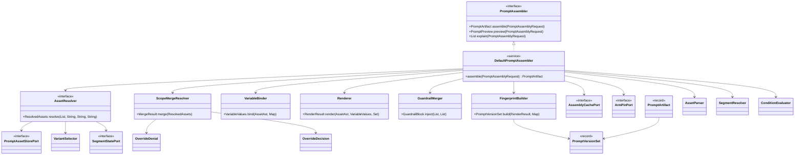
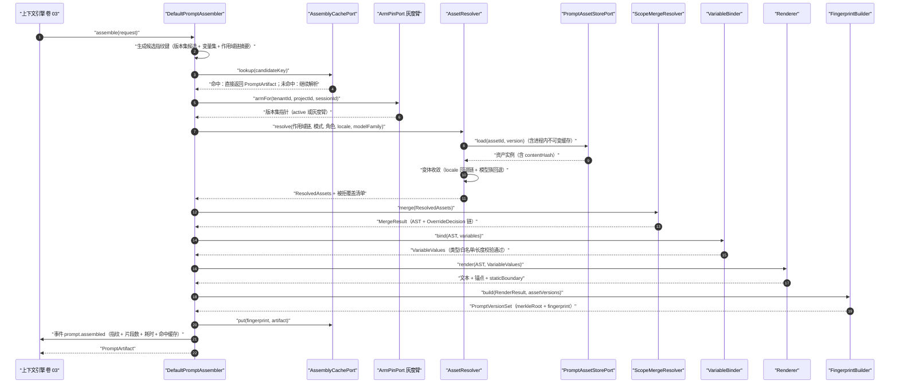
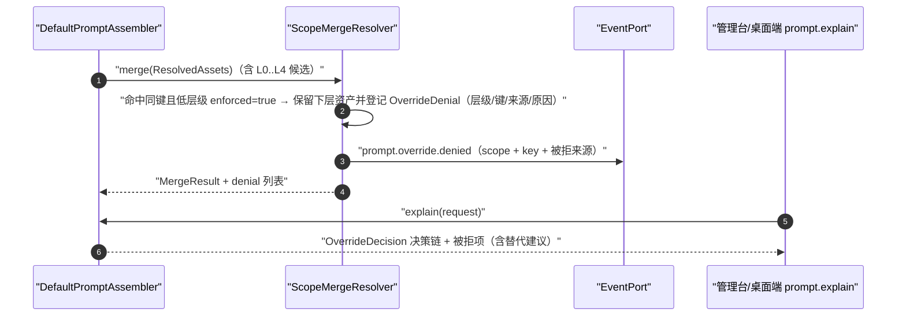
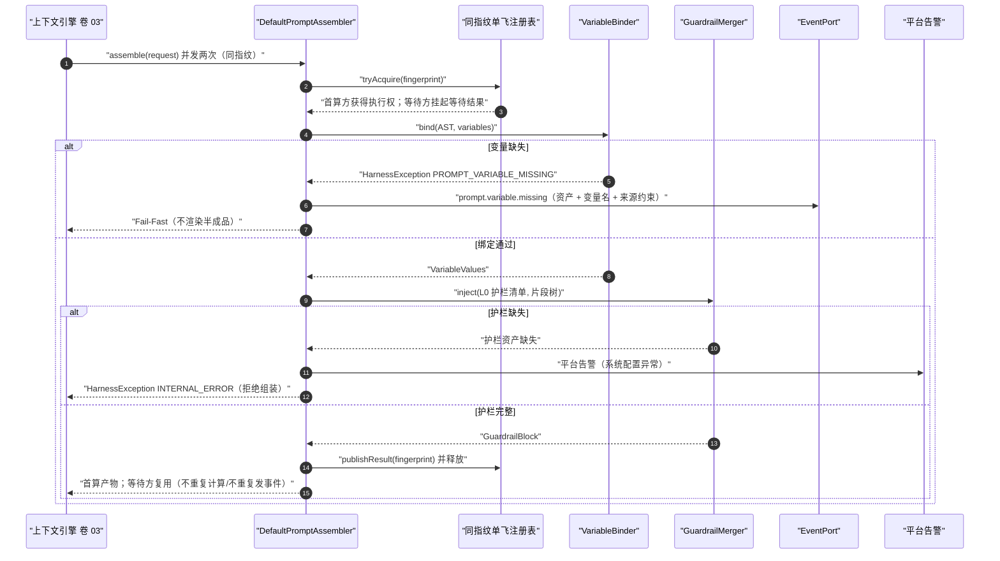
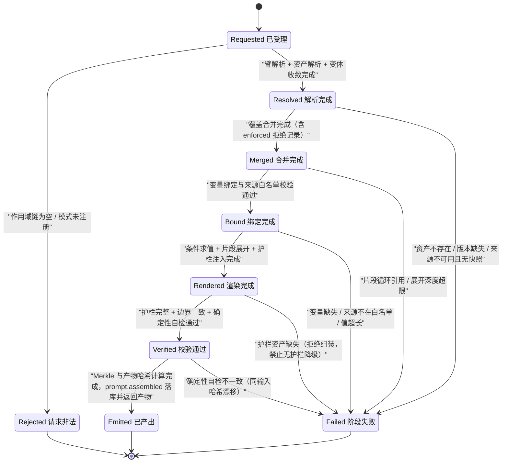

# C05 · PromptAssembler（提示词组装器）组件级实现方案

> 组件编号 C05 ｜ 组件别名 PromptAssembler（提示词组装器）｜ 归属域 内核与智能层（PRM）｜ 清单条目 K-11 的组装半边（存储与发布半边见 K-12）
> 上游系统方案：`impl/04-prompt-manager-impl.md` §1（范围与落地核对）、§3（I-PRM-2/4/5 比选）、§5（类图与契约）、§6.2（会话组装时序）、§7（状态机）、§8（表/Key/事件）、§10（性能/降级/安全）｜上游契约：卷 04 `04-prompt-system.md`（D-PRM-1…10）、卷 00 §5.4（REQ-PRM-1…12）、`DECISIONS.md`（H-013 版本化资产 + 组合式组装）
> 编号约定：需求前缀 `REQ-C-PA-n`、组件级决策前缀 `I-C-PA-n`（`PA` = PromptAssembler），与卷 04 的 `REQ-PRM-*` / `I-PRM-*` 互不占用，不写入 `IMPL-DECISIONS.md` 号段
> 依赖修订：沿用 X-84（提示词 6 表批次归位）、X-86（20 步插入「步 2.5 提示词资产最小集」），见 `reviews/R07-scope-build-kernel.md`；新增候补修订见文末「修订建议」（不回改上游文件与台账）
> 竞品证据：`research/competitors/01-claude-code-purpose-built.md`（CX）、`02-opencode.md`（OCTX）、`09-secondary-tier.md`（STX）

---

## ① 定位与边界

### 1.1 本组件解决什么

1. **五阶段确定性流水线**：解析（MD 头 / YAML → 统一 AST）→ 合并（作用域继承 + `enforced` 覆盖判定 + 变体收敛）→ 渲染（变量绑定 + 条件求值 + 片段展开 + 护栏注入 + 溯源锚点）→ 校验（护栏存在、边界一致、确定性自检）→ 快照（片段 Merkle + 产物哈希 + 指纹）（REQ-C-PA-1）。
2. **合并优先级与覆盖解释**：L0_GUARDRAIL < L1_ORG < L2_PROJECT < L3_USER < L4_SESSION 逐层合并，「具体者覆盖宽泛者」；`enforced` 项拒绝覆盖并产出 `OverrideDenial`，支撑 `prompt.explain` 回答「为什么这条生效 / 为什么那次覆盖被拒」（REQ-C-PA-2）。
3. **类型化变量绑定与条件求值**：变量槽位是 AST 显式节点，绑定值经来源白名单与长度校验；条件仅支持声明式谓词（等值/包含/空判断 + 与/或/非），**无任意表达式执行**（REQ-C-PA-3、REQ-C-PA-4）。
4. **片段展开与护栏不可覆盖**：深度上限 + 循环链打印（REQ-C-PA-5）；L0 护栏资产固定注入且不可删除、裁剪或条件跳过，护栏缺失一律拒绝组装、禁止无护栏降级（REQ-C-PA-6）。
5. **指纹与复现**：片段级 Merkle 树 + 产物哈希 + `PromptVersionSet` 指纹进事件流，任意历史会话可一键复现（REQ-C-PA-7）。
6. **变体选择**：多语言回退链（`zh-CN → en-US → default`）与模型族基线变体在**合并期**收敛为唯一胜出变体（REQ-C-PA-8、REQ-C-PA-9）。
7. **分段与指令源三态**：产出 `staticBoundary` 与锚点供卷 03 断点与卷 02 缓存标记投射（REQ-C-PA-10）；`AVAILABLE` / `UNAVAILABLE`（保留上次已接受值）/ `REMOVED`（下发替换声明）三态分离，禁止把「不可用」当「已移除」（REQ-C-PA-11）。
8. **预览与解释**：`preview` 返回逐段来源与变量注入轨迹，不写缓存、不发事件、不影响会话状态（REQ-C-PA-12）。

### 1.2 本组件不解决什么

- **不解决**资产发布、灰度放量、评测门禁、制品签名与漂移开单（C0x PromptManager / K-12 半边，`impl/04` §6.1/§6.3/§6.4）：只消费「灰度臂 → 版本集」解析结果与指令源三态。
- **不解决**上下文区段预算、压缩与缓存断点声明（卷 03）：产出 `PromptArtifact` 交上下文引擎装配进 S1/S2，边界校验只做「不超出卷 03 声明区间」的保守取交集。
- **不解决**记忆/知识内容（卷 10/11）、模型参数与采样（卷 02）、评测集本身（卷 26）；**不做 IO**——资产读取、缓存、时钟、事件发布全部经端口注入，内核 `harness-kernel/kernel-prompt` 零框架、零 SQL、零网络（H-003）。

### 1.3 依赖方向

| 方向 | 依赖 | 契约要点 |
| --- | --- | --- |
| 上游 | 上下文引擎（卷 03）+ 会话运行时（卷 12 / 01） | `PromptAssemblyRequest`（模式、角色、语言、作用域链、变量集、模型族、预算提示）；变量来源限内核上下文/环境/配置，**禁止**工具输出原文直接进入变量集 |
| 上游 | 企业能力（卷 24） | 租户隔离与组织资产不可修改性 |
| 下游 | 上下文引擎 + 事件总线（卷 16）/ 审计（卷 24） | `PromptArtifact`（文本 + 锚点 + 制品哈希 + 边界 + 版本集）；`prompt.assembled`、`prompt.override.denied`、`prompt.variable.missing` 等；侧向仅向模型网关透传 `modelFamily`（D-MDL-1，不读厂商字段） |

## ② 需求清单（REQ-C-PA-1…12）

| ID | 需求描述 | 来源 | 优先级 | 验收要点 |
| --- | --- | --- | --- | --- |
| REQ-C-PA-1 | 五阶段流水线为确定性函数：同 `(版本集, 变量集, 作用域链)` 产出字节级一致产物与一致哈希 | 卷 04 D-PRM-2/§7；`impl/04` REQ-PRM-2/3、I-PRM-2 | P0 | 随机 100 组输入重复渲染，哈希一致率 100% |
| REQ-C-PA-2 | 覆盖继承 L0–L4：`enforced` 拒绝并记录被拒方，决策链可解释 | 卷 04 D-PRM-4/§4.4；`impl/04` REQ-PRM-6、I-PRM-5 | P0 | 12 组冲突矩阵全过；拒绝记录带层级/键/来源/原因 |
| REQ-C-PA-3 | 类型化变量 + 来源白名单 + 超长拒绝 + 缺失 Fail-Fast（禁止渲染半成品） | 卷 04 D-PRM-6；`impl/04` REQ-PRM-4、§5.1 | P0 | 注入用例不被求值；缺参文案含资产与变量名 |
| REQ-C-PA-4 | 条件为声明式谓词（等值/包含/空判断 + 逻辑组合），无表达式执行面 | 卷 04 D-PRM-2/6；`impl/04` §5.1 `ConditionNode` | P0 | 真值表全过；`${}` / SpEL 式串不被求值 |
| REQ-C-PA-5 | 片段展开深度上限与循环引用检测，链路可打印 | `impl/04` §6.2、§10.3；配置 `max-segment-depth` | P0 | 深度 1/8/9 边界用例；深度 9 抛 `PROMPT_SEGMENT_CYCLE` |
| REQ-C-PA-6 | L0 护栏固定注入且不可覆盖；护栏缺失拒绝组装（无护栏降级禁止） | 卷 00 REQ-PRM-11；`impl/04` D-PRM-8、§10.4 | P0 | 10 类攻击用例护栏不被绕过；缺失时 `INTERNAL_ERROR` |
| REQ-C-PA-7 | 片段级 Merkle + 产物哈希 + 指纹进事件流，支撑复现与劣化定位 | 卷 00 REQ-PRM-4；`impl/04` REQ-PRM-9、I-PRM-4 | P0 | 任一片段变更即指纹变化；`prompt.reproduce` 一致 |
| REQ-C-PA-8 | 多语言回退链 `zh-CN → en-US → default`，缺变体不阻断组装 | 卷 04 D-PRM-9；`impl/04` REQ-PRM-10 | P1 | 回退链用例；链尾仍缺用 `default` 并告警 |
| REQ-C-PA-9 | 模型族变体：按 `modelFamily` 选基线，缺变体回退 `default` 并告警 | 竞品 OCTX `session/system.ts` 按 `api.id` 返回 10 套基线 `[E1]`；`impl/04` REQ-PRM-13 | P1 | 切换模型族选中正确基线；回退留痕 |
| REQ-C-PA-10 | 静态/动态分段标记：`staticBoundary` 与卷 03 断点一致，漂移告警 | 竞品 CX `SYSTEM_PROMPT_DYNAMIC_BOUNDARY` 及源码警告 `[E1]`；`impl/04` REQ-PRM-16 | P1 | 边界取值落在卷 03 声明区间内；漂移产生告警 |
| REQ-C-PA-11 | 指令源三态：`UNAVAILABLE` 保留上次已接受值，`REMOVED` 下发替换声明，不得混同 | 竞品 OCTX `Unavailable` vs `Incompatible` 与替换声明 `[E1]`；`impl/04` REQ-PRM-14、§7.2 | P1 | 三态各有用例；不可用不产出不完整内容 |
| REQ-C-PA-12 | 预览与覆盖解释：逐段来源 + 变量注入轨迹 + 与上一版本 diff 摘要 | 卷 04 D-PRM-7；`impl/04` REQ-PRM-12、§9.2 | P2 | 桌面端面板与 CLI 预览各一条路径；预览与正式组装同源同哈希 |

## ③ 关键设计决策（I-C-PA-1…4）

| ID | 维度 | 候选分支 | 选定 | 理由（F/U/S/M 口径） | 回退触发 |
| --- | --- | --- | --- | --- | --- |
| I-C-PA-1 | 覆盖与渲染的先后关系 | B1 渲染期按优先级拼接 / B2 先合并后渲染（单遍） / B3 展开后再覆盖 | **B2 先合并后渲染**（F9/U8/S9/M9 = 88） | 合并产物是 AST，锚点与片段哈希有唯一稳定来源；覆盖决策链可整体导出给 `explain`；避免「展开后覆盖」造成锚点漂移 | 某类跨层级「片段替换片段」语义无法在 AST 表达 → 引入显式 `override` 声明节点（仍不改「先合并后渲染」） |
| I-C-PA-2 | 变量求值落点 | B1 合并期替换成文本 / B2 渲染期按 AST 槽位一次性替换 | **B2 渲染期槽位替换**（F9/U9/S9/M8 = 89.5） | 槽位保留类型与来源元数据，预览可展示「哪个变量进了哪一段」；转义单点实现、幂等可测 | 槽位渲染器 P95 > 15ms（变量 > 200 个）→ 合并期预编译槽位索引表，语义不变 |
| I-C-PA-3 | 指纹输入口径 | B1 源文本哈希 / B2 规范化 AST 哈希 + 产物哈希双层 | **B2 双层（片段规范化 + 产物字节级）**（F9/U8/S8/M9 = 85.5） | 规范化隔离换行/BOM/尾空白噪声（跨平台一致）；产物哈希与缓存键一一对应 | 规范化规则与存储端（`content_hash`）口径冲突 → 以存储端为准并升级规范化版本号 |
| I-C-PA-4 | 变体选择时机 | B1 渲染期逐段回退 / B2 合并期收敛唯一胜出变体 + 回退链轨迹 | **B2 合并期收敛**（F8/U9/S8/M9 = 85.5） | 单选一次、可解释（回退链进预览）；渲染期不二次选择 → 确定性不受 Map 迭代序影响 | 变体维度增至 >3 维（locale/family/租户基线）导致组合爆炸 → 变体键收敛为单一 `variantKey` 复合键 |

**I-C-PA-1 展开说明**：合并的输入不是「模板 + 片段」两段，而是五类资产的统一键空间 `(kind, name)`；同键跨层才构成覆盖，跨 `kind` 复用只允许模板显式引用片段（`ref` 节点），引用在合并之后展开——这是「片段可跨模板复用」与「覆盖可解释」同时成立的前提。

## ④ 类图



```java
/**
 * 提示词组装器：五阶段流水线（解析 → 合并 → 渲染 → 校验 → 快照）。
 * 面向上下文引擎的唯一组装入口；纯本地计算（资产/缓存/时钟经端口注入），
 * 同一 `(版本集, 变量集, 作用域链)` 必须产出字节级一致产物。
 */
public interface PromptAssembler {

    /**
     * 组装提示词制品。
     *
     * @param request 组装请求（模式、角色、语言、作用域链、变量集、模型族；作用域链不得为空）
     * @return 提示词制品（文本 + 溯源锚点 + 制品哈希 + 静态/动态边界 + 版本集）
     * @throws HarnessException 变量缺失（`PROMPT_VARIABLE_MISSING`）、片段循环（`PROMPT_SEGMENT_CYCLE`）、
     *                          护栏资产缺失（`INTERNAL_ERROR`，拒绝组装且不做无护栏降级）时抛出
     */
    PromptArtifact assemble(PromptAssemblyRequest request);

    /**
     * 渲染预览：逐段来源、变量注入轨迹与被拒覆盖清单；不写缓存、不发事件、不影响会话状态。
     *
     * @param request 组装请求（必填）
     * @return 预览结果；集合类字段为空时返回空集合，不返回 null
     */
    PromptPreview preview(PromptAssemblyRequest request);

    /**
     * 解释覆盖关系：回答「为什么这条生效 / 为什么那次覆盖被拒绝」。
     *
     * @param request 组装请求（必填）
     * @return 覆盖决策链（含被拒项与原因码）；无覆盖时返回空列表
     */
    List<OverrideDecision> explain(PromptAssemblyRequest request);
}

/**
 * 组装阶段枚举：失败态保留阶段定位，供事件、日志与预览面板解释。
 * `code` 入事件与指标标签，`desc` 仅用于界面展示（DB 与事件只存 code）。
 */
@Getter
@RequiredArgsConstructor
public enum AssemblyPhaseEnum {
    RESOLVE("RESOLVE", "作用域与变体解析"),
    MERGE("MERGE", "覆盖合并"),
    BIND("BIND", "变量绑定"),
    RENDER("RENDER", "条件求值与渲染"),
    VERIFY("VERIFY", "校验（护栏/边界/确定性）"),
    SNAPSHOT("SNAPSHOT", "指纹与快照");

    private final String code;
    private final String desc;

    /**
     * 按 code 反查阶段。
     *
     * @param code 阶段编码（必填，取值见枚举项）
     * @return 对应阶段
     * @throws HarnessException 编码未知时抛出（`INVALID_ARGUMENT`）
     */
    public static AssemblyPhaseEnum of(String code) {
        // 遍历枚举比对 code，未命中抛统一业务异常（禁止返回 null、禁止裸 IllegalArgumentException）
        throw new HarnessException(ErrorCode.INVALID_ARGUMENT, "未知组装阶段：" + code);
    }
}
```

## ⑤ 核心流程时序图

### 5.1 主路径：会话组装（五阶段 + 指纹 + 事件）

前置：会话已选模式/角色，作用域链已解析，`PromptAssemblyRequest` 含完整变量集与 `modelFamily`；灰度臂可解析。
主路径：臂解析 → 资产解析（含变体收敛与三态读取）→ 合并（含 enforced 拒绝）→ 绑定 → 条件求值 → 渲染（护栏 + 锚点 + 边界）→ 校验 → 指纹 → 事件。
异常补偿：变量缺失/循环引用在对应阶段 Fail-Fast，已产生的拒绝记录随事件一并落库；护栏缺失在 VERIFY 阶段拒绝（不做降级）。
幂等与并发：产物按 `fingerprint` 缓存（确定性保证可复用）；同 `fingerprint` 并发组装以「单飞 + 发布者写入」收敛，重复计算不产生第二条 `prompt.assembled`。



### 5.2 覆盖冲突：`enforced` 拒绝与解释链

前置：高层级（如 L2_PROJECT）资产与低层级已生效资产同键；低层级资产 `enforced=true` 或属 L0 护栏。
主路径：合并阶段逐层判定 → 拒绝并被记录 → 组装继续（拒绝不阻断本次组装）→ `prompt.explain` 返回决策链与被拒项。
异常补偿：拒绝记录写入失败仅告警（不影响组装结果，审计补齐走事件重放）；同一键被拒多次只累积记录、不去重。
幂等与并发：拒绝记录以 `(sessionId, key, L2 来源 assetId, version)` 幂等；并发组装各自产生独立记录，聚合由事件消费者完成。



### 5.3 异常与并发：变量缺失 Fail-Fast、同指纹单飞、护栏缺失拒绝

前置：请求来源受限于注册来源（内核上下文/环境/配置）；同会话组装处在上下文引擎装配锁内。
主路径：绑定阶段先做契约校验（缺失即抛）→ 并发命中同一 `fingerprint` 时等待首算结果 → 校验阶段发现护栏缺失即拒绝。
异常补偿：变量缺失抛 `PROMPT_VARIABLE_MISSING` 并落事件，调用方补参后重试；护栏缺失抛 `INTERNAL_ERROR` 并平台告警（禁止降级）；循环引用打印链路供作者修复。
幂等与并发：单飞锁按 `fingerprint` 粒度（不是全局锁），失败即释放；等待方在首算失败时改为自行计算一次（最多两次，防雪崩），两次失败直接上抛。



## ⑥ 状态机：单次组装执行相位

一次组装是「有阶段语义的短事务」：相位只前进不回退，任一阶段失败进入 `FAILED` 并保留阶段定位；`REJECTED` 与 `FAILED` 的区别是「请求非法不可重试」与「阶段失败（按 error.retryable 分类）」。



迁移要点：`Failed` 携带 `AssemblyPhaseEnum` 与 `ErrorCode`，`retryable=true` 的失败（如来源暂不可用）由调用方决定是否重试；`Emitted` 之后不允许再修改产物（不可变 record）；`Rejected` 不产生缓存与事件（避免污染指纹统计）。

## ⑦ 接口与依赖矩阵

| 接口 / 端口 | 类型 | 方向 | 落点 | 契约要点 |
| --- | --- | --- | --- | --- |
| `PromptAssembler` | 内核服务 | 出（对卷 03/12） | `kernel-prompt` | `assemble` / `preview` / `explain` 三方法，签名见 §④ |
| `AssetResolver` | 内核端口 | 入（平台实现） | `platform-persistence` 适配 | 作用域链 + 变体 + 灰度臂 → `ResolvedAssets`；进程内不可变缓存按 `(assetId, version)` |
| `AssemblyCachePort` | 内核端口 | 入（平台实现） | `platform-runtime-store` | 产物缓存键 = `fingerprint`；TTL 与容量见 `artifact-cache-entries` |
| `ArmPinPort` | 内核端口 | 入（平台实现） | `platform-runtime-store` | 灰度臂会话级钉住（对齐 `oc:prm:gray:{tenantId}:{bucketKey}`），返回版本集指针 |
| `SegmentStatePort` | 内核端口 | 入（平台实现） | 待归属（见修订建议 R-2） | 指令源三态读取；`UNAVAILABLE` 必须返回上次已接受值 |
| `EventPort` | 内核端口 | 出 | `host-bootstrap` 装配 | `prompt.assembled` / `prompt.override.denied` / `prompt.variable.missing` / `prompt.segment.*` / `prompt.fingerprint.mismatch` |
| `prompt.preview` / `prompt.explain` / `prompt.fingerprint` / `prompt.reproduce` | 会话协议 | 出（外壳） | `host-protocol` | JSON-RPC；错误码 `PROMPT_VARIABLE_MISSING`、`PROMPT_SEGMENT_CYCLE`、`PROMPT_ASSET_NOT_FOUND`、`PROMPT_FINGERPRINT_MISMATCH` |
| `/api/v1/prompts/assets` 等管理面 | REST | 出（外壳） | `host-protocol` | 资产与发布管理（C0x 半边）；组装器只读资产，不暴露写端点 |

配置（`open-coding.prompt.*`，与组装直接相关项；完整字段见 `impl/04` §9.4）：`guardrail-assets`（必填，缺失启动失败）、`locale-fallback-chain`（默认 `zh-CN,en-US,default`）、`variable-value-max-chars`（默认 8000）、`max-segment-depth`（默认 8）、`artifact-cache-entries`（默认 512）、`parse-cache-entries`（默认 1024）。环境变量 `PROMPT_GUARDRAIL_ASSETS` 经 `${ENV:default}` 注入并同步 `.env.example`；本组件不持有任何密钥明文。

扩展点（对齐卷 18 目录）：`AssetSourceSPI`、`FragmentProviderSPI`、`AssemblyStageSPI`（试验）、`ModelFamilyPromptSPI`（试验，REQ-C-PA-9）。`AssemblyStageSPI` 插入的阶段**不得**改变五阶段顺序，也不得绕过护栏注入与指纹计算。

## ⑧ 关键算法

### 8.1 合并优先级（ScopeMergeResolver）

1. 候选收敛：对每个 `(kind, name)` 收集 L0–L4 候选，先按 `VariantSelector` 收敛为「每层至多一个」（locale 回退链优先，其次模型族回退，最后 `default`）。
2. 逐层合并（自 L0 向上）：`resolved[key]` 已存在且 `enforced=true`（或 `scope=L0_GUARDRAIL`）时 → 记 `OverrideDenial{scope, key, source, reason=ENFORCED}` 并保留下层；否则更高层（更具体）覆盖，记 `OverrideDecision{key, from, to, layer}`。
3. 合并产物为结构合并（AST 节点级）：片段引用在合并完成后展开一次；合并复杂度 O(Σ候选)，无 IO。
4. 同层同键重复由存储唯一约束 `(tenant_id, kind, name, locale, scope)` 兜底（`impl/04` §8.1），运行期不再做「同层择一」的隐式决策（保证确定性）。

### 8.2 渲染确定性规范（Renderer）

- 遍历顺序固定：`scope 由低到高 → kind 声明序 → name 字典序`，禁止任何 Map 迭代序参与输出；`kernel-prompt` 静态检查禁止 `java.util.Random`、`System.currentTimeMillis`、`Math.random` 与文件系统/网络读取（时间戳只能经 `AssemblyClock`，且只进事件、不进文本）。
- 文本规范化（输入侧，一次）：剥离 UTF-8 BOM → 行尾统一 `LF` → `NFC` 归一化 → 段尾空白裁剪；渲染输出不再二次改写（`artifactHash` 与 `text` 一一对应）。
- 变量渲染：布尔渲染 `true|false`；时间类变量必须由请求显式携带（`VariableValues`），渲染器不读取系统时钟；枚举变量渲染 `desc`（面向模型的中文），事件与日志只记 `code`——`desc` 变更属资产变更，须走同一发布门禁（防止语义悄悄漂移）。
- 值转义：仅对「变量值」做一次性分隔符转义（落入围栏/结构化段时按实体转义），资产文本本身不参与转义；转义函数为纯函数，幂等由「单次进入渲染」保证。

### 8.3 指纹算法（片段级 Merkle + 产物哈希）

- 叶节点：`leaf_i = SHA-256(utf8(assetId + "@" + version + "#" + locale + "#" + family + LF + norm(segment)))`。
- 内部节点：按序两两 `SHA-256(left ‖ right)`；**奇数节点直接提升**到上一层（不复制自身，避免节点数歧义）；规则固化在常量类，任何实现不得改（否则指纹漂移）。
- `artifactHash = SHA-256(utf8(text))`；`fingerprint = SHA-256(utf8(merkleRoot + "|" + joined + "|" + artifactHash))`，其中 `joined` 为 `assetId@version:contentHash` 按字典序以 `;` 连接（与 `impl/04` §5.2 公式一致，本组件补充规范化与分隔符细节）。
- 片段哈希可并行计算（结构化并发 `SessionScope`，见 `impl/01` I-ARC-3；不使用 JDK preview API）。

### 8.4 静态/动态边界与分段校验

- 变量来源分两类：稳定（会话/项目/租户配置、环境、版本集常量）与易变（时间、回合计数、上下文摘要指针、记忆命中结果）。
- `staticBoundary` 取「最后一个稳定片段结束」的字符偏移；其后片段若依赖稳定变量或条件依赖稳定变量 → 判漂移：告警并把该片段移出静态前缀（保守降级，仍渲染，不阻断）；同时 `staticBoundary` 必须落在卷 03 声明的稳定前缀区间内，超出时取 `min(自算边界, 声明断点偏移)`（漂移事件见修订建议 R-3）。

## ⑨ 错误处理与降级

| 错误场景 | ErrorCode | retryable | 用户可见文案（脱敏后） | 恢复动作 |
| --- | --- | --- | --- | --- |
| 变量缺失（绑定阶段 Fail-Fast） | `PROMPT_VARIABLE_MISSING` | 否 | 「提示词变量 `<name>` 缺失（来源约束：`<sources>`），请补充后重试」 | 调用方补参；不渲染半成品，落 `prompt.variable.missing` |
| 片段循环引用 / 深度超限 | `PROMPT_SEGMENT_CYCLE` | 否 | 「片段存在循环引用，链路：`<a → b → a>`」 | 作者修复引用链；拒绝组装并打印链路 |
| 指令源读失败 | `PROMPT_SEGMENT_UNAVAILABLE` | 是 | 「指令来源暂不可用，已保留上次已接受内容」 | 保留上次已接受值 + 事件；来源恢复后自动渲染 |
| 指令源被显式移除 | `PROMPT_SEGMENT_REMOVED` | 否 | 「项目指令已被移除，已下发替换声明」 | 下发替换声明；禁止与「不可用」混同 |
| 护栏资产缺失（VERIFY 阶段） | `INTERNAL_ERROR` | 否 | 「系统配置异常（安全护栏缺失），请联系管理员」 | 拒绝组装 + 平台告警；禁止无护栏降级 |
| 资产 / 版本不存在 | `PROMPT_ASSET_NOT_FOUND` | 否 | 「提示词资产不存在：assetId=`<id>`」 | 管理面列出可用版本；请求侧修正标识 |
| 覆盖被拒（`enforced` 层级） | `PROMPT_OVERRIDE_DENIED` | 否 | 「该资产为强制项，覆盖请求已被拒绝（层级：`<scope>`）」 | 记录 `prompt.override.denied`；作者改用途或申请更高层级 |
| 确定性自检不一致 / 预览与正式产物哈希不一致 | `PROMPT_FINGERPRINT_MISMATCH` | 是（自检重算一次；预览不一致不重试） | 「提示词指纹与记录不一致，已告警」 | 重算；仍不一致则冻结该版本集并人工介入（预览必须与组装同源，不一致即缺陷单） |

异常层带（对齐 `impl/README.md` §5.5）：本组件属**内核层**，业务失败一律抛 `HarnessException(ErrorCode, 中文文案)`，禁止裸 `RuntimeException` / `IllegalArgumentException`；外壳的 `prompt.preview` 端点失败由 `BusinessException(ErrorCode)` 承接；全局处理器按 `ErrorCode` 统一映射，业务代码不得 try-catch 后自行包装返回。

## ⑩ 性能与并发

| 指标 | 目标 | 说明 |
| --- | --- | --- |
| 组装耗时 | P50 ≤ 8ms / P95 ≤ 30ms（缓存命中）；首次未命中 P95 ≤ 120ms | 含资产加载；超限先查缓存命中率再查规范化解码 |
| 指纹计算 | P95 ≤ 5ms（片段 ≤ 300） | 片段哈希可并行；Merkle 拼接为纯计算 |
| 单实例吞吐 / 内存 | ≥ 2000 次/秒/核（片段 ≤ 300） | 纯本地计算、无网络；产物缓存 512 条 ≈ 20MB、AST 缓存 1024 条 ≈ 10MB（上限均配置化，防内存膨胀） |
| 发布/回滚后可见性 | 发布 ≤ 5s、回滚 ≤ 60s（紧急路径 ≤ 5s） | 事件驱动缓存失效（C0x 半边）；组装只读缓存 |

并发要点：组装在调用方虚拟线程内执行；同 `(assetId, version)` 资产对象为不可变值对象（并发只读）；同 `fingerprint` 单飞（§5.3），失败即释放，等待方最多自算一次；缓存写入为「发布者写入」（首算方），避免惊群；`preview` 不写缓存、不加单飞锁（只读快照），保证面板高频调用不干扰主链路。

## ⑪ 测试要点

| 层级 | 用例 | 断言要点 |
| --- | --- | --- |
| 单元 | 确定性（随机 100 组输入 × 重复渲染 3 次） | 产物字节级一致；`artifactHash` 与 `fingerprint` 一致率 100% |
| 单元 | 覆盖矩阵（L0–L4 冲突 12 组 + `enforced` 拒绝） | 具体者覆盖宽泛者生效；拒绝项含层级/键/来源/原因 |
| 单元 | 变量契约（缺失 / 类型不符 / 来源非白名单 / 超长） | 均 Fail-Fast；文案含资产与变量名；不产生半成品 |
| 单元 | 条件语义与片段展开（深度 1/8/9、循环链） | 真值表全过；深度 9 抛 `PROMPT_SEGMENT_CYCLE` 且链路可打印 |
| 单元 | 注入用例（变量值含分隔符/伪锚点/伪指令/`${}`） | 全部以数据形式呈现；护栏与指令边界不被突破 |
| 单元 | 规范化与指纹（换行 CRLF/BOM/NFC/尾空白） | 跨平台输入产出一致指纹；任一片段变更即根变化 |
| 契约 | `preview` 与 `assemble` 同源 | 同请求下预览分段哈希与正式产物片段哈希逐段一致 |
| 集成 | 指令源三态（读失败 / 显式移除 / 快照不可解码） | `UNAVAILABLE` 保留上次值；`REMOVED` 下发替换声明；不混同 |
| 集成 | 同指纹并发（8 并发同请求）+ 复现链路（`prompt.fingerprint` / `prompt.reproduce`） | 只计算一次、只发一条 `prompt.assembled`；历史任意轮次指纹一致，不一致发 `prompt.fingerprint.mismatch` |
| 性能 | `-Pbench-prompt`（20000 次组装） | P95 ≤ 30ms（命中）/ ≤ 120ms（未命中）；命中率 ≥ 95% |

```bash
# 门禁映射（卷 27 §4.6）：第 1 条 →「单元测试 + 覆盖率门」；第 2 条 →「集成测试」；第 3 条 →「契约测试」；第 4 条 →「性能基准（抽样）」
mvn -pl harness-kernel/kernel-prompt -am test -Dtest='PromptAssembly*Test,VariableContract*Test,Fingerprint*Test,ScopeMerge*Test' -DfailIfNoTests=false
mvn -pl harness-platform/platform-persistence -am test -Dtest='PromptReleaseIT,PromptPreviewIT' -DfailIfNoTests=false
mvn -pl harness-host/host-bootstrap -am verify -Pbench-prompt -Dbench.assemblies=20000
```

---

## 修订建议（本组件登记，待编排方分配 `X-n`）

| 候补号 | 建议 | 依据 | 影响面 |
| --- | --- | --- | --- |
| R-1（候补 X-90） | `PromptArtifact` 的 `staticBoundary` 为单值 `int`，不足以表达多缓存断点（Anthropic `cache_control` 至多 4 个；`impl/02` 的 `CacheMarkerBlock.stablePrefixSegmentIndex` 已按多断点设计）→ 建议契约增加 `List<CacheBreakpoint> cacheBreakpoints`（主断点即当前 `staticBoundary`，向后兼容） | `impl/04` §5.2 vs `impl/02` §5.1 | `harness-contract`、卷 03 断点声明、卷 02 标记投射 |
| R-2（候补 X-91） | 指令源三态中「上次已接受值」缺存储与端口归属：`impl/04` §7.2 定义语义，§8.1 六表与 §8.2 Key 均无承载 → 建议新增 `SegmentStatePort` 实现归属（候选：新表 `oc_prompt_segment_state` 或 Redis `oc:prm:segment:{key}`，TTL 与会话同寿命）并补入表族（与 X-84 批次一并裁决） | `impl/04` §7.2/§8.1/§8.2 | `platform-persistence`、X-84 表族、B6 迁移批次 |
| R-3（候补 X-92） | 边界漂移缺判定输入与事件类型：`impl/04` §8.4 事件清单无 `prompt.boundary.drift`，且「变量来源稳定性清单」无归属（决定静态前缀边界）→ 建议在 `harness-contract` 定义 `VariableSource`（STABLE/VOLATILE）白名单枚举 + 新增 `prompt.boundary.drift` 事件 | `impl/04` REQ-PRM-16/§10.8-4 | `harness-contract`、卷 03 断点校验、事件 Schema 注册 |
| 无需修订（记录） | §④ 中 `AssemblyPhaseEnum` 与 `MergeResult`/`RenderResult`/`GuardrailBlock` 等中间结构为组件内新增实现件，不改动任何系统级契约；`ScopeMergeResolver`/`VariantSelector` 沿用 `impl/04` 已命名件；`SegmentStatePort` 的最终归属以 R-2 裁决为准 | 本文件 §④/§7 | 仅 `kernel-prompt` 内部 |
