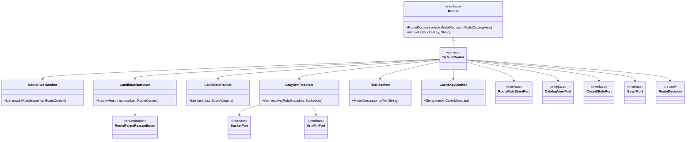
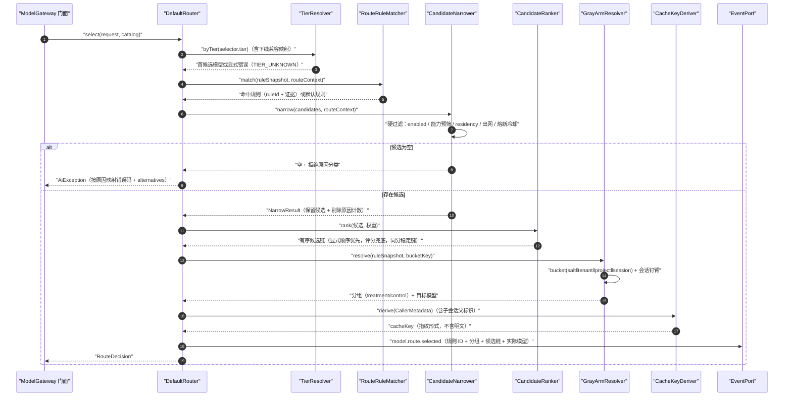
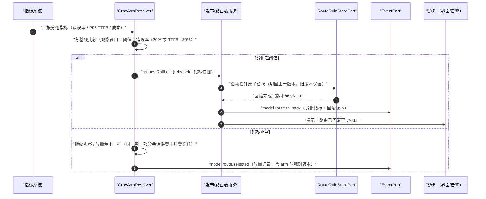
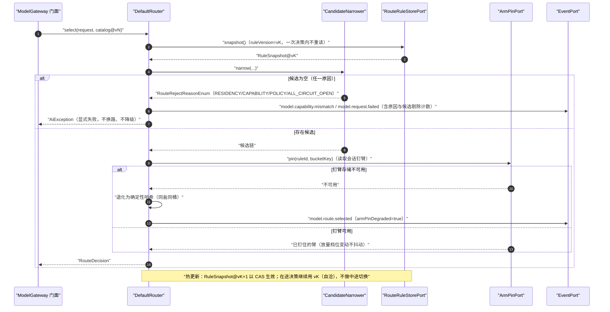
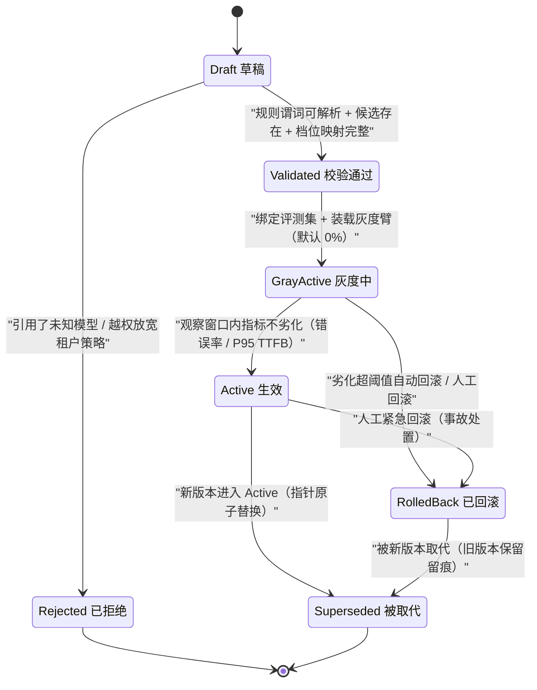

# C06 · ModelRouter（模型路由与选择）组件级实现方案

> 组件编号 C06 ｜ 组件别名 ModelRouter（模型路由与选择）｜ 归属域 内核与智能层（MDL）｜ 清单条目 K-01 门面内的内核 `Router` 件（能力位归属 K-03，目录归属 K-06）
> 上游系统方案：`impl/02-model-gateway-impl.md` §1（范围/落地核对）、§3.6（I-MDL-6 重试与换路）、§4（架构图）、§5（类图与内核契约）、§6.1/§6.4（调用与灰度时序）、§7（调用与熔断状态机）、§8（表/Key/事件）、§9.5（配置）、§10.2/§10.4（性能与降级）｜上游契约：卷 02 `02-model-gateway.md`（D-MDL-5/6/13）、`DECISIONS.md`（H-003/H-005）、`agents.md` 第四节（重试只认 `ErrorCode.retryable`、不做 fallback 链）、附录 D（K-01/K-03/K-06；K-40 `LocalModelRouter` 为 F-05 原型，独立组件，本组件只消费其产出的本地端点描述符）
> 编号约定：需求前缀 `REQ-C-MR-n`、组件级决策前缀 `I-C-MR-n`（`MR` = ModelRouter），与卷 02 的 `REQ-MDL-*` / `I-MDL-*` 互不占用，不写入 `IMPL-DECISIONS.md` 号段
> 竞品证据：`research/competitors/07-qoder.md`（档位抽象与 `ContextMetadata` 归因字段 `[E1]/[E2]`）、`03-codex.md`（单 wire 收敛的反面证据 `[E1]`）、`02-opencode.md`（`promptCacheKey` 会话派生 `[E1]`）
> 纪律：候选分支与结论均落在 `I-MDL-6` / D-MDL-6 范围内；与 `impl/02` 或台账口径不一致之处一律在文末登记修订建议，不回改上游文件

---

## ① 定位与边界

### 1.1 本组件解决什么

1. **规则路由**：声明式条件（任务类型 / 复杂度 / 上下文窗口需求 / 成本上限 / 租户 / 驻留要求）匹配 → 有序候选链；命中规则 ID 与证据进入决策结果，可解释（REQ-C-MR-1）。
2. **候选硬过滤（收窄）**：`enabled`、出网策略与数据驻留、能力预筛（多模态 / 工具 / 结构化输出 / 长窗口）、熔断冷却、租户策略——策略只可收窄，放宽即 `POLICY_OVERRIDE_DENIED` 并留痕（REQ-C-MR-2、REQ-C-MR-7）。
3. **候选软排序**：规则显式顺序优先；未声明顺序时按确定性评分（能力匹配 / 成本 / 窗口 / 延迟分位）排序，同分按 `(providerId, modelId)` 字典序稳定落位——**禁止随机**（REQ-C-MR-9）。
4. **稳定分桶灰度**：`bucket(salt‖tenant‖project‖session) mod 10000`，盐由规则版本固化；会话级钉臂保证放量档位变动时不抖动；劣化自动回滚 = 活动版本指针原子替换（REQ-C-MR-3）。
5. **Tier 档位解析**：`Auto / Ultimate / Performance / Efficient` → 模型映射与下线兼容映射（≥1 版本过渡），headless 与 UI 处置一致（REQ-C-MR-8）。
6. **决策产出与留痕**：`RouteDecision`（实际模型 + 凭证引用 + 候选链 + 命中规则 + 分组 + cacheKey + residency）与 `model.route.selected` 等事件（REQ-C-MR-10）。
7. **单次决策的一致性快照**：规则表 / 目录 / 熔断视图在**同一次决策内**固定为同一 `(ruleVersion, catalogVersion)` 快照，避免「规则与目录各读一个版本」的决策撕裂（REQ-C-MR-12）。

### 1.2 本组件不解决什么

- **不做执行期隐式换路（无 fallback 链）**：一旦选定并已发起调用，失败只按 `ErrorCode.retryable` 重试或上抛（I-MDL-6、D14）；「回退」只存在于**路由期候选链**。唯一例外：租户显式开启执行期换路且「事件留痕 + 预算重算 + UI 提示实际模型」三条件同时满足（`impl/02` §3.6）。
- **不做能力最终校验**：本组件只做**预筛**（避免选中明显不可用候选）；选后由 `CapabilityMatrix` 做终校验，失败抛 `UNSUPPORTED_CAPABILITY` + `alternatives`（D-MDL-5、REQ-MDL-19）。门面在「显式指定模型」时先行校验的顺序不变（`impl/02` §6.1）；未显式指定时以「预筛 → 选后终校验」为准，本文件不改变既有顺序语义。
- **不实现**装饰器链（预算/限流/脱敏/审计/重试/观测/计量，K-04 半边）、端点熔断器（只读熔断状态视图）、凭证明文解析（只选 `credentialRef`，句柄由 `SecretLease` 注入）、目录同步（K-06）、协议适配（K-02）。
- **不做配额准入与预算裁决**（卷 24/26，`BudgetService` 在装饰器层）：路由只读「成本上限」作为过滤/排序输入。
- **不预装、不探测本地运行时**（K-40 `LocalRuntimeProbe`）：本地端点与自建网关在目录中与云端点同权参与路由（REQ-C-MR-7）。

### 1.3 依赖方向

| 方向 | 依赖 | 契约要点 |
| --- | --- | --- |
| 上游 | 门面 `ModelGateway`（内核） | `ModelRequest`（含 `ModelSelector`、预算信封、`CallerMetadata`）与 `ModelCatalogView` 作为入参；路由先于装饰器链执行（`impl/02` §4 顺序：能力校验 → 路由 → 装饰器链） |
| 上游 | 模型目录（K-06 `ModelCatalogSync`） | `ModelCatalogView`（`catalogVersion` + `ModelDescriptor`：能力位 / 窗口 / 定价 / `residency` / `promptFamily`），事件热更新、只读 |
| 上游 | 企业策略（卷 24）+ 租户配置 | 租户策略只可收窄；越权放宽抛 `POLICY_OVERRIDE_DENIED` 并留痕 |
| 侧向 | 端点熔断器（装饰器链 K-04 / 平台状态） | 只读 `CircuitStatePort`（端点 → 状态 + 冷却剩余）；冷却期内不重试 |
| 下游 | 装饰器链 / 成本看板（卷 31）/ 审计（卷 24） | `RouteDecision` 驱动凭证句柄与预算；`model.route.selected` / `model.route.rollback` 支撑灰度对比与回滚 |

## ② 需求清单（REQ-C-MR-1…12）

| ID | 需求描述 | 来源 | 优先级 | 验收要点 |
| --- | --- | --- | --- | --- |
| REQ-C-MR-1 | 规则路由：条件匹配 → 有序候选链；命中规则与证据可解释 | 卷 02 D-MDL-6；`impl/02` §1.1-6、§8.1 `oc_route_rule`、REQ-MDL-12 | P1 | 规则数 ≤ 200 时命中唯一且可复现；无命中走默认模型 |
| REQ-C-MR-2 | 租户策略只可收窄；放宽请求拒绝并留痕 | 卷 02 D-MDL-6；`impl/02` §10.5-3、REQ-MDL-12 | P0 | 越权放宽返回 `POLICY_OVERRIDE_DENIED`；证据与规则 ID 入库 |
| REQ-C-MR-3 | 稳定分桶灰度：同输入同桶可复现；劣化自动回滚留痕并保对照 | 卷 02 D-MDL-13；`impl/02` §6.4、REQ-MDL-13 | P1 | 同键 100 次同桶；回滚发 `model.route.rollback` |
| REQ-C-MR-4 | 换路仅在路由期声明；执行期不做 fallback 链 | `impl/02` I-MDL-6/§3.6；AGENTS.md 第四节（D14） | P0 | 故障注入：不可重试错误不产生额外调用（成本可断言） |
| REQ-C-MR-5 | 降级/重试判定只认 `ErrorCode.retryable`（路由不因错误重新选路） | `impl/02` §10.7、REQ-MDL-9；D14 | P0 | 重试序列内模型与幂等键恒定；路由不被错误回调触发 |
| REQ-C-MR-6 | 能力预筛 + 终校验分工；不支持即显式失败并给 `alternatives`，不静默降级 | 卷 02 D-MDL-5/§4.2；`impl/02` REQ-MDL-3/19 | P0 | 预筛剔除项记录原因；终校验失败映射 `UNSUPPORTED_CAPABILITY` |
| REQ-C-MR-7 | 私有化与驻留：本地端点/自建网关一等公民；`residency` 过滤；air-gapped 装配期剔除外部 provider | 卷 02 REQ-MDL-12；`impl/02` REQ-MDL-14/§10.5-3 | P0 | 驻留不匹配候选被剔除并留痕；装配期门控可见 |
| REQ-C-MR-8 | Tier 档位解析与下线兼容映射；headless 与 UI 处置一致 | 竞品 07-qoder `[E2]` Lite 下线 headless 报错；`impl/02` REQ-MDL-20 | P1 | 未知档位 → 显式错误 + 兼容映射建议；映射表有主 |
| REQ-C-MR-9 | 路由决策 ≤ 2ms P95（规则 ≤ 200）且决策事件完整 | `impl/02` §10.2/§8.3 | P0 | 基准门禁通过；`model.route.selected` 含规则 ID/分组/候选链 |
| REQ-C-MR-10 | cache key 由会话派生（含子会话父标识）随决策下发，父子会话不串味 | 竞品 02-opencode `promptCacheKey` + `x-session-affinity` `[E1]`；`impl/02` REQ-MDL-17 | P1 | 同会话跨轮 cache key 恒定；父子 cache key 负向用例不互撞 |
| REQ-C-MR-11 | 端点可用性参与候选过滤：冷却期快速失败并给出剩余时间 | `impl/02` §7.2/§10.4 | P1 | 含 `retryAfter` 语义的文案；冷却期内不重试 |
| REQ-C-MR-12 | 四协议原生并存：路由按 `ProtocolFamily` 选择适配器族，不收敛为单一 wire | 竞品 03-codex `WireApi` 单变体反面证据 `[E1]`；`impl/02` REQ-MDL-21 | P0 | 适配器矩阵 CI 覆盖四协议；不存在「仅 Responses」收敛 |

## ③ 关键设计决策（I-C-MR-1…4）

| ID | 维度 | 候选分支 | 选定 | 理由（F/U/S/M 口径） | 回退触发 |
| --- | --- | --- | --- | --- | --- |
| I-C-MR-1 | 规则表示 | B1 声明式谓词 AST（配置 + DB 双源、版本化） / B2 脚本/表达式（SpEL 类） / B3 代码注册 | **B1 谓词 AST**（F9/U8/S9/M9 = 88） | 无表达式执行面（与卷 04 `ConditionNode` 同构）；规则可 PR 评审、可灰度、可复现；企业只可收窄 | 谓词表达力不足 → 新增 `RouterRuleSPI` 编译期注册（禁用运行期脚本求值） |
| I-C-MR-2 | 候选排序 | B1 规则显式顺序优先 + 确定性评分兜底 / B2 纯评分模型 / B3 学习型（历史成功率） | **B1**（F9/U8/S8/M9 = 85.5） | 顺序可解释、成本可预测；评分只用于「未声明顺序」的稳定排序，不做执行期切换；学习型列 P3 实验（需卷 26 评测支撑） | 评分权重运维事故（同输入排序漂移）→ 权重冻结为常量 + 告警（可复现优先于最优） |
| I-C-MR-3 | 分桶与钉臂 | B1 确定性哈希 + 会话级钉臂 / B2 仅确定性哈希（允许跨档换臂） / B3 每会话随机 | **B1 钉臂**（F8/U9/S8/M8 = 83） | 放量档位变动时同一会话不抖动（对齐 `impl/04` I-PRM-5 会话稳定口径）；钉臂只存臂 ID，不存业务数据 | 钉臂存储不可用 → 退化为纯确定性哈希（B2）并在事件中标记 `armPinDegraded=true` |
| I-C-MR-4 | 灰度回滚落点 | B1 版本化路由表 + 活动指针原子替换 + 事件驱动刷新 / B2 每请求重算 / B3 人工切表 | **B1**（F9/U8/S9/M9 = 88） | 回滚是元数据操作（秒级、可审计、可留对照）；旧版本保留不删，满足「回滚留痕」 | 指针切换可见性 P95 > 2s → 新旧表并行双读过渡一个版本 |

**I-C-MR-1 展开说明**：路由规则与提示词资产的谓词求值必须共用同一套「无表达式执行」纪律——两域各自自研谓词 AST 会分叉出两套转义/求值语义；本组件以 `harness-contract` 内的谓词节点契约为准（与卷 04 `ConditionNode` 形状一致），由内核实现共享。

## ④ 类图



```java
/**
 * 模型路由器：按规则与租户策略收窄候选、稳定分桶选择目标模型，产出可解释的路由决策。
 * 纯本地计算（规则表 / 目录 / 熔断状态 / 分桶端口注入）；不做执行期换路与 fallback 链（I-MDL-6、D14）。
 */
public interface Router {

    /**
     * 选择本次调用的目标模型。
     *
     * @param request 调用请求（含 `ModelSelector`、预算信封与 `CallerMetadata`；必填）
     * @param catalog 目录视图（同一 `catalogVersion` 的一致快照；必填，空目录即拒绝路由）
     * @return 路由决策（实际模型 + 凭证引用 + 候选链 + 命中规则 + 分组 + cacheKey + residency）
     * @throws AiException 候选全部被硬过滤时按原因抛出（`POLICY_OVERRIDE_DENIED` / `UNSUPPORTED_CAPABILITY` /
     *                     `MODEL_UNAVAILABLE` / `INTERNAL_ERROR`），文案含 `alternatives` 或兼容映射建议
     */
    RouteDecision select(ModelRequest request, ModelCatalogView catalog);

    /**
     * 计算稳定分桶桶号（纯函数：同输入同输出，无 IO）。
     *
     * @param key  分桶键（租户 + 项目 + 会话；项目缺失时以 `sessionId` 兜底并标记降级）
     * @param salt 分桶盐（当前规则版本固化的值；必填）
     * @return 桶号（0–9999）
     */
    int bucket(BucketKey key, String salt);
}

/**
 * 路由拒绝原因：候选全被过滤时的原因分类，决定对外 `ErrorCode`、文案与恢复动作。
 */
@Getter
@RequiredArgsConstructor
public enum RouteRejectReasonEnum {
    NO_MATCHING_RULE("NO_MATCHING_RULE", "无命中规则且未配置默认模型"),
    RESIDENCY_FILTERED("RESIDENCY_FILTERED", "候选全部被数据驻留/出网策略剔除"),
    CAPABILITY_FILTERED("CAPABILITY_FILTERED", "候选全部缺少所需能力"),
    TIER_UNKNOWN("TIER_UNKNOWN", "档位未知或已下线且无兼容映射"),
    POLICY_NARROWED("POLICY_NARROWED", "租户策略收窄后无剩余候选"),
    ALL_CIRCUIT_OPEN("ALL_CIRCUIT_OPEN", "候选端点全部熔断（冷却期快速失败）");

    private final String code;
    private final String desc;

    /**
     * 按 code 反查原因。
     *
     * @param code 原因编码（必填，取值见枚举项）
     * @return 对应原因
     * @throws HarnessException 编码未知时抛出（`INVALID_ARGUMENT`；域内对外失败仍统一抛 `AiException`，此处为纯解析失败）
     */
    public static RouteRejectReasonEnum of(String code) {
        // 遍历枚举比对 code，未命中抛统一异常（禁止返回 null、禁止裸 IllegalArgumentException）
        throw new HarnessException(ErrorCode.INVALID_ARGUMENT, "未知路由拒绝原因：" + code);
    }
}
```

> 拒绝原因 → 对外 `ErrorCode` 的映射是**唯一映射点**：能力与档位类 → `UNSUPPORTED_CAPABILITY`；驻留/熔断/策略类 → `MODEL_UNAVAILABLE`；配置缺失类 → 调用方改抛 `INTERNAL_ERROR`（详见 §⑨ 错误矩阵，禁止在多处重复判定）。

## ⑤ 核心流程时序图

### 5.1 主路径：一次路由决策

前置：门面已完成能力校验前置读取；规则表与目录视图为不可变快照；`CallerMetadata` 含租户/项目/会话（REQ-MDL-18）。
主路径：Tier 解析 → 规则匹配（按优先级取首个命中）→ 硬过滤（能力预筛 / 驻留 / 熔断）→ 软排序 → 分桶与钉臂 → 产出 `RouteDecision` + 事件。
异常补偿：任一硬过滤使候选为空 → 按原因分类抛显式错误（§⑨ 矩阵）；无命中规则 → 用配置默认模型（`routing.default-model`，装配期必填）。
幂等与并发：决策为纯函数（无共享可变状态），规则/目录视图按版本号原子替换；同一会话并发决策结果一致（分桶与候选排序确定）。



### 5.2 灰度放量与劣化自动回滚

前置：灰度臂已放量并绑定评测集；指标源可用；基线（当前活动版本）指标存在。
主路径：指标上报 → 窗口内与基线比较（错误率 / P95 首字节）→ 超阈值触发指针回滚 → 事件 + 通知；未超阈值则逐档放量。
异常补偿：指标源不可用 → 冻结放量（不晋级也不回滚）+ 告警；回滚失败重试并升级人工介入，期间新会话优先走活动版本（保底）。
幂等与并发：回滚以 `releaseId` 幂等；同租户同时只允许一个回滚任务（租户级锁）；指针替换为原子写。



### 5.3 异常与并发：候选全过滤、规则热更新、钉臂降级

前置：规则表热更新事件可到达（`catalog_version` 与 `ruleVersion` 驱动）；钉臂存储可能不可用。
主路径：决策内固定快照 → 硬过滤失败即按原因显式失败 → 热更新期间新旧快照并存（各自自洽）。
异常补偿：`POLICY_NARROWED`（策略收窄至无候选）与 `ALL_CIRCUIT_OPEN`（全熔断）都不得静默换路，只能显式失败或由用户在路由期改选；钉臂不可用 → 退化确定性哈希 + 事件标记。
幂等与并发：切换快照用 CAS（版本号 +1，失败重读）；决策过程中不持锁；同一 `fingerprint` 级的 cacheKey 派生为纯函数。



## ⑥ 状态机：路由规则版本生命周期

路由决策本身**无持久状态**（纯函数：同 `(快照, 请求, 盐)` 必得同决策），有状态的是**规则版本与灰度臂**：版本推进与回滚必须可审计、可留对照。



迁移要点：`RolledBack` 与 `Superseded` 都**不删除**历史版本（对比与审计需要对照）；`Rejected` 必须在装配期或发布校验期产生（启动期 Fail-Fast 优先：规则引用未知模型不得进入运行期）；`GrayActive` 期间放量档位变动不改变已钉臂会话的分组归属。

## ⑦ 接口与依赖矩阵

| 接口 / 端口 | 类型 | 方向 | 落点 | 契约要点 |
| --- | --- | --- | --- | --- |
| `Router` | 内核服务 | 出（对门面/卷 12） | `kernel-model` | `select(ModelRequest, ModelCatalogView)` / `bucket(BucketKey, String)`，签名见 §④ |
| `RouteRuleStorePort` | 内核端口 | 入（平台实现） | `platform-persistence` + 配置 | 双源：配置 `routing.rules[]` 与 DB `oc_route_rule`；DB 优先、配置兜底；`ruleVersion` 单调 |
| `CatalogViewPort` | 内核端口 | 入（平台实现） | `platform-runtime-store` | `ModelCatalogView` 只读快照 + `catalog_version`；空目录禁止路由 |
| `CircuitStatePort` | 内核端口 | 入（平台实现） | `platform-runtime-store` | 只读端点状态与冷却剩余（`oc:mdl:circuit:*`）；冷却期内不重试 |
| `BucketPort` / `ArmPinPort` | 内核端口 | 入（平台实现） | `platform-runtime-store` | 稳定哈希；会话级钉臂（键 `{tenantId, ruleId, bucketKey} → arm`） |
| `TierResolver` | 内核件 | 内部 | `kernel-model` | 档位 → 模型映射；下线兼容映射与 `alternatives` |
| `CacheKeyDeriver` | 内核件 | 内部 | `kernel-model` | cacheKey 由 `CallerMetadata`（含 `sourceSessionId` 父标识）派生，仅输出指纹形式 |
| `EventPort` | 内核端口 | 出 | `host-bootstrap` 装配 | `model.route.selected` / `model.route.fallback` / `model.route.rollback`（`impl/02` §8.3） |
| `/api/v1/routes` CRUD | REST 管理面 | 出（外壳） | `host-protocol` | 规则与灰度定义；权限点 `model.route.manage`；写操作带 `Idempotency-Key`（附录 B.9） |
| `RouterRuleSPI` | 扩展点 | 入 | 卷 18 目录（稳定级） | 企业自定义规则提供者，**只可收窄**；不得引入运行期表达式求值 |

配置（`open-coding.model.routing.*`，沿用 `impl/02` §9.5）：`default-model`（必填）、`rules[]`、`tier-mapping`、`limits.*`、`retry.*`、`circuit.*`；环境变量 `OC_DEFAULT_MODEL` / `OC_MODEL_ROUTE_RULES` / `OC_MODEL_TIERS` 与 `.env.example` 同步。组件级新增配置（评分权重、灰度观察窗口与劣化阈值）见文末修订建议 R-4。

## ⑧ 关键算法

### 8.1 候选收窄流水线（CandidateNarrower）

1. 起点：`TierResolver` 的首候选 + 命中规则的 `candidates[]`（显式声明顺序保留）。
2. 硬过滤（顺序固定，失败即记录原因计数并剔除）：`enabled=false` → 出网策略（air-gapped 档外部 provider 已在装配期剔除）→ `residency` 不匹配 → 能力预筛（请求含 image/audio/video/tool/structuredOutput 时要求对应能力位）→ 熔断冷却中 → 租户策略收窄集之外。
3. 输出：保留候选（可能为空）+ `Map<RouteRejectReasonEnum, Integer>` 剔除计数（进事件，供调优）；复杂度 O(候选数) ≤ O(200)，无 IO。

### 8.2 路由评分（CandidateRanker，仅在规则未声明显式顺序时启用）

- 评分是**确定性加权和**：`score = w1·capabilityFit + w2·(1 − costNorm) + w3·windowFit + w4·(1 − latencyP95Norm)`；`capabilityFit` 为 0/1 硬门槛（不满足者已在 8.1 剔除，故恒为 1）；`costNorm`/`latencyP95Norm` 为候选集合内 min-max 归一（集合变化会改归一，故评分仅用于排序、**不用于阈值裁决**）。
- 权重来自配置（默认 `w1=0, w2=0.5, w3=0.3, w4=0.2`），同分按 `(providerId, modelId)` 字典序稳定落位；**禁止随机、禁止时钟参与**。
- 评分与顺序一并写入 `model.route.selected`（`rationale` 字段），用于解释「为什么选它」；学习型路由（历史成功率自动优化）列为 P3 实验（卷 26 评测支撑后才可开启）。

### 8.3 稳定分桶与钉臂（GrayArmResolver）

- `bucket = hash(salt ‖ tenantId ‖ projectId ‖ sessionId) mod 10000`（`HashFunction` 固定为 SHA-256 取前 8 字节，盐 = `ruleVersion` 固化值）；同输入同盐必然同桶（可复现，D-MDL-13 DoD）。
- 权重区间映射：`bucket < cumulativeWeight → 灰度臂`，否则对照臂；放量只改累计权重，不改盐 → 已钉臂会话不变，未钉臂会话可能换臂（由钉臂兜住）。
- 钉臂读取顺序：`ArmPinPort`（会话级）→ 未命中则计算并写回（幂等：同键同值）；钉臂缺失（匿名会话无 projectId）→ 以 `sessionId` 兜底 + 事件标记 `bucketKeyDegraded=true`。

### 8.4 降级判定（只认 `ErrorCode.retryable`，不做 fallback 链）

1. **路由期失败**（候选为空 / 档位未知 / 策略拒绝）：显式失败，按 §⑨ 映射错误码与 `alternatives`；不发起任何调用（不浪费配额，对齐 REQ-MDL-19 的「响亮拒绝」）。
2. **执行期失败**：一律交由重试装饰器按 `ErrorCode.retryable` 判定（路由不感知、不被回调触发重新选路）；`retryable=true` 仍可能因熔断冷却被快速失败拒绝（`MODEL_UNAVAILABLE` + 冷却剩余）。
3. **候选链的语义边界**：候选链是「路由期依序选第一个可用候选」的声明，不是执行期 fallback；重试序列内模型与幂等键恒定。
4. **唯一例外**：租户显式开启执行期换路时，须同时满足三条——`model.route.fallback` 事件留痕、换路后预算重算（不复用已消耗预算）、UI 显式提示实际模型；三条件缺一即拒绝该配置（装配期校验）。

## ⑨ 错误处理与降级

| 错误场景 | ErrorCode | retryable | 用户可见文案（脱敏后） | 恢复动作 |
| --- | --- | --- | --- | --- |
| 无命中规则且无默认模型 | `INTERNAL_ERROR` | 否 | 「模型路由配置缺失（无默认模型），请联系管理员」 | 装配期 Fail-Fast 优先；运行期兜底告警 + 诊断引用 |
| 驻留/出网过滤后无候选 | `MODEL_UNAVAILABLE` | 是 | 「无满足数据驻留要求的候选模型（要求：`<residency>`）」 | 提示可用的境内/本地候选或申请策略调整 |
| 能力预筛后无候选 | `UNSUPPORTED_CAPABILITY` | 否 | 「候选模型均不支持 `<capability>`；可选替代：`<alternatives>`」 | 显式换目标或按策略转文本（不静默降级，REQ-INT-9） |
| 档位未知 / 已下线 | `UNSUPPORTED_CAPABILITY`（`capability=tier`） | 否 | 「档位 `<tier>` 已下线，建议使用 `<mappedTier>`」 | 走兼容映射 + ≥1 版本过渡；headless 与 UI 同文案 |
| 租户策略越权放宽 | `POLICY_OVERRIDE_DENIED` | 否 | 「路由策略仅可收窄，本次放宽已被拒绝」 | 拒绝并留痕；提示管理员修改组织策略 |
| 候选端点全部熔断 | `MODEL_UNAVAILABLE` | 是（冷却期内不重试） | 「模型端点已熔断，冷却剩余 `<n>` 秒」 | 快速失败；窗口结束后半开探测 |
| 规则表/目录加载失败 | `DEPENDENCY_UNAVAILABLE` | 是 | 「路由配置暂不可用，已使用最近可用版本」 | 用上一活动版本保底 + 告警；空目录禁止路由 |
| 钉臂存储不可用 | 不适用（内部降级） | — | 面板标注「分组可能随放量变动」 | 退化确定性哈希 + `armPinDegraded=true` 事件标记 |
| 目录版本过期（热更新延迟） | 不适用（内部告警） | — | 面板标注「模型目录可能滞后」 | 用最近目录 + 告警；超过 `2s` 未刷新升级告警 |

异常层带（对齐 `impl/README.md` §5.5）：本组件属内核模型域，对外失败统一抛 `AiException(ModelErrorCode)`（`impl/02` §5 契约），不抛裸 `RuntimeException`；外壳管理面 `/api/v1/routes` 失败由 `BusinessException(ErrorCode)` 承接；全局处理器按 `ErrorCode` 映射为统一错误响应，业务代码不得 try-catch 后自行包装。

## ⑩ 性能与并发

| 指标 | 目标 | 说明 |
| --- | --- | --- |
| 路由决策延迟 | ≤ 2ms P95（规则 ≤ 200） | `impl/02` §10.2 明确指标；含分桶哈希，无 IO |
| 能力预筛开销 | ≤ 1ms P95 | 目录内存视图，不触发端点探测（禁止试探式探测） |
| 规则表热更新生效 | ≤ 2s P95 | 事件驱动 + CAS 版本替换；在途决策保持自洽快照 |
| 分桶稳定性 | 同键 100% 一致；会话内不抖动（钉臂） | 纯函数 + 钉臂存储；盐随规则版本固化 |
| 目录内存占用 | 典型 5 提供方 × 100 模型 ≈ 1MB | `impl/02` §10.3 容量口径；路由侧只读 |
| 决策吞吐 | 与模型调用同量级（单实例 5 QPS 峰值；企业档 11 QPS 峰值） | 路由非瓶颈（`impl/02` §10.3）；纯计算 + 不可变快照 |

并发要点：`DefaultRouter` 无共享可变状态（无锁）；规则/目录/熔断视图均为不可变快照，版本号 CAS 切换（失败重读）；钉臂写入幂等（同键同值，允许并发覆盖为同值）；灰度指标聚合异步（≤5s 最终一致，`impl/02` §6.4），聚合延迟不影响在线决策；`RouteDecision` 为不可变 record，可安全跨虚拟线程传递。

## ⑪ 测试要点

| 层级 | 用例 | 断言要点 |
| --- | --- | --- |
| 单元 | 规则匹配真值表（任务类型/复杂度/窗口/成本/租户条件组合） | 命中唯一规则且证据完整；无命中回落默认模型；优先级顺序稳定 |
| 单元 | 收窄越权（放宽请求） | 抛 `POLICY_OVERRIDE_DENIED`；留痕含规则 ID 与请求方 |
| 单元 | 硬过滤逐项（驻留 / 出网 / 能力 / 熔断 / enabled） | 每项剔除计数正确；原因分类进入事件；不产生额外模型调用 |
| 单元 | 评分确定性（100 次同输入） | 排序完全一致；同分按 `(providerId, modelId)` 稳定；无随机与时钟依赖 |
| 单元 | 分桶稳定性（同键 100 次 + 放量档位变动） | 同桶 100%；钉臂会话跨档不换臂；钉臂缺失时标记降级 |
| 契约 | 档位解析与下线兼容（REQ-C-MR-8） | 未知档位 → 显式错误 + 兼容映射；headless 与 UI 文案一致 |
| 契约 | 四协议族选择（REQ-C-MR-12） | 候选按 `ProtocolFamily` 正确分发；不存在单 wire 收敛分支 |
| 集成 | 候选全过滤的三类路径（能力/驻留/熔断） | 错误码与 `alternatives` 正确；不触发换路与降级调用 |
| 集成 | 规则热更新期间一致性（CAS 切换 + 在途决策） | 在途决策用旧快照完成；新决策读新快照；无撕裂（规则与目录版本同源） |
| 集成 | cacheKey 派生（父子会话） | 同会话跨轮恒定；子会话带父标识；父子 cacheKey 不互撞（负向用例） |
| 故障注入 | 全端点熔断 + 指标源不可用 | 冷却期快速失败含剩余时间；冻结放量（不晋级不回滚）+ 告警 |
| 性能 | 200 规则基准（`-Pbench-model` 抽样） | 决策 P95 ≤ 2ms；分桶 P99 ≤ 0.2ms |

```bash
# 门禁映射（卷 27 §4.6）：第 1 条 →「单元测试 + 覆盖率门」；第 2 条 →「契约测试（模型适配）」；第 3 条 →「集成测试」
mvn -pl harness-kernel/kernel-model -am test -Dtest='Router*Test,Bucket*Test,RouteRule*Test,TierResolver*Test' -DfailIfNoTests=false
mvn -pl harness-kernel/kernel-model -am verify -Dgroups=protocol-contract
mvn -pl harness-host/host-bootstrap -am test
```

---

## 修订建议（本组件登记，待编排方分配 `X-n`）

| 候补号 | 建议 | 依据 | 影响面 |
| --- | --- | --- | --- |
| R-1（候补 X-93） | 灰度会话钉臂缺 Redis Key 归属：`impl/02` §8.2 Key 清单无灰度键，而「会话内不抖动」需要钉臂 → 建议新增 `oc:mdl:gray:{tenantId}:{ruleId}:{bucketKey}`（TTL 24h，经 `RedisKeys` 工厂扩展模型域 `ModelType` 枚举），对齐 `impl/04` 的 `oc:prm:gray:*` | `impl/02` §8.2 vs §6.4；本文件 §8.3 | `platform-runtime-store`、Redis Key 工厂、容量口径（`impl/02` §10.3） |
| R-2（候补 X-94） | `oc_route_rule.gray` 未含评测绑定与劣化阈值：`impl/02` §6.4 前置要求「评测集已绑定」，§8.1 字段仅「分桶键/权重/盐」→ 建议补 `eval_binding` 与 `degrade_threshold`（错误率 / TTFB）字段，或统一挂卷 26 绑定表并在规则行冗余引用 | `impl/02` §6.4/§8.1 | `platform-persistence` + 卷 26 门禁、B2 迁移批次 |
| R-3（候补 X-95） | 档位（Tier）契约与存储归属缺口：`ModelTier` 未在 `harness-contract` 定义，`tier-mapping` 仅存在于配置项，且「下线兼容映射表」无存储归属 → 建议 contract 定义 `ModelTier`（code + desc + `of()`）并明确映射表归属（配置优先、DB 可覆盖） | `impl/02` §9.5/REQ-MDL-20 | `harness-contract`、`kernel-model`、配置与 `.env.example` |
| R-4（候补 X-96） | 组件级新增配置键需并入系统级清单：评分权重（`routing.scoring.weights`）、灰度观察窗口与劣化阈值（`routing.gray.*`）→ 建议并入 `impl/02` §9.5 配置表并同步 `.env.example`（`OC_MODEL_ROUTE_SCORING` / `OC_MODEL_GRAY_*`） | 本文件 §8.2/§8.3/§5.2 | 配置体系、环境变量模板、运维文档 |
| 无需修订（记录） | `Router.bucket(BucketKey, String)` 相对 `impl/02` §5 略写签名 `bucket(String, String, int)` 属类型化细化（语义等价）；`RouteRejectReasonEnum`、`CacheKeyDeriver`、`GrayArmResolver` 为组件内实现件，不改动系统级契约 | 本文件 §④ | 仅 `kernel-model` 内部 |
