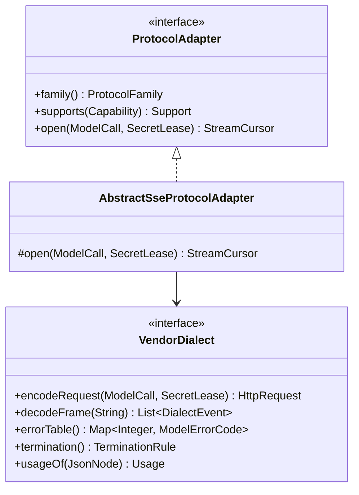
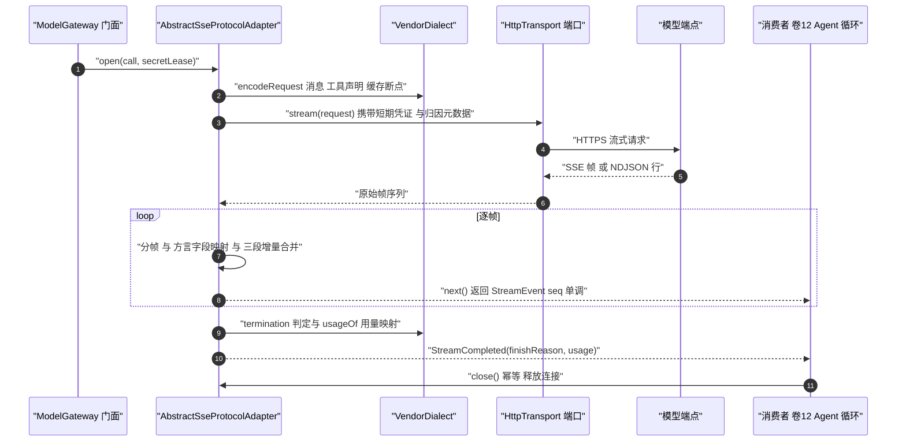
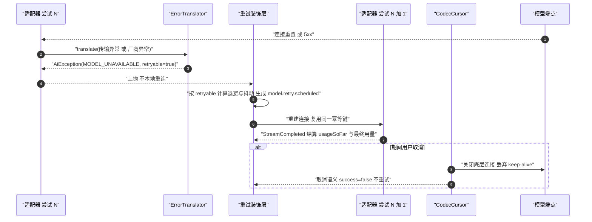
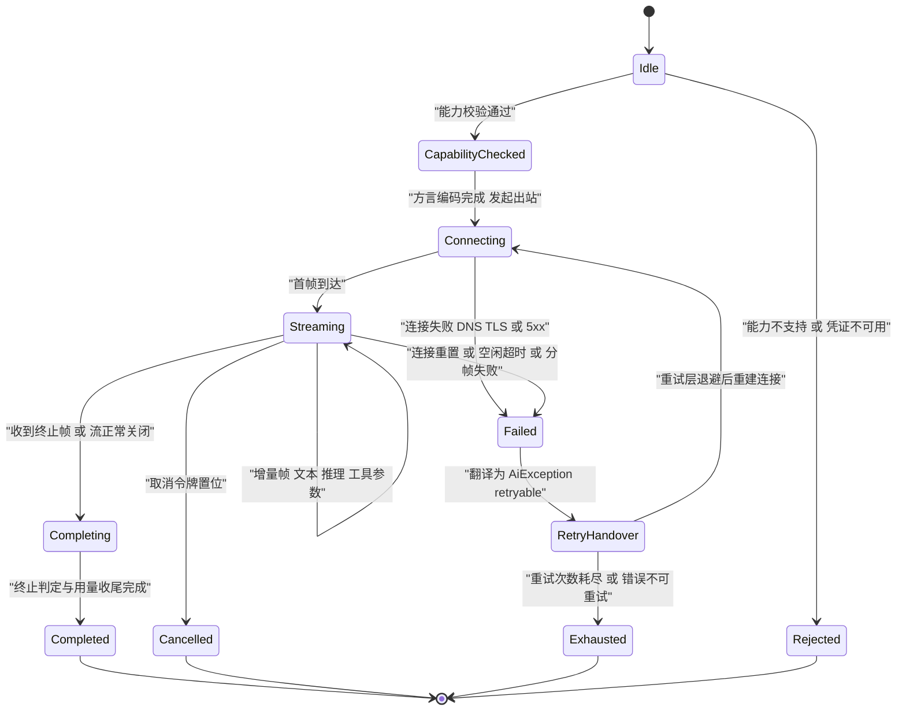

# C07 · ModelAdapterFamily（四协议适配器族）组件实现方案

> 组件：**ModelAdapterFamily**——Anthropic Messages、OpenAI（Responses 原生 + Chat Completions 兼容）、Gemini generateContent/streamGenerateContent、Ollama 原生，共 **4 协议族 / 5 适配器实例**；附录 D 对应组件 **K-02**（`ProtocolAdapter×4 + StreamCodec`）。
> 上游：`impl/02-model-gateway-impl.md`（I-MDL-1…7、§5.1 签名、§6.1–6.3 时序、§10.2/§10.7）；Phase A：`02-model-gateway.md`（D-MDL-1…13）、`DECISIONS.md`、`AGENTS.md` 编码规范（异常命名与「重试只认 `retryable`」，不做 fallback 链）。
> 竞品证据：`03-codex.md`（`WireApi` 收敛为单一 Responses 的**反例** `[E1] model-provider-info/src/lib.rs:95-129`）、`04-deepseek-harness.md`（`ctx.llm` 适配器接缝 + 静态能力描述符 `[E1]`）、`02-opencode.md`（`promptCacheKey` 会话亲和 `[E1] runner/llm.ts:204-214`）。纪律：只覆盖「适配器族」组件；与 `impl/02` 口径不一致处**以 impl/02 为准**，差异登记为修订建议（§⑨ 末），不改台账、不改 Phase A 卷册。

## ① 定位与边界

### 1.1 本组件解决什么

1. **厂商差异单点消除**：把五个适配器实例的私有协议（消息结构、工具声明、流式分帧、终止条件、错误码表、用量字段）全部翻译为 canonical 模型，内核逻辑永不读取厂商字段。
2. **一次调用的物理连接生命周期**：连接 → 分帧 → 三段流式增量解析（文本 / 推理 / 工具参数）→ 结束判定 → 用量收尾 → 取消与 1s 内连接释放。
3. **工具调用协议转换**：canonical 声明全量投射 + 流式参数增量合并（按并行索引归并）+ 畸形参数最小修复与回喂交接。
4. **能力接缝的物理执行点**：调用前 `supports(Capability)` 本地判定，不支持**响亮拒绝**，不做探测式试探（零出站请求）。
5. **错误归一化唯一出口 + 凭证句柄边界**：厂商 SDK / HTTP / 分帧 / 协议畸形一律翻译为 `AiException(ModelErrorCode)`（`retryable` 是重试判定唯一依据）；凭证明文只在单次调用窗口存在，请求结束（含异常与取消路径）后立即失效。

### 1.2 本组件不解决

- 不重试、不换路：重试归装饰器链重试层，换路只在路由期声明（I-MDL-6）；适配器内禁止重连循环（I-C-MAF-4）。
- 不做能力路由、限流、脱敏、审计、计量（门面与装饰器层职责，impl/02 §3.4/§3.5）；不解析工具语义（归卷 05 `ToolArgumentsValidator`）。
- 不组装上下文与提示词（只消费卷 03 断点声明与卷 04 `promptFamily`）、不落库、不内建 HTTP/JSON（出站经 `HttpTransport`、编解码经 `JsonCodec`，内核零框架）。

### 1.3 上游 / 下游依赖与模块归属

| 方向 | 依赖 | 契约 / 说明 |
| --- | --- | --- |
| 上游 | `ModelGateway` 门面（impl/02） | 本组件是链尾最内层实现，由门面装配装饰器链 |
| 上游 | 卷 03 断点声明 / 卷 04 `promptFamily` | 只读透传，不解析语义 |
| 上游 | `SecretLease` | 单次调用窗口内有效；`close()` 后拒绝访问 |
| 下游 | 卷 12 Agent 循环 / 卷 03 上下文引擎 | 消费 `StreamCursor`（取消传播源）/ 消费 `MODEL_CONTEXT_OVERFLOW` 触发压缩 |
| 端口 | `HttpTransport` / `JsonCodec` | 内核接口；实现与装配在平台域带 + `harness-host/host-bootstrap`（impl/02 §1.3） |

| 内容 | 目标模块 | 包 |
| --- | --- | --- |
| `ProtocolAdapter` / `VendorDialect` / `StreamCursor` / `StreamEvent` / `ContentBlock` / `ModelErrorCode` / `FinishReason` | `harness-contract`（零 Spring） | `com.hk.opencoding.contract.model.*` |
| `AbstractSseProtocolAdapter` + 五适配器 + `StreamCodec` + `ToolCallAccumulator` + `ArgumentRepair` + `ErrorTranslator` | `harness-kernel/kernel-model` | `com.hk.opencoding.kernel.model.{adapter,stream,error}` |
| `HttpTransport` / `JsonCodec` 实现（JDK HttpClient + Jackson） | 平台域带（impl/02 §1.3） | 由 `host-bootstrap` 注入 |

### 1.4 与系统级方案的不冲突声明

- 不新增/不删除 `impl/02` 的 `ProtocolFamily`、`StreamEvent` 类型集合与八层装饰器顺序；§8.3 的 `FinishReason` 是 `StreamCompleted` 的载荷补全（impl/02 §5 未禁止载荷扩展）；「四协议」计数口径（4 族 / 5 实例）与附录 D「`ProtocolAdapter×4`」含义一致，澄清建议见 §⑨（C07-G3）。

## ② 功能需求清单（REQ-C-MAF-n）

| ID | 需求描述 | 来源 | 优先级 | 验收要点 |
| --- | --- | --- | --- | --- |
| REQ-C-MAF-1 | 五适配器行为一致：流式 / 工具 / 错误 / 取消 / 用量五组套件对四协议族全绿 | impl/02 REQ-MDL-1、I-MDL-2；卷 02 §2 | P0 | 同一套契约用例驱动全部实例；差异只允许出现在方言白名单 |
| REQ-C-MAF-2 | 10 类 `ContentBlock` × 四协议族投射完整，缺能力显式失败，禁止静默丢弃 | impl/02 REQ-MDL-10、I-MDL-1；D-MDL-11 | P0 | 每块 × 每协议 golden 样本；无「丢弃块」代码路径 |
| REQ-C-MAF-3 | 三段流式 + 拉取式游标 + `seq` 单调 + 背压（阻塞生产者而非丢事件） | impl/02 REQ-MDL-4、I-MDL-3 | P0 | 慢消费不丢事件；`seq` 严格递增 |
| REQ-C-MAF-4 | 工具调用全量投射 + 增量参数合并（按并行索引）+ 畸形参数最小修复 + 回喂交接 | impl/02 REQ-MDL-5、D-MDL-4 | P0 | 两工具交错分片各自完整；畸形参数不抛未翻译异常 |
| REQ-C-MAF-5 | 能力接缝前置：本地判定 + 不支持时响亮拒绝 + 附替代建议 | impl/02 REQ-MDL-3/19；04-deepseek `[E1]` | P0 | 不支持路径零出站请求（假端点计数为 0） |
| REQ-C-MAF-6 | 错误翻译全覆盖：SDK / HTTP / 分帧 / 协议异常一律转 `AiException`，原始异常不得外溢 | impl/02 REQ-MDL-9；AGENTS.md 编码规范 §4 | P0 | 静态扫描：适配器外无厂商异常类型 |
| REQ-C-MAF-7 | 凭证句柄单次调用窗口、用后清零、`toString` 恒脱敏、零明文入日志与事件 | impl/02 REQ-MDL-7、I-MDL-7 | P0 | 句柄失效后访问拒绝；日志扫描零命中 |
| REQ-C-MAF-8 | 结束原因归一化：终止帧 + 流关闭双条件判定，归一为 `FinishReason` 后才产出完成事件 | impl/02 §10.7；卷 02 §4.5 | P0 | 四方言终止样本各 ≥ 3 例（正常 / 截断 / 无终止帧 EOF） |
| REQ-C-MAF-9 | 缓存断点按方言投射，未命中原因回传卷 03 | impl/02 REQ-MDL-15/17 | P1 | 断点投射 golden 样本；`model.cache.observed` 载荷完整 |
| REQ-C-MAF-10 | 取消传播：`close()` 幂等、关闭连接、keep-alive 丢弃不复用、1s 内释放 | impl/02 REQ-MDL-4、§10.1 | P0 | 取消注入：无残留连接、无半包复用 |
| REQ-C-MAF-11 | 四协议原生并存，禁止收敛为单一 wire protocol | impl/02 REQ-MDL-21；03-codex `[E1]`（反例） | P0 | CI 覆盖四协议族；无「仅 Responses」收敛 |
| REQ-C-MAF-12 | 结构化输出双保险：原生约束优先；缺能力时工具式输出 + 修复 ≤ 2 次 | impl/02 REQ-MDL-11、D-MDL-12 | P1 | 修复次数写入事件；两轮失败显式报错 |
| REQ-C-MAF-13 | 归因元数据随请求下发（`requestId`/`sessionId`/`taskId`/`requestSetId`/`sourceSessionId`/cacheKey） | impl/02 REQ-MDL-18；07-qoder `[E1]` | P0 | 五字段在调用事件中完整留存，可事后下钻 |
| REQ-C-MAF-14 | 多模态不支持时给 `alternatives[]`；降级仅在策略显式允许时发生并留痕 | impl/02 REQ-MDL-3、§6.3 | P0 | 默认关闭降级；开启时生成 `system.capability.degraded` |

## ③ 关键设计决策（I-C-MAF-n）

### 3.1 I-C-MAF-1 适配器复用结构：模板方法骨架 + 方言钩子

| 分支 | 描述 | F | U | S | M | 加权 |
| --- | --- | --- | --- | --- | --- | --- |
| **B1 骨架 + 方言钩子** | 骨架固化连接 / 分帧 / 合并 / 终止判定 / 错误表；厂商只实现方言 | 9 | 8 | 8 | 9 | **85.5** |
| B2 组合式 Codec 无继承 | 各适配器自由组合工具类，公共流程重复 | 8 | 7 | 6 | 7 | 70.5 |
| B3 每厂商独立完整实现 | 最直白，修一处要改五处 | 7 | 6 | 4 | 8 | 61.5 |

**选定 B1**（继承 impl/02 I-MDL-2）。**回退触发**：某方言与骨架冲突点 > 3 处（如流式语义为分段重写）→ 该厂商独立实现 + 注册表登记例外原因 + 单独跑一致性用例。

### 3.2 I-C-MAF-2 增量载体与三段流语义

分支比选（F/U/S/M）：**B1 `StreamCursor` 拉取式 + 取消句柄（85.5，选定）** ＞ B3 响应式流（69，H-003 禁）＞ B2 Future 链 + 回调（56）。选定理由：虚拟线程友好、背压天然、可测。**组件级补全**：`seq` 单调用于排序与丢帧检测；多消费者场景不改载体，包 `BroadcastCursor`（有界队列扇出）。

### 3.3 I-C-MAF-3 方言白名单边界（差异只在方言内消除）

- **允许进方言**：字段映射（消息 / 工具声明 / 工具结果 / 多模态块）、终止条件与结束原因映射、错误码表、缓存断点投射、用量字段映射、分帧参数（SSE 行 / NDJSON 行）；**禁止进方言**：重试与退避判定、能力矩阵判定、脱敏与审计、装饰器语义、上下文裁剪——出现即视为设计缺陷（评审项 + 静态检查）；确需行为分支（如 Gemini 无参数分片）时，优先以骨架的**可选钩子**表达并在方言注册表声明。

### 3.4 I-C-MAF-4 断连重试的职责边界（适配器不重试）

- **决策**：适配器只做一次连接尝试；重置 / 429 / 超时 / 5xx 一律翻译为 `AiException(retryable)` 上抛，由重试装饰层退避重试，且**不换模型、复用同一幂等键**（对齐 I-MDL-6 与 §10.7 纪律）。
- **被放弃分支**：适配器内自带重连循环（实现简单但重试语义分裂、成本不可断言、与熔断状态不一致）；**回退触发**：无——硬边界；仅装配期连通性探测（`/api/v1/providers/{id}/test`）允许独立重试。

### 3.5 决策登记表

| ID | 维度 | 选定 | 理由 | 回退触发 |
| --- | --- | --- | --- | --- |
| I-C-MAF-1 | 适配器复用结构 | 模板方法骨架 + `VendorDialect` | 公共流解析零重复、差异集中、新厂商成本最低 | 方言冲突 > 3 处 → 独立实现 + 例外登记 |
| I-C-MAF-2 | 增量载体 | `StreamCursor` 拉取式 + 取消句柄 | 虚拟线程友好、背压天然、可测 | 多消费者 → `BroadcastCursor`，不改契约 |
| I-C-MAF-3 | 方言白名单 | 映射 / 终止 / 错误表 / 缓存断点 / 用量五类 | 防止方言成为第二套语义 | 行为分支 → 骨架可选钩子 + 注册表声明 |
| I-C-MAF-4 | 重试职责 | 适配器不重试，只在装饰层重试且不换模型 | 成本与结果可预测 | 不适用（硬边界） |

## ④ 类图



> 方言实现五类：`AnthropicMessagesDialect` / `OpenAiResponsesDialect` / `OpenAiChatDialect` / `GeminiGenerateDialect` / `OllamaNativeDialect`；辅助件 `StreamCodec`（分帧事件 → canonical 增量）、`ToolCallAccumulator`（参数合并）、`ErrorTranslator`（厂商异常 → `AiException`）、`ArgumentRepair`、`CodecCursor` 与注入端口 `HttpTransport` / `JsonCodec` 不在此图展开。

```java
package com.hk.opencoding.kernel.model.adapter;

/**
 * 协议适配器骨架：固化连接、分帧、增量合并、终止判定与错误翻译的公共流程。
 * 厂商差异只允许出现在 {@link VendorDialect} 白名单；骨架内禁止出现厂商字段名（静态检查锚点）。
 */
abstract class AbstractSseProtocolAdapter implements ProtocolAdapter {

    /** 厂商方言：字段映射与终止条件（无状态、线程安全）。 */
    private final VendorDialect dialect;

    /** 共享编解码器：分帧事件到 canonical 增量（无状态、线程安全）。 */
    private final StreamCodec codec;

    /** 出站传输端口：唯一出网点；air-gapped 档由装配期替换为拒绝实现。 */
    private final HttpTransport httpTransport;

    /**
     * 发起一次流式调用。
     *
     * @param call   调用上下文（消息已脱敏、工具已投射、含取消令牌），必填
     * @param secret 凭证短期句柄；请求结束（含异常与取消路径）后立即失效
     * @return 拉取式流游标（单消费者；`close()` 幂等并释放连接）
     * @throws AiException 能力不支持、凭证失败、协议错误、端点不可用时抛出（携带域错误码）
     */
    @Override
    public StreamCursor open(ModelCall call, SecretLease secret) {
        // 能力校验在本地完成：不支持时直接失败，不消耗一次端点调用（REQ-C-MAF-5）
        for (Capability capability : call.requiredCapabilities()) {
            if (!dialect.supports(capability)) {
                throw AiException.of(ModelErrorCode.UNSUPPORTED_CAPABILITY, call.modelId(), capability);
            }
        }

        // 请求构造与出站：明文只在本调用窗口存在，序列化层禁止输出句柄本身
        HttpRequest request = dialect.encodeRequest(call, secret);
        return new CodecCursor(codec, dialect, httpTransport.stream(request), new ErrorTranslator());
    }
}
```

```java
package com.hk.opencoding.kernel.model.stream;

/**
 * canonical 结束原因：由各方言终止帧归一化而来（REQ-C-MAF-8），随 `StreamCompleted` 产出；
 * 不参与重试判定（重试只认 `ModelErrorCode.retryable()`）。
 */
public enum FinishReason {
    /** 正常完成（`end_turn` / `stop` / `STOP` / `done_reason=stop`） */
    COMPLETED("COMPLETED", "正常完成"),
    /** 达到输出上限（`max_tokens` / `length` / `MAX_TOKENS`） */
    MAX_TOKENS("MAX_TOKENS", "达到输出上限"),
    /** 请求工具调用（`tool_use` / `tool_calls` / 含 `functionCall` 的块） */
    TOOL_USE("TOOL_USE", "请求工具调用"),
    /** 命中停止序列 */
    STOP_SEQUENCE("STOP_SEQUENCE", "命中停止序列"),
    /** 内容策略阻断（`content_filter` / `SAFETY` / `refusal`） */
    CONTENT_FILTER("CONTENT_FILTER", "内容策略阻断"),
    /** 本地取消（不重试、不假成功） */
    CANCELLED("CANCELLED", "本地取消"),
    /** 协议畸形或流异常终止（无终止帧 EOF） */
    PROTOCOL_ERROR("PROTOCOL_ERROR", "协议异常终止");

    private final String code;
    private final String desc;

    FinishReason(String code, String desc) {
        this.code = code;
        this.desc = desc;
    }

    /** 编码（数据库只存 code，前端只传 code）。 */
    public String code() {
        return code;
    }

    /** 中文描述（展示与日志）。 */
    public String desc() {
        return desc;
    }

    /** 按 code 反查；非法值抛业务异常，禁止静默回退为默认值。 */
    public static FinishReason of(String code) {
        for (FinishReason value : values()) {
            if (value.code.equals(code)) {
                return value;
            }
        }
        throw new AiException(ModelErrorCode.MODEL_PROTOCOL_ERROR, "未知结束原因：" + code);
    }
}
```

## ⑤ 核心流程时序图

### 5.1 带工具调用的流式调用（主路径）

**前置条件**：门面已完成能力校验与路由，装饰器链按 `ModelStageOrder` 装配；请求含 `CallerMetadata`、已脱敏消息与 canonical 工具声明；凭证句柄已注入。
**主路径**：方言编码 → 出站 → 分帧 → 三段增量合并 → 逐事件消费 → 终止判定与用量收尾。
**异常与补偿**：见 5.2 与 §⑨；畸形参数不抛异常，转回喂交接（§8.4）。**幂等与并发点**：单凭证并发由信号量约束；重试复用同一幂等键，本组件只透传不生成幂等键。



### 5.2 流中连接重置：适配器边界与重试交接（异常补偿）

**前置条件**：流已开始（已有增量），端点发生 TCP 重置或 5xx；重试参数来自 `open-coding.model.retry.*`。
**主路径**：翻译错误 → 上抛 `AiException` → 重试层判定 `retryable` → 退避 → 重建连接重试（同模型、同幂等键）。
**异常与补偿**：**不尝试厂商级续读**（半包不可信）；部分增量按「未完成」处理，计量按 `usageSoFar` 结算（部分用量必须计费）；取消路径同图下段——游标关闭 → 连接释放（≤ 1s）→ 产出取消语义（`success=false`，**绝不**假成功），取消不重试。
**幂等与并发点**：`requestId` 恒定；`oc_usage_record` 唯一约束兜底防重复计费；`next()` 与 `close()` 并发由游标内部状态机串行化，`close()` 幂等。



## ⑥ 状态机（适配器断连重试）



**迁移要点**：① 本状态机描述**单次尝试**；`RetryHandover → Connecting` 由重试装饰层驱动，重建即新实例，`requestId` 与幂等键恒定（I-C-MAF-4）；② 不可重试错误（认证 / 配额 / 内容策略 / 能力不支持）直接从 `Failed` 进入 `Exhausted` 语义，**不消耗退避预算**（成本可断言）；③ 熔断打开时门面在进入本组件前快速失败，本状态机不参与；`Cancelled` 不重试、不假成功、部分用量照常结算。

## ⑦ 接口与依赖矩阵

| 接口 / 类型 | 归属 | 职责 | 关键约束 |
| --- | --- | --- | --- |
| `ProtocolAdapter` | `harness-contract` | 协议族标识、能力位声明、发起流式调用 | 实现外不暴露厂商类型 |
| `VendorDialect` | `harness-contract` | 字段映射、终止条件、错误表、缓存断点、用量映射 | 五类白名单之外禁止行为逻辑（I-C-MAF-3） |
| `StreamCursor` | `harness-contract` | `next()` / `usageSoFar()` / `close()` | 单消费者；`close()` 幂等；取消 ≤ 1s 释放 |
| `StreamCodec` / `ErrorTranslator` | `harness-contract`（内核实现） | 分帧事件 → canonical 合并 / 厂商异常 → `AiException` | 无状态纯函数；翻译唯一入口，禁止二次包装 |
| `HttpTransport` / `JsonCodec` | 内核端口 | 出站字节与 JSON 编解码 | 内核零自建 HTTP、零直接 Jackson 依赖 |
| `ProtocolAdapterSPI` / `VendorDialectSPI` | 扩展点（并入卷 18 目录） | 新增厂商 / 私有协议 / 已有协议族的私有变体 | 必须通过同一契约套件；方言只能改字段映射 |

**依赖方向铁律**：`harness-contract ← harness-kernel/kernel-model`；内核不得依赖 Spring、domain、infrastructure；`HttpTransport` / `JsonCodec` / `SecretResolver` / `EventPort` 由 `host-bootstrap` 注入（impl/02 §1.3）。

| 配置项（`open-coding.model.*`） | 默认 | 说明 |
| --- | --- | --- |
| `providers[].protocol` / `base-url` / `timeout-ms` | 空 / 空 / `30000` | 协议族、端点、单次尝试超时（配置化，禁止硬编码） |
| `adapter.stream.idle-timeout-ms` / `max-frame-bytes` / `text-throughput-floor-bps` | `60000` / `1048576` / `2097152` | 空闲超时 / 单帧上限 / 文本吞吐门禁（§⑩） |
| `retry.max-attempts` / `backoff-base-ms` / `backoff-max-ms` / `jitter-ratio` | `3` / `500` / `10000` / `0.2` | 重试参数（重试装饰层消费，本组件只翻译） |
| `cache.enabled` / `egress.mode` | `true` / `direct` | 断点投射开关 / 出网策略（air-gapped 装配期拒绝出网） |

## ⑧ 关键算法

### 8.1 协议转换矩阵（canonical ↔ 厂商）

| 维度 | Anthropic Messages | OpenAI Responses | OpenAI Chat Completions | Gemini generateContent | Ollama `/api/chat` |
| --- | --- | --- | --- | --- | --- |
| 系统提示 | 顶层 `system` 参数 | `instructions` | `messages[0].role=system` | `systemInstruction` | `messages[0].role=system` |
| 工具声明 | `tools[].input_schema` 直传 | `tools[].parameters`（Responses 形态） | `tools[].function.parameters` 直传 | `functionDeclarations`：剥 `$schema`/`additionalProperties`、`format` 平移 | `tools[].function.parameters` 直传 |
| 工具调用（流式形态） | `input_json_delta` 增量分片（按 content block 索引） | `function_call_arguments.delta` 增量分片（按 item id） | `tool_calls[].index` + `arguments` 增量分片 | **整块**返回 `functionCall{name,args}`，无参数分片 | 消息级整块 `tool_calls[]` |
| 工具结果回传 | `role=user` + `tool_result` block | `function_call_output` item | `role=tool` + `tool_call_id` | `functionResponse` part | `role=tool` |
| 推理 / 思考 | `thinking.type=enabled` + `budget_tokens`；`thinking_delta` | `reasoning.effort`；summary → 增量 | `reasoning.effort`；summary → 增量 | `thinkingConfig.thinkingBudget`；`thought` part | 不支持 → `UNSUPPORTED_CAPABILITY` |
| 缓存断点 | `cache_control: {type: ephemeral}` 逐块投射 | 隐式前缀（读 `cached_tokens`） | 隐式前缀（会话派生 `prompt_cache_key`） | `cachedContent`（能力门控，缺则关闭投射） | 忽略（投射关闭，计量照常） |
| 结束原因 | `end_turn`/`max_tokens`/`tool_use`/`stop_sequence`/`refusal` | `completed`；`incomplete_details.reason` | `stop`/`length`/`tool_calls`/`content_filter` | `STOP`/`MAX_TOKENS`/`SAFETY`/`RECITATION`/`MALFORMED_FUNCTION_CALL` | `done_reason`：`stop`/`length` |
| 用量字段 | `input_tokens`/`output_tokens`/`cache_read_input_tokens`/`cache_creation_input_tokens` | `input_tokens`/`output_tokens`/`cached_tokens`/`reasoning_tokens` | `prompt_tokens`/`completion_tokens`/`cached_tokens`（终帧） | `usageMetadata.{prompt,candidates,thoughts,cachedContent}TokenCount` | `prompt_eval_count`/`eval_count` |
| 分帧形态 | SSE（事件名 + `data:`） | SSE（事件名 + `data:`） | SSE（`data:` + `[DONE]`） | 分块 JSON 数组流 | NDJSON（每行一个对象） |

**不变式**：① 工具参数只能由合并算法产出完整 JSON（§8.2），禁止在适配器内手工拼 JSON；② 缓存断点能力缺失只关闭投射并生成观测事件，**不**上升为错误；③ Gemini / Ollama 的整块参数属正常形态，合并器按「整块注入」处理，不视为畸形。

### 8.2 流式分片合并（`ToolCallAccumulator`）

1. **归并键**：优先 `parallelIndex`（OpenAI `tool_calls[].index`）；无 index 的协议（Anthropic / Gemini / Ollama）以「调用序号 + `toolCallId`」为键。
2. **累积顺序**：分片按到达顺序追加，乱序分片先按索引归位再追加，禁止重排序已收到片段。
3. **完成判定**：该索引收到结束标记（`content_block_stop` / item `done` / 整块到达）即封盘，产出 `ToolCallFinished`。
4. **畸形兜底 + 用量收尾**：拼接结果先过 `ArgumentRepair`（§8.4），修复失败也不抛异常，交卷 05 校验器回喂（对齐 REQ-MDL-5 验收）；`usageSoFar()` 任意时刻可返回部分值，`StreamCompleted` 必带最终 `Usage`（缓存读 / 写 token 单列）。

### 8.3 结束原因归一化

| 方言原始值 | canonical `FinishReason` | 说明 |
| --- | --- | --- |
| `end_turn` / `stop` / `completed` / `STOP` / `done_reason=stop`（无工具调用） | `COMPLETED` | 正常完成 |
| `max_tokens` / `length` / `MAX_TOKENS` / `incomplete(max_output_tokens)` | `MAX_TOKENS` | 达到上限；截断内容仍完整入历史 |
| `tool_use` / `tool_calls` / 含 `functionCall` 的块 | `TOOL_USE` | 与 `parallelTools` 能力位联动（缺则顺序执行） |
| `stop_sequence` | `STOP_SEQUENCE` | 命中停止序列 |
| `refusal` / `content_filter` / `SAFETY` / `RECITATION` | `CONTENT_FILTER` | 不自动改写输入后重试（不绕过厂商安全策略） |
| 流关闭但无终止帧（EOF） | `PROTOCOL_ERROR` | 判定为不可信半包：不再续读，按 §⑨ 翻译上抛 |
| 本地取消 | `CANCELLED` | 仅结果语义，不产生错误码文案 |

### 8.4 畸形参数修复与回喂衔接

- **三级最小修复**：① 去除尾部游离片段（终止帧前被截断）；② 闭合未配对括号 / 引号（仅当修复后为合法 JSON 对象）；③ 丢弃非法转义序列（保留原值语义）。每调用至多修复一次；成功生成 `model.toolcall.arguments.repaired` 事件（含 `toolCallId` 与修复级别，不落原文）。
- **失败交接**：保留原文片段并照常产出 `ToolUseBlock`；卷 05 管线第 2 步校验器产出 `TOOL_INVALID_ARGUMENTS` 结构化错误回喂，**适配器自身零异常外溢**；禁止字段级语义推断（替模型编造参数）。

## ⑨ 错误处理与降级

### 9.1 异常翻译（唯一入口 `ErrorTranslator`）

| 厂商 / 传输表现 | 域错误码 `ModelErrorCode` | 契约层 `ErrorCode` | retryable | 处理动作 |
| --- | --- | --- | --- | --- |
| 连接重置 / 5xx / 端点不可达 | `MODEL_UNAVAILABLE` | `DEPENDENCY_UNAVAILABLE` | 是 | 退避重试（≤ `retry.max-attempts`）；达上限按熔断处理 |
| 首字节超时 / 流空闲超时 | `MODEL_TIMEOUT` | `MODEL_TIMEOUT` | 是 | 重试一次；仍失败整体失败（不换模型） |
| 429（含 `Retry-After`） | `RATE_LIMITED` | `RATE_LIMITED` | 是 | 尊重 `Retry-After`；本地令牌桶同步降速 |
| 401 / 403（刷新后仍失败） | `MODEL_AUTH_FAILED` | `MODEL_AUTH_FAILED` | 否 | 刷新一次；仍失败明确报凭证问题 |
| 402 / `insufficient_quota` | `MODEL_QUOTA_EXCEEDED` | `MODEL_QUOTA_EXCEEDED` | 否 | 不消耗退避预算；提示切换凭证 / 模型 |
| 内容策略阻断 | `MODEL_CONTENT_BLOCKED` | `MODEL_CONTENT_BLOCKED` | 否 | 不改写输入；生成审计事件 |
| 上下文超窗 | `MODEL_CONTEXT_OVERFLOW` | `MODEL_CONTEXT_OVERFLOW` | 否 | 回传卷 03 触发压缩，压缩后允许一次重试 |
| 能力不支持 | `UNSUPPORTED_CAPABILITY` | `UNSUPPORTED_CAPABILITY` | 否 | 附 `alternatives[]`；零出站请求 |
| 分帧失败 / 协议畸形 / 无终止帧 EOF | `MODEL_PROTOCOL_ERROR` | `MODEL_PROTOCOL_ERROR` | 否（至多整重试一次） | 记 `model.request.failed`；不续读半包 |
| 本地取消 | `CANCELLED` | 本地语义（不入统一错误响应） | 否 | 结果标记取消；部分用量照常结算 |

**实现纪律**：① 适配器抛出的异常只能是 `AiException`（内核 `HarnessException` 子类），厂商 SDK 异常类型禁止出现在适配器之外的签名与 `catch` 中（静态扫描 + 用例双保证）；② 重试判定只读 `ModelErrorCode.retryable()`，禁止按文案、HTTP 码或厂商码判断；③ 熔断状态由门面 / 装饰层维护，本组件不缓存。

### 9.2 降级路径表

| 触发 | 降级行为 | 禁止项 |
| --- | --- | --- |
| 多模态块 + 模型无对应能力位 | 显式失败 + `alternatives[]`；仅当租户策略显式开启 `downgrade.to-text` 时转文本摘要并生成 `system.capability.degraded` | 默认关闭；禁止静默丢弃块 |
| 结构化输出无原生约束 | 工具式输出 + 校验修复 ≤ 2 次（REQ-C-MAF-12） | 禁止无上限修复循环 |
| 缓存断点 / 推理增量能力缺失 | 关闭投射 / 隐藏思考面板并观测；不改提示词 | 禁止把 thinking 混入正文、禁止报错阻断调用 |
| air-gapped 装配档 | `egress.mode=disabled`：外部 provider 在**装配期**剔除并留痕 | 禁止运行时探测后静默失败 |

### 9.3 日志与登记建议

- `@Slf4j` + 中文文案 + `{}` 占位符；流开始 / 结束（`finishReason`、`attemptNo`、耗时）`log.info`；业务类失败 `log.warn`；协议 / 系统异常 `log.error` 并传 `Throwable`。**禁止**输出凭证句柄与明文（`SecretLease.toString()` 恒为 `SecretLease[REDACTED]`）、完整请求体、cache key 明文（只允许指纹）。追踪 span：`model.adapter.open` → `model.http.exchange`。
- **C07-G1（登记建议，编号由编排方分配）**：域码 `ModelErrorCode`（impl/02 §5）与契约层 `ErrorCode`（附录 B.11）缺官方逐值映射表；「首字节 / 流空闲超时」在 impl/02 §10.7 记 `DEPENDENCY_UNAVAILABLE`、附录 B.11 记 `MODEL_TIMEOUT`，需收敛口径；建议将 §9.1 表升格为卷 02 附录。
- **C07-G2 / G3**：附录 B.11 补登 `MODEL_PROTOCOL_ERROR` 与取消语义（或明确「映射 `INTERNAL_ERROR`」「本地取消不入错误码」）；卷 02 §1 明确「4 协议族 / 5 适配器实例（OpenAI 双变体）」口径，避免误建 4 实例。

## ⑩ 性能与并发

### 10.1 首 token 预算分解（网关侧贡献，对齐 impl/02 §10.2）

| 环节 | 预算 | 说明 |
| --- | --- | --- |
| 门面 + 装饰器链自身开销 | ≤ 15ms P95 | 不含网络；本组件贡献其中一部分 |
| 能力校验（`supports` 本地判定） | ≤ 1ms P95 | 纯内存无 IO；不支持时直接失败 |
| 方言编码（请求体 + 缓存断点） | ≤ 3ms P95 | 工具声明 ≤ 2000 时的上限 |
| 首字节呈现（本地 / 局域网端点） | ≤ 1.5s P95 | NFR-P-1 含外部依赖；本组件贡献 ≤ 20ms |
| 帧解析与增量合并 / 取消到连接释放 | ≤ 3ms/帧 P95、吞吐 ≥ 2MB/s；取消 ≤ 1s P95 | `StreamCodec` 门禁指标 / 取消为硬约束 |

### 10.2 并发模型、取消与背压

- 每次调用一个**虚拟线程**执行阻塞式读取；并发上限 = 单凭证信号量（默认 8）× 全局上限（impl/02 §10.1）。
- 游标单消费者；`next()` 与 `close()` 并发由内部状态机串行化，`close()` 幂等；取消路径：`close()` → 取消虚拟线程 → 关闭连接，keep-alive 连接**丢弃不复用**（避免残留半包污染后续请求）。
- 下游慢消费 → `next()` 阻塞生产者，**不丢事件**；长背压由 `adapter.stream.idle-timeout-ms` 兜底。单帧上限 `max-frame-bytes` 防畸形大帧；分帧缓冲复用，流式转发不整段驻留；适配器零共享可变状态（方言与 codec 无状态），并发安全由不可变对象保证，不引入锁。
- 用量结算走独立虚拟线程 + 有界队列（容量 4096），满时丢弃并计数（`oc_model_usage_dropped_total`），绝不阻塞调用路径。

## ⑪ 测试要点

### 11.1 契约测试门禁（`-Dgroups=protocol-contract`）

- **五组行为套件 × 四协议族全绿**：流式（增量序列）、工具（含并行交错分片）、错误（10 类）、取消（≤ 1s 释放）、用量（四分段 + 缓存读写单列）。
- **投射 golden 样本与能力矩阵**：同一 canonical `ModelRequest`（含全部 10 类 `ContentBlock`）对四方言请求体逐字节比对（含 Gemini 剥键）；每个「不支持」路径断言 `UNSUPPORTED_CAPABILITY` + `alternatives[]` + **零出站请求**（假端点计数器为 0）。

### 11.2 录制回放夹具

- 形态：`fixtures/protocol/{family}/{scenario}.frames.jsonl`——真机采集的原始帧序列（脱敏：密钥字段替换、租户信息哈希）+ 请求摘要（方法 / 路径 / 头白名单）+ 期望 canonical 增量序列（`seq` 与载荷）；回放注入 `ReplayHttpTransport`（`HttpTransport` 端口实现）离线重放全部帧，断言增量序列与结束原因一致，不触网、不需凭证。夹具入库前经脱敏器扫描（`*KEY*` / `*TOKEN*` / `*SECRET*` 模式），CI 增加「夹具零明文」门禁；与 T-04 假模型共用同一 `ProtocolAdapter` 契约，保证行为一致。

### 11.3 用例矩阵与故障注入

| 类别 | 用例 | 断言 |
| --- | --- | --- |
| 单元 | `ToolCallAccumulator` 交错分片 / 乱序索引 / 整块注入（Gemini、Ollama） | 合并结果与整包等价；`parallelIndex` 正确 |
| 单元 | `ArgumentRepair` 三级修复与修复上限 | 成功用例产出合法 JSON；失败不抛异常 |
| 单元 | `FinishReason` 全表映射（含 EOF 无终止帧、策略阻断） | 映射与 §8.3 表逐行一致 |
| 集成 | 一条完整流式调用（四协议族各一，假端点） | `started → delta* → completed`；`usage` 收尾正确 |
| 故障注入 | 429 / 5xx / 连接重置 / 流中断 / 首字节超时 | 按 `retryable` 重试、不换模型、幂等键恒定；不可重试错误零额外调用 |
| 故障注入 | 流中途 `kill` 假端点；取消注入 | 无孤儿连接；取消语义 `success=false`；部分用量结算 |
| 安全 | 密钥三不扫描（源码 / 日志 / 事件载荷 / 上下文档） | 零命中；`SecretLease.toString()` 恒脱敏 |
| 回放 | 四方言帧回放（含畸形帧、超长帧） | 畸形帧走 `MODEL_PROTOCOL_ERROR`；超长帧被上限拦截 |

### 11.4 DoD 清单

- [ ] 五适配器实例通过同一套契约用例（`mvn -pl harness-kernel/kernel-model -am test -Dgroups=protocol-contract`）。
- [ ] 静态检查：适配器外无厂商 SDK 异常类型、方言无行为逻辑、骨架无厂商字段名。
- [ ] 首 token 贡献 ≤ 20ms P95、帧解析 ≤ 3ms/帧、取消 ≤ 1s 的门禁用例通过；录制回放夹具覆盖四方言 × 五组行为且「夹具零明文」门禁通过。
- [ ] I-C-MAF-1…4 在代码中有结构与注释锚点；§⑨ 三项登记建议已提交编排方。
