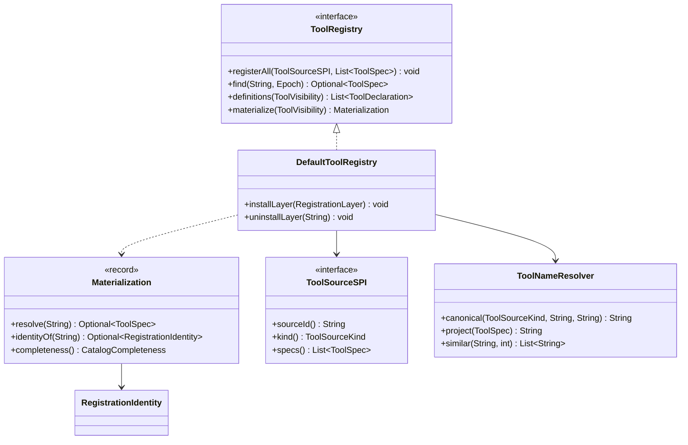
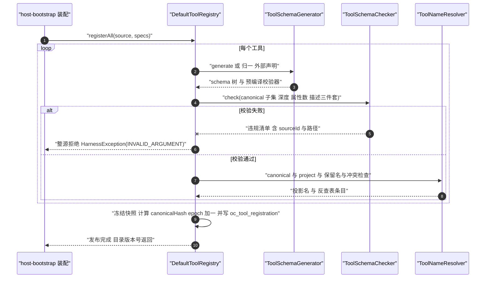
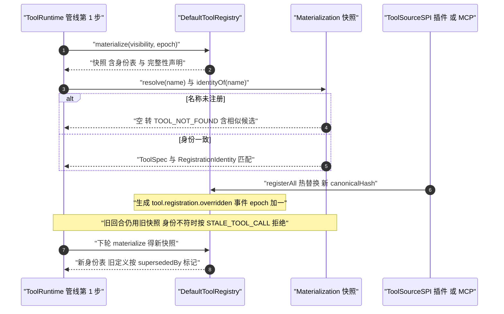
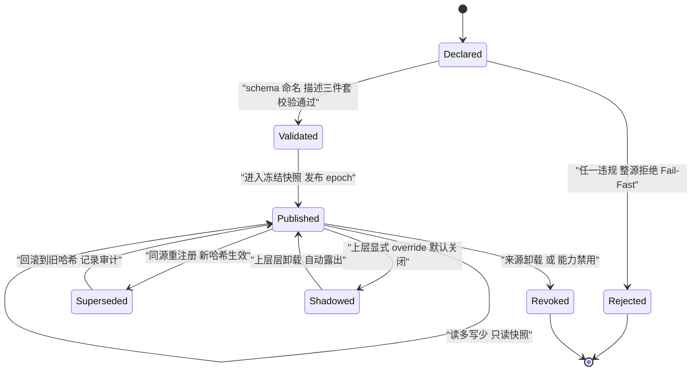

# C08 · ToolRegistry（工具注册与目录）组件实现方案

> 组件：**ToolRegistry**——三通道工具契约的注册、冻结、命名治理、可见性物化与目录投影（附录 D 对应组件 **K-13**：`ToolRegistry + ToolSchemaGenerator`）。
> 上游：`impl/05-tool-system-impl.md`（REQ-TOOL-1/2/3/4/21/22/25/26/27/29/31、D-TOOL-1/2/6/11、§3.1 I-TOOL-1、§3.5 I-TOOL-5、§5 类图、§8.1 `oc_tool_registration`）；`impl/09-mcp-gateway-impl.md`（I-MCP-3 工具命名投影）；设计接缝：`docs/design/tool-system-design.md` D37–D45（书写面与 canonical 子集）。
> 竞品证据：`02-opencode.md`（`Tool.make` 单一构造 + `Map<string, Array<registration>>` 栈式注册 + `materialize` 取最新 + 注册身份快照拒绝陈旧调用 + `whollyDisabled` 可见性裁剪 `[E1] packages/core/src/tool/{tool,registry}.ts`）；`04-deepseek-harness.md`（68 个模型可见工具 + `schemas()` 白名单阻止 `execute/output` 泄漏 + `catalogBudget` 轮转与完整性声明 + `ctx.spillStore` locator `[E1]`）。
> 纪律：只覆盖「注册与目录」组件；与 `impl/05` 不一致处**以 impl/05 为准**，差异登记为修订建议（§⑨ 末），不改台账。

## ① 定位与边界

### 1.1 本组件解决什么

1. **工具契约的单点事实源**：三通道（注解 / Builder / 外部声明）产出一同构 `ToolSpec`（= 声明 + 绑定 + 校验器 + 哈希），注册表内**来源不可区分**——调度、权限、审计、结果处理只依赖 `ToolSpec`（D-TOOL-1、D-TOOL-11）。
2. **注册期 Fail-Fast 与冻结**：命名、类型映射、描述三件套、嵌套深度、schema 子集全部在启动期拒绝，错误信息含 `sourceId`；注册完成后只读（D-TOOL-2、REQ-TOOL-2）。
3. **命名所有权与冲突消解**：内置保留名、外部来源前缀、生态兼容投影名、别名表与反查（禁止字符串二次切分，防命名空间伪造）。
4. **可见性物化与目录投影**：模式子集 + 工具组按需激活 + 检索发现 + 完整性声明 + 目录预算轮转——本组件回答「系统**能**做什么」，不回答「现在**能不能**做」。
5. **注册身份与陈旧调用防护 + Schema 生成**：`materialize` 冻结身份指纹，执行前比对（热替换后旧回合调用被拒）；canonical 子集检查 + 四协议投射降级 + 运行期校验器预编译（D37/D38）。

### 1.2 本组件不解决

- **不做权限决策**：注册表不注入 `assertPermission`（REQ-TOOL-31，对齐 opencode `[E1]`）；「现在能不能做」归卷 06；风险等级判定算法归卷 06 `RiskAssessor`（注册只登记 `riskAnnotation` 与来源签名）。
- **不执行工具、不做结果处理**：执行归 `ToolRuntime` 十一序管线（本组件只提供 `ToolSpec` 与身份）；裁剪 / 外置 / 脱敏归 `ToolOutputProcessor` + `ArtifactStore`。
- **不实现 MCP 协议与传输**：MCP 工具清单由卷 09 网关经 `ToolSourceSPI` 提交，本组件只做注册治理。

### 1.3 上游 / 下游依赖与模块归属

| 方向 | 依赖 | 契约 / 说明 |
| --- | --- | --- |
| 上游 | 卷 05 D-TOOL-1/2/6/11；卷 09 工具清单；卷 18 插件清单 | 三通道声明与来源元数据（`sourceId` / 版本 / 签名） |
| 下游 | `ToolRuntime`（管线第 1 步） | `materialize(visibility)` → `resolve(name)` / `identityOf(name)` |
| 下游 | 模型网关 `ToolSchemaProjector` | canonical schema → 四协议发送侧形态（降级规则见 §8.2） |
| 下游 | 卷 06 权限引擎 / 管理面 REST | 读 `riskAnnotation` / `GET /api/v1/tools/registry` 注册快照 |
| 装配 | `harness-host/host-bootstrap` | 启动期一次性装配；`@ConfigurationPropertiesScan` 激活配置类（纯数据类不加 `@Component`） |

| 内容 | 目标模块 | 包 |
| --- | --- | --- |
| `Tool` / `ToolSpec` / `ToolDeclaration` / `ToolBinding` / `ToolArgumentValidator` / `ToolSourceSPI` / `ToolErrorCode` | `harness-contract`（零 Spring、零 Jackson，JSON 经 `JsonCodec` 端口） | `com.hk.opencoding.contract.tool.*` |
| `DefaultToolRegistry` / `ToolNameResolver` / `RegistrationLayer` / `Materialization` / `ToolSchemaGenerator` / `ToolSchemaChecker` / `ToolSchemaProjector` | `harness-kernel/kernel-tool`（`authoring` 与 `registry` 子包） | `com.hk.opencoding.kernel.tool.*` |
| 注册审计投影（`oc_tool_registration`）、注册快照持久化 | `harness-platform/platform-persistence` | 由 `host-bootstrap` 装配 |

### 1.4 与系统级方案的不冲突声明

- 不改变 impl/05 的注册表能力面（注册 / 查找 / 定义列表 / 物化）；本文补充 `registerAll(source, specs)` 的**整源原子语义**与层叠显式 override（登记建议 C08-G2）；MCP 投影名格式**引用** `impl/09` I-MCP-3（`mcp__<server>__<tool>`），本组件只负责反查表与保留名校验；目录预算与完整性声明的阈值配置沿用 `open-coding.tool.discovery.*`（impl/05 §9.3），不新增命名空间。

## ② 功能需求清单（REQ-C-TOOLREG-n）

| ID | 需求描述 | 来源 | 优先级 | 验收要点 |
| --- | --- | --- | --- | --- |
| REQ-C-TOOLREG-1 | 三通道产出同一 `ToolSpec`；同一工具经三通道注册的 `canonicalHash` 一致 | impl/05 REQ-TOOL-1、D-TOOL-1；D37 | P0 | 三通道哈希比对用例（注解 / Builder / 外部 JSON） |
| REQ-C-TOOLREG-2 | 注册期 Fail-Fast：命名、类型映射、描述三件套、嵌套深度 ≤ 5、属性总数 ≤ 50、schema 子集 | impl/05 REQ-TOOL-2；design §8 | P0 | 每类违规一条拒绝用例；错误含 `sourceId` 与违规路径 |
| REQ-C-TOOLREG-3 | canonical schema 子集 + 四协议投射降级 + 运行期强校验兜底 | impl/05 REQ-TOOL-3、D37/D38 | P0 | Gemini 剥 `additionalProperties` 用例；非法参数回喂用例 |
| REQ-C-TOOLREG-4 | 注解书写面「签名即 schema」，递归类型矩阵覆盖嵌套 record / `List<T>` / `T[]`；排除类型注册期报错并给替代写法 | impl/05 REQ-TOOL-4、D41/D42/D45 | P0 | 26 类类型映射逐格用例；`Map`/`Set`/`Optional` 拒绝用例 |
| REQ-C-TOOLREG-5 | 模式驱动工具子集 + 工具组按需激活；编码模式核心集 18–24 | impl/05 REQ-TOOL-21、D-TOOL-6 | P1 | 各模式可见工具集快照测试 |
| REQ-C-TOOLREG-6 | 延迟加载 / 检索发现必须声明披露完整性（`COMPLETE` / `PARTIAL - n of m`），禁止静默截断目录 | impl/05 REQ-TOOL-22；04-deepseek `[E1]` `catalogBudget` | P2 | 预算不足时指令文本含 `PARTIAL` 用例 |
| REQ-C-TOOLREG-7 | 外部工具（MCP / 插件 / 脚本 / HTTP）经同一注册与同一管线，共享权限与审计 | impl/05 REQ-TOOL-25、D-TOOL-11 | P0 | MCP 工具触发审批与内置路径同一 `decision_id` 链路 |
| REQ-C-TOOLREG-8 | 陈旧调用防护：`materialize` 冻结注册身份，身份不匹配返回 `STALE_TOOL_CALL` 且**不执行** handler | impl/05 REQ-TOOL-26；02-opencode `[E1]` | P1 | 注册热替换后旧调用被拒用例 |
| REQ-C-TOOLREG-9 | 可见性裁剪：仅当规则为「全资源 deny」时整条隐藏工具定义 | impl/05 REQ-TOOL-27；02-opencode `[E1]` `whollyDisabled` | P1 | 部分路径 deny 时工具仍可见但调用被拒 |
| REQ-C-TOOLREG-10 | 别名治理：兼容映射表保留 ≥ 2 版本，映射变更生成事件；模型幻觉名给出相似名候选 | impl/05 REQ-TOOL-29 | P2 | 幻觉名回喂含候选列表用例 |
| REQ-C-TOOLREG-11 | 注册表不做权限决策；权限断言由工具 / 管线编排；输出尺寸由运行时统一约束 | impl/05 REQ-TOOL-31；02-opencode `[E1]` | P0 | 架构测试：`kernel-tool` 不得引用权限引擎实现类型 |
| REQ-C-TOOLREG-12 | 契约形态单一构造：`ToolSpec = declaration + binding + validator + canonicalHash`；注册表不做 schema 推断与 execute 泄漏 | impl/05 §5（类图四成员）；04-deepseek `[E1]`（`schemas()` 白名单） | P0 | 序列化扫描：模型请求中无 `execute` / `output` / `presentationMeta` 字段 |

## ③ 关键设计决策（I-C-TOOLREG-n）

### 3.1 I-C-TOOLREG-1 注册数据结构与层叠语义

| 分支 | 描述 | F | U | S | M | 加权 |
| --- | --- | --- | --- | --- | --- | --- |
| B1 单层 Map + 后注册覆盖 | opencode「最新注册获胜」语义，实现最简 | 7 | 7 | 7 | 5 | 65.5 |
| B2 多版本并存 + 请求级解析 | 最灵活，但解析规则复杂、对拍成本高 | 7 | 6 | 6 | 7 | 65 |
| **B3 分层栈 + 层内唯一 Fail-Fast + 跨层显式 override** | 层可整体撤销（露出下层）；默认禁止隐式覆盖；覆盖留痕 | 9 | 8 | 9 | 9 | **88** |

**选定 B3**。与 opencode `[E1]`「同名栈式覆盖、最新获胜」的差异：① 同层内同名仍 Fail-Fast（禁止静默覆盖，对齐 impl/05 §9.2）；② 跨层覆盖必须显式声明 `override=true` 并由配置 `open-coding.tool.registry.override-enabled` 开关（默认关闭），覆盖生成 `tool.registration.overridden` 事件与被覆盖方 `supersededBy` 标记；③ 层卸载（插件关闭 / MCP 服务器断开）整体撤销，被遮蔽的下层定义自动露出——该「撤销即露出」语义采纳自 opencode 的 finalizer 栈。**回退触发**：若显式 override 在运行期引发不可解释的调用行为，回退为「跨层冲突一律拒绝」并保留层叠结构。

### 3.2 I-C-TOOLREG-2 命名与命名空间方案

| 分支 | 描述 | F | U | S | M | 加权 |
| --- | --- | --- | --- | --- | --- | --- |
| A 裸名 + 全局唯一 | 模型最友好，但外部来源必与内置撞名 | 6 | 8 | 6 | 5 | 61 |
| B 全量来源前缀 | 无冲突，但破坏生态兼容（Claude / Qoder / DeepSeek 均用 `mcp__` 投影） | 7 | 5 | 9 | 7 | 70.5 |
| **C 双层：内核规范名 + 模型可见投影名 + 反查表** | 内核规范（`mcp__<server>__<tool>` 等）+ 别名表 + 保留名集合 | 9 | 8 | 9 | 9 | **88** |

**选定 C**（对齐 impl/09 I-MCP-3）。规则：① 名称正则 `^[A-Za-z][A-Za-z0-9_-]{0,63}$`，注册期校验（对齐 opencode `[E1]`）；② 外部来源必须携带来源前缀（`mcp__` / `plugin__` / `script__`），禁止占用内置保留名（冲突即注册期拒绝并告警）；③ 解析**一律查投影表反查**，禁止对名称做字符串二次切分（防 `__` 伪造他源命名空间）；④ 别名仅参与幻觉名候选与兼容映射，**不参与冲突消解**（别名冲突只告警）。

### 3.3 I-C-TOOLREG-3 Schema 生成与校验边界

| 分支 | 描述 | F | U | S | M | 加权 |
| --- | --- | --- | --- | --- | --- | --- |
| A 全量 JSON Schema | 表达力最强，但 `$ref` / 组合子无法跨协议投影 | 7 | 6 | 5 | 6 | 60.5 |
| **B canonical 子集 + 注册期检查 + 四协议降级 + 运行期校验** | 单一事实源，降级集中在投射层 | 9 | 8 | 9 | 9 | **88** |
| C 每协议独立 schema | 无降级问题，但五套定义漂移、无法对拍 | 7 | 6 | 5 | 5 | 58.5 |

**选定 B**（design §8/§9）。canonical 子集：根 `type: object`、`properties`、`required ⊆ properties`、`description`、`enum`（仅挂 `string`）、`items`、`additionalProperties: false`（每层显式）、`format ∈ {date, date-time}`（仅挂 `string`）；禁止 `$schema`/`$ref`/`$defs`/`oneOf`/`anyOf`/`allOf`/`const`/`patternProperties`。**回退触发**：若某协议需要 canonical 无法表达的约束（如 Gemini `responseSchema` 特有枚举限位），在投射层以「拍平 + 提示词约束 + 运行期校验兜底」表达，不得扩展 canonical 子集。

### 3.4 I-C-TOOLREG-4 可见性物化时机

分支比选（F/U/S/M）：**B 冻结快照 + epoch 增量失效（88，选定）** ＞ A 每轮全量重建（69.5）＞ C 每调用实时查询（62.5）。选定理由：轮次内稳定（与 REQ-MCP-3「刷新只影响后续轮次」同源）、零抖动。落地规则：`Materialization` 在轮次开始（或首次工具调用）时物化一次；注册变更只影响**后续轮次**（epoch 单调递增）；已发出物化内的身份表不可变——这是 REQ-C-TOOLREG-8 陈旧调用防护的前提。**回退触发**：若轮次内确需热更新（长会话 + 高频 MCP 变更），以「显式刷新点」推进 epoch（工具调用边界），仍不允许轮次中途静默变化。

### 3.5 决策登记表

| ID | 维度 | 选定 | 理由 | 回退触发 |
| --- | --- | --- | --- | --- |
| I-C-TOOLREG-1 | 注册数据结构 | 分层栈 + 层内唯一 + 跨层显式 override | 层可撤销、覆盖留痕、禁止静默覆盖 | 覆盖行为不可解释 → 跨层冲突一律拒绝 |
| I-C-TOOLREG-2 | 命名与命名空间 | 双层（规范名 + 投影名）+ 反查表 | 生态兼容与防伪造兼得 | 投影名超长 → 可配置短哈希后缀（对齐 impl/09） |
| I-C-TOOLREG-3 | Schema 边界 | canonical 子集 + 注册期检查 + 投射降级 + 运行期校验 | 单一事实源、可对拍 | 协议特有约束 → 投射层拍平 + 提示词约束 |
| I-C-TOOLREG-4 | 物化时机 | 冻结快照 + epoch 增量失效 | 轮次内稳定、零抖动 | 需轮次内热更新 → 边缘刷新点推进 epoch |

## ④ 类图



> 层叠结构：`DefaultToolRegistry` 持有序 `List<RegistrationLayer>`（内置 → 企业预装 → 用户插件 → MCP 服务器，按层序解析）；`ToolSchemaGenerator` / `ToolSchemaChecker` / `ToolSchemaProjector`（生成、校验、四协议投射）、`ToolArgumentValidator`（注册期预编译）、`ToolBinding`（执行绑定）与 `RegistrationIdentity`（身份 record）不在此图展开。

```java
package com.hk.opencoding.kernel.tool.registry;

/**
 * 工具注册与目录（内核唯一事实源，D-TOOL-1 / D-TOOL-11）。
 * 只回答「系统能做什么」；不回答「现在能不能做」（权限归卷 06），不执行工具（执行归 ToolRuntime）。
 * 注册完成后注册表只读；所有变更以整源（source）为原子单位。
 */
public interface ToolRegistry {

    /**
     * 注册一个来源的全部工具（启动期或来源装载/重载时调用，整源原子）。
     * @param source 工具来源（`ToolSourceSPI`：内置 / 插件 / MCP / 脚本），必填；`sourceId` 参与命名所有权校验
     * @param specs  该来源的工具契约集合，可为空集合（表示该来源当前无工具）
     * @throws HarnessException 命名冲突、schema 非法、保留名占用时抛出；**整源拒绝**，不产生半注册
     */
    void registerAll(ToolSourceSPI source, List<ToolSpec> specs);

    /**
     * 按名称与轮次快照查找工具（仅在已物化快照内查找，不做实时全表扫描）。
     * @param name  模型可见投影名（必填，外部来源须带来源前缀）
     * @param epoch 物化时的目录版本号（必填，来自当前 Materialization）
     * @return 命中工具契约；未命中返回空 Optional（调用方转结构化回喂，不抛异常）
     */
    Optional<ToolSpec> find(String name, Epoch epoch);

    /**
     * 列出给定可见性下的工具声明（供目录投影与指令组装，只读）。
     * @param visibility 可见性请求（模式 / 工具组 / 权限投影），必填
     * @return 声明列表；整条隐藏只发生在「全资源 deny」时（部分路径 deny 仅调用期拒绝）
     */
    List<ToolDeclaration> definitions(ToolVisibility visibility);

    /**
     * 物化当前可见工具集：冻结快照 + 注册身份表 + 完整性声明（轮次内稳定）。
     * @param visibility 可见性请求（模式 / 工具组 / 预算 / epoch），必填
     * @return 不可变物化结果；同轮次重复调用返回同身份快照
     */
    Materialization materialize(ToolVisibility visibility);
}
```

```java
package com.hk.opencoding.kernel.tool.registry;

/**
 * 物化结果：轮次内冻结的目录视图与注册身份表（REQ-C-TOOLREG-8 / I-C-TOOLREG-4）。
 * 身份表用于执行前比对：注册发生热替换后，旧回合调用按 `STALE_TOOL_CALL` 拒绝。
 */
public record Materialization(Epoch epoch,
                              Map<String, ToolSpec> tools,
                              Map<String, RegistrationIdentity> identities,
                              CatalogCompleteness completeness) {

    /**
     * 解析工具；未命中返回空（由调用方转结构化回喂）。
     * @param name 模型可见投影名，必填
     * @return 工具契约；未注册返回空
     */
    public Optional<ToolSpec> resolve(String name) {
        return Optional.ofNullable(tools.get(name));
    }

    /**
     * 取注册身份指纹（执行前比对用）。
     * @param name 模型可见投影名，必填
     * @return 身份；未注册返回空
     */
    public Optional<RegistrationIdentity> identityOf(String name) {
        return Optional.ofNullable(identities.get(name));
    }
}

/** 注册条目身份：registrationId 与声明哈希组成，热替换后必然变化。 */
record RegistrationIdentity(String registrationId, String canonicalHash) {
}

/** 目录完整性声明：禁止静默截断（REQ-C-TOOLREG-6，对齐 deepseek catalogBudget `[E1]`）。 */
enum CatalogCompleteness {
    /** 工具目录已全量内联，模型可见完整签名 */
    COMPLETE("COMPLETE", "目录完整"),
    /** 预算内只内联了 n / m 个签名，模型指令必须显式标注 */
    PARTIAL("PARTIAL", "目录部分内联");

    private final String code;
    private final String desc;

    CatalogCompleteness(String code, String desc) {
        this.code = code;
        this.desc = desc;
    }

    /** 编码（数据库只存 code，前端只传 code）。 */
    public String code() {
        return code;
    }

    /** 中文描述（展示与日志）。 */
    public String desc() {
        return desc;
    }
}
```

## ⑤ 核心流程时序图

### 5.1 启动期三通道注册与冻结（含 Fail-Fast 拒绝路径）

**前置条件**：装配期单线程执行；三通道来源（注解扫描 / Builder 注册 / 外部声明）已由 `host-bootstrap` 收集；事件端口可用。
**主路径**：逐源读取 → 生成/归一 schema → canonical 检查 → 命名与保留名校验 → 冻结 + 哈希 → 层内冲突检查 → 整源发布 → 注册审计落库。
**异常与补偿**：任一工具违规 → **整源拒绝**（不发布任何条目）+ 违规清单 + `sourceId`；启动期由装配方决定是否终止进程（编码模式核心工具缺失必须终止）。**幂等与并发点**：注册期单线程串行；重复注册同源同哈希幂等（跳过并计数）；幂等键 = `(sourceId, toolName, canonicalHash)`。



### 5.2 运行期物化与陈旧调用拒绝（热替换 / 幂等并发）

**前置条件**：会话存在有效权限投影；MCP 服务器或插件在轮次间隙发生工具热替换。**主路径**：轮次开始物化（或复用本 epoch 快照）→ 执行前解析并比对身份 → 身份一致执行。
**异常与补偿**：名称未注册 → `TOOL_NOT_FOUND` + 相似候选（不抛异常）；身份不符（旧回合调用新实现）→ `STALE_TOOL_CALL` 且**不调用 handler**；识别为「全资源 deny」→ 该轮目录中整条隐藏（REQ-C-TOOLREG-9）。**幂等与并发点**：物化纯读、无锁；同轮次重复 `materialize` 返回同快照；热替换只影响后续轮次（epoch 单调）；身份比对为不可变引用比较，无锁无 IO。



## ⑥ 状态机（工具注册层叠与条目生命周期）



**迁移要点**：① 层叠语义为「层可整体撤销、撤销即露出下层」（对齐 opencode finalizer 栈 `[E1]`），但**层内同名一律 Fail-Fast**、跨层覆盖必须显式声明（I-C-TOOLREG-1）；② `Superseded` 与 `Shadowed` 的区别：前者同源新定义替换（旧哈希归档可回滚），后者被上层遮罩（下层定义保留可见性审计）；③ 任何迁移都不改变**已发出的 Materialization**——旧快照继续服务当轮，新调用按身份比对拒绝（REQ-C-TOOLREG-8）；④ `Revoked` 不删除审计记录，`oc_tool_registration` 保留历史。

## ⑦ 接口与依赖矩阵

| 接口 / 类型 | 归属 | 职责 | 关键约束 |
| --- | --- | --- | --- |
| `ToolRegistry` | `harness-contract` | 注册 / 查找 / 定义列表 / 物化 | 整源原子；注册后冻结；不注入权限断言 |
| `ToolSourceSPI` | `harness-contract` | 提交一批工具（MCP / 插件 / 脚本） | 名称必须携带来源前缀；禁止占用保留名；来源与版本记入 `oc_tool_registration` |
| `ToolAliasSPI` / `ConflictResolverSPI` | 扩展点（卷 18 目录） | 别名与兼容映射 / 新资源类型冲突判定（供调度侧） | 映射变更生成事件；别名不参与冲突消解；冲突判定必须提供资源键规范化函数 |
| `ToolSchemaProjector` | `harness-kernel/kernel-tool` | canonical → 四协议发送侧降级 | 只降级不扩集；不可映射 → 拍平 + 提示词约束 |
| `DefaultToolRegistry` | `harness-kernel/kernel-tool` | 层叠安装 / 卸载 / 冻结 / 物化 | 写侧串行；读侧无锁不可变快照 |

| 配置项（`open-coding.tool.*`） | 默认 | 说明 |
| --- | --- | --- |
| `discovery.visible-core-count` / `discovery.catalog-budget` | `24` / `2000` | 模式核心集上限（REQ-C-TOOLREG-5）/ 目录内联 token 预算（超出走 `PARTIAL` 轮转，REQ-C-TOOLREG-6） |
| `discovery.effective-rate-floor` | `0.25` | 检索发现回退静态激活的命中率阈值 |
| `registry.override-enabled` | `false` | 跨层显式 override 开关（默认关闭，I-C-TOOLREG-1） |
| `registry.plugin-name-format` | `plugin__{pluginId}__{name}` | 插件族投影名格式（MCP 格式引用 `open-coding.mcp.tool-name-format`，impl/09） |
| `schema.max-depth` / `schema.max-properties` | `5` / `50` | canonical 结构上限（design §8，超限 Fail-Fast） |

**依赖方向铁律**：`harness-contract ← harness-kernel/kernel-tool`；`kernel-tool` 不得依赖权限引擎实现（REQ-C-TOOLREG-11，架构测试断言）、不得依赖 Spring；持久化经端口由 `platform-persistence` 实现、`host-bootstrap` 装配。

## ⑧ 关键算法

### 8.1 工具命名与冲突消解

1. **来源分层**：`BUILTIN`（裸名，保留）→ `ENTERPRISE`（企业预装，前缀 `ent__`）→ `PLUGIN`（`plugin__<pluginId>__<tool>`）→ `MCP`（`mcp__<server>__<tool>`，对齐 I-MCP-3）→ `SCRIPT`（`script__<scriptId>__<tool>`）。
2. **字符与长度校验**：`^[A-Za-z][A-Za-z0-9_-]{0,63}$`；禁止 `__`、`.`、控制字符出现在**来源段**内（防命名空间伪造）。
3. **保留名与前缀**：内置工具名集合为保留名；来源前缀（`mcp__` / `plugin__` / `script__` / `ent__`）为对应来源专用，其他来源使用即拒绝；外部来源占用内置名或保留前缀 → 拒绝注册并告警。
4. **层内冲突**：同名或同投影名 → Fail-Fast，错误信息列出双方 `sourceId`。
5. **跨层冲突**：默认拒绝（隐式覆盖零容忍）；`override-enabled=true` 且声明 `override=true` 时允许，生成 `tool.registration.overridden` 事件并标记被覆盖方 `supersededBy`。
6. **解析**：`find` / `resolve` 只查投影表反查（HashMap O(1)），**禁止**对模型给出的名字做字符串切分；解析结果与注册身份指纹绑定，供管线第 1 步比对。

### 8.2 Schema 生成（三通道同一流水线）

1. **通道 A 注解式**：`AnnotatedToolFactory` 反射签名 → 按类型映射矩阵递归生成（26 类：标量 / JSR-310 时间 / 嵌套 record / `List<T>` / `T[]` / `enum`）；primitive 恒必填、引用类型默认可选；参数名解析顺序 `@ToolParam(name)` → 字节码参数名（`-parameters`）→ Fail-Fast。
2. **通道 B Builder / 通道 C 外部声明**：`ToolSchemaBuilder` 手写 canonical schema（逃生门）；外部声明 JSON Schema 归一化（剥 `$schema`、未知关键字按全集拒绝）——两者仍过同一检查器。
3. **检查与冻结**：`ToolSchemaChecker` 执行 canonical 子集 + 结构上限 + 描述三件套；通过后深拷贝冻结，`required` 与 `properties` 按字典序规范化后计算 `canonicalHash`（保证三通道对拍可复现）。
4. **四协议投射降级**（发送侧）：Anthropic / OpenAI / Ollama 直传；Gemini 剥 `$schema`、`additionalProperties`，`enum` 平移，`format` 白名单保留；无法映射 → 拍平 + 提示词约束，运行期校验器兜底。

### 8.3 Materialize 算法（可见性物化）

1. 取当前 `epoch` 的冻结快照（写侧已发布引用，读侧零锁）。
2. **模式子集**：按会话模式取核心集（18–24，配置 `discovery.visible-core-count`）。
3. **工具组激活**：按需激活的长尾工具组并入候选；检索发现命中者优先内联。
4. **可见性裁剪**：权限投影为「全资源 deny」的条目**整条隐藏**；部分路径 deny 保留定义（调用期由权限引擎拒绝）。
5. **目录预算轮转**：在 `catalog-budget` 内联完整签名，命名空间间 round-robin 公平轮转；未内联者可按需检索；生成 `CatalogCompleteness`（`COMPLETE` / `PARTIAL - n of m`，含每命名空间 `(n tools, m shown)`）。
6. 生成身份表（`name → RegistrationIdentity`）→ 发布不可变 `Materialization`。
7. **回退**：检索发现命中率连续低于 `effective-rate-floor` → 该工具组回退静态激活（对齐 impl/05 I-TOOL-5 回退触发）。

### 8.4 幻觉名相似候选

- **候选与输出**：编辑距离（Levenshtein ≤ 2，按长度归一化相似度 ≥ 0.8）+ 语义索引（工具描述向量 TopN）合并去重；`topK ≤ 8`，仅返回投影名与一行描述（不泄漏 `execute` / 绑定信息），回喂文案含「工具不存在 + 候选列表」。

## ⑨ 错误处理与降级

### 9.1 注册期（Fail-Fast，整源拒绝）

| 违规类别 | 契约层错误码 | 处理 | 用户可见文案要点 |
| --- | --- | --- | --- |
| 名称非法 / 保留名占用 / 层内同名 | `INVALID_ARGUMENT` | 拒绝整源，列双方 `sourceId` | 「工具 `<sourceId>/<name>` 命名冲突：与 `<other>` 撞名」 |
| 类型映射不支持（`Map`/`Set`/`Optional`/`Duration` 等） | `INVALID_ARGUMENT` | 拒绝并给替代写法 | 「参数 `<path>` 类型不支持：改用 `List<KVRecord>`」 |
| schema 子集违规 / 深度与属性数超限 | `INVALID_ARGUMENT` | 拒绝并给违规路径 | 「schema 违规：`$ref` 禁止（路径 `/properties/x`）」 |
| 描述三件套缺失 / 参数名 `arg0` | `INVALID_ARGUMENT` | 拒绝 | 「补 `name` 或开启 `-parameters`」 |
| 来源签名 / 版本校验失败 | `PLUGIN_SIGNATURE_INVALID` | 拒绝整源并告警 | 「来源 `<sourceId>` 签名无效」 |

**纪律**：注册期异常统一为 `HarnessException` 及其子类（携带契约层 `ErrorCode`），**禁止**裸抛 `RuntimeException` / `IllegalArgumentException`；一次注册失败**不产生任何半注册条目**（先全量校验、后一次性发布）。

### 9.2 运行期（结构化回喂，不抛异常）

| 场景 | 域错误码 | 契约层映射 | 处理 |
| --- | --- | --- | --- |
| 投影名未注册 / 幻觉名 | `TOOL_NOT_FOUND` | `TOOL_NOT_FOUND` | 返回相似候选（§8.4），模型改参数重试 |
| 注册身份不符（热替换后旧调用） | `STALE_TOOL_CALL` | `INVALID_ARGUMENT`（建议补登，见 C08-G1） | **不执行 handler**；记事件供审计 |
| 参数校验失败（schema 侧） | `TOOL_INVALID_ARGUMENTS` | `TOOL_PARAM_INVALID`（B.11 命名，见 C08-G1） | 交卷 05 校验器产出字段级回喂 |
| 注册热替换失败（新源校验不过） | `INVALID_ARGUMENT` | `INVALID_ARGUMENT` | 保留旧定义继续服务（原子性），告警来源方 |

### 9.3 降级路径与登记建议

- **降级**：① MCP 服务器注册失败 → 隔离该来源（不拖垮内核），目录剔除其工具并生成 `mcp.server.state.changed`（卷 09）；② 索引不可用 → 检索发现回退静态激活（§8.3 步 7）；③ 目录预算不足 → `PARTIAL` 声明 + 轮转，**禁止静默截断**（REQ-C-TOOLREG-6）；④ 对象存储（外部 schema 引用）不可用 → 该来源整体延迟注册，已注册工具不受影响。
- **C08-G1（登记建议，编号由编排方分配）**：附录 B.11 工具四码（`TOOL_PARAM_INVALID` / `TOOL_EXEC_TIMEOUT` / `TOOL_OUTPUT_TOO_LARGE` / `TOOL_BLOCKED_BY_POLICY`）与 impl/05 §10.1 域内码（`TOOL_INVALID_ARGUMENTS` / `TOOL_TIMEOUT` / `TOOL_CANCELLED` / `STALE_TOOL_CALL` / `ARTIFACT_UNAVAILABLE`）缺映射表；建议「域内码为运行时事实源、B.11 为对外投影」并补一张逐值映射表。
- **C08-G2 / G3**：`ToolSourceSPI` 未定义跨层覆盖声明位（`override`）与层优先级枚举，建议在卷 05 §9.2 补充（I-C-TOOLREG-1 按其语义实现）；`oc_tool_registration` 表（impl/05 §8.1）缺 `layer`、`superseded_by`、`revoked_at` 三列，无法承载层叠与遮蔽审计，建议补列。

## ⑩ 性能与并发

| 指标 | 目标 | 说明 |
| --- | --- | --- |
| 启动期注册（1000 工具，含 schema 检查与校验器预编译） | ≤ 500ms P95 | 启动期一次，非热路径；受结构上限约束 |
| `materialize`（快照 → 目录投影 → 身份表） | ≤ 2ms P95 | 纯内存无 IO；与能力校验 ≤ 1ms 同量级 |
| `find` / `resolve` | O(1) | HashMap 投影表；不做实时全表扫描（REQ-C-TOOLREG-4） |
| 目录容量 | 2000 工具 ≈ 8MB 常驻 | `ToolSpec` 冻结快照 2–8KB/工具（impl/05 §10.2） |
| 注册锁等待 | P99 ≤ 5ms | 写侧串行（注册锁）；读侧无锁不可变快照 |

**并发一致性**：① 注册写侧单线程串行（启动期天然单线程；运行期热注册走注册锁），**先全量校验后原子发布**——读侧任何时刻看到的都是完整快照，不存在半注册状态；② 读侧经 volatile 引用读取不可变快照，无锁、无阻塞；③ `epoch` 单调递增用于物化对拍，变更只影响后续轮次（I-C-TOOLREG-4）；④ 身份表与快照同时发布，禁止「先换定义后换身份」的窗口（REQ-C-TOOLREG-8 的正确性前提）；⑤ 目录投影结果按 `(epoch, mode, visibilityDigest)` 缓存在内存 LRU（上限 ≤ 64 条），命中即复用。

## ⑪ 测试要点

### 11.1 契约测试与 Fail-Fast 用例

- **三通道哈希一致**（REQ-C-TOOLREG-1）：注解 / Builder / 外部声明注册同一工具，`canonicalHash` 相等；描述差异必然导致哈希不等（负向用例）。
- **注册期 Fail-Fast 逐类**（REQ-C-TOOLREG-2）：命名、类型映射、描述三件套、深度 / 属性数、schema 子集、签名六类各 ≥ 1 条拒绝用例，断言异常类型为 `HarnessException` 且信息含 `sourceId`。
- **递归类型矩阵逐格 + 投射降级**（REQ-C-TOOLREG-4/3）：26 类映射 + 排除类型（`Map`/`Set`/`Optional`/`Duration`）各一条，断言替代写法文案存在；Gemini 剥键 / `format` 平移样本，不可映射 schema 走拍平路径且运行期校验生效。

### 11.2 命名、层叠与陈旧调用

- **命名反伪造**：来源段含 `__` / `.` / 控制字符、占用保留名、投影名超长（短哈希回退）全部拒绝或纠正。
- **层叠语义**：层内同名 Fail-Fast；跨层默认拒绝；`override-enabled=true` 时覆盖成功且生成 `tool.registration.overridden`；层卸载后下层定义**自动露出**（对齐 opencode finalizer 栈语义）。
- **陈旧调用与可见性裁剪**（REQ-C-TOOLREG-8/9）：物化 → 热替换 → 用旧身份调用 → `STALE_TOOL_CALL` 且 handler 未被调用（探针计数为 0）；全资源 deny 整条隐藏，部分路径 deny 工具仍可见、调用被拒。

### 11.3 录制回放与性能门禁

- **录制回放夹具**：`fixtures/tools/{sourceKind}/{sourceId}.registry.json`——来源声明 + 期望 `ToolSpec`（含 `canonicalHash`）+ 期望目录投影（`COMPLETE` / `PARTIAL` 文案）；回放注入 `ReplayToolSource`（`ToolSourceSPI` 实现），离线跑注册与物化，不触网不触盘。
- **性能门禁**：`ToolRegistryBootstrapTest`（1000 工具注册 ≤ 500ms P95）、`ToolMaterializeTest`（物化 ≤ 2ms P95）、`ToolRegistryConcurrencyTest`（读侧无锁：8 线程并发物化 + 热注册，零异常且快照一致）。
- **架构测试**：`kernel-tool` 不得引用权限引擎实现类型（REQ-C-TOOLREG-11 静态断言）；模型可见 schema 无 `execute` / `output` / `presentationMeta` 字段（REQ-C-TOOLREG-12 序列化扫描）。

### 11.4 DoD 清单

- [ ] 三通道哈希一致、Fail-Fast 六类、类型矩阵 26 格、命名反伪造用例全绿（`mvn -pl harness-kernel/kernel-tool -am test`）。
- [ ] 热替换陈旧调用、层叠撤销露出、目录预算 `PARTIAL` 声明用例全绿。
- [ ] 物化 ≤ 2ms P95、注册 ≤ 500ms P95、注册锁 P99 ≤ 5ms 门禁通过；读侧并发一致性用例通过。
- [ ] 录制回放夹具覆盖 4 类来源（内置 / 插件 / MCP / 脚本），且「夹具零明文」门禁通过。
- [ ] I-C-TOOLREG-1…4 在代码中有结构与注释锚点；§⑨ 三项登记建议已提交编排方。
