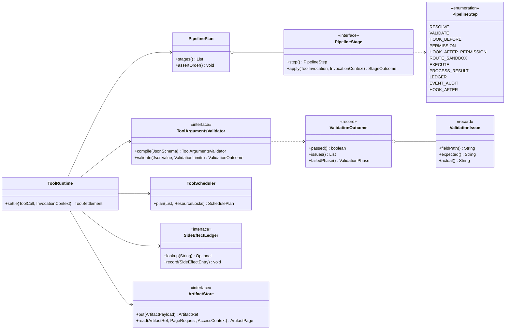
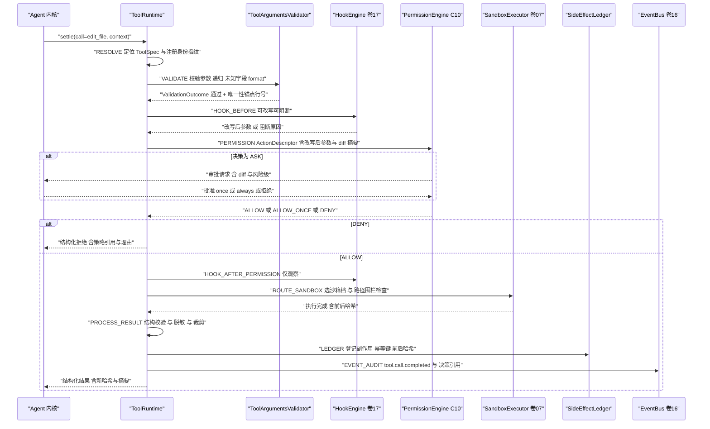
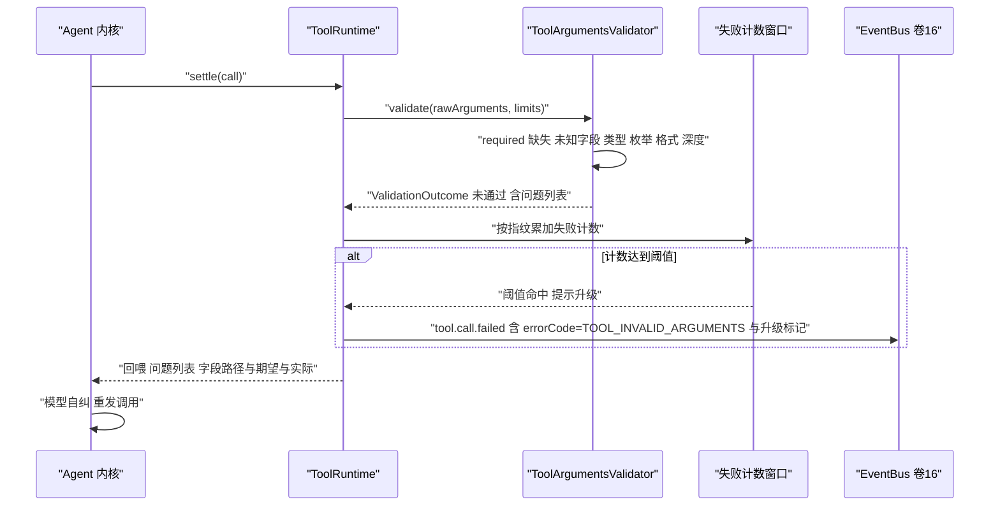
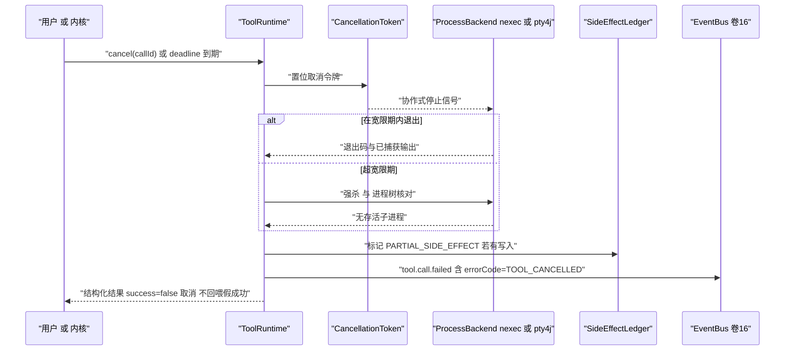
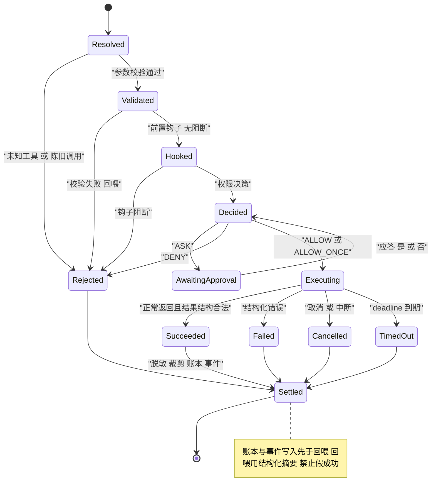

# C09 · 工具执行器与参数校验器（ToolExecutor + ToolArgumentsValidator）

> 定位：Phase B 组件级方案（双粒度交付的第二层）。本文件把 `docs/harness/impl/05-tool-system-impl.md` 中的「执行管线 + 参数校验」两个实现单元展开为可独立开发的组件契约；系统级方案仍是本组件的上位事实源，冲突一律按「系统级优先 + 登记修订建议」处理。
> 上游：`docs/harness/05-tool-system.md`（D-TOOL-1…12）、`impl/05`（REQ-TOOL-1…31、I-TOOL-1…5）、`docs/harness/17-hooks-system.md`（钩子点与顺序）、`docs/design/tool-system-design.md` v2.0（D37–D45 书写面）。
> 竞品证据：`research/competitors/02-opencode.md`、`03-codex.md`、`04-deepseek-harness.md`（引用统一 `[E1]` 源码事实级）；编号口径见 §② 注。
> 编号口径：`REQ-C-TOOL-n` / `I-C-TOOL-n` 为**组件层编号**，与系统级 `REQ-TOOL-n` / `I-TOOL-n`（`impl/05`）不共用序列、不复用号；两者映射逐条登记在需求表「来源」列。

---

## ① 定位与边界

### 1.1 组件构成

| 单元 | 职责 | 归属模块（卷 27 §4.1） |
| --- | --- | --- |
| `ToolRuntime` | 执行管线唯一入口（十步主干 + 后置钩子），产出 `ToolSettlement` | `harness-kernel/kernel-tool` |
| `PipelinePlan` / `PipelineStage` | 阶段列表固化与装配期顺序断言（I-C-TOOL-2） | `harness-kernel/kernel-tool` |
| `ToolArgumentsValidator` | canonical schema → 校验计划编译 + 调用期强校验（I-C-TOOL-1） | `harness-kernel/kernel-tool` |
| `ToolScheduler` | 资源读写集声明 → 冲突图 → 分片锁定序（与本组件同批交付） | `harness-kernel/kernel-tool` |
| `ToolOutputProcessor` + `ArtifactStore` 端口 | 脱敏 → 裁剪 → 外置 → 回读引用 | `kernel-tool` + `platform-{workspace,runtime-store}` |

### 1.2 边界

- **本组件负责**：名称解析（含别名 / 幻觉名候选）、参数校验、阶段编排、钩子与权限的**插入位**、沙箱与工作区路由、执行与取消、结果处理、幂等账本、事件与审计投影。
- **本组件不负责**：风险分级与决策算法（C10 / `impl/06`）；隔离执行实现（卷 07）；钩子匹配与阻断机制（卷 17）；注册表书写面与 schema 生成（`impl/05` §3.6.1，属 `kernel-tool/authoring`）；结果注入检测（卷 03 消费）。
- **职责铁律**：注册表不做权限决策，管线不做 schema 生成，校验器不做权限结论（`REQ-TOOL-31` 架构测试；「权限预检」类语义见 §⑨ 修订建议 X-C09-2）。

### 1.3 依赖方向

| 方向 | 对象 | 契约 |
| --- | --- | --- |
| 上游（端口） | 钩子引擎（卷 17） | `HookPoint.TOOL_CALL_BEFORE / PERMISSION_DECISION_AFTER / TOOL_RESULT_BEFORE / TOOL_CALL_AFTER`，默认 no-op |
| 下游（端口） | 权限引擎（C10） | `ActionDescriptor` → `PermissionDecision`（四值） |
| 下游（端口） | 沙箱（卷 07）/ 工作区（卷 20） | `SandboxRequirement` → `ExecutionLease`；路径围栏 |
| 下游（端口） | 事件总线（卷 16）/ 上下文（卷 03） | `tool.call.*` 事件；`ArtifactRef` 与预算裁剪 |
| 层带 | — | `kernel-tool` 零 Spring、零 Jackson（JSON 经 `JsonCodec` 端口）；平台适配器承载落库（`@Transactional(rollbackFor = Exception.class)`） |

---

## ② 需求清单（REQ-C-TOOL）

| ID | 需求 | 来源 | 验收要点 |
| --- | --- | --- | --- |
| REQ-C-TOOL-1 | 十步主干顺序不可跳、不可换序：改写钩子先于权限、权限后仅观察、脱敏先于外置、账本先于回喂 | 卷 05 §4.2；`impl/05` REQ-TOOL-6/7/8/9 | 拦截器记录步序；`ls` 被改写为 `rm -rf` 按 R4 判定 |
| REQ-C-TOOL-2 | 参数校验失败**不抛异常**，产出结构化问题列表回喂；同一指纹连续失败达阈值（3/5/8）升级提示 | `impl/05` REQ-TOOL-5/18、§3.6.2；opencode `settle` 先 `decodeUnknown` 再执行 `[E1] packages/core/src/tool/tool.ts` | `TOOL_INVALID_ARGUMENTS` 回喂；阈值触发事件 |
| REQ-C-TOOL-3 | 校验覆盖 canonical 子集：`required` / 未知字段 / 类型严格 / `enum` / `format` / 深度 ≤ 5 / 节点数上限；不支持类型注册期拒绝 | `impl/05` REQ-TOOL-2/3/4、§3.6.1 | 26 类类型映射逐格用例；`Map`/`Set`/`Optional` 拒绝 |
| REQ-C-TOOL-4 | 校验器预编译、编译后只读、调用期无 schema 树重解析；编译失败 = 注册期 Fail-Fast | `impl/05` §10「大 schema 预编译校验器」；本方案 I-C-TOOL-1 | 校验阶段耗时占管线预算 ≤ 30% |
| REQ-C-TOOL-5 | 结果分级：< 4000 token 内联；≥ 4000 外置 + 结构化头部；二进制仅元数据 + 媒体引用 | `impl/05` REQ-TOOL-12/14、§3.6.5 | 3999/4000/4001 边界；1MiB 输出模型可见量分离 |
| REQ-C-TOOL-6 | 外置失败**结算失败而非有损成功**；回读 `read_artifact` 重新鉴权，不继承首次授权 | `impl/05` REQ-TOOL-13、§3.6.5；opencode 设计原则 `[E1] specs/v2/tools.md:157` | 撤权后回读 `PERMISSION_DENIED`；写失败即失败 |
| REQ-C-TOOL-7 | 写工具幂等键 + 副作用账本（前后哈希），重放不重复执行；账本写失败中止回喂（不静默） | `impl/05` REQ-TOOL-9/20 | 中断重放账本命中复用首次摘要 |
| REQ-C-TOOL-8 | 超时 / 取消三级传播（内核 → 工具 → 子进程）：宽限期强杀 + 进程树核对；结果固定 `TOOL_CANCELLED`，部分写标记并显式列出 | `impl/05` REQ-TOOL-15、§3.6.6；opencode `forceKillAfter` `[E1]` | 取消注入无孤儿进程、无假成功 |
| REQ-C-TOOL-9 | 资源读写集声明 + 冲突图调度：读并行、同路径写串行、跨工作区并行、网络类令牌桶排队不拒绝 | `impl/05` REQ-TOOL-10/11、§3.6.4 | 冲突矩阵 8 格 + 丢更新反例 |
| REQ-C-TOOL-10 | 陈旧调用防护：`materialize` 快照 + 注册身份指纹不匹配即 `STALE_TOOL_CALL`，handler 不执行 | `impl/05` REQ-TOOL-26；opencode `Stale tool call` 不变式 `[E1] specs/v2/tools.md` | 注册热替换后旧调用被拒 |
| REQ-C-TOOL-11 | 名称解析与注册身份绑定：投影名 / 别名查注册表反查，禁止字符串二次切分；幻觉名回喂相似候选 | `impl/05` §3.6.3 步骤 1、REQ-TOOL-29；MCP 命名空间防伪（卷 09 §10.5） | 幻觉名回喂候选列表用例 |
| REQ-C-TOOL-12 | 路径围栏双侧执行（工具 + 沙箱）：`..` / 符号链接 / 8.3 短名 / UNC / 大小写折叠；校验与打开之间以 fd + inode 复核 | 卷 05 §4.2 步骤 6、§10 安全段；卷 07 §10.4 同口径 | 路径穿越 12 变体全部拒绝 |

> 注：REQ-C-TOOL-2/6 与 REQ-C-TOOL-10 直接引自竞品源码事实（opencode）；其余为 `impl/05` 的组件层细分，不新增系统级语义。

---

## ③ 关键设计决策（I-C-TOOL）

| ID | 主题 | 选定 | 被放弃分支与代价 | 回退触发 |
| --- | --- | --- | --- | --- |
| I-C-TOOL-1 | 校验器实现形态 | **注册期编译校验计划**（schema → 不可变判定节点数组）+ 调用期纯内存执行 | 放弃「调用期遍历 schema 树」（每次调用都要解析 JSON 树 + 正则重编译，P95 预算不可控）；放弃「仅靠强类型反序列化」（失败即抛异常，违反 REQ-C-TOOL-2） | 无（编译失败即注册期 Fail-Fast，不做降级路径） |
| I-C-TOOL-2 | 管线编排形态 | **阶段对象化**：`PipelineStage` 列表 + `PipelinePlan` 装配期唯一性与顺序断言 | 放弃 `settle()` 内硬编码顺序（无法单步测试、无法机械断言 hook/permission 插入序）；代价是装配复杂度上升 | 阶段对象出现跨阶段可变状态共享 → 收敛为“阶段 + 只读上下文快照”单例，不允许回退硬编码 |
| I-C-TOOL-3 | 校验失败语义 | **全量问题列表回喂**（上报条数上限内，超出折叠计数） | 放弃首错短路（模型需多次往返才修完参数）；放弃抛异常（违反回喂语义）；代价是返回体增大，受上限约束 | 回喂体积超 token 预算 → 折叠为「首个问题 + 剩余计数」并保留完整问题于外置工件 |
| I-C-TOOL-4 | 取消与超时的结果语义 | `TOOL_CANCELLED` / `TOOL_TIMEOUT` **独立错误码** + `PARTIAL_SIDE_EFFECT` 标记 | 放弃统一「失败」码（模型无法区分可重试性；超时可重试、取消不可）；代价是错误码面变大（受 `ToolErrorCode` 枚举约束） | 无 |

---

## ④ 类图与关键签名



```java
/**
 * 工具参数校验器（组件级契约，I-C-TOOL-1）。
 * 注册期把 canonical schema 编译为不可变判定计划；调用期纯内存执行、线程安全。
 * 校验失败**不抛异常**，以结构化问题列表回喂模型（I-C-TOOL-3）。
 */
public interface ToolArgumentsValidator {

    /**
     * 编译校验计划。
     *
     * @param canonicalSchema 工具声明的 canonical schema（根为 object、additionalProperties 显式为 false）
     * @return 可复用的校验器实例（编译后只读）
     */
    static ToolArgumentsValidator compile(JsonSchema canonicalSchema) {
        return CompiledSchemaValidator.of(canonicalSchema);
    }

    /**
     * 校验一次工具调用的原始参数。
     *
     * @param rawArguments 已由 JsonCodec 解码的原始参数树（契约要求：未做任何宽容转换）
     * @param limits 校验限额（上报条数上限、递归节点上限；来自工具配置，禁止硬编码）
     * @return 校验结论；未通过时逐条含字段路径 / 期望 / 实际（敏感值已掩蔽）
     */
    ValidationOutcome validate(JsonValue rawArguments, ValidationLimits limits);
}
```

> 阶段枚举声明顺序即执行顺序（`PipelineStep` 由 `PipelinePlan.assertOrder()` 在装配期机械断言）；`HOOK_AFTER_PERMISSION` 与 `HOOK_AFTER` 的实现体只允许观察与通知，装配期检查其 `PipelineStage` 不被替换为改写型实现（REQ-C-TOOL-1）。

---

## ⑤ 核心时序图

### 5.1 主路径：一次 `edit_file` 的十步管线

**前置条件**：工作区已挂载、会话存在有效权限模式、工具已注册且未整条 deny 隐藏。
**主路径**：解析 → 校验 → 前置钩子 → 权限（含 diff 预览）→ 权限后钩子 → 沙箱路由 → 执行 → 结果处理 → 账本 → 事件 → 回喂。
**异常与补偿**：锚点不唯一 → 回喂候选上下文；权限 DENY → 回喂理由与策略引用；写后校验和不一致 → 回滚为写前内容并报错。
**幂等与并发点**：幂等键 = `sha256(tool|path|oldText|newText|workspaceVersion)`；写集声明使同路径写串行。



### 5.2 参数校验失败回喂与连续失败升级

**前置条件**：模型产出参数不满足 schema（缺参 / 类型漂移 / 未知字段）。
**主路径**：校验计划逐节点求值 → 收集全量问题 → 折叠与脱敏 → `ToolResult(success=false)` 回喂 → 模型自纠重发。
**异常与补偿**：同一指纹连续失败达阈值（配置 `3,5,8`）→ 升级 `log.error` 并附加一次强提示；不触发任何副作用。
**幂等与并发点**：校验无副作用、无锁；失败计数按 `(toolName, argsDigest)` 计入会话滑动窗口（见 §⑨ X-C09-1）。



### 5.3 取消 / 超时与部分副作用

**前置条件**：用户或内核发起中断，或工具级 deadline 到期。
**主路径**：取消令牌置位 → 协作式停止 → 宽限期 → 强杀 → 进程树核对 → 结果标 `TOOL_CANCELLED`。
**异常与补偿**：强杀后进程树仍存活 → 记 `tool.process.orphan` 安全事件并二次清理；已发生部分写 → 账本标 `PARTIAL_SIDE_EFFECT` 并在回喂中显式列出。
**幂等与并发点**：取消本身幂等（重复取消无副作用）；取消不写只读缓存；宽限期与强杀间隔为配置项。



---

## ⑥ 状态机：工具调用生命周期



---

## ⑦ 接口与依赖矩阵

| 接口 | 方法 | 输入 | 输出 | 依赖方向 |
| --- | --- | --- | --- | --- |
| `ToolRuntime` | `settle(ToolCall, InvocationContext)` | 调用（名称 / 原始参数 / callId / 注册指纹）+ 上下文（会话 / 工作区 / 取消令牌 / 预算 / 权限模式） | `ToolSettlement`（成功 / 失败 / 取消均结构化） | kernel → 各端口 |
| `ToolArgumentsValidator` | `compile` / `validate` | canonical schema；原始参数 + 限额 | 校验计划；`ValidationOutcome` | 纯逻辑 |
| `PipelinePlan` | `stages()` / `assertOrder()` | 装配期阶段列表 | 固定顺序；装配期异常 | 纯逻辑 |
| `ToolScheduler` | `plan(List, ResourceLocks)` | 本批调用 + 锁表 | `SchedulePlan`（分组 + 串行原因） | kernel → 锁实现端口 |
| `SideEffectLedger` | `lookup` / `record` | 幂等键 / 副作用条目 | 首次结果摘要 | 端口（平台实现落库，短事务） |
| `ArtifactStore` | `put` / `read` | 载荷 / 分页请求 + `AccessContext` | `ArtifactRef` / `ArtifactPage` | 端口（本地 / 对象存储双实现） |
| `JsonCodec` | 解码 / 编码 | JSON 文本 | 树 / 文本 | 端口（内核零 Jackson，卷 27 R1） |

| 依赖方向 | 允许 | 禁止 |
| --- | --- | --- |
| `harness-contract`（工具契约包） | 纯契约 + `slf4j-api` 门面 | Jackson、Spring、平台模块 |
| `harness-kernel/kernel-tool` | `harness-contract` | 权限实现类（只依赖 `ActionGateway` 接口）、Spring 注解 |
| `platform-{workspace,runtime-store,persistence}` | `harness-contract` + Spring | 反向被 kernel 依赖 |

---

## ⑧ 关键算法

### 8.1 十步主干 + 后置钩子（含钩子与权限插入顺序）

| 序 | 阶段 | 实现要点 | 插入顺序约束 | 失败行为 |
| --- | --- | --- | --- | --- |
| 1 | RESOLVE | 名称 → 注册表反查 → 别名 → 指纹；幻觉名相似候选（编辑距离 + 语义索引） | 先于一切；与注册身份绑定（REQ-C-TOOL-11） | 结构化错误含候选 |
| 2 | VALIDATE | 预编译校验计划执行（§8.2） | 先于改写钩子（改写输入必须是合法参数） | 回喂问题列表 |
| 3 | HOOK_BEFORE | 可阻断、可改写（字段白名单） | **改写先于权限**（顺序不变式①） | 阻断 → 回喂原因 |
| 4 | PERMISSION | 用**改写后**参数构造 `ActionDescriptor`；ASK 进入审批 | 权限后不得再出现改写型钩子（不变式②） | DENY → 回喂；ASK → 审批 |
| 5 | HOOK_AFTER_PERMISSION | 仅观察（记录 / 通知） | 观察类钩子唯一允许位 | 失败仅告警 |
| 6 | ROUTE_SANDBOX | `SandboxRequirement` → `ExecutionLease`；目标工作区与路径围栏解析 | 沙箱强制在放行**之后**；策略钩子嵌于本步且只能收窄 | 不可用 → 显式错误 + 降级建议 |
| 7 | EXECUTE | 虚拟线程 + deadline；输出流限量；取消令牌传播 | — | 超时 / 取消 → 结构化结果（非成功） |
| 8 | PROCESS_RESULT | 结果改写钩子（仅字段级掩蔽视图）→ 结构校验 → **脱敏** → 裁剪 / 外置 | **脱敏先于外置**（不变式③）；改写钩子先于脱敏但不可见敏感明文 | 结构不符 → 结构化错误 |
| 9 | LEDGER | 写工具登记副作用账本（幂等键 + 前后哈希）；只读工具写缓存 | **先落账再回喂**（不变式④） | 账本写失败 → 中止回喂（不静默） |
| 10 | EVENT_AUDIT | `tool.call.*` + 决策引用 + 改写 diff；审计投影交平台适配器 | 事件失败不阻塞回喂 | 仅告警 + 补写任务 |
| 11 | HOOK_AFTER | 观察 / 通知 / 格式化 | 仅观察 | 仅告警 |

**顺序不变式（与卷 17 §4.3 十二步全序表同源，装配期 `assertOrder()` 断言）**：① 改写型钩子先于权限决策；② 权限后仅观察类钩子；③ 脱敏先于裁剪与外置；④ 幂等登记与事件写入先于回喂。任一步被跳过即视为管线缺陷（顺序断言测试覆盖）。

### 8.2 参数校验判定顺序（短路边界与上限）

1. `required` 缺参 → 收集；2. 未知字段（`additionalProperties:false`）→ 收集；3. 类型严格匹配（数字不做字符串宽容）；4. `enum` 越界；5. `format` 可解析性（`date` 按 ISO_LOCAL_DATE；`date-time` 接受带 / 不带偏移）；6. 递归对象 / 数组（深度 ≤ 5、节点数上限）；7. 语义形态预检（仅限**不产生权限结论**的形态项；路径存在性与可写性判定下沉至步骤 6 围栏，见 X-C09-2）。

判定原则：1–6 步全量收集（受 `limits` 上报上限约束，超出折叠计数）；第 7 步只做格式级预检，任何路径存在性结论必须复用 `canonical + inode` 身份（防 check 与 use 之间调包）。产出统一转 `ToolResult(success=false, errorCode=TOOL_INVALID_ARGUMENTS)`。

### 8.3 资源冲突调度（并发冲突消解算法）

1. 归一化资源键：`FILE:<canonical>`、`DIR:<path>`、`GIT_INDEX:<repoId>`、`PROC:<workspaceId>`、`PORT:<workspaceId>:<port>`、`NET:<domain>`、`SESSION:<id>`、`WORKSPACE_LOCK:<id>`。
2. `exclusive=true` 的写 / 执行声明与任何冲突键构成互斥边；读声明共享计数锁（读读并行）。
3. 联通分量内按调用序号拓扑定序（无环形等待 ⇒ 死锁不可能）；跨工作区分量天然并行。
4. 网络类合并入令牌桶（并发上限配置化），超限**排队而非拒绝**。
5. 输出 `SchedulePlan`（分组 + 串行原因）；串行发生发 `tool.concurrency.serialized`；执行期发现声明不足（命令隐式写文件）→ 记 `tool.resource.undeclared` 并降级为独占该工作区执行锁。

---

## ⑨ 错误处理与降级

| 场景 | 错误码 / 结果 | retryable | 恢复动作 |
| --- | --- | --- | --- |
| 未知 / 幻觉工具名 | `TOOL_NOT_FOUND` | 否（回喂候选后可再试） | 回喂相似候选 |
| 参数校验失败 | `TOOL_INVALID_ARGUMENTS` | 否 | 回喂问题列表；达阈值升级提示 |
| 权限 DENY | `PERMISSION_DENIED` | 否 | 回喂策略引用与建议 |
| 审批通道不可用 / 超时 | `APPROVAL_UNAVAILABLE` / `APPROVAL_EXPIRED` | 否（fail-closed）/ 是（重发） | 一律按拒绝回喂，不静默放行 |
| 沙箱档不可用 / 围栏拒绝 | `SANDBOX_UNAVAILABLE` / `SANDBOX_DENIED` | 部分（降级档可重试） | 按降级地板选替代档；低于地板即拒绝 |
| 路径逃逸 | `WORKSPACE_PATH_DENIED` | 否 | 拒绝 + 安全事件 |
| 超时 / 取消 | `TOOL_TIMEOUT` / `TOOL_CANCELLED` | 是 / 否 | 账本记 `PARTIAL_SIDE_EFFECT`（若有写入） |
| 陈旧调用 | `STALE_TOOL_CALL` | 否 | handler 不执行；记审计事件 |
| 外置存储不可用 | `DEPENDENCY_UNAVAILABLE` | 是 | 回落本地受管目录并记 `tool.artifact.fallback`；**不回退为有损内联** |
| 引用再读过期 | `ARTIFACT_UNAVAILABLE` | 是（重跑工具） | 建议重跑，不返回截断内容冒充完整 |
| 脱敏失败 | `INTERNAL_ERROR` | 否 | 阻断回喂（安全优先）；原始结果不入模型历史 |
| 账本写失败 | `INTERNAL_ERROR` | 是 | 中止回喂；不产生「已执行但未记账」的静默状态 |

**降级策略**：索引缺失 → 精确扫描 + `tool.search.degraded`；对象存储 → 本地目录；PTY 不可用 → 禁用交互工具并写入能力报告；事件总线不可用 → 结果仍回喂（事件非回喂前提）+ WARN 计数 + 补写。

**与系统级方案的差异与修订建议（不冲突，登记待汇总）**：
- **X-C09-1（建议）**：`impl/05` REQ-TOOL-5/18 的「同一 toolCall 连续 N 次失败」措辞不成立（一次调用是单发事件），施工口径应为 `(toolName, argsDigest)` 会话滑动窗口计数；本组件按后者实现，建议台账汇总时以 X 号登记对 `impl/05` §2.1 的措辞修订。
- **X-C09-2（建议）**：卷 05 §4.1「校验（Validate）…语义校验（路径存在性、**权限预检**）」与 D-PERM-3「单一动作网关」存在双入口风险——预检不得产出权限结论；本组件将路径存在性判定下沉至步骤 6 围栏（复用 fd + inode 身份），建议登记修订。
- 异常命名沿用 X-82（`HarnessException(ErrorCode)` 内核层 / `BusinessException` 外壳层），本组件不新增异常类型。

---

## ⑩ 性能与并发

| 指标 | 预算 | 手段 |
| --- | --- | --- |
| 管线纯开销 | P95 ≤ 20ms | 校验计划预编译；脱敏与裁剪流式；审计投影异步短事务 |
| 校验阶段占比 | ≤ 30% 管线预算 | 判定节点数组短路求值；无 JSON 重解析 |
| 分片锁获取 | P99 ≤ 5ms | 按资源键分片（默认 64 片，配置化）；锁内不做 IO |
| 大结果内存 | 1GiB 输出增量 ≤ 32MiB | 流式裁剪 + 外置分块写 |
| 单会话并发调用 | ≤ 64（配置化） | 虚拟线程 + 信号量；网络族令牌桶 |

**并发冲突消解**：见 §8.3。**锁序纪律**：权限决策（阶段 4）先于任何资源锁获取，审批等待发生在阶段 4 内部——**等待审批期间不持有分片锁**，避免「持锁等人工」造成全局尾延迟；分片锁仅在阶段 6–9 区间按 `SchedulePlan` 持有。**取消传播**：取消令牌为协作式 + 强制中断兜底；取消不写只读缓存；被取消调用释放锁后必须先写账本标记再结算。**事务纪律**：执行是外部调用，禁止包进数据库事务；账本 / 审计由平台适配器在前后各一次独立短事务（`@Transactional(rollbackFor = Exception.class)`）落库。

---

## ⑪ 测试要点

| 类别 | 用例 | 断言 |
| --- | --- | --- |
| 顺序 | 步序断言（拦截器记录 11 步序） | 与 `PipelineStep` 声明顺序一致；跳过任一步即失败 |
| 越权 | 路径穿越 12 变体 + 符号链接调包（校验与打开之间替换链接） | 全部拒绝且记安全事件；fd + inode 复核命中 |
| 越权 | 前置钩子把 `ls` 改写为 `rm -rf` | 按改写后形态以 R4 判定（与 C10 联合用例） |
| 解析歧义 | 畸形补丁三类（空 pattern、`pattern.len() > lines`、匹配三级降级） | 无未捕获异常；错误结构化含修复建议 |
| 解析歧义 | 幻觉工具名 / 别名映射变更 | 回喂候选列表；映射变更产生事件 |
| 阈值 | 3999 / 4000 / 4001 token 边界；1MiB 输出 | 分级正确；模型可见量 ≤ 上限、完整日志可分页 |
| 幂等 | 中断重放（只读 / 幂等写 / 非幂等写各一） | 账本按 `ABANDONED` / `RETRIED` / `PARTIAL_SIDE_EFFECT` 正确分类；副作用计数为 1 |
| 取消 | 执行中取消 + `kill -9` 注入 | 无孤儿进程；结果 `TOOL_CANCELLED`；无假成功 |
| 并发 | 冲突矩阵 8 格 + 丢更新反例 + 网络并发上限压测 | 串行组与顺序执行等价；峰值并发 ≤ 配置值且排队不拒绝 |
| 韧性 | 外置存储写入中断；脱敏服务不可用；事件总线不可用 | 分别：中止结算（不回退有损内联）/ 阻断回喂 / 结果仍回喂 + WARN 补写 |
| 性能 | `ToolPipelineOverheadTest`、`ToolSchedulerContentionTest` | P95 ≤ 20ms；64 并发下锁等待 P99 ≤ 5ms |

```bash
# 门禁（目标模块名，卷 27 §4.1；R07 收敛后 v1 名仅作迁移对账）
mvn -pl harness-kernel/kernel-tool -am test        # 校验器 / 管线 / 调度（零框架、可离线）
mvn -pl harness-host/host-bootstrap -am test       # main 链路（装配 + 事件 + 持久化）
```
