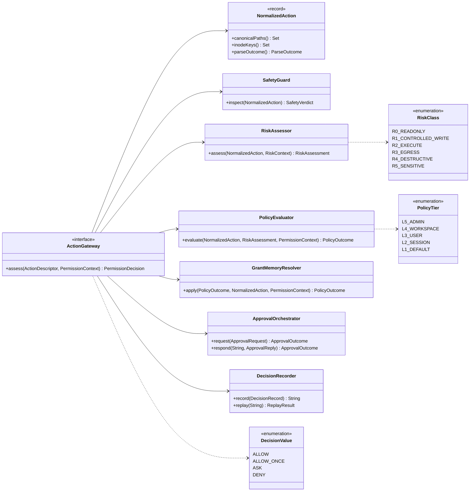
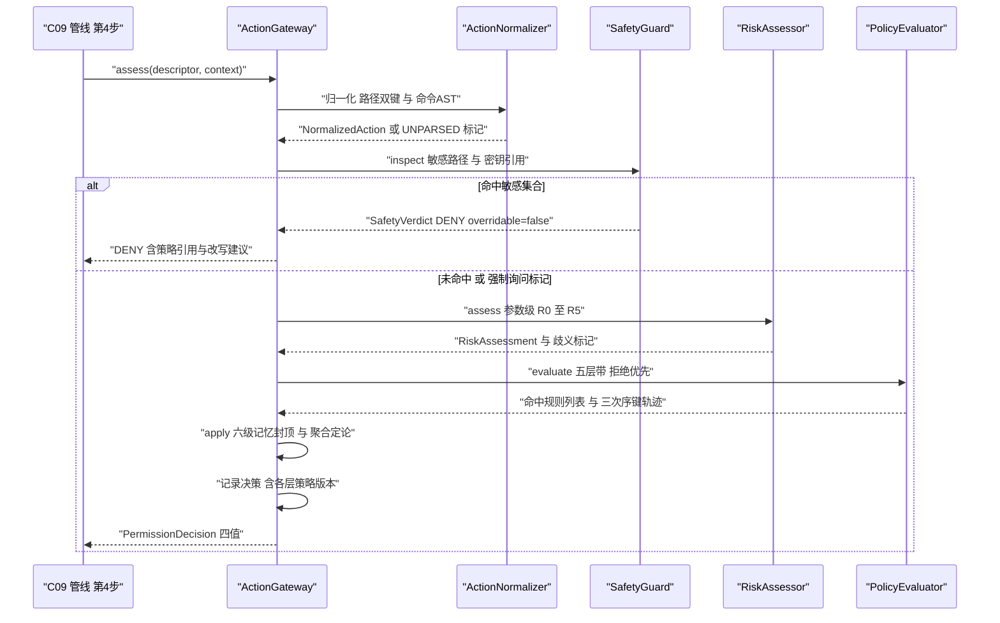
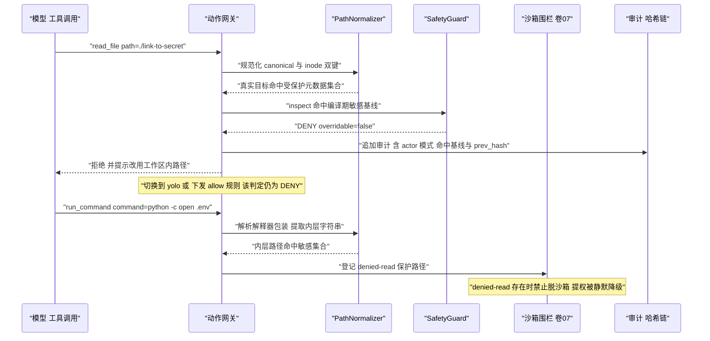
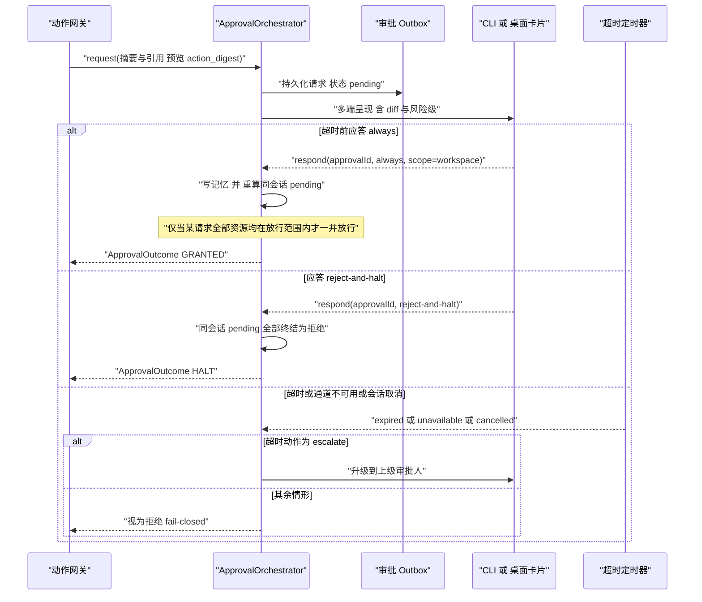
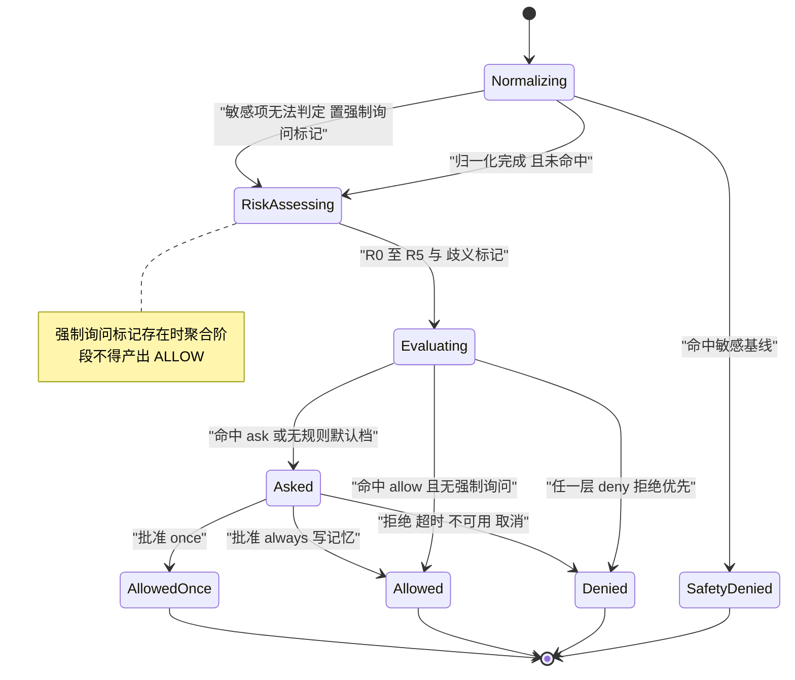
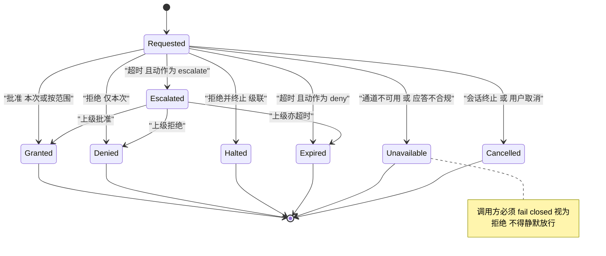

# C10 · 权限决策引擎（PermissionEngine）

> 定位：Phase B 组件级方案（双粒度交付的第二层）。本文件把 `docs/harness/impl/06-permission-system-impl.md` 的「动作网关决策链」展开为可独立开发的组件契约；系统级方案仍是本组件上位事实源，冲突按「系统级优先 + 登记修订建议」处理。
> 上游：`docs/harness/06-permission-system.md`（D-PERM-1…12）、`docs/harness/07-sandbox-security.md`、`docs/harness/30-security-engineering.md`、`impl/06`（REQ-PERM-1…30、I-PERM-1…6）。
> 竞品证据：`research/competitors/01-claude-code-purpose-built.md`（sensitive-path 穿透 bypass 与 `safetyCheck` 免疫）、`03-codex.md`（`AskForApproval` 四态与 denied-read 不变式）、`08-gemini-cli.md`（五层信任带 + 带内小数优先级 + 策略完整性）；引用统一 `[E1]` 源码事实级。
> 编号口径：`REQ-C-PERM-n` / `I-C-PERM-n` 为**组件层编号**，与系统级 `REQ-PERM-n` / `I-PERM-n` 不共用序列、不复用号；映射见 §②「来源」列。
> 全局约束：H-008（权限 = 决策层、沙箱 = 执行层，纵深防御）；内核零 Spring、零 IO（I/O 经端口，落点见 §⑦）。

---

## ① 定位与边界

### 1.1 组件构成（九阶段决策链的组件视图）

| 单元 | 职责 | 归属模块（卷 27 §4.1） |
| --- | --- | --- |
| `ActionGateway` | 唯一权限入口，九阶段编排，返回四值决策 | `harness-kernel/kernel-permission` |
| `ActionNormalizer` + `PathNormalizer` | 路径双向规范化（canonical + inode 双键）、命令 AST、外部目标 | 同上 |
| `SafetyGuard` | 敏感集合首步短路（`overridable=false`）；不可判定 → `ESCALATE_ASK` | 同上（`permission.safety`） |
| `RiskAssessor` | 参数级 R0–R5 分级（§8.1），地板取高 + 歧义标记 | 同上 |
| `PolicyEvaluator` | 五层带求值、带内小数优先级、具体度次序键、拒绝优先聚合 | 同上 |
| `GrantMemoryResolver` | 六级范围记忆命中与封顶（不把 DENY 变 ALLOW） | 同上 |
| `ApprovalOrchestrator`（协作组件 C11） | 第 8 阶段调用契约：outbox、幂等应答、批量传播、级联拒绝、超时收口（详设见 `impl/components/C11-approval-orchestrator.md`） | 同上 + `platform-persistence` |
| `DecisionRecorder` + `BypassScanner` | 决策记录（含轨迹）、回放、审计扫描旁路副作用 | 同上 + `platform-audit` |

### 1.2 边界与层带

- **负责**：从 `ActionDescriptor` 到 `PermissionDecision` 的全部判定（九阶段中 1–7 与 9）、审批调用契约（第 8 阶段）、决策记录与回放、旁路检测、策略完整性消费。
- **审批编排边界**：编排本体（outbox / 多端回收 / 端侧映射）为协作组件 **C11**，本组件只定义「ASK → `ApprovalOutcome`」的调用契约与 fail-closed 底线（§5.3、§⑥.2 为契约面）。
- **不负责**：隔离执行与 `denied-read` 围栏（卷 07 按 fd 复核）；工具管线内部（C09，本组件只占管线第 4 步与第 5 步插入位）；企业身份角色（卷 24，仅消费 `actor`/`role`）；钩子匹配机制（卷 17）。
- **硬约束**：模式、规则、钩子、插件、审批均不能放宽 `SafetyGuard`；权限放行 ≠ 可执行（沙箱仍可拒绝）。
- **依赖**：上游 C09（改写后参数的 `ActionDescriptor`）与卷 17（改写后必须重跑 SafetyGuard 与风险分级）；下游沙箱（`SandboxRequirement` / 消费 `sandbox.denied`）、事件总线、持久化（`oc_permission_decision` / `oc_approval` / `oc_grant_memory` / `oc_policy`）。`kernel-permission` 不引容器注解、不做 I/O，平台适配器 `@ConditionalOnMissingBean` 装配。

---

## ② 需求清单（REQ-C-PERM）

| ID | 需求 | 来源 | 验收要点 |
| --- | --- | --- | --- |
| REQ-C-PERM-1 | R0–R5 落到「工具 + 参数」粒度：命令 AST + 前缀字典 + 参数模式集，地板取高（`ls` ≠ `rm -rf`） | 卷 06 §4.1、D-PERM-1；`impl/06` REQ-PERM-1 | 30+ 参数级用例（含 `rm -rf /`、`push --force`） |
| REQ-C-PERM-2 | 解析歧义处置：`PARTIAL` ≥ R2、`UNPARSED` = R4，**禁止规则沉淀**，可配 `ask`/`ask-escalate`/`deny` | `impl/06` REQ-PERM-2、§3.7.2；gemini-cli shell-safety 测试面 `[E1] shell-safety.test.ts` | 21 歧义源逐条用例；编码包装判 R4 且仅 ALLOW_ONCE |
| REQ-C-PERM-3 | 四值决策 + 原因 + 命中规则引用 + 完整求值轨迹（可回答「哪条策略、哪条规则、为什么」） | 卷 06 D-PERM-4；`impl/06` REQ-PERM-3 | `permission.explain` 输出含全阶段轨迹 |
| REQ-C-PERM-4 | 求值规则：拒绝优先、更具体者覆盖更宽泛者、强制项不可被下级放宽 | 卷 06 §4.2①②③；`impl/06` REQ-PERM-4 | 三组冲突用例；覆盖尝试记 `permission.override.denied` |
| REQ-C-PERM-5 | 策略源优先级：`ADMIN > WORKSPACE > USER > SESSION > DEFAULT`；带内 `1 + priority/1000`；三次序键可解释 | `impl/06` REQ-PERM-5/§3.7.5；gemini-cli 五层带 `[E1] packages/core/src/policy/policies/read-only.toml` | 五层冲突用例；同层精度与决胜告警用例 |
| REQ-C-PERM-6 | 通配语义：`tool` 允许 `*` 与 `MCP:<server>:*`（前缀必须完整）；`pathGlob` gitignore 风格、**禁否定模式**；匹配前双向规范化 | `impl/06` REQ-PERM-7/§3.7.3；codex 保护元数据集合 `[E1]` | 12 类路径别名用例；`MCP:*` 被拒 |
| REQ-C-PERM-7 | 命令前缀 arity 归约（flags 不计 token、最长前缀获胜）；含重定向/管道/串联不得命中前缀 allow（除显式声明） | `impl/06` REQ-PERM-8；opencode `BashArity.prefix` `[E1] arity.ts`；gemini-cli `allowRedirection` `[E1] policy-engine.ts:176-180` | `git checkout main` 命中 `git checkout`；`npm test > out.log` 降级 ASK |
| REQ-C-PERM-8 | `SafetyGuard` 首步短路且 `overridable=false`：模式/规则/钩子/插件/审批不可放宽；无法判定 → `ESCALATE_ASK`（聚合不得产 ALLOW） | `impl/06` REQ-PERM-18、I-PERM-6；claude-code `safetyCheck` bypass 免疫与 `classifierApprovable` `[E1] permissions.ts:1261-1273,1650-1674` | 5 类绕过尝试全部 DENY；`yolo` 覆盖 SAFETY 失败 |
| REQ-C-PERM-9 | `denied-read` 存在时**禁止脱沙箱执行**：提权与规则放行静默降级为默认沙箱 | `impl/06` REQ-PERM-25；codex `unsandboxed_execution_allowed` `[E1] sandboxing.rs:239-307` | 提权被降级；`sandbox.denied` 链路完整 |
| REQ-C-PERM-10 | 审批编排：通道无关、outbox 先落库再呈现、幂等应答、批量传播（**全部资源均放行**才回溯）、级联拒绝、超时 `deny`/`escalate` | 卷 06 D-PERM-5/6；`impl/06` REQ-PERM-9…13；opencode `always` 传播 `[E1] permission.ts:250-283` | 混合资源不误放行；三挂起请求同时终结；重启续答 |
| REQ-C-PERM-11 | fail-closed：通道不可用/应答缺失/不合规/策略库不可读 → 一律拒绝；非交互 `ask` → `deny` | `impl/06` REQ-PERM-19/20；deepseek `unavailable` `[E1] docs/subsystems/approval.md`；gemini-cli `nonInteractive` `[E1] policy-engine.ts` | 通道断开 → ASK 降级 DENY |
| REQ-C-PERM-12 | 记忆六级封顶：不把 DENY 变 ALLOW、不突破模式与敏感集合；危险操作（`reset --hard`/`push --force`）禁 `always` | `impl/06` REQ-PERM-14/28；codex `Forbidden` 分支语义 `[E1]` | 六级撤销生效；审批界面不提供 `always` |
| REQ-C-PERM-13 | 企业基线技术强制：锁定层预置、签名 + 逐文件哈希（`MATCH`/`MISMATCH`/`NEW`）、版本单调、下级覆盖阻断 | `impl/06` REQ-PERM-16/17；gemini-cli `PolicyIntegrityManager` `[E1] policy/integrity.ts` | 篡改启动拒绝 + 事件；覆盖阻断 |
| REQ-C-PERM-14 | 审批预览与执行同一 `action_digest`；请求不含完整敏感参数；预览纯文本渲染 | `impl/06` REQ-PERM-30、§3.7.6-11/12 | 不一致 → `preview.mismatch`；请求体无密钥串 |
| REQ-C-PERM-15 | 决策回放 + 审计哈希链（`prev_hash`/`entry_hash`）仅追加不可改 | 卷 06 D-PERM-12/§4.4；`impl/06` REQ-PERM-21/22 | 100 条重放一致率 100%；篡改告警 |

---

## ③ 关键设计决策（I-C-PERM）

| ID | 主题 | 选定 | 被放弃分支与代价 | 回退触发 |
| --- | --- | --- | --- | --- |
| I-C-PERM-1 | 决策链编排形态 | **九阶段 `ChainStage` 管线 + 结构化轨迹片段**；`overridable` 标记随阶段传递（置 false 后聚合不得产 ALLOW） | 放弃「单方法 if + 提前 return」（安全项可能被提前 return 绕过——claude-code 特意把 `dontAsk` 转换放最外层即为此 `[E1]`）；代价是阶段多 | 轨迹体积超预算 → 首末阶段全量 + 中间摘要（禁止丢阶段名） |
| I-C-PERM-2 | 匹配与次序键 | **谓词编译为不可变判定器数组 + `specificity` 具体度评分**（带位 → priority → 具体度 → id 字典序，全入轨迹） | 放弃「来源顺序 findLast 后写获胜」（顺序不稳定、企业锁定无处安放）；放弃 DAG 求值（不可解释） | 具体度同分冲突超阈 → id 字典序 + 策略告警 |
| I-C-PERM-3 | 归一化身份化单点 | **`canonical + inode` 双键一次产出**，安全判定/规则匹配/围栏登记共用；执行期复核归沙箱按 fd | 放弃「策略侧字符串匹配 + 执行侧独立校验」（TOCTOU、别名绕过面大）；代价是归一化失败必须 fail-closed | 链接链断裂不可判定 → `ESCALATE_ASK`，不降级为原文匹配 |
| I-C-PERM-4 | 决策与编排分离 | `assess()` **纯函数**（无 I/O、无锁、无等待）；记录/审批/广播在编排层（outbox + 异步） | 放弃「决策内写库 + 阻塞等审批」（决策线程被人工延迟污染，P95 不可控）；代价是落库窗口由 outbox 补偿 | 无（审批等待必须移出决策路径） |

---

## ④ 类图与关键签名



```java
/**
 * 动作网关：所有副作用的唯一权限入口（D-PERM-3 / I-C-PERM-4）。
 * 九阶段顺序固定：动作构造 → 归一化 → 敏感校验 → 风险分级 → 策略求值 → 记忆求值 → 聚合 → 审批 → 记录。
 * 本方法不抛业务失败：业务失败一律以 DENY + 原因返回，由 C09 管线回喂模型。
 */
public interface ActionGateway {

    /**
     * 评估一个动作并返回四值决策。
     *
     * @param descriptor 动作描述（命令类动作必须携带命令原文，缺失按契约违约 fail-closed）
     * @param context 权限上下文（模式 / 角色 / 租户 / 时段 / 非交互标记 / 强制询问标记）
     * @return 决策结果（含风险类、命中规则引用、求值轨迹与可授予范围）
     */
    PermissionDecision assess(ActionDescriptor descriptor, PermissionContext context);
}
```

---

## ⑤ 核心时序图

### 5.1 决策链全序（ALLOW / ASK / DENY 与轨迹）

**前置条件**：C09 管线第 2 步校验通过、前置钩子已改写参数（改写结果即本流程输入）。
**主路径**：归一化（双键）→ 敏感短路（PASS）→ 风险分级 → 五层求值 → 记忆封顶 → 聚合 → 记录。
**异常与补偿**：归一化失败 / 命令暴走超深 → 直接 DENY 并给改写建议；策略库不可读 → fail-closed DENY + `permission.policy.unavailable`。
**幂等与并发点**：同一 `actionId` 重复评估返回同一 `decisionId`；策略缓存键含 `tenantId` + 版本，跨租户不共享。



### 5.2 敏感路径不可 bypass（越权尝试与沙箱联动）

**前置条件**：模型尝试经路径别名与命令间接读取凭证文件（claude-code 同类绕过面：sensitive-path 穿透 bypass `[E1]`）。
**主路径**：归一化暴露真实目标 → SafetyGuard 短路 DENY → 审计留痕 → 回喂改写建议。
**异常与补偿**：无法判定（链接不可解析 / 元数据受限）→ `ESCALATE_ASK` 升级企业审批人，绝不默认放行；同路径重复尝试计数触发防滥用事件。
**幂等与并发点**：安全判定无状态且幂等；`denied-read` 在执行层为单点谓词，提权与规则放行均触发静默降级。



### 5.3 审批超时 / 通道不可用 / 取消（fail-closed 与幂等）

**前置条件**：决策为 `ASK`；审批通道可用性 / 应答者在流程中发生变化。
**主路径**：outbox 持久化 → 多端呈现 → 应答或超时 → 写记忆（按范围）→ 重算 pending → 放行 / 拒绝。
**异常与补偿**：超时按 `deny`（默认）或 `escalate`；通道全断 → `unavailable` → fail-closed；重复应答 → 幂等返回原结果；会话取消 → pending 全部终结为 `cancelled`。
**幂等与并发点**：同一 `approvalId` 应答 CAS 只生效一次；终态不可迁移；批量传播按 `approvalId` 分区串行重算（见 §⑨ X-C10-2）。



---

## ⑥ 状态机

### 6.1 决策定论状态机（含安全短路与强制询问）



### 6.2 审批生命周期（终态不可迁移）



---

## ⑦ 接口与依赖矩阵

| 接口 | 方法 | 输入 → 输出 | 依赖方向 |
| --- | --- | --- | --- |
| `ActionGateway` | `assess` | `ActionDescriptor` + `PermissionContext` → `PermissionDecision` | kernel → 各阶段 + 编排端口 |
| `SafetyGuard` | `inspect` | `NormalizedAction` → `SafetyVerdict`（PASS / DENY / ESCALATE_ASK） | 纯逻辑（敏感集合只可追加） |
| `RiskAssessor` | `assess` | 归一化动作 + `RiskContext` → `RiskAssessment` | 纯逻辑 + `RiskAssessorSPI` |
| `PolicyEvaluator` | `evaluate` | 归一化动作 + 风险 + 上下文 → `PolicyOutcome`（规则 + 轨迹 + 锁定快照） | `PolicyProviderSPI`（版本只读快照） |
| `GrantMemoryStore` | `write` / `find` / `revoke` | 范围 + 主体；撤销原因 → 命中结果 / 撤销生效 | 端口（会话级 Redis / 项目级 PG） |
| `ApprovalOrchestrator` | `request` / `respond` | 审批请求；应答 + 身份 → `ApprovalOutcome` | 端口（outbox、通道 SPI） |
| `DecisionRecorder` | `record` / `replay` | 决策记录；decisionId → 记录 ID / 重放差异 | 端口（审计库） |
| `BypassScanner` | `scan` | 扫描窗口 → 未登记副作用列表 | 端口（审计 + 副作用账本） |

| SPI（并入卷 18 目录） | 约束 |
| --- | --- |
| `PolicyProviderSPI` | 层级由宿主按来源与安装授权绑定，禁止自报越级；返回版本并支持失效通知 |
| `PolicyRuleSPI` | 纯函数、不访问网络；只能收窄（`ALLOW→ASK→DENY` 单向）；不得进入锁定带 |
| `RiskAssessorSPI` | **只能提高**风险类，不得降低 |
| `ApprovalChannelSPI` | 必须回传应答者身份 + 通道签名（防伪造回调） |
| `ApprovalPolicySPI` / `AuditSinkSPI` | 超时动作只能 `deny`/`escalate`；审计只追加、失败告警不影响主链路 |

协议面（节选）：`approval.respond` / `approval.list`（应答幂等，`APPROVAL_STATE_INVALID` / `APPROVAL_FORBIDDEN_SCOPE`）；`permission.explain` / `permission.memory.revoke`（轨迹与版本，路径相对化）；`POST /api/v1/policies/apply`（基线 + 签名 + `Idempotency-Key`，`POLICY_INTEGRITY_VIOLATION`）。

配置项（`open-coding.permission.*`，全表见 `impl/06` §9.3）：`approval.default-timeout-seconds=300`、`approval.timeout-action=deny`、`risk.ambiguous-action=ask`、`policy.integrity-check-enabled=true`、`non-interactive.ask-action=deny`；敏感项（企业策略服务凭证）环境变量注入 + 启动 Fail-Fast。

---

## ⑧ 关键算法

### 8.1 R0–R5 参数级分级（地板取高，只升不降）

```
assessRisk(a: NormalizedAction, ctx: RiskContext) -> RiskAssessment
  R = a.tool.riskFloor()                        # 静态工具级下限（注册期声明，如 edit_file = R1）
  for sub in a.commandChain():                  # 管道 / && / ; / 包装器已展开
      R = max(R, baselineOf(sub.program()))     # 前缀字典：git → R2，rm -rf → R4，curl → R3，cat → R0
      R = max(R, scanArgPatterns(sub))          # 参数模式集 + 重定向目标
      if sub.redirectsOutsideWorkspace(): R = max(R, R1)
      if sub.targetsProtectedMetadata(): R = max(R, R4)  # .git/hooks、策略文件、审计日志、签名密钥目录
      if sub.touchesSensitiveRef(): return RiskAssessment(R5, evidence)  # 终态短路
  if a.parseOutcome == PARTIAL:  R = max(R, R2); ctx.markAmbiguous()
  if a.parseOutcome == UNPARSED: R = max(R, R4); ctx.markAmbiguous()
  if a.externalTargets().notEmpty(): R = max(R, R3)
  if ctx.assetClassifier().isProduction(a): R = max(R, R4)
  return RiskAssessment(R, evidence, ctx.ambiguous())
```

- **基线合并**：内置基线（随发行物编译）与配置、企业字典按**同键取高**合并；配置只能提高或新增键，降低既有键的尝试被拒并记 `permission.override.denied`；基线 yaml 纳入完整性哈希校验（防本地篡改降级）。
- **歧义处置**：`PARTIAL`/`UNPARSED` 一律取高 + **禁止规则沉淀**（不写 `always` / pattern 记忆），只能 `ALLOW_ONCE` 或 `ASK`；`risk.ambiguous-action` 可升为 `deny`。
- **歧义源清单**（必须显式标记、逐条有测试）：命令替换 `$(...)` 与反引号、heredoc、管道到解释器（`| sh`/`| bash`/`| python`）、`eval`、`bash -c` 嵌套、`xargs`、环境变量展开与 `env VAR=... cmd`、`alias` 定义、通配与花括号展开、`find -exec`、`sudo` 前缀、`base64 -d | sh`、`docker exec`、`npm exec`/`npx`、`python -c`/`node -e`、`chmod +x && ./file`、多命令分隔（`;`/`&&`/`||`/换行）、重定向到可执行路径、Windows `cmd /c`、PowerShell `Invoke-Expression` 与 `-EncodedCommand`（先 base64 解码再解析，失败即 `UNPARSED`）。

### 8.2 策略源优先级与聚合（三次序键 + 锁定预置）

1. **带位**：`L5 ADMIN`（可锁定）> `L4 WORKSPACE` > `L3 USER` > `L2 SESSION` > `L1 DEFAULT`；排序分 `tierRank + (1 + priority/1000)`（带内小数优先级），取最高分命中规则。
2. **具体度次序键**（REQ-C-PERM-4 的落地口径）：带位与 `priority` 同分时，命中具体字段（`pathGlob`/`commandPrefix`/`argPatterns`/`externalHostGlob`）者优先于仅命中 `tool: "*"` 者；精确匹配优先于 `*`/`**` 通配。
3. **决胜**：三键全同 → 规则 `id` 字典序 + 策略告警；三次序键全部计入求值轨迹（可解释、可回放）。
4. **聚合**：拒绝优先（任一层 `deny` 即 `DENY`）→ 否则 `ask` → 否则按命中 `allow` 层决定 `ALLOW`；`locked=true` 的 ADMIN 规则求值前**预置**，下级覆盖即阻断 + 事件。
5. **记忆封顶**（第 6 阶段）：只对 `ask`/无规则结果生效；不能把 `DENY` 变 `ALLOW`、不能突破模式收窄、不能覆盖 SAFETY；危险操作不落 `always`。

> 层序差异（I-PERM-2）：卷 06 §4.2 的层序按施工指令归并为 `admin > workspace > user > session > default`，差异格仅「会话级 ALLOW vs 用户级 DENY」（结论趋严），修订建议登记于 `IMPL-DECISIONS.md`。

### 8.3 通配匹配与解析歧义处理

- **`tool` 通配**：允许 `*` 与 `MCP:<server>:*`；命名空间前缀必须完整，禁止 `MCP:*`（防跨服务器伪造，与卷 09 §10.5 同源）。
- **`pathGlob`**：gitignore 风格，`*` 不跨 `/`、`**` 跨任意层级、`?` 单字符；**禁止 `!` 否定模式**（deny 规则内部不开例外）；策略侧与执行侧共用同一规范化函数。
- **`commandPrefix`**：arity 归约（flags 不计 token、最长前缀获胜，约 140 条字典对齐 `[E1] arity.ts`）；含重定向/管道/串联默认不命中前缀 allow（gemini-cli `allowRedirection` 语义 `[E1]`）。
- **正则与表达式**：`argPatterns`/`commandRegex` 预编译；表达式白名单仅 `startsWith`/`endsWith`/`matches`/`memberOf`/`withinWorkspace`/`isProductionAsset`/`inTimeWindow`；禁止反射与脚本引擎。
- **歧义判定**：归一化产出 `ParseOutcome` 与 `ambiguous`；歧义动作强制注入「禁止沉淀 + 至少 ASK」；`ESCALATE_ASK`（安全项无法判定）优先级高于普通 `ask`（升级至企业审批人）。

---

## ⑨ 错误处理与降级

| 场景 | 决策 / 错误码 | retryable | 处置 |
| --- | --- | --- | --- |
| 归一化失败 / 命令歧义 | `ASK`（ambiguous）或 `DENY`（策略置 deny） | 否 | 按 `risk.ambiguous-action`；禁沉淀 |
| 命中敏感集合 / 无法判定 | `DENY`（`overridable=false`）/ `ASK`（强制询问） | 否 | 拒绝 + 哈希链审计；绝不默认放行 |
| 策略库不可读 | `DENY` + `permission.policy.unavailable` | 是 | 恢复后自动重载；期间不默认放行 |
| 策略包完整性失败 | `DENY` + `permission.policy.integrity.violation` | 否 | 阻断应用 + 告警；保留上一版 |
| 锁定层被覆盖尝试 | `DENY` + `permission.override.denied` | 否 | 阻断 + 留痕；变更走管理员新版本 |
| 审批通道不可用 / 应答不合规 | `APPROVAL_UNAVAILABLE`（fail-closed 视为拒绝） | 是（通道恢复后） | 立即拒绝，不无限阻塞 |
| 审批超时 | `APPROVAL_EXPIRED`（或升级） | 是（重发） | 30s 去重窗口合并重复请求 |
| 授权记忆撤销 / 被收窄 | `ASK`（回到询问） | 否 | Pub/Sub 广播，多实例 100ms 内一致 |
| 旁路检测命中 | `permission.bypass.detected`（安全事件） | 否 | 升级告警 + 冻结来源，人工复核 |

**降级策略**：Redis 不可用 → 会话级记忆降级为「内存 + 不可持久」并显式提示（**不静默转为 ALLOW**）；非 JVM 插件无法被架构测试约束 → 高频旁路扫描（300s → 30s）+ 围栏强制；审批通道全断 → 立即 fail-closed 并释放等待中的虚拟线程。

**与系统级方案的差异与修订建议（不冲突，登记待汇总）**：
- **X-C10-1（建议）**：`impl/06` §3.7.4 的 `expressionRef`（`PolicyRuleSPI`）未定义**具体度 / 次序键**，与声明式规则同带同 `priority` 时不可比较（违 REQ-C-PERM-4）。建议注册时强制声明 `specificity`；本组件按「缺省视为最宽泛」实现。
- **X-C10-2（建议）**：`impl/06` §3.7.8 批量传播重算与超时 / 取消终结存在竞态（放行可能命中已终结请求）。建议以 `approvalId` 分区串行 + 终态不可迁移为线性化点；本组件按 CAS + outbox 状态校验实现。
- **X-C10-3（建议，跨组件）**：卷 05 §4.1「校验（Validate）…权限预检」与 D-PERM-3 单一网关存在双入口风险；预检不得产出权限结论，统一登记于 C09 §⑨ X-C09-2。
- 异常命名沿用 X-82：内核层确需上抛时抛 `HarnessException(ErrorCode)`（`INVALID_ARGUMENT` / `POLICY_LOCKED`），外壳层抛 `BusinessException`；业务失败一律以 `DENY` 返回。

---

## ⑩ 性能与并发

| 阶段 | 延迟预算（P95） | 手段 |
| --- | --- | --- |
| 归一化（双键 + AST） | ≤ 2ms | 单次规范化；AST 无 IO；包装器递归深度上限（默认 3，超限即 UNPARSED） |
| SafetyGuard | ≤ 1ms | 编译期敏感基线为常量集合（只可追加）；前缀判定 O(组件数) |
| 风险分级 | ≤ 2ms | 前缀字典与参数模式集预编译为判定器 |
| 策略求值（五层） | ≤ 3ms | 规则预编译为 `Predicate` 数组；不可变快照 + 原子替换，读路径无锁 |
| 记忆 + 聚合 + 记录 | ≤ 2ms | 记忆按 `(工具, 资源模式)` 索引；审计异步落库 ≤ 50ms（不阻塞返回） |
| 决策整体 | **≤ 10ms**（卷 06 §7） | 审批人工延迟不计入（`oc_approval_latency_ms{dimension=human}` 单独观测） |
| 审批等待 | 不占决策预算 | 虚拟线程阻塞；硬上限 = 审批超时 + 宽限（配置化） |

**并发模型**：决策链无共享可变状态（I-C-PERM-4）；同一会话并发的每次工具调用独立决策；策略热加载用不可变快照 + 原子替换；跨租户**绝不**共享缓存（键含 `tenantId` + 版本）。**与并发工具的冲突消解（与 C09 的锁序契约）**：权限决策先于资源锁获取，审批等待发生在决策阶段内部——**等待人工审批期间不持有任何分片锁或工作区锁**，避免「持锁等审批」造成长尾或锁序倒置；批量传播按 `approvalId` 分区串行，应答 CAS 保证同一 `approvalId` 只生效一次；记忆撤销经 Redis Pub/Sub 广播，多实例 100ms 内一致。**容量**：单租户 200–2000 条规则常驻 1–8MB；决策记录 1–3KB/条、审计保留 ≥ 1 年按月分区；会话级记忆 ≤ 64 条/会话。

---

## ⑪ 测试要点

| 类别 | 用例 | 断言 |
| --- | --- | --- |
| 越权 | 5 类绕过：路径别名（符号链接/8.3/UNC/ADS）、命令间接（`cat secret \| curl -d @-`）、编码包装（`base64 -d \| sh`）、钩子改写（`ls`→`rm -rf`）、模式放宽（`yolo` 覆盖 SAFETY） | 全部 DENY / 按改写后形态判定；敏感判定穿透模式与规则（对齐 `[E1]`） |
| 越权 | `denied-read` 提权：含被拒读路径时请求脱沙箱 | 静默降级为默认沙箱；`sandbox.denied` 与审计齐全 |
| 解析歧义 | 21 源逐条 + `$(...)`、`bash -c` 嵌套、PowerShell `-EncodedCommand` | `PARTIAL`/`UNPARSED` 判定正确、禁沉淀、企业置 DENY 生效 |
| 优先级 | 五层冲突 5 组 + 锁定覆盖 + 带内精度 + 具体度决胜 + id 字典序兜底 | 结论符合 §8.2；三次序键入轨迹（`explain` 可读） |
| 匹配 | `pathGlob` 12 类别名 + 否定模式被拒 + `MCP:*` 被拒 + 重定向命令降级 | 语义与 §8.3 一致 |
| 审批 | 超时 `deny`/`escalate`、通道全断、级联拒绝、批量传播（部分资源不放行） | fail-closed；幂等；仅「全资源覆盖」回溯放行 |
| 记忆 | 六级写查撤 + 撤销立即生效 + 危险操作无 `always` | 撤销后重新 ASK；`reset --hard` 仅 ALLOW_ONCE |
| 基线 | 策略篡改 / 签名不符 / 锁定层覆盖 | 启动拒绝 + 完整性事件；覆盖阻断留痕 |
| 回放与旁路 | 100 条重放；审计链篡改；未登记副作用注入 | 一致率 100%；篡改告警；`bypass.detected` 命中并冻结来源 |
| 故障注入 | 策略库不可读 / Redis 掉线 / 审计写失败 / 通道全断 / 决策中途 kill | 分别 fail-closed + 事件 / 内存降级 + 显式提示 / WAL 兜底 / 立即拒绝 / outbox 重启续答 |
| 性能 | `PermissionDecisionLatencyTest`、`ApprovalConcurrencyTest` | 决策 P95 ≤ 10ms；1000 并发应答幂等 |

```bash
# 门禁（目标模块名，卷 27 §4.1；安全红队增量语料 = §⑪「越权 / 解析歧义」两行，卷 27 §4.6）
mvn -pl harness-kernel/kernel-permission -am test          # 决策链与审批编排单测（零框架）
mvn -pl harness-platform/platform-persistence -am test     # 策略/记忆/审批持久化集成（PG + Redis）
mvn -pl harness-host/host-bootstrap -am test               # main 链路（装配 + 事件 + 审计）
```
