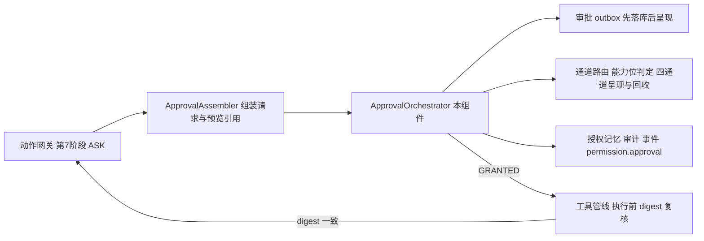
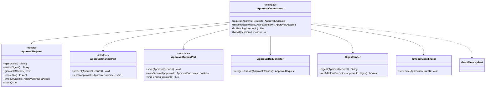
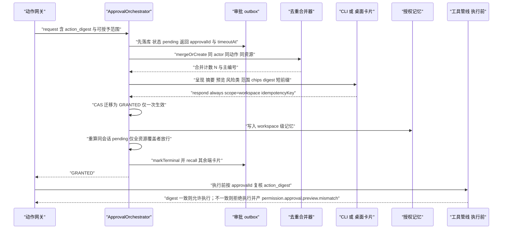
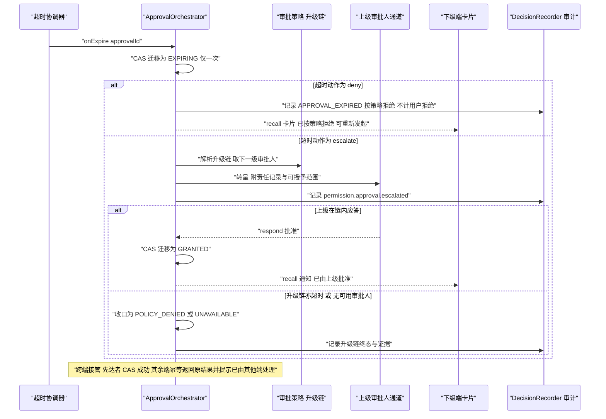
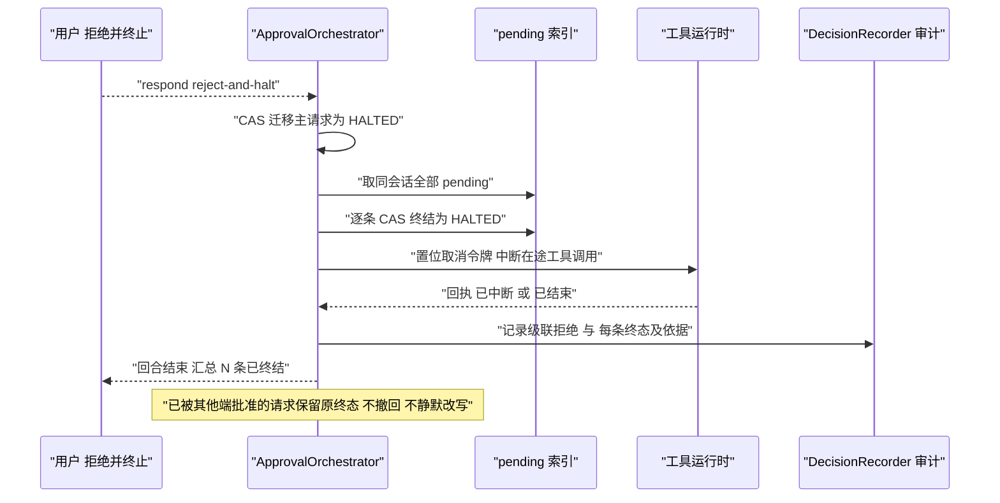
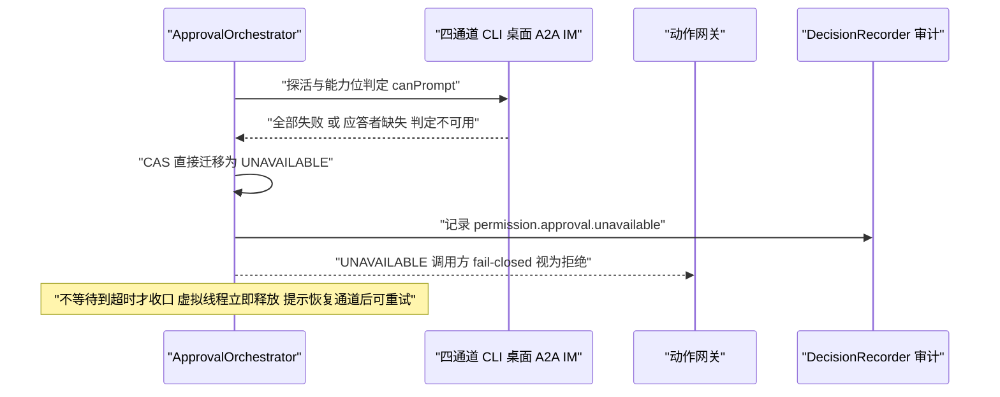
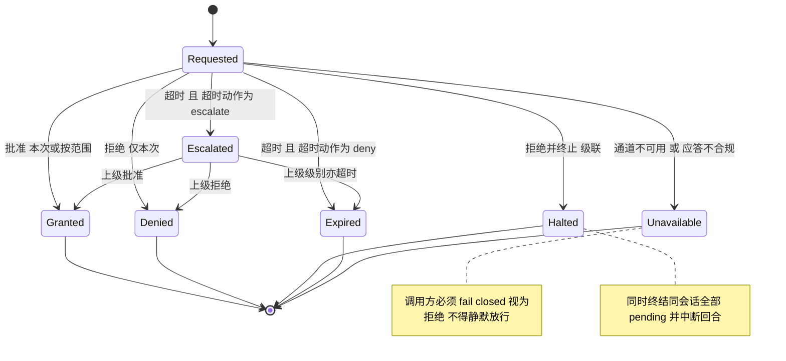

# C11 · ApprovalOrchestrator（审批编排器）组件级实现方案

> **定位**：Phase B **组件级**方案（系统级方案的逐组件展开）。系统级权威：`impl/06-permission-system-impl.md` §3.7.8（审批编排语义）、§7.1（审批生命周期）、§8.1–§8.3（表 / Redis Key / 事件）、§9.2（`ApprovalChannelSPI`、`ApprovalPolicySPI`）、§10.1（错误矩阵）；交互面权威：`impl/30-interaction-ux-impl.md` §6.1（卡片字段序与范围 chips 映射表）、§5.1（`ApprovalOutcomeKind`）；终端面：`impl/22-cli-tui-impl.md` §7.2（卡片状态纪律）、§9.1（错误码与退出码）。
> **组件清单与竞品证据**：`appendix-d-component-inventory.md` **K-19**（进程内服务，归属卷 06，关键依赖「通道适配 CLI/WS/A2A/IM」），协作件 K-17 动作网关 / K-18 决策链 / K-20 授权记忆；`02-opencode.md`（`always` 按范围沉淀后**重算**待审批、`reject` 级联并中断回合 `[E1]`）；`04-deepseek-harness.md`（审批结果**封闭集**、请求**不携带工具参数**、`UNAVAILABLE` 必须 fail-closed `[E1]`）；`03-codex.md`（审批结论回写为带到期与记录人的规则 `[E1]`）；`08-gemini-cli.md`（结果按范围沉淀为策略、非交互 `ask` 降级 `[E1]`）。
> **全局约束**：H-008（权限是决策层、沙箱是执行层）；本组件属**内核域带**（零 Spring）；全部 Java 形态遵守 `.qoder/rules/` 五条规范；**本文件不新增 `oc_*` 表、不新增事件类型**，一切存储与事件复用 `impl/06` §8 既有定义。

## ① 定位与边界

`ApprovalOrchestrator` 是决策链**第 8 阶段**（`impl/06` §3.7.1）的唯一实现：聚合结果为 `ASK` 时接管执行流，把「需要人判断」变成一次**通道无关、可持久、可幂等、可超时收口**的编排事务，再把封闭终态交回动作网关。它不做任何风险或策略判定，也不渲染 UI。



**解决什么**：① 通道无关编排（一份请求、一处编排、多端呈现与回收；交互壳只上报 `canPrompt`，语义由内核裁决，L-008）；② 持久与幂等（**先落 outbox 再呈现**，重启可续答，终态不可迁移）；③ 超时三终态（倒计时结束**不是**终态，按请求声明的超时动作收口）；④ 批量授权传播与级联拒绝；⑤ 防「看 A 跑 B」（预览与执行绑定同一 `action_digest`，执行前复核）。

**不解决什么**：风险分级 / 策略求值 / 聚合定论（`impl/06` §3.7.1–§3.7.5 其余部件）；端侧渲染与文案键（`impl/22` §7.2、`impl/23`、`impl/30`）；记忆封顶语义（第 6 阶段 + K-20，记忆不得把 `DENY` 变 `ALLOW`）；审批人身份、角色与升级链人员目录（卷 24，本组件只消费路由结果）；远程任务联邦的会话映射（`impl/24`，A2A 仅作通道实现接入）。

| 方向 | 依赖 / 被依赖 | 契约要点 |
| --- | --- | --- |
| 上游 | 动作网关第 7 阶段 / 授权记忆 K-20 / `ApprovalPolicySPI` | 传入 `ApprovalRequest`（由 `ApprovalAssembler` 用**钩子改写后的最终参数**构造，本组件不回读原始参数）；按显式范围写入记忆（失败不得放行）；超时秒数、超时动作（仅 `deny`/`escalate`）、升级链、范围上限 |
| 下游 | 动作网关 / 工具管线 / 事件总线 / 持久化 | 返回 `ApprovalOutcome` 封闭集，管线**执行前**按 `action_digest` 复核；`permission.approval.*` 事件族；`oc_approval` 先落库后呈现、审计链追加 |
| 下游 | 端侧 E-30 / E-31 / E-29 | `approval.list` / `approval.respond`；深链审批**禁止一键批准**（`impl/22` REQ-CLI-12） |

| 内容 | 目标模块 | 装配方式 |
| --- | --- | --- |
| 编排状态机、去重合并、级联、digest 绑定（纯内核，零 IO） | `harness-kernel/kernel-permission` | 外壳显式构造 + 端口注入（无容器注解） |
| outbox 落库、pending 索引、记忆写入、审计追加 | `harness-platform/platform-persistence` | `@Transactional(rollbackFor = Exception.class)` |
| CLI/WS/A2A/IM 通道适配与回收；超时定时器与去重窗口 | `harness-host/host-protocol` + `platform-runtime-store` | `ApprovalChannelSPI` 多实现排序；Redis 优先、进程内降级 |

## ② 功能需求清单（REQ-C-APPROVAL）

| ID | 需求描述 | 来源 | 优先级 | 验收要点 |
| --- | --- | --- | --- | --- |
| REQ-C-APPROVAL-1 | 通道无关请求结构：编号 / 会话 / 动作摘要 / 预览引用 / 风险类与命中规则 / 可授予范围 / 超时与超时动作 / 责任记录；**不携带完整敏感参数** | `impl/06` REQ-PERM-9、REQ-PERM-30；L-006；deepseek `[E1]` | P0 | 请求体扫描无密钥串；端上参数经 `toolCallId` 关联已流式事件 |
| REQ-C-APPROVAL-2 | 请求先落 outbox 再呈现；进程重启后 `approval.list` 仍可见并可回应 | `impl/06` REQ-PERM-13、§10 可靠性 | P0 | kill 会话后重启，pending 可继续应答并回填 |
| REQ-C-APPROVAL-3 | 应答幂等：同一编号只生效一次，重复应答返回原结果；`idempotency_key` 唯一 | `impl/06` §3.7.8 幂等行、§8.1 | P0 | 1000 并发应答断言仅一次生效 |
| REQ-C-APPROVAL-4 | 超时**三终态收口**：`deny` → 按策略拒绝；`escalate` → 已升级；只有通道全断 / 应答者缺失 / 应答不合规才是无人应答 | `impl/06` REQ-PERM-10、§3.7.8；`impl/30` REQ-UX-33；`impl/22` REQ-CLI-24 | P0 | 三终态各有用例且统计分离 |
| REQ-C-APPROVAL-5 | 通道不可用一律 fail-closed 视为拒绝，且**不得无限阻塞**（上限 = 超时 + 宽限） | `impl/06` REQ-PERM-19、I-PERM-5 回退；L-005 | P0 | 通道全断即时 `UNAVAILABLE`，虚拟线程释放 |
| REQ-C-APPROVAL-6 | 批量授权传播：`always` 先按范围写记忆，再对同会话 pending **重算**；仅当请求**全部资源**落在范围内才放行 | `impl/06` REQ-PERM-11；opencode `[E1]` | P1 | 混合资源请求不被误放行 |
| REQ-C-APPROVAL-7 | 级联拒绝：`reject-and-halt` 终结同会话全部 pending、中断工具调用并结束回合；「仅拒绝本次」只终结本次并回喂结构化拒绝 | `impl/06` REQ-PERM-12、§3.7.8；opencode `[E1]` | P1 | 三挂起请求同时终结且回合结束 |
| REQ-C-APPROVAL-8 | 通知去重合并：同 actor、同动作、同资源在窗口（默认 30s）内合并为一条并标注「同动作 ×N」；**合并展示不合并决策** | `impl/06` REQ-PERM-27、§8.2；`impl/23` §⑩ | P2 | 合并计数正确；每个编号独立终态 |
| REQ-C-APPROVAL-9 | `action_digest` 绑定：预览与执行同一 digest，执行前复核；不一致即拒绝并产 `permission.approval.preview.mismatch` | `impl/06` §3.7.6 第 11 条；`impl/22` §⑩.5 | P0 | 篡改预览 / 二次改写命令用例全部被拒 |
| REQ-C-APPROVAL-10 | 非交互形态（`canPrompt=false`）`ASK` 强制降级为拒绝，禁止静默批准与超时等待 | `impl/06` REQ-PERM-20；L-008；gemini-cli `[E1]` | P1 | 无头模式退出码明确、无提示路径 |
| REQ-C-APPROVAL-11 | 危险动作不提供 `always`：R4/R5 仅 `ALLOW_ONCE`，界面不出现范围 chips；范围受 `max-grant-scope` 与企业策略钳制 | `impl/06` REQ-PERM-28；`impl/22` §⑩.5；codex `[E1]` | P0 | R4/R5 无 chips；越范围越权返回 `APPROVAL_FORBIDDEN_SCOPE` |
| REQ-C-APPROVAL-12 | 升级与接管：`escalate` 转上级并产 `permission.approval.escalated`；多端并发应答以首达为准，其余端转只读并提示「已由其他端处理」 | `impl/06` REQ-PERM-26、§7.1；`impl/30` §6.1 | P2 | 三级升级链用例；跨端接管无重复生效 |

## ③ 关键设计决策（I-C-APPROVAL）

**I-C-APPROVAL-1 编排驻内核，IO 全走端口**：B1 外壳编排（CLI / 桌面各自持有等待与超时逻辑）淘汰——同一任务跨壳语义分叉（L-008）、超时与级联无法统一、内核单测不可覆盖；**选定 B2 内核编排 + 端口注入**（状态机与判定留内核，outbox、通道、时钟、记忆经端口注入）。代价：多 4 个端口与一组内存态替身，装配点增多。回退触发：某端无法实现 `ApprovalChannelSPI`（仅单向通知）时，该端降级为「通知 + 深链打开」，真实呈现回落 CLI，产 `permission.approval.unavailable` 但不改变终态语义。

**I-C-APPROVAL-2 阻塞模型 = 虚拟线程挂起 + outbox + CAS 幂等**：B1 进程内 `Deferred` 阻塞（重启丢审批，违反 REQ-C-APPROVAL-2）与 B2 纯事件驱动（结果时序错乱、模型无法表达「等待中」，与 `impl/12` 冲突）均淘汰；**选定 B3 虚拟线程阻塞 + outbox 持久化 + 幂等应答 + 多通道回收**（对齐 `impl/06` I-PERM-5）。代价：每挂起请求占一个虚拟线程（廉价但非零），须在超时 + 宽限内无条件收口。回退触发：单会话 pending 超 `pending-hard-limit`（默认 200）时新请求即时 fail-closed 拒绝并提示「待审批积压过多」。

**I-C-APPROVAL-3 三终态显式建模，端不本地判定**：B1「超时即 `UNAVAILABLE`」淘汰——把「人不在」与「通道坏」混为一谈，污染打扰率与策略调整依据；**选定 B2：`EXPIRE` 按超时动作收口为「按策略拒绝 / 已升级 / 无人应答」三类**，语义精确、统计可分离。代价：端侧须等待内核终态（首帧晚一次往返）。回退触发：内核终态延迟 P95 > 500ms 时端上先渲染「等待内核裁定」占位，**仍不得猜结果**（`impl/22` I-CLI-11）。

**I-C-APPROVAL-4 合并展示与独立决策分离**：B1「合并为一条、一次应答覆盖全部」淘汰——一次批准会顺带放行未经审阅的动作；**选定 B2 展示合并、决策独立**（窗口内共用一张卡与一个计数，但每个编号保持独立终态、独立 digest 与独立幂等键）。代价：卡片需呈现「同动作 ×N」并在展开时列出各次目标资源。回退触发：窗口内资源集合出现差异（`resourceDigest` 不同）即立即拆卡（去重仅在同一资源集内成立）。

## ④ 类图



```java
/**
 * 审批终态（封闭结果集）。
 * 一次审批请求在编排器视角的最终结果；枚举常量即全部取值，终态不可再迁移。端上「三呈现」由
 * {@link #userInitiated} 派生：用户主动决定与按策略收口、无人应答必须分开计数（混同会把「人不在」误算成「人反对」）。
 */
@Getter
@RequiredArgsConstructor
public enum ApprovalOutcome {

    /** 用户批准（含批量授权与按范围授予） */
    GRANTED("GRANTED", "已批准", true),
    /** 用户仅拒绝本次（回喂结构化拒绝，模型可换路） */
    DENIED("DENIED", "已拒绝本次", true),
    /** 用户拒绝并终止（级联拒绝：同会话 pending 全部终结、回合结束） */
    HALTED("HALTED", "已拒绝并终止", true),
    /** 超时且超时动作为 deny：按策略收口，**不是**用户拒绝 */
    POLICY_DENIED("POLICY_DENIED", "审批超时，已按策略拒绝", false),
    /** 超时且超时动作为 escalate：已升级至上级审批人 */
    ESCALATED("ESCALATED", "已升级至上级审批人", false),
    /** 通道全断 / 应答者缺失 / 应答不合规：调用方必须 fail-closed 视为拒绝 */
    UNAVAILABLE("UNAVAILABLE", "无人应答或通道不可用，已按安全默认拒绝", false);

    private final String code;              // 终态编码（DB 与事件只存 code，不存 desc）
    private final String desc;              // 终态中文描述（异常文案与端上兜底文案）
    private final boolean userInitiated;    // 是否计入「用户主动决定」统计（false 不得进拒绝率分子）

    /**
     * 按 code 解析终态。
     *
     * @param code 终态编码（必填；取值见各枚举常量）
     * @return 匹配的终态
     * @throws HarnessException 编码非法时抛出（内核层统一异常，禁止裸抛 IllegalArgumentException）
     */
    public static ApprovalOutcome of(String code) {
        for (ApprovalOutcome outcome : values()) {
            if (outcome.code.equals(code)) {
                return outcome;
            }
        }
        throw new HarnessException(ErrorCode.INVALID_ARGUMENT, "未知的审批终态：" + code);
    }
}
```

**编排器接口（节选）**：`request(ApprovalRequest) ApprovalOutcome`（由工具管线虚拟线程调用，**不抛业务异常**——失败以 `UNAVAILABLE` 返回；契约违约抛 `HarnessException`）；`respond(String approvalId, ApprovalReply reply) ApprovalOutcome`（幂等，越权范围抛 `HarnessException(APPROVAL_FORBIDDEN_SCOPE)`）；`listPending(String sessionId) List<ApprovalRequest>`（无 pending 返回**空集合**，不返回 null）；`haltAll(String sessionId, String reason) int`（级联拒绝，幂等，返回实际终结数）。四个方法均带中文 JavaDoc（功能 + `@param` + `@return` + `@throws`），完整形态见 `com.hk.opencoding.contract.permission`。

## ⑤ 核心流程时序图

### 5.1 主路径：发起 → 呈现 → 批准并授予范围 → 传播重算 → 执行前复核

**前置条件**：聚合为 `ASK`；存在可用通道；请求由 `ApprovalAssembler` 用钩子改写后的最终参数构造。**主路径**：落 outbox → 去重合并 → 多端呈现 → 应答 `always` → 写记忆 → 重算 pending → 返回 `GRANTED`。**异常与补偿**：落库失败 → 立即 fail-closed 拒绝（**不得**呈现未持久化的请求）；记忆写入失败 → 转 `UNAVAILABLE` 并把卡片置只读。**幂等与并发**：`approvalId` 状态机 CAS；传播只处理「全资源覆盖」且 digest 复核通过的请求。



### 5.2 超时、升级与跨端接管

**前置条件**：请求已呈现；`timeoutAction` 为 `deny` 或 `escalate`；升级链由 `ApprovalPolicySPI` 解析。**主路径**：倒计时结束 → 按动作收口（`deny` → 按策略拒绝；`escalate` → 转上级等待）→ 上级应答或升级链终结。**异常与补偿**：升级链无可用审批人 → `UNAVAILABLE`；升级链亦超时 → 按策略拒绝。**幂等与并发**：超时与应答竞争由 CAS 裁决（先到者定终态）；定时器按编号单次触发且可取消；跨端接管以首达为准，其余端只读。



### 5.3 级联拒绝：`reject-and-halt`

**前置条件**：用户在某条卡片选择「拒绝并终止」；同会话存在多条 pending。**主路径**：应答 `HALTED` → 终结同会话全部 pending → 中断在途工具调用 → 回合结束 → 审计留痕。**异常与补偿**：某条已被其他端批准（CAS 已成功）→ 保留其终态并单独提示「该动作已批准，无法撤回」；在途执行不自动回滚，由 `impl/05` 账本标记 `PARTIAL_SIDE_EFFECT` 并列明。**幂等与并发**：`haltAll` 幂等（重复调用返回 0）；与超时定时器竞争由 CAS 裁决。



### 5.4 通道不可用：fail-closed

**前置条件**：全部通道探测失败 / 应答者缺失 / 应答不合规（签名校验失败、身份不匹配）。**主路径**：判定不可用 → 立即 `UNAVAILABLE` → 释放虚拟线程 → 回喂拒绝并告知恢复动作。**异常与补偿**：**禁止**等到超时才收口（避免长挂起）；恢复通道后用户可重新发起，同动作走去重窗口。**幂等与并发**：不可用判定在请求生命周期内缓存；重试不产生第二条历史遗留 pending。



## ⑥ 状态机



**内核终态集合**（DB 与事件只存 code）：`GRANTED` / `DENIED` / `HALTED` / `POLICY_DENIED`（`Expired` 且动作为 `deny`）/ `ESCALATED`（转上级，等待由端上呈现；链终结后落为前四项之一或 `UNAVAILABLE`）/ `UNAVAILABLE`；`EXPIRED` 与 `ESCALATED` 作为**中间态**不落 `oc_approval.state` 终值。

**三条不变式**：① **终态不可迁移**——任一经 CAS 落定的终态，后续 `respond` / `onExpire` / `haltAll` 一律幂等返回原值；② **内部态不落库为终值**——对齐 `impl/30` I-UX-11 与 `impl/22` §7.2 状态纪律；③ **合并展示不改单条终态**——展开与否，每个编号独立走本状态机、独立 digest、独立幂等键。

**pending 索引**：`sessionId → Set<approvalId>`（PG，`(tenant_id, session_id, state)`，用途：级联、传播重算、`approval.list`）；`mergeKey → {approvalId, count}`（`RedisKeys.permApprovalDedup(sessionId, actionDigest)` Hash，TTL = 去重窗口）；`approvalId → timeoutAt`（虚拟线程定时器 + outbox 兜底扫描）。**Redis 不可用**时合并计数退化为进程内 `ConcurrentHashMap` 并**显式提示**「去重合并不可用」，**不得**静默转为放行（对齐 `impl/06` §3.4 回退触发）。

## ⑦ 接口与依赖矩阵

| 面 | 方法 / 路径 | 入参 | 出参 | 错误码 |
| --- | --- | --- | --- | --- |
| 会话协议 | `approval.list` | `sessionId`、`state` | 待审批列表（摘要 + 倒计时 + 可授予范围 + 合并计数 + digest 短前缀） | — |
| 会话协议 | `approval.respond` | `approvalId`、`reply`（`once`/`always`/`reject`/`reject-and-halt`）、`scope`、`reason`、`idempotencyKey` | 处理结果（幂等） | `APPROVAL_STATE_INVALID`、`APPROVAL_FORBIDDEN_SCOPE` |
| 会话协议 | `permission.memory.revoke` | `memoryId` 或 `scope` 过滤 | 撤销结果（立即生效，Pub/Sub 广播） | `MEMORY_NOT_FOUND` |

> **本组件不新增 REST 端点**（沿用 `impl/06` §9.1）；运维查询审批积压见修订建议 X-C11-3。

| 事件（不新增类型） | 触发点 | 载荷要点 |
| --- | --- | --- |
| `permission.approval.requested` | 落 outbox 后、呈现前 | 编号、会话、`actionDigest`、风险类、可授予范围、`timeoutAt`、超时动作、合并计数 |
| `permission.approval.granted` / `.denied` / `.halted` | 用户应答 | 应答者身份、范围、耗时、`isUserInitiated=true` |
| `permission.approval.expired` | 超时收口为按策略拒绝 | `timeout`、超时动作、收口终态 |
| `permission.approval.escalated` | 转呈上级 | 升级层级、上级对象、原超时时刻 |
| `permission.approval.unavailable` | 通道不可用 / 应答不合规 | 原因分类（通道全断 / 应答者缺失 / 应答不合规） |
| `permission.approval.preview.mismatch` | 执行前 digest 复核不一致 | 期望与实际 digest 短前缀 |

SPI 两处：`ApprovalChannelSPI`（每端一实现，提供 `present` / `recall` 与能力位 `canPrompt`、是否支持 diff 与范围选择；必须回传应答者身份与通道签名，不可信通道应答一律 `UNAVAILABLE`）；`ApprovalPolicySPI`（解析超时秒数、超时动作、升级链、最大可授予范围；超时动作只能是 `deny` / `escalate`）。

| 配置（`open-coding.permission.*`） | 默认 | 说明 |
| --- | --- | --- |
| `approval.default-timeout-seconds` | 300 | 请求未声明超时时使用 |
| `approval.timeout-action` | `deny` | `deny` / `escalate` |
| `approval.dedup-window-seconds` | 30 | 通知合并窗口 |
| `approval.max-grant-scope` | `workspace` | 单次可授予的最大范围（企业可收紧） |
| `approval.pending-hard-limit` | 200 | 单会话 pending 上限，超限 fail-closed |
| `non-interactive.ask-action` | `deny` | 无头形态 ASK 降级目标 |

**Fail-Fast 校验**：`timeout-action` / `non-interactive.ask-action` 取值非法即启动失败；`max-grant-scope` 必须落在六级范围枚举内（禁止静默取默认）。

| 依赖 | 方向 | 类型 | 不可用时的行为 |
| --- | --- | --- | --- |
| outbox（PG） | 出 | 外部调用（平台适配器） | 落库失败 → 立即 fail-closed 拒绝 |
| 通道（CLI/WS/A2A/IM） | 出 | 外部调用 | 全断 → `UNAVAILABLE` |
| 授权记忆（Redis + PG） | 出 | 外部调用 | 写入失败 → `UNAVAILABLE`（**不得放行**） |
| 事件总线 / 审计链 | 出 | 内核出站 | 事件失败不阻断终态但重试并告警；审计失败本地 WAL 兜底 |

> **事务与外部调用纪律**：`oc_approval` 落库与终态标记由平台适配器 `@Transactional(rollbackFor = Exception.class)` 实现；**通道推送、Pub/Sub 广播、记忆写入广播一律移出事务边界**（提交后事件驱动），**禁止**在事务内等待审批应答（对齐 `impl/06` §10）。

## ⑧ 关键算法

**8.1 去重与合并（展示合并、决策独立）**

```text
mergeOrCreate(req):
  key = hash(actorId, toolName, actionDigest, resourceDigestSet)   # 资源集任一差异即不可合并
  if dedupHash(key) 存在: count = HINCRBY key req.approvalId 1     # TTL = dedup-window-seconds
      return req.withCount(count).asMergedDisplay(primary = 已有主编号)
  HPUT key req.approvalId 1 并刷新 TTL; return req.withCount(1)
# 终态时递减，仅当 Hash 内全部条目已终态才删 key（避免提前拆除窗口）
```

**硬约束**：合并只影响「一张卡 + 计数 N」与 `recall` 广播目标，**不合并** `action_digest`、不合并幂等键、不合并终态；展开卡片必须逐条列出目标资源。

**8.2 `action_digest` 绑定与执行前复核**

```text
digest(req) = sha256Hex(canonicalJson(
    toolName, actionKind, commandTextIfAny, canonicalTargets 排序后拼接,
    externalTargets, rewrittenArgs, previewRef, previewDigest))
# 与 oc_permission_decision.action_digest 同源同算法；规范化只允许 ActionNormalizer 一份实现

verifyBeforeExecution(approvalId, currentDigest):
  stored = outbox.find(approvalId).actionDigest
  if stored == currentDigest: return true
  publish(permission.approval.preview.mismatch, approvalId, prefix(stored), prefix(currentDigest))
  return false                                    # 调用方必须拒绝执行（防「看 A 跑 B」）
```

**8.3 超时三终态收口**

```text
onExpire(approvalId):
  if !cas(approvalId, PENDING -> EXPIRING): return            # 已应答者先到 幂等退出
  switch outbox.find(approvalId).timeoutAction:
    case DENY:     terminal = POLICY_DENIED; publish(expired) # 不计用户拒绝
    case ESCALATE: next = policySPI.nextApprover(req)         # 会话所有者 → 团队管理员 → 平台管理员
                   if next.isEmpty: terminal = UNAVAILABLE    # 无可用审批人即 fail-closed
                   else: publish(escalated); return waitFor(next)
  outbox.markTerminal(); recallAllChannels(); releaseVirtualThread()
```

三终态在事件与指标中**分桶**（`oc_approval_timeout_total{kind}`），`isUserInitiated=false` 一律不进入拒绝率分子。

**8.4 批量授权传播的正确性条件**

```text
propagate(scope, grantedReq):
  for c in findPending(grantedReq.sessionId) where c.id != grantedReq.id:
      if c.riskClass >= R4: continue                    # 危险动作不参与传播
      if !memoryPort.coveredBy(scope, c): continue       # 资源级覆盖：全部资源都在范围内
      if !verifyBeforeExecution(c.id, recomputeDigest(c)): continue
      cas(c.id, PENDING -> GRANTED) 并 recall 通知
  # 任一资源未覆盖即整体不放行（不接受部分覆盖），该请求保持 pending 等待人工
```

## ⑨ 错误处理与降级

| 场景 | 错误码 / 终态 | retryable | 用户可见文案 | 恢复动作 |
| --- | --- | --- | --- | --- |
| 通道不可用 / 应答者缺失 / 应答不合规 | `APPROVAL_UNAVAILABLE` + `UNAVAILABLE` | 是（通道恢复后） | 「无人应答或审批通道不可用，本次操作已按安全默认拒绝；恢复通道后可在审批列表重新发起」 | 释放虚拟线程；提示 `approval.list` 重试入口 |
| 超时且动作 `deny` | `APPROVAL_EXPIRED` + `POLICY_DENIED` | 是（重新发起） | 「审批超时（`<timeout>`s 内未响应），已按策略拒绝」 | 卡片置「已按策略拒绝」+ 重新发起；**不计入用户拒绝** |
| 超时且动作 `escalate` | `APPROVAL_ESCALATED` | — | 「已升级至上级审批人；你在 `<timeout>`s 内未响应」 | 卡片转等待态 + 「查看升级对象」；上级亦超时才终结 |
| 升级链无可用审批人 | `APPROVAL_UNAVAILABLE` + `UNAVAILABLE` | 是 | 「升级链无可用审批人，本次操作已按安全默认拒绝」 | 通知管理员补齐审批人；重新发起 |
| 应答范围越权 / 终态迁移冲突（重复应答、其他端已处理） | `APPROVAL_FORBIDDEN_SCOPE` / `APPROVAL_STATE_INVALID` | 否 | 「该授权范围超出本次允许的最大范围，请选择更小范围或仅本次批准」；「该审批已被处理」（附处理者与结果，不含敏感信息） | 越权保持 pending 并刷新范围 chips（**不落任何记忆**）；冲突卡片转只读并以首达终态为准 |
| 预览与执行不一致 | `preview.mismatch` 安全事件 | 否 | 「审批预览与实际执行内容不一致，已拒绝执行」 | 拒绝执行 + 冻结该动作来源并人工复核 |
| outbox 落库失败 / 记忆写入失败 | `INTERNAL_ERROR` / `UNAVAILABLE` | 是 | 「审批服务暂不可用，本次操作已按拒绝处理」 | fail-closed 拒绝；不落记忆、不放行；适配器重试并告警 |
| 待审批积压超上限 | `APPROVAL_UNAVAILABLE` | 是 | 「待审批请求过多，已按安全默认拒绝本次操作」 | 提示先处理积压；运维查积压指标 |

**日志与异常纪律**：`request` / `respond` 入口用 `log.info` 打点（编号、会话、风险类、超时动作、应答者、范围、耗时）；超时与升级 `log.warn`；`preview.mismatch` 与通道不合规 `log.error` 并附证据引用。占位符一律 `{}` 且数量匹配；异常必须传 `Throwable`；**禁止**打印命令全文、Token、密钥与完整绝对路径（只打 digest 短前缀与工作区相对路径）。本组件属内核层，契约违约与内部错误抛 `HarnessException(ErrorCode, message)`；外壳层（REST / 审计导出 / 通道适配）抛 `BusinessException` 交由全局处理器映射（对齐 `impl/06` §5 与 X-82）。**禁止**：业务代码 `try-catch` 后包装错误响应返回；吞异常导致 fail-closed 失效；把 `UNAVAILABLE` 静默改写为放行。

## ⑩ 性能与并发

**审批等待不阻塞其他会话**：① 等待载体为**虚拟线程**（会话 runner 才占平台线程，默认上限 50），挂起只阻塞**本会话**的工具调用与回合，其他会话的事件、工具、模型调用完全不受影响；② 会话取消 = 自研 `SessionScope` 作用域取消（`impl/01` I-ARC-3）= 该会话全部挂起审批即刻以 `UNAVAILABLE` 收口；③ 挂起时长 ≤ 超时 + 宽限，`pending-hard-limit` 超限即时 fail-closed，避免线程与内存堆积；④ 无头形态 `canPrompt=false` **不挂起**（直接按 `non-interactive.ask-action` 降级），零等待成本。

**并发与预算**：1000 并发应答下 CAS + `idempotency_key` 唯一约束保证仅一次生效，重复应答走只读路径（无写放大）；超时定时器每请求一个可取消任务，终态时**必须**取消，禁止遗留累积；批量传播为 O(pending)（pending 部分索引保证 O(pending) 列表查询），记忆写入与终态标记合并为一个短事务；指标 `oc_approval_latency_ms{dimension=human|auto}`、`oc_approval_timeout_total{kind}`、`oc_approval_pending_count`、`oc_approval_dedup_merged_total`、`oc_approval_unavailable_total`；容量：请求行 2–5KB，单会话 pending ≤ 200，单租户建议 ≤ 5 万行/年。

## ⑪ 测试要点（DoD）

| 层 | 用例族 | 断言 |
| --- | --- | --- |
| 单测（零框架） | 状态机与终态不变式 | 终态不可迁移；重复应答返回原结果；`EXPIRED` / `ESCALATED` 不落库为终值 |
| 单测 | 去重合并 | 同 actor / 动作 / 资源在窗口内合并计数；**资源集不同即拆分**；窗口过期不误合并 |
| 单测 | 三终态收口 | 三终态各自收口正确；指标分桶且拒绝率分子不含 `isUserInitiated=false` |
| 单测 | digest 绑定与传播正确性 | 篡改预览、二次改写命令、资源集变化 → 复核全部失败并产 mismatch 事件；混合资源请求不被误放行；R4/R5 不参与传播 |
| 集成 | 持久化与重启续答 / 多通道与接管 | 呈现前先落库，重启可续答并回填 Item（`impl/12`）；同一编号双通道，一端先达另一端转只读并提示「已由其他端处理」 |
| 集成 | 级联拒绝 | 三挂起请求同时终结 + 在途工具调用中断 + 回合结束；已批准项保留原终态 |
| 集成 | 越权与不可信应答 | 范围越权 → `APPROVAL_FORBIDDEN_SCOPE`；伪造通道 / 重放应答 → `UNAVAILABLE` |
| 故障注入 | 通道全断 / outbox 不可写 / Redis 掉线 / 记忆写失败 | 全断即时 fail-closed 不无限阻塞；outbox 不可写 → 拒绝不放行；Redis 掉线 → 合并计数降级并显式提示 |
| 并发压测 | 1000 并发应答 + 重复应答 + 超时与应答竞争 | 仅一次生效；定时器无遗留 |
| 演练（季度） | 审批通道灾难演练（**降级演练**） | 断开全部通道后无静默放行、无假成功，文案与恢复动作齐备，告警与审计链完整 |

```bash
# 编排器与三终态单测（零框架，kernel-permission）；集成（PG + Redis + 多端模拟）
mvn -pl harness-kernel/kernel-permission -am test \
  -Dtest='ApprovalOrchestratorTest,DigestBinderTest,ApprovalDedupTest' -DfailIfNoTests=false
mvn -pl harness-platform/platform-persistence -am verify -Dtest='ApprovalPersistenceIntegrationTest' -DfailIfNoTests=false
# main 链路 + 并发幂等 + 通道灾难演练
mvn -pl harness-host/host-bootstrap -am test
mvn -pl harness-host/host-bootstrap -am test -Dtest='ApprovalConcurrencyTest,ApprovalChannelDrillTest' \
  -Ddrill.report=target/approval-drill-report.json -DfailIfNoTests=false
```

**完成定义**：① 三终态各有呈现与用例且统计口径分离；② 请求先落 outbox 再呈现、重启可续答、重复应答幂等；③ 批量传播仅在全资源覆盖时放行，级联拒绝终结全部 pending 且回合结束；④ `action_digest` 在决策记录、审批请求、执行前三处一致；⑤ 端上不本地判定超时结果，`SUPERSEDED` 呈现为「已由其他端处理」；⑥ 通道不可用与 outbox 不可写两条路径均 fail-closed 且文案含具体恢复动作。

## 修订建议登记（本文件提出，待汇总入 `impl/IMPL-DECISIONS.md` §4）

| 本地编号 | 建议内容 | 依据 | 建议动作 | 阻塞性 |
| --- | --- | --- | --- | --- |
| X-C11-1 | `impl/06` §7.1 建议补注「端上 `SUPERSEDED` / `POLICY_DENY` / `ESCALATED` 呈现态**不属于内核终态**」，避免实现把端上状态写回 `oc_approval.state` | 本文件 §6 不变式 ②；`impl/22` §7.2 | 补注 | 否（措辞级） |
| X-C11-2 | `impl/22` §7.2 与 `impl/30` §6.1 引用的「`impl/06` §7.3」在系统级文件中不存在（升级链终态定义在 §7.1 状态机），建议统一改为 §7.1 | 本文件逐节核对 | 引用修正 | 否（指针级） |
| X-C11-3 | `impl/06` §9.1 建议增补 `GET /api/v1/approvals`（pending 积压、超时分布、按会话/风险类过滤），供运维与安全值班查询 | 本文件 §7、§10 指标 | 端点补登记 | 否（增量） |
| X-C11-4 | `oc_approval` 建议补索引 `(tenant_id, session_id, state)`，支撑 `approval.list` 与级联拒绝的 pending 扫描（现仅 `(tenant_id, state, created_at)`） | 本文件 §6、§10 | 索引增补（不改表结构） | 否（增量） |
| X-C11-5 | `APPROVAL_ESCALATED` 码建议正式并入 `impl/06` 错误枚举（现由 `impl/22` / `impl/30` 先行定义） | `impl/30` §10.2 脚注；本文件 §9 | 错误码登记 | 否（注册级） |
