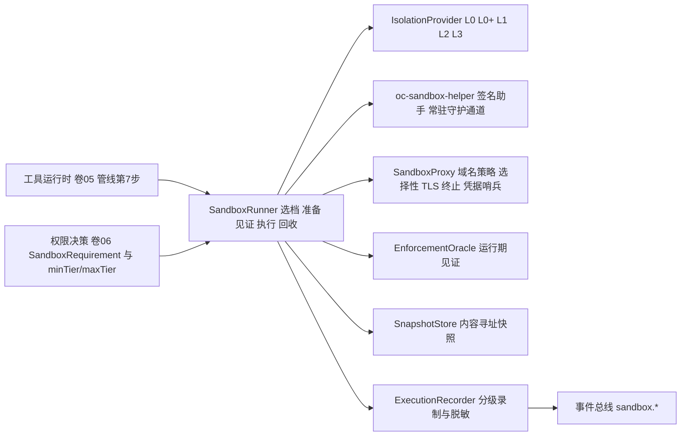
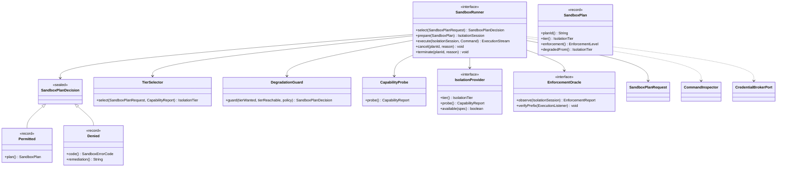
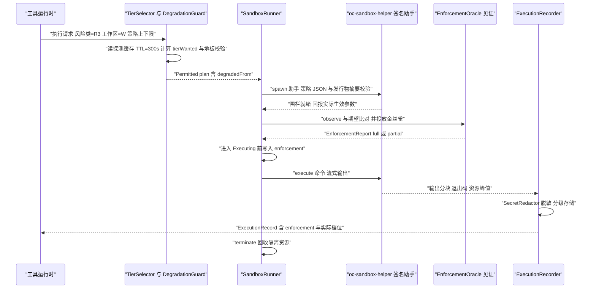
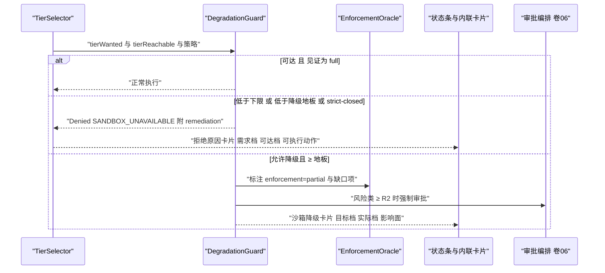
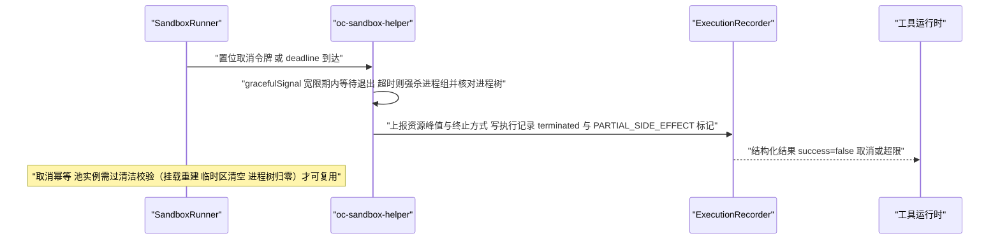
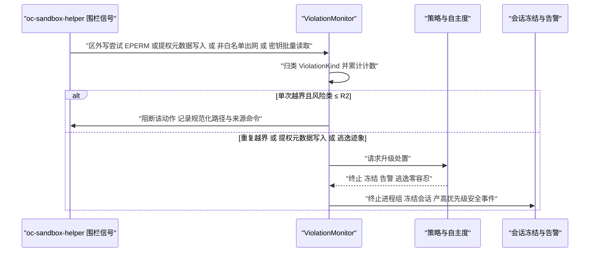
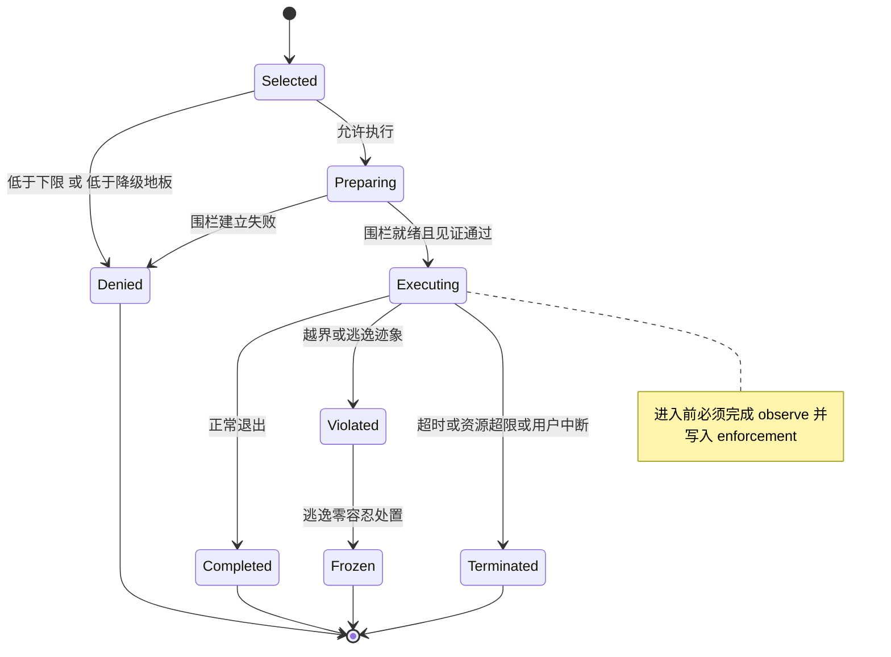

# C12 · SandboxRunner（沙箱执行器）组件级实现方案

> **定位**：Phase B **组件级**方案（系统级方案的逐组件展开）。系统级权威：`impl/07-sandbox-executor-impl.md` §4.2（平台能力矩阵与探测）、§4.3（降级规则与地板）、§5（端口与 Java 签名）、§7.1（`SandboxPlan` 生命周期）、§8（表 / Redis Key / 事件）、§9.3（SPI）、§9.4（配置项）、§10.3（fail-closed 语义）、§10.6（错误矩阵）。
> **组件清单与命名桥接**：`appendix-d-component-inventory.md` **P-19**（`SandboxOrchestrator + IsolationProvider×4`，进程内服务，归属卷 07）、**P-20**（`NetworkKeyProxy + DangerCommandGuard`）、**P-21**（`SandboxImageManager`）；本组件 `SandboxRunner` 即 P-19 的**执行编排门面**（对外端口形态为 `ExecutionIsolationPort`，档位选择纯函数住 `harness-kernel/kernel-agent`，围栏/代理/快照/录制实现住 `harness-platform/platform-sandbox`）——命名差异为**桥接**而非冲突（登记 X-C12-3）。竞品证据：`03-codex.md`（Linux 主体是 bubblewrap + `no_new_privs` + seccomp、Seatbelt 走 `/usr/bin/sandbox-exec` **绝对路径**防 PATH 注入、bundled bwrap **摘要校验失败退出码 8**、`unsandboxed_execution_allowed` denied-read 不变式、`seatbelt_daemon` 常驻降开销 `[E1]`）；`05-minimax-cli.md`（MITM CA + `credential-mask-env/files` + `credential-sentinel` + `body-substitution` + `aws-sigv4`，且「**网络代理关闭仍保文件保护**」`[E1]`）；`04-deepseek-harness.md`（`SandboxEnforcement = full | partial` 上报 `[E1]`）；`08-gemini-cli.md`（治理文件写保护 / 密钥文件**完全隐藏**、容器档 `[E1]`）；`01-claude-code-purpose-built.md`（沙箱与权限耦合、`failIfUnavailable` `[E2]`）。
> **全局约束**：H-009（分级隔离）、NFR-S-1（逃逸零容忍）；全部 Java 形态遵守 `.qoder/rules/` 五条规范；**不修改 Phase A**，全部选定分支落在 D-SBOX-1…11 内，收紧项已在系统级文件声明。

## ① 定位与边界

`SandboxRunner` 是**一次执行**的编排单元：`选档 → 准备围栏 → 运行期见证 → 执行与流式输出 → 超时/取消/资源超限收口 → 录制与回收`。它回答「用什么边界执行、边界是否真的生效、失败时用户看到什么」，不回答「该不该执行」。



**解决什么**：① 五档统一接口与**自动选档**（按风险类 + 平台能力 + 策略上下限，纯函数）；② 四类边界工程化（文件 / 网络 / 密钥 / 资源）；③ **运行期见证**——「配置了就相信」被禁止，执行强度必须被观测并上报 `full / partial / none`；④ 危险命令分层拦截与**降级地板**（不可达即拒绝，不放宽到更低档）；⑤ 失败透明：降级有事件、有徽章、有文案、有可执行动作。

**不解决什么**：该不该执行（风险分级、审批、策略 DSL → 卷 06，本组件只消费 `RiskClass` 与策略上下限，**沙箱不回退权限拒绝**）；在哪执行（本地/SSH/容器工作区与连接池 → 卷 20，L1/L2/L3 复用其 `WorkspaceProvider`）；工具语义与结果规范化（卷 05，本组件是 `run_command` 类工具的执行后端之一）；模型注入防护的内容层判定（卷 03/06，本组件只提供出网检测与诱捕哨兵作为**数据面证据**）。

| 方向 | 依赖 / 被依赖 | 契约要点 |
| --- | --- | --- |
| 上游 | 权限引擎（卷 06） / 工具运行时（卷 05） / 工作区（卷 20） | `PermissionOutcome` 携带 `RiskClass` 与策略上下限 `minTier / maxTier`（沙箱**不回退**权限拒绝）；`ToolExecutionRequest`（命令、cwd、环境需求、能力声明）与 `CancellationToken`；`WorkspaceMount`（工作区根、只读子路径、治理文件清单） |
| 下游 | 事件总线（卷 16） | `sandbox.*` 事件族（全部走总线，**禁止直发 UI**） |
| 下游 | 持久化 / 端侧（卷 19/22/23） | `oc_sandbox_*` 与录制工件；降级徽章、拒绝原因卡片、`oc sandbox status` |

| 内容 | 目标模块 | 装配方式 |
| --- | --- | --- |
| 档位选择、降级地板、录制分级策略（纯函数，无 IO） | `harness-kernel/kernel-agent`（`sandbox` 子包） | 零 Spring，可单测 |
| L0/L0+ 围栏、助手调度、代理、快照、L1 容器 / L2 microVM / L3 远端 | `harness-platform/platform-sandbox` | `@ConditionalOnMissingBean`，按能力探测结果条件装配 |
| 节点注册表、执行记录、违规表 | `harness-platform/platform-persistence` | `@Transactional(rollbackFor = Exception.class)` |
| 状态面（REST / CLI） | `harness-host/host-protocol` | Spring MVC |

## ② 功能需求清单（REQ-C-SANDBOX）

| ID | 需求描述 | 来源 | 优先级 | 验收要点 |
| --- | --- | --- | --- | --- |
| REQ-C-SANDBOX-1 | 五档隔离 L0/L0+/L1/L2/L3 统一接口、四类实现，按风险与平台能力自动选档（纯函数） | `impl/07` REQ-SBOX-1、D-SBOX-1/2 | P0 | 选档算法单测全过；档位表与卷 07 §4.1 一致 |
| REQ-C-SANDBOX-2 | 文件围栏：只读根 + 显式读写区 + 治理路径保护 + 反绕过规范化（软链/硬链/`..`/8.3 短名/大小写/UNC/ADS）；治理文件写保护、密钥文件**完全隐藏**（非仅拒读） | `impl/07` REQ-SBOX-2/17；gemini `[E1]` | P0 | 别名用例集全过；check 与 use 之间无未受控窗口（fd + inode 复核）；`.env*` 在挂载与文件工具两层均不可见 |
| REQ-C-SANDBOX-3 | 网络默认拒绝 + 域名白名单 + 审计代理；`network-enforcement=strict` 时 R2+ **强制 ≥ L1** | `impl/07` REQ-SBOX-3、§3.2 附加硬约束 | P0 | 白名单外连接被拒；出网事件含域名/方法/字节数；L0/L0+ 标注为约定式 |
| REQ-C-SANDBOX-4 | 资源限制：CPU/内存/磁盘/进程数/时长，平台原生 + 虚拟层兜底；超限终止**进程组**并产出结构化结果 | `impl/07` REQ-SBOX-4；卷 05 REQ-TOOL-15 | P0 | 五维各一条超限用例；无孤儿进程、无假成功 |
| REQ-C-SANDBOX-5 | 凭据代理注入：哨兵替换 + 选择性 TLS 终止 + 请求体重写与签名重算；明文不落地、不进环境、不进日志；**代理关闭仍保文件保护** | `impl/07` REQ-SBOX-5/15；minimax `[E1]` | P0 | 无明文注入下 `git push` 可用；日志与录制零明文；关代理后 FS 探针仍失败 |
| REQ-C-SANDBOX-6 | 治理文件写保护、密钥文件**完全隐藏**（非仅拒读），挂载层与文件工具层双层生效 | `impl/07` REQ-SBOX-17；gemini `[E1]` | P1 | `.env*` 两层均不可见；`.git/hooks` 等写入被拒 |
| REQ-C-SANDBOX-7 | **denied-read ⇒ 禁止脱沙箱**：实现为单点可测谓词，提权/规则/用户选择一律不能绕过；命中时 `RequireEscalated` **静默降级**为默认档 | `impl/07` REQ-SBOX-13、§10.3；codex `[E1]` | P0 | 谓词单测；集成用例证明无法脱沙箱；禁止第二处等价判断 |
| REQ-C-SANDBOX-8 | 每次执行**上报执行强度** `full / partial / none` 与生效围栏参数；缺失自动判 `partial` 并告警 | `impl/07` REQ-SBOX-14；deepseek `[E1]` | P0 | `ExecutionRecord.enforcement` 100% 填充 |
| REQ-C-SANDBOX-9 | 危险命令三层判定（词法语法解析 → 规则库 ≥ 30 → 高风险模型二次判定，超时可降级）与**降级地板** | `impl/07` REQ-SBOX-6、I-SBOX-6 附带项 | P0 | 30+ 模式命中、50+ 正常命令零误拦；地板不可突破 |
| REQ-C-SANDBOX-10 | 运行期见证五道：能力探测（真实探针）→ 档位不变式校验 → 金丝雀行为验证 → 网络直连探针 → 录制完整性校验 | `impl/07` §1.5 Q2、§4.2 | P0 | 五道各自有用例；任一道失败产降级事件并按策略拒绝 |
| REQ-C-SANDBOX-11 | 快照与恢复：内容寻址增量快照（高风险动作前置条件），恢复前后哈希一致、3-way 冲突不静默覆盖 | `impl/07` REQ-SBOX-10 | P1 | 恢复哈希比对通过；冲突生成恢复计划 |
| REQ-C-SANDBOX-12 | 逃逸检测与处置梯度：围栏违反 / 提权元数据写入 / 进程树异常 / 网络异常 / 密钥异常 → 观察 → 阻断 → 终止 + 冻结 + 告警（零容忍） | `impl/07` §10.4、NFR-S-1 | P0 | 逃逸演练链路全通；高优先级安全事件与审计存证 |
| REQ-C-SANDBOX-13 | 执行超时与取消：deadline + `CancellationToken` 传播，宽限期后强杀进程组并核对进程树；结果标取消而非成功 | `impl/05` REQ-TOOL-15、`impl/07` §7.1 | P0 | 取消注入无孤儿进程；池内实例清洁校验失败即销毁 |

## ③ 关键设计决策（I-C-SANDBOX）

**I-C-SANDBOX-1 进程围栏载体 = 外部签名助手 + 常驻守护通道**：B1 JNI/JNA 直调（`landlock_create_ruleset` / `sandbox_init` / `CreateRestrictedToken`）淘汰——原生编译矩阵与崩溃面过大；**选定 B2 外部助手可执行体 + 策略生成器 + 常驻守护通道**（Unix domain socket / Windows named pipe，对齐 `seatbelt_daemon` 先例）。代价：每次执行多一次 spawn（观测 3–8ms），用守护通道把稳态压回 ≤ 3ms。回退触发：助手在目标平台无法启动（企业白名单禁新可执行体）→ 退回 L1 容器档。

**I-C-SANDBOX-2 选档与降级判定驻内核纯函数，平台只上报能力**：B1 平台层自行决定档位与降级淘汰——「平台自述完备」会把 `partial` 谎报为 `full`；**选定 B2 内核纯函数选档 + 平台只上报 `CapabilityReport`**，地板判定不可由平台放宽（`degradationFloor(riskClass)` 是内核常量规则）。代价：能力探测结果需结构化回传（含边界说明，如「Windows 低完整性令牌对 Everyone 组与硬链接的边界」）。回退触发：探测结果与实测不符（探针通过在先、执行失败在后）→ 立即吊销该节点能力并降级至保守口径。

**I-C-SANDBOX-3 见证与执行同生命周期，缺失即判 `partial`**：B1「围栏由助手建立成功即视为生效」淘汰——配置即相信正是绕过面；**选定 B2 `EnforcementOracle.observe` 在进入 `Executing` 前必跑**，`enforcement` 缺失或无法读取关键参数一律判 `partial` 并告警（`strict-closed` 下直接拒绝）。代价：每次执行多一次参数读取（≤ 1ms，随守护通道一并返回）。回退触发：见证通道中断 → 该次执行强制审批并按 `partial` 标注。

**I-C-SANDBOX-4 L0 明确非安全边界**：B1 把 L0 视同沙箱（口径最省）淘汰——L0 只有逻辑围栏，谎称隔离会导致 R2+ 动作在无 OS 强制下执行；**选定 B2 诚实分层**：L0 仅允许 R0/R1 与「策略上限 = L0」的显式场景，R2+ 永不允许 L0，UI 必须标注「无 OS 强制隔离」，`strict-closed` 下任何降级都拒绝。代价：跨平台体验不一致（Windows 无 seccomp 等价物）。回退触发：`fail-mode=open` 仅允许与 `policy-min-tier=L0` 组合且启动 WARN（对齐 §9.4 必填校验）。

## ④ 类图



```java
/**
 * 沙箱执行器：工具运行时唯一允许的执行入口（禁止工具层直接调用 ProcessBuilder）。
 * 职责：选档 → 建立隔离环境 → 运行期见证 → 执行并流式输出 → 取消/超时收口 → 回收资源。
 * 本类属**内核域带**，实现由外壳按能力探测结果条件装配并注入端口。
 */
public interface SandboxRunner {

    /**
     * 依据风险类、平台能力与策略上下限选择档位并生成执行计划。
     * 不满足策略下限或低于风险类降级地板时返回 {@link Denied}，**不放宽到更低档**。
     *
     * @param request 执行请求（必填；含风险类、命令、工作区根与策略上下限）
     * @return 允许时返回 {@link Permitted}（含目标档与实际档），否则返回 {@link Denied}，不抛异常
     */
    SandboxPlanDecision select(SandboxPlanRequest request);

    /**
     * 建立隔离环境（围栏、挂载、资源限制、代理与凭据 lease）。
     *
     * @param plan 已选定的执行计划（必填；由 {@link #select} 产出）
     * @return 可执行会话；调用方必须在 finally 中调用 {@link #terminate}
     * @throws SandboxException 围栏建立失败、能力在准备阶段失效、计划已被取消时抛出
     */
    IsolationSession prepare(SandboxPlan plan);

    /**
     * 取消执行并回收隔离资源（幂等）。
     *
     * @param planId 计划编号（必填）
     * @param reason 取消原因（必填；写入执行记录与 `sandbox.*` 事件，区分超时 / 用户中断 / 资源超限）
     * @throws SandboxException 计划编号不存在时抛出（文案含 planId）
     */
    void cancel(String planId, String reason);

    // execute / terminate 与系统级 §5 一致（execute 返回拉取式 ExecutionStream，终态块含退出码与资源峰值；terminate 幂等回收）。
    // 本组件新增 cancel 的**显式语义**：取消 ≠ 终止（取消传播取消令牌并保留输出证据），二者都必须在终态落库 `oc_sandbox_plan` 后才算完成（见修订建议 X-C12-1）。
}
```

```java
/**
 * 判断本次执行是否允许脱离沙箱（提权、规则放行或用户显式绕过）。
 * 语义：一旦策略包含 denied-read 路径，脱沙箱会静默放开这些读取，因此必须整体禁止。
 * 本方法为**单点谓词**（对齐 `impl/07` §10.3 与 codex `unsandboxed_execution_allowed`）：
 * 禁止在别处再写等价判断，禁止把 `deniedReadPaths` 为空判断改成宽松逻辑。
 *
 * @param plan 执行计划（必填）
 * @return 允许脱沙箱时为 true；存在 denied-read 路径时**恒为 false**
 */
public boolean unsandboxedExecutionAllowed(SandboxPlan plan) {
    return plan.deniedReadPaths().isEmpty();
}
```

**签名纪律**：`SandboxException extends HarnessException`（携带 `SandboxErrorCode { SANDBOX_UNAVAILABLE, SANDBOX_DENIED, SANDBOX_VIOLATION }` 并映射内核 `ErrorCode`）；内核层抛 `HarnessException`，外壳层（沙箱管理面、录制导出）抛 `BusinessException`；两侧均**禁止**裸抛 `RuntimeException` / `IllegalArgumentException`（对齐 `impl/07` §5 与 X-82）。

## ⑤ 核心流程时序图

**前置条件**：命令已过权限决策（非 deny）且已过 `CommandInspector`（非阻断）；探测缓存已加载（TTL 300s）。**主路径**：探测缓存命中 → 选档 → 准备 → 见证 → 执行 → 录制。**异常与补偿**：准备失败 ⇒ 回收半成品资源 + `sandbox.denied`；见证 `partial` 且 `strict-closed` ⇒ 拒绝并报告缺口；执行被终止 ⇒ 产出结构化结果（非异常）。**幂等与并发**：`planId` 全链路幂等；同工作区写型执行串行（工作区级互斥锁），不同工作区并行。



**前置条件**：目标档不可达（容器运行时缺失 / 无 `/dev/kvm` / 无 AppContainer 权限）或见证判 `partial`。**主路径**：与降级地板比较 → 允许降级则执行 + 事件 + 强制审批，否则拒绝。**异常与补偿**：`strict-closed` 下任何降级都拒绝；地板不可突破（R4/R5 不许降到 L1）。**幂等与并发**：降级事件按 `planId` 去重；探测结果缓存失效由安装/卸载运行时事件触发。



**前置条件**：执行中超过 deadline、收到 `CancellationToken`，或触发 CPU/内存/进程数/磁盘上限。**主路径**：置位取消 → 协作式停止 → 宽限期 → 强杀进程组 → 核对进程树 → 结构化结果。**异常与补偿**：已发生的写副作用由 `impl/05` 账本标记 `PARTIAL_SIDE_EFFECT` 并显式列出；**绝不**产生部分成功语义。**幂等与并发**：取消与终止均幂等；池实例取消后必须过清洁校验才可复用。



**前置条件**：执行记录与围栏信号通道已建立（`ExecutionListener` 已挂载）。**主路径**：信号采集 → 归类 → 处置梯度（观察 → 阻断 → 终止 + 冻结 + 告警）。**异常与补偿**：信号通道中断 ⇒ 该次执行降级为 `partial` 并强制审批；重复违规 ⇒ 提升该工作区最低档位。**幂等与并发**：同一 `planId` 的重复信号合并计数；处置动作幂等。



## ⑥ 状态机



**三条不变式**：① 进入 `Executing` 前必须完成 `observe` 并写入 `enforcement`（缺失即判 `partial` 并告警）；② `Violated` 必须携带至少一条 `SandboxViolation`；③ 终态必须落库 `oc_sandbox_plan` 且事件已发布（**先落库后发事件**，保证恢复期可重放）。

**隔离实例池（L1/L2 预热）**：状态为 `Cold → Warming → Warm ⇄ Leased`，违规实例进 `Quarantined` 后销毁重建，超 TTL 或镜像更新进 `Retired`；探测失败进 `Unavailable` 并按探测周期重试。**清洁校验**（工作区挂载重建 + 临时区清空 + 进程树归零）未通过即销毁，**绝不复用脏实例**（对用户不可见，不呈现假成功）。

## ⑦ 接口与依赖矩阵

| 面 | 方法 / 路径 | 说明 | 权限点 |
| --- | --- | --- | --- |
| 管理面 | `GET /api/v1/sandbox/capabilities`、`POST …/probe` | 三平台能力探测结果与执行强度；强制重探 | `sandbox.read` / `sandbox.manage` |
| 管理面 | `GET /api/v1/sandbox/plans`、`GET /api/v1/sandbox/violations`（+`export`）、`CRUD /api/v1/sandbox/network-allowlist` | 执行计划强度历史；违规查询与导出；域名白名单（企业策略可覆盖） | `audit.read` / `policy.edit` |
| 管理面 | `GET /api/v1/sandbox/snapshots`（+`restore`）、`GET …/credentials`（+`revoke`） | 快照列表与恢复；lease 列表与撤销（**永不返回明文**） | `workspace.manage` / `model.credential.manage` |
| 会话面 | `sandbox.status` / `sandbox.explain` / `sandbox.requestEscalation`（C→S）、`sandbox.degraded`（S→C） | 当前档位、enforcement、网络模式、降级历史与违规列表；解释档位选择依据；请求提档（**不得突破降级地板**） | — |

| SPI | 签名要点与约束 |
| --- | --- |
| `IsolationProviderSPI` | `tier()` / `probe()` / `prepare(plan)`；`@ConditionalOnMissingBean`，多实现按 tier 排序 |
| `DangerRuleSPI` | 企业扩展规则库；与内置库合并，**不可禁用**内置「提权元数据」类 |
| `NetworkPolicySPI` / `CredentialBrokerSPI` / `SnapshotProviderSPI` / `ExecutionRecorderSPI` | 企业出口网关联动；Vault/KMS 侧发放短期 lease（TTL、绑定 session/工具、可撤销）；文件系统或远端快照；录制格式扩展 |
| `SupplementalIsolationSPI` | 语言级沙箱（I-SBOX-7），`domain ∈ {COMMAND, SCRIPT}`，白名单 stdlib 无 `fs/process/net`，强制安全默认预算（超时 30s / 工具调用 200 次 / 输出 1 MiB） |

| 事件（`sandbox.*`，全部经卷 16 总线） | 载荷要点 |
| --- | --- |
| `sandbox.selected` / `sandbox.degraded` | tier、degradedFrom、策略依据；降级原因、缺口项、remediation |
| `sandbox.denied` / `sandbox.violation` / `sandbox.escalated` | 错误码与命中规则引用；ViolationKind 与规范化路径/域名；逃逸证据摘要与处置动作 |
| `sandbox.command.blocked` / `sandbox.resource.exceeded` / `sandbox.snapshot.created` | 规则或模型判定结论（命令摘要**脱敏后**）；峰值与上限；快照范围与去重率 |

| 存储与 Key（复用，不新增） | 定义 |
| --- | --- |
| 表 | `oc_sandbox_plan`（`tier_code` / `enforcement` / `degraded_from` / `network_mode`）、`oc_execution_record`、`oc_sandbox_violation`、`oc_sandbox_capability`、`oc_credential_lease`、`oc_snapshot_ref`（枚举列只存 code） |
| Redis Key | `RedisKeys.capability(SANDBOX, nodeId)`（300s）、`RedisKeys.lock(SANDBOX, "exec", workspaceId)`（租约 60s + 看门狗）、`RedisKeys.pool(SANDBOX, tierCode)`、`RedisKeys.counter(SANDBOX, "violation", workspaceId)`（1h）、`RedisKeys.handle(SANDBOX, "ca", sessionId)` |

| 配置（`open-coding.sandbox.*`，环境变量 `OC_SANDBOX_*`） | 默认 | 说明 |
| --- | --- | --- |
| `policy-min-tier` / `policy-max-tier` | `L0` / `L2` | 显式上下限；启动校验 min ≤ max |
| `fail-mode` / `strict-closed` | `closed` / `false` | `closed` / `closed-with-approval` / `open`（`open` 仅允许与 `min-tier=L0` 组合且启动 WARN）；企业档 `strict-closed` 下**任何**降级都视为不可达，且与 `fail-mode=open` 互斥（启动失败） |
| `network.mode` / `network.enforcement` | `allowlist` / `advisory` | `strict` 时 R2+ 强制 ≥ L1 |
| `resources.default-timeout-seconds` / `max-output-bytes` / `max-processes`；`recording.default-level` / `retention-days`；`snapshot.trigger-before-high-risk` | 300 / 10485760 / 256；`summary` / 14 / `true` | 时长、输出、进程数（超限终止进程组）；分级录制与保留；高风险前置快照 |
| `danger.model-second-opinion` / `model-timeout-ms` / `ambiguity-handling` | `true` / 1200 / `approval` | 模型二次判定可超时降级；歧义默认强制审批 |

**Fail-Fast 校验**：`strict-closed` 与 `fail-mode=open` 互斥（启动失败）；`failure-mode=open` 仅在 `min-tier=L0` 时允许并 WARN；配置类字段全部带 JavaDoc（默认值 / 是否必填 / 影响范围），敏感项留空由环境变量注入。

| 依赖 | 类型 | 不可用时的行为 |
| --- | --- | --- |
| 助手可执行体（摘要校验） | 外部进程 | 摘要校验失败**拒绝启动**（借鉴 bundled bwrap 退出码 8 语义） |
| 容器 / microVM 运行时 | 外部系统 | L1/L2 不可达 → 按地板降级或拒绝 |
| 密钥库（Vault/KMS/钥匙串） | 外部系统 | lease 不可得 → 需凭据的命令失败（**宁失败不泄密**） |
| 对象存储 / 事件总线 | 外部系统 | 录制工件写入失败按 `fail-mode` 处置；事件失败重试并告警，不阻断终态 |

> **事务与外部调用纪律**：终态落库由平台适配器 `@Transactional(rollbackFor = Exception.class)` 实现（先落库后发事件）；隔离实例启动/执行/快照/代理转发全部是**外部调用**，不得包进任何数据库事务（记录写入与执行分离为独立短事务）。

## ⑧ 关键算法

**8.1 平台能力探测与缓存（真实动作，非查版本）**

| 能力 | Linux | macOS | Windows | 探测方式（真实探针，**必须失败才算可用**） |
| --- | --- | --- | --- | --- |
| 文件围栏 | Landlock ABI ≥ 3 / mount ns / bwrap | Seatbelt Profile | 低完整性令牌 + ACL / AppContainer | 建立一次围栏并运行「写区外探针文件」，写成功即判不可用 |
| 系统调用过滤 | seccomp-bpf 白名单 | Seatbelt | 无直接等价（AppContainer + 运行期监控） | 执行被禁 syscall（如 `unshare`），检查 EPERM；不可记录则降为「EPERM 计数 + 诊断采样」 |
| 资源限制 / 网络强制 / 容器 / microVM | cgroups v2、netns + nftables、rootless podman→docker→nerdctl、Cloud Hypervisor + `/dev/kvm` | rlimit + 进程组、Seatbelt network 规则 | Job Objects、Windows Firewall + WSL2 netns、Hyper-V / HCS | 触发一次限额检查终止信号；直连非白名单地址必须失败而代理隧道成功；`--network=none` 空容器跑 `true`；microVM 启动并读 guest 标记 |

```text
probe(nodeId):
  if cached(nodeId) 且 未过期(TTL=300s) 且 无安装/卸载事件失效: return cached
  report = 逐项执行真实探针 → EnforcementLevel { FULL, PARTIAL, NONE }
  # partial 必须携带边界说明（诚实标注，如 Windows 低完整性令牌对 Everyone 组与硬链接的边界）
  persist(oc_sandbox_capability) 并写 RedisKeys.capability(SANDBOX, nodeId); return report
```

**8.2 选档与降级地板**

```text
tierWanted    = riskTier(riskClass, platformCapability, workspaceType)   # 纯函数
tierClamped   = clamp(tierWanted, policy.minTier, policy.maxTier)
tierReachable = highestReachable(platformCapability, notAbove = tierClamped)
if tierReachable >= tierClamped                                -> 正常执行
else if tierClamped > policy.minTier
     and tierReachable >= degradationFloor(riskClass)          -> 降级执行 + sandbox.degraded
                                                                   + 风险类 ≥ R2 时强制审批
else                                                           -> 拒绝 SANDBOX_UNAVAILABLE
# strict-closed：任何降级都视为不可达（直接拒绝）；地板是内核常量规则，平台上报不得放宽
```

| 风险类 | 目标档 | 降级地板 | 目标档不可达时的行为 |
| --- | --- | --- | --- |
| R0 只读 / R1 受控写 | L0 / L0+ | L0 | R0 正常（L0 恒可用，不产降级事件）；R1 降 L0 + 事件 + UI 标注「无 OS 强制隔离」，`strict-closed` 下拒绝 |
| R2 常规执行 / R3 高风险变更 | L1（R2 可 L0+ 轻量） | L0+ | 降 L0+ + 强制审批 + 事件；`network-enforcement=strict` 且仍 < L1 ⇒ 拒绝；L0+ 亦不可达 ⇒ 拒绝 |
| R4 不可信代码 / 敏感数据、R5 灾难性 | L2（R5 可 L3） | L2 | L2 不可达 ⇒ 尝试 L3，否则**拒绝且不放宽到 L1**；L3 不可达 ⇒ 拒绝并告警 |

**8.3 运行期见证五道（依次叠加，任一道失败即降级或拒绝）**

```text
verifyPrefix(listener):                     # 执行前
  1) 能力探测         —— 缓存命中且含真实探针结论（见 8.1）
  2) 档位不变式校验   —— 助手回报的实际围栏参数与 plan 期望逐项比对（挂载点、只读集、限额）
  3) 金丝雀行为验证   —— 投放区外 canary 文件，执行后校验未被读取/篡改
  4) 网络直连探针     —— 非白名单出口必须失败，代理隧道必须成功
observe(session) -> EnforcementReport:      # 执行中/进入 Executing 前
  5) 录制完整性校验   —— ExecutionRecord.enforcement 缺失即判 partial 并告警
```

**8.4 denied-read 单点谓词**：`unsandboxedExecutionAllowed(plan) = plan.deniedReadPaths().isEmpty()`（见 §4 代码块，语义权威在 `impl/07` §10.3）。命中为 false 时：`requestEscalation` **静默降级**为默认档执行；禁止新增第二条等价判断；`deniedReadPaths` 为空判断不得改为宽松逻辑。

## ⑨ 错误处理与降级

**fail-closed 的用户可见文案（沙箱不可用时）**：

| 触发 | `fail-mode=closed` | `closed-with-approval` | 用户可见文案（事实 + 原因 + 动作） |
| --- | --- | --- | --- |
| 目标档低于下限 / 低于降级地板；能力探测失败 / 助手摘要校验失败 | 拒绝执行 | 拒绝 | 「本机无法提供要求的隔离档（需求 `<tier>`，可达 `<best>`）；可选动作：`<remediation>`」（安装容器运行时 / 改用远端节点 / 走审批申请策略豁免，**豁免不得突破降级地板**）；「隔离能力探测失败，已按 `fail-mode=<mode>` 处置」+「重试探测」入口 |
| 围栏见证为 `partial` | 拒绝（`strict-closed` 恒拒绝） | 强制审批后执行 | 「围栏见证不完整（缺口：`<gaps>`），企业档已拒绝」/「已按强制审批继续，执行强度 `partial`」 |
| 代理启动失败 | 拒绝需网络的命令，无网命令降级 | 强制审批 | 「网络代理不可用，需要出网的操作已拒绝；**文件围栏与治理路径保护仍生效**」 |
| 快照不可用（高风险前置） / 违规计数超阈值 | 拒绝高危动作；拒绝该工作区后续执行直至复审 | 强制审批 | 「快照不可用，高风险动作已按策略拒绝」；「该工作区近期越界次数过多，已暂停执行，待复审后恢复」 |
| 资源超限（CPU / 内存 / 进程数 / 磁盘） | 终止并产出结构化结果 | 同左 | 「执行超出资源上限（`<dimension>` 峰值 `<peak>` > 上限 `<limit>`）」 |
| 逃逸迹象（提权元数据 / 隧道 / 密钥批量读取） | 零容忍：终止 + 冻结 + 告警 | 同左 | 「检测到逃逸迹象，会话已冻结，安全事件已上报」 |

**纪律与禁止清单**：违规计数超阈值到复审为**人工介入**，不自动解锁；运行期见证与探测结果一律落 `oc_sandbox_capability`，重启后仍可解释降级历史；禁止沿 PATH 查找围栏可执行体（助手与 macOS `sandbox-exec` 用绝对路径，防 PATH 注入）；禁止「解析失败即跳过」（按 `ambiguity-handling` 处理，默认强制审批）；文件类操作以 `O_NOFOLLOW` 语义打开后按 **fd + inode** 复核（拒绝 check 与 use 之间的符号链接调包）；日志一律 `@Slf4j` + 中文占位符，禁止打印真实凭证、lease 真值与命令中的凭证片段（只打 `planId`、`leaseId`、域名、档位、enforcement、规范化路径）；沙箱拒绝与不可用统一抛 `SandboxException(SandboxErrorCode)`，由外壳全局处理器按三档错误码映射，**禁止**在工具层 `try-catch` 后包装错误响应。

## ⑩ 性能与并发

**执行超时与取消**：deadline 由虚拟线程 + 取消令牌双通道实现（`impl/05` REQ-TOOL-15 三级传播：内核取消 → 工具 → 子进程）；进程类先发 `gracefulSignal`，超过 `forceAfterMs` 强杀并**核对进程树**（无孤儿进程）；输出走**有界通道**（背压：读满即暂停子进程 stdout 消费，超 `max-output-bytes` 截断并标 `truncated=true`）；取消结果固定为 `success=false`，**绝不**产生部分成功语义。

**性能预算（可测门槛）**：L0/L0+ 附加开销 ≤ 20ms（P95，`sandbox.selected` → `Executing`）；助手守护通道稳态 ≤ 3ms/次（spawn 计数与耗时直方图）；L1 池化复用 ≤ 200ms、冷启动 0.5–2s；L2 冷启动 ≤ 5s；快照增量 10 万文件 ≤ 3s、首次 ≤ 60s（后台）；代理新增延迟 ≤ 15ms（隧道）/ ≤ 35ms（TLS 终止，CI 门禁 25ms）。

**并发与容量**：每个隔离实例一个虚拟线程做流式读取；工作区级写互斥（Redis 锁，租约 60s + 看门狗续约），不同工作区并行上限 = `min(CPU 核数, 策略并发度)`；隔离实例池每档默认 `max(2, CPU/4)`，空闲 TTL 15 分钟，清洁校验不通过即销毁重建；探测缓存 TTL 300s + 事件失效；录制与快照受 `retention-days` 与租户配额双重约束，超配额优先丢弃旧工件并告警；指标 `oc_sandbox_exec_total{tier,enforcement}`、`oc_sandbox_startup_ms{tier}`、`oc_sandbox_violation_total{kind}`、`oc_sandbox_degraded_total{from_tier,to_tier}`。

## ⑪ 测试要点（DoD）

| 层 | 用例族 | 断言 |
| --- | --- | --- |
| 单测（零内核依赖） | 选档与谓词 | clamp 上下限；下限 / 地板不满足即拒绝（R4 不许降到 L1）；`strict-closed` 恒拒绝；`unsandboxedExecutionAllowed` 在 denied-read 存在时恒 false |
| 单测 | 危险命令与路径 | ≥ 30 模式命中 + ≥ 50 正常命令零误拦；歧义按策略处置；软链 / 硬链 / `..` / 8.3 短名 / 大小写 / UNC 全过 |
| 集成 | 三平台围栏与见证 | bwrap/Landlock、Seatbelt、低完整性令牌各自「区外写必须失败」探针 + 见证报告逐项比对 |
| 集成 | 网络与凭据 | 白名单生效与直连失败、代理审计字段完整、`git push` 无明文注入成功、日志与录制扫描零明文、**关代理后 FS 策略探针仍失败** |
| 契约 / 集成 | SPI 与事件、快照 / 超时 / 取消 | 7 个 SPI 兼容性；`sandbox.*` 事件 schema 快照；固定事件序列回放产出确定性处置结论；恢复后哈希一致（除忽略项）；3-way 冲突生成恢复计划；取消注入无孤儿进程且结果不为成功 |
| 故障注入（**降级演练**） | 能力缺失矩阵 | 逐项关闭能力（无 kvm / 无容器运行时 / 无 AppContainer 权限 / 代理启动失败 / 见证通道中断），断言降级或拒绝路径与文案正确 |
| 逃逸演练（季度红队） | 红队场景 | 提权元数据写入、设备写入、进程逃逸、隧道外泄、密钥批量读取 → 处置链路（终止 + 冻结 + 告警 + 审计存证）全通 |
| 性能门禁 | 预算门槛 | 上表 5 项预算逐项达标（见 §10） |

```bash
# 内核选档、谓词与路径围栏单测（零框架；kernel-agent 的 sandbox 子包）
mvn -pl harness-kernel/kernel-agent -am test -Dtest='TierSelectorTest,UnsandboxedExecutionTest,PathFenceTest' -DfailIfNoTests=false
# 平台层三平台围栏、代理与凭据集成（Linux 为主，macOS/Windows 走各自 runner）；main 链路 + 逃逸演练剧本
mvn -pl harness-platform/platform-sandbox -am verify -Dtest='*SandboxIntegrationTest' -DfailIfNoTests=false
mvn -pl harness-host/host-bootstrap -am test
mvn -pl harness-host/host-bootstrap -am test -Dtest='EscapeDrillTest' -Ddrill.report=target/drill-report.json -DfailIfNoTests=false
```

**完成定义**：① L0+ 与 L1 三平台可用、L2 在 Linux 可用、L3 在 server 形态可用；② 选档、地板、降级事件三件套全用例通过且每次降级必产 `sandbox.degraded`；③ `enforcement` 100% 填充，缺失自动判 `partial` 并告警；④ 反绕过用例集全过、提权元数据写入被拒、危险命令库 ≥ 30 模式且零误拦；⑤ 凭据代理场景无明文注入可用且日志/录制零泄漏；⑥ fail-mode 逐格有测试、`strict-closed` 下任何降级都拒绝；⑦ 用户可见面（状态条、内联卡片、执行记录强度标注、`oc sandbox status`）在 CLI 与桌面端一致。

## 修订建议登记（本文件提出，待汇总入 `impl/IMPL-DECISIONS.md` §4）

| 本地编号 | 建议内容 | 依据 | 建议动作 | 阻塞性 |
| --- | --- | --- | --- | --- |
| X-C12-1 | `impl/07` §5 的 `ExecutionIsolationPort` 无显式取消入口（仅 `terminate`），而 §7.1 状态机含「用户中断 → Terminated」且 `impl/05` 要求取消与超时区分；建议补 `cancel(planId, reason)` 或明确 `terminate` 承担取消语义（避免两处语义分叉） | 本文件 §4 / §5.3；`impl/05` REQ-TOOL-15 | 端口签名补一条 | 否（增量） |
| X-C12-2 | `oc_sandbox_*` 六个表在卷 27 §4.4 数据批次中「未映射」，`impl/07` §1.4 已建议并入 B2 或单列 B2.5；本组件复核确认该缺口影响门禁排期，建议尽快裁决 | `impl/07` §1.4；`reviews/R07-scope-build-kernel.md` | 批次裁决 | **是**（影响排期） |
| X-C12-3 | 命名统一：`IsolationProvider`（§5）与 `IsolationProviderSPI`（§9.3）、`ExecutionRecord.enforcement`（§8.1）与 `oracleEnforcement`（REQ-SBOX-14）为同一事物两个名字，建议以 §5 / §8.1 为准并回填 REQ 表述与 `appendix-d` 组件名（P-19 `SandboxOrchestrator` ↔ 本组件 `SandboxRunner`） | 本文件逐节核对 | 命名统一 | 否（措辞级） |
| X-C12-4 | `sandbox.requestEscalation` 在 `unsandboxedExecutionAllowed=false` 时「静默降级为默认档」，但未定义用户可见反馈；建议复用 `sandbox.degraded` 呈现「提权请求已按安全基线降级」并禁止新增事件类型 | `impl/07` §10.3、§5；本文件 §8.4 | 呈现口径补注 | 否（增量） |
| X-C12-5 | macOS `sandbox-exec` 已被平台标记弃用（codex 亦记录该风险），建议在 §4.2 能力矩阵增列「Seatbelt 弃用回退路径」（L1 容器或 L3 远端）作为 macOS 的降级地板标注 | `03-codex.md` §7 条目 7 `[E4]`；本文件 §8.2 | 能力矩阵补列 | 否（增量） |
