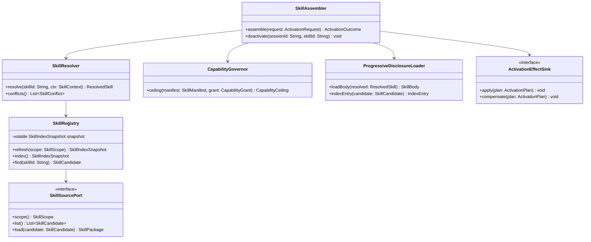
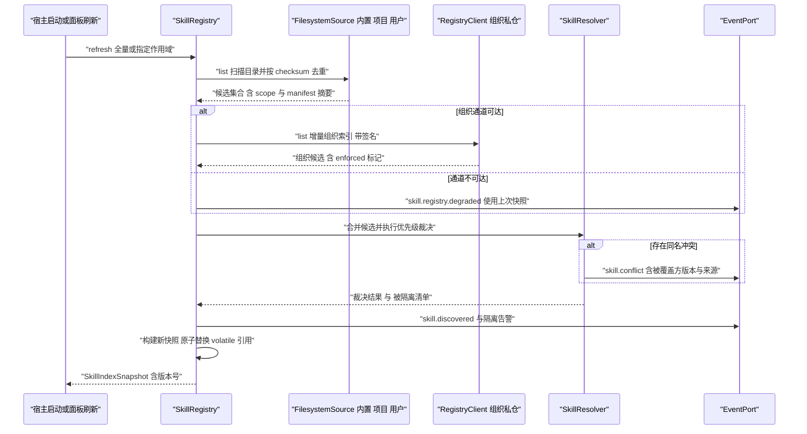
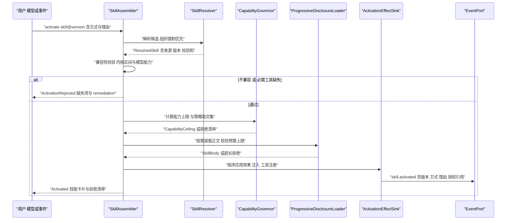
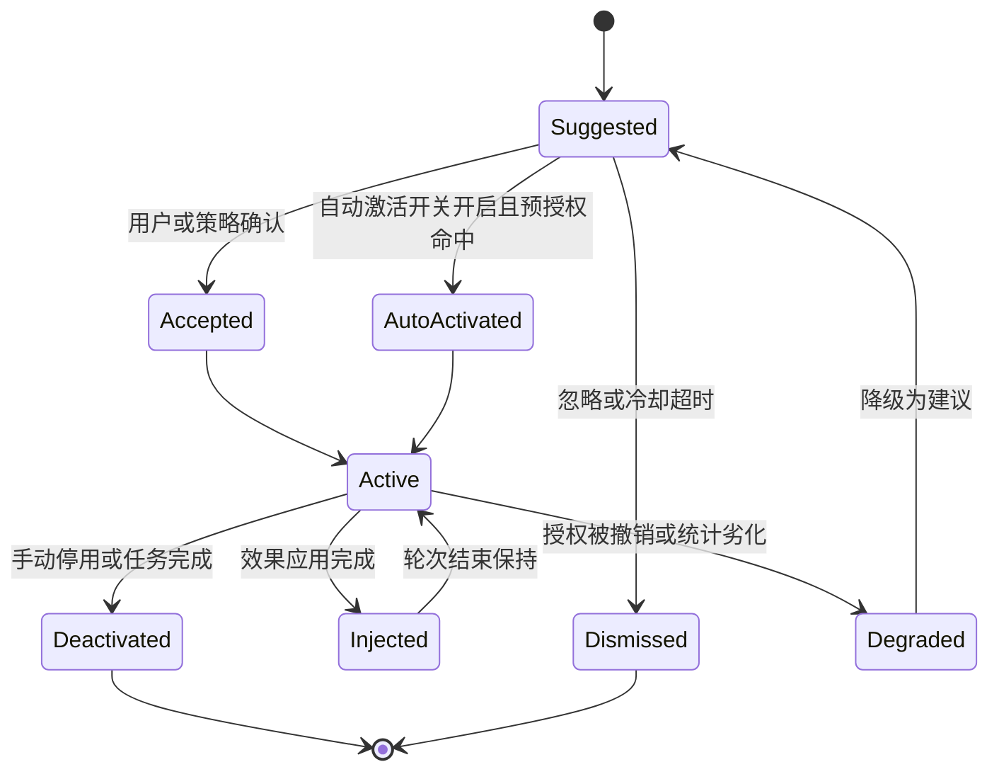

# C13 · SkillRegistry（技能注册与激活）

> 定位：Phase B 组件级方案（双粒度交付的第二层）。本文件把 `docs/harness/impl/08-skill-system-impl.md` 的**注册与激活内核**展开为可独立开发的组件契约（附录 D `K-24 SkillRuntime + SkillStore` 的注册/解析/装配子集，不含安装、签名与评测运行器）；系统级方案仍是本组件上位事实源，冲突按「系统级优先 + 登记修订建议」处理。
> 上游：`docs/harness/08-skill-system.md`（D-SKILL-1…10，§4.1 四源优先级、§4.5 能力声明）+ `impl/08`（REQ-SKILL-1…17、I-SKILL-1…7）；关联 `impl/03`（上下文注入）、`impl/05`（工具收窄）、`impl/06`（权限收窄）、`impl/07`（脚本沙箱）、`impl/17`（`skill.activate` 钩子点）。
> 竞品证据：`research/competitors/01-claude-code-purpose-built.md`（`SKILL.md` 正文按需加载的渐进披露 `[E2]`）、`02-opencode.md`（四类发现源与同名处理 `[E1]`）、`04-deepseek-harness.md`（frontmatter 布尔解析拒绝而非放行 `[E1]`）、`08-gemini-cli.md`（`activate_skill` 工具 `[E1]`）。
> 编号口径：组件码 `C13`，组件层编号 `REQ-C-SKILLREG-n` / `I-C-SKILLREG-n`，与系统级 `REQ-SKILL-n` / `I-SKILL-n` 不重号、不覆盖；系统级决策仍是唯一权威，组件级决策只细化落点与回退。
> 不冲突声明：本文件不修改 Phase A 卷册与 35 份系统级方案；发现的口径缺口登记为**修订建议**（§9.3，待主控分配 `X-n` 并并入 `IMPL-DECISIONS.md` §4 / `README.md` §4）。

---

## ① 定位与边界

### 1.1 组件职责与模块落位

| 项 | 内容 |
| --- | --- |
| 组件职责 | 技能索引构建与四源优先级裁决、清单强校验准入、渐进披露装载、激活装配（能力收窄 → 工具可用性 → 依赖锁 → 上下文注入 → 事件）与停用回滚 |
| 内核落点 | `harness-contract`（`com.hk.opencoding.contract.skill`：`SkillManifest`/`SkillScope`/`SkillErrorCode`）+ `harness-kernel/kernel-agent`（`SkillRegistry` / `SkillResolver` / `SkillAssembler` / `CapabilityGovernor` / `ProgressiveDisclosureLoader`，纯决策、零 Spring） |
| 平台落点 | `harness-platform/platform-skill`（`SkillSourcePort` 四实现、registry 客户端、签名校验）；目录缓存与清单原文快照落 `platform-persistence`（`oc_skill_*`） |
| 装配点 | `SkillAutoConfiguration`（`harness-host/host-bootstrap`）按 `SkillScope` 注册多来源并注入 `SkillProperties`（`open-coding.skills.*`） |
| 可单测性 | 全部决策为纯函数（输入快照 + 请求 → 结果），无 IO；IO 经端口注入，测试用内存实现替换 |

### 1.2 解决什么 / 不解决什么

| 维度 | 本组件解决 | 归属他处（不解决） |
| --- | --- | --- |
| 发现 | 四源候选合并、同名优先级裁决、冲突事件、索引原子替换 | 目录扫描实现与 gitignore 过滤（`platform-skill`）；组织索引同步与签名（`platform-skill`） |
| 校验 | 清单字段级强校验（类型/枚举非法整体拒绝）、必需工具存在性、内核与模型能力区间 | 清单文法解析（YAML 绑定在平台适配器）；技能包完整性 `checksums.txt`（安装期） |
| 激活 | 唯一激活入口：能力收窄、权限收窄建议、预算卡口、注入编排、激活记录与事件 | 逐动作权限决策（卷 06 `PermissionEngine`）；上下文区段组装落点（卷 03）；脚本执行（卷 07） |
| 全生命周期 | 建议/激活/降级/停用的会话内语义 | 安装/更新/卸载/发布（`oc skill install|publish`）、评测门禁（`SkillEvalRunner`） |

### 1.3 上下游依赖

| 方向 | 依赖 / 消费方 | 契约要点 |
| --- | --- | --- |
| 上游 | 卷 04 提示词 | 技能指令作为「片段 + 模板」进资产系统；激活版本号写入提示词版本集 |
| 上游 | 卷 03 上下文 | 注入 S2（模式与角色）与 S5（知识检索）；资源按引用读取（N4 不变式） |
| 上游 | 卷 05 工具 | `tools.required` 缺失 ⇒ 拒绝激活；脚本工具注册为 `skill:<ns>:<name>:<script>` |
| 上游 | 卷 06 / 卷 17 | 安装授权集（`userGrant`）输入；`skill.activate` 钩子点可阻断激活（优先于自动激活开关） |
| 下游 | 卷 16 / 19 | `skill.*` 事件族；`oc_skill_activation` 激活记录、`oc_skill_dependency_lock` 锁文件 |
| 下游 | 卷 22 / 23 | CLI `oc skill …` 与桌面端技能面板消费 `skill.list`/`skill.explain` |

### 1.4 不变式（继承 impl/08 §1.5，组件内自检）

- **N1 只窄不宽**：`effective = declared ∩ policy ∩ userGrant`，任何路径不得放宽；写范围默认空（未声明即无写权）。
- **N2 不静默跳过**：清单非法/未签名/能力未授权的技能隔离并告警，禁止 `try-catch` 后静默继续装载。
- **N3 可解释**：每次激活（含自动激活）产出 `skill.activated`，载荷含方式、理由、版本与授权引用。
- **N4 按需加载**：索引常驻（名称 + 描述 + 触发摘要），正文仅激活时注入，超 8k token 拒绝并提示拆分。

---

## ② 需求清单（REQ-C-SKILLREG）

| 编号 | 需求描述 | 来源 | 优先级 | 验收要点 |
| --- | --- | --- | --- | --- |
| REQ-C-SKILLREG-1 | 索引快照构建：四源候选合并为不可变快照（名称 + 描述 + 触发摘要 + 校验和 + 作用域），构建完成后原子替换；1k 技能 ≤ 300ms | `impl/08` §6.1/§10.6（卷 08 D-SKILL-2） | P1 | 构建期间读到旧快照；替换瞬间无中间态；门禁取 300ms |
| REQ-C-SKILLREG-2 | 四源优先级裁决：内置 < 组织 < 工作区 < 用户；同作用域同名多版本由锁文件裁决，无锁文件取最高兼容版本并告警 | 卷 08 §4.1；`impl/08` §4.2；opencode 四类发现源与同名处理 `[E1] 02 §4.8` | P1 | 覆盖矩阵全过；`org.enforced` 不可被上层覆盖；冲突出 `skill.conflict` |
| REQ-C-SKILLREG-3 | 清单强校验：未知字段 WARN 忽略；已知字段类型/枚举非法、`required`∩`denied` 冲突、`recommendedMode` > `maxMode` 一律整体拒绝并给出字段路径 | REQ-SKILL-13；DeepSeek 布尔解析拒绝而非放行 `[E1] 04 §4.8` | P1 | 每个非法用例被拒且消息含 `skillId + fieldPath` |
| REQ-C-SKILLREG-4 | 渐进披露装载：索引常驻、正文懒加载；主指令默认 ≤ 8k token（`budget.maxInstructionTokens`），超长拒绝激活并提示拆分到 `resources/` | REQ-SKILL-11；Claude `SKILL.md` 正文按需加载 `[E2] 01 §4.8` | P1 | 命中缓存 ≤ 20ms；超长用例返回 `SKILL_BUDGET_EXCEEDED` |
| REQ-C-SKILLREG-5 | 四方式激活与三段式建议：显式 / 模型请求（`skill` 工具）/ 事件 / 上下文匹配；后两者默认只产建议，自动激活可开关且组织可强制关闭 | 卷 08 D-SKILL-3；`impl/08` §4.3（I-SKILL-3）；gemini `activate_skill` `[E1] 08 §4.8` | P1 | 每种方式 `how` 字段正确；建议链路出 `skill.suggested` |
| REQ-C-SKILLREG-6 | 能力上限校验：装配期计算并落盘 `CapabilityCeiling`（能力集 + 权限上限 + 模式上限），未声明能力视为空集；组织/用户策略只能进一步收窄 | REQ-SKILL-6；`impl/08` §4.4（N1） | P1 | `declared ∩ policy ∩ userGrant` 全组合；放宽路径必失败 |
| REQ-C-SKILLREG-7 | 工具可用性卡口：`tools.required` 任一缺失 ⇒ 拒绝激活并给 remediation；`tools.denied` 与 required 冲突在装载期即拒绝 | REQ-SKILL-4；`impl/08` §10.5 | P1 | 工具恢复后技能自动可激活（无缓存污染） |
| REQ-C-SKILLREG-8 | 激活可解释：`skill.activated` 含版本 / `how` / 理由 / `grantRef`；`skill.explain` 返回同源依据；拒绝附结构化缺失项 | N3；卷 08 §4.2 | P1 | 事件快照回放逐字段断言 |
| REQ-C-SKILLREG-9 | 幂等与并发：同会话同版本重复激活幂等返回既有记录；会话内激活串行（单飞）；注入失败回滚为「未注入」原子态 | `impl/08` §6.2 | P1 | 100 并发重复激活仅 1 次注入 + 1 条记录 |
| REQ-C-SKILLREG-10 | 撤销即时生效：组织禁用 / 卸载 / 版本 yank / 授权回收后运行期即拒（`skill.capability.denied`），活动激活转 `Degraded` | `impl/08` §10.2/§10.3 | P2 | 撤销后 1 次调用内被拒，不沿用旧授权 |

> 溯源说明：REQ-C-SKILLREG-1…4 覆盖发现与装载（`impl/08` §1.5 N2/N4、§6.1）；-5…-8 覆盖激活链路（§4.3/§4.4/§6.2）；-9/-10 覆盖并发与撤销（§6.2/§10.2）。

---

## ③ 关键设计决策（I-C-SKILLREG）

四条决策均为系统级 `I-SKILL-1…7` 在组件内的落点细化，不改变其选定分支；每条含被放弃分支代价与回退触发（当前未触发）。

| 决策 | 维度 | 选定分支 | 被放弃分支的代价 | 回退触发 |
| --- | --- | --- | --- | --- |
| `I-C-SKILLREG-1` | 索引快照形态 | 单 `volatile` 不可变快照（COW）：构建新快照 → 原子替换 → 读路径无锁；快照带单调 `snapshotVersion` 供激活记录回放 | 读写锁方案在读多写少下产生写饥饿与读等待，建议计算 P95 上升 | 替换频率 > 1 次/秒且单次构建 > 500ms → 按作用域分段替换，接口不变 |
| `I-C-SKILLREG-2` | 装配副作用模型 | 纯决策 `ActivationPlan` + `ActivationEffectSink` 按序执行（注入 → 工具注册 → 事件），失败逆序补偿 | 在装配方法内直接注入：无法 dry-run 与单测，失败残留半注入态（违反幂等断言） | 效果端口使装配 P95 > 50ms → 合并「工具注册 + 事件」为批次效果，补偿粒度不变 |
| `I-C-SKILLREG-3` | 能力上限缓存 | 装配期由 `CapabilityGovernor` 算一次 `CapabilityCeiling` 挂激活记录；运行期逐动作仍由卷 06 决策（缓存上限而非放行结论），撤销事件驱动失效 | 运行期每次动作重算交集：运算虽 < 1ms，但多路授权源读取引入抖动，上限无法一次展示 | 撤销广播延迟 > 100ms 出现放行窗口 → 上限改为「撤销版本号调用前校验」 |
| `I-C-SKILLREG-4` | 语义路由降级 | 规则/关键词先行（必得结论），语义路由并发增强；300ms 超时或模型不可用时仅返回规则结论 | 语义优先：模型不可用时建议链路整体不可用，违背「退化为规则仍可产出」 | 规则命中误报率 > 30%（按 `suggestion.rejected` 统计）→ 规则默认权重归零，仅保留显式触发器 |

---

## ④ 类图与关键签名



**Java 21 关键签名**（节选；包根 `com.hk.opencoding.contract.skill` / `com.hk.opencoding.kernel.skill`；类级 `@Slf4j`，日志中文 + `{}` 占位符，异常统一 `SkillException extends HarnessException`）

```java
/**
 * 技能注册表：四源候选的合并索引与原子快照。
 * 所有读路径只读不可变快照，写路径（refresh）单飞构建后原子替换。
 */
public final class SkillRegistry {

    /**
     * 刷新指定作用域（或全量）并原子替换索引快照。
     *
     * @param scope 作用域；全量刷新时传 {@link SkillScope#USER} 表示覆盖全部四源（必填）
     * @return 新快照（含版本号、候选计数与冲突清单）
     * @throws SkillException 索引构建期间底层来源全部不可读时抛出（单个来源失败只告警不抛出；携带 SkillErrorCode）
     */
    public SkillIndexSnapshot refresh(SkillScope scope) {
        log.info("技能索引刷新开始，作用域={}", scope.getCode());

        // 1. 并行拉取：单来源失败只降级该来源，不中断整体构建（N2「隔离而非静默」）
        // 2. 优先级裁决并归集冲突，构建新快照后原子替换 volatile 引用
        SkillIndexSnapshot next = build(scope);

        log.info("技能索引刷新完成，候选数={}, 快照版本={}", next.candidates().size(), next.version());
        return next;
    }
}
```

```java
/**
 * 能力上限快照：装配期一次性计算的能力与权限收窄结果。
 * 运行期逐动作决策仍由权限引擎完成——快照缓存的是上限而非放行结论。
 *
 * @param allowedCapabilities 收窄后的能力集（网络域名/命令/读写范围/密钥引用/MCP 连接）
 * @param maxPermissionMode 收窄后的权限模式上限（只可能 ≤ 用户当前模式）
 * @param ceilingVersion 上限版本号，撤销事件递增后使旧上限失效
 */
public record CapabilityCeiling(
        Set<String> allowedCapabilities,
        PermissionMode maxPermissionMode,
        long ceilingVersion) {
}
```

---

## ⑤ 核心时序图

### 5.1 索引构建与四源优先级裁决

**前置条件**：至少一个来源目录可读；组织 registry 可访问或已有上次同步快照。
**主路径**：并行拉取 → 合并 → 优先级裁决 → 原子替换 → 事件。
**异常与补偿**：单技能清单非法 ⇒ 隔离该技能（`status=Rejected`）+ 告警；某来源整体不可读 ⇒ 使用上次快照并出 `skill.registry.degraded`，禁用公网时静默继续。
**幂等与并发点**：`refresh` 按 checksum 去重（未变文件不重解析）；刷新单飞（并发请求复用同一次结果）；替换前所有读者仍读旧快照。



### 5.2 激活主路径（显式 / 模型请求 / 建议确认）

**前置条件**：技能已安装且通过签名校验；锁文件已生成（存在依赖时）；会话上下文可用。
**主路径**：解析候选 → 兼容性与工具校验 → 能力上限 → 权限上限 → 正文装载 → 效果应用 → 事件。
**异常与补偿**：预算不足或效果失败 ⇒ 逆序补偿（注销脚本工具 → 撤销注入）并返回结构化拒绝；会话中断 ⇒ 按激活记录重建注入。
**幂等与并发点**：同会话重复激活同版本返回既有记录；会话内激活单飞；脚本工具注册与注销成对。



### 5.3 失败补偿与并发幂等（要点）

- **幂等**：幂等键 `(sessionId, skillId, version)`；重复激活返回既有 `ActivationOutcome`，不重复注入。
- **并发**：会话级单飞锁；并发请求复用进行中结果（含拒绝结果，文案同源）；补偿操作自身幂等（重复调用 no-op）。
- **补偿**：效果应用中途失败 ⇒ 逆序补偿（注销脚本工具 → 撤销注入）；补偿自身失败 ⇒ 出 `skill.deactivate.failed` 并标记「注入可能残留」，会话 re-attach 时强制重建。

---

## ⑥ 状态机（技能激活态）

与 `impl/08` §7.2 `ActivationRecord` 状态集保持一致；本节细化组件内迁移副作用与幂等键（不新增状态，避免与系统级方案分叉）。



| 迁移 | 组件副作用 | 幂等键 |
| --- | --- | --- |
| `Suggested → Accepted/AutoActivated` | 写建议采纳指标；`AutoActivated` 必须携带触发规则 ID 或事件 ID | `(sessionId, skillId, suggestionId)` |
| `Active → Injected` | 脚本工具注册 + 上下文区段注入 + 预算预扣 | `(sessionId, skillId, version)` |
| `Active → Degraded` | 上限缓存失效、工具注销、出 `skill.capability.denied` + 提示 | 撤销事件 ID |
| `* → Deactivated` | 逆序补偿注入与工具；释放预算预扣 | `(sessionId, skillId)` |

**不变式**：`AutoActivated` 与 `Accepted` 均必须携带理由字段（触发规则 ID / 语义分数 / 事件 ID）；`Degraded` 状态下技能不得继续注入正文，但仍可被显式重新激活。

---

## ⑦ 接口与依赖矩阵

### 7.1 端口与依赖

| 端口 / 依赖 | 方向 | 契约要点 | 失败语义 |
| --- | --- | --- | --- |
| `SkillSourcePort` | 输入（平台） | `scope()/list()/load()`；多实现按作用域排序注入 | 单来源失败降级该来源 + 告警（不中断索引） |
| `DependencySolverPort` | 内核 | 输出确定性锁文件；冲突给出约束来源链 | 冲突 ⇒ 拒绝激活（`SKILL_DEPENDENCY_CONFLICT`） |
| `ToolAvailabilityPort`（卷 05） | 双向 | 查询 required 工具是否可用；收窄工具集 | 缺失 ⇒ 拒绝并给 remediation |
| `PermissionCeilingPort`（卷 06） | 输入 | 读取当前模式与授权集；写入收窄建议（不直接改模式） | 读取失败 ⇒ 按最严模式（`default`）继续 |
| `ContextInjector`（卷 03） | 输出 | 注入 S2/S5 区段；预算预扣与回滚 | 预算不足 ⇒ 补偿回滚 |
| `HookGate`（卷 17） | 输入 | `skill.activate` 阻断性钩子优先于自动激活开关 | 阻断 ⇒ 拒绝激活并留痕 |
| `ActivationStore`（`platform-persistence`） | 输出 | 激活记录、锁文件差异、草稿准入状态（`DRAFT` 不参与发现） | 写失败 ⇒ 回滚效果并报错（外壳事务） |
| `EventPort`（卷 16） | 输出 | `skill.activated/suggested/conflict/capability.denied` | 事件失败 ⇒ WARN（不改变激活结论） |

### 7.2 配置项

复用 `impl/08` §9.5 全部 `open-coding.skills.*`；本组件**新增登记**（需同步 `.env.example`，编号待主控并入台账）：

| 配置键 | 默认值 | 必填 | 说明 |
| --- | --- | --- | --- |
| `open-coding.skills.suggestion.cache-ttl-seconds` | `15` | 否 | 建议结果按（会话，上下文指纹）缓存的 TTL；`impl/08` §10.1 提及「短 TTL 缓存」但 §9.5 未登记（见 §9.3 R-C13-2） |
| `open-coding.skills.index.swap-max-ms` | `300` | 否 | 索引原子替换的单次预算，超时降级为分段替换（I-C-SKILLREG-1 回退路径） |

### 7.3 事件

`skill.discovered` / `installed` / `updated` / `removed`（安装面外发，本组件只读）、`skill.activated` / `deactivated`、`skill.suggested` / `suggestion.accepted` / `suggestion.rejected`、`skill.capability.denied`、`skill.conflict`、`skill.registry.degraded`、`skill.deactivate.failed`（补偿失败，新增载荷：会话、技能、已补偿效果数）。

---

## ⑧ 关键算法

### 8.1 技能发现优先级与同名裁决

```text
输入：四源候选集合 C（每项含 scope、name、version、enforced、checksum、compatibility）
输出：裁决集合 R 与冲突清单 K
按 skillId（namespace.name）分组，对每组：
  1) 若存在 enforced 候选（仅组织作用域可为 true）：取组织版本；若组织版本不可用（不兼容/必需工具缺失/组织禁用）
     → 拒绝该组并记录冲突（§9.3 R-C13-1：不回落，回落会静默改变行为，违反 N2/N3）
  2) 否则取 scope 序最大者（USER > PROJECT > ORG > BUILTIN）
  3) 同作用域多版本：有锁文件 ⇒ 按锁文件；无锁文件 ⇒ 取最高兼容版本并产生 WARN 与 skill.conflict
  4) 被覆盖方版本与来源写入冲突事件（可解释性要求）
复杂度：O(n)；n = 候选数（1k 量级单次裁决 < 1ms）
```

### 8.2 能力上限校验与工具集收窄

```text
输入：manifest.capabilities、policy（组织策略）、userGrant（安装授权）、tools.required/denied
输出：CapabilityCeiling 或拒绝清单

effective = declared ∩ policy ∩ userGrant        // 三重交集，只窄不宽（N1）
  - 网络域名：与租户白名单取交集
  - 命令白名单：与策略黑名单取差集；未命中即拒绝（不落回通用 run_command）
  - 读范围：默认工作区根（只读）；写范围：默认空集（未声明即无写权）
  - 密钥引用、子 Agent 派生、MCP 连接：默认空集（deny-by-default）
  - 权限模式：仅允许 recommendedMode ≤ 用户当前模式，且 ≤ maxMode
前置校验：required ∩ denied = ∅；required ⊆ 可用工具集
失败：任一项不满足 → ActivationRejected（列出未授权能力项，不部分放行）
```

### 8.3 渐进披露装载

```text
索引态（常驻）：entry = {name, description, triggerSummary, scope, checksum, tokenEstimate}
  - 触发摘要 ≤ 200 字符；索引构建按 checksum 去重，命中缓存不重解析
激活态（按需）：
  1) token 估算 = 正文 token 数（按 §3.4/impl/08 §10.6 口径）
  2) 若 token > budget.maxInstructionTokens（默认 8000）→ 拒绝激活，提示拆分到 resources/
  3) 与上下文预算二次校验（卷 03）：不足 → 补偿回滚并返回 SKILL_BUDGET_EXCEEDED
  4) 正文与资源缓存键 = (skillId, version, checksum)；失效跟随撤销事件与版本变更
资源读取：按引用 skill://<ns>/<name>@<ver>/resources/x.md 读取，单次上限 maxResourceBytes
```

---

## ⑨ 错误处理与降级

### 9.1 错误矩阵

| 场景 | 错误码 | 可重试 | 对外文案 | 处置 |
| --- | --- | --- | --- | --- |
| 清单缺必填 / 类型非法 / 字段冲突 | `SKILL_MANIFEST_INVALID` | 否 | 「技能 `<id>` 清单非法：`<fieldPath>` `<reason>`」 | 隔离该技能 + 告警，其余技能不受影响（N2） |
| 依赖区间交集为空 / 多主版本 / 硬环 | `SKILL_DEPENDENCY_CONFLICT` | 否 | 「技能 `<id>` 依赖冲突：`<冲突链>`」 | 拒绝激活，输出约束来源链 |
| 能力未授权（网络 / 命令 / 写范围 / 密钥） | `SKILL_CAPABILITY_DENIED` | 否 | 「技能 `<id>` 申请的能力未授权：`<capability>`」 | 拒绝执行；引导安装授权 |
| 必需工具缺失 | `SKILL_TOOL_MISSING` | 是（工具恢复后） | 「技能 `<id>` 依赖的工具 `<tool>` 当前不可用」 | 标记不可激活 + remediation；恢复后自动可激活 |
| 注入超预算 | `SKILL_BUDGET_EXCEEDED` | 否 | 「技能 `<id>` 超出注入预算（`<tokens>` > 上限），请拆分到 `resources/`」 | 逆序补偿回滚注入 |
| 语义路由不可用 / 超时 | `DEPENDENCY_UNAVAILABLE` | 是 | 「技能建议已退化为规则匹配」 | 规则结论继续可产出（I-C-SKILLREG-4） |
| registry 不可达 | `DEPENDENCY_UNAVAILABLE` | 是 | 「技能市场暂不可达，已使用上次同步快照」 | 快照继续 + `skill.registry.degraded` |
| 效果补偿失败 | `SKILL_DEACTIVATE_FAILED`（新增登记） | 是 | 「技能 `<id>` 停用未完全生效，将在会话重连时重建」 | 标记会话「注入可能残留」，attach 时强制重建 |

### 9.2 降级与失败隔离

- **单技能隔离**：清单非法只隔离该技能（`status=Rejected`），索引继续构建；禁止整表失败。
- **来源降级**：目录不可读按作用域降级；组织通道不可达用上次快照；禁用公网时无告警噪音。
- **路由降级**：语义路由超时/不可用退化为规则 + 关键词，建议链路不中断。
- **撤销即时生效**：撤销事件使 `CapabilityCeiling` 立即失效；活动激活转 `Degraded` 并提示，不静默沿用旧授权。
- **Hook 优先**：`skill.activate` 阻断性钩子优先于自动激活与预授权，阻断原因进入拒绝载荷。

### 9.3 修订建议（本文件提出，待主控分配 `X-n` 并入台账）

| 编号 | 建议内容 | 依据 | 涉及 | 阻塞性 |
| --- | --- | --- | --- | --- |
| R-C13-1 | 组织 `enforced` 同名覆盖后，若组织版本不可用（内核不兼容 / 必需工具缺失 / 组织禁用），卷 08 §4.1 与 `impl/08` §4.2 未定义是否回落低优先级版本。本组件按「**不回落 + Fail-Fast 告警 + 冲突事件**」实现（回落会静默改变行为，违反 N2/N3）；建议卷 08 §4.1 补该语义一句 | 本文件 §8.1 步骤 1；`impl/08` §4.2 | 卷 08 §4.1 | 否 |
| R-C13-2 | `open-coding.skills.suggestion.cache-ttl-seconds`（建议缓存 TTL）在 `impl/08` §10.1 有语义描述但 §9.5 配置表未登记；本文件 §7.2 已按组件级补登，建议回填系统级配置表并同步 `.env.example` | 本文件 §7.2；`impl/08` §10.1 | `impl/08` §9.5 | 否 |

---

## ⑩ 性能与并发

### 10.1 预算（与 `impl/08` §10.1/§10.6 对齐，组件口径）

| 指标 | 预算 | 说明 |
| --- | --- | --- |
| 索引构建 | ≤ 300ms / 1k 技能 | 构建期读路径仍走旧快照，无冻结窗口 |
| 单技能装载 | ≤ 100ms（索引命中 ≤ 20ms） | 懒加载；manifest 按 checksum 缓存 |
| 激活装配（不含模型） | ≤ 50ms | 能力交集为内存集合运算 < 1ms |
| 建议计算 | ≤ 300ms P95 | 超时降级规则匹配（I-C-SKILLREG-4） |
| 会话内激活串行化等待 | ≤ 装配预算 × 在途数（默认 1） | 单飞排队，无自旋 |

### 10.2 并发与幂等

- 索引：COW 快照 + 刷新单飞；并发 `refresh` 复用同一 in-flight 结果。
- 激活：会话级单飞锁；幂等键 `(sessionId, skillId, version)`；建议去抖经 `RedisKeys.cooldown(SKILL, "suggest", skillId, sessionId)`（默认 300s）。
- 效果应用：`ActivationEffectSink` 内按序执行，补偿逆序；工具注册与注销成对（泄漏检测纳入单测）。
- 事务纪律：激活记录、锁文件、草稿状态落库由外壳适配器以 `@Transactional(rollbackFor = Exception.class)` 实现；registry 拉取、评测、脚本执行等**外部调用移出事务**，提交后事件驱动快照失效。

### 10.3 容量

- 索引常驻 ≈ 300–800B/技能（1k 技能 ≈ 0.5MB）；正文按会话缓存，50 会话 × 3 技能 × 32KB ≈ 4.8MB 峰值（详见 `impl/08` §10.6）。
- 会话上限：单会话建议激活技能数受上下文预算钳制（卷 03 二次校验），组件不做独立硬上限。

---

## ⑪ 测试要点

### 11.1 用例分层

| 层 | 用例族 | 关键断言 |
| --- | --- | --- |
| 单测（纯内核） | 优先级与覆盖 | 四源覆盖全矩阵；`org.enforced` 不可覆盖；冲突事件逐字段 |
| 单测 | 清单校验 | 必填缺失 / 类型非法 / 未知字段 / 布尔拼写错误：整体拒绝且消息含 `fieldPath` |
| 单测 | 能力上限 | `declared ∩ policy ∩ userGrant` 全组合；写范围未声明为空；放宽路径必失败 |
| 单测 | 渐进披露 | 8k 超长拒绝 + 拆分提示；资源读取超 `maxResourceBytes` 被拒 |
| 集成 | 激活四方式 | 显式 / 模型请求 / 事件 / 上下文匹配的 `how` 与事件载荷 |
| 集成 | 幂等与并发 | 100 并发重复激活仅 1 次注入 + 1 条记录；索引重建期间读旧快照 |
| 故障注入 | 降级矩阵 | registry 不可达 / 语义路由超时 / 预算不足回滚 / 撤销即时生效 |
| 契约与回放 | SPI 与事件 | `skill.*` 事件 schema 快照 + 固定序列回放确定性 |

### 11.2 恶意与边界用例

- 技能清单包含 `systemPrefix` / `toolSchema` 等「覆盖系统提示词或工具 schema」字段 → 装载期整体拒绝（内容层提权防护）。
- 技能描述 / 触发摘要注入攻击串 → 入索引前经注入检测标注来源，命中即隔离并告警。
- 技能脚本路径逃逸（`../`、绝对路径）→ 装载期拒绝；解释器不在白名单 → 拒绝（卷 07 执行档 L0+）。
- 被 yank 版本在锁文件中被引用 → 解析拒绝并提示重新求解。

### 11.3 门禁与可执行命令

```bash
# 内核：优先级 / 清单校验 / 能力上限 / 渐进披露单测；平台：四源发现与激活链路集成测试
mvn -pl harness-kernel/kernel-agent -am test -Dtest='SkillScopeTest,SkillManifestTest,CapabilityGovernorTest,ProgressiveDisclosureTest' -DfailIfNoTests=false
mvn -pl harness-platform/platform-skill -am verify -Dtest='*SkillActivationIT' -DfailIfNoTests=false
mvn -pl harness-host/host-bootstrap -am test        # 装配 + 事件 + 持久化主链路
```

**DoD**：11.1 全部用例通过；索引构建 ≤ 300ms/1k、激活装配 ≤ 50ms 门禁达标；恶意用例零漏拦；`skill.*` 事件快照与 `impl/08` §8.3 一致。
