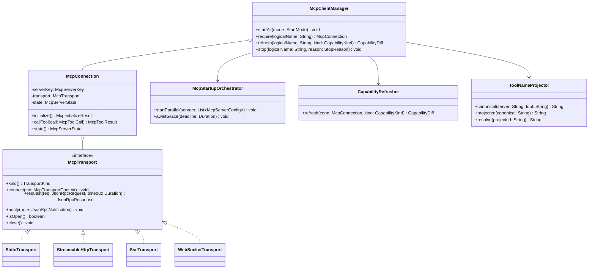
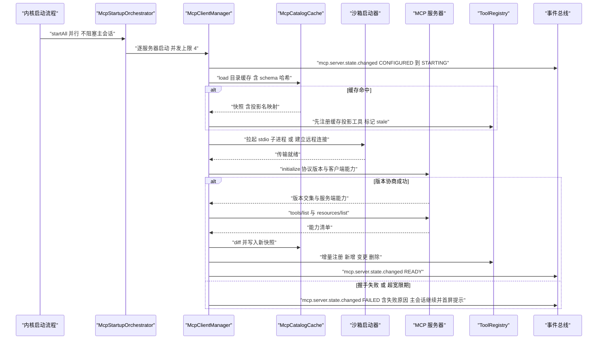
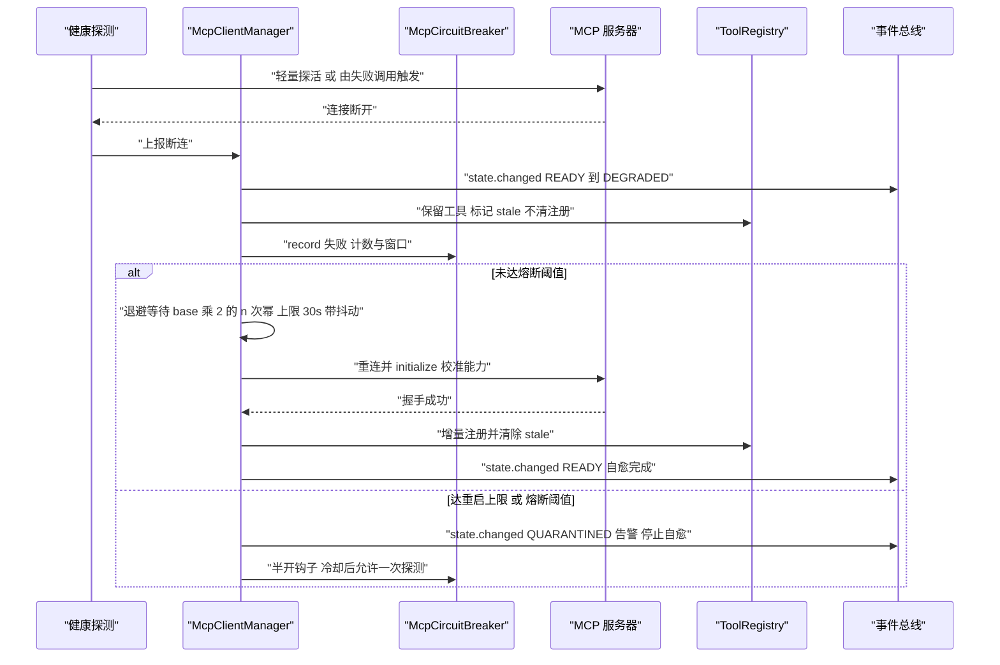
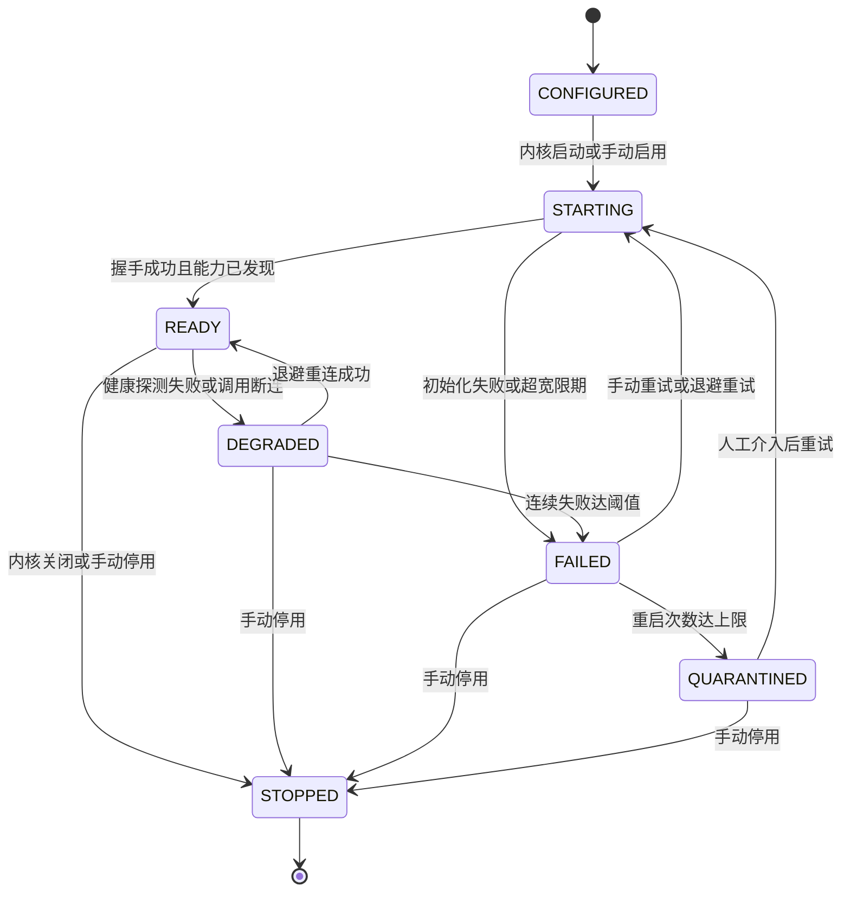

# C14 · MCPClientManager（MCP 客户端管理器）

> 定位：Phase B 组件级方案（双粒度交付的第二层）。本文件把 `docs/harness/impl/09-mcp-gateway-impl.md` 的**客户端侧连接管理**展开为可独立开发的组件契约（`impl/09` §4 架构图与 §5 类图中的 `McpClientManager` / `McpConnection` 族）；系统级方案仍是本组件上位事实源，冲突按「系统级优先 + 登记修订建议」处理。
> 上游：`docs/harness/09-mcp-system.md`（D-MCP-1…10，§4.2 生命周期状态机、§4.3 能力刷新、§4.4 安全模型）+ `impl/09`（REQ-MCP-1…19、I-MCP-1…6，含 §6.1–6.3、§7.1、§10.5）。
> 竞品证据：`research/competitors/03-codex.md`（`codex-mcp` 的 `connection_manager` / `tool_catalog_cache` 与 `mcp_optional_startup_grace_ms` `[E1]`）、`01-claude-code-purpose-built.md`（`auth.refreshLock` 刷新去重 `[E1]`）、`04-deepseek-harness.md`（每 server 一个连接插件、`mcp__<server>__<tool>` 命名与资源工具引用计数 `[E1]`）、`07-qoder.md`（四传输与 `mcp.lazyLoad` `[E2]`）。
> 编号口径：组件码 `C14`，组件层编号 `REQ-C-MCPMGR-n` / `I-C-MCPMGR-n`，与系统级 `REQ-MCP-n` / `I-MCP-n` 不重号、不覆盖；类名沿用系统级口径 `McpClientManager`（文件名 `mcp-client-manager` 为目录命名，不新增重名类）。
> 不冲突声明：本文件不修改 Phase A 卷册与 35 份系统级方案；发现的口径缺口登记为**修订建议**（§9.3，待主控分配 `X-n` 并并入 `IMPL-DECISIONS.md` §4 / `README.md` §4）。

## ① 定位与边界

### 1.1 组件职责与模块落位

| 项 | 内容 |
| --- | --- |
| 组件职责 | 服务器启动编排（并行 + 宽限预算）、四传输选择与握手协商、连接生命周期与自愈（退避 / 熔断 / 隔离）、能力发现与增量刷新、目录缓存与热启动、工具命名空间投影与反伪造、令牌刷新并发去重、状态事件与诊断数据 |
| 落点（契约） | `harness-contract`（`McpTransport`、`McpServerState`、`McpServerKey`、`McpCapabilitySnapshot`，零框架） |
| 落点（实现） | `harness-platform/platform-mcp`（`McpConnection` / `McpClientManager` / `McpStartupOrchestrator` / `McpHealthProbe` / `CapabilityRefresher` / `McpCatalogCache` / `ToolNameProjector`，允许 Spring 装配） |
| 状态与缓存 | Redis：`RedisKeys.mcpServerState`（热副本，无固定 TTL）、`mcpStartLock` / `mcpAuthRefreshLock`（分布式锁）、`mcpToolCatalog`（目录缓存，7 天 LRU）；持久化：`oc_mcp_server_state` / `oc_mcp_capability` / `oc_mcp_tool_binding`（`platform-persistence`） |
| 装配点 | `McpAutoConfiguration`（`harness-host/host-bootstrap`）注入 `McpProperties`、`SecretPort` 实现、沙箱启动器与 `McpGatewayPort`；内核侧只见端口，不见 Spring |

### 1.2 解决什么 / 不解决什么

| 维度 | 本组件解决 | 归属他处（不解决） |
| --- | --- | --- |
| 连接 | 传输选择与协商、握手与版本交集、单写线程多路复用、在途限流 | 传输协议编解码实现（`StdioTransport` 等四个实现类，独立单测边界） |
| 生命周期 | 启动编排、宽限预算、健康探测、退避重启、熔断、隔离、状态事件 | 进程沙箱档位与网络策略（卷 07）；网关侧托管运行（`platform-enterprise`） |
| 能力 | `tools/list` + `list_changed` 增量刷新、diff、目录缓存、热启动先注册 stale | 六类能力到内核契约的语义映射（`McpCapabilityMapper`，同模块兄弟组件） |
| 命名 | canonical / projected 双层命名、投影表注册与解析、保留名与反伪造校验 | 工具管线执行与权限决策（卷 05/06）；内置工具命名所有权（卷 05） |
| 认证 | 401 刷新协调与并发去重、令牌引用经 `SecretPort` 存取 | OAuth 授权交互流程与注册模式（`McpAuthSPI` 实现与 `oc_mcp_auth_grant` 落库） |
| 对外暴露 | 不解决：反向供给的路由分发属同模块兄弟组件 | sampling / elicitation 策略裁决（`ReverseRequestHandler`）；对外暴露（`McpExposureService`） |

### 1.3 上下游依赖

| 方向 | 依赖 / 消费方 | 契约要点 |
| --- | --- | --- |
| 上游 | `McpServerRegistry` + `SecretPort` + 沙箱启动器（卷 07）+ `McpGatewayPort`（`direct` / `gateway` 两模式） | 三级合并（组织 / 项目 / 用户，组织可锁定）；首次添加需显式确认；stdio 服务器在沙箱内启动；网关模式禁止直连（`impl/09` §10.4） |
| 下游 | `ToolRegistry`（卷 05）与 `ContextAssembler`（S2 工具清单区段） | 命中目录缓存先注册（标记 stale）再后台校准；工具集在当前轮次稳定 |
| 下游 | `McpAuditSink`、卷 16 事件总线、卷 09 REST/WS 管理面 | `mcp.*` 事件族；`oc mcp doctor` 读诊断面（能力、延迟、认证状态、最近失败） |
| 消费方 | `ToolPipeline`（经 canonical 名调用）、`ReverseRequestHandler` | `require(logicalName)` 是唯一取连接入口；连接不可用返回可重试依赖错误 |

### 1.4 不变式（组件内自检）

- **INV-1 故障隔离**：单服务器启动失败或崩溃不阻塞主会话、不拖垮内核（并行启动 + 宽限 + `DEGRADED` 保留工具可见但调用返回依赖错误，避免模型侧工具集抖动）。
- **INV-2 解析只查表**：投影名 → canonical 名一律经 `oc_mcp_tool_binding` 反查，禁止对字符串二次切分（防命名空间伪造，`impl/09` §10.5）。
- **INV-3 令牌零明文**：令牌只经 `SecretPort` 传递，不进入上下文、事件、日志与审计原文；刷新结果只以引用形式回写。
- **INV-4 轮次稳定**：能力刷新的注册结果只影响后续轮次；当前轮次工具集不变（`impl/09` REQ-MCP-3 验收）。

## ② 需求清单（REQ-C-MCPMGR）

| 编号 | 需求描述 | 来源 | 优先级 | 验收要点 |
| --- | --- | --- | --- | --- |
| REQ-C-MCPMGR-1 | 四传输选择：按服务器声明协商（HTTP 优先于 SSE），本地默认 stdio；同一服务器切换传输不改上层行为 | 卷 09 D-MCP-1；`impl/09` I-MCP-1；Qoder `-t stdio\|sse\|http\|ws` `[E2] 07 §4.7` | P0 | 四传输各有互操作用例；切换传输后调用与审计字段一致 |
| REQ-C-MCPMGR-2 | 启动编排：并行启动（`startup.concurrency` 默认 4）且不阻塞主会话；可选服务器失败在宽限期内不阻塞 TTFB | REQ-MCP-11；Codex `mcp_optional_startup_grace_ms` `[E1] 03 §4.7` | P0 | 冷启动注入「10s 不响应」主会话 TTFB 不受影响；首屏提示失败服务器 |
| REQ-C-MCPMGR-3 | 握手与版本协商：`initialize` 声明协议版本与能力；优先 `2026-07-28`，失败回退 `2025-06-18`；交集为空拒绝该服务器 | REQ-MCP-10；`impl/09` §4.2；Codex 探测失败回退 Legacy `[E1] 03 §4.7` | P1 | 回退留痕（`oc_mcp_capability.disabled_reason`）；空交集不注册任何工具 |
| REQ-C-MCPMGR-4 | 崩溃自愈：指数退避重启（base 500ms / max 30000ms）；`kill -9` 后 ≤ 3 次退避内恢复；达 `max-restart-attempts`（默认 5）转 `QUARANTINED` | REQ-MCP-2；`impl/09` §11.3 | P0 | 恢复过程期间调用返回 `retryable=true` 的依赖错误 |
| REQ-C-MCPMGR-5 | 熔断与半开：连续失败达 `failure-threshold`（默认 5 次 / 60s）快速失败；冷却后半开探测，成功恢复 `READY` | 卷 09 D-MCP-8；`impl/09` §7.1 | P0 | 连续 10 次失败后请求快速失败；半开探测成功自动恢复 |
| REQ-C-MCPMGR-6 | 能力增量刷新：`list_changed` 去抖（默认 500ms）后只重拉对应能力域，diff 出增 / 删 / 改；未变项复用 schema 哈希 | REQ-MCP-3/12；`impl/09` I-MCP-2；Codex `tool_catalog_cache` `[E1] 03 §4.7` | P0 | 洪泛 100 次/秒去抖后刷新 ≤ 2 次；未变项不触发注册 |
| REQ-C-MCPMGR-7 | 目录缓存与热启动：缓存含 schema 哈希与投影名映射；热启动命中缓存先注册（标记 stale）再后台校准，工具可见 ≤ 200ms | REQ-MCP-12；DeepSeek 每 server 一个连接插件 `[E1] 04 §4.7` | P0 | 20 服务器 × 50 工具热启动门禁；stale 工具调用返回依赖错误而非脏结果 |
| REQ-C-MCPMGR-8 | 工具命名空间：canonical `server.tool`（内核）/ projected `mcp__<server>__<tool>`（模型与外部客户端）；投影名全局唯一（`uk_projected`）；与内置冲突时内置优先并告警 | 卷 09 D-MCP-4；`impl/09` I-MCP-3（Claude / Qoder / DeepSeek 三家一致 `[E2]`） | P0 | 冲突、超长回退用例通过；投影表反查（不切分） |
| REQ-C-MCPMGR-9 | 反伪造校验：服务器名 / 工具名白名单字符集（禁 `__`、`.`、控制字符与超长）；自报 `server` 与投影不一致、占用保留前缀一律拒绝注册并出 `mcp.policy.denied` | `impl/09` §10.5 + DoD 反伪造条 | P0 | 各类恶意名用例全部被拒且告警；内置保留名不可占用 |
| REQ-C-MCPMGR-10 | 令牌刷新并发去重：同一服务器同一主体刷新窗口内仅 1 次刷新，等待者复用结果；401 触发一次刷新后可重试原请求 | REQ-MCP-18；Claude `auth.refreshLock.ts` `[E1] 01 §4.7` | P0 | 10 并发 401 仅 1 次刷新请求（计数断言）；全链路零令牌明文 |

## ③ 关键设计决策（I-C-MCPMGR）

四条决策均为系统级 `I-MCP-1…3` 与 `I-MCP-6` 在组件内的落点细化，不改变其选定分支；含被放弃分支代价与回退触发（当前未触发）。

| 决策 | 维度 | 选定分支 | 被放弃分支的代价 | 回退触发 |
| --- | --- | --- | --- | --- |
| `I-C-MCPMGR-1` | 职责切割与启动编排归属 | 三对象切分：`McpConnection`（单服务器协议编排）/ `McpClientManager`（生命周期与注册编排）/ `McpStartupOrchestrator`（并行启动、宽限预算、启动锁）；启动编排不写在 manager 主方法内 | 编排逻辑内联进 `startAll`：宽限预算与并行度无法独立单测，失败路径互相纠缠（见 §9.3 R-C14-2） | 编排器引入的间接层使启动 P95 上升 > 100ms → 合并回 manager 并保留独立单测入口 |
| `I-C-MCPMGR-2` | 自愈策略求值位置 | 退避计数、熔断、隔离态在 manager 单点求值；传输层只做**错误分类**（`transport` / `protocol` / `terminal`）并上报，不自行重试 | 传输层各自重试：四实现行为分叉、重试风暴不可控，审计无法归因「第几次退避」 | 错误分类粒度不足导致误重试率 > 5% → 传输层上报结构化 `McpFailureKind` 细化分类 |
| `I-C-MCPMGR-3` | 能力刷新模型 | 不可变 `McpCapabilitySnapshot` + 服务器级单飞刷新 + `list_changed` 去抖；注册结果在**轮次边界**提交（当前轮次稳定，INV-4） | 通知即同步刷新并立即改注册表：当前轮次工具集抖动，模型侧出现「工具消失」 | 去抖导致变更可见延迟 > 5s 且用户可见 → 按服务器覆盖去抖窗口（下限 200ms） |
| `I-C-MCPMGR-4` | 投影名解析与超长回退 | 解析查投影表（INV-2）；投影名超模型工具名上限时回退**确定性短哈希** `mcp__<server>__h<sha256_8>`（输入 = tenantId + canonical，可复算）；哈希碰撞拒绝注册并告警 | 解析时按 `__` 切分还原：服务器可借名字拼接伪造他服务器命名空间（安全缺陷）；超长直接截断：可碰撞且不可复算 | 短哈希导致可读性投诉且 alias 无法弥补 → 投影名策略经 `McpNameProjectorSPI` 换实现，解析路径不变 |

## ④ 类图与关键签名



**Java 21 关键签名**（节选；包根 `com.hk.opencoding.platform.mcp`；类级 `@Slf4j`，日志中文 + `{}` 占位符，异常统一 `McpException extends HarnessException`）

```java
/**
 * MCP 客户端管理器：服务器启动编排、连接获取、能力刷新与停用的唯一入口。
 * 一个管理器实例服务一个租户上下文；连接按服务器逻辑名索引，禁止跨租户复用。
 */
public final class McpClientManager {

    /**
     * 并行启动全部启用服务器（不阻塞内核；失败按宽限预算降级为状态事件）。
     *
     * @param mode 启动模式（必填）：全量启动或仅启动必选服务器
     */
    public void startAll(StartMode mode) {
        log.info("MCP 服务器批量启动开始，模式={}, 服务器数={}", mode.getCode(), registry.enabledServers().size());

        // 启动编排交给独立编排器：并行度与宽限预算在编排器内统一计量，失败服务器先隔离再兜底
        orchestrator.startParallel(registry.enabledServers());
    }

    /**
     * 获取服务器连接（唯一取连接入口）：内部按逻辑名加载或失败，网关不可达时以依赖错误收尾（禁静默降级为直连）。
     *
     * @param logicalName 服务器逻辑名（必填，白名单字符集校验通过）
     * @return 可用连接；DEGRADED 状态下调用可能返回可重试的依赖错误
     * @throws McpException 服务器未注册、处于 QUARANTINED / STOPPED，或网关模式下网关不可达时抛出
     */
    public McpConnection require(String logicalName) {
        return connections.computeIfAbsent(logicalName, this::loadOrFail);
    }
}
```

```java
/**
 * MCP 工具命名投影：canonical（内核）与 projected（模型/外部客户端）双名唯一生成者。
 * 解析方向只允许查投影表反查；本类不提供按分隔符切分的还原方法（防命名空间伪造）。
 */
public final class ToolNameProjector {

    /**
     * 生成面向模型与外部客户端的投影名；超长时回退确定性短哈希。
     *
     * @param canonicalName 内核规范名（必填，形如 {@code server.tool}）
     * @return 投影名：常规为 {@code mcp__<server>__<tool>}，超长回退 {@code mcp__<server>__h<sha256_8>}
     * @throws McpException 名称含非法字符、占用保留前缀或短哈希碰撞时抛出（拒绝注册并告警）
     */
    public String projected(String canonicalName) {
        // 1. 白名单字符集与长度校验（禁 __、.、控制字符）
        // 2. 常规模板生成；超长时以 (tenantId + canonicalName) 为输入算 8 位十六进制短哈希，保证可复算
        // 3. 生成后写 oc_mcp_tool_binding（uk_projected 唯一约束兜底），碰撞即拒
        return bindingStore.register(canonicalName, formatted);
    }
}
```

## ⑤ 核心时序图

### 5.1 启动编排与握手（宽限预算 + 缓存先注册）

**前置条件**：内核已装配 `McpProperties` 与至少一条服务器配置；租户上下文已建立；配置三级合并结果可读。
**主路径**：并行启动 → 命中目录缓存先注册（stale）→ 沙箱拉起 / 建连 → `initialize` 协商 → 拉能力 → diff → 增量注册 → `READY`。
**异常与补偿**：握手失败或超宽限 ⇒ 状态 `FAILED` 并出事件，主会话继续；启动由 `mcpStartLock` 串行化，重复启动幂等返回当前状态。
**幂等与并发点**：启动并发度受 `startup.concurrency` 限流；同一服务器重复启动 no-op；缓存投影在后台校准前不被覆写两次。



### 5.2 断连自愈与熔断隔离

**前置条件**：服务器处于 `READY` 或 `DEGRADED`；在途调用与健康探测可能同时进行。
**主路径**：探测或调用发现断连 ⇒ 转 `DEGRADED`（工具保留、标 stale）⇒ 退避重启 ⇒ 恢复 `READY` 并刷新能力。
**异常与补偿**：连续失败达阈值 ⇒ 熔断快速失败；重启次数达上限 ⇒ `QUARANTINED` 停止自愈并告警，等待人工重试；退避计次与熔断状态单点求值（I-C-MCPMGR-2）。
**幂等与并发点**：重启由 `mcpStartLock` 串行；同一服务器并发探测只触发一次重启（单飞）；恢复期间的重复错误不重复计数（窗口抑制）。



### 5.3 令牌刷新并发去重（OAuth 401 路径，要点）

**前置条件**：服务器声明需要授权且已完成授权（`oauth.registration-mode` 已确定）；`mcpAuthRefreshLock(serverKey, subject)` 可用。
**主路径**：调用返回 `401 invalid_token` → 获得锁者刷新并写回 `SecretPort` 引用 → 释放锁并广播结果 → 等待者复用新令牌重试原请求。
**异常与补偿**：刷新失败且无法交互 ⇒ `EXPIRED`，调用返回 `AUTH_REQUIRED` 并给重新授权入口；原请求已超时 ⇒ 不重复发起（`mcpCallLedger` 幂等去重）。
**幂等与并发点**：10 并发 401 仅 1 次刷新请求（REQ-C-MCPMGR-10 计数断言）；锁租约 = 刷新超时预算；令牌摘要只用于广播比对，明文不入事件与日志。

## ⑥ 状态机（MCP 连接态与自愈）

状态集沿用 `impl/09` §7.1（卷 09 §4.2 基线 + `DEGRADED` / `QUARANTINED` 细化态，隔离态的系统级补登见 §9.3 R-C14-3）；本节补充组件侧迁移副作用与自愈计数语义。



| 迁移 | 组件副作用 | 计数与幂等 |
| --- | --- | --- |
| `→ READY` | 能力刷新（增量 diff）+ 工具注册/校准 + 清除 stale | 启动锁串行；重复启动 no-op |
| `READY → DEGRADED` | 工具保留但标 stale；调用返回 `DEPENDENCY_UNAVAILABLE`（`retryable=true`）；退避计次开始 | 并发探测单飞，窗口内重复错误不重复计数 |
| `DEGRADED → FAILED` | 停止本连接重试；进入重启队列或告警；达 `max-restart-attempts`（默认 5）转 `QUARANTINED`（停止自愈、告警级事件、面板标红 + 一键重试） | 连续失败数与窗口（默认 5 次 / 60s）单点求值 |
| `→ STOPPED` | 释放连接与在途请求（拒绝而非悬挂）、清理热副本（保留审计） | `stop` 幂等 |

**不变式**：离开 `READY` 时注册表**不清空**该服务器工具（仅标 stale），恢复后按 diff 校准——避免模型侧工具集抖动（与 `impl/09` §7.1 迁移副作用一致）。

## ⑦ 接口与依赖矩阵

### 7.1 端口与依赖

| 端口 / 依赖 | 方向 | 契约要点 | 失败语义 |
| --- | --- | --- | --- |
| `McpTransportSPI` | 输出（可插拔） | 四实现 + UDS 演进档；请求按 JSON-RPC id 多路复用；stdio 单写线程保序 | 连接失败 ⇒ 状态 `FAILED`；传输错误按分类上报（I-C-MCPMGR-2） |
| `McpServerRegistry` | 输入 | 三级合并（组织 / 项目 / 用户）+ 组织锁定 + 首次添加显式确认 | 配置非法 ⇒ 拒绝启动该服务器并告警 |
| `SecretPort` | 双向 | 令牌读写只经引用；`token_secret_ref` 落 `oc_mcp_auth_grant` | 读失败 ⇒ `AUTH_REQUIRED`，不落明文兜底 |
| `SandboxLauncher`（卷 07） | 输出 | stdio 服务器在沙箱内启动；凭据哨兵注入 | 拉起被拒 ⇒ `FAILED` + remediation |
| `ToolRegistry` + `ToolNameProjector` | 输出 | 投影名注册进 `oc_mcp_tool_binding`；增量 diff 注册 | 命名冲突 / 超长 / 碰撞 ⇒ 拒绝注册 + 告警（内置优先） |
| `McpGatewayPort` | 输出 | `direct` / `gateway` 两模式路由；网关模式不持有真实凭证 | 网关不可达 ⇒ 报 MCP 不可用，**禁止静默直连** |
| `EventPort` / `McpAuditSink` | 输出 | `mcp.server.state.changed` / `mcp.capability.*` / `mcp.auth.*`；审计只存摘要 | 事件失败 ⇒ WARN；审计失败不阻塞调用返回 |

### 7.2 配置项与事件

复用 `impl/09` §9.3 全部键（`transport.connect-timeout-ms=5000` / `handshake-timeout-ms=10000` / `call-timeout-ms=30000`、`startup.grace-ms=3000` / `startup.concurrency=4`、`limits.max-in-flight-per-server=8` / `max-restart-attempts=5`、`limits.base-backoff-ms=500` / `max-backoff-ms=30000`、`circuit.failure-threshold=5` / `window-seconds=60`、`tool-name-format`、`oauth.registration-mode` 等）。本组件**补登**（需同步 `.env.example`，编号待主控并入台账）：

| 配置键 | 默认值 | 必填 | 说明 |
| --- | --- | --- | --- |
| `open-coding.mcp.capability.refresh-debounce-ms` | `500` | 否 | `list_changed` 去抖窗口；`impl/09` §10.1 引用该键但 §9.3 配置表未登记（见 §9.3 R-C14-1） |

事件（本组件外发）：`mcp.server.state.changed`（旧态 / 新态 / 失败码 / 连续失败数）、`mcp.capability.discovered` / `mcp.capability.changed`（增删改计数、禁用能力与原因）、`mcp.auth.completed` / `mcp.auth.failed`（不含令牌）、`mcp.policy.denied`（准入 / 反伪造 / 命名冲突拒绝）。

## ⑧ 关键算法

### 8.1 传输选择与版本协商

```text
选择顺序（服务器未声明时）：本地命令 → stdio；endpoint 为 https/wss → streamable-HTTP > SSE > WS；网关路由存在 → 经 McpGatewayPort（不改协商语义）；平台不支持所选传输 → 拒绝并列出可用清单
协商：initialize(protocolVersion = PREFERRED「2026-07-28」, clientCapabilities)
  - 返回版本 ∈ 支持矩阵 → 采用并落 oc_mcp_server.protocol_version
  - 探测失败 → 回退 BASELINE「2025-06-18」并留痕 disabled_reason
  - 交集为空 → 抛 McpException(UNSUPPORTED_PROTOCOL)，不注册任何工具
```

### 8.2 重连退避与熔断

```text
退避：delay(n) = min(base × 2^(n-1), max) × (1 ± jitter)，base=500ms、max=30000ms、jitter ±20% 均匀分布
熔断：60s 窗口内失败 ≥ 5 次 → OPEN（快速失败，不再发起连接）；冷却后 HALF_OPEN 放行一次探测
  - 探测成功 → CLOSED（state → READY）；探测失败 → OPEN 且重启计数 +1
隔离：重启计数 ≥ max-restart-attempts(5) → QUARANTINED，停止自愈并出告警事件（人工重试重置计数）
恢复验收：kill -9 场景 ≤ 3 次退避内恢复 READY；重连由 mcpStartLock 单飞，并发探测仅触发一次重启
```

### 8.3 能力差异刷新

```text
触发：list_changed 通知（去抖 refresh-debounce-ms）或手动 refresh(kind)；范围仅限通知涉及的能力域
diff：以 (kind, name) 为键比对 old ∩ now
  - 新增：注册 ToolSpec + 投影名 + 风险下限推断（卷 06）
  - 删除：置 oc_mcp_capability.removed_at（历史全留），从注册表移除并出变更事件
  - 变更：schema_hash 不同才重注册；description_digest 变化额外触发重新审查与告警（防描述投毒）
  - 未变：复用 schema 哈希，不触发注册（零抖动）
提交：结果在轮次边界生效（INV-4）；刷新期间查询仍读旧快照
```

### 8.4 工具命名空间与伪造防护

```text
命名：canonical = server + "." + tool（内核身份）；projected = 常规 mcp__<server>__<tool>，超长回退 mcp__<server>__h<sha256_8(tenantId + canonical)>
校验（任一不过即拒绝注册 + mcp.policy.denied）：
  a) server/tool 名 ∈ 白名单字符集 [a-z0-9-]（禁 __、.、控制字符与超长）
  b) server 自报名与配置逻辑名一致；投影名不得落在保留前缀（内置工具名与 mcp__ 前缀保留）
  c) projected 全局唯一：oc_mcp_tool_binding.uk_projected(tenant_id, projected_name) 兜底
  d) 短哈希模式碰撞 → 拒绝（概率极低但必须 Fail-Fast，禁静默改名）
解析：projected → canonical 只查 oc_mcp_tool_binding；未命中 → 拒绝执行并记 mcp.policy.denied
```

## ⑨ 错误处理与降级

### 9.1 错误矩阵

| 场景 | 错误码 | 可重试 | 对外文案 | 处置 |
| --- | --- | --- | --- | --- |
| 进程不可达 / 握手失败（含熔断隔离，见 §6） | `DEPENDENCY_UNAVAILABLE` | 是 | 「MCP 服务器 `<server>` 不可用，工具已临时下线；隔离中请一键重试」 | 退避重试；工具不注册；达上限转 `QUARANTINED` 并告警 |
| 运行中断连（stale） | `DEPENDENCY_UNAVAILABLE` | 是 | 「服务器连接已断，调用返回依赖错误（可换工具重试）」 | 转 `DEGRADED`；自愈后按 diff 恢复 |
| 版本交集为空 | `UNSUPPORTED_PROTOCOL` | 否 | 「协议版本不兼容（支持 `<a>`，服务器要求 `<b>`）」 | 不注册任何工具；提示升级内核或服务器 |
| 命名非法 / 伪造 / 保留名占用 | `MCP_POLICY_DENIED` | 否 | 「服务器 `<server>` 工具命名未通过注册校验」 | 拒绝注册 + 告警；审计保留原名与拒绝原因 |
| 网关不可达（网关模式） | `DEPENDENCY_UNAVAILABLE` | 是 | 「MCP 网关不可达，已按不可用处理（未直连）」 | **禁止静默绕过网关**；提示管理员动作 |
| 令牌失效且无法交互 | `AUTH_REQUIRED` | 否（需人工） | 「授权已失效，请重新授权：`<authorizeUrl>`」 | 状态 `EXPIRED`；工具调用返回 `AUTH_REQUIRED` |

### 9.2 降级与失败隔离要点

- **启动不阻塞**：可选服务器失败在宽限期内只产生事件与首屏提示；主会话 TTFB 不变。
- **工具集稳定**：`DEGRADED` 保留注册（stale），恢复后 diff 校准；不清空注册表。
- **连接不静默重建**：网关模式下不得为「恢复可用」而绕过网关直连（`impl/09` §10.4）。
- **不可信内容**：instructions / 工具描述 / prompts 在注册与注入两处过注入检测；命中即 `mcp.policy.denied`；instructions 按字面文本注入且受 `instructions.max-bytes`（默认 8192）约束，超限截断并携带截断字节数。
- **恶意服务器兜底**：白名单拒绝 + `uk_projected` 唯一约束 + 描述变更重审（`description_digest`）+ 输出按 `output.max-bytes`（默认 262144）裁剪并标记 `truncated`；网关不可达时以降级收尾，不触发任何直连尝试。

### 9.3 修订建议（本文件提出，待主控分配 `X-n` 并入台账）

| 编号 | 建议内容 | 依据 | 涉及 | 阻塞性 |
| --- | --- | --- | --- | --- |
| R-C14-1 | `open-coding.mcp.capability.refresh-debounce-ms`（去抖窗口）在 `impl/09` §10.1 作为配置引用，但 §9.3 配置表未登记；本文件 §7.2 已组件级补登，建议回填系统级配置表并同步 `.env.example` | 本文件 §7.2；`impl/09` §10.1 | `impl/09` §9.3 | 否 |
| R-C14-2 | 启动编排与宽限预算的归属类在 `impl/09` §5 类图中未显式（`McpClientManager.startAll` 隐含承担编排职责）；本文件按 `I-C-MCPMGR-1` 拆出 `McpStartupOrchestrator`，建议在系统级类图与 §1.4 落点补一行 | 本文件 §3/§4；`impl/09` §5 | `impl/09` §5、§1.4 | 否 |
| R-C14-3 | 卷 09 §4.2 状态机未含 `QUARANTINED`（连续失败达阈值直接 `Degraded → Failed`），与 `impl/09` §7.1 的隔离态存在表述差；本组件沿 `impl/09` 实现，建议卷 09 §4.2 补登隔离态与「人工重试」迁移 | 本文件 §6；`impl/09` §7.1 | 卷 09 §4.2 | 否 |

## ⑩ 性能与并发

### 10.1 握手延迟预算（与 `impl/09` §10.2 对齐）

| 环节 | 预算 | 说明 |
| --- | --- | --- |
| 传输连接 + MCP 握手（initialize 与首轮能力） | ≤ 5000ms / ≤ 10000ms | `transport.connect-timeout-ms` / `handshake-timeout-ms`；两项独立计量 |
| 启动宽限（主会话不阻塞上界） | 3000ms | `startup.grace-ms`；超宽限即降级为状态事件 |
| 并行启动 | `startup.concurrency` = 4 | 20 服务器总耗时 ≤ 并发度 × 单服务器预算 |
| 热启动工具可见 | ≤ 200ms | 目录缓存命中路径（REQ-C-MCPMGR-7） |
| 能力增量刷新 | ≤ 500ms / 服务器（50 工具） | diff + 增量注册 |
| 单次调用附加开销 | stdio ≤ 10ms（P95）；HTTP ≤ 5ms | 本地 IPC 序列化 / 连接复用 |

### 10.2 连接池与多路复用

- **默认**：每服务器一个连接对象 + 单写线程多路复用（I-MCP-1 选定）；读侧每请求一虚拟线程，在途上限 `limits.max-in-flight-per-server`（默认 8，`Semaphore` 背压）；队列满时按风险等级排队（R0/R1 优先，R3+ 可拒绝而非无限排队）。**回退路径（已设计，未触发）**：单服务器 QPS > 500 且 P95 排队 > 50ms 时启用同服务器多路连接池（pool size ≤ 4），池化**仅对 HTTP/WS 生效**（共享 `Mcp-Session-Id`，多连接共用一次 `initialize` 会话），stdio 保持单进程（每进程需独立 `initialize`，池化会分裂会话语义）并以 `Semaphore` 与写序列化器控制并发；池化对上层只暴露 `require(logicalName)`，审计与限流字段不随池化改变。

### 10.3 并发与幂等

- 启动 / 重启与能力刷新：`mcpStartLock(tenantId, serverKey)` 串行 + 单飞（重复启动幂等）；能力刷新为服务器级互斥 + 去抖（默认 500ms），并发手动刷新复用 in-flight 结果。
- 令牌刷新：`mcpAuthRefreshLock(serverKey, subject)` 去重，等待者复用结果（10 并发 → 1 次刷新）。
- 调用重试：同一 `callId` 重试由 `mcpCallLedger` 去重；只读方法可重试，写方法需幂等键。
- 事务纪律：状态与目录缓存落库（`oc_mcp_*`）由平台适配器以 `@Transactional(rollbackFor = Exception.class)` 实现；进程通信、令牌刷新、启动探测均为**外部调用**，不得包进数据库事务，审计为提交后异步落库（≤ 50ms）。

### 10.4 容量

- 单实例 50 服务器 / 2000 工具；目录缓存 ≤ 256KB/服务器，受 Redis LRU（7 天）约束；状态热副本随事件刷新。超过 `lazy-load.server-threshold`（默认 8）时启用 Meta Tool 模式（默认关闭），S2 区段 token 占用下降 ≥ 60%。

## ⑪ 测试要点

### 11.1 用例分层

| 层 | 用例族 | 关键断言 |
| --- | --- | --- |
| 单测 | `ToolNameProjector` 与反伪造 | 常规 / 超长短哈希 / 碰撞拒绝 / 保留前缀 / 非法字符全矩阵；解析走查表（无字符串切分路径） |
| 单测 | 版本协商、传输选择、退避、目录 diff | 空交集抛 `UNSUPPORTED_PROTOCOL` 且零注册；本地命令默认 stdio；`delay(n)` 单调封顶、抖动 ±20%；增删改与未变复用四类 |
| 集成 | 四传输一致性 + 真实服务器互操作 | 同一服务器四种传输结果与审计字段一致；≥ 3 个真实服务器（本地 stdio、公网 HTTP、WS 各一）六类能力各有成功用例 |
| 集成 | OAuth 与令牌 | 授权码 + PKCE（回环）/ 设备码 / 401 刷新去重；日志、事件、审计零令牌明文 |

### 11.2 断连自愈与恶意服务器用例

- `kill -9` 服务器进程：≤ 3 次退避内恢复 `READY`；期间调用返回 `retryable` 依赖错误且工具未消失。
- 握手响应 20s 延迟：主会话 TTFB 不受影响；服务器进 `FAILED`；首屏提示。
- 连续 10 次请求失败：熔断开启、快速失败；冷却后半开探测自动恢复；`list_changed` 洪泛 100 次/秒去抖后刷新 ≤ 2 次、工具集无抖动；输出 10MB 裁剪至 `output.max-bytes` 并携带原始字节数。
- 恶意 server：工具名含 `__` / `.` / 控制字符 / 超长、自报 `server` 与逻辑名不一致、占用内置保留名、投影名落在 `mcp__` 保留前缀 → 全部拒绝注册并出 `mcp.policy.denied`；`mcp__evil__x` 类伪造名在调用期被投影表反查拦截。
- 描述投毒与出口：工具描述修改（`description_digest` 变化）触发重新审查与审计告警，instructions 超 8KB 截断且事件含截断字节数；网关模式断网（网关 500 / 令牌被撤销）明确降级为 MCP 不可用，**不发生任何直连旁路**。

### 11.3 门禁与可执行命令

```bash
# 单测（传输 / 投影 / 协商 / diff / 退避）；互操作集成（本地夹具 + ≥3 真实服务器）；故障注入与性能门禁
mvn -pl harness-platform/platform-mcp -am test
mvn -pl harness-host/host-bootstrap -am test -Dgroups=mcp-integration
mvn -pl harness-host/host-bootstrap -am verify -Dtest=McpFaultInjectionIT -DfailIfNoTests=false
```

**DoD**：11.1 全部用例通过；stdio 附加开销 P95 ≤ 10ms、热启动工具可见 ≤ 200ms、10 并发 401 仅 1 次刷新；恶意 server 用例零漏拦；`mcp.*` 事件 schema 与 `impl/09` §8.3 一致。
