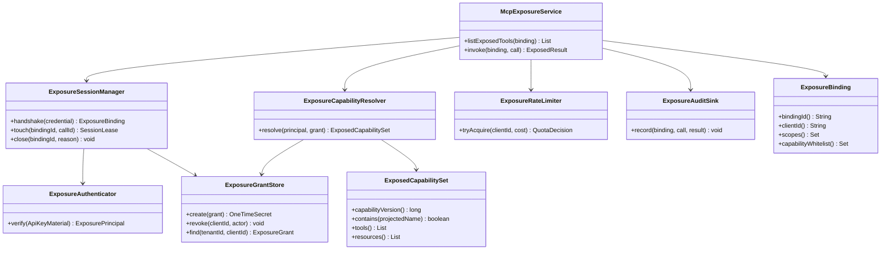
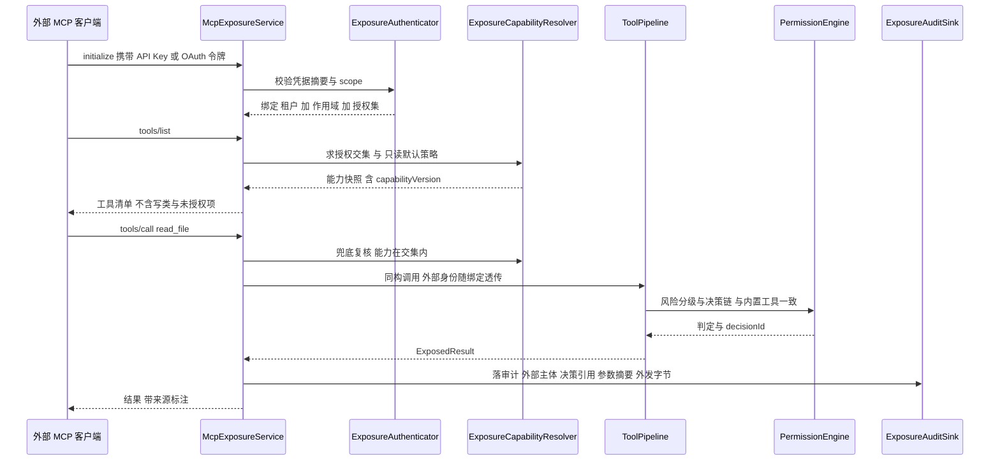
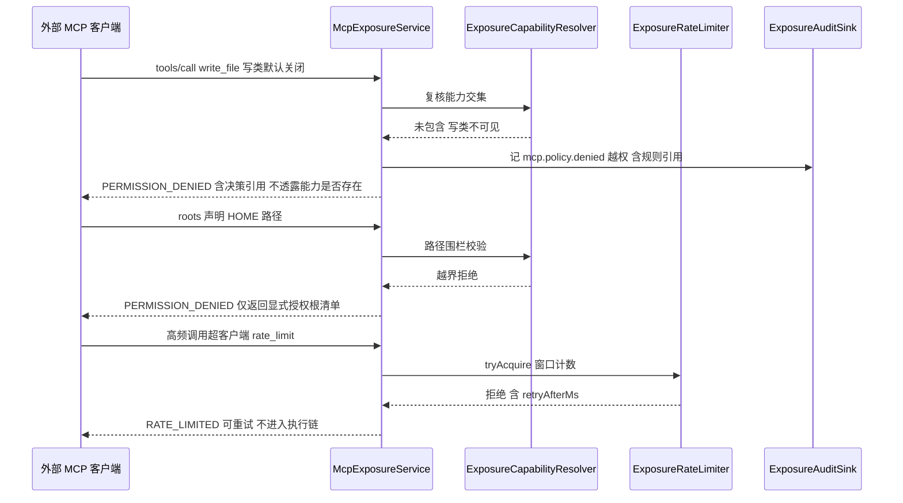
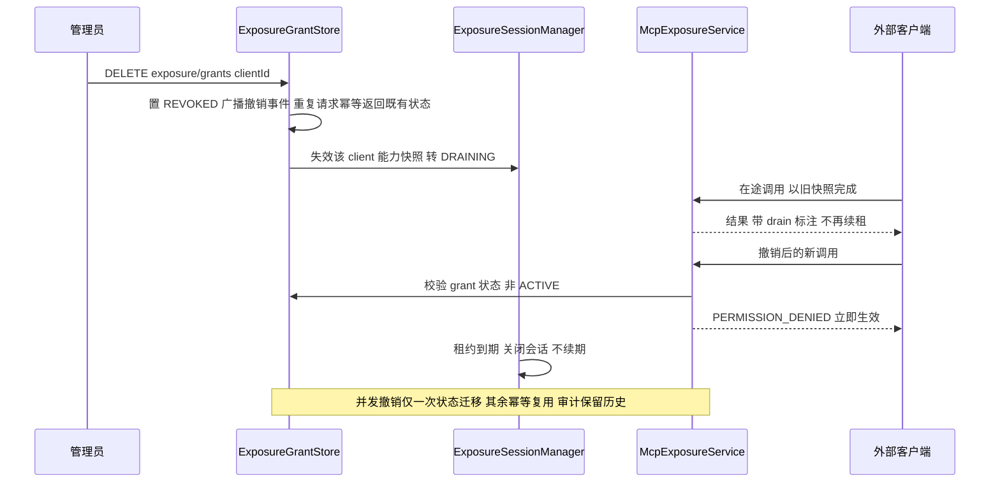
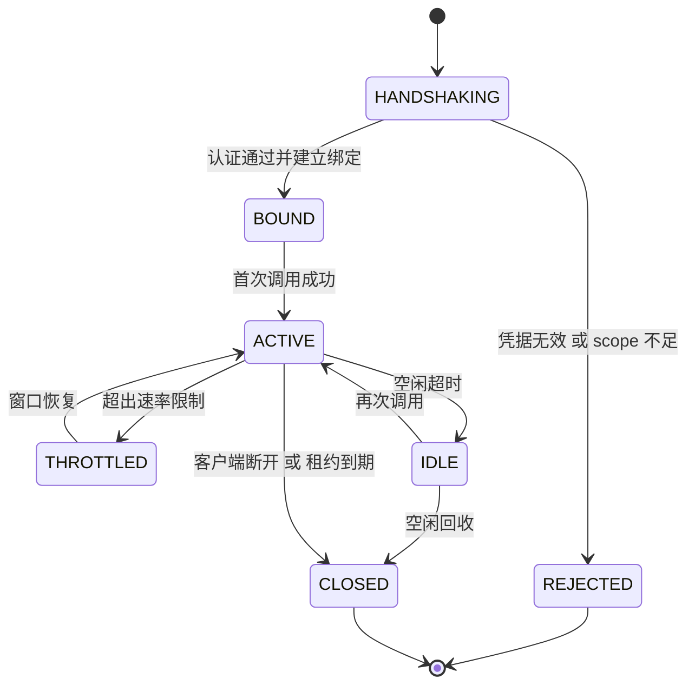
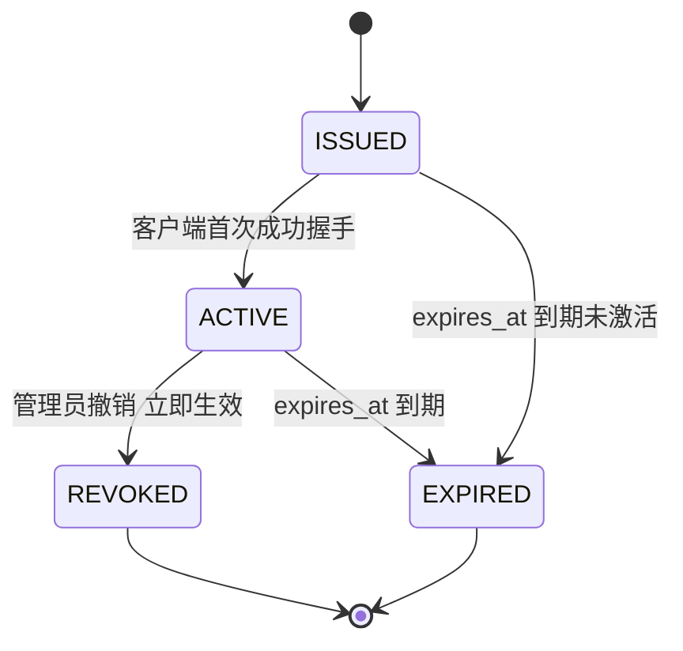

# C15 · MCPServerExporter（本产品作为 MCP Server 对外暴露）组件实现方案

> 组件编号：C15（附录 D 对应 **P-26** `McpExposureService`，类型=协议面，归属卷 09）。
> 源方案锚点：`impl/09-mcp-gateway-impl.md` §2（REQ-MCP-6）、§3.5（I-MCP-5）、§4.1（roots/resources 对外语义）、§6.4（对外暴露时序）、§7.3（暴露会话状态机）、§8.1（`oc_mcp_exposure_grant`）、§8.2（`mcpExposureSession`）、§9.1（exposure REST）、§9.2（`McpExposureSPI`）、§10.2 / §10.5 / §10.7 / §11.6。
> Phase A 锚点：`docs/harness/09-mcp-system.md` D-MCP-7（选定 B2「暴露能力面：只读优先、写类默认关闭」）。
> 分层落点（卷 27 §4.1 权威名）：`harness-contract`（暴露契约与能力模型，零框架）+ `harness-platform/platform-mcp`（会话 / 鉴权 / 限流 / 能力交集）+ `platform-persistence`（授权表）+ `harness-host/host-protocol`（MCP 暴露端点，Spring）。
> 编号口径：本文件为局部号段（需求 `REQ-C-MCPEX-1…10`、决策 `I-C-MCPEX-1…3`、修订建议 `X-C15-1…2`），须由编排方并入 `IMPL-DECISIONS.md` 后统一重编号；`I-MCP-5` 选定分支**不回退、不重开**，本文件不直接改动 Phase A 与系统级文件。

## ① 定位与边界

**一句话定位**：把内核的只读能力（受权限约束的工具、显式授权的资源、组织提示词资产）以**标准 MCP Server** 形态暴露给外部 Agent 客户端，以「一连接一暴露会话、能力面 = 授权交集」为硬约束，构成双向互操作中的「能力提供者」角色。

**在链路中的位置**：与客户端方向（`McpClientManager`，见 `impl/09` §5）共用同一套传输编解码（`McpTransport`）与命名投射（`ToolNameProjector`），但流量方向相反——外部请求进入 `host-protocol` 的 MCP 端点，经 `McpExposureService` 转为内核同构调用，再走既有 `ToolPipeline` 与 `PermissionEngine`。

**边界内**：
- 暴露会话生命周期（握手 → 绑定 → 活跃 → 限流 / 空闲 → 关闭）、租约续期与回收。
- 暴露能力面求值：工具白名单 ∩ 授权 scope ∩ 只读默认策略；资源显式授权；提示词资产默认关闭。
- 凭据校验（`api-key` / `oauth`）、scope 覆盖检查、外部主体归属与租户绑定。
- 暴露面限流与出口配额（复用 `oc_mcp_quota_rollup` 与 `RedisKeys.mcpQuota` 口径）。
- 暴露调用审计（外部主体 + canonical 名 + 决策引用 + 参数摘要 + 外发字节）。
- 授权创建 / 撤销与传播（新调用即时拒绝；既有会话按租约回收、不续期）。

**边界外**：
- 任务级互操作（提交任务、长跑作业）**不走 MCP 面**，坚持卷 23 / `impl/24` 的 A2A 协议线（`impl/09` §1.2）。
- 权限决策本体（R0–R5 判定、审批编排）属卷 06（K-17/K-18/K-19）；本组件只消费决策结果，**禁止**旁路或自行放行（`impl/09` §4.3「统一出口」）。
- 传输协议栈实现细节（编解码、单写线程、超时预算）属 `McpTransport` 四实现；本组件只做服务端方向装配。
- 写类工具暴露策略（默认关闭；开启需组织策略 + 每次审批）由卷 06 与组织策略给定，本组件只执行「不列举 + 拒绝」。
- 企业网关（I-MCP-6）针对**出站（客户端方向）**流量；暴露面的入站治理以本文 §⑧ 能力交集与限流为准。

**相邻组件关系**：`ToolRegistry`（能力事实源）→ 交集求值；`ToolPipeline`（同构执行）；`PermissionEngine`（决策链）；`McpAuditSink` + 卷 24 `AuditChain`（审计）；卷 31 / `impl/26` `QuotaEngine`（计量）；`SecretPort`（凭据摘要与一次性密钥交付）；`McpExposureSPI`（能力选择器扩展点，`experimental`）。

## ② 组件需求清单（REQ-C-MCPEX-n）

| 编号 | 需求 | 来源 | 优先级 | 验收要点 |
| --- | --- | --- | --- | --- |
| REQ-C-MCPEX-1 | 暴露总开关与三类能力默认面：`exposure.enabled` 默认关闭；开启后只读工具默认可用（需认证）、资源需显式授权、提示词资产默认关闭、写类工具默认关闭 | `impl/09` §2 REQ-MCP-6；§9.3 `exposure.*`；卷 09 D-MCP-7 | P0 | 默认配置下外部客户端仅见只读工具；写类不出现在 `tools/list` |
| REQ-C-MCPEX-2 | 一连接一暴露会话：连接即建立「租户 + 作用域 + 授权集」绑定，禁止复用任何内部会话 / 工作区 | `impl/09` §3.5 I-MCP-5（B1） | P0 | 两个外部会话互不可见；roots 协商独立 |
| REQ-C-MCPEX-3 | 能力面 = 授权交集：未授权能力**不列举**（而非列举后拒绝），减少外部模型误试 | `impl/09` §6.4；§10.5「能力列表即授权交集」 | P0 | `tools/list` 与授权白名单逐项一致，无残留项 |
| REQ-C-MCPEX-4 | 鉴权双模：`api-key`（默认）/ `oauth`；凭据只存摘要，一次性密钥仅创建时返回一次 | `impl/09` §9.1 `exposure/grants`；§8.1 `oc_mcp_exposure_grant`；§9.3 `auth-mode` | P0 | 创建响应含一次性明文；DB / 日志零明文 |
| REQ-C-MCPEX-5 | 同构执行：暴露调用复用 `ToolPipeline` + `PermissionEngine`，MCP 层禁止旁路审批 | `impl/09` §4.3；§6.4 | P0 | 暴露调用产生与内置工具一致的 `decisionId` 与审计行 |
| REQ-C-MCPEX-6 | 工作区围栏：roots 只暴露显式授权根（不暴露 HOME），越界路径直接拒绝 | `impl/09` §4.1（roots 行）；§10.5 | P0 | HOME / 仓外路径调用返回 `PERMISSION_DENIED` |
| REQ-C-MCPEX-7 | 限流与配额：客户端 `rate_limit` + 租户 / 服务器窗口配额；超限返回 `RATE_LIMITED` + `retryAfterMs` | `impl/09` §8.2 `mcpQuota`；§10.7；REQ-MCP-8 | P0 | 超限可重试错误；Redis 窗口计数一致 |
| REQ-C-MCPEX-8 | 逐调用审计：外部主体 + canonical 名 + 决策引用 + 参数摘要（HMAC）+ 外发字节 + 结果码 | `impl/09` §8.3 `mcp.exposure.invoked`；§8.1 `oc_mcp_audit`；§10.6 | P0 | 任一外部调用可回溯；审计无参数原文 |
| REQ-C-MCPEX-9 | 撤销与租约回收：grant 撤销后新调用即时失效；既有会话按租约回收、不续期 | `impl/09` §9.1 DELETE；§8.2 `mcpExposureSession`；§10.5 | P0 | 撤销后秒级拒绝；并发撤销幂等 |
| REQ-C-MCPEX-10 | 暴露会话态与容量兜底：七态状态机；并发连接 > 200 启用暴露会话租约池（LRU + 空闲回收） | `impl/09` §7.3；§3.5 回退触发 | P1 | 状态迁移、限流、空闲回收用例；租约池上限生效 |

## ③ 关键设计决策（I-C-MCPEX-n）

### I-C-MCPEX-1 能力面求值时机与撤销传播

| 分支 | 描述 | 结论 |
| --- | --- | --- |
| B1 连接期快照 | 握手时求一次交集，会话内不变；撤销靠租约到期 | 淘汰（撤销不即时，安全面不可接受） |
| B2 每调用实时求值 | 强一致，但每次调用多一次策略查询与白名单求交 | 淘汰（与 §10.2 附加 ≤15ms 预算冲突） |
| B3 **连接期快照 + 撤销事件主动失效 + 调用前轻校验** | 快照带 `capabilityVersion`；撤销事件使快照失效并转 DRAINING；调用前仅比对版本号与交集成员 | **选定** |

**代价与回退**：需要一条撤销事件通道（复用 `mcp.policy.denied` + 内部事件），且「快照失效」为最终一致（秒级）。若撤销传播 P99 超过 5s，退化为「每调用校验 grant 状态 + 快照复用」（仅多一次点查，仍不重算交集）。**不重开 I-MCP-5**：本决策只细化其 B1 的实现时机。

### I-C-MCPEX-2 暴露面凭据形态与密钥存储

| 分支 | 描述 | 结论 |
| --- | --- | --- |
| B1 仅 `api-key` | 简单；企业 SSO 无法统一 | 淘汰（企业档不满足） |
| B2 仅 OAuth 2.1 | 强审计；无头客户端接入摩擦大 | 淘汰（本地 / 脚本客户端断供） |
| B3 **双模（`api-key` 默认、`oauth` 企业）** | 与 §9.3 `auth-mode` 枚举一致；两种凭据统一落到 `ExposurePrincipal` | **选定** |

**代价与回退**：双模需两套校验器与一致的限流主体映射。密钥**只存 HMAC 摘要**（`oc_mcp_exposure_grant`），明文仅创建响应返回一次；日志与事件零明文。若企业要求 mTLS 客户端证书，走 `McpExposureSPI` 增补校验器，不改主链路。

### I-C-MCPEX-3 暴露执行路径

| 分支 | 描述 | 结论 |
| --- | --- | --- |
| B1 自建轻量执行通道 | 低延迟；但存在绕过权限链与审计的长期风险 | 淘汰（安全不可协商） |
| B2 **复用 ToolPipeline + PermissionEngine** | 与内置工具完全同构，天然继承审批 / 风险分级 / 审计 | **选定** |
| B3 复用管线 + 暴露专用决策缓存 | 进一步降延迟；但缓存失效逻辑复杂 | 淘汰（先不做，作为回退档） |

**代价与回退**：每调用多一次权限决策开销（预算 ≤15ms，`impl/09` §10.2）。若暴露调用 P95 超内置工具 30ms 以上，启用 B3 回退档（仅缓存 R0/R1 只读决策，**仍不绕过决策链**）。

**修订建议（登记用，不改台账）**：`X-C15-1` —— `impl/09` §9.1 撤销端点文案「立即生效；外部会话按租约到期回收」与 §10.5「撤销立即生效」之间存在**两级语义未拆分**：建议明确为「授权即时失效（新调用拒绝）+ 在途请求 drain + 会话按租约回收」。本文件按该拆分实现（§⑨）。`X-C15-2` —— 写类工具开启（`allow-write-tools=true`）后的「每次审批」未定义外部客户端侧审批通道（外部 MCP 客户端无审批 UI）：建议回落为「组织策略预先批准 + 审批路由到内核 K-19 四通道（桌面 / IM），无在线审批人时默认拒绝」。

## ④ 类图



### 关键接口签名（Java 21，遵守 `.qoder/rules/`）

```java
/**
 * MCP 对外暴露服务：把外部客户端的 MCP 调用转成内核同构调用。
 * 能力面 = 客户端授权交集 ∩ 只读默认策略；全部调用经 ToolPipeline 与 PermissionEngine，
 * 本类严禁旁路权限链、严禁自行放行，异常统一翻译为 McpException（内核层）。
 */
@Slf4j
@RequiredArgsConstructor
public class McpExposureService {

    private final ExposureSessionManager sessionManager;
    private final ExposureCapabilityResolver capabilityResolver;
    private final ExposureRateLimiter rateLimiter;
    private final ExposureAuditSink auditSink;
    private final ToolPipeline toolPipeline;

    /**
     * 执行一次外部暴露调用。
     *
     * @param binding 暴露会话绑定（必填，含租户、作用域与授权能力集）
     * @param call    外部调用（必填，含工具投影名、参数与外部请求 id）
     * @return 调用结果；超限时按 output.max-bytes 裁剪并标记 truncated
     * @throws McpException 越权、配额耗尽、能力未开启或依赖不可用时抛出（文案含客户端与能力名）
     */
    public ExposedResult invoke(ExposureBinding binding, ExposedCall call) {
        log.info("MCP 暴露调用开始，clientId={}, 能力={}, 请求 id={}",
                binding.clientId(), call.projectedName(), call.requestId());

        // 1. 能力面兜底校验：列表层已不列举未授权能力，此处防御性复核（防伪造投影名）
        ExposedCapabilitySet capability = capabilityResolver.resolve(binding);
        if (!capability.contains(call.projectedName())) {
            throw new McpException(McpErrorCode.PERMISSION_DENIED,
                    "外部客户端无权调用该能力：" + call.projectedName());
        }

        // 2. 配额预扣：窗口计数在 Redis，超限直接返回可重试错误，不进入执行链
        QuotaDecision quota = rateLimiter.tryAcquire(binding.clientId(), call.costEstimate());
        if (!quota.allowed()) {
            throw new McpException(McpErrorCode.RATE_LIMITED,
                    "配额已用尽，请 " + quota.retryAfterMs() + "ms 后重试");
        }

        // 3. 同构执行：产出与内置工具一致的 decisionId，外部身份随绑定透传
        ExposedResult result = toolPipeline.executeExternal(binding, call);

        // 4. 审计：只落外部主体、决策引用与参数摘要，禁止记录参数与结果原文
        auditSink.record(binding, call, result);
        log.info("MCP 暴露调用完成，clientId={}, 能力={}, 结果码={}, 耗时={}ms",
                binding.clientId(), call.projectedName(), result.outcome(), result.latencyMs());
        return result;
    }
}

/**
 * 暴露会话状态（持久化与事件载荷存 code；对外响应不暴露内部状态语义）。
 * REJECTED / CLOSED 为终态；THROTTLED 与 IDLE 为可恢复中间态。
 */
@Getter
@RequiredArgsConstructor
public enum ExposureSessionState {

    /** 握手中：凭据校验与绑定建立 */ HANDSHAKING("HANDSHAKING", "握手中"),
    /** 已绑定：认证通过、能力快照就绪 */ BOUND("BOUND", "已绑定"),
    /** 活跃：正常服务调用 */ ACTIVE("ACTIVE", "活跃"),
    /** 已限流：窗口超限，等待恢复 */ THROTTLED("THROTTLED", "已限流"),
    /** 空闲：超过空闲阈值，等待回收 */ IDLE("IDLE", "空闲"),
    /** 已关闭：租约到期或客户端断开 */ CLOSED("CLOSED", "已关闭"),
    /** 已拒绝：凭据无效或 scope 不足 */ REJECTED("REJECTED", "已拒绝");

    /** 持久化与事件载荷使用的编码 */
    private final String code;

    /** 面向用户的中文描述 */
    private final String desc;

    /**
     * 按编码解析状态。
     *
     * @param code 状态编码（必填）
     * @return 对应枚举项
     * @throws McpException 编码非法时抛出（文案含非法值，便于定位）
     */
    public static ExposureSessionState of(String code) {
        for (ExposureSessionState state : values()) {
            if (state.code.equals(code)) {
                return state;
            }
        }
        throw new McpException(McpErrorCode.STATE_UNKNOWN, "未知暴露会话状态：" + code);
    }
}
```

## ⑤ 关键时序图

### 5.1 主路径：连接 → 绑定 → 列能力 → 只读调用（前置：`exposure.enabled=true` 且 grant 有效）



### 5.2 异常路径：越权 / 写类未开启 / roots 越界 / 配额耗尽（补偿：拒绝并留痕，不进入执行链）



### 5.3 幂等与并发：授权撤销（立即失效 + 在途 drain + 租约回收）



## ⑥ 状态机

### 6.1 暴露会话态（对齐 `impl/09` §7.3）



**迁移副作用**：进入 `BOUND` 时求值并缓存能力快照（`capabilityVersion` 随撤销事件失效）；进入 `THROTTLED` 记 `mcp.policy.denied`（配额类）不重复告警；进入 `CLOSED` 释放租约并清理 `RedisKeys.mcpExposureSession(bindingId)`。

### 6.2 暴露授权（grant）态（组件级细化；源方案未显式建模，仅含 `expires_at` 与撤销端点）



**迁移副作用**：进入 `REVOKED` / `EXPIRED` 触发能力快照失效与 DRAINING 广播；两级语义按 `X-C15-1` 建议拆分——授权即时失效、在途请求 drain、会话按租约回收；审计保留历史行（撤销不删审计）。

## ⑦ 接口与依赖矩阵

### 7.1 暴露的 MCP 方法面

| MCP 方法 | 暴露条件 | 内部落点 | 失败语义 |
| --- | --- | --- | --- |
| `initialize` | 无条件（凭据校验） | `ExposureSessionManager.handshake` | `AUTH_REQUIRED` |
| `tools/list` | 授权交集 ∩ 只读默认 | `ExposureCapabilityResolver.resolve` | 不列举即无错误 |
| `tools/call` | 交集内 + 配额 | `ToolPipeline.executeExternal` | `PERMISSION_DENIED` / `RATE_LIMITED` |
| `resources/list` / `resources/read` | 资源显式授权 | `ResourceProvider` | `PERMISSION_DENIED` |
| `resources/subscribe` | 显式授权 + 租约有效 | 变更事件订阅（`mcp.resource.changed`） | `RESOURCE_NOT_FOUND` |
| `prompts/list` | `prompts` 资产开启（默认关闭） | `PromptAssetStore` 只读导入 | `UNSUPPORTED_CAPABILITY` 显式失败 |
| `tasks/*` | **不提供** | 走 A2A（卷 23 / `impl/24`） | 方法不存在 |

### 7.2 管理面 REST（`/api/v1`，摘 `impl/09` §9.1）

| 方法 | 路径 | 入参 | 出参 | 错误码 |
| --- | --- | --- | --- | --- |
| GET / POST | `/mcp/exposure/grants` | POST：`clientId`、`scopes`、`capabilityWhitelist`、`rateLimit` | 授权列表；新建返回**一次性密钥** | `PERMISSION_DENIED` |
| DELETE | `/mcp/exposure/grants/{clientId}` | 无 | 撤销结果（立即生效，会话按租约回收） | `PERMISSION_DENIED` |

### 7.3 依赖矩阵

| 依赖 | 方向 | 契约 | 失败姿态 |
| --- | --- | --- | --- |
| `ToolRegistry` | 入 | `ToolSpec` 与 `exposure` 标记 | fail-closed：取不到能力即不列举 |
| `ToolPipeline` | 出 | `executeExternal(binding, call)` | 依赖错误原样翻译，不本地降级 |
| `PermissionEngine` | 出 | `decisionId` 与判定 | fail-closed：无判定不放行 |
| `ExposureGrantStore`（PG） | 出 | `oc_mcp_exposure_grant` | fail-closed：读不到授权拒绝全部调用 |
| Redis（限流窗口 / 会话租约） | 出 | `RedisKeys.mcpQuota` / `mcpExposureSession` | fail-closed：计数不可用即保守拒绝（对外接口） |
| `SecretPort` | 出 | 密钥摘要校验（HMAC） | fail-closed：校验不可用拒绝握手 |
| 卷 24 审计 / 卷 31 配额 | 出 | 审计行与配额汇总 | 审计异步重试（不阻塞结果返回） |

## ⑧ 关键算法

### 8.1 暴露能力映射与鉴权（交集求值）

1. **凭据解析**：`api-key` → HMAC 摘要与存储侧比对（**恒定时间比较**，防时序侧信道）；`oauth` → 令牌校验 + 主体映射。产出 `ExposurePrincipal`（租户 + clientId）。
2. **scope 覆盖检查**：请求的 scope 必须被 grant 覆盖；不满足直接拒绝，**不提示缺失的具体能力名**（防枚举）。
3. **交集求值**：`capability = tools(白名单 ∩ 只读默认 ∩ 排除内置保留名) ∪ resources(显式授权)`；写类工具仅当 `allow-write-tools=true` 且组织策略批准时进入候选，且每次调用强制审批（无审批人默认拒绝，见 `X-C15-2`）。
4. **命名防伪造**：只接受 `ToolNameProjector` 生成的投射名，一律查 `oc_mcp_tool_binding` 反查 canonical 名，**禁止字符串二次切分**（`impl/09` §10.5 同源约束）。
5. **快照与失效**：快照携带 `capabilityVersion = hash(授权版本, 策略版本, 能力目录版本)`；撤销 / 策略变更事件使快照失效。
6. **列表-调用一致性**：`tools/list` 与 `tools/call` 共用同一求值器与快照，避免「列表可见、调用拒绝」的漂移。

### 8.2 审计与配额

1. **调用前预扣**：按 `clientId + 窗口` 计数（`RedisKeys.mcpQuota`），超限即拒绝（不排队、不进入执行链）。
2. **参数摘要**：参数与结果只落 HMAC 摘要与字节数（`egress_bytes`），**零原文**；审计写入异步（≤ 50ms 落库，不阻塞返回）。
3. **外部主体归属**：`mcp.exposure.invoked` 载荷含外部主体、canonical 名、`decisionId`、结果码，与卷 24 审计链对账。
4. **配额结算**：调用完成后按实际外发字节回写日 / 月汇总（`oc_mcp_quota_rollup`），企业可提额。
5. **侧信道抑制**：越权与配额错误文案不包含过滤前计数、能力存在性与内部限额细节。

## ⑨ 错误处理与降级

| 场景 | ErrorCode | retryable | 对外呈现（MCP JSON-RPC 错误） | 恢复动作 |
| --- | --- | --- | --- | --- |
| 凭据无效 / 过期 | `AUTH_REQUIRED` | 否（需重新授权） | 明确失败，附重新授权指引 | 拒绝握手；会话不建立 |
| scope 不足 | `PERMISSION_DENIED` | 否 | 不透露缺失能力 | 拒绝 + 审计 |
| 写类工具未开启 | `PERMISSION_DENIED`（列表层为「不存在」） | 否 | 能力不可见；调用报方法不存在语义 | 需组织策略开启 |
| 配额耗尽 | `RATE_LIMITED` | 是 | 携带 `retryAfterMs` | 窗口恢复后自动可用；企业可提额 |
| 能力未开启（prompts 等） | `UNSUPPORTED_CAPABILITY` | 否 | 显式失败，不静默降级 | 管理员开启后生效 |
| 依赖不可用（管线 / 存储） | `DEPENDENCY_UNAVAILABLE` | 是 | 可重试错误 | 自动恢复；连续失败告警 |
| 限流计数后端不可用 | `DEPENDENCY_UNAVAILABLE` | 是 | 保守拒绝（fail-closed） | 后端恢复后放行；事件留痕 |
| 撤销后的调用 | `PERMISSION_DENIED` | 否 | 立即生效 | 重新申请授权 |
| 在途请求于撤销后 | 非错误（drain） | — | 正常完成，带 drain 标注 | 不再续租，租约到期回收 |

**降级原则**：暴露面**整体不可用不影响内核主链路**（外部接口 fail-closed，内部功能 fail-open）；限流与鉴权依赖不可用时一律拒绝（对外面不做「无计数放行」）。撤销的两级语义按 `X-C15-1` 建议实现（授权即时失效 / 在途 drain / 租约回收）。

## ⑩ 性能与并发

- **预算**（对齐 `impl/09` §10.2）：暴露调用附加 ≤ 15ms P95（认证绑定走缓存）；能力快照求值每连接一次（O(白名单)），撤销失效为事件驱动；审计异步落库 ≤ 50ms 不阻塞返回。
- **并发**：每会话在途上限配置化（默认与 `limits.max-in-flight-per-server` 同口径）；超限按 `THROTTLED` 处理而不无限排队；并发连接 > 200 启用租约池（LRU 上限 + 空闲回收，I-MCP-5 回退触发）。
- **幂等点**：grant 创建按 `uk_client(tenant_id, client_id)` 幂等；撤销重放返回既有状态（仅一次状态迁移）；只读调用天然幂等（重试安全）；写类工具（若开启）强制幂等键且每次审批。
- **竞态**：撤销事件与在途调用——在途调用以旧快照完成（drain），新调用即时拒绝；快照版本号比较避免「半新半旧」视图。
- **可观测**：`oc_mcp_exposure_invoke_total{client}`、`oc_mcp_quota_denied_total{server}`（`impl/09` §10.6）；每次调用一个 span（客户端、能力名、决策 id、配额结论、drain 标记）。

## ⑪ 测试要点

### 11.1 越权与合规删除（强制验证项）

| 用例 | 断言 |
| --- | --- |
| scope 不足调用白名单外工具 | `PERMISSION_DENIED` + 审计含规则引用；响应不含能力存在性 |
| 写类工具默认关闭 | `tools/list` 不可见；直接调用返回方法不存在语义；`mcp.policy.denied` 留痕 |
| 跨租户 clientId 冒用 | 拒绝；不泄露他租户授权信息（计数侧信道抑制） |
| roots 越界（HOME / 仓外路径） | 拒绝；仅返回显式授权根清单 |
| 撤销后 ≤ 秒级新调用拒绝 | 授权即时失效；在途请求 drain 完成后会话回收 |
| 并发撤销重放 | 仅一次状态迁移；重复请求幂等返回既有状态 |
| 合规删除（`purgeAudit=true` 删服务器 / 删客户端授权） | 授权行、能力快照、`mcpExposureSession` Key、诊断包全部清除，生成删除证明（范围 / 时间 / 执行者 / 清理计数，`impl/09` §11.6） |

### 11.2 单元与集成

- `ExposureCapabilityResolverTest`：交集与只读默认；写类排除；内置保留名冲突拒绝；投射名反查不切分。
- `ExposureSessionStateTest`：七态迁移与终态保护；THROTTLED 窗口恢复；IDLE 回收。
- `ExposureGrantStoreTest`：一次性密钥仅返回一次；摘要比对恒定时间；撤销幂等。
- 集成：外部 MCP 客户端（≥ 2 种实现）调用只读工具与资源；四传输一致性；限流与配额；撤销传播端到端。

### 11.3 性能与门禁

- 附加开销 P95 ≤ 15ms（暴露面 10 万次采样）；200 并发连接下租约池切换无错误；配额路径不进入执行链（拒绝延迟 ≤ 5ms）。
- `mvn -pl harness-platform/platform-mcp -am test`；`mvn -pl harness-host/host-bootstrap -am test -Dgroups=mcp-integration`；故障注入与性能门禁：`-Dtest=McpFaultInjectionIT`（对齐 `impl/09` §11.5 门禁映射）。

### 11.4 DoD 勾选

- [ ] 只读默认暴露可用，写类默认不可见且越权拒绝可审计（§⑪.1 全项通过）。
- [ ] 一连接一绑定、能力 = 授权交集（列表与调用共用求值器，无漂移）。
- [ ] 撤销立即生效 + 在途 drain + 租约回收（`X-C15-1` 语义）。
- [ ] 令牌 / 密钥全链路零明文；审计可回溯到外部主体 / 决策引用 / 参数摘要 / 外发字节。
- [ ] `X-C15-1`、`X-C15-2` 已提交 `IMPL-DECISIONS` §4 修订建议（登记不落地视为未完成）。
