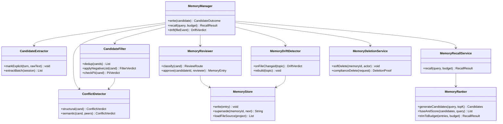
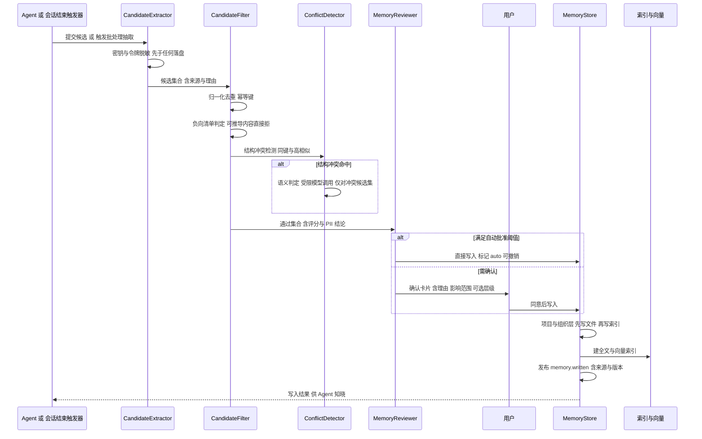
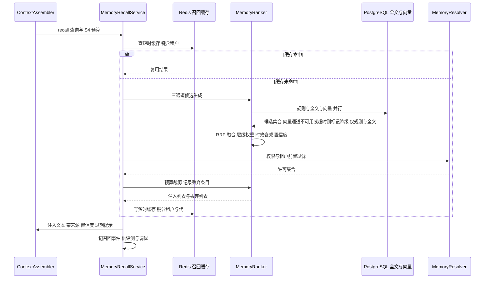
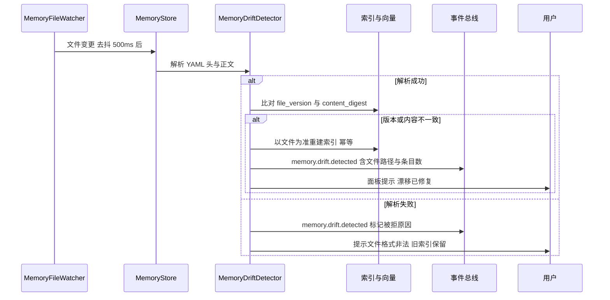
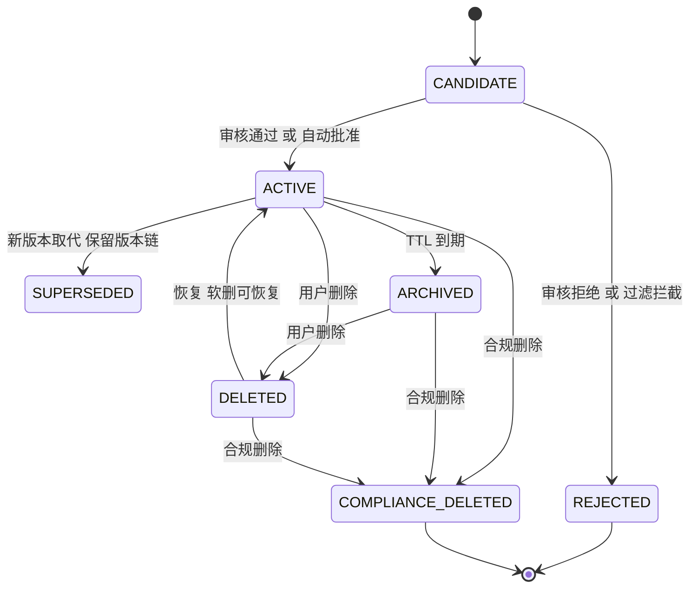

# C16 · MemoryManager（记忆管理器：写入管线 + 召回管线 + 文件化）组件实现方案

> 组件编号：C16（附录 D 对应 **K-25** `MemoryModel + RecallPipeline`，类型=进程内服务，归属卷 10）。
> 源方案锚点：`impl/10-memory-system-impl.md` §2（REQ-MEM-1…21）、§3（I-MEM-1…6）、§4.1 四层路由、§4.2 召回管线、§4.3 记忆 / 知识 / 历史三分、§6.1 写入时序、§6.2 召回时序、§6.3 删除时序、§6.4 文件漂移、§7.1–7.3 状态机、§8.1–8.3 数据与文件布局、§10.1–10.10 非功能与 R05 贯通。
> Phase A 锚点：`docs/harness/10-memory-system.md` D-MEM-1…11（四层 / 候选写入 / 文件为源 / 混合召回 / 冲突分级 / 分级遗忘 / 隐私 / 组织治理 / 三分边界 / 评测 / 导入导出）。
> 分层落点（卷 27 §4.1 权威名）：`harness-contract`（`MemoryRecallFusion` 纯函数与召回模型，零框架）+ `harness-platform/platform-memory`（写入 / 召回 / 文件化 / 删除治理，允许 Spring）+ `platform-persistence`（`oc_memory_*` 表）+ `kernel-context`（S4 注入点）+ `host-protocol`（记忆管理端点）。
> 编号口径：本文件为局部号段（需求 `REQ-C-MEMMGR-1…14`、决策 `I-C-MEMMGR-1…3`、修订建议 `X-C16-1…2`），须由编排方并入 `IMPL-DECISIONS.md` 后统一重编号；`I-MEM-1…6` 选定分支**不回退、不重开**，本文件不直接改动 Phase A 与系统级文件。

## ① 定位与边界

**一句话定位**：统一管理四层记忆（工作 / 会话 / 项目 / 组织）的**写入管线、召回管线与文件化存储**——候选经「抽取 → 去重 → 冲突 → 审核 → 落库」成为可追溯、可撤销的简短结论；召回经「三通道 → RRF → 权限过滤 → 预算裁剪」注入 S4 区段并标注来源与置信度；项目 / 组织层以 `.oc/memory/*.md` 为源、DB 为索引，可 diff、可评审、可重建。

**在链路中的位置**：上游接 `ContextAssembler`（S4 区段预算与注入位）与 `AgentLoop`（显式记忆指令）；下游被主循环、`ask_user` 类工具与 `MemoryAdminController` 消费；与卷 11 共用 `IndexStoreSPI` 与嵌入设施，但表族 / 权限 / 生命周期独立（`impl/10` §1.3）。

**边界内**：
- 候选生命周期：抽取触发（回合内打标 + 会话结束批处理）、去重、冲突检测、PII / 负向清单过滤、审核路由（自动 / 确认 / 拒绝）、写入与 supersede。
- 四层路由与合并（组织 > 项目 > 会话 > 工作，`shadowedBy` 留痕）。
- 召回管线：规则 + 全文 + 向量三通道、RRF 融合、层级权重、时效衰减、权限前置过滤、预算裁剪、来源标注。
- 文件化：YAML 头解析、原子写、索引预算（200 行 / 25KB）、文件-索引漂移检测与重建。
- 分级遗忘：TTL 归档 / 软删 / 合规删除（级联 + tombstone + 敏感条目 DEK 销毁 + 删除证明）。
- 索引治理：索引代（SHADOW → ACTIVE CAS）、按 `content_digest` 的重建与比对。
- 纠正反哺（`oc_memory_correction` → `oc_memory_feedback_rule`）与质量评测投影。

**边界外**：
- 知识文档 / 代码索引与三路检索属卷 11；历史（会话与事件）属卷 16/19——三类**分别召回、分别标注、禁止相互替代**（`impl/10` §4.3）。
- 嵌入模型服务属卷 02（本组件只记录 `model_version` 与维度并触发代迁移）。
- 权限策略存储属卷 06；记忆**只提供上下文、不作为强制策略**（REQ-MEM-16 负向用例）。
- 提示词资产版本与灰度属卷 04；S4 区段预算的分配权在卷 03。

**相邻组件关系**：`MemoryStorePort`（文件 + DB 双写）、`MemoryResolver`（四层合并）、`MemoryRanker`（融合与衰减）、`CandidateFilter`（去重 / 冲突 / PII）、`MemoryReviewer`（审核路由）、`MemoryDeletionService`（三级删除）、`MemoryEvalService`（纠正反哺）；SPI：`MemoryStoreSPI` / `MemoryRankerSPI` / `PiiDetectorSPI` / `MemorySyncSPI`（`impl/10` §9.2）。

## ② 组件需求清单（REQ-C-MEMMGR-n）

| 编号 | 需求 | 来源 | 优先级 | 验收要点 |
| --- | --- | --- | --- | --- |
| REQ-C-MEMMGR-1 | 四层路由与合并：各层独立生命周期 / 权限 / 存储；同 key 按「组织 → 项目 → 会话 → 工作」合并并记录 `shadowedBy`（被遮蔽不删除、仅不注入） | `impl/10` §4.1；REQ-MEM-1；卷 10 D-MEM-1 | P0 | 四层各写入 / 召回 / 过期用例；合并结果 `shadowedBy` 正确 |
| REQ-C-MEMMGR-2 | 写入管线候选机制：策略过滤 → 确认 → 落库；满足阈值可自动批准但必须带 `auto` 标记、可追溯、可撤销 | `impl/10` §6.1；REQ-MEM-2；D-MEM-2 | P0 | 默认全候选确认；自动写入条目有撤销入口与来源链 |
| REQ-C-MEMMGR-3 | 抽取输出前置脱敏：密钥 / 令牌 / 连接串在**进入候选前**脱敏或丢弃并计数 | `impl/10` §2 REQ-MEM-18；§6.1 | P0 | 含 API Key 的会话产出候选内不得出现原值（正则断言） |
| REQ-C-MEMMGR-4 | 负向清单硬拒绝：可从当前项目状态推导的内容（目录结构、git 历史等）在过滤阶段直接拒绝并给理由 | `impl/10` §2 REQ-MEM-13；§11.1 | P0 | 「记下本仓库目录结构」候选被拒且理由为负向清单命中 |
| REQ-C-MEMMGR-5 | 冲突检测两级：结构判定（同键 / 高相似）→ 受限语义判定；保留版本链；低风险提示、高风险合并确认 | `impl/10` §3.4 I-MEM-4；§7.2；D-MEM-5 | P1 | 同键冲突零模型成本判定；语义矛盾挂起 `semantic_check_deferred` |
| REQ-C-MEMMGR-6 | 混合召回：规则 + 全文 + 向量；RRF 融合 + 层级权重 + 时效衰减 + 置信度；结果带来源与置信度、预算裁剪 | `impl/10` §3.3 I-MEM-3；§4.2；REQ-MEM-3 | P0 | 召回 P95 ≤ 150ms；每条注入可点回来源；同分时组织层优先 |
| REQ-C-MEMMGR-7 | 文件为源与双向同步：外部编辑 → 索引重建；面板编辑 → 写回文件；原子替换 + `file_version` 条件写 | `impl/10` §3.1 I-MEM-1；§6.4；REQ-MEM-4 | P0 | 无内容不一致（`content_digest` 比对）；冲突以文件为准 + 漂移事件 |
| REQ-C-MEMMGR-8 | 索引预算与悬挂行清理：`MEMORY.md` 默认最多读前 200 行 / 25KB，超限截断并提示；删除主题文件同步移除索引行 | `impl/10` §2 REQ-MEM-14；§8.3 | P1 | 超限截断有断言；删除文件后索引无悬挂行 |
| REQ-C-MEMMGR-9 | 漂移检测不静默：文件非法 YAML 保留旧索引 + 告警；文件被外部删除则条目转 `DELETED` 并清索引 | `impl/10` §6.4；§11.3 | P0 | 非法文件不重建且告警；删除后条目不可召回 |
| REQ-C-MEMMGR-10 | 分级遗忘与合规删除：TTL 归档 / 软删 / 合规删除（文件 + DB + 全部索引代 + 缓存 + 导出物 + 备份 tombstone），敏感条目叠加 DEK 销毁；任一步失败不签发证明 | `impl/10` §3.5 I-MEM-5；§6.3；§10.10 R05-表-3；REQ-MEM-6 | P0 | 合规删除单条 ≤ 5s；恢复演练后仍不可召回；补偿任务续跑 |
| REQ-C-MEMMGR-11 | 索引可重建与代迁移：索引不是真源；换模型 / 换维度 / 换分词器三场景走 SHADOW → ACTIVE（提升为 CAS，行数必须为 1），重建期旧代可召回 | `impl/10` §2 REQ-MEM-21；§8.1 | P0 | 清空索引后仅凭文件源 + 元数据重建出同 `content_digest` 结果 |
| REQ-C-MEMMGR-12 | 多租户隔离与侧信道抑制：RLS + 缓存键含租户 + 索引标签前置过滤；跨租户拒绝不返回过滤前条数 | `impl/10` §3.6 I-MEM-6；§10.4；§10.7 | P0 | 跨租户查询与缓存键碰撞均无命中 |
| REQ-C-MEMMGR-13 | 自动记忆开关与形态限定：默认关闭；仅交互式会话运行挖掘；环境变量可覆盖且有优先级用例 | `impl/10` §2 REQ-MEM-15；§9.3 | P1 | 无头 / CI 默认不挖掘；`OC_MEMORY_AUTO_MEMORY` 覆盖生效 |
| REQ-C-MEMMGR-14 | 纠正反哺：纠正生成负反馈记录 → 规则（同键 / 同来源降权或拦截）→ 后续候选在过滤阶段生效 | `impl/10` §2 REQ-MEM-19；§10.5 | P1 | 纠正后 7 天内同类候选拦截率 ≥ 80%（基准集断言） |

## ③ 关键设计决策（I-C-MEMMGR-n）

### I-C-MEMMGR-1 候选落库的并发控制

| 分支 | 描述 | 结论 |
| --- | --- | --- |
| B1 先查后写 | 实现简单；并发 supersede 可分叉版本链 | 淘汰 |
| B2 悲观锁（`SELECT ... FOR UPDATE`） | 正确；热点 key 阻塞写入 | 淘汰（与异步写不符） |
| B3 **幂等键 + 部分唯一索引 + 条件更新** | `(tenantId, scope, key, valueDigest)` 幂等；`uk_active` 部分唯一索引兜底；supersede 用 `WHERE status='ACTIVE' AND version=:expected`，行数 ≠ 1 抛 `MEMORY_CONFLICT` | **选定** |

**代价与回退**：需要条目行携带 `version` 与状态条件（对齐 `impl/10` §10.10 R05-表-2 补充判定，**不重开 I-MEM-2**）。若未来引入远端组织库（`MemoryStoreSPI` 切换后端），条件更新语义必须由后端实现，否则回退为「幂等键 + 串行化队列」并显式登记。

### I-C-MEMMGR-2 召回三通道的并行编排

| 分支 | 描述 | 结论 |
| --- | --- | --- |
| B1 串行（规则 → 全文 → 向量） | 实现简单；延迟叠加，P95 不可控 | 淘汰 |
| B2 **并行 + 单通道超时熔断 + 降级标注** | 虚拟线程并行；任一通道超时 / 失败按降级继续并在结果标注 | **选定** |
| B3 通道自适应（按查询特征跳过通道） | 延迟最优；策略复杂、可解释性差 | 淘汰（留作后续 SPI 替换） |

**代价与回退**：并行需要连接池与超时预算（单通道 ≤ 60ms）；若某通道 P99 抖动 > 60ms，退化为「缓存优先 + 串行补齐」（仍保证 P95 ≤ 150ms）。与 `impl/10` §10.1「读路径无锁 + 任一失败按降级策略继续」一致。

### I-C-MEMMGR-3 文件-索引一致性判定基准

| 分支 | 描述 | 结论 |
| --- | --- | --- |
| B1 mtime + size 快筛 | 便宜；同秒重写 / 编辑器换行归一化误判 | 淘汰（不足为基准） |
| B2 **`content_digest`（YAML 头规范化 + 正文）为唯一基准 + `file_version` 条件写** | 与 §8.1 / §10.10 的重建比对口径一致，幂等可重放 | **选定** |
| B3 双向版本号对账 | 强一致；文件由外部工具改写时版本号缺失 | 淘汰 |

**代价与回退**：每次写入需计算摘要（单条 ≤ 1KB，成本可忽略）。先用 mtime / size 快筛再比 digest（两级判定，命中快筛即跳过解析），若外部批量重写导致全量 digest 变化，只对差异文件重建而非全库。

## ④ 类图



### 关键接口签名（Java 21，遵守 `.qoder/rules/`）

```java
/**
 * 记忆候选管线：把抽取产出推进到正式条目。
 * 管线阶段固定为 脱敏 → 去重 → 负向清单 → 冲突 → PII → 审核路由 → 落库；
 * 全阶段以幂等键 (tenantId, scope, key, valueDigest) 收敛重复提交。
 */
@Slf4j
@RequiredArgsConstructor
public class MemoryCandidatePipeline {

    private final CandidateFilter filter;
    private final ConflictDetector conflictDetector;
    private final MemoryReviewer reviewer;

    /**
     * 提交一条候选并推进管线。
     *
     * @param candidate 候选（必填，含层级、key/value、来源会话与抽取理由）
     * @return 管线结论：自动批准写入 / 待用户确认 / 拒绝（含理由）
     * @throws MemoryException 候选层级非法、幂等键重复且内容冲突或审核写入失败时抛出
     */
    public CandidateOutcome submit(MemoryCandidate candidate) {
        log.info("记忆候选提交，candidateId={}, scope={}, key 摘要={}",
                candidate.candidateId(), candidate.scope(), candidate.keyDigest());

        // 1. 幂等与去重：同键同值直接复用既有结论，避免重复落库
        FilterVerdict dedup = filter.dedup(candidate);
        if (dedup.duplicated()) {
            log.info("记忆候选去重命中，candidateId={}, 复用条目={}", candidate.candidateId(), dedup.existingId());
            return CandidateOutcome.reused(dedup.existingId());
        }

        // 2. 负向清单硬拒绝：可从当前项目状态推导的内容不允许沉淀为记忆
        FilterVerdict negative = filter.applyNegativeList(candidate);
        if (negative.rejected()) {
            log.info("记忆候选被负向清单拒绝，candidateId={}, 理由={}", candidate.candidateId(), negative.reason());
            return CandidateOutcome.rejected(negative.reason());
        }

        // 3. 冲突检测：结构判定零成本先行，命中后才做受限语义判定（省模型调用）
        ConflictVerdict conflict = conflictDetector.structural(candidate);
        if (conflict.mayConflict()) {
            conflict = conflictDetector.semantic(candidate, conflict.peers());
        }

        // 4. PII 复检与审核路由：命中即脱敏或拒绝；低风险高置信走自动批准（带 auto 标记）
        PiiVerdict pii = filter.checkPii(candidate);
        ReviewRoute route = reviewer.classify(candidate);
        log.info("记忆候选进入审核路由，candidateId={}, 路由={}, 冲突={}, PII={}",
                candidate.candidateId(), route, conflict.kind(), pii.masked());

        // 5. 落库：upsert 写入（自动批准）或生成确认卡片（需确认），写入必须可追溯可撤销
        return reviewer.route(candidate, route, conflict);
    }
}

> 状态枚举 `MemoryStatus`（`CANDIDATE / ACTIVE / SUPERSEDED / ARCHIVED / DELETED / COMPLIANCE_DELETED`，含 `code` / `desc` 字段与 `of(String code)` 工厂，非法值抛 `MemoryException`）见 `impl/10` §5.1 与本文 §⑥.1；所有状态判断一律使用枚举，禁止字符串字面量。
```

## ⑤ 关键时序图

### 5.1 写入管线主路径（抽取 → 去重 → 冲突 → 审核 → 落库；前置：显式指令或会话结束批处理触发）



### 5.2 召回管线（缓存 → 三通道并行 → RRF → 过滤 → 裁剪；任一通道失败按降级继续）



### 5.3 文件漂移检测与索引重建（前置：`file.enabled=true` 且监听器在运行）



## ⑥ 状态机

### 6.1 记忆条目生命周期（对齐 `impl/10` §7.1）



**迁移副作用**：进入 `ACTIVE` 触发索引任务（全文 + 向量，`PARTIAL` 不参与召回）；进入 `SUPERSEDED` / `DELETED` 清理召回缓存；进入 `COMPLIANCE_DELETED` 触发 §⑧.3 全链路清理并阻止一切回退路径。

### 6.2 候选审核态（对齐 `impl/10` §7.2）

`EXTRACTED` →（去重）`DEDUPED` / `REJECTED` →（结构判定）`CONFLICT_CHECKED` / `MERGE_SUGGESTED` →（语义判定）`SEMANTIC_CHECKED` / `CONFLICT_PENDING` →（路由）`AUTO_APPROVED` / `AWAITING_USER` → `APPROVED` / `REJECTED`。约束：`AWAITING_USER` 有 TTL（默认 7 天，配置化），超时转 `REJECTED` 并记录原因；审核卡片必须展示来源会话引用与影响范围（`impl/10` §7.2）。

**补充**：索引任务态（`QUEUED → INDEXING → INDEXED / PARTIAL / FAILED`）见 `impl/10` §7.3；`PARTIAL` 状态条目**不参与召回**（避免半索引不一致），补偿任务从文件源重建。

## ⑦ 接口与依赖矩阵

### 7.1 管理面端点（`/api/v1`，摘 `impl/10` §9.1）

| 方法 | 路径 | 入参 | 出参 | 错误码 |
| --- | --- | --- | --- | --- |
| GET | `/memory/entries` | `scope`、`projectId`、`status`、`q`、cursor | 条目页（含层级 / 置信度 / 来源） | `PERMISSION_DENIED` |
| POST | `/memory/entries` | 显式创建（key / value / scope / tags） | 条目编号 | `INVALID_ARGUMENT`、`MEMORY_DUPLICATE` |
| PATCH | `/memory/entries/{id}` | 编辑值 / 标签 / 层级（走 supersede 链） | 新版本编号 | `RESOURCE_NOT_FOUND` |
| DELETE | `/memory/entries/{id}` | `mode`（`soft` / `compliance`）、`reason`、`Idempotency-Key` | 软删结果或删除证明编号 | `PERMISSION_DENIED`、`MEMORY_DELETE_INCOMPLETE` |
| POST | `/memory/candidates/{id}/approve` | `scope` 覆盖（可选） | 写入结果 | `MEMORY_CANDIDATE_EXPIRED` |
| POST | `/memory/corrections` | `memoryId`、`correctionKind`、`reason` | 反哺规则编号 | `RESOURCE_NOT_FOUND` |
| POST | `/memory/export` / `/import` | 导出范围；导入包（Markdown + JSON） | 导出包地址；导入统计 | `MEMORY_FORMAT_INVALID` |
| POST | `/memory/org/proposals/{id}/publish` | 发布或回滚到指定版本 | 发布版本号 | `MEMORY_REVIEW_REQUIRED` |

**WS**：`/ws/v1/memory/events` 推送候选、冲突、漂移与删除事件。

### 7.2 依赖矩阵

| 依赖 | 方向 | 契约 | 失败姿态 |
| --- | --- | --- | --- |
| `ContextAssembler`（卷 03） | 入 | S4 区段预算 `TokenBudget` | 预算缺失即不注入（不占用其他区段） |
| `IndexStoreSPI` / pgvector / FTS（卷 11） | 出 | 索引读写与代过滤（`WHERE index_generation = :active`） | 降级：规则 + 全文并标注 |
| `EmbeddingPort`（卷 02） | 出 | 嵌入向量与 `model_version` / `dim` | 索引任务退避重试；召回降级 |
| `LlmPort`（候选抽取 / 语义判定） | 出 | 受限调用（白名单模型、结构化输出） | 语义判定延后（`semantic_check_deferred`） |
| `StoragePort`（工作区文件） | 出 | `.oc/memory/*.md` 原子读写 | 写失败进重试队列；文件为源补偿 |
| `SecretPort` / KMS（卷 30） | 出 | 租户 KEK + 条目 DEK | 加密失败拒绝写入（fail-closed） |
| 卷 16 事件总线 / 卷 24 审计 | 出 | `memory.*` 事件与审计项 | 审计异步重试，不阻塞写入 / 召回 |
| 卷 19 备份与 tombstone | 出 | 备份恢复后重放删除 | 未登记 tombstone 则合规删除拒绝签发证明 |

## ⑧ 关键算法

### 8.1 写入管线：抽取 → 去重 → 冲突 → 审核 → 落库

1. **抽取**：回合内只打「候选标记」（零模型调用）；会话结束后台批处理做一次受限结构化抽取（每会话 ≤ 1 次模型调用，`impl/10` §10.2）；显式「记住」走即时标记。
2. **脱敏前置**：抽取输出先过密钥 / 令牌 / 连接串脱敏（REQ-MEM-18），命中即脱敏或丢弃并计数——**先于任何落盘**。
3. **去重**：幂等键 `(tenantId, scope, key, valueDigest)`；相似度 ≥ `dedup.similarity-threshold`（默认 0.92）转「合并建议」而非重复写入。
4. **冲突**：结构判定（同键 / 同 tags+paths 高相似，零模型成本）→ 命中后才做语义判定（受限模型，仅对冲突候选集），保留判定理由。
5. **审核路由**：置信度 ≥ 阈值且层级 ∈ `scope-allowlist` → 自动批准（`auto` 标记）；否则确认卡片（含理由、影响范围、可选层级）；`AWAITING_USER` TTL 默认 7 天超时转拒绝。
6. **落库**：先文件后索引（项目 / 组织层）；supersede 走条件更新（`version=:expected`，行数 ≠ 1 抛 `MEMORY_CONFLICT`）；索引任务异步，`PARTIAL` 不参与召回。
7. **归并**：全局归并单锁 `RedisKeys.memoryConsolidateLock(tenantId, projectId)` 串行（锁是性能手段、幂等键是正确性手段）。

### 8.2 混合召回融合与时效衰减

1. **打分公式**：`score = Σ w_scope · 1/(k + rank) · decay(age) · confidence`；`k` = `recall.rrf-k`（默认 60）；层级权重 `w_scope` 默认 组织 1.2 / 项目 1.0 / 会话 0.8（配置化）。
2. **时效衰减**：`decay(age) = 0.5 ^ (ageDays / halfLifeDays)`，半衰期默认 90 天；`ARCHIVED` / `SUPERSEDED` 不参与融合。
3. **层级合并**：同 key 多层命中按「组织 → 项目 → 会话 → 工作」取高优先层，其余记 `shadowedBy`（不删除、不注入）。
4. **预算裁剪**：适配 S4 预算（默认占窗口 5%），按分数截断并记录丢弃列表（供评测）；注入文案固定含「以下为可能过期的参考记忆（来源、置信度），冲突时以当前代码与用户指令为准」。
5. **短时缓存**：键 `RedisKeys.memoryRecallCache(tenantId, projectId, queryDigest)`（30s），**键含租户与索引代**，同一轮重复召回 ≤ 20ms。

```text
MemoryRecallFusion.fuse(channels, weights, now)   # harness-contract 纯函数，零框架，可离线单测
  1. 逐通道按 rank 累加 RRF 分量 1.0 / (rrfK + rank + 1)（BM25 与余弦量纲不可比，RRF 免归一化）
  2. 条目维度统一乘：层级权重 w_scope × 时效衰减 0.5^(ageDays / halfLifeDays) × 置信度 confidence
  3. 返回按分数降序的不可变列表；无候选返回空列表（禁止返回 null；被遮蔽条目不出现在结果中）
  4. 单测断言：半衰期外条目分数单调下降；同分时层级高者优先；权重缺失抛 MemoryException
```

### 8.3 文件-索引漂移检测与合规删除贯通

**漂移检测（`MemoryDriftDetector`）**：文件变更去抖 500ms → 解析 YAML 头与正文 → 两级判定（mtime / size 快筛 → `content_digest` 比对）→ 不一致则以文件为准幂等重建索引，发布 `memory.drift.detected`（含路径、条目数、结论）；解析失败**保留旧索引 + 告警**，不静默吞掉。漂移修复后重算 `file_version` 并校验重建结果与 `content_digest` 逐条一致。

**合规删除（`MemoryDeletionService`，八层贯通，对齐 `impl/10` §10.10 R05-表-3）**：① 立即置 `COMPLIANCE_DELETED` 停止召回 → ② 文件源移除 / 改写 + 同步移除 `MEMORY.md` 索引行（无悬挂行）→ ③ DB 条目与版本链级联删 → ④ 全部索引代（含 SHADOW / RETIRED）按 `memory_id` 跨代删除 → ⑤ Redis 召回缓存与面板快照清理（同一请求内，不依赖 TTL）→ ⑥ 导出包登记失效并物理清除 → ⑦ 备份 tombstone 登记（恢复后重放）+ 敏感条目 DEK 销毁 → ⑧ 全部成功后签发删除证明（范围 / 时间 / 执行者 / 清理计数）。任一步失败即标记「删除未完成」，**不签发证明**，补偿任务续跑直至完成；在途索引任务提交前二次校验条目状态（非 `ACTIVE` 丢弃该批），防「复活」。

## ⑨ 错误处理与降级

| 场景 | ErrorCode | retryable | 用户可见文案 | 恢复动作 |
| --- | --- | --- | --- | --- |
| 条目不存在 / 已合规删除 | `RESOURCE_NOT_FOUND` | 否 | 「记忆条目不存在或已删除：`<keyHash>`」 | `COMPLIANCE_DELETED` 不得回退 |
| 层级与存储不匹配（工作记忆试图持久化） | `INVALID_ARGUMENT` | 否 | 「该层记忆不支持持久化写入」 | 返回合法层级清单 |
| 记忆文件格式非法 | `MEMORY_FILE_INVALID` | 否（人工修复） | 「记忆文件 `<topic>` 格式非法：`<reason>`（已保留旧索引）」 | 保留旧索引 + 告警；面板提供修复入口 |
| 向量索引维度不一致 / 嵌入服务不可用 | `DEPENDENCY_UNAVAILABLE` | 是 | 「语义召回暂不可用，已降级为规则 + 全文」 | 关向量路 + 标注；按新代后台重建 |
| 冲突判定延后（模型不可用） | `MEMORY_CONFLICT`（标记） | 是 | 「存在与既有记忆冲突的新候选，已挂起待判定」 | 标记 `semantic_check_deferred`，模型恢复后补判 |
| supersede 并发失败（行数 ≠ 1） | `MEMORY_CONFLICT` | 是 | 「条目已被其他操作更新，请刷新后重试」 | 条件更新重试；版本链不分叉 |
| 合规删除任一步失败 | `MEMORY_DELETE_INCOMPLETE` | 是（补偿任务） | 「删除未完成（步骤 `<step>` 失败），已登记补偿任务」 | 不签发证明；补偿续跑 |
| 跨租户访问尝试 | `PERMISSION_DENIED` | 否 | 「无权访问该记忆」 | 拒绝 + 审计（不返回过滤前条数） |
| 记忆子系统整体不可用 | `DEPENDENCY_UNAVAILABLE` | 是 | 「当前为无记忆模式（记忆服务不可用）」 | 会话可用 + 显式提示；恢复后自动接入 |

**降级原则**：写入路径 fail-closed（候选丢失不入库、加密失败拒绝写入、证明不全不签发）；召回路径 fail-open（降级为规则 + 全文 / 无记忆模式并**显式标注**，不静默）；与卷 10 §7 可用性要求一致。**修订建议（登记用，不改台账）**：`X-C16-1` —— §6.1（索引滞后补偿）与 §6.4（文件漂移）共用 `memory.drift.detected`，建议增加 `cause` 枚举字段（`FILE_CHANGED` / `INDEX_LAG` / `PARSE_REJECTED`）供告警面区分；`X-C16-2` —— REQ-MEM-12 的「技能候选」流向卷 08 安装链的**载荷契约**（字段与状态映射）未定义，建议在卷 08 / 卷 10 交界处补登记。

## ⑩ 性能与并发

- **写入放大控制**：回合内零模型调用（只打标）；会话结束批处理每会话 ≤ 1 次模型调用；索引更新异步且按 `content_digest` 跳过未变条目（不重嵌）；召回日志只存摘要与编号（不存原文）；supersede 只重嵌变化条目。
- **召回延迟预算**：P95 ≤ 150ms（含向量；缓存命中 ≤ 20ms）；单通道超时 ≤ 60ms，超时即降级该通道；预算裁剪 O(n log n) 且 n 受三通道 top-k 约束（默认 30 / 30 / 50）。
- **并发写幂等**：`(tenantId, scope, key)` 串行化 + 幂等键 + `uk_active` 部分唯一索引；supersede 条件更新；归并单锁串行（锁竞争排队而非跳过）；删除在租户内串行且带 `Idempotency-Key`（同 `requestId` 重放返回既有证明）。
- **竞态**：删除 vs 在途索引任务（提交前二次校验条目状态 + 请求内清在途任务）；文件写 vs 面板编辑（原子替换 + `file_version` 条件写，冲突以文件为准并出漂移事件）；缓存键含 `generation`，删除**同一请求内**清缓存。
- **可观测**：`oc_memory_write_total`、`oc_memory_recall_latency_ms`、`oc_memory_index_task_failed_total`、`oc_memory_compliance_delete_total`、`oc_memory_drift_total`（`impl/10` §10.6）；一次召回与一次删除各一个 span，日志零记忆原文。

## ⑪ 测试要点

### 11.1 单元与集成（摘 `impl/10` §11）

| 用例组 | 覆盖点 | 关键断言 |
| --- | --- | --- |
| `CandidateFilterTest` | 去重、负向清单、PII、结构冲突 | 「记下本仓库目录结构」候选被拒且理由为负向清单命中 |
| `MemoryExtractorTest` | 密钥脱敏、结构化输出、显式标记 | 含 API Key 的会话产出候选内无原值（正则断言） |
| `MemoryRankerTest` | RRF、层级权重、时效衰减、预算裁剪 | 同分时组织层优先；半衰期外条目分数单调下降 |
| `MemoryStoreFileTest` | YAML 解析、索引预算截断（200 行 / 25KB）、悬挂行 | 超限截断有告警；删除主题文件后索引无悬挂行 |
| `MemoryDeletionServiceTest` | 八层删除、任一步失败不签发证明、幂等重放 | 失败时状态为「删除未完成」且证明未生成 |
| `MemoryRebuildTest` | 索引重建与代提升 CAS | 清空索引后仅凭文件源 + 元数据重建出同 `content_digest`；并发提升仅一次成功 |
| 集成 | 四层端到端、文件双向同步、多租户隔离、导入导出、组织治理、无记忆降级 | 无跨租户命中（含缓存与向量）；未发布提案不可召回 |

### 11.2 越权与合规删除（强制验证项）

| 用例 | 断言 |
| --- | --- |
| 跨租户查询 / 缓存键碰撞 | 拒绝且不返回过滤前条数；缓存无跨租户命中 |
| 记忆文本冒充策略（「禁止 rm」条目） | 不影响权限决策（REQ-MEM-16 负向用例） |
| 合规删除穿透 | 文件 / DB / 向量 / 全文 / 全部索引代 / Redis / 导出物 / 备份 tombstone 全部清除或登记；恢复演练后仍不可召回 |
| 删除与索引任务竞态 | 无「复活」行；跨代（ACTIVE + RETIRED + SHADOW）删除后均不可召回 |
| 导出包残留扫描 | `memory/exports/**` 命中已删条目的包被清除或登记失效，与删除证明计数一致 |
| 删除证明完整性 | 证明含范围 / 时间 / 执行者 / 清理计数；与卷 19 `oc_deletion_certificate` 哈希链对账 |

### 11.3 故障注入与性能门禁

- 注入：向量索引不可用（降级规则 + 全文并标注）；嵌入模型版本切换（渐进重建，旧代可召回）；非法 YAML / 外部删除文件；归并锁 10 并发（仅 1 次执行、无重复写入）；合规删除中途 kill（补偿续跑、最终出证明）；备份整包恢复（tombstone 重放后不可召回）。
- 门禁：召回 P95 ≤ 150ms（5k 项目 + 组织 100k 规模）；缓存命中 ≤ 20ms；合规删除单条 ≤ 5s；索引重建 5k 条 ≤ 60s；候选抽取对交互延迟零影响。
- 命令：`mvn -pl harness-platform/platform-memory -am test`；`mvn -pl harness-host/host-bootstrap -am test -Dgroups=memory-integration`；删除穿透演练：`-Dtest=MemoryComplianceDeleteIT`（对齐 `impl/10` §11.5 门禁映射）。

### 11.4 DoD 勾选

- [ ] 写入管线含脱敏 / 去重 / 负向清单 / 两级冲突 / 审核路由，拒绝路径均带理由。
- [ ] 召回混合 + RRF + 衰减 + 预算裁剪可用，降级路径显式标注。
- [ ] 文件化双向同步 + 漂移检测（非法文件不静默）+ 索引预算与悬挂行清理通过。
- [ ] 合规删除八层贯通 + 删除证明 + 索引代迁移 CAS 用例通过。
- [ ] `X-C16-1`、`X-C16-2` 已提交 `IMPL-DECISIONS` §4 修订建议（登记不落地视为未完成）。
