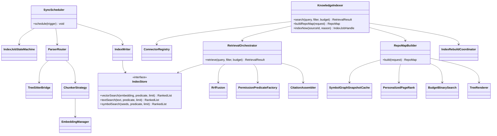
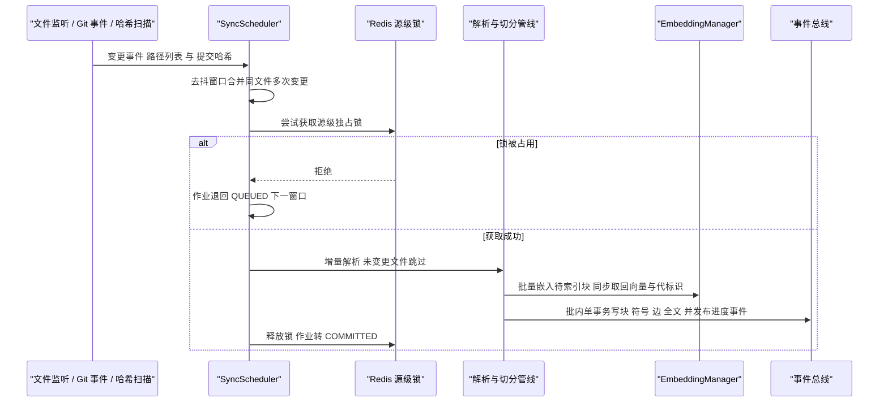
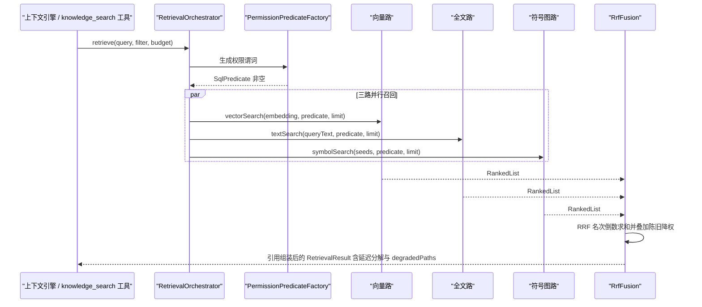
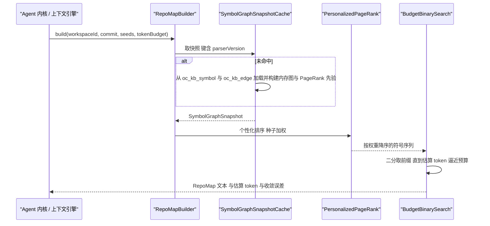
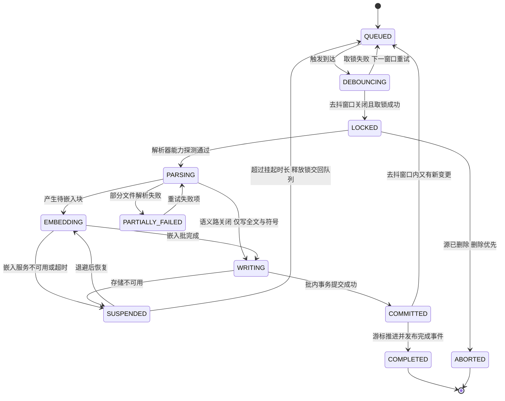

# C17 · KnowledgeIndexer（知识索引与检索器）

> 组件级实现方案。上游系统级方案：`docs/harness/impl/11-knowledge-system-impl.md`（下称 impl/11）、Phase A 卷 11、全局决策 H-006 / H-017。
> 组件范围：impl/11 §1.5 中 `connector/` `parser/` `chunker/` `embedding/` `index/` `query/` `repomap/` 七个包；`wiki/` 与 `governance/` 为同域兄弟组件，不在本文件范围。
> 编号口径（本文件局部号段，须并入 `IMPL-DECISIONS.md` 后重编号）：`REQ-C-KI-01…12`、`I-C-KI-1…5`、`X-C17-1…3`（台账当前止于 X-82）。
> 证据标记沿用 `research/00-research-plan.md` §2：`[E1]` 源码｜`[E2]` 官方文档｜`[E3]` 第三方｜`[E4]` 推断。实现落点：`harness-contract` 纯契约 + `harness-platform/platform-knowledge`，**不新增模块与表**。

---

## ① 定位与边界

**一句话职责**：把「代码仓库 / 文档 / 网页 / DB Schema 与 API 文档 / 工单聊天」五类知识源变成**可增量维护、可三路召回、可前置鉴权、可引用溯源**的检索底座，并输出仓库符号图（repo map）供模型与上下文引擎消费。

**做什么**：① ≥6 连接器与增量同步（独立凭据引用与游标，三源触发 + 去抖）；② 结构感知切分与符号 / 边抽取（D-KB-3 / D-KB-5）；③ 嵌入三态与代（generation）迁移；④ 三路索引写入（全文 / 向量 / 符号图，批内单事务）；⑤ 三路混合检索 + RRF 融合 + 前置权限 + 引用组装 + 可选异步精排；⑥ repo map（tree-sitter 三段式：符号 → 个性化 PageRank → 二分预算渲染）；⑦ 索引健康（游标续跑、按文档粒度重建、影子代与原子切换）。

| 不解决 | 归属 | 边界说明 |
| --- | --- | --- |
| 记忆（跨会话偏好） | 卷 10 / impl/10 | 知识是「可检索事实」，写入路径与权限模型独立，不参与记忆召回排序 |
| 上下文预算与注入位置 | 卷 03 / impl/03 | 只返回带引用的候选集与 token 估算；注入量由九区段预算决定 |
| 知识页生成 / 人工保护 / 治理队列 | 卷 11 `wiki/` `governance/` | 本组件向其供 repo map 与检索证据，不写 `oc_kb_wiki_*` |
| 工作区文件与提交 | 卷 20 / 卷 21 | 知识库只读；由知识驱动的改动必须走工具运行时 → 动作网关 → 权限决策 |
| 工具注册（`knowledge_search` / `repo_map`） | 卷 05 / impl/05 | 本组件暴露查询契约，工具描述符与三通道注册在工具系统 |

| 方向 | 依赖对象 | 接口 | 失败语义 |
| --- | --- | --- | --- |
| 上游 | 事件（卷 16） | `EventPort.append`；订阅 `git.commit.created` / `workspace.changed` | 订阅丢失由下次触发补齐（事件非唯一触发源） |
| 上游 | 权限（卷 06） | `PermissionFilterProvider` 产出谓词；引用打开二次鉴权 | 谓词缺失 → 拒绝检索（不得返回未过滤候选） |
| 上游 | 工作区 / 密钥（卷 20 / 30） | `WorkspacePort` 读文件与提交哈希；`SecretPort.resolve(credentialRef)` | 工作区不可达 → 该源 `Unavailable`；凭据失效 → `AUTH_REQUIRED` 该源暂停 |
| 下游 | 上下文引擎（卷 03） | `SymbolIndexSPI`（impl/03 §3.4 B2：内核只消费 `SymbolMap`） | 降级标注 `symbolIndex=degraded` |
| 下游 | 工具运行时（卷 05） | `kb.search` / `kb.repoMap` 会话方法 | 工具侧只透传错误码，不重包装 |
| 下游 | 评测 / 治理（卷 26） | 检索质量基线、陈旧率、引用打开率 | 指标缺失不阻断主链路 |

**边界口径（依赖修订 X-C17-1）**：符号图的**抽取 → 建图 → PageRank → 二分拟合 → 渲染**全部落本组件 `repomap/`；impl/03 §4 架构图的平台侧 `SymbolIndexService` 节点应标注为「委托 C17」，内核只保留 `SymbolMap` 消费位。详见 §⑨「修订建议登记」。

---

## ② 功能需求清单（REQ-C-KI-n）

| REQ | 需求描述 | 来源 | 优先级 | 验收要点 |
| --- | --- | --- | --- | --- |
| REQ-C-KI-01 | 连接器框架 + ≥6 内置连接器，独立凭据与游标，断连续跑不重复 | impl/11 D-KB-8、REQ-KB-01 | P0 | 断连恢复后重复块数为 0；每连接器独立 `credentialRef` |
| REQ-C-KI-02 | 结构感知切分：代码按 AST、文档按标题层级、表格整块、聊天按会话窗口；行号与原文一致 | impl/11 D-KB-3、REQ-KB-02 | P0 | 单函数不被跨界切开；引用行号在源文件回放命中 |
| REQ-C-KI-03 | 三类索引并存；任一路缺失时检索降级不报错并显式标注 | impl/11 REQ-KB-04、§10.5 | P0 | 关向量路后仍返回且 `degradedPaths=["VECTOR"]`；空结果与降级无结果可区分 |
| REQ-C-KI-04 | 三路混合检索 + RRF 融合 + 可选异步精排；P95 ≤ 300ms；延迟分解打点齐全 | impl/11 §6.2、H-017、I-KB-3 | P0 | 四阶段分解入 `oc_kb_query_latency_ms{phase}`；精排不阻塞首包 |
| REQ-C-KI-05 | 前置权限过滤：谓词由唯一构造器生成；**计数侧信道不可见** | impl/11 D-KB-7、I-KB-6 | P0 | 「存在但无权」与「不存在」响应结构完全一致（除审计） |
| REQ-C-KI-06 | 强制引用与版本绑定（`@<commit>` / 文档版本），注入上下文保留可点开链接 | impl/11 D-KB-9、REQ-KB-07/09 | P0 | 五类来源引用可跳转；无引用内容不得标为知识 |
| REQ-C-KI-07 | 增量索引三源触发 + 去抖合并；变更到可检索 ≤ 30s | impl/11 D-KB-6、I-KB-7 | P0 | 单文件端到端 ≤ 30s；监听不可用降级轮询并标注 |
| REQ-C-KI-08 | 仓库符号图：tree-sitter 抽符号 + 五类边；个性化 PageRank（种子 = 上下文文件 + 提及标识符） | impl/11 REQ-KB-12/13；Aider `repomap.py:365 get_ranked_tags` `[E1]` | P0 | 种子文件符号排名显著高于无关文件；10 万文件仓首次扫描可完成并缓存 |
| REQ-C-KI-09 | token 预算二分拟合渲染；空上下文预算放大；收敛误差 ≤ 0.15 | impl/11 REQ-KB-14；Aider `pct_err < 0.15`、`map_mul_no_files=8` `[E1]` | P0 | 估算误差 ≤ 配置容差；放大系数受窗口比例钳制且可配 |
| REQ-C-KI-10 | 索引健康：游标续跑、按文档粒度重建、影子代重建不阻塞查询、全代删除贯通 | impl/11 REQ-KB-10、§10.11 R05；impl/19 六层 | P1 | kill 后从游标续跑；重建期旧代服务且无半成品可见 |
| REQ-C-KI-11 | 嵌入三态与 air-gapped：`LOCAL` 零出网；`EXTERNAL` 需管理员策略与按源授权 | impl/11 D-KB-6、I-KB-5、REQ-KB-20 | P0 | 抓包证明 `LOCAL` 无出网；未授权抛 `KB_EXTERNAL_EMBEDDING_DENIED` |
| REQ-C-KI-12 | 索引与检索计量按租户 / 源聚合；超预算索引降档而非失败 | impl/11 REQ-KB-19、卷 31 | P1 | 嵌入用量可按 `(tenant, source)` 聚合；降档留痕且检索不受影响 |

本表是 impl/11 §② 的组件级切分视图（多对一或多对多），**不新增需求语义**；与 impl/11 不一致时以后者为准并登记修订建议。

---

## ③ 关键设计决策（I-C-KI-n）

| ID | 维度 | 选定分支 | 理由与代价 | 回退触发 |
| --- | --- | --- | --- | --- |
| I-C-KI-1 | 索引作业态与源级互斥 | 源级独占锁（租约 + 续租）**同时**覆盖增量与重建；作业态机独立于源态机（§⑥）；重建期增量变更入待办队列，重建后重放，**禁止双写同一 `document_id`** | 消除「重建复活已删内容」与「双写交错」两类竞态；代价是重建期增量延迟上升 | 待办队列积压超阈 → 暂停增量只留哈希标记，重建后一次性重放 |
| I-C-KI-2 | 符号图与渲染归属单点 | 抽取 / 建图 / PageRank / 二分拟合 / 渲染全部落 `repomap/`；内核经 `SymbolIndexSPI` 只消费 `SymbolMap`，**不做第二套拟合** | 与 impl/03 §3.4 B2 同向（平台域索引服务 + 端口）；代价是跨模块一次序列化 | 内核要求低延迟 → 仅允许缓存命中路径内联，算法仍单点 |
| I-C-KI-3 | 预算与缓存键口径统一 | 唯一配置项 `repomap.baseTokenBudget`（默认 1024，对齐 Aider `map_tokens=1024` `[E1]` 与 impl/03 现值）；缓存键统一含 `(workspaceId, commit, parserVersion, digest)` | 消除 impl/03 与 impl/11 的 1024/2048 冲突与 6h/900s 双轨 TTL（登记 X-C17-2） | 若裁决保留 2048 → 只改配置默认值，代码与缓存键不动 |
| I-C-KI-4 | 失效与重建粒度 | 一级重建单位矩阵化：文档级（全文 / 向量）、文件级（符号 + 边 + PageRank）、代级（向量列）、配置级（`tsv_config_version` 全文重建） | 把 R05 三条重建路径落成可执行判定，避免全量重建；代价是矩阵随字段扩展维护 | 出现矩阵未覆盖的新版本维度 → 一律触发上层重建单位并登记扩展 |
| I-C-KI-5 | 降级可见性硬规则 | 任何降级**不得**静默返回空结果；空结果与「降级导致无结果」必须可区分（`degradedPaths` + `textRank` + `parser` 标注） | 对齐卷 05 能力语义与 REQ-C-KI-03；代价是响应字段增多 | 标注影响前端契约 → 保留字段、UI 层折叠展示 |

---

## ④ 类图



**装配纪律**：图中未展开成员的类由关系隐式声明；`RrfFusion`、`PersonalizedPageRank`、`BudgetBinarySearch`、`TreeRenderer` 是**无 Spring 注解的普通 Java 类**（纯算法，可无容器单测）；`IndexStore` / `ConnectorRegistry` / `EmbeddingManager` 由 `KnowledgeAutoConfiguration` 以 `@ConditionalOnMissingBean` 装配。

**关键 Java 21 签名（零依赖；枚举一律 `code + desc` + `of()` 工厂，未知 code 抛 `HarnessException`）**

```java
/**
 * 索引作业状态机契约。作业态与源态分离：源态表达「源能不能用」，作业态表达「这一次索引跑到哪」。
 */
public interface IndexJobStateMachine {

    /**
     * 推进一次作业状态。
     *
     * @param jobId 作业标识（必填）
     * @param event 迁移事件（必填，携带触发来源与批次计数）
     * @return 迁移后的状态快照（含持锁状态与已推进水位）
     * @throws HarnessException 非法迁移时抛出，错误码 CONFLICT；作业或源不存在时 NOT_FOUND
     */
    IndexJobSnapshot advance(IndexJobId jobId, JobEvent event);
}
```

---

## ⑤ 核心流程时序图

### 5.1 增量索引（三源触发 + 去抖 + 幂等批写）

**前置条件**：源 `state=READY`；提交哈希可读；`embedding.mode ≠ DISABLED` 或已显式接受语义路关闭。
**主路径**：任一触发 → 去抖合并 → 取源锁 → 增量解析（跳过未变更）→ 切分 / 抽符号 → 批量嵌入 → 事务写块 / 符号 / 边 → 推进游标 → 发布事件。
**异常与补偿**：单文件解析失败隔离（`PARTIALLY_FAILED`，不阻塞整批）；嵌入 5xx → `SUSPENDED` 退避重试不丢任务；写入失败按批重试并保留游标。
**幂等与并发点**：幂等键 `(document_id, content_hash, embedding_generation)`，命中复用既有 `chunk_id`；源级锁串行化且重建与增量互斥（I-C-KI-1）。



### 5.2 三路混合检索与融合（P95 ≤ 300ms）

**前置条件**：调用方已获得 `PermissionFilter`；租户上下文存在（INV-3）；查询文本非空。
**主路径**：查询理解（规则优先）→ 生成权限谓词 → 三路并行召回 → RRF 融合 + 陈旧降权 → 引用组装 → 返回初排；精排异步补发。
**异常与补偿**：任一路失败记 `degradedPaths` 继续；三路全失败抛 `KB_QUERY_UNAVAILABLE`（可重试，**不返回空结果冒充「无知识」**）；精排超时标注 `rerank=SKIPPED`。
**幂等与并发点**：查询无副作用天然幂等；缓存键 `(tenant, queryDigest, filterDigest)` 含权限摘要，禁止跨权限复用。



### 5.3 repo map 构建（快照 + 个性化 PageRank + 二分预算）

**前置条件**：符号与边已随索引写入；内存图快照按 `(workspace, commit, parser_version)` 缓存（LRU 容量可配）。
**主路径**：取快照（未命中从 PG 重建并加一次性锁）→ 种子加权 → 个性化 PageRank → 按权重降序二分拟合 → 渲染树（感兴趣行附上下文）。
**异常与补偿**：快照重建超时 → 抛 `KB_INDEX_NOT_READY`；渲染超预算 → 收缩上下文行而非丢符号；跨 `parser_version` 快照禁止复用（防符号集静默陈旧）。
**幂等与并发点**：同 `(workspace, commit, seedDigest, budget, parserVersion)` 命中缓存；快照构建按 commit 加一次性锁（租约 120s）。



---

## ⑥ 状态机：索引作业态

**与源态的关系**：源态机沿用 impl/11 §⑦.1（`Registered / Probing / Ready / Syncing / PartiallyFailed / Rebuilding / RebuildFailed / Suspended / Removed`）**不改语义**；本节新增**作业态机**，每个源任一时刻最多一个活动作业（源级锁保证）。



**不变式**：① `LOCKED → COMMITTED` 区间必须持锁，租约到期未续 → 降级 `SUSPENDED` 并释放（防持锁写半批次）；② 进入 `COMMITTED` 前块 / 符号 / 边 / 游标同批提交，之后崩溃不影响已提交流水；③ 源被删除或收到 `DeletionRequest` → 任何状态立即 `ABORTED`（删除优先，重建任务收到源缺失即终止）；④ 重建与增量共用同一把源级锁，重建期增量变更入待办队列并在重建后重放。

---

## ⑦ 接口与依赖矩阵

| 面 | 方法 / 端点 | 关键入参 | 出参 | 错误码 |
| --- | --- | --- | --- | --- |
| 会话 JSON-RPC | `kb.search` | `query`、`sourceKinds[]`、`topK`、`detail`（`FILES` / `CHUNKS`） | `hits[]`（含 `citation`、`fusedScore`、`stale`）、`degradedPaths[]` | `KB_QUERY_UNAVAILABLE`、`KB_INDEX_NOT_READY`、`UNSUPPORTED_CAPABILITY` |
| 会话 JSON-RPC | `kb.repoMap` | `workspaceId`、`commit`、`seedPaths[]`、`seedSymbols[]`、`tokenBudget` | `text`、`estimatedTokens`、`includedSymbols[]` | `KB_INDEX_NOT_READY`、`NOT_FOUND` |
| 内核端口 | `SymbolIndexSPI.buildSymbolMap` | `repoRef` / `commit` / 种子 / 预算 | `SymbolMap`（文本 + 估算 + 收敛误差） | `UNSUPPORTED_CAPABILITY`（索引不可用 → 降级标注） |
| 管理 REST | `/api/v1/kb/sources` + `{id}/sync`、`{id}/cursor` | 源定义、游标 | 源状态、游标 | 权限点 `kb.manage` |
| 管理 REST | `/api/v1/kb/index/rebuild`、`/index/status` | `Idempotency-Key` | 重建报告、代与进度、解析器能力 | `kb.manage` / `kb.read` |
| 管理 REST | `/api/v1/kb/embedding/generations` + `{id}/promote` | 代标识 | 代列表 / 提升结果（CAS） | `CONFLICT`（并发 promote 失败方） |

| SPI（对接卷 18 目录） | 说明 | 装配约束 |
| --- | --- | --- |
| `ConnectorSPI` | 知识源提供方（企业私有源） | 过统一契约套件（含异常路径） |
| `ParserSPI` / `ChunkerSPI` / `SymbolExtractorSPI` | 解析 / 切分 / 符号抽取（内部 DSL） | 三者共用 `parser_version` 版本位 |
| `EmbeddingProviderSPI` / `RerankerSPI` | 嵌入来源 / 精排策略 | 未授权即 Fail-Fast；精排默认关闭且异步语义不可变 |
| `IndexStoreSPI` / `KnowledgePolicySPI` | 索引后端切换（I-KB-1 回退路径）/ 可见性与治理策略 | 切换需重索引，接口不变；策略只产出谓词输入，**不得**自建过滤旁路 |

| 配置项（`open-coding.knowledge.*`） | 默认值 | 影响面 |
| --- | --- | --- |
| `index.parser.mode` / `index.rebuildBatchSize` / `index.snapshotCacheSize` | `AUTO` / 2000 块 / 4 | 解析能力探测、重建吞吐、图快照 LRU（过小则快照反复重建） |
| `retrieval.rrfK` / `.candidatesPerPath` / `.timeoutMs` | 60 / 50 / 120ms | 融合平滑度、召回广度、单路超时 |
| `retrieval.rerank.enabled` / `.timeoutMs` | false / 400ms | 精排开关与放弃阈值 |
| `repomap.baseTokenBudget` / `.noFileMultiplier` / `.windowRatio` / `.convergenceTolerance` | 1024 / 8 / 0.75 / 0.15 | repo map 预算与收敛（X-C17-2 统一口径） |
| `embedding.mode` / `.modelId` / `.dim` | `LOCAL` / 必填（mode 非 `DISABLED`） | 语义路可用性与代迁移 |
| `governance.staleDownweight` | 0.6 | 陈旧项降权系数（本组件只消费） |

全部变量须同步 `.env.example`；敏感项（`KB_EMBEDDING_API_KEY`、连接器凭据引用）默认留空并在启动时 Fail-Fast。

---

## ⑧ 关键算法

### 8.1 增量索引与失效重建

**三源触发与去抖**：文件监听（`WatchService` / 远端轮询）、Git 提交事件、周期哈希扫描三源同一入口；同 `(sourceId, path)` 在去抖窗口内多次变更合并为一次作业；窗口按「静默期 + 最大延迟」双阈值（配置项）防持续写入饥饿。**跳过判定用内容与版本双键**：`content_hash` 与 `parser_version` 均未变才跳过解析 —— 抽取器升级后即使内容未变也必须重建符号与边，否则符号集会静默陈旧。

| 变化维度 | 重建单位 | 触发方式 | 在线可完成 |
| --- | --- | --- | --- |
| 文件内容（`content_hash`） | 文档级：块 + 全文 + 向量 | 增量作业 | 是（批内单事务） |
| `parser_version` | 文件级：符号 + 边 → 重算 PageRank，快照缓存淘汰 | 版本位比对 | 是（按文件分批） |
| `tsv_config_version` | 全文列整体重建（expand-contract 双写切换） | 配置变更钩子 | 是（双写期旧列服务） |
| `embedding_generation` | 代级：新代 `SHADOW` 续建，`ACTIVE` 走 CAS 切换 | 代迁移任务 | 是（新旧代并存可查） |
| 索引损坏 / Schema 迁移 | 最小重建（文档或文件级）/ 影子代 + 原子切换 | 巡检 / 迁移脚本 | 是（旧代继续服务） |

### 8.2 混合检索融合

**并行召回**：三路各自独立超时（`retrieval.timeoutMs`），任一路超时或失败只降级该路并记 `degradedPaths`；三路全失败抛 `KB_QUERY_UNAVAILABLE`。

```java
/**
 * RRF 融合：只用名次、不用分数，天然免疫三路分数量纲不可比的问题；陈旧项降权但保留。
 *
 * @param lists  各路名次列表（顺序无关）
 * @param policy 融合策略（k 与降权系数来自配置，算法内禁止出现字面量）
 * @return 按融合分降序的候选，名次映射随结果返回以便解释
 */
public ScoredList fuse(List<RankedList> lists, FusionPolicy policy) {
    Map<ChunkId, Double> scores = new HashMap<>();
    Map<ChunkId, Map<RecallPath, Integer>> ranks = new HashMap<>();
    for (RankedList list : lists) {
        for (RankedEntry entry : list.entries()) {
            // 名次倒数求和：k 越大越平滑，抑制单路霸榜；陈旧项降权后仍可被引用
            double gain = 1.0d / (policy.rrfK() + entry.rank());
            scores.merge(entry.chunkId(), entry.stale() ? gain * policy.staleDownweight() : gain, Double::sum);
            ranks.computeIfAbsent(entry.chunkId(), key -> new EnumMap<>(RecallPath.class))
                    .put(list.path(), entry.rank());
        }
    }
    return ScoredList.of(scores, ranks);
}
```

**权限前置过滤（唯一点）**：所有召回 SQL 由 `PermissionPredicateFactory` 生成（`tenant_id` / `project_id` / `visibility` / `acl_digest` / `classification` + `deleted_at is null`）；谓词为空**直接抛异常**而非放行；对调用方只返回过滤后结果，**不返回过滤前候选数**（真实过滤数仅入审计）。可选精排异步执行，超时即 `rerank=SKIPPED`，到达后补发事件追加，不改写初排语义。

### 8.3 符号图构建与 token 预算分配

**建图**：符号节点 + 五类边（`CALL / IMPORT / EXTENDS / IMPLEMENTS / REFERENCES`），边权取同文件引用密度（可配）；全局 PageRank 先验随索引批次物化到 `oc_kb_symbol.pagerank`，检索期个性化重排用内存快照（按 commit 缓存）。**个性化 PageRank**：种子集 = 上下文文件（含其内符号）+ 用户 / 模型提及标识符；权重按 `seedWeight / seedCount` 归一（对齐 Aider `personalize = 100 / len(fnames)` 语义 `[E1]`，数值走配置）；悬挂节点按 `damping` 均匀回注；迭代上限与收敛阈值可配。

```java
/**
 * 按排名取前缀并用二分搜索逼近 token 预算（对齐 Aider `pct_err < 0.15` 提前收敛）；前缀估算单调不减故二分可终止。
 *
 * @param ranked    按权重降序的符号序列（可为空）
 * @param budget    有效预算（已含无文件放大与窗口比例钳制，必填）
 * @param tolerance 收敛容差（配置项，算法内禁止写死）
 * @return 选中符号集与收敛误差；预算极小无法容纳首符号时返回空选择而非抛错
 */
public FittedSelection fit(RankedSymbols ranked, TokenBudget budget, double tolerance) {
    int low = 0;
    int high = ranked.size();
    FittedSelection best = FittedSelection.empty();
    while (low <= high) {
        int mid = (low + high) >>> 1;
        FittedSelection candidate = ranked.prefix(mid);
        long estimated = estimator.estimate(candidate);
        if (estimated <= budget.limit()) {
            best = candidate;
            low = mid + 1;
        } else {
            high = mid - 1;
        }
        // 误差已足够小：提前收敛，避免为最后几个符号多算一轮渲染
        if (budget.limit() > 0 && Math.abs(estimated - budget.limit()) <= budget.limit() * tolerance) {
            return candidate;
        }
    }
    return best;
}
```

**预算联动**：`effectiveBudget = min(baseBudget × noFileMultiplier, modelWindow × windowRatio)`，仅当调用方上下文中**没有任何显式文件**时启用放大；渲染超预算时收缩感兴趣行上下文窗口，**不丢符号**（保证「谁调用我」类问题仍可回答）。

---

## ⑨ 错误处理与降级

| 场景 | ErrorCode | 可重试 | 对外文案要点 | 恢复动作 |
| --- | --- | --- | --- | --- |
| 三路召回全失败 | `KB_QUERY_UNAVAILABLE` | 是 | 「知识检索暂不可用，请稍后重试」 | 退避重试；**不返回空结果冒充「无知识」** |
| 首次构建中 | `KB_INDEX_NOT_READY` | 是 | 「索引构建中，稍后可用」 | 状态页显示进度；`kb.repoMap` 同语义 |
| 语义路关闭 | `UNSUPPORTED_CAPABILITY` | 否（降级继续） | 「语义检索已关闭，已用全文 + 符号图」 | 标注 `degradedPaths=["VECTOR"]` |
| `pg_search` 缺失 / 解析器不可用 / 精排超时 | 非错误（降级） | — | 「全文已回落 `ts_rank_cd`」/「已用启发式抽取」/ 用户不可见 | 分别标注 `textRank=TS_RANK_FALLBACK`、`parser=none`（工作进程重启 ≤ 3 次）、`rerank=SKIPPED` |
| 嵌入服务 5xx / 超时 | `DEPENDENCY_UNAVAILABLE` | 是 | 「嵌入服务不可用，索引任务已挂起」 | 退避重试不丢任务；语义路关闭 |
| 存储不可用（磁盘满 / 写失败） | `INTERNAL_ERROR` | 是 | 「索引已停止，检索只读不受影响」 | 停止索引并告警；恢复后从游标续跑 |
| 连接器凭据失效 | `AUTH_REQUIRED` | 否 | 「连接器凭据失效，请重新授权」 | 该源暂停；其余源不受影响 |
| 引用目标已不存在 | `KB_CITATION_GONE` | 否 | 「引用目标已不存在」 | 标注失效；陈旧检测降权被引用块 |
| 引用打开越权 | `PERMISSION_DENIED` | 否 | 「无权打开该引用」 | 拒绝 + 审计；响应体与「不存在」结构一致 |
| 未授权外发嵌入 | `KB_EXTERNAL_EMBEDDING_DENIED` | 否 | 「代码外发嵌入未获授权」 | 保持 `LOCAL`；提示联系管理员 |

**降级阶梯（由轻到重，任一级写事件并可观测）**：① 标注级（`textRank` / `parser` / `rerank`）；② 通路级（单路降级 `degradedPaths`）；③ 能力级（语义路关闭或符号图缺失）；④ 索引级（索引停止、只读检索继续）；⑤ 重建级（影子代重建、旧代服务）；⑥ 失败级（三路全失败显式报错，**永不静默**）。**硬规则**：降级路径与空结果必须可区分；「索引查不到」不得解释为「源里没有」。

**修订建议登记（须并入 `IMPL-DECISIONS.md` §4）**

| 编号（待并号） | 冲突 / 缺口 | 证据 | 建议修订 |
| --- | --- | --- | --- |
| `X-C17-1` | 符号图归属三方口径不一：impl/03 §3.4 正文称「内核保留预算拟合与渲染的纯逻辑」，其 §4 图却把「符号图 + 图排序 + 二分拟合」画在平台侧；impl/11 把二者都放 `platform-knowledge/repomap/` | impl/03 §3.4 与 §4 图；impl/11 §1.5、D-KBI-5 | 单点口径：抽取 / 建图 / PageRank / 二分拟合 / 渲染全落 `repomap/`，内核只经 `SymbolIndexSPI` 消费；impl/03 §4 该节点标注「委托 C17」并删除正文「内核保留二分拟合」表述 |
| `X-C17-2` | 预算默认值与缓存 TTL 双轨：`baseTokenBudget` 2048（impl/11）vs `symbol-map-tokens` 1024（impl/03）；`knowledgeRepoMap` 900s vs `oc:ctx:symbolmap` 6h | impl/11 §9.3 / §8.2；impl/03 §9.3 / §8.6 | 统一：预算唯一配置项默认 **1024**（对齐 Aider `map_tokens=1024` `[E1]` 与 impl/03 现值），impl/03 变量改别名并标注废弃；缓存明确双轨但同键前缀 —— 渲染缓存 `oc:kb:repomap:...`（默认 900s）与快照缓存（LRU + 按 commit 淘汰），impl/03 只保留按 `(文件, mtime)` 失效的**解析级**缓存语义 |
| `X-C17-3` | 删除贯通缺「旧代 + `kb/raw` 副本」的可执行判据：已声明全代同批清除，但未指定跨代扫描查询与残留清单字段 | impl/11 §10.11 表-3；impl/19 §⑥.4 | 卷 11 §10.11 补判据：对 `state IN (ACTIVE, SHADOW, RETIRED)` 三代分别执行同一条召回查询并断言全空；残留清单落 `layer_results`（复用 19 口径，不另立证明） |

---

## ⑩ 性能与并发

**索引吞吐**：`SyncScheduler` 用虚拟线程承载每源同步，源级独占锁串行；批内并发度 `min(CPU 核数, 8)`（可配），批内单事务、批间独立提交（可断点）。嵌入侧有界队列 + 背压（队列满时**阻塞等待**而非丢弃）；队列水位与 P95 延迟进入健康摘要，超阈值时索引降档（只索引变更文件）。门禁：首次全量 ≤ 10min / 10 万文件；增量端到端 ≤ 30s；`oc_kb_index_lag_seconds` 持续 > 120s 触发容量告警。嵌入与远端解析属外部调用，先批量产出再统一写库，**禁止**包进写库事务。日志按 `.qoder/rules/logging-rules.md`：索引开始 / 结束（源、文件数、块数、耗时）、单文件解析失败（`log.warn` 含路径与 `Throwable`）、降级生效、检索完成（`log.debug` 含三路命中数与延迟分解，**不打印命中正文**）。

**检索延迟预算（CI 压测门禁）**

| 阶段 | 预算 | 说明 |
| --- | --- | --- |
| 查询理解 | ≤ 30ms | 规则优先；模型改写默认关闭 |
| 三路召回 | ≤ 100ms | 单路 P95 ≤ 120ms；任一路超时不阻塞总数 |
| 融合 + 重排 | ≤ 120ms | RRF 计算 P95 ≤ 20ms；精排异步 ≤ 400ms |
| 权限过滤 + 引用组装 | ≤ 50ms | 谓词注入后 SQL 计划无全表扫描 |
| 合计 / repo map | ≤ 300ms（P95）/ ≤ 200ms（命中 ≤ 20ms） | 10 万块基准脚本 `./scripts/ci/kb-bench.sh`；repo map 收敛误差 ≤ 0.15 |

**容量与缓存**：块量阈值 500 万（超阈走 `IndexStoreSPI` 切换）；单块 400 token ⇒ 1024 维 float32 ≈ 6KB/块（含索引开销）⇒ 向量 ≈ 30GB，符号 100 万 × 200B ≈ 200MB，边 500 万 × 80B ≈ 400MB。缓存键**必须含版本维度**（`commit` / `embedding_generation` / `parser_version` / `tsv_config_version`），缺失即拒绝写入；查询缓存键含 `filterDigest` 防跨权限复用。

**并发正确性要点**

| 写路径 | 风险 | 控制 |
| --- | --- | --- |
| 源级索引 / 重建 | 同源并发、重建与增量双写 | 源级锁 + 作业态机 + 重建期待办队列（I-C-KI-1） |
| 块写入 | 重复写入与半批次 | 幂等键 + 批内单事务；命中复用既有 `chunk_id` |
| 代提升 | 并发 promote | CAS 条件更新，行数 ≠ 1 抛 `CONFLICT`；旧代同事务转 `RETIRED` |
| 快照构建 | 同 commit 并发构建 | commit 级一次性锁（租约 120s）+ `parser_version` 入键 |
| 源删除 vs 重建 | 删除期间复活内容 | 删除优先：任何写入校验源状态，`Removed` 即 `ABORTED` |

---

## ⑪ 测试要点

**单元测试（纯算法，无容器）**：`ChunkerStrategyTest`（Java / Python / TS 各 3 例、Markdown 层级、宽表格整块、聊天窗口边界，断言不跨界且行号一致）；`RrfFusionTest`（三路名次组合期望序、单路缺失、陈旧降权、`rrfK` 边界）；`PersonalizedPageRankTest`（种子加权、悬挂节点、收敛与迭代上限，与手算小图对照）；`BudgetBinarySearchTest`（预算单调性、提前收敛、空预算分支、无文件放大与窗口钳制）；`PermissionPredicateFactoryTest`（对照表全字段、空谓词必抛异常、返回体无过滤前计数）；`IndexJobStateMachineTest`（非法迁移拒绝、租约过期降级 `SUSPENDED`、`Removed` 强制 `ABORTED`）；失效矩阵六行逐行判定。

**集成测试（Testcontainers：PG + pgvector，可选 `pg_search` 镜像）**：六连接器同步与增量续跑（含 mock 网页服务与 Git 大仓子集）；降级矩阵（向量关闭 / `pg_search` 缺失 / 解析器不可用 / 精排超时四种下检索均返回且标注正确）；引用端到端（五类来源生成 → 打开 → 失效后 `KB_CITATION_GONE`）；权限用例（跨租户 / 跨项目 / 分级三组越权返回空，「存在但无权」与「不存在」响应结构一致性断言）；重建（清空块 / 符号 / 边 + 翻转快照缓存 + 模拟 HNSW 损坏 → 仅凭源与 commit 重建成功，重建期旧代服务）；版本升级（提升 `parser_version` 与 `tsv_config_version` 后按文件重建，滞后全程可观测且旧快照不复用）；删除贯通（源删除后扫描全部代、Redis 缓存、`kb/raw` 副本与备份 tombstone，全代不可召回、无残留，见 X-C17-3 判据）。

**故障注入**：索引进程 kill（重启从游标续跑、无半成品块）；PG 闪断（`KB_QUERY_UNAVAILABLE`，不返回空）；解析工作进程崩溃（重启 ≤ 3 次后切启发式并标注）；嵌入 5xx（语义路关闭 + 作业 `SUSPENDED` 退避不丢任务）；磁盘写满（索引停止、只读检索不受影响）；重建期删除源（删除优先，重建终止）；并发代提升（CAS 仅一次成功，活动代唯一）。

**性能门禁与验收命令**

```bash
# 门禁映射（卷 27 §4.6）：单测 → 覆盖率门；集成 → 集成测试；基准 → 性能基准（抽样）+ 安全红队
mvn -pl harness-platform/platform-knowledge -am test          # 单元 + 集成（PG + pgvector 容器）
./scripts/ci/kb-gate.sh                                       # 降级矩阵 + 越权 + 混合检索基准
mvn -pl harness-host/host-app -am test                        # 用例编排与协议面（kb.search / kb.repoMap）
```

**DoD（impl/11 §11.6 的组件内切片）**：≥6 连接器增量续跑 ｜ 三路降级矩阵全绿 ｜ 越权不可探测且无计数侧信道 ｜ 五类引用可跳转与失效检测 ｜ 增量 ≤ 30s 与首次 ≤ 10min ｜ repo map 收敛与缓存失效用例 ｜ 三条重建路径集成用例 ｜ 删除贯通跨代与副本断言 ｜ 配置项全部入 `.env.example` 且敏感项 Fail-Fast。
