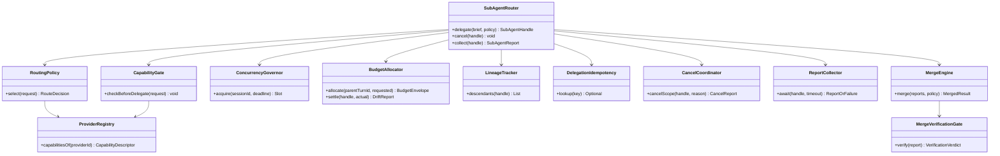
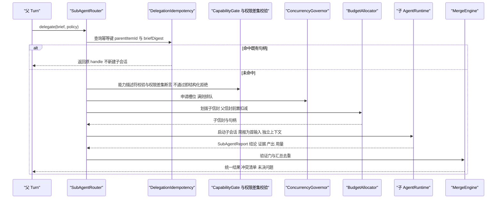
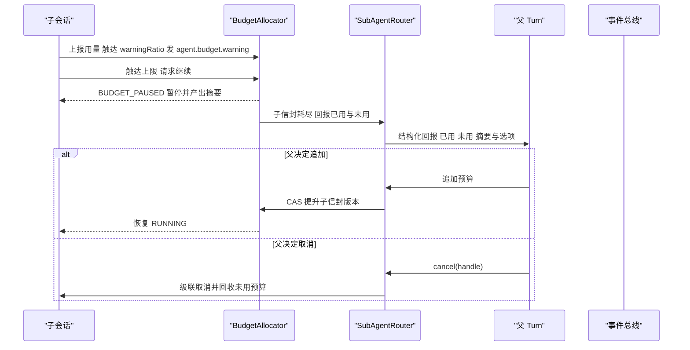
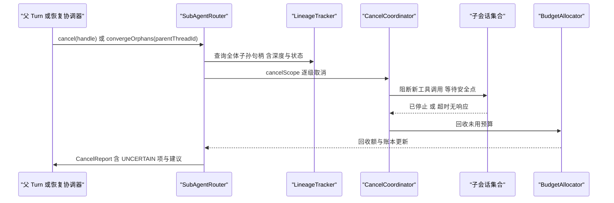
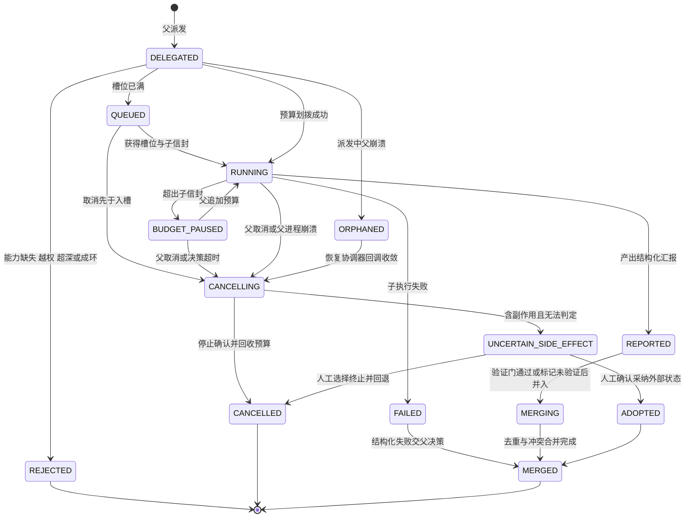

# C18 · SubAgentRouter（子代理委派与预算隔离）

> 组件级实现方案。上游系统级方案：`docs/harness/impl/12-agent-runtime-impl.md`（下称 impl/12）§1.5 `subagent/` 包、§3 D-AGI-5 / D-AGI-7、§6.3 时序、§7.2 状态机、§9.3 配置；Phase A 卷 12 §4.3（D-AG-4 / D-AG-5 / D-AG-6）；全局决策 H-011 三层编排（SubAgent → Team → Peer，本组件是最内层）。
> 竞品证据：DeepSeek `ctx.subagents` 六 provider 注册表 + `SubagentError('UNSUPPORTED_CAPABILITY')` 响亮拒绝 `[E1]`（`research/competitors/04-deepseek-harness.md` §4.9）；OpenCode `subagent-permissions.ts:20-27` 差集语义 `[E1]`（`02-opencode.md` §4.8）；采纳台账 L-038 / L-039 / L-040 / L-041 / L-043。
> 编号口径（本文件局部号段，须并入 `IMPL-DECISIONS.md` 后重编号）：`REQ-C-SAR-01…12`、`I-C-SAR-1…5`、`X-C18-1…3`（台账当前止于 X-82）。
> 实现落点：`harness-contract`（`contract/agent` 的 `SubAgentBrief` / `SubAgentReport` / 两个 SPI）+ `harness-kernel/kernel-agent`（`subagent/` 包）；**不新增模块**，`oc_subagent_link` 补列见 X-C18-1。

---

## ① 定位与边界

**一句话职责**：作为「单 Agent 派生能力」的唯一路由与账务入口，把父 Turn 的委派意图变成一次**确定性选择、预算隔离、可级联取消、可幂等收敛**的子会话，并把子结论结构化合并回父。

**做什么**：① 委派准入（能力校验 + 权限差集校验 + 深度与上溯环检测 + 槽位分配）；② Provider 路由（同进程默认，远程与异种 Agent 可插拔，能力以静态描述符声明）；③ 预算信封划拨 / 扣减 / 结算回冲 / 回收；④ 并发上限与排队背压；⑤ 派发与血缘登记（深度链、父项锚点）；⑥ 汇报收集、独立验证门与汇总去重；⑦ 级联取消与孤儿收敛。

| 不解决 | 归属 | 边界说明 |
| --- | --- | --- |
| 团队编制 / 拓扑 / 黑板 / 仲裁 | 卷 13 TeamOrchestrator | H-011 中间层；团队复派成员会话时复用本组件账务与路由，不重复实现 |
| 工具扇出与资源冲突调度 | impl/12 `ToolFanOutCoordinator` | 本组件只做**子会话间**的写范围冲突前置拦截（D-AG-6） |
| Agent 主循环 / 阶段机 / 检查点 | impl/12 `TurnOrchestrator` / `CheckpointWriter` | 子会话复用同一 `AgentRuntime`，本组件不实现第二套循环 |
| 崩溃恢复协调 | impl/19 恢复协调器（唯一协调者） | 本组件只提供「孤儿子会话收敛」回调实现，不另起扫描器 |
| 模型调用与协议适配 | 卷 02 / impl/02 | 子会话经同一 `LlmPort` 消费，路由不感知厂商协议差异 |
| 权限判定与审批执行 | 卷 06 / impl/06 | 本组件只做**差集校验与封顶**（INV-4），不做判定链 |

| 方向 | 依赖对象 | 接口 | 失败语义 |
| --- | --- | --- | --- |
| 上游 | 父 Turn（impl/12 §6.1） | `delegate(brief, policy)` / `cancel(handle)` / `collect(handle)` | 父 Turn 结束即冻结新派发（`CONFLICT`） |
| 上游 | 预算（impl/12 §③ D-AGI-7） | `BudgetAllocator` 划拨 / 回冲；信封前置扣减 | 父信封不足 → 不派出，返回结构化拒绝 |
| 上游 | 权限与 Agent 定义（卷 06 / D-AG-13） | `PermissionPort` 差集校验；`oc_agent_definition` 声明能力模式 / `delegation` / 预算默认与工具收窄 | 越界即 `POLICY_OVERRIDE_DENIED`（INV-4）；定义缺失或超上限 → 拒绝加载 / 拒绝派发 |
| 下游 | 子 `AgentRuntime`（impl/12） | `spawn` / `submit`（简报为首输入）/ 事件流 | 子失败不炸父；父收结构化失败并决策 |
| 下游 | 事件与计量（卷 16 / 卷 31 / impl/26） | `agent.subagent.*` 事件（含 `subagent_id` 与 `parentItemId`）；子用量计入父 Turn 分项 | 事件写失败按 `DEPENDENCY_UNAVAILABLE` 重试（账本先行）；计量偏差 > 0.5% 即门禁失败（impl/12 §10.5） |

**边界口径**：`SubAgentRouter` ≡ impl/12 §1.5 `subagent/` 三件套（`SubAgentBroker` + `BudgetAllocator` + `LineageTracker`）+ Provider 注册表 + 汇总器；**不改动** impl/12 §⑤ 已冻结的 `delegate` / `cancel` / `collect` 语义，只做内部职责细化；`SubAgentBrief` / `SubAgentReport` 沿用 impl/12 §⑤ 原样 record，不新增字段（新增列 / 事件 / 验证门见 §⑨「修订建议登记」）。

---

## ② 功能需求清单（REQ-C-SAR-n）

| REQ | 需求描述 | 来源 | 优先级 | 验收要点 |
| --- | --- | --- | --- | --- |
| REQ-C-SAR-01 | 结构化简报委派与结构化汇报：简报含目标 / 验收 / 已知事实 / 约束 / 禁止项 / 引用 / 预算 / 深度，**不含父对话原文** | impl/12 §⑤ `SubAgentBrief`、§6.3、REQ-AG-08 | P0 | 子会话模型历史中无父对话原文；简报可序列化重放 |
| REQ-C-SAR-02 | Provider 注册表 + 静态能力描述符 + 运行前双重校验（启动期 + 派生前）；缺失即 `UNSUPPORTED_CAPABILITY` 附 `alternatives[]` | impl/12 D-AGI-5、I-AG-5；L-040；DeepSeek 六 provider `[E1]` | P0 | 描述符与实现漂移用例被拦；能力缺失无 accept-then-ignore |
| REQ-C-SAR-03 | 预算独立信封：划拨 ≤ 父信封 × `budgetShareRatio`；独立账本；结算回冲；超支**暂停并回报**（不静默终止） | impl/12 §3（I-AG-7）、D-AGI-7；卷 12 §4.3 | P0 | 子超支进入 `BUDGET_PAUSED` 并回报父；父追加可续跑 |
| REQ-C-SAR-04 | 并发上限与排队背压：并行上限默认 4；槽位满转排队；队列满返回 `RATE_LIMITED`（含 `retryAfterMs`）不丢委派 | impl/12 §9.3 `fanout.maxParallelSubAgents`、§10.1 | P0 | 超限派发按队列 FIFO 老化入槽；压测下无静默丢弃 |
| REQ-C-SAR-05 | 嵌套深度上限（默认 3，企业可配）+ 上溯循环检测（血缘链断言无环） | 卷 12 §4「默认 3；企业可配」；`LESSONS-AND-ADOPTIONS.md` §5 修订建议③ | P0 | 自派生环被拒（`CONFLICT`）；超深拒绝附当前深度链 |
| REQ-C-SAR-06 | 权限只减不增：能力模式由 agent 定义声明（父与模型不可自选）、deny 差集不变量 `SubAgentPerms ⊆ ParentDenySet`；越界 `POLICY_OVERRIDE_DENIED` | L-038 / L-039、INV-4、卷 12 §10.7 | P0 | 模型请求提权被拒；差集断言在派生与继承两处成立 |
| REQ-C-SAR-07 | 级联取消与预算回收：父取消 → 全部子孙取消；回收未用预算并写 `agent.subagent.cancelled` | impl/12 §6.3、D-AG-8 | P0 | 孙代取消传播用例；回收额 = 划拨 − 已用，事件留痕 |
| REQ-C-SAR-08 | 独立可观测：事件带 `subagent_id` 与 `parentItemId`、独立 logger 命名空间、独立 `maxTurns`；子系统提示独立 | L-041；impl/12 §10.8 | P0 | 每子会话可单独排障；父子 trace 关联不串线 |
| REQ-C-SAR-09 | 汇总与去重 + 子会话间写冲突前置拦截：产出按证据引用与断言指纹去重；同资源写冲突列清单**不自动裁决** | impl/12 D-AG-6 / REQ-AG-07、§6.3「汇总去重与冲突合并」 | P0 | 重复证据只计一次；冲突清单随合并结果返回 |
| REQ-C-SAR-10 | 幂等派发：同 `(parentItemId, briefDigest)` 重复派发返回既有 handle，不产生第二个子会话 | impl/12 §6.3 幂等点（表补列见 X-C18-1） | P0 | 重复派发用例子会话数为 1；重复取消幂等 |
| REQ-C-SAR-11 | 失败解耦与证据强制：子失败以结构化 `SubAgentReport` 回报交父决策；结论无证据不得进入父事实 | impl/12 §6.3、§10.5；L-043（报告独立验证）；INV-10 | P0 | 无证据汇报被拒（`VERIFICATION_MISSING`）；父不被子异常中断 |
| REQ-C-SAR-12 | 计量归因：子用量（模型 / 工具 / 自身开销）计入父 Turn 分项与预算余量，偏差 ≤ 0.5% | impl/12 §10.5、卷 31、impl/26 | P1 | 分项之和与总额偏差 > 0.5% 即门禁失败 |

本表是 impl/12 §② 与 §6.3 / §7.2 的**组件级细化视图**（`REQ-AG-n → REQ-C-SAR-n` 多对多），不新增系统级需求语义；与 impl/12 冲突时以后者为准并登记修订建议。

---

## ③ 关键设计决策（I-C-SAR-n）

| ID | 维度 | 选定分支 | 理由与代价 | 回退触发 |
| --- | --- | --- | --- | --- |
| I-C-SAR-1 | 委派选择策略 | **确定性硬过滤 + 打分排序**：能力位硬过滤 → 定义层显式 provider 覆盖 → 亲和（项目 / 模型）→ 负载（队列长度）→ 延迟 EWMA → 平局按 providerId 字典序；**模型不可指定 provider**，无候选即 `UNSUPPORTED_CAPABILITY` 附 `alternatives[]` | 可复现、可审计、无隐性提权；代价是无法按在线指标做探索性路由 | 亲和度导致某 provider 长期饥饿 → 引入权重配比（配置）而非随机化 |
| I-C-SAR-2 | 预算三账与超支处置 | 父信封**前置扣减**（防超支）+ 子本地账本 + 网关结算**回冲**；超支分级：`warningRatio` 预警 → `BUDGET_PAUSED` → 请求决策（追加 / 收敛 / 取消）；回冲偏差 > 2% 提高信封预留比例 | 与 impl/12 D-AGI-7 双信封同向：永不超支且不虚报；代价是回冲逻辑与状态分支 | 回冲偏差持续 > 2%（I-AG-7 回退触发）→ 提高预留比例至经验值并告警 |
| I-C-SAR-3 | 幂等键与血缘唯一口径 | 幂等键 `(parentThreadId, parentItemId, briefDigest)`；血缘链（`oc_subagent_link.depth` + 祖先摘要集）同时服务深度检测、环检测与取消级联；`brief_digest` 为表补列（X-C18-1） | 把「重复派发」「自派生环」「取消漏孙」三类缺陷收敛到一个键；代价是表需补列与唯一索引 | 若编排方禁止改表 → 幂等表退化到 `oc_agent_input` 复用 `inputId` 承载摘要（登记为临时形态） |
| I-C-SAR-4 | 汇总去重与冲突裁决 | 断言指纹归一化（去空白 / 统一大小写 / 引用规范化）后去重；冲突（相反断言、同资源写）**并列展示并给出清单，不自动裁决**；`confidence` 与 `openQuestions` 必传 | 冲突自动裁决会掩盖分歧且不可审计；代价是父（或人类）需处理清单 | 冲突清单长到影响父预算 → 只上报 TopN 并附完整清单引用 |
| I-C-SAR-5 | 取消与孤儿收敛 | 取消为 **SCOPE 级联**且幂等；父崩溃后的孤儿子会话由 impl/19 恢复协调器回调本组件收敛：可自动 `CANCELLED`（无副作用或只读），含副作用者标 `UNCERTAIN` 请求人工 `ADOPTED` | 与 impl/12 §10.3 恢复协议同源（UNCERTAIN 挂起自动推进）；代价是长任务可能停在人工确认 | 孤儿收敛超时（配置）→ 强制 `CANCELLED` 并把不确定项上报父/人类（不静默放弃） |

---

## ④ 类图



**装配纪律**：图中未展开成员的类由关系隐式声明；`RoutingPolicy`、`BudgetAllocator`（算法部分）、`MergeEngine` 为**无框架依赖的普通 Java 类**（可无容器单测，内核零 Spring，impl/12 §1.5 分层纪律）；Provider 注册表经 `SubAgentProviderSPI` 装配，默认只装同进程 Provider（`B1`），远程与异种 Agent 为可选装配项。

**关键 Java 21 签名（内核契约，零框架依赖）**

```java
/**
 * 子代理路由器：单 Agent 派生能力的唯一入口，负责路由、预算隔离、血缘与汇总。
 * 实现必须保证：子会话权限 ⊆ 父权限（INV-4）、同幂等键只产生一个子会话、取消必达且幂等。
 */
public interface SubAgentRouter {

    /**
     * 派发一个子会话。
     *
     * @param brief  结构化简报（必填，含目标 / 验收 / 约束 / 预算与深度上限，不含父对话原文）
     * @param policy 派生策略（必填，含隔离档、并发与深度上限、可用 provider 白名单）
     * @return 子会话句柄（含 provider、深度、信封与幂等键）
     * @throws HarnessException 能力缺失附 alternatives、越权、超深或成环、父信封不足时抛出
     */
    SubAgentHandle delegate(SubAgentBrief brief, SubAgentPolicy policy);
}
```

---

## ⑤ 核心流程时序图

### 5.1 派发主路径（准入 → 划拨 → 并行推进 → 汇总）

**前置条件**：父 Turn 处于可派发阶段（`PLAN` / `EXECUTE`，非 `WRAP`）；`delegation` 允许且未达深度 / 数量上限。
**主路径**：父生成简报 → 幂等查重 → 能力与权限校验 → 槽位与预算划拨 → 启动子会话（独立上下文）→ 父继续并行推进 → 子结构化汇报 → 验证门 → 汇总去重 → 结果入父上下文。
**异常与补偿**：能力缺失 / 越权 / 超深 → 立即结构化拒绝（不派出）；子失败 → 结构化失败交父决策（重试 / 换路 / 自做）；汇报超时 → 按 `subagent.defaultTimeoutMinutes` 暂停子会话并回报。
**幂等与并发点**：同 `(parentThreadId, parentItemId, briefDigest)` 命中即返回既有 handle；槽位与预算的扣减与释放均在同一临界区，避免重复扣减。



### 5.2 预算超支暂停与追加决策

**前置条件**：子会话运行中，信封已划拨；父 Turn 仍在运行（未进入 `WRAP`）。
**主路径**：子本地账本触达 `warningRatio` → 预警事件 → 触达上限 → `BUDGET_PAUSED` + 产出摘要回报父 → 父决定追加 / 收敛目标 / 取消。
**异常与补偿**：父在 `WRAP` 或已取消 → 拒绝追加并级联取消（超支子不得继续消耗）；决策超时 → 默认取消并回收预算（fail-closed，禁止无账本继续消耗）。
**幂等与并发点**：追加预算走条件更新（信封版本号 CAS），并发追加只有一次成功；重复追加请求返回既有信封。



### 5.3 级联取消与孤儿收敛

**前置条件**：存在活动子会话（可能多代）；父取消或父进程崩溃后重启。
**主路径**：取消请求 → 按血缘取全部子孙 → 逐级取消（先阻断新工具调用，再等待安全点）→ 回收预算 → 写 `agent.subagent.cancelled`；父崩溃 → 恢复协调器（impl/19）回调本组件收敛孤儿。
**异常与补偿**：子无响应 → 超时后标 `UNCERTAIN` 并上报（不静默放弃）；含副作用且无法判定 → 请求人工 `ADOPTED`；重复取消 → 幂等无副作用。
**幂等与并发点**：取消按 `(handle, reason, attempt)` 幂等；孤儿收敛与父侧取消并发时以血缘记录的条件更新（`state` 期望值）仲裁，行数 ≠ 1 即放弃本地动作。



---

## ⑥ 状态机：子代理生命周期

**与 impl/12 §7.2 的关系**：原状态（`DELEGATED / REJECTED / RUNNING / REPORTED / BUDGET_PAUSED / FAILED / CANCELLED / MERGED`）**语义不变**；本节新增 `QUEUED`（等待槽位）、`CANCELLING`（取消传播中）、`ORPHANED`（父崩溃待收敛）三态，并补充汇总态 `MERGING` 的显式化。



**不变式**：① 任一子会话在同一时刻只占一个槽位与一个预算信封；② `RUNNING` 期间子工具集与权限上限**不可提升**（变更需父新建派发）；③ `CANCELLED` / `MERGED` 为终态，不可复活（需重派发并生成新句柄）；④ 含 `UNCERTAIN_SIDE_EFFECT` 的子会话**挂起父自动推进**直至人工裁决（对齐 impl/12 §10.3 第 8 条）。

---

## ⑦ 接口与依赖矩阵

| 面 | 方法 / 端点 | 关键入参 | 出参 | 错误码 |
| --- | --- | --- | --- | --- |
| 内核契约 | `delegate(brief, policy)` | 简报（目标 / 验收 / 约束 / 预算 / 深度）、派生策略 | `SubAgentHandle` | `UNSUPPORTED_CAPABILITY`、`POLICY_OVERRIDE_DENIED`、`CONFLICT`、`BUDGET_EXHAUSTED`、`RATE_LIMITED` |
| 内核契约 | `cancel(handle)` / `collect(handle)` | 句柄、（可选）超时 | `CancelReport` / `SubAgentReport` | `NOT_FOUND`、`CONFLICT` |
| 会话 JSON-RPC | `session.attach` / `session.resume`（子会话视图） | `sessionId`、`fromSeq` | 子会话快照（可折叠展开） | `NOT_FOUND` |
| 管理 REST | `/api/v1/agents`（`delegation` / `budget_default` / 工具收窄） | 定义体 | 定义版本 | 权限点 `agent.manage` |

| SPI（对接卷 18 目录） | 说明 | 装配约束 |
| --- | --- | --- |
| `SubAgentProviderSPI`（+ 可选接口 `ContinuableSubagentProvider`） | 同进程 / 远程 / 异种 Agent Provider；可续能力门 | 必须提供**静态能力描述符**并过启动期 + 派生前双重校验；可续能力以「接口存在性」表达，不用布尔配置（L-040） |
| `SubAgentPolicySPI` | 派生策略（预算比例 / 隔离档 / 深度与数量上限 / provider 白名单） | 企业可收紧；**不得**放宽权限上限与深度上限默认值 |
| `MergePolicy`（内核策略点） | 去重粒度与冲突处理（TopN、是否要求验证门） | 默认「并列展示不裁决」 |

| 配置项（`open-coding.agent.*`，全部入 `AgentProperties`） | 默认值 | 影响面 |
| --- | --- | --- |
| `fanout.maxParallelSubAgents` | 4 | 并行上限；槽位与排队策略 |
| `subagent.maxDepth` | 3 | 嵌套深度上限（企业可配） |
| `subagent.budgetShareRatio` | 0.5 | 单子信封占父信封比例上限 |
| `subagent.defaultTimeoutMinutes` | 30 | 子会话默认超时；超时暂停并回报 |
| `subagent.queueMaxDepth` / `.queueAgingSeconds` / `.reclaimOnCancel` | 16 / 60 / true | 排队上限、老化升槽（防饥饿）、取消回收未用预算 |
| `routing.latencyEwmaAlpha` / `routing.affinityWeight` | 0.3 / 0.5 | 延迟 EWMA 平滑与亲和权重（路由打分参数） |

全部变量须同步 `.env.example`；新增阈值不得以字面量出现在内核代码（impl/12 §⑤ 枚举与常量纪律）。

| 数据 | 表 / 列 | 说明 |
| --- | --- | --- |
| 血缘与账务 | `oc_subagent_link`（`parent_thread_id` / `child_thread_id` / `parent_item_id` / `depth` / `budget_alloc` / `state` / `report_ref`） | 本组件是唯一写入者；`state` 以枚举 code 存储 |
| 幂等补列 | `oc_subagent_link.brief_digest` + 唯一索引 `uk(parent_thread_id, parent_item_id, brief_digest)` | **新增列**，登记 X-C18-1 |
| 事件 | `agent.subagent.started / completed / failed / cancelled`（impl/12 §8.3） | 本组件建议补 `queued` / `budget_paused` / `merged` 三条（X-C18-2） |

---

## ⑧ 关键算法

### 8.1 委派选择与并发上限

**硬过滤（不可绕过）**：① provider 能力位必须覆盖简报所需能力；② 子工具集与权限上限 `⊆` 父（差集断言）；③ 深度 `depth + 1 ≤ maxDepth` 且血缘链无环（祖先摘要集查重）；④ 若定义层声明了 provider 白名单，则只在白名单内选择。任一不过即结构化拒绝，**不做静默回落**。

**打分排序（确定性）**：`score = affinityWeight × 亲和命中 + (1 − affinityWeight) × 反比负载 + 延迟 EWMA 惩罚项`，全部参数来自 `routing.*` 配置；`score` 相同按 `providerId` 字典序，保证同一输入同一结果（可复现、可审计）。

**槽位与公平性**：槽位由 `ConcurrencyGovernor` 以信号量实现（上限 `fanout.maxParallelSubAgents`）；满时委派以 FIFO 入队，等待超过 `queueAgingSeconds` 的请求获得升槽优先级（防长尾饥饿）；队列深度超 `queueMaxDepth` 返回 `RATE_LIMITED`（含 `retryAfterMs`），**不丢弃**。

```java
/**
 * 申请一个子代理槽位：满时按 FIFO 排队，等待超过老化阈值提升优先级，避免长尾饥饿。
 *
 * @param sessionId 父会话标识（必填）
 * @param deadline  父 Turn 的剩余时间预算（必填，超期即放弃排队）
 * @return 槽位凭据（必须在 finally 中 release）
 * @throws HarnessException 队列深度超限时抛出，错误码 RATE_LIMITED（附 retryAfterMs）
 */
public Slot acquire(SessionId sessionId, Deadline deadline) {
    // 老化：等待越久权重越高，防止小批次请求被大批次反复插队
    while (!semaphore.tryAcquire(agingTimeout())) {
        if (deadline.isExpired()) {
            throw new HarnessException(ErrorCode.RATE_LIMITED, "子代理队列已满，请稍后重试");
        }
    }
    return Slot.of(sessionId);
}
```

### 8.2 预算隔离与超支终止

**划拨公式**：`childBudget = min(requested, parentRemaining × budgetShareRatio, perChildCap)`；划拨即**父信封前置扣减**（防超支），子侧维护本地账本并周期上报。

**结算回冲**：子完成后以网关实际用量结算，`drift = allocated − actual`；`drift > 0` 回冲父信封并写 `agent.budget.settled`；`|drift| / allocated > 2%` 触发告警并按 I-C-SAR-2 提高预留比例。

**超支终止链**：`warningRatio` 预警 → 触达上限 → `BUDGET_PAUSED` + 产出摘要回报 → 父决策三选一（追加 / 收敛目标后续跑 / 取消）→ 决策超时默认取消并回收（fail-closed）。

```java
/**
 * 划拨子信封。父信封前置扣减保证「永不超支」；请求超过比例上限时按上限裁剪而非拒绝。
 *
 * @param parentTurnId 父 Turn 标识（必填）
 * @param requested    子请求的预算（必填，含 token / 时长 / 工具次数）
 * @return 实际划拨的信封与版本号（版本号用于追加预算的 CAS）
 * @throws HarnessException 父信封余量为 0 时抛出，错误码 BUDGET_EXHAUSTED
 */
public BudgetEnvelope allocate(TurnId parentTurnId, BudgetRequest requested) {
    // 比例上限与单子上限双钳制：防止单个子会话吃掉父预算导致兄弟饿死
    long remaining = envelopeStore.remaining(parentTurnId);
    long cap = Math.min((long) (remaining * properties.budgetShareRatio()), properties.perChildCap());
    long granted = Math.min(requested.tokenBudget(), cap);
    if (granted <= 0) {
        throw new HarnessException(ErrorCode.BUDGET_EXHAUSTED, "父信封余量不足，无法派发子代理");
    }
    // 前置扣减先于子会话启动：任何后续失败都只会「多扣」，不会「超支」
    return envelopeStore.deduct(parentTurnId, granted);
}
```

### 8.3 结果汇总与去重

**验证门**：汇报进入合并前必须过 `MergeVerificationGate` —— 结论非空、`evidence` 引用可解析且至少一条、`acceptance` 逐条给出通过 / 未通过标注；无证据或未标注 → `VERIFICATION_MISSING`，该报告以「未验证结论」标记并入（不冒充事实）。

**去重**：`claimFingerprint = 归一化(结论文本) + 排序后的证据引用集`；同指纹报告合并为一条（保留置信度最高者并累加用量）。**冲突判定**：① 相反断言（同一验收项一个通过一个不通过）；② 同资源写声明重叠（`ResourceClaim` 交集非空）；③ 证据指向同一 `citation_ref` 但结论互斥。冲突**不自动裁决**，生成冲突清单（含双方证据、置信度、建议）随合并结果返回。

**合并输出**：`MergedResult{结论摘要, 证据并集, 产出清单, 未决问题, 冲突清单, 用量归因, 回收额}`；注入父上下文时按父预算裁剪（超预算的产出只给引用与摘要，模型可按需再取）。

---

## ⑨ 错误处理与降级

| 场景 | ErrorCode | 可重试 | 对外文案要点 | 恢复动作 |
| --- | --- | --- | --- | --- |
| Provider 能力缺失（如远程不支持 `agentOptions`） | `UNSUPPORTED_CAPABILITY` | 否 | 「当前派发方式不支持 `<capability>`；可选替代：`<alternatives>`」 | 由父策略决定换 Provider / 自做；**禁止 accept-then-ignore** |
| 子定义越权（工具集或能力模式超出父） | `POLICY_OVERRIDE_DENIED` | 否 | 「子 Agent 定义超出父级权限上限，已拒绝加载」 | 拒绝加载并列越界项（INV-4） |
| 超深 / 自派生环 | `CONFLICT` | 否 | 「嵌套深度超限（当前 `<depth>` / 上限 `<max>`）」 | 附当前深度链；父收窄任务或自做 |
| 父信封余量不足 | `BUDGET_EXHAUSTED` | 否（可追加） | 「父预算不足以派发子代理，建议追加或缩小任务」 | 父决定追加 / 收敛 / 自做 |
| 子信封超支 | `BUDGET_EXHAUSTED`（子域） | 是（追加后） | 「子代理预算已用尽，已暂停并输出摘要」 | `BUDGET_PAUSED`；追加走 CAS；超时默认取消回收 |
| 槽位满 / 队列满 | `RATE_LIMITED` | 是 | 「子代理并发已满，请 `<retryAfterMs>`ms 后重试或排队」 | FIFO 排队 + 老化升槽；**不丢委派** |
| 子执行失败 / 汇报超时 | 非错误（结构化回报）/ `DEPENDENCY_UNAVAILABLE` | 是（超时） | 「子任务失败：`<reason>`」/「子代理未在超时内汇报，已暂停」 | 父决策重试 / 换路 / 自做（D-AG-8 四级）；超时可延长或取消 |
| 汇报无证据 / 未标注验收 | `VERIFICATION_MISSING` | 否 | 「子代理结论缺少证据，已在合并中标记为未验证」 | 标记未验证并入；不得进入父事实（INV-10） |
| 汇总发现冲突 | 非错误（清单） | — | 「子代理结论存在冲突（`<n>` 项），需人工或父裁决」 | 并列展示 + 冲突清单；**不自动裁决** |
| 含副作用且无法判定（孤儿 / 取消期） | `SIDE_EFFECT_UNCERTAIN` | 否 | 「存在不确定的副作用，需人工确认（采纳外部状态 / 回退）」 | 挂起父自动推进；裁决结果写事件作审计 |

**降级阶梯（由轻到重，任一级写事件并告警）**：① **路由降级**：某 Provider 延迟劣化 → 配置禁用该 Provider（I-AG-5 回退触发），剩余候选继续服务；② **并发降级**：槽位压力大 → 并行上限降为 1（串行派发，父仍可自做并行只读工作）；③ **能力降级**：远程 / 异种 Provider 全不可用 → 仅同进程 Provider；④ **账务降级**：`BudgetAllocator` 不可用 → **禁止派发**（fail-closed，禁止无账本消耗）；⑤ **形态降级**：子代理整体不可用 → 父自做并在摘要中显式标注「已放弃并行委派」（对齐 H-011 回退链，任务不丢失）。

**硬规则**：能力缺失、越权、超深、超支四类一律**结构化拒绝或暂停**，禁止静默降级；任一子会话的终态（`MERGED` / `CANCELLED` / `REJECTED`）都必须有对应事件与用量归因。

**修订建议登记（须并入 `IMPL-DECISIONS.md` §4）**

| 编号（待并号） | 冲突 / 缺口 | 证据 | 建议修订 |
| --- | --- | --- | --- |
| `X-C18-1` | 幂等派发缺载体：impl/12 §6.3 声明「同 `briefDigest + parentItemId` 重复派发视为同一子会话」，但 `oc_subagent_link` 无该列，也无唯一约束承载 | impl/12 §6.3 与 §8.1 表定义 | `oc_subagent_link` 增列 `brief_digest VARCHAR(64)` 与唯一索引 `uk(parent_thread_id, parent_item_id, brief_digest)`；迁移脚本以本文件为唯一口径（不新建表） |
| `X-C18-2` | 事件与投影缺三条：`queued`（排队与升槽）、`budget_paused`（超支暂停）、`merged`（汇总完成）在 impl/12 §8.3 事件清单中缺失，导致排队时延、超支停点、合并去重结果不可观测 | impl/12 §8.3、§8.4；L-041 独立可观测要求 | 卷 12 §6 事件清单与 impl/12 §8.3 补登三条事件；`oc_agent_subagent_total{state}` 指标补 `QUEUED` / `BUDGET_PAUSED` 标签值 |
| `X-C18-3` | 单 Agent 场景的「汇报独立验证」缺载体：L-043 要求 verifier 不与被验证者共享上下文，但 impl/12 §6.3 的汇总器只做「汇总去重与冲突合并」，未定义独立验证门（该要求在卷 13 由 verifier 角色承载） | impl/12 §6.3；L-043；impl/13 REQ-TEAM-15 | 在卷 12 §4.3 增补「单 Agent 场景的最小验证门」：父侧 `MergeVerificationGate` 只做证据可解析性与验收逐条标注校验（不假装独立语义验证），完整独立验证仅在团队 / 任务系统场景生效；若裁决不接受，退化为「无证据结论不得进入父事实」（REQ-C-SAR-11 不变） |

---

## ⑩ 性能与并发

**派发与合并开销**：能力校验 + 打分 + 槽位 + 划拨为纯内存操作，派发开销 ≤ 10ms（P95，不含子会话首 token）；单报告合并（去重 + 冲突检测）≤ 50ms；取消传播到全子孙 ≤ 100ms（阻断新工具调用为同步动作，停止等待异步）。全部为**可测门禁**，进 `agent-gate.sh`；派发、排队、超支、取消、合并五类动作按 `.qoder/rules/logging-rules.md` 以 `@Slf4j` 中文占位符打点（含 `subagent_id` 与用量分项，不含简报正文与密钥）。

**并发与背压**：并行子 Agent 上限 `fanout.maxParallelSubAgents`（默认 4）；单实例 50 会话满载 ≈ 200 个虚拟线程（每子会话 ≈ 1 虚拟线程 + 独立 Turn 记录）；每子会话内存与 impl/12 §10.11 同源（4–12MB/活跃 Turn），4 并行 × 50 会话需按该口径预留。排队不是缓冲：槽位满即以 FIFO 入队并老化升槽，队列深度超限即 `RATE_LIMITED`（含 `retryAfterMs`），**不阻塞父 Turn 主循环、不丢委派**。

**预算与计量一致性**：信封前置扣减保证「永不超支」；结算回冲保证「不虚报」；`drift` 比例进 `oc_agent_budget_drift_ratio` 指标，> 2% 触发预留比例调整（I-C-SAR-2 / I-AG-7 回退触发）；子用量分项之和与父 Turn 总额偏差 > 0.5% 即门禁失败（impl/12 §10.5）。

**并发正确性要点**

| 路径 | 风险 | 控制 |
| --- | --- | --- |
| 重复派发 | 同简报产生两个子会话 | 幂等键 + 唯一索引（X-C18-1）；命中复用句柄 |
| 预算追加 | 并发追加超发 | 信封版本号 CAS，行数 ≠ 1 抛 `CONFLICT`；重复请求返回既有信封 |
| 取消 vs 完成 | 子已完成仍被取消 | 终态条件更新（期望 `state`），行数 ≠ 1 即放弃本地动作 |
| 父崩溃 vs 子运行 | 孤儿子会话继续消耗 | 心跳驱动的孤儿检测 + 恢复协调器回调；UNCERTAIN 挂起人工 |
| 汇总 vs 追加预算 | 合并结果与最终用量不一致 | 合并前要求子会话进入终态；不一致即重新结算 |

---

## ⑪ 测试要点

**单元测试（纯内核，无 IO）**：`RoutingPolicyTest`（能力硬过滤、白名单、打分与平局字典序、无候选拒绝、亲和与负载权重边界）；`BudgetAllocatorTest`（划拨比例与双钳制、父信封前置扣减、结算回冲与 drift 上报、回收额 = 划拨 − 已用、追加 CAS 冲突）；`DelegationIdempotencyTest`（同键复用、不同 `briefDigest` 新建、重复取消幂等）；`DepthCycleTest`（超深拒绝、祖先链成环拒绝、跨代深度累加）；`MergeEngineTest`（指纹归一去重、相反断言冲突、同资源写冲突、无证据报告标记未验证）；`CapabilityGateTest`（启动期 + 派生前双校验、描述符与实现漂移用例）。

**集成测试（Testcontainers：PG + Redis；假模型，对齐 impl/12 §11.2）**：六用例 —— 派生 / 隔离（子上下文无父对话原文）/ 预算划拨 / 结构化汇报 / 级联取消 / 深度上限；能力缺失走 `UNSUPPORTED_CAPABILITY`（附 `alternatives`）；越权定义加载走 `POLICY_OVERRIDE_DENIED`；槽位背压（并行超限排队 + 队列满 `RATE_LIMITED` 不丢委派）；父 `WRAP` 阶段派发被拒（`CONFLICT`）；子会话事件带 `subagent_id` 与 `parentItemId` 且可独立排障。

**故障注入**：子会话崩溃（结构化失败交父决策，父 Turn 不受影响）；父进程 kill（孤儿子会话由恢复协调器收敛，含副作用者标 `UNCERTAIN` 不自动重试）；Provider 掉线（配置禁用该 Provider，剩余候选继续；无候选即拒绝）；并发派发同一 `briefDigest`（仅产生一个子会话）；预算追加与取消并发（CAS 仅一次成功）；合并冲突（清单完整、无自动裁决）；超支决策超时（默认取消并回收，fail-closed）。

**性能门禁与验收命令**

```bash
# 门禁映射（卷 27 §4.6）：单测 → 单元测试 + 覆盖率门；集成 → 集成测试；注入矩阵 → 集成测试 + 契约测试
mvn -pl harness-kernel/kernel-agent -am test                  # 单元（无 IO，含路由与账务）
mvn -pl harness-platform/platform-persistence -am test        # 集成（PG/Redis 容器 + 假模型）
./scripts/ci/agent-gate.sh                                    # 派发矩阵 + 级联取消 + 预算划拨 + 孤儿收敛
```

**DoD（impl/12 §11.6 的组件内切片）**：派生 / 隔离 / 预算划拨 / 结构化汇报 / 级联取消 / 深度上限六用例全绿 ｜ 能力缺失与越权两条拒绝路径有契约测试 ｜ 幂等派发与重复取消用例通过 ｜ 超支暂停与决策超时 fail-closed 用例通过 ｜ 汇总去重与冲突清单正确 ｜ 阈值全部入 `AgentProperties` 并同步 `.env.example` ｜ 内核零框架依赖（Enforcer R1）通过。
