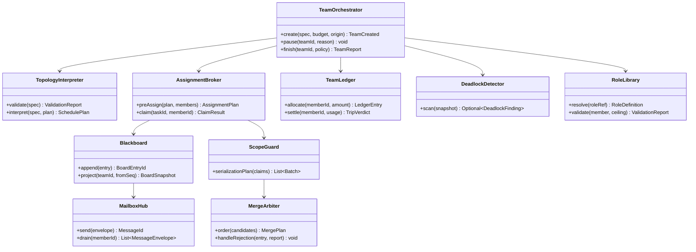
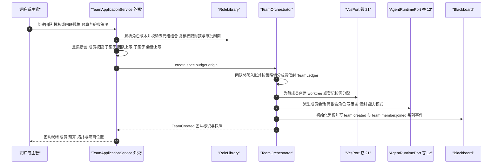
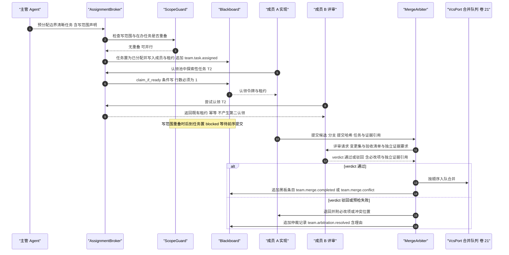
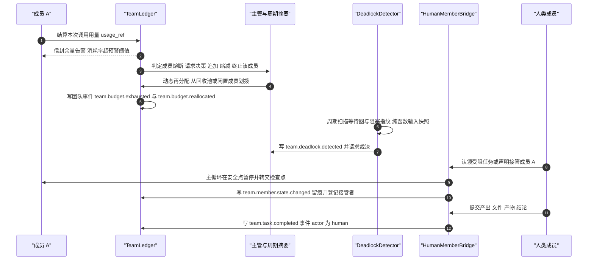
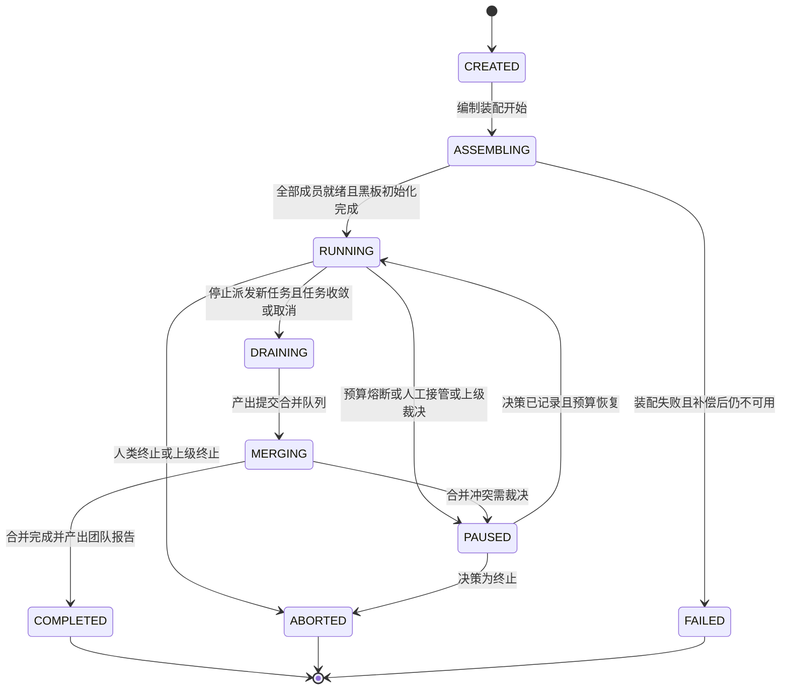
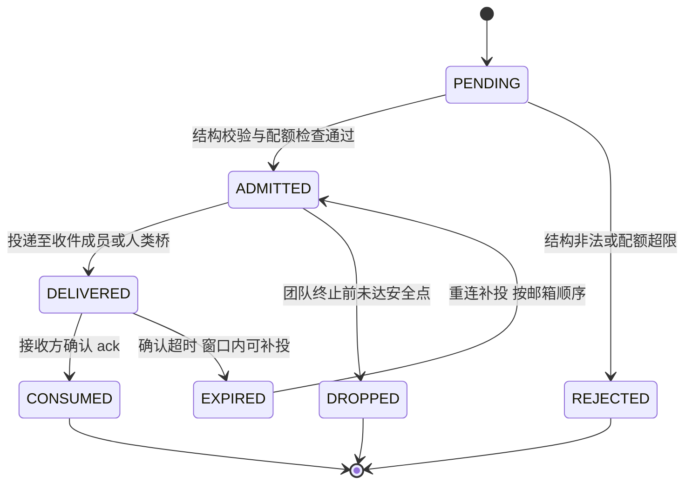

# C19 · TeamOrchestrator（Agent Teams 编排器）组件级实现方案

> 组件编号 C19 ｜ 附录 D 对应 **K-34 `TeamOrchestrator`（编制 / 拓扑 / 黑板 / 仲裁）**，类型=进程内服务，归属卷 13 ｜ 别名 TeamOrchestrator
> 上游系统方案：`impl/13-agent-teams-impl.md`（下称 impl/13）§1.1（范围）、§2（REQ-TEAM-01…18）、§3 D-TEAMI-1…8 与 I-TEAM-1…8、§4（架构）、§5（契约与枚举）、§6.1–6.4（时序）、§7（状态机）、§8.1–8.4（表 / Redis / 事件 / 指标）、§9（协议 / SPI / 配置）、§10.1–10.7（并发 / 降级 / 安全 / R05 贯通）、§11（DoD）
> Phase A 锚点：`docs/harness/13-agent-teams.md` D-TEAM-1…11；全局决策 H-001 / H-004 / H-005 / H-006 / H-008 / H-011 / H-019
> 竞品证据：DeepSeek agent-team「共享任务板 + 持久 mailbox」`[E1]`（`research/competitors/04-deepseek-harness.md` §4.9）；Claude Code 任务目录 + `claimTask` `[E1]`（`01-claude-code-purpose-built.md` §4.10）；Roo `ModeConfig.groups` 角色五元组 `[E1]`（`09-secondary-tier.md` §⑤ S4）；goose `subagent_handler.rs` 三语义与在途配额 `[E1]`（同文 §⑤ S13）；采纳台账 **L-010 / L-038 / L-039 / L-041 / L-043 / L-078**
> 编号口径：本文件为局部号段（`REQ-C-TEAM-1…11`、`I-C-TEAM-1…4`、`R-C19-1…3`、`X-C19-1…2`），须由编排方并入 `IMPL-DECISIONS.md` 后统一重编号（台账当前止于 X-82，R07 的 X-83…X-89 待并入）；`I-TEAM-1…8` 选定分支**不回退、不重开**
> 实现落点（卷 27 §4.1 权威名）：`harness-contract`（`contract/team`）+ `harness-kernel/kernel-agent`（`team` 子包，零框架）+ `harness-platform/platform-persistence`（团队表与消息）+ `harness-platform/platform-vcs`（worktree 与合并队列）+ `harness-host/host-app`（事务边界）+ `harness-host/host-protocol`（三视图 WS 帧）；纪律：本文件不推翻 impl/13，凡与系统级方案冲突或存在缺口之处一律在 §⑨「修订建议登记」，不回改上游文件。

---

## ① 定位与边界

**一句话职责**：把一份**声明式团队规格**（编制 + 拓扑 + 预算 + 验收策略）变为一支可调度、可隔离、可熔断、可被人接管的成员群，并保证「任何对外可见的团队状态都能仅凭黑板 + 团队事件流重建」。

**做什么**：① 编制装配（角色五元组解析、权限差集断言、成员派生、worktree 隔离）；② 拓扑解释与调度（六类拓扑与混合，节点映射计划任务、并行窗口、汇聚与裁决点）；③ 分配与认领（主管预分配 + 任务池 CAS 认领 + 租约 + 写范围声明）；④ 黑板事实源（只追加、团队内 `seq` 单调、五类条目）；⑤ 消息与邮箱（七类结构消息、三语义投递、在途配额、掉线补投）；⑥ 合并仲裁（合入排序、预检退回、语义冲突裁决、人工接管）；⑦ 账本与熔断（团队总额 → 成员信封 → 回收 → 双层熔断）；⑧ 死锁与饥饿检测（等待图环 + 阻塞指纹 + 超时兜底）；⑨ 三视图投影与主管摘要。

| 不解决 | 归属 | 边界说明 |
| --- | --- | --- |
| WorkItem 四层模型与七态状态机 | C20 WorkItemEngine / impl/14 | 黑板上的任务是对 `oc_work_item` 的**团队作用域视图**，不复制任务状态（impl/13 §1.3） |
| 单 Agent 主循环 / 回合 / 检查点 | C02 AgentLoop / impl/12 | 团队只调用 `AgentRuntimePort` 的「派生成员 / 提交输入 / 取消」三类原语 |
| worktree 与合并队列的物理执行 | 卷 21 `platform-vcs` | 团队只做写范围声明、串行化决策、合并排序与退回；**禁止团队侧自行 merge** |
| 跨实例对等协作 / Goal 自治循环 | 卷 23 A2A / 卷 15 | 跨实例成员由 `RemoteMemberProviderSPI` 承载且能力声明与本地同构；团队可被 Goal 轮次驱动，但不做 Goal 终止判定 |
| 权限判定链与审批执行 | 卷 06 | 本组件只做**差集断言与能力封顶**，不实现第二套决策链 |

| 方向 | 依赖对象 | 接口 / 契约 | 失败语义 |
| --- | --- | --- | --- |
| 上游 | Agent 运行时（C02 / impl/12） | `AgentRuntimePort.spawn / submit / cancel` | 成员派生失败**不静默减员**：`JOINING → FAILED` 并请求决策 |
| 上游 | 任务引擎（C20 / impl/14） | `WorkItemPort.requireById / transition / attachEvidence` | 任务不可达 → 拒绝分配；已认领任务保留租约等待回收 |
| 上游 | 权限（卷 06）/ 事件（卷 16）/ 持久化（卷 19）/ VCS（卷 21）/ 计量（卷 31） | `PermissionPort.ceilingOf / modeOf`；`EventPort.append`（分区键 = `teamId`）；`TeamStore` / `VcsPort` / `UsageAttributionPort.attribute(teamId, memberId, taskId)` | 事件追加失败即拒绝写路径；VCS 不可用 → 全局写范围互斥降级；账本不可用 → 全员冻结（fail-closed） |
| 下游 | Goal（卷 15）、端与交互（卷 22/33）、评测（卷 26） | 轮次驱动；三视图 WS 帧与接管入口；团队轨迹导出 | 帧丢失按 `lastSeq` 补齐；导出只读，不影响在线调度 |

**边界口径**：`TeamOrchestrator` ≡ impl/13 §1.4 的九类内核主干（`TopologyInterpreter` / `AssignmentBroker` / `Blackboard` / `MailboxHub` / `TeamLedger` / `ScopeGuard` / `MergeArbiter` / `DeadlockDetector` / `TeamViewProjector`）+ `RoleLibrary` + `HumanMemberBridge`；**不新增表**（`oc_team*` 表族已在 impl/13 §8.1 冻结）、**不新增事件命名族**（仅按 §⑨ 补登）。`kernel-agent/team` 不得依赖 Spring / Jackson / JDBC / HTTP 客户端（卷 27 R1）；三视图只做投影计算，渲染在端。

---

## ② 组件需求清单（REQ-C-TEAM-1…11）

| REQ | 需求描述 | 来源 | 优先级 | 验收要点 |
| --- | --- | --- | --- | --- |
| REQ-C-TEAM-1 | 声明式编制 + 角色库五元组：角色 = 提示词角色 + 工具组 + 文件正则 + **能力模式** + 审批剖面；内置 / 组织 / 项目三级来源与版本化 | impl/13 §2 REQ-TEAM-01、§3 D-TEAMI-8；**L-010** `[E1]`（Roo `ModeConfig.groups`）；**L-078** `[E1]` | P0 | 同目标换角色库产出不同编制；角色版本可回滚；非法组合（如 `EXECUTE` + 受保护文件可写）装配期拒绝 |
| REQ-C-TEAM-2 | 六类拓扑（扇出 / 主管 / 评审 / 竞标 / 流水线 / 自由市场）可声明、可混合、可校验（含环拒绝） | impl/13 §2 REQ-TEAM-02、§3 I-TEAM-1、§5 `TopologySpec` | P0 | 六拓扑各一条端到端用例；混合拓扑（主管 + 扇出 + 高风险辩论）一条；含环规格被拒并给环路径 |
| REQ-C-TEAM-3 | 分配协议：主管预分配边界清晰任务 + 任务池认领（**条件写 + 租约 + 写范围声明**）；认领登记防重复且幂等返回既有租约 | impl/13 §2 REQ-TEAM-03、§3 D-TEAMI-2；Claude Code `claimTask` `[E1]`（`01` §4.10） | P0 | 16 成员抢 1 任务恰 1 次成功；重复认领返回既有租约；`updated != 1` 不视为错误 |
| REQ-C-TEAM-4 | 黑板为唯一事实源（计划 / 任务 / 证据 / 裁决 / 阻塞五类，**只追加**、团队内 `seq` 单调、读模型由事件投影）+ 七类结构消息与三语义投递（`INTERJECT` / `STEER` / `QUEUE`）+ 在途配额与掉线补投 | impl/13 §2 REQ-TEAM-04/05、§8.1、§10.7、§3 D-TEAMI-5；deepseek agent-team `[E1]`（`04` §4.9）、**L-041** `[E1]`（goose `subagent_handler.rs`） | P0 | 主管崩溃仅凭黑板恢复；黑板与事件重放双向一致；结构校验拒绝自由文本；配额打满按语义降级；重连不重复不丢 |
| REQ-C-TEAM-5 | 隔离与合并仲裁：worktree 前置 + 写范围重叠串行化 + 合并队列串行 + 冲突退回（**不强行覆盖**） | impl/13 §2 REQ-TEAM-06、§3 D-TEAMI-3；卷 21 D-GIT-5 | P0 | 同文件并行任务被串行化；预检失败产退回报告；同 `commit_sha` 去重 |
| REQ-C-TEAM-6 | 双层预算熔断：团队总额 + 成员信封 + 完成 / 闲置回收；成员熔断暂停请求决策，团队熔断整体暂停汇报 | impl/13 §2 REQ-TEAM-07、§3 D-TEAMI-4、§10.1 | P0 | 单成员超限不影响他人；团队超限整体暂停并产成本瀑布；账本不可用即 fail-closed |
| REQ-C-TEAM-7 | 三视图（拓扑 / 时间线 / 成本瀑布）+ 主管周期摘要：服务端纯函数投影 + 差量推送；摘要可中止且失败降级 | impl/13 §2 REQ-TEAM-08、§3 D-TEAMI-7、§9.1 `team.view` | P0 | 三视图与事件重放逐字段一致；摘要在 `summary-interval-seconds` 内产出 |
| REQ-C-TEAM-8 | 人机混合与接管：人类成员可认领、提交产出、裁决、接管；人类任务有 SLA 与超时转派；事件与审计同构 | impl/13 §2 REQ-TEAM-09、§6.4、§10.7 | P0 | 人类动作在事件中 `actor=human` 可追溯；接管期间成员冻结且结束后可恢复 |
| REQ-C-TEAM-9 | 权限封顶与差集断言（成员 ⊆ 团队 ⊆ 会话，三处执行、**不是可配开关**）叠加能力模式由**角色定义**声明、模型不可自选；缺失能力响亮拒绝（`UNSUPPORTED_CAPABILITY` + `alternatives`） | impl/13 §2 REQ-TEAM-11/12/13、§3 D-TEAMI-8；**L-039** `[E1]`（`02-opencode.md` §4.8 `subagent-permissions.ts:20-27`）、**L-038** `[E2]`/`[E1]`（`04` §4.9）；卷 12 D-AG-13 | P0 | 越权装配被拒并写 `team.permission.denied`；模型请求提权被拒；能力缺失无 accept-then-ignore；CI 常驻不变式用例 |
| REQ-C-TEAM-10 | 死锁与饥饿检测三层：等待图环 + 阻塞指纹周期扫描 + 超时兜底；检出后主管裁决或升级人类 | impl/13 §2 REQ-TEAM-16、§10.1（精确算法，可证伪）；L-044 思想迁移 | P0 | 双成员环必检出且环路径与图一致；指纹 2 轮不变**不得**误报（第 3 轮才检出）；误报率 ≤ 5% |
| REQ-C-TEAM-11 | 汇报独立验证：verifier 不得与被验证成员共享上下文；`verdict` 必须含独立证据引用，否则任务不可置 `done` | impl/13 §2 REQ-TEAM-15、§9.2 `TeamReportVerifierSPI`；**L-043** `[E1]`（`04` §4.9 ralph 反面教材） | P0 | 自证 `verdict` 被拒；verifier 上下文隔离用例；缺独立证据的报告被驳回 |

本表是 impl/13 §②（`REQ-TEAM-01…18`）与 §6/§7/§10 的**组件级细化视图**（多对多映射），不新增系统级需求语义；与 impl/13 冲突时以后者为准并在 §⑨ 登记修订建议。

---

## ③ 关键设计决策（I-C-TEAM-n）

| ID | 维度 | 候选分支 | 选定 | 理由与代价 | 回退触发 |
| --- | --- | --- | --- | --- | --- |
| I-C-TEAM-1 | 拓扑调度承载 | B1 每类拓扑一份硬编码状态机；B2 拓扑即数据（规格 + 解释器 + 节点策略）；B3 自由脚本编排 | **B2**（与 I-TEAM-1 同源） | 六类 + 混合在同一主干可验收，新增拓扑零主干改动；代价是解释层承担组合校验、环检测与并行窗口校验 | 混合拓扑表达不足 → 该拓扑注册自定义节点策略（仍走同一事件与审计契约），**不回退硬编码** |
| I-C-TEAM-2 | 认领 CAS 载体 | B1 先查后写；B2 进程内内存锁 + 队列；B3 `claim_if_ready` 条件写 + 部分唯一索引 + 幂等返回既有租约 | **B3**（与 I-TEAM-2 同源） | 正确性锚点是行数校验（`updated == 1`）；L-041 型竞品行为：重复认领返回既有租约；代价是竞争需重试语义 | 认领冲突率 > 20% → 提高主管预分配占比或引入分区排队（**不改回先查后写**） |
| I-C-TEAM-3 | 死锁检出后处置 | B1 检出即暂停；B2 分级（环立即暂停 / 指纹满 N 轮再暂停 / 超时升级）；B3 只告警不暂停 | **B2**（与 I-TEAM-6 同源） | 环是确定性缺陷、指纹与超时是概率信号；先告警留取证窗口，代价是扫描开销与状态分支 | 抽样误报率 > 5% → 指纹窗口加长或降级 `ALERT_ONLY`（开关落地见 R-C19-1） |
| I-C-TEAM-4 | 黑板写路径串行化 | B1 每成员直写靠唯一约束重试；B2 团队级短临界区 + `uk(team_id, seq)` 行级分配 + 只追加；B3 全量事件重建 | **B2**（与 impl/13 §10.1 同源） | 多成员并发写与 `seq` 重复收敛为一个短临界区，读走无锁投影（滞后以 `lastProjectedSeq` 暴露）；代价是单团队写吞吐上限 | 黑板写 P95 > 20ms → 临界区按 `entry_kind` 分片（**禁止先查 `max(seq)` 再写**） |

四条选定分支全部落在 impl/13 §3.2 `I-TEAM-1…8` 范围内，本表只把「候选 / 代价 / 回退」表达为组件级可执行形态；`I-TEAM-5`（消息）、`I-TEAM-7`（观测）、`I-TEAM-8`（权限）按上游选定执行，不重开比选。

---

## ④ 类图



**说明**：同包协作类 `TeamViewProjector`（三视图与摘要数据）与 `HumanMemberBridge`（人类成员桥，使人类与 Agent 在黑板与事件上完全同构，REQ-C-TEAM-9）为同一 `team` 子包内实现，图中不再展开；`DeadlockDetector.scan` 接收**纯快照**（`TeamWaitSnapshot`：等待边集 + 各成员当前任务与写范围 + 阻塞起始时刻 + 配置），纯函数——同一快照重复调用必须得到同一结果（可回放、可证伪，impl/13 §10.1）。以下为**契约面**签名（`harness-contract`，零框架；其余方法见 impl/13 §5.1，不重述；枚举 `TeamMessageType` / `DeliverySemantic` / `CapabilityMode` 与六类拓扑 record 同属 `contract.team`，`code` 存库、`desc` 仅展示）：

```java
/**
 * 团队编排器：团队生命周期的唯一入口。
 * 负责编制装配、拓扑驱动、成员派发与收尾汇总；实现必须保证「黑板是唯一事实源」，
 * 且任何对外可见的成员状态都可由团队事件流重建。
 */
public interface TeamOrchestrator {

    /**
     * 创建团队并完成编制装配（角色解析 → 差集断言 → 工作区隔离 → 预算切分 → 成员派生）。
     *
     * @param spec   团队规格（编制、拓扑、角色引用；必填，引用的角色必须存在于角色库）
     * @param budget 团队预算信封（必填，总额为正；成员配额按 TeamBudgetPolicySPI 切分）
     * @param origin 创建来源（人类 / 主管 Agent / 上级团队；用于责任链与审计）
     * @return 团队标识与初始快照
     * @throws HarnessException 角色不存在、编制组合非法、权限差集越界、预算不足或工作区不可用时抛出
     */
    TeamCreated create(TeamSpec spec, BudgetEnvelope budget, TeamOrigin origin);
}

/**
 * 分配代理：认领必须是「条件写 + 行数校验」；重复认领返回既有租约（幂等），禁止先查后写。
 */
public interface AssignmentBroker {

    /**
     * 成员认领黑板任务（探索性任务池路径）。
     *
     * @param taskId   任务标识（必填，须处于 ready 且无有效租约）
     * @param memberId 认领成员标识（必填，须属于该团队且状态空闲）
     * @return 认领结果（写范围快照、租约到期时间与认领方式）
     * @throws HarnessException 写范围与在办任务重叠（`CONFLICT`）或成员不属于该团队时抛出
     */
    ClaimResult claim(TaskId taskId, MemberId memberId);
}
```

---

## ⑤ 核心流程时序图

### 5.1 流程 A：团队装配与首个调度计划

**前置条件**：会话具备团队创建权限；`TeamSpec` 通过角色与组合校验；目标工作区可写；团队预算大于 0。
**主路径**：角色解析 → 差集断言 → 预算切分 → worktree 创建（或 `ON_DEMAND` 登记）→ 成员派生 → 黑板初始化 → 解释拓扑得 `SchedulePlan` → 写 `team.created` 系列事件。
**异常与补偿**：角色或组合校验失败 → **拒绝创建（不产生成员与 worktree）**；成员派生部分失败 → 回收已派生成员与其 worktree，团队保持 `CREATED` 并请求决策（不静默减员）。
**幂等与并发点**：`oc_team.idempotency_key` 唯一约束去重；重复创建返回既有团队快照，不重复派生成员。



### 5.2 流程 B：认领 CAS、写范围串行化与合并仲裁

**前置条件**：黑板已有任务视图；目标任务 `ready` 且依赖满足；成员空闲（含人类成员）；目标分支受护栏保护。
**主路径**：预分配或认领（条件写 + 租约）→ 写范围重叠检查 → 并行推进 → 独立评审 → 合入排序 → 拉基线重放 → 预检 → 合并完成。
**异常与补偿**：认领失败 → 业务异常提示刷新（重复认领幂等返回既有租约）；写范围重叠 → 串行化（后到任务置 `blocked`）或交主管拆分，**不静默抢占**；预检失败 → 退回报告（冲突位置与失败用例）并可重放。
**幂等与并发点**：`claim_if_ready` 行数必须为 1；合并队列按仓库串行（`RedisKeys.lock(Module.TEAM, "merge", repoId)`）；同 `commit_sha` 以 `uk(team_id, commit_sha)` 去重。



### 5.3 流程 C：死锁检出、双层熔断与人工接管

**前置条件**：团队处于 `RUNNING`；账本持续结算；死锁扫描按周期运行；编制内存在人类成员或已声明值日接管者。
**主路径**：结算触达预警线 → 成员熔断（安全点暂停 + 请求决策）→ 主管动态再分配 → 扫描命中环 / 指纹 / 超时 → 暂停并请求裁决 → 人类接管（冻结成员、转交检查点）。
**异常与补偿**：账本结算失败 → 冻结该成员（fail-closed，不允许继续消耗）；决策超时 → 默认取消该成员并回收预算；摘要生成失败 → 降级为统计摘要（不阻断团队收尾）。
**幂等与并发点**：熔断判定按成员串行（`lock(TEAM,"trip",memberId)`）；接管加锁（`lock(TEAM,"handover",memberId)`，见 R-C19-2），同一成员同时仅一个接管者；重复检出**不重复暂停、不重复写事件**（水位键 `teamDeadlockWatermark`）。



---

## ⑥ 状态机

### 6.1 团队生命周期



**迁移规则（实现为静态不可变表，非法迁移抛 `HarnessException(ErrorCode.CONFLICT, …)`，文案含当前态与期望态）**：

| 当前 | 目标 | 允许 | 前置条件与附加动作 |
| --- | --- | --- | --- |
| ASSEMBLING | RUNNING | 是 | 成员全部就绪、黑板初始化、预算分配完成；否则保持装配中并请求决策 |
| RUNNING | DRAINING / PAUSED | 是 | 停止新派发；或熔断 / 接管 / 裁决（安全点暂停并保留检查点） |
| PAUSED | RUNNING | 是 | 决策记录必须存在，否则拒绝（并发语义同 CAS） |
| PAUSED / MERGING | MERGING / COMPLETED | 否 / 是 | 必须先 `RUNNING → DRAINING`（防半途合入）；合并完成需队列为空且报告已产出 |
| 任意非终态 / COMPLETED | ABORTED / 任意 | 是 / 否 | 终止需人类或上级权限并级联回收；`COMPLETED` 为终态，续作须新建派生团队并引用前人报告 |

**成员状态机**沿用 impl/13 §7.2（`JOINING / IDLE / WORKING / BLOCKED / PAUSED / OFFLINE / LEFT / FAILED`）与级联取消路径，本文件不重述；两条硬规则：① 团队 `ABORTED` 时任意非终态成员按「取消在办任务 → 回收预算 → 释放或保留 worktree → `LEFT`」强制收敛；② `OFFLINE` 期间的认领租约**不立即抢占**，等到期回收（防抖动），重连重试超上限（默认 3 次）后 `OFFLINE → LEFT` 并交回收任务。

### 6.2 消息投递状态（持久邮箱）



**不变量**：① 同一 `messageId` 任一时刻只处于一个状态（唯一索引 + 迁移 CAS）；② `INTERJECT` 仅人类与主管可用且须过权限判定，失败降级 `STEER` 并记事件；③ 配额打满时 `STEER` 降级为 `QUEUE`（语义优先级硬编码，不做配置化）；④ `DROPPED` 行保留供审计，不物理删除。

---

## ⑦ 接口与依赖矩阵

| 面 | 方法 / 端点 | 关键入参 | 出参 | 错误码 |
| --- | --- | --- | --- | --- |
| 内核契约 | `create(spec, budget, origin)` / `snapshot(teamId)` | 团队规格、预算信封、来源 | `TeamCreated` / `TeamSnapshot` | `INVALID_ARGUMENT`、`NOT_FOUND`、`PERMISSION_DENIED` |
| 内核契约 | `claim(taskId, memberId)` / `preAssign(plan, members)` | 任务、成员、写范围声明 | `ClaimResult` / `AssignmentPlan` | `CONFLICT`、`UNSUPPORTED_CAPABILITY` |
| 内核契约 | `settle(memberId, usage)` / `reclaim(memberId)` / `scan(snapshot)` | 用量归因；等待图快照 | `TripVerdict` / `Money` / `DeadlockFinding` | `BUDGET_EXHAUSTED`、`DEPENDENCY_UNAVAILABLE`（`scan` 为纯函数，无 IO 错误面） |
| 会话 JSON-RPC | `team.create` / `team.claim` / `team.assign` / `team.message` | 见 impl/13 §9.1 协议表 | 快照 / 认领结果 / 消息回执 | `CONFLICT`、`RATE_LIMITED`、`INVALID_ARGUMENT` |
| 会话 JSON-RPC | `team.verdict` / `team.arbitrate` / `team.escalate` / `team.view` / `team.pause` / `team.abort` / `team.merge`；管理 REST `/api/v1/team-templates`、`/team-roles`、`/teams/{id}/handover` | 裁决与升级载荷；`teamId` 与视图 / 理由 | 裁决记录 / 受理回执 / 视图快照 / 新状态 / 合并条目 / 只读投影 | `PERMISSION_DENIED`（自证 / 非主管）、`NOT_FOUND`、`CONFLICT`、`GIT_CONFLICT` |

| SPI 扩展点 | 职责 | 关键约束 |
| --- | --- | --- |
| `RoleLibrarySPI` | 角色库来源（内置 / 组织 / 项目） | 必须返回版本化角色；解析失败 fail-fast |
| `TopologySPI` | 自定义编排拓扑 | 必须提供 `validate`（环检测）与节点策略；不得绕过黑板 |
| `AssignmentStrategySPI` / `TeamBudgetPolicySPI` | 分配与竞标出价策略；预算切分、回收与熔断阈值策略 | 只能操作 `AssignmentBroker` 契约；阈值来自 `TeamProperties`，不得硬编码 |
| `TeamReportVerifierSPI` | 团队报告独立验证器（**L-043**） | 必须使用与被验证者**隔离的上下文**；缺独立证据即驳回（判据见 R-C19-3） |
| `RemoteMemberProviderSPI` | 跨实例成员（A2A，卷 23） | 能力声明与本地成员同构；缺失能力响亮拒绝 |

| 配置项（`open-coding.team.*`，全部入 `TeamProperties`，纯数据类不加 `@Component`） | 默认值 | 影响面 |
| --- | --- | --- |
| `member-max` / `team-max-per-instance` | `16` / `20` | 团队规模与实例容量上限（NFR-C-4） |
| `claim-lease-seconds` / `member-idle-reclaim-seconds` / `budget-warn-ratio` | `900` / `600` / `0.8` | 认领租约、闲置回收阈值与双层预警线 |
| `message-inflight-quota` / `message-ack-timeout-seconds` | `32` / `120` | 在途配额（**L-041**）与确认超时 |
| `workspace-mode` / `merge-strategy` | `ON_DEMAND` / `SQUASH` | worktree 创建时机与合并策略 |
| `review-quorum` / `market-max-bids` | `1`（高风险节点覆盖 `2`）/ `3` | 评审法定票数与竞标出价上限 |
| `deadlock-scan-interval-seconds` / `deadlock-fingerprint-rounds` | `60` / `3` | 扫描周期与指纹轮数（**R-C19-1** 拟增 `deadlock-mode`） |
| `human-task-sla-seconds` / `summary-interval-seconds` / `escalation-target` / `interject-allowlist` | `3600` / `600` / `LEAD_HUMAN` / `HUMAN,LEADER` | 人类任务 SLA、摘要周期、默认升级目标与 `INTERJECT` 允许者（最小权限） |

全部变量以 `${ENV_VAR:default}` 声明并同步 `.env.example`；`team-max-per-instance` / `workspace-mode` / `merge-strategy` 在 `@PostConstruct` 校验枚举合法性（Fail-Fast）。

| 数据 | 表 / Key / 事件 | 说明 |
| --- | --- | --- |
| 黑板 / 账本 | `oc_team_board_entry`（`uk(team_id, seq)`，**只追加**，团队调度唯一事实源）；`oc_team_budget_ledger`（`uk(member_id, usage_ref) where direction='SETTLE'`，结算幂等；批次边界见 X-C19-1）；认领与合并的约束承载：`oc_team_claim`（部分唯一 ACTIVE）、`oc_team_merge_entry`（`uk(team_id, commit_sha)`） | 纠错以新条目表达；账本与事件同事务 |
| Redis | `lock(TEAM, board / claim / merge / trip / handover, …)`、`teamMemberHeartbeat(memberId)`、`counter(TEAM, "inflight", sender, recipient)` | 正确性锚点在 DB，Redis 只做加速与互斥（全丢不影响正确性；配额按未确认行数重建） |
| 事件 | `team.created` / `team.member.*` / `team.task.*` / `team.budget.*` / `team.merge.*` / `team.deadlock.detected` / `team.permission.denied` / `team.message.rejected` | 分区键 = `teamId`，团队内 `seq` 单调且**不与其他分区比较**（impl/13 §8.3；补登见 X-C19-2） |

---

## ⑧ 关键算法

### 8.1 算法 A：拓扑解释与调度派发（含并行窗口校验）

① `validate`：节点集与边集非空、边集构成 DAG（DFS 三色标记，检出环即返回**完整环路径**）、每节点映射计划内唯一任务、角色引用可解析、`maxParallel ≤ member-max`；② `interpret`：按拓扑序 + 节点优先级 + 创建时间平局得**确定性**派发序（同输入同结果，可回放），主管节点先于工作者，评审节点 `quorum` 取配置（高风险覆盖 `2`）；③ 派发前 `ScopeGuard` 过滤并行集合，重叠任务进下一批次（串行化）而非抢占。核心不变式：**并行窗口 = `min(spec.maxParallel, member-max)`，小于 1 即规格非法**——抛 `HarnessException(ErrorCode.INVALID_ARGUMENT, …)` 而非静默串行（静默串行会掩盖配置错误）。**复杂度** O(V+E)；**边界条件**：空拓扑、自环（成员等待自己持有的写范围）、跨计划依赖、并行窗口超限四类逐条拒绝并给可读原因。

### 8.2 算法 B：认领 CAS 与写范围串行化

① 幂等短路：按 `(team_id, task_id)` 查 `ACTIVE` 认领，命中即返回既有租约（不新建）；② 写范围校验：`write_scope` 与在办任务交集非空 → 该任务置 `blocked`（原因 = 写范围等待）并进串行批次；③ 条件写（团队意图，落库语句由 `platform-persistence` 承载）：`where team_id=? and task_id=? and state='READY'` 更新为 `ACTIVE`，**行数必须为 1**；④ 行数为 0 且存在 `ACTIVE` 行 → 幂等分支返回既有租约，否则抛 `CONFLICT`（提示刷新，可即时重试一次）；⑤ 租约到期由扫描回收（`team.claim.expired`），任务回 `ready` 且**保留阻塞历史**。**复杂度** O(1) 索引写 + O(k) 串行批次规划。

### 8.3 算法 C：等待图死锁检测（精确、可证伪）

- **输入 / 输出**：输入 `TeamWaitSnapshot`——等待图 `G=(成员, 等待边)`（等待边 = 成员 M 处于 `BLOCKED` 且其阻塞源当前被成员 N 持有；含各成员当前任务与写范围、各边阻塞起始时刻、`now` 与配置）；输出 `Optional<DeadlockFinding{kind ∈ {CYCLE, FINGERPRINT_STALL, STARVATION}, cyclePath, fingerprint, stableRounds, since}>`。纯函数、无 IO，同一快照重复调用结果一致。
- **判定规则**（三者任一命中即检出，写 `team.deadlock.detected` 并请求裁决）：① **环**——`G` 中存在长度 ≥ 2 的环（含自环），检出即暂停（确定性缺陷）；② **指纹**——`FP = SHA-256(排序后的等待边集合 + 各成员当前任务与写范围)`，连续 `deadlock-fingerprint-rounds`（默认 `3`）轮 `FP` 不变且 `G` 非空 → 判定停滞死锁；③ **超时兜底**——阻塞时长 > `claim-lease-seconds`（默认 `900s`）或人类任务 SLA（默认 `3600s`）→ 判定饥饿并升级。
- **可证伪判据**：双成员环必检出且环路径与图一致；`FP` 连续 2 轮不变**不得**检出；短暂 GC 造成的假阻塞在观察窗口内不得误报（抽样误报率 ≤ 5%，超限按 I-C-TEAM-3 回退）。

### 8.4 算法 D：双层预算熔断（可复算，fail-closed）

成员信封 `E`、已结算消耗 `C`、预警线 = `budget-warn-ratio × E`（默认 `0.8`）。① `C ≥ 预警线` → 发 `BUDGET_ALERT` 消息；② `C ≥ E` → 在 `lock(TEAM,"trip",memberId)` 内串行判定并置成员 `PAUSED`，写 `team.budget.exhausted(scope=member)` 并请求决策（追加 / 缩减 / 终止）；③ 团队总额同理（`scope=team`），命中即整体 `PAUSED` 并产出成本瀑布。**恢复判定**：`RECLAIM` 或追加后必须按**新余额重新评估**并解除暂停（回冲后仍 `PAUSED` 判为缺陷）；**fail-closed 断言**：账本不可用期间出现任何一次成功结算即判为缺陷（禁止无账本消耗）。

---

## ⑨ 错误处理与降级

内核与契约侧统一抛 `HarnessException(ErrorCode, 中文文案)`，外壳侧抛 `BusinessException`（同携带 `ErrorCode`），由全局异常处理器按码映射；**禁止裸抛 `RuntimeException` / `IllegalArgumentException`**。

| 错误场景 | ErrorCode | retryable | 处理动作 | 用户可见文案（要点） |
| --- | --- | --- | --- | --- |
| 规格非法（角色名 / 拓扑 / 写范围格式 / 未知枚举 code）；对象不存在（团队 / 角色 / 模板 / 任务） | `INVALID_ARGUMENT` / `NOT_FOUND` | 否 | 拒绝装配或拒绝访问，附字段与对象定位 | 「团队规格非法：`<field>`」/「团队或角色不存在：`<id>`」 |
| 认领竞争失败、非法状态迁移、写范围重叠、幂等键载荷不一致；合并冲突或受保护分支 | `CONFLICT` / `GIT_CONFLICT` / `GIT_PROTECTED_BRANCH` | 否（认领可即时重试一次） | 返回既有租约或提示刷新；合并退回并附报告（**禁止强行覆盖**） | 「任务已被认领，请刷新后重试」/「合并预检失败，已退回：`<report>`」 |
| 越权操作（非主管仲裁、自证裁决、策略被绕过）/ 能力缺失（成员或远端不支持声明能力模式） | `PERMISSION_DENIED` / `UNSUPPORTED_CAPABILITY` | 否 | 拒绝并写 `team.permission.denied` 审计；能力缺失按 `alternatives` **显式**降级或拒绝 | 「当前角色无权执行该操作」/「不支持能力 `<capability>`，可选：`<alternatives>`」 |
| 消息在途配额打满、升级频次超限 | `RATE_LIMITED` | 是（`Retry-After`） | `STEER` 降级 `QUEUE` 并记事件 | 「消息配额已满，已改为排队投递」 |
| `platform-vcs` / 账本 / 事件存储不可用 | `DEPENDENCY_UNAVAILABLE` | 是 | 按降级阶梯处置；账本不可用即全员冻结 | 「依赖暂不可用，团队已降级运行」 |
| 跨实例成员跳数超限 | `A2A_DEPTH_EXCEEDED` | 否 | 改本地成员或拆两级团队 | 「跨实例协作层级超限，已拒绝」 |

**降级阶梯（由轻到重，任一级触发即写事件并告警）**：① **消息降级** `INTERJECT → STEER → QUEUE`；② **隔离降级** worktree 不可用 → 全局写范围互斥（显式提示「已降级，不保证隔离」）；③ **调度降级** 主管崩溃 → 凭黑板快照重建（短窗 `PAUSED` 不接受新认领）；④ **记账降级** 账本不可用 → 全员冻结（fail-closed）；⑤ **形态降级** 团队整体不可用 → 按 H-011 回退单 Agent + SubAgent（任务与黑板上下文不丢失）；⑥ **终止** 人类终止（`ABORTED`）保留 worktree 分支供审计。

**修订建议登记（待编排方并入 `IMPL-DECISIONS.md` §4 并分配正式编号）**

| 编号（待并号） | 缺口 / 冲突 | 证据 | 建议修订 |
| --- | --- | --- | --- |
| `R-C19-1` | 死锁误报回落形态无承载：I-TEAM-6 回退触发为「只告警不暂停」，但 `TeamProperties`（impl/13 §9.3）无该开关，事件族也只有 `team.deadlock.detected` 一条 | 本文件 §③、§⑧.3；impl/13 §9.3 | `TeamProperties` 增补 `deadlock-mode`（`PAUSE` / `ALERT_ONLY`，默认 `PAUSE`）并同步 `.env.example`；`ALERT_ONLY` 只写事件不暂停，指标补 `oc_team_deadlock_detected_total{mode}` |
| `R-C19-2` | 人工接管锁缺 Key 登记：impl/13 §10.7 表-2 使用 `lock(TEAM,"handover",memberId)`，但 §8.2 Redis Key 表未登记该 Key 与 TTL | 本文件 §⑤.3、§⑦；impl/13 §8.2 | §8.2 补登该 Key，租约 `300s` 且有看门狗续约，并纳入团队定向删除清单 |
| `R-C19-3` | verifier 独立性缺可判定判据：REQ-TEAM-15 要求「verifier 不得与被验证成员共享上下文」，未定义判据、落库位置与拒绝错误码 | 本文件 §② REQ-C-TEAM-11；**L-043** | 明确判据三元组：verifier 成员 ≠ 产出成员；verifier 子会话上下文不含被验证者对话历史；`verdict` 至少含 1 条独立证据引用。自证请求以 `PERMISSION_DENIED` 拒绝并写 `team.arbitration.resolved` |
| `X-C19-1` | `oc_team_budget_ledger` 批次边界（团队账本随 B4、企业配额汇总随 B6）已在 impl/13 落地核对块登记，R07 已复核；本文件不另立口径 | impl/13 §落地核对；`reviews/R07-scope-build-kernel.md` | 待台账并号；B4 脚本冻结时必须同时落地 `uk(member_id, usage_ref) where direction='SETTLE'` 结算幂等约束 |
| `X-C19-2` | 消息全生命周期事件缺三条：impl/13 §7.2 定义 `PENDING→ADMITTED→DELIVERED→CONSUMED`（含 `EXPIRED`/`DROPPED`），§8.3 事件清单只有 `team.message.sent` / `rejected` | impl/13 §7.2 / §8.3 | 补 `team.message.delivered` / `consumed` / `expired` 三条；掉线补投与配额重建的可观测性依赖它们；待台账并号 |

---

## ⑩ 性能与并发

| 指标 | 预算 | 说明 |
| --- | --- | --- |
| 黑板操作 / 消息投递 / 调度开销 | ≤ 20ms / ≤ 100ms / ≤ 5ms P95 | 黑板单团队单写者串行（超限按 I-C-TEAM-4 分片）；`STEER` 至安全点入队；调度开销在 16 成员 × 20 团队压测下测量 |
| 规模 / 容量 / 合并队列 | 16 成员 / 团队；20 团队 / 实例；合并 ≥ 10 次/分钟/仓库；`EAGER` worktree ≤ 2s/个 | NFR-C-4；320 个成员会话（虚拟线程栈按 1MB 预留 ≈ 320MB），常驻内存目标 ≤ 1.5GB；worktree 并发 ≤ 8 个/团队且受 `git.worktree.max-per-repo`（默认 `20`）钳制 |
| 摘要生成 / 死锁扫描 | 摘要 ≤ 60s P95 且可中止 | 扫描周期 `60s`，低频执行、不在成员热路径 |

**并发模型**：每成员一个虚拟线程驱动其回合（继承卷 12 模型）；团队主干（黑板、账本、仲裁）**单写者串行**，写路径经 `lock(TEAM,"board",teamId)` 短临界区 + 团队内事件 `seq` 单调；读走无锁投影并以 `lastProjectedSeq` 暴露滞后。**背压**：消息在途配额 + 成员并发上限双层；配额打满时 `STEER → QUEUE` 并记事件，**不丢消息**。

| 并发正确性要点 | 风险 | 控制 |
| --- | --- | --- |
| 黑板追加 | 多成员并发写、`seq` 重复 | 单写者串行 + `uk(team_id, seq)` 冲突重试分配；**禁止**先查 `max(seq)` 再写 |
| 认领 | 并发认领同一任务 | `claim_if_ready` 条件写 + 部分唯一索引；行数必须为 1；重复认领返回既有租约 |
| 预算结算 | 同 `usage_ref` 重复扣减 / 并发结算余额错 | 成员级串行锁 + 部分唯一索引；`balance_after` 由条件写计算，**禁止读改写** |
| 人工接管 / 死锁检出 | 多接管者并存；多实例重复扫描与重复暂停 | 接管锁 + `human_assignee_ref` 落库（否则审计出现「无主体决策」）；低频扫描 + 水位键，暂停动作幂等 |
| Redis 全丢 | 配额被清零绕过、心跳误判 | 配额按 `oc_team_message` 未确认行数重建；心跳缺失改以认领租约判定 `OFFLINE` |

---

## ⑪ 测试要点

| 层级 | 用例 | 断言要点 |
| --- | --- | --- |
| 单元 | `TopologyInterpreterTest` + `AssignmentBrokerTest`：拓扑校验与解释、含环拒绝、并行窗口超限；认领 CAS 幂等、租约回收、写范围串行化 | 每类拓扑一条；环路径完整；重复认领返回既有租约；`updated != 1` 走幂等或 `CONFLICT` |
| 单元 | `DeadlockDetectorTest` + `TeamLedgerTest` + `TeamLedgerIdempotencyTest`：环 / 指纹 / 超时可证伪反例；切分 / 回收 / 结算 / 回冲与双层熔断边界 | 双成员环必检出；`FP` 连续 2 轮不变不得检出（第 3 轮检出）；重复结算被唯一约束拒绝；账本不可用期间结算成功即失败 |
| 单元 | `RoleLibraryTest` + `MessageValidationTest`：组合合法性、能力模式只减不增、差集断言、七类载荷与三语义降级 | `MemberPerms ⊆ ParentDenySet`；非法组合拒绝；配额降级路径断言 |
| 集成 / 故障注入 | 四拓扑端到端；隔离与合并（串行化、预检退回、重放）；认领风暴（16 成员抢 1 任务）、掉线补投、预算熔断与人机接管；成员写 worktree 时 kill、主管派发中途 kill、合并队列执行中 kill、黑板写与事件落库之间 kill、Redis 全丢、并行团队域删除 | 事件序列完整；恰 1 次成功认领；重连不重复不丢；单成员超限不影响他人；租约到期回收；`team.task.assigned` 不重复派发；黑板与事件双向一致；配额重建不被绕过；删除贯通覆盖缓存与 worktree 清单 |
| 性能 | §⑩ 全部指标 | 达目标值；CI 门禁失败即阻断合并 |

```bash
mvn -pl harness-kernel/kernel-agent -am test            # 单元（无 IO，含拓扑与死锁检测）
mvn -pl harness-platform/platform-persistence -am test  # 集成（PG/Redis 容器，团队表与消息）
mvn -pl harness-platform/platform-vcs -am test          # worktree 与合并队列
./scripts/ci/team-gate.sh                               # 四拓扑 + 隔离合并 + 熔断 + 死锁 + 接管矩阵
./scripts/ci/team-fault-inject.sh --case member-kill-during-write,leader-kill-mid-dispatch,claim-storm-16x1
mvn -pl harness-host/host-protocol -am test             # team.* 协议契约
```

**DoD（impl/13 §11.5 的组件切片）**：六类拓扑可声明且四类有端到端用例 ｜ 黑板为唯一事实源且主管崩溃可恢复 ｜ 认领 CAS 无重复且幂等 ｜ 双层熔断与 fail-closed 断言通过 ｜ 死锁三层生效且误报率 ≤ 5% ｜ 权限封顶与「能力模式不可模型自选」两条不变量有 CI 常驻用例 ｜ 汇报独立验证（**L-043**）落地 ｜ 阈值全部入 `TeamProperties` 并同步 `.env.example` ｜ 内核零框架依赖（Enforcer R1）通过。
