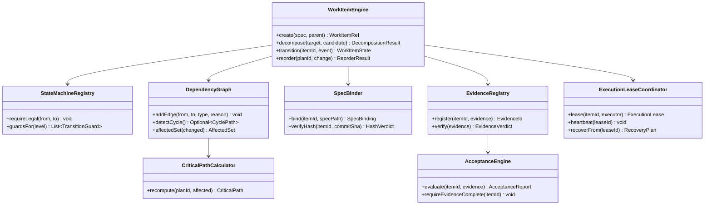
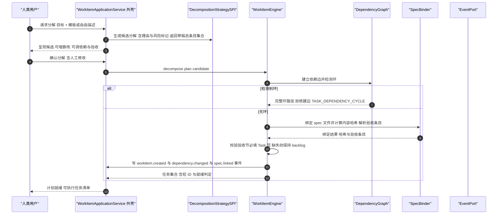
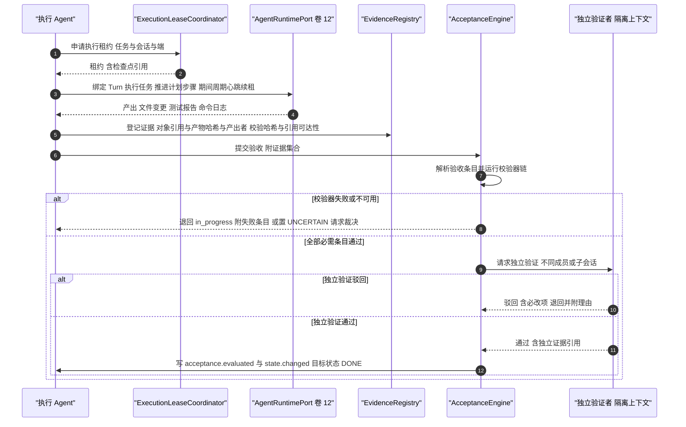
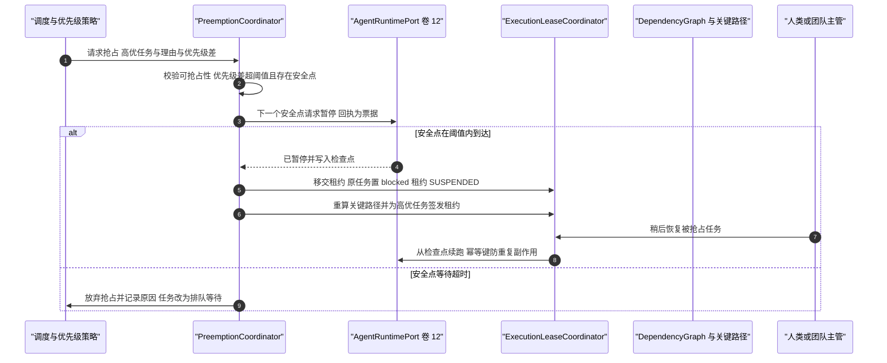
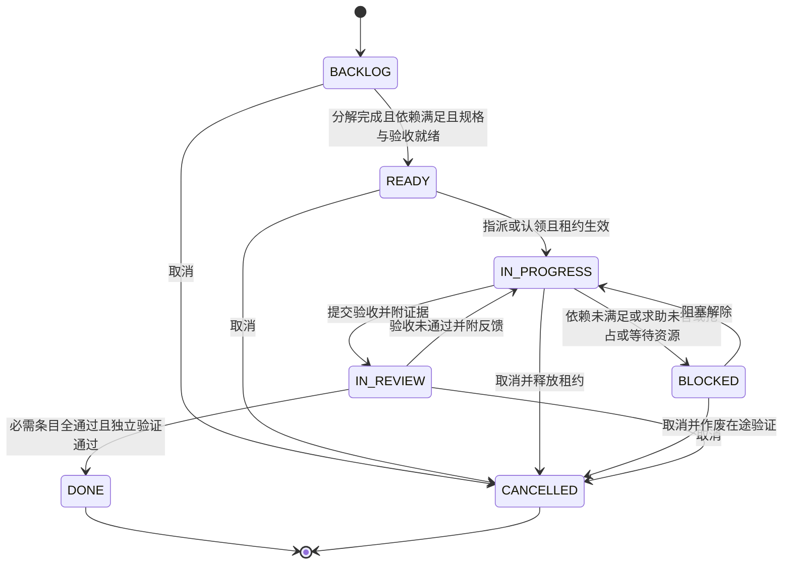
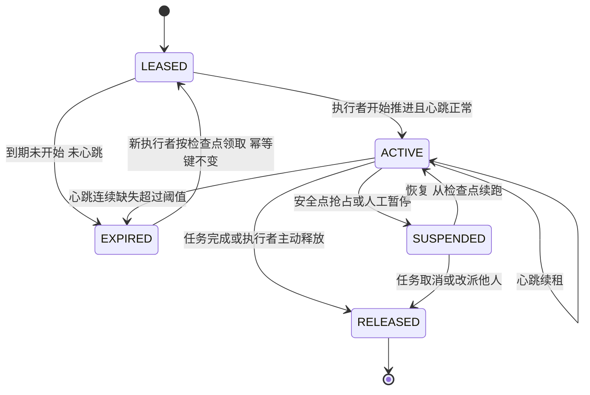

# C20 · WorkItemEngine（任务引擎：四层模型 / 七态状态机 / DAG / 证据验收）组件级实现方案

> 组件编号 C20 ｜ 附录 D 对应 **K-32 `WorkItemEngine + DependencyScheduler`（四层模型 + DAG）**，类型=进程内服务，归属卷 14 ｜ 别名 WorkItemEngine
> 上游系统方案：`impl/14-task-plan-engine-impl.md`（下称 impl/14）§1.1（范围）、§2（REQ-TASK-01…18）、§3 D-TASKI-1…8 与 I-TASK-1…8、§4（架构）、§5（契约与枚举）、§6.1–6.4（时序）、§7（七态与租约状态机）、§8.1–8.4（表 / Redis / 事件 / 指标）、§9（协议 / SPI / 配置）、§10.1–10.7（并发 / 性能 / 降级 / R05）、§11（DoD）
> Phase A 锚点：`docs/harness/14-task-and-plan.md` D-TASK-1…12；全局决策 H-005 / H-006 / H-008 / H-011 / H-019
> 竞品证据：Qoder 四段 Spec + 验收标准必填节 `[E2]`（`research/competitors/07-qoder.md` §8-2）；Gemini CLI plan mode `[E1]`（`08-gemini-cli.md` §⑧ G13）；DeepSeek `todo_write` 整表替换 / last-write-wins 反面 `[E1]`（`04-deepseek-harness.md` §4.10）与「报告未被独立验证」反面（同文 §4.9）；opencode `SessionRunCoordinator` 同会话 join 与 drain（仅进程内）`[E1]`（`02-opencode.md` §1、§4.12）；各家完成信号双口径 submit / attempt_completion / final_output_tool `[E1]`（`09-secondary-tier.md` §④.1-6）；采纳台账 **L-042 / L-043 / L-047 / L-076**
> 编号口径：本文件为局部号段（`REQ-C-WIE-1…9`、`I-C-WIE-1…5`、`R-C20-1…3`、`X-C20-1…2`），须由编排方并入 `IMPL-DECISIONS.md` 后统一重编号（台账当前止于 X-82，R07 的 X-83…X-89 待并入）；`I-TASK-1…8` 选定分支**不回退、不重开**
> 实现落点（卷 27 §4.1 权威名）：`harness-contract`（`contract/work`）+ `harness-kernel/kernel-work`（引擎主干，零框架）+ `harness-platform/platform-persistence`（实例化 Store / 投影 / 对账 `@Scheduled`）+ `harness-host/host-app`（事务边界）+ `harness-host/host-protocol`（`task.*` 与投影帧）；纪律：本文件不推翻 impl/14，凡与系统级方案冲突或存在缺口之处一律在 §⑨「修订建议登记」，不回改上游文件。

---

## ① 定位与边界

**一句话职责**：把「干活」变成**可描述、可拆解、可排序、可追踪、可验收、可恢复**的持久工作对象树，并让任意一次状态推进都可由事件流重建与对账。

**做什么**：① 四层统一模型（Goal / Plan / Task / Step 同源建模、递归分解、人机协同）；② 七态状态机（`backlog → ready → in_progress → blocked → in_review → done / cancelled`，迁移守卫 + 理由强制）；③ DAG 依赖与关键路径（`finish_to_start` / `artifact` / `decision`，环检测、受影响集、增量重算）；④ 规格驱动（工作区 spec 文件 + 内容哈希 + 版本链，验收节必填）；⑤ 证据验收（产物哈希 + 校验器注册表 + 独立验证门）；⑥ 执行租约与跨会话接续（租约 + 心跳 + 检查点指针 + 停机收敛）；⑦ 优先级与安全点抢占；⑧ 视图投影（树 / 看板 / 时间线 / 依赖图，服务端只读投影 + 水位）；⑨ 归档与对账。

| 不解决 | 归属 | 边界说明 |
| --- | --- | --- |
| Goal 自治循环与终止判定 | 卷 15 / C21 GoalScheduler | Goal 只是 WorkItem 的最高层类型，其循环由卷 15 驱动（impl/14 §1.3） |
| 团队编排、成员与黑板 | C19 TeamOrchestrator / impl/13 | 本引擎提供「可认领、可分配、可写范围声明」的任务视图；黑板不复制任务状态 |
| Agent 主循环 / 回合 / 工具执行 | C02 AgentLoop / impl/12 | 只绑定 Turn 与检查点引用，不解释循环语义；副作用处置见卷 12 §⑩.3；崩溃恢复统一协调在卷 19，本引擎只提供失联判定 / 领取 / 恢复计划 |
| Git / worktree 物理隔离与工作区连接 | 卷 21 / 卷 20 | 写范围是**逻辑声明**，物理隔离按需创建（D-TASK-6） |
| 权限判定链与审批执行 | 卷 06 | 任务级授权范围（如「允许本任务在 `src/` 内写」）作为输入参与判定，判定链不在此实现 |

| 方向 | 依赖对象 | 接口 / 契约 | 失败语义 |
| --- | --- | --- | --- |
| 上游 | 事件（卷 16）/ 持久化（卷 19） | `EventPort.append`（分区键 = `projectId`，任务事件进主事件流）；`WorkItemStore` / `SpecStore` / `EvidenceStore` / `ExecutionStore` | 事件写失败即拒绝迁移；存储只读 → 降级「无持久计划」模式 |
| 上游 | 权限（卷 06）/ Agent 运行时（卷 12）/ 工作区（卷 20）/ VCS（卷 21） | 任务级授权范围与计划模式投影（**L-076**）；`AgentRuntimePort.runTurn(taskRef)` 与检查点引用；spec 文件读取与提交哈希、任务关联分支 | 授权缺失 → 拒绝工具动作；运行时不达 → 租约保留待回收；spec 缺失或哈希不符 → 任务保持 `backlog`（**不静默放行**） |
| 下游 | 团队（C19 / 卷 13） | 黑板即任务视图；分配 / 认领 / 写范围经任务字段表达 | 团队不可用不影响任务树本身的读写 |
| 下游 | 知识库（卷 11）/ 端（卷 22）/ 评测（卷 26） | 任务完成生成知识条目；看板与时间线投影推送；轨迹导出 | 投影滞后按 `lastSeq` 暴露，可切事件即时折叠；导出只读 |

**边界口径**：`WorkItemEngine` ≡ impl/14 §1.4 的内核主干（`StateMachineRegistry` / `DependencyGraph` / `CriticalPathCalculator` / `SpecBinder` / `EvidenceRegistry` / `AcceptanceEngine` / `ProgressDeriver` / `ExecutionLeaseCoordinator` / `PreemptionCoordinator` / 各 Projector）；**表族按 impl/14 §8.1 为唯一口径**（与附录 A.6 命名分歧见 X-C20-1）；`kernel-work` 不依赖 Spring / Jackson / JDBC / HTTP（卷 27 R1）；投影是纯函数（事件 + 快照 → 视图），可在端离线重放。

## ② 组件需求清单（REQ-C-WIE-1…9）

| REQ | 需求描述 | 来源 | 优先级 | 验收要点 |
| --- | --- | --- | --- | --- |
| REQ-C-WIE-1 | 四层统一模型（Goal / Plan / Task / Step）+ 递归分解；人类可读短 ID（`G-` / `P-` / `T-`）+ 全局 UUID 双形态 | impl/14 §2 REQ-TASK-01、§3 D-TASKI-1；附录 A §A.1 短 ID 约定 | P0 | 递归分解到 Step；短 ID 与 UUID 双向解析；层级不可跨越（Step 下不可挂 Plan） |
| REQ-C-WIE-2 | 七态状态机与迁移规则：非法迁移拒绝、迁移理由强制、`done` 必附证据 | impl/14 §2 REQ-TASK-02、§7.1/§7.3 | P0 | `backlog → done` 抛 `TASK_STATE_INVALID`；理由缺失被拒；`in_progress → done` 禁止 |
| REQ-C-WIE-3 | DAG 依赖三类 + 环检测拒绝（给完整环路径）+ 关键路径与受影响集 | impl/14 §2 REQ-TASK-03、§3 D-TASKI-3；I-TASK-3 | P0 | 建环被拒并返回环路径；依赖变更后关键路径增量重算且与全量对拍一致 |
| REQ-C-WIE-4 | 事件为源 + 状态快照：每次状态 / 字段变更产事件；快照供快速读取；对账任务校验一致性 | impl/14 §2 REQ-TASK-04、§3 D-TASKI-2、§6.4；H-006 | P0 | 事件重放重建与快照逐字段一致；差异产 `workitem.reconcile.completed{result=DIFF}` 且**不改写快照** |
| REQ-C-WIE-5 | 规格驱动：`.oc/tasks/<shortId>.md`（四段）+ 内容哈希 + 提交号版本链；spec 变更触发重规划提示；**验收节必填（Task 层）**；只读计划模式为该规格机制的投影（不新增 `PlanMode` 实体，**L-076**） | impl/14 §2 REQ-TASK-05/14、§3 D-TASKI-5；**L-047** `[E2]`（`07-qoder.md` §8-2）、**L-076** `[E1]`（`08-gemini-cli.md` §⑧ G13） | P0 | 缺验收节的 spec 被拒；哈希与提交号可追溯；计划模式进出有事件且工具目录不漂移（落点见 R-C20-3） |
| REQ-C-WIE-6 | 证据验收 + 独立验证：证据类型（产物哈希 / 测试报告 / 命令日志 / 评审结论）+ 校验器注册表；`done` 无证据即拒绝；完成信号**双口径**一致；`in_review → done` 必须有隔离上下文的 verifier 结论与独立证据引用 | impl/14 §2 REQ-TASK-06/07；**L-042** `[E1]`（`09-secondary-tier.md` §④.1-6）、**L-043** `[E1]`（`04` §4.9 ralph 反面教材） | P0 | 无证据 `done` 被写入层拒绝；双口径不一致时告警（R-C20-2）；自证结论被拒（落库缺口见 R-C20-1） |
| REQ-C-WIE-7 | 执行租约与抢占：任务属项目 + 租约 + 检查点指针，同会话重入 **join 既有执行**，**重启收敛必做、续跑禁止自动**；高优任务在安全点抢占且理由进审计，被抢占任务可续 | impl/14 §2 REQ-TASK-10/12、§7.2、§10.1、§3 D-TASKI-7；opencode `[E1]`（`02` §4.12，仅进程内） | P0 | 两端接续历史完整且无第二执行者；抢占仅发生在安全点、超时放弃而非硬中断；`checkpoint_ref` 悬空拒绝领取 |
| REQ-C-WIE-8 | 视图投影四类（CLI 树 / 看板 / 时间线 / 依赖图）+ `lastSeq` 水位；**只读投影、禁止双写**；重排禁止整表替换式覆盖 | impl/14 §2 REQ-TASK-11/13/16、§3 D-TASKI-8；反面证据 `todo_write` 整表替换 `[E1]`（`04` §4.10、`02` §4.10） | P0 | 任何写路径不直接改投影表；看板拖拽走状态机校验；重排有审计记录 |
| REQ-C-WIE-9 | 归档与容量 + 降级：完成后 90 天归档仍可检索与引用；任务存储不可用时降级「无持久计划」并显式提示 | impl/14 §2 REQ-TASK-17/18、§10.3 | P1 | 归档后树查询延迟不劣化；断开存储后会话可继续且界面标注「本次不记录任务」 |

本表是 impl/14 §②（`REQ-TASK-01…18`）与 §6/§7/§10 的**组件级细化视图**（多对多映射），不新增系统级需求语义；与 impl/14 冲突时以后者为准并在 §⑨ 登记修订建议。

---

## ③ 关键设计决策（I-C-WIE-n）

| ID | 维度 | 候选分支 | 选定 | 理由与代价 | 回退触发 |
| --- | --- | --- | --- | --- | --- |
| I-C-WIE-1 | 模型承载 | B1 四类对象四张表；B2 单表 `oc_work_item` + 层级判别 + 物化路径 + 递归 CTE；B3 邻接表 + 闭包表 | **B2**（与 I-TASK-1 同源） | 状态机与事件契约只实现一次；层级差异用判别字段与层专用 `jsonb` 扩展；代价是层专用字段无法强类型索引 | 树查询 P95 > 800ms → 引入闭包表并保留单表模型 |
| I-C-WIE-2 | 持久化与一致性 | B1 仅状态快照；B2 事件为源 + 快照投影 + 读模型 + 对账；B3 双写（事件与快照互不派生） | **B2**（与 I-TASK-2 同源） | 满足 H-006 与可追溯，写路径只写事件与快照（同事务、事件先行）；代价是投影延迟 | 投影滞后 > 3s → 读路径退化为事件即时折叠（牺牲读吞吐） |
| I-C-WIE-3 | 依赖与关键路径 | B1 纯内存图每次加载重建；B2 DB 边集 + 应用侧增量重算 + 去抖窗口 + 结果缓存；B3 每次变更全量重算 | **B2**（与 I-TASK-3 同源） | 增量只影响变更节点的祖先 / 后继闭包，去抖合并连续变更；代价是缓存失效与偏差风险 | 增量结果与全量对拍出现偏差 → 全量重算兜底并告警（B3 形态） |
| I-C-WIE-4 | 验收与放行 | B1 文本描述人工判断；B2 结构化证据 + 产物哈希 + 校验器注册表；B3 人工勾选清单 | **B2**（与 I-TASK-4 同源） | 证据是「可复查的引用」而非「结论」；校验器失败即退回，不允许人工越权置 `done`；代价是校验器需版本化 | 校验器不可用（外部依赖挂）→ 条目置 `UNCERTAIN` 并请求人工裁决，**不默认放行** |
| I-C-WIE-5 | 租约与接管语义 | B1 会话属（会话关闭即失效）；B2 项目属 + DB 执行租约 + 心跳 + 检查点，「收敛必做 / 续跑禁止自动」二分；B3 进程内 join（对齐竞品，不跨重启） | **B2**（与 I-TASK-6 同源，吸收竞品 join 语义为「同会话重入 join 既有租约」） | 跨端接续且无第二执行者；代价是租约维护与恢复分支变多 | 租约风暴（频繁过期重领）→ 延长租约或调整心跳间隔配置，**不改为自动重领** |

五条选定分支全部落在 impl/14 §3.2 `I-TASK-1…8` 范围内（`I-TASK-5` 规格与 `I-TASK-7` 抢占、`I-TASK-8` 视图按上游选定执行，不重开比选）。

---

## ④ 类图



**说明**：同包协作类 `TreeProjector` / `BoardProjector` / `TimelineProjector` / `DependencyViewProjector`（服务端只读投影，纯函数）与 `WorkItemViewWatermark`、`ProgressDeriver`、`PreemptionCoordinator`（安全点抢占，流程见 §⑤.3）属同一 `work` 子包实现，图中不展开；`WorkItemEngine` 是唯一写入口（`transition` 经 `StateMachineRegistry` 守卫并产出事件）。以下为**契约面**签名（`harness-contract`，零框架；`WorkItemState` / `DependencyType` / `EvidenceRef` 等枚举与 record 见 impl/14 §5.1）：

```java
/**
 * 工作对象引擎：Goal / Plan / Task / Step 四层的唯一写入口。
 * 负责分解、状态迁移、依赖重算与归档；所有迁移必须经 StateMachineRegistry 守卫并产出事件。
 */
public interface WorkItemEngine {

    /**
     * 状态迁移（唯一入口）。
     *
     * @param itemId 对象标识（必填）
     * @param event  迁移意图（目标状态、理由、操作者；目标状态与理由均必填）
     * @return 迁移后的状态
     * @throws HarnessException 迁移非法（`TASK_STATE_INVALID`）、缺理由、`done` 缺证据或依赖未满足时抛出
     */
    WorkItemState transition(WorkItemRef itemId, TransitionIntent event);
}

/**
 * 执行租约协调器：`lease` 幂等（同会话同任务重复调用返回既有租约，禁止双执行者）；
 * `heartbeat` 续租，连续缺失超阈值判失联；恢复计划供卷 12 恢复流程消费（判定口径见 §⑧.2）。
 */
public interface ExecutionLeaseCoordinator {

    /** 为任务获取执行租约；@throws HarnessException 已有其他执行者持有效租约或状态非法时抛出 */
    ExecutionLease lease(WorkItemRef itemId, ExecutorRef executor);

    /** 续租心跳；连续缺失超过阈值即判定执行者失联。 */
    void heartbeat(LeaseId leaseId);
}
```

---

## ⑤ 核心流程时序图

### 5.1 流程 A：分解、规格绑定与就绪判定

**前置条件**：目标或计划已确认；模板或候选分解可用；工作区可写（spec 落盘）；Task 层 `spec-required` 默认开启。
**主路径**：候选分解（含理由与风险标记）→ 人类编辑确认 → 依赖建边（环检测）→ spec 落盘 + 哈希 → 验收条目解析 → `backlog → ready`。
**异常与补偿**：依赖成环 → 拒绝建边并返回完整环路径（`TASK_DEPENDENCY_CYCLE`）；spec 缺验收节 → 任务保持 `backlog` 并提示补规格（**不静默放行**）；人类全部拒绝候选 → 不产生任何对象。
**幂等与并发点**：分解以 `(parent, candidateHash)` 去重；spec 绑定以内容哈希防重放；同一计划的依赖建边在计划级串行。



### 5.2 流程 B：执行、证据采集、验收与独立验证

**前置条件**：任务 `ready` 或 `in_progress`；执行者持有效租约；验收条目与校验器可用。
**主路径**：租约绑定 Turn → 执行 → 证据登记（哈希 + 引用可达）→ 校验器链 → `in_progress → in_review` → 独立验证 → `in_review → done`。
**异常与补偿**：校验器失败 → 退回 `in_progress` 并附失败条目与反馈；`done` 缺证据 → 写入层拒绝；校验器不可用 → 条目置 `UNCERTAIN` 并请求人工裁决（**不默认放行**）。
**幂等与并发点**：证据以 `(item_id, object_ref, sha256)` 唯一；迁移为条件写 + 行数校验；续租心跳与迁移互不阻塞（不同行）。



### 5.3 流程 C：优先级抢占与检查点恢复

**前置条件**：新任务优先级高于在办任务；被抢占任务存在可写检查点；`preempt-enabled` 开启。
**主路径**：优先级比较 → 抢占票据 → 下一安全点暂停 → 写入检查点 → 租约移交（被抢占任务置 `blocked`、租约 `SUSPENDED`）→ 高优任务执行 → 后续从检查点恢复。
**异常与补偿**：安全点等待超时（`preempt-max-wait-ms`）→ **放弃抢占并记录原因**（任务改排队等待），不做硬中断；恢复时发现副作用未结算 → 按卷 12 分级处置（幂等重试 / 请求裁决）。
**幂等与并发点**：同一任务同时仅一张有效抢占票据；恢复以 `(leaseId, checkpointRef)` 幂等；抢占理由必填并进审计。



---

## ⑥ 状态机

### 6.1 七态状态机（统一骨架）



**迁移规则（实现为静态不可变表，非法迁移抛 `HarnessException(ErrorCode.CONFLICT, …)`，文案含当前态与期望态）**：

| 当前 | 目标 | 允许 | 前置条件与附加动作 |
| --- | --- | --- | --- |
| BACKLOG | READY / 保持 | 是／保持 | 分解完成 + 依赖满足 + 规格绑定 + 验收条目齐备；否则保持 `backlog` 并记原因 |
| READY / IN_PROGRESS | IN_PROGRESS / IN_REVIEW | 是 | 指派或认领成功 + 执行租约生效（部分唯一索引保证一任务一执行者）；证据齐备（`requireEvidenceComplete`）方可提交验收 |
| IN_REVIEW | DONE | 是 | 必需条目全通过 + 独立验证通过 + 完成信号双口径一致 |
| IN_PROGRESS / BLOCKED / 终态 | DONE / READY / 任意 | 否（除取消） | 绕过验收被禁止（`TASK_ACCEPTANCE_MISSING`）；`blocked → ready` 亦禁止（须先回 `in_progress` 保留阻塞历史）；`done` 终态不可逆，续作新建关联任务（`metadata.reopens`）；取消需理由并释放租约、作废 `PENDING` 验收条目 |

**失败折叠**：校验器 / 执行器失败折叠为 `metadata.failed` 标记 + 事件，任务回 `in_progress`（**不引入新状态**，保证七态骨架稳定）；`blocked` 的 `reason_code` 用于指标聚合（抢占 / 依赖 / 求助 / 资源）。

### 6.2 执行租约状态机



**重启纪律**：服务重启后**不信任内存态**——非终态条目（`LEASED` / `ACTIVE` / `SUSPENDED`）一律视为在途，以 DB `lease_expire_at` 判定失联并幂等收敛为 `EXPIRED`（写 `workitem.execution.expired`）；接管语义严格二分：① **收敛**（必做，幂等）把 `EXPIRED` 暴露为可领取；② **续跑禁止自动**，必须经 `task.resume` 或调度以新运行签发租约；`SUSPENDED` 重启后**不自动转回** `ACTIVE`。非终态条目全部进卷 19 恢复候选（`item_ref = lease:<exec_id>`），本引擎不新建扫描器。

## ⑦ 接口与依赖矩阵

| 面 | 方法 / 端点 | 关键入参 | 出参 | 错误码 |
| --- | --- | --- | --- | --- |
| 内核契约 | `create(spec, parent)` / `decompose(target, candidate)` / `transition(itemId, event)` / `reorder(planId, change)` | 层级、工作区与写范围、优先级；候选条目；目标状态与理由 | `WorkItemRef` / `DecompositionResult` / `WorkItemState` / `ReorderResult` | `INVALID_ARGUMENT`、`TASK_STATE_INVALID`、`CONFLICT`、`NOT_FOUND` |
| 内核契约 | `lease(itemId, executor)` / `heartbeat(leaseId)` / `recoverFrom(leaseId)` | 执行者描述、租约 | `ExecutionLease` / `RecoveryPlan` | `CONFLICT`（已有执行者）、`NOT_FOUND` |
| 内核契约 | `addEdge(from, to, type, reason)` / `affectedSet(changed)` | 依赖类型与理由 | 环路径 / `AffectedSet` / `CriticalPath` | `TASK_DEPENDENCY_CYCLE` |
| 会话 JSON-RPC | `task.create` / `task.update` / `task.get` / `task.tree` / `task.transition` / `task.assign` / `task.claim` / `task.evidence.attach` / `task.acceptance.evaluate` / `task.spec.link` / `task.reorder` / `task.preempt` / `task.resume` | 见 impl/14 §9.1 协议表；指派 / 证据 / 规格载荷 | 对象 / 子树 / 新状态 / 认领结果 / 验收报告 / 抢占票据 | `TASK_STATE_INVALID`、`TASK_ACCEPTANCE_MISSING`、`UNSUPPORTED_CAPABILITY`、`CONFLICT` |
| 管理 REST | `/api/v1/projects/{id}/{tasks,board,timeline,dependencies}`、`/task-templates`、`/workitems/{id}/evidence`、`/reconcile` | cursor 与窗口参数 | 只读投影与管理动作 | 权限点 `task.read` / `task.template.manage` / `task.admin` |

| SPI 扩展点 | 职责 | 关键约束 |
| --- | --- | --- |
| `WorkItemTypeSPI` / `DecompositionStrategySPI` / `PriorityPolicySPI` | 自定义工作对象类型；分解策略（AI 候选 / 模板 / 规则）；优先级与抢占策略 | 不得改变四层主干；分解只产出候选且写入必经 `WorkItemEngine.decompose`；抢占只能请求安全点，**禁止硬中断** |
| `AcceptanceValidatorSPI` / `EvidenceKindSPI` | 自定义验收校验（企业检查项）；证据类型扩展（截图 / 火焰图） | 必须幂等且可超时；不可用返回 `UNCERTAIN` 而非通过；证据必须携带可达 `objectRef` 与哈希 |
| `TaskTemplateProviderSPI` / `WorkItemViewSPI` | 任务模板来源（内置 / 组织 / 项目）；视图扩展（端面板） | 模板必须版本化且实例化不得绕过状态机；视图只读投影，禁止业务写 |

| 配置项（`open-coding.task.*`，全部入 `TaskProperties`，纯数据类不加 `@Component`） | 默认值 | 影响面 |
| --- | --- | --- |
| `spec-required` / `acceptance-required` | `true` / `true` | Task 层规格与验收条目必填（Step 层豁免） |
| `execution-lease-seconds` / `lease-heartbeat-seconds` | `900` / `30` | 执行租约时长与心跳间隔（缺失判定失联） |
| `critical-path-debounce-ms` / `max-parallel-per-plan` / `preempt-enabled` / `preempt-max-wait-ms` | `300` / `8` / `true` / `5000` | 关键路径去抖、单计划并行上限、抢占开关与安全点等待上限（超时改排队） |
| `reconcile-interval-hours` / `reconcile-sample-ratio` / `evidence-retention-days` / `view-cache-window` | `24` / `0.1` / `365` / `2000` | 对账周期与抽样比例（`1.0` = 全量）、证据保留期与投影保留窗口 |
| `archive-after-days` / `board-page-size` / `timeline-window-days` | `90` / `200` / `30` | 归档阈值与看板 / 时间线查询参数 |

全部变量以 `${ENV_VAR:default}` 声明并同步 `.env.example`；`spec-required` / `acceptance-required` / `preempt-enabled` 在 `@PostConstruct` 校验（Fail-Fast）；阈值一律来自本配置类，**禁止代码内裸数字**。

| 数据 | 表 / Key / 事件 | 说明 |
| --- | --- | --- |
| 工作对象 | `oc_work_item`（`uk(project_id, short_id)`、`(parent_id)`、`(project_id, path)`、`version`）；`oc_work_item_dependency`（`uk(from_item_id, to_item_id, dep_type)`） | 单表四层 + 物化路径；`version` 参与乐观锁条件更新 |
| 验收与证据 | `oc_work_item_acceptance`（`(item_id, ordinal)`，状态 PENDING / PASSED / FAILED / UNCERTAIN）；`oc_work_item_evidence`（`uk(item_id, object_ref, sha256)`） | 证据唯一键防重放；独立验证落库缺口见 R-C20-1 |
| 规格与执行 | `oc_work_item_spec`（`uk(item_id, version_no)`）；`oc_work_item_execution`（部分唯一 `(item_id) where state in (LEASED, ACTIVE, SUSPENDED)`，保证「一任务一执行者」） | 规格版本链与执行租约的落库载体 |
| Redis / 事件 | `lock(TASK,"reconcile",projectId)`、`taskLeaseHeartbeat(execId)`、`taskCriticalPath(planId)`、`version(TASK,"view",projectId,viewKind)`；`workitem.created` / `state.changed` / `dependency.changed` / `evidence.attached` / `acceptance.evaluated` / `execution.leased` / `released` / `expired` / `reconcile.completed` / `preempted` / `spec.hash.mismatch` | 分区键 = `projectId`，`seq` 单调且不与 `teamId` 分区比较（impl/14 §8.2/§8.3；补登见 X-C20-2） |

---

## ⑧ 关键算法

### 8.1 算法 A：DAG 关键路径与增量重算

① **建边与环检测**：`addEdge` 前以 DFS 三色标记（或拓扑排序）检测新边是否成环，成环即拒绝并返回**完整环路径**（供 UI 提示与审计）；② **受影响集**：`affectedSet(changed)` = 变更节点的祖先闭包（前置）∪ 后继闭包（后置），增量重算只覆盖该集合；③ **关键路径**：对受影响子图按拓扑序做最长路径 DP（节点时长取历史 `oc_workitem_cycle_time_ms` 同类估计），结果写缓存 `taskCriticalPath(planId)`；④ **去抖**：`critical-path-debounce-ms`（默认 `300`）窗口内合并连续变更，窗口结束触发一次重算；⑤ **兜底**：缓存缺失、对账失败或增量与全量对拍出现偏差时，切全量重算（B3 形态）并告警。**复杂度**：增量 O(V'+E')（V' 为受影响集），全量 O(V+E)；**边界条件**：跨计划依赖拒绝、自环拒绝、归档任务仍可作为依赖被引用（只读）。

### 8.2 算法 B：租约续期与失联判定

① **续期**：`heartbeat(leaseId)` 条件写 `lease_expire_at = now + execution-lease-seconds`（行数必须为 1，否则该租约已被回收，执行者必须停止推进）；② **心跳节拍**：心跳间隔 `lease-heartbeat-seconds`（默认 `30s`），全仓统一规则 `min(租约/10, 30s)`；**连续缺失 3 个心跳（≈ 90s）判失联**，与卷 13 §⑧.2、卷 21 §⑩.1 一致；`leaseId` ≡ `oc_work_item_execution.exec_id`（全仓唯一定义，禁止第二套租约 ID）；③ **收敛**：以 DB `lease_expire_at`（而非进程内计时器）判定 → 置 `EXPIRED` 并写 `workitem.execution.expired`（幂等可重复）；④ **领取**：`EXPIRED → LEASED` 仅在显式领取（`task.resume` 或调度新运行）时发生，必须携带检查点引用与**不变的幂等键**；`checkpoint_ref` 悬空（半写 / 已清理）→ 拒绝领取并写 `workitem.execution.lease.rejected`，退化为「无检查点恢复」（以事件重放重建），**不得按空状态静默续跑**；⑤ **同会话重入**：命中既有 `ACTIVE` 租约且执行者相同 → 返回既有租约（join），不产生第二执行者。

### 8.3 算法 C：证据校验与验收

① **登记校验**：`objectRef` 必须可达（对象存储 / 工作区路径存在）且 `sha256` 格式合法，`(item_id, object_ref, sha256)` 唯一键防重放；② **完整性**：`requireEvidenceComplete` 要求至少 1 条可解析证据且必需验收条目齐备，否则拒绝 `in_progress → in_review`；③ **校验器链**：按 `ordinal` 顺序执行 `validator_ref`（可带 `params`），任一 `required` 条目失败即退回 `in_progress` 并附失败条目；校验器不可用 / 超时 → 该条目置 `UNCERTAIN`，任务暂停在 `in_review` 请求人工裁决（**不默认放行**）；④ **独立验证门**：`in_review → done` 前必须存在与被验证者**隔离上下文**的 verifier 结论，且 `verdict` 含至少 1 条独立证据引用（L-043；自证被拒，判据落库见 R-C20-1）；⑤ **双口径一致**：工具侧完成声明与事件侧 `done` 必须一致（L-042），不一致处置规则见 R-C20-2（建议以事件为权威并停在 `in_review` 产核对事件）。写路径范式（`WorkItemTransitionService`，外壳侧；`@Slf4j` + `@Transactional(rollbackFor = Exception.class)`）：

```java
@Transactional(rollbackFor = Exception.class)
public WorkItemBrief submitForReview(WorkItemRef itemId, EvidenceBundle evidence, ActorRef actor) {
    log.info("提交任务验收开始，itemId={}, actor={}", itemId.shortId(), actor.id());

    // 1. 状态机守卫：非法迁移统一拒绝（in_progress → done 亦在此被拒），不散落 if 判断
    WorkItemRef task = workItemQueryService.requireTask(itemId);
    stateMachineRegistry.requireLegal(task.state(), WorkItemState.IN_REVIEW);

    // 2. 证据强制：验收标准驱动，证据不完整直接拒绝（L-042，禁止「看起来完成」）
    acceptanceEngine.requireEvidenceComplete(itemId, evidence);

    // 3. 乐观锁条件更新：仅当仍处 in_progress 且版本未变时迁移，行数必须为 1
    int updated = workItemMapper.transitionIf(itemId, WorkItemState.IN_PROGRESS,
            WorkItemState.IN_REVIEW, task.version());
    if (updated != 1) {
        log.warn("任务状态迁移失败，itemId={}，状态或版本已被并发变更", itemId.shortId());
        throw new BusinessException("任务状态已变更，请刷新后重试");
    }

    // 4. 校验器执行与通知由 AFTER_COMMIT 监听器异步触发，不占用本事务
    eventPublisher.publishEvent(new WorkItemStateChangedEvent(itemId, WorkItemState.IN_REVIEW, actor));
    log.info("提交任务验收完成，itemId={}, 新状态={}", itemId.shortId(), WorkItemState.IN_REVIEW.getDesc());
    return workItemQueryService.brief(itemId);
}
```

---

## ⑨ 错误处理与降级

内核与契约侧统一抛 `HarnessException(ErrorCode, 中文文案)`，外壳侧抛 `BusinessException`（同携带 `ErrorCode`），由全局异常处理器按码映射；**禁止裸抛 `RuntimeException` / `IllegalArgumentException`**。

| 错误场景 | ErrorCode | retryable | 处理动作 | 用户可见文案（要点） |
| --- | --- | --- | --- | --- |
| 规格非法（层级、写范围格式、哈希格式、未知枚举 code）/ 对象不存在 | `INVALID_ARGUMENT` / `NOT_FOUND` | 否 | 拒绝并附定位；树刷新提示 | 「任务规格非法：`<field>`」/「任务不存在：`<id>`」 |
| 任务存储 / 校验器进程不可用 | `DEPENDENCY_UNAVAILABLE` | 是 | 自动重试；持续失败进入降级阶梯 | 「任务服务暂不可用，本次不记录任务」 |
| 非法迁移（含 `in_progress → done` 跳过验收）、理由缺失；Task 层缺验收节或证据不完整 | `TASK_STATE_INVALID` / `TASK_ACCEPTANCE_MISSING` | 否 | 拒绝迁移并提示补齐前置；任务保持原态 | 「状态流转不合法：当前 `<cur>`，期望 `<expected>`，请补齐证据后重试」/「验收标准或证据不完整」 |
| 建边或重排形成环 | `TASK_DEPENDENCY_CYCLE` | 否 | 拒绝并返回完整环路径 | 「依赖成环：`<path>`，请调整依赖后重试」 |
| 版本冲突、认领竞争、安全点未达导致抢占放弃 | `CONFLICT` | 是（版本冲突需刷新） | 刷新重试；抢占改排队 | 「任务已被并发更新，请刷新后重试」/「暂无安全点，已改为排队」 |
| 越出写范围、非授权方操作、`done` 例外放行未双人确认 / 验收校验器缺失 | `PERMISSION_DENIED` / `UNSUPPORTED_CAPABILITY` | 否 | 拒绝并审计留痕；校验器缺失按 `alternatives` 改用内置校验器或人工裁决 | 「无权操作该任务或越出写范围」/「校验器不可用：`<validator>`，已置 UNCERTAIN 待裁决」 |

**降级阶梯（由轻到重，任一级触发即写事件并告警）**：① **读降级** 投影滞后 → 端侧按 `lastSeq` 提示或切「事件即时折叠」；② **缓存降级** 关键路径缓存失效 / 偏差 → 全量重算兜底并告警；③ **验收降级** 校验器不可用 → `UNCERTAIN` + 人工裁决（**不默认放行**）；④ **持久化降级** 存储不可用 → 「无持久计划」模式（界面显式标注，恢复后可补录）；⑤ **对账降级** 快照与事件不一致 → `DIFF` 报告 + 告警，**快照不被自动改写**；⑥ **只读收口** 上述任一持续恶化 → 计划置只读（禁写、可读、可导出）。

**修订建议登记（待编排方并入 `IMPL-DECISIONS.md` §4 并分配正式编号）**

| 编号（待并号） | 缺口 / 冲突 | 证据 | 建议修订 |
| --- | --- | --- | --- |
| `R-C20-1` | `oc_work_item_acceptance` 缺独立验证承载：REQ-TASK-07（**L-043**）要求 `in_review → done` 必有独立验证结论，但验收表只有 `state`（`oc_work_item_evidence.verified_by` 仅覆盖证据级） | 本文件 §② REQ-C-WIE-6、§⑧.3；impl/14 §8.1 | 验收表增列 `verified_by` 与 `verdict_ref`（独立验证结论引用），或明确由 `REVIEW_VERDICT` 类证据行承载；两者择一定案后写入 B4 脚本，同时落地「verifier 上下文不含被验证者对话历史」判据 |
| `R-C20-2` | 完成信号双口径缺裁决规则：**L-042** 要求「工具 + 事件」一致，impl/14 §10.7 只登记「不一致时告警」，未定义权威口径 | 本文件 §② REQ-C-WIE-6、§⑧.3；**L-042** | 明确「事件为权威、工具声明只触发核对」：不一致时任务停在 `in_review`，产 `workitem.completion.signal.mismatch` 并请求人工；**不得由工具声明直接置 `done`** |
| `R-C20-3` | 计划模式（**L-076**）无落点声明：impl/14 §10.4 称「计划文件落盘走 spec 绑定同一哈希机制」，但 §8.1 无对应列 / 表，进出计划也无事件 | 本文件 §② REQ-C-WIE-5/8；**L-076**；impl/14 §10.4 | 明确不新增实体（模式状态留在卷 06 模式枚举、不产生 `PlanMode` 表）；计划文件以 `oc_work_item_spec` 承载（`state=REVIEWED`）；补 `workitem.plan_mode.entered` / `exited` 两条事件 |
| `X-C20-1` | 工作对象表名分歧：附录 A.6 示例 `oc_workitem*` vs impl/14 `oc_work_item*`（R07 已登记 X-89，impl/14 已声明长前缀口径） | `reviews/R07-scope-build-kernel.md`；附录 A.6 | 待台账并号（X-89）；B4 脚本落地前与附录 A.6 对账统一定名，本文件全部表名以 `oc_work_item*` 为准 |
| `X-C20-2` | `checkpoint_ref` 悬空拒绝事件未登记：impl/14 §11.3 要求写 `workitem.execution.lease.rejected`，§8.3 事件清单缺该事件 | impl/14 §11.3 / §8.3 | §8.3 补登 `workitem.execution.lease.rejected`（含 `execId` 与拒绝原因）；待台账并号 |

## ⑩ 性能与并发

| 指标 | 预算 | 说明 |
| --- | --- | --- |
| 状态迁移写入（事件 + 快照同事务） | ≤ 10ms | 写吞吐单项目 ≈ 100 迁移/s、单实例多项目合计 ≥ 500 迁移/s（PG WAL 批量提交预算） |
| 任务树加载 / 关键路径增量重算 / 看板推送 | 10k 节点 ≤ 500ms；≤ 200ms/千节点；≤ 300ms P95 | 物化路径 + 分页懒加载；增量重算含缓存写回；推送从事件产生到端收到帧、单帧 ≤ 64KB |
| 容量 / 租约明细 | 单项目 ≥ 100 万任务；执行租约明细保留 180 天 | 归档（`archive-after-days` 默认 `90`）后树查询不劣化；依赖边 ≈ 任务数 × 1.2；证据 ≈ 3 万行/项目/年；租约明细 ≈ 6 万行/项目；Redis 键 ≈ 项目数 × 7 ≈ 千级 |

**并发模型**：写路径（创建 / 迁移 / 证据登记）在同一事务内完成（`host-app` 层 `@Transactional(rollbackFor = Exception.class)`，事件与快照同事务、**事件先行**）；外部动作（校验器进程、Git 提交、通知）经 `AFTER_COMMIT` 事件异步触发，杜绝长事务；对账任务 `@Scheduled` 单实例（分布式锁）且只读事件与快照，异常在任务内捕获并 `log.error` 记录堆栈、不向上抛。

| 并发正确性要点 | 风险 | 控制 |
| --- | --- | --- |
| 状态迁移 / 字段更新 / 执行租约 | 并发覆盖（last-write-wins）；双执行者（跨会话与跨端接续窗口） | `oc_work_item.version` 条件更新（`where item_id=? and state=? and version=?`），**行数必须为 1** 否则抛 `CONFLICT`；租约以部分唯一索引（`state in (LEASED, ACTIVE, SUSPENDED)`）+ 状态机守卫 + 幂等键三重防线 |
| 依赖建边 / 重排 | 高频变更放大重算、与环检测竞态 | 计划级串行（`RedisKeys.lock` 或 DB 唯一约束兜底）+ 去抖窗口（`critical-path-debounce-ms`） |
| 证据登记 | 重复登记 / 伪造引用 | `(item_id, object_ref, sha256)` 唯一键 + 引用可达性校验 |
| 重启与在途租约 | 「重启即自动重领」造成与旧执行者双写 | 以 DB `lease_expire_at` 判定 → 幂等收敛 `EXPIRED`，**续跑禁止自动**（须显式 `task.resume` / 调度新运行） |

---

## ⑪ 测试要点

| 层级 | 用例 | 断言要点 |
| --- | --- | --- |
| 单元 | `StateMachineRegistryTest` + `SpecBinderTest` + `AcceptanceEngineTest`：七态全迁移逐格覆盖、理由缺失与 `done` 缺证据拒绝；四段 spec 解析、验收节缺失拒绝、哈希绑定；证据完整性与校验器链顺序、校验器不可用置 `UNCERTAIN` | 非法迁移抛 `TASK_STATE_INVALID` 且文案含两侧状态；缺验收节保持 `backlog`；哈希不符产 `workitem.spec.hash.mismatch` |
| 单元 | `DependencyGraphTest` + `CriticalPathCalculatorTest`：三类依赖建边、环检测给路径、受影响集闭包、拓扑序稳定（同优先级按创建时间）；增量与全量随机图对拍 | 环路径完整；对拍零偏差；去抖合并生效；缓存失效路径正确 |
| 单元 | `ExecutionLeaseCoordinatorTest` + `PreemptionCoordinatorTest`：join 幂等、心跳缺失判失联、`checkpoint_ref` 悬空拒绝、重启收敛不自动重领；优先级比较、安全点超时放弃、抢占理由必填 | 同会话重入仅一个执行者；幂等键不变；超时改排队且记录原因 |
| 集成 / 故障注入 | 迁移事务提交前 kill、事件已写投影未折叠时 kill、心跳中断、校验器挂起、对账差异、依赖边人为成环、重启（全体租约在途）、合并队列崩溃、`checkpoint_ref` 悬空 | 事件与快照同时回滚；`lastSeq` 单调不跳跃；`UNCERTAIN` 不强推；`DIFF` 报告不改写快照；在途租约幂等收敛为 `EXPIRED` 且**不自动重领**；任务停留 `in_review` 直至合并终态 |

```bash
mvn -pl harness-kernel/kernel-work -am test            # 单元（无 IO，含迁移矩阵与图算法）
mvn -pl harness-platform/platform-persistence -am test # 集成（PG/Redis 容器）+ 对账用例
./scripts/ci/task-gate.sh                              # 迁移矩阵 + 依赖环 + 抢占恢复 + 投影一致性 + 协议契约
./scripts/ci/task-fault-inject.sh --case tx-kill-before-commit,lease-heartbeat-loss,validator-hang,cycle-injection
```

**DoD（impl/14 §11.5 的组件切片）**：四层同源且递归分解可用（短 ID 与 UUID 双向解析）｜ 七态状态机 + DAG + 关键路径（环拒绝给路径、增量重算对拍一致）｜ 证据驱动进度（无证据 `done` 被拒、双口径不一致告警、独立验证落地 **L-043**）｜ 规格绑定与版本链可用、验收节缺失拒绝 Ready（**L-047**）｜ 跨会话接续无第二执行者、抢占在安全点生效且可续（不重复副作用）｜ 四视图至少 CLI 与看板可用、投影只读且滞后可观测 ｜ 事件重建与快照对账通过且差异有报告 ｜ 计划模式为权限模式投影（**L-076**，无 `PlanMode` 实体）｜ 阈值全部入 `TaskProperties` 并同步 `.env.example` ｜ 内核零框架依赖（Enforcer R1）通过。
