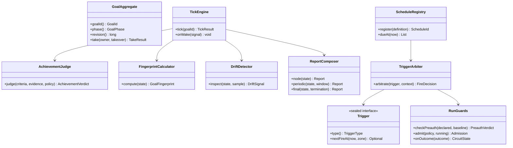
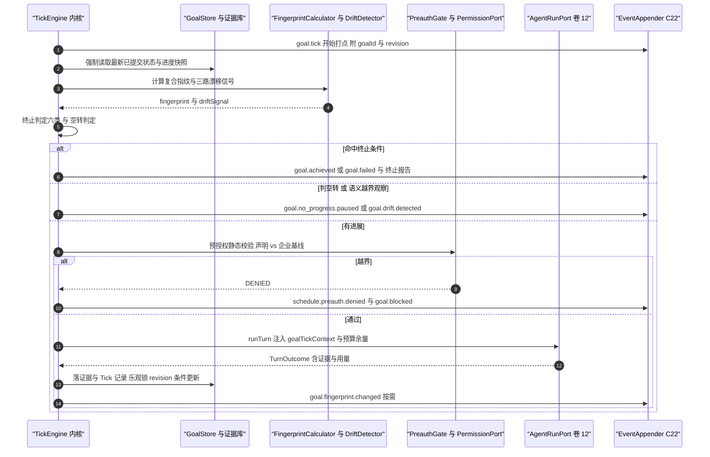
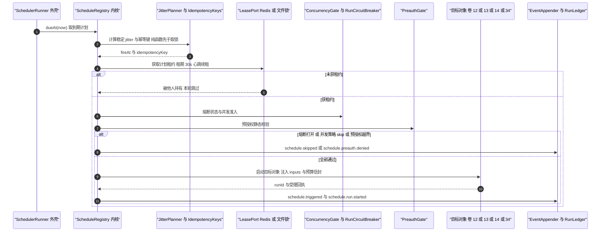
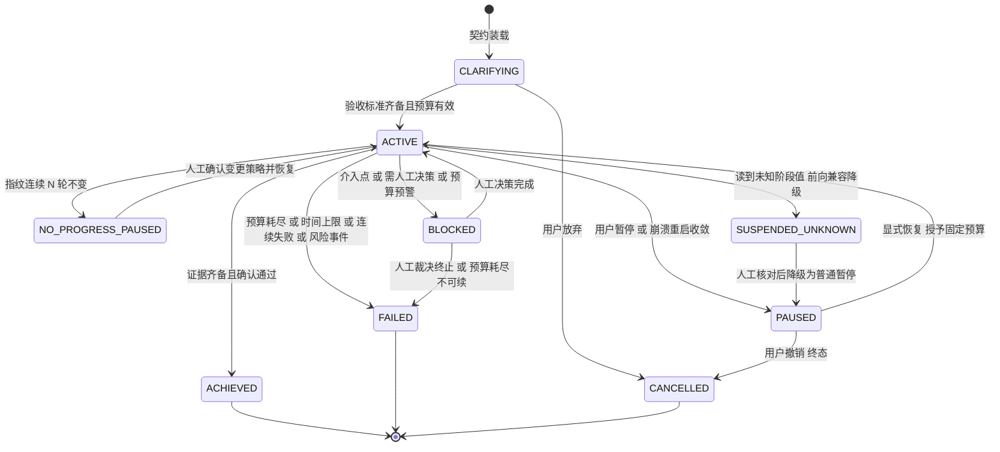
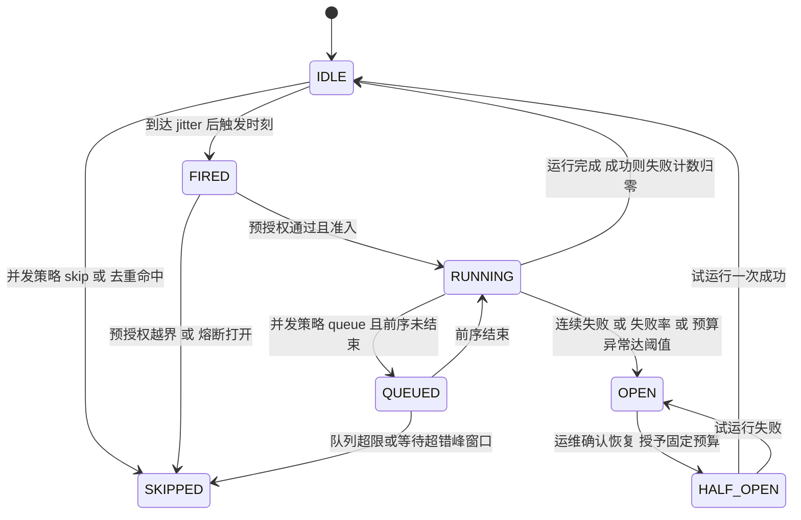

# C21 · GoalScheduler（Goal 自治循环与 Schedule 触发器）

> 组件级实现方案。上游系统级方案：`docs/harness/impl/15-goal-scheduler-impl.md`（下称 impl/15）§1.5 模块落点、§3.1 D-GSI-1…9、§3.2 I-GOAL-1…9、§6.1–6.4 时序、§7.1/§7.2 状态机、§8 表与事件、§9.3 配置、§10.2 性能预算；Phase A 卷 15 决策 D-GOAL-1…6 与 D-SCH-1…7。
> 竞品证据：Grok CLI `goal_tracker` 缺口指纹「不变即暂停」与「未知状态降级为可恢复暂停」`[E1]`（`research/competitors/06-grok-cli-and-build.md` §8-4）；DeepSeek 审批封闭结果集 `allowed-once / rejected / cancelled / unavailable` 与 fail-closed `[E1]`（`04-deepseek-harness.md` §4.4）；Codex Goal 仅 `thread/goal/{set,get,clear}` 无自治循环 `[E1]`（`03-codex.md` §4.10）；MiniMax `keepSessions` 判别联合三态 `[E1]`（`05-minimax-cli.md` §8 M15）；goose recipe 即调度资产 `[E1]`（`09-secondary-tier.md` §⑤ S12）。
> 采纳台账：L-032（契约 kickoff 一次注入）/ L-044（空转与未知状态降级）/ L-045（jitter、租约、过期、在册上限、崩溃后不自驱）/ L-046（模板与验收契约统一）/ L-083（会话归属三态）。
> 编号口径（本文件局部号段，须并入 `IMPL-DECISIONS.md` 后重编号）：`REQ-C-GSCH-01…12`、`I-C-GSCH-1…4`、`X-C21-1…3`（台账当前止于 X-82）。
> 实现落点：`harness-contract`（`contract/goal`、`contract/schedule`）+ `harness-kernel/kernel-work`（`work/goal|sched|guard|report`，零框架）+ `harness-platform/platform-persistence` + `harness-platform/platform-runtime-store` + `harness-host/host-app` + `harness-host/host-server`（`SchedulerRunner`）+ `harness-host/host-protocol`。

---

## ① 定位与边界

**一句话职责**：把「无人值守」做成**可终止、可解释、可熔断、可审计**的两条路径——Goal 侧每轮 Tick 评估「进展 / 预算 / 失败计数 / 漂移」并命中六类终止之一即停；Schedule 侧按五类触发器唤醒四类目标对象，全程受预授权网闸、幂等去重、熔断与通知路由约束。

**做什么**：

1. Goal 契约装载与澄清门（九要素齐备才推进）+ Tick 评估与派发（进展度量、复合指纹、三路漂移、预算余量 → `DISPATCH / PAUSE / TERMINATE / WAIT_HUMAN`）。
2. 六类终止判定与终止报告；证据优先达成判定（封闭结果集 + 自动确认三条件 + fail-closed）；三级汇报（节点 / 周期 / 结束）与「级别 → 渠道」路由（聚合去重复用卷 28 通知中心）。
3. 五类触发器统一模型（时间 / 事件 / 条件 / 手动 / 组合）与四类目标对象（任务模板 / 计划模板 / Goal / 会话模板），验收语义与卷 14/34 同源（L-046）。
4. 触发治理：稳定 jitter、单写者租约、幂等键去重、并发策略四值、recurring 过期与在册上限、错过对账、资源冲突检测。

| 不解决 | 归属 | 边界说明 |
| --- | --- | --- |
| 单轮执行与恢复 | C02 AgentLoop（impl/12） | Tick 只做「选下一步 + 校验 + 派发」，执行细节与检查点复用卷 12 `oc_checkpoint`（禁止第二套检查点） |
| 任务模型与 DAG | 卷 14 / impl/14 | Goal 经 `WorkItemPort` 读写任务树，不自实现状态机 |
| 团队编排与预算信封 | 卷 13 / impl/13 | 复杂计划以 `TEAM_RUN` 触发对象委托，熔断语义复用卷 13 |
| 权限判定与沙箱档位 | C10 / C12（卷 06/07） | 预授权只是**前置静态门**，动作仍走完整决策链 |
| 通知传输实现 | 卷 24/28 聚合中心 | 本组件只做「级别 → 渠道」路由与聚合语义，投递不落本组件 |

| 方向 | 依赖对象 | 接口 | 失败语义 |
| --- | --- | --- | --- |
| 上游 | 事件（C22 / 卷 16） | `EventAppender.append`（`goal.*` / `schedule.*`，分区键 = `goalId` / `scheduleId`） | 追加失败 → 本轮不产新事实，按 `DEPENDENCY_UNAVAILABLE` 重试 |
| 上游 | 持久化（卷 19） | `GoalStore` / `ScheduleStore` / `RunLedger` / `TickStore` 端口 | 不可写 → 只读降级并暂停自动触发 |
| 上游 | Agent 运行时（卷 12） | `AgentRunPort.runTurn(goalTickContext)` → `TurnOutcome`（证据与用量） | 依赖类错误计一次失败，不立即终止 |
| 上游 | 任务 / 权限 / 时钟 | `WorkItemPort.nextExecutable`；`PermissionPort.decide`；`ClockPort`（假时钟）/ `LeasePort` | 预授权越界以 `SCHEDULE_PREAUTH_DENIED` 返回 |
| 下游 | 通知（卷 24/28）、模板（卷 34）、运维（卷 32） | `NotificationPort.notify`；模板 `triggers[]` 映射 `ScheduleDefinition`；日历与熔断视图 | 渠道不可用降级为界面提示 + 日志 |

**模块落点**（卷 27 §4.3 权威名）

| 层带 | 模块 | 关键类 | Spring |
| --- | --- | --- | --- |
| 契约 | `harness-contract` | `GoalPhase` / `TerminationReason` / `TickResult` / `Trigger` sealed 族 / `ScheduleDefinition` | 禁止 |
| 内核 | `harness-kernel/kernel-work` | `GoalAggregate` / `TickEngine` / `AchievementJudge` / `DriftDetector` / `ScheduleRegistry` / `TriggerArbiter` / `RunGuards` | 禁止 |
| 平台 | `platform-persistence` / `platform-runtime-store` | `GoalJdbcStore` / `RunLedgerJdbcStore` / `MissedFireReconciler`；`LeaseRedisAdapter` / `WakeChannel` | 允许 |
| 外壳 | `host-app` / `host-server` / `host-protocol` | 应用服务、`SchedulerRunner`（`@Scheduled` 唯一落点）、JSON-RPC 与日历端点 | 允许 |

---

## ② 功能需求清单（REQ-C-GSCH-01…12）

| ID | 需求描述 | 来源 | 优先级 | 验收要点 |
| --- | --- | --- | --- | --- |
| REQ-C-GSCH-01 | 契约九要素装载与澄清门：缺验收标准进 `CLARIFYING` 并给候选清单，字段非法在装载期拒绝 | impl/15 §② REQ-GOAL-01；卷 15 §4.1 | P0 | 无验收标准不放行推进；非法枚举 code 在装载期报 `INVALID_ARGUMENT` |
| REQ-C-GSCH-02 | 六类终止（达成 / 预算耗尽 / 时间上限 / 连续失败 / 目标撤销 / 风险事件）任一命中即停并生成终止报告 | REQ-GOAL-03；卷 15 D-GOAL-2 | P0 | 六类各有单测；终止报告含触发类别与证据快照 |
| REQ-C-GSCH-03 | 证据优先达成判定：封闭结果集 `CONFIRMED / REJECTED / UNAVAILABLE`，自动确认仅限低风险 + 全证据 + 预算未逼近，其余 fail-closed | REQ-GOAL-04；impl/15 D-GSI-8；DeepSeek 封闭结果集 `[E1]` | P0 | 「声称达成但证据缺失」被拒且不推进状态；验证器不可用阻塞待人工 |
| REQ-C-GSCH-04 | 空转检测：复合缺口指纹连续 N 轮不变 + 防抖窗口即 `NO_PROGRESS_PAUSED`；**未知阶段值一律降级 `SUSPENDED_UNKNOWN` 暂停** | REQ-GOAL-08/09；台账 L-044；Grok CLI `[E1]` | P0 | 空转必暂停且不误停长任务；注入未知 `phase` 后断言**不**继续执行 |
| REQ-C-GSCH-05 | 漂移检测三路复合（规则为锚 + 语义可降级 + 约束扫描）双阈值仲裁，检出即暂停并汇报分量明细 | REQ-GOAL-05；卷 15 D-GOAL-4；impl/15 D-GSI-4 | P0 | 偏离目标（改无关模块）在 N 轮内检出；语义分量关闭时降级为规则路 |
| REQ-C-GSCH-06 | 五类触发器统一模型 + 组合 `AND/OR` + 去抖与节流；四类目标对象由触发器决定、输入由计划注入 | REQ-GOAL-12/13；卷 15 D-SCH-1/2 | P0 | 五类各有用例；组合与去抖窗口生效；目标不存在时触发失败并通知 |
| REQ-C-GSCH-07 | 触发治理：按计划 ID 稳定 jitter（recurring ≤10% 封顶 15 分钟、一次性 ≤90 秒）+ 租约三形态 + recurring 7 天过期 + 在册上限 + 错过提示 | REQ-GOAL-14；台账 L-045；Phase A 修订建议同源 | P0 | jitter 对同一 `(scheduleId, fireAt)` 恒等可重算；上限与过期可配且生效 |
| REQ-C-GSCH-08 | 并发策略四值（`skip` 默认 / `queue` / `replace` / `parallel`）+ 幂等键（源 + 目标 + 输入哈希）去重，重复触发只产 `schedule.deduplicated` | REQ-GOAL-15；卷 15 D-SCH-3；impl/15 §6.3 矩阵 | P0 | 去重窗口内第二次触发返回既有 `runId`；`queue` 溢出转 skip 并告警 |
| REQ-C-GSCH-09 | 预授权双层（触发前静态校验 + 动作前权限链）越界即停并通知，全量审计不可绕过 | REQ-GOAL-16；卷 15 D-SCH-4；impl/15 D-GSI-7 | P0 | 声明外动作被拒并记 `schedule.preauth.denied`；放宽企业基线返回 `POLICY_OVERRIDE_DENIED` |
| REQ-C-GSCH-10 | 熔断三判据（连续失败 / 窗口失败率 / 预算异常）自动暂停计划并告警；恢复需人工确认并授予**固定预算** | REQ-GOAL-18；卷 15 D-SCH-6；台账 L-045 | P0 | `OPEN` 期间无新运行；恢复走显式命令 + 审计 + 半开试运行令牌容量 1 |
| REQ-C-GSCH-11 | Goal 归属与夺取：`ownerSessionId` 单一所有者 + 显式 `take`；崩溃重启一律收敛为 `PAUSED`，**禁止自动续跑** | REQ-GOAL-10；台账 L-045；impl/15 §10.1 接管语义二分 | P0 | 双端同时推进被 owner 检查拦截；重启后 `ACTIVE → PAUSED` 且 resume 授予固定预算 |
| REQ-C-GSCH-12 | Tick 节流与降级可用性：周期评估 + 事件唤醒（边沿容量 1）+ 空闲退避；调度器不可用时手动触发仍可用；通知渠道不可用降级界面 + 日志 | REQ-GOAL-23/25；卷 15 §4.2、§7 | P0 | 评估耗时 ≤ 200ms；停 Redis 后手动触发链路可达且错过明细恢复后统一提示 |

**说明**：本表是 impl/15 §②（REQ-GOAL-01…25）与 §6/§7 的**组件级细化视图**（多对多映射），不新增系统级语义；与 impl/15 冲突时以后者为准并登记 §⑨ 修订建议。REQ-C-GSCH-04 与 REQ-C-GSCH-11 同源 L-044/L-045，是「前向兼容安全默认 + 崩溃不自驱」两条硬约束的组件内落点。

---

## ③ 关键设计决策（I-C-GSCH-1…4）

### 3.1 I-C-GSCH-1 循环宿主与单写者

| 分支 | 描述 | F/U/S/M | 加权 | 结论 |
| --- | --- | --- | --- | --- |
| B1 | 进程内固定线程池直调内核 | 7/7/8/6 | 70.0 | 淘汰（多实例重复触发不可解） |
| B2 | 独立调度服务（调度与 Agent 分进程） | 9/8/6/8 | 78.0 | 吸收其职责边界用于 server 形态 |
| B3 | **核内 Tick 引擎（纯逻辑）+ 外壳驱动器；local 文件锁 / server Redisson 租约 / 降级 PG advisory lock；正确性恒由幂等键兜底** | 9/9/8/9 | 87.5 | **选定** |

**选定要点**：同一判定逻辑单测可覆盖三形态（对齐 I-GOAL-1 / D-GSI-1/5）；**回退触发**：租约争用率 > 5%（`oc_schedule_lease_contention_total`）→ 租户分片调度 worker（接口不变）。

### 3.2 I-C-GSCH-3 达成确认载体

| 分支 | 描述 | F/U/S/M | 加权 | 结论 |
| --- | --- | --- | --- | --- |
| B1 | 布尔（达成 / 未达成） | 6/7/8/6 | 67.0 | 淘汰（无法表达「等人确认」） |
| B2 | 三值（达成 / 待确认 / 未达成） | 8/8/8/8 | 80.0 | 淘汰（无应答与驳回混为一谈） |
| B3 | **封闭结果集 `CONFIRMED / REJECTED / UNAVAILABLE` + 自动确认三条件 + fail-closed** | 9/8/9/9 | 88.0 | **选定** |

**选定要点**：对齐 DeepSeek 审批「应答者缺失 / 抛异常 / 不合规一律降级」的封闭语义（`[E1]`）；**回退触发**：`UNAVAILABLE` 占比 > 30% → 降级为「节点汇报 + 继续推进」并告警（I-GOAL-7）。

### 3.3 I-C-GSCH-2 / I-C-GSCH-4 唤醒节流与错过处置

| ID | 维度 | 选定分支 | 理由与代价 | 回退触发 |
| --- | --- | --- | --- | --- |
| I-C-GSCH-2 | 唤醒与节流 | **周期评估（60s）+ 事件唤醒（边沿触发、容量 1、重复投递无害）+ 空闲退避至 300s + 稳定抖动错峰** | 及时且省资源；唤醒只做加速，不承载正确性（不依赖内存通知，靠账本行兜底）；代价是需可观测唤醒延迟 | `oc_goal_tick_latency_ms` P95 > 2s → 退化纯周期扫描 + 漂移抽样 |
| I-C-GSCH-4 | 错过触发处置 | **默认 `NOTIFY_ONLY`（只提示不补跑）+ 可配 `CATCH_UP_ONE`（仅补最近一次，每次扫描至多 1 次）+ 幂等键兜底** | 显式放弃「无限补跑」（L-045 反证：时钟跳变下会叠放大量运行）；补跑复用自动幂等键，键冲突即 `DEDUPLICATED`；代价是错过恢复靠人工确认 | 错过提示噪声大 → 提高提示聚合窗口（策略值不变） |

---

## ④ 类图



**说明**：IO 全部经端口（`GoalStorePort` / `AgentRunPort` / `PermissionPort` / `LeasePort` / `EventPort`），图上省略以保持可读；`TickEngine` 内部组装 `TerminationEvaluator`（六类终止）与 `FirePlanning`（稳定 jitter 与幂等键，纯函数）两个判定件，同样省略。`Trigger` 为 `sealed` 族（`CronTrigger / IntervalTrigger / EventTrigger / ConditionTrigger / ManualTrigger / CompositeTrigger`），permit 类型必须与接口同模块，**禁止**在别包新增实现（新增须先改 impl/15 契约）；`RunGuards` 聚合预授权 / 并发准入 / 熔断三个纯函数判定；`ReportComposer` 只组装内容，路由交给 `NotifyRouter`（级别 → 渠道）。组件对外只暴露 `TickEngine`、`ScheduleRegistry` 与契约 record 三族类型，其余为内核协作类。**注意**：`ScheduleRegistry` 从不自带定时器——`@Scheduled` 入口只在 `host-server` 的 `SchedulerRunner`（impl/15 §1.5 调度器宿主落点），嵌入式 / CLI 档由 `host-app` 显式驱动同一端口。

---

## ⑤ 核心流程时序图

### 5.1 流程 A：Goal Tick —— 评估 → 判定 → 预授权 → 派发 → 汇报



- **前置条件**：目标处于 `ACTIVE`（其他阶段 Tick 抛 `HarnessException(ErrorCode.CONFLICT, …)`，文案含当前阶段与期望阶段）；`ownerSessionId` 匹配或已显式 `take`；`LeasePort` 租约在手（30s + 心跳 10s 续租）。
- **主路径**：强制读取**最新已提交状态**（账本先行，避免唤醒早于投影可见）→ 指纹与漂移 → 终止/空转判定 → 预授权 → 派发 → 落证据与 Tick → 事件打点；每轮固定写 `goal.tick`（折叠落地率 ≤10%，见 §⑩）。
- **异常补偿与幂等并发**：`runTurn` 抛 `DEPENDENCY_UNAVAILABLE` → 计一次失败并按熔断策略处理，**不立即终止**；Tick 以 `(goalId, revision)` 乐观更新，行数 ≠ 1 时重读重算（评估无副作用、可重跑）；唤醒为边沿触发（容量 1），重复投递不产生第二轮派发。

### 5.2 流程 B：Schedule 触发 —— jitter → 锁 → 去重 → 准入 → 预授权 → 启动



- **前置条件**：计划 `enabled=true` 且未过期（recurring 默认 7 天，过期写 `schedule.expired`）；在册计划数未超上限；触发器 `enabled=true`。
- **主路径**：jitter 与幂等键**在取锁之前**计算（纯函数，不依赖锁），因此重复驱动得到同一 `fireAt`（可审计、可复算）。
- **异常补偿与幂等并发**：目标启动失败 → `schedule.run.failed` 并按熔断策略累计；错过触发（宕机 / 退避超窗 / 时钟前跳）由 `MissedFireReconciler` 对账，默认**不补跑**只提示；`oc_schedule_run.uk(idempotency_key)` 是第二道闸——即使租约失效、双实例同刻触发也只会有一条运行记录，后到者捕获冲突返回既有 `runId`。

---

## ⑥ 状态机

### 6.1 Goal 生命周期



**状态语义**：`CLARIFYING` 澄清中 / `ACTIVE` 推进中 / `PAUSED` 已暂停 / `NO_PROGRESS_PAUSED` 空转暂停 / `SUSPENDED_UNKNOWN` 未知状态暂停 / `BLOCKED` 受阻 / 其余为终态。**迁移纪律**：`ACHIEVED / FAILED / CANCELLED` 为终态**禁止**回退；非法迁移在静态 `TransferTable` 中拒绝并抛 `HarnessException(ErrorCode.CONFLICT, "目标阶段已变更：当前「" + cur.getDesc() + "」，期望「" + expected.getDesc() + "」")`，迁移与拒绝都写事件。**重启收敛规则**：`ACTIVE` 重启后一律经「收敛接管」置 `PAUSED`（`goal.paused{reason=CRASH}`），**禁止自动继续推进**；`BLOCKED` 保持原态并幂等重发介入提示；其余暂停态保持不变。

### 6.2 触发器运行与熔断



**不变量**：① `OPEN` 期间**任何**自动触发都不产生运行记录（`schedule.skipped` 带 `CIRCUIT_OPEN` 原因）；② `HALF_OPEN` 只允许一次试运行（令牌容量 1），失败立即回 `OPEN`；③ `Queued → Skipped` 以「宁可跳过不雪崩」为原则，写事件并告警；④ 恢复不是清零重来——授予与首次触发相同的固定预算信封（防不可收敛任务反复烧钱）；⑤ recurring 超过有效期进入终态 `EXPIRED`（写 `schedule.expired`，不再有后续迁移）。

---

## ⑦ 接口与依赖矩阵

### 7.1 对外接口（内核契约 + 协议面）

| 面 | 方法 / 端点 | 关键入参 | 出参 | 错误码 |
| --- | --- | --- | --- | --- |
| 内核契约 | `tick(goalId)` / `onWake(signal)` | 目标标识；唤醒信号（边沿、容量 1） | `TickResult`（终止判定 / 漂移 / 预算快照 / 派发结果） | `NOT_FOUND`、`CONFLICT` |
| 内核契约 | `register(definition)` / `dueAt(now)` / `arbitrate(trigger, context)` | `ScheduleDefinition`（triggers / target / permissions / budget） | `ScheduleId` / `FireDecision` | `INVALID_ARGUMENT`、`POLICY_OVERRIDE_DENIED` |
| 会话 JSON-RPC | `goal.create` / `goal.take` / `goal.report` / `goal.cancel` | 契约九要素；`fromSessionId` + `takeover=true`；`kind` | `GoalId` + `phase` / `TakeResult` / `GoalReport` | `INVALID_ARGUMENT`、`CONFLICT`、`PERMISSION_DENIED` |
| 会话 JSON-RPC | `schedule.fire`（手动） | `scheduleId`、`inputs?`、`Idempotency-Key` | `RunId` | `SCHEDULE_CIRCUIT_OPEN`、`SCHEDULE_PREAUTH_DENIED`、`SCHEDULE_DUPLICATED` |
| 管理 REST | `/api/v1/goals`、`/api/v1/schedules/{id}/runs`、`/api/v1/schedules/{id}/missed`、`/api/v1/scheduler/health`、`/api/v1/notifications/routes` | 过滤与分页参数；写操作要求 `Idempotency-Key` | 列表 / 明细 / 健康快照 | `schedule.read`、`system.read`、`policy.edit` 权限点 |

### 7.2 SPI（登记进卷 18 目录）

| SPI | 说明 | 装配约束 |
| --- | --- | --- |
| `TriggerSPI` | 自定义触发器（新事件源 / webhook 语义） | 只扩展 `Trigger` 族外的外部源适配，**不得**绕过 `TriggerArbiter` 的去重与节流 |
| `AutonomyPolicySPI` | 自治级别判定（任务类型 × 风险 × 信任） | 企业基线只可加严；越权放宽返回 `POLICY_OVERRIDE_DENIED` |
| `FingerprintPolicySPI` / `DriftPolicySPI` | 指纹分量与序列化规范 / 漂移仲裁策略 | 指纹算法须满足「同输入同输出 + 跨进程稳定」（golden 门禁） |
| `AchievementPolicySPI` | 达成判定与自动确认条件 | 只能收紧自动确认三条件，不可放宽（fail-closed 优先） |
| `CircuitBreakerPolicySPI` / `NotificationChannelSPI` | 熔断阈值与恢复令牌 / 通知渠道实现 | 阈值不可低于企业下限；渠道不支持优先级返回 `UNSUPPORTED_CAPABILITY` 附 `alternatives[]` |

### 7.3 配置项与数据

| 配置键（`open-coding.goal.*` / `open-coding.schedule.*`） | 默认 | 影响面 |
| --- | --- | --- |
| `goal.tick.intervalSeconds` / `idleBackoffSeconds` | 60 / 300 | Tick 周期与空闲退避上限（仅评估） |
| `goal.noProgress.rounds` / `debounceSeconds` | 3 / 600 | 空转判定连续轮数与指纹防抖窗口（防误停） |
| `goal.drift.semanticThreshold` / `semanticEnabled` | 0.45 / true | 语义漂移阈值与降级开关（无嵌入模型自动降词面） |
| `schedule.jitter.recurringRatio` / `recurringCapSeconds` / `oneShotMaxSeconds` | 0.10 / 900 / 90 | 稳定抖动比例与封顶（对账类可显式 `STRICT_AT`） |
| `schedule.expire.recurringDays` / `maxSchedulesPerTenant` / `lease.mode` / `missed.policy` | 7 / 50 / `REDIS` / `NOTIFY_ONLY` | 有效期、在册上限、单写者三形态与错过处置 |
| `schedule.circuit.failureThreshold` / `failureRateThreshold` / `windowSeconds` | 3 / 0.5 / 3600 | 熔断三判据阈值（企业可加严） |

| 数据 | 表 / Key | 说明 |
| --- | --- | --- |
| Goal 与调度 | `oc_goal` / `oc_goal_tick` / `oc_schedule` / `oc_schedule_run`（**`uk(idempotency_key)`**）/ `oc_schedule_missed`（`uk(schedule_id, trigger_id, expected_at)`） | 本组件是唯一写入者；`oc_goal_tick` 与 `oc_schedule_run` 月分区 |
| Redis | `RedisKeys.goalRunLease(goalId)` / `scheduleLease(scheduleId)` / `scheduleFired(scheduleId, fireAt)` / `goalWake(goalId)` / `scheduleCircuit(scheduleId)` | 全部经 `RedisKeys` 工厂生成，禁止拼接；降级见 §⑨ |
| 事件 | `goal.*` / `schedule.*`（含新增 `goal.no_progress.paused`、`schedule.missed`、`schedule.preauth.denied`） | 载荷只含编号、枚举 code、数值与引用，禁止凭证与外发地址明文 |

---

## ⑧ 关键算法

### 8.1 达成判定（证据优先 + 封闭结果集）

**步骤**：① 逐条 `AcceptanceCriterion` 求值（`STATIC` / `EXECUTABLE` / `SEMANTIC` 三类验证器，卷 12 三级）；② **证据先落库**（`oc_goal_evidence`，`uk(goal_id, criterion_id, digest)`），结论后产生——顺序不可颠倒，否则回放无法复现判定；③ 全部满足 ⇒ 判自动确认三条件「风险 ≤ `LOW` + 全证据 + 预算未逼近」，齐备即 `CONFIRMED`（记录理由与策略引用），否则请求人工确认；④ 存在未满足 ⇒ `REJECTED`（附未满足清单，决定继续推进或转 `FAILED`）；⑤ 验证器不可用 ⇒ 该条 `UNAVAILABLE` ⇒ 整体 `UNAVAILABLE` ⇒ `BLOCKED` 等待人工（**禁止**按「未验证即通过」处理）。

```java
/**
 * 判定达成结论（封闭结果集，fail-closed）。
 *
 * @param criteria 逐条验收结论（必填，与目标验收项一一对应）
 * @param evidence 已落库证据摘要集（必填，可为空集表示无证据）
 * @param policy   自动确认策略（必填，企业可收紧不可放宽）
 * @return 达成结论；任一验证器不可用即降级为 UNAVAILABLE，绝不返回 CONFIRMED
 */
public AchievementVerdict judge(List<CriterionVerdict> criteria, List<EvidenceRef> evidence,
                                AchievementPolicy policy) {
    // 证据缺失或存在不可用验证器：fail-closed 降级，避免「假完成」推进状态
    if (evidence.isEmpty() || criteria.stream().anyMatch(v -> v.value() == VerdictValue.UNAVAILABLE)) {
        log.warn("达成判定降级为不可用，验收项数={}, 证据数={}", criteria.size(), evidence.size());
        return new AchievementVerdict(VerdictValue.UNAVAILABLE, criteria, "证据不足或验证器不可用");
    }
    // 三条件齐备才允许自动确认：低风险 + 全证据 + 预算未逼近（任一不满足转人工）
    boolean allPass = criteria.stream().allMatch(v -> v.value() == VerdictValue.CONFIRMED);
    boolean autoOk = allPass && policy.autoConfirmEnabled() && policy.riskWithinLimit();
    return new AchievementVerdict(autoOk ? VerdictValue.CONFIRMED : VerdictValue.REJECTED, criteria, autoOk ? "自动确认" : "需人工确认");
}
```

### 8.2 复合指纹与漂移检测

**指纹四分量**（规范化序列化：字段名 ASCII + 值 UTF-8 + 分号分隔 + 长度前缀，跨进程稳定）：① 验收项状态向量（按 `criterionId` 升序）；② 未满足集合；③ 计划版本 revision；④ 关键产物 digest 集（升序）。任一分量变化即指纹变化并写 `goal.fingerprint.changed`。

**空转判定**：`noProgressRounds` 仅在「指纹与上轮完全相同**且**距最近一次产出变化 ≥ `debounceSeconds`」时 +1（防抖），否则清零；`≥ noProgressRounds`（默认 3）⇒ `NO_PROGRESS_PAUSED` + 指纹与未满足清单入报告。**漂移三路 + 双阈值仲裁**：① 规则锚（进展停滞、约束静态扫描：禁止路径 / 禁止动作命中）；② 语义分量（目标语义 vs 最近 N 轮动作摘要，嵌入不可用时降级词面 Jaccard / 路径集合重叠度）；③ 约束扫描。仲裁：规则命中 ⇒ 立即暂停；仅语义越界（`driftScore > semanticThreshold`）⇒ **先观察一次**（写 `goal.drift.detected` 不暂停），连续两次越界 ⇒ 暂停。**未知阶段值**：`GoalPhase.of(code)` 抛 `HarnessException` 后调用方必须降级 `SUSPENDED_UNKNOWN` 并 ERROR 告警（禁止自驱）。

### 8.3 触发去重与错过补偿

**稳定 jitter**：`offset = H(scheduleId + ':' + fireAtEpochSecond) mod jitterRange`；recurring 的 `jitterRange = min(period × recurringRatio, recurringCapSeconds)`，一次性取 `oneShotMaxSeconds`；`jitterPolicy=STRICT_AT` 时恒为 0（企业显式开启并审计）。同 `(scheduleId, fireAt)` 在任意实例、任意时刻算出同一偏移——可重算、可审计（随机 jitter 会造成同刻风暴，L-045 反证）。

**双层去重**：自动幂等键 = `hash(scheduleId, triggerId, fireAt)`；手动键 = 调用方 `Idempotency-Key`（**独立域，禁止混用**，人工意图优先）；快路径 `RedisKeys.scheduleFired(scheduleId, fireAt)`（TTL = 去重窗口 = 2 × 触发周期封顶 24h）；DB `uk(idempotency_key)` 为最终兜底。

```java
/**
 * 计算稳定抖动偏移与自动幂等键（纯函数，先于取锁执行）。
 *
 * @param scheduleId 计划标识（必填）
 * @param triggerId  触发器标识（必填，组合触发器取子触发器标识）
 * @param fireAt     计划触发时刻（必填，期望触发点而非实际启动时刻）
 * @param policy     抖动策略（必填，STRICT_AT 表示准点不抖动）
 * @return 触发计划（抖动偏移 + 幂等键；同输入恒等）
 */
public FirePlan plan(ScheduleId scheduleId, TriggerId triggerId, Instant fireAt, JitterPolicy policy) {
    // 稳定哈希而非随机：保证任意实例任意时刻可重算出同一偏移（可审计、可复算）
    long range = policy.rangeSeconds(jitterProperties);
    long offset = range == 0 ? 0 : Math.floorMod(jitterHasher.hash(scheduleId, triggerId, fireAt), range + 1);
    String key = IdempotencyKeys.autoKey(scheduleId, triggerId, fireAt);
    return new FirePlan(fireAt.plusSeconds(offset), key);
}
```

**错过补偿**：`MissedFireReconciler` 扫描 `expectedAt ∈ (lastScan, now]` 与 `oc_schedule_run` 的差集 → 按策略处置：`NOTIFY_ONLY`（默认，不补跑，只发错过提示）或 `CATCH_UP_ONE`（**仅补最近一次**，且每次扫描至多 1 次，禁止连续补跑）；补跑复用自动幂等键，冲突即 `DEDUPLICATED`；时钟前跳按同一策略处置并告警。**双实例同刻**：后到者捕获唯一键冲突 → 返回既有 `runId`，不启动新运行（Redis 标记只是快路径，正确性恒由唯一键兜底）。

---

## ⑨ 错误处理与降级

| 场景 | ErrorCode | 可重试 | 对外文案要点 | 恢复动作 |
| --- | --- | --- | --- | --- |
| 契约缺验收标准 / 非法枚举 code | `INVALID_ARGUMENT` | 否 | 「目标缺少验收标准，已进入澄清；候选清单见附件」 | 补齐验收标准或改用模板默认 |
| 终态暂停 / 重复确认 / 非法阶段迁移 | `CONFLICT` | 否 | 「目标阶段已变更：当前 `<cur>`，期望 `<expected>`，请刷新后重试」 | 刷新 `goal.report` 取现状 |
| 非所有者推进未夺取 | `PERMISSION_DENIED` | 否 | 「无权推进该目标，需显式 `goal.take` 夺取」 | 显式夺取（需确认）并记审计 |
| 计划放宽企业基线 | `POLICY_OVERRIDE_DENIED` | 否 | 「不允许放宽企业基线（预授权 / 通知路由 / 熔断阈值），只可加严」 | 按基线收敛配置后重试 |
| 声明外动作（发布 / 删除 / 外发） | `SCHEDULE_PREAUTH_DENIED` | 否 | 「动作未在计划声明范围内，已拒绝并记录审计」 | 调整声明并重走企业批准流程 |
| 熔断打开期间触发 | `SCHEDULE_CIRCUIT_OPEN` | 否 | 「计划已熔断暂停（连续失败 `<n>` 次），需运维确认恢复」 | `schedule.circuit.reset`（授予固定预算） |
| 幂等键命中（重复触发 / 手动重放） | `SCHEDULE_DUPLICATED` | 否 | 「该触发已受理，返回既有运行记录」 | 直接读取既有 `runId` |
| 目标执行体 / 验证器 / 渠道不可用；未知阶段值（版本回滚） | `DEPENDENCY_UNAVAILABLE`；后者非错误（降级） | 是（前者） | 「依赖暂不可用，已自动重试」/「检测到未知目标阶段，已暂停并告警」 | 退避重试；验证器场景 fail-closed 转人工；未知值 `SUSPENDED_UNKNOWN` 人工核对 |

**降级阶梯（由轻到重，任一级写事件并告警）**：① **通知降级**——渠道不可用 → 界面提示 + 结构化日志 → 重试 3 次后转邮件摘要（P0 保留界面穿透）；② **汇报降级**——模型汇报失败 → 模板化汇报（含进度与证据清单，无模型）；③ **存储 / 锁降级**——Redis 不可用 → 租约退 PG advisory lock、唤醒退 5s 轮询、去重退 DB 唯一约束（功能不丢、时延变差）；④ **调度器降级**——整体不可用 → 手动触发链路保留，错过明细恢复后统一提示；⑤ **判定降级（fail-closed）**——验证器不可用 → `UNAVAILABLE` 阻塞待人工；⑥ **前向兼容降级**——未知阶段值 → `SUSPENDED_UNKNOWN` 暂停并告警（禁止自驱）。

**修订建议登记（须并入 `IMPL-DECISIONS.md` §4）**

| 编号（待并号） | 冲突 / 缺口 | 证据 | 建议修订 |
| --- | --- | --- | --- |
| `X-C21-1` | 「触发到启动 ≤ 500ms」单点预算无法定位瓶颈（jitter / 锁 / 准入 / 启动四段混算） | impl/15 §⑩.2、§⑩.10 第 3 行 | 卷 15 §7 回补四段分段预算；`oc_schedule_fire_lag_seconds` 增加 `stage` 标签（增量，非阻塞） |
| `X-C21-2` | `noProgressRounds` 与 `goal.tick.idleBackoffSeconds` 命名分属两族（`noProgress` / `tick`），而空转判定同时消费两者，运维易漏配 | impl/15 §⑨.3 配置表 | 统一为 `goal.noProgress.*` 分组（`rounds` / `debounceSeconds` / `idleBackoffSeconds`），旧键保留兼容期并启动告警 |
| `X-C21-3` | 会话归属三态（L-083）在 `oc_goal_session.keep_policy` 只覆盖 Goal 侧，普通会话侧保留逻辑在卷 19 另有口径，存在两处实现漂移风险 | impl/15 §⑧.1、L-083；`05-minimax-cli.md` §8 M15 `[E1]` | 明确 `keep_policy` 解析由本组件归档判定统一消费并输出 `schedule.sessions.archived`；普通会话复用同一判别联合语义（不复制第二套解释） |

---

## ⑩ 性能与并发

| 指标 | 预算 | 测量点 |
| --- | --- | --- |
| Tick 评估（不含模型调用） | P95 ≤ 200ms | `oc_goal_tick_latency_ms` |
| 触发判定到执行体启动 | P95 ≤ 500ms（四段：jitter / 锁 / 准入 / 启动） | `oc_schedule_fire_lag_seconds` |
| 单实例在册计划扫描（50 计划） | ≤ 20ms（每秒扫描一次成本可忽略） | 基准用例 |
| 稳定 jitter / 预授权静态校验 / 熔断判定 | 各 ≤ 1ms | 单测断言（假时钟，无 IO） |

**并发模型**：每个 Goal / Schedule 由 `LeasePort` 租约串行（local 文件锁 / server Redisson / 降级 PG advisory，30s + 心跳 10s）；`local` 档单线程调度器 + 虚拟线程执行体（`Executors.newVirtualThreadPerTaskExecutor()`），`server` 档 `maxParallelRuns`（默认 4）受限并发；Tick 评估为纯内存计算，派发后立即释放评估线程（长执行在独立执行体，以事件唤醒下一轮）。**接管语义二分**：① 收敛接管（自动、幂等）——Goal → `PAUSED`（`reason=CRASH`，不自驱）、`oc_schedule_run` 的 `STARTED` 无终态者 → `FAILED(ORPHANED)`；② 继续推进——**禁止自动**，只允许显式 `goal.resume`、下一次到期触发（走 `missed.policy`）或人工确认。**日志打点纪律**（`@Slf4j`，中文，占位符，异常传 `Throwable`）：入口 / 出口打点 Tick 与触发（含 `goalId` / `scheduleId`、`firedAt`、`idempotencyKey`、耗时）；指纹与漂移分数 `log.info`（含分量摘要），空转 / 越界 / 熔断 / 错过对账 `log.warn`；禁止打印目标全文、凭证与外发地址明文，Tick 内明细走 `log.debug` 或事件。

**容量与背压**：单租户 50 计划 × 平均 24 次触发/天 ≈ 1200 次运行/天；事件量 ≈ 1200 × 10 条 ≈ 1.2 万条/日，Tick 按卷 31 D-CAP-3「高频中间态折叠」只落状态迁移与最终值（≤10% 落地率）≈ 0.7 万条/日，合计 **≈2 万条/日**；若不折叠则为 50 Goal × 1440 次/日 ≈ 7.2 万行/日（3.6 倍），实现期以「折叠落地率 ≤10%」为验收断言，否则本估算失效。运行队列有界（队列策略 `queue` 单计划 32、全局 256），满时降级 skip 并记 `schedule.skipped{reason=QUEUE_FULL}`。

---

## ⑪ 测试要点

**单元测试（纯内核，假时钟，无 IO）**：`TerminationEvaluatorTest`（六类终止逐类 + 多条件并存优先级：风险事件 > 预算 > 达成；终态不可回退）；`AchievementJudgeTest`（证据缺失拒绝、验证器不可用 → `UNAVAILABLE`、自动确认三条件边界）；`FingerprintCalculatorTest`（幂等、任一分量变化即变化、跨进程序列化 golden 比对）；`NoProgressGuardTest`（连续 3 轮不变暂停；防抖窗口内假变化不重置；第 3 轮前有产出不暂停）；`DriftDetectorTest`（规则命中即暂停、仅语义越界先观察一次、语义关闭降规则路）；`GoalPhaseMigrationTest`（非法迁移拒绝 + 未知 code → `SUSPENDED_UNKNOWN` 且断言**不**继续执行）；`JitterPlannerTest`（同一 `(scheduleId, fireAt)` 在 1000 次随机种子下偏移恒等、封顶生效、`STRICT_AT` 例外）；`IdempotencyKeysTest`（输入哈希对键序不敏感、对语义变化敏感、窗口内判重）；`RunCircuitBreakerTest`（连续 3 次打开、成功归零、半开令牌容量 1、重复失败事件按 `runId` 去重不重复计数）。

**集成测试（Testcontainers：PG + Redis；假模型；假时钟推进）**：Goal 20 轮长跑（含人工介入、漂移检出、空转暂停与恢复），断言事件序列与状态轨迹一致；五类触发器端到端各一例 + 组合 `AND` 与去抖；并发策略四值（`queue` 溢出降级 skip 并告警）；预授权越界 + 通知 + 审计三元组齐全，放宽基线返回 `POLICY_OVERRIDE_DENIED`；熔断打开 → 自动触发全部 skip → 人工恢复授予固定预算 → 半开试运行回 `IDLE`；会话归属三态归档产生 `schedule.sessions.archived`；日历冲突标红 + 错峰建议（强制并行给风险提示）。

**故障注入（DoD 硬项）**：推进中 `kill -9` → 重启为 `PAUSED` 不自驱且 resume 授予固定预算；触发前 kill（锁在手）→ 租约到期接管且不重复运行；触发后写入前 kill → 无记录或 `FAILED(ORPHANED)` 对账收敛且不重复启动；Redis 宕机 30 分钟 → 三降级生效且日志有明确提示；通知渠道全不可用 → 运行不受影响、恢复后补发摘要；时钟前跳 1 小时 → 错过明细生成 + 默认不补跑 + 无重复触发；未知阶段值注入 → `SUSPENDED_UNKNOWN` + 告警，绝不自驱；验证器持续不可用 → `UNAVAILABLE` 阻塞不误判达成。**契约与回放**：`GoalStorePort` / `RunLedgerPort` / `AgentRunPort` / `WorkItemPort` / `PermissionPort` / `NotificationPort` 各有契约套件（含错误与幂等路径）；`goal.*` / `schedule.*` 事件 Schema 过 Registry 兼容校验且已发布枚举 code 永不重编号（wire 标签固定化测试）；由 `goal.tick` 序列离线重建「进度曲线 + 漂移判定 + 终止判定」（回放门禁不触发任何副作用）；模板 YAML → `ScheduleDefinition` → 反向导出往返一致。

```bash
# 门禁映射（卷 27 §4.6）：单测 → 单元 + 覆盖率门；集成 → 集成测试；长跑/注入 → 集成 + 契约；时延 → 性能基准（抽样）
mvn -pl harness-kernel/kernel-work -am test                        # 内核（假时钟，无 IO）
mvn -pl harness-platform/platform-persistence -am test             # 集成（PG + Redis 容器）
./scripts/ci/goal-gate.sh                                          # 长跑 + 故障注入矩阵 + 回放门禁
./scripts/ci/schedule-fault-inject.sh --case kill-before-fire,lock-expire-mid-fire,clock-jump-1h,double-instance-fire
mvn -pl harness-host/host-server -am test                           # SchedulerRunner：租约抢占与错过补跑
```

**DoD（impl/15 §⑪.6 的组件内切片）**：六类终止 + 证据优先达成判定 + 「假完成」拦截全绿 ｜ 空转暂停与未知状态降级两条专项用例通过 ｜ 五类触发器与组合去抖生效、手动触发在调度器不可用时仍可用 ｜ 幂等去重与并发策略四值正确 ｜ 预授权越界被拒 + 全量审计可查 ｜ 熔断恢复授予固定预算 ｜ 日历冲突与错峰建议可用 ｜ 阈值全部入 `GoalProperties` / `ScheduleProperties` 并同步 `.env.example` ｜ 内核零框架依赖（卷 27 R1）通过。
