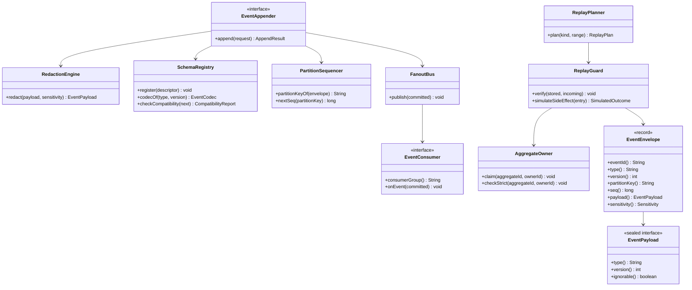
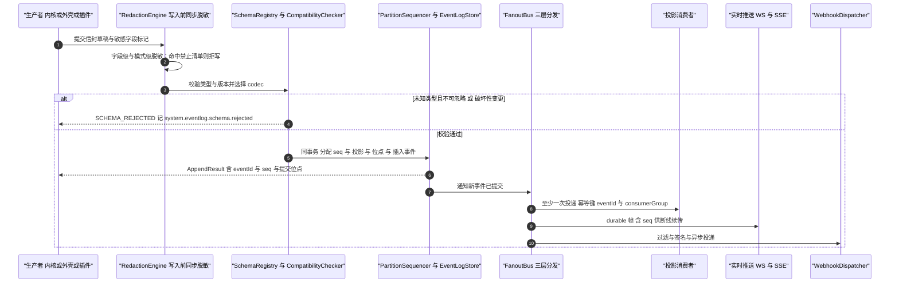
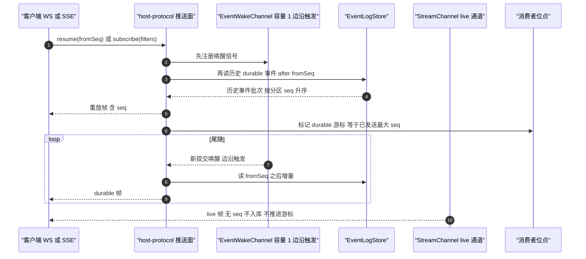
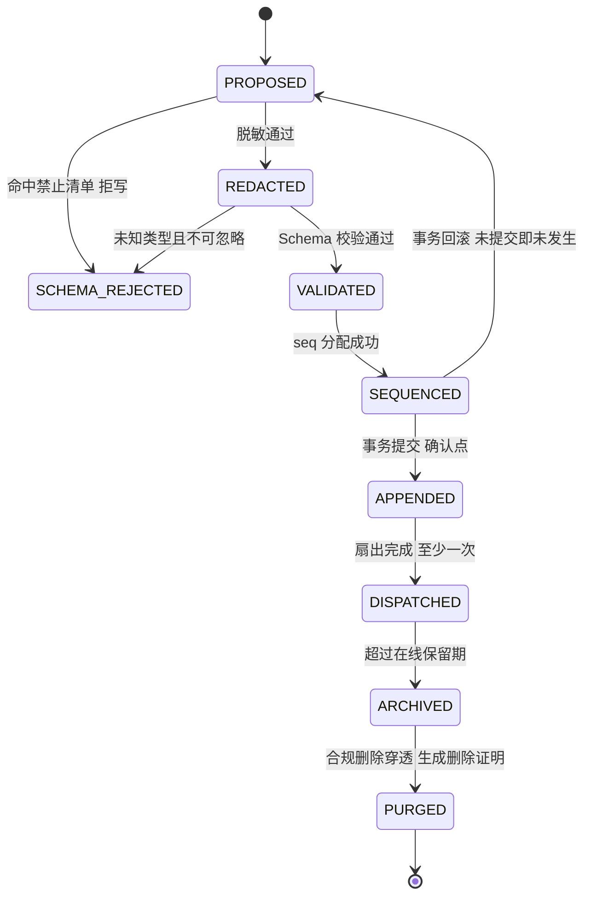
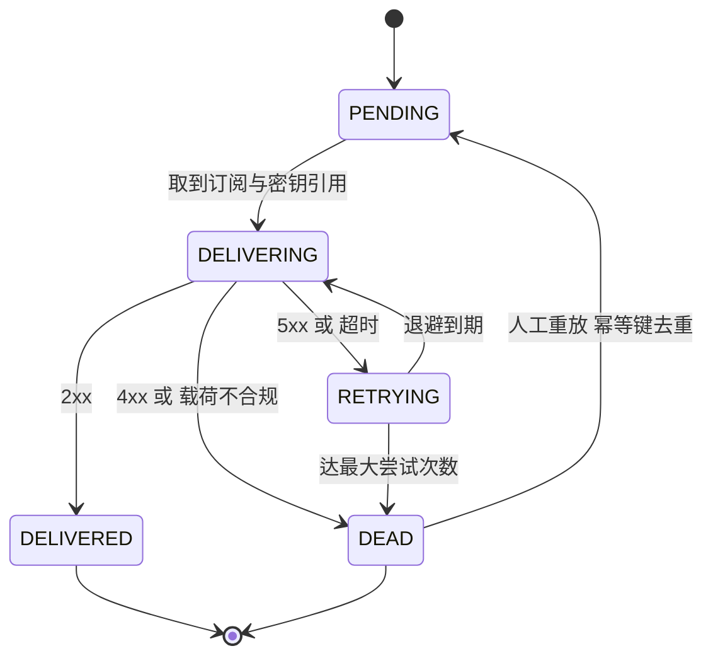

# C22 · EventBus（事件总线与事件存储/回放）

> 组件级实现方案。上游系统级方案：`docs/harness/impl/16-event-bus-impl.md`（下称 impl/16）§1.5 模块落点、§3.1 D-EVI-1…9、§3.3 I-EVT-1…9、§6.1–6.4 时序、§7 状态机、§8 表与事件、§9.3 配置、§10.2 性能预算、§10.4 回放隔离协议与 §10.10 兼容矩阵；Phase A 卷 16 决策 D-EVT-1…11。
> 竞品证据：DeepSeek「会话日志是唯一事实源 + **模型可见即可重建**（`Model-visible means logged`，`deriveMessages()` 从日志投影模型历史）」`[E1]`（`04-deepseek-harness.md` §4.1、§8 L9，`docs/architecture.md:121-127`）；其**代（generation）管理**：`session.vN.jsonl[.zstd]` 相邻迁移链、**已提交代永不重命名/覆盖/删除**、撕裂尾自动修复 `[E1]`（`04-deepseek-harness.md` §4.1、§6-4）；OpenCode `EventV2`：事务内「读序号 → projector → upsert `event_sequence` → insert event」、`replay(event, {publish?, ownerID?, strictOwner?})` 三要素比对与 `Replay diverged at aggregate … sequence …`、聚合所有权 `claim(aggregateID, ownerID)`、`subscribeDurable` 先订阅后重放、live-only 不推进 durable 游标 `[E1]`（`02-opencode.md` §4.12 走读要点 1–3、6）。
> 采纳台账：L-024（工具 7 态状态机事件化）/ L-041（SubAgent 事件化）/ L-051（双通道与先订阅后重放）/ L-052（兼容纪律与「模型可见即可重建」）/ L-074（遥测白名单与默认关）/ L-077（质量信号事件化）。
> 编号口径（本文件局部号段，须并入 `IMPL-DECISIONS.md` 后重编号）：`REQ-C-EVB-01…12`、`I-C-EVB-1…4`、`X-C22-1…4`（台账当前止于 X-82）。
> 实现落点：`harness-contract/.../contract/event`（信封与 Schema 目录，零依赖）+ `harness-kernel/kernel-event`（`model/seq/schema/redact/replay/stream`，零框架）+ `harness-platform/platform-persistence`（日志、位点、死信、归档）+ `harness-platform/platform-runtime-store`（唤醒与广播）+ `harness-host/host-app` + `harness-host/host-protocol`（双通道推送与查询 API）。

---

## ① 定位与边界

**一句话职责**：把「一切皆事件」落成**可机械校验的基础设施**——所有状态变更、决策、计量与审计从同一条事件流派生，并满足四个硬性质：

1. **可重建**：任何进入模型请求的内容都能由事件流重建（对齐 DeepSeek 运行时不变式，L-052）。
2. **不破坏旧读者**：Schema 演进只增不改、未知字段忽略、`ignorable` 显式声明影响面、已发布枚举 code 永不重编号。
3. **回放不重复副作用**：三类回放与审计重放严格分离，环境重放的写操作按副作用账本模拟或隔离到沙箱。
4. **事实源唯一**：追加确认是「进展」的唯一判定点，投影与读模型全部可丢弃重建，历史事件永不原地改写。

**四条能力面**：分区有序的追加、至少一次分发（含 Webhook 与批量导出）、断线续传的实时推送、分类留存与合规删除。

| 不解决 | 归属 | 边界说明 |
| --- | --- | --- |
| 各域事件语义与类型清单 | 各卷定义 + 本系统登记 | 本系统只保证信封、顺序、投递与留存语义 |
| 指标看板与告警路由 | 卷 24/28 | 本系统只产出指标与元事件 |
| 存储引擎高可用（分区滚动、备份、PITR） | 卷 19/32 | 存档与恢复策略属持久化域 |
| 权限与审计判定 | 卷 06 / 卷 24 | 本系统只做「按敏感度 + 租户」强制过滤与不可篡改属性（哈希链） |

| 方向 | 依赖对象 | 接口 | 失败语义 |
| --- | --- | --- | --- |
| 上游（生产者） | 内核各域（卷 12–15）、外壳用例、插件、外部事件源 | `EventAppender.append(request)` / `EventProducerSPI` | 存储不可用 → `DEPENDENCY_UNAVAILABLE`（可重试，生产者复用同一 `producerKey`） |
| 上游 | 脱敏与 Schema 目录、时钟与租约 | `RedactionEngine` / `SchemaRegistry`；`ClockPort` / `LeasePort` | 禁止清单命中 → 拒写；归档/重建互斥由租约保证 |
| 下游（消费者） | 投影、实时推送、记忆与评测采集 | `EventConsumerSPI` / `ProjectionSPI`，位点落 `oc_consumer_offset` | 重复投递由消费者幂等吸收（`eventId + consumerGroup`） |
| 下游 | 外部系统与运维（卷 32） | Webhook（签名 + 重试 + 死信）、批量导出、查询 API | 接收端持续失败 → 死信 + P1 告警，不阻塞追加 |

**模块落点**（卷 27 §4.3 权威名）

| 层带 | 模块 | 关键类 | Spring |
| --- | --- | --- | --- |
| 契约 | `harness-contract` | `EventEnvelope` / `EventPayload`（sealed）/ `EventCategory` / `Sensitivity` / 六个 SPI | 禁止 |
| 内核 | `harness-kernel/kernel-event` | `PartitionSequencer` / `EventCodecRegistry` / `CompatibilityChecker` / `RedactionEngine` / `ReplayPlanner` / `ReplayGuard` / `StreamChannel` | 禁止 |
| 平台 / 外壳 | `platform-persistence` / `platform-runtime-store` / `host-app` / `host-protocol` | `EventLogJdbcStore` / `EventSeqAllocator` / `DeadLetterStore` / `EventArchiver`；`EventFanoutRedis` / `EventWakeChannel`；`SubscriptionRegistrar` / `WebhookDispatcher`；WS 双通道 | 允许 |

---

## ② 功能需求清单（REQ-C-EVB-01…12）

| ID | 需求描述 | 来源 | 优先级 | 验收要点 |
| --- | --- | --- | --- | --- |
| REQ-C-EVB-01 | 信封全字段落地（`eventId` UUIDv7、`type`、`version`、`category`、`tenantId`、`partitionKey`、`seq`、`occurredAt` / `recordedAt`、`actor`、`trace`、`correlationId`、`payload`、`sensitivity`、`schemaRef`） | impl/16 §② REQ-EVT-01；卷 16 §4.1 | P0 | 缺任一必填字段在写入前拒绝（fail-fast）；`eventId` 时间序可作排序兜底 |
| REQ-C-EVB-02 | 三类事件差异化策略：领域（持久可回放可审计）/ 系统（持久可审计）/ 遥测（采样、可聚合、短保留） | REQ-EVT-02；卷 16 D-EVT-1 | P0 | 三类保留期、加密、采样与订阅过滤独立可配并有用例 |
| REQ-C-EVB-03 | 命名规范 `<域>.<对象>.<动作>` + 生成式事件目录（由 Schema 目录生成，CI 校验 freshness） | REQ-EVT-03；生成式目录与漂移门禁（`04-deepseek-harness.md` §8 L14 `[E1]`） | P0 | 目录与代码不一致即 CI 失败；非法命名在登记期拒绝 |
| REQ-C-EVB-04 | Schema Registry + 语义化版本 + CI 兼容性校验；破坏性变更被机械拒绝 | REQ-EVT-04；卷 16 D-EVT-2 | P0 | 删字段 / 改类型 / 改语义在 CI 被拒并给替代方案提示 |
| REQ-C-EVB-05 | 兼容纪律与 compat 读取器：已发布事件 code 与枚举 code **永不重编号**、新增字段必须可选带默认、`ignorable` 显式声明；按 `version` 选 codec，跨两个历史版本可解析 | REQ-EVT-05/06；L-052；DeepSeek 代命名不可变与声明合并扩展 `SessionEventMap` `[E1]`；卷 16 附录 B.8 | P0 | wire 标签固定化测试（golden）覆盖全部已发布类型；重编号在 Registry 门禁被拒；旧版本事件重放解析成功 |
| REQ-C-EVB-06 | 双通道：live-only 高频增量（token / 推理 / 工具输出流）不落库；结束时只落「结果 + 摘要 + 用量」语义事件 | REQ-EVT-07；卷 16 §4.3 | P0 | 1 万条增量帧入库 0 行；结束后语义事件可重建最终呈现（不重建逐字动画） |
| REQ-C-EVB-07 | **双通道两条硬不变量**：live-only 不得推进 durable 游标（live 帧不带 `seq`）；durable tail **先订阅后重放**（先注册唤醒再读历史） | REQ-EVT-08/09；L-051；OpenCode「cannot advance the durable cursor」与「replay handoff cannot miss a commit」`[E1]` | P0 | 注入 1000 条 live 帧后 durable 游标值不变；订阅注册与历史读取之间注入提交缺口计数为 0 |
| REQ-C-EVB-08 | 分区有序与 seq 分配：分区键 = 会话 / 团队 / 计划（审计独立分区）；同一事务内完成「读序 → 投影 → 位点推进 → 插入事件」 | REQ-EVT-10；卷 16 D-EVT-5；OpenCode 事务内四步 `[E1]` | P0 | 同会话 100 并发追加下 `seq` 无空洞无重复；重放顺序与写入顺序一致 |
| REQ-C-EVB-09 | 四类订阅（内部 / 插件 / Webhook / 导出）+ 至少一次投递 + 消费者幂等（`eventId + consumerGroup`）+ 位点持久化 | REQ-EVT-11；卷 16 D-EVT-4/6、§4.5 | P0 | 重复投递不产生重复副作用；位点落后可观测并追平 |
| REQ-C-EVB-10 | 三类回放 + 审计重放分离；**三要素比对**（`eventId` + `versionedType` + 规范化 payload 深比较）分歧即中止；环境重放写操作按账本模拟或沙箱 | REQ-EVT-13/14/15；卷 16 D-EVT-7；OpenCode 三要素比对与 `claim` 所有权 `[E1]` | P0 | 篡改一条历史 payload → 以明确错误中止且无部分重建；注入未结算写调用 → 标 `SIMULATED` 不触达真实资源 |
| REQ-C-EVB-11 | 写入前脱敏：字段级 + 模式级 + 明文禁止清单 fail-closed；敏感字段信封加密；`sensitivity` 分级决定访问 | REQ-EVT-18；卷 16 D-EVT-9 | P0 | 密钥模式扫描事件表命中数为 0；SENSITIVE 事件对非授权主体查询返回空 |
| REQ-C-EVB-12 | **遥测字段白名单 + 独立 OTLP 开关（默认双关）+ 三级同意 + 可验证 egress 清单** | REQ-EVT-20；L-074；卷 28 D-DIST-6 | P0 | 默认配置下无任何外发流量（网络断言）；白名单外字段在序列化层丢弃 |

**说明**：本表是 impl/16 §②（REQ-EVT-01…24）的组件级细化视图；REQ-EVT-16/17（留存与合规删除）落 §⑦/⑨，REQ-EVT-19（trace 互查）落 §⑩，REQ-EVT-21/22（工具状态机与 SubAgent / 质量信号事件化）与 REQ-EVT-23（「模型可见即可重建」+ 离线回放门禁）由 §⑧.2（Schema 登记）与 §⑪（对拍与门禁）承接。与 impl/16 冲突时以后者为准并登记 §⑨ 修订建议。

---

## ③ 关键设计决策（I-C-EVB-1…4）

### 3.1 I-C-EVB-1 日志存储

| 分支 | 描述 | F/U/S/M | 加权 | 结论 |
| --- | --- | --- | --- | --- |
| B1 | 专用日志存储（Kafka 类，外置运维面） | 9/7/6/8 | 76.0 | 淘汰（私有化部署需额外依赖；接口留 SPI） |
| B2 | **PG 月范围分区 + 冷归档到对象存储（Parquet + zstd）** | 9/8/9/9 | 88.0 | **选定** |
| B3 | 文件 JSONL + 独立索引库 | 7/7/8/6 | 70.0 | 吸收其导出格式用于归档包 |

**选定要点**：单栈事务让「seq + 投影 + 位点 + 事件插入」同事务提交（对齐 I-EVT-1 / D-EVI-1）；**被放弃代价**：高吞吐靠分区并行与批量；**回退触发**：追加 P95 > 10ms 或单体量 > 50k EPS → 切 `EventLogStoreSPI` 到 B1（接口不变）。

### 3.2 I-C-EVB-2 兼容纪律

| 分支 | 描述 | F/U/S/M | 加权 | 结论 |
| --- | --- | --- | --- | --- |
| B1 | 严格版本全等（不兼容即拒收） | 7/6/9/6 | 69.5 | 淘汰（升级窗口不可用） |
| B2 | **只增不改 + 未知字段忽略 + 新增字段必带默认 + `ignorable` 显式声明 + wire 标签固定化 golden** | 9/9/8/9 | 88.0 | **选定** |
| B3 | 多版本双写（同时写新旧两版） | 8/7/5/6 | 65.0 | 淘汰（双写放大与漂移） |

**选定要点**：对齐 L-052 与 DeepSeek 的「已提交代永不改名/覆盖/删除 + 相邻迁移链每步一版本」（历史不可变）`[E1]`；**回退触发**：出现必须改语义的场景 → 新 `type` + 兼容读取器过渡（附录 B.8 流程），**禁止**原地改义。

### 3.3 I-C-EVB-3 / I-C-EVB-4 分发分层与回放隔离

| ID | 维度 | 选定分支 | 理由与代价 | 回退触发 |
| --- | --- | --- | --- | --- |
| I-C-EVB-3 | 分发实现 | **三层：进程内扇出（有界队列 8192）+ Redis pub/sub 加速 + 跨实例轮询兜底（1s）；外部经 Webhook / 导出** | Redis 定位为加速器而非事实源，「Redis 全挂也丢不了」；代价是三套路径需一致性测试 | 轮询兜底延迟 > 3s → 引入专用通知通道（仍不改事实源） |
| I-C-EVB-4 | 回放隔离 | **三类回放分离（投影重建只写投影 / 会话重放零写入 / 环境重放沙箱 + 账本模拟）+ 三要素分歧即中止 + 聚合所有权 `claim` 仲裁** | 回放与副作用物理分离、可复现可审计；代价是保真度受账本模拟覆盖限制 | 环境重放复现率低 → 扩展账本模拟覆盖，**不放开真实写** |

---

## ④ 类图



**说明**：`EventPayload` 为 sealed（每种事件一个 record，permit 类型同包，新增载荷必须扩展 impl/16 §5.1 清单）；`AggregateOwner` 承载 OpenCode `claim(aggregateID, ownerID)` 的仲裁语义——多实例或同步场景下「谁有权写该聚合」由所有权判定，`strictOwner` 模式不匹配即拒绝（回放与在线写入共用该门）`[E1]`。IO 全部经端口（`EventLogStore` / `FanoutChannel` / `DeadLetterStore` / `ClockPort` / `LeasePort`），图上省略以保持可读；`StreamChannel`（live 通道，无 seq、不入库、不推进 durable 游标）语义见 REQ-C-EVB-06/07 与 §5.2。

---

## ⑤ 核心流程时序图

### 5.1 流程 A：追加与分发 —— 脱敏 → 校验 → 定序 → 提交 → 扇出



- **前置条件**：生产者已绑定 `tenantId` / `projectId`，事件类型已在 Schema Registry 登记，且请求携带生产者幂等键 `producerKey`。
- **主路径**：脱敏先于校验、校验先于定序、定序与投影同位点同事务提交——**追加确认是进展的唯一判定点**（对齐卷 16 §4.4）。
- **异常补偿与幂等并发**：存储不可用 → `DEPENDENCY_UNAVAILABLE`（可重试，生产者复用**同一** `producerKey` 与 `eventId`），**禁止**在事件表之外另写临时事实；同分区 seq 由 `oc_event_seq` 行级更新分配（事务内严格递增，回滚即未占用）；重复提交由生产者幂等键（命中返回既有 `eventId` / `seq`）与消费者幂等键双层兜底。

### 5.2 流程 B：断线续传与尾随 —— 先订阅后重放



- **前置条件**：客户端声明 `fromSeq`（首连传 0）；订阅过滤器通过「租户 + 敏感度上限」权限校验。
- **主路径**：**先注册唤醒、后读历史**——顺序不可颠倒，否则交接窗口内提交的事件永久丢失（L-051 的 `subscribeDurable` 教训 `[E1]`）。
- **异常补偿与幂等并发**：`fromSeq` 超出保留范围（已归档）→ 返回快照重建指令（不报错、不静默跳过）；断连只丢 live 帧（live 无重放语义），durable 帧按 `fromSeq` 补发；live 帧**绝不推进** durable 游标（REQ-C-EVB-07 硬断言），同一 `seq` 重复发送对客户端幂等。

### 5.3 流程 C：三类回放与副作用隔离

**前置条件**：回放任务需运维权限点；同一投影 / 分区的回放由租约互斥（防止并行重建互相覆盖）；回放期间对同一分区**禁止**追加（守卫加回放标记）。**主路径**：`ReplayPlanner` 校验租户与权限后按分区 `seq` 升序读取区间 → `ReplayGuard` 逐条三要素比对 → 投影重建幂等 upsert / 会话重放只渲染 / 环境重放查账本并按模拟结果占位 → 写 `system.eventlog.replay.started` 与 `finished`。**异常补偿与幂等并发**：三要素分歧 → 立即中止并报 `REPLAY_DIVERGED`（附 aggregate、seq、首个分歧字段与两端取值），已完成部分由投影自愈（重建幂等、可重跑）；账本未结算 → `UNKNOWN_ABANDONED` 告警并标 `SIMULATED`，**不真实执行**；重复发起同一回放被租约拒绝（`CONFLICT`，返回既有任务）。伪代码与可证伪断言见 §⑧.3。

---

## ⑥ 状态机

### 6.1 事件从提交到归档



**不变量**：① 只有 `APPENDED` 是事实；`SEQUENCED` 未提交时回滚即视为从未发生（不存在半条事件）；② `DISPATCHED` 不改变事实（分发失败只影响时效，不影响正确性）；③ `ARCHIVED` 后仍可按元数据回读（Parquet + zstd 与在线同 Schema 版本）；④ `PURGED` 后仅留删除证明与审计链锚，历史事件永不原地改写。

### 6.2 Webhook 投递与死信



**不变量**：① `DEAD` 是显式终态而非静默丢弃（必告警，人工重放走 `Idempotency-Key`）；② 订阅禁用或密钥不可解析进入 `SUSPENDED`——该态不累积无界投递队列（恢复后按位点补投，超出保留窗口则丢弃并记元事件）；③ 4xx 视为配置错误直接进死信（不盲目重试），仅 5xx 与超时走指数退避；④ 重放不重复计数成功率。

---

## ⑦ 接口与依赖矩阵

### 7.1 对外接口（内核契约 + 协议面）

| 面 | 方法 / 端点 | 关键入参 | 出参 | 错误码 |
| --- | --- | --- | --- | --- |
| 内核契约 | `append(request)` | 信封草稿 + 敏感字段标记 + `producerKey`（必填） | `AppendResult`（`eventId` / `seq` / 提交位点；幂等命中返回既有结果） | `SCHEMA_REJECTED`、`DEPENDENCY_UNAVAILABLE` |
| 内核契约 | `verify(stored, incoming)` / `simulateSideEffect(entry)` | 已存在事件与回放事件；账本条目 | 无 / `SimulatedOutcome`（`SETTLED` / `SIMULATED` / `UNKNOWN_ABANDONED`） | `REPLAY_DIVERGED`、`CONFLICT` |
| 会话 WS | `event.subscribe` / `event.resume` | `filters`（类型前缀 / 项目 / 类别 / 敏感度上限）、`fromSeq?`、`channels` | `SubscriptionAck{subscriptionId, resumedFromSeq}` + 重放帧 | `INVALID_ARGUMENT`、`PERMISSION_DENIED`、`CONFLICT`（窗口已归档 → 快照重建指令） |
| 会话 WS | `event`（durable 帧）/ `stream`（live 帧） | durable 必带 `seq` 且单调；live 不带 `seq`（背压丢弃时发 `stream.gap`） | — | — |
| 管理 REST | `/api/v1/events`、`/api/v1/events/deadletter`、`/api/v1/events/replay`、`/api/v1/events/purge`、`/api/v1/events/health`、`/api/v1/webhooks` | cursor 分页；写操作要求 `Idempotency-Key`；密钥只传引用 | 列表 / 明细 / 回放进度 / 删除证明 / 健康快照 | `event.read`、`event.admin`、`compliance.admin`、`webhook.manage` 权限点 |

### 7.2 SPI（登记进卷 18 目录）

| SPI | 说明 | 装配约束 |
| --- | --- | --- |
| `EventProducerSPI` | 外部事件源接入（统一视为系统事件，含来源标记与准入校验） | 必须经同一追加管线（脱敏 → 校验 → 定序），**不得**旁路直写事件表 |
| `EventConsumerSPI` / `ProjectionSPI` | 插件订阅事件 / 自定义投影 | 必须声明幂等键与重建语义；跨实例幂等必须落 `oc_consumer_idempotency` |
| `RedactionRuleSPI` | 脱敏规则扩展（企业字段清单） | 规则 ID 进审计；禁止关闭内置禁止清单（关闭需企业审批） |
| `EventLogStoreSPI` / `FanoutChannelSPI` / `EventExportSinkSPI` / `ReplayPolicySPI` | 日志存储切换 / 专用消息总线加速器 / 导出目标（数据湖、SIEM）/ 环境重放可真实执行的工具清单 | 切换保持接口不变；通道只是加速器**不承载正确性**；重放策略默认**仅读操作**，放开写需评审并记审计 |

### 7.3 配置项与数据

| 配置键（`open-coding.event.*`） | 默认 | 影响面 |
| --- | --- | --- |
| `retention.domainDays` / `systemDays` / `telemetryDays` / `auditDays` | 365 / 365 / 30 / 1095（0 = 永久，仅 domain/audit） | 分类在线保留与归档触发 |
| `partition.monthsAhead` / `archive.cron` / `archive.compression` | 3 / `0 30 3 * * *` / `zstd` | 分区预建与归档任务（月分区 ≈ 9×10⁸ 行） |
| `dispatch.inProcessQueueSize` / `crossInstancePollSeconds` / `redisEnabled` | 8192 / 1 / true | 三层分发；队列满转轮询并告警，Redis 只做加速 |
| `consumer.dedupRetentionDays` / `lagWarnSeconds` / `lagErrorSeconds` | 7 / 60 / 300 | 幂等去重窗口（不得小于最大重试周期）与滞后告警 |
| `redaction.forbidListEnabled` / `sensitiveFieldEncryptionEnabled` / `maxPayloadBytes` | true / true / 262144 | 写入前脱敏、敏感字段信封加密（密钥经 KMS）；超限转对象存储引用 |
| `telemetry.enabled` / `otlpEnabled` / `fieldWhitelist` / `stream.bufferFrames` / `stream.heartbeatSeconds` | **false / false** / 枚举与计数类 / 2048 / 15 | egress 白名单（空白名单 + 开启 = 启动 Fail-Fast）；live 背压丢帧记 `stream.overflow`；推送面保活唯一来源 |

| 数据 | 表 / Key | 说明 |
| --- | --- | --- |
| 日志与位点 | `oc_event_log`（按 `recorded_at` 月分区，`(partition_key, seq)` 本地索引）；`oc_event_seq`（行级 `UPDATE ... RETURNING`）；`oc_consumer_offset` / `oc_consumer_idempotency` / `oc_event_producer_idempotency`（**`uk(tenant_id, producer_key)`**） | 跨分区唯一性由 `oc_event_seq` 保证（PG 分区表不支持不含分区列的全局唯一约束） |
| 死信与归档 | `oc_event_deadletter`（`uk(target_ref, event_id, attempt_round)`）/ `oc_event_archive` / `oc_event_purge_proof` / `oc_audit_anchor`（每日锚定哈希链顶点）/ `oc_webhook_subscription` | 归档包与在线表同 Schema 版本；`url_ref` / `secret_ref` 只存引用 |
| Redis | `RedisKeys.eventWake(partitionKey)` / `eventChannel(tenantId)` / `eventConsumerLag(group)` / `eventMaintenanceLock(task)` | 全部经 `RedisKeys` 工厂生成；唤醒容量 1 边沿触发，靠 DB 行兜底 |

---

## ⑧ 关键算法

### 8.1 seq 分配与分区有序

**分区键**：会话 / 团队 / 计划（业务聚合）；审计类独立分区并按日锚定哈希链（避免业务流量影响锚定节奏）。**分配算法**：同一事务内 `UPDATE oc_event_seq SET next_seq = next_seq + 1 WHERE partition_key = ? RETURNING next_seq`（行级锁串行该分区）→ 投影写入 → 位点推进 → `INSERT` 事件 → 提交；提交成功才有 `seq`（回滚即未占用，无空洞无重复）。

**边界与约束**：① **同分区 `seq` 严格递增、可比较**；跨分区**禁止**因果比较（`compareTo` 抛 `HarnessException(ErrorCode.CONFLICT, "跨分区事件不可比较：left=" + l + ", right=" + r)`），跨聚合排序兜底用 `recordedAt` + `eventId`（UUIDv7 时间序）；② 热点分区串行是代价，单分区吞吐触顶 → 会话内二级分片（保留因果序标记）；③ 表结构变更走 expand-contract（加列双读 → 回填 → 切换），**禁止**用 Flyway 改写历史事件行。

```java
/**
 * 追加适配器（外壳侧）：在同一事务内完成 seq 分配、投影、位点推进与事件插入。
 * 追加返回确认即提交点——调用方只有拿到确认才认为该步骤已提交（事实源唯一）。
 *
 * @param request 追加请求（信封草稿 + 敏感字段标记 + producerKey，均必填）
 * @return 追加结果（最终 eventId、seq 与提交位点；producerKey 幂等命中时返回既有结果）
 * @throws BusinessException Schema 不兼容或必填缺失（不可重试）；存储不可用（可重试）
 */
@Transactional(rollbackFor = Exception.class)
public AppendResult append(AppendRequest request) {
    // 生产者幂等键先行：命中即返回既有结果，绝不产生第二条事件
    Optional<AppendResult> existing = producerIdempotency.find(request.producerKey());
    if (existing.isPresent()) {
        log.info("追加幂等命中，producerKey={}, eventId={}", request.producerKey(), existing.get().eventId());
        return existing.get();
    }
    // 同分区行级分配 seq：事务提交才生效，回滚即视为从未发生（不存在半条事件）
    long seq = seqAllocator.nextSeq(request.partitionKey());
    AppendResult result = logStore.insertWithProjection(request, seq);
    log.debug("事件追加完成，type={}, partition={}, seq={}", request.type(), request.partitionKey(), seq);
    return result;
}
```

### 8.2 Schema 演进兼容规则

| 变更类型 | 是否允许 | 旧读者行为 | 门禁与实现要点 |
| --- | --- | --- | --- |
| 新增可选字段（带默认） | 允许 | 忽略未知字段，按默认值继续解析 | Registry 校验 + golden 中不含新字段的旧版本仍可解析 |
| 新增必填字段（同 type 同版本） | **禁止** | — | 校验器拒绝；必须发布新 `type` 或新 `version`，`ignorable` 表语义关键 |
| 删除字段 / 改字段类型 | **禁止** | — | 只能标 `deprecated=true`（保留但不再写入）；删除仅在保留期超过全部在线消费者后由合规流程执行 |
| 改字段 / 枚举语义 | **禁止** | — | 必须新增字段或新 `type`；已发布枚举 code **永不重编号**（wire 标签固定化测试） |
| 新增类型（`ignorable=true`） | 允许 | 丢弃 + 计数（`oc_event_schema_reject_total{reason=UNKNOWN_IGNORABLE}`），**不影响位点推进** | Registry 登记 + 目录 freshness 校验 |
| 新增类型（`ignorable=false`） | 允许（需评审） | 拒收 + 告警（进死信，不静默跳过），位点停在该事件前置位点 | 兼容性报告须列出受影响消费者组清单 |
| 事件类型退役 | 允许（分阶段） | 双读过渡（新旧 type 并存投递）→ 弃用告警 ≥ 1 个小版本 → 停止投递；历史永久可读 | 遵守卷 16 附录 B.8 破坏性变更流程 |

**读取器规则与演进门禁（可证伪）**：`SchemaRegistry.codecOf(type, version)` 按版本选择 codec，任一历史版本（跨两个版本）必须可解析；compat 读取器只做「向上解释」，**永不回写**历史事件（历史不可变，对齐 DeepSeek「已提交代永不改名/覆盖/删除」`[E1]`）。每个 Schema 变更 PR 必附三件套——新版本样本 golden（含新增可选字段与默认值）、上一版本读者的解析结果快照（未知字段忽略率 = 100%、缺省值生效）、受影响消费者组清单；CI 断言 `ignorable=true` 未知类型「丢弃 + 计数 + 位点正常推进」与 `ignorable=false`「拒收 + 告警 + 位点停在前置位点」**不得混淆**（混淆即门禁失败）。

### 8.3 回放副作用隔离

**三要素比对**（回放幂等三要素）：`eventId` + `versionedType` + 规范化 payload 深比较；一致 ⇒ 静默成功（可补写 owner），不一致 ⇒ **立即中止整条回放**并报 `REPLAY_DIVERGED`（附 aggregate、seq、首个分歧字段与两端取值，可离线复现）。

**副作用模拟规则**：账本状态 `SETTLED` 的写操作按结果复用（不重执行）；`EXECUTING` / `UNCERTAIN` ⇒ 标 `UNKNOWN_ABANDONED` 并告警（**禁止**静默重放，对齐 OpenCode「abandoned side effects are never silently replayed」`[E1]`）；账本缺失条目 ⇒ `SIMULATED` 占位。**聚合所有权**：多写者 / 同步场景以 `claim(aggregateId, ownerId)` + `strictOwner` 仲裁「谁有权写该聚合」，owner 不符即拒绝（回放与在线写入共用同一门）。

```java
/**
 * 回放守卫：三要素比对与副作用模拟；任何分歧都不允许「跳过继续」。
 *
 * @param stored   目标位置已存在的历史事件（可为空，表示该位置无事件）
 * @param incoming 本次回放事件（必填）
 * @throws HarnessException 比对不一致时抛出，错误码 REPLAY_DIVERGED（含位置与首个分歧字段）
 */
public void verify(EventEnvelope<? extends EventPayload> stored, EventEnvelope<? extends EventPayload> incoming) {
    // 三要素严格相等才放行：eventId / versionedType / 规范化 payload 深比较
    if (stored != null && !EventDigest.matches(stored, incoming)) {
        log.error("回放分歧中止，aggregate={}, seq={}, 首个分歧字段={}",
                incoming.partitionKey(), incoming.seq(), EventDigest.firstDiff(stored, incoming));
        throw new HarnessException(ErrorCode.REPLAY_DIVERGED, "回放与历史不一致，已中止：seq=" + incoming.seq());
    }
}
```

**硬断言（可证伪，§⑪ 的断言依据）**：① 会话重放期间目标库写事务计数 **= 0**；② 环境重放期间真实工作区文件系统快照哈希不变（前后 sha256 清单比对）；③ 投影重建期间 `oc_projection_state.last_seq` 单调不减，任一步失败可整段重跑得到相同 digest（幂等 upsert by `eventId`）；④ `REPLAY_DIVERGED` 必须附「aggregate + seq + 首个分歧字段 + 两端取值」，静默补全或跳过即缺陷；⑤ 回放与追加同写同一分区即缺陷。

---

## ⑨ 错误处理与降级

| 场景 | ErrorCode | 可重试 | 对外文案要点 | 恢复动作 |
| --- | --- | --- | --- | --- |
| 类型未登记且不可忽略 / 破坏性变更 / 必填缺失；命中明文禁止清单（密钥 / Token / 私钥 / 连接串） | `SCHEMA_REJECTED`（含脱敏域） | 否 | 「事件 Schema 不兼容：`<type>` v`<version>`，请改为新 type / 新 version + 可选字段」/「包含禁止落库的敏感内容，已拒绝」 | 按兼容矩阵修改后重发；移除敏感内容或改用引用；ERROR 日志不含命中内容 |
| 同分区回放与追加互斥 / 重复回放任务 / 死信重放幂等命中 | `CONFLICT` | 否（返回既有任务） | 「该分区正在回放或任务已存在，返回既有结果」 | 等待在途任务结束或读取既有结果 |
| 回放三要素分歧 | `REPLAY_DIVERGED` | 否 | 「回放与历史不一致，已中止：aggregate=`<a>`，seq=`<n>`，字段=`<f>`」 | 定位分歧源；投影重建可重跑，环境重放沙箱丢弃 |
| 超出敏感度上限订阅 / 跨租户查询 / 非运维发起回放 | `PERMISSION_DENIED`；跨租户独立为 `CROSS_TENANT_DENIED` | 否 | 「无权读取该范围事件」/「跨租户访问被拒绝」 | 申请权限点或降低敏感度范围；后者记安全审计并**禁止重试** |
| 查询 / 导出 / 订阅超限 | `RATE_LIMITED` | 是（带 `Retry-After`） | 「请求过于频繁，请稍后重试」 | 等待窗口后重试 |
| 存储 / Redis / Webhook 接收端不可用 | `DEPENDENCY_UNAVAILABLE` | 是 | 「依赖暂不可用，已自动重试」 | 退避重试；持续失败进入降级阶梯 |
| 对象不存在（事件 / 订阅 / 回放任务 / 导出作业）；不支持的过滤维度或不可重放范围 | `NOT_FOUND`；后者 `UNSUPPORTED_CAPABILITY` | 否 | 「对象不存在，请刷新后重试」/「不支持 `<capability>`；可选替代：`<alternatives>`」 | 刷新后重试；按 `alternatives` 显式改配（禁止静默降级） |

**降级阶梯（由轻到重，任一级写元事件并告警）**：① **分发降级**——进程内队列满（8192）→ 退化为轮询分发（事实已落库，只影响时效）；Redis 不可用 → 唤醒退 1s 轮询、限速退本地令牌桶；② **推送降级**——live 通道背压丢帧 → 发 `stream.gap` 提示帧（语义内容仍可从 durable 补）；③ **Webhook 降级**——5xx 指数退避到上限后进死信 + P1 告警（4xx 直接死信）；④ **查询降级**——查询 API 限流（`RATE_LIMITED` + `Retry-After`），管理面保持可用；⑤ **回放降级**——三要素分歧或账本不可判定 → 立即中止并标记 `SIMULATED` / `UNKNOWN_ABANDONED`（**禁止**降级为「跳过继续」）；⑥ **写入保护**——存储不可用 → `DEPENDENCY_UNAVAILABLE` 返回生产者（**禁止**旁路临时事实源）；审计链锚定失败 → 保留待锚队列并告警（事件不丢）。

**修订建议登记（须并入 `IMPL-DECISIONS.md` §4）**

| 编号（待并号） | 冲突 / 缺口 | 证据 | 建议修订 |
| --- | --- | --- | --- |
| `X-C22-1` | 事件表「同步写入投影与位点」与卷 19 恢复口径需明确「投影可丢弃重建」的恢复优先级（备份只覆事件表 + 位点表） | impl/16 §⑩.9；卷 19 §7 | 卷 19 §7 增补一句：投影表不进关键备份，恢复后走投影重建回放（与 impl/16 §⑩.9 同口径） |
| `X-C22-2` | live 通道保活的「唯一来源」只落在本组件的 `stream.*` 配置，端侧（CLI / 桌面 / A2A）引用关系未登记，存在多套保活参数风险 | impl/16 §⑨.3、§⑩.1 背压条 | impl/22、23、24 的推送参数一律引用 `open-coding.event.stream.*`；三卷册补交叉引用（禁止自定义） |
| `X-C22-3` | 「先订阅后重放」与「live 不推进 durable 游标」两条不变量仅在本卷/impl 层声明，Phase A 卷 16 §4 未收录，旧读者（其他组件）可能按「先读历史再订阅」实现 | impl/16 §⑩.11；L-051；OpenCode `subscribeDurable` 注释 `[E1]` | 卷 16 §4 补两条不变量条款，并把 wire 标签固定化与目录 freshness 门禁的脚本路径写进 §4 便于审计（增量） |
| `X-C22-4` | 合规删除穿透会移除审计事件行，**哈希链出现断点**后的离线校验规则未定义（删除证明与链锚如何衔接） | impl/16 §⑩.6、§⑧.1 `oc_audit_anchor`；卷 24 D-ENT-4 | 卷 16/24 补「删除证明携带被删区间的前后链锚与计数，校验器按锚点跳跃校验」条款；本组件表 `oc_event_purge_proof.chain_verified` 已预留该判定列 |

---

## ⑩ 性能与并发

| 指标 | 预算 | 测量点 |
| --- | --- | --- |
| 单事件追加（含脱敏与校验与 seq） | P95 ≤ 10ms | `oc_event_append_latency_ms` |
| 批量追加吞吐（单实例） | ≥ 50k EPS（批量事务） | 基准用例 |
| 推送端到端（提交 → 客户端可见） | P95 ≤ 200ms | `oc_event_ws_push_latency_ms` |
| 物理脱敏单事件额外开销 / 消费者追平 100 万事件 | ≤ 60μs / ≤ 60s | 基准用例；`oc_event_projection_rebuild_seconds` |
| 单会话事件导航（100 万条）/ 跨实例分发延迟 | P95 ≤ 300ms / P95 ≤ 1.2s（轮询兜底路径） | 查询 API 与分发基准 |

**并发模型与提交点**：追加即提交点——`append` 返回成功前，事务已包含「seq 分配 + 投影 + 位点 + 事件插入」，内核只有拿到确认才认为该步骤已提交；**分区内串行**（seq 行锁），不同分区完全并行（虚拟线程承载）；扇出异步（有界队列 8192 + 虚拟线程消费，满则降级轮询而非丢事件）；回放与同分区写入互斥（租约 + 回放标记），跨分区可并行重建。**容量估算**：单活跃会话 ≈ 2000 事件/小时；规模对齐卷 31 §4.1——10k 用户 × 50 轮/日 × 60 事件/轮 ≈ **3.0×10⁷ 事件/天**（压缩前 ≈45 GB/天、压缩后 ≈10.5 GB/天），月分区 ≈ 9×10⁸ 行（支撑 ≥ 10 亿条）；幂等去重表按全量口径上限 ≈ 10⁹ 行量级，**必须**按 `(consumer_group, 月分区)` 分区 + 按月清理，超预算即缩短窗口至最大重试周期（≤24h）。**可观测**：事件与 trace 互查（`traceId` / `spanId` / `parentSpanId`，一次 Turn 的 span 树可由事件重建）；指标由事件流派生且可回溯到相关事件；`/api/v1/events/health` 暴露追加延迟、分区水位、消费者滞后、死信与回放任务。日志纪律（`@Slf4j`，中文，占位符，异常传 `Throwable`）：追加 `log.debug`（类型 / 分区 / seq / 耗时，**不打载荷**），拒绝 `log.error`（类型 / 版本 / 命中规则 ID，不打命中内容），回放分歧 `log.error`（aggregate / seq / 首个分歧字段），禁止打印事件正文、密钥、Token 与个人联系方式。

---

## ⑪ 测试要点

**单元与契约测试（纯内核，假时钟，无 IO）**：`SchemaRegistryTest` / `CompatibilityCheckerTest`（删字段 / 改类型 / 改语义 / 重编号逐类被拒；新增可选字段通过；`ignorable=false` 未知类型产生明确拒绝路径）；`WireLabelGoldenTest`（全部已发布类型的字段名、枚举 code、类型名与 golden 逐字节一致）；`RedactionEngineTest`（字段级 / 模式级命中掩码；禁止清单命中拒写；规则集热更新后自动机重建且版本号变化）；`PartitionSequencerTest`（同分区并发无空洞无重复、跨分区比较抛 `CONFLICT`、分区键缺失在信封构造期拒绝）；`ReplayGuardTest`（三要素分歧立即中止含位置信息；`SETTLED` / `EXECUTING` / 缺失三态模拟正确；跨两个历史版本旧事件解析成功）。

**集成测试（Testcontainers：PG + Redis；假模型）**：追加 → 四类订阅者至少一次收到 → 重复投递不产生重复副作用；生产者以同一 `producerKey` / `eventId` 重试返回既有 `seq`（事件表行数不增、幂等表命中 +1）；同会话 100 并发追加后 `seq` 连续、重放顺序一致、100 万事件导航 P95 ≤ 300ms；注入 1 万条 live 帧后事件表行数与 durable 游标均不变；订阅注册与历史读取之间注入提交缺口计数为 0；三类回放（投影重建一致 / 会话重放零写入 / 环境重放不触达真实工作区）；Webhook 签名、5xx 退避、4xx 直接死信、人工重放幂等、禁用进 `SUSPENDED` 可恢复；归档后按元数据回读成功；合规删除穿透在线与归档并产出可验证证明；模型可见历史与事件投影对拍逐字节一致（REQ-EVT-23）。

**故障注入（DoD 硬项）**：Redis 宕机 30 分钟 → 轮询分发、1s 唤醒、本地限速，功能可用且日志有降级提示；PG 主库切换（追加事务中断）→ `DEPENDENCY_UNAVAILABLE`（可重试）、无半条事件、投影与位点不前进；写入或消费中 kill → 事务未提交则重启后该批不存在且 `seq` 未占用（重试同幂等键）、消费未完成则位点不推进（去重表保证副作用恰好一次）；归档 / 回放中 kill → 归档锁到期可续跑不产生重复包（`uk(archive_id)` + 校验和）、回放任务中止且投影重建可重跑、环境重放沙箱丢弃；审计链锚定失败 → 告警并保留待锚队列（审计事件不丢）；正文含禁止清单模式 → 拒写 + ERROR（不含命中内容）+ 指标计数。

```bash
# 门禁映射（卷 27 §4.6）：单测/Schema golden → 单元 + 覆盖率门 + 契约测试；存储/位点/死信 → 集成；门禁脚本 → 契约 + 安全红队 + 性能基准（抽样）
mvn -pl harness-kernel/kernel-event -am test                       # 内核与 Schema 门禁（含 golden 与兼容性）
mvn -pl harness-platform/platform-persistence -am test             # 存储 / 位点 / 死信 / 归档（PG + Redis 容器）
./scripts/ci/event-gate.sh                                         # 双通道 + 先订阅后重放 + 三类回放 + 密钥扫描 + egress 断言
./scripts/ci/event-fault-inject.sh --case redis-down-30m,pg-failover-mid-append,kill-mid-consume,divergence-injection
mvn -pl harness-host/host-protocol -am test                        # 推送面与查询 API 契约测试
```

**DoD（impl/16 §⑪.6 的组件内切片）**：信封与命名规范落地、三类事件差异化生效 ｜ Registry 兼容门禁与 wire 标签固定化 + 目录 freshness 常驻 ｜ 双通道验证（live 不入库、live 不推进 durable 游标为硬断言、语义事件完整可回放）｜ 分区有序与跨分区比较拒绝、消费者幂等与位点可追平 ｜ 四类订阅与 Webhook 全链路（签名 / 重试 / 死信 / 人工重放）｜ 三类回放 + 三要素分歧即中止 + 环境重放不污染真实工作区 ｜ 脱敏与留存归档合规删除（含删除证明与哈希链锚定）｜ 遥测默认双关 + 白名单外字段不外发 + egress 清单机器可校验 ｜ 阈值全部入 `EventProperties` 并同步 `.env.example` ｜ 内核零框架依赖（卷 27 R1）通过。
