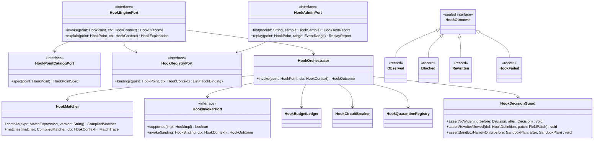
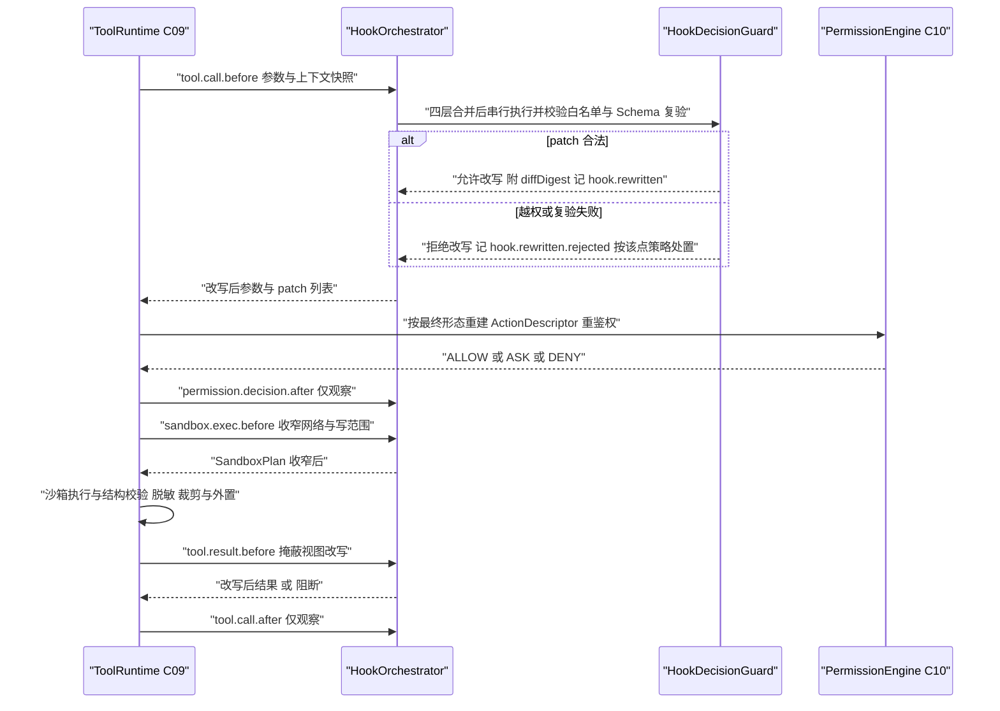
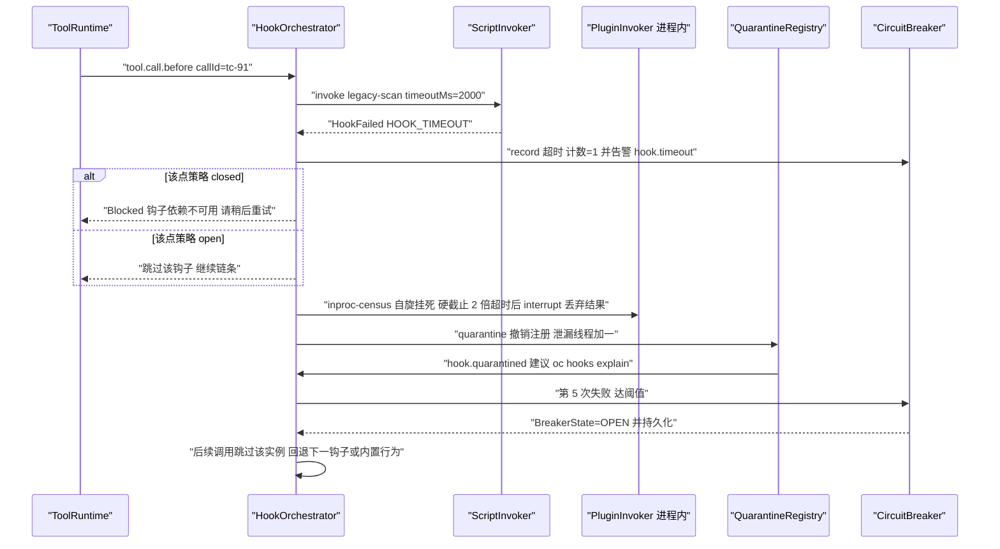
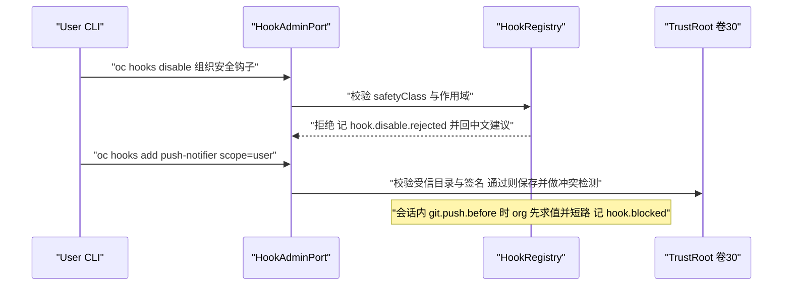
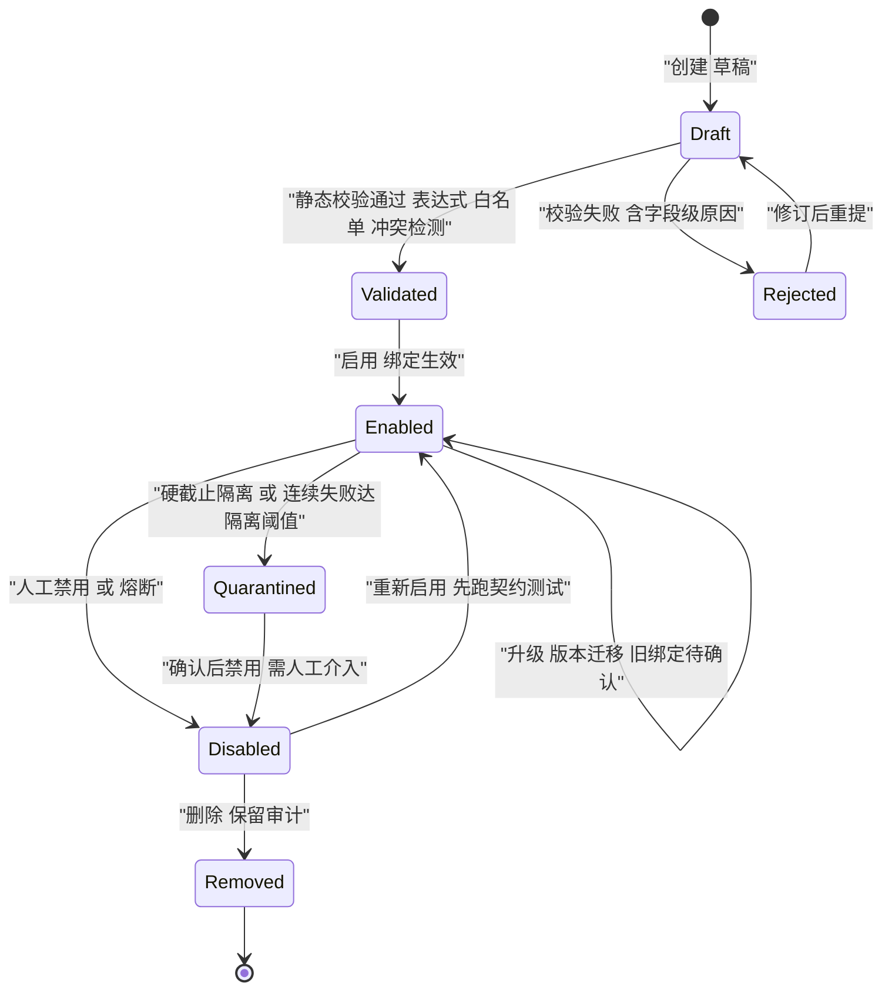

# C23 · HookEngine（钩子引擎：匹配 / 阻断 / 改写 / 沙箱执行）

> 组件编号 C23 ｜ 组件别名 HookEngine + HookRegistry（钩子引擎与钩子注册表）｜ 归属域 内核与运行时（HOOK）｜ 附录 D 组件 K-21
> 上游系统方案：`impl/17-hook-engine-impl.md` §1（范围与六条不变式）、§3.1–§3.7（I-HOOK-1…7 比选）、§4.1–§4.7（架构、57 点目录、工具调用全序、挂死处置、四层合并、修订建议）、§5（类图与 Java 21 签名）、§6/§7（时序与状态机）、§8（表 / Redis Key / 事件）、§9（接口与配置）、§10/§11（并发、降级、安全、DoD）
> 上游契约：卷 17 §2–§8（REQ-HOOK-1…24、D-HOOK-1…9）；`IMPL-DECISIONS.md` §2.17（I-HOOK-1…7）；卷 05 §4.2 与 `impl/05`（管线插入位）；卷 06（权限只可收窄）；卷 07（沙箱计划收窄）；卷 16（事件信封）；卷 18（进程内形态由插件注册）
> 兄弟组件：C09（管线插入位与结果**掩蔽视图**）、C10（决策链与 `narrow` 一致性）、C11（审批撤回点，`ask` 不由钩子产生）、C12（`SandboxPlan` 收窄）、C24（插件禁用 ⇒ 其钩子绑定同步失效）
> 竞品证据：`07-qoder.md`（四类入口与 `ToolName(arg_pattern)` 级 `if` 条件 `[E2]+[E1]`）、`01-claude-code-purpose-built.md`（退出码 `2` 阻断、连续阻断 8 次被内核覆盖、`allowManagedHooksOnly` `[E2]`）、`04-deepseek-harness.md`（waterfall 必须显式 `next()` `[E1]`）、`08-gemini-cli.md`（`trustedHooks` 与 `HookPlanner → HookRunner → HookAggregator` 链 `[E1]`）、`03-codex.md`（钩子输出外溢 `[E2]`）、`02-opencode.md`（`tool.execute.before/after` 强语义 `[E1]`）
> 编号口径：组件层编号 `REQ-C-HOOK-n` / `I-C-HOOK-n` / `X-C23-n`，与系统级 `REQ-HOOK-n` / `I-HOOK-n` **不重号、不覆盖**；类名沿用系统级口径，`HookEngine` 仅作对外族名。
> 不冲突声明：本文件不修改 Phase A 卷册与 35 份系统级方案；与 `impl/17` 的口径差异一律登记在文末「修订建议登记」（待主控分配 `X-n`，台账当前止于 X-82）。

---

## ① 定位与边界

### 1.1 组件构成与模块落位（卷 27 §4.1 权威名）

| 单元 | 职责 | 落点模块 |
| --- | --- | --- |
| `HookPointCatalog` + `HookPointSpec` | 8 类 57 点目录、目录版本号、逐点能力 / `OrderContract` / 默认失败策略 / 挂死记号（事实源生成物） | `harness-contract`（`contract/hook`，零框架） |
| `HookMatcher`（受限文法编译与求值） | 工具名模式（`*` / 精确 / `\|` 或 / 正则）、路径 glob、`ToolName(argPattern)`、与或非；保存期静态校验 + 运行期确定性求值 + 命中依据 | `harness-kernel/kernel-agent`（`hook` 子包） |
| `HookRegistry` + 四层合并 | org → project → user → session 合并、层内 `order`、安全位段不可禁用、托管收紧、保存期冲突检测 | 同上（定义与绑定持久化经端口） |
| `HookOrchestrator` + `HookAggregator` + `HookDecisionGuard` | 顺序执行、阻断短路、预算累计、结果聚合、熔断记账；单向性断言（权限 `ALLOW→ASK→DENY`、沙箱宽→窄）、改写白名单与 Schema 复验、顺序契约断言 | 同上 |
| `HookInvokerPort` 四实现（Rule / Script / Plugin / Http） | 形态载体；脚本经卷 07 `SandboxPlanRequest`（最低 L0+），HTTP 含企业托管子形态 | `harness-platform/platform-hooks`（Spring，`@ConditionalOnMissingBean`） |
| `HookStateStore` + `HookAdminPort` | 预算 / 滑窗 / 熔断 / 隔离（Redis + `oc_hook_health`）；试跑、dry-run、回放、影响面与 `explain` | `platform-hooks` + `platform-persistence` + `host-protocol` |

### 1.2 本组件解决什么 / 不解决什么

| 维度 | 本组件解决 | 归属他处（不解决） |
| --- | --- | --- |
| 顺序 | 逐点「hook / 权限 / 沙箱」三方相对序；装配期断言；改写先于权限、权限后仅观察 | 十一步管线阶段编排与结果处理（C09 / 卷 05） |
| 决策 | 四形态统一执行面与结构化决策协议；阻断短路；返回 `ask` 即拒绝 | deny / ask / allow 的产生与审批编排（C10 / C11 / 卷 06） |
| 改写 | 字段级 JSON Pointer patch、白名单 + Schema 复验、字段级 diff、改写后强制重建鉴权对象 | 重鉴权的判定算法（C10）；脱敏实现（卷 05 步骤 8） |
| 隔离 | 脚本形态最低 L0+ 且网络默认拒绝；沙箱策略改写只可收窄 | 隔离技术档位实现（C12 / 卷 07） |
| 治理与可调试 | 四层合并、安全位段、托管收紧、受信目录、签名分发；超时 / 总预算 / 异步旁路 / 实例熔断 / 隔离与泄漏预算；`test` / `dry-run` / `replay` / `impact` / `explain` | 企业策略源与信任根（卷 24 / 30）；事件总线骨架（卷 16）；插件装载与回卷（C24）；端渲染（卷 22 / 23） |

### 1.3 上下游依赖与失败语义

| 方向 | 对象 | 契约要点 | 失败语义 |
| --- | --- | --- | --- |
| 上游 | C09 管线 | 四个插入点（`TOOL_CALL_BEFORE` / `PERMISSION_DECISION_AFTER` / `TOOL_RESULT_BEFORE` / `TOOL_CALL_AFTER`），默认 no-op 端口 | 钩子不可用不影响管线可用性，按逐点策略处置 |
| 上游 | C10 / C11 | `permission.decision.before` 只允许 `PASS / NARROW / BLOCK`；审批点只可撤回 | 出现放宽即 `HOOK_CONTRACT_VIOLATION` 并冻结该钩子 |
| 上游 | C12 / C24 | `sandbox.exec.before` 只可收窄 `network` / `writeRoots` / 资源上限；插件钩子绑定随插件禁用回卷 | 反向放宽即拒绝；插件 unclean ⇒ 绑定标记不可用 |
| 下游 | 卷 16 / 22 / 33 | `hook.*` 全量入总线（含 `sensitivity` 与 `payload_digest`）；`oc hooks` 命令面与评测夹具 | 总线故障时执行继续、事件本地重试；只读面失败返回空集与降级标记 |

### 1.4 组件内自检不变式

**INV-1 只收窄不放宽**（权限与沙箱两类点只产出 `PASS / NARROW / BLOCK`，放宽即视为权限系统缺陷，对齐 N1/N2）；**INV-2 改写必复验**（仅限 `rewritableFields`，应用后 Schema 复验并按最终形态重建 `ActionDescriptor` 重新鉴权，对齐 N4）；**INV-3 顺序不可运行时改写**（`OrderContract` 只在装配期断言，`oc_hook_order_violation_total` 应恒为 0）；**INV-4 挂死不阻塞**（任一钩子落「超时 → 按策略处置 → 隔离 / 熔断」的确定分支，不存在等待分支，对齐 N5）；**INV-5 全量审计**（含超时、跳过、覆盖与拒绝，只记摘要与 `payload_digest`，无敏感明文，对齐 N6）；**INV-6 试跑零副作用**（`test` / `dry-run` 不写真实副作用、不触发通知、不污染熔断与预算）。

---

## ② 功能需求清单（REQ-C-HOOK-n）

| ID | 需求描述 | 来源 | 优先级 | 验收要点 |
| --- | --- | --- | --- | --- |
| REQ-C-HOOK-1 | 目录与顺序契约：8 类 57 点逐点声明能力 / 顺序 / 默认失败策略 / 挂死记号，目录版本化并由装配期断言守护 | `impl/17` §4.2、REQ-HOOK-1/11、I-HOOK-1 | P0 | 顺序快照测试改一处即失败；未知点拒绝绑定并报候选名 |
| REQ-C-HOOK-2 | 四形态统一执行面（Rule / Script / Plugin / Http，含托管子形态）；形态缺失标 `IMPL_UNAVAILABLE` | `impl/17` §3.3、REQ-HOOK-2、I-HOOK-3 | P0 | 四形态各一条端到端用例；形态不可用**不静默跳过** |
| REQ-C-HOOK-3 | 三级能力 `observe` / `block` / `rewrite`；`rewrite` 必须携带白名单且默认关闭，开启后字段级 diff 留痕 | `impl/17` §3.5、REQ-HOOK-3/15、I-HOOK-5 | P0 | 未声明白名单即装载期拒绝；越权改写产生 `hook.rewritten.rejected` |
| REQ-C-HOOK-4 | 四层合并与治理：org → project → user → session；安全位段不可被下级禁用；`allowManagedHooksOnly` 时仅托管绑定参与求值 | `impl/17` §4.5、REQ-HOOK-4/21、I-HOOK-6 | P0 | 四层合并用例全过；禁用请求被拒并留痕 |
| REQ-C-HOOK-5 | 受限文法匹配（工具名 / 路径 glob / `ToolName(argPattern)` / 与或非）；保存期静态校验、运行期可解释命中依据 | `impl/17` §3.2、REQ-HOOK-12、`07-qoder` `[E2]` `if: "Bash(git push *)"` | P0 | 语义矩阵全过；无回溯灾难（深度 / 长度上限）；非法表达式保存期拒绝 |
| REQ-C-HOOK-6 | `ask` 归属：该点不支持 `ask`；人工确认由 `tool.call.before` 表达并经权限链裁决 | REQ-HOOK-14、`07-qoder` `[E2]`、L-066 | P0 | 钩子返回 `ask` 被拒并审计；与 C10 一致性用例 |
| REQ-C-HOOK-7 | 超时、挂死与预算：单钩子 2s、单次调用 5s 总预算、观察类异步旁路、进程内硬截止隔离、剩余同步钩子确定性跳过 | `impl/17` §4.4、REQ-HOOK-7、I-HOOK-4 | P0 | 病态脚本 30s 不阻塞主流程（时间断言）；预算事件可观测 |
| REQ-C-HOOK-8 | 实例级熔断 + 隔离双通道（连续 5 次失败熔断、冷却 60s 半开；硬截止隔离并撤销注册；泄漏线程计入预算） | `impl/17` §7.3、REQ-HOOK-8 | P0 | 熔断与半开用例全过；隔离状态重启后仍生效 |
| REQ-C-HOOK-9 | 防活锁：同实例对同回合连续阻断 8 次（可配）由内核覆盖并结束回合，记录覆盖理由 | REQ-HOOK-16、`01-claude-code` `[E2]`、L-065 | P1 | 按实例 × 回合计数；覆盖产生 `hook.block.overridden` |
| REQ-C-HOOK-10 | waterfall 显式委派：串行链未调用 `proceed` 即视为阻断，理由固定 `CHAIN_NOT_PROCEEDED` 并记审计 | REQ-HOOK-18、`04-deepseek` `[E1]` | P0 | 未委派用例产生 `hook.blocked` 且理由正确 |
| REQ-C-HOOK-11 | 试跑与回放：`test` / `dry-run` / `replay` / `impact` / `explain`；临时会话 + 副作用旁路；回放只读事件流并显式报告缺口 | `impl/17` §6.4、REQ-HOOK-9、I-HOOK-7 | P1 | 试跑后真实环境零变更；熔断计数不增长 |
| REQ-C-HOOK-12 | 敏感访问与出站边界：默认掩蔽；`sensitiveAccess` 授权后读取全量留痕；出站仅摘要 + 引用 + `payload_digest`；未受信目录拒绝装载 | `impl/17` §10.3、REQ-HOOK-24/19、`08-gemini-cli` `[E1]` | P0 | 未授权读取被掩蔽；受信目录用例被拒且原因可读 |

---

## ③ 关键设计决策（I-C-HOOK-n）

| ID | 主题 | 选定 | 被放弃分支与代价 | 回退触发 |
| --- | --- | --- | --- | --- |
| I-C-HOOK-1 | 匹配编译产物的缓存与失效 | 按目录版本缓存编译产物（进程内 LRU，`catalogVersion` 变更即整体失效），产物为不可变判定节点数组，缓存键 `(catalogVersion, hookId)` | 放弃逐次解析（热路径 P95 不可控）与持久化共享（失效一致性成本高于收益） | 编译耗时 P95 > 3ms 或命中率 < 95% → 目录装载期一次性全量预编译 |
| I-C-HOOK-2 | 四形态调用面的统一与退避 | `HookInvokerPort` 列表 + `supported(impl)` 静态判定 + 装配期唯一性断言；无宿主标记 `IMPL_UNAVAILABLE`；退出码仅作脚本形态兼容层 | 放弃编排器内 `switch`（每新增形态改编排器）与每形态独立编排器（治理语义四份漂移） | 单形态实现数超 2 且行为分叉 → 提取形态无关的 `HookInvocationKernel` |
| I-C-HOOK-3 | 改写传播与再校验的承载 | 钩子只产出 `FieldPatch` 列表，校验后由调用方（C09）显式应用再重建鉴权对象；应用序保证「后者见前者结果」 | 放弃就地改写（验证前已生效，无法回退）与整份替换（无法做字段级白名单） | patch 无法表达的高频场景 → 受限 `expand` 宏（最多 2 个同工具调用，逐个重鉴权） |
| I-C-HOOK-4 | 预算、熔断与隔离的状态载体 | Redis 滑窗计数 + `oc_hook_health` 持久化隔离 / 熔断 + 进程内只读快照 | 放弃纯进程内（多实例不一致、隔离态重启丢失）与全量落 PG（热路径写放大） | Redis 不可用 → 降级进程内计数 + 告警，且安全类钩子一律按 `closed` 处置 |

> 全部四条落在 `impl/17` §3 的 I-HOOK-1…7 选定分支内，仅细化边界；「计数可容忍滑窗误差、状态必须持久化」是本层新增口径。

---

## ④ 类图



**说明**：`HookOutcome` 为 sealed 层次，四个 record 与它同包且各自独立编译单元（`permits` 要求），字段见 `impl/17` §5；`Disposition ∈ {PASS, STOP, APPLY, SKIP, FAIL_CLOSED}` 是对主流程的唯一处置词汇。`HookBudgetLedger`（预算余量）、`HookCircuitBreaker`（滑窗与冷却）、`HookQuarantineRegistry`（隔离与泄漏线程）三者接口签名见 §8 算法与 `impl/17` §5；`HookQuarantineRegistry` 与 `HookCircuitBreaker` 是两条独立路径——前者冻结定义（撤销注册），后者只跳过执行；四形态实现（`RuleInvoker` / `ScriptInvoker` / `PluginInvoker` / `HttpInvoker`）均在 `platform-hooks`，内核只见 `HookInvokerPort`。

---

## ⑤ 核心流程时序图

### 5.1 流程 A：工具调用全序（改写 → 重鉴权 → 沙箱收窄 → 结果掩蔽改写）

**前置条件**：`prod-lint-guard`（`rewrite`，字段 `args.command`）与 `audit-recorder`（`observe`）已绑定；权限模式 `default`；改写能力已由企业开启（默认关闭）。
**主路径**：参数校验通过 → `tool.call.before` → patch 通过白名单与 Schema 复验 → 重建 `ActionDescriptor` 重鉴权 → `permission.decision.after` 观察 → `sandbox.exec.before` 收窄 → 沙箱执行 → `tool.result.before` 掩蔽视图改写 → 脱敏 → `tool.call.after` 观察。
**异常与补偿**：patch 越权 → 丢弃该改写（`open`）或阻断（`closed`）并产生 `hook.rewritten.rejected`；权限 DENY → 回喂策略引用；沙箱不可用 → 显式错误 + 降级建议。
**幂等与并发点**：执行记录以 `(point, sessionId, turnId, callId)` 为幂等键；同回合同钩子经 `RedisKeys.hookExecLock` 键控互斥串行。



### 5.2 流程 B：超时、挂起与预算耗尽的确定性处置

**前置条件**：`tool.call.before` 绑定 6 个同步钩子（3 个 `closed`、3 个 `open`）；`legacy-scan`（脚本，`closed`）休眠 30s；`inproc-census`（进程内插件回调，`closed`）自旋挂死。
**主路径**：2s 无响应触发超时 → 按 `closed` 阻断该点 → 回喂「前置校验不可用」；进程内挂死达硬截止 2×timeout → `interrupt` + 结果丢弃 + 隔离；同实例连续失败 5 次 → 熔断并持久化。
**异常与补偿**：预算耗尽点为 `closed` → 整体阻断（禁止静默放行）；泄漏线程超 `leak-budget`（默认 3）→ 整点降级为「仅内置校验」并告警；回合取消 → 在途钩子折叠为 `Failed{reason=CANCELLED}`，不污染熔断计数。
**幂等与并发点**：计数维度 `(hookId, sessionId)`；隔离状态写 `oc_hook_health`，重启后仍生效；重复隔离请求幂等。



### 5.3 流程 C：四层合并与安全位段（要点）

**前置条件**：org 绑定 `compliance-block-force-push`（`block`，matcher `ToolArgCondition(Bash, "git push *")`，`safetyClass=S`）；user 试图禁用并新增 `push-notifier`。
**主路径**：禁用被拒（`hook.disable.rejected`）→ 新增绑定经保存期冲突检测 → 求值序 org → project → user → session，org 命中即短路。
**异常与补偿**：未受信目录的钩子被拒装载且原因可读；托管收紧下非托管绑定保持存储但不激活；同点同字段「改写 vs 阻断」互斥组合直接拒绝。
**幂等与并发点**：绑定变更走版本号乐观锁（`RedisKeys.hookBindingVersion`）；同会话并发变更键控互斥串行。



---

## ⑥ 状态机

### 6.1 `HookDefinition` 生命周期



**迁移补全（触发 / 守卫 / 副作用）**：`Draft → Validated`——触发：保存期校验（表达式文法、白名单非空、同点冲突检测）；副作用：写定义版本号与校验报告。`Enabled → Quarantined`——触发：进程内挂死达硬截止或连续失败达隔离阈值；守卫：隔离阈值与熔断阈值**独立计数**；副作用：注册撤销 + `oc_hook_health.state=quarantined` + `hook.quarantined`（重启后仍生效）。`Quarantined → Disabled` 必须人工介入，禁止自动恢复——隔离是「实现已不可信」判定，与熔断「暂时跳过」语义不同。

**实例熔断与防活锁（状态与迁移，与上图并列）**：`Closed → Open`——同实例 `(hookId, sessionId)` 连续失败或超时达阈值（默认 5 次，窗口 10 分钟）；`Open → HalfOpen → Closed`——冷却 60s 后半开探测 1 次，成功计数归零、失败冷却重计；`Open → Disabled` 需人工确认或企业强制。防活锁独立计数：同实例对同回合阻断达 `max-block-per-turn`（默认 8）即进入 `BlockCapped`，内核覆盖阻断并结束回合并记 `hook.block.overridden`，随后回 `Closed`。**不变量**：① 熔断按实例而非按点计数；② `Open` 期间调用直接跳过并记 `hook.circuit.open`，不阻塞主流程；③ `BlockCapped` 只覆盖阻断语义，不改变能力声明；④ 用户取消导致的失败折叠为 `CANCELLED`，不计入熔断与防活锁计数。

---

## ⑦ 接口与依赖矩阵

### 7.1 对外接口（内核契约，零框架依赖）

```java
package com.hk.opencoding.contract.hook;

/**
 * 钩子决策守卫：单向性断言、改写白名单校验与顺序契约断言的唯一入口。
 * 全部方法为纯函数（不持状态、不做 IO），单测与装配期断言复用同一实现。
 */
public final class HookDecisionGuard {

    /** 权限方向序（只允许由左向右收窄，反向即放宽） */
    private static final List<Decision> NARROW_ORDER = List.of(Decision.ALLOW, Decision.ASK, Decision.DENY);

    private HookDecisionGuard() {
    }

    /**
     * 校验改写是否被该钩子声明的白名单覆盖。
     * @param def   钩子定义（必填；rewritableFields 非空，否则视为配置缺陷）
     * @param patch 字段级改写（必填；JSON Pointer 必须落在白名单内并通过 Schema 复验）
     * @throws HarnessException 越权字段或 Schema 复验失败时抛 HOOK_REWRITE_DENIED，含字段名
     */
    public static void assertRewriteAllowed(HookDefinition def, FieldPatch patch) {
        // 白名单外字段一律拒绝：改写只允许触碰显式声明字段，避免静默语义破坏（N4）
        for (PatchOp op : patch.ops()) {
            if (!def.rewritableFields().contains(op.pointer())) {
                throw new HarnessException(HookErrorCode.HOOK_REWRITE_DENIED,
                        "改写字段未声明，field=" + op.pointer() + "，hookId=" + def.hookId());
            }
        }
    }

    /**
     * 断言权限决策只发生收窄、未发生放宽。
     * @param before 钩子干预前的决策（必填）
     * @param after  钩子干预后的决策（必填）
     * @throws HarnessException 出现放宽（如 DENY 变 ALLOW）时抛 HOOK_CONTRACT_VIOLATION
     */
    public static void assertNoWidening(Decision before, Decision after) {
        // 出现放宽即视为权限系统缺陷：冻结该钩子，禁止钩子实现自行解释「收窄」
        if (NARROW_ORDER.indexOf(after) < NARROW_ORDER.indexOf(before)) {
            throw new HarnessException(HookErrorCode.HOOK_CONTRACT_VIOLATION,
                    "钩子试图放宽权限：before=" + before + "，after=" + after);
        }
    }
}
```

`Disposition`（`PASS` / `STOP` / `APPLY` / `SKIP` / `FAIL_CLOSED`，含 `code` + `desc` 与非法值 `of(code)` 抛业务异常）与 `HookOutcome` 的 sealed 层次签名见 `impl/17` §5；本组件不新增契约取值。**层次纪律**：内核与契约侧统一抛 `HarnessException(HookErrorCode, 中文文案)`；平台侧（沙箱执行器、HTTP 客户端）统一抛 `BusinessException(ErrorCode)` 并由外壳全局异常处理器按码映射；钩子**运行期**失败折叠为 `HookFailed` 并按逐点策略处置，不以异常穿透主流程。

### 7.2 依赖与被依赖矩阵

| 关系 | 端口 / 组件 | 契约要点 | 失效影响 |
| --- | --- | --- | --- |
| 依赖 | `EventSinkPort`（卷 16） | `hook.*` 全量投递，含 `sensitivity` 标注 | 执行继续，事件本地重试；不阻塞主流程 |
| 依赖 | `RuntimeStorePort`（Redis） | 预算余量、失败滑窗、熔断状态、绑定版本号、键控互斥 | 降级进程内计数 + 告警；安全类钩子一律 `closed` |
| 依赖 | `StoragePort` + `TransactionPort` | 四表（`oc_hook` / `oc_hook_binding` / `oc_hook_execution` / `oc_hook_health`）；绑定变更乐观锁 | 只读模式：既有绑定继续求值，禁止新增与禁用 |
| 依赖 | `SandboxPort`（C12）/ `TrustPort`（卷 30）/ `SecretPort` | 脚本最低 L0+ 且网络默认拒绝；受信目录与签名判定；密钥只注入短期句柄引用 | 脚本形态与含密钥绑定标记不可用并按逐点策略处置 |
| 被依赖 | C09 / C10 / C11 / C12 / C24 / 卷 22 / 33 | 四点插入位与收窄断言；插件钩子绑定随禁用回卷；命令面与评测夹具 | 钩子不可用时管线按默认 no-op 继续；插件 unclean ⇒ 绑定标记不可用；只读面返回空集 |

### 7.3 配置项（`open-coding.hooks.*`）

| 配置键 | 含义 | 默认 | 必填 | 环境变量 |
| --- | --- | --- | --- | --- |
| `enabled` | 总开关（企业可强制关闭全部用户钩子） | `true` | 否 | `OC_HOOKS_ENABLED` |
| `default-timeout-ms` / `total-budget-ms` | 单钩子超时 / 单次调用总预算 | `2000` / `5000` | 否 | `OC_HOOKS_DEFAULT_TIMEOUT_MS`、`OC_HOOKS_TOTAL_BUDGET_MS` |
| `max-per-scope` / `max-sync-per-point` | 每作用域绑定上限 / 单点同步钩子上限 | `50` / `10` | 否 | `OC_HOOKS_MAX_PER_SCOPE` |
| `circuit.failure-threshold` / `circuit.cooldown-ms` / `max-block-per-turn` / `leak-budget` | 熔断阈值与冷却 / 防活锁阈值 / 泄漏线程预算 | `5` / `60000` / `8` / `3` | 否 | `OC_HOOKS_CIRCUIT_FAILURE_THRESHOLD`、`OC_HOOKS_MAX_BLOCK_PER_TURN` |
| `rewrite.enabled` / `allow-managed-only` | 改写总开关 / 仅托管钩子 | `false` / `false` | 否 | `OC_HOOKS_REWRITE_ENABLED` |
| `output-inline-limit-bytes` | 输出内联上限（超出落对象存储并回喂引用） | `262144` | 否 | `OC_HOOKS_OUTPUT_INLINE_LIMIT_BYTES` |
| `script.interpreters` / `http.egress-profile` | 允许解释器集合 / 出网档案 | `sh,python3,node` / `hook-default` | 否 | `OC_HOOKS_SCRIPT_INTERPRETERS` |

**纪律**：全部键以 `${ENV_VAR:default}` 声明并同步 `.env.example`；配置类为纯数据类**不加** `@Component`，字段 JavaDoc 标明用途、默认值与影响范围；枚举 code（`HookCapability` / `HookPoint`）禁止配置化。

---

## ⑧ 关键算法

### 8.1 算法 A：钩子匹配与优先级合并

**匹配求值（保存期编译 + 运行期确定性）**：① 保存期把 `MatchExpression` 编译为不可变判定节点数组（工具名模式 → 精确 / 或 / 正则预编译；路径 glob → 段匹配器；`ToolName(argPattern)` → 工具名谓词 + 参数通配器；与或非 → 短路求值节点）；文法受限：无变量引用与函数调用、嵌套深度 ≤ 8、正则禁用回溯型构造。② 运行期按固定顺序求值并产出 `MatchTrace`（每节点命中 / 未命中与命中依据）供 `oc hooks explain` 使用；未命中即不执行该绑定。③ 无隐式全匹配——空 matcher 必须显式写成 `AllMatch`，否则保存期拒绝。

**四层合并与优先级**：① 取四层绑定（org → project → user → session），逐层过滤（`enabled`、托管收紧、`IMPL_UNAVAILABLE`、熔断中）；② 层内排序键 `(order 升序, hookId 字典序)`，层间序固定 org 先、session 后（**不参与 order 比较**）；③ 顺序执行并累计预算；④ 首个 `Blocked` 即短路并记录「被短路钩子清单」；⑤ 聚合：改写按序叠加（后者见前者结果）、观察注解合并、失败按逐点策略折叠。

**复杂度**：编译 O(m)（保存期一次）；求值 O(m) 每绑定；合并 O(n log n)。**边界条件**：同层同 `order` 必须收敛到字典序（多实例与多次执行结果一致）；`safetyClass=S` 的绑定不参与任何可跳过过滤。

### 8.2 算法 B：改写传播与再校验

步骤：① 收集全部 `Rewritten` 结果并按 (`layer`, `order`, `hookId`) 排序 patch；② 逐条校验（白名单 → JSON Pointer 语法 → Schema 复验 → 沙箱策略单向性）；③ 应用 patch 得到最终形态快照（应用即产生字段级 diff，含前后值摘要与 `payload_digest`）；④ 按最终形态重建 `ActionDescriptor` 并**重新鉴权**（不可跳过，对齐 N2）；⑤ 任一 patch 失败即整体丢弃该钩子的全部 patch（禁止部分应用），并按该点策略决定 `open` 继续或 `closed` 阻断；⑥ 全部成功才把最终形态交给调用方执行。

**复杂度** O(k·d)（k 为 patch 数、d 为节点深度）；**边界条件**：同字段被多钩子改写时以最终值为准但两条 diff 都必须留痕；`tool.result.before` 只作用于掩蔽视图字段，未声明 `sensitiveAccess` 时敏感字段在 patch 中不可定位（占位符路径不匹配即视为越权）。

### 8.3 算法 C：预算、熔断与防活锁计数

`remaining = totalBudgetMs − Σ(已执行同步钩子耗时)`；执行前 `reserve(costMs)` 失败即不执行并写 `hook.budget.exhausted`；该点为 `closed` 时整体阻断（禁止静默放行），否则该点剩余同步钩子全部跳过。失败滑窗以 `(hookId, sessionId)` 为键在 Redis 上 10 分钟原子自增，达阈值即写 `oc_hook_health.circuit_state=OPEN` 与冷却截止；同回合同实例阻断计数键为 `RedisKeys.hookBlockCount(hookId, turnId)`，达 `max-block-per-turn` 后内核覆盖并结束回合并记 `hook.block.overridden`。

---

## ⑨ 错误处理与降级

### 9.1 错误矩阵（内核侧 `HookErrorCode` ⊆ `HarnessException`）

| 场景 | 错误码 | retryable | 处置 | 面向用户文案（中文） |
| --- | --- | --- | --- | --- |
| 定义 / 绑定 / 执行记录不存在 | `HOOK_NOT_FOUND` | 否 | 拒绝并提示刷新 | 「钩子不存在：`<hookId>`，请刷新列表后重试」 |
| 顺序契约被破坏 | `HOOK_ORDER_VIOLATION` | 否 | 装配期 Fail-Fast，禁止启动 | 「钩子顺序契约损坏，属发布门禁缺陷」 |
| 改写未声明字段 / 下级禁用组织钩子 | `HOOK_REWRITE_DENIED` | 否 | 拒绝改写或禁用请求并留痕 | 「改写字段未声明：`<field>`」/「组织安全钩子不可被下级禁用」 |
| 决策越权（放宽权限、输出非法 JSON） | `HOOK_CONTRACT_VIOLATION` | 否 | 拒绝 + 冻结该钩子 + 审计 | 「钩子试图放宽受限边界，已被拒绝并冻结」 |
| 定义被隔离 / 熔断打开期间调用 | `HOOK_QUARANTINED`、`HOOK_CIRCUIT_OPEN` | 隔离否 / 熔断是（冷却后半开） | 跳过该实例或回退，主流程零阻塞 | 「钩子 `<hookId>` 已被隔离，需人工确认后重新启用」/「暂时熔断，默认 60s 后自动探测」 |
| 形态不可用（解释器缺失 / 托管不可达） | `UNSUPPORTED_CAPABILITY` | 否 | 绑定标记 `IMPL_UNAVAILABLE`，**不静默跳过** | 「钩子形态不可用：`<implType>`，请改配或停用该绑定」 |
| 挂死超时 | `HOOK_TIMEOUT`（折叠为 `HookFailed`） | 按策略 | `closed` 阻断 / `open` 跳过；脚本形态强化终止 | 「前置校验超时（`<timeout>ms`），已按安全策略处置」 |

### 9.2 fail-open / fail-closed 逐点定义（本组件权威口径）

**判定来源**：目录事实源逐点标注 `safetyClass ∈ {S, N}` 与 `failurePolicy ∈ {open, closed}`（REQ-HOOK-22 生成物），运行期唯一读取入口为 `HookPointCatalog.spec(point).defaultFailurePolicy()`。

| 类目 | 代表点 | `safetyClass` | 默认策略 | 可否被下级改为 `open` | 挂死处置 |
| --- | --- | --- | --- | --- | --- |
| A 会话与轮次 | `turn.start.before`、`turn.complete.before` | S | `closed` | 否（仅 org 可声明例外并留痕） | `T2+B5+CB` |
| B 阶段与计划 | `phase.plan.before`、`workitem.create.before` | S | `closed` | 否 | `T2+B5+CB` |
| C 上下文与 D 模型 | `context.inject.before`（防注入）、`context.assemble.before`、`model.request.before`（仅参数收窄） | S | `closed` | 否 | `T2+B5+CB` |
| E 工具 | `tool.call.before`、`tool.result.before` | S | `closed` | 否 | `T2+B5+CB` |
| F 权限与审批 | `permission.decision.before`、`approval.request.before` | S | `closed` | 否（硬约束） | `T2+B5+CB` |
| G 提交与 Git / H 沙箱与系统 | `git.commit.before`、`git.push.before`、`sandbox.exec.before`、`subagent.spawn.before`、`system.shutdown.before` | S | `closed` | 否 | `T2+B5+CB` |
| 全部 `*after` 观察点与通知 / 统计类点 | `plugin.load.after`、`system.ready.after`、`turn.complete.after` | N | `open` | 不适用（本就开放） | `AO`：超时仅丢弃结果并记账 |

**fail-open 三条红线（命中任一条即强制 `closed`）**：① 参与权限 / 沙箱 / 审批 / 危险判定类点（F、H 类）；② 目录未标注 `safetyClass=N` 的点（未标注一律按 `S` 处理）；③ `rewrite` 能力点（改写不可用即不可放行，避免「静默不改写 = 语义变更」）。**fail-closed 的唯一例外**：`AO` 异步观察点超时后丢弃结果并继续（记 `hook.observation.dropped`），因其结论不参与主流程判定。

### 9.3 降级阶梯（由轻到重，任一级触发即写事件并告警）

① **形态降级**：解释器缺失 / 托管不可达 → 绑定 `IMPL_UNAVAILABLE` 并按逐点策略处置（不静默跳过）；② **背压降级**：租户并发超 32 → 排队，队列满转 `skipped{reason=backpressure}`；③ **熔断降级**：实例连续失败 5 次 → `OPEN` 跳过该实例，主流程零阻塞；④ **隔离降级**：定义级硬截止或连续失败 → `Quarantined` 并冻结定义；⑤ **全量降级**：全部钩子熔断 / 隔离 → 回退内置行为并在会话内显式提示「本次会话未启用钩子干预」；⑥ **fail-closed 收口**：`safetyClass=S` 的钩子在上述任一级不可用时一律按 `closed` 处置，禁止降级为放行。

---

## ⑩ 性能与并发

| 指标 | 预算 | 说明 |
| --- | --- | --- |
| 进程内回调单次开销 | P95 ≤ 500µs | 纯内存求值 + 聚合，不引入序列化 |
| 脚本 / HTTP 形态 | P95 ≤ 800ms（含围栏）/ P95 ≤ 1.2s（含 1 次重试） | 解释器进程池 ≤ 4 热实例；HTTP 复用连接池 + 域名白名单 |
| 单点同步钩子总耗时 | P95 ≤ `total-budget-ms`（默认 5s） | 超预算按 §9.3 处置 |
| 目录装载与匹配缓存 | 500 绑定 ≤ 300ms；编译产物命中 ≥ 95%；单点 10 个同步钩子（命中 1）P95 ≤ 15ms | 按 `catalogVersion` 失效（I-C-HOOK-1）；`oc_hook_latency_ms` 与 `oc_hook_order_violation_total == 0` 为门禁 |

**并发模型**：编排器为无状态纯函数 + 端口，可多实例横向扩展；阻断 / 改写类钩子**必须串行**（保证「后者见前者结果」），观察类可并行（`max-parallel-observe` 默认 4）；脚本与 HTTP 等待使用虚拟线程；同回合同钩子经 `RedisKeys.hookExecLock(sessionId, turnId, pointCode)` 键控互斥（租约 30s 心跳续租）；预算计数维度 `(hookId, sessionId)`，总预算维度 `(sessionId, turnId)`——**多会话预算互相独立**。

**容量（单实例保守子集）**：10 万回合/日 ≈ 100 万次执行/日（均值 ≈ 12 EPS，峰值 5× ≈ 60 EPS）；脚本进程池峰值 ≤ 1GB（池满按背压排队，不新建）；`oc_hook_execution` 100 万行/日、90 天 ≈ 9000 万行（月分区，审计投影长期保留）；输出外溢 7 天 TTL、单条上限 256KB。

---

## ⑪ 测试要点

| 层级 | 用例 | 断言要点 |
| --- | --- | --- |
| 单元（零框架） | 57 点逐个断言 `OrderContract` 与默认失败策略；目录版本 diff 快照 | 顺序改一处即失败；逐点默认值与 §9.2 表逐条一致 |
| 单元 | 匹配矩阵（`*` / 精确 / `\|` / 正则 / 路径 glob / `ToolArgCondition` / 与或非）与非法表达式 | 命中依据可解释；无隐式全匹配；无回溯爆炸 |
| 单元 | 合并律与能力：四层顺序、层内 `order`、阻断短路、安全位段；`observe` 不改对象、`rewrite` 越权被拒 | INV-1…INV-4 逐条断言；禁用请求被拒并留痕 |
| 单元 | 守卫单向性：`DENY→ALLOW`、沙箱 `network.mode` 反向放宽、增补域名、扩大 `writeRoots` | 全部拒绝、抛 `HOOK_CONTRACT_VIOLATION` 并冻结 |
| 集成 | 病态脚本 30s / 进程内自旋挂死 / 预算耗尽 / 熔断与半开 / 泄漏线程超预算 | 主流程不被挂死（时间断言）；预算耗尽行为与点策略一致；隔离重启后仍生效 |
| 集成 | 四形态端到端；HTTP 托管（域名白名单、5xx 与超时降级）；脚本读未声明变量 / 访问网络 / 越权写路径；未受信目录与未签名钩子 | 形态不可用标 `IMPL_UNAVAILABLE`；违规与未受信来源全部被拒并留痕 |
| 契约 | `test` 零副作用；`dry-run` 只评估不应用；`replay` 覆盖缺口显式；未委派链产生 `CHAIN_NOT_PROCEEDED` | 试跑前后真实环境零变更；熔断计数与通知不增长 |

```bash
mvn -pl harness-kernel/kernel-agent -am test -Dtest='HookPointCatalogTest,HookMatcherTest,HookMergeRuleTest,HookDecisionGuardTest' -DfailIfNoTests=false
mvn -pl harness-platform/platform-hooks -am verify -Dtest='HookInvokerIT,HookTimeoutIT,HookCircuitIT,HookSandboxBoundaryIT' -DfailIfNoTests=false
mvn -pl harness-host/host-bootstrap -am test -Dtest='HookEndToEndIT' -DfailIfNoTests=false
mvn -pl harness-host/host-bootstrap -am verify -Phook-gates
scripts/ci/hook-fault-inject.sh --case hang-script-30s,budget-exhaust,circuit-trip-5x,catalog-rollback,chain-not-proceeded
```

**完成定义**：① 57 点目录与版本号落地且逐点策略由事实源生成、CI 校验 freshness；② 四形态可用、`rewrite` 默认关闭且改写后强制重鉴权；③ 四层合并、安全位段与托管收紧生效；④ 熔断、隔离、预算耗尽、防活锁、挂死五类分支全有事件与告警且挂死不阻塞主流程；⑤ `test` / `dry-run` / `replay` / `impact` / `explain` 零副作用；⑥ `oc_hook_order_violation_total == 0` 且隔离计数在门禁用例中受控。

---

## 修订建议登记（本文件提出，待主控分配 `X-n`；台账当前止于 X-82）

| 本地编号 | 冲突 / 缺口 | 依据 | 建议修订 | 阻塞性 |
| --- | --- | --- | --- | --- |
| `X-C23-1` | 兼容层缺落点：`impl/17` §3.3 选定「退出码语义仅作兼容适配层（`ExitCodeAdapter`）」，但 §5 类图、§9 接口表与配置项均未给出该适配器的类、配置键与事件口径，实现层无法确定它是形态内拦截还是脚本输出后处理 | `impl/17` §3.3 与 §5/§9 对照 | 在 §5 增列 `ExitCodeAdapter`（`ScriptInvoker` 内部组件，退出码 → `HookOutcome` 确定性映射：`0`→`Observed`、`2`→`Blocked`、其他→按逐点策略）并补配置键 `open-coding.hooks.script.exit-code-compat`（默认 `false`）与命中审计说明 | 否（增量） |
| `X-C23-2` | 关闭类钩子语义缺口：`session.close.before` 与 `system.shutdown.before` 默认 `closed` 且可 `block`，但未定义非交互档 / 托管收紧下能否被永久阻断，也无二次阻断上限与人工裁决通道（REQ-HOOK-16 只覆盖回合内阻断） | `impl/17` §4.2 逐点表、§4.4 防活锁行 | 明确关机类点位每实例每进程阻断最多生效 1 次，二次阻断转人工裁决事件（`hook.block.escalated`）；非交互档记审计后强制关机；`max-block-per-turn` 不适用于关机类点 | 否（增量，需与卷 34 运维运行时对齐） |
| `X-C23-3` | 回放数据源双口径：`impl/17` §6.4 声明 `replay` 只读**事件流**，而 §8.1 `oc_hook_execution` 提供明细 90 天保留与月度分区，两者保留窗口与字段（`error_code` / `diff_digest`）不同，覆盖缺口判定可能随数据源漂移 | `impl/17` §6.4 与 §8.1 对照；`impl/16` 事件保留口径 | 在 §6.4 补权威口径：回放事实源为**事件流**，`oc_hook_execution` 仅用于 `impact` 统计与审计投影；两类缺口都必须显式报告，禁止以执行表补齐事件流缺口 | 否（措辞级 + 一句口径） |
| `X-C23-4` | 目录事实源生成物路径未指定：REQ-HOOK-22 的生成式目录（YAML → 枚举 + 顺序断言 + 逐点默认策略）在 `harness-contract` 的包路径、生成器归属与 CI freshness 命令未定义，跨 17/18 两卷（C24 的 I-PLG-1 同构）可能各写一套生成器 | `impl/17` §1.4 I-HOOK-1 落点、`impl/18` §3.1 I-PLG-1 | 与 C24 的 `X-C24-1` 合并登记：两份目录事实源共用一套生成器与门禁（`scripts/ci/catalog-freshness.sh`），生成物包路径固定为 `com.hk.opencoding.contract.{hook,plugin}.catalog` | 否（增量；与 C24 同源） |
