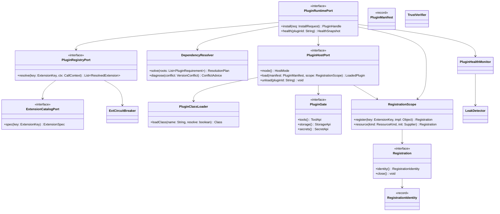
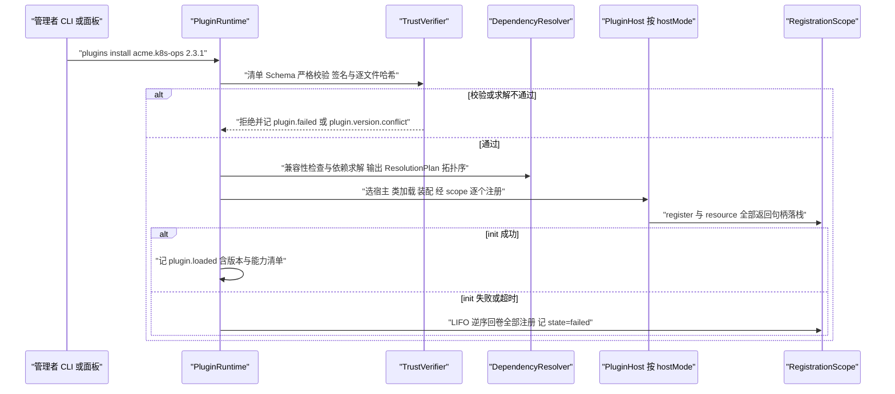
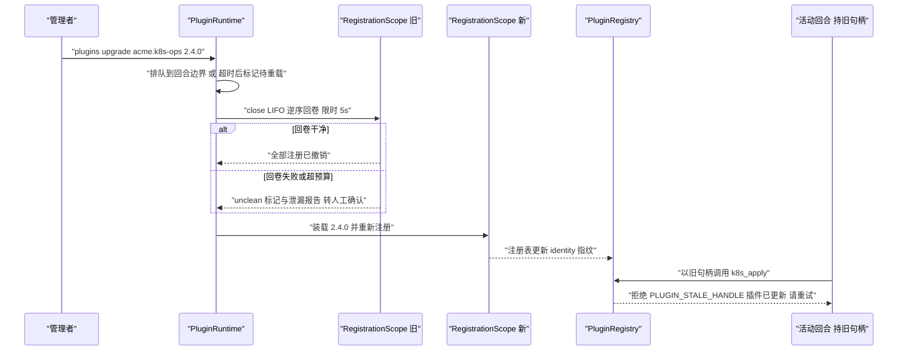
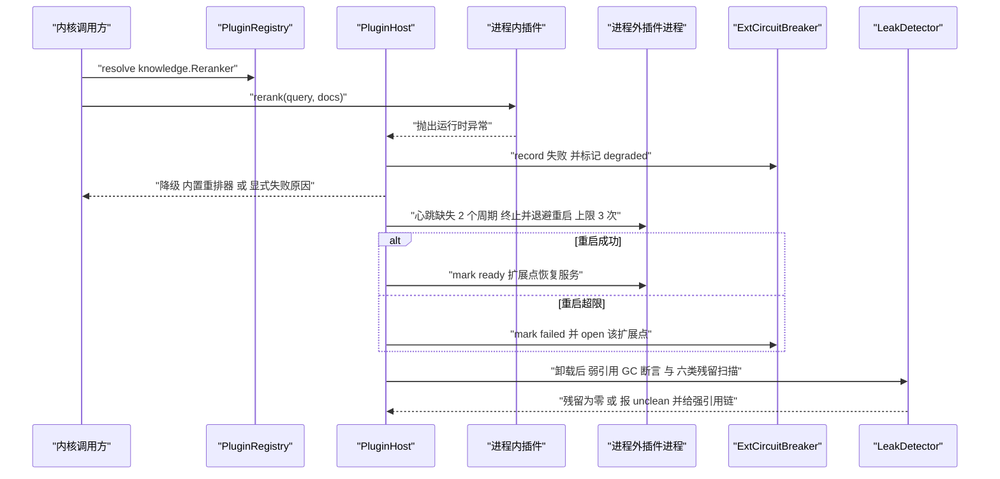
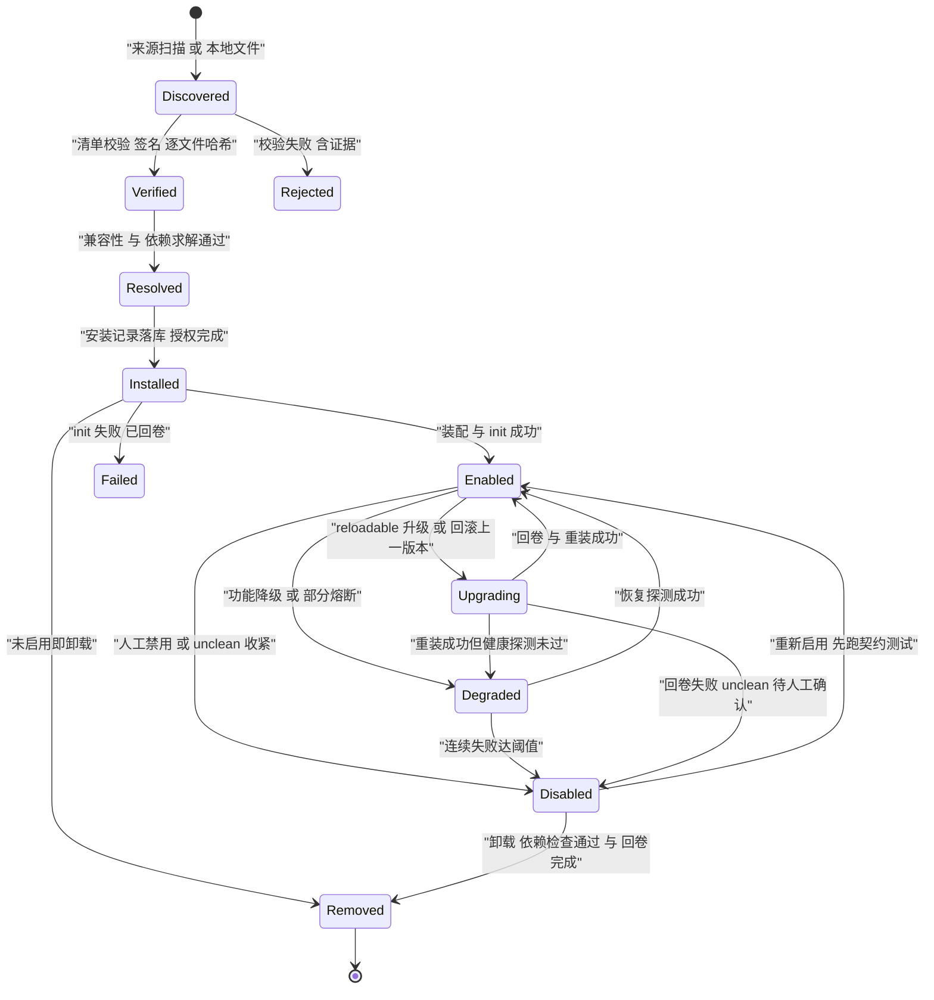

# C24 · PluginLoader（插件装载器：类加载隔离 / 依赖求解 / disposer 语义）

> 组件编号 C24 ｜ 组件别名 PluginLoader + RegistrationScope（装载器与注册作用域）｜ 归属域 内核与运行时（PLG）｜ 附录 D 组件 K-23（含 K-22 目录的装载期消费面）
> 上游系统方案：`impl/18-plugin-runtime-impl.md` §1（范围与六条不变式）、§3.1–§3.7（I-PLG-1…7 比选）、§4.1–§4.7（架构、扩展点目录与安全关键标注、disposer 模型、权限门面、三形态对照、泄漏检测、修订建议）、§5（类图与 Java 21 签名）、§6/§7（时序与状态机）、§8（表 / Redis Key / 事件）、§9（REST / CLI / SPI / 配置）、§10/§11（并发、降级、安全、DoD）
> 上游契约：卷 18 §2–§8（REQ-PLG-1…24、D-PLG-1…12）；`IMPL-DECISIONS.md` §2.18（I-PLG-1…7）；卷 01（装载在内核装配之后、首会话之前）；卷 06（安装期授权 + 运行期门面校验）；卷 07（进程外插件隔离档位）；卷 16（`plugin.*` 事件）；卷 17（插件只能绑定既有点）
> 兄弟组件：C10 / C11（授权位与审批通道）、C12（进程外走卷 07 档位表）、C13（Skill 与插件共用打包 / 签名 / 市场机制）、C14（MCP 连接与插件共用注册作用域）、C23（进程内钩子绑定随插件禁用回卷）
> 竞品证据：`04-deepseek-harness.md`（Cordis 可逆副作用与注册全部回卷、`config-catalog` 启动期校验 `[E1]`）、`02-opencode.md`（`PluginHost` 面收敛、按插件 ID `KeyedMutex`、`loading.has(id)` 拒绝装载环、`Effect.addFinalizer`、失败进 `failures` 不阻塞其它插件、同权限插件是反面教材 `[E1]`）、`07-qoder.md`（`plugin.json` 清单、`plugins install --scope`、marketplace 命名空间、内置安全能力以 vendored 插件分发 `[E2]+[E1]`）、`01-claude-code-purpose-built.md`（`plugin.json` + `marketplace.json` + 内置插件 ID `{name}@builtin`、`dependencyResolver.ts` `[E2]+[E1]`）、`08-gemini-cli.md`（`integrity.ts` 逐文件哈希与 `extensions install/enable/disable` `[E1]`）
> 编号口径：组件层编号 `REQ-C-PLUGIN-n` / `I-C-PLUGIN-n` / `X-C24-n`，与系统级 `REQ-PLG-n` / `I-PLG-n` **不重号、不覆盖**；类名沿用系统级口径（`PluginRuntime` / `PluginClassLoader` / `RegistrationScope` / `DependencyResolver` / `PluginGate` 等）。
> 不冲突声明：本文件不修改 Phase A 卷册与 35 份系统级方案；与 `impl/18` 的口径差异一律登记在文末「修订建议登记」（待主控分配 `X-n`，台账当前止于 X-82）。

---

## ① 定位与边界

### 1.1 组件构成与模块落位（卷 27 §4.1 权威名）

| 单元 | 职责 | 落点模块 |
| --- | --- | --- |
| 清单模型 + 扩展点目录消费面 | `PluginManifest`（id / 版本 / `kernelRange` / `hostMode` / 扩展点 / 权限 / Schema / 依赖 / `reloadable` / 签名态）；目录 `ExtensionSpec` 稳定性与兼容区间校验 | `harness-contract`（`contract/plugin`，零框架） |
| `DependencyResolver` + 锁文件 | 区间合并、环检测、拓扑排序、冲突诊断（禁用 / 升级 / 降级 / 换来源四类建议）、同锁文件同装载顺序 | `harness-platform/platform-plugin`（`pure` 子包，无 Spring 注解） |
| `PluginClassLoader` | 双亲委派反转 + 契约白名单 + 禁内核实现包 + JDK 子集；资源加载与类加载同规则；卸载后类加载器可回收 | 同上（`platform-plugin`，Spring 装配） |
| `RegistrationScope` + `Registration` + `RegistrationIdentity` | 注册即副作用：全部注册返回句柄，禁用 / 卸载按 LIFO 逆序回卷，幂等且限时（默认 5s），超预算标记 `unclean` | `platform-plugin`（`pure` 子包） |
| `PluginHostPort` 三实现（InProcess / OutOfProcess / Remote） | 按 `hostMode` 选择宿主；进程外默认 JSON-RPC over stdio（可选 gRPC/socket 加速）、远程 HTTP/gRPC + 短期服务令牌 | `platform-plugin` + `harness-platform/platform-sandbox`（卷 07） |
| `TrustVerifier` + 制品存储 | Ed25519 清单签名 + 逐文件哈希清单 + 来源记录；企业 `trust-root` 缺失即启动失败 | `platform-plugin` + `platform-persistence` |
| `PluginGate`（权限门面）+ `ExtCircuitBreaker` + `PluginHealthMonitor` + `LeakDetector` | 逐调用授权位校验（含租户与命名空间边界）、扩展点级熔断、健康快照、六类残留检测（类加载器 / 线程 / 连接 / 定时器 / 临时文件与密钥句柄 / 注册表） | `platform-plugin` + `platform-persistence`（`oc_plugin*`） |

### 1.2 本组件解决什么 / 不解决什么

| 维度 | 本组件解决 | 归属他处（不解决） |
| --- | --- | --- |
| 装载与隔离 | 清单严格校验、兼容性检查、依赖求解、三形态装载、`init` 限时与失败回卷；进程内类加载隔离与受限 API 面、进程外进程边界、远程客户端边界 | 各扩展点自身语义（各卷）；隔离技术档位实现（C12 / 卷 07） |
| 回卷与依赖 | LIFO disposer 栈、幂等回卷、限时回卷、`unclean` 与残留检测；插件 × 插件 / 技能 / 内核版本统一求解与锁文件 | 生命周期操作的审批与影响面呈现（C11 / 卷 22 / 23）；Skill 内容包装载（C13 / 卷 08） |
| 权限与供应链 | 安装期授权录入（人在场）+ 运行期门面逐调用校验；签名与逐文件哈希、来源分级与白名单 | 授权判定算法与审批通道（C10 / C11）；信任根托管（卷 30）；市场审核（卷 29） |
| 可观测 | 健康状态、按插件命名空间隔离日志、扩展点调用指标、熔断与重启计数 | 事件总线骨架（卷 16）；端渲染（卷 22 / 23） |

**诚实边界**：进程内隔离面向「误用与依赖冲突」，**不承诺拦住同 JVM 内的恶意代码**（反射不可完全封堵）；恶意或不可信插件一律走进程外 / 远程形态（REQ-C-PLUGIN-9）。

### 1.3 上下游依赖与失败语义

| 方向 | 对象 | 契约要点 | 失败语义 |
| --- | --- | --- | --- |
| 上游 | 内核装配（卷 01）/ C10 / C11 | 装载在内核装配之后、首会话之前；安装期授权（R4/R5 风险级，人在场）；`permission.policy` 类扩展点只能收窄 | 装配缺陷 Fail-Fast；越权即拒绝 + 审计 + 熔断计数（`plugin.permission.denied`） |
| 上游 | C12 / 卷 07、C23 / 卷 17 | 进程外插件与插件脚本走 `SandboxPlanRequest`，远程出网走代理与域名白名单；进程内钩子只绑定既有点且随插件禁用回卷 | 沙箱不可用 ⇒ 进程外形态不可装载；插件 `unclean` ⇒ 其钩子绑定标记不可用 |
| 下游 | 卷 16 / 22 / 23 / 29 / 30 | `plugin.*` 与 `extension.*` 事件；CLI 与桌面面板；市场客户端；供应链扫描 | 事件投递失败本地重试；只读面失败返回空集与降级标记 |

### 1.4 组件内自检不变式

**INV-1 注册即副作用**（任何注册必须返回 `Registration` 句柄，禁用 / 卸载按 LIFO 回卷且回卷可重入；`RegistrationScope` 不存在 `void` 重载，对齐 N1）；**INV-2 不直连存储不跨租户**（只能经端口访问本租户本命名空间数据，对齐 N2）；**INV-3 权限只收窄**（插件权限不得超过安装者，对齐 N3）；**INV-4 未验不装**（签名 + 逐文件哈希覆盖清单与全部载荷文件，对齐 N4）；**INV-5 故障隔离**（单插件故障只影响自身注册的扩展点，对齐 N5）；**INV-6 不替换内核**（Agent 循环、压缩、权限裁决链、事件骨架不可被替换或 patch，对齐 N6）。

---

## ② 功能需求清单（REQ-C-PLUGIN-n）

| ID | 需求描述 | 来源 | 优先级 | 验收要点 |
| --- | --- | --- | --- | --- |
| REQ-C-PLUGIN-1 | 目录与稳定性契约消费：122 类扩展点逐条校验稳定性级别与 `compatible` 区间，未知扩展点 / 越界版本拒绝注册 | `impl/18` §4.2、REQ-PLG-1、I-PLG-1 | P0 | 未知键注册被拒（Fail-Fast）；`experimental` 默认不加载 |
| REQ-C-PLUGIN-2 | 三形态装载：同一插件二进制在进程内 / 进程外 / 远程行为一致（除性能与隔离差异），插件代码不感知宿主形态 | `impl/18` §4.5、REQ-PLG-2、I-PLG-3 | P0 | 同一 `ContractSuite` 三形态全绿；远程需令牌且绑定租户 |
| REQ-C-PLUGIN-3 | 清单严格校验：缺字段或非法字段装载期 Fail-Fast，清单无「隐式默认」 | `impl/18` §4.2、REQ-PLG-3 | P0 | 缺 `kernelRange` / `hostMode` / 权限声明即拒绝并指明字段 |
| REQ-C-PLUGIN-4 | 依赖求解：区间合并 + 拓扑排序 + 环检测；冲突给出四类可操作建议与约束来源链 | `impl/18` §3.4、REQ-PLG-4/15、I-PLG-4 | P0 | 同锁文件同装载顺序；自环与互环给出环路径 |
| REQ-C-PLUGIN-5 | 进程内类加载隔离：委派反转 + 契约白名单 + 禁内核实现包；引用内核实现类必须**加载失败而非静默成功** | `impl/18` §3.2、REQ-PLG-5、I-PLG-2 | P0 | 反射越界用例失败；卸载后类加载器可回收（弱引用断言） |
| REQ-C-PLUGIN-6 | 注册即副作用：全部注册返回句柄、LIFO 回卷、幂等、回卷失败隔离并告警；超预算标记 `unclean` 且禁止热重载 | `impl/18` §4.3、REQ-PLG-13、I-PLG-5、`04-deepseek` `[E1]` | P0 | 卸载后残留全零（线程 / 连接 / 定时器 / 临时文件 / 注册表） |
| REQ-C-PLUGIN-7 | 身份快照：句柄冻结 `(pluginId, version, artifactDigest)`；热替换后旧句柄调用被**明确拒绝**而非静默执行新实现 | `impl/18` §3.7、REQ-PLG-14、`02-opencode` `[E1]` | P0 | 旧句柄返回「插件已更新，请重试」；连续出现判插件缺陷 |
| REQ-C-PLUGIN-8 | 权限门面：每次调用校验授权位 + 租户与命名空间边界；不直连 DB/Redis/对象存储、不跨租户、密钥只以引用出现 | `impl/18` §4.4、REQ-PLG-7/11、`02-opencode` 反面教材 `[E1]` | P0 | 逐能力族越权用例全拒 + 审计；密钥明文用例失败 |
| REQ-C-PLUGIN-9 | 崩溃隔离：进程内异常降级到内置或显式失败；进程外崩溃按退避重启（1s/2s/4s，上限 3 次）；远程熔断后不重放已成功副作用 | `impl/18` §10.2、REQ-PLG-10/16 | P0 | 内核与其它插件不受影响；降级路径逐条可测 |
| REQ-C-PLUGIN-10 | 预算：10 插件装载 ≤ 1.5s、单插件 `init` ≤ 10s（超时即失败并回卷）、单插件回卷 ≤ 5s | `impl/18` §9.4/§10.1、REQ-PLG-10 | P0 | 超时用例触发回卷与隔离；装载耗时入门禁指标 |
| REQ-C-PLUGIN-11 | 供应链：清单签名（Ed25519 + 组织信任根）+ 逐文件哈希（覆盖脚本 / 提示词 / UI 资源 / 二进制）；`trust-root` 缺失启动失败 | `impl/18` §3.6、REQ-PLG-20、`08-gemini-cli` `[E1]` | P0 | 任改一文件即拒绝并给出文件级 diff；来源四要素可查 |
| REQ-C-PLUGIN-12 | 泄漏与残留治理：`Cleaner` 仅作兜底；单插件三类及以上泄漏进入 `unclean`（禁热重载，装载前人工确认）；注册表与 `oc_extension_registry` 对账 | `impl/18` §4.6、REQ-PLG-13 | P1 | `oc_plugin_residue_total{kind}` 全零；`unclean` 后装载被拒 |

---

## ③ 关键设计决策（I-C-PLUGIN-n）

| ID | 主题 | 选定 | 被放弃分支与代价 | 回退触发 |
| --- | --- | --- | --- | --- |
| I-C-PLUGIN-1 | 类加载委派边界的实现形态 | 自研 `PluginClassLoader`：契约前缀白名单（`com.hk.opencoding.contract.*`，迁移期含 `core.api.*`）向上委派、插件私有类自加载、禁包清单抛 `ClassNotFoundException`、JDK 子集向上委派、**资源与类同规则** | 放弃同 `ClassLoader`（依赖冲突与内部 API 泄漏不可控）与 JPMS 图层（上游 SDK 未全面模块化） | 白名单维护或反射逃逸超阈值 → 切换 JPMS 图层 + 清单增模块声明 |
| I-C-PLUGIN-2 | 依赖求解的输入与确定性载体 | 清单声明 + **锁文件**（与 `file_hashes` 同链）+ 依赖白名单 + 传递依赖裁剪；同一锁文件保证同装载顺序 | 放弃「仅运行期扫描解析」（顺序不可预测）与嵌入 Maven Resolver（依赖面小、诊断成本高） | 依赖图 > 300 节点或冲突工单 > 20/季 → 引入回溯求解器（锁文件格式兼容） |
| I-C-PLUGIN-3 | disposer 栈与回卷预算承载 | 每插件单栈 `RegistrationScope`：LIFO + 幂等 + 5s 预算；超预算中断并标 `unclean`；`Cleaner` 仅兜底 | 放弃 `Cleaner` / `PhantomReference` 承载正确性（时机不可控）与 Spring 生命周期（内核零 Spring，覆盖不到非 Bean 注册） | 不触发（不变式 INV-1 无备选） |
| I-C-PLUGIN-4 | 身份快照的判定点 | 句柄内冻结 `RegistrationIdentity`，调用期与注册表当前 identity 比对；不一致即 `PLUGIN_STALE_HANDLE` 拒绝 | 放弃版本号全局单调比较（表达不了构件摘要变化）与不做判定（静默执行新实现属缺陷） | 重载引发会话状态错乱 → 收紧为「重载仅在无活动回合时执行」（排队到回合边界） |

---

## ④ 类图



**说明**：`RegistrationScope.register` 返回 `Registration`（**没有** `void` 重载）——INV-1 在类型系统上的落地。`PluginClassLoader` 仅进程内形态出现，进程外与远程由 `PluginHostPort` 实现替代，三者对上层暴露同一 `ExtensionKey` 解析面；`PluginGate` 暴露的方法集合被契约测试冻结（面收敛为「命名空间 `transform` + `reload` + 少量命令式动作」），新增门面方法必须走 `harness-contract` 版本演进；`TrustVerifier` / `ExtCircuitBreaker` / `PluginHealthMonitor` / `LeakDetector` 的成员签名见 §8 与 `impl/18` §5，`LeakDetector` 六类检测项与 `oc_plugin_residue_total{kind}` 同源。

---

## ⑤ 核心流程时序图

### 5.1 流程 A：装载流水线（扫描 → 校验 → 求解 → 类加载 → 装配 → 就绪 / 失败回卷）

**前置条件**：制品已落制品存储；企业策略允许该来源；`hostMode` 与发行形态匹配；`trust-root` 已配置。
**主路径**：读清单 → 签名与逐文件哈希 → 兼容性（内核 / 扩展点 / 宿主形态）→ 依赖求解 → 按 `hostMode` 选宿主并类加载 → 逐个注册（全部返回句柄）→ `init` 限时 → 就绪。
**异常与补偿**：任一步失败 → 逆序回卷已完成装配 → 记 `plugin.failed` 并隔离，不影响内核与其它插件（REQ-C-PLUGIN-9）。
**幂等与并发点**：装载按插件 ID 键控互斥（`RedisKeys.pluginKeyedMutex`）串行；同 ID 在加载中再次 `add` 即拒绝（`PLUGIN_LOAD_CYCLE`）。



### 5.2 流程 B：注册即副作用、热重载与身份快照

**前置条件**：`acme.k8s-ops` 标记 `reloadable=true`；存在活动回合持有旧版本工具句柄。
**主路径**：升级指令 → 排队到回合边界 → 关闭旧 scope（LIFO 回卷）→ 装载新版本（新 scope）→ 注册表 identity 递增 → 旧句柄调用被拒。
**异常与补偿**：回卷失败或超预算 → 该插件 `unclean`，新版本装载转人工确认（**不静默恢复**）；旧句柄返回「插件已更新，请重试」而非静默执行新实现。
**幂等与并发点**：重载按插件 ID 互斥；`Registration.close()` 幂等；disposer 内再次注册被拒并记 `plugin.disposer.failed`。



### 5.3 流程 C：崩溃隔离与卸载回收

**前置条件**：`acme.rag-index`（进程内）在 `knowledge.Reranker` 上抛异常；`acme.vault`（进程外）进程被杀；随后 `acme.rag-index` 被禁用卸载。
**主路径**：进程内异常被宿主捕获 → 降级到内置实现（存在时）或显式失败 → 熔断计数；进程外心跳丢失 → 终止并按退避重启（上限 3 次）；卸载 → LIFO 回卷 → 弱引用 + GC 断言 → 六类残留扫描。
**异常与补偿**：重启超限 → 保持 `failed`，扩展点长期降级；类加载器未回收 → 报 `plugin.classloader.leak` 并给强引用链；残留命中 → `unclean` 且禁热重载。
**幂等与并发点**：重启按 `oc_extension_registry` 重建注册计划（可复现）；降级期调用不重放（避免重复副作用），只做内置兜底或显式失败。



---

## ⑥ 状态机

### 6.1 `Plugin` 生命周期



**迁移补全（触发 / 守卫 / 副作用）**：`Installed → Removed`——触发：未启用即卸载；守卫：无 pending 授权与在途装载；副作用：清理制品引用（保留 30 天回滚窗口）、写 `plugin.removed`。`Upgrading → Disabled`——触发：回卷失败或超预算；副作用：`unclean=true` + 泄漏报告 + 禁止热重载。`Enabled → Degraded`——触发：扩展点失败率超阈值或 `deprecated` 告警；副作用：仅受影响扩展点走降级路径，其余能力继续服务。

### 6.2 扩展点注册与类加载器生命周期（文字状态机）

- **注册态**：`Registered`（`scope.register` 返回句柄）→ `Active`（装配完成进入服务）→ `Degraded`（失败率超阈值）→ `CircuitOpen`（连续失败达阈值，冷却后半开）→ `Withdrawn`（禁用 / 卸载或句柄 `close`）。迁移为条件更新，`state` 不匹配即放弃本地动作（并发重载场景）。
- **类加载器态**：`Loading`（受键控互斥保护）→ `Active` → `Closing`（LIFO 回卷并释放引用）→ `Collected`（弱引用 + 一次 GC 断言）或 `Leaked`（报 `plugin.classloader.leak`，禁热重载并转人工定位强引用链）。
- **`unclean` 语义**：回卷失败 / 残留命中 / 三类及以上泄漏即置位；`unclean` 插件禁止热重载（只能冷启 + 人工确认，确认动作载体见 `X-C24-4`）。

---

## ⑦ 接口与依赖矩阵

### 7.1 对外接口（内核契约，零框架依赖）

```java
/**
 * 注册作用域：同一插件实例的全部注册落在同一栈内，禁用 / 卸载按 LIFO 逆序回卷；回卷幂等且限时。
 */
@Slf4j
@RequiredArgsConstructor
public final class RegistrationScope implements AutoCloseable {

    private final Deque<Registration> stack = new ArrayDeque<>();
    private final PluginId pluginId;
    private final Duration rollbackBudget;

    /**
     * 注册一个扩展点实现。
     * @param key  扩展点键（必填；必须在目录中且稳定性契约允许该宿主形态）
     * @param impl 实现对象（必填；进程内为对象引用，进程外为描述符）
     * @return 注册句柄（非空；调用方必须持有直至回卷）
     * @throws PluginException 扩展点未知、版本区间不满足或权限未授权时抛出
     */
    public Registration register(ExtensionKey key, Object impl) {
        // 契约校验：未知键、稳定性区间、宿主形态、授权位缺一即拒（Fail-Fast）
        ExtensionSpec spec = catalog.require(key);

        // 冻结身份指纹：热替换后旧句柄必须可被识别为失效（REQ-C-PLUGIN-7）
        RegistrationIdentity identity = RegistrationIdentity.of(pluginId, spec, artifactDigest());

        // 落栈登记；注册顺序即回卷逆序（LIFO 保证依赖关系正确：先建的连接最后关）
        Registration registration = new DefaultRegistration(key, identity, () -> detach(key, identity));
        stack.push(registration);
        log.info("插件注册扩展点，pluginId={}, key={}, version={}", pluginId.value(), key.code(),
                identity.version());
        return registration;
    }
}
```

`PluginClassLoader`（委派矩阵与禁包规则的完整签名，见 §8.2 与本文件 `X-C24-3`）、`RegistrationScope.resource(kind, init)` 与 `PluginRuntimePort` / `PluginGate` 各能力族接口的完整签名见 `impl/18` §5 与 §9。**层次纪律**：内核与契约侧统一抛 `PluginException(PluginErrorCode, 中文文案)`；外壳侧（类加载器 / 进程宿主 / 远程客户端 / 市场与 REST 面）统一抛 `BusinessException(ErrorCode)` 并由全局异常处理器映射；插件**运行期**单次调用失败折叠为 `CallOutcome` 并按扩展点契约降级，不以异常穿透主流程。

### 7.2 依赖与被依赖矩阵

| 关系 | 端口 / 组件 | 契约要点 | 失效影响 |
| --- | --- | --- | --- |
| 依赖 | `StoragePort` + `TransactionPort` | 五表（`oc_plugin` / `oc_plugin_version` / `oc_plugin_grant` / `oc_plugin_health` / `oc_extension_registry`）；安装与授权同事务边界 | 不可写 → 拒绝新装载（Fail-Fast），已启用插件继续服务 |
| 依赖 | `RuntimeStorePort`（Redis）/ `SecretPort` / 卷 07 沙箱（C12） | 键控互斥、熔断、失败滑窗、健康快照、远程令牌；密钥只注入短期句柄引用（TTL 可吊销）；进程外插件与脚本走 `SandboxPlanRequest`，远程出网走代理与白名单 | 降级进程内计数 + 告警；远程令牌失效即显式失败；声明密钥的扩展点标记不可用；沙箱不可用 ⇒ 进程外形态不可装载（显式错误） |
| 被依赖 | C23 / C13 / C14 / 卷 22 / 23 / 29 / 30 | 插件钩子绑定、Skill 与 MCP 连接注册均经 `RegistrationScope`；命令面、面板、市场客户端、供应链扫描 | 插件 `unclean` ⇒ 相关绑定与连接标记不可用；只读面失败返回空集；写操作一律转审批 |

### 7.3 配置项（`open-coding.plugin.*`）

| 配置键 | 含义 | 默认 | 必填 | 环境变量 |
| --- | --- | --- | --- | --- |
| `enabled` / `allow-in-process` | 插件总开关 / 是否允许进程内插件（企业可强制全进程外） | `true` / `true` | 否 | `OC_PLUGIN_ENABLED`、`OC_PLUGIN_ALLOW_IN_PROCESS` |
| `marketplace.enabled` / `private-repo.url` | 公共市场开关（默认关闭） / 组织私仓地址 | `false` / 空 | 否 | `OC_PLUGIN_MARKETPLACE_ENABLED`、`OC_PLUGIN_PRIVATE_REPO_URL` |
| `trust-root` | 组织信任根公钥路径（**启用插件时必填**，缺失启动失败） | 空 | 是 | `OC_PLUGIN_TRUST_ROOT` |
| `load-budget-ms` / `init-timeout-ms` / `rollback-budget-ms` | 装载总预算（10 插件）/ 单插件 `init` 超时 / 单插件回卷预算 | `1500` / `10000` / `5000` | 否 | `OC_PLUGIN_LOAD_BUDGET_MS` |
| `circuit.failure-threshold` / `circuit.cooldown-ms` / `restart.backoff` | 扩展点级熔断阈值与冷却 / 进程外重启退避（上限 3 次） | `5` / `60000` / `1s,2s,4s` | 否 | `OC_PLUGIN_CIRCUIT_FAILURE_THRESHOLD` |
| `remote.lease-ttl` / `leak-check` | 远程服务令牌 TTL / 卸载后残留检测 | `15m` / `true` | 否 | `OC_PLUGIN_REMOTE_LEASE_TTL` |
| `security-critical-override` | 允许企业显式启用安全关键扩展点的插件替换（需 admin 审批留痕） | `false` | 否 | `OC_PLUGIN_SECURITY_CRITICAL_OVERRIDE` |

**纪律**：全部键以 `${ENV_VAR:default}` 声明并同步 `.env.example`；配置类为纯数据类**不加** `@Component`，字段 JavaDoc 标明用途、默认值与影响范围；枚举 code（`StabilityLevel` / `HostMode` / `ResourceKind`）禁止配置化。

---

## ⑧ 关键算法

### 8.1 算法 A：依赖求解与版本冲突

输入为三族约束：插件 × 插件（清单 `dependencies`）、插件 × 技能、插件 × 内核版本（`kernelRange`），约束形如 `(name, range)`。步骤：① 以根需求集合建立有向图（节点为插件坐标，边为「依赖」）；② **区间合并**：同坐标多约束取交集，交集为空即冲突（不做静默取最大值）；③ **环检测**（DFS 三色标记，命中灰节点即报环并输出环路径，对应 `PLUGIN_LOAD_CYCLE`）；④ **拓扑排序**：同层节点按坐标字典序排序，保证「同锁文件同装载顺序」；⑤ **冲突诊断**：产出约束来源链（谁要求了哪个区间）与四类建议（禁用 / 升级 / 降级 / 换来源）及依据；⑥ **锁文件**：解析结果与逐文件哈希同链写入 `oc_plugin_version`（`deps` / `file_hashes`），装载前先比对，不一致即拒绝并报告 diff。

**复杂度** O(V + E)；**边界条件**：同一插件多主版本并存直接拒绝（不回溯尝试）；传递依赖未列入白名单即拒绝；求解必须**确定性**——同一输入两次求解输出逐字节一致，否则视为缺陷。

### 8.2 算法 B：类加载隔离与资源释放

**委派矩阵**：契约前缀（`contract.*`，迁移期含 `core.api.*`）→ 父加载器；JDK 前缀 → 父加载器；插件私有类 → 自身加载并缓存；禁包前缀（`kernel.*` / `platform.*` / `domain.*` / `infrastructure.*`）→ 抛 `ClassNotFoundException`；**`getResource` / `getResources` 与类加载同规则**（避免「类不可见但配置可读」的旁路）。反射越界尝试与门面拒绝同口径计入 `plugin.permission.denied`。

**卸载与资源释放**：① `RegistrationScope.close()` 按 LIFO 逐项回卷（连接 → 定时器 → 线程池 → 临时目录 → 注册表项 → 密钥句柄），每项幂等且限时（总预算 5s）；② 释放类加载器强引用（插件线程、`ThreadLocal`、JDK 全局注册表一律登记并清理）；③ 弱引用 + 触发一次 GC + `Reference.enqueue()` 断言；④ 六类残留扫描，命中即 `plugin.<kind>.leak`，按「三类及以上泄漏即 `unclean`」收口；⑤ 注册表与 `oc_extension_registry` 对账（`state=withdrawn` 逐条核对），差异产生 `extension.registry.reconciled`。

**复杂度**：回卷 O(k)；GC 断言为常量次操作；**边界条件**：`Cleaner` 仅作兜底（不得作为回收时机依赖）；卸载期间禁止新注册（disposer 内注册被拒并记 `plugin.disposer.failed`）；重启按 `oc_extension_registry` 重建注册计划（事实源唯一）。

---

## ⑨ 错误处理与降级

### 9.1 错误矩阵（内核侧 `PluginErrorCode` ⊆ `HarnessException`）

| 场景 | 错误码 | retryable | 处置 | 面向用户文案（中文） |
| --- | --- | --- | --- | --- |
| 插件 / 版本 / 扩展点注册不存在 | `PLUGIN_NOT_FOUND` | 否 | 拒绝并提示刷新 | 「插件不存在：`<pluginId>`，请刷新列表后重试」 |
| 依赖区间冲突 / 内核区间不满足 / 被依赖时卸载 | `PLUGIN_VERSION_CONFLICT` | 否 | 拒绝并附四类建议与约束来源链 | 「插件版本冲突，请按建议禁用、升级、降级或更换来源」 |
| 签名不符 / 信任根不匹配 / 逐文件哈希差异 | `PLUGIN_SIGNATURE_INVALID` | 否 | 拒绝装载（**禁止跳过校验**）并附文件级证据 | 「制品校验失败：`<file>` 哈希不一致，请从受信来源重新获取」 |
| 越权能力位（安装期申请 / 运行期调用） | `PLUGIN_PERMISSION_DENIED` | 否 | 拒绝 + 审计 + 熔断计数（授权位只可收窄） | 「插件无权访问该能力，已拒绝并记录审计」 |
| 依赖图自环 / 互环；热重载后旧句柄跨回合调用 | `PLUGIN_LOAD_CYCLE`、`PLUGIN_STALE_HANDLE` | 否 | 拒绝并给出环路径 / 拒绝该次调用（框架自动重新解析） | 「检测到插件依赖环：`<path>`」/「插件已更新，请重试」 |
| 扩展点熔断 / 隔离期内调用 | `PLUGIN_QUARANTINED` | 是（冷却后半开） | 同步类扩展点按契约降级（内置兜底或显式失败） | 「该能力暂时不可用，已按内核内置能力继续」 |
| 回卷失败 / 残留检测命中；宿主形态不支持 | `PLUGIN_UNCLEAN`、`UNSUPPORTED_CAPABILITY` | 否 | 前者禁热重载并转人工；后者按 `alternatives` 换形态或显式失败 | 「插件卸载未清理干净，需人工确认后重新启用」/「当前环境不支持该插件形态：`<hostMode>`」 |

### 9.2 fail-open / fail-closed 逐点定义（本组件权威口径）

**判定来源**：`ExtensionSpec` 的 `securityCritical` 标注（`impl/18` §4.2 固定清单）+ 插件清单的扩展点声明；`securityCritical` 的实现默认**只可叠加收窄**，不得替换或停用内置实现（`security-critical-override` 默认 `false`）。

| 面 | 典型扩展点 | 策略 | 具体处置 |
| --- | --- | --- | --- |
| 安全关键（fail-closed，禁止放行） | `SecretResolver`、`NetworkPolicy`、`CredentialBroker`、`IsolationProvider`、`AuditSink`、`RiskAssessor`、`PolicyProvider`、`PolicyRule`、`ApprovalPolicy`、`ContentSanitizer`、`InjectionDetector`、`RedactionRule` | **保守落人工** | 判定类失败 → 决策链落 `ask` 或 `UNAVAILABLE`（REQ-PLG-23）；收窄类失败 → 取最严档（白名单取交集、脱敏取最强、隔离档取最高）；审计类失败 → 追加本地审计并告警，**不得静默丢弃审计** |
| 装载与生命周期（fail-closed，拒绝或转人工） | `PluginTrustPolicy`、签名与哈希校验、`trust-root`、回卷引擎、`LeakDetector` | **拒绝装载或停止自动化** | 信任策略不可用或校验不完整 ⇒ 拒绝装载（企业作用域强制，**不得**退化为「仅整包哈希」）；回卷失败或残留命中 ⇒ `unclean` + 禁热重载 + 转人工确认 |
| 热路径非安全（fail-open，可降级） | `ToolProvider`（非安全工具）、`ToolDecorator`、`Reranker`、`EmbeddingProvider`、`Parser` / `Chunker`、`ReportFormatter`、`NotificationChannel`（非审计）、UI 面板 / 命令 / 卡片、`EventConsumer`（非审计投影） | **降级或跳过** | 有内置实现 → 降级到内置；无内置 → 显式失败并回喂原因；观察类 → 跳过 + 告警；**均不阻塞内核与其它插件** |

**fail-open 三条红线（命中任一条即强制 fail-closed）**：① 参与安全判定的扩展点（上表第 1 行清单及其同族新增项）；② 参与权限 / 沙箱 / 审计 / 供应链接入的扩展点；③ 策略型插件的判定能力（权限规则、风险判定、AI 审阅）——失败必须落人工 `ask` / `UNAVAILABLE`，**放行路径不存在**。**fail-closed 的唯一例外**：观察与呈现类扩展点（UI 面板、通知模板、非审计投影）失败时允许跳过并告警，因其结论不参与任何安全判定。

### 9.3 降级阶梯（由轻到重，任一级触发即写事件并告警）

① **热路径降级**：扩展点实现失败 / 超时 → 内置兜底或显式失败（`PLUGIN_QUARANTINED`）；② **熔断降级**：扩展点连续失败达阈值 → 该扩展点 `CircuitOpen`，冷却后半开探测；③ **插件级降级**：部分扩展点不可用（`Degraded`），其余能力继续服务；④ **进程外降级**：崩溃按 1s/2s/4s 退避重启（上限 3 次）→ 超限保持 `failed`；远程熔断 → 显式失败或内置兜底且**不重放**已成功副作用；⑤ **回卷降级**：回卷超预算 → `unclean` + 残留报告 + 转人工（禁热重载）；⑥ **全局收口**：全部插件熔断 / 禁用 → 回退内置实现集（内核功能不受影响），管理面显式提示「当前运行于内置能力模式」。

---

## ⑩ 性能与并发

| 指标 | 预算 | 说明 |
| --- | --- | --- |
| 装载（10 插件） / 单插件 `init` | ≤ 1.5s / ≤ 10s（超时即失败并回卷） | 校验与求解并行（虚拟线程），装配串行以保证确定性 |
| 扩展点调用 | 进程内 P95 ≤ 100µs；进程外 P95 ≤ 5ms；远程 P95 ≤ 50ms（同区域） | 门面校验 + 委托；授权位缓存在插件上下文；远程不保证跨区域 |
| 回卷与卸载回收 | 回卷 ≤ 5s（超预算 `unclean`）；卸载后 1 次 GC 内可回收 | LIFO + 限时；弱引用断言与六类残留扫描 |
| 规模上限 | 单租户 ≤ 100 个启用插件、≤ 2000 注册点；进程内建议 ≤ 20 个（每插件 ≤ 64MB 堆预算软限） | 进程外每实例 1 进程（单机 ≤ 32）；超限转进程外 / 远程 |

**并发模型**：装载 / 重载 / 卸载按插件 ID 键控互斥（`RedisKeys.pluginKeyedMutex`，租约 60s 心跳续租）；**热重载默认排队到回合边界**（避免活动回合中途替换实现）；同一插件的注册操作串行（不并发注册）；扩展点调用按 `(pluginId, extensionKey)` 限流（默认并发 32），超限排队并计入 `oc_plugin_call_total{result=backpressure}`，同步扩展点排队超时后按契约降级（保守处置）。

**崩溃隔离语义**：进程内异常被宿主捕获并折叠为 `CallOutcome`（不穿透主流程）；进程内挂死走硬截止 → 隔离实例并要求迁移进程外（与 C23 §5.2 同源处置）；进程外崩溃按退避重启、超限保持 `failed`；远程不可用只熔断不重放；**所有降级路径不得产生重复副作用**（禁用期调用只做内置兜底或显式失败，不回放请求）。

---

## ⑪ 测试要点

| 层级 | 用例 | 断言要点 |
| --- | --- | --- |
| 单元（`pure` 子包） | 122 类扩展点逐条断言稳定性、兼容区间与宿主形态；目录 freshness 门禁 | 未知扩展点 / 越界版本注册被拒（Fail-Fast） |
| 单元 | 求解器与 disposer：区间合并 / 拓扑 / 环检测 / 冲突建议 / 同输入逐字节一致；注册即副作用（无 `void` API）、LIFO 顺序、回卷幂等、失败隔离、disposer 内再注册被拒 | 同锁文件同顺序且建议含四类动作与约束来源链；卸载后残留为零；超预算标 `unclean` 且禁热重载 |
| 集成 | 类加载隔离：访问内核实现类 / `domain` / 反射越界；卸载后弱引用回收 | 加载失败而非静默；类加载器可回收（GC 断言通过） |
| 集成 | 权限门面：逐能力族越权、跨租户访问、密钥明文尝试、熔断计数 | 全部拒绝 + 审计；密钥只以引用出现；越权达阈值该能力族熔断 |
| 集成 | 生命周期六操作 + 热重载 + 旧句柄拒绝 + 卸载依赖检查；三形态 `ContractSuite` 同一套用例 | 热重载后注册表与新版本一致；被依赖时卸载被拒并列出引用者；三形态行为一致且远程需令牌绑定租户 |
| 安全 / 故障注入 | 篡改清单 / 载荷 / UI 资源 / 脚本任一文件；`init` 死循环；进程外崩溃循环；依赖环 | 逐文件哈希失败即拒绝并给文件级 diff；`init` 超时回卷且内核装载继续；崩溃循环达上限保持 `failed`；环路径可读 |

```bash
# 门禁映射（卷 27 §4.6）：第 1–3 条 → 单元测试 + 覆盖率门；第 4–5 条 → 集成测试 / 契约测试；第 6 条 → 契约测试 + 安全红队；第 7 条 → 故障注入层
mvn -pl harness-platform/platform-plugin -am test -Dtest='ExtensionCatalogTest,DependencyResolverTest,RegistrationScopeTest,StaleHandleTest' -DfailIfNoTests=false
mvn -pl harness-platform/platform-plugin -am verify -Dtest='PluginGateIT,ClassLoaderIsolationIT,LeakDetectorIT' -DfailIfNoTests=false
mvn -pl harness-host/host-bootstrap -am test -Dtest='PluginContractSuiteIT,PluginLifecycleIT,PluginCrashIsolationIT' -DfailIfNoTests=false
cd tools/plugin-sdk && ./mvnw verify -Pplugin-e2e
mvn -pl harness-host/host-bootstrap -am verify -Pplugin-gates
scripts/ci/plugin-fault-inject.sh --case init-hang,crash-loop,disposer-reregister,dependency-cycle,stale-handle
```

**完成定义**：① 目录落地并版本化，`stable` / `evolving` 全落地且 CI 校验 freshness；② 三形态同一 `ContractSuite` 全绿；③ 清单校验、签名与逐文件哈希、兼容性、依赖求解与冲突报告全可用；④ 生命周期六操作可用，`reloadable=true` 热重载生效且旧句柄被拒；⑤ 注册即副作用成立（类型系统强制），卸载后残留检测全零；⑥ 权限门面越权全拒并审计，策略型扩展点失效保守落人工；⑦ 熔断、崩溃重启与 `unclean` 三类路径可测，且 `securityCritical` 扩展点默认不可替换（替换开关需 admin 审批留痕）。

---

## 修订建议登记（本文件提出，待主控分配 `X-n`；台账当前止于 X-82）

| 本地编号 | 冲突 / 缺口 | 依据 | 建议修订 | 阻塞性 |
| --- | --- | --- | --- | --- |
| `X-C24-1` | 目录事实源生成器与 freshness 门禁未指定：`impl/18` §3.1 选定「YAML 事实源 → 生成常量与契约测试骨架 + CI freshness」，但生成器归属、生成物包路径与门禁命令未定义，与 `impl/17` 的同类机制可能各写一套（对齐 C23 的 `X-C23-4`） | `impl/18` §1.4 I-PLG-1、`impl/17` §1.4 I-HOOK-1 | 两份目录事实源共用一套生成器与门禁（`scripts/ci/catalog-freshness.sh`），生成物包路径固定为 `com.hk.opencoding.contract.{hook,plugin}.catalog`，并明确「生成物禁止手改」的边界 | 否（增量；与 C23 同源） |
| `X-C24-2` | SDK 模块命名与代际映射缺口：`impl/18` §1.4 已登记卷 27 §4.1 未为「插件开发套件 / SDK」命名模块（本文件取 `tools/plugin-sdk`）；但清单的 `kernelRange` 只表达内核版本区间，无法表达「SDK 主版本 ↔ 契约模块版本」的对应关系，SDK 可能生成内核不接受的清单 | `impl/18` §1.4 命名缺口登记、§5 `PluginManifest.kernelRange` | 在卷 27 §4.1 / §4.8.1 增列 `tools/plugin-sdk`，并新增「SDK 代际兼容表」（SDK 主版本 → 支持的 `harness-contract` 版本区间），由 `oc-plugin verify` 在打包期校验，避免 SDK 与内核契约静默漂移 | 否（增量） |
| `X-C24-3` | 类加载委派白名单的迁移期收敛判据缺失：`impl/18` §3.2 允许契约前缀并存 v1 前缀（`com.hk.opencoding.core.api.*`），但未定义过渡期结束条件与「双前缀并存导致契约分裂」的处置 | `impl/18` §3.2 与 §1.4 模块名对照 | 在卷 27 §4.8.1 增加收敛判据：v1 前缀在迁移里程碑（M8 收口）后**拒绝装载**并给出迁移指引；过渡期内插件同时引用两套前缀即告警并计入 `plugin.classloader.deprecated_bridge` 指标 | 否（增量，需在迁移计划中排期） |
| `X-C24-4` | `unclean` 的确认动作缺载体：`impl/18` §4.6 / §10.2 规定 `unclean` 插件「装载前需人工确认」，但未定义确认动作的端点、权限点与审计事件；同时「进程外崩溃后使用同一注册计划重启」也未指明注册计划的事实源载体 | `impl/18` §4.6、§6.4、§9.1 端点表 | 在 §9.1 增补 `POST /api/v1/plugins/{pluginId}/acknowledge`（权限点 `plugin.manage`，写审计事件 `plugin.unclean.acknowledged`）；并明确**注册计划的唯一事实源为 `oc_extension_registry`**（重启按该表重建注册），禁止另存内存快照作为事实源 | 否（增量） |
