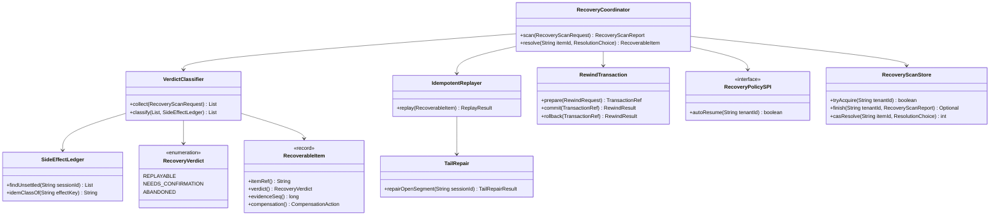
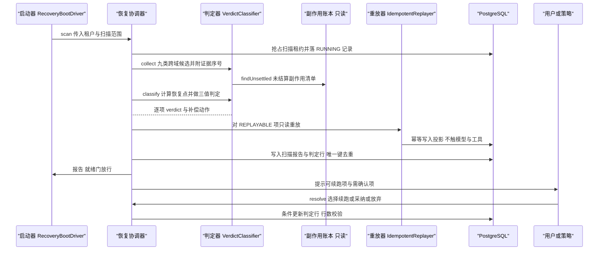
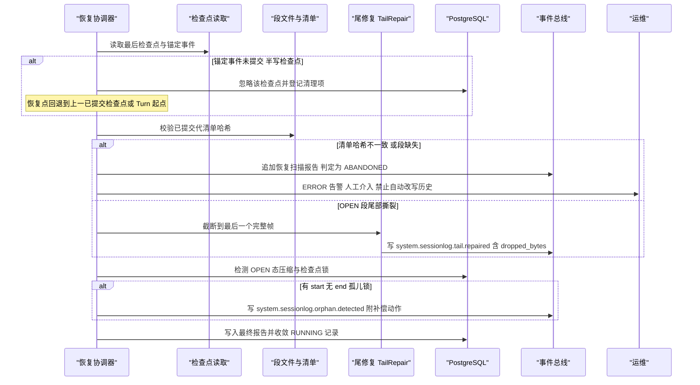
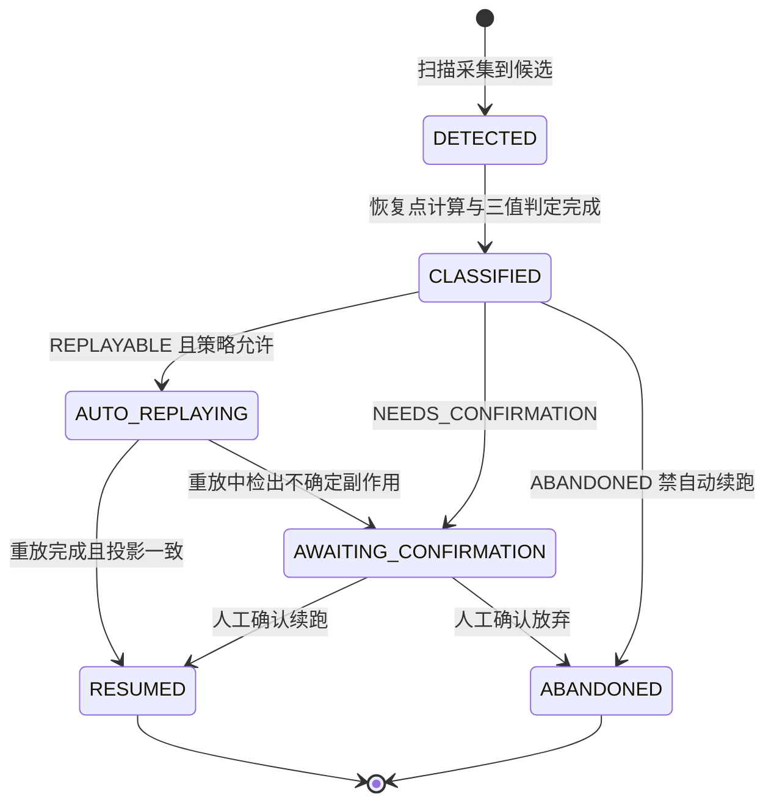
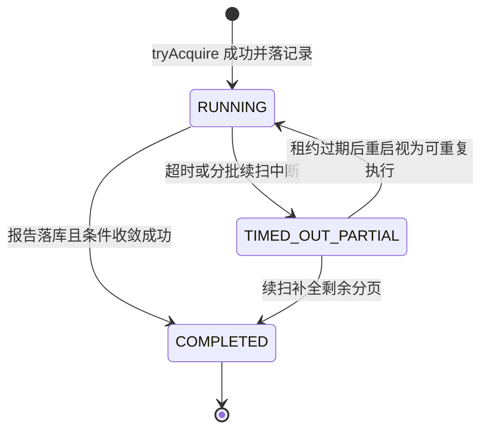

# C25 · RecoveryCoordinator（崩溃恢复协调器）组件级实现方案

> 组件编号 C25 ｜ 组件别名 RecoveryCoordinator（崩溃恢复协调器）｜ 归属域 持久化·迁移·恢复（PERS）｜ 清单条目：附录 D `P-13`（RecoveryCoordinator + 自动续跑策略引擎，轮 2 增强；主卷 19）
> 上游系统方案：`impl/19-persistence-recovery-impl.md` §1.4（上下游）、§5（类与契约）、§6.2（恢复扫描时序）、§7.3（恢复项状态）、§⑩.3（R0–R7 算法 + 19 行崩溃点矩阵）、§⑩.3.1–§⑩.3.4（检查点语义 / 跨域归属 / 三域 token / 幂等键登记）、§10.5（降级阶梯）、§⑪.2（故障注入 DoD）
> 协作契约：`impl/01-kernel-runtime-impl.md` §3.5/§6.4（启动期四阶段与 readyz 门）、`impl/12-agent-runtime-impl.md` §⑩.3（处置域与 `RecoveryDisposition`）、`impl/16-event-bus-impl.md` §⑩.1/§⑩.4、`impl/14` §⑩.1、`impl/15` §⑪.3、`impl/20` §⑩.3、`impl/21`；`reviews/R05-scope-recovery.md`（C1–C18 修复与残余风险）
> 编号口径：需求 `REQ-C-RC-n`；组件级决策 `I-C-RC-n`（只增不复用，不覆盖 `I-PERS-n`）；修订建议自编号 `R-RC-n`，正式 `X-n` 号由编排方分配；本组件不推翻系统级方案，冲突之处一律在文末「修订建议」登记，不回改上游文件。

---

## ① 组件定位与边界

### 1.1 本组件解决什么

1. **唯一协调者**：跨域恢复候选（R1 九类：未终态会话/回合、副作用账本非终态条目、`OPEN` 态压缩/检查点锁、非终态迁移、非终态导入导出作业、任务执行租约、调度运行与 Goal、工作区待重放队列与非终态后台句柄、合并队列条目）的**唯一扫描与判定入口**；各子系统不得另起第二套扫描器（`impl/19` §⑩.3 R1、R05 §2.1）。
2. **启动门禁（R0）**：读 `oc_schema_version` 期望集合，不匹配即拒绝提供服务，禁止降级启动（`impl/19` §⑩.3 R0）。
3. **恢复点判定与三值判定（R2/R3）**：保守计算 `recoveryPoint`（半写检查点忽略并清理，检查点只做加速、不改变判定），产出 `REPLAYABLE` / `NEEDS_CONFIRMATION` / `ABANDONED` 逐项携带 `evidenceSeq` 与补偿动作；判定域与处置域分离、token 禁止互相复用（§⑩.3.3）。
4. **副作用分级补偿（R4）**：按 `idem_class`（`IDEMPOTENT` / `NON_IDEMPOTENT` / `UNKNOWN`）产出「重试动作 / 标记未知结果待核对 / 人工采纳」；不可判定项挂起 Turn/Goal 自动推进。
5. **段与尾处理（R5）**：`OPEN` 段尾部撕裂截断至最后一个完整帧并写事件；已封口代只读校验、绝不修改（与 C26 的代际封口共同闭环）。
6. **只读幂等重放（R6）**：以 durable 事件重建投影；`live-only` 不入库；**永不调用模型、永不执行工具**（架构测试断言）。
7. **报告与人工裁决（R7）**：`oc_recovery_scan` / `oc_recovery_item` 落库、UI 首屏提示、`resolve` 乐观锁更新。

### 1.2 本组件不解决什么

- **不定义**检查点触发点与内容（唯一口径在 `impl/12` §⑧.1 + 卷 03 `I-CTX-5`；本组件只消费「已提交 / 半写」判据，不做第二套检查点语义）。
- **不执行**处置动作：`REPLAYED` / `RETRIED` / `UNCERTAIN` / `ADOPTED` 由卷 12 §⑩.3 处置表执行；租约/调度/待重放/合并条目的处置分别归 14/15/20/21，本组件只报告。
- **不实现**备份、导出导入、迁移执行与合规删除（P-12 / P-14 / C26 / P-15）：只把其「非终态作业」列为候选；**不承担**会话回滚内容语义（`session.rewind` 归卷 12），`RewindTransaction` 只提供事务化现场保全承载点。

### 1.3 上下游依赖

| 方向 | 对象 | 接口 / 契约 | 说明 |
| --- | --- | --- | --- |
| 上游 | 启动器（`host-bootstrap`） | `RecoveryBootDriver.run()` 四阶段编排（扫描 → 分类 → 重放 → 标记） | 「绑定端口之前、插件装载之后」执行；完成前 `readyz` 返回 503（`impl/01` §3.5） |
| 上游 | 存储 / 运行态 | `RecoveryScanStore`（`oc_recovery_scan` / `oc_recovery_item`）、Redis `RedisKeys.lock(Module.PERS, "recovery-scan", tenantId)` | 租约只做单例加速；正确性锚点在 DB 唯一索引与 CAS |
| 上游 | 账本 / 检查点 / 段 | `oc_side_effect_ledger`（只读）、`(session_id, seq)` + 锚定事件、段清单哈希 | 判定证据 `evidenceSeq` 全部可回溯 |
| 下游 | 各域处置面 | 判定 + `compensation`（14/15/20/21 按归属表消费） | 本组件不改写他域数据 |
| 下游 | 管理面 / CLI / UI | `GET /api/v1/recovery/scans`、`POST .../{id}/resolve`、`oc data recovery scan|report|resolve` | 「需确认」项首屏提示，禁止静默 |

### 1.4 模块落点与命名

| 层带 | 模块 | 关键类 | Spring |
| --- | --- | --- | --- |
| 契约 | `harness-contract`（`contract/persistence`） | `RecoveryVerdict`（枚举）、`RecoveryScanRequest` / `RecoveryScanReport` / `RecoverableItem` / `CompensationAction`、`RecoveryPolicySPI` | 禁止 |
| 平台 | `harness-platform/platform-persistence`（`recovery` 子包） | `RecoveryCoordinator`、`VerdictClassifier`、`SideEffectLedger`、`IdempotentReplayer`、`TailRepair`、`RewindTransaction`、`RecoveryScanStore` | 允许 |
| 外壳 | `harness-host/host-{bootstrap,app,server,cli}` | `RecoveryBootDriver`（四阶段与就绪门）、REST 端点、`oc data recovery` 命令 | 允许 |

---

## ② 功能需求清单（REQ-C-RC-1…12）

| ID | 需求描述 | 来源 | 优先级 | 验收要点 |
| --- | --- | --- | --- | --- |
| REQ-C-RC-1 | 启动门禁：期望 Schema 版本集合比对，不匹配拒绝服务并给明确提示；禁止只读/降级启动 | `impl/19` §⑩.3 R0、§10.5 第 6 级 | P0 | 集合不符即退出非零；提示含期望集合与实际值 |
| REQ-C-RC-2 | 九类候选全采集（跨域），本组件为唯一协调者；只报告不改写他域 | `impl/19` §⑩.3 R1、§⑩.3.2；R05 §2.1 | P0 | 逐类注入后均进候选；断言 j（报告「无需恢复」即缺陷） |
| REQ-C-RC-3 | 恢复点判定：`min(max(最后已提交检查点 seq), min(未结算副作用前一个已结算 Item 的 seq))` 取更早者；半写检查点忽略 | `impl/19` §⑩.3 R2、§⑩.3.1；`impl/12` §⑩.3 第 9/10 条 | P0 | 断言 g：以半写检查点为 `recoveryPoint` 即缺陷 |
| REQ-C-RC-4 | 三值判定与判定/处置分离：判定域只产 `RecoveryVerdict`；处置由 12 `RecoveryDisposition` 表达，映射唯一 | `impl/19` §⑩.3 R3、§⑩.3.3；`impl/12` §⑤ 末注 | P0 | 映射表逐行断言；19 `ABANDONED` 不得映射 12 `ABANDONED` |
| REQ-C-RC-5 | 副作用分级补偿：按 `idem_class` 产出补偿动作；`UNCERTAIN` 挂起自动推进 | `impl/19` §⑩.3 R4 | P0 | 三类 `idem_class` 逐条；断言 b（有 `PENDING` 判 `REPLAYABLE` 即缺陷） |
| REQ-C-RC-6 | 段尾撕裂修复：截断到最后完整帧 + `system.sessionlog.tail.repaired`；封口代只读校验 | `impl/19` §⑩.3 R5、§⑩.4 规则 6；`impl/16` §⑩.1 | P0 | 撕裂注入报 `dropped_bytes` 与 `last_good_seq`；封口代字节不变 |
| REQ-C-RC-7 | 孤儿锁检测与补偿：有 start 无 end 生成补偿动作 + `system.sessionlog.orphan.detected`，禁止当成功 | REQ-PERS-06；L-030（`04-deepseek-harness` §8 L3 `[E1]`） | P0 | 压缩中 `kill -9` 产出孤儿事件与补偿动作；下次压缩可重试 |
| REQ-C-RC-8 | 只读幂等重放：durable 事件重建投影，批 upsert 幂等；永不触模型/工具 | `impl/19` §⑩.3 R6、§⑪.1；REQ-PERS-07 | P0 | 断言 f；重放前后投影逐字节一致 |
| REQ-C-RC-9 | 扫描幂等与并发：同租户单例（租约 300s，过期回收）；重复执行只更新同一次 `RUNNING`；判定行按 `(scan_id, item_ref)` 去重；120s 超时分批续扫且未扫描项不得当「无需恢复」 | `impl/19` §5、§⑧.1/§⑧.2、§⑩.3 R7、§⑨.5、§10.5 第 3 级 | P0 | 断言 e；并发两个 `scan` 第二个得 `CONFLICT`；超时报告显式标注未覆盖范围 |
| REQ-C-RC-10 | 人工裁决 `resolve`：续跑/放弃；乐观锁行数 != 1 抛 `CONFLICT`；需确认项禁止静默续跑 | `impl/19` §6.2、§7.3、§⑨.1 | P0 | 断言 h；并发 `resolve` 仅一个成功，另一侧提示刷新 |
| REQ-C-RC-11 | `auto-resume` 单一开关：默认 `false`，只控制含副作用的续跑；只读投影重放恒自动；headless/Goal/调度默认不自动续跑 | `impl/19` §⑨.5、§⑩.3 R7、§⑩.3.2；`impl/12` §⑩.3 第 12 条 | P0 | 开关两态各一组用例；出现自动重试即缺陷 |
| REQ-C-RC-12 | 跨域归属与处置分工：租约→14、运行/Goal→15、待重放→20、合并→21（只报告）；报告含 `verdict`/`evidenceSeq`/`compensation` | `impl/19` §⑩.3 R1、§⑩.3.2；R05 §2 | P0 | 五类跨域候选逐类注入；报告字段齐备可对拍 |

---

## ③ 关键设计决策（I-C-RC-1…4）

| 编号 | 维度 | 备选 | 选定 | 理由 | 回退触发 |
| --- | --- | --- | --- | --- | --- |
| I-C-RC-1 | 扫描触发形态 | B1 仅启动扫描 / B2 启动基线 + 按需触发 + server 档租约接管 / B3 常驻轮询 | **B2**（与 I-ARC-5 同源） | 全形态可用、可测试；多实例接管由租约补齐，不引入常驻扫描开销 | 1k 未完成会话扫描 P95 > 30s → 惰性扫描（D-PERSI-3 回退） |
| I-C-RC-2 | 判定/落库权威切分（同名两类收敛） | B1 内核启动器自带判定 / B2 平台协调器唯一判定与落库、宿主启动器只编排与就绪门 / B3 判定下沉各子系统 | **B2** | 避免两套判定与 `auto-resume` 被绕过；判定行有唯一载体（`oc_recovery_*`） | local-lite 无 PG 形态 → 保留最小只读重放器，不产判定行、不宣称恢复完成 |
| I-C-RC-3 | `resolve` 并发承载 | B1 分布式锁 / B2 `(scan_id, item_ref)` 唯一键 + 状态 CAS / B3 队列串行 | **B2** | 冲突语义显式（`CONFLICT` + 刷新重试）；无锁缺失即正确性缺失的风险 | 冲突率 > 5% → 热点项加 Redis 短租约（仍不承载正确性） |
| I-C-RC-4 | 报告与可观测的载体 | B1 只写事件、报告由事件重建 / B2 表落库 + 事件双写 / B3 只写表 | **B2** | UI 首屏需稳定读模型；事件用于 SLO 与审计；`evidenceSeq` 从表可对拍 | 表写放大超预算 → 事件保留、明细行降级为按需物化 |

**展开（I-C-RC-2）**：`impl/01` §3.5 的 `RecoveryCoordinator`（`scan/replay/markOrphans`，产 `session.recovery.scanned`）与 `impl/19` §5 的 `RecoveryCoordinator`（`scan/resolve`）为同一职责的两处描述 → 统一为「宿主 `RecoveryBootDriver`（编排 + 就绪门）+ 平台 `RecoveryCoordinator`（判定 + 落库权威）」，收敛登记 `R-RC-1`/`R-RC-2`。**展开（I-C-RC-3）**：`resolve` 只做条件更新（`WHERE state = 'AWAITING_CONFIRMATION'`），行数 != 1 即并发冲突，不引入独立锁表。

---

## ④ 类图



**说明**：`RecoverableItem.itemRef` 为**稳定项标识**（`session:<id>` / `turn:<id>` / `effect:<key>` / `lease:<id>` / `run:<id>` / `goal:<id>` / `op:<key>` / `merge:<id>` / `migration:<version>` / `import:<job_id>` / `del:<request_id>`，`impl/19` §⑧.1/§⑩.3.2），与 `scan_id` 组成判定去重唯一键；`VerdictClassifier.collect` 承担九类候选采集（跨域只读），`classify` 承担 R2 恢复点与 R3/R4 判定。`SideEffectLedger` 对 `oc_side_effect_ledger`（≡ `oc_tool_side_effect`）**只读**，写入者是卷 12；`TailRepair` 只处理 `OPEN` 段，已封口代读取走 C26 的 `GenerationReader`。组件对外只暴露 `RecoveryCoordinator` 与契约值对象；内核不感知本类（本类住平台带，经 REST/CLI 面使用）。

---

## ⑤ 核心流程时序图

### 5.1 流程 A：启动/按需恢复扫描主路径



- **前置条件**：R0 门禁通过（Schema 期望集合匹配）；存储可读；无同租户在途扫描（或租约已过期）。
- **主路径**：抢租约 → 九类采集 → 恢复点与三值判定 → 只读重放 → 报告落库 → 首屏提示 → 人工裁决。
- **异常与补偿**：段尾撕裂 → `TailRepair` 截断并记 `dropped_bytes`；孤儿锁 → 生成补偿动作 + `orphan.detected`；已提交代哈希校验失败 → `ABANDONED` + ERROR 告警（禁止自动改历史）。
- **幂等与并发点**：扫描单例（DB 部分唯一索引 `(tenant_id) WHERE state='RUNNING'`）；判定行 `(scan_id, item_ref)` 去重；重放批 upsert 幂等；`resolve` 为 CAS，行数 != 1 抛 `CONFLICT`。

### 5.2 流程 B：崩溃现场补偿（半写检查点 / 孤儿锁 / 撕裂 / 不可恢复代）



- **前置条件**：进程非正常退出（心跳缺失或租约过期）；事件表可读；段清单可校验。
- **主路径**：检查点判据 → 代哈希校验 → 撕裂修复 / 孤儿补偿 → 报告收敛。
- **异常与补偿**：半写检查点忽略不改变判定；`ignorable=false` 未知类型 → 整体中止解码 + 判定降级 `NEEDS_CONFIRMATION`（禁止跳帧继续）；哈希失败 → `ABANDONED` 且仅告警不修复。
- **幂等与并发点**：撕裂修复以「最后完整帧」为界，重复执行结果一致；补偿动作落库按 `(scan_id, item_ref)` 去重；封口代只读，任何写入路径被架构测试拒绝。并发补充：同租户并发 `scan` 由 Redis 租约（TTL 300s）限单例、DB 部分唯一索引兜底，第二个触发返回 `CONFLICT` 且租约过期后重跑视为可重复执行；`resolve` 为状态 CAS，并发裁决只有一次生效、其余抛 `CONFLICT` 提示刷新。

---

## ⑥ 状态机

### 6.1 恢复项状态机



| 迁移 | 触发 | 守卫 | 副作用 |
| --- | --- | --- | --- |
| CLASSIFIED → AUTO_REPLAYING | 判定 `REPLAYABLE` 且 `RecoveryPolicySPI.autoResume` 允许 | 只读重放器可用 | 无业务副作用，仅投影重建 |
| AUTO_REPLAYING → AWAITING_CONFIRMATION | 重放中发现未结算副作用或段解码不完整 | 立即停止该项重放 | 判定行标注补偿动作；挂起该 Turn/Goal 推进 |
| CLASSIFIED → ABANDONED / AWAITING_CONFIRMATION → ABANDONED | 已提交代哈希校验失败、段缺失、`ignorable=false` 无法解码；或人工选择放弃 | 禁止任何自动改写历史 | ERROR 告警；人工处置待办 |
| AWAITING_CONFIRMATION → RESUMED | 人工选择续跑（含 `ADOPTED` 采纳外部状态） | 判定行处于待确认态（CAS） | 处置动作由卷 12 执行，键不变 |

**不变量**：① `DETECTED` 项在判定完成前不产生任何执行动作；② `ABANDONED` 项永不进入重放（禁止跳帧）；③ 同一 `(scan_id, item_ref)` 任一时刻只有一个状态行；④ 状态名 `ABANDONED` 与 12 处置域 `ABANDONED`（丢弃重发）**不同义**，跨域对话一律双写（`impl/19` §⑩.3.3）。

### 6.2 扫描记录状态机



**不变量**：① 同租户同时最多一条 `RUNNING`（部分唯一索引）；② `TIMED_OUT_PARTIAL` 报告必须显式列出未覆盖分页，**不得**表述为「无需恢复」；③ 收敛用条件更新，行数 != 1 抛 `CONFLICT`。

---

## ⑦ 接口与依赖矩阵

### 7.1 对外契约（平台层，Java 21）

```java
package com.hk.opencoding.platform.persistence.recovery;

/**
 * 崩溃恢复协调器：进程重启与人工触发时扫描未完成工作，产出「可续跑 / 需确认 / 放弃」三类结论。
 * 本类是跨域恢复候选的扫描与判定唯一入口；判定只读业务数据，处置由各域（12/14/15/20/21）自行执行。
 * 事务边界：扫描记录与判定行为写操作，必须显式事务并校验乐观锁更新行数。
 */
@Slf4j
@Service
@RequiredArgsConstructor
public class RecoveryCoordinator {
    private final VerdictClassifier classifier;
    private final IdempotentReplayer replayer;
    private final RecoveryPolicySPI recoveryPolicy;
    private final RecoveryScanStore scanStore;

    /**
     * 执行一次恢复扫描（幂等：同租户已有在途扫描时拒绝；重复执行只更新同一次 RUNNING 记录）。
     *
     * @param request 扫描范围（必填：租户；可选会话集合与策略覆盖，覆盖不得越过 RecoveryPolicySPI 的租户基线）
     * @return 扫描报告：逐项判定、证据序号与补偿动作；未覆盖分页显式标记
     * @throws BusinessException 同租户已有扫描在途抛 CONFLICT；期望 Schema 集合不匹配抛 INTERNAL_ERROR
     */
    @Transactional(rollbackFor = Exception.class)
    public RecoveryScanReport scan(RecoveryScanRequest request) {
        log.info("恢复扫描开始，tenantId={}, sessionScopeSize={}", request.tenantId(), request.sessionIds().size());
        // 算法 A/B/C（见 §⑧）：采集 → 恢复点与三值判定 → 仅 REPLAYABLE 项只读重放
        RecoveryScanReport report = classifier.run(request, replayer, recoveryPolicy);
        log.info("恢复扫描完成，tenantId={}, autoResumed={}, confirmationCount={}",
                request.tenantId(), report.autoResumed(), report.confirmationCount());
        return report;
    }

    /**
     * 人工裁决一个待确认项（续跑 / 放弃）。
     *
     * @param itemId 判定项标识（必填，来自报告）
     * @param choice 裁决选择（必填，RESUME 或 ABANDON）
     * @return 裁决后的判定项（含处置归属与后续动作提示）
     * @throws BusinessException 项不存在抛 NOT_FOUND；被并发裁决或不在待确认态抛 CONFLICT
     */
    @Transactional(rollbackFor = Exception.class)
    public RecoverableItem resolve(String itemId, ResolutionChoice choice) {
        log.info("恢复项人工裁决，itemId={}, choice={}", itemId, choice.getCode());
        int updated = scanStore.casResolve(itemId, choice);
        if (updated != 1) {
            // 乐观锁语义：状态已被并发裁决或本就不处于待确认态，提示刷新后重试
            log.warn("恢复项裁决冲突，itemId={}, 期望状态=AWAITING_CONFIRMATION", itemId);
            throw new BusinessException(ErrorCode.CONFLICT, "恢复项状态已变更，请刷新后重试");
        }
        return scanStore.requireItem(itemId);
    }
}
```

**层次纪律**：内核与契约层不出现 Spring / JDBC；本类住平台带，异常统一 `BusinessException(ErrorCode, 中文文案)`，由外壳全局异常处理器按码映射（`impl/19` §5 末注、X-82）。

### 7.2 依赖与被依赖矩阵

| 关系 | 组件 / 端口 | 契约要点 | 失效影响 |
| --- | --- | --- | --- |
| 依赖 | `RecoveryScanStore` | `tryAcquire` / `finish` / `casResolve`；`(scan_id, item_ref)` 唯一 | 不可用 → 扫描拒绝启动（`DEPENDENCY_UNAVAILABLE`），不得无报告放行就绪 |
| 依赖 | `SideEffectLedger`（只读）+ 段读取（C26 `GenerationReader`） | `findUnsettled` / `idemClassOf`；清单哈希与相邻链解码 | 账本不可读 → 判定降级 `NEEDS_CONFIRMATION`（fail-closed）；段不可读 → 该项 `ABANDONED` 并告警 |
| 依赖 | Redis 租约 | `RedisKeys.lock(Module.PERS, "recovery-scan", tenantId)`，TTL 300s | 丢失 → 进程内锁降级；正确性由 DB 兜底 |
| 被依赖 | `host-bootstrap` 启动链路 | 四阶段编排与就绪门（完成前 `readyz` 503） | 恢复未完成即放行 → 在途工作被双执行 |
| 被依赖 | 卷 12/14/15/20/21 处置面 | 判定 + `compensation` | 无判定 → 各域不得自行恢复（唯一协调者纪律） |
| 被依赖 | 管理面 / UI / `oc doctor` | 报告、`resolve`、判定分布指标 | 「需确认」项不可见 → 静默滞留 |

### 7.3 配置项（`open-coding.persistence.recovery.*`）

| 配置键 | 含义 | 默认 | 必填 | 环境变量 |
| --- | --- | --- | --- | --- |
| `scan-timeout-seconds` / `auto-resume` | 单次扫描超时（超时分批续扫）/ 自动续跑唯一开关（只控制含副作用续跑；只读重放恒自动） | `120` / `false` | 否 | `OC_PERS_SCAN_TIMEOUT` / `OC_PERS_AUTO_RESUME` |
| `scan-page-size` / `replay-upsert-batch` / `scan-lease-seconds` | 候选分页大小 / 投影批量 upsert 批大小 / 扫描租约 TTL | `500` / `1000` / `300` | 否 | `OC_PERS_SCAN_PAGE` / `OC_PERS_REPLAY_BATCH` / `OC_PERS_SCAN_LEASE`（**新增，见 `R-RC-4`**） |

**纪律**：全部键以 `${ENV_VAR:default}` 声明并同步 `.env.example`；配置类为纯数据类不加 `@Component`，字段 JavaDoc 标默认值与影响范围（缺失即启动 Fail-Fast 的仅有 `kms-key-ref` 等敏感项，见 `impl/19` §⑨.5）。

---

## ⑧ 关键算法

### 8.1 算法 A：九类候选采集与稳定项标识

按 R1 九类逐源查询（**全采集，禁止只扫本域**）：① 未终态会话/回合 → `session:<id>` / `turn:<id>`；② `oc_side_effect_ledger.state` 非终态 → `effect:<effect_key>`；③ `OPEN` 态压缩/检查点锁（有 start 无 end）→ `lock:<kind>:<id>`；④ 非终态迁移 → `migration:<version>`；⑤ 非终态导入/导出作业 → `import:<job_id>` / `export:<job_id>`；⑥ `oc_work_item_execution.state ∈ {LEASED, ACTIVE, SUSPENDED}` → `lease:<exec_id>`；⑦ 非终态 `oc_schedule_run` 与非终态 Goal → `run:<run_id>` / `goal:<goal_id>`；⑧ `oc_workspace_pending_op` 与非终态后台句柄 → `op:<idem_key>`；⑨ 非终态合并队列条目 → `merge:<entry_id>`。步骤：① 各源按 `(tenant_id, 活跃时间)` 分页（`scan-page-size`）；② `item_ref` 必须**可重算且稳定**（前缀 + 主键，禁止拼接时间戳）；③ 汇聚后按 `item_ref` 去重（同实体多源命中保留最严重源）；④ 输出 `evidenceSeq`（每项取本域能给出的最新证据位点，供断言 a 逐项一致）。**复杂度** O(九源分页)；**边界条件**：上游记录被清理（15 的 90 天、20 的 30 天）导致 `item_ref` 悬空时，按「报告 + 不计入自动重放」处理，不静默丢弃。

### 8.2 算法 B：恢复点判定与半写记录处理

```
// 输入：最后已提交检查点 seq（锚定事件已提交）、未结算副作用条目集合、Turn 起点 seq
cp = committedCheckpointSeq(sessionId)                 // 半写检查点不参与：无锚定事件即忽略并登记清理
ledgerFloor = min( for e in unsettledEffects: prevSettledSeq(e) )   // 每个未结算条目前一个已结算 Item 的 seq
recoveryPoint = cp == null ? ledgerFloor
              : ledgerFloor == null ? cp
              : min(cp, ledgerFloor)                   // 取更早者（保守）
replayRange = (recoveryPoint, eventTail]
```

**半写记录处理**：① 检查点判据 = 锚定事件（`context.checkpoint.written`，12 侧记 `agent.item.committed(checkpoint)`）**已提交**；② 半写记录由扫描忽略，登记为清理项（`oc_consistency_finding` kind=`HALF_CHECKPOINT`），**不得**作为 `recoveryPoint`（断言 g）；③ 无任何检查点 → 回退 Turn 起点；④ 存在未结算副作用时该会话**不得**判 `REPLAYABLE`（断言 b）。**复杂度** O(账本条目数)；**边界条件**：账本 `PENDING`/`EXECUTING` 均按未结算处理；`idem_class=UNKNOWN` 一律保守。

### 8.3 算法 C：只读幂等重放与崩溃重入

① 读取重放区间内 **durable** 事件（`live-only` 不落库、不推进 durable 游标、不入重放）；② 投影批量 upsert（批 `replay-upsert-batch`），键为业务主键 + 版本，天然幂等；③ 重放路径内**禁止**模型调用与工具执行（ArchUnit 断言，断言 f）；④ 段内 `ignorable=true` 未知类型 → 丢弃并计数；`ignorable=false` → 整体中止解码且该项降级 `NEEDS_CONFIRMATION`（禁止跳帧）；⑤ 重放中崩溃 → 重跑从头或从最后一个已提交投影批次继续，结果一致（重放不产生副作用）。**复杂度** O(重放事件数 × 单条投影更新)；**边界条件**：`recoveryPoint` 晚于 `eventTail`（位点异常）→ 判 `ABANDONED` 并告警；`auto-resume=false` 时 `REPLAYABLE` 项仅重放不继续执行。

---

## ⑨ 错误处理与降级

平台层统一 `BusinessException(ErrorCode, 中文文案)`；下表为本组件唯一权威映射（与 `impl/19` §⑨.1 一致，文案面向使用者）。

| 场景 | ErrorCode | retryable | 处理动作 | 用户可见文案 |
| --- | --- | --- | --- | --- |
| 期望 Schema 集合不匹配（R0） | `INTERNAL_ERROR` | 否 | 拒绝提供服务；提示执行迁移或升级 | 「数据版本不匹配，已拒绝启动：期望 `<set>`」 |
| 同租户已有扫描在途 | `CONFLICT` | 是 | 拒绝并返回在途扫描 ID | 「该租户已有恢复扫描在途，请稍后重试」 |
| 判定项被并发裁决 | `CONFLICT` | 否 | CAS 失败，提示刷新 | 「恢复项状态已变更，请刷新后重试」 |
| 扫描项不存在 / 报告不存在 | `NOT_FOUND` | 否 | 拒绝并提示刷新列表 | 「恢复项不存在：`<itemId>`」 |
| 只读账本不可读 | `DEPENDENCY_UNAVAILABLE` | 是 | 该项判定降级 `NEEDS_CONFIRMATION`（fail-closed） | 「副作用账本暂不可读，该项需人工确认」 |
| 段解码出现 `ignorable=false` 未知类型 / 已提交代哈希校验失败 | `INTERNAL_ERROR` | 否 | 整体中止解码（不跳帧）或 `ABANDONED` + ERROR；人工介入 | 「日志代存在无法识别的必需记录（或校验失败），已停止自动处理」 |
| 扫描超时 | `INTERNAL_ERROR` | 是 | 分批续扫 + 部分报告；标记未覆盖分页 | 「扫描超时，已完成部分扫描，剩余范围将在续扫中处理」 |
| 扫描期间出现模型调用或工具执行 | `INTERNAL_ERROR` | 否 | 视为缺陷：中止扫描并告警 | 「恢复过程中出现越界执行，已中止并告警」 |

**降级阶梯（本组件相关五级，任一级触发即写事件并告警）**：① 速率降级——对象存储/备份仓节流 → 扫描只做判定不读重内容；② 作业降级——WAL 归档滞后超阈值 → 暂停巡检与重放的大批读取；③ 扫描降级——超时 → 分批续扫 + 部分结果，未扫描项**不得**当「无需恢复」；④ 判定降级（fail-closed）——存在未结算副作用 → `NEEDS_CONFIRMATION` 挂起待人工，禁止静默续跑；⑤ 不可恢复降级——已提交代校验失败 → `ABANDONED` + ERROR，禁止自动改历史。**禁止**：跳过校验、把未扫描当无残留、把孤儿锁当成功、对 `NEEDS_CONFIRMATION` 自动执行。

---

## ⑩ 性能与并发

| 指标 | 预算 | 说明 |
| --- | --- | --- |
| 恢复扫描（1k 未完成会话） | P95 ≤ 10s | 超标即触发惰性扫描回退（I-C-RC-1） |
| 单次扫描超时 | 120s（可配置） | 超时分批续扫；报告标注未覆盖范围 |
| 恢复完成到就绪 | ≤ 3s（检查点加速；10k 事件） | `readyz` 在恢复完成前 503（`impl/01` §3.5） |
| 重放吞吐（投影重建） | 批 upsert ≥ 2000 行/秒/Worker | 批大小 `replay-upsert-batch`；禁在重放路径内做模型/工具调用 |
| 判定行写入 | 单次扫描 ≤ 候选数 × 1（唯一键去重后）；扫描租约 TTL 300s、不续租 | 重复扫描不新增判定行；崩溃后 300s 可被下一次扫描重复执行（幂等） |

**并发模型**：扫描单虚拟线程（IO 密集，九源分页读）+ 重放固定大小虚拟线程池（并发上限默认 4，`Semaphore` 限流）；扫描与在线写入**不互斥**（只读快照读）；`resolve` 与扫描并发时以 CAS 收敛。**锁与背压**：① 正确性锚点 = DB 唯一索引与状态 CAS；② Redis 租约（`oc:pers:lock:recovery-scan:{tenantId}` 形态，统一经 `RedisKeys` 工厂）只做单例加速，丢失仅重新竞争；③ 背压 = 候选分页 + 超时预算，不静默丢弃；④ 与在线执行的隔离：本组件绝不改写在途会话的执行权（`runner_epoch` 归卷 12/C01）。

---

## ⑪ 测试要点

| 层级 | 用例 | 断言要点 |
| --- | --- | --- |
| 单元 | 恢复点判定全分支（有/无检查点 × 有/无未结算副作用 × 半写） | `recoveryPoint` 取更早者；半写检查点被忽略且登记清理（断言 g） |
| 单元 | 三值判定矩阵（九类候选 × 三种账本状态 × 代哈希三态） | 映射表逐行；`ABANDONED` 不得映射 12 `ABANDONED`（断言 c） |
| 单元 | 幂等键生成与 `item_ref` 稳定性 | 前缀 + 主键可重算；时间戳不入键；悬空项按报告处理 |
| 单元 | `resolve` CAS 全覆盖（期望态不符 / 并发 / 不存在） | 行数 != 1 抛 `CONFLICT` 且文案含刷新提示 |
| 集成 | 重复扫描幂等 + 并发扫描（两实例同租户同时 `scan`） | 除 `resumed` 计数外逐项一致（断言 a）；恰一个执行、另一个 `CONFLICT`、无重复判定行（断言 e） |
| 集成 | 只读重放对拍：重放后投影 vs 未崩溃对照组 | 逐字节一致；无模型/工具调用记录（断言 f） |
| 故障注入 | **每阶段注入崩溃矩阵**（下表 7 行，`kill -9` 于指定阶段） | 扫描产出与预期 verdict 一致；无重复副作用；产生预期事件 |
| 契约 | `RecoveryPolicySPI` 两实现（默认 / 企业策略） | 同一套用例；`auto-resume=false` 下含副作用项不执行（断言 h） |
| 性能 | §⑩ 全部指标 | 达标；CI 门禁失败即阻断合并 |

**每阶段注入崩溃用例矩阵（本组件 7 行，全部在 CI 以 `-Dtest='*CrashIT'` 执行）**：

| 崩溃点 | 注入位置 | 期望结果 |
| --- | --- | --- |
| 扫描刚抢到租约 / 候选采集分页中途 | `tryAcquire` 后 / 第 N 页读取后 | 记录留 `RUNNING` 且无判定行；租约过期后重跑幂等、无重复判定行（唯一键） |
| 判定写入中途（部分项） | 第 k 项落库后 | 重跑补齐剩余项；已写项不重复（`(scan_id, item_ref)` 断言 e） |
| 重放中途 | 批 upsert 之间 | 重跑收敛；投影与对照组一致；无模型/工具副作用（断言 f） |
| 报告收敛前 | `finish` 调用前 | 记录 `RUNNING`；租约过期重跑并以条件更新收敛；不产生第二份报告 |
| 撕裂修复中途 | 截断与事件之间 | 重跑截断幂等；`last_good_seq` 收敛一致；封口代字节不变；孤儿锁补偿动作与事件成对存在 |
| 不可恢复代处置中 | 判定 `ABANDONED` 落库后 | 告警与判定行成对存在；无任何自动改写历史动作；人工待办可查询 |
| `resolve` 提交后响应前 | CAS 成功后 | 客户端重试返回既有结果（幂等读回）；不产生第二条裁决记录 |

```bash
# 组件单测（离线；平台模块）
mvn -pl harness-platform/platform-persistence -am test -Dtest='RecoveryPointTest,VerdictClassifierTest,ItemRefStabilityTest,ResolveCasTest' -DfailIfNoTests=false
# 集成 + 崩溃注入（需 Docker：PG/Redis/MinIO）
mvn -pl harness-platform/platform-persistence -am verify -Dtest='RecoveryScanIT,ReplayParityIT,*CrashIT' -Dcrash-scenarios=recovery
# main 链路（bootstrap 装配 + 就绪门 + 恢复扫描）
mvn -pl harness-host/host-server -am test -Dtest='RecoveryBootDriverIT'
```

**DoD**：REQ-C-RC-1…12 逐条有单测或集成用例；§⑩ 指标在 CI 达标；每阶段注入崩溃矩阵 7 行全绿且无重复副作用；`R-RC-1…5` 已登记待编排方裁决，未裁决前按本文结论施工且不改变任何系统级语义。

---

## 修订建议（本组件登记，自编号，正式 `X-n` 待编排方分配）

| 自编号 | 建议 | 依据 | 影响面 |
| --- | --- | --- | --- |
| R-RC-1 | 恢复事件命名族收敛：`impl/01` §3.5/§6.4 的 `session.recovery.scanned` / `session.recovery.completed` / `session.orphan.detected` / `item.needs_confirmation` 与 `impl/19` §8.4 的 `system.recovery.scan.completed` / `system.sessionlog.orphan.detected` 并存 → 建议统一为 `system.*` 族（只增不改、废弃项保留别名一个版本） | `impl/01` §3.5、§6.4；`impl/19` §8.4；事件目录属卷 16 | 卷 16 §⑧ 事件目录、`impl/01` §3.5、`impl/19` §8.4、SLO 看板 |
| R-RC-2 | 同名类两处语义收敛：`impl/01` 的 `RecoveryCoordinator`（`scan/replay/markOrphans`，宿主启动器）与 `impl/19` 的 `RecoveryCoordinator`（`scan/resolve`，平台判定）同名 → 建议定名「`RecoveryBootDriver`（宿主编排 + 就绪门）+ `RecoveryCoordinator`（平台判定唯一权威）」 | `impl/01` §3.5、§5 类图；`impl/19` §1.5、§5 | `impl/01` §3.5/§5、`impl/19` §1.5、附录 D `P-13` 备注 |
| R-RC-3 | 账本状态取值不一致：`impl/19` R1 以 `PENDING`/`EXECUTING` 枚举非终态，`impl/12` §⑧.1 定义 `EXECUTING`/`SETTLED`/`UNCERTAIN`，契约 `SideEffectState` 未列全 → 建议冻结四值 `PENDING/EXECUTING/SETTLED/UNCERTAIN` 并明确终态集合 | `impl/19` §⑩.3 R1/R4；`impl/12` §⑧.1；`harness-contract` 枚举清单 | `harness-contract`、`impl/12` §⑧.1、`impl/19` §⑩.3、账本查询 |
| R-RC-4 | 扫描分页 500 / 重放批 1000 / 租约 300s 目前为 `impl/19` §⑩.1 内联值且 §⑨.5 无对应配置键 → 建议增补 `open-coding.persistence.recovery.scan-page-size` / `replay-upsert-batch` / `scan-lease-seconds` 并同步 `.env.example` | `impl/19` §⑩.1/§⑨.5；配置抽取规范（阈值配置化） | `impl/19` §⑨.5、`.env.example`、平台配置类 |
| R-RC-5 | R05 残余风险 1 与 5：① `impl/01` §8.1 与 `impl/03` §6.4 的检查点形态未随 `(session_id, seq)` 唯一口径收敛 → 建议补注「列名别名」与锚定事件判据；② 三域 token 映射靠纪律而非门禁 → 建议在 §⑪ 架构测试清单增加机械断言（`RecoveryDisposition.ABANDONED` 不出现在恢复扫描路径；`UNKNOWN_ABANDONED` 只出现在重放模拟面） | `reviews/R05-scope-recovery.md` §6-1/§6-5；`impl/19` §⑩.3.1、§⑩.3.3 | `impl/01` §8.1、`impl/03` §6.4、`impl/19` §⑪.1、`impl/12` §⑪、ArchUnit 规则集 |
