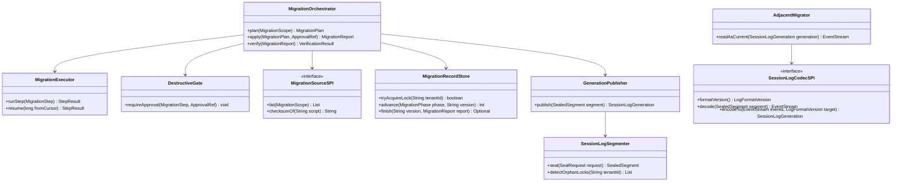
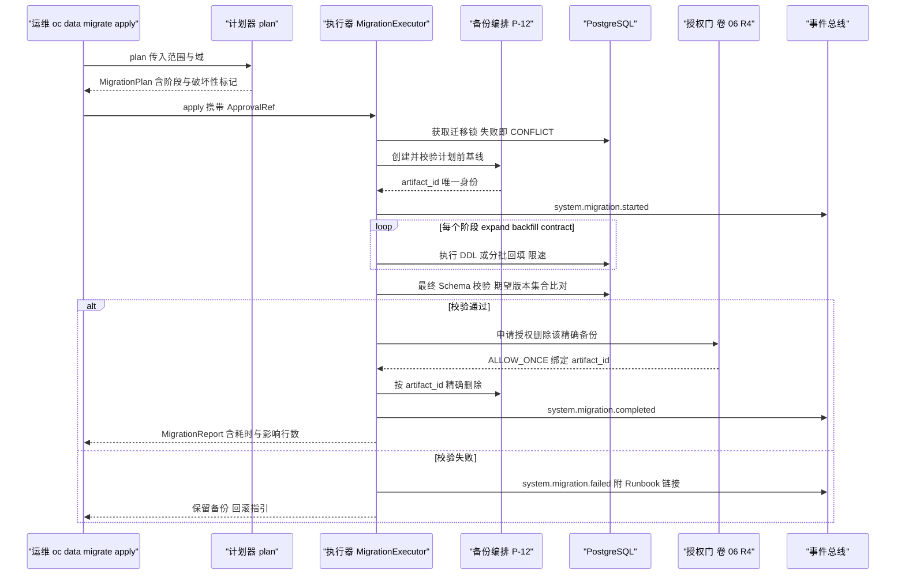
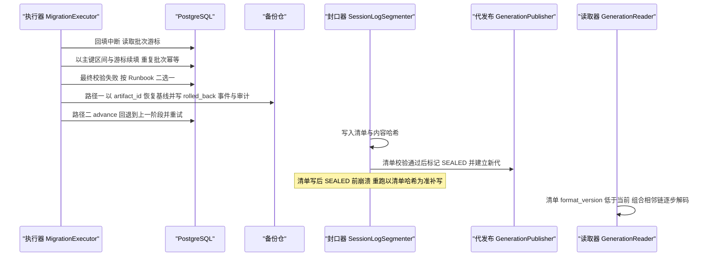
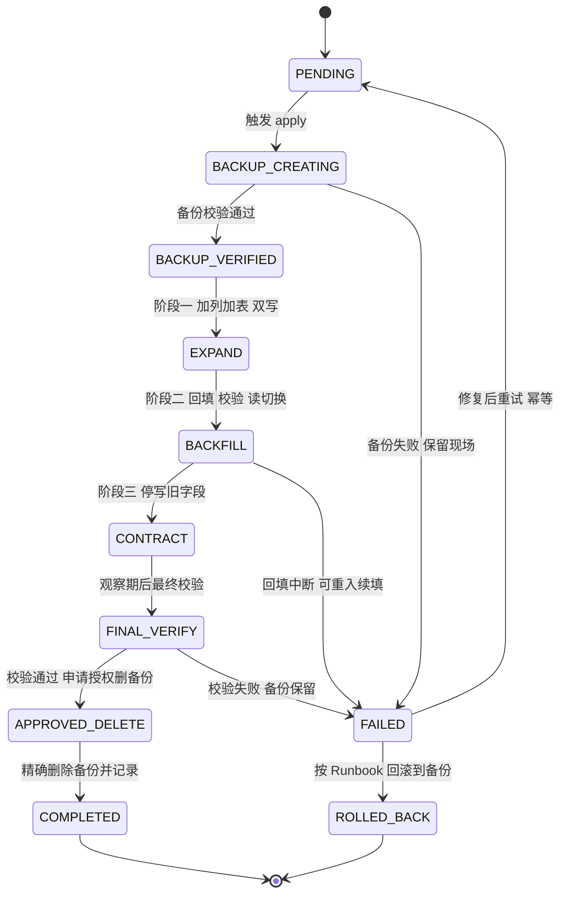
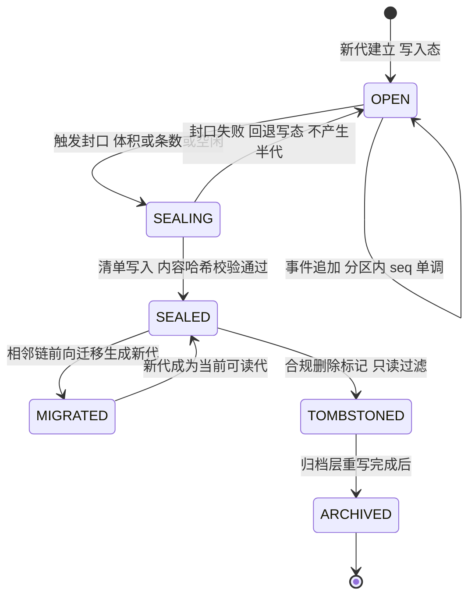

# C26 · MigrationRunner（迁移执行器）组件级实现方案

> 组件编号 C26 ｜ 组件别名 MigrationRunner（迁移执行器；实现类族 `MigrationOrchestrator` + `MigrationExecutor`）｜ 归属域 持久化·迁移·恢复（PERS）｜ 清单条目：附录 D `P-11`（MigrationEngine + MigrationExecutor，expand-contract；主卷 19）
> 上游系统方案：`impl/19-persistence-recovery-impl.md` §3 `D-PERSI-1`（迁移执行载体）、§5（类与契约）、§6.1（迁移安全序列）、§7.1（迁移阶段）、§7.2（会话日志代）、§8.1/§8.4/§8.5（记录表 / 事件 / 指标）、§⑨.4–§⑨.5（SPI 与配置）、§⑩.1–§⑩.2（并发与预算）、§⑩.3 崩溃点矩阵（迁移与封口行）、§⑩.4（代管理硬约束）、§⑪.1/§⑪.3（迁移四项与门禁）
> 上游契约：卷 19 §3 `D-PERS-2`/`D-PERS-3`/`D-PERS-13`、§4.2（迁移流水线）；`IMPL-DECISIONS.md`（`I-PERS-1`/`I-PERS-2`/`I-PERS-4`）；H-005（PG 事实源）
> 竞品证据：L-053（`research/competitors/05-minimax-cli.md` §8 M1 `[E1]`「创建 → 校验 → 迁移 → 最终校验 → 授权删」）、L-054（同文件 §8 M2/M3 `[E1]`：按域分目录、`repair-*` 单列）；`research/competitors/04-deepseek-harness.md` §1 第 4 条 / §4.12 / §5.3 `[E1]`（版本命名代 + 已提交代不可变 + 相邻迁移链每步一版本 + 拒绝未来版本写入）；`research/competitors/06-grok-cli-and-build.md` §5.4 `[E1]`（SQLite `user_version` 线性迁移：仅作本地只读参考，**拒绝**承接平台迁移；读侧纪律见同文件 §8-9）
> 协作契约：`impl/16-event-bus-impl.md` §⑩.10（`ignorable` 语义与段级等价表达）、`reviews/R05-scope-recovery.md` §5（代际不可变一致性核对）
> 编号口径：需求 `REQ-C-MIG-n`；组件级决策 `I-C-MIG-n`（只增不复用，不覆盖 `I-PERS-n`）；修订建议自编号 `R-MIG-n`，正式 `X-n` 号由编排方分配；本组件不推翻系统级方案，冲突之处一律在文末「修订建议」登记，不回改上游文件。

---

## ① 组件定位与边界

### 1.1 本组件解决什么

1. **计划生成与安全序列**：`plan` 校验命名/校验和/破坏性标记并与 `oc_schema_version` 差分，产出含阶段的 `MigrationPlan`；`apply` 按 L-053 序列执行：创建并校验在线备份（唯一 `artifact_id`）→ 应用 → 最终 Schema 校验 → **成功后才申请授权删除该精确备份**；任一步失败保留备份 + Runbook。
2. **expand-contract 三阶段**：EXPAND（加列/加表 + 双写）→ BACKFILL（分批回填 + 令牌桶限速 + 对拍校验 + 读切换）→ CONTRACT（停写旧字段，观察期后删）；回填以「(主键区间, 批次游标)」可续跑，重复批次幂等。
3. **破坏性门与审批**：删列 / 改类型 / 删表必须显式标记并经 R4 `ApprovalRef`；跳过审批或降级校验一律 `POLICY_OVERRIDE_DENIED`（禁止绕过）。
4. **代际不可变与相邻链**：段封口（清单 + 内容哈希 + `SEALED`）、写新代不原地改、已提交代永不重命名/覆盖/删除、**拒绝降级写**；读取历史代按 `vN → vN+1` 逐步组合解码（每步只负责一版），顺序固定「先段链、后事件 codec」。
5. **回滚点、失败恢复与可观测**：状态机 FAILED 分支在「重跑校验 / 重试阶段 / 回滚到备份」间给出可执行结论（按 Runbook），回滚动作与演练留审计，前代回退由 `superseded_by` 决定且必须显式操作；`oc_migration_record` 每次执行落库，`system.migration.*` 四事件、`oc_db_migration_duration_ms` / `oc_db_migration_failures_total` 指标与 repair 独立审计构成完整观测面。

### 1.2 本组件不解决什么

- **不实现**备份内容泵送与 WAL 连贯性（P-12）：本组件只调用「创建并校验」「按 `artifact_id` 精确删除」两个触点，删除必须携带 R4 授权。
- **不定义**事件 Schema（卷 16）与段内事件编码实现（`SessionLogCodecSPI` 的 v1/v2 编解码器由契约 SPI 提供）；本组件负责封口编排、代发布与读取链组合。
- **不做**合规删除（P-15）：`TOMBSTONED → ARCHIVED` 由保留域执行并附证明，本组件只保证代不可变；**不做**配置项自动迁移——schema 与配置变更分离；**不做**跨实例调度与常驻轮询（单写者：迁移锁；由 `oc data migrate apply` 或 CI 显式触发，`repair-*` 仍需人工触发与审计）。

### 1.3 上下游依赖

| 方向 | 对象 | 接口 / 契约 | 说明 |
| --- | --- | --- | --- |
| 上游 | 运维 / CI / 管理面 | `plan` / `apply(plan, approvalRef)` / `verify` | 破坏性步必须携带 `ApprovalRef`（R4）；`--dry-run` 只出计划 |
| 上游 | 迁移源与备份（P-12） | `MigrationSourceSPI`；`createAndVerify` → `artifact_id`、`deleteExact`（R4） | 校验和与破坏性标记 plan 期一次校验；身份为 ULID，禁止按文件名复用 |
| 上游 | 存储与运行态 | `oc_migration_record`（唯一 `(tenant_id, domain, version)`）、`oc_schema_version`、Redis 迁移锁 | 记录为阶段权威；锁只做单写者加速 |
| 下游 | 会话日志读取面（C25 段校验、导出）与运维 | `SealedSegment` / `SessionLogGeneration` 与清单哈希；四事件 + 耗时/失败指标 | 封口后段只读；失败必须可定位到版本与阶段 |

### 1.4 模块落点与命名

| 层带 | 模块 | 关键类 | Spring |
| --- | --- | --- | --- |
| 契约 | `harness-contract`（`contract/persistence`） | `MigrationPhase`（枚举）、`MigrationPlan` / `MigrationStep` / `MigrationReport`、`SealedSegment` / `SessionLogGeneration`、`MigrationSourceSPI` / `SessionLogCodecSPI` | 禁止 |
| 平台 | `harness-platform/platform-persistence`（`migration` + `logstore` 子包） | `MigrationOrchestrator`、`MigrationExecutor`、`DestructiveGate`、`BackfillThrottle`、`SessionLogSegmenter`、`GenerationPublisher`、`GenerationReader`、`AdjacentMigrator` | 允许 |
| 外壳 | `harness-host/host-{cli,server,app}` | `oc data migrate status|plan|apply`、`GET/POST /api/v1/maintenance/migrations*` | 允许 |

---

## ② 功能需求清单（REQ-C-MIG-1…11）

| ID | 需求描述 | 来源 | 优先级 | 验收要点 |
| --- | --- | --- | --- | --- |
| REQ-C-MIG-1 | 计划生成：单调版本 + 校验和 + 按域分目录 + `repair-*` 单列（必须携带原因与工单引用） | REQ-PERS-02/04；L-054 `[E1]`；`impl/19` §6.1 | P0 | 版本跳号/重复/`repair-*` 缺原因 → plan 失败并列出违规脚本 |
| REQ-C-MIG-2 | 迁移安全序列：备份创建并校验 → 应用 → 最终校验 → 才允许授权删该精确备份；失败保留备份 + Runbook | REQ-PERS-03；L-053 `[E1]`；`impl/19` §6.1 | P0 | 故障注入：第 4 步失败即备份保留 + `system.migration.failed` 含 `runbook_ref` |
| REQ-C-MIG-3 | expand-contract 三阶段 + 回填限速与续跑：批 5000、限速 20000 行/秒、批边界即可中断点 | `impl/19` §6.1/§7.1/§⑩.1/§⑨.5；`I-PERS-1` | P0 | 回填中途 `kill -9` 后按游标续填；重复批次幂等、`rows_affected` 单调 |
| REQ-C-MIG-4 | 破坏性门：删列/改类型/删表显式标记 + R4 `ApprovalRef`；跳过审批或降级校验一律拒绝 | `impl/19` §7.1/§⑨.1；卷 19 §4.2 | P0 | 无 `ApprovalRef` 的破坏性 apply 抛 `POLICY_OVERRIDE_DENIED` |
| REQ-C-MIG-5 | 迁移即代码：`V<版本>__<域>__<描述>.sql` 前向脚本 + 可选逆向；执行记录入库；脚本禁止引用应用代码 | REQ-PERS-02；卷 19 §4.2；`impl/19` §8.1 | P0 | CI 静态校验命名与校验和；`oc_migration_record` 可查每次执行 |
| REQ-C-MIG-6 | 代际不可变与显式回退：`gen-N` 清单 + 段引用；已提交代永不重命名/覆盖/删除；拒绝降级写；回退由 `superseded_by` 决定并需显式操作与审计 | REQ-PERS-05；DeepSeek `[E1]`；`impl/19` §⑩.4 规则 1/3/4 | P0 | 代目录哈希不可变；降级写抛 `UNSUPPORTED_CAPABILITY`；无显式操作时旧代只读 |
| REQ-C-MIG-7 | 相邻迁移链：每步只负责 `vN → vN+1`；解码顺序「先段链、后事件 codec」；`ignorable=false` 整体中止并降级判定 | `impl/19` §⑩.4 规则 2/5；`impl/16` §⑩.10；R05 §5 | P0 | 跨两代读取经链组合成功；未知必需类型不跳帧 |
| REQ-C-MIG-8 | 失败回滚点：FAILED 分支给出「重跑校验 / 重试阶段 / 回滚到备份」结论；回滚动作与演练留审计 | `impl/19` §7.1/§10.5；REQ-PERS-17 | P0 | 注入最终校验失败：备份保留、`system.migration.rolled_back` 含版本与操作者 |
| REQ-C-MIG-9 | 记录与可观测：`oc_migration_record` 阶段推进 + 四事件 + 指标 + repair 独立审计 | `impl/19` §8.1/§8.4/§8.5 | P0 | 每次执行可查版本/阶段/破坏性/耗时/影响行数；指标有告警阈值 |
| REQ-C-MIG-10 | 封口崩溃幂等：清单写后 `SEALED` 前崩溃 → 以清单哈希为准补写；`SEALED` 后崩溃 → 写路径建新代（`gen+1`） | `impl/19` §⑩.3 崩溃点矩阵两行 | P0 | 两注入点重跑后无重复事件、旧代不动 |
| REQ-C-MIG-11 | 迁移期间在线可用：expand 双写优先、回填限速与暂停/续跑、单写者迁移锁；schema 与配置变更分离 | `impl/19` §⑩.1/§⑩.2；inventory P-11 备注 | P0 | 迁移窗口内读路径回归全绿；暂停后恢复可从断点续跑 |

---

## ③ 关键设计决策（I-C-MIG-1…4）

| 编号 | 维度 | 备选 | 选定 | 理由 | 回退触发 |
| --- | --- | --- | --- | --- | --- |
| I-C-MIG-1 | 编排 / 执行引擎切分 | B1 全交 Flyway / B2 Flyway 机械保障 + 自研编排器语义（阶段/门禁/限速/校验/备份生命周期） / B3 Liquibase 声明式 | **B2**（与 `I-PERS-1` 同源） | 版本与校验和的机械保障复用成熟引擎；阶段与审批语义必须自研（Flyway 无法表达破坏性门） | 三个连续版本发生迁移事故 → 纯 Flyway + 双人复核脚本并登记回退工单 |
| I-C-MIG-2 | 迁移状态权威载体 | B1 每步一行 / B2 `oc_migration_record` 单行阶段推进（唯一 `(tenant, domain, version)`）+ 事件双写 / B3 仅事件重建 | **B2** | 阶段推进需要强一致读（谁在跑、跑到哪）；事件用于可观测与审计；唯一键天然防重复执行 | 阶段推进出现双写者 → 收敛「记录为准 + 事件仅观测」（禁 Redis 承载阶段） |
| I-C-MIG-3 | 回滚点策略 | B1 强制逆向脚本 / B2 备份回滚点为主 + 逆向脚本对可回滚类强制演练 + 不可回滚类显式标记并 R4 审批 / B3 只向前修复 | **B2** | 备份是最后防线（L-053 语义）；「不可回滚」必须显式声明而非默认；演练证明可回滚性（D-PERS-13） | 企业禁外部备份二进制 → 逻辑导出 + 显式声明 RPO 放宽（`I-PERS-4` 回退） |
| I-C-MIG-4 | 代际迁移的执行权 | B1 读时组合相邻链 / B2 写时前向物化新代（显式升级作业） / B3 原地改写历史 | **B1 + B2 组合**（读组合、显式作业发布 `MIGRATED` 新代；B3 禁止） | 读路径零改写（不可变铁律）；只有显式作业才产生新代，成本与风险可控且可审计 | 段体积放大 > 3 倍 → 只封存清单 + 引用事件区间（`I-PERS-2` 回退） |

**展开（I-C-MIG-2）**：`apply` 在阶段边界先写 `phase` 再执行副作用，重跑以 `phase` 为准跳过已完成阶段（幂等）；`system.migration.started/completed/failed/rolled_back` 为观测面，**不得**用于重建阶段（避免两套事实）。**展开（I-C-MIG-4）**：读组合发生在 `GenerationReader.readAsCurrent`，写物化发生在显式 `publish(MIGRATED)` 作业；两条路径共用同一 `SessionLogCodecSPI` 相邻链，禁止各自实现「向上解释」。

---

## ④ 类图



**说明**：`MigrationPhase` 为十一值枚举（`PENDING` / `BACKUP_CREATING` / `BACKUP_VERIFIED` / `EXPAND` / `BACKFILL` / `CONTRACT` / `FINAL_VERIFY` / `APPROVED_DELETE` / `COMPLETED` / `FAILED` / `ROLLED_BACK`，见 `impl/19` §⑦.1），`code + desc` 且带 `of(String code)`，非法值抛 `HarnessException(INVALID_ARGUMENT)`；`MigrationStep` 携带 `domain` / `version` / `phase` / `destructive` / `checksum` / `rowsAffected`（落 `oc_migration_record`，§⑧.1）。会话日志半边（`SessionLogSegmenter` / `GenerationPublisher` / `AdjacentMigrator`）与迁移半边共用一个编排入口：封口是「格式演进」的写入侧，相邻链是其读取侧；`BackfillThrottle` 只提供令牌桶限速与批边界暂停信号（§⑧.2）；`DestructiveGate` 是唯一审批入口（`ApprovalRef` 绑定 `(domain, version, phase)`）。组件对外只暴露 `MigrationOrchestrator`；`MigrationExecutor` 只做单步执行与续跑，不感知安全序列。

---

## ⑤ 核心流程时序图

### 5.1 流程 A：迁移安全序列（备份 → 应用 → 最终校验 → 授权删）



- **前置条件**：`oc_migration_record` 存在 `PENDING` 迁移集；脚本经 CI 四项通过；破坏性步已批 `ApprovalRef`；备份通道可用。
- **主路径**：plan → 抢锁 → 备份创建并校验 → 阶段循环（DDL/回填 + 阶段推进）→ 最终校验 → 授权删 → `completed`。
- **异常与补偿**：备份失败 → 保留现场、迁移回 `PENDING` 可重试；校验失败 → 备份保留 + Runbook + `failed`；授权被拒 → 迁移保持 `FINAL_VERIFY`、备份不删（**禁止**绕过审批）。
- **幂等与并发点**：迁移锁（`RedisKeys.lock(Module.PERS, "migrate", tenantId)`，租约 900s 心跳续期）单写者；`oc_migration_record` 唯一 `(tenant_id, domain, version)` 保证重复 apply 只生效一次；备份删除按 `artifact_id` 幂等。

### 5.2 流程 B：失败回滚、回填续跑与代际封口崩溃补偿



- **前置条件**：迁移处于 `BACKFILL` 之后任一阶段；存在可回滚的精确备份（或显式声明不可回滚）；段封口存在半完成现场。
- **主路径**：续填（游标幂等）→ 二选一处置（回滚备份 / 重试阶段）→ 封口补写或建新代 → 读取侧组合相邻链。
- **异常与补偿**：`FINAL_VERIFY` 前崩溃 → 重跑校验或回滚，**不允许**跳过校验直接授权删备份；回填中断 → `FAILED` 但可重入续填；`ignorable=false` → 整体中止解码并降级 `NEEDS_CONFIRMATION`（禁止跳帧）。
- **幂等与并发点**：回填批次以唯一键/`ON CONFLICT DO NOTHING` 幂等，`rows_affected` 单调；`SEALED` 补写与建新代均幂等；`SEALED` 后写路径重试读到已封口即建 `gen+1`（旧代不动）；段哈希失败**不得**回退读事件表后宣称成功（两份事实互为依据是禁止项）。

---

## ⑥ 状态机

### 6.1 迁移执行状态机



**关键迁移的守卫与副作用**：① `PENDING → BACKUP_CREATING`——守卫 `require-backup` 开启 + 迁移锁获取成功，副作用写 `started` 事件与 `oc_backup_job`；② `BACKFILL → FAILED`——无守卫（失败即 FAILED，**不重试整链**），游标保留供续填；③ `FINAL_VERIFY → APPROVED_DELETE`——守卫为期望版本集合比对通过 + 破坏性步 `ApprovalRef` 已校验，生成一次性授权（绑定 `artifact_id`）；④ `FAILED → ROLLED_BACK`——守卫为精确备份存在且校验通过，写 `rolled_back` 事件与审计。**不变量**：`FAILED` 不允许跳过 `FINAL_VERIFY` 直达 `APPROVED_DELETE`；阶段推进只前不前（回滚路径例外且显式）；`ROLLED_BACK` 为终态，重试必须新建执行轮次（同版本幂等键不变）。

### 6.2 会话日志代状态机



**硬约束（`impl/19` §⑩.4 规则 1–4）**：① `SEALED` 及之后永不重命名、永不覆盖、永不直接删除（删除只能经 `TOMBSTONED → ARCHIVED` 并附证明）；② 读路径命中旧 `format_version` → 只在内存组合相邻链，不原地改写；③ 写路径只写 `OPEN` 代，封口后写新代，**拒绝向下降级写**；④ 前代不隐含回退也不隐含降级——可否回退由 `superseded_by` 决定，回退需显式操作与审计。**与卷 16 对齐**：段 `format_version` 与事件 `version` 同源单向递增、永不重编号；`ignorable=false` 未知类型 → 整体中止（段内无「位点停住」，以判定降级等价表达）。

---

## ⑦ 接口与依赖矩阵

### 7.1 对外契约（平台层，Java 21）

```java
package com.hk.opencoding.platform.persistence.migration;

/**
 * 迁移编排器：生成迁移计划、按安全序列执行并做最终校验。
 * 本类是 expand-contract 阶段、破坏性门与备份生命周期的唯一编排点；单写者由迁移锁与记录唯一键保证。
 * 事务边界：plan 只读；每次阶段推进为独立事务（写记录 + 事件），DDL 与回填按批边界提交，禁止长事务包住全流程。
 */
@Slf4j
@Service
@RequiredArgsConstructor
public class MigrationOrchestrator {
    private final MigrationSourceSPI migrationSource;
    private final MigrationExecutor executor;
    private final DestructiveGate destructiveGate;
    private final MigrationRecordStore recordStore;

    /**
     * 生成迁移计划（不产生任何数据库变更）。
     * @param scope 迁移范围（必填：租户；可按域过滤，禁止跨租户）
     * @return 迁移计划（按域与版本序排列，含每步阶段与破坏性标记；无待应用项时返回空计划）
     * @throws BusinessException 脚本命名或校验和非法抛 INVALID_ARGUMENT；同租户迁移锁在途抛 CONFLICT
     */
    public MigrationPlan plan(MigrationScope scope) {
        log.info("迁移计划生成开始，tenantId={}, domain={}", scope.tenantId(), scope.domain());
        // 校验和与破坏性标记在此一次性校验（算法 A，见 §⑧）
        return plan;
    }

    /**
     * 按安全序列应用迁移计划（备份 → 阶段执行 → 最终校验 → 授权删备份）。
     * @param plan        待应用计划（必填，来自 plan）
     * @param approvalRef 破坏性步的审批引用（存在破坏性步时必填，R4）
     * @return 迁移报告（版本、阶段、耗时、影响行数、Runbook 链接）
     * @throws BusinessException 破坏性步缺少审批抛 PERMISSION_DENIED / POLICY_OVERRIDE_DENIED；锁在途抛 CONFLICT
     */
    @Transactional(rollbackFor = Exception.class)
    public MigrationReport apply(MigrationPlan plan, ApprovalRef approvalRef) {
        log.info("迁移开始，tenantId={}, steps={}", plan.tenantId(), plan.steps().size());
        destructiveGate.requireApproval(plan.getDestructiveStep(), approvalRef);
        // 每个阶段边界为独立提交点；失败保留备份并暴露回滚 Runbook（算法 B/C，§⑧.2/§⑧.3）
        MigrationReport report = executor.runPlan(plan);
        log.info("迁移完成，tenantId={}, version={}, rowsAffected={}",
                plan.tenantId(), report.version(), report.rowsAffected());
        return report;
    }
}
```

**层次纪律**：契约层零框架（`MigrationPhase` 等为枚举与 record）；平台层写方法标注 `@Transactional(rollbackFor = Exception.class)`，异常统一 `BusinessException(ErrorCode, 中文文案)`；日志一律占位符并带版本与阶段（`impl/19` §10.7）。

### 7.2 依赖与被依赖矩阵

| 关系 | 组件 / 端口 | 契约要点 | 失效影响 |
| --- | --- | --- | --- |
| 依赖 | `MigrationSourceSPI` | 列出脚本 + 校验和；命名规则含 `repair-*` 单列 | 源不可用 → plan 失败（`DEPENDENCY_UNAVAILABLE`），禁止空计划放行 |
| 依赖 | 备份编排（P-12）/ `BackupSinkSPI` | `createAndVerify` 返回唯一 `artifact_id`；`deleteExact` 需 R4 | 备份不可用 → `require-backup=true` 下拒绝执行破坏性迁移 |
| 依赖 | 授权门（卷 06 / 卷 24）与 `MigrationRecordStore` + Redis 锁 | `ApprovalRef` 绑定 `(domain, version, phase)` 一次性；记录唯一 `(tenant_id, domain, version)`，锁 900s 心跳 | 审批不可用 → 破坏性步阻塞（fail-closed）；记录不可写 → 拒绝 apply |
| 被依赖 | C25 `RecoveryCoordinator` / `GenerationReader` / 运维与 SLO | 非终态迁移进候选；清单哈希与相邻链；四事件与耗时/失败指标 | 记录不一致 → 恢复误判；旧代不可读 → 导出与回放失败；失败不可定位 |

### 7.3 配置项（`open-coding.persistence.migration.*` 与 `log.*`）

| 配置键 | 含义 | 默认 | 必填 | 环境变量 |
| --- | --- | --- | --- | --- |
| `migration.backfill-batch-size` / `migration.throttle-rows-per-second` | 回填批大小（批边界即可中断点）/ 令牌桶限速（保护在线） | `5000` / `20000` | 否 | `OC_PERS_BACKFILL_BATCH` / `OC_PERS_THROTTLE_RPS` |
| `migration.require-backup` / `migration.observation-period-hours` | 强制安全序列（企业不可关）/ CONTRACT 前停写观察期下限 | `true` / `72` | 否 | `OC_PERS_REQUIRE_BACKUP` / `OC_PERS_MIGRATION_OBSERVE_HOURS`（**后键新增，见 `R-MIG-4`**） |
| `log.segment-max-events` / `log.segment-max-bytes` / `log.seal-idle-seconds` | 段封口阈值：条数 / 体积 32MiB / 空闲秒 | `20000` / `33554432` / `1800` | 否 | `OC_PERS_SEG_*` |
| `log.max-generation-hops` | 相邻链组合最大跳数（超限拒绝读取并告警） | `4` | 否 | `OC_PERS_SEG_MAX_HOPS`（**新增，见 `R-MIG-2`**） |

**纪律**：全部键以 `${ENV_VAR:default}` 声明并同步 `.env.example`；配置类为纯数据类不加 `@Component`，字段 JavaDoc 标默认值与影响范围；`require-backup` 与 `observation-period-hours` 影响迁移安全语义，缺失或非法即启动 Fail-Fast。

---

## ⑧ 关键算法

### 8.1 算法 A：迁移计划生成

① `migrationSource.list(scope)` 枚举脚本，按 `<域>/V<版本>__<域>__<描述>.sql` 解析（`repair-*` 前缀单列，必须携带原因与工单引用，缺失即 `INVALID_ARGUMENT`）；② 计算校验和并与 `oc_schema_version` 比对，出现「已应用但校验和变化」→ 立即失败（防历史改写）；③ 归并阶段：加列/加表 → `EXPAND`、数据回填与读切换 → `BACKFILL`、停写与删旧字段 → `CONTRACT`；④ 破坏性语句（`DROP COLUMN` / `ALTER TYPE` / `DROP TABLE`）必须携带显式标记，否则计划失败；⑤ 排序：域字典序 × 版本数值升序，检测跳号与重复（跨域同版本号失败）；⑥ 产出 `MigrationPlan`（每步含 `destructive` 与所需审批作用域）。**复杂度** O(脚本数 × 校验和)；**边界条件**：无待应用项返回空计划（不报错）；脚本禁止引用应用代码（执行期仅 SQL 与数据回填）。

### 8.2 算法 B：双写与校验（expand → backfill → contract）

```
EXPAND    加新列/新表（可空或有默认值）→ 开启双写（新旧字段同事务写入）→ 旧读路径不变
BACKFILL  按 (主键区间, 批次游标) 分批：acquire(rows) 限速 → 批次写入（ON CONFLICT DO NOTHING 幂等）
          → rows_affected 单调落库 → 抽样对拍（旧字段 vs 新字段逐行哈希）
          → 对拍全绿后读切换（单点布尔开关，保留旧读回退）
CONTRACT  停写旧字段 → 观察期（observation-period-hours）→ 复核零引用证据 → 删旧字段/旧表
```

① 每批为独立事务（批大小 `backfill-batch-size`、令牌桶 `throttle-rows-per-second`），批间即可中断点（暂停/续跑/崩溃重入共用游标）；② 重复批次幂等：唯一键冲突即跳过，`rows_affected` 只增不减；③ 校验：批内抽样对拍（默认 5%）+ 阶段结束全量行数对拍；④ 读切换是单点布尔开关，回退只需切回；⑤ CONTRACT 删除前必须有观察期与零引用证据，否则保持双写（宁多留一版，不做不可逆早删）。**复杂度** O(表行数)；**边界条件**：回填期间新写入由双写覆盖，无需二次回填；对拍失败 → 停止回填并进 `FAILED`（禁止带着漂移进入 CONTRACT）。

### 8.3 算法 C：失败回滚点判定

| 失败点 | 现场 | 可选动作（Runbook 结论） | 禁止 |
| --- | --- | --- | --- |
| `BACKUP_CREATING` 失败 | 备份残留半成品 | 标记该备份 `INCOMPLETE`（不参与恢复）；迁移回 `PENDING` 重试 | 使用未校验备份 |
| `EXPAND` 失败 | 新列/新表已加、双写可能未开 | 旧代码兼容（列可空）继续服务；修复后重试 EXPAND | 直接进入 BACKFILL |
| `BACKFILL` 中断 | 游标与 `rows_affected` 已落库 | 以游标续填（幂等）；或回滚到备份 | 重置游标从头全量重填（放大负载） |
| `FINAL_VERIFY` 失败 | 备份可用、DDL 已生效 | ① 重跑校验；② 回滚到备份（`ROLLED_BACK` + 审计） | **跳过校验直接授权删备份** |
| `APPROVED_DELETE` 中途 | 授权已发、删除半完成 | 按 `artifact_id` 幂等重删；残留由清理任务按 `identity` 二次清理 | 按文件名删除（身份不稳定） |

**回滚点选择原则**：优先「前向修复」（expand 阶段兼容下代价最小），不可前向时才回滚备份；回滚动作必须携带执行轮次（同幂等键）并写 `system.migration.rolled_back`（版本、阶段、操作者、耗时）。**复杂度** O(1) 判定 + 回滚代价（备份恢复）；**边界条件**：不可回滚类（无逆向脚本且备份不可用）禁止进入 `apply`（plan 期即标记 + R4 审批）。

### 8.4 算法 D：代际封口与相邻链迁移

```
seal:  段达阈值（条数/体积/空闲）→ 写清单（段引用 + content_hash）→ 校验通过写 SEALING
       → 崩溃于「清单已写、SEALED 未写」：重跑以清单哈希校验通过为准补写 SEALED（幂等，不重复事件）
       → 封口失败回退 OPEN（不产生半代）
write: 只写 OPEN 代；读到 SEALED → 建立 gen+1（旧代不动）；目标版本低于当前 → UNSUPPORTED_CAPABILITY
read:  format_version == 当前 → 直接读；低于当前 → 组合相邻链（vN → vN+1 逐步，每步独立）
       → 再交事件 codec（SchemaRegistry.codecOf(type, version)）；ignorable=false 未知类型 → 整体中止并降级
```

① 相邻链每步只负责一个版本（`v0-to-v1` 式独立单元，便于单测与增量发布）；② 读路径组合限跳数（`log.max-generation-hops`），超限拒绝并告警；③ 段与 `oc_event_log` 是同一事实的两种表示——段哈希校验失败**不得**回退读事件表后宣称成功；④ 显式升级作业（`publish(MIGRATED)`）产出新代后 `superseded_by` 指向新代，旧代保持 `SEALED` 只读。**复杂度** O(跳数 × 段大小)；**边界条件**：拒绝未来版本（读取器低于代版本 → `UNSUPPORTED_CAPABILITY` 并给升级指引）。

---

## ⑨ 错误处理与降级

平台层统一 `BusinessException(ErrorCode, 中文文案)`；下表为本组件唯一权威映射（与 `impl/19` §⑨.1 一致）。

| 场景 | ErrorCode | retryable | 处理动作 | 用户可见文案 |
| --- | --- | --- | --- | --- |
| 脚本命名/校验和/破坏性标记非法 | `INVALID_ARGUMENT` | 否 | plan 失败并列出违规脚本 | 「迁移脚本不合规：`<script>`，请修正后重试」 |
| 迁移锁在途 / 记录被并发推进 | `CONFLICT` | 是 | 拒绝并提示等待或刷新 | 「该租户已有迁移在执行，请稍后重试」 |
| 无审批的破坏性步 | `PERMISSION_DENIED` / `POLICY_OVERRIDE_DENIED` | 否 | 拒绝执行，引导走 R4 审批 | 「破坏性迁移需要审批，请补交审批引用（禁止绕过）」 |
| 迁移记录 / 备份 artifact / 导入包不存在 | `NOT_FOUND` | 否 | 拒绝并提示刷新 | 「迁移记录或备份不存在：`<id>`」 |
| 目标格式版本低于当前代 / 读取器版本过低 | `UNSUPPORTED_CAPABILITY` | 否 | 拒绝写并给升级指引 | 「目标版本不受支持，请升级读取器/内核后重试」 |
| 备份/对象存储/备份仓不可用 | `DEPENDENCY_UNAVAILABLE` | 是 | 自动重试；持续失败进入降级阶梯 | 「备份存储暂不可用，迁移已暂停」 |
| 段哈希不一致 / 最终 Schema 集合不匹配 | `INTERNAL_ERROR` | 否 | 保留备份 + Runbook；人工介入 | 「迁移校验失败，已保留备份，请按 Runbook 处置」 |
| 备份/迁移并发超限 | `RATE_LIMITED` | 是（带 `Retry-After`） | 拒绝并提示窗口 | 「备份/迁移并发已达上限，请稍后重试」 |

**降级阶梯（本组件相关三级，任一级触发即写事件并告警）**：① 速率降级——备份仓/对象存储节流 → 回填与封口暂停并返回 `RATE_LIMITED`（禁止静默继续）；② 作业降级——WAL 归档滞后 > 阈值 → 告警并暂停非关键大作业（导出/巡检）；迁移属关键作业不暂停但限速收紧；③ 服务收敛——Schema 期望集合不匹配（启动门禁）→ 拒绝提供服务并给出明确提示（**禁止降级启动**）。**禁止**：跳过 `FINAL_VERIFY`、隐式绕过破坏性审批、原地改写已提交代、按文件名删除备份。

---

## ⑩ 性能与并发

| 指标 | 预算 | 说明 |
| --- | --- | --- |
| 回填吞吐与在线可用性 | 回填 ≥ 5k 行/秒/Worker；迁移期读路径 P95 劣化 ≤ 10%（组件预算，待系统级确认） | 100 万行样本基准；限速默认 20000 行/秒保护在线；expand 双写 + 可空新列保证旧读路径不停机 |
| 段封口与相邻链读取 | 单段 ≤ 32MiB 或 20k 事件且封口 ≤ 2s；跳数 ≤ `log.max-generation-hops`（默认 4） | 阈值 `log.segment-*`；封口失败回退 `OPEN`；超跳数拒绝并告警、链组合只在内存完成 |
| 迁移可观测 | `oc_db_migration_duration_ms` / `oc_db_migration_failures_total` | 失败率告警阈值随 Runbook 配置 |
| 回滚到备份（RTO 路径） | ≤ 15min（基线恢复 + 少量 WAL 重放） | 与 C25 恢复预算同源；演练季度化并出报告 |

**并发模型**：迁移与回填单写者（迁移锁 900s 心跳续期）+ 单执行线程；DDL 与回填按批提交（**禁止**长事务包全流程）；封口走独立栅栏锁（`RedisKeys.lock(Module.PERS, "seal", sessionId)`，TTL 120s）；导出/备份 IO 用虚拟线程 + `Semaphore`（默认 4）限并发。**迁移期间在线可用性策略**：① 只加不减（expand 先行，旧代码在新 schema 下可运行）；② 读切换为单点开关可秒级回退；③ CONTRACT 必须在观察期与零引用证据之后（不可逆步骤最后做）；④ 破坏性 DDL 需声明锁影响面（组件建议：`lock_timeout` 上限与并发索引白名单，待 `R-MIG-1` 裁决）。**暂停/续跑**：`BackfillThrottle.pause(version)` 使执行器在批边界让出，恢复时从游标续填。

---

## ⑪ 测试要点

| 层级 | 用例 | 断言要点 |
| --- | --- | --- |
| 单元 | 命名/校验和/破坏性标记/`repair-*` 原因校验；计划排序与跳号检测；`MigrationPhase.of` 全值覆盖；阶段推进幂等（`advance` 条件更新与重入）；封口阈值/代哈希/相邻链组合（三跳、超跳数） | 违规脚本逐条报错含脚本名；空计划不报错；非法 code 抛 `INVALID_ARGUMENT`；行数 != 1 抛 `CONFLICT`；哈希不一致拒绝；跳数超限拒绝并告警；每步只做一步 |
| 集成 | **迁移四项**：空库迁移 / 脱敏样本迁移 / 迁移后读路径回归 / 回滚演练 | 四项缺一即流水线失败（D-PERS-13）；样本有固定夹具版本；回滚后读路径回归 |
| 集成 | 代目录不可变：封口后重命名/覆盖/降级写全部被拒 | 目录哈希不变；`UNSUPPORTED_CAPABILITY` 是唯一失败形态 |
| 契约 | `MigrationSourceSPI` 两实现（内嵌 / 外部目录）与 `SessionLogCodecSPI` v1/v2 矩阵 | 同一套用例；解码为纯函数、对未知字段宽容 |
| 故障注入 | **每一阶段注入崩溃矩阵**（下表 10 行，`kill -9` 于指定阶段） | 恢复动作与预期一致；无重复副作用；产生预期事件 |
| 性能 | §⑩ 全部指标 + 回填基准（100 万行） | 达标；CI 门禁失败即阻断合并 |

**每一阶段注入崩溃用例矩阵（本组件 10 行 = `impl/19` §⑩.3 崩溃点矩阵的 7 条迁移/封口行 + 3 条组件级阶段补强；全部在 CI 以 `-Dtest='*CrashIT'` 执行）**：

| 崩溃点 | 注入位置 | 期望结果 |
| --- | --- | --- |
| 备份创建中 | `BACKUP_CREATING` 期间 | 备份标记 `INCOMPLETE` 不参与恢复；迁移留 `PENDING` 可重试 |
| 备份校验通过、迁移未开始 | `BACKUP_VERIFIED` 后 | 重试直接进 `EXPAND`（不重复备份，除非策略要求）；备份可用 |
| `EXPAND` DDL 中途 | 加列/加表语句之间 | 旧代码兼容继续服务；修复后重试剩余 DDL（幂等） |
| 回填中途 | 批提交之间 | 以 `(主键区间, 批次游标)` 续填；重复批次幂等、`rows_affected` 单调 |
| 读切换中途 | 开关写入前后 | 开关为单点布尔，重跑收敛到唯一取值；失败可秒级回退旧读 |
| CONTRACT 前（观察期内） | 停写旧字段之后 | 迁移停 `CONTRACT`；观察期未满不得删列（复核零引用证据） |
| 最终校验前 | `FINAL_VERIFY` 未达 | 按 Runbook 二选一（重跑校验 / 回滚备份）；**不允许**跳过校验授权删备份 |
| 授权删备份中途 | `deleteExact` 之间 | 按 `artifact_id` 幂等重删；残留按 `identity` 二次清理 |
| 段封口：清单写后、`SEALED` 前 | 清单写入与标记之间 | 以清单哈希校验通过为准补写 `SEALED`（幂等），无重复事件 |
| 段封口：`SEALED` 后、新代建立前 | 标记之后 | 写路径重试读到 `SEALED`，建立 `gen+1`，旧代不动 |

```bash
# 平台模块编译与单测（离线）
mvn -pl harness-platform/platform-persistence -am test -Dtest='MigrationPlanTest,MigrationPhaseTest,SealHashTest,AdjacentChainTest' -DfailIfNoTests=false
# 迁移四项 + 崩溃注入（需 Docker：PG/Redis/MinIO）
mvn -pl harness-platform/platform-persistence -am verify -Dtest='MigrationFourPackIT,*CrashIT' -Dcrash-scenarios=migration
# main 链路（bootstrap 装配 + 迁移命令面）
mvn -pl harness-host/host-cli,harness-host/host-server -am test -Dtest='MigrateCommandIT,MaintenanceApiIT'
```

**DoD**：REQ-C-MIG-1…11 逐条有单测或集成用例；迁移四项在 CI 强制（REQ-PERS-17）；每一阶段注入崩溃矩阵 10 行全绿；§⑩ 指标与 RTO ≤ 15min 演练达标；`R-MIG-1…4` 已登记待编排方裁决，未裁决前按本文结论施工且不改变任何系统级语义。

---

## 修订建议（本组件登记，自编号，正式 `X-n` 待编排方分配）

| 自编号 | 建议 | 依据 | 影响面 |
| --- | --- | --- | --- |
| R-MIG-1 | 破坏性 DDL 的在线策略缺口：卷 19 §4.2 与 `impl/19` §7.1 只要求「标记 + 审批」，未定义 PostgreSQL DDL 锁预算与在线 DDL 白名单（`lock_timeout` 上限、并发索引 `CONCURRENTLY`、删列前置条件）→ 建议补「DDL 锁预算与在线 DDL 白名单」条款（组件级建议值待裁决） | 卷 19 §4.2；`impl/19` §7.1/§⑩.1；L-053 机制本质（零停机） | 卷 19 §4.2、`impl/19` §⑩、运维 Runbook |
| R-MIG-2 | 代级配置缺失：`log.segment-*` 仅覆盖段阈值，缺「代保留窗口 / 已封口代上限 / 相邻链最大跳数」→ 建议增补 `log.generation-retain-days` / `log.max-generations` / `log.max-generation-hops` 并同步 `.env.example`（跳数上限直接影响读路径拒绝策略） | `impl/19` §⑩.4、§⑨.5；本文件 `I-C-MIG-4` | `impl/19` §⑨.5、`.env.example`、`GenerationReader` 拒绝路径 |
| R-MIG-3 | `repair-*` 与目录契约需单一解析实现：REQ-PERS-04 要求 `repair-*` 单列并携带原因与工单引用，但 `impl/19` §⑨.4 的 `MigrationSourceSPI` 职责未含该约束 → 建议把解析规则收敛到 `MigrationSourceImpl` 并由 CI 复用同一实现（禁止 CI 与运行时两套解析） | `impl/19` REQ-PERS-04、§⑨.4；L-054 `[E1]` | `impl/19` §⑨.4、CI 门禁脚本、迁移源实现 |
| R-MIG-4 | 观察期与代际门禁两个缺口合并登记：① 卷 19 §4.2「观察期后删」未定义时长与前置证据 → 建议配置化 `migration.observation-period-hours`（默认 72）并要求删列前有零引用证据；② `impl/19` §⑩.4 规则 7 的「段清单最新代 vs 事件表最大 seq」比对未登记进 R0 启动门禁 → 建议显式登记（本组件提供只读校验器，判定归 C25 门禁），不一致时只允许前向重放补齐 | 卷 19 §4.2；`impl/19` §7.1、§⑩.4 规则 7、§⑩.3 R0；R05 §5 | `impl/19` §⑨.5/§⑩.3、`impl/01` §3.5 启动门禁、备份恢复 Runbook |
