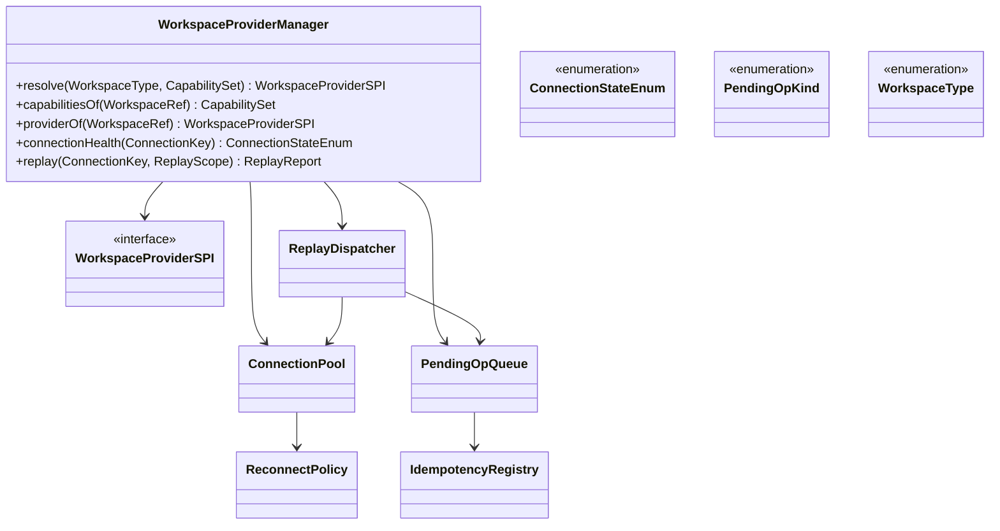
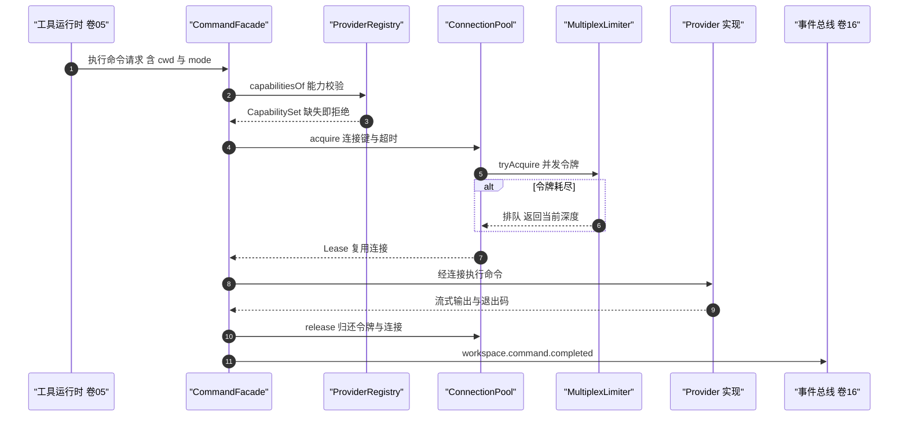
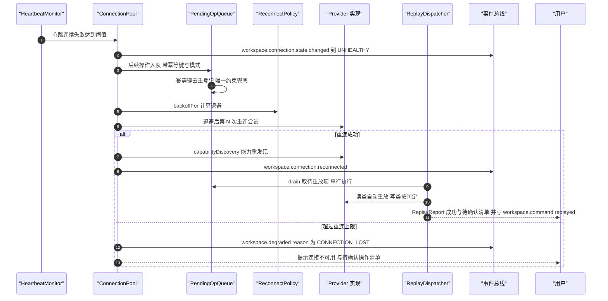
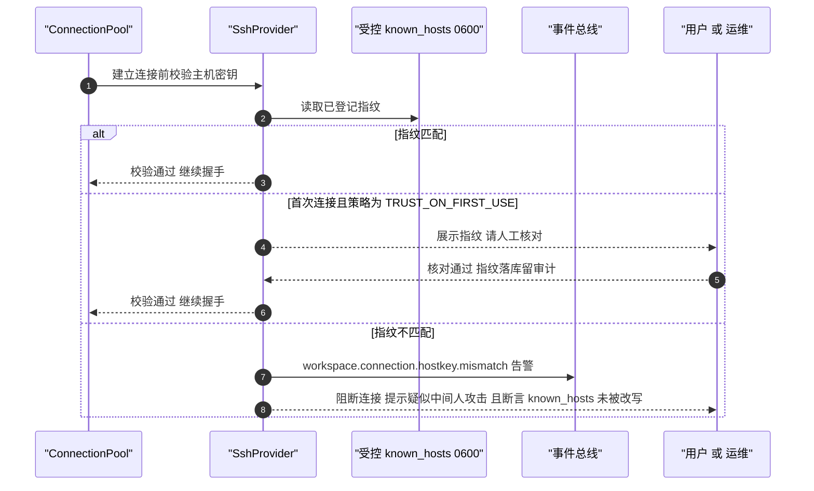
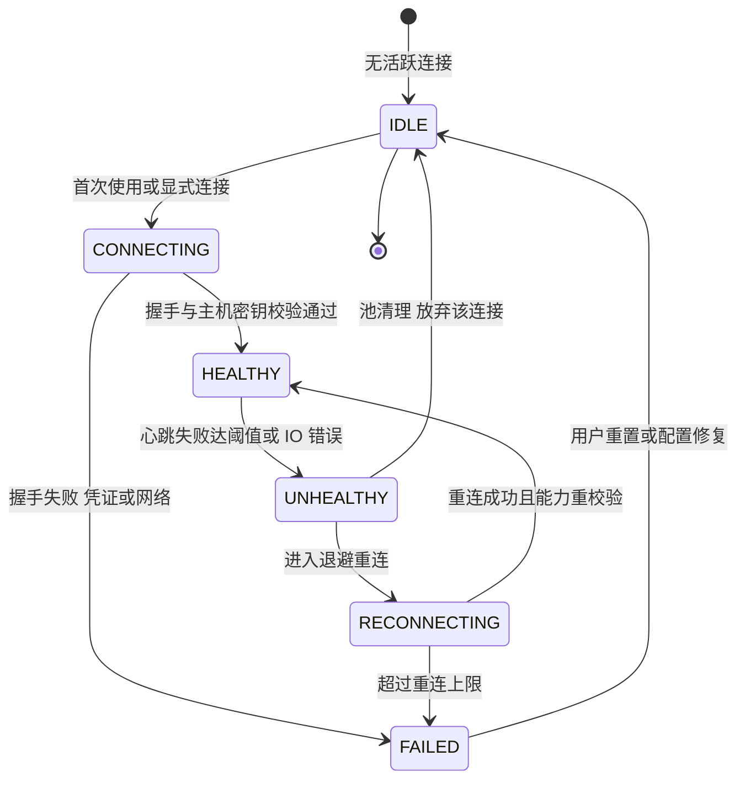
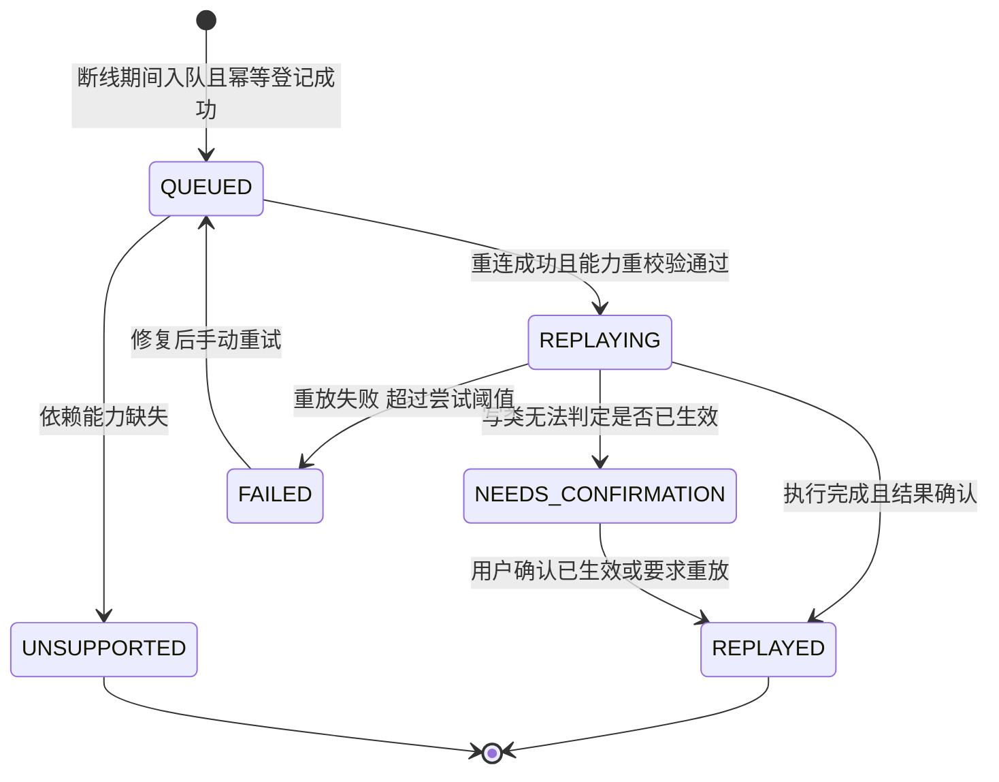

# C27 · WorkspaceProviderManager（工作区提供者管理）组件级实现方案

> **定位**：Phase B **组件级**方案。系统级权威：`impl/20-workspace-provider-impl.md`（下称 `impl/20`）§③ D-WSI-1/3/6、§⑤（`WorkspaceProviderSPI` 与类图）、§⑥.1/6.5、§⑦.2、§⑧.2、§⑨.5、§⑩.1–§⑩.3（并发 / 容量 / 断线协议 D0–D6 + **13 行断线点矩阵**）、§⑩.6（远端信任纪律）。
> **组件清单与命名桥接**：`appendix-d-component-inventory.md` **P-16**（`WorkspaceService + ProviderRegistry`，进程内服务，卷 20）为主登记项；**P-17** 仅取「命令并发与句柄登记」交界面（进程启动与日志轮询归 `impl/20` §⑥.4）；**P-18**（快照）不属本组件。`WorkspaceProviderManager` = P-16 的**提供者解析 + 连接治理 + 断线排队**面；类名沿用 `impl/20` §1.5 既有口径（`ProviderRegistry` / `ConnectionPool` / `HeartbeatMonitor` / `ReconnectPolicy` / `MultiplexLimiter` / `PendingOpQueue` / `IdempotencyRegistry` / `ReplayDispatcher`），不新增重名类。
> **竞品证据**：`competitors/03-codex.md` §4.16（`exec-server` 本地与远程统一 `ExecutorFileSystem`、`capability_discovery.rs` 能力发现与缓存、`websocket_pong_watchdog.rs` 心跳看门狗；RPC `environment/add { environment_id, exec_server_url, connect_timeout_ms }` 与 `EnvironmentConnected` / `EnvironmentDisconnected` 事件 `[E1]`）；`competitors/04-deepseek-harness.md` §4.16（`ssh/ssh` + `fs-ssh` + `subprocess-ssh` + `sandbox-ssh` 家族，「fs 与 subprocess provider 指向远端则 Bash / PTY / LSP 随之搬家」`[E1]`；**负证据**：未观测云工作区 / 容器编排 / K8s provider）。采纳台账 **L-072**（`Environment` 多实例 + cwd 类型化 `PathUri`）。
> **编号口径**：`REQ-C-WSPM-n` / `I-C-WSPM-n` / `X-C27-n`（修订建议待编排方并入台账后重编号；台账现止于 **X-82**，不占用其号段）。与 `REQ-WS-n` / `I-WS-n` 不重号、不覆盖；全部 Java 形态遵守 `.qoder/rules/` 五条规范，异常按层分工（契约侧 `HarnessException`、平台宿主侧 `BusinessException`，`impl/README.md` §5.5）。

## ① 定位与边界

### 1.1 组件职责与模块落位

一句话职责：把「代码在哪、怎么连、断了怎么办」收敛为**一个进程内的提供者解析与连接治理单元**——按能力解析后端实现、维护每目标持久连接与心跳、断线期间把操作收进有界队列并按语义分类重放，任何能力缺失与降级都显式可查（事件 + `DegradeReason` + 用户提示）。

| 内容 | 目标模块 | 装配方式 |
| --- | --- | --- |
| 契约（`WorkspaceType` / `ConnectionStateEnum` / `CapabilitySet` / `ProviderRegistryPort` / `ConnectionPoolPort` / `PendingOpQueuePort`） | `harness-contract`（`contract/workspace`） | 零框架、零 IO |
| 四类 Provider（`LocalFsProvider` / `SshProvider` / `ContainerProvider` / `CloudSandboxProvider`）与注册表 | `harness-platform/platform-workspace`（`provider/`） | `@ConditionalOnMissingBean`；`local` 形态仅装配 `LocalFsProvider` |
| 连接池 / 心跳 / 重连 / 多路复用限流 | 同模块（`conn/`） | Spring；IO 在虚拟线程 |
| 断线队列 / 幂等登记 / 重放分派 | 同模块（`queue/`） | 写路径 `@Transactional(rollbackFor = Exception.class)`；重放经 `AFTER_COMMIT` 触发 |
| 用例编排与授权门 / 管理面 | `harness-host/host-app`、`host-server` | host 只编排，不含连接细节 |

### 1.2 解决什么 / 不解决什么

**解决**：① 四类后端统一解析与能力矩阵判定（缺失即 `UNSUPPORTED_CAPABILITY`，不静默降级）；② 持久连接池语义（复用、空闲回收、每连接并发令牌、多路复用上限）；③ 心跳与健康位（`RedisKeys.state(Module.WS, "conn", connectionKey)`，60s 续期，Redis 失效降级进程内）；④ 断线期间有界排队与幂等键登记；⑤ 重连后能力重发现与**分类重放**（判定域与卷 19 唯一口径）；⑥ 远端连接信任的**执行位**（主机密钥、跳板、转发、端点策略，见 §5.3）。

**不解决**：文件流式读写与原子写（`impl/20` §⑤ `FileOperations`，本组件只提供通道）；环境探测内容本身（`EnvironmentProbeSPI`，只编排调用与失效重探）；快照与配额执行（`SnapshotBuilder` / `QuotaMonitor`）；权限判定（卷 06，只声明所需权限点）；Git 语义（C28，只消费 `git` 能力声明——worktree 目录与分支名**禁止**由本组件拼接）。

### 1.3 上下游依赖

| 方向 | 对象 | 契约要点 |
| --- | --- | --- |
| 上游 | 工具运行时（卷 05）/ Agent 内核（卷 12） | 经 `WorkspacePort` 调文件与命令能力；`cwd` 一律 `PathUri`，一个 Turn 可并存多环境实例 |
| 上游 | 权限（卷 06）/ 沙箱（卷 07） | 执行链固定「权限链 → 沙箱计划 → 能力校验 → 执行 → 审计」，本组件承担第 ③④ 步，任一步拒绝即终态 |
| 上游 | 密钥（卷 30） | 凭证与私钥一律 `SecretPort` 引用注入；非 HTTP 凭据代理不可用时**拒绝连接**而非退化为明文密钥 |
| 上游 | 持久化 / 事件（卷 19/16） | `oc_workspace_pending_op` 唯一约束与状态位；`workspace.connection.*` / `workspace.command.*` 事件族 |
| 下游 | Git（C28）/ 知识（卷 11）/ 端形态 | `git` 能力声明与命令通道；文件变更事件（监听或轮询，带 `source` 标记）；`oc ws` 命令面与降级提示 |

### 1.4 不变式（组件内自检）

① 同一 `connectionKey` 活跃连接数 ≤ 池上限，空闲连接按 TTL 回收；② 未携带幂等键的操作**禁止入队**（缺失即拒，文案含缺失字段名）；③ 重放中的写操作无法判定「未生效」时必须落 `NEEDS_CONFIRMATION`，不得猜测成功；④ `UNHEALTHY` 不等于断开——抖动只降健康位，不断连接、不入队（断线点矩阵第 1 行）；⑤ 连接不可恢复（`degraded(CONNECTION_LOST)`）不得向上传递「成功」语义；⑥ 主机密钥变化路径上**禁止**自动改写 known_hosts。

## ② 功能需求清单（REQ-C-WSPM-1…12）

| ID | 需求描述 | 来源 | 优先级 | 验收要点 |
| --- | --- | --- | --- | --- |
| REQ-C-WSPM-1 | 四类后端注册表：按 `WorkspaceType` + 必需能力解析实现；能力缺失抛 `UNSUPPORTED_CAPABILITY` 并附替代 | `impl/20` REQ-WS-01、I-WS-1、§④ 说明 | P0 | 四实现跑同一契约套件；能力缺失路径逐一断言 |
| REQ-C-WSPM-2 | 持久连接池：每目标一池、复用、空闲回收；`exec-server` 为可选档（`remote.mode` 切换），本地形态内嵌同语义实现 | `impl/20` REQ-WS-08/09、I-WS-3、§③ D-WSI-3；`03-codex.md` §4.16 `[E1]` | P0 | 杀连接后复用率与恢复时间达标；两档语义一致 |
| REQ-C-WSPM-3 | 心跳与健康位：默认 30s 心跳、连续失败达阈值置 `UNHEALTHY`；健康位为加速件（Redis 失效降级进程内） | `impl/20` REQ-WS-08、§⑦.2、§⑧.2 | P0 | 抖动不入队、真断线才入队；Redis 失效行为与降级矩阵一致 |
| REQ-C-WSPM-4 | 指数退避重连与上限：初始 1s、倍率 2、封顶 60s；超 `reconnect.max-attempts` 置 `degraded(CONNECTION_LOST)` | `impl/20` §⑩.3 D0/D2、§⑨.5 | P0 | 退避序列可单测；超限必写降级事件 |
| REQ-C-WSPM-5 | 重连后**能力重发现**：镜像升级 / 插件缺失会改变能力矩阵；重发现刷新快照并逐条重校验队列项 | `impl/20` §⑩.3 D2/D3；`03-codex.md` `capability_discovery.rs` `[E1]` | P0 | 能力减少时依赖项置 `UNSUPPORTED_CAPABILITY` 不重放 |
| REQ-C-WSPM-6 | 并发命令上限与排队：每连接 4 令牌（每工作区 16、单实例 64），超限**排队**；队列 256 满才 `RATE_LIMITED` + `Retry-After` | `impl/20` §⑨.5、§⑩.1、§⑩.2 | P0 | 排队不丢命令；满载文案与重试提示正确 |
| REQ-C-WSPM-7 | 断线有界排队：容量 500/工作区；幂等键 = `hash(workspaceId, opKind, 目标 PathUri, 请求摘要)`；满即拒绝，不丢操作、不静默排队 | `impl/20` REQ-WS-17、I-WS-6、§⑩.3 D1 | P0 | 队列深度与入队数一致；溢出返回 `RATE_LIMITED` |
| REQ-C-WSPM-8 | 分类重放：`READ` 自动；`WRITE` 仅「目标侧可判定未生效」才自动，否则 `NEEDS_CONFIRMATION`；串行 + 全局限速 | `impl/20` §⑩.3 D4/D5 与幂等键登记段 | P0 | 重复重放无双重副作用；待确认清单与卷 19 首屏同一份 |
| REQ-C-WSPM-9 | 跨重启协调者唯一：队列**不自建扫描器**，由卷 19 §⑩.3 R1 采集（`item_ref = op:<idem_key>`）后回调 D3–D6，报告回写 `oc_recovery_item` | `impl/20` §⑩.3 幂等键登记段 | P0 | 重启后残留队列项被重放且不重复 |
| REQ-C-WSPM-10 | 远端连接信任（安全红线）：`host-key-policy=strict` 默认、指纹变化即阻断 + 告警 + **不改写 known_hosts**；跳板逐跳校验；`ForwardAgent` 默认关；端点 `deny-private` | `impl/20` REQ-WS-21、I-WS-9、§⑩.6；卷 30 §4.3 B5 | P0 | 伪造密钥被拒且 known_hosts 哈希不变；`accept-new` 被启动校验拒绝 |
| REQ-C-WSPM-11 | 能力缺失显式降级：无监听 → 轮询（默认 2s，UI 标「非实时」）；不可实现能力返回 `UNSUPPORTED_CAPABILITY` | `impl/20` REQ-WS-10、§⑩.5；`04-deepseek-harness.md` 响亮拒绝 `[E1]` | P0 | 降级必带 `DegradeReason`；无静默降级路径 |
| REQ-C-WSPM-12 | 审计与可观测：连接 / 重连 / 重放全打点（中文占位符日志 + 事件 + 指标）；命令审计含目标、用户、cwd、摘要（DLP 脱敏）、峰值、退出码；凭证只记引用 ID | `impl/20` REQ-WS-19、§⑧.5、§⑩.7 | P1 | 审计可查且无明文敏感字段；`pending_op_depth` 进看板 |

## ③ 关键设计决策（I-C-WSPM-1…4）

评分沿用 `impl/README.md` §4 权重：**F 30% / U 20% / S 25% / M 25%**。

### 3.1 I-C-WSPM-1 连接承载与正确性锚点

| 分支 | 描述 | F | U | S | M | 加权 | 结论 |
| --- | --- | --- | --- | --- | --- | --- | --- |
| B1 | 每命令新建连接（SSH 短连） | 6 | 5 | 8 | 5 | 59.5 | 淘汰（延迟高、易限流） |
| B2 | 进程内持久池 + 心跳 + 退避重连 + 多路复用 + 并发上限 | 9 | 8 | 8 | 9 | 86.0 | **选定（默认档）** |
| B3 | 默认独立 `exec-server` 常驻服务 | 9 | 7 | 6 | 8 | 75.5 | 作为**可选档**（企业要求独立出口时切换） |

**选定 B2（与 I-WS-3 同源，本组件只补池内结构）**：正确性锚点是「行数校验 + 幂等键」，连接池只承担效率与体验，健康位丢失仅导致重新竞争。**回退**：`remote.mode=exec-server` 时经 `WorkspaceProviderSPI` 适配器接入，本组件**不实现**该服务端。

### 3.2 I-C-WSPM-2 断线排队与重放承载

| 分支 | 描述 | F | U | S | M | 加权 | 结论 |
| --- | --- | --- | --- | --- | --- | --- | --- |
| B1 | 立即失败并向上抛错 | 6 | 5 | 9 | 6 | 63.5 | 淘汰（长任务断线即全废） |
| B2 | 有界队列 + 幂等键 + 分类重放（读自动、写确认） | 9 | 8 | 8 | 9 | 86.0 | **选定** |
| B3 | 本地暂存 + 离线执行 + 冲突合并 | 8 | 7 | 5 | 7 | 68.0 | 淘汰（与沙箱 / 审计冲突） |

**选定 B2（与 I-WS-6 同源）**，组件级补两条：① 重放载体为**单虚拟线程串行 + 令牌桶限速**（禁止并发重放，防重连风暴与目标机抖动）；② 幂等键**禁止纳入时间戳与随机数**（跨重启稳定，见 §8.2）。**回退**：重放 QPS 超阈值 → 按会话串行 + 收紧限速。

### 3.3 I-C-WSPM-3 连接健康位承载

| 分支 | 描述 | F | U | S | M | 加权 | 结论 |
| --- | --- | --- | --- | --- | --- | --- | --- |
| B1 | 纯 Redis 健康位 | 8 | 8 | 6 | 6 | 71.0 | 淘汰（Redis 失效即误判连接） |
| B2 | **Redis 加速 + 进程内兜底，正确性不依赖任一** | 9 | 8 | 9 | 8 | 86.0 | **选定** |
| B3 | 纯进程内 Map | 8 | 7 | 7 | 9 | 77.5 | 淘汰（多实例接管判定失效） |

**选定 B2**：健康位是提示与加速（TTL 60s 续期），接管判定以「重连成功 + 能力重校验」为准；Redis 不可用时回退进程内 Map 并写 `system.capability.degraded`。

### 3.4 I-C-WSPM-4 池粒度与多路复用

| 分支 | 描述 | F | U | S | M | 加权 | 结论 |
| --- | --- | --- | --- | --- | --- | --- | --- |
| B1 | 每目标全局一池（跨工作区共用） | 7 | 6 | 7 | 7 | 67.5 | 淘汰（隔离与配额串扰） |
| B2 | **每 `(tenant, connectionKey)` 一池 + 每连接令牌 + 池上限** | 9 | 8 | 8 | 9 | 86.0 | **选定** |
| B3 | 每命令一连接（复用为零） | 5 | 5 | 9 | 5 | 59.5 | 淘汰（同 B1 短连） |

**选定 B2**：`connectionKey = (workspaceId, type, endpointHash)`；并发口径取 §⑨.5「每连接 4 ⇒ 每工作区 16 ⇒ 单实例 64」，池内连接按需扩容但受 `max-connections-per-workspace` 钳制（默认 4；与 §⑩.2「SSH 池按工作区 × 1」的行文冲突见 X-C27-2）。

## ④ 类图



**说明**：`WorkspaceProviderSPI`（签名见 `impl/20` §⑤）由 `LocalFsProvider` / `SshProvider` / `ContainerProvider` / `CloudSandboxProvider` 四实现承载，能力差异一律经 `CapabilitySet` 声明；`ConnectionPool` 内含心跳与多路复用限流两个内部协作件（`HeartbeatMonitor` / `MultiplexLimiter`，不对外暴露）。`ConnectionStateEnum` 为 `code` + `desc` + `of()` 枚举（取值与迁移表见 §6.1，DB 与事件只存 `code`）；`WorkspaceType` 取 `LOCAL` / `SSH` / `CONTAINER` / `CLOUD`；`PendingOpKind` 区分 `READ` / `WRITE`（决定重放资格）。`WorkspaceProviderManager` 是唯一对外门面（取能力 / 取提供者 / 查健康位 / 触发重放），内部协作类禁止被 host 包直接引用（ArchUnit 守护）。`oc_workspace_pending_op`（唯一约束 `idem_key`）是队列真源（重启不丢项），内存仅存游标；`ReplayDispatcher` 只消费 `drain` 结果，不直接读写队列表。

## ⑤ 核心流程时序图

### 5.1 主路径：命令执行的连接获取与并发令牌



- **前置条件与主路径**：工作区 `ready` / `degraded` 且权限链与沙箱计划已放行（顺序见 `impl/20` §⑩.6）时，经「能力校验 → 令牌获取（超限排队而非拒绝）→ 复用连接执行 → 归还 → 事件与审计」推进。
- **异常补偿与幂等点**：令牌等待超时 → `RATE_LIMITED` + `Retry-After`；执行中断线 → 走 §5.2；获取连接失败 → `DEPENDENCY_UNAVAILABLE` + 退避重连；`commandId` 幂等键保证同键重复执行返回既有结果，`release` 必须落在 `finally` 语义。

### 5.2 断线：健康位降级、退避重连与分类重放



- **前置条件与主路径**：心跳连续失败达阈值（默认 3 次，D0）且队列容量未满时，经「降健康位 → 入队 → 退避重连 → 能力重发现 → 分类重放 → 报告」推进。
- **异常与补偿**：能力减少 → 依赖项置 `UNSUPPORTED_CAPABILITY` 不重放；写类无法判定 → `NEEDS_CONFIRMATION`（与卷 19 首屏**同一份清单**）；重放中途再断 → 已 `REPLAYED` 项不重复、剩余项留队。
- **幂等与并发点**：`idem_key` 唯一约束 + 状态位双保险；重放严格串行 + 全局限速。

### 5.3 安全红线：主机密钥变化阻断与首次信任



- **前置条件与主路径**：目标为 SSH / 跳板形态且 `known-hosts-file` 可读（0600，与用户 `~/.ssh/known_hosts` 分离）时，逐跳（含跳板）校验主机密钥，匹配即握手；首次信任仅允许人工核对后落库。
- **异常与补偿**：指纹不匹配 → 阻断 + 告警 + **禁止自动更新 known_hosts**（自动改写本身就是 MITM 的落地方式）；代理不可用 → 拒绝连接而非降级明文；`ForwardAgent` 未开启时远端 `ssh-add -l` 为空。
- **幂等与并发点**：校验为无状态纯读；并发首次信任由「指纹落库行唯一约束」收敛为一次人工核对。

## ⑥ 状态机

### 6.1 连接状态（六态，`impl/20` §⑦.2）



**迁移表（实现为静态不可变 Map；非法迁移抛 `BusinessException(ErrorCode.CONFLICT, …)` 且文案含当前态与目标态）**：

| 当前态 | 允许目标 | 触发 | 副作用 |
| --- | --- | --- | --- |
| IDLE / CONNECTING | CONNECTING / FAILED / HEALTHY | 首次使用 / 握手结果 | 写 `workspace.connection.state.changed`；健康位续期 |
| HEALTHY | UNHEALTHY / IDLE | 心跳失败 / 空闲回收 | 抖动仅降位不断连；回收前断言无在途命令 |
| UNHEALTHY | RECONNECTING / IDLE | 达失败阈值 / 池清理 | 后续操作即入队（队列是断线期唯一入口） |
| RECONNECTING | HEALTHY / FAILED | 重连结果 | 成功后能力重发现；失败达上限写 `workspace.degraded` |
| FAILED | IDLE | 用户重置 / 配置修复 | 写类待重放项转「待用户确认清单」 |

### 6.2 待重放操作状态



**不变量**：① 唯一键 `idem_key` 任一时刻只对应一个状态（迁移用条件更新，行数必须为 1）；② `REPLAYED` 项禁止再次重放（重启后亦不例外）；③ `PTY` **永不入队**（交互语义不可重放，断线即标 `LOST` 并提示重建）；④ `NEEDS_CONFIRMATION` 与卷 19 `oc_recovery_item` 首屏共用同一清单，禁止各维护一套。

## ⑦ 接口与依赖矩阵

### 7.1 对外接口（契约侧零框架；平台侧写路径纪律）

```java
package com.hk.opencoding.contract.workspace;

/**
 * 工作区提供者注册表：按类型与必需能力解析实现，并暴露已解析工作区的能力快照。
 * 全部方法零框架零 IO；能力缺失一律显式拒绝，禁止静默降级（REQ-C-WSPM-1）。
 */
public interface ProviderRegistryPort {

    /**
     * 按类型与必需能力解析提供者实现。
     *
     * @param type 工作区类型（必填，取值见 WorkspaceType）
     * @param requiredCapabilities 必需能力集合（必填，空集表示不校验）
     * @return 满足能力要求的提供者实现
     * @throws HarnessException 无实现或能力不满足时抛出（UNSUPPORTED_CAPABILITY，附可替代方案）
     */
    WorkspaceProviderSPI resolve(WorkspaceType type, CapabilitySet requiredCapabilities);

    /**
     * 读取已解析工作区的能力快照（重连后经能力重发现刷新）。
     *
     * @param ref 工作区引用（必填，须为 READY 或 DEGRADED）
     * @return 能力快照
     * @throws HarnessException 工作区不存在时抛出（NOT_FOUND）
     */
    CapabilitySet capabilitiesOf(WorkspaceRef ref);

    /**
     * 取工作区已解析的提供者实现（不重复解析）。
     *
     * @param ref 工作区引用（必填）
     * @return 提供者实现
     * @throws HarnessException 工作区未解析或已销毁时抛出（CONFLICT）
     */
    WorkspaceProviderSPI providerOf(WorkspaceRef ref);
}
```

`ConnectionStateEnum` 契约侧形态与 `impl/20` §⑤ `CommandMode` 完全同构：六项（`IDLE` / `CONNECTING` / `HEALTHY` / `UNHEALTHY` / `RECONNECTING` / `FAILED`）各带中文 `desc`，提供 `of(String code)` 工厂（未知 code 抛 `HarnessException(ErrorCode.INVALID_ARGUMENT, "未知连接状态：" + code)`，**禁止回落默认值**）；DB 与事件只落 `code`。取值语义与迁移表见 §6.1，本文不再重复枚举源码。

平台侧写路径纪律（`platform-workspace`）：入队服务加 `@Transactional(rollbackFor = Exception.class)`，顺序为「幂等回读（唯一约束兜底）→ 容量判定（满即 `RATE_LIMITED` + `Retry-After`）→ 条件写入（行数必须为 1）」；**重放动作不在事务内**——入队成功后经 `AFTER_COMMIT` 事件交 `ReplayDispatcher` 单虚拟线程串行处理；日志 `@Slf4j` 中文占位符（`log.info("断线待重放入队，connectionKey={}, opKind={}", …)`），异常带 `Throwable`（`log.error("SSH 重连失败，connectionKey={}, attempt={}", key, attempt, ex)`）。

### 7.2 依赖与被依赖矩阵

| 关系 | 组件 / 端口 | 契约要点 | 失效影响 |
| --- | --- | --- | --- |
| 依赖 | 事件总线（卷 16） | `workspace.connection.*` / `command.*` 事件；重连失败带 `Throwable` 打 `log.error` | 连接事件缺失 → 降级不可见，禁止装配 |
| 依赖 | `StoragePort`（卷 19） | `oc_workspace_pending_op` 唯一约束 + 状态位；`oc_recovery_item` 回调 | 不可写 → 断线期操作被拒（`DEPENDENCY_UNAVAILABLE`），不静默丢 |
| 依赖 | `RuntimeStorePort`（Redis） | 健康位（60s TTL）、准备锁、重放游标 | 降级进程内实现，正确性由 PG 兜底 |
| 依赖 | `SecretPort`（卷 30） | 凭证引用注入；代理不可用即拒连 | 无引用 → 远端工作区不可用（Fail-Fast 提示配置位置） |
| 被依赖 | C28 `GitWorktreeManager` | `git` 能力声明 + 命令通道 + `PathUri` | worktree 操作退化为 `UNSUPPORTED_CAPABILITY` |
| 被依赖 | 卷 19 恢复协调器 | `item_ref = op:<idem_key>` 采集与报告回写 | 重启后队列残留无人处理（由 X-C27-5 收敛） |

### 7.3 配置项与事件

| 配置键（`open-coding.workspace.*`） | 默认 | 必填 | 环境变量 | 影响范围 |
| --- | --- | --- | --- | --- |
| `remote.mode` | `embedded` | 否 | `OC_WS_REMOTE_MODE` | `embedded` / `exec-server` 两档装配 |
| `heartbeat.interval-seconds` / `reconnect.max-attempts` | `30` / `5` | 否 | `OC_WS_HEARTBEAT_SEC` / `OC_WS_RECONNECT_MAX` | 心跳探测与健康位续期；超限即 `degraded(CONNECTION_LOST)` |
| `connection.max-concurrent-commands` / `command.queue-capacity` / `pending-op.queue-capacity` / `replay-rate-per-second` | `4` / `256` / `500` / `20` | 否 | `OC_WS_MAX_CONCURRENT` / `OC_WS_CMD_QUEUE` / `OC_WS_PENDING_*` | 每连接并发令牌；命令队列满即 `RATE_LIMITED`；断线队列容量与重放限速 |
| `probe.core-timeout-seconds` | `5` | 否 | `OC_WS_PROBE_CORE_TIMEOUT` | 核心探测超时（超时项记 `UNKNOWN`） |
| `ssh.host-key-policy` / `known-hosts-file` | `strict` / `${OC_HOME}/ssh/known_hosts` | 是（SSH 引用必填） | `OC_WS_SSH_*` | 远端信任红线（`accept-new` / `no` 被启动校验拒绝） |
| `ssh.allow-agent-forward` / `remote.endpoint-policy` | `false` / `deny-private` | 否 | `OC_WS_SSH_AGENT_FORWARD` / `OC_WS_REMOTE_ENDPOINT_POLICY` | 转发与端点地址策略 |

**新增配置候选**（§⑨.5 未列，见 X-C27-4）：`heartbeat.failure-threshold`（3）、`reconnect.initial-backoff-seconds`（1）、`reconnect.backoff-multiplier`（2）、`reconnect.backoff-cap-seconds`（60）、`connection.max-connections-per-workspace`（4）。所有键以 `${ENV_VAR:default}` 声明并同步 `.env.example`；`WorkspaceProperties` 为纯数据类**不加 `@Component`**，字段 JavaDoc 标明用途、默认值与影响范围。事件族：`workspace.connection.state.changed` / `reconnected` / `hostkey.mismatch`、`workspace.command.queued` / `replayed` / `failed`、`workspace.degraded`。

## ⑧ 关键算法

### 8.1 算法 A：连接选择与重连退避

输入：`connectionKey`、当前 `ConnectionStateEnum`、失败计数 `attempt`、能力快照。步骤：① `acquire` 先查池内可用连接，命中即续租并借出令牌；② 无可用连接 → `CONNECTING` 建连（含主机密钥逐跳校验）；③ 心跳在独立虚拟线程按 `heartbeat.interval-seconds` 发送，连续失败达阈值置 `UNHEALTHY` 并发布状态事件；④ 退避重连按下方策略求值，超上限即 `FAILED` + `workspace.degraded`；⑤ 重连成功先做能力重发现，再解冻队列。**复杂度**：acquire O(池内连接数 ≤ 4)、退避 O(1)；**边界条件**：`attempt` 必须落在 `[1, max-attempts]`（越界即抛，不静默截断）、退避必须封顶、能力重发现失败不得判 `HEALTHY`。

```java
package com.hk.opencoding.platform.workspace.conn;

/**
 * 重连退避策略：指数退避 + 封顶，参数来自配置（见 §7.3 新增配置候选）。
 * 无状态、可重复求值；禁止在策略内持有连接引用或缓存 attempt。
 */
@Slf4j
@Component
@RequiredArgsConstructor
public class ReconnectPolicy {

    private final WorkspaceProperties properties;

    /**
     * 计算第 attempt 次重连的退避时长。
     *
     * @param attempt 已失败次数（必填，从 1 起计，不得超过 reconnect.max-attempts）
     * @return 本次退避时长（封顶 reconnect.backoff-cap-seconds）
     * @throws BusinessException attempt 越界时抛出（INVALID_ARGUMENT，调用方不得静默截断）
     */
    public Duration backoffFor(int attempt) {
        Reconnect reconnect = properties.getReconnect();
        if (attempt < 1 || attempt > reconnect.getMaxAttempts()) {
            throw new BusinessException(ErrorCode.INVALID_ARGUMENT, "重连次数越界，attempt=" + attempt);
        }
        // 指数退避封顶：第 n 次退避 = min(初始 × 倍率^(n-1), 封顶)，防止队列积压引发重连风暴
        long millis = Math.min(
                reconnect.getInitialBackoffMillis() * (long) Math.pow(reconnect.getBackoffMultiplier(), attempt - 1),
                reconnect.getMaxBackoffMillis());
        log.info("计算重连退避，attempt={}, backoffMs={}", attempt, millis);
        return Duration.ofMillis(millis);
    }
}
```

### 8.2 算法 B：命令排队与幂等键

步骤：① 取令牌，失败即排队（队列满 → `RATE_LIMITED` + `Retry-After`）；② 生成 `idem_key = hash(workspaceId, opKind, 目标 PathUri, 请求摘要)`，摘要取「命令 + 参数结构化序列化」的 SHA-256，**禁止**纳入时间戳、随机数、进程号；③ 断线期先查同键既有行（幂等分支）再判容量；④ 重连后 `drain` 按 `queue_seq` 升序串行重放并按令牌桶限速；⑤ `READ` 直接重放，`WRITE` 仅在「目标侧可判定未生效」（校验和比对 / 原子写临时名残留）时重放，否则 `NEEDS_CONFIRMATION`。**复杂度**：幂等键 O(1) 哈希 + O(log n) 唯一索引查找；重放 O(k) 串行。**边界条件**：`PTY` 永不入队（标 `LOST`）；后台任务断线期间**不入队**（目标侧继续运行、句柄保持 `RUNNING`，仅恢复日志轮询）；容量检查与插入必须同事务（防两写者同时通过判定）。**幂等键实现形态**：`IdempotencyRegistry` 为 `final` 常量类（私有构造），公开静态方法 `idemKeyOf(WorkspaceId, PendingOpKind, PathUri, String)`，JavaDoc 声明「键组成不得包含时间戳与随机量」与 `@throws HarnessException`（摘要不可用 / 参数缺失）；摘要算法名落常量 `DIGEST_ALGORITHM = "SHA-256"`（算法常量**禁止配置化**，`config-extraction-rules.md` §8）；键材料按 `workspaceId|opKind|target.display()|requestDigest` 拼接后哈希，返回定长十六进制串，作为 `oc_workspace_pending_op` 唯一约束列。实现形态与 `Ids`/`Digests` 工具类复用对齐 `impl/20` 口径。

## ⑨ 错误处理与降级

| 错误场景 | ErrorCode | retryable | 处理动作 | 用户可见文案 |
| --- | --- | --- | --- | --- |
| 类型无实现 / 能力缺失（无 PTY、无强限） | `UNSUPPORTED_CAPABILITY` | 否 | 显式拒绝并附 `alternatives` | 「当前工作区不支持「PTY」，可用模式：一次性 / 后台」 |
| 连接不可用 / 探测失败影响主路径；目标主机 / 编排不可达 | `WORKSPACE_UNAVAILABLE` / `DEPENDENCY_UNAVAILABLE` | 是 | 退避重连或重探；超限写 `workspace.degraded` 并进入降级阶梯 | 「工作区暂不可用，正在自动重连」 |
| 主机密钥不匹配（疑似 MITM） | `WORKSPACE_UNAVAILABLE` | 否 | 阻断连接 + 告警 + 断言 known_hosts 未改写 | 「主机密钥校验失败，已阻断连接，请联系管理员核对指纹」 |
| 命令 / 重放队列满 | `RATE_LIMITED` | 是 | 拒绝并带 `Retry-After`；保留已有队列项 | 「并发队列已满，上限 `<N>`，请稍后重试」 |
| 路径越界 / 只读关联区写入 | `WORKSPACE_PATH_DENIED` | 否 | 拒绝并记审计 | 「路径不在受控根内，已拒绝」 |
| 非 HTTP 凭据代理不可用 / 幂等键缺失或非法（入队守卫） | `DEPENDENCY_UNAVAILABLE` / `INVALID_ARGUMENT` | 否 | 拒绝连接（禁止降级明文密钥）/ 拒绝入队（不变式 ②） | 「凭据代理不可用，已拒绝建立连接」/「操作缺少幂等键，已拒绝入队」 |

**降级阶梯（连接域片段，由轻到重，逐级写事件并告警）**：① **能力降级**——无监听 → 轮询（默认 2s，UI 标「非实时」）+ `DegradeReason`；② **连接降级**——心跳失败 → `UNHEALTHY` + 操作入有界队列 + 指数退避重连；③ **执行降级**——重连超限 → `degraded(CONNECTION_LOST)`，写类转「待用户确认清单」；④ **只读收口**——持续不可恢复 → `MIRROR_CACHE` 只读镜像并显式提示离线语义。**禁止**：静默降级、丢弃操作、猜测写成功、以「能力降级」名义绕过权限链与沙箱计划。

## ⑩ 性能与并发

| 指标 | 预算 | 说明 |
| --- | --- | --- |
| 本地小文件读 | P95 ≤ 5ms | 基准用例（`impl/20` §⑩.2） |
| 命令启动延迟 | 本地 ≤ 50ms；SSH ≤ 300ms（复用后）；容器 ≤ 800ms | 超限先查复用率与令牌排队深度 |
| 核心探测 | 本地 ≤ 2s；SSH ≤ 5s；容器 / 云 ≤ 8s | 超时项记 `UNKNOWN` 并保留上次值 |
| 重连恢复 | ≤ `max-attempts` 次内恢复且 P95 ≤ 30s | 含能力重发现耗时 |
| 断线队列重放 | 500 条 ≤ 60s（限速 20/s 内） | 串行重放，超时告警 |

**并发模型与上限**：命令与文件 IO 一律虚拟线程；每连接并发令牌 **4**（每工作区 **16**、单实例 **64**，配置同源 `connection.max-concurrent-commands`），超限**排队**而非拒绝；命令并发队列 **256**（满即 `RATE_LIMITED`）；断线待重放队列 **500/工作区**（溢出即拒）；PTY 活跃 ≤ 8/会话、后台任务活跃 ≤ 8/工作区；SSH 长连接单实例 ≤ 200（口径冲突见 X-C27-2）；输出流按 100ms 聚合（单批 ≤ 64KB）进事件总线。**背压三层**：令牌（在途）→ 命令队列（排队）→ 待重放队列（断线期），任一层满都返回明确错误码而非扩大其他层；**锁**：健康位与准备锁为加速件（Redis 失效即回退进程内），正确性依赖 PG 行数校验与唯一约束。

## ⑪ 测试要点

| 层级 | 用例 | 断言要点 |
| --- | --- | --- |
| 单元 | `ReconnectPolicy` 退避序列（attempt=1…5、越界、封顶）；`ConnectionStateEnum.of` 全分支；`IdempotencyRegistry` 键稳定性（同输入跨实例同键、不同 PathUri 不同键）；连接状态机迁移表全覆盖（合法 + 全部非法） | 越界抛 `INVALID_ARGUMENT`；退避逐项等于预期毫秒；键长恒 64；非法迁移抛 `CONFLICT` 且文案含当前态与目标态 |
| 集成 | 四类后端契约套件（LocalFS / SSH / Container / CloudSandbox 桩）；并发令牌与排队（单连接 100 并发命令） | 同一套用例全绿；在途 ≤ 4、超限排队不丢命令、队列满返回 `RATE_LIMITED` + `Retry-After` |
| 故障注入 | **断线点矩阵 13 行**（`impl/20` §⑩.3）：心跳抖动、一次性命令中断线、PTY 中断线、后台任务断线、服务重启（本地）、原子写中途崩溃、快照上传中断、重放中再断线、重连后能力减少、队列溢出、重启后在途 PTY、重启后在途后台任务、跨重启待重放队列 | ① 操作不丢（队列深度与入队数一致）；② 重复重放无双重副作用；③ `LOST` 任务在 API 与 UI 均标「结果未知」；④ 降级均带 `DegradeReason` 且产生事件；⑤ 无僵尸进程残留 |
| 故障注入 / 契约 / 性能 | 远端信任五项（REQ-C-WSPM-10）：伪造主机密钥、首次信任指纹不符、跳板任一跳变化、`ForwardAgent` 开关对照、`deny-private` 下回环 / 元数据地址注册；能力矩阵判定与降级文案快照、事件 schema；§⑩ 全部指标 + 重连 P95 ≤ 30s + 500 条重放 ≤ 60s | 连接被阻断 + 告警 + **known_hosts 文件哈希不变**；`accept-new` 被启动校验拒绝；缺能力不静默且文案含替代方案；性能未达标 CI 失败并附报告 |

```bash
# 契约与平台模块编译单测（离线可跑）；四类后端契约与命令三模式（需 Docker：sshd 容器 + 目标容器）
mvn -pl harness-platform/platform-workspace -am test
mvn -pl harness-platform/platform-workspace -am verify -Dtest='*WorkspaceIT'
# 断线 / 配额 / 跨平台故障注入 + 性能门禁（13 行矩阵 + 信任五项）
mvn -pl harness-platform/platform-workspace -am verify -Dtest='*WsFailureIT' -Pperf-gate
scripts/ci/ws-fault-inject.sh --case heartbeat-loss-mid-exec,pty-lost-on-reconnect,host-key-mismatch,tampered-known-hosts,agent-forward-abuse,queue-overflow-on-reconnect
```

**完成定义（DoD）**：① 四类后端契约套件全绿且能力缺失路径逐一有断言；② 连接池、心跳、退避重连、多路复用、并发上限全部生效且指标可查；③ 断线点矩阵 13 行全通过（含 3 行服务重启行）；④ 主机密钥 `strict` 红线五类注入全过且 known_hosts 未被改写；⑤ 重放分类正确（读自动 / 写判定 / 待确认清单与卷 19 同一份）；⑥ 无静默降级路径（每条降级都产事件 + `DegradeReason` + 用户提示）。

## 修订建议登记（本文件提出，待汇总入 `impl/IMPL-DECISIONS.md` §4 并分配 `X-n`）

| 本地编号 | 建议内容 | 依据 | 建议动作 | 阻塞性 |
| --- | --- | --- | --- | --- |
| X-C27-1 | 台账 §2.20「WS（impl/20，8 条）」与 `impl/20` §3.9 不一致：§3.9 实含 **9 条**（`I-WS-9` 为 R04 安全轮新增：远端连接信任），台账缺行且计数未更新 | `impl/IMPL-DECISIONS.md` §2.20；`impl/20` §3.9 与文末自计量 | 台账补 `I-WS-9` 行并把计数改为 9 | 否（口径） |
| X-C27-2 | 连接池容量口径冲突：§⑩.2「SSH 连接池按工作区 × 1 复用连接，单实例 ≤ 200 条长连接」与 §⑨.5「每连接 4 ⇒ 每工作区 16」隐含「每工作区 4 连接」互斥；本组件按 §⑨.5 实现 | `impl/20` §⑨.5 与 §⑩.2 | 统一为「每工作区 ≥ 1 条可复用长连接，并发受每连接令牌与池上限双约束」并给出单实例上限公式 | 否（措辞级，影响容量核对） |
| X-C27-3 | SSH 主机密钥策略的**枚举 code 与配置取值不一致**：枚举 code 为 `STRICT` / `TRUST_ON_FIRST_USE`，而 §⑨.5 的 yml / 环境变量取值为 `strict` / `strict-trust-on-first-use`；直接 `of(rawValue)` 会误拒合法配置 | `impl/20` §⑩.6 枚举与 §⑨.5 配置表 | 补「配置取值 ↔ 枚举 code」映射表（或把枚举 code 改为小写短横线形态），启动校验按映射表解析 | **是（启动 Fail-Fast 会误拒）** |
| X-C27-4 | 心跳失败阈值（D0「连续 3 次」）与退避参数（1s / ×2 / 封顶 60s）未进 §⑨.5 配置表；按 `config-extraction-rules.md`「重试间隔 / 超时属随环境变化项」应配置化 | `impl/20` §⑩.3 D0/D2 与 §⑨.5 | 新增 `heartbeat.failure-threshold`、`reconnect.initial-backoff-seconds`、`reconnect.backoff-multiplier`、`reconnect.backoff-cap-seconds`、`connection.max-connections-per-workspace` 五项并同步 `.env.example` | 否（增量） |
| X-C27-5 | 待重放队列与卷 19 恢复协调器的**回调契约未闭合**：`impl/20` §⑩.3 声明「不自建扫描器、由 19 R1 采集（`item_ref = op:<idem_key>`）后交本组件 D3–D6」，但两文件均未定义回调入口方法与报告回写字段清单 | `impl/20` §⑩.3；卷 19 §⑩.3 | 在 19/20 交叉引用处补一张回调契约表（入口方法、入参、`oc_recovery_item` 回写字段），防双扫描或漏扫 | 否（增量，影响恢复验收） |
