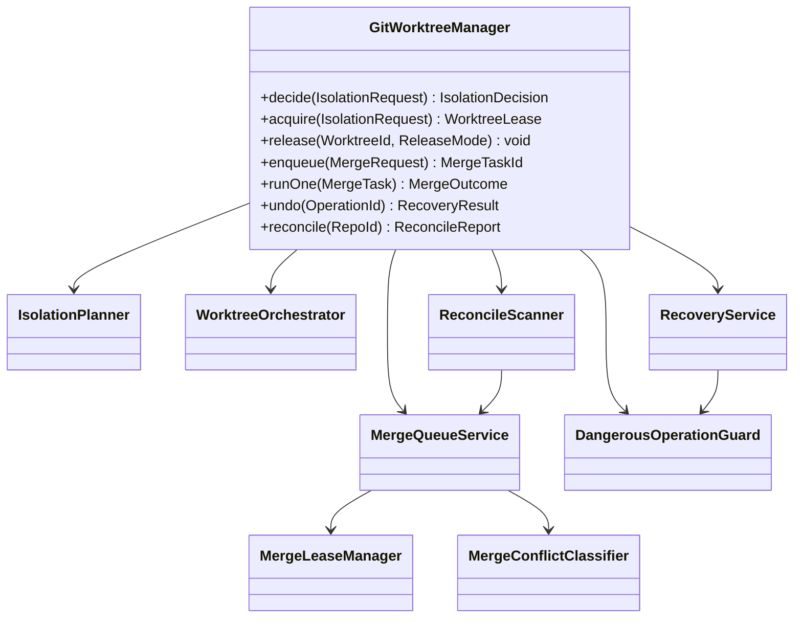
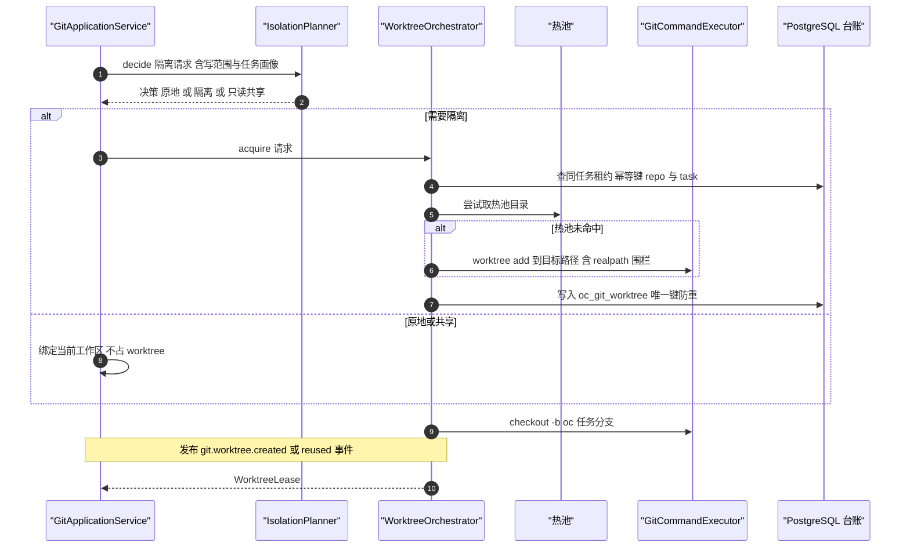
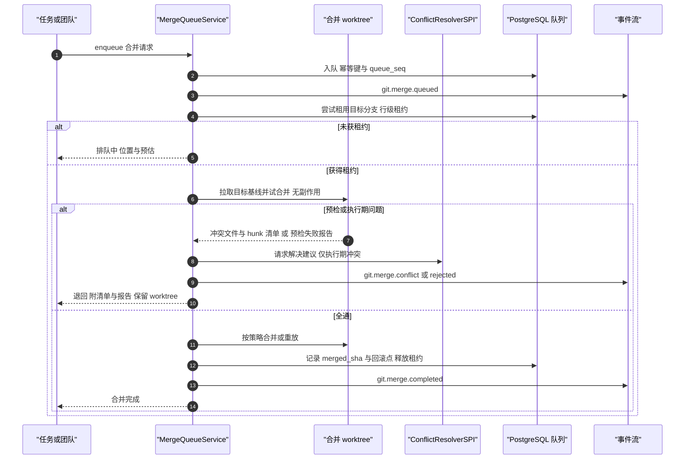
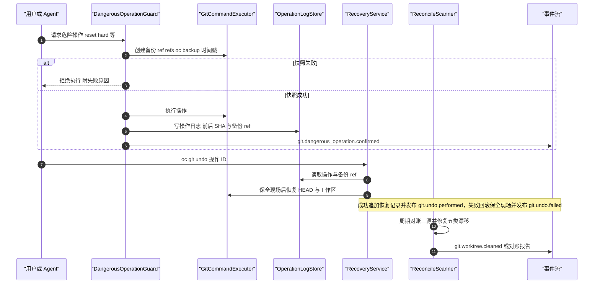
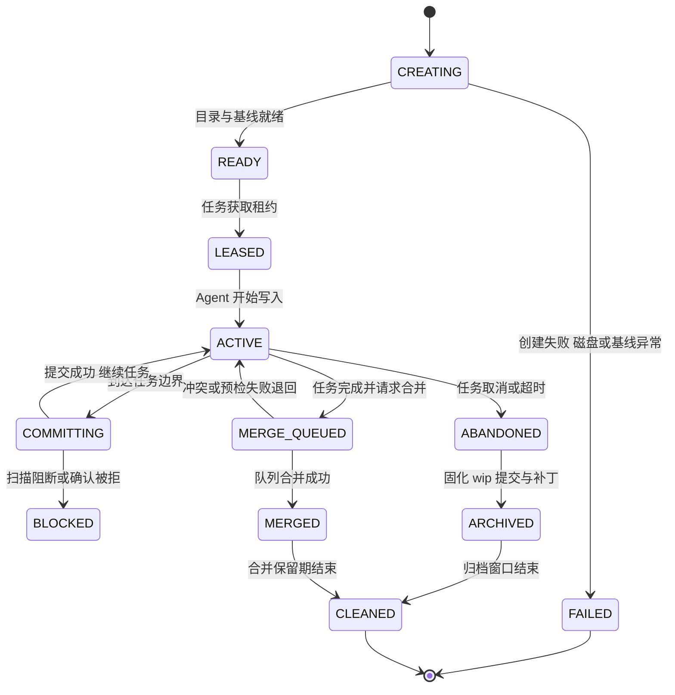
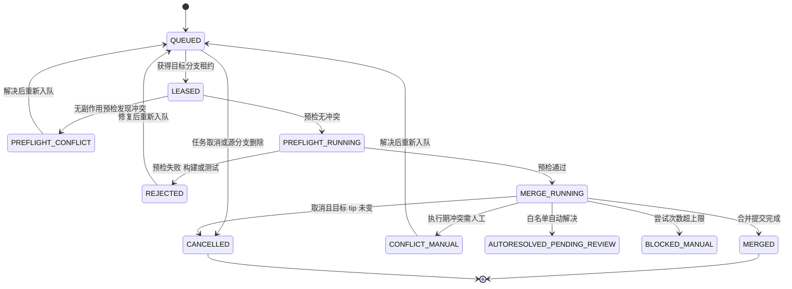

# C28 · GitWorktreeManager（worktree 隔离与合并队列）组件级实现方案

> **定位与组件清单**：Phase B **组件级**方案。系统级权威：`impl/21-git-worktree-impl.md`（下称 `impl/21`）§③ D-GITI-2/3/5/7、§5（类图与契约签名）、§6.1–6.4、§7.1/7.2（状态机）、§8.1/8.2（表与 Redis Key）、§9.4（配置）、§10.1/10.3（并发与合并协议）/§10.4（放弃回收）/§10.5（丢失提交恢复）/§10.7（G-1…G-7 加固）/§10.11（对账与删除贯通）、§11.3（故障注入矩阵）。`appendix-d-component-inventory.md` **P-22**（`GitService + CommitService + 护栏`）与 **P-23**（`MergeQueueService + MergeLeaseManager`）为主登记项；本组件 = P-22 的**worktree 隔离 + 护栏 + 恢复**面 + P-23 全量 + R05 对账面。**不含**提交前扫描与平台适配器（`PreCommitScanner` / `GitHostAdapterRegistry`，归提交与平台族组件）；类名沿用 `impl/21` §5 口径（`IsolationPlanner` / `WorktreeOrchestrator` / `WorktreeReclaimer` / `MergeQueueService` / `MergeLeaseManager` / `PreflightRunner` / `MergeConflictClassifier` / `DangerousOperationGuard` / `RecoveryService`），不新增重名类。
> **竞品证据**：`competitors/06-grok-cli-and-build.md` §4.17（`worktree_pool.rs` 池化 `[E1]`）；`competitors/03-codex.md` §4.17（`DEFAULT_WORKTREE_KEEP_COUNT=15` 为**保留计数**而非池 `[E1]`）；`research/CROSS-COMPARISON.md` §4.2 **N5**（worktree 隔离 + 分支合并治理为行业空白 `[E4]`，本项目为唯一正面行动项）；`impl/21` §3.9 汇总（L-048 事务化恢复 / L-049 影子检查点 / L-062 记忆共享）。采纳台账 **L-048 / L-049 / L-062**。
> **编号口径**：`REQ-C-GWTM-n` / `I-C-GWTM-n` / `X-C28-n`（待编排方并入台账后重编号；台账现止于 **X-82**）。与 `REQ-GIT-n` / `I-GIT-n` 不重号、不覆盖；全部 Java 形态遵守 `.qoder/rules/` 五条规范，异常按层分工（契约侧 `HarnessException`、平台与宿主侧 `BusinessException`）。

## ① 定位与边界

### 1.1 组件职责与模块落位

一句话职责：把「Agent 改了文件」变成**可隔离、可合并、可回滚、可对账**的版本库事实——按需隔离（而非一律 worktree）、任务边界提交后经**串行合并队列 + 预检**落地、危险操作先快照再执行、台账与磁盘/仓库三源可对账。

| 内容 | 目标模块 | 装配方式 |
| --- | --- | --- |
| 契约（`WorktreeId` / `IsolationRequest` / `IsolationDecision` / `ReleaseMode` / `MergeRequest` / `MergeTaskState` / `WorktreePort` / `MergeQueuePort`）与纯决策（隔离决策、冲突分类、风险分级、命名生成） | `harness-contract`（`contract/vcs`）+ `harness-kernel/kernel-work`（`work/vcs` 子包；拆分建议见 `X-44`） | 零框架、零 IO、可纯 JVM 单测 |
| worktree 编排 / 回收 / 合并队列 / 预检 / 护栏 / 恢复 / 对账 | `harness-platform/platform-vcs` | Spring；写路径 `@Transactional(rollbackFor = Exception.class)` |
| `git.*` 协议面与 CLI | `harness-host/host-protocol`、`host-cli` | 仅适配，不含 Git 规则 |

### 1.2 解决什么 / 不解决什么

**解决**：① 按需隔离决策（写范围前置，冲突消灭在执行前）；② worktree 命名、位置围栏、热池供应与惰性回收；③ 合并队列（同目标串行、入队幂等、FIFO、预检、退回报告）；④ 冲突三分类（自动白名单 / 人工 / **语义强制人工**）与工作台；⑤ 危险操作七类护栏与**事务化恢复**（无快照不执行）；⑥ 丢失提交六场景恢复（GC 后 fail-explicit）；⑦ 台账 ↔ 磁盘 ↔ `git worktree list` 三源对账与五类漂移修复；⑧ worktree 侧承接仓库内容执行面加固（G-7 路径/分支围栏等）。

**不解决**：文件读写与工作区抽象（C27 `WorkspaceProviderManager`，Git 只消费 `PathUri` 与命令通道，不自行拼接 SSH/容器路径）；沙箱档位（卷 07）；任务验收（卷 14）；权限判定（卷 06，护栏只**上报**风险等级并走统一决策链）；提交前密钥扫描与平台 PR/CI（归提交与平台族组件）；影子检查点实现（`ShadowCheckpointService` 属 `impl/21` §10.9，本组件只消费其恢复入口）。

### 1.3 上下游依赖

| 方向 | 对象 | 契约要点 |
| --- | --- | --- |
| 上游 | 工作区（C27）/ 权限（卷 06） | `WorkspaceExecPort.run(cmd, cwd, env)`（cwd 为 `PathUri`）；危险操作以 R3/R4 提交统一决策链 |
| 上游 | 密钥（卷 30）/ 事件（卷 16） | 推送凭据经 `SecretPort.lease(scope, ttl)` 短租约；全部动作发 `git.*` 事件 |
| 上游 | 持久化（卷 19） | `GitStore`：worktree / 合并任务 / 操作日志 / 提交追溯 / 检查点；删除由 19 六层编排，本组件只交资源清单 |
| 下游 | 任务（卷 14）/ 记忆（卷 10）/ 知识库（卷 11）/ 评测（卷 26） | 提交与合并结果回写 `TaskRevision`；`WorktreeIdentity` 供同仓记忆共享（L-062）；`git.commit.created` / `git.merge.completed` 触发增量索引；护栏与合并行为进回放用例 |

### 1.4 不变式（组件内自检）

① 任何 GC 路径**永不淘汰** `ACTIVE` / `MERGE_QUEUED` 的 worktree；② 未合并分支的 ref 删除前必须已收编 `refs/oc/attic/*`（只删目录、保留 ref）；③ 危险操作**无快照不执行**（快照失败即拒绝）；④ 同 `(repoId, targetBranch)` 任一时刻 `MERGE_RUNNING` ≤ 1；⑤ worktree 路径与分支 ref 不得逃出 `git.worktree.root` 与 `refs/oc/*` 命名空间（含符号链接替换与 `..` 穿越）；⑥ `verify_state ≠ VERIFIED` 的检查点/台账行**不得**对外声称「可恢复」。

## ② 功能需求清单（REQ-C-GWTM-1…11）

| ID | 需求描述 | 来源 | 优先级 | 验收要点 |
| --- | --- | --- | --- | --- |
| REQ-C-GWTM-1 | 按需隔离决策（纯函数）：单任务且写范围不重叠 → 用户工作区；多任务 / 团队 / 写范围重叠 / 高风险 → 独立 worktree；只读共享不隔离 | `impl/21` REQ-GIT-01、D-GITI-2、§4.1 | P0 | 决策可单测且逐分支有理由枚举；并发写同一文件被前置隔离 |
| REQ-C-GWTM-2 | 命名与位置围栏：`oc-wt/<taskId>` 目录 + `oc/<taskId>-<slug>` 分支；slug 白名单 `[a-z0-9._-]`；目标路径 `realpath` 后必须落在 `git.worktree.root` 内 | `impl/21` REQ-GIT-02、§10.7 G-7 | P0 | 恶意 slug / `..` / 前导 `-` / 符号链接替换全部被拒 |
| REQ-C-GWTM-3 | 供应与回收：按需创建 + 热池（`hot-pool-size` 默认 2，仅目录与基线就绪、不预分配分支）+ 惰性回收（合并 24h / 放弃 14 天）；单仓受 `max-per-repo`（20）钳制、超限 FIFO 排队、淘汰序 merged → abandoned | `impl/21` REQ-GIT-02、I-GIT-2、§10.4；`06-grok` 池化与 `03-codex` 保留计数 `[E1]` | P0 | 热池与保留计数不混用；永不淘汰 `ACTIVE` / `MERGE_QUEUED` |
| REQ-C-GWTM-4 | 台账与真源：`oc_git_worktree` 唯一键 `(repo_id, task_id)` + `INSERT ... ON CONFLICT DO NOTHING` + 回读（同任务重复 acquire 返回同一租约）；真源为仓库与磁盘，台账是加速索引 | `impl/21` §8.1 真源登记、§10.11 | P0 | 重复 acquire 无第二条目录；台账与 `git worktree list` 不一致时以仓库为准修复 |
| REQ-C-GWTM-5 | 合并队列串行化与幂等：PG 持久队列 + 行租约（心跳 `min(lease/10, 30s)`、失联 90s 接管，Redis 只做唤醒）；同目标仅一个 RUNNING（条件更新行数必须为 1）；幂等键 `(repoId, sourceBranch, targetTip)` 命中即返回既有 `mergeTaskId`；`queue_seq` 严格 FIFO | `impl/21` REQ-GIT-06、I-GIT-3、§10.1/§10.3 断言 a/b/c | P0 | 双执行者与非 FIFO 注入即被检出；重启后队列恢复且不双执行 |
| REQ-C-GWTM-6 | 无副作用预检：`git merge-tree --write-tree`（等价：临时索引 `merge --no-commit`）计算冲突集合，不改源 worktree、不推送、不写 ref；退回时**保留**源 worktree 与分支 | `impl/21` §10.3-1/2 | P0 | 预检后源侧 `status` 与 ref 无变化；退回附文件 + hunk + 冲突类型 |
| REQ-C-GWTM-7 | 冲突三分类：自动（白名单 + `autoresolve.enabled` 默认关 + 机器人审查后才可合并）/ 人工（hunk 工作台）/ **语义强制人工**（同符号、接口签名、锁文件、二进制、生成物）；结论落 `oc_git_conflict_resolution` | `impl/21` REQ-GIT-07、D-GITI-7、§10.3-3 | P0 | 五类冲突矩阵用例；自动解决未留痕即判缺陷 |
| REQ-C-GWTM-8 | 合并策略与回滚点：默认 squash，可选 merge-commit / rebase-then-merge；合并前记 `prev_target_sha` 与 `refs/oc/backup/merge/<id>`；回滚仅当目标 tip 仍等于 `merged_sha`，否则必须走 revert | `impl/21` REQ-GIT-08、§10.3-5 | P0 | 三策略各有用例；tip 已推进时回滚被拒并提示 revert |
| REQ-C-GWTM-9 | 危险操作护栏七类 + 事务化恢复 + 丢失提交六场景：七类操作需确认 + 自动快照（无快照即拒绝）；`oc git undo/recover` 基于操作日志与私有 ref；六场景恢复中对象已 GC 时 fail-explicit | `impl/21` REQ-GIT-09/10、I-GIT-5、L-048、§10.5 表 | P0 | 七类逐一「确认 → 执行 → undo」；四类场景可恢复且内容一致；不可恢复显式告知 |
| REQ-C-GWTM-10 | 三源对账与五类漂移修复：启动全量 + 每 `reconcile-interval`（30m）增量 + GC 前置；修复**幂等且只改台账与派生缓存，不动用户仓库**；孤儿目录观察窗 ≥ 24h 后先归档再回收 | `impl/21` REQ-GIT-21、§10.11 对账协议 | P0 | 五类漂移逐类修复；重复对账结果稳定；`verify_state ≠ VERIFIED` 时不得声称可恢复 |
| REQ-C-GWTM-11 | 执行面加固承接与记忆共享身份（G-1…G-7 中 worktree 相关项）：`GIT_CONFIG_NOSYSTEM=1`、执行类配置键拒绝、`GIT_*` 清洗与 `GIT_DIR`/`GIT_WORK_TREE` 重设、`core.hooksPath` 重定向、`GIT_ALLOW_PROTOCOL=https:ssh`；同仓共享一份工作区记忆（origin 归一 + 归属校验） | `impl/21` REQ-GIT-20/15、§10.7、I-GIT-9、L-062 | P0 | 恶意仓库夹具逐条被拒且进程树无非 Git 宿主进程；两 worktree 记忆命中一致、伪造 origin 被拒 |

## ③ 关键设计决策（I-C-GWTM-1…4）

评分沿用 `impl/README.md` §4 权重：**F 30% / U 20% / S 25% / M 25%**。

### 3.1 I-C-GWTM-1 worktree 供应形态

| 分支 | 描述 | F | U | S | M | 加权 | 结论 |
| --- | --- | --- | --- | --- | --- | --- | --- |
| B1 | 纯按需创建、用后即删 | 8 | 7 | 9 | 8 | 80.0 | 淘汰（部分克隆下首次可能秒级到十秒级） |
| B2 | **按需创建 + 热池（默认 2）+ 惰性回收** | 9 | 9 | 8 | 9 | 88.0 | **选定** |
| B3 | 全池化（预创建 N 个按任务分配） | 7 | 7 | 6 | 7 | 67.5 | 淘汰（空闲磁盘与分支占用不可控） |

**选定 B2（与 I-GIT-2 同源）**：热池只保留「目录已创建且基线已物化」的裸 worktree（不预分配分支，获取时再 `checkout -b`）；热池 = 待分配、保留计数 = 待清理，两者**不混用**（对齐 `impl/21` §10.10-R2）。**回退**：单仓磁盘超配额 → 热池降为 0 并先清 `MERGED`。

### 3.2 I-C-GWTM-2 合并队列串行化载体

| 分支 | 描述 | F | U | S | M | 加权 | 结论 |
| --- | --- | --- | --- | --- | --- | --- | --- |
| B1 | 进程内 `ReentrantLock` + 内存队列 | 6 | 7 | 4 | 4 | 51.5 | 淘汰（重启即丢队列） |
| B2 | **PG 持久队列 + 单行租约（心跳续租）+ Redis 仅唤醒** | 9 | 8 | 9 | 9 | 88.0 | **选定** |
| B3 | Redisson 分布式锁 + Redis List 队列 | 8 | 7 | 7 | 7 | 72.5 | 淘汰（真相在 Redis，重启语义弱于 PG 事务） |

**选定 B2（与 I-GIT-3 同源）**：租约粒度 `(repoId, targetBranch)`——同目标严格 FIFO、不同目标并行；接管前必须校验 `state` 与幂等键，**不允许两个执行者同时 `MERGE_RUNNING`**。**回退**：通知丢失致 P95 入队 > 5s → 缩短轮询间隔并加长租约。

### 3.3 I-C-GWTM-3 隔离决策落点

| 分支 | 描述 | F | U | S | M | 加权 | 结论 |
| --- | --- | --- | --- | --- | --- | --- | --- |
| B1 | 运行时探测文件锁/写意图后动态决定 | 6 | 6 | 5 | 5 | 55.0 | 淘汰（探测不完整且时序竞态） |
| B2 | **写范围前置声明 + 纯函数决策（kernel-work/vcs）** | 9 | 9 | 9 | 9 | 90.0 | **选定** |
| B3 | 一律隔离（每次任务都建 worktree） | 8 | 6 | 6 | 7 | 68.5 | 淘汰（磁盘与认知成本，D-GITI-2 明确淘汰） |

**选定 B2**：任务创建时即声明写范围，冲突**消灭在执行前**；决策函数无 IO、可穷举单测；`IsolationPlanner` 只输出「原地 / 隔离 / 只读共享」与理由枚举，位置偏好交由 `WorktreePlacementSPI`。

### 3.4 I-C-GWTM-4 台账一致性锚点

| 分支 | 描述 | F | U | S | M | 加权 | 结论 |
| --- | --- | --- | --- | --- | --- | --- | --- |
| B1 | 台账为准，磁盘/refs 缺失即判失败 | 7 | 6 | 6 | 6 | 63.5 | 淘汰（手工/崩溃导致台账与事实分叉） |
| B2 | **仓库与磁盘为准，台账为加速索引，对账修复台账** | 9 | 8 | 9 | 9 | 88.0 | **选定** |
| B3 | 三源互为对方校验，冲突时人工裁决 | 7 | 6 | 6 | 5 | 61.0 | 淘汰（无法自动化，恢复不可用） |

**选定 B2（与 §10.11 同源）**：修复动作**只改台账与派生缓存，不动用户仓库**；`verify_state` / `reconcile_state` 为可空列（expand 阶段），枚举 code 只增不改。

## ④ 类图



**说明**：`WorktreeState` 取值见 §6.1；`MergeTaskState` 见 §6.2；`ReleaseMode` 为 `AFTER_MERGE` / `ABANDON` / `IMMEDIATE` 三态（code + desc + `of()`）。`GitWorktreeManager` 是唯一对外门面；纯决策件（`IsolationPlanner` / `MergeConflictClassifier`）住 `kernel-work/vcs`（零 IO，可纯 JVM 单测），编排与 IO 件住 `platform-vcs`。`WorktreeReclaimer`（回收）、`PreflightRunner`（预检）与 `ConflictWorkbench`（人工冲突工作台）为平台内部协作件，不对外暴露；`ReconcileScanner` 与 `WorktreeReclaimer` 共用**单实例锁**（Redisson 防多实例重复），且都先校验后删（§10.4-7）。

## ⑤ 核心流程时序图

### 5.1 主路径：隔离决策与 worktree 租约获取



- **前置条件 / 主路径 / 异常 / 幂等点**：任务已声明写范围、工作区已连接、`open-coding.git.enabled=true` 时，经「画像评估 → 决策 → acquire（热池优先 → 按需创建）→ 分支命名与基线记录 → 台账登记 → 返回租约」推进；异常路径为热池耗尽（同步创建，部分克隆下 2–10s 并显示进度）、磁盘超配额（先回收 `MERGED` 再回收 `ABANDONED`，仍不足则拒绝并提示清理入口）、创建失败（置 `FAILED` 并回收半成品目录）；幂等点为同 `taskId` 重复 `acquire` 返回**同一租约标识**（唯一键 `(repo_id, task_id)` + `ON CONFLICT DO NOTHING` + 回读），且热池取用与台账登记必须同事务（对账发现「池目录被绑定两条 ACTIVE」即缺陷）。

### 5.2 主路径：合并队列串行化、预检与冲突分类



- **前置条件 / 主路径 / 异常 / 幂等点**：源分支存在、任务声明完成、目标分支保护策略允许队列合并时，经「入队（幂等键 + `queue_seq`）→ 获租约 → 无副作用预检 → 预检运行 → 合并执行 → 合并提交 → 事件与追溯链」推进；异常路径为预检冲突（置 `PREFLIGHT_CONFLICT` + `git.merge.conflict`（阶段 = preflight）+ 退回并**保留**源 worktree 避免证据丢失、`attempts++`）、预检命令失败（`REJECTED` 附报告）、租约过期（接管者先幂等校验）；幂等点为 `(repoId, sourceBranch, targetTip)` 幂等键、同目标仅一个 `RUNNING`（条件更新行数 ≠ 1 即抛业务异常），且回滚在「目标 tip ≠ `merged_sha`」时执行即缺陷（改走 revert）。

### 5.3 异常补偿：危险操作的丢失提交恢复与对账收编



- **前置条件 / 主路径 / 异常 / 幂等点**：操作进入护栏且操作日志可用时，经「风险分级（R1–R4）→ 快照（私有 ref + 操作日志）→ 确认（R3/R4 通道）→ 执行 → 撤销时事务化恢复」推进，对账按启动全量 + 30m 增量独立并行；异常路径为快照创建失败（**拒绝执行**，不允许无快照执行）、恢复过程失败（回滚到保全现场并记 `log.error`）、对象已 GC（显式告知不可恢复并给「从远端恢复」指引）；幂等点为恢复以 `(operationId, restoreAttempt)` 为幂等键、仅追加明细不产生半恢复状态，对账修复幂等（重复对账不重复归档）且**不动用户仓库**。

## ⑥ 状态机

### 6.1 worktree 生命周期



**迁移纪律（触发 / 守卫 / 副作用）**：`ABANDONED` 前必须先固化——`git status --porcelain=v2` 采集，有未提交改动则提交 `chore(wip): <任务摘要>` 并附 `AutoGenerated: worktree-abandon-guard` 尾注，提交失败则打包归档副本并写 `archived_patch`；`CLEANED` 前必须导出 `git format-patch --binary` 到 attic 并把未合并分支迁移为 `refs/oc/attic/<worktreeId>`；`LEASED` / `MERGE_QUEUED` 态取消也走 `ABANDONED`（尚无写入者可直接回收）；`BLOCKED` 保留在队列（修复可重入），**不得删除历史尝试记录**。

### 6.2 合并任务生命周期



**迁移纪律**：每次迁移写 `git.merge.*` 事件并携带 `attempt`、`conflictClass`、`prevTargetSha`；`attempt` 超 `max-attempts`（默认 3）进入 `BLOCKED_MANUAL`（UI 明确提示「需要人工处理」）；`MERGE_RUNNING → CANCELLED` 守卫为目标分支 tip **必须**仍等于 `prev_target_sha`（否则已发生外部推进，取消可能造成部分应用，转人工）；租约过期接管者先做幂等校验（源分支 head 与记录一致才继续，否则 `REJECTED`）。

## ⑦ 接口与依赖矩阵

### 7.1 对外接口（契约侧零框架）

```java
package com.hk.opencoding.contract.vcs;

/**
 * 工作树隔离与租约端口：隔离决策结果消费、租约获取与释放（列举视图经管理面查询）。
 * 持有者必须在任务结束调用 {@link WorktreeLease#release(ReleaseMode)}；禁止调用方直接删除工作树目录或清理分支。
 */
public interface WorktreePort {

    /**
     * 获取工作树租约（决策为「隔离」时调用；热池优先，未命中则按需创建）。
     *
     * @param request 隔离请求（必填：仓库、任务、写范围、位置偏好）
     * @return 工作树租约（含 worktreeId、分支、路径、baseSha）
     * @throws HarnessException 磁盘配额耗尽或路径围栏拒绝时抛出（WORKSPACE_QUOTA_EXCEEDED / INVALID_ARGUMENT）
     */
    WorktreeLease acquire(IsolationRequest request);

    /**
     * 释放租约（按模式决定回收时机与分支保留策略）。
     *
     * @param id 工作树标识（必填）
     * @param mode 释放模式（必填：AFTER_MERGE / ABANDON / IMMEDIATE）
     * @throws HarnessException 租约非持有者或已释放时抛出（CONFLICT）
     */
    void release(WorktreeId id, ReleaseMode mode);
}

/**
 * 工作树释放模式。决定回收时机与分支保留策略；取值经事件落库，恢复与审计按 code 读取，禁止依赖 desc。
 */
public enum ReleaseMode {

    /** 合并成功后释放：保留至 retention-merged-hours 结束 */
    AFTER_MERGE("AFTER_MERGE", "合并后保留"),
    /** 放弃任务释放：先固化 wip 提交与归档补丁，保留至放弃窗口结束 */
    ABANDON("ABANDON", "放弃保留"),
    /** 立即回收：仅允许分支已合并或无改动时使用，回收前二次校验 */
    IMMEDIATE("IMMEDIATE", "立即回收");

    private final String code;
    private final String desc;

    ReleaseMode(String code, String desc) { this.code = code; this.desc = desc; }

    public String getCode() { return code; }

    public String getDesc() { return desc; }

    /**
     * 由 code 反解释放模式。
     *
     * @param code 释放模式编码（必填，取值见枚举项）
     * @return 对应枚举项
     * @throws HarnessException 编码为空或未知时抛出（INVALID_ARGUMENT）
     */
    public static ReleaseMode of(String code) {
        for (ReleaseMode mode : values()) {
            if (mode.code.equals(code)) {
                return mode;
            }
        }
        throw new HarnessException(ErrorCode.INVALID_ARGUMENT, "未知的工作树释放模式：" + code);
    }
}
```

平台侧纪律（`platform-vcs`）：全部类 `@Slf4j` 且入口方法中文打点（入参 / 返回值 / 耗时）；写路径 `@Transactional(rollbackFor = Exception.class)`，**进程与外部平台调用一律移出事务**（经 `AFTER_COMMIT` 事件）；状态迁移走条件更新并校验行数（`MERGE_RUNNING` 唯一性）；业务异常文案含仓库与分支（`BusinessException(ErrorCode.GIT_CONFLICT, "合并冲突，source=" + source + " → target=" + target)`）；外部平台 SDK 异常在适配器内转换前先 `log.error` 并传 `Throwable`。

### 7.2 依赖与被依赖矩阵

| 关系 | 组件 / 端口 | 契约要点 | 失效影响 |
| --- | --- | --- | --- |
| 依赖 | C27 / `WorkspaceExecPort`；`GitStore`（卷 19） | 命令在沙箱内执行、cwd 为 `PathUri`、推送凭据经密钥代理短租约；worktree / 合并任务 / 操作日志 / 冲突结论 / 检查点表 | 工作区不可用 → Git 能力显式拒绝（`UNSUPPORTED_CAPABILITY`），不降级宿主直跑；存储不可写 → 拒绝新建 worktree 与入队 |
| 依赖 | 事件总线 / Redis | `git.*` 事件；`oc:git:merge:wake:{targetBranchHash}` 仅通知 | Redis 丢失只影响入队延迟，正确性由 PG 保 |
| 被依赖 | 任务（卷 14）/ 记忆（卷 10）/ 知识（卷 11）/ 端形态 | 提交与合并回写 `TaskRevision`；`WorktreeIdentity` 共享键；`git.commit.created` 触发增量索引；`oc worktree` CLI 与面板 | 结果无法回写 → 任务完成判定阻塞；面板降级为只读提示 |

### 7.3 配置项与事件

| 配置键（`open-coding.git.*`） | 默认 | 环境变量 | 影响范围 |
| --- | --- | --- | --- |
| `enabled` / `worktree.root` / `max-per-repo` / `hot-pool-size` / `reconcile-interval` | `true` / `${OC_HOME}/worktree` / `20` / `2` / `30m` | `OC_GIT_ENABLED` / `OC_GIT_WORKTREE_ROOT` / `OC_GIT_WORKTREE_MAX` / `OC_GIT_WORKTREE_POOL` / `OC_GIT_WT_RECONCILE_INTERVAL` | 装配开关；worktree 根（与用户工作区分离）；单仓上限与热池目录数（0 = 关闭池化）；三源对账周期（启动另做全量） |
| `worktree.retention-merged-hours` / `retention-abandoned-days` / `disk-quota-gb` | `24` / `14` / `50` | `OC_GIT_WT_*` | 保留期与单租户磁盘配额（超限按淘汰序回收） |
| `merge.strategy` / `max-attempts` / `lease-seconds` / `poll-seconds` / `preflight.command` / `autoresolve.enabled` | `squash` / `3` / `900` / `5` / 空 / `false` | `OC_GIT_MERGE_*` / `OC_GIT_PREFLIGHT_CMD` / `OC_GIT_AUTORESOLVE` | 默认策略；超限转 `BLOCKED_MANUAL`；租约与轮询；预检命令（仓库级 `.oc/ci.yaml` 兜底，二者皆缺在**入队**阶段拒绝）；白名单自动解决开关 |
| `oplog.retention-days` / `trust.repo-hooks` | `30` / `never` | `OC_GIT_OPLOG_DAYS` / `OC_GIT_REPO_HOOKS` | 撤销窗口；`never` 为默认且**禁止**值 `always`（启动校验拒绝） |

**事件族**：`git.worktree.created` / `reused` / `abandoned` / `cleaned`、`git.merge.queued` / `started` / `completed` / `conflict` / `rejected` / `cancelled` / `rolled_back`、`git.dangerous_operation.requested` / `confirmed` / `denied`、`git.undo.performed` / `failed`、`git.recover.performed`、`git.hostkey` 无关（连接域归 C27）。新增变量必须同步 `.env.example`；`GitProperties` 每字段带 JavaDoc（用途 / 默认值 / 影响范围），**不做进程级 Fail-Fast**（仓库级文件启动期不可知，Fail-Fast 落在「入队」这一可判定点）。

## ⑧ 关键算法

### 8.1 算法 A：worktree 分配与命名

输入：`RepoId`、`taskId`、写范围（glob 集合）、任务类型、位置偏好。步骤：① `IsolationPlanner` 纯函数输出决策（原地 / 隔离 / 只读共享）与理由枚举；② 需要隔离时构造分支名 `oc/<taskId>-<slug>`（slug 由任务标题归一：小写化、非 `[a-z0-9._-]` 替换为 `-`、折叠连字符、截断至 40 字符）与目录 `oc-wt/<taskId>`；③ 路径 `realpath` 校验必须落在 `git.worktree.root` 内（检查与使用之间**不做二次路径拼接**，防 TOCTOU 符号链接替换）；④ 热池命中则直接 `checkout -b`，否则 `worktree add` 后登记台账（唯一键 `(repo_id, task_id)`，`ON CONFLICT DO NOTHING` + 回读即返回同一租约）；⑤ 记录 `base_sha` 供重放与差异计算。**复杂度**：O(1) 除 `worktree add` 的文件系统成本。**边界条件**：slug 拒绝 `..` / 前导 `-` / `refs/` 前缀 / 超长；回收与删除前**重校验**路径（防目录被替换为指向外部的链接）。

### 8.2 算法 B：合并队列串行化与冲突分类

输入：`MergeTask{repoId, targetBranch, sourceBranch, sourceHead, targetTip, queueSeq, idemKey, attempts}` + 队列行租约。步骤：① 入队——按幂等键 `(repoId, sourceBranch, targetTip)` 查既有任务，命中即返回既有 `mergeTaskId`，否则以 `queue_seq` 追加；② 租约——`(repoId, targetBranch)` 行级租约 + 心跳（`min(lease/10, 30s)`，失联 90s 可接管），**同目标仅一个 `MERGE_RUNNING`**（条件更新行数必须为 1，否则抛业务异常）；③ 预检——`git merge-tree --write-tree <targetTip> <source>`（等价：临时索引 `merge --no-commit`）得冲突集合，**不改源 worktree、不推送、不写 ref**；④ 分类——`MergeConflictClassifier` 输出「自动 / 人工 / 语义强制人工」；自动仅当 `autoresolve.enabled=true` 且类型在白名单（引用排序、空白格式、双方各新增不相邻区块），且**必须通过机器人审查**后才可合并；⑤ 重入——解决后在源 worktree 提交解决结果并重新入队，`attempts` 累加，超上限转 `BLOCKED_MANUAL`。

**可证伪断言（故障注入的判据，每条可被具体反例打破）**：a) 同 `(repoId, targetBranch)` 的 `MERGE_RUNNING` 行数 ≤ 1（双执行者即缺陷）；b) 幂等键相同且 `sourceHead` 未变时重复入队必须返回既有 `mergeTaskId`（产生第二行即缺陷）；c) 非 FIFO 完成（`queue_seq` 小者仍 `QUEUED` 而大者已 `RUNNING`）即缺陷；d) 目标 tip ≠ `merged_sha` 时执行回滚即缺陷（必须改走 revert）；e) 租约过期接管未做幂等校验即缺陷；f) 未合并分支被 GC 删除 ref（缺少收编 `refs/oc/attic/*` 步骤）即缺陷。

### 8.3 算法 C：丢失提交恢复

| 场景 | 检测依据 | 恢复手段 | 前提与限制 |
| --- | --- | --- | --- |
| `reset --hard` 丢提交 | 操作日志 `op_type=RESET_HARD` | `oc git undo <opId>` 从 `refs/oc/backup/<ts>` 恢复 HEAD 与工作区 | 操作日志在保留期内（默认 30 天） |
| 分支被误删 | `op_type=BRANCH_DELETE` | 从 `refs/oc/attic/<branch>` 重建分支并复原上游跟踪 | 删除确经护栏；外部删除走「未知丢失」 |
| rebase / amend 后旧提交不可达 | `op_type=REBASE/AMEND` | `oc git recover --op <opId>`，从备份 ref 与 reflog 交点定位 | 对象未被 GC |
| 丢弃未提交改动 / `clean -fd` | `op_type=CHECKOUT_DISCARD/CLEAN` | 从影子检查点恢复（L-049）或 `oc git undo --worktree` | 检查点在 `retention-days` 内 |
| 任意未知丢失 / 对象已被 GC 裁剪 | 用户主动 `oc git recover --scan`；`fsck` 无候选且备份 ref 过期 | 扫描 `git fsck --unreachable` + `git rev-list --all --reflog` 生成候选（SHA、时间、作者、首行、变更文件数），选中后恢复为 `oc/recover/<sha8>` | 候选按时间倒序、最多 50；对象已 GC 时**显式告知不可恢复**（可指引「从远端同名分支 / PR 恢复」），fail-explicit，禁止伪造成功 |

**恢复事务（L-048 四步）**：① 保全现场——把当前 HEAD 与工作区状态写为临时 ref `refs/oc/restore-transactions/<uuid>`（含未跟踪文件清单）；② 执行恢复；③ 成功 → 追加操作日志并发布 `git.recover.performed`；④ 失败 → 回滚到保全现场并发布 `git.undo.failed`（含原因与保全 ref）。**幂等点**：`(operationId, restoreAttempt)` 为幂等键；对账收编残留的 `restore-transactions` ref。**审计**：恢复动作与候选清单全部落 `oc_git_operation_log` 与事件流，形成「谁在何时恢复了什么」的完整链路。

## ⑨ 错误处理与降级

| 错误场景 | ErrorCode | retryable | 处理动作 | 用户可见文案 |
| --- | --- | --- | --- | --- |
| 分支名 / 路径非法、未知枚举 code、`release` 模式缺失；仓库 / worktree / 合并任务 / 提交不存在 | `INVALID_ARGUMENT` / `NOT_FOUND` | 否 | 拒绝并给出白名单规则；提示刷新列表后重试 | 「分支名不符合白名单规则，已拒绝」/「工作树记录不存在，worktreeId=`<id>`」 |
| 租约非持有者释放、重复入队、解决结果与 hunk 不符；预检 / 执行期冲突（含语义强制人工） | `CONFLICT` / `GIT_CONFLICT` | 否 | 拒绝并读既有任务（重复入队）；冲突走工作台、解决后重新入队 | 「合并请求已存在，mergeTaskId=`<id>`」/「合并冲突：`<文件>`，类型=`<content/lock/binary>`」 |
| 直推 / force push 保护分支 | `GIT_PROTECTED_BRANCH` | 否 | 拒绝并给替代动作 | 「保护分支禁止直接推送，请开分支并提 PR」 |
| 扫描规则加载失败（fail-closed） | `SCAN_UNAVAILABLE` | 是（规则恢复后） | 阻断提交；**禁止**「扫描不了就放行」 | 「安全扫描不可用，提交已阻断，请修复规则源」 |
| 危险操作未确认 / 确认令牌过期（300s）；预检命令与仓库级配置均缺失 | `DANGEROUS_OPERATION_DENIED` / `PREFLIGHT_NOT_CONFIGURED` | 否 | 重新发起确认（R3/R4 通道）；入队阶段拒绝并指明配置位置 | 「危险操作未获确认，已拒绝执行」/「未配置合并预检命令，请在 `.oc/ci.yaml` 或全局配置中声明」 |
| 平台能力缺失（无 PR API / 无法用 merge-tree）；git 可执行 / 平台 API / 对象存储不可用 | `UNSUPPORTED_CAPABILITY` / `DEPENDENCY_UNAVAILABLE` | 否 / 是 | 按能力矩阵降级（本地 `merge --no-commit` 等价路径）并附替代；后者自动退避重试（JGit 兜底或「待同步」队列） | 「当前平台不支持此能力，已切换等价本地路径」/「依赖暂不可用，已进入待同步队列」 |

**降级阶梯（由轻到重，逐级写事件并告警）**：① **执行通道降级**——CLI 不可用 → JGit 路径（能力矩阵标 `partial`，不支持能力显式拒绝）；② **平台集成降级**——API 5xx/限流 → 退避重试 → 「待同步」队列（UI 显示计数），PR/CI 降为只读提示；③ **扫描降级（fail-closed）**——规则加载失败 → 阻断提交；④ **预检降级**——预检未配置 → 拒绝入队（**不静默跳过**）；⑤ **磁盘降级**——配额耗尽 → 拒绝新建 worktree/检查点（进行中任务不中断）+ 回收序（merged → abandoned）；⑥ **克隆降级**——稀疏检出/部分克隆致构建失败率上升 → 该仓库回退 `full` 模式（体积换正确性）。

## ⑩ 性能与并发

| 项 | 预算 | 说明 |
| --- | --- | --- |
| `status` / `diff`（100k 文件） | ≤ 500ms（P95） | fsmonitor 可选 + commit-graph + 稀疏检出 |
| worktree 获取 | ≤ 2s（热池命中 ≤ 200ms） | 部分克隆首次可能 2–10s，异步化并显示进度 |
| 单次提交（含扫描，100 文件） | ≤ 1.5s（P95） | 扫描缓存命中后 ≤ 400ms |
| 合并队列吞吐 | ≥ 10 次/分钟（同目标串行、不同目标并行） | 预检并行上限 2（避免资源挤占） |

**并发上限与串行边界**：单实例 worktree = 热池（2）+ 按需活动数，受 `max-per-repo`（20）钳制，超限 FIFO 排队（**不得按「团队数 × 8」线性放大**，团队超限由团队侧排队）；合并队列深度目标 ≤ 100/目标分支（超出告警并按 FIFO 消化，不丢条目）；同一 worktree 写操作（提交 / 检出 / 合并）由**单写者串行通道**执行，跨任务并行靠独立 worktree；`status` / `diff` / `log` 走只读批通道可并发（虚拟线程，上限 `exec.max-parallel-read`），一切改 ref 的操作串行；扫描按 blob 批并行、缓存命中在锁外先查；回收与对账为单实例定时任务（Redisson 锁），逐批处理、可中断续跑；Git 子系统常驻内存 ≤ 48MB（批通道缓冲 ≤ 8MB）。

## ⑪ 测试要点

| 层级 | 用例 | 断言要点 |
| --- | --- | --- |
| 单元（纯内核，零 IO） | `IsolationPlanner`（只读共享 / 写范围重叠 / 并发阈值 / 风险阈值四分支）；`MergeConflictClassifier`（五类冲突含锁文件与二进制）；`DangerousOperationClassifier`（七类 → 风险类，**必须快照**不可为空）；`WorktreeIdentity`（ssh/https 归一、无 origin 退化、归属拒绝）；slug 白名单与路径围栏归一 | 每分支断言理由枚举；语义冲突恒判人工；非法 slug / `..` / 符号链接替换被拒 |
| 集成（PG + Redis 容器 + 临时 git 仓） | worktree 全生命周期（创建 → 复用 → 提交 → 合并 → 回收）；**并发入队 10 个任务**（单目标严格串行、多目标并行）；冲突矩阵五类 + 自动解决开关开合差异；危险操作七类「确认 → 执行 → undo」；恢复四场景 + `--scan` 候选；对账五类漂移构造与修复；合规删除后 refs/attic/检查点无残留 | 两任务改同一文件互不干扰；重复入队单行；回滚 tip 漂移被拒；不可恢复场景报错文案正确；重复对账结果稳定（幂等） |
| 故障注入 + 性能门禁（DoD 硬项） | 合并执行中 `kill`、合并提交后事件未发布、危险操作「快照后执行前 kill」、撤销过程 `kill`、回收/检查点写入中 `kill`、Webhook 重复投递、**恶意仓库夹具**（钩子 / `filter.*.clean` / LFS smudge / `ext::` 子模块）、`.oc/ci.yaml` 预检注入、本地 config 执行类键注入、worktree 路径符号链接替换、台账与磁盘分叉、检查点对象被裁剪；100k 文件仓 `status` P95 ≤ 500ms、首次 `blobless` 准备 ≤ 90s、合并队列 10 次/分钟、单次合并（无冲突、预检 30s）≤ 90s、提交扫描 1000 文件首次 ≤ 3s（缓存 ≤ 1s）、Windows 长路径可用 | 租约过期接管 + 幂等校验；`merged_sha` 补发事件幂等；操作日志 `PENDING` 由人工裁决；无半恢复状态、无悬挂 ref（先对象后 ref）；G-1…G-7 生效且进程树无宿主侧执行证据；`DIR_MISSING` 收敛 `FAILED`、`ORPHAN_DIR` 观察窗后归档再回收；性能未达标 CI 失败并附报告 |
| 负面 DoD（出现即未完成） | 有备份 ref 缺失的危险操作、无审计的撤销、检查点/attic 出现 `.env*` 或私钥、合并队列冲突时静默丢弃改动、worktree 路径或 ref 逃出命名空间 | 任一条出现即判未完成，禁止宣告通过 |

```bash
mvn -pl harness-kernel/kernel-work -am test                    # 纯决策单测（零 IO）
mvn -pl harness-platform/platform-vcs -am test                 # 集成（PG/Redis 容器 + 临时 git 仓）
./scripts/ci/git-gate.sh                                       # 故障注入矩阵 + 冲突矩阵 + 撤销恢复
scripts/ci/git-fault-inject.sh --case kill-mid-merge,lease-expire-mid-preflight,lost-commit-recover,disk-quota-race
./scripts/bench/git-large-repo.sh                              # 大仓性能门禁（100k 文件夹具）
mvn -pl harness-host/host-protocol -am test                    # git.* 方法契约测试
```

## 修订建议登记（本文件提出，待汇总入 `impl/IMPL-DECISIONS.md` §4 并分配 `X-n`）

| 本地编号 | 建议内容 | 依据 | 建议动作 | 阻塞性 |
| --- | --- | --- | --- | --- |
| X-C28-1 | 台账 §2.21「GIT（impl/21，9 条）」与 `impl/21` §3.9 不一致：§3.9 实含 **10 条**（`I-GIT-10` 为 R04 安全轮新增：仓库内容执行面加固），台账缺行且计数未更新 | `impl/IMPL-DECISIONS.md` §2.21；`impl/21` §3.9 与文末自计量 | 台账补 `I-GIT-10` 行并把计数改为 10 | 否（口径） |
| X-C28-2 | `PREFLIGHT_NOT_CONFIGURED` 错误码只出现在 §⑨.4 必填语义段，**未进 §⑨.1 错误矩阵与附录 B §B.7 错误码表**；本组件已按「入队阶段拒绝」实现 | `impl/21` §9.4 必填语义与 §9.1 矩阵；附录 B §B.7 | 把该码补入 §9.1 矩阵与附录 B 错误码表（含 retryable 与建议动作） | 否（增量） |
| X-C28-3 | Git 错误码**跨文件命名不一致**：附录 B §B.7 列 `GIT_DANGEROUS_BLOCKED` / `GIT_SECRET_DETECTED`，而 `impl/21` §9.1 用 `DANGEROUS_OPERATION_DENIED` / `SCAN_UNAVAILABLE`，同一语义两套码 | 附录 B §B.7；`impl/21` §9.1 | 以 `impl/21` §9.1 为准统一（或补映射表），避免全局处理器按码映射漏配 | **是（错误响应可能漏映射）** |
| X-C28-4 | 合并任务状态机的**图与纪律不一致**：§7.2 图缺 `BLOCKED_MANUAL` 节点与「`attempt` 超上限」迁移，而图下纪律文本明确要求进入该状态；本组件已按纪律补节点（见 §6.2） | `impl/21` §7.2 图与同节纪律段 | 图补 `MERGE_RUNNING → BLOCKED_MANUAL` 与 `BLOCKED_MANUAL → QUEUED`（人工处理后重入） | 否（图示级） |
| X-C28-5 | `oc_git_*` 表族的数据迁移批次仍是「建议扩写 B4」（卷 27 §4.4 未明列），与第 13 步实施顺序形成排期依赖；另 `git.trust.preflight-approval` 的审批状态存储未指定落点 | `impl/21` §1.5 与 §9.4；`reviews/R07-scope-build-platform.md` §2 | 裁决批次归属并明确审批记录落点（`oc_git_operation_log` 或独立表），避免第 13 步验收无表可依 | **是（影响排期）** |
