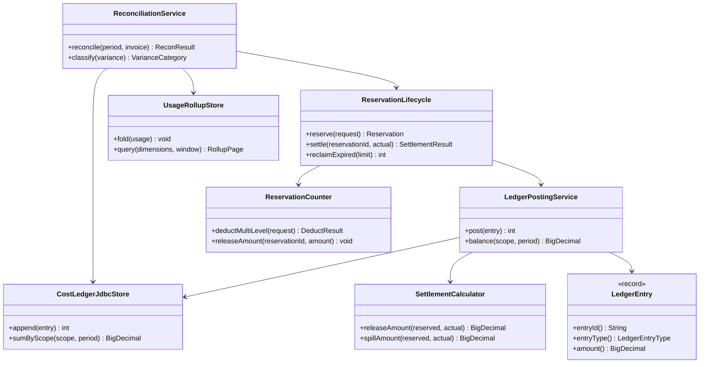
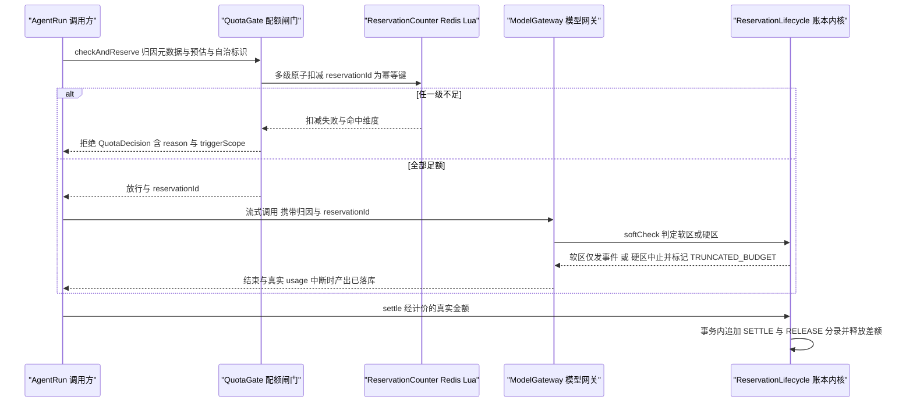
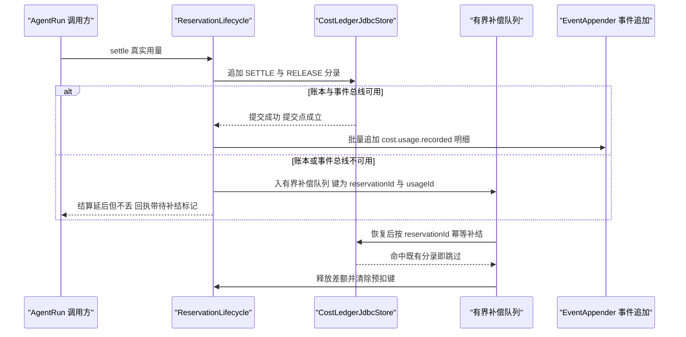
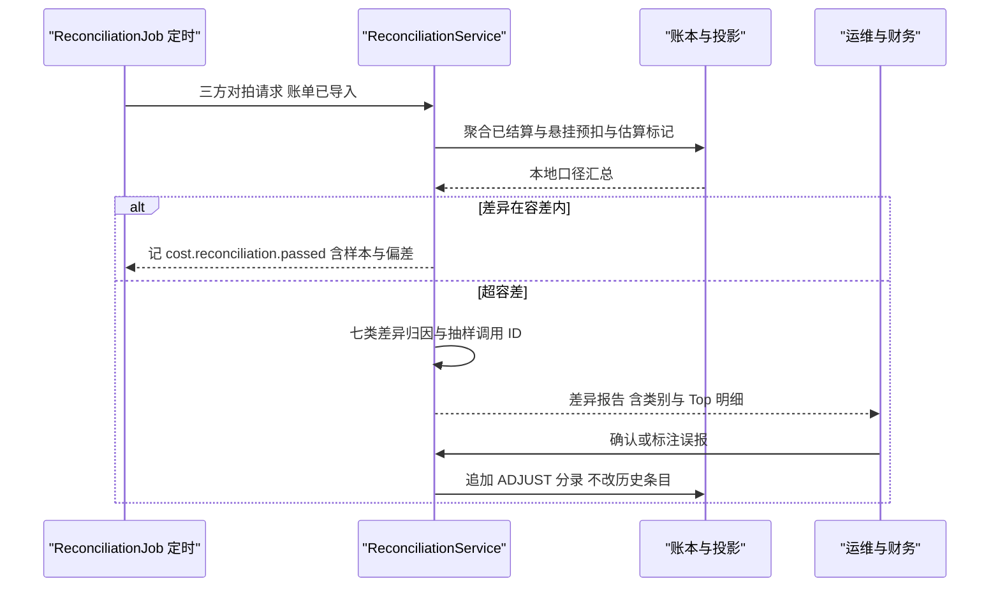
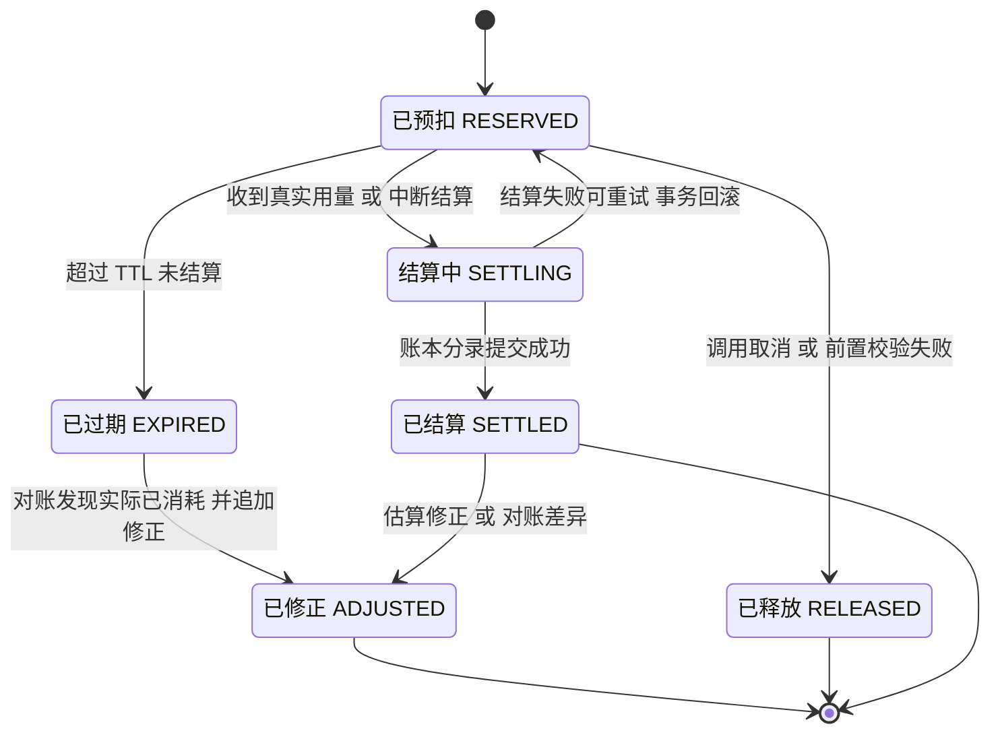

# C29 · CostLedger（计量与成本账本：预扣 / 结算 / 归因 / 对账）

> 组件编号 C29 ｜ 组件别名 CostLedger（计量与成本账本）｜ 归属域 配额与成本（COST）｜ 组件清单落点 `appendix-d-component-inventory.md` D.3 的 E-03（账务侧）与 E-04（归因侧）｜ 纪律：本组件方案不推翻系统级方案；凡与 `impl/26-quota-cost-impl.md`（下称 impl/26）或台账口径冲突之处，一律在「修订建议」登记，不回改上游文件。
> 上游系统方案：`impl/26` §1.5（模块落点）、§3（D-QC-1…9 与 I-COST-1…9）、§4（架构与单向数据流）、§5.1（关键契约签名）、§6.1/§6.4（预扣结算与对账时序）、§7.2（预扣条目状态机）、§8.1/§8.2/§8.3（表族 / Redis Key / 事件）、§9.3/§9.5/§9.6（配置项 / 错误矩阵 / 三段式执行点与归因 join 键）、§10（并发模型 / 降级矩阵 / 日志）、§11（测试与 DoD）。
> 上游契约：卷 31 `31-capacity-and-cost.md`（D-CAP-1…10）、`IMPL-DECISIONS.md`（I-COST-1…9）、采纳台账 L-045（预算钳制取小者）与 L-052（事件为唯一事实源）；编号口径（局部号段，须并入 `IMPL-DECISIONS.md` 后重编号）：`REQ-C-CL-01…12`、`I-C-CL-1…4`、`X-C29-1…3`（台账当前止于 X-82）。
> 实现落点：`harness-contract`（`contract/cost`）+ `harness-kernel/kernel-cost`（`cost/ledger` 子包）+ `harness-platform/platform-persistence`（`cost/`）+ `harness-platform/platform-runtime-store`（`cost/`）+ `harness-host/host-app`（对账与报表任务）；**不新增模块**。

---

## ① 定位与边界

### 1.1 本组件解决什么

1. **双式记账账本**：`RESERVE / SETTLE / RELEASE / ADJUST / GRANT / EXPIRE` 六类分录的追加式落库与余额计算（`scope × period` 维度）；账本是财务事实，应用层拒绝 `UPDATE/DELETE`。
2. **预扣生命周期**：`Reserved → Settling → Settled / Released / Expired / Adjusted` 全周期状态机；`reservationId` 为幂等键，TTL 到期由回收任务回收并告警。
3. **结算恰好一次与超支处置**：唯一约束 `(entry_type, reservation_id)` 保证结算分录至多一条；软区（预扣 × 增额系数）提示继续、硬区（任务 / 日配额）中止或转暂停，差额以 `RELEASE` 释放、溢出以估算偏差 `ADJUST` 吸收，**产出落库不丢**并标记 `TRUNCATED_BUDGET` / `SUSPENDED_BUDGET`。
4. **计量共源与可重建投影**：用量由事件 `cost.usage.recorded` 承载，`oc_usage_event` 是可重建投影（禁止第二写入口），小时滚动聚合 `oc_usage_rollup_hourly` 为看板与预测输入；调用前注入 `AttributionContext`（六维 + `requestSetId / taskId / sourceSessionId / businessStage`），六维任意组合可聚合、缓存折扣单列、账单可下钻到单次调用。
5. **三方对账与失败隔离**：本地账本 / 供应商账单 / 预算三方对拍，超容差触发七类差异归因与**追加式**修正分录（历史分录不可改）；账本与结算分录**零丢弃**（明细与估算可丢），Redis 故障不破坏账本，键与表首段带租户、跨租户读取被运行时阻断。

### 1.2 本组件不解决什么

- **不解决** provider usage 的抓取与五类 token 归一（impl/02 `UsageRecorder`，K-05；计量上报失败有意吞异常 + WARN，对齐 M19）。
- **不解决**四级配额判定链与预测式放宽（impl/26 `QuotaGate` / `PredictiveQuotaAdvisor`，I-COST-6）：只做「判定通过后的扣减与账务」。
- **不解决**工具结果预算与上下文预算（卷 05 D-TOOL-5、L-020/L-026）：只计量其节省额并纳入 ROI，两套阈值命名空间互不覆盖。
- **不解决**模型定价的采集与谈判、企业出账与发票（卷 02 §4.6 / 卷 24）：`PriceTableSPI` 只消费版本化定价事实。
- **不解决**超额审批的决策链与通道（impl/06）：只发起申请并消费封闭结果集。

### 1.3 上下游依赖

| 方向 | 依赖对象 | 接口 / 契约 | 失败语义 |
| --- | --- | --- | --- |
| 上游 | 模型网关（impl/02） | 调用前注入归因与 `reservationId`；usage 分列缓存读 / 写与推理 token | usage 缺失按估算入账并标记 `estimated=true`，账单到达后追加修正 |
| 上游 | 事件系统（impl/16） | `EventAppender.append(...)`；`(tenantId, seq)` 分区序 | 追加失败：账本与结算不丢弃（补偿队列），缺口进对账 |
| 上游 | 自治与团队 / 定价来源（impl/12/13/15、`PriceTableSPI`） | 固定回合预算折算为预估（L-045）；版本化定价（`priceVersion` + 生效窗口 + 峰谷 + 倍率） | 双约束冲突取更小者并发 `cost.budget.clamped`；缺定价版本返回 `UNSUPPORTED_CAPABILITY`（**禁止按 0 计价**） |
| 下游 | 权限与审批（impl/06） | 超额申请 → 封闭结果集（ALLOWED_ONCE / REJECTED / CANCELLED / UNAVAILABLE） | `UNAVAILABLE` fail-closed 拒绝；headless 下 ask 转拒绝 |
| 下游 | 运维与评测（impl/34/33） | 水位 / 熔断 / 对账差异指标；成本回归门禁 | 指标缺失不阻断账务，但阻断发布门禁 |

### 1.4 模块落点与命名

| 层带 | 模块 | 本组件关键类 | Spring |
| --- | --- | --- | --- |
| 契约 | `harness-contract`（`contract/cost`） | `LedgerEntry`、`LedgerEntryType`、`ReservationState`、`UsageRecord`、`AttributionContext` | 禁止 |
| 内核 | `harness-kernel/kernel-cost`（`cost/ledger`） | `ReservationLifecycle`（状态机）、`LedgerPostingService`（分录规则与平衡断言）、`SettlementCalculator`（结算与差额） | 禁止 |
| 平台 | `platform-persistence` / `platform-runtime-store`（`cost/`） | `CostLedgerJdbcStore`、`ReservationRepository`、`UsageRollupStore`、`ReconciliationRepository`、`ReservationCounter`（Lua） | 允许 |
| 外壳 | `host-app` | `ReconciliationJob`、`CostReportService`、`BudgetApprovalBridge` | 允许 |

**边界口径**：`CostLedger` ≡ impl/26 §1.5 `cost/` 账务类族（`CostLedgerJdbcStore` + `ReservationCounter` + `UsageRollupStore` + `ReconciliationRepository`）加上本文件细化的内核三件套；**不改动** impl/26 §5.1 已冻结的 `QuotaGate.checkAndReserve` / `softCheck` 语义与 `UsageRecord` / `AttributionContext` record 字段，只细化「预扣—结算—归因—对账」的内部职责。

---

## ② 功能需求清单（REQ-C-CL-01…12）

| REQ | 需求描述 | 来源 | 优先级 | 验收要点 |
| --- | --- | --- | --- | --- |
| REQ-C-CL-01 | 双式记账：六类分录追加式落库，应用层拒绝 `UPDATE/DELETE`，修正只以新分录表达 | impl/26 §8.1、REQ-COST-10、I-COST-1 | P0 | 借贷平衡断言通过；DB 与 ORM 双层拒绝改写；历史分录摘要比对不变 |
| REQ-C-CL-02 | 预扣原子多级扣减：`reservationId` 为 Lua 幂等键；组织→项目→团队→个人在同一脚本内完成，不部分扣减 | impl/26 §6.1、§9.6 准入段、I-COST-2 | P0 | 100 并发同作用域无超卖；脚本内不接受外部传入的 `tenantId` |
| REQ-C-CL-03 | 结算恰好一次：唯一约束 `(entry_type, reservation_id)`；重复 `settle` 被拒并 `log.warn`（附原因） | impl/26 §6.1 幂等点、§10.1 | P0 | 并发重复结算下借贷平衡；不产生第二条 `SETTLE` |
| REQ-C-CL-04 | 悬挂预扣回收：TTL 到期转 `Expired` + 余额回落 + `cost.reservation.expired` 告警；`Expired ≠ 未消耗` | impl/26 §7.2、REQ-COST-26 | P0 | TTL 回收用例通过；悬挂未清前不放宽 `reserve.ttlSeconds` |
| REQ-C-CL-05 | 流式中途超额双阈值：软区仅发 `cost.streaming.overrun`（不中断）；硬区中止或转暂停且产出落库 | impl/26 §6.1、REQ-COST-11、D-QC-3 | P0 | 硬区中止后账本恰一条结算；`run.truncated` 原因与通知帧一致 |
| REQ-C-CL-06 | 结算差额释放与溢出吸收：`release = max(0, reserved − actual)`；溢出以估算偏差 `ADJUST` 入账 | impl/26 §6.1、§10.5 对账收敛 | P0 | 差额恒以 `RELEASE` 表达（无悬挂余额）；溢出分支有修正分录与告警 |
| REQ-C-CL-07 | 账本可复算：金额按 `priceVersion` 复算一致；改价不改历史金额并发 `cost.price.changed` | impl/26 §8.1、REQ-COST-05、I-COST-4 | P0 | 改价后历史账单逐行一致；定价历史版本不删不改 |
| REQ-C-CL-08 | 账本不可丢 / 明细可丢：计量队列有界，满时按 `metering.dropPolicy` 只丢估算明细（`cost.usage.dropped`），分录零丢弃 | impl/26 §10.1 背压、§10.6 检查清单、REQ-COST-21 | P0 | 队列打满压测断言账本零丢行；丢弃动作可观测 |
| REQ-C-CL-09 | 六维归因与下钻：六维任意组合可聚合；缓存读 / 写分列；下钻到单次调用且缺维度显式计数 | impl/26 §9.6 join 键、REQ-COST-03/04 | P0 | 五切面（会话 / 项目 / 团队 / 模型 / 工具）合计相等；不静默归入父级 |
| REQ-C-CL-10 | 共源投影：`oc_usage_event` 可由事件流重建且逐条一致；小时聚合幂等键 `usageId`；无第二写入口 | impl/26 §4 单向数据流、REQ-COST-02、L-052 | P0 | 清空投影重建逐条对拍一致；静态扫描无第二写入口 |
| REQ-C-CL-11 | 三方对账与七类差异归因：超容差（默认 1%）触发分类 + 追加式修正分录；账单缺失不静默通过 | impl/26 §6.4、REQ-COST-22 | P1 | 注入五类差异分类准确；修正分录带原因与审批引用 |
| REQ-C-CL-12 | 预算钳制叠加：固定回合预算与配额取更小者并发 `cost.budget.clamped`（含双方额度与生效方） | REQ-COST-27、L-045 风险行 | P0 | 双约束冲突取小者生效；钳制事件可复现 |

本表是 impl/26 §②（`REQ-COST-n`）与 §6–§10 的**组件级细化视图**（`REQ-COST-n → REQ-C-CL-n` 多对多）；不新增系统级需求语义，冲突时以 impl/26 为准并登记修订建议。

---

## ③ 关键设计决策（I-C-CL-1…4）

| ID | 维度 | 选定分支 | 理由与代价 | 回退触发 |
| --- | --- | --- | --- | --- |
| I-C-CL-1 | 预扣正确性锚点 | **Redis Lua 原子多级扣减做准入 + PG 账本做事实 + 对账做收敛**（与 I-COST-2 同源）；「最终余额 = 初始 − Σ 实收」由账本断言而非 Redis 断言 | 判定低延迟且账本可复算；代价是最终一致窗口 | Redis 不可用 > 5min → PG 逐次扣减（并发超阈值则排队）；企业可切 `FAIL_CLOSED` |
| I-C-CL-2 | 账本与投影的写路径分工 | 结算分录**同步强一致**（提交点 = `settle` 成功）；明细经事件**批量异步**投影；**投影永不反向写账本**，修正以追加分录表达 | 账本可信、投影可重建；代价是投影滞后需可观测（≤ 5min） | 投影重建 > 10min/月 → 增量物化 + 位点校验（事实源不变） |
| I-C-CL-3 | 预扣条目的存储形态 | 单 `Hash` 键承载一次预扣的多级明细与状态（`oc:cost:rsv:{tenant}:{id}`），幂等与释放同键完成；计数按 `scope × period` 分列 | 单键原子、清理简单；代价是热点租户单键压力 | 单键 QPS 超阈值 → 计数桶按 `reservationId` 散列分片（默认 8 片，Lua 内顺序遍历） |
| I-C-CL-4 | 归因聚合的物化路径 | 事件消费者按 `usageId` 幂等**增量物化** `oc_usage_rollup_hourly`（小时 × 六维 × 单位）；查询不实时聚合明细；下钻不缓存 | 看板时延可控、明细可归档；代价是折叠口径需与明细对拍 | 折叠差异 > 0.1% → 由 `oc_usage_event` 重建窗口并告警（不双写） |

**汇总说明**：四条决策并入 `IMPL-DECISIONS.md` 后与 `I-COST-1/2/4` 建立引用关系（不覆盖原条目）；与 Phase A 卷 31 无冲突，均为 D-CAP-3/5/7 的实现级细化。

---

## ④ 类图



**说明**：`ReservationLifecycle`、`LedgerPostingService`、`SettlementCalculator` 为**内核零框架类**（可无容器单测，含假时钟与金额边界用例）；`CostLedgerJdbcStore` / `ReservationCounter` / `UsageRollupStore` 属平台层，经端口注入（缺失时装配内存实现供单机档与单测）。图中未列的 `ReservationRepository`（`findHanging` / `findExpired`）供回收与对账读取悬挂预扣，`CostCalculator`（计价与峰谷窗口解析）由 `ReservationLifecycle` 与对账共用。`LedgerEntryType`（`RESERVE / SETTLE / RELEASE / ADJUST / GRANT / EXPIRE`）与 `ReservationState`（见 §⑥）为契约枚举，`of(code)` 非法值抛 `HarnessException(ErrorCode.PARAM_INVALID, 中文文案)`。`UsageRollupStore` 只消费 `cost.usage.recorded`，与账本写入路径**不共享事务**（I-C-CL-2）。

```java
/**
 * 成本账本（内核契约，零框架依赖）。
 * 全部分录追加式写入，应用层禁止 UPDATE / DELETE；余额由分录求和得出，禁止维护可变余额字段。
 */
public interface CostLedger {

    /**
     * 追加一条账本分录。
     * @param entry 分录（类型、作用域、账期、金额、原因码与引用；金额必须为非负 BigDecimal）
     * @return 实际写入行数（0 表示幂等命中既有分录，调用方按「已结算」语义继续）
     * @throws HarnessException 作用域或账期非法时抛出 PARAM_INVALID（不可重试）
     */
    int post(LedgerEntry entry);

    /**
     * 计算某作用域在指定账期的余额（净支出口径：Σ SETTLE + Σ ADJUST − Σ RELEASE）。
     * @param scope  作用域（组织 / 项目 / 团队 / 个人，必填）
     * @param period 账期（日 / 月，必填；跨账期不合并）
     * @return 净支出金额（无分录时返回 ZERO，不返回 null）
     * @throws HarnessException 作用域不存在时抛出 NOT_FOUND
     */
    BigDecimal balance(CostScope scope, String period);
}
```

**结算幂等纪律**：`settle` 由外壳实现（`@Transactional(rollbackFor = Exception.class)`），唯一约束 `(entry_type, reservation_id)` 代替悲观锁；插入行数为 0 即重复结算，记 `log.warn("重复结算请求被拒绝，reservationId={}…")` 并返回既有结果，禁止静默吞掉后伪装首次结算；首次成功记 `log.info("调用结算完成，reservationId={}，实收={}，释放={}")`（占位符 + 中文文案，不打印 Prompt 正文 / 密钥 / Token）。

---

## ⑤ 核心流程时序图

### 5.1 流程 A：预扣 → 流式 → 结算（含中途超额）

**前置条件**：`AttributionContext` 完备（缺失即拒，REQ-COST-03）；目标模型定价版本已加载（缺失返回 `UNSUPPORTED_CAPABILITY`）；自治任务已把固定回合预算折算为预估（REQ-COST-27）。
**主路径**：调用前预扣 → 流式期间复检 → 结束取真实 usage → 结算并释放差额 → 与用量事件同事务提交。
**异常与补偿**：① Redis 不可用按 §⑩ 降级；② 硬区中止以**中断结算**入账（`estimated=true` + 已消耗），差额释放、产出落库；③ 真实 usage 缺失 → 全量估算入账并标记，账单到达后追加修正分录。
**幂等与并发点**：`reservationId` 唯一约束 + Lua 幂等键保证扣减与结算恰好一次；TTL 到期由 `reclaimExpired` 回收并告警；`softCheck` 对已结算预扣抛 `CONFLICT`（调用生命周期已被并发终结）。



### 5.2 流程 B：结算滞后与补偿补结（账本不可丢 / 明细可丢）

**前置条件**：账本表按月分区；补偿队列有界（默认 8192，配置化）；`reservationId` 与 `usageId` 已生成。
**主路径**：账本写入成功即提交点成立 → 明细事件批量异步（默认 100 条或 500ms）→ 释放 Redis 差额。
**异常与补偿**：PG / 事件总线不可用时进入有界补偿队列，**不产生半笔分录**；队列满则拒绝**新自治任务**并保留人工会话（对齐 impl/26 §10.5）；恢复后按 `reservationId` 幂等补结。
**幂等与并发点**：补偿条目以 `(reservationId, usageId)` 去重；重复补结命中唯一约束即跳过；明细按 `DROP_ESTIMATED` 丢弃时账本已有分录，缺口由对账发现（不静默）。



### 5.3 流程 C：三方对账与追加修正分录

**前置条件**：账期与计费口径对齐（峰谷时区、税费与汇率、模型别名映射）；账单文件不含密钥，凭据只走环境变量。
**主路径**：三方对拍 → 七类归因（§⑧.2）→ 追加 `ADJUST` 分录 + `cost.reconciliation.variance` → 财务确认 → `cost.reconciliation.confirmed`。
**异常与补偿**：账单缺失或格式变化 → 保留上次基线 + 告警并置 `PENDING`（**禁止**跳过对账静默通过）；修正分录必须携带原因码与审批引用。
**幂等与并发点**：同账期以 `(period, invoiceRef)` 幂等；任务由 Redisson 租约互斥（`RedisKeys.costJobLock`）；重复确认不产生第二条修正分录。



---

## ⑥ 状态机：预扣条目生命周期



**不变量**：① 预扣与结算之差**必须**以 `RELEASE` 分录释放（禁止悬挂余额）；② `EXPIRED` 不代表「未消耗」，由对账转 `ADJUSTED`；③ `SETTLED / RELEASED / EXPIRED / ADJUSTED` 不可回退（追加式账本只允许新分录）；④ 同一 `reservationId` 任一时刻只处于一个状态（唯一约束 + 条件更新行数校验）；⑤ 全部迁移经条件更新（`state` 期望值），行数 ≠ 1 即按并发处理并放弃本地动作；⑥ `SETTLING` 由账本写入事务开始进入、提交即 `SETTLED`，事务超时转回 `RESERVED` 并告警（X-C29-2）。

---

## ⑦ 接口与依赖矩阵

### 7.1 对外接口

| 面 | 方法 / 端点 | 关键入参 | 出参 | 错误码 |
| --- | --- | --- | --- | --- |
| 内核契约 | `CostLedger.post(entry)` / `balance(scope, period)`；`ReservationLifecycle.settle(id, actual)` / `release(id, reason)` | 分录；作用域与账期；预扣 ID 与真实金额 | 写入行数；净支出金额；`SettlementResult` | `PARAM_INVALID`、`NOT_FOUND`、`CONFLICT` |
| 会话 JSON-RPC | `cost.status` / `cost.usage.query` | `scopeType?`、`filters`、`cursor` | 水位与明细页（含 `estimated` 与 `priceVersion`） | `INVALID_ARGUMENT`、`PERMISSION_DENIED` |
| 管理 REST | `GET /api/v1/cost/usage`、`GET /reports/drilldown/{callId}`、`GET/POST /reconciliation` | 六维过滤器；调用 ID；`period` 与 `invoiceRef` | 用量页；单次调用下钻；对账报告与修正分录引用 | `PERMISSION_DENIED`（`cost.read` / `cost.reconcile`） |
| 管理 REST | `POST /api/v1/cost/reports/invoice-export` | `period`、作用域、`Idempotency-Key` | 导出任务 ID（异步） | `CONFLICT`（重复幂等键返回既有任务） |

### 7.2 依赖与被依赖矩阵

| 关系 | 组件 / 端口 | 契约要点 | 失效影响 |
| --- | --- | --- | --- |
| 依赖 | `ReservationCounter`（Redis Lua） | 多级扣减原子、幂等键 `reservationId`、TTL 与计数键对齐周期 | 不可用 → 准入降级（PG 逐次扣减 / `FAIL_CLOSED`）；账本不受影响 |
| 依赖 | `CostLedgerJdbcStore`（PG） | 追加式、`uk(entry_type, reservation_id)`、按 `scope × period` 汇总 | 不可用 → 补偿队列；队列满拒新自治任务 |
| 依赖 | `EventAppender`（impl/16）/ `PriceTableSPI` | `cost.usage.recorded` 批量追加；版本化定价与生效窗口 | 明细可丢（估算），账本不丢；缺定价版本 → `UNSUPPORTED_CAPABILITY` + 待定价队列 |
| 被依赖 | `QuotaGate`（impl/26） | 判定通过后的扣减与账务 | 账务不可用 → 判定侧按 `reserve.unavailableAction` 降级 |
| 被依赖 | 报表 / 门禁 / 出账（impl/33/34/24） | 看板、成本回归门禁、`BillingSinkSPI` 账单包 | 只影响报表新鲜度，不反向阻塞结算 |

### 7.3 配置项（`open-coding.cost.*` 子集）

| 配置键 | 含义 | 默认 | 环境变量 |
| --- | --- | --- | --- |
| `currency` | 记账币种（必填，影响全部金额与对账口径） | `USD` | `COST_CURRENCY` |
| `reserve.ttlSeconds` | 预扣 TTL（禁小于最大单轮时长，启动期校验） | `900` | `COST_RESERVE_TTL_SECONDS` |
| `reserve.unavailableAction` | 预扣存储不可用动作（`LOCAL_FALLBACK` / `FAIL_CLOSED`） | `LOCAL_FALLBACK` | `COST_RESERVE_UNAVAILABLE_ACTION` |
| `overrun.hardAction` | 硬上限动作（`ABORT_STREAM` / `SUSPEND_FOR_APPROVAL`） | `ABORT_STREAM` | `COST_OVERRUN_HARD_ACTION` |
| `metering.dropPolicy` | 队列满策略（只影响估算明细） | `DROP_ESTIMATED` | `COST_METERING_DROP_POLICY` |
| `recon.cron` / `recon.toleranceRatio` / `recon.sampleRate` | 对账周期 / 容差 / 抽样率 | 每月 2 日 03:30 / `0.01` / `0.02` | `COST_RECON_CRON`、`COST_RECON_TOLERANCE_RATIO`、`COST_RECON_SAMPLE_RATE` |

全部键以 `${ENV_VAR:default}` 声明并同步 `.env.example`；配置类为纯数据类（不加 `@Component`），字段 JavaDoc 标明用途、默认值与影响范围。

| 数据 | 表 / Key / 事件 | 说明 |
| --- | --- | --- |
| 表 | `oc_cost_ledger_entry`（追加式，月分区）、`oc_reservation`（状态 + TTL） | 本组件是唯一写入者；状态以枚举 code 存储 |
| 表 | `oc_usage_event`（可重建投影）、`oc_usage_rollup_hourly`（小时聚合）、`oc_reconciliation` | 投影由事件消费者写入，**禁止反向写账本** |
| Redis / 事件 | `RedisKeys.costReserve / costSpend / costReservation / costGrant`；`cost.usage.recorded`、`cost.reservation.*`、`cost.reconciliation.*`、`cost.budget.clamped` | Key 首段恒为 `tenantId`；事件只含金额、单位、枚举 code 与对象引用，禁止 Prompt 正文与身份信息 |

---

## ⑧ 关键算法

### 8.1 算法 A：预扣—结算两阶段与超支处理

**阶段一（调用前，Redis 原子脚本）**：① 读 `scope × period` 多级计数桶 → ② 逐级比较 `已用 + 预估 ≤ 上限`（含预测式放宽上限与临时 grant 额度）→ ③ 任一级不足即整单失败并返回命中维度（**不部分扣减**）→ ④ 全部足额则逐级加 `预估` 并写 `oc:cost:rsv:{tenant}:{id}` Hash（幂等键 `reservationId`）→ ⑤ 返回 `reservationId` 与各级扣减明细。
**阶段二（调用后，单事务）**：⑥ 真实用量经 `CostCalculator` 计价得 `actual` → ⑦ 计算结算与释放金额 → ⑧ 同事务追加 `SETTLE` + `RELEASE` 分录并产出 `cost.usage.recorded` → ⑨ 释放 Redis 差额并清除预扣键。

```
reserved = reserveAmount(request)                      // 阶段一冻结的预估金额
actual   = costCalculator.calculate(usage, price, at)  // 阶段二真实计价（priceVersion 随分录落库）
settle = actual ; release = max(0, reserved − actual) ; spill = max(0, actual − reserved)
if spill > 0: post(ADJUST, spill, reason = ESTIMATE_GAP)   // 溢出必须显式入账并告警
assert Σ(SETTLE) + Σ(ADJUST) − Σ(RELEASE) == 期末净支出     // 借贷平衡断言
```

**超支双阈值**：`softLimit = reserved × (1 + reserve.slackRatio)`（默认 1.2）；`hardLimit = min(任务配额, 日配额)`。软区只发 `cost.streaming.overrun`（`threshold=SOFT`）不中断；硬区按 `overrun.hardAction` 执行 `ABORT_STREAM` 或 `SUSPEND_FOR_APPROVAL`，**产物先落库再终止**并标记 `TRUNCATED_BUDGET` / `SUSPENDED_BUDGET`；中止结算以 `estimated=true` + 已消耗入账。

```java
/**
 * 流式期间的超限判定（纯函数，假时钟与边界值可测）。
 * @param reserved  已冻结的预扣金额（必填，非负）
 * @param estimate  当前累计估算金额（必填，非负）
 * @param hardLimit 任务与日配额中的较小者（必填，非负）
 * @return 判定结果（NORMAL / SOFT_OVERRUN / HARD_OVERRUN 与应执行动作）
 */
public OverrunVerdict verdict(BigDecimal reserved, BigDecimal estimate, BigDecimal hardLimit) {
    // 硬区优先：越到硬上限时不再看软区，直接按配置动作中止或转暂停（产出必须先落库）
    if (estimate.compareTo(hardLimit) >= 0) {
        return OverrunVerdict.hard(actionProperties.hardAction());
    }
    // 软区只提示不中断：避免长回答体验抖动，同时把超额趋势写成可观测事件
    BigDecimal softLimit = reserved.multiply(BigDecimal.ONE.add(properties.slackRatio()));
    return estimate.compareTo(softLimit) >= 0 ? OverrunVerdict.soft(estimate) : OverrunVerdict.normal();
}
```

**复杂度**：Lua 脚本 O(级数)（固定 ≤ 4）；结算 O(1) 次分录写入 + O(1) 次 Redis 释放。**边界条件**：① 任何路径下 `release ≥ 0` 且 `settle + spill = actual`；② 预扣键已被 TTL 回收 → 转 `ADJUST` 路径并打对账标记，**不拒绝**结算；③ 中断结算也必须走 `settle`（禁止直接清预扣键）。

### 8.2 算法 B：归因维度聚合与差异对账

**聚合**：`fold(usage)` 以 `usageId` 幂等，按主键 `(bucket_hour, tenant_id, project_id, user_id, model_id, tool_name, unit)` 累加 `quantity_sum / cost_sum / call_count` 并刷新 `estimated_ratio`（估算条数占比）；同一明细的**五切面**（会话 / 项目 / 团队 / 模型 / 工具）合计必须相等，差额 > 0.1% 判为折叠缺陷并触发窗口重建（不双写）。

**差异计算**：`variance = localAmount − invoiceAmount`；`varianceRatio = |variance| / max(invoiceAmount, 最小货币单位)`；超 `recon.toleranceRatio`（默认 1%）触发分类。

**七类归因判定树（顺序短路，命中即停）**：

```
1 未结算预扣：存在 Expired 且窗口内有消耗的 reservationId        → 补 SETTLE 并清悬挂
2 重复计数：同 originCallId 有多条 SETTLE 且 usageId 不同         → 追加 RELEASE 冲正
3 缓存计价差：cache_read / cache_write 单价或命中率不一致         → ADJUST（附 priceVersion 对拍）
4 峰谷窗口偏差：计价时区或节假日窗口不一致                        → ADJUST（附窗口口径）
5 模型别名映射：本地 modelId 与账单别名未映射                     → ADJUST 并更新映射表
6 汇率与税：币种换算或税费口径差异                                → ADJUST（记换算率引用）
7 估算未修正：estimated=true 且账单已有真实值                     → ADJUST 至真实值
```

**修正分录规则**：`ADJUST` 必须携带 `reason_code`（七类之一）、`ref_entry_id`（被修正分录，可空）与 `operator_ref`；**禁止**修改历史分录；同账期重复对账以 `(period, invoiceRef)` 幂等，重复确认不产生第二条修正分录。

---

## ⑨ 错误处理与降级

| 场景 | ErrorCode | 可重试 | 对外文案要点 | 处置 |
| --- | --- | --- | --- | --- |
| 四级配额任一级不足 | `QUOTA_EXCEEDED` | 否 | 「额度不足（命中维度：团队），请联系管理员或等待重置」 | 拒绝准入 + 记录命中维度与剩余额（`cost.quota.exceeded`） |
| 预扣存储不可用 | `DEPENDENCY_UNAVAILABLE` | 是 | 「计费服务暂不可用」 | 默认 `LOCAL_FALLBACK`（宽松放行 + WARN + 对账补偿）；配 `FAIL_CLOSED` 时拒绝并给替代动作 |
| PG / 事件总线不可用 | `DEPENDENCY_UNAVAILABLE` | 是 | 「结算暂不可用」 | 有界补偿队列；满则拒新自治任务、保留人工 |
| 重复结算 / 悬挂预扣超 TTL | `CONFLICT`（非错误语义）/ 任务侧 | 否 | 「该预扣已结算」 | 重复结算返回既有结果并 `log.warn`；悬挂由 `reclaimExpired` 回收 + `cost.reservation.expired` 告警（未清前不放宽 TTL） |
| 流式触达硬上限 | `BUDGET_EXCEEDED`（`TRUNCATED_BUDGET`） | 否 | 「已达任务预算上限，输出已中止并落库」 | `cost.overrun` HARD 帧 + 产出落库（无静默截断） |
| 模型无定价版本 | `UNSUPPORTED_CAPABILITY` | 否 | 「该模型尚未定价，暂不可用」 | 进待定价队列 + 告警（禁止按 0 计价） |
| 对账超容差 | 非错误（任务侧） | — | — | 七类归因 + 追加修正分录 + `cost.reconciliation.variance` |
| 跨租户查询成本明细 | `CROSS_TENANT_DENIED` | 否 | 「无权访问该数据」 | 安全审计 + SEV2 告警（对齐 impl/16 §10.6） |

**降级阶梯**（由轻到重，任一级写事件并告警）：① Redis 计数降级 → PG 逐次扣减（并发超阈值排队）；② 事件总线降级 → 结算照常、明细转本地缓冲（明细可丢）；③ 账本降级 → **禁止无账本消耗**：新自治任务被拒、人工会话按配置处理；④ 对账降级 → 保留上次基线并置 `PENDING`，**不得跳过对账静默通过**。

**硬规则（账本不可丢 / 明细可丢）**：任何路径都不得丢弃 `RESERVE` 与 `SETTLE / RELEASE` 分录；队列满只允许丢 `estimated=true` 的明细并记 `cost.usage.dropped`；「闸门 fail-closed / 计量 fail-open」对偶与 impl/26 §10.5 完全一致，**不得在组件内翻转**。

**修订建议登记（须并入 `IMPL-DECISIONS.md` §4）**

| 编号（待并号） | 冲突 / 缺口 | 证据 | 建议修订 |
| --- | --- | --- | --- |
| `X-C29-1` | 写入延迟预算口径未拆分：impl/26 §10.2 只有「结算落库（含分录与事件）P95 ≤ 50ms」，无单条分录预算 | impl/26 §10.2、impl/01 事件追加 ≤ 10ms P95 | 增行「单条账本分录追加 P95 ≤ 10ms（不含事件批量与 Redis 释放）；端到端结算 ≤ 50ms 不变」，指标补 `oc_cost_ledger_append_ms` |
| `X-C29-2` | `SETTLING` 缺进入 / 退出条件与超时回收：`oc_reservation.state` 已含该值，impl/26 §7.2 未定义 | impl/26 §7.2、§8.1 | 明确 `SETTLING` 由账本写入事务开始进入、提交即 `SETTLED`；新增 `reserve.settleTimeoutSeconds`，超时由回收任务转回 `RESERVED` 并告警 |
| `X-C29-3` | 溢出（`actual > reserved`）账务口径未定义：impl/26 §6.1 只述「差额释放」，未述溢出入账 | impl/26 §6.1、本文件 §⑧.1 | 补一句「`actual > reserved` 时全额记 `SETTLE`，溢出以 `ADJUST(reason=ESTIMATE_GAP)` 入账并告警」，并纳入 §⑪.1 单测清单 |

---

## ⑩ 性能与并发

| 指标 | 预算 | 测量点 |
| --- | --- | --- |
| 单条账本分录追加 | P95 ≤ 10ms | `oc_cost_ledger_append_ms`（X-C29-1） |
| 预扣判定 / 结算端到端 | P99 ≤ 15ms / P95 ≤ 50ms | `oc_cost_reserve_latency_ms` / `oc_cost_settle_lag_ms`（含分录 + 事件批量 + Redis 释放） |
| 小时聚合滞后 / 明细下钻 / 月账期对账 | ≤ 5min / ≤ 300ms / ≤ 10min P95 | 消费者滞后告警面 / 报表基准 / `ReconciliationJob` 打点 |

**热路径无锁化策略**：① **无应用层锁**——预扣在 Redis 单脚本内完成（Redis 单线程即串行），结算用唯一约束 `(entry_type, reservation_id)` 代替悲观锁，插入行数为 0 即重复，不做锁等待；② **追加式无 UPDATE**——账本只 INSERT，行锁竞争随月分区分散，修正以新分录表达；③ **状态迁移用条件更新**——`oc_reservation` 以 `state` 期望值条件更新（`updated != 1` 即按并发处理），不引入 `SELECT ... FOR UPDATE`；④ **聚合原子 upsert**——`oc_usage_rollup_hourly` 按主键 `INSERT ... ON CONFLICT DO UPDATE` 累加，消费者按分区单线程；⑤ **热点分片**——单租户计数键压力超阈值时按 `reservationId` 散列分片（默认 8 片，Lua 内顺序遍历），分片数配置化；⑥ **投影不回写**——消费者只写投影与聚合表，绝不触碰账本，避免与结算争用同一行。

**并发正确性要点**

| 路径 | 风险 | 控制 |
| --- | --- | --- |
| 并发结算 | 双 `SETTLE` | 唯一约束 + 插入行数校验；重复返回既有结果 |
| 并发预扣 | 超卖 | Lua 单脚本多级扣减 + `reservationId` 幂等键 |
| 回收 vs 结算 | 已结算被误回收 | 条件更新（期望 `RESERVED`），行数 ≠ 1 即放弃 |
| 补结 vs 在线结算 / 对账 vs 在线写入 | 双分录；差异范围漂移 | `(reservationId, usageId)` 去重 + 唯一约束兜底；对账只取已封账期，边界内差异按 §⑧.2 分类 |

---

## ⑪ 测试要点

**单元测试（`harness-kernel/kernel-cost`，假时钟、无 IO）**：`SettlementCalculatorTest`（`reserved > actual` 释放差额、`actual > reserved` 溢出为 0 且 `spill = actual − reserved`、零值与边界值、`BigDecimal` 精度与舍入）；`ReservationLifecycleTest`（状态机全迁移 + 全部非法迁移、TTL 回收、重复释放、已结算 `softCheck` 抛 `CONFLICT`）；`OverrunPolicyTest`（软区 / 硬区 / 正常三分支、硬区动作与 `TRUNCATED_BUDGET` 标记、`hardLimit` 取小者）；`ReconciliationClassifierTest`（七类差异各自识别、容差边界、别名映射与峰谷窗口对拍）；`LedgerPostingServiceTest`（借贷平衡断言、追加式拒绝改写、`balance` 空账期返回 ZERO）。

**集成测试（Testcontainers：PG + Redis；假模型可编程返回 usage）**：① 共源与投影——清空 `oc_usage_event` 后由事件流重建并逐条对拍一致；② 预扣 → 结算全链路（正常释放差额 / 中断结算 / 取消释放 / TTL 回收 + `cost.reservation.expired`）；③ 并发与幂等——100 并发同作用域预扣无超卖（最终余额 = 初始 − Σ 实收）、重复 `settle` 被拒、重复投递事件不产生双份账；④ 溢出路径——估算低于真实值 → `ADJUST(ESTIMATE_GAP)` 且历史分录未改；⑤ 对账——注入五类差异分类准确 + 追加修正分录 + 摘要比对不变；⑥ 多租户泄漏（DoD 硬项）——A 租户上下文直查 B 租户账本 / 预算 → 拒绝 + SEV2，构造缺租户段键读取 → 二次校验拒绝，跨分区事件 → 毒信。

**故障注入**：Redis 宕机 30 分钟（`LOCAL_FALLBACK` 回合可继续、账本正常、恢复后对账收敛；`FAIL_CLOSED` 明确拒绝）；PG 主库切换 / 结算过程 kill（无半笔分录、重启后按 `reservationId` 幂等补结）；事件追加失败（回合成率不受影响、缺口在健康面可见、不先补假数据）；定价表清空（模型进待定价队列并返回 `UNSUPPORTED_CAPABILITY`，不按 0 计价）；计量队列打满（只丢 `estimated` 明细、账本零丢行断言）。

**性能与门禁**

```bash
# 门禁映射（卷 27 §4.6）：单测 → 单元测试 + 覆盖率门；集成 → 集成测试；注入矩阵 → 集成测试 + 契约测试
mvn -pl harness-kernel/kernel-cost -am test                    # 内核计价 / 判定 / 结算差额（无 IO）
mvn -pl harness-platform/platform-persistence -am test         # 账本 / 预扣 / 投影 / 对账（PG + Redis 容器）
./scripts/ci/cost-gate.sh                                      # 共源对拍 + 预扣幂等 + 结算平衡 + 零丢行断言
scripts/ci/tenant-isolation-scan.sh --surface cost             # 多租户隔离矩阵逐行对抗用例
oc doctor --deep --format json --layers cost                   # COST 探针层冒烟（预扣延迟 / 悬挂数 / 定价新鲜度）
```

**DoD（impl/26 §11.6 的组件内切片）**：双式记账六类分录与平衡断言全绿 ｜ 预扣 / 结算 / 释放 / TTL 回收四路径用例通过 ｜ 结算恰好一次与重复结算拒绝有并发用例 ｜ 溢出与硬区中止均产出修正分录或标记且产出可查 ｜ 账本零丢行与 `DROP_ESTIMATED` 断言通过 ｜ 五切面聚合合计相等 ｜ 租户隔离矩阵本域各组失败（通过即阻断发布） ｜ 阈值全部入 `CostProperties` 并同步 `.env.example` ｜ 内核零框架依赖（Enforcer R1）通过。
