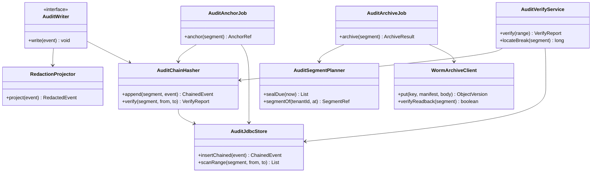
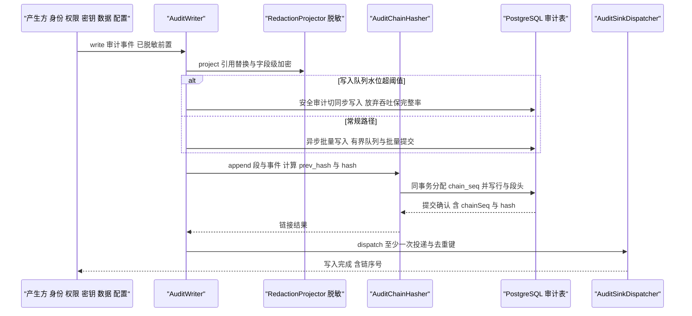
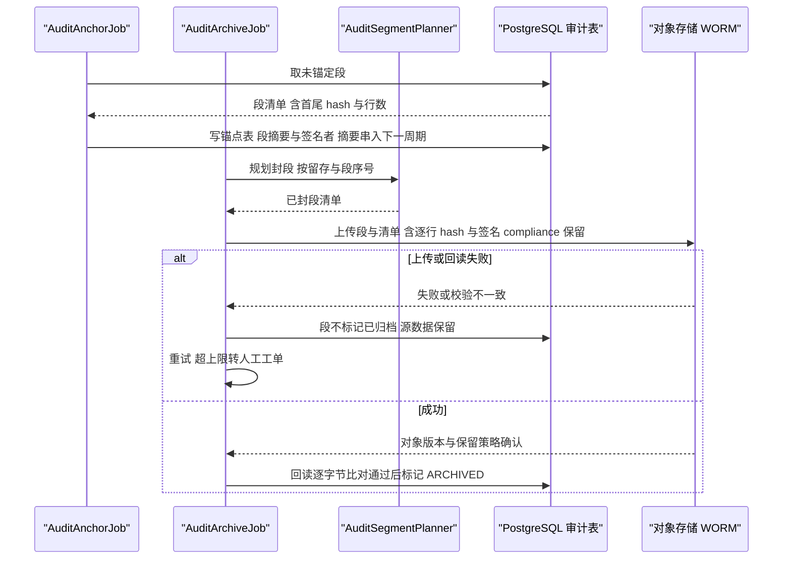
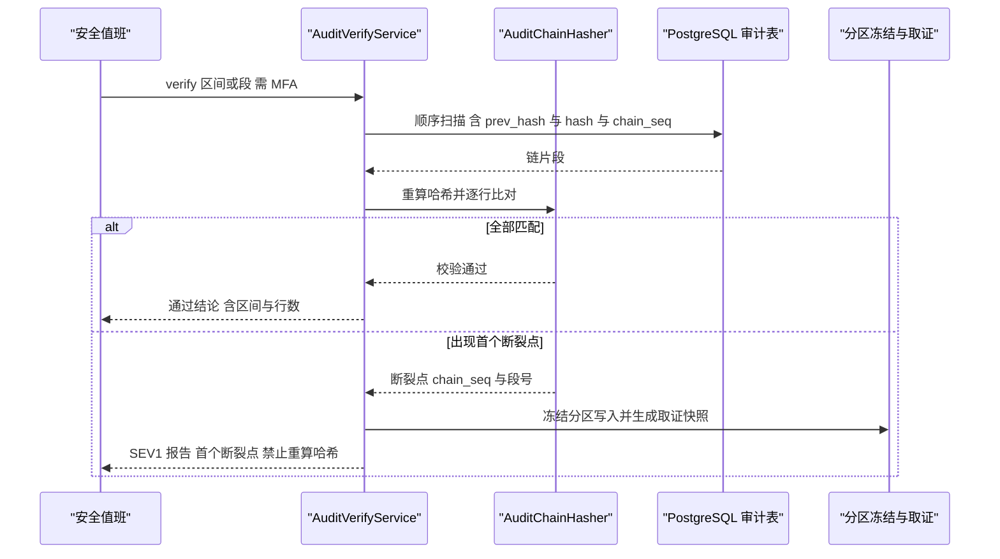
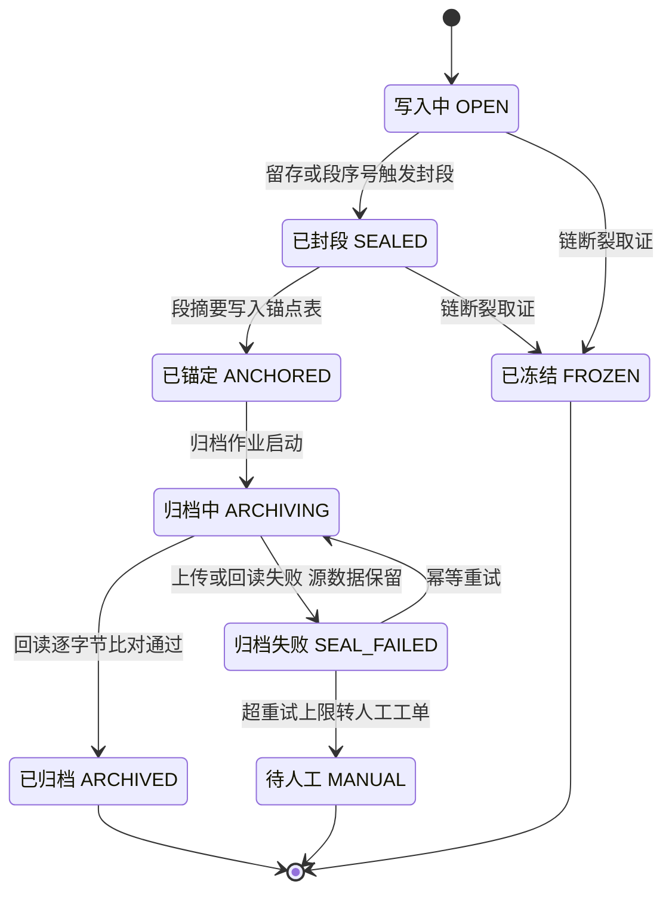

# C30 · AuditTrail（审计链：三级审计 + 哈希链 + WORM 归档 + 篡改证据）

> 组件编号 C30 ｜ 组件别名 AuditTrail（审计链）｜ 归属域 企业 IAM 与审计（ENT）｜ 组件清单落点 `appendix-d-component-inventory.md` D.3 的 E-05（AuditChain + AuditAnchor），协作面 P-09（EventExportSink）与 X-12（SIEM / 数据湖）｜ 纪律：本组件方案不推翻系统级方案；凡与 `impl/25-enterprise-iam-audit-impl.md`（下称 impl/25）或台账口径冲突之处，一律在「修订建议」登记，不回改上游文件。
> 上游系统方案：`impl/25` §1.5（模块落点）、§2（REQ-ENT-21…24）、§3.3/§3.6（I-ENT-3 / I-ENT-6 比选）、§6.3（写入—锚定—归档时序）、§7.1（删除模型与 crypto-shredding）、§8.3（审计表族）、§8.6（对象存储前缀）、§8.7（事件与指标）、§9.1/§9.3（端点和配置）、§10.1/§10.2/§10.5（fail-closed、性能预算、防篡改证明）、§10.7.1（RB-ENT-03/04）。
> 上游契约：卷 24 `24-enterprise-operations.md`（D-ENT-4 / D-ENT-8）、`IMPL-DECISIONS.md`（I-ENT-3/6）、`impl/19`（删除证明与备份 tombstone 重放）；权威哈希公式与不可篡改边界以 impl/25 §10.5 为准。
> 编号口径（本文件局部号段，须并入 `IMPL-DECISIONS.md` 后重编号）：`REQ-C-AT-01…12`、`I-C-AT-1…4`、`X-C30-1…3`（台账当前止于 X-82）。
> 实现落点：`harness-contract`（`contract/ent`）+ `harness-kernel/kernel-governance`（`audit/` 子包）+ `harness-platform/platform-audit` + `harness-host/host-enterprise`（`job/` 与 `api/`）；**不新增模块**（`platform-audit` 与 `kernel-governance` 为 R07 登记的扩展模块）。

---

## ① 定位与边界

### 1.1 本组件解决什么

1. **三级审计写入**：安全 / 业务 / 使用三类事件统一入口 `AuditWriter`，类别决定留存（3 年 / 1 年 / 90 天），租户可覆盖但不得低于合规下限（低于下限启动失败）。
2. **写入即链接**：每租户单链，`prev_hash` 顺序链 + `chain_seq` 严格递增无空洞（唯一约束 + 段头条件更新），链在写路径内完成，不存在「先落库后补链」的窗口。
3. **周期性锚定**：默认每 60 分钟对未锚定段计算段摘要写入锚点表，锚点摘要串入下一周期（锚点链），把「绕过应用直改库」的攻击窗口压缩到锚定间隔（上界 60 分钟）。
4. **WORM 归档**：按段导出 JSONL.zst + 清单（逐行 hash + 段摘要 + 签名）→ 对象存储合规保留 → **回读逐字节比对通过才算归档成功**；失败不删源数据、段不标记已归档。
5. **篡改验证与取证**：`verify`（区间 / 段）输出首个断裂点的 `chain_seq`；链断裂即 SEV1，冻结该分区写入并取证，**禁止重算哈希或删除异常行**。
6. **脱敏导出、出海与删除相容**：导出前逐项预览并按规则替换敏感字段（异步 + 幂等 + 权限点 + MFA），`AuditSinkSPI` 至少一次投递 + 去重键送 SIEM / 数据湖且故障不影响本地链；审计只存主体引用（`subject_ref` 哈希 + `credential_ref`）与字段级 DEK 密文，合规删除只销毁 DEK 与登记备份 tombstone，**密文与链保持完整**（crypto-shredding）。

### 1.2 本组件不解决什么

- **不解决**事件总线本体与分区序（impl/16 `EventLogStore` / `SchemaRegistry`）：审计走独立表族，不占用事件分区。
- **不解决**运行日志、指标与探针（impl/34）：本组件只产审计事实，运行面由 34 装配。
- **不解决**密钥的生成、派生与销毁实现（impl/27 `SecretPort`）：只登记 `credential_ref` 与删除穿透点，明文永不落库、落日志、落导出包。
- **不解决** DLP 规则求值与三层阻断（同卷 E-06，impl/25 §6.4）：只消费其阻断记录并写入审计。
- **不解决**主体与身份的 CRUD、离职吊销扇出（E-01/E-02，impl/25 §6.1/§6.2）：只记录生命周期动作结果。

### 1.3 上下游依赖

| 方向 | 依赖对象 | 接口 / 契约 | 失败语义 |
| --- | --- | --- | --- |
| 上游 | 身份 / 权限 / 密钥 / 数据 / 配置产生方 | `AuditWriter.write(AuditEvent)`（写入前已由产生方完成脱敏前置） | 安全类来源写入失败 → fail-closed：该管理操作拒绝，不产生无审计副作用 |
| 上游 | 租户上下文（impl/25 §5.1） | `TenantContext`（入口 / 事件消费 / 定时任务三处装配） | 缺失即 `TENANT_CONTEXT_MISSING`，拒绝写入（不静默落成空租户） |
| 上游 | 密钥服务（impl/27 `SecretPort`） | 主体 / 租户维度 DEK 派生与销毁 | 派生失败 → 拒绝落库（禁止明文降级）；销毁失败 → 删除证明不成立并告警 |
| 上游 | 事件 Schema Registry（impl/16） | `ent.audit.*` 事件 code 只增不改（L-052） | 未登记事件禁止写入（启动期差集门禁） |
| 下游 | 对象存储（X-03，合规保留） | `put` / `readback`，compliance 模式保留策略自检 | 不可用 / 保留策略可删 → 段保留源数据 + 拒绝启动或重试 + 告警 |
| 下游 | SIEM / 数据湖（X-12，经 P-09） | `AuditSinkSPI.dispatch`（至少一次 + 去重键） | 投递失败重试，**不阻塞链写入**；重复由去重键吸收 |
| 下游 | 合规证据与诊断（impl/25 §8.3/§8.6） | 锚点与归档记录作为「审计链锚定」类证据来源 | 证据引用缺失即缺口告警（`oc_compliance_gap_total`） |

### 1.4 模块落点与命名

| 层带 | 模块 | 本组件关键类 | Spring |
| --- | --- | --- | --- |
| 契约 | `harness-contract`（`contract/ent`） | `AuditEvent`、`AuditCategoryEnum`、`AuditOutcomeEnum`、`AuditSinkSPI`、`AuditSegments` | 禁止 |
| 内核 | `harness-kernel/kernel-governance`（`audit/`） | `AuditChainHasher`（链式哈希与校验）、`AuditSegmentPlanner`（封段与留存）、`RedactionProjector`（脱敏投影与引用替换） | 禁止 |
| 平台 | `platform-audit` | `AuditJdbcStore`、`WormArchiveClient`、`AuditExportStore`、`TenantScopedObjectStore` | 允许 |
| 外壳 | `host-enterprise`（`job/` + `api/`） | `AuditAnchorJob`、`AuditArchiveJob`、`AuditVerifyService`、`AuditAdminController` | 允许 |

**边界口径**：`AuditTrail` ≡ impl/25 §1.5 的 `kernel-governance/audit`（`AuditChainHasher` + `AuditSegmentPlanner`）+ `platform-audit`（落库 / WORM / 出海）+ `host-enterprise` 的锚定 / 归档作业与审计管理面；**不改动** impl/25 §8.3 表族字段、§10.5 哈希公式与 `AuditSinkSPI` 契约，只细化「写入—锚定—归档—验证」的内部职责与状态。

---

## ② 功能需求清单（REQ-C-AT-01…12）

| REQ | 需求描述 | 来源 | 优先级 | 验收要点 |
| --- | --- | --- | --- | --- |
| REQ-C-AT-01 | 三级审计落地：安全 3 年 / 业务 1 年 / 使用 90 天；租户可覆盖但不得低于合规下限 | impl/25 §2 REQ-ENT-21、§9.3；卷 24 D-ENT-4 | P0 | 三类各有写入与查询用例；低于下限启动失败 |
| REQ-C-AT-02 | 写入即链接：每租户单链、`prev_hash` 顺序链、`chain_seq` 严格递增无空洞 | impl/25 §10.5、REQ-ENT-22 | P0 | 篡改单行 → `verify` 定位首个断裂点；seq 无空洞断言 |
| REQ-C-AT-03 | 周期锚定：默认 60 分钟对未锚定段计算段摘要写锚点表，锚点摘要串入下一周期 | impl/25 §10.5、§9.3 `auditAnchorIntervalMinutes` | P0 | 锚点可校验；锚定滞后 > 2× 间隔告警（RB-ENT-04） |
| REQ-C-AT-04 | 链校验双通道：在线 `POST /audit/chain/verify`（区间 / 段）与离线对导出包复算同结论 | impl/25 §9.1、§10.5 | P0 | 双通道结论一致；100 万条校验 ≤ 30s |
| REQ-C-AT-05 | WORM 归档：段导出 JSONL.zst + 清单（签名 / 校验和）→ 合规保留 → 回读逐字节比对才算成功 | impl/25 §8.6、REQ-ENT-23、I-ENT-6 | P0 | 删除尝试失败（保留策略验证）；回读哈希一致 |
| REQ-C-AT-06 | 归档失败不删源、段不标记已归档、重试 + 超上限人工工单（不得跳过静默通过） | impl/25 §6.3 异常、§10.7 | P0 | 注入失败 → 源数据保留 + 重试可见；超上限转工单 |
| REQ-C-AT-07 | 链断裂 = SEV1：冻结该分区写入 + 取证快照，禁止重算哈希或删除异常行 | impl/25 §10.7.1 RB-ENT-03、§9.4 | P0 | 注入单行篡改 → SEV1 事件 + 分区冻结 + 双验证 |
| REQ-C-AT-08 | 写入 fail-closed：队列水位超阈值时安全审计切同步写入；审计不可写时安全类操作拒绝放行 | impl/25 §10.1、§10.7 | P0 | 队列打满用例断言安全审计不丢；拒绝路径无副作用 |
| REQ-C-AT-09 | 导出脱敏：导出前逐项预览、字段按规则替换、异步 + 幂等 + 权限点 + MFA | impl/25 §2 REQ-ENT-24、§9.1 | P0 | 导出包无密钥 / 明文手机号；预览与最终替换一致 |
| REQ-C-AT-10 | 出海：`AuditSinkSPI` 至少一次投递 + 去重键；投递失败重试且不阻塞链写入 | impl/25 §9.2；P-09 / X-12 | P1 | 重复投递由去重键吸收；sink 不可用不影响本地链 |
| REQ-C-AT-11 | 删除相容：只存主体引用 + 字段级 DEK 加密；删除只销毁 DEK 并登记备份 tombstone | impl/25 §7.1、§10.5；impl/19 删除证明 | P0 | DEK 销毁后链校验与回读比对全绿；审计不提前删 |
| REQ-C-AT-12 | 多租户隔离可证明：表 `tenant_id` 强制注入、WORM 前缀按租户、键面首段租户、作业分片校验 | impl/25 §10.4.1、REQ-ENT-14/29/30 | P0 | 跨租户取段 / 证据包 → `CROSS_TENANT_DENIED` + SEV2；跨分片事件进毒信 |

本表是 impl/25 §② 与 §6.3 / §8.3 / §10.5 的**组件级细化视图**（`REQ-ENT-n → REQ-C-AT-n` 多对多）；不新增系统级需求语义，冲突时以 impl/25 为准并登记修订建议。

---

## ③ 关键设计决策（I-C-AT-1…4）

| ID | 维度 | 选定分支 | 理由与代价 | 回退触发 |
| --- | --- | --- | --- | --- |
| I-C-AT-1 | 审计事实源与写入路径 | **PG 关系表 + 哈希链 + 锚定 + WORM**（与 I-ENT-3 同源）；写入与链计算**同事务**，写路径即证据路径 | 可查可聚合且链可自证；代价是写路径含哈希与唯一约束开销 | 写入 P95 连续 7 天 > 10ms → 启用「审计总线 + 独立存储」通道（`AuditSinkSPI` 不变，仅替换 sink 与消费端） |
| I-C-AT-2 | 链的粒度与并发 | **每租户单链**（`(tenant_id, chain_seq)` 唯一）+ 段边界 = 月分区；`chain_seq` 由段头条件更新分配，无应用层锁 | 隔离性好、可分段封存；代价是热点租户竞争集中在段头一行 | 段头冲突率超阈值 → 段内改用 DB 序列分配 seq，仅校验无空洞（链语义不变） |
| I-C-AT-3 | 锚定的见证形态 | 锚点表 + `anchor_signer` 摘要 + **跨周期锚点链**（锚点摘要串入下一周期计算） | 自证力度强于单点摘要且无外部依赖；代价是绕过应用直改库的窗口为锚定间隔（上界 60 分钟） | 合规要求第三方时间源 → 锚点摘要投 TSA 并落 `oc_compliance_evidence`（链格式不变） |
| I-C-AT-4 | 归档格式与删除相容 | JSONL.zst 段 + manifest（逐行 hash / 段摘要 / 签名）；**链哈希只覆盖脱敏载荷与引用**；个人数据以 DEK 加密、删除只销毁 DEK | 「不可删改」约束密文与链而不约束密钥生命周期；代价是 DEK 生命周期与 manifest 需登记 | air-gapped 无对象存储 → 离线介质（清单 + 介质哈希 + 入库记录进 `oc_compliance_evidence`），归档格式不变 |

**汇总说明**：四条决策并入 `IMPL-DECISIONS.md` 后与 `I-ENT-3/6` 建立引用关系（不覆盖原条目）；与 Phase A 卷 24 无冲突，均为 D-ENT-4 / D-ENT-10 的实现级细化。

---

## ④ 类图



**说明**：`AuditChainHasher` / `AuditSegmentPlanner` / `RedactionProjector` 为**内核零框架类**（纯函数 + 假时钟可测，无 IO）；`AuditJdbcStore` / `WormArchiveClient` / `AuditExportStore` 属平台层，经端口注入；`AuditAnchorJob` / `AuditArchiveJob` / `AuditVerifyService` 属外壳并各自受分布式锁或只读约束；图中未列的 `AuditExportService`（导出与脱敏预览）与 `AuditSinkDispatcher`（出海投递，至少一次 + 去重键）同属平台 / 外壳两层。`AuditCategoryEnum`（`SECURITY / BUSINESS / USAGE`）、`AuditOutcomeEnum`（`SUCCESS / DENIED / FAILURE`）与 `SegmentState`（见 §⑥）为契约枚举，`of(code)` 非法值抛 `HarnessException(ErrorCode.PARAM_INVALID, 中文文案)`。

```java
/**
 * 审计写入唯一入口（契约面）。
 * 实现必须保证：写入与链计算同事务、chain_seq 严格递增无空洞、失败时按调用方类别 fail-closed
 * （安全审计不可用时对应管理操作必须被拒绝，禁止「先放行后补审计」）。
 */
public interface AuditWriter {

    /**
     * 写入一条已脱敏的审计事件。
     *
     * @param event 审计事件（租户、类别、动作、结果与引用；载荷必须已脱敏，禁止含密钥 / Token）
     * @return 链接后的链序号与哈希（调用方可据此做双写核对）
     * @throws HarnessException 租户上下文缺失抛 TENANT_CONTEXT_MISSING；链断裂抛 AUDIT_CHAIN_BROKEN
     */
    ChainedEvent write(AuditEvent event);
}

/**
 * 链式哈希与校验（内核纯函数）。
 * 公式：hash = SHA-256(prev_hash ‖ chain_seq ‖ tenant_id ‖ canonical(脱敏载荷))；canonical = JSON 键排序 + 去空白 + UTC ISO-8601，保证离线复算与在线 verify 同结论。
 */
public interface AuditChainHasher {

    /**
     * 追加一条事件到指定段并返回链接结果。
     *
     * @param segment 段引用（必填，等于「租户 + 月分区」边界）
     * @param event   已脱敏事件（必填）
     * @return 链接结果（`chainSeq`、`prevHash`、含收窄字段的载荷）
     * @throws HarnessException 段已封存（SEALED 之后不接受追加）时抛出 CONFLICT（不重试）
     */
    ChainedEvent append(AuditSegments.SegmentRef segment, RedactedEvent event);
}
```

**写入纪律**：`AuditJdbcStore.insertChained` 以 `@Transactional(rollbackFor = Exception.class)` 完成「分配 `chain_seq` + 写行 + 更新段头」；唯一约束冲突即重取 seq 重试（上限 `audit.writeSeqRetries`），**禁止**捕获异常后直接返回成功。链断裂与租户缺失只抛 `HarnessException(ErrorCode, 中文文案)`，由全局处理器映射；日志一律 `@Slf4j` 中文占位符，禁止打印断言原文、令牌与载荷原文。

---

## ⑤ 核心流程时序图

### 5.1 流程 A：写入即链接（含 fail-closed 分支）

**前置条件**：`TenantContext` 已装配；产生方已做写入前脱敏；`ent.audit.*` 事件 code 已登记。
**主路径**：脱敏投影（引用替换 + 字段级加密）→ 链式哈希与 seq 分配（同事务）→ 批量落库 → sink 投递（异步）。
**异常与补偿**：队列水位超阈值时**安全审计切同步写入**（放弃吞吐保完整率）；PG 不可写时安全审计调用方被拒绝（fail-closed），业务侧非关键审计限流；sink 失败重试 + 去重键，不影响本地链。
**幂等与并发点**：`(tenant_id, chain_seq)` 唯一约束保证 seq 无重复；写入以事件 `dedup_key`（产生方提供的幂等键）去重，重复投递返回既有链接结果而不产生第二行。



### 5.2 流程 B：周期锚定与 WORM 归档（含回读校验）

**前置条件**：`oc_audit_event` 已按月分区；对象存储支持 compliance 保留且启动自检通过（可删即拒绝启动）。
**主路径**：未锚定段 → 段摘要 + 签名者 → 写锚点表（锚点摘要串入下一周期）→ 封段规划 → 段导出 + 清单 → WORM 上传 → **回读逐字节比对** → 标记已归档。
**异常与补偿**：上传或回读失败 → 段不标记已归档、源数据保留、重试；超重试上限转人工工单（**不得跳过归档静默通过**）；锚点写入失败不阻塞业务写入但告警。
**幂等与并发点**：归档以 `(tenantId, segmentId)` 幂等，重复上传同段返回既有对象版本；锚定与归档作业各由分布式锁保证单实例（`RedisKeys.lock(Module.ENT, …)`）。



### 5.3 流程 C：篡改验证与取证（SEV1）

**前置条件**：被验区间已存在；调用方持有 `audit.read` 且完成 MFA。
**主路径**：顺序扫描（含 `prev_hash` / `hash` / `chain_seq`）→ 重算比对 → 全部匹配即返回通过（含区间与行数）。
**异常与补偿**：首个断裂点定位到 `chain_seq` 与段号 → 冻结该分区写入 + 取证快照 + 通知安全值班；**禁止**重算哈希、删除异常行或调大缓存压制告警；双验证（在线 verify + 离线导出包复算）。
**幂等与并发点**：`verify` 为只读可重入，同区间重复调用返回同一结论；冻结动作以段头状态条件更新（`SEALED` → `FROZEN`），行数 ≠ 1 即说明已被并发冻结，按幂等处理。



---

## ⑥ 状态机：审计段（Segment）生命周期



**不变量**：① `SEALED` 之后**禁止**再向该段追加事件（追加抛 `CONFLICT`）；② 归档成功以**回读逐字节比对**为准，上传成功不算成功；③ `FROZEN` 期间禁止任何写入与哈希重算，仅允许读取与取证；④ 段内 `chain_seq` 连续无空洞，跨段不重置链（`prev_hash` 跨段衔接）；⑤ `ARCHIVED` 段的删除只能由对象存储保留策略到期触发（应用侧无删除路径）；⑥ `MANUAL` 段保留源数据直至人工处置（不得自动丢弃）。

---

## ⑦ 接口与依赖矩阵

### 7.1 对外接口

| 面 | 方法 / 端点 | 关键入参 | 出参 | 错误码 |
| --- | --- | --- | --- | --- |
| 内核契约 | `AuditWriter.write(event)`；`AuditChainHasher.append/verify` | 审计事件；段引用与区间 | `ChainedEvent`；`VerifyReport` | `TENANT_CONTEXT_MISSING`、`AUDIT_CHAIN_BROKEN`、`CONFLICT` |
| 管理 REST | `GET /api/v1/audit/events` | `category`、`scope`、`cursor` | 审计事件页（脱敏载荷） | `PERMISSION_DENIED`（`audit.read`） |
| 管理 REST | `POST /api/v1/audit/chain/verify`、`GET /api/v1/audit/archives` | 区间 / 段；段查询 | `VerifyReport`；归档状态 | `MFA_REQUIRED`、`AUDIT_CHAIN_BROKEN` |
| 管理 REST | `POST /api/v1/audit/events/export` | 查询、`Idempotency-Key` | 导出任务 ID（异步） | `CONFLICT`（重复幂等键返回既有任务）、`MFA_REQUIRED` |
| REST（合规面） | `GET /api/v1/enterprise/compliance/evidence` | 框架、窗口 | 证据包引用（锚定与归档记录） | `PERMISSION_DENIED`（`audit.read`） |

### 7.2 SPI 与依赖

| SPI / 端口 | 说明 | 装配约束 |
| --- | --- | --- |
| `AuditSinkSPI` | 审计出海（SIEM / 数据湖）；**至少一次投递 + 去重键** | 必须携带 `dedup_key`；sink 不可用不得影响本地链（异步 + 重试） |
| `WormArchiveClient`（平台端口） | 段上传与回读；`put` / `verifyReadback` | 启动自检：保留策略可删即拒绝启动；路径 `oc-audit-worm/{tenantId}/…` 只由服务端按上下文构造 |
| `AuditChainHasher`（内核契约） | 链式哈希与校验纯函数 | 零框架依赖；canonical 化规则固定为契约，变更即破链（禁止静默调整） |

| 配置项（`open-coding.enterprise.*` 子集） | 默认 | 环境变量 |
| --- | --- | --- |
| `auditRetentionSecurityDays` / `BusinessDays` / `UsageDays` | `1095` / `365` / `90` | `OC_ENT_AUDIT_RETENTION_SEC_DAYS` 等 |
| `auditAnchorIntervalMinutes` / `auditArchiveBatchSize` | `60` / `10000` | `OC_ENT_AUDIT_ANCHOR_MIN` |
| `audit.writeQueueMaxDepth` / `audit.writeSeqRetries`（X-C30-2 新增） | `8192` / `3` | `OC_ENT_AUDIT_WRITE_QUEUE_MAX`、`OC_ENT_AUDIT_SEQ_RETRIES` |

| 数据 | 表 / 前缀 / 事件 | 说明 |
| --- | --- | --- |
| 表 | `oc_audit_event`（月分区、`(tenant_id, chain_seq)` 唯一）、`oc_audit_chain_anchor`（永久）、`oc_audit_export`（幂等键唯一） | 本组件是唯一写入者；`category` 决定留存 |
| 对象前缀 | `oc-audit-worm/{tenantId}/{yyyy}/{mm}/segment-{segmentId}.jsonl.zst` + `manifest/{segmentId}.json` | 段与清单同前缀；合规保留不可删改 |
| 事件 | `ent.audit.chain.anchored`、`ent.audit.archive.written`、`ent.audit.chain.broken`、`ent.audit.exported` | 只增不改（L-052）；归档失败事件见 X-C30-3 |

---

## ⑧ 关键算法

### 8.1 算法 A：哈希链构造与周期性锚定

**链构造**：`hash = SHA-256(prev_hash ‖ chain_seq ‖ tenant_id ‖ canonical(脱敏载荷))`；`prev_hash` 取同租户链上一条的 `hash`（跨段、跨月分区不重置）；`chain_seq` 由段头条件更新分配并由 `(tenant_id, chain_seq)` 唯一约束兜底，冲突即重取重试（上限 `audit.writeSeqRetries`），保证**严格递增且无空洞**。

**canonical 化**：JSON 键排序 + 去除空白 + 时间统一 UTC ISO-8601 + 数值统一字符串形式；同一事件在在线 `verify` 与离线导出包复算必须得到同一 `hash`（canonical 规则属冻结契约，任何调整都视为破链）。

**锚定**：`anchor_digest = SHA-256(segment_id ‖ from_seq ‖ to_seq ‖ row_count ‖ last_hash ‖ prev_anchor_digest)`；`prev_anchor_digest` 使锚点自身成链（I-C-AT-3）；空段不锚定；锚定滞后 > 2× `auditAnchorIntervalMinutes` 触发 RB-ENT-04。

```java
/**
 * 计算单条事件的链式哈希（纯函数，无 IO，可离线复算）。
 *
 * @param prevHash      上一条事件的哈希（必填，段首取上一段末条；十六进制字符串）
 * @param chainSeq      链序号（必填，同租户内严格递增）
 * @param tenantId      租户标识（必填；跨租户不合链）
 * @param canonicalPayload 已脱敏载荷的 canonical 字节（必填；禁止传入原始载荷）
 * @return 本条事件的十六进制哈希（SHA-256）
 * @throws HarnessException 任一入参缺失时抛出 PARAM_INVALID（不可重试）
 */
public String hashOf(String prevHash, long chainSeq, String tenantId, byte[] canonicalPayload) {
    // 链序号与租户参与摘要：防止「同载荷跨租户搬运」与「同载荷重放到不同序号」两类伪造
    MessageDigest digest = MessageDigest.getInstance("SHA-256");
    digest.update(prevHash.getBytes(StandardCharsets.UTF_8));
    digest.update(Long.toString(chainSeq).getBytes(StandardCharsets.UTF_8));
    digest.update(tenantId.getBytes(StandardCharsets.UTF_8));
    digest.update(canonicalPayload);
    return HexFormat.of().formatHex(digest.digest());
}
```

**复杂度**：单条 O(载荷长度)（SHA-256 线性）；区间校验 O(行数)。**边界条件**：① 段首条必须携带上一段末条 `hash`，缺失即拒绝（防段边界重置链）；② 时钟回拨不影响链（顺序由 `chain_seq` 而非时间决定）；③ 篡改定位报文必须给出 `chain_seq` 与段号，禁止只回「校验失败」。

### 8.2 算法 B：WORM 归档与删除 tombstone 的相容

**步骤**：① 封段（`SEALED`，写侧拒新事件入该段）→ ② 导出 `segment-{id}.jsonl.zst` 与 `manifest/{id}.json`（`segmentId` / `tenantId` / `fromSeq` / `toSeq` / `rowCount` / `perLineHash[]` / `segmentDigest` / `signature` / `createdAt`）→ ③ 上传 WORM（compliance 保留）→ ④ **回读逐字节比对**（清单哈希与段摘要双重校验）→ ⑤ 标记 `ARCHIVED` 并记录清单哈希 → ⑥ 离线复算与在线 `verify` 对同一区间给出同一结论 → ⑦ 合规删除路径：个人数据以主体 / 租户维度 DEK 加密落库，删除即**销毁 DEK**（crypto-shredding）并登记备份 tombstone（由 impl/19 恢复流程重放），密文与链保持完整。

**不相容风险处置**：删改若触及「链哈希覆盖的字段」即破坏验证 → 设计上禁止：链哈希只覆盖**脱敏载荷与引用**（`subject_ref` 哈希、`credential_ref`、枚举 code、计数与时间），明文个人字段不在哈希覆盖范围内且以密文落库；审计行不存明文身份，使「不可删改」与「删除权」正交。 **验证断言**：① `verify`（在线）与离线包复算结论一致；② DEK 销毁后 `verify` 与回读比对**全绿**（单测用例）；③ 归档段的删除尝试必须失败（保留策略生效，否则拒绝启动）；④ 备份恢复演练后个人数据**不可召回**但段与锚点链仍可校验。

---

## ⑨ 错误处理与降级

| 场景 | ErrorCode | 可重试 | 对外文案要点 | 处置 |
| --- | --- | --- | --- | --- |
| 审计链断裂 | `AUDIT_CHAIN_BROKEN` | 否 | 「审计完整性校验失败（SEV1）」 | 冻结分区写 + 取证 + 通知安全值班（**禁止**重算哈希或删行） |
| 归档对象存储不可用 / 回读不一致 | `DEPENDENCY_UNAVAILABLE` | 是 | 「归档服务暂不可用（可重试）」 | 段不标记已归档 + 源数据保留 + 重试；超上限人工工单 |
| 写入队列水位超阈值 | 非错误（内部降级） | — | — | 安全审计切同步写入；限流业务侧非关键审计；持续积压告警 |
| 审计表不可写（PG 抖动） | `DEPENDENCY_UNAVAILABLE` | 是 | 「审计写入暂不可用」 | **fail-closed**：安全类操作拒绝（不放行无审计动作）；业务侧非关键审计限流 |
| 跨租户取段 / 证据包 / 导出包 | `CROSS_TENANT_DENIED` | 否 | 「无权访问该资源」 | SEV2 + 冻结会话 + 取证快照 + 通知安全值班 |
| 锚点写入失败 | 非错误（任务侧） | — | — | 不阻塞业务写入但告警 + 重试（滞后 > 2× 间隔转 RB-ENT-04） |
| 导出包脱敏校验失败 | `INVALID_ARGUMENT`（任务侧） | 否 | 「导出包含未脱敏字段，已阻断」 | 阻断导出 + 告警 + 修复规则后以同幂等键重跑 |
| 校验 / 导出缺 MFA | `MFA_REQUIRED` | 否 | 「需要二次验证」 | 完成 step-up 后重试；**不产生任何副作用** |
| SIEM sink 投递失败 | `DEPENDENCY_UNAVAILABLE` | 是 | —（运维面） | 至少一次重试 + 去重键；本地链不受影响 |

**fail-closed 硬规则**：① 安全审计（身份 / 权限 / 密钥 / 数据 / 配置五类动作）**不得**在无审计的情况下放行——写失败即拒绝该操作；② 业务侧非关键审计在队列满时限流并计数，**不得**静默丢弃（丢弃计数进健康面）；③ 链断裂、跨租户、保留策略可删三类**一律拒绝启动或立即冻结**，不存在「先运行后修复」路径；④ 降级动作全部事件化（无事件即视为未发生，可审计断言）。

**修订建议登记（须并入 `IMPL-DECISIONS.md` §4）**

| 编号（待并号） | 冲突 / 缺口 | 证据 | 建议修订 |
| --- | --- | --- | --- |
| `X-C30-1` | 段状态无载体：impl/25 §8.3 表族无「段表」，封段 / 锚定 / 归档 / 冻结状态无处落库（`oc_audit_chain_anchor` 只存锚点） | impl/25 §8.3、本文件 §⑥ | 新增 `oc_audit_segment`（`segment_id` / `tenant_id` / `from_seq` / `to_seq` / `state` / `manifest_digest` / `archived_at`，`uk(tenant_id, segment_id)`）；迁移按 B3 批次登记 |
| `X-C30-2` | 写入降级阈值无配置与指标：impl/25 §10.1 只述「队列水位超阈值切同步写入」，未定义阈值键与队列深度指标 | impl/25 §10.1、§8.7 | 增 `audit.write-queue-max-depth`（默认 8192）与 `oc_audit_write_queue_depth` 指标，纳入 §10.7.1 告警表 |
| `X-C30-3` | 归档失败事件缺失：§8.7 有 `ent.audit.archive.written` 但无失败事件，归档停滞只能靠指标发现 | impl/25 §8.7、§10.7.1 RB-ENT-04 | 补 `ent.audit.archive.failed`（含段号、失败阶段与重试次数），并在 RB-ENT-04 首命令中引用 |

---

## ⑩ 性能与并发

| 指标 | 预算 | 说明 |
| --- | --- | --- |
| 审计写入（含链式哈希 + 事务提交） | P95 ≤ 10ms | 卷 24 §4.7 / impl/25 §10.2；链计算在写路径内完成，不做异步补链 |
| 审计查询（近 30 天） | P95 ≤ 2s | 更早区间走归档回读 |
| 审计导出 / 链校验（各 100 万条） | ≤ 10min（异步）/ ≤ 30s | 分片读取 + 流式写对象存储 / 顺序扫描 + 摘要比对 |
| 锚定 / 归档批量 | 每 60 分钟 / 批 10000 | 作业分布式锁单实例，不进请求路径 |

**热路径无锁化策略**：① **追加无锁**——`(tenant_id, chain_seq)` 唯一约束 + 段头条件更新分配 seq，冲突即重取（乐观重试，上限 `audit.writeSeqRetries`），不引入悲观锁或 `SELECT ... FOR UPDATE`；② **段内单写者**由 seq 分配天然形成顺序，无需队列内排序或应用层互斥；③ **哈希即算即写**——SHA-256 为纯 CPU（约 1–2 µs/KB 量级），不使用缓存（缓存会破坏证据一致性与离线复算）；④ **有界队列 + 批量落库**（批量批大小配置化）承担突发，队列满时安全审计切同步、业务侧限流；⑤ **后台作业隔离**——锚定 / 归档 / 导出经 Redisson 租约互斥且不触碰写路径，导出与校验读取只读副本或归档对象；⑥ **投影前置**——写入前完成脱敏与引用替换，避免链计算覆盖原始大字段（`detail` 只存脱敏后 JSONB）。

**并发正确性要点**

| 路径 | 风险 | 控制 |
| --- | --- | --- |
| 并发写入同租户 | `chain_seq` 冲突 / 空洞 | 段头条件更新 + 唯一约束；冲突重取重试，空洞由 verify 检出 |
| 写入 vs 封段 | `SEALED` 后仍追加 | 段头状态条件更新（`OPEN` 期望值），行数 ≠ 1 即拒绝追加 |
| 归档 vs 写入 | 段内容漂移导致清单不一致 | 封段先于导出；`ARCHIVED` 前段只读，回读比对兜底 |
| 重复投递（产生方重试） | 双行 / 双链接 | `dedup_key` 去重，命中返回既有链接结果 |
| sink 重复投递 | SIEM 侧重复 | 至少一次 + `dedup_key` 由 sink 侧幂等吸收 |
| 冻结 vs 正常作业 | 冻结后仍被归档或重算 | `FROZEN` 为终态且优先级最高；冻结后作业只允许取证读取 |

**容量**：日审计 24–40 万条（5000 成员 × 50 轮/日口径）；热存储 30 天 ≈ 14.4GB（含索引 ≈ 18GB）；归档段 ≈ 3.5GB/月；单分区 > 50 GB 或 > 30 天未归档即告警（容量看板联动，impl/25 §10.3）。

---

## ⑪ 测试要点

**单元测试（`harness-kernel/kernel-governance`，假时钟、无 IO）**：`AuditChainHasherTest`（顺序敏感——调换两行即摘要不同；篡改任意一行 → `verify` 输出首个断裂点 `chain_seq`；canonical 化稳定性——键序 / 空白 / 时区不影响同一事件哈希；跨段衔接 `prev_hash`）；`AuditSegmentPlannerTest`（封段边界 = 月分区；留存三类分别生效；空段不锚定；`SEALED` 后拒追加）；`RedactionProjectorTest`（字段替换与引用替换一致；明文手机号 / 密钥 / Token 不进入脱敏载荷）；`AuditAnchorJobTest`（锚点摘要串入下一周期；锚定滞后判定阈值）。

**集成测试（Testcontainers：PostgreSQL + Redis + MinIO 兼容对象存储；假 IdP）**：① 三级审计写入 + 查询 + 分区滚动，留存覆盖生效（低于下限被拒）；② 锚定与 WORM 归档——锚点摘要可校验、归档对象保留策略生效（删除尝试失败）、回读哈希一致；③ 导出脱敏——导出包无密钥 / Token / 明文手机号，预览项与最终替换逐项一致，大导出异步且幂等；④ 跨租户（DoD 硬项）——A 租户身份请求 B 租户段 / 证据包 / 导出包 → `CROSS_TENANT_DENIED` + SEV2，缺租户条件查询被扫描器判失败；⑤ 删除相容——DEK 销毁 + tombstone 登记后 `verify` 与回读比对全绿、审计未被提前删除；⑥ sink 出海——重复投递由去重键吸收，sink 宕机不影响本地链写入成功率。

**故障注入**：PG 抖动导致批次失败（不丢段、可重试、无空洞）；对象存储不可写（段保留源数据 + 重试 + 告警）；保留策略被误设为可删（**启动自检必须拒绝启动**）；审计队列打满（安全审计切同步且不丢、业务侧限流计数可见）；单行直改库（`verify` 定位 + SEV1 冻结 + 双验证结论一致）；时钟回拨与跨时区（链顺序不受影响，仅记 WARN）；`chain_seq` 并发冲突（重试后无空洞）。

**性能与门禁**

```bash
# 门禁映射（卷 27 §4.6）：单测 → 单元测试 + 覆盖率门；集成 → 集成测试；注入矩阵 → 集成测试 + 契约测试
mvn -pl harness-kernel/kernel-governance -am test               # 链哈希 / 段规划 / 脱敏投影（无 IO）
mvn -pl harness-host/host-enterprise -am test                   # 写入 / 锚定 / 归档 / 导出 / verify（容器）
mvn -pl harness-host/host-enterprise test -Dgroups=perf -Dperf.profile=enterprise
scripts/ci/tenant-isolation-scan.sh --surface ent               # 隔离矩阵逐行对抗用例
oc doctor --deep --format json --layers ent && oc ops runbook run RB-ENT-03 --dry-run
```

**DoD（impl/25 §11.6 的组件内切片）**：三级审计写查与留存底线全绿 ｜ 哈希链 + 锚点 + WORM 三层证据在发布候选版本上全绿且 `oc_audit_chain_breaks_total` 基线为 0 ｜ 归档失败不标记完成且可重试 ｜ 导出包脱敏预览与最终一致 ｜ 队列打满时安全审计不丢（fail-closed 断言） ｜ 注入单行篡改可定位首个断裂点并触发 SEV1 冻结 ｜ DEK 销毁后链校验与回读比对仍全绿 ｜ 阈值全部入 `EnterpriseProperties` 并同步 `.env.example` ｜ 内核零框架依赖（Enforcer R1）通过。
